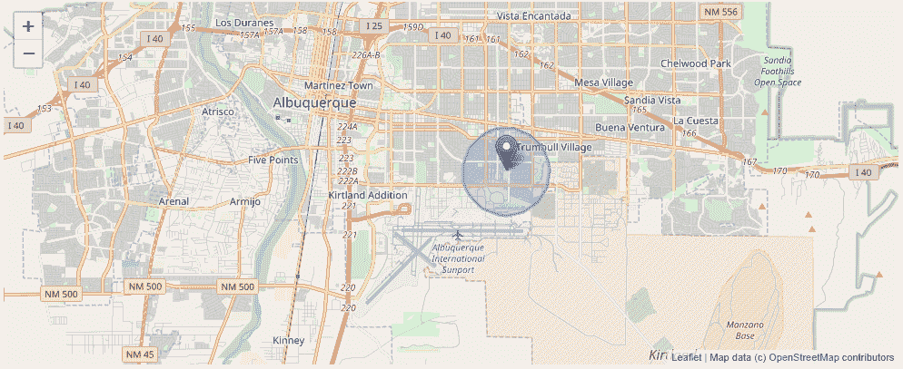
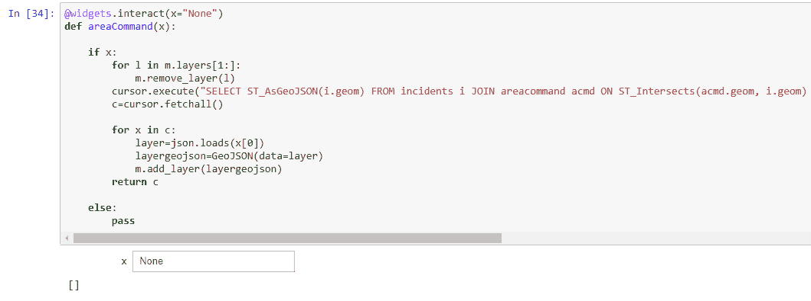
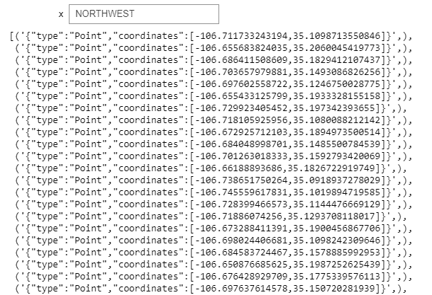
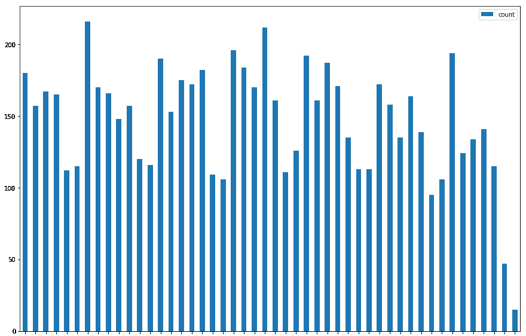
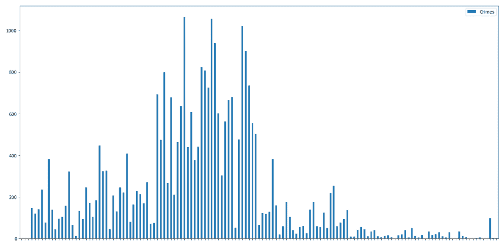
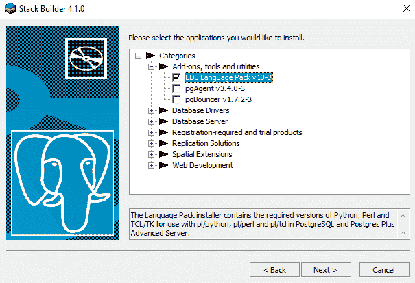

# 第七章：地理数据库的地理处理

在第三章《地理空间数据库简介》中，你学习了如何安装 PostGIS、创建表、添加数据以及执行基本空间查询。在本章中，你将学习如何使用地理空间数据库来回答问题和制作地图。本章将指导你将犯罪数据加载到表中。一旦你的地理数据库用真实世界的数据填充，你将学习如何执行常见的犯罪分析任务。你将学习如何映射查询、按日期范围查询以及执行基本地理处理任务，如缓冲区、点在多边形内和最近邻。你将学习如何将小部件添加到你的 Jupyter 笔记本中，以使查询变得交互式。最后，你将学习如何使用 Python 从你的地理空间查询中创建图表。作为一名犯罪分析师，你将制作地图，但并非所有 GIS 相关任务都是基于地图的。分析师使用 GIS 数据来回答问题和创建报告。高管通常更熟悉图表和图形。

在本章中，你将学习：

+   如何使用空间查询来执行地理处理任务

+   如何向你的表格添加触发器

+   如何映射你的地理空间查询结果

+   如何图形化地理空间查询

+   如何使用 Jupyter 与查询交互并连接小部件

# 犯罪仪表板

要构建一个交互式**犯罪仪表板**，你需要收集数据来构建数据库。然后，你将查询数据并添加小部件，使用户能够修改查询而不需要编写代码。最后，你将图形化和地图化查询结果。

# 构建犯罪数据库

要构建犯罪仪表板的组件，我们将使用阿尔伯克基市的开放数据。阿尔伯克基市有犯罪事件、区域指挥和`beat`的数据集。通过将区域与`事件`结合，你将能够报告两个地理区域。然后，你可以通过使用邻里协会或任何其他边界——人口普查区块、群体或区域，来扩展分析并获取人口信息。

你可以在位于[`www.cabq.gov/abq-data/`](http://www.cabq.gov/abq-data/)的主开放数据网站上找到数据链接。滚动到页面底部并查找“安全数据集”标题。

# 创建表格

我们需要创建三个表格来存储犯罪数据。我们需要一个表格来：

1.  区域指挥

1.  beat

1.  事件

要创建表格，我们需要导入所需的库：

```py
import psycopg2
import requests
from shapely.geometry import Point,Polygon,MultiPolygon, mapping
import datetime
```

程序代码导入`psycopg2`以连接到 PostGIS，`requests`用于调用服务以便你可以获取数据，从`shapely.geometry`中的`Point`、`Polygon`和`MultiPolygon`以使将`GeoJSON`转换为对象更容易，以及`datetime`因为事件有`日期`字段。

在 第三章，*地理空间数据库简介* 中，你创建了一个名为 `pythonspatial` 的数据库，用户名为 `postgres`。我们将在该数据库中创建表。为了填充表，我们将从服务中复制一些字段。服务的层页面底部有一个字段列表。

层的 URL 链接到服务的根页面或层编号。对于事件，层的 URL 为：[`coagisweb.cabq.gov/arcgis/rest/services/public/APD_Incidents/MapServer/0`](http://coagisweb.cabq.gov/arcgis/rest/services/public/APD_Incidents/MapServer/0)。

每个字段都有 `incidents` 层的类型和长度，如下所示：

+   `OBJECTID`（类型：esriFieldTypeOID，别名：对象 ID）

+   `Shape`（类型：esriFieldTypeGeometry，别名：几何形状）

+   `CV_BLOCK_ADD`（类型：esriFieldTypeString，别名：位置，长度：72）

+   `CVINC_TYPE`（类型：esriFieldTypeString，别名：描述，长度：255）

+   `date`（类型：esriFieldTypeDate，别名：日期，长度：8）

**支持的操作**：查询、生成渲染器、返回更新。

使用以下代码创建表：

```py
connection = psycopg2.connect(database="pythonspatial",user="postgres", password="postgres")
cursor = connection.cursor()

cursor.execute("CREATE TABLE areacommand (id SERIAL PRIMARY KEY, name VARCHAR(20), geom GEOMETRY)")

cursor.execute("CREATE TABLE beats (id SERIAL PRIMARY KEY, beat VARCHAR(6), agency VARCHAR(3), areacomm VARCHAR(15),geom GEOMETRY)")

cursor.execute("CREATE TABLE incidents (id SERIAL PRIMARY KEY, address VARCHAR(72), crimetype VARCHAR(255), date DATE,geom GEOMETRY)")

connection.commit()
```

之前的代码首先创建连接并获取 `cursor`。然后创建 `areacommand` 表，包含一个 `name` 字段和一个 `GEOMETRY` 字段。在 **ArcServer** 服务中，区域命令字段长度为 `20`，因此代码创建了一个名为 `name` 的字段作为 `VARCHAR(20)`。接下来的两行创建了 `beats` 和 `incidents` 表，最后代码提交，使更改永久生效。

# 填充数据

在表就绪后，我们需要抓取数据并填充它们。以下代码将抓取区域命令并将其插入到我们的表中：

```py
url='http://coagisweb.cabq.gov/arcgis/rest/services/public/adminboundaries/MapServer/8/query'
params={"where":"1=1","outFields":"*","outSR":"4326","f":"json"}
r=requests.get(url,params=params)
data=r.json()

for acmd in data['features']:
    polys=[]

    for ring in acmd['geometry']['rings']:
        polys.append(Polygon(ring))
    p=MultiPolygon(polys)
    name=acmd['attributes']['Area_Command']

    cursor.execute("INSERT INTO areacommand (name, geom) VALUES ('{}',
    ST_GeomFromText('{}'))".format(name, p.wkt))

 connection.commit()
```

之前的代码使用 `requests` 查询带有参数的 URL。参数只是抓取所有数据（`1=1`），并且抓取参考 `4326` 中的所有字段（`*`）以及作为 `json`。结果使用 `json()` 方法加载到变量 `data` 中。

要了解**环境系统研究协会**（**ESRI**） ArcServer 查询参数，请参阅以下 API 参考：[`coagisweb.cabq.gov/arcgis/sdk/rest/index.html#/Query_Map_Service_Layer/02ss0000000r000000/`](http://coagisweb.cabq.gov/arcgis/sdk/rest/index.html#/Query_Map_Service_Layer/02ss0000000r000000/)

下一段代码是 `for` 循环，它将插入数据。服务返回 `json`，我们需要的数据存储在 `features` 数组中。对于 `features` 数组（`data['features']`）中的每个区域命令（`acmd`），我们将抓取 `name` 和 `geometry`。

`geometry`由多个`rings`组成——在本例中，因为我们的数据由多边形组成。我们需要遍历`rings`。为了做到这一点，代码中有一个另一个`for`循环，它遍历每个`ring`，创建一个多边形，并将其添加到`polys[]`中。当所有`rings`都被收集为多边形时，代码创建一个名为区域命令的单个`MultiPolygon`，并使用`cursor.execute()`将其插入到表中。

SQL 是基本的插入命令，但使用了参数化查询和`ST_GeometryFromText()`。不要被这些附加功能分散注意力。通过以下基本查询构建查询：

```py
INSERT INTO table (field, field) VALUES (value,value)
```

要传递值，代码使用了`.format()`。它传递了字符串名称，并使用 Shapely 将坐标转换为 WKT（`p.wkt`）。

你需要对`beats`表做同样的事情：

```py
url='http://coagisweb.cabq.gov/arcgis/rest/services/public/adminboundaries/MapServer/9/query'
params={"where":"1=1","outFields":"*","outSR":"4326","f":"json"}
r=requests.get(url,params=params)
data=r.json()

for acmd in data['features']:
    polys=[]
    for ring in acmd['geometry']['rings']:
        polys.append(Polygon(ring))
    p=MultiPolygon(polys)

    beat = acmd['attributes']['BEAT']
    agency = acmd['attributes']['AGENCY']
    areacomm = acmd['attributes']['AREA_COMMA']

    cursor.execute("INSERT INTO beats (beat, agency,areacomm,geom) VALUES ('{}','{}','{}',
    ST_GeomFromText('{}'))".format(beat,agency,areacomm,p.wkt))

connection.commit()
```

之前的代码与面积命令的代码相同，只是通过多个占位符（`'{}'`）传递了额外的字段。

最后，我们需要添加`incidents`：

```py
url='http://coagisweb.cabq.gov/arcgis/rest/services/public/APD_Incidents/MapServer/0/query'
params={"where":"1=1","outFields":"*","outSR":"4326","f":"json"}
r=requests.get(url,params=params)
data=r.json()

for a in data["features"]:
    address=a["attributes"]["CV_BLOCK_ADD"]
    crimetype=a["attributes"]["CVINC_TYPE"]
    if a['attributes']['date'] is None:
        pass
    else:
        date = datetime.datetime.fromtimestamp(a['attributes']['date'] / 1e3).date()
    try:
        p=Point(float(a["geometry"]["x"]),float(a["geometry"]["y"]))
        cursor.execute("INSERT INTO incidents (address,crimetype,date, geom) VALUES
        ('{}','{}','{}', ST_GeomFromText('{}'))".format(address,crimetype,str(date), p.wkt))

   except KeyError:
        pass
connection.commit()
```

之前的代码使用`requests`获取数据。然后它遍历`features`。这个代码块有一些错误检查，因为有一些`features`有空白日期，还有一些没有坐标。如果不存在`date`，代码会通过，并使用`try`，`catch`块接受一个`KeyError`，这将捕获缺失的坐标。

现在数据已经加载到表中，我们可以开始查询数据并在地图和图表中展示它。

# 映射查询

在第三章，《地理空间数据库简介》中，你查询了数据库并返回了文本。`geometry`以**已知文本**（WKT）的形式返回。这是我们要求的结果，但我不能通过阅读坐标列表来可视化地理数据。我需要看到它在地图上。在本节中，你将使用`ipyleaflet`和 Jupyter 来将查询结果映射到地图上。

要在 Jupyter 中映射查询，你需要安装`ipyleaflet`。你可以在操作系统的命令提示符中使用`pip`来完成此操作：

```py
pip install ipyleaflet
```

然后，你可能需要根据你的环境启用扩展。在命令提示符中输入：

```py
jupyter nbextension enable --py --sys-prefix ipyleaflet
```

对于代码和`ipyleaflet`的使用示例，你可以在 GitHub 仓库中查看：[`github.com/ellisonbg/ipyleaflet`](https://github.com/ellisonbg/ipyleaflet)

如果你在映射过程中收到错误，你可能需要启用`widgetsnbextension`：

```py
jupyter nbextension enable --py --sys-prefix widgetsnbextension
```

如果你正在运行 Jupyter，你需要重新启动它。

安装并启用`ipyleaflet`后，你可以将查询映射到地图上：

```py
import psycopg2
from shapely.geometry import Point,Polygon,MultiPolygon
from shapely.wkb import loads
from shapely.wkt import dumps, loads
import datetime
import json
from ipyleaflet import (
    Map, Marker,
    TileLayer, ImageOverlay,
    Polyline, Polygon, Rectangle, Circle, CircleMarker,
    GeoJSON
)
```

之前的代码导入了我们需要查询和映射数据的库。让我们按照以下代码建立`connection`并获取`cursor`：

```py
connection = psycopg2.connect(database="pythonspatial",user="postgres", password="postgres")
cursor = connection.cursor()
```

在第三章，《地理空间数据库简介》中，所有的查询都使用了`ST_AsText()`来返回`geometry`。现在我们将映射结果，如果我们将它们作为`GeoJSON`返回，将会更容易。在下面的代码中，你将使用`ST_AsGeoJSON()`来获取`geometry`：

```py
cursor.execute("SELECT name, ST_AsGeoJSON(geom) from areacommand")
c=cursor.fetchall()
c[0]
```

之前的查询获取了`areacommand`表中的所有记录，包括它们的`name`和`geometry`作为`GeoJSON`，然后打印第一条记录（`c[0]`）。结果如下：

```py
('FOOTHILLS',
 '{"type":"MultiPolygon","coordinates":[[[[-106.519742762931,35.0505292241227],[-106.519741401085,35.0505292211811],[-106.51973952181,35.0505292175042],[-106.518248463965,35.0505262104449],[-106.518299012166,35.0517336649125],[-106.516932057477,35.0537380198153],....]]]}
```

`ST_AsText`和`ST_AsGeoJSON`是从 PostGIS 中获取`geometry`的 17 种方法中的两种。有关可用返回类型的完整列表，请参阅 PostGIS 参考文档：[`postgis.net/docs/reference.html#Geometry_Accessors`](https://postgis.net/docs/reference.html#Geometry_Accessors)

现在你已经有了一些`GeoJSON`，是时候创建一个地图来显示它了。为了创建 leaflet 地图，使用以下代码：

```py
center = [35.106196,-106.629515]
zoom = 10
map = Map(center=center, zoom=zoom)
map
```

之前的代码定义了地图的`center`，对于阿尔伯克基，我总是使用 I-25 和 I-40 的交汇点。这个交汇点将城市分为四个象限。然后代码定义了`zoom`级别——数字越高，缩放越近。最后，它打印了地图。

你将看到一个带有`OpenStreetMap`瓦片的空白底图。在 Jupyter 中，当你向地图添加数据时，你可以滚动回地图的原始打印版以查看数据；你不需要每次都重新打印地图。

区域命令的`GeoJSON`存储在变量`c`中。对于每个项目`c[x]`，`GeoJSON`位于位置`1`（`c[x][1]`）。以下代码将遍历`c`并将`GeoJSON`添加到地图中：

```py
for x in c:
   layer=json.loads(x[1])
   layergeojson=GeoJSON(data=layer)
   map.add_layer(layergeojson)
```

之前的代码使用`json.loads()`将`GeoJSON`分配给一个图层。这将使返回的`GeoJSON`字符串在 Python 中成为一个字典。接下来，代码在图层上调用`ipyleaflet GeoJSON()`方法，并将其传递给变量`layergeojson`。最后，在地图上调用`add_layer()`并将`layergeojson`传递过去。在 Jupyter 中还有其他绘制地图的方法；例如，你可以使用 Matplotlib、Plotly 或 Bokeh 来绘制它们。如果你来自网络地图，你可能已经熟悉 Leaflet JavaScript 库，这将使使用`ipyleaflet`变得熟悉。此外，`ipyleaflet`加载底图并提供交互性。

如果你滚动到地图上，你应该看到以下截图：


通过在`cursor.execute()`中更改 SQL 查询，你可以映射`beats`：

```py
cursor.execute("SELECT beat, ST_AsGeoJSON(geom) from beats")
c=cursor.fetchall()
for x in c:
   layer=json.loads(x[1])
   layergeojson=GeoJSON(data=layer)
   map.add_layer(layergeojson)
```

你应该看到`beats`被绘制如下：


你可以为`incidents`做同样的操作，但我们现在先保留这个，因为数据集中有近 30,000 个`incidents`，这会使得我们的地图显得过于拥挤。为了在地图上显示`incidents`，我们将使用空间查询来限制我们的选择。

# 按日期统计事件

限制事件查询结果的一种方法是通过`date`。使用 Python 的`datetime`库，你可以指定一个`date`，然后查询该日期的`incidents`，并将结果的`geometry`作为`GeoJSON`添加到你的地图中：

```py
d=datetime.datetime.strptime('201781','%Y%m%d').date() 
cursor.execute("SELECT address,crimetype,date,ST_AsGeoJSON(geom) from incidents where date =
'{}' ".format(str(d)))
incidents_date=cursor.fetchall()
for x in incidents_date:
    layer=json.loads(x[3])
    layergeojson=GeoJSON(data=layer)
    map.add_layer(layergeojson)
```

之前的代码指定了一个日期（YYYYMD）为 2017 年 8 月 1 日。它查询我们正在使用的 `incidents` 表，其中 `date = d` 并将 `geometry` 作为 `GeoJSON` 返回。然后，它使用您用于区域命令的 `for` 循环和 `beats` 来映射 `incidents`。

当您在 Jupyter Notebook 中创建地图时，进一步的代码块将修改该地图。您可能需要向上滚动以查看地图以查看更改。

您创建的地图现在将看起来像下面的截图：


除了指定一个特定的 `date`，您还可以获取所有 `date` 大于特定日期的 `incidents`：

```py
d=datetime.datetime.strptime('201781','%Y%m%d').date() 
cursor.execute("SELECT address,crimetype,date,ST_AsGeoJSON(geom) from incidents where date >
'{}' ".format(str(d)))
```

或者，您可以查询早于今天的 `interval` 日期：

```py
cursor.execute("select * from incidents where date >= NOW() - interval '10 day'")
```

之前的代码使用 `NOW()` 方法和一个 `10 天` 间隔。通过指定 `>=`，您将获得所有 10 天前以及更近期的犯罪。我在 2017 年 11 月 24 日写了这篇文章，所以结果将是 11 月 14 日（第 14 天）直到今天的所有 `incidents`。

# 多边形内的 `incidents`

我们的犯罪数据库有一个多边形区域——区域命令和 `beats`——以及事件点。为了构建犯罪仪表板，我们希望能够映射特定区域命令或 `beat` 内的 `incidents`。我们可以通过使用 `JOIN` 和 `ST_Intersects` 来实现这一点。以下代码显示了如何操作：

```py
cursor.execute("SELECT ST_AsGeoJSON(i.geom) FROM incidents i JOIN areacommand acmd ON ST_Intersects(acmd.geom, i.geom) WHERE acmd.name like'FOOTHILLS' and date >= NOW() - interval '10 day';")

crime=cursor.fetchall()
for x in crime:
    layer=json.loads(x[0])
    layergeojson=GeoJSON(data=layer)
    map.add_layer(layergeojson)
```

之前的代码从 `incidents` 中选择 `geometry` 作为 `GeoJSON` (`ST_AsGeoJSON(i.geom)` 来自 `incidents`)，其中事件 `ST_Intersects` 多边形区域命令，具体来说，区域命令的名称是 `FOOTHILLS`。代码通过将事件和区域命令表连接起来，其中交集为真。代码通过仅选择过去 10 天的犯罪来限制结果。

代码随后遍历结果并将它们映射，您应该看到下面的截图：


上一张截图将 `incidents` 展示在 `Foothills` 区域命令上。注意所有 `incidents` 都在多边形内。

您可以通过更改 SQL 查询来为特定的 `beats` 执行相同操作。以下代码将映射特定的 `beats`：

```py
cursor.execute("SELECT ST_AsGeoJSON(geom)from beats where beats.beat in ('336','523','117','226','638','636')")

c=cursor.fetchall()
for x in c:
    layer=json.loads(x[0])
    layergeojson=GeoJSON(data=layer)
    map.add_layer(layergeojson)
```

之前的代码使用 `beats.beat` 字段的数组。在 Python 中，数组是 `[]`，但在 SQL 语句中，使用括号。结果是指定的 `beats`。然后，代码将它们映射。

使用相同的指定 `beats`，我们可以通过在 `ST_Intersects()` 上与 `beats` 进行连接来选择 `incidents`，并映射 `incidents`，如下面的代码所示：

```py
cursor.execute("SELECT ST_AsGeoJSON(i.geom) FROM incidents i JOIN beats b ON ST_Intersects(b.geom, i.geom) WHERE b.beat in ('336','523','117','226','638','636') and date >= NOW() - interval '10 day';")

crime=cursor.fetchall()
for x in crime:
    layer=json.loads(x[0])
    layergeojson=GeoJSON(data=layer)
    map.add_layer(layergeojson)
```

之前的代码传递了 `beats` 数组，并通过最后 10 天再次进行筛选。然后，它映射了 `incidents`，如下面的截图所示：


# 缓冲区

您已经从表中映射了数据，但现在您将映射地理处理任务的输出结果——缓冲区。

要编写一个缓冲区示例的代码，我们首先必须创建一个点。以下代码将为我们完成这项工作：

```py
from shapely.geometry import mapping
p = Point([-106.578677,35.062485])
pgeojson=mapping(p)
player=GeoJSON(data=pgeojson)
map.add_layer(player)
```

之前的代码使用 Shapely 创建了一个点。然后使用 `shapely.geometry.mapping()` 将其转换为 `GeoJSON`。接下来的两行代码允许我们在地图上显示它。

PostGIS 允许您将数据发送到数据库并获取数据，无需任何数据都在表中。例如，检查以下代码：

```py
cursor.execute("SELECT ST_AsGeoJSON(ST_Buffer(ST_GeomFromText('{}')::geography,1500));".format(p.wkt))
buff=cursor.fetchall()
buffer=json.loads(buff[0][0])
bufferlayer=GeoJSON(data=buffer)
map.add_layer(bufferlayer)
```

之前的代码使用 `ST_Buffer()` 从 PostGIS 获取一个多边形。`ST_Buffer()` 可以接受一个点地理和半径（以米为单位）来返回多边形。代码将结果包装在 `ST_AsGeoJSON` 中，以便我们可以将其映射。在这个例子中，结果集是一个单独的项目，所以我们不需要 `for` 循环。代码加载结果 `buff[0][0]` 并将其映射。

以下截图显示了之前代码的结果：



现在我们有一个多边形，我们可以用它来选择 `incidents`。以下代码将执行与之前相同的查询，但我们将使用 `ST_AsText` 而不是 `ST_AsGeoJSON`。我们不是映射多边形，而是将其用作多边形操作中点的参数：

```py
cursor.execute("SELECT ST_AsText(ST_Buffer(ST_GeomFromText('{}')::geography,1500));".format(p.wkt))
bufferwkt=cursor.fetchall()
b=loads(bufferwkt[0][0])
```

在之前的代码中，查询结果通过 `loads()` 传递给名为 `b` 的 `shapely` 多边形。现在，您可以将该多边形传递给另一个查询，使用 `ST_Intersects()`，如下所示：

```py
cursor.execute("SELECT ST_AsGeoJSON(incidents.geom) FROM incidents where ST_Intersects(ST_GeomFromText('{}'), incidents.geom) and date >= NOW() - interval '10 day';".format(b.wkt))
crime=cursor.fetchall()
for x in crime:
    layer=json.loads(x[0])
    layergeojson=GeoJSON(data=layer)
    map.add_layer(layergeojson)
```

之前的代码选择与 `buffer` (`b.wkt`) 相交的 `incidents` 作为 `GeoJSON`，并且它们在过去的 10 天内。结果被映射。以下地图显示了之前代码的输出：


# 最近邻

使用 `buffer`，您可以获取到兴趣点指定半径内的所有 `incidents`。但如果你只想获取 5、10 或 15 个最近的 `incidents` 呢？为了做到这一点，您可以使用 `<->` 操作符或 k-最近邻算法。

您可以使用以下代码选择到指定点 `p` 的 `15` 个最近点：

```py
p = Point([-106.578677,35.062485])
cursor.execute("SELECT ST_AsGeoJSON(incidents.geom), ST_Distance(incidents.geom::geography,ST_GeometryFromText('{}')::geography) from incidents ORDER BY incidents.geom<->ST_GeometryFromText('{}') LIMIT 15".format(p.wkt,p.wkt))
c=cursor.fetchall()
for x in c:
    layer=json.loads(x[0])
    layergeojson=GeoJSON(data=layer)
    map.add_layer(layergeojson)
```

之前的代码使用 Shapely 创建了一个点，并在 SQL 查询中使用它。查询选择事故的 `geometry` 作为 `GeoJSON`，然后计算每个事故与指定点的距离。`ORDER BY` 子句、`<->` 操作符和限制子句确保我们按接近程度顺序获取最近的 `15` 个点。

最后一块代码是我们添加结果到地图的代码。以下截图显示了结果。截图中心的是指定的点：


现在您已经知道了如何映射空间查询的结果，让我们添加交互式小部件来修改查询并更改地图，而无需编写新代码。

# 交互式小部件

在本章开头，您学习了如何根据 `date` 查询和映射 `incidents`。在 Jupyter 中，您可以使用交互式小部件更改值。代码将帮助我们了解如何使用 `ipywidgets` 的 `interact` 来插入 `DatePicker`，这样您就可以选择一个 `date` 与笔记本进行交互：


之前的代码导入了 `interact` 和 `DatePicker` 小部件。在最简单的情况下，之前的截图显示了一个装饰器和函数，允许交互式选择一个 `date` 并将其显示为字符串。

当 `DatePicker` 发生变化时，`x`（`DatePicker`）被发送到函数 `theDate(x)`，并且 `x` 被打印为字符串。实际的返回值是 `datetime.date`。

使用 `DatePicker` 小部件，您可以将 `date` 值传递给 SQL 查询，然后映射结果。当 `DatePicker` 发生变化时，您可以清除地图，然后显示新的结果。以下代码将向您展示如何操作：

```py
from ipywidgets import interact, interactive, fixed, interact_manual,DatePicker
import ipywidgets as widgets

@widgets.interact(x=DatePicker())
def theDate(x):

    if x:
        for l in map.layers[1:]:
        map.remove_layer(l)
    nohyphen=str(x).replace("-","")
    d=datetime.datetime.strptime(nohyphen,'%Y%m%d').date() 
    cursor.execute("SELECT ST_AsGeoJSON(geom) from incidents where date 
    = '{}' ".format(str(d))) 
    c=cursor.fetchall()

    for x in c:
        layer=json.loads(x[0])
        layergeojson=GeoJSON(data=layer)
        map.add_layer(layergeojson)
    return len(c)

    else:
        pass
```

之前的代码创建了一个交互式 `DatePicker` 小部件。代码中有一个 `if...else` 语句，因为第一次遍历时，`x` 将是 `none`。`DatePicker` 未被选中，所以我们第一次遍历时 `pass`。

接下来，代码获取地图上的所有图层，并使用 `map.remove_layer()` 删除它们，从第二个（`[1:]`）图层开始。为什么是第二个图层？因为地图上的第一层是 `TileLayer`——基础地图。我们希望它保持原样，只删除从 SQL 查询中添加的标记。

代码随后从 `date` 字符串中删除连字符，并将其转换为 `datetime`。一旦它成为 `datetime`，就可以将其传递给 SQL 查询。

下一个代码块与您在本章中用于将查询结果添加到地图上的代码块相同。

以下截图显示了选择 2017 年 11 月 2 日的 `date`：


当选择 2017 年 11 月 8 日时，地图被重新绘制，并在以下截图显示：


这些截图是在重新选择 `date` 后立即生成的。用户可以使用 `DatePicker` 下拉菜单重新查询您的 PostGIS 数据库中的数据。

在 Jupyter 中，如果您将变量的值设置为字符串或整数，您将得到一个数字滑块或文本框。在以下截图中，装饰器有 `x="None"`，其中 `None` 是一个字符串。文本 `None` 是一个占位符，用于创建文本框。这创建了一个包含单词 `None` 的文本框：



之前的截图中的代码如下所示。该代码将允许您输入区域命令的名称，然后显示该区域命令内的 `incidents`：

```py
@widgets.interact(x="None")
def areaCommand(x):
    if x:
        for l in map.layers[1:]:
            map.remove_layer(l)
        cursor.execute("SELECT ST_AsGeoJSON(i.geom) FROM incidents i 
        JOIN areacommand acmd ON   
        ST_Intersects(acmd.geom, i.geom) WHERE acmd.name like'{}' and 
        date >= NOW() - interval '10 
        day';".format(x))
        c=cursor.fetchall()

        for x in c:
            layer=json.loads(x[0])
            layergeojson=GeoJSON(data=layer)
            map.add_layer(layergeojson)
        return c
    else:
        pass
```

之前的代码从装饰器和字符串开始。这将绘制文本框。`areaCommand()` 函数与前面提到的 `date` 示例作用相同，但将字符串传递给 SQL 查询。它返回查询结果，并在地图上绘制 `incidents`。

以下截图显示了 `NORTHWEST` 的返回值：



以下截图显示了用户在文本框中输入 `NORTHWEST` 时的地图：


在本节中，您已经学习了如何查询您的空间数据以及如何映射结果。在下一节中，您将学习如何图表查询结果。

# 图表

地图是出色的数据可视化工具，但有时条形图也能解决问题。在本节中，您将学习如何使用`pandas.DataFrame`图表您的数据。

`DataFrame`存储二维表格数据（想想电子表格）。数据框可以从许多不同的来源和数据结构加载数据，但我们感兴趣的是它可以从 SQL 查询加载数据。

以下代码将 SQL 查询加载到`DataFrame`中：

```py
import pandas as pd
d=datetime.datetime.strptime('2017101','%Y%m%d').date()
cursor.execute("SELECT date, count(date) from incidents where date > '{}' group by date".format(str(d)))
df=pd.DataFrame(cursor.fetchall(),columns=["date","count"])
df.head()
```

之前的代码选择了`日期`，然后统计了`incidents`中每个`日期`的出现的次数，其中`日期`大于 2017 年 10 月 1 日。然后使用`DataFrame`（SQL，列）填充`DataFrame`。在这种情况下，代码传递`cursor.fetchall()`和`columns=["date","count"]`。使用`df.head()`显示了结果的前五条记录。您可以使用`df.tail()`查看最后五条记录，或使用`df`查看全部。

以下截图显示了`df.head()`：


前面的截图显示，在 2017-10-17 这一天，共有 175 个`事件`。

您可以通过从`pandas`库中调用`plot()`方法来绘制`DataFrame`。以下代码将绘制`df`的条形图：

```py
df.sort_values(by='date').plot(x="date",y="count",kind='bar',figsize=(15,10))
```

之前的代码按`日期`对数据框进行排序。这样，日期在我们的条形图中按时间顺序排列。然后它使用条形图绘制数据，其中*x*轴是`日期`，*y*轴是`计数`。我指定了图形大小以使其适合屏幕。对于较小的数据集，默认图形大小通常效果很好。

以下截图是`plot`的结果：



此图表向我们展示了地图无法展示的内容——犯罪似乎在周五和周六有所减少。

让我们通过使用`beats`的另一个例子来演示。以下代码将按`beats`加载犯罪：

```py
cursor.execute("SELECT beats.beat, beats.agency, count(incidents.geom) as crimes from beats left join incidents on ST_Contains(beats.geom,incidents.geom) group by beats.beat, beats.agency")
area=pd.DataFrame(cursor.fetchall(),columns=["Area","Agency","Crimes"])
area.head()
```

之前的代码从`beats`表中选择了`beat`、`agency`和`incidents`的`计数`。注意`left join`。`left join`将给我们可能没有`incidents`的`beats`。连接基于一个事件位于`beat`多边形内。我们按每个选定的字段进行分组。

查询被加载到`DataFrame`中，并显示`head()`。结果如下截图所示：


注意，我们没有显示没有犯罪的`beats`而不是缺失的`beats`。`beats`太多，无法滚动查看，所以让我们图表`DataFrame`。我们将再次使用绘图函数，传递`x`、`y`、`kind`和`figsize`如下：

```py
area.plot(x="Area",y="Crimes",kind='bar',figsize=(25,10))
```

绘图的结果如下截图所示：



需要查看的数据量很大，但某些`beats`（打击区域）的犯罪率较高。这就是数据帧可以帮助的地方。您可以直接查询`DataFrame`而不是重新查询数据库。以下代码将绘制`beats`的选择：

```py
area[(area['Crimes']>800)].plot(x='Area',y='Crimes',kind='bar')
```

之前的代码将一个表达式传递给区域。该表达式选择`DataFrame`中`Crimes`列的记录，其中值超过`800`；`Crimes`是计数列。结果如下所示：


将您的查询加载到`DataFrame`中将允许您绘制数据，但还可以在不重新查询数据库的情况下切片和再次查询数据。您还可以使用交互式小部件允许用户修改图表，就像您使用地图学习的那样。

# 触发器

在任何数据库中，当数据被插入、更新或删除时，您可以让表启动一个**触发器**。例如，如果用户插入一条记录，您可以使用触发器来确保记录满足某些特定的标准——没有空值。空间数据库允许您使用相同的触发器。您可以使用多种语言创建这些触发器，包括 Python 和 SQL。以下示例将使用`PL/pgsql`。

您可以使用 SQL 表达式创建触发器。以下代码将创建一个触发器以防止输入不完整的事件：

```py
query=('CREATE FUNCTION newcrime()'+'\n'
 'RETURNS trigger' +'\n'
 'AS $newcrime$' +'\n'
 'BEGIN' +'\n'
 'IF NEW.crimetype IS NULL THEN'+'\n'
 'RAISE EXCEPTION' +" '% Must Include Crime Type', NEW.address;"+'\n'
 'END IF;'+'\n'
 'RETURN NEW;'+'\n'
 'END;'+'\n'
 '$newcrime$'+'\n'
 'LANGUAGE \'plpgsql\';'
 )
 cursor.execute(query)
```

之前的代码创建了一个名为`newcrime()`的新函数。该函数是一个`if`语句，检查`NEW.crimetype`是否为空。如果是，则不添加记录，并引发异常。异常将声明`NEW.address`必须包含犯罪类型。假设地址不是空的。

现在您已经有一个函数，您可以创建一个调用该函数的触发器。以下代码展示了如何操作：

```py
query=('CREATE TRIGGER newcrime BEFORE INSERT OR UPDATE ON incidents FOR EACH ROW EXECUTE PROCEDURE newcrime()')
cursor.execute(query)
connection.commit()
```

之前的代码执行了创建触发器的 SQL 语句。它是在`BEFORE INSERT OR UPDATE`时创建的。为了测试触发器，让我们插入一个没有犯罪类型的点。以下代码将尝试输入事件：

```py
p=Point([-106,35])
address="123 Sesame St"
cursor.execute("INSERT INTO incidents (address, geom) VALUES ('{}', ST_GeomFromText('{}'))".format(address, p.wkt))
```

之前的代码创建了一个只有`address`和`geom`的事件。执行之前代码的结果如下所示：


在之前的屏幕截图中，InternalError 指出“123 芝麻街”必须包含犯罪类型。我们的触发器成功阻止了不良数据的输入。为了双重检查，我们可以查询“123 芝麻街”。结果如下所示：


触发器可以用来防止在发生更改时加载不良数据用于电子邮件或短信发送。例如，您可以允许用户输入他们感兴趣的多边形以及他们的电话号码。当数据库中添加新的事件时，您可以检查该事件是否位于多边形内，如果是，则向与多边形关联的电话号码发送短信。

要为触发器安装其他语言，请打开**Stack Builder**并添加以下截图所示的附加组件：



# 摘要

在本章中，你学习了如何使用空间查询来执行地理处理任务。你还学习了如何使用`ipyleaflet`和数据框将查询结果映射和制图。你学习了如何使用 Jupyter 中的交互式小部件修改地图和查询。最后，你了解了触发器的工作原理，并展示了使用触发器进行数据检查的快速示例。

在下一章中，你将学习如何使用 QGIS 执行地理处理任务。你将学习如何使用 QGIS 中已包含的工具箱。你将学习如何编写自己的工具箱，以便你可以使用并与其他 QGIS 用户共享，你还将学习如何使用 QGIS 来映射结果。结果可以保存为 QGIS 项目，或作为 QGIS 的许多空间数据格式之一。
