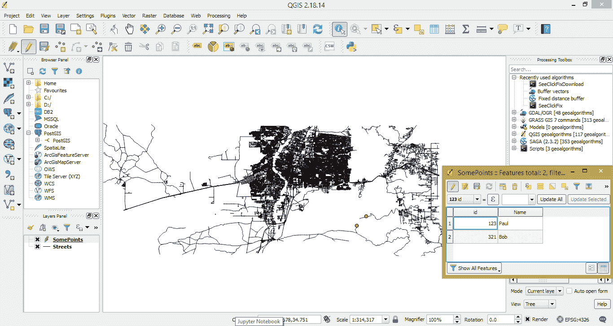
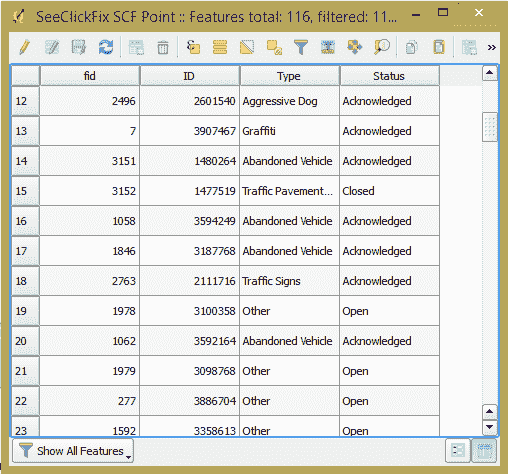

# 自动化 QGIS 分析

本书已向你介绍了如何从命令行、Jupyter 笔记本和 IDE 中使用 Python 执行地理空间任务。虽然这三个工具将允许你完成任务，但很多时候需要使用桌面 GIS 软件来完成工作。

QGIS，一个流行的开源 GIS 应用，提供了桌面 GIS 功能，具有在 Python 控制台工作的能力，以及使用 Python 编写工具箱和插件的能力。在本章中，你将学习如何使用 Python 操作桌面 GIS 数据，以及如何使用工具箱和插件自动化这些任务。

在本章中，你将学习如何：

+   加载和保存图层

+   从 API 数据源创建图层

+   添加、编辑和删除要素

+   选择特定要素

+   调用地理处理函数

+   编写地理处理工具箱

+   编写插件

# 在 Python 控制台工作

QGIS Python 控制台是一个 Python 控制台。你可以执行所有正常的 Python 任务，并且有 QGIS 库的附加优势。从控制台，你可以操作 GIS 数据并在屏幕上显示，或者不显示。

Python 控制台位于 QGIS 工具栏的“插件”菜单下。你也可以通过按*Ctrl*+*Alt*+*P*键在键盘上访问它。控制台通常会打开在主窗口的底部。你可以通过点击标题栏（显示为 Python Console），按住鼠标按钮，并将窗口拖到屏幕上的另一个位置或点击控制台右上角的窗口按钮来取消停靠：


Python 控制台的截图

控制台有清除窗口、导入 GIS 和 QGIS 特定库、运行当前命令（你可以按*Enter*键而不是点击此按钮）、显示编辑器、修改选项和查看帮助文件按钮。编辑器启动一个简化的文本编辑器，你可以用它来编写 Python 代码。它有一些比命令行更多的优点。你可以使用编辑器打开现有的 Python 文件并运行或编辑它们。当你控制台编写代码时，你可以将其保存到文件。在控制台，你需要选择全部内容，然后复制并粘贴到另一个文件中，移除所有输出。编辑器还允许你搜索文本、剪切文本、添加或删除注释，以及检查对象。

现在你已经了解了控制台和编辑器的基础知识，我们可以开始编写一些 Python 代码。

# 加载图层

你可能需要做的第一件事之一是加载一些现有的 GIS 数据。你可以打开几种不同的文件格式。完成此操作的方法是相同的。它是通过创建一个`QgsVectorLayer`并传递数据源参数、要在图层面板小部件中显示的图层名称以及提供者名称来完成的，如下面的代码所示：

```py
import requests 
import json 
from qgis.core import * 
from qgis.PyQt.QtGui import * 
from qgis.PyQt.QtWidgets 
import * 
from qgis.PyQt.QtCore import * 

streets = QgsVectorLayer(r'C:\Users\Paul\Desktop\PythonBook\CHP8\Streets.shp', "Streets","ogr") 
scf = QgsVectorLayer(r'C:\Users\Paul\Desktop\PythonBook\CHP8\SCF.shp', "SeeClickFix","ogr")

```

对于大多数矢量图层，你将使用`"ogr"`作为提供者。然后你可以使用以下代码将图层添加到地图中：

```py
QgsMapLayerRegistry.instance().addMapLayers([scf,streets]) 
```

之前的代码将图层添加到地图注册表中。或者，您可以使用`iface`在单行代码中执行之前提到的代码，如下所示：

```py
streets = iface.addVectorLayer(r'C:\Users\Paul\Desktop\PythonBook\CHP8\Streets.shp', "Streets","ogr") 
scf = iface.addVectorLayer(r'C:\Users\Paul\Desktop\PythonBook\CHP8\SCF.shp', "SeeClickFix","ogr")
```

之前的代码在单步中加载矢量图层并将其添加到注册表中。以下截图显示了在 QGIS 中添加的图层和添加到图层面板的名称：


QGIS 中加载的图层截图

注册表包含地图文档中所有图层的列表。您可以使用以下代码获取加载的图层列表：

```py
QgsMapLayerRegistry.instance().mapLayers() 
```

之前的代码应显示加载了两个图层，`SeeClickFix`和`Streets`：

```py
{u'SeeClickFix20171129100436571': <qgis._core.QgsVectorLayer object at 0x000000002257F8C8>, u'Streets20171129100433367': <qgis._core.QgsVectorLayer object at 0x000000002257F268>}
```

您可以使用`removeMapLayer()`并传递要移除的图层的`id`来从地图中移除图层。`id`是从调用`mapLayers()`的结果中得到的字符串。在这种情况下，加载的图层的`id`是`'Steets20171129092415901'`。以下代码将移除图层：

```py
QgsMapLayerRegistry.instance().removeMapLayer('Streets20171129100433367')
```

之前的代码将图层`id`传递给`removeMapLayer()`。由于数据是在`streets`变量中加载的，因此您也可以传递`streets.id()`而不是键入图层`id`，如下所示：

```py
QgsMapLayerRegistry.instance().removeMapLayer(streets.id()) 
```

两种方法都会导致图层从地图中移除。

# 处理图层

一旦图层加载，您将想要检查图层及其中的要素。对于图层，您可能想知道投影、坐标参考系统以及它有多少个要素。

# 图层属性

要找到坐标参考系统，您可以在图层上使用`crs()`，如下所示：

```py
crs = scf.crs()
```

之前的代码将坐标参考系统分配给变量`crs`。从这里，您可以通过获取以下代码中显示的描述来检查它：

```py
crs.description()
```

之前的代码将返回以下输出：

```py
'WGS 84'
```

对于坐标参考系统的**已知文本**（**WKT**）表示，您可以使用`toWkt()`方法：

```py
crs.toWkt()
```

这将返回以下结果：

```py
'GEOGCS["WGS 84",DATUM["WGS_1984",SPHEROID["WGS 84",6378137,298.257223563,AUTHORITY["EPSG","7030"]],AUTHORITY["EPSG","6326"]],PRIMEM["Greenwich",0,AUTHORITY["EPSG","8901"]],UNIT["degree",0.0174532925199433,AUTHORITY["EPSG","9122"]],AUTHORITY["EPSG","4326"]]'
```

您可以使用`extent()`方法获取图层的边界框，如下所示：

```py
extent = scf.extent()
```

然后，您可以使用`toString()`获取范围字符串，使用`asWktPolygon()`获取 WKT，或者使用`xMinimum()`、`xMaximum()`、`yMinimum()`和`yMaximum()`分别获取每个坐标。方法和它们的输出如下所示：

```py
extent.toString()
u'-106.6649165999999980,35.0744279999999975 : -106.6457526013259951,35.0916344666666973'

extent.asWktPolygon()
'POLYGON((-106.66491659999999797 35.0744279999999975, -106.6457526013259951 35.0744279999999975, -106.6457526013259951 35.09163446666669728, -106.66491659999999797 35.09163446666669728, -106.66491659999999797 35.0744279999999975))'

extent.xMinimum()
-106.6649166

extent.xMaximum()
-106.645752601326

extent.yMinimum()
35.074428 

extent.yMaximum()
35.0916344666667
```

要查看对象上的可用方法，请使用`dir(object)`。

要查看范围对象的方 法，请使用`dir(extent)`。

您可以使用`pendingFeatureCount()`获取图层中的要素数量。以下代码返回`SeeClickFix`图层的要素计数：

```py
scf.pendingFeatureCount()
```

结果是长数据类型，在这种情况下等于 126。

# 要素属性

您可以使用以下代码获取第一个特征：

```py
item=scf.getFeatures().next()
```

之前的代码使用 `getFeatures().next()` 来获取第一个特征并将其分配给 `item` 变量。如果你移除 `.next()`，你会得到一个 `QgsFeatureIterator`，这允许你遍历所有特征。在接下来的示例中，我们将使用单个特征。

要获取 `geometry`，将其分配给一个变量，如下所示：

```py
g = item.geometry()
```

要获取 `type`，可以使用以下代码：

```py
g.type() 
0
```

之前的代码对于点返回 `0`。知道特征是点后，我们可以使用 `asPoint()` 来查看坐标，如下所示：

```py
item.geometry().asPoint()
(-106.652,35.0912)

item.geometry().asPoint()[0]
-106.65153503418

item.geometry().asPoint()[1]
35.0912475585134
```

如果我们在 `streets` 图层上尝试相同的代码，我们会得到类型 `1` 和 `Polyline` 的坐标，如下所示：

```py
street = streets.getFeatures().next().geometry().type()
1

street.geometry().asPolyline() 
[(-106.729,35.1659), (-106.729,35.1659), (-106.729,35.1658), (-106.729,35.1658), (-106.73,35.1658), (-106.73,35.1658), (-106.73,35.1658), (-106.73,35.1658)]
```

要获取特征字段的信息，请使用 `fields()` 如以下代码所示：

```py
item.fields().count()
4
```

你可以通过使用 `.name()` 和 `.typeName()` 为四个字段中的每一个来获取字段名和类型。使用字段 `2`，以下代码将向你展示如何获取名称和类型：

```py
item.fields()[2].name()
u'Type'
item.fields()[2].typeName()
u'String'
```

知道字段名后，你可以获取第一条记录的字段值。或者，你始终可以使用以下代码中的数值索引：

```py
item["Type"]
u'Other'

item[0]
1572.0

item[1]
3368133L

item[2]
u'Other'

item[3]
u'Acknowledged'
```

现在你已经知道如何访问特征的几何和属性，你可以使用 `getFeatures()` 遍历特征。以下代码将遍历特征并 `print` 所有具有 `'Closed'` 状态的记录的 `ID`：

```py
for f in scf.getFeatures():
    if f["Status"]=='Closed':
        print(f["ID"])
```

之前的代码使用 `getFeatures()` 返回一个迭代器。然后它检查 `Status` 属性是否等于 `'Closed'`，如果是，则打印属性 `ID`。输出如下所示：

```py
 3888698
 3906283
 3906252
 3882952
 3904754
 3904463
 3904344
 3904289
 3903243
 3903236
 3902993
```

# 从 PostGIS 绘制图层

QGIS 允许你使用 `QgsDataSourceURI` 类和 `QgsVectorLayer`（URI，名称，提供者（Postgres））来加载 PostgreSQL 图层。为了使其工作，QGIS 需要编译带有 Postgres 支持的版本。在本节中，你将使用 `psycopg2`，正如你在第三章 [42c1ea5a-7372-4688-bb7f-fc3822248562.xhtml] “地理空间数据库简介”和第七章 [4f2388a3-51fc-419f-a827-bbbedbbb6374.xhtml] “地理数据库处理”中学到的。本节中添加特征到图层以及图层到地图的方法将在本章后面学习如何编写工具箱时使用。

# 绘制点

在你学习如何从 PostGIS 加载数据之前，我们首先介绍如何绘制多个点，将它们转换为特征，将它们添加到图层中，然后将图层加载到地图上。以下代码将引导你完成这个过程。

首先创建一个 `memory` 图层，如下所示：

```py
theLayer=QgsVectorLayer('Point?crs=epsg:4326','SomePoints','memory') 
```

之前的代码创建了一个矢量图层并将其分配给变量 `theLayer`。参数是图层的类型和坐标参考系统，图层面板的名称，我们指定它是一个 `memory` 图层。

接下来，你需要创建特征：

```py
from qgis.PyQt.QtCore import *
theFeatures=theLayer.dataProvider()
theFeatures.addAttributes([QgsField("ID", QVariant.Int),QgsField("Name", Qvariant.String)])
```

之前的代码导入了 `qgis.PyQtCore`。您需要这个库来使用 `QVariant`。首先，您调用图层的数据提供者并将其传递给要素。接下来，您将属性及其类型添加到要素中。在以下代码中，您创建了一个 `point` 并将其添加到要素中：

```py
 p=QgsFeature()
 point=QgsPoint(-106.3463,34.9685)
 p.setGeometry(QgsGeometry.fromPoint(point))
 p.setAttributes([123,"Paul"])
 theFeatures.addFeatures([p])
 theLayer.updateExtents()
 theLayer.updateFields()
```

之前的代码创建了一个 `p` 变量并将其设置为 `QgsFeature`。然后创建一个点 `p` 并传递经纬度坐标。要素从 `point` 被分配了几何形状。接下来，您将属性分配给要素。现在您有一个具有几何形状和属性的要素。在下一条语句中，您使用 `addFeature()` 将要素传递到要素数组。最后，您更新图层范围和字段。

将代码块重复第二次，并将 `point` 的坐标设置为不同的值，`(-106.4540,34.9553)`，然后按照本章前面的部分，在以下代码中将图层添加到地图上：

```py
QgsMapLayerRegistry.instance().addMapLayers([theLayer])
```

现在，您将有一个包含两个点的地图，如下面的屏幕截图所示：



从 Python 控制台加载到 QGIS 中的具有属性的两个点

您可以在图层面板中看到图层被命名为 SomePoints。在属性表中，您可以看到两个字段，ID 和 Name，对应两个要素。现在您知道了如何从几何形状创建要素，添加属性，将要素添加到图层，并在地图上显示图层，我们将添加 PostGIS 并循环执行前面提到的过程。

# 从 PostGIS 绘制多边形

在本例中，您将从 PostGIS 数据库中绘制阿尔伯克基警察局区域命令的多边形。您将使用以下代码，并添加一个 PostGIS 查询，一个循环来添加所有要素，以及一个 WKT 函数来绘制几何形状而不是硬编码坐标：

第一步是连接到 PostGIS 数据库。以下代码与您在 第三章，*地理空间数据库简介* 和 第七章，*使用地理数据库进行地理处理* 中使用的代码相同：

```py
 import psycopg2
 connection =  
 psycopg2.connect(database="pythonspatial",user="postgres", 
 password="postgres")
 cursor = connection.cursor()
 cursor.execute("SELECT name, ST_AsTexT(geom) from areacommand")
 c=cursor.fetchall()
```

之前的代码连接到 PostGIS，获取所有带有名称和几何形状的面积命令，并将它们分配给 `c` 变量。接下来，您将创建与早期示例中相同的图层。您将创建一个计数器 `x` 并将其设置为要素的 `ID` 字段：

```py
APD=QgsVectorLayer('Polygon?crs=epsg:4326','AreaCommands','memory') 
APDfeatures=APD.dataProvider() 
APDfeatures.addAttributes([QgsField("ID",QVariant.Int),QgsField("Name", QVariant.String)]) 
x=0
```

之前的代码创建了一个 `polygon` 内存图层，创建了要素并添加了属性。接下来，您将遍历 `cursor`，为每个区域命令创建几何形状并添加属性，然后更新图层的范围和字段：

```py
for acmd in c:
    g=QgsGeometry()
    g=QgsGeometry.fromWkt(acmd[1])
    p=QgsFeature()
    print(acmd[0])
    p.setGeometry(g)
    x+=1
    p.setAttributes([x,str(acmd[0])])
    APDfeatures.addFeatures([p])
    APD.updateExtents()
    APD.updateFields()
```

之前的代码与上一节中点示例中的代码相同。主要区别在于您正在使用 `QgsGeometry.fromWkt(wkt)` 创建多边形。`acmd[1]` 变量是从 PostGIS 获取的 WKT `MultiPolygon` 字符串。

最后，按照以下代码将图层添加到地图上：

```py
QgsMapLayerRegistry.instance().addMapLayers([APD])
```

以下代码将渲染如下截图：


就这样，你有了阿尔伯克基警察局的区域命令多边形，作为一个层在 QGIS 中。接下来，你将学习如何向层中添加、编辑和删除特征。

# 添加、编辑和删除特征

在之前的示例中，你创建了一个空层并添加了字段，然后添加了数据并显示了它。你将需要这样做的时候，大多数情况下，你已经有了一个层，你需要向其中添加数据、编辑数据或从其中删除数据。在本节中，你将学习如何对现有数据执行这些任务。

# 向现有层添加特征

要向层添加数据，你首先需要加载层。首先，加载一些`SeeClickFix`数据的一个子集，如以下代码所示：

```py
scf = iface.addVectorLayer(r'C:\Users\Paul\Desktop\PythonBook\CHP8\SCF.shp', "SeeClickFix","ogr") 
```

之前的代码加载并在地图上显示层。这是本章第一节的相同代码。

你不需要在地图上显示层来与之工作。你可以使用`scf = QgsVectorLayer("C:\Users\Paul\Desktop\PythonBook\CHP8\SCF.shp", "SeeClickFix","ogr")`来加载层。

现在你已经加载了层，你可以使用`capabilitiesString()`来查看提供者允许对数据执行哪些操作。以下代码显示了加载层的结果：

```py
scf.dataProvider().capabilitiesString()

u'Add Features, Delete Features, Change Attribute Values, Add Attributes, Delete Attributes, Rename Attributes, Create Spatial Index, Create Attribute Indexes, Fast Access to Features at ID, Change Geometries'
```

由于`添加特征`是一个功能，你可以像以下代码所示添加一个新特征：

```py
feat = QgsFeature(scf.pendingFields())
feat.setAttribute('fid',911)
feat.setAttribute('ID',311)
feat.setAttribute('Type','Pothole')
feat.setAttribute('Status','Pending')
feat.setGeometry(QgsGeometry.fromPoint(QgsPoint(-106.65897,35.07743)))
scf.dataProvider().addFeatures([feat])
```

之前的代码创建了一个特征并从加载的层中获取字段。然后它设置了每个属性。接下来，它从点设置几何形状。最后，特征被添加到层中。当你调用`addFeatures()`时，有两个返回值可以分配给变量——结果和特征。`addFeature()`的结果将是 true 或 false。返回的特征是特征列表。如果你需要对该特征执行更多操作，保留特征可能很方便。

在自动化过程时，你可以在尝试编辑层之前执行功能检查。

结果是一个新的点和属性表中的记录，如以下截图所示：


添加到层的特征

你可以通过使用列表在单行中传递所有属性来简化之前的代码。以下代码显示了如何做到这一点：

```py
feat.setAttributes([912,312,"Other","Closed"])
```

之前的代码使用列表和`setAttributes()`而不是单个`setAttribute()`来写入属性。如果你想记住在以后阅读代码时字段名称，更冗长的版本更清晰。但如果代码的效率是你的目标，后者版本更合适。

如果我们犯了错误，或者有我们不需要的记录怎么办？下一节将向你展示如何删除一个特征。

# 从现有层中删除特征

删除特征可以通过单行代码完成，格式如下所示：

```py
LayerName.dataProvider().deleteFeatures([list of id])
```

在之前的代码中，你使用`deleteFeatures()`函数和层的`id`。`id`是`feature.id()`，它是一个内部持有的数字，而不是用户分配的属性。要获取特定特征的`id`，你可以像在本章前面学到的那样遍历它们。以下代码显示了如何删除上一节中创建的特征：

```py
for x in scf.getFeatures():
    if x["ID"]==311:
        scf.dataProvider().deleteFeatures([x.id()])
```

之前的代码遍历了层中的特征，寻找具有`ID`为`311`的那个。当找到它时，它使用`deleteFeatures()`函数并通过`x.id()`传递`id`。在这种情况下，`id`是`216`。如果你知道特征的`id`，你可以不通过循环就删除它。

你也可以传递一个 ID 列表，如下面的代码所示：

```py
for x in scf.getFeatures():
    if x["Status"]=='Closed':
        key.append(x.id())
    scf.dataProvider().deleteFeatures(key)
```

之前的代码遍历了层中的特征，寻找所有`'Closed'`情况。当找到其中一个时，它将`id`放入列表`key`中。最后，它调用`deleteFeatures()`函数并传递列表。

# 从现有层编辑特征

你现在可以添加和删除特征，但有时你可能只需要更改属性值。例如，将开放案件状态更改为关闭案件状态。在本节中，你将学习如何修改属性。

通过调用`changeAttributeValues()`函数来修改属性。以下代码修改了一个单个特征：

```py
scf.dataProvider().changeAttributeValues({114:{0:123,1:345,2:"ADA",3:"NEW"} })
```

之前的代码调用了`changeAttributeValues()`函数，并传递了一个字典，其中键是特征`id`，值是一个包含属性的字典—`{id:{0:value, 1:value, n:value}}`。属性字典的键是字段索引。在特征中有四个字段，因此属性字典将有键`0`到`3`。以下截图显示了属性表的变化：


单个特征编辑

之前的示例假设你已经知道要修改的特征的`id`。它还假设你想要修改所有属性值。以下代码将修改多个特征，但每个特征只修改一个属性值—状态：

```py
attributes={3:"Closed"}
for x in scf.getFeatures():
     if x["Type"]=='Other':
         scf.dataProvider().changeAttributeValues({x.id():attributes})
```

在之前的代码中，声明了一个字典，键为`3`（`'Status'`字段），值为`"Closed"`。然后代码遍历层中的特征以寻找匹配项。当找到匹配项时，它更改属性值，但这次只更改状态字段的值。结果反映在截图所示的属性表中如下：



所有其他类型的特征现在状态为打开

在之前的示例中，你已经遍历了特征并根据条件选择它们。在下一节中，你将学习如何突出显示选定的特征以及如何使用表达式而不是条件来选择。

# 使用表达式选择特征

使用表达式，你可以遍历特征并评估返回真（1）或假（0）的表达式。在我们深入探讨表达式之前，让我们选择并突出显示一个特征。选择特征是通过调用`setSelectedFeatures()`并传递一个 ID 列表来完成的。以下代码将选择一个单一的特征：

```py
from qgis.PyQt.QtGui import *
from qgis.PyQt.QtWidgets import *
iface.mapCanvas().setSelectionColor( QColor("red") )
scf.setSelectedFeatures([100])
```

之前的代码导入了`QtGUI`和`Qt.Widgets`。这些是使用`QColor`设置颜色所需的。下一行获取地图画布并设置部分颜色为`红色`。最后，代码选择了一个`id`为`100`的特征。现在地图上会显示为`红色`。

之前的例子假设你想选择一个单一的特征，并且你知道其`id`。这种情况很少见。大多数情况下，你将想要根据某些条件或使用一个表达式来选择。使用`QgsExpression()`，你可以传递一个表达式字符串并对其特征进行评估。以下代码展示了如何操作：

```py
closed=[] 
exp=QgsExpression("Type='Traffic Signs' and Status='Acknowledged'") 
exp.prepare(scf.pendingFields()) 
for f in scf.getFeatures(): 
    if exp.evaluate(f)==1: 
        closed.append(f.id()) 
scf.setSelectedFeatures(closed)
```

首先，之前的代码创建了一个列表，`closed`，用于存储表达式评估为真的 ID。接下来声明了表达式。该表达式检查类型和状态上的两个条件。表达式被准备并传递了图层中的字段。下一行遍历特征。如果表达式为真（`1`），则`id`将被放入列表中。最后，选定的特征被设置为`closed`列表中的 ID。

之前代码的结果如下截图所示：


根据表达式选择的特征

在下一节中，你将学习如何使用 QGIS 附带的工具箱来执行算法和执行地理空间任务。

# 在 Python 中使用工具箱

QGIS 有一个处理库。如果你转到 QGIS 中的处理菜单并选择工具箱，你会看到一个显示工具箱分组的窗口小部件。窗口小部件看起来如下：


处理窗口小部件

你可以通过导入`processing`来访问 Python 中的工具箱。你可以通过以下方式执行代码来查看可用的算法：

```py
import processing
processing.alglist()
```

之前的代码导入了`processing`并调用了`alglist()`方法。结果是所有安装的工具箱中的可用算法。你应该看到以下类似的输出：

```py
Advanced Python field calculator--------------------->qgis:advancedpythonfieldcalculator
 Bar plot--------------------------------------------->qgis:barplot
 Basic statistics for numeric fields------------------>qgis:basicstatisticsfornumericfields
 Basic statistics for text fields--------------------->qgis:basicstatisticsfortextfields
 Boundary--------------------------------------------->qgis:boundary
 Bounding boxes--------------------------------------->qgis:boundingboxes
 Build virtual vector--------------------------------->qgis:buildvirtualvector
 Check validity--------------------------------------->qgis:checkvalidity
 Clip------------------------------------------------->qgis:clip
```

要通过关键字搜索算法，你可以像以下代码那样将一个字符串传递给`alglist()`：

```py
Processing.alglist("buffer")
```

之前的代码传递了一个字符串来缩小结果。输出将包含包含单词`buffer`的几个算法。如下所示：

```py
Fixed distance buffer-------------------------------->qgis:fixeddistancebuffer
 Variable distance buffer----------------------------->saga:shapesbufferattributedistance
 Buffer vectors--------------------------------------->gdalogr:buffervectors
 v.buffer.column - Creates a buffer around features of given type.--->grass:v.buffer.column
```

在本节中，我们将使用`Buffer vectors`算法。要了解算法的工作原理，你可以运行以下代码：

```py
processing.alghelp("gdalogr:buffervectors")
```

之前的代码调用`alghelp()`并传递了在`alglist()`的第二列中找到的算法名称。结果将告诉你执行算法所需的参数及其类型。输出如下所示：

```py
ALGORITHM: Buffer vectors
 INPUT_LAYER <ParameterVector>
 GEOMETRY <ParameterString>
 DISTANCE <ParameterNumber>
 DISSOLVEALL <ParameterBoolean>
 FIELD <parameters from INPUT_LAYER>
 MULTI <ParameterBoolean>
 OPTIONS <ParameterString>
 OUTPUT_LAYER <OutputVector>
```

如果你从 GUI 运行算法，然后打开`\.qgis2\processing\processing.log`，你将看到执行算法使用的参数。复制它们并在你的 Python 代码中使用。

之前的输出显示了运行算法所需的参数。通过使用`runalg()`，你可以执行算法。缓冲矢量在代码中的执行如下：

```py
processing.runalg("gdalogr:buffervectors",r'C:/Users/Paul/Desktop/Projected.shp',"geometry",100,False,None,False,"",r'C:/Users/Paul/Desktop
/ProjectedBuffer.shp') 
layer = iface.addVectorLayer(r'C:\Users\Paul\Desktop\
ProjectedBuffer.shp', "Buffer", "ogr")
```

之前的代码调用`runalg()`并传递我们想要运行的算法的名称，然后是算法所需的参数。在这种情况下：

```py
INPUT_LAYER = Projected.shp
 GEOMETRY = geometry
 DISTANCE = 100
 DISSOLVEALL = False
 FIELD = None
 MULTI = False
 OPTIONS = “”
 OUTPUT_LAYER = ProjectedBuffer.shp
```

然后将输出层添加到地图上。结果如以下截图所示：


缓冲区算法的结果

现在你已经知道了如何使用 Python 控制台和调用算法，让我们编写我们自己的算法。下一节将向你展示如何创建一个可以使用`runalg()`或通过使用 GUI 调用的工具箱。

# 编写自定义工具箱

编写工具箱将允许你自动化几个任务，并将代码作为 GUI 提供给用户，或作为其他开发者可以执行的算法。在本节中，你将学习如何创建一个工具箱并从处理中调用它。

在本章中，你已经学习了如何从文件和 PostGIS 数据库加载数据。在这个例子中，你将学习如何从`SeeClickFix`**应用程序程序接口**（**API**）将数据引入 QGIS。

`SeeClickFix`是一个 311 报告系统，被美国许多城市使用。它包含地理空间数据，并且有一个非常详细且用户友好的 API。

要创建一个新的脚本，请在 QGIS 中打开处理工具箱。这将打开一个编辑器窗口。你将在该窗口中编写你的代码，并使用保存图标保存它。文件名将成为工具箱，位于工具|用户脚本|文件名下。保存文件并命名为`SeeClickFix`。

现在你有一个空的工具箱，我们可以开始添加代码。在代码之前，你需要创建你想要传递给这个算法的参数。每个参数也将成为一个具有参数名称作为标签的 GUI 小部件。`SeeClickFix` API 允许你指定一个城市或地区，并且还可以过滤字符串。以下代码将把这些作为参数添加到我们的算法中：

```py
##City_or_Neighborhood= string City
##Filter=string Nothing
##Output=output vector
```

之前的代码使用双注释符号（`##`），然后是参数名称，参数类型和一个默认值。对于数字和字符串，需要默认值。代码中的第一个参数是城市或地区，它是一个`string`，默认为阿尔伯克基。接下来是过滤关键字，它也是一个`string`，默认为`Nothing`。最后，代码有一个输出，它是一种`output vector`类型。输出将是要添加到地图上或保存到磁盘上的内容。

在这个阶段，你可以在 GUI 中运行工具箱，你将看到以下截图所示的窗口：


工具箱的 GUI。注意每个参数都是一个标签

接下来，您可以导入执行任务所需的库。以下代码将导入`SeeClickFix`工具箱所需的库：

```py
import requests
import json
from qgis.core import *
from qgis.PyQt.QtGui import *
from qgis.PyQt.QtWidgets import *
from qgis.PyQt.QtCore import *
```

之前的代码导入了`qgis`库以及`requests`和`json`。`requests`库将用于进行 API 调用，而`json`将解析请求的响应为`json`。

现在是时候编写一些代码了。首先，您需要获取参数并设置进行 API 调用所需的变量，并且向用户提供一些关于正在发生的事情的信息也是有帮助的。以下代码将向您展示如何操作：

```py
scfcity=City_or_Neighborhood 
searchterm=Filter 
progress.setInfo("Wait while I get data from the API") 
progress.setText("Calling API") 
if searchterm=="None": 
    pagesURL="http://seeclickfix.com/api/v2/issues?per_page=100&amp;amp;place_url="+scf city+"&amp;amp;page=" 
    url="http://seeclickfix.com/api/v2/issues?per_page=100&amp;amp;place_url="+scfcity 
else: 
    pagesURL="http://seeclickfix.com/api/v2/issuesper_page=100&amp;amp;place_url="+scfc ity+"&amp;amp;search="+searchterm+"&amp;amp;page="
    url="http://seeclickfix.com/api/v2/issues?per_page=100&amp;amp;search="+searchterm+"&amp;amp;place_url="+scfcity 
```

之前的代码将参数传递给变量。然后，我使用了一个全局变量`progress`，这是 QGIS 提供的，并调用`setInfo()`和`setText()`方法来告诉用户正在发生什么。`progress`是 QGIS 的一部分。`setInfo()`方法在 GUI 的文本区域中显示文本。`setText()`方法更改进度条上标签的文本，并将其添加到 GUI 的文本区域中。

接下来，代码检查过滤器参数是否仍然是`None`，如果是，它将**统一资源定位符**（**URL**）作为没有过滤器参数的字符串分配给 API，并使用城市或区域参数。如果有过滤器，将分配不同的 URL 以进行 API 调用。

现在，您已经准备好进行一些 GIS 特定的设置。以下代码将为您开始：

```py
crs=QgsCoordinateReferenceSystem("epsg:4326")
scf=QgsVectorLayer('Point?crs=epsg:4326','SeeClickFix','memory')

fields = QgsFields()
fields.append(QgsField("ID", QVariant.Int))
fields.append(QgsField("Type", QVariant.String))
fields.append(QgsField("Status", QVariant.String))

writer = processing.VectorWriter(Output, None, fields.toList(),
QGis.WKBPoint, crs)
```

之前的代码在 WGS 84 坐标系中设置坐标参考系统。然后，它创建一个`memory`层，并分配字段。最后，它创建一个向量`writer`并将输出参数、编码（`None`）、字段、几何类型和坐标参考系统传递给它。现在您可以根据代码进行 API 调用：

```py
r = requests.get(url).text
rJSON=json.loads(r)
pages=rJSON['metadata']['pagination']['pages']
records=rJSON['metadata']['pagination']['entries']
progress.setInfo("Grabbing "+str(records) +" Records")
count=1

for x in range(1,pages+1):
    progress.setText("Reading page "+str(x))
    pageData=requests.get(pagesURL+str(x)).text
    pageDataJSON=json.loads(pageData)
```

之前的代码使用`requests`库进行 API 调用。它为页数和返回的记录数分配变量。使用`setInfo()`方法，代码告诉用户正在处理多少`records`。然后，它遍历每一页并从`page`中加载项目。它告诉用户当前正在读取哪一页。

现在，代码将把页面上的每个`record`解析为一个特征并发送到向量`writer`。您不需要将输出添加到映射中。如果您从 GUI 运行它，处理将为您处理这一点。如果您从 Python 运行它，您将获得层的文件路径，可以自行加载。以下代码将向您展示如何操作：

```py
for issue in pageDataJSON['issues']:
try:
    p=QgsFeature()
    point=QgsPoint(issue['lng'],issue['lat'])
    p.setGeometry(QgsGeometry.fromPoint(point))
    p.setAttributes([issue["id"],issue["request_type"]
    ["title"],issue["status"]])
    writer.addFeature(p)
    progress.setPercentage((count/float(records))*100)
    count+=1
except:
    pass
del writer
```

之前的代码创建了一个特征，并将从 API 传递的几何形状传递到一个`point`。然后，它传递属性并将完成后的特征发送到向量`writer`。使用`progress.setPercentage()`更新 GUI 上的`progress`条。该方法接受一个`float`。在这个例子中，百分比是处理的`records`数除以总记录数。最后，您删除了`writer`。

您的工具箱已经完整，请保存它。现在用户可以从 GUI 运行它，或者您可以从 Python 调用它。以下代码将展示如何从 Python 调用它并将结果添加到地图中：

```py
processing.alghelp("script:seeclickfix")

 ALGORITHM: SeeClickFix
 City_or_Neighborhood <ParameterString>
 Filter <ParameterString>
 Output <OutputVector>

out=processing.runalg("script:seeclickfix","Albuquerque","Juan Tabo",None)
```

之前的代码调用`alghelp()`方法来显示我们新的算法和参数。接下来，它使用`runalg()`运行算法并将结果分配给`out`变量。打印`out`变量显示一个包含`Output`键和临时矢量路径的字典，如下所示：

```py
out

{'Output': u'C:\\Users\\Paul\\AppData\\Local\\Temp\\processingca7241c6176e42458ea32e8c7264de1e\\014bc4d4516240028ce9270b49c5fcaf\\Output.shp'}
```

您可以将矢量分配给图层并将其添加到地图中，或者您可以遍历要素并对其进行其他操作，如下所示：

```py
out = iface.addVectorLayer(str(a["Output"]), "SeeClickFix","ogr")
for feature in out.getFeatures():
    Do something...
```

将图层添加到地图的结果将类似于以下截图。沿 Juan Tabo 街道报告的所有`SeeClickFix`事件：


工具箱的结果

# 摘要

在本章中，您学习了如何在 QGIS 中使用 Python。您从学习加载图层并在地图上显示它的基本知识开始，然后进步到添加、编辑和删除要素。您学习了如何选择要素、突出显示选择，以及如何使用表达式。然后，我们利用预构建的地理处理工具，您学习了如何使用处理调用工具箱算法。最后，您学习了如何编写自己的工具箱。

在下一章中，您将学习如何使用 Python 与 Esri 工具结合。您将学习如何在浏览器中使用 Jupyter Notebooks 与基于云的数据集交互，以及如何使用 Python 的 Esri API 进行基本的地理空间分析和创建 ArcGIS Online 网络地图。
