# 第九章：ArcGIS API for Python 和 ArcGIS Online

本章将介绍用于 Python 和 ArcGIS Online 的 ArcGIS **应用程序编程接口** (**API**)。ArcGIS API for Python 是一个用于处理地图和地理空间数据的 Python 库。此 API 可以使用 `conda` 本地安装，并与 Esri 的云 GIS 进行交互，无论是 ArcGIS Online (SaaS) 还是 Portal for ArcGIS，后者是一款提供本地云 GIS 部署的服务器产品。该 API 为使用 Python 进行网络地图脚本编写提供了现代解决方案，并且与 Jupyter Notebooks 兼容良好。

本章将涵盖以下主题：

+   介绍 ArcGIS API for Python

+   安装 API

+   使用 API 与不同的 Esri 用户账户

+   介绍 API 的某些模块

+   与 API 的地图小部件交互

+   搜索和显示矢量数据

+   显示和地理处理栅格数据

+   为使用 ArcGIS Online 设置个性化账户

+   在 ArcGIS Online 中发布和管理内容

# 介绍 ArcGIS API for Python 和 ArcGIS Online

以 ArcGIS 平台而闻名的地理空间软件公司 Esri 将 Python 集成到其 ArcGIS 桌面软件及其继任者 ArcGIS Pro 中。Esri 开发的第一个 Python 站点包是 `ArcPy` 站点包，它是一组 Python 模块，提供了所有现有的以及扩展的 ArcMap 和 ArcGIS Pro 功能。现在 Python 可以用作脚本和编程语言来自动化涉及大量与 **图形用户界面** (**GUI**) 交互的重复性任务。通过 `ArcPy`，这些任务可以通过 Python 脚本、插件或工具箱来执行。

Python 成功地与 ArcGIS 桌面结合使用，而 GIS 本身正迈向云端——不仅包括地理空间数据，还包括软件本身。Esri 通过各种云环境提供方案，使用公共、私有或混合云服务，为组织提供了实现这一点的可能性。在本章中，我们将使用 ArcGIS Online，这是一个允许用户创建、存储和管理地图、应用程序和数据的 **软件即服务** (**SaaS**) 提供方案。在过去的几年里，ArcGIS Online 已成为 Esri ArcGIS 系统的关键组成部分和有机组成部分。其用户可以通过可用于网页、智能手机和平板电脑的现成工具，在组织内或全球范围内共享地图。

# 一个 Pythonic 网络 API

为了让用户能够与其 GIS 数据、服务等进行交互，Esri 开发了一个全新的 Pythonic 网络 API，称为 **ArcGIS API** for Python，它包含一组用于构建软件和应用程序的子程序定义、协议和工具。它是建立在 ArcGIS **表示状态传输** (**REST**) API 之上，以及 ArcGIS API for JavaScript。此相同的 API 也用于（在后台）Python API 中显示 2D 和 3D 网络地图。

GIS 用户可以下载免费提供的 ArcGIS API for Python，并使用它来管理他们的云 GIS 环境，无论是 ArcGIS Online、ArcGIS Portal 还是 ArcGIS Enterprise（以前称为 ArcGIS Server）产品系列。该 API 需要 Python 3.5 或更高版本。可以使用 API 与`ArcPy`站点包一起使用，但这不是必需的，API 也可以在没有`ArcPy`（或任何基于桌面的 GIS 产品）的情况下工作，甚至在没有 ArcGIS Online 或 Portal 环境的情况下。

该 API 是为比当前 Python 用户更广泛的受众编写的，Python 用户可能会用它来进行数据处理或地图设计——除了脚本功能外，该 API 还允许进行 GIS 可视化与分析、空间数据/内容管理以及组织管理。该 API 仍在开发中，自 2006 年 12 月首次发布以来，API 已经经历了几次更新，当前版本为写作时的 1.4 版。每个新版本都引入了新功能。使用 API 与使用任何其他 Python 库类似——您通过`import`语句导入 API，然后可以立即开始使用，应用标准的 Python 语法和命令。当您在 Web 环境中使用它来访问 Web GIS 时，最好使用基于浏览器的 Jupyter Notebook 应用。

# 安装 API

API 可以通过不同的方式安装。最简单的方法是使用`conda`。如果您是第一次安装 API，您可能想通过 Anaconda3 为 API 创建一个单独的虚拟环境，因为 API 有许多依赖项。安装 API 的最新可用版本很重要，因为它还将确保您安装了最新的`conda`版本以及 API 的依赖项。要使用`conda`安装 API，请在终端中运行以下命令：

```py
conda install -c esri arcgis
```

命令中的`-c`代表一个频道（这是一个在线仓库）。当在终端中运行此命令时，您将被要求安装一系列依赖项。以下截图显示了部分列表。请注意，`NumPy`和`pandas`也被安装了，这两个库来自`SciPy`堆栈，用于数据科学。API 本身是列表中的第一个包，称为`arcgis`：

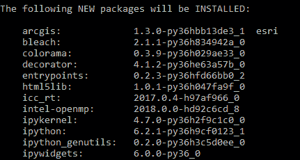

# 测试 API

安装完成后，ArcGIS 包可以在`C:\UserName\Anaconda3\pkgs`文件夹中的名为`arcgis`的单独文件夹中找到，版本号位于其中。如果您已经在计算机上安装了 API，您可能需要将其更新到最新版本以确保一切正常工作，例如地图小部件：

```py
conda upgrade -c esri arcgis
```

写作时的 API 最新版本是 1.4，需要 Python 3.5 或更高版本。您可以通过以下方式在终端中打开 Jupyter Notebook 应用来测试您的安装，或者直接从 Anaconda3 运行应用程序：

```py
jupyter notebook
```

然后，运行以下代码并检查是否打开了一个地图窗口，并且没有收到错误信息：

```py
In: from arcgis.gis import GIS
    my_gis = GIS()
    my_gis.map()
```

如果您已安装 ArcGIS Pro，则可以使用 Pro 内部的 `conda` 环境使用 Python 软件包管理器安装 API。查找 Python 标签并单击“添加包”按钮。搜索`arcgis`，单击安装，并接受条款和条件。

# 故障排除

如果由于某种原因，您无法在本地上安装和使用 API，您还可以尝试在云中运行的 API 的沙盒版本 [`notebooks.esri.com/`](https://notebooks.esri.com/)。通过点击此 URL，将打开一个浏览器窗口，其中包含 Jupyter Notebook，您可以在其中创建自己的笔记本，运行代码示例，并使用 API 的所有功能。

要查看显示所有模块、带有描述的类和示例的在线 API 参考，请参阅 [`esri.github.io/arcgis-python-api/apidoc/html/index.html`](http://esri.github.io/arcgis-python-api/apidoc/html/index.html)。

对于 API 更新、发行说明等更多信息，请参阅 [`developers.arcgis.com/python/guide/release-notes/`](https://developers.arcgis.com/python/guide/release-notes/)。

所有关于 API 的信息的主要页面可以在此找到。这是一个极好的资源，拥有大量的文档、用户指南和 API 参考：[`developers.arcgis.com/python/`](https://developers.arcgis.com/python/)。

# 验证您的 Esri 用户账户

现在我们已经在我们的机器上安装了 API，是时候讨论如何结合不同的 Esri 用户账户使用它了。正如我们之前所说的，API 是为了管理和与位于云环境中的 Web GIS 交互而创建的。为了能够使用 API 并与这个 Web 或云 GIS 交互，我们需要某种额外的 Esri 用户账户来与这个 Web GIS 建立连接。您可以将其比作从您的计算机连接到 FTP 服务器或远程 Web 服务器并使用用户名和密码（或令牌）执行登录过程。此过程确保服务器和客户端之间的安全连接以及访问正确的内容。

# 不同的 Esri 用户账户

以下 Esri 用户账户可以通过 ArcGIS API for Python 访问 ArcGIS Online：

1.  一个匿名用户账户，它允许您访问 ArcGIS Online 而无需传递任何用户信息。这是一个快速测试一些基本功能的解决方案，但不会提供带有个性化账户的高级功能。我们将在本章接下来的三个动手练习中的两个中介绍此选项。

1.  一个 ArcGIS Online 组织账户（或 Portal for ArcGIS 账户）。这需要订阅 ArcGIS Online 或 Portal for ArcGIS（付费）。此选项提供了可能的最大功能，但在此处未涵盖。

1.  ArcGIS Enterprise 试用账户。这个选项是免费的，并提供你创建地图和发布内容所需的服务积分。这个试用账户仅持续 21 天，之后必须转移到付费账户才能继续使用。设置试用账户将在我们进一步进行时进行说明。

1.  一个免费的 Esri 开发者账户。这个账户是 ArcGIS 开发者计划的一部分，为你提供 50 个服务积分，用于开发、测试个人应用程序，以及使用 ArcGIS Online 等。这个选项将在我们进一步进行时进行说明。

1.  最后，还有创建公共 ArcGIS 账户并使用网络浏览器登录 ArcGIS Online 的选项。使用这些登录详情，你现在可以使用 API 连接到 ArcGIS Online，但功能有限。这个选项是在 API 的 1.3 版本中添加的，这里没有进行说明。

总结前面提到的内容，我们已经涵盖了多个不同的用户账户，以便使用 API 访问 ArcGIS Online。个性化账户比匿名账户提供了更多的功能。我们将在本章后面的练习中使用这两种类型。现在让我们看看 API 是如何组织成不同的模块以及它们提供的功能。

# Python ArcGIS API 的不同模块

就像其他 Python 库一样，API 有 Python 模块、类、函数和类型，可以用来管理和处理 ArcGIS 平台信息模型中的元素。由于 API 旨在满足需要自己独特工具的不同用户群体，因此 API 被组织成 13 个不同的模块。在这里不需要涵盖所有模块，但本章最重要的模块如下所述：

1.  GIS 模块：这是最重要的模块，是访问托管在 ArcGIS Online 或 ArcGIS Portal 中的 GIS 的入口点。GIS 模块允许你在 GIS 中管理用户、组和内容。在这个上下文中，GIS 指的是一个用于创建、可视化和共享地图、场景、应用程序、图层、分析和数据的协作环境。

1.  特征模块：此模块代表 API 的矢量数据部分。矢量数据通过此模块表示为特征数据、特征层或特征层的集合。单个数据元素由特征对象表示，而`FeatureSet`、`FeatureLayer`和`FeatureCollection`等类则代表特征数据的不同分组。

1.  栅格模块：此模块包含用于处理栅格数据和影像层的类和栅格分析函数。而特征模块代表 API 的矢量数据组件，栅格模块则是栅格数据组件。此模块使用`Imagerylayer`类来显示影像服务的数据，并提供实时图像处理的栅格函数。可以使用地图小部件来可视化影像层。

1.  地理处理模块：此模块用于导入具有地理处理功能的工具箱，这些功能不是 API 的一部分，但可通过 ArcGIS Online 获得。这些地理处理工具箱作为原生 Python 模块导入，以便您可以调用导入模块中可用的函数来调用这些工具。API 本身还包括丰富的地理处理工具集合，这些工具可通过定义空间数据类型的其他模块获得。

地理处理工具是一个在 GIS 数据上执行操作的函数，从输入数据集开始。然后在该数据集上执行操作，最后将操作的结果作为输出数据集返回。

1.  小部件模块：它提供了用于可视化 GIS 数据和分析的组件，包括 MapView Jupyter Notebook 小部件。我们将使用此小部件来可视化地图和图层。这不是唯一的可视化模块——独立的映射模块提供了不同的映射层和 2D/3D 映射和可视化组件。

如您所见，该 API 为不同任务和用户提供了广泛的功能模块，包括发布地图数据、执行地理空间分析和数据处理。所有模块都使用 Python 作为脚本语言来管理 GIS 数据和功能。现在，让我们开始使用 API，探索一些基本功能，然后再进行更高级的任务。

# 练习 1 - 导入 API 和使用地图小部件

现在是时候开始使用 API 了。按照说明操作，在 Jupyter Notebook 应用程序中打开一个新的 Notebook，您可以在其中访问 API。输入并运行以下代码。我们将首先导入 API，以便我们可以使用其模块、函数和类：

```py
In:   import arcgis
In:   from arcgis.gis import GIS
```

代码的第二行可以分解如下——`arcgis.gis`指的是`arcgis`模块中的一个子模块（`gis`）。被导入的（`GIS`）是一个包含用于显示地理位置、可视化 GIS 内容和分析结果的地图小部件的`GIS`对象。接下来，我们将通过将相同名称的变量分配给它来创建一个`GIS`对象，但拼写为小写：

```py
In:   gis = GIS()
```

这是一个匿名登录的示例，因为我们没有在`GIS()`括号中传递任何登录详情。现在，我们将通过创建一个地图对象并将其分配给一个变量来使用地图小部件，然后可以查询该变量以在 Notebook 中显示小部件：

```py
In:   map1 = gis.map('San Francisco')
      map1
```

注意，您必须在新的一行上重复并运行变量名，才能显示地图。在您的 Jupyter Notebook 应用程序中，将打开一个地图窗口，显示旧金山市的 2D 彩色地图：

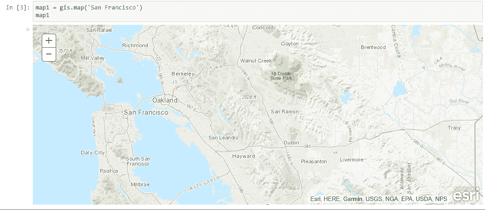

您可以通过`zoom`属性和传递一个整数来调整地图的缩放级别：

```py
In:   map1.zoom = 5
```

没有缩放级别值的地图显示将为您提供默认的缩放值 2。较大的值将显示较小的区域，并使用更大的比例显示更多细节。这个地图是 ArcGIS Online 提供的几个底图之一，用作映射数据的背景。我们可以查询我们当前显示的底图类型：

```py
In:   map1.basemap

Out: 'topo'
```

您可能想知道如何访问所有对象属性。这可以通过键入对象名称，然后按点号并按 *Tab* 键来完成。然后，一个包含所有可用属性的下拉列表窗口将显示出来：

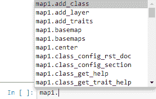

我们可以在之前提到的截图中看到 `basemap` 属性被列出。有关特定属性的更多信息，请选择您想要的属性，然后跟上一个问号。然后，一个信息窗口将在屏幕底部打开，显示更多信息：

```py
In:   map1.basemaps?
```

`basemaps` 属性也可以直接查询，并返回一个包含每个值的新行的列表对象：

```py
In:   map1.basemaps

Out: 'dark-gray',
    'dark-gray-vector',
    'gray', ...
```

我们可以通过更改我们的底图，通过在底图属性中传递一个可用的选项（注意单数形式）来使用此窗口的信息，如下所示：

```py
In: map1.basemap = 'satellite'
    map1
```

我们可以看到我们的底图现在显示了旧金山的卫星图像：

![

接下来，我们将查询我们地图小部件中显示的地图的**坐标参考系统**（**CRS**）。此信息可以通过范围属性查询，它还会显示我们 `extent` 的四个坐标：

```py
In: map1.extent

Out: {'spatialReference': {'latestWkid': 3857, 'wkid': 102100},
 'type': 'extent',
 'xmax': -13505086.994526163,
 'xmin': -13658266.799209714,
 'ymax': 4578600.169423444,
 'ymin': 4517450.546795281}
```

让我们看看输出结果。我们的底图是一个网络地图的例子，以 **JavaScript 对象表示法**（**JSON**）格式分享 2D 地图。网络地图是 Esri 规范的一个例子，允许不同的应用程序、API 和 SDK 创建、编辑和显示地图。这些网络地图可用于不同的 Esri 应用程序，例如在本例中的 ArcGIS Online。网络地图规范是 JSON**，**这确实是我们通过查看其使用括号和键值对的结构来观察到的输出情况。

回到空间参考，这些信息存储在位于网络地图 JSON 层次结构顶层的 `spatialReference` 对象中。在我们的例子中，我们可以看到空间参考被设置为 `latestWKid: 3857` 和 `wkid: 102100`。通过查阅 Esri 在 [`developers.arcgis.com`](http://developers.arcgis.com) 提供的在线网络地图规范，我们可以看到两者都指的是 Web Mercator 投影，这是网络地图应用程序的事实标准，并被大多数主要在线地图提供商使用。

这标志着我们 API 的第一个动手练习的结束，我们学习了如何导入 API、创建地图对象、显示对象属性的信息以及使用地图小部件。在我们下一个练习中，我们将开始使用来自 ArcGIS Online 的内容并将其添加到我们的地图小部件中。我们将使用个性化账户，这使我们能够创建自己的网络地图并在网上托管它们。在我们能够这样做之前，您需要创建一个个性化的 ArcGIS Online 账户，我们将在下一部分介绍。

# 创建个性化的 ArcGIS Online 账户

在接下来的练习中，您需要一个名为的用户账户用于 ArcGIS Online。这将使您能够创建自己的地图内容，将网络地图保存在 ArcGIS Online 中您自己的内容文件夹中，与他人共享内容，等等。我们将介绍两种免费选项来完成这项任务。最简单、最快的方法是创建一个免费的 ArcGIS 开发者账户，该账户包含使用 ArcGIS Online 一些功能所需的服务积分。还有可能创建一个免费的 ArcGIS Online 组织试用账户，它提供了更多选项。这里将介绍这两种选项。

要创建一个 ArcGIS 开发者账户，打开浏览器窗口并导航到[`developers.arcgis.com/sign-up`](https://developers.arcgis.com/sign-up)。填写左侧的字段（名字、姓氏和电子邮件）：

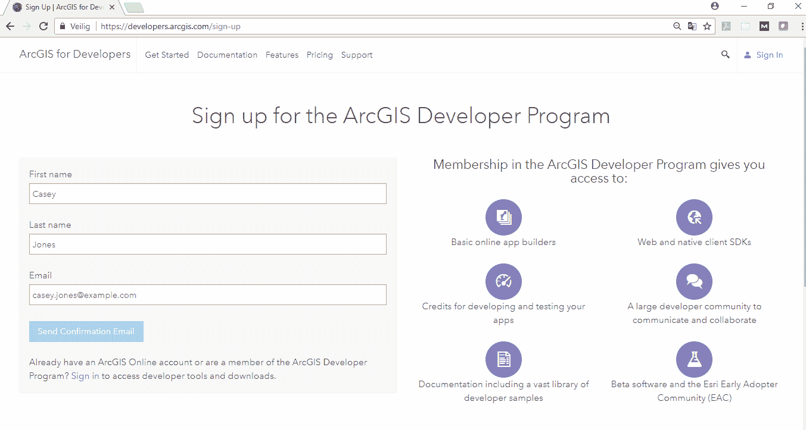

接下来，您将收到一封确认邮件，该邮件将发送到您在线输入的电子邮件地址。邮件中包含一个您需要点击以激活账户的 URL。之后，您可以设置账户并选择用户名和密码。这个用户名和密码可以用于通过 ArcGIS API for Python 登录 ArcGIS Online。您还将被分配一个账户 URL 路径，类似于`http://firstname-lastname.maps.arcgis.com`。此 URL 路径也是使用 ArcGIS API for Python 登录 ArcGIS Online 所必需的。

接下来，我们将解释如何创建一个公共的 ArcGIS 账户。导航到[www.arcgis.com](http://www.arcgis.com)并点击橙色免费试用->按钮：


接下来，您将被引导到一个新的页面，其中包含一个需要填写您个人详细信息的表单。之后，您可以创建一个 ArcGIS Online 账户。用户名和密码可以用作 ArcGIS Online 的登录详情。

# 练习 2 – 搜索、显示和描述地理空间内容

在接下来的练习中，我们将搜索在线内容，将其添加到我们的地图中，并描述数据。最后，我们将直接将您的地图小部件保存到 ArcGIS Online 中您个人内容文件夹内的网络地图中。这是 API 1.3 版本的新功能，使得创建网络地图变得非常容易。我们将使用的内容是一个包含加利福尼亚州索诺马县自行车道特征层的文件。此内容可通过 ArcGIS Online 获取。我们可以使用 API 搜索内容、引用它并将其添加到我们的 Jupyter Notebook 应用程序中的地图小部件中。

首先，我们将使用个人账户登录到 ArcGIS Online。阅读代码并按照以下说明操作：

```py
In:   import arcgis
In:   from arcgis.gis import GIS
      gis = GIS()
```

在前面的代码中，您需要在第三行中紧随大写`GIS`之后的括号内输入您自己的个人详细信息，从个人 URL、用户名和密码开始。如果您已创建免费的 ArcGIS 开发者账户，这看起来可能像`gis` = `GIS(“https://firstname-lastname.maps.arcgis.com”, “username”, “password”)`。如果您已注册 ArcGIS Online 的试用版，第一个 URL 将是[`www.arcgis.com`](https://www.arcgis.com)，后面跟着您的用户名和密码。

接下来，我们将打开索诺马县的地图，这是我们感兴趣的区域：

```py
In:   map = gis.map("Solano County, USA")
      map.zoom = 10
      map
```

要搜索我们组织之外的具体内容，请使用以下包含特定搜索词查询的代码。在这里，我们使用了“在”和“附近”旧金山的“trails”：

```py
In: search_result = gis.content.search(query="san francisco trail", 
    item_type="Feature Layer", outside_org=True)
    search_result
```

在前面的代码中，我们正在使用 GIS 对象的 content 属性来搜索内容。使用个性化账户，我们指定我们想要搜索我们组织之外的数据。我们的查询正在寻找类型为`"Feature Layer"`的旧金山附近的路径。接下来，通过重复变量名返回结果。在这种情况下，输出看起来像以下列表，但可能因读者而异。为了简洁起见，仅显示了前三个搜索结果：

```py
Out: <Item title:"National Park Service - Park Unit Boundaries"       
     type:Feature
     Layer Collection owner:imrgis_nps>,

     <Item title:"National Park Service - Park Unit Centroids" 
     type:Feature Layer
     Collection owner:imrgis_nps>,

     <Item title:"JUBA_HistoricTrail_ln" type:Feature Layer Collection 
      owner:bweldon@nps.gov_nps>,…
```

项目以列表形式返回，每个项目包括其标题、类型和所有者名称。如果我们使用 Jupyter Notebook 应用程序，我们也可以以不同的方式显示此项目列表：

```py
In:   from IPython.display import display
      for item in search_result:
          display(item)
```

现在，我们的搜索结果返回了缩略图图片、标题和描述。标题也是一个超链接，它将带您到 ArcGIS Online 网页，您可以在其中查看内容并咨询元数据。我们对以下项目感兴趣，该项目在要素集合中显示了索诺马县的自行车道。这是一个要素层和表的集合，这意味着我们必须找到一种方法来访问正确的要素层并将其添加到我们的地图小部件中：

![图片

现在，我们希望在地图上显示来自此要素集合的自行车道数据。为此，我们需要在我们的代码中引用数据源。我们可以这样做：

```py
In:   bike_trails_item = search_result[8]
      bike_trails_item.layers
```

代码的工作原理如下，第一行创建了一个变量，该变量引用了我们的搜索结果列表中包含自行车路径服务层的项目。接下来，我们将使用此项目的图层属性来查看该项目包含多少图层，在这种情况下有两个图层，分别索引为`0`和`1`。

接下来，我们想要两个图层的名称。使用`for`循环，我们可以`print`图层名称：

```py
In:   for lyr in bike_trails_item.layers:
          print(lyr.properties.name)

Out:  BikeTrails
      Parks
```

我们可以看到自行车路径存储在第一层。接下来，我们将在这个服务层中引用这个图层，通过将其分配给`name bike_trails_layer`变量。我们还将通过重复我们新创建的变量来打印要素层 URL。

```py
In: bike_trails_layer = bike_trails_item.layers[0]
In: bike_trails_layer
```

使用`pandas`数据框，我们可以可视化随图层一起提供的属性表：

```py
In:   bike_df = bike_trails_layer.query().df
In:   bike_df.head()
```

使用`head()`函数限制输出到前五行，我们得到以下输出：

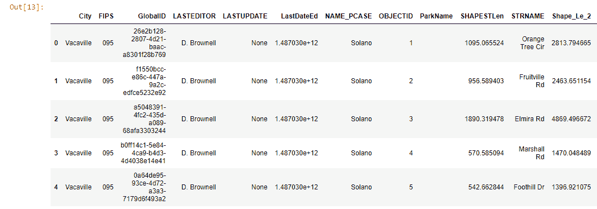

现在，我们可以将图层添加到地图中并查看结果：

```py
In:   map.add_layer(bike_trails_layer)
      map
```

自行车路径将在地图小部件中的底图上显示。如果你看不到路径，你可能需要放大和缩小几次，以及将地图向右平移，直到你看到以下结果，显示不同的自行车路径作为底图上的线段：

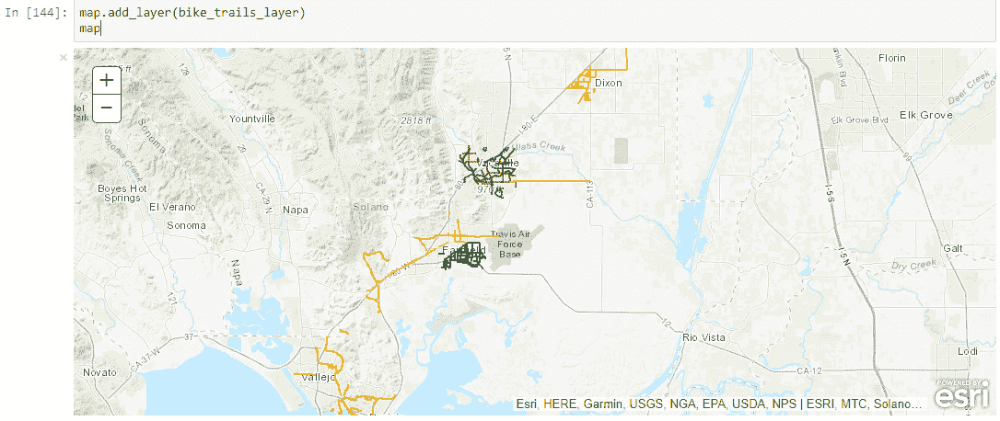

现在，我们将从这个地图小部件创建自己的网络地图。这是 API 的一个新功能，在 ArcGIS Online 中创建和托管自己的网络地图非常强大。这不是创建网络地图的唯一方法，但作为如何使用 API 来完成此操作的示例。通过导入`WebMap`类，我们可以通过一个名为`wm`的变量创建这个类的实例，该变量将存储我们的网络地图。使用`save`函数，我们可以简单地将其作为网络地图保存到我们自己的组织内容文件夹中：

```py
In:   from arcgis.mapping import WebMap
      wm = WebMap()
      web_map_properties = {'title':'Bike Trails ', 
      'snippet':'This map service shows bike trails in Solano County', 
      'tags':'ArcGIS Python API'}
      web_map_item = wm.save(item_properties=web_map_properties)
      web_map_item
```

Python 返回我们可以立即通过点击蓝色下划线 URL 在线访问的项目，在提供登录凭据以访问我们的 ArcGIS Online 组织页面后：


我们可以在概述标签中编辑元数据，而在设置标签中可以删除它（向下滚动以查看标记为红色的此选项）。

返回到我们的 Jupyter Notebook，我们可以使用 Python 显示服务 URL 的信息，返回的输出以 JSON 格式显示，这里只显示前三个结果：

```py
In:   bike_trails_layer.properties
```

通过使用`for`循环，我们可以显示字段名称：

```py
In:   for field in bike_trails_layer.properties['fields']:
          print(field['name'])

Out: OBJECTID
     SHAPESTLen
     STRNAME
      ...
```

你也可以访问要素层的单个属性，例如`extent`：

```py
In:   bike_trails_layer.properties.extent

Out:  {
     "xmin": 6485543.788552672,
     "ymin": 1777984.1018305123,
     "xmax": 6634421.269668501,
     "ymax": 1958537.218413841,
     "spatialReference": {
     "wkid": 102642,
     "latestWkid": 2226
      }
    }
```

这完成了第二个练习，我们学习了如何搜索内容，将其添加到我们的地图小部件中，并描述我们正在处理的数据。现在，我们将查看栅格模块，看看我们如何可视化和处理栅格影像。

# 练习 3 – 使用栅格数据和 API 的地理处理函数

对于这个练习，我们将查看栅格模块。我们将以 Landsat 8 卫星图像的形式处理栅格数据，并查看描述数据和使用来自 ArcGIS Online 的地理处理功能的方法。像往常一样，我们将从导入`arcgis`包和`gis`模块开始，这次使用匿名登录：

```py
In: import arcgis
    from arcgis.gis import GIS
    from IPython.display import display
    gis = GIS()
```

接下来，我们将搜索内容——我们将指定我们正在寻找图像图层，这是用于栅格模块的图像数据类型。我们将结果限制在最多`2`个：

```py
In: items = gis.content.search("Landsat 8 Views", item_type="Imagery 
    Layer",
    max_items=2)
```

接下来，我们将按以下方式显示项目：

```py
In: for item in items:
        display(item)
```

输出显示了以下两个项目：


我们对结果中的第一个项目感兴趣。我们可以如下引用它：

```py
In: l8_view = items[0]
```

现在，让我们通过单击蓝色 Landsat 8 视图 URL 来更深入地研究这个项目。它将您带到包含数据集描述的网页。查看波段编号及其描述。API 提供了在此 landsat 层上可用的栅格功能，我们将在下一分钟介绍。首先，我们将通过项目的图层属性访问图像层：

```py
In: l8_view.layers
```

接下来，我们可以如下引用和可视化图层：

```py
In: l8_lyr = l8_view.layers[0]
    l8_lyr
```

输出显示了覆盖整个地球的图层：

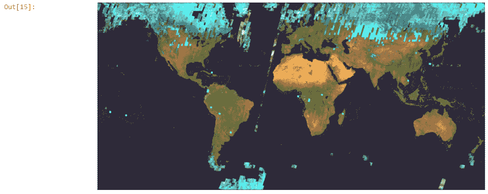

当图像图层作为 Python 对象可用时，我们可以打印所有可用的属性，如前所述，以 JSON 格式返回：

```py
In: l8_lyr.properties
```

可以使用以下代码打印出更具视觉吸引力的图像图层项目描述：

```py
In: from IPython.display import HTML
In: HTML(l8_lyr.properties.description)
```

使用`pandas`数据框，我们可以更详细地探索不同的波长波段：

```py
In:   import pandas as pd
In:   pd.DataFrame(l8_lyr.key_properties()['BandProperties'])
```

输出现在以`pandas`数据框对象的形式呈现：

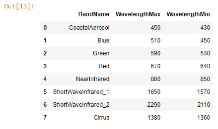

现在，我们将进入栅格功能部分。API 提供了一组用于图像层并在服务器端渲染并返回给用户的栅格功能。为了最小化输出，用户需要指定一个位置或区域，其屏幕范围将用作栅格功能的输入。栅格功能也可以链接在一起，并在大型数据集上工作。以下`for`循环显示了可用于此特定数据集的所有可用栅格功能：

```py
In: for fn in l8_lyr.properties.rasterFunctionInfos: 
        print(fn['name'])
```

输出在单独的一行上显示了所有可用的栅格功能：

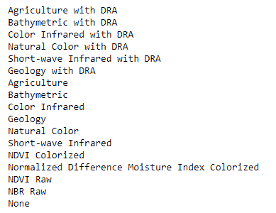

此信息也包含在我们之前打印出的完整属性列表中。接下来，我们将在显示西班牙马德里地区的地图上尝试一些这些栅格功能。我们首先创建地图的一个实例：

```py
In: map = gis.map('Madrid, Spain')
```

然后，我们将把我们的卫星图像添加到地图小部件中，我们可以使用它进行各种栅格功能：

```py
In: map.add_layer(l8_lyr)
    map
```

输出将看起来像这样：

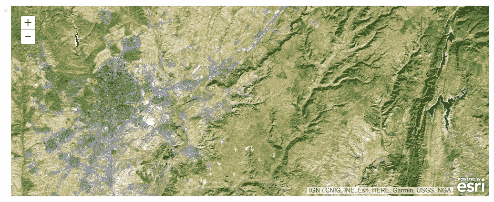

现在，我们需要从栅格模块导入`apply`函数，以便应用栅格功能：

```py
In: from arcgis.raster.functions import apply
```

首先，我们将创建一个具有动态范围调整的自然色图像，使用波段 4、3 和 2：

```py
In: natural_color = apply(l8_lyr, 'Natural Color with DRA')
```

按照以下方式更新地图，看看它与之前有何不同：

```py
In: map.add_layer(natural_color)
```

输出将看起来像这样：


我们将重复这个程序，但这次我们将可视化农业地图：

```py
In: agric = apply(l8_lyr, 'Agriculture')
In: map.add_layer(agric)
```

这个栅格函数使用 6、5 和 2 波段，分别代表短波红外-1、近红外和蓝色。我们可以看到我们的研究区域显示了以下三个类别——茂盛的植被是亮绿色，受压的植被是暗绿色，裸露区域是棕色。我们可以在我们的地图小部件中验证这些结果：

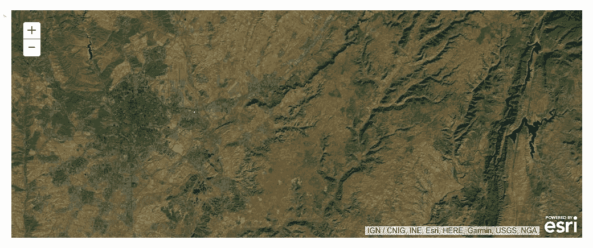

正如你所见，栅格模块能够快速在云中对栅格影像进行地理处理，并快速返回和显示结果在你的屏幕上。这只是模块的许多栅格功能之一，还有更多值得探索。这结束了我们查看如何搜索栅格影像、显示它以及使用 ArcGIS Online 的地理处理功能，通过 ArcGIS API for Python 的栅格模块。

# 摘要

本章介绍了全新的 ArcGIS API for Python，它是基于 Python 3.5 构建的。你学习了如何使用 API、Jupyter Notebooks 以及存储在基于云的 ArcGIS Online 系统中的数据处理。我们涵盖了 API 如何组织成不同的模块、如何安装 API、如何使用地图小部件、如何使用不同的用户账户登录 ArcGIS Online，以及如何处理矢量数据和栅格数据。使用一些 API 模块，我们学习了如何使用 Python API 进行基本的地理空间分析和创建 ArcGIS Online 网络地图。

下一章将介绍用于与云数据交互的 Python 工具，用于搜索和快速数据处理。特别是，它侧重于 Elasticsearch 和 MapD GPU 数据库的使用，这两个数据库都基于 AWS 云基础设施。读者将学习如何创建用于地理空间搜索、地理定位数据处理、地理定位数据的云服务，以及如何使用 Python 库与这些服务交互。
