# 使用 GPU 数据库进行地理处理

随着多核 GPU 的出现，新的数据库技术已被开发出来以利用这项改进的技术。MapD 是一家位于旧金山的初创公司，是这些公司的一个例子。他们的基于 GPU 的数据库技术在 2017 年开源，并可在云服务（如**Amazon Web Services**（**AWS**）和 Microsoft Azure）上使用。通过结合 GPU 的并行化潜力与关系数据库，MapD 数据库提高了基于数据的数据库查询和可视化的速度。

MapD 创建了一个 Python 3 模块，`pymapd`，允许用户连接到数据库并自动化查询。这个 Python 绑定允许地理空间专业人士将 GPU 数据库的速度集成到现有的地理空间架构中，为分析和查询添加速度提升。MapD 的两个核心产品（开源社区版本和商业企业版本）都由`pymapd`支持。

除了 Python 模块，MapD 还为其数据库技术增加了地理空间功能。现在支持存储点、线和多边形，以及提供距离和包含功能的空间分析引擎。此外，MapD 还开发了一个可视化组件**Immerse**，它允许快速构建分析仪表板，数据库作为后端。

在本章中，我们将涵盖以下主题：

+   在云中创建 GPU 数据库

+   使用 Immerse 和 SQL 编辑器探索数据可视化

+   使用 `pymapd` 将空间和表格数据加载到数据库中

+   使用 `pymapd` 查询数据库

+   将云数据库集成到 GIS 架构中

# 云地理数据库解决方案

地理空间数据的云存储已成为许多 GIS 架构的常见部分。无论是用作本地解决方案的备份，还是取代本地解决方案，或者与本地解决方案结合以提供基于内部网络的系统互联网支持，云都是 GIS 未来的重要部分。

随着 ArcGIS Online、CARTO、MapBox 和现在 MapD 的出现，支持地理空间数据的云数据存储选项比以往任何时候都多。每个都提供可视化组件和不同类型的数据存储，并且将以不同的方式与您的数据和软件集成。

虽然 ArcGIS Online 也提供独立选项（即直接数据上传），但它与 ArcGIS Enterprise（以前称为 ArcGIS Server）集成，以使用存储在本地地理数据库上的企业 **REpresentational State Transfer** （**REST**） 网络服务。ArcGIS Online 建立在 **Amazon Web Services** （**AWS**） 之上，所有的服务器架构都隐藏在用户视线之外。企业集成需要高级别的许可（成本），这包括许多云令牌（即信用额度），并且云账户内的存储和分析可以使用大量这些令牌。

CARTO 提供云 PostGIS 存储，允许上传地理空间数据文件。随着 Python 包 CARTOframes（在第十四章中介绍，*云地理数据库分析和可视化*）的发布，云数据集可以通过脚本上传和更新。使用 Python，CARTO 账户可以成为企业解决方案的一部分，该解决方案维护最新的数据集，同时允许它们通过构建应用程序快速部署为定制网络地图。CARTO 提供两个付费账户级别，它们具有不同的存储级别。

MapBox 专注于为移动应用创建定制基础图的地图工具，但它还提供云数据存储和地图创建工具，如 MapBox GL，这是基于**Web 图形库**（**WebGL**）的 JavaScript 库。使用新的 MapBox GL—Jupyter 模块，数据可以通过 Python 访问。

虽然 MapD 提供与上述类似解决方案，但在许多方面有所不同。它有一个开源的数据库版本（MapD Core 社区版），可以在本地或云上使用，并为大型客户提供企业版。虽然 MapD Core 具有关系数据库模式并使用 SQL 进行查询，就像传统的 RDBMS 一样，但它使用 GPU 来加速查询。MapD Core 可以部署在 AWS、Google Cloud Platform 和 Microsoft Azure 上。MapD 也可以安装在无 GPU 的服务器上，但这会降低其相对于其他地理数据库的有效速度提升。

所有地理数据库都支持 Jupyter Notebook 环境进行数据查询，但 MapD 将它们集成到 Immerse 可视化平台内的 SQL EDITOR 中。当使用`pymapd`上传数据时，MapD 使用 Apache Arrow，并支持`INSERT`语句，同时允许使用 Immerse 数据导入器（包括 SHPs、GeoJSONs 和 CSVs）加载数据。

# 大数据处理

对于数据科学分析和地理空间分析，遇到大数据的情况比以往任何时候都更常见。MapD 在检索行和将数据返回给客户端时速度极快，这使得它对于驱动实时数据库或对大型数据集进行查询非常有用。

MapD 在处理大数据集方面比 CPU 密集型数据库提供了惊人的加速。由于每个 GPU 卡包含的内核数量众多，并行进程可以运行得更快。这意味着数十亿的数据集可以在毫秒内查询和分析。

# MapD 架构

MapD 的架构是 MapD Core（基于 GPU 的数据库）、MapD Immerse（数据可视化组件）和其他支持数据科学操作和地理空间应用的相关技术和 API 的组合：

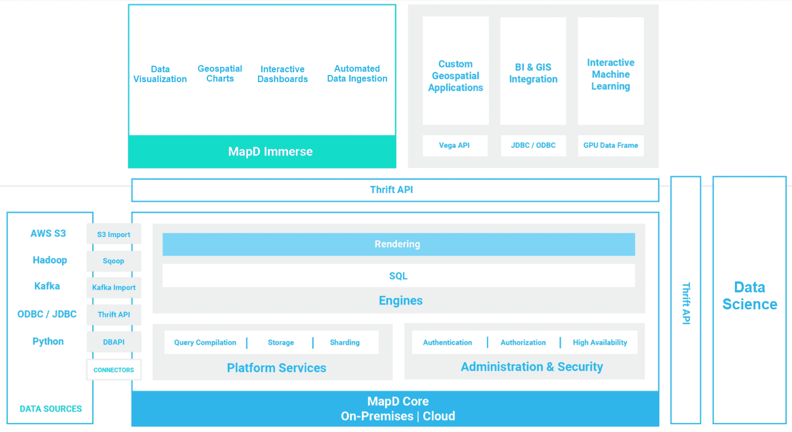

利用快速的查询速度和 API，以及 `pymapd`，组件可以一起使用或单独使用来创建地理数据库和可视化。存在多个数据导入器的驱动程序，以帮助数据迁移，而 Thrift API 可以提供数据导出或与软件包和 Immerse 通信。

# 云端与本地与混合

由于许多不同类型的组织依赖于地理数据库，架构选项也相当多样。虽然一些组织已经将所有数据迁移到云端，将数据和工具存储在不同的服务器上，但大多数组织仍然维护一个本地地理数据库作为企业系统。

第三种架构风格，在基于云和本地地理数据库之间取得平衡，也非常受欢迎。这允许数据库备份始终由可用的云服务支持，并且数据服务可以超出组织防火墙的限制，同时限制暴露给互联网的数据集和服务。

这些解决方案之间的平衡取决于对处理速度和存储成本的需求。MapD 可以本地安装和维护，也可以在云端托管，满足各种组织需求。查询和数据处理的快速速度允许以与本地存储数据集相同的方式使用云数据资源。使用 `pymapd`，数据集可以轻松地在云端镜像，同时本地维护，并且可以通过比较本地存储的数据与云端数据集成到地理空间分析中。

您组织选择的技术结构将取决于您的需求和产生以及从其他来源摄取的数据集的大小。MapD 可以成为该结构的一部分，也可以是整个 GIS，无论是在本地、云端还是两者兼而有之，都能以极快的速度支持空间 SQL 查询。

# 在云端创建 MapD 实例

要探索使用 MapD Core 和 MapD Immerse 在本地和云端混合使用 GIS 的可能性，让我们在云端创建一个实例（虚拟服务器）。这个云数据库将本地访问，使用 `pymapd` 执行查询和数据管理任务。

使用 AWS，我们可以创建一个支持 GPU 的服务器。虽然我在这里使用 AWS，但 MapD 可以加载到其他云服务中，如 Google Cloud 和 Microsoft Azure，也可以本地安装。这些其他云服务也提供社区版。

# 查找 AMI

我将在 p2.xlarge AWS 实例上使用 MapD 社区版，这是平台的开源版本。社区版的预构建**亚马逊机器镜像**（**AMIs**）是可用的。虽然核心数据库技术是免费的，但 p2 实例仍将产生与之相关的费用，并且不包含在 AWS 免费层中。我选择了 p2.xlarge 而不是推荐的 p2.8xlarge，将每小时成本从 7 美元降低到 1 美元。对于软件的低成本或免费评估，请下载并安装到虚拟机或专用的 Linux 服务器上：

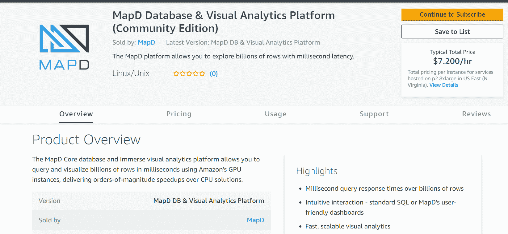

对于本地安装，从本网站下载社区版（编译版和源代码）：[`www.mapd.com/community/`](https://www.mapd.com/community/).

# 开设 AWS 账户

创建数据库实例需要 AWS 账户。访问 [aws.amazon.com](http://aws.amazon.com) 并注册账户。此账户需要一个与账户关联的信用卡或借记卡。

在此处探索安装 MapD AWS AMI 的官方文档：

[`www.mapd.com/docs/latest/getting-started/get-started-aws-ami/`](https://www.mapd.com/docs/latest/getting-started/get-started-aws-ami/).

# 创建密钥对

生成密钥对将允许您使用安全外壳或 SSH 连接远程访问 AWS 实例。要从 EC2 仪表板生成密钥对，请在向下滚动后从左侧面板选择“网络 & 安全”组中的“密钥对”：

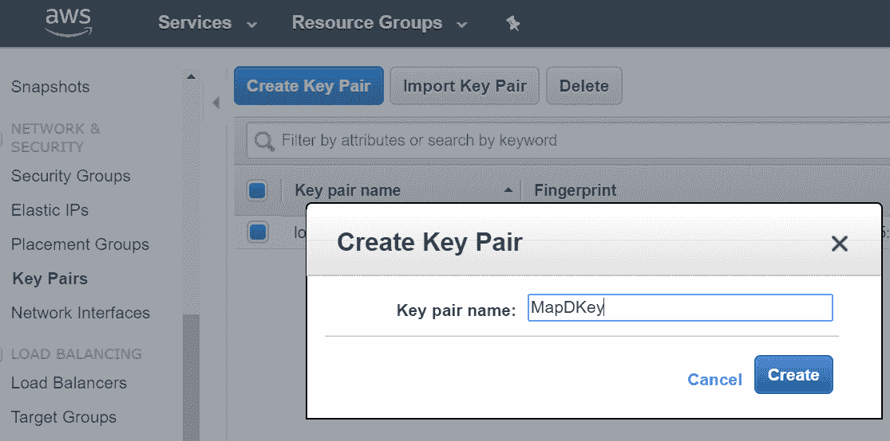

给密钥对命名并点击“创建”以将私钥（以 `.pem` 扩展名）保存在您计算机或 U 盘上的安全位置。每次您使用 SSH 连接到实例时都需要此密钥。相应的公钥（以 `.pub` 扩展名）保存在您的 AWS 账户中，并在连接到实例时与私钥匹配。

# 启动实例

账户设置完成后，从 AWS 管理控制台进入 EC2。在 EC2 仪表板中，选择“启动实例”以打开 AWS 实例选择工具：

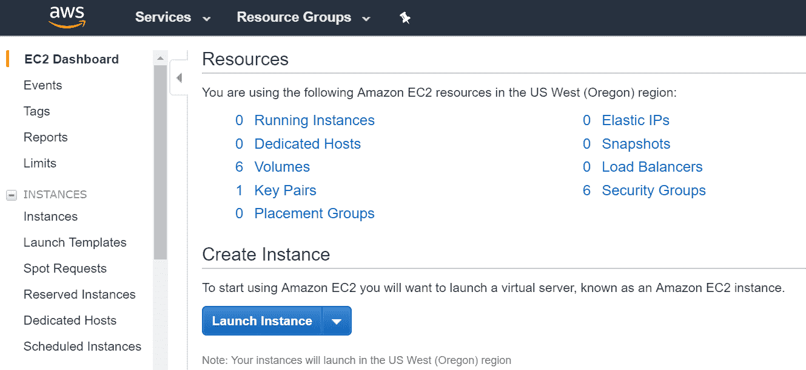

# 选择版本

在左侧面板点击 AWS Marketplace 后，在市场中搜索 MapD 数据库。在搜索框中输入 `MapD` 会显示两个版本。我选择了 MapD 核心数据库社区版，因为 MapD 软件是免费提供的：

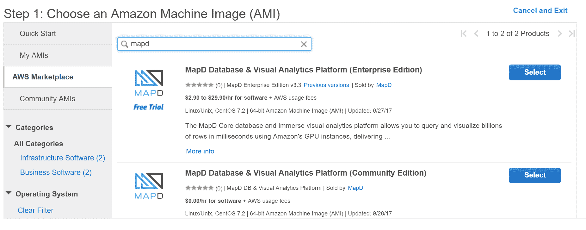

通过点击“选择”按钮选择感兴趣的版本，然后转到“实例类型”菜单。

# 搜索实例

在可用的实例类型中，只有少数受支持。这些 p2 实例提供不同级别的 CPU、内存和 GPU。我出于成本考虑选择了 p2.xlarge 实例，尽管 p2.8xlarge 更适合生产级计算：

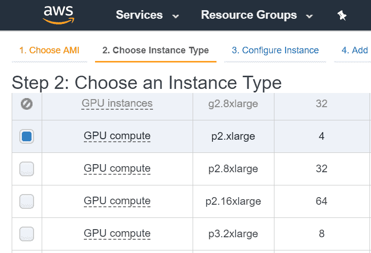

选择实例类型后，有一些菜单描述了实例的详细信息，并允许在 AWS 生态系统中进行备份存储。根据您组织的需要设置这些参数。

# 设置安全组

安全组设置很重要，因为它们控制谁可以访问实例，以及他们可以从哪里访问。源标签允许您设置可以连接到实例的机器，使用 IP 地址来确定谁被允许连接：

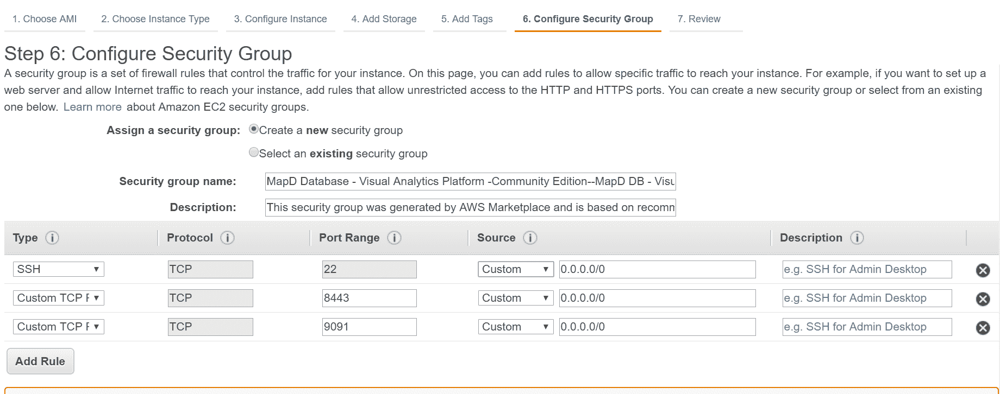

为了安全起见，调整 SSH 的源以匹配我的 IP。这可以在稍后更新，以允许从任何地方连接，即整个互联网。一旦完成，将现有的密钥对分配给实例，以确保它可以用于直接连接到命令行 MapD Core。

# Immerse 环境

实例设置完成后，可以使用浏览器访问已安装的 Immerse 环境。在 Immerse 环境中，可以导入数据，创建仪表板，并执行 SQL 查询：

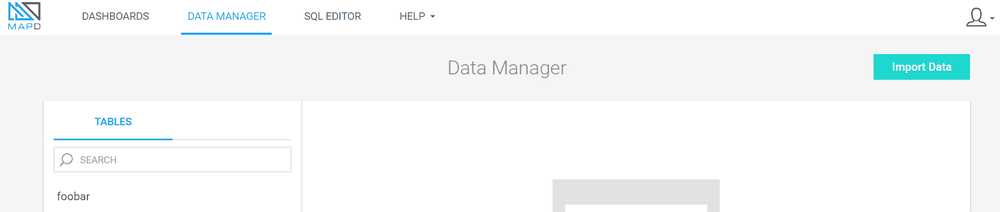

# 登录 Immerse

在 EC2 仪表板中，确保 MapD 实例已启动。复制实例的 IP 地址（公共 IP 地址，而不是私有 IP 地址）和实例 ID，这些信息位于 EC2 仪表板中实例列表下方。确保 MapD 实例被突出显示，以确保实例 ID 正确：

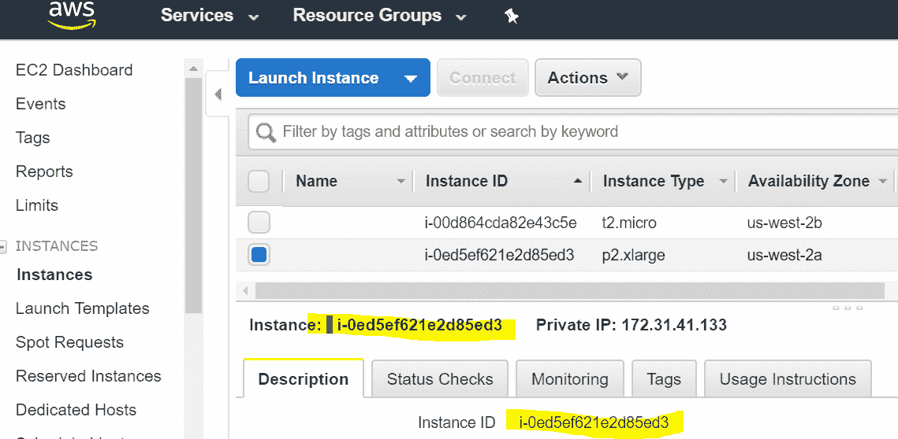

打开浏览器，在 URL 栏中输入公共 IP 地址，以及端口号`8443`。以下是一个 URL 示例：`https://ec2-54-200-213-68.us-west-2.compute.amazonaws.com:8443/`。

确保您使用**超文本传输安全协议**（**HTTPS**）进行连接，并且包含端口号。如果浏览器警告您连接不安全，请点击页面底部的“高级”链接。一旦建立连接，登录页面将打开，用户和数据库已预先填写。将实例 ID 作为密码，然后点击“连接”：

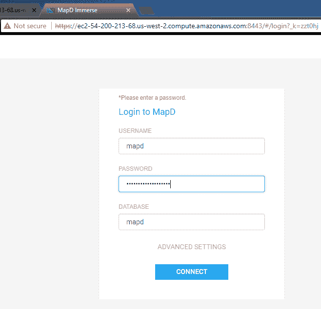

阅读 MapD 条件，点击“我同意”，然后进入 Immerse 环境。

在这里了解更多关于在 AWS 上使用 MapD 的信息：[`www.mapd.com/docs/latest/getting-started/get-started-aws-ami/`](https://www.mapd.com/docs/latest/getting-started/get-started-aws-ami/)。

# 默认仪表板

一旦启动 Immerse 环境，探索内置的默认 DASHBOARDS，以了解可能实现的功能：

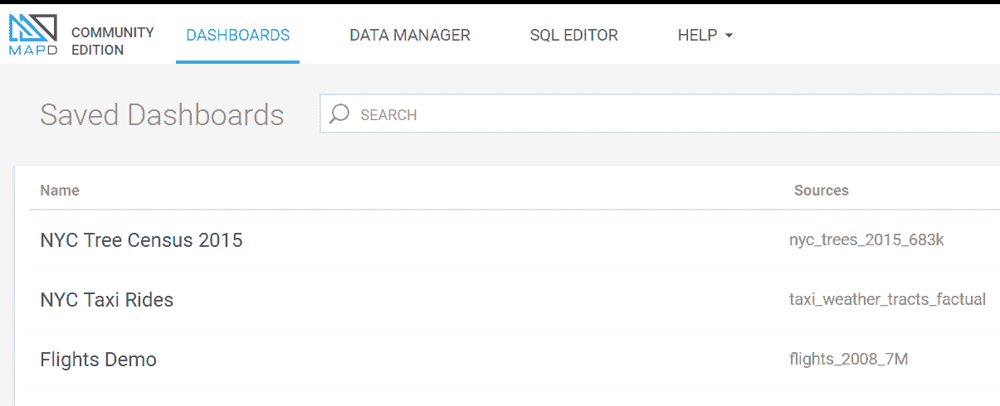

# 纽约出租车数据集

纽约出租车行程仪表板使用包含 1300 万行数据点的数据库表来展示数据库的速度。每次地图缩放时，数据库都会重新查询，并在毫秒内重新生成点。探索数据和修改仪表板以包含其他图表和地图类型是非常有趣的：

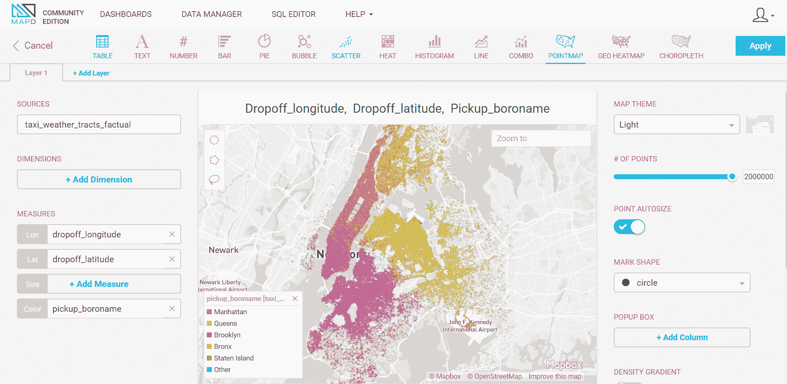

# 导入 CSV

使用 MapD Immerse 内置的数据导入器轻松导入 CSV 格式的数据集。转到数据管理器并选择导入数据。在下一页上，点击添加文件按钮，并使用拖放方式加载包含的 Juneau 市地址 CSV 数据集。

数据将被加载，一旦加载完成，就会从上传的数据中生成一个 MapD 数据库表。请检查数据，并添加一个新名称或接受默认名称（由电子表格名称生成）。点击“保存表”后，数据库表将被生成：

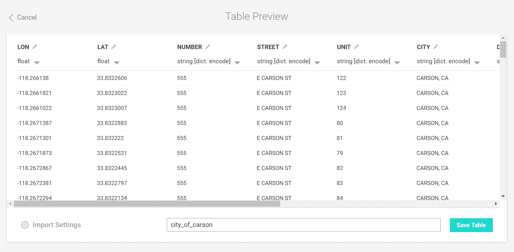

# 创建图表

现在已经将数据集添加到数据库中，通过选择“仪表板”选项卡来测试 MapD Immerse。在这里，可以创建和添加到新仪表板中的动态图表、表格、直方图、热力图等。在这个例子中，使用从 CSV 加载的数据创建了一个简单的饼图。统计与城市名称相关的记录数量并将其添加到图表中：

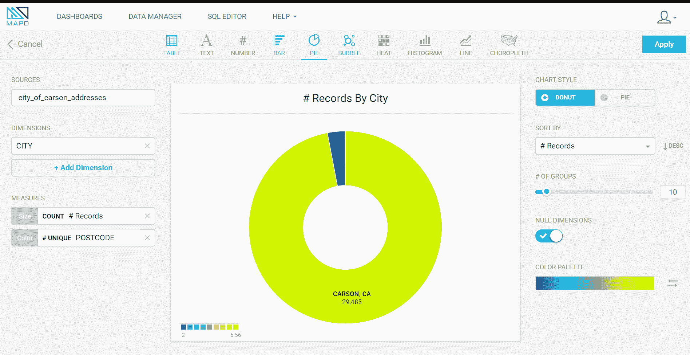

# 使用 SQL 编辑器进行选择

使用内置的 SQL 编辑器，可以执行 SQL 语句。结果将出现在类似 Jupyter Notebook 的交互式表格中的 SQL 编辑器中：

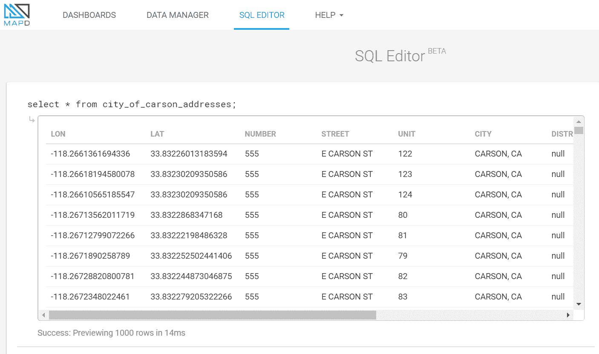

SQL 语句执行得非常快，并将包括可以执行空间分析的 SQL 选择语句的空间 SQL 命令。

# 使用地理空间数据

MapD Core 支持几何和地理数据类型，并可以使用坐标列生成交互式地图来显示带有*x*/*y*或经纬度对的地理数据。点地图、热力图和分县图可以很容易地使用 Immerse 仪表板环境生成和样式化：

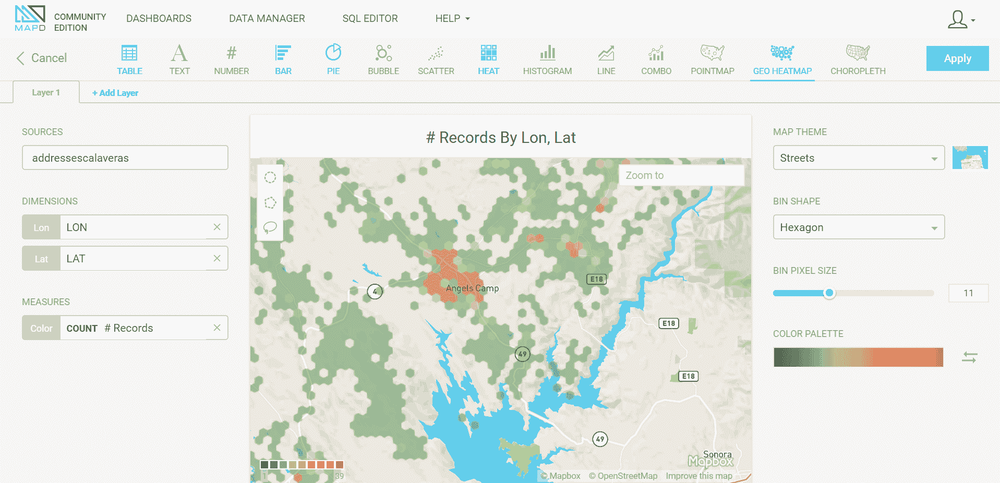

这份数据可视化是通过将 OpenAddresses 中的 Calaveras 县地址 CSV 加载到我的 MapD Immerse 实例中创建的，然后使用数据管理器并使用经度和纬度列创建热力图。

# 使用终端连接到数据库

使用集成的基于 Java 的终端或另一个终端解决方案连接到数据库。由于我的本地机器使用 Windows，并且没有集成到操作系统中的终端，我已经下载并安装了 PuTTY。这款免费的 SSH 软件允许我从 Windows 机器连接到 Linux 命令行服务器，使用之前生成的密钥对进行身份验证。

如果您正在使用 Windows 的另一个终端解决方案或使用其他操作系统，请使用终端的正确 SSH 过程连接到实例。步骤将类似，但需要将所需的私钥格式转换为。

请在此处下载 PuTTY 终端：[`www.chiark.greenend.org.uk/~sgtatham/putty/`](https://www.chiark.greenend.org.uk/~sgtatham/putty/)

# PuTTYgen

要授权任何连接到 AWS 实例，必须使用关联程序 PuTTYgen 将为 AWS 账户生成的私钥转换为 PuTTY 密钥格式。从开始菜单打开 PuTTYgen，点击“转换”菜单。从下拉选项卡中选择“导入密钥”。

将会打开一个文件对话框，允许您选择从 AWS 下载的私钥。这个私钥将具有 `.pem` 扩展名：

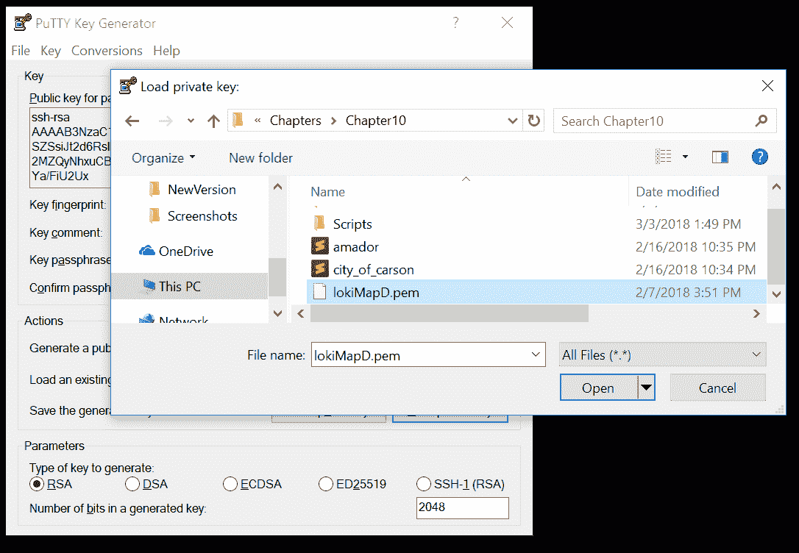

点击“打开”，并将密钥导入。要生成 PuTTY 格式的私钥，提供一个可选的密钥短语（一个或几个进一步识别用户并必须记住的词），然后在“操作”部分点击“保存私钥”按钮。选择一个文件夹并保存密钥，现在它将具有 `.ppk` 文件扩展名。

# 连接配置

使用 PuTTY 连接到实例需要一些配置。要创建连接，将实例的公共 IP 地址粘贴到“主机名”字段中，确保端口设置为 22，并且连接类型是 SSH。通过点击“保存”按钮在“已保存会话”部分保存设置：

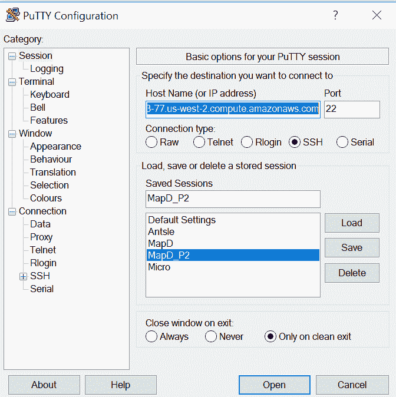

# 使用私钥

一旦设置被加载，点击左侧的 SSH 下拉菜单。在新菜单中，点击“认证”以切换到新菜单，然后浏览到我们转换成 PuTTY 格式的私钥：

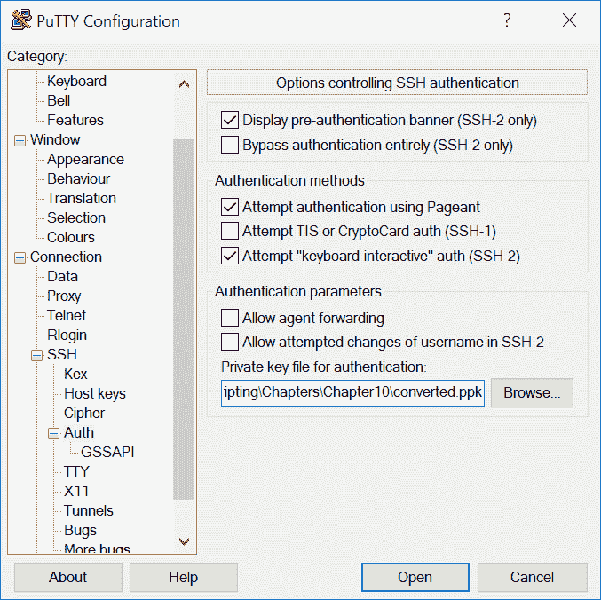

一旦找到密钥，点击“打开”以建立连接。要启动服务器上的 MapD，请转到 `/raidStorage/prod/mapd/bin` 文件夹并运行以下代码，将 `{Instance-ID}` 替换为您的实例 ID：

```py
./mapdql mapd -u mapd -p {Instance-ID}
```

如果您在建立连接时遇到问题，请检查确保 AWS 实例的安全组设置为允许从当前使用的计算机进行连接。如果安全组设置是“我的 IP”且计算机的 IP 地址不同，则无法建立连接。

# 安装 pymapd

安装 `pymapd` 很简单，并且由 `conda` 和 `pip` 支持，这是 Python 包安装程序。我在本章中使用 `pip`，但使用 `conda` 不会引起任何问题，并且可能建议与其他 `conda` 支持的软件集成。

# conda 安装命令

使用 `conda install -c conda-forge` 连接到 `conda forge`，这是存储 `pymapd` 模块的仓库。有关 `conda` 的更多信息，请参阅 第一章，*包安装和管理*：

```py
conda install -c conda-forge pymapd
```

# pip 安装命令

使用 `pip`，Python 安装程序包，也可以使用 `pymapd` 模块。它会从 [PyPi.org](http://PyPi.org)，Python 基金会的仓库中获取：

```py
pip install pymapd
```

一旦运行安装命令，`pymapd` 轮子将被下载并安装，同时还会安装所需的辅助模块：

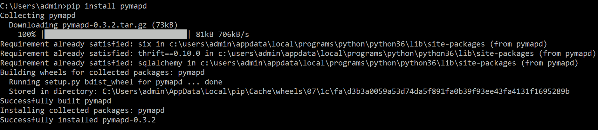

通过打开 Python 终端（或 IDLE）并输入 `import pymapd` 来测试模块是否已安装。如果没有错误发生，则表示 `pymapd` 已成功安装。

另一个选项是从 GitHub 下载 pymapd：[`github.com/mapd/pymapd.`](https://github.com/mapd/pymapd)

# 创建连接

`pymapd` 模块包含一个名为 `connect` 的类，该类需要连接信息，例如用户名、密码、主机服务器 IP/域名和数据库名称（用户名和数据库名称的默认值均为 `mapd`）。对于 AWS 实例，MapD Core 和 MapD Immerse 的默认密码是实例 ID，可在 EC2 控制台中的实例信息部分找到，如前所述。

# 用户名和密码

如果您正在连接到 AWS AMI MapD 实例，请使用公共 IP 地址作为 `host`，并将实例 ID 作为 `password`。以下是一个 `connection` 模式示例：

```py
from pymapd import connect
connection = connect(user="mapd", password= "{password}", 
     host="{my.host.com}", dbname="mapd")
cursor = connection.cursor()
```

下面是一个 `connect` 实例化的示例：

```py
connection = connect(user="mapd", password= "i-0ed5ey62se2w8eed3", 
  host="ec2-54-212-133-87.us-west-2.compute.amazonaws.com", dbname="mapd")
```

# 数据光标

要执行 SQL 命令（空间或其他类型），我们将创建一个数据 `光标`。`光标` 是 `连接` 类的一部分，将用于使用 `execute` 命令执行语句。它还用于访问查询结果，这些结果被转换成列表，并通过 `for` 循环进行迭代：

```py
from pymapd import connect
connection = connect(user="mapd", password= "{password}", 
     host="{my.host.com}", dbname="mapd")
cursor = connection.cursor()
sql_statement = """SELECT name FROM county;"""
cursor.execute(sql_statement)
results = list(cursor)
for result in results:
    print(result[0])
```

结果是一个元组列表，其中只包含（在这种情况下）`县` 的名称，通过使用零索引从元组中获取它。

# 创建一个表

建立连接后，我们现在可以在 Python 脚本中执行 SQL 语句，这将生成 MapD Core 实例中的表。以下语句将创建一个名为 `county` 的简单表，具有 `MULTIPOLYGON` 几何类型、一个 `integer id` 字段和三个 `VARCHAR` 类型的字段（或字符串，如 Python 中的称呼）：

```py
from pymapd import connect
connection = connect(user="mapd", password= "{password}", 
     host="{my.host.com}", dbname="mapd")
cursor = connection.cursor()
create = """CREATE TABLE county ( id integer NOT NULL, 
  name VARCHAR(50), statefips VARCHAR(3), 
  stpostal VARCHAR(3), geom MULTIPOLYGON );
"""
cursor.execute(create)
connection.commit()
```

下一个代码块将创建一个名为 `address` 的表，具有 `POINT` 几何类型、一个 `integer id` 字段和一个名为 `address` 的 `VARCHAR` 类型的字段：

```py
from pymapd import connect
connection = connect(user="mapd", password= "{password}", 
     host="{my.host.com}", dbname="mapd")
cursor = connection.cursor()
create = """CREATE TABLE address ( id integer NOT NULL PRIMARY KEY, 
  address VARCHAR(50), geom Point );
"""
cursor.execute(create)
connection.commit()
```

# 插入语句

将数据添加到数据库的一种方法是通过使用 SQL `INSERT` 语句。这些语句将在上一节中创建的数据库表中生成数据行。使用 `pyshp` 模块，我们可以读取 shapefile 并将其包含的数据添加到 `INSERT` 语句模板中。然后，该语句由 `光标` 执行：

```py
from pymapd import connect
import shapefile
connection = connect(user="mapd", password= "{password}", 
     host="{my.host.com}", dbname="mapd")
import shapefile
import pygeoif
cursor = connection.cursor()
insert = """INSERT INTO county
     VALUES ({cid},'{name}','12','FL','{geom}');
"""
countyfile = r'FloridaCounties.shp'
county_shapefile = shapefile.Reader(countyfile)
county_shapes = county_shapefile.shapes()
county_records = county_shapefile.records()
for count, record in enumerate(county_records):
    name = record[3]
    county_geo = county_shapes[count]
    gshape = pygeoif.Polygon(pygeoif.geometry.as_shape(county_geo))
    geom = gshape.wkt
    insert_statement = insert.format(name=name, geom=geom,cid=count+1)
    cursor.execute(insert_statement)
```

此过程可能耗时，因此还有几种其他方法可以将数据添加到数据库中。

# 使用 Apache Arrow 加载数据

使用 `pyarrow` 模块和 `pandas`，可以将数据写入 MapD Core 数据库：

```py
import pyarrow as pa
import pandas as pd
from pymapd import connect
import shapefile
connection = connect(user="mapd", password= "{password}", 
     host="{my.host.com}", dbname="mapd")
cursor = connection.cursor()
create = """CREATE TABLE juneau_addresses ( 
  LON FLOAT, LAT FLOAT, 
  NUMBER VARCHAR(30),STREET VARCHAR(200) );
"""
cursor.execute(create)
df = pd.read_csv('city_of_juneau.csv')
table = pa.Table.from_pandas(df)
print(table)
connection.load_table_arrow("juneau_addresses", table)
```

# 包含查询

此代码将测试数据查询对`county`数据库表的响应速度，使用`ST_Contains`，一个空间 SQL 点在多边形分析工具。`county`表的几何列（称为`geom`）是`ST_Contains`的第一个输入，第二个输入是**已知文本**（**WKT**）`point`。一旦执行 SQL 语句，`point`将与表中的所有行进行比较，以找出是否有任何一个`county`几何包含由 WKT `point`描述的`point`：

```py
import pymapd
from pymapd import connect
connection = connect(user="mapd", password= "{password}", 
     host="{my.host.com}", dbname="mapd")
import time
point = "POINT(-80.896146 27.438610)"
cursor = connection.cursor()
print(time.time())
sql_statement = """SELECT name FROM county where ST_Contains(geom,'{0}');""".format(point)
cursor.execute(sql_statement)
print(time.time())
result = list(cursor)
print(result)
print(time.time())
```

此脚本的输出结果如下：

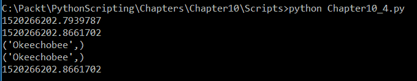

地理空间查询运行得非常快，正如你可以从打印的时间戳（以秒为单位）中看到的那样。只需几毫秒就能找到 Okeechobee 多边形包含`point`位置。

# 其他可用的空间 SQL 命令

在 MapD Core 数据库中可用的空间 SQL 命令的数量一直在增加。这些包括：

+   `ST_Transform`（用于坐标系转换）

+   `ST_Distance`（用于距离分析）

+   `ST_Point`（用于生成`point`对象）

+   `ST_XMin`、`ST_XMax`、`ST_YMin`、`ST_YMax`（用于边界框访问）

每天都在添加更多功能，并将在今年晚些时候达到与 PostGIS 和其他空间数据库的空间 SQL 功能对等。使用这些 SQL 命令，以及独特的客户端仪表板发布工具 MapD Immerse，MapD 是地理数据库部署的一个强大新选择。

# 摘要

使用像 MapD Core 这样的基于云的 GPU 数据库和 Immerse 可视化工作室，在设计实现 GIS 时将带来回报。它为表格和空间查询提供速度和云可靠性，并允许数据在交互式仪表板（依赖于`D3.js`和 MapBox GL JavaScript 等 JavaScript 技术）中共享，这些仪表板易于创建和发布。

使用 MapD Python 模块`pymapd`，云数据可以成为查询引擎的集成部分。数据可以被推送到云端或下载到本地使用。分析可以快速进行，利用 GPU 并行化的力量。在云中的虚拟服务器上安装 MapD，甚至本地安装，以测试软件的潜力是值得的。

在下一章中，我们将探讨使用 Flask、SQLAlchemy 和 GeoAlchemy2 创建一个具有 PostGIS 地理数据库后端的交互式网络地图。
