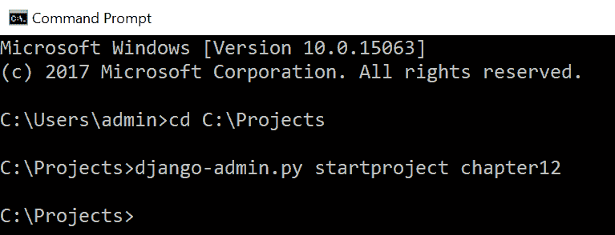
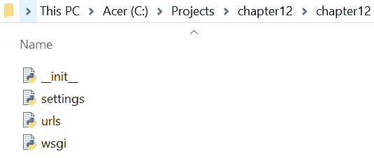
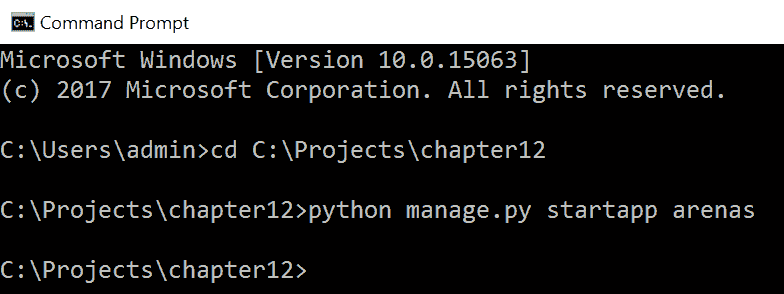
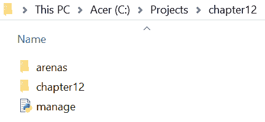
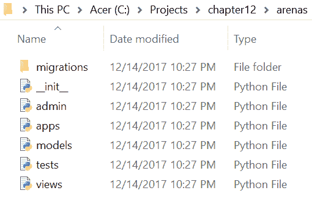
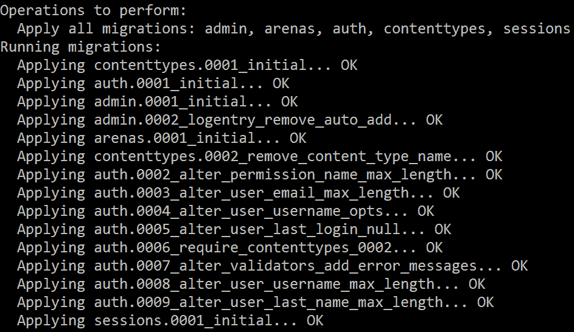
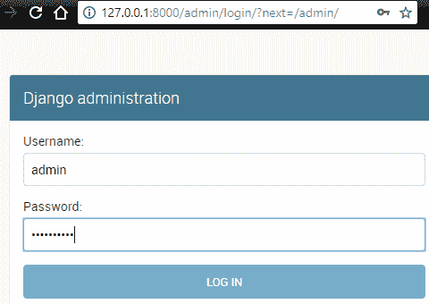
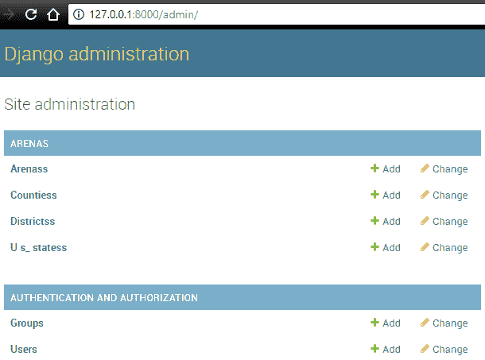
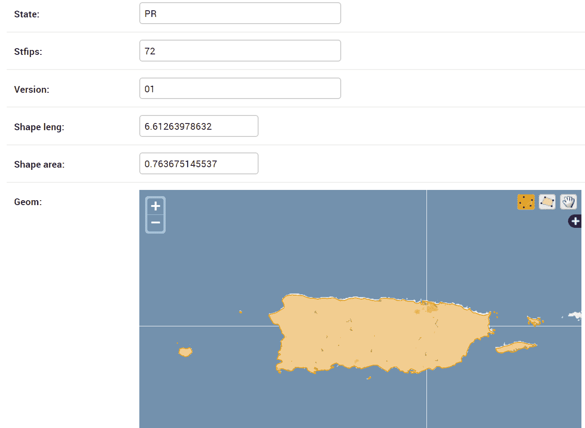

# GeoDjango

Django Python Web 框架于 2005 年推出，并在多年来持续得到支持和改进。一个主要改进是增加了对空间数据类型和查询的支持。这一努力产生了 GeoDjango，使得 Django 能够支持地理空间数据库模型和利用地理空间查询的 Web 视图。

GeoDjango 现在是标准的 Django 组件，可以通过特定的配置来激活。2017 年 12 月，Django 2 作为新的长期支持版本发布。它目前支持 Python 3.4、3.5 和 3.6。

在本章中，我们将学习以下内容：

+   Django 和 GeoDjango 的安装和配置

+   Django 管理面板功能，包括地图编辑

+   如何使用 LayerMapping 将 shapefiles 加载到数据库表中

+   GeoDjango 查询

+   Django URL 模式

+   Django 视图

# 安装和配置 Django 和 GeoDjango

与 Flask 相比，Django 是一个包含电池的框架。它包括允许数据库后端支持的模块，无需单独的数据库代码包（与 Flask 不同，Flask 依赖于 SQLAlchemy）。Django 还包括一个管理面板，允许通过 Web 界面轻松编辑和管理数据。这意味着安装的模块更少，包含的代码更多，用于处理数据库交互和 Web 处理。

Flask 和 Django 之间有一些主要区别。Django 在结构上比 Flask 更好地将 URL 与视图和模型分离。Django 还使用 Python 类来表示数据库表，但它具有内置的数据库支持。对于地理空间数据库，无需额外模块。Django 还支持更多数据库中的几何列，尽管 PostgreSQL 和 PostGIS 使用得最为频繁。

与许多 Python 3 模块一样，Django 开发侧重于 Linux 开发环境。虽然它支持 Windows 安装，但需要在 Windows 中对环境变量进行一些修改，需要机器的行政控制权。配置需要行政级别的权限，允许 Django 访问 **地理空间数据抽象库**（**GDAL**）和 **OGR 简单特征**库。

# 从 Django 到 GeoDjango 的步骤

在本节中，我们将安装 Django 并配置 GeoDjango，并添加所需的库（包括 GDAL 和 OGR），这些库将空间功能引入 Django。安装 Django 2 模块（针对 Python 3）和配置 GeoDjango 组件取决于多个步骤。这些包括：

1.  使用 `pip` 安装 Django 2

1.  安装和启用空间数据库（如果尚未安装）

1.  安装 GDAL/OGR/PROJ4/GEOS

1.  配置 Windows 环境变量

1.  生成项目

1.  打开 `settings.py`

1.  将 `django.contrib.gis` 添加到 `INSTALLED_APPS`

1.  配置数据库设置以指向空间数据库

# 安装 Django

Django 2 存放在 **Python 包索引** (**PyPI**)，因此使用 `pip` 安装它。它也可以手动下载和安装。使用 `pip` 安装 Django 也会安装所需的依赖项 `pytz`。Django 将从 PyPI 下载为 wheel 文件并安装。

由于 Django 2 是最近发布的重大更新，我们必须确保 `pip` 安装正确的版本。使用此命令，我们将安装 Django 2.0：

```py
C:\Python36\Scripts>pip install Django==2.0
```

该模块将被安装，包括支持模块：


本章使用 Django 2.0。使用可用的最新 Django 2 版本开始项目。在此处查看 Django 2.0 文档（以及其他 Django 版本）：

[`www.djangoproject.com/`](https://www.djangoproject.com/).

如果你使用虚拟环境，可以为每个环境指定 Django 的特定版本。如果不使用虚拟环境，并且安装了多个 Python 版本，请确保使用正确的 `pip` 版本在 `Python 3` 文件夹结构中安装 Django。

# 安装 PostGIS 和 psycopg2

本章将使用 PostGIS。如果你在机器上没有安装 PostGIS，请参阅第七章 Geoprocessing with Geodatabases，其中解释了如何将空间扩展附加组件安装到 PostgreSQL。此外，请确保使用以下代码安装 `psycopg2` 模块：

```py
C:\Python36\Scripts>pip install psycopg2
```

# 创建数据库

通过 `Chapter12_0.py` 脚本生成数据库表，该脚本创建一个名为 `chapter12` 的 PostgreSQL 数据库，并为新数据库添加空间功能。在以下连接配置中调整凭据、主机和端口（如有必要）。

使用 `psycopg2` 和其 `connect` 函数连接到数据库服务器，该函数创建一个 `connection` 类。该类有一个 `cursor` 函数，用于创建一个 `cursor` 对象，该对象能够执行 SQL 语句。本节将创建用于本章的数据库：

```py
import psycopg2
connection = psycopg2.connect(host='localhost', user='{user}',password='{password}', port="5432")
connection.autocommit = True
cursor = connection.cursor()
cursor.execute('CREATE DATABASE chapter12')
```

要使数据库成为地理空间数据库，请确保已安装 PostGIS 空间附加组件。连接到新数据库并传递以下 SQL 语句，该语句将空间功能表添加到数据库中：

```py
import psycopg2
connection = psycopg2.connect(dbname='chapter12', host='localhost', user='{user}', password='{password}', port="5432")
cursor = connection.cursor()
connection.autocommit = True
cursor.execute('CREATE EXTENSION postgis')
connection.close() 
```

本章的 PostGIS 数据库现在已创建并启用空间功能。

# GDAL/OGR

Django 内置的地理空间支持需要使用来自 **开源地理空间基金会** (**OSGeo**) 的代码库。GDAL 库，包括 OGR，处理矢量数据和栅格数据集。它必须被安装（有关如何使用它进行分析的更多详细信息，请参阅第五章 Vector Data Analysis 和第六章 Raster Data Processing）。

如果尚未安装，请使用以下网址提供的 OSGeo4W 安装程序：[`trac.osgeo.org/osgeo4w/`](https://trac.osgeo.org/osgeo4w/)。选择适合您机器的正确安装程序。安装程序还将安装 QGIS、GRASS 和其他开源地理空间程序。下载并运行安装程序，并将输出文件放置在您的本地驱动器上。此文件路径（例如：`C:\OSGeo4w`）在修改 Windows 环境变量时将非常重要。

在 Django 项目文档中查找配置 GeoDjango 的 Linux 和 macOS 的安装说明：

[`docs.djangoproject.com/en/2.0/ref/contrib/gis/install/`](https://docs.djangoproject.com/en/2.0/ref/contrib/gis/install/)。

# 修改 Windows 环境变量

在 Windows 中编辑系统路径和其他环境变量需要管理员权限。以下是编辑它们的步骤：

1.  使用具有管理员权限的账户登录。

1.  打开 Windows 资源管理器，在左侧窗格中右键单击 PC 图标。

1.  从上下文菜单中选择“属性”。

1.  点击“高级系统设置”。

1.  在下一个菜单中，点击“环境变量”。

1.  从系统变量中选择“路径”并点击“编辑”（或双击路径值）。

1.  将`OSGeo4W`文件夹中`bin`文件夹的文件路径（例如，`C:\OSGeo4W\bin`）添加到路径中：


在此示例中，`Python 3.6`文件夹也已添加到路径中，以及`Python 2.7`，它位于路径环境变量值中的`Python 3.6`之后，因为它的位置。这意味着当传递 Python 到命令行时，将运行`Python 3.6`可执行文件。

可能还需要两个其他变量：GDAL_DATA 变量和 PROJ_LIB 变量。如果已安装 PostGIS，它将已经创建了一个 GDAL_DATA 变量，但如果它不存在，请点击系统变量框下方的“新建”按钮。添加变量的名称（GDAL_DATA）和变量值（例如，`C:\OSGeo4W64\share\gdal`）。

以相同的方式添加 PROJ_LIB 变量：


点击“确定”以保存新变量，然后再次点击“确定”以退出第一个设置对话框。关闭系统属性菜单。

# 创建项目和应用程序

现在 Django 已经安装，让我们创建一个项目。Django 有两个级别，由接受命令行参数的脚本管理。这两个级别是项目和应用程序。一个项目可以有多个应用程序，有时一个应用程序也有多个项目。这种组织方式允许您在相关应用程序之间重用代码，这些代码受项目级别代码的约束。

Django 使用一个管理文件 `django-admin.py` 来控制项目的创建。它安装在 `Python 3` 文件夹的 `Scripts` 文件夹中。我通常将 `django-admin.py` 文件复制到一个新的项目文件夹中，并在项目文件夹中工作的时候传递所需的命令行参数，但如果 `Scripts` 文件夹包含在路径环境变量中，它也可以从命令行调用。

为你的项目创建一个文件夹；例如 `C:\Projects`。将 `django-admin.py` 复制到 `C:\Projects`。

# 命令行参数 - startproject

使用 `django-admin.py` 的命令行参数来创建项目——`startproject`。要创建一个项目，打开命令提示符并切换到之前创建的文件夹。我们将通过传递 `startproject` 和我们新项目的名称 (`chapter12`) 到 `django-admin.py` 来在这个文件夹中创建项目：



# startproject 创建了什么？

通过将两个参数传递给 `django-admin.py`，`startproject` 和 `chapter12`（项目的名称），创建了一个包含多个脚本和子文件夹的文件夹。外部的 (`root`) 文件夹被称为 `chapter12`，它包含一个重要的脚本 `manage.py`，以及一个也称为 `chapter12` 的文件夹，这是项目文件夹：


在项目文件夹中包含一些重要的脚本，包括 `settings.py` 和 `urls.py`：



这些文件是默认的占位符，等待我们配置项目和应用程序。随着项目的进行，我们还将编辑 `setting.py` 和 `urls.py`，以包含我们项目的具体信息。第三个文件 `wsgi.py` 用于生产部署网络应用程序。

# 使用 manage.py 创建应用程序

现在，`root` 文件夹、`Projects` 文件夹和相关脚本已经创建。在 `root` 文件夹中是 `manage.py` 文件，它用于配置和管理应用程序和项目。在本节中，我们将使用 `manage.py` 和命令行参数 `startapp` 创建一个应用程序。 

使用命令提示符，切换到 `root` 文件夹。与 `django-admin.py` 不同，我们必须通过将 `manage.py` 作为参数传递给 Python 可执行文件来运行它。反过来，我们将 `startapp` 参数和应用程序的名称 `arenas` 传递给 `manage.py`。它应该看起来像这样：



# manage.py 创建了什么？

将 `startapp arenas` 命令传递给 `manage.py` 创建了一个名为 `arenas` 的文件夹。所有应用程序都创建在 `root` 文件夹中，紧挨着项目文件夹旁边：



在文件夹中是自动生成的脚本，我们将在稍后配置和添加。还有一个名为`migrations`的文件夹，用于存储 Django 用于描述数据库编辑的脚本。本章将使用`admin.py`、`models.py`和`views.py`脚本：



# 配置 settings.py

在创建项目和新的应用程序后，使用 GeoDjango 的下一步是配置项目文件夹中包含的`settings.py`脚本。我们将添加有关数据库连接（用户、密码、数据库名称等）的详细信息，并调整`INSTALLED_APPS`设置。

# 添加新的数据库连接

使用 IDLE 或另一个 IDE，从`chapter12`项目文件夹中打开`settings.py`。滚动到名为`DATABASES`的变量。此变量设置为本地 SQLite 数据库，将被调整为带有 PostGIS 扩展的 PostgreSQL 数据库。

这是默认设置：

```py
DATABASES = {
     'default': {
         'ENGINE': 'django.db.backends.sqlite3',
         'NAME': os.path.join(BASE_DIR, 'db.sqlite3'),
     }
}
```

更改为以下内容，用你的 PostGIS 安装的`username`和`password`替换（见第三章，*地理空间数据库简介*）：

```py
DATABASES = {
    'default': {
         'ENGINE': 'django.contrib.gis.db.backends.postgis',
         'NAME': 'chapter12',
         'USER': '{username}',
         'PASSWORD': '{password}',
         'HOST': '127.0.0.1',
         'PORT':'5432'
    },
}
```

空字符串也可以用于`HOST`选项，表示`localhost`。如果 PostgreSQL 安装在不同的机器上，调整`HOST`选项到数据库服务器的 IP 地址。如果它在不同的端口上，调整`PORT`选项。

保存脚本，但不要关闭它。

# 添加新的已安装应用程序

在`settings.py`中，滚动到变量`INSTALLED_APPS`。此变量列出了用于支持我们的应用程序的内置、核心应用程序。我们将向其中添加`django.contrib.gis`，内置的 Django GIS 应用程序，以及我们自己的新应用程序，竞技场。

`INSTALLED_APPS`是一个列表，可以编辑。最初，`INSTALLED_APPS`看起来像这样：

```py
INSTALLED_APPS = [
    'django.contrib.admin',
    'django.contrib.auth',
    'django.contrib.contenttypes',
    'django.contrib.sessions',
    'django.contrib.messages',
    'django.contrib.staticfiles',
]
```

编辑它，使其看起来像这样：

```py
INSTALLED_APPS = [
    'django.contrib.admin',
    'django.contrib.auth',
    'django.contrib.contenttypes',
    'django.contrib.sessions',
    'django.contrib.messages',
    'django.contrib.staticfiles',
 'django.contrib.gis',
 'arenas',
]
```

保存`settings.py`并关闭脚本。现在我们已经将我们的自定义竞技场应用程序和 Django 的 GIS 库添加到已安装的应用程序包管理器中，因此 GeoDjango 现在已配置。接下来，我们将使用`manage.py`和 OGR 读取 shapefiles 并自动生成数据模型。

# 创建应用程序

此应用程序将使用数据库表的几何字段执行地理空间分析。为了实现这一点，我们必须使用 shapefiles 和一个称为`LayerMapping`的内置方法创建和填充数据库表。

完成的应用程序将需要 URL 模式匹配来将 URL 与处理请求并返回响应的视图关联起来。模板将用于将处理后的数据传递到浏览器。视图将被编写以处理`POST`和`GET`请求，并将重定向到其他视图。

现在 GeoDjango 已配置，可以使用名为`manage.py`的 Django 项目管理脚本创建 NBA 竞技场应用程序。

# manage.py

`manage.py` 脚本执行多项任务以帮助设置和管理项目。出于测试目的，它可以创建本地 Web 服务器（使用 `runserver` 作为参数）；它管理数据库模式迁移，从数据模型生成表（使用 `makemigration` 和 `migrate`）；甚至内置了 Python 3 shell（使用 `shell`），用于测试和其他操作：


在本节中，我们将使用 `manage.py` 来创建和填充数据库表，使用 shapefile 作为数据和模式源。

# 生成数据模型

在配置 GeoDjango 后，`manage.py` 中出现了一个新的可用功能，即 `ogrinspect`，它可以自动生成具有几何列的数据表模型，这些模型可以放置在 `models.py` 中。通过使用 OGR 检查或读取 shapefile 数据，Django 的内置功能创建了一个 Python 类数据模型和一个字段映射字典，该字典将 shapefile 字段名称与数据库列名称映射起来。

对于本节，我们将使用在 第十一章 中下载的 shapefile，即 *Flask 和 GeoAlchemy2*。它们也包含在代码包中。将四个 shapefile（以及所有相关文件）复制到 arenas 应用程序文件夹中的 `data` 文件夹内：


打开命令提示符，将目录更改为项目文件夹。将包含四个 shapefile（`Arenas_NBA.shp`、`US_States.shp`、`US_County_Boundaries.shp` 和 `Congressional_Districts.shp`）的 `data` 文件夹检查以使用 `manage.py` 生成数据模型。结果将复制到 `models.py` 中。从这些模型中，将生成数据库表，然后使用字段映射字典填充这些表：

```py
C:\Projects\chapter12>python manage.py ogrinspect arenas\data\Arenas_NBA.shp Arenas --srid=4326 --mapping
```

此命令将生成具有几何列和 `4326` SRID 的数据模型。由 `--mapping` 选项生成的字段映射字典是一个 Python 字典，它将键（数据模型列名称）与值（shapefile 字段名称）映射起来。以下是输出的一部分：


将输出（包括 `import` 行、数据模型和字段映射字典）复制到 `arenas` 目录下的 `models.py` 中。将 `import` 行复制到自动生成的 `models.py` 中的数据模型类定义上方。

当在命令提示符默认设置中开启快速编辑选项时，从命令行复制内容变得容易。一旦开启，通过拖动鼠标选择文本。当文本块被选中时，按 *Enter* 键。

# 多边形

对于具有多边形几何类型的其他三个 shapefile，我们将传递参数 `multi` 给 `manage.py` 和 `ogrinspect`。使用此选项在数据模型中生成 `MultiPolygon` 几何列。

此命令从美国州 shapefile 生成数据模型：

```py
C:\Projects\chapter12>python manage.py ogrinspect arenas\data\US_States.shp US_States \
 --srid=4326 --mapping --multi
```

输出将如下所示：

```py
# This is an auto-generated Django model module created by ogrinspect.
from django.contrib.gis.db import models
class US_States(models.Model):
 stfips = models.CharField(max_length=2)
 state = models.CharField(max_length=66)
 stpostal = models.CharField(max_length=2)
 version = models.CharField(max_length=2)
 dotregion = models.IntegerField()
 shape_leng = models.FloatField()
 shape_area = models.FloatField()
 geom = models.MultiPolygonField(srid=4326)
# Auto-generated `LayerMapping` dictionary for US_States model
 us_states_mapping = {
 'stfips': 'STFIPS',
 'state': 'STATE',
 'stpostal': 'STPOSTAL',
 'version': 'VERSION',
 'dotregion': 'DotRegion',
 'shape_leng': 'Shape_Leng',
 'shape_area': 'Shape_Area',
 'geom': 'MULTIPOLYGON',
}
```

将输出复制到 `models.py` 中，包括数据模型和字段映射字典。通过调整 `manage.py` 的参数（即形状文件名和表名）对县和区形状文件重复此过程，并在模型添加后保存 `models.py`。

# 数据库迁移

Django 使用数据库迁移的概念来记录和执行对数据库的更改。这些更改包括表创建和模式变更。现在我们已经生成了数据模型，我们需要迁移数据库，这涉及到检查 `models.py` 中的更改，计算生成数据库变更的 SQL 语法，然后运行所需的迁移以使数据库表列与 `models.py` 代码定义匹配。这些迁移也可以回滚。

# makemigrations

要开始迁移，将 `makemigrations` 传递给 `manage.py`。此参数将通过检查 `models.py` 的内容来启动迁移过程。所有 Python 类数据模型将被读取，并生成相应的 SQL 语句：

```py
C:\Projects\chapter12>python manage.py makemigrations
Migrations for 'arenas':
 arenas\migrations\0001_initial.py
 - Create model Arenas
 - Create model Counties
 - Create model Districts
 - Create model US_States
```

已生成并添加到 `migrations` 文件夹中的新脚本。此初始数据库迁移脚本创建了一个 `Migration` 类，并包含了一系列使用 `CreateModel` 方法进行的迁移操作。每个迁移操作都会在 `chapter12` 数据库中生成一个新的（空）表。`Migration` 类还有执行表变更的方法，当你需要添加或删除字段时。

# sqlmigrate

使用 `sqlmigrate` 命令来查看从 `makemigration` 操作生成的 SQL 语句。将 `sqlmigrate`、应用标签（`arenas`）和迁移名称（`0001`）传递给 `manage.py` 以生成输出：


所有数据模型都已转换为 SQL，并自动添加了主键和字段长度的定义。

# migrate

使用生成的迁移脚本，我们最终可以执行数据库迁移。此操作将在 `settings.py` 中指定的数据库内生成表。

将 `migrate` 参数传递给 `manage.py`：

```py
C:\Projects\chapter12>python manage.py migrate
```

操作的结果应该看起来像这样：



数据库表已在数据库中创建。打开 pgAdmin4（或另一个数据库 GUI 工具）以检查数据库中的表，或打开 psql 并使用命令行界面。

探索 Django 文档以了解 `django-admin.py` 和 `manage.py` 的所有可用参数：

[`docs.djangoproject.com/en/2.0/ref/django-admin/`](https://docs.djangoproject.com/en/2.0/ref/django-admin/).

# LayerMapping

为了填充由 shapefiles 创建的数据库表，Django 有一个内置的概念称为`LayerMapping`。通过使用由`manage.py`生成的字段映射字典，以及来自`django.contrib.gis.utils`的`LayerMapping`类，可以从 shapefiles 中提取并加载到数据库表中。要实例化一个`LayerMapping`实例，我们将数据模型、相关的字段映射和 shapefile 的位置传递给类。

创建一个名为`load.py`的新文件，并将其保存在 Arenas 应用程序中。向文件中添加以下行：

```py
import os
from django.contrib.gis.utils import LayerMapping
from .models import US_States, Counties, Arenas, Districts
```

打开`models.py`并将所有字段映射字典复制到`load.py`中。然后，使用`os`模块将 shapefile 路径分配给一个变量。以下是`US_County_Boundary.shp`的字典和路径变量：

```py
us_counties_mapping = {
'stfips' : 'STFIPS', 'ctfips' : 'CTFIPS', 'state' : 'STATE', 'county' : 'COUNTY',
'version' : 'VERSION', 'shape_leng' : 'Shape_Leng', 'shape_area' : 'Shape_Area', 'geom' : 'MULTIPOLYGON'
}
counties_shp = os.path.abspath(os.path.join(os.path.dirname(__file__), 'data','US_County_Boundaries.shp'),
)
```

如代码包中提供的`load.py`所示，重复此步骤以处理所有 shapefiles。这些路径变量和映射字典是执行层映射所必需的。

# 运行层映射

在`load.py`的底部创建一个名为`run`的函数，包含以下代码。注意，映射的名称（例如，`us_states_mapping`）必须与字典的名称匹配：

```py
def run(verbose=True):
    lm = LayerMapping(
        US_States, states_shp, us_states_mapping,
        transform=False, encoding='iso-8859-1',
    )
    lm.save(strict=True, verbose=verbose)
    lm = LayerMapping(
        Counties, counties_shp, us_counties_mapping,
        transform=False, encoding='iso-8859-1',
    )
    lm.save(strict=True, verbose=verbose)
    lm = LayerMapping(
        Districts, districts_shp, districts_mapping,
        transform=False, encoding='iso-8859-1',
    )
    lm.save(strict=True, verbose=verbose)
    lm = LayerMapping(
        Arenas, arenas_shp, arenas_mapping,
        transform=False, encoding='iso-8859-1',
    )
    lm.save(strict=True, verbose=verbose)
```

要运行脚本，我们将使用`manage.py shell`参数调用 Python shell，然后导入`load.py`文件，并在该本地 shell 中执行`run`函数：

```py
>>> from arenas import load
>>> load.run()
```

一旦调用并执行了`run`函数，shapefiles 中的数据行将被导入到数据库表中：


一旦函数成功完成，数据库表将被填充。我们现在可以探索 Django 的一个非常有用的内置功能——内置的行政面板。

# 行政面板

Django 框架是在一个繁忙的新闻编辑室环境中开发的，从一开始就需要一个内置的行政面板，以便记者和编辑可以访问他们的故事。这个概念一直得到支持，因为大多数网站都需要一个用于行政任务的界面。这是一个非常实用且方便的界面，使用它不需要对网站有任何技术知识。

# GeoDjango 行政面板

使用 GeoDjango 配置构建的网站并无不同，GeoDjango 网站的行政面板甚至支持显示和编辑几何数据。`OpenLayers` JavaScript 库包含在面板模板中，以允许数据可视化。它还允许执行常规的行政任务，例如编辑组或用户及其权限。

# admin.py

要通过行政面板访问存储在`models.py`中的数据模型，Arenas 应用程序内自动生成的脚本`admin.py`必须更新。在 IDE 中打开文件，并添加以下行，复制原始代码：

```py
from django.contrib.gis import admin
from .models import US_States, Counties, Arenas, Districts
admin.site.register(US_States, admin.GeoModelAdmin)
admin.site.register(Counties, admin.GeoModelAdmin)
admin.site.register(Arenas, admin.GeoModelAdmin)
admin.site.register(Districts, admin.GeoModelAdmin)
```

保存脚本并关闭它。

# createsuperuser

第一步是创建一个超级用户。此用户将能够访问管理面板。为此，我们将传递`createsuperuser`参数给`manage.py`并逐条遵循出现的说明：

```py
C:\Projects\chapter12>python manage.py createsuperuser
Username: loki
Email address: email@server.com
Password:
Password (again):
Superuser created successfully.
```

现在超级用户可以使用提供的用户名和密码登录管理面板。

# 运行服务器

超级用户创建后，将`runserver`参数传递给`manage.py`以启动本地开发网络服务器：


默认情况下，`localhost`将在端口`8000`上打开（`http://127.0.0.1:8000`）。管理面板位于：`http://127.0.0.1:8000/admin`。打开网页浏览器并导航到管理面板的 URL。输入超级用户凭据：



输入后，管理面板将列出可用的模型，以及认证和授权部分。这些模型最初以复数形式显示（默认情况下在名称末尾添加 s）。虽然可以（并且应该）覆盖这种行为，但在此我们不会关注这项任务：



在“场”下的 U_s_statess 模型上单击，然后单击状态对象列表中的第一个对象。它应该看起来像这样：



这些字段可以通过此管理面板进行编辑，甚至可以使用包含的`OpenLayers`编辑插件编辑州的几何形状（或在此情况下，波多黎各）。编辑后点击保存。也可以从该界面删除数据行。

在此处探索完整的管理面板文档：

[`docs.djangoproject.com/en/2.0/ref/contrib/admin/`](https://docs.djangoproject.com/en/2.0/ref/contrib/admin/).

# 网址

最后，在 HTML 表单部分，我们指定描述和下拉列表的位置，并包括一个隐藏的令牌（CSRF），这是认证所必需的。

在生成模型并将数据添加到相关表后，是时候生成一些视图了，这些视图将处理我们的网络请求并返回完成请求所需的数据。

为了正确路由我们的请求，我们首先需要创建一些将与视图配对的 URL。这需要项目级别和应用级别配置。与 Flask 不同，URL 不是通过 Python 装饰器附加到视图上的。相反，它们包含在单独的脚本中，这些脚本将映射到应用程序或视图。

# URL 模式

Django URL 模式非常干净和简单，使得网址短小且易于记忆。为了实现这一点，请求的 URL 与视图（或与应用程序级别的 URL 匹配的视图）进行匹配。URL 及其目的地在名为`urlpatterns`的列表中进行匹配。

在项目文件夹（`C:\Projects\chapter12\chapter12`）中，有一个名为 `urls.py` 的脚本位于 `settings.py` 下方。此脚本控制项目级别的 URL 路由。对于此应用程序，我们还将添加 `arenas` 文件夹内的应用级别 URL，并将项目级别的 URL 路由指向应用 URL。

打开项目级别的 `urls.py` 文件，并将以下代码复制到任何现有代码之上：

```py
from django.urls import include, path
from django.contrib.gis import admin
urlpatterns = [
  path('', include('arenas.urls')),
  path('arena/', include('arenas.urls')),
  path('admin/', admin.site.urls),
]
```

这段代码会将请求重定向到应用级别的 `urls.py` 文件中的两个不同 URL，在那里它们可以进一步排序。任何发送到管理 URL 的请求都由管理代码处理。`path` 函数接受两个必需参数：URL 路径（例如，`'arenas/'`，它指向 `http://127.0.0.1:8000/arenas`），以及将接受请求的视图或应用级别的代码。`include` 函数用于将来自 `Arenas` 应用的可用 URL 添加到项目级别的 URL 中。

要创建应用级别的 URL，在 `Arenas` 应用文件夹内创建一个名为 `urls.py` 的脚本。复制以下代码：

```py
from django.urls import path
from . import views
urlpatterns = [
    path('', views.index, name='index'),
    path('arena', views.arena, name='arena'),
]
```

这次，函数 `path` 将请求重定向到 `views.py` 脚本内的视图（将）。基本 URL 和场馆 URL 都重定向到一个视图。还包含可选参数 `name`。

注意，Django URL 模式的一个主要变化是在 Django 2.0 中引入的。早期的 Django 版本不使用 `path` 函数，而是使用一个类似的功能 `url`。请确保您使用的是最新版本的 Django，以匹配这里的代码。

# 视图

视图是应用程序的核心，在 Django 中表现为 Python 函数。它们接受 `GET` 和 `POST` Web 请求，允许在同一个函数内发生多个动作，并产生各种响应。在视图函数中，我们设计如何解析请求，如何查询数据库表，如何处理查询结果（Django 中的**QuerySets**），以及将哪些表单和模板与处理后的数据一起发送到浏览器。

现在 URL 模式已经就绪，我们需要编写一些视图来接受和处理发送到 URL 的 Web 请求。这些视图将查询 `models.py` 中的数据库表模型类，以找到与 `Arenas` 类中包含的每个 NBA 场馆相关的位置数据。

# 必需的文件夹和文件

第一步是创建必要的文件夹，包含表单和模板的文件，因为视图的 Web 响应需要预先生成的模板来显示请求的数据（在这种情况下，请求的 NBA `arena`的位置）。

# forms.py

在 Django 中，Web 表单用于捕获用户输入并将其提交到视图。为了能够从下拉列表中选择 NBA `arena`名称，并使 Web 地图缩放到该位置，必须创建一个新的脚本 `forms.py`。打开 IDE，并将以下代码复制到一个新文件中：

```py
from django import forms
from .models import Arenas
class ArenaForm(forms.Form):
    name = ""
    description = "Use the dropdown to select an arena."
    selections = 
    forms.ChoiceField(choices=Arenas.objects.values_list('id','name1'),
                                  widget=forms.Select(),required=True)
```

本节通过从`forms.Form`派生创建一个表单类。它有一个`name`字段，一个`description`字段，以及一个`ChoiceField`。`ChoiceField`将创建一个下拉列表，由`arenas`的 ID 和名称填充。其他字段将在视图中的`ArenaForm`类中添加，此处未定义。此表单及其字段将插入到下一节中创建的模板中。将此文件保存为`forms.py`到 Arenas 应用程序文件夹中。

# templates 文件夹

将完成代码包中的`templates`文件夹复制到 Arenas 应用程序文件夹中。在`templates`文件夹中有一个名为`arenas`的文件夹，里面有一个名为`index.html`的模板 HTML 文件。此文件包含一个 JavaScript 部分，用于生成一个网络地图。在该地图上，NBA `arena`的位置被显示出来。

Django 模板使用占位符（以`{{form.field }}`格式分隔）允许在运行时将数据传递到模板中，提供请求的详细信息。这些占位符位于`index.html`的各个部分。Django 有自己的内置模板语言，我们在这里将使用它，还包括 Jinja2，Flask 也使用（见第十一章，*Flask 和 GeoAlchemy2*）。

`index.html`的第一部分需要突出显示的是，当前 NBA `arena`的`longitude`和`latitude`已经被添加到 Leaflet JavaScript 中，在`13`级别缩放时将地图窗口中心定位在该位置：

```py
 var themap = L.map('map').setView([ {{form.latitude}}, {{form.longitude}}], 13);
```

下一个需要突出显示的部分是，将当前 NBA `arena`的`longitude`、`latitude`和自定义`popup`添加到一个标记中：

```py
  L.marker([ {{form.latitude}},{{form.longitude}}]).addTo(themap)
  .bindPopup("{{form.popup}}").openPopup();
```

最后，在 HTML `form`部分中，我们指定`description`和下拉列表的位置，并包括一个隐藏的令牌（CSRF），这是`POST`请求认证所必需的。按钮由输入 HTML 生成：

```py
  <form method="post" class="form">
     <h3>{{form.name}}</h3>
     <h4>{{form.description}}</h4>
    {{form.selections}}
    <br>
    <input type="submit" value="Find Data">
    
  </form>
```

当视图处理并返回数据到请求浏览器时，所有这些占位符都将被填充。

# 编写视图

最后，我们将设置编写我们的视图。在 IDE 中打开 Arenas 应用程序文件夹中的`views.py`。导入所需的库、模型、表单和模块：

```py
from django.shortcuts import render, redirect
from django.http import HttpResponse, HttpResponseNotFound
from .models import US_States, Counties, Districts, Arenas
from .forms import ArenaForm
from django.views.decorators.http import require_http_methods
import random
```

接下来，我们将创建两个视图——`index`和`arena`*，以及一个非视图函数`queryarena`。这些与我们在`urls.py`中添加的 URL 相匹配。`index`函数的返回值非常简单——它将重定向到`arena`函数。对于视图，使用装饰器来确定允许的 HTTP 请求方法。

# index 视图

`index`视图是一个 Python 函数，它接受请求数据并将其重定向到`arena`视图，在限制允许的 HTTP 请求之前有一个装饰器（`require_http_methods`）：

```py
@require_http_methods(["GET", "POST"])
def index(request):
    return redirect(arena)
```

# queryarena 函数

下面的`arena`函数选择一个随机的`arena`用于初始`GET`请求，从数据库模型中获取所选 NBA `arena`的数据。查询本身由`queryarena`函数处理。

在这个函数中，接受所选 `arena` 的名称作为参数。它用于查询（或 `filter`）所有的 `Arenas` 模型对象。这个对象关系映射（ORM）`filter` 方法需要一个字段作为参数；在这种情况下，该字段称为 `name1`。作为一个 `filter` 所做事情的例子，如果 `arena` 的名称是 *Oracle Arena*，则 `filter` 翻译成英文将是 *查找所有名称为 Oracle Arena 的 NBA 场馆*。`filter` 方法的返回结果作为列表返回，因此使用零索引从列表中检索第一个结果。一个结果是表示从 `Arenas` 类中满足 `filter` 参数的数据行的对象：

```py
def queryarena(name):
    arena = Arenas.objects.filter(name1=name)[0]
    state = US_States.objects.filter(geom__intersects=arena.geom)
    if state:
        state = state[0]
        county = Counties.objects.filter(geom__contains=arena.geom)[0]
        district = Districts.objects.filter(geom__contains=arena.geom)[0]
        popup = "This arena is called " + arena.name1 + " and it's 
        located at " 
        popup += str(round(arena.geom.x,5))+ "," + 
        str(round(arena.geom.y,5) )
        popup += "It is located in " +state.state + " and in the county 
        of " + county.county
        popup += " and in Congressional District " + district.district
        return arena.name1, arena.geom.y, arena.geom.x, popup
    else:
        return arena.name1, arena.geom.y, arena.geom.x, arena.name1 + " 
        is not in the United States"
```

一旦实例化了 `arena` 对象，就使用其几何字段进行 `filter` 操作。然而，这个 `filter` 不是使用字段进行 `filter`，而是使用地理空间分析。将 `arena.geom` 传递给 GeoDjango 提供的 `geom__intersects` 方法执行交集操作以找到 `arena` 所在的州。一个 `if`/`else` 条件语句检查以确保 `arena` 位于美国境内（例如，不是多伦多的 `arena`），以确定返回的正确值。

如果 `arena` 位于美国境内，则再次使用 `arena` 几何形状来确定包含 `arena` 的 `county` 和国会 `district`。这次，地理空间操作是 `geom_contains`。`filters` 返回一个 `county` 对象和一个 `district` 对象。它们被用来生成将添加到 leaflet 地图上的地图标记上的自定义 `popup`。这个 `popup` 包含 `arena` 的经纬度、`arena` 的名称、其 `county`、`state` 的名称以及其 `state` 内的国会 `district` 的编号。

# `arena` 视图

`arena` 视图接受 `request` 对象，然后实例化一个 `ArenaForm` 对象以收集响应 `request` 所需的数据。对 `Arenas` 模型对象及其 `values_list` 方法的查询创建了一个包含每个 `arena` 的 ID 和名称的元组的 Python 列表。在条件语句中使用 `request` 方法（无论是 `GET` 还是 `POST`）来确定适当的响应。

如果收到一个 `GET` 请求（即，网页首次打开），则会生成一个随机的 `arena` 对象并将其传递给模板，模板会在包含的地图上显示 `arena`。要获取一个随机的 `arena`，我们使用 `arena` 名称和 ID（值）的列表。一旦生成了列表，就使用列表推导式生成一个新的列表，其中包含 `arena` 名称。

使用 `random` 模块和列表中名称的 `#`（长度）生成一个随机 `index`，用于从列表中选择一个 `arena` 名称。然后，将此 `name` 传递给 `queryarena` 函数，该函数用 `arena` `name`、位置和 `popup` 填充 `form`。

这些值通过 `render` 函数返回给浏览器。此函数用于将 `forms` 与 `request` 一起传递到模板中，并知道 `templates` 文件夹位于 Arenas 应用程序内部的位置：

```py
@require_http_methods(["GET", "POST"])
def arena(request):
  values = Arenas.objects.values_list('id','name1')
  if request.method=="GET":
    form= ArenaForm(request.GET)
    names = [name for id, name in values]
    length = len(names)
    selectname = names[random.randint(0, length-1)]
    form.name, form.latitude, form.longitude, form.popup =     queryarena(selectname)
    return render(request, "arena/index.html", {"form":form})
  else:
    form= ArenaForm(request.POST)
    if form.is_valid():
      selectid = int(request.POST['selections'])
      selectname = [name for ids, name in values if ids == selectid][0]
      form.name, form.latitude, form.longitude, form.popup =         
      queryarena(selectname)
      return render(request, "arena/index.html", {"form":form})
```

如果收到 `POST` 请求（即选择了 `arena`），则通过将 `POST` 数据传递给类来调用 `ArenaForm` 类，并对 `form` 进行验证。所选 `arena` 的 ID 被用作列表推导式中的条件，使我们能够检索 `arena` 的 `name`。然后，将 `name` 传递给 `queryarena`，查询其位置详情并将其添加到 `form` 中，在通过 `render` 返回之前。

视图已完整，脚本可以保存。下一步是运行应用程序。

# 运行应用程序

打开命令提示符并切换到 `root` 文件夹（`C:\Projects\chapter12`）。使用以下命令启动本地开发服务器：

```py
C:\Projects\chapter12>python manage.py runserver
```

结果应该看起来像这样：


打开浏览器并访问：`http://127.0.0.1:8000`。初始的 `GET` 请求将被重定向到 `arenas` 视图并处理，返回一个随机的 `arena`。从列表中选择另一个 `arena` 并点击查找数据按钮将执行 `POST` 请求并定位所选的 `arena`。每次选择 `arena` 时，`arena` 名称的文本将改变，同时地图位置和弹窗也会显示。

下面是一个 `POST` 请求结果的示例：


通过选择不同的 NBA 场馆来测试应用程序，并且作为额外加分项，可以更改弹窗信息。

# 摘要

Django，凭借其“内置电池”的哲学，只需要极少的第三方库就能创建完整的应用程序。此应用程序仅使用 Django 内置工具和 GDAL/OGR 库进行数据管理和数据分析。启用 GeoDjango 功能是一个相对无缝的过程，因为它 Django 项目的组成部分。

使用 Django 创建网络应用程序允许实现许多即时功能，包括管理面板。`LayerMapping` 使得从 shapefiles 导入数据变得容易。ORM 模型使得执行地理空间过滤或查询变得容易。模板系统使得添加网络地图以及位置智能到网站变得容易。

在下一章中，我们将使用 Python 网络框架创建地理空间 REST API。此 API 将接受请求并返回表示地理空间特征的 JSON 编码数据。
