# 云地理数据库分析和可视化

本章将介绍 **CARTOframes**，这是 CARTO 地理智能软件公司在 2017 年 11 月发布的一个 Python 包。它提供了一个用于与 CARTO 堆栈一起工作的 Python 接口，使 CARTO 地图、分析和数据服务能够集成到数据科学工作流程中。

本章将涵盖以下主题：

+   CARTOframes Python 库的详细信息

+   熟悉 CARTO 堆栈以及 CARTOframes 如何与它的不同部分交互

+   如何安装 CARTOframes、其包需求和文档

+   CARTOframes 的不同包依赖项

+   如何获取 CARTO API 密钥

+   设置 CARTO Builder 账户

+   虚拟环境

+   使用 Jupyter Notebook

+   安装 GeoPandas

CARTOframes 是一个针对数据科学家创建的 Python 包，它将 CARTO 的 SaaS 提供和 Web 地图工具与 Python 数据科学工作流程相结合。由 CARTO（[www.carto.com](https://carto.com)）在 2017 年末发布，可通过 GitHub 和 **Python 包索引**（**PyPI**）存储库下载。

该软件包可以被视为一种将 CARTO 元素与数据科学工作流程集成的方式，使用 Jupyter Notebooks 作为工作环境。这不仅使其对数据科学家具有吸引力，还允许您通过 Jupyter Notebooks 保存和分发代码和工作流程。这些数据科学工作流程可以通过使用 CARTO 的服务进行扩展，例如来自 CARTO 数据观测站的托管、动态或静态地图和数据集——所有这些都可以通过 CARTO 的云平台获得。此平台通过 API 密钥访问，当在 Jupyter Notebook 中使用 CARTOframes 时需要使用该密钥。我们将简要描述如何获取 API 密钥以及如何安装 CARTOframes 软件包。

该软件包提供了读取和写入不同类型空间数据的功能。例如，您可以将 `pandas` 数据框写入 CARTO 表，也可以将 CARTO 表和查询读入 `pandas` 数据框。CARTOframes 软件包将 CARTO 的外部数据位置数据服务引入 Jupyter Notebook，例如位置数据服务、基于云的数据存储、CARTOColors（一套基于地图上颜色使用标准的自定义调色板）、PostGIS 和动画地图。

使用 CARTOframes 的一个很好的理由是其绘图功能。它是 GeoPandas、`matplotlib`、Folio 和 GeoNotebook 等其他地图绘图包的良好替代品。所有这些包都有其优点和缺点。例如，`matplotlib` 是一个不易学习的包，需要大量代码来创建基本地图。CARTOframes 的情况并非如此，而且结果看起来令人印象深刻，尤其是在使用颜色、结合动态图像（时间流逝）和易于阅读、写入、查询、绘图和删除数据的命令方面。

# 如何安装 CARTOframes

最好的安装 CARTOframes 的方法是启动 Anaconda Navigator 并创建一个新的环境。从那里，你可以打开一个终端并使用`pip install`，这将为你安装库。这是目前安装它的唯一方法（目前还没有`conda`支持）。使用以下命令：

```py
>>pip install cartoframes
```

# 其他资源

CARTOframes 文档可以在以下位置找到：[`CARTOframes.readthedocs.io/en/latest/`](http://cartoframes.readthedocs.io/en/latest/)。

CARTOframes 的当前版本是 0.5.5。CARTOframes 的 PyPi 仓库可以通过以下链接访问：[`pypi.python.org/pypi/CARTOframes`](https://pypi.python.org/pypi/cartoframes)。

此外，还有一个包含额外信息的 GitHub 仓库，它是许多 CARTO GitHub 仓库之一：[`github.com/CARTODB/CARTOframes.`](https://github.com/CartoDB/cartoframes)

# Jupyter Notebooks

建议在 Jupyter Notebooks 中使用 CARTOframes。在本章后面的示例脚本中，我们将使用 CARTOframes 包与其他地理空间包一起使用，因此你可能希望与 GeoPandas 一起在虚拟环境中安装它，这样你就可以访问其依赖项。请参考第二章，*地理空间代码库简介*中的安装指南。你可以在单独的 Python 环境中使用以下命令安装 Jupyter Notebook 应用，在终端窗口中：

```py
>>pip install jupyter
```

# CARTO API 密钥

安装 CARTOframes 后，我们需要创建一个 CARTO API 密钥，以便能够使用库中的功能。该库与 CARTO 基础设施交互，类似于第九章，*Python ArcGIS API 和 ArcGIS Online*中的 ArcGIS API for Python。API 密钥可用于将数据帧写入账户、从私有表中读取以及将数据可视化在地图上。CARTO 为教育和非营利用途等提供了 API 密钥。如果你是学生，你可以通过注册 GitHub 的学生开发者包来获取 API 密钥：[`education.github.com/pack. `](https://education.github.com/pack)

另一个选择是成为 CARTO 大使：

[`carto.com/community/ambassadors/.`](https://CARTO.com/community/ambassadors/)

# 包依赖

CARTOframes 依赖于多个 Python 库，一旦运行`pip install`命令，这些库就会自动安装。以下 Python 库会被安装：

+   `ipython`：提供了一套丰富的工具，用于交互式使用 Python

+   `appdirs`：一个用于确定适当平台特定目录的小型 Python 模块

+   `carto`：提供围绕 CARTO API 的 SDK

+   `chardet`：Python 2 和 3 的通用编码检测器

+   `colorama`：在 MS Windows 中启用彩色终端文本和光标定位

+   `decorator`：在 Python 各个版本中一致地保留装饰函数的签名

+   `future`: 提供 Python 2 和 Python 3 之间的兼容层

+   `idna`: 为应用程序中的**国际化域名**（**IDNA**）提供支持

+   `ipython-genutils`: 来自 IPython 的遗迹工具

+   `jedi`: 一个用于文本编辑器的自动完成工具

+   `numpy`: 执行数字、字符串、记录和对象的数组处理

+   `pandas`: 提供强大的数据分析、时间序列和统计数据结构

+   `parso`: 一个支持不同 Python 版本错误恢复的 Python 解析器，以及更多

+   `pickleshare`: 一个具有并发支持的类似 shelve 的小型数据存储库

+   `prompt-toolkit`: 用于在 Python 中构建强大交互式命令行的库

+   `pygments`: 一个用 Python 编写的语法高亮包

+   `pyrestcli`: Python 的通用 REST 客户端

+   `python-dateutil`: 为标准的 Python `datetime` 模块提供扩展

+   `pytz`: 提供现代和历史世界时区定义

+   `requests`: 一个 HTTP `requests` 库

+   `simplegeneric`: 允许您定义简单的单分派泛型函数

+   `six`: 一个 Python 2 和 3 兼容库

+   `tqdm`: 提供快速、可扩展的进度条

+   `traitlets`: Python 应用程序的配置系统

+   `urllib3`: 一个具有线程安全连接池、文件上传等功能的 HTTP 库

+   `wcwidth`: 测量宽字符代码的终端列单元格数

+   `webcolors`: 用于处理 HTML 和 CSS 定义的色彩名称和色彩值格式的库

# CARTO 数据观测站

您可以通过使用 CARTO 数据观测站来增强 CARTOframes 库，CARTO 数据观测站是 CARTO 提供的在线数据服务。它提供三件事——即插即用的位置数据、访问分析数据方法的目录，以及基于快速 API 构建位置智能应用的机会。这个数据服务是在这样的想法下创建的，即网络上的数据必须是可搜索的，因此需要良好的标签。为了能够找到这些数据，提供数据上下文，并使用该服务进行空间分析是可能的。

CARTO 数据观测站适用于 CARTO 企业用户，需要付费订阅。在本章中，我们不会介绍这个选项，但在这里提及它，以便让您了解 CARTOframes 库可以实现的功能。

# 注册 CARTO 账户

要使用 CARTOframes 并与 CARTO 提供的基于云的 PostGIS 数据库服务存储的数据进行交互，您需要注册一个 CARTO 账户。虽然提供免费账户，但存储容量有限，且对现有数据资源的访问有限，因此需要付费账户来使用 CARTOframes，因为这些账户提供了 API 密钥。API 密钥将由 CARTOframes 用于识别账户，每个数据请求都将发送到用户的云地理数据库。

# CARTO 的免费试用

通过注册，账户最初是一个付费账户，可以访问所有 CARTO 功能。付费账户提供免费 30 天试用期，可用于评估目的。请访问网站[`carto.com/signup`](http://carto.com/signup)并创建账户：


一旦创建账户，30 天的试用期就开始了。这将允许您向云数据库添加数据，或者从 CARTO 库访问公开可用的数据。它还允许您轻松发布地图。点击“新建地图”按钮开始：

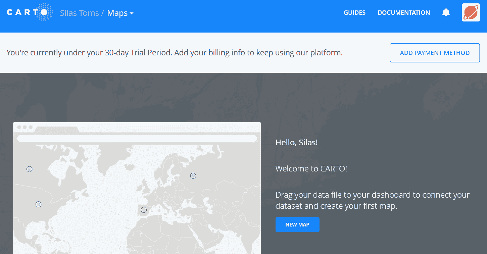

# 添加数据集

使用 DATA LIBRARY 选项卡，将波特兰建筑足迹添加到地图中。从列表中选择数据集，然后点击创建地图。数据集将被添加到账户数据集选项卡和地图创建界面 Builder 中：

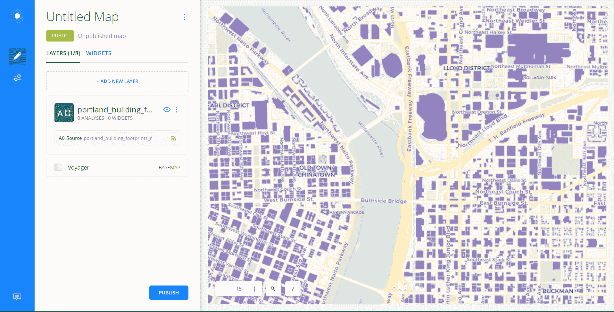

数据集被添加为地图的一层。地图编辑器中可以操纵层的所有方面，包括层的颜色、显示的属性、弹出窗口等。底图也可以进行调整。

可以添加表示属性实时数据的控件。我已经将来自 DATA LIBRARY 的 US Census Tracts 层添加到地图中，并添加了一个显示所选属性字段值的图形控件。此图形是动态的，并将根据地图窗口中显示的具体人口普查区调整显示的值：

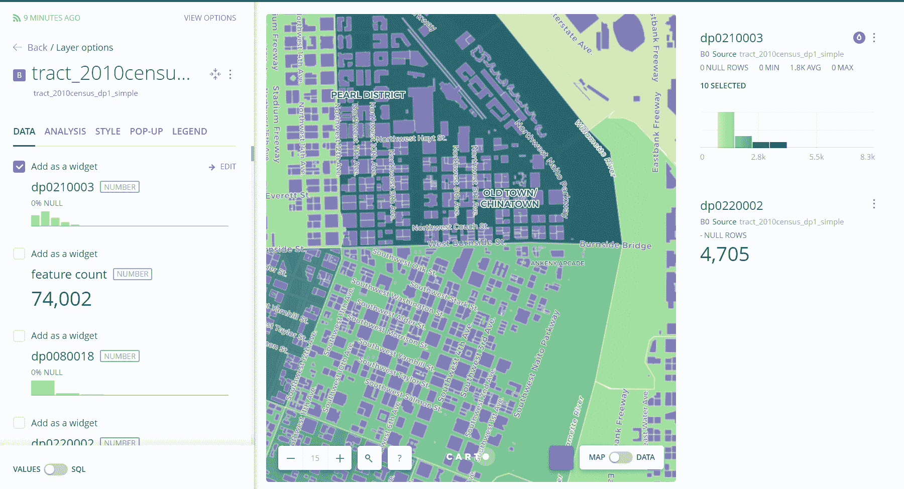

查看 Builder 中的其他选项卡，包括 DATA、ANALYSIS、STYLE、POP-UP 和 LEGEND，以进一步自定义地图。有许多调整和小部件可以使数据交互式。地图也可以设置为公开或私有，并且可以通过点击发布按钮发布到网络上。CARTO 的编辑器和数据导入界面使得创建和共享地图变得非常容易。

# API 密钥

要使用 CARTOframes 连接到 CARTO 账户，需要一个 API 密钥。要访问它，请转到账户仪表板，点击右上角的图片，然后从下拉菜单中选择“您的 API 密钥”链接：

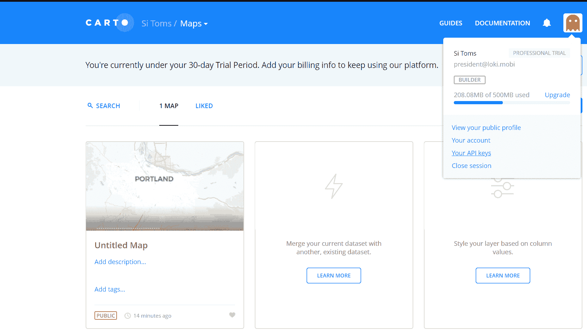

API 密钥是一串用于确保我们将要编写的脚本可以访问账户及其相关数据集的文本。当编写脚本时，复制密钥文本并将其作为 Python 字符串分配给脚本中的变量：

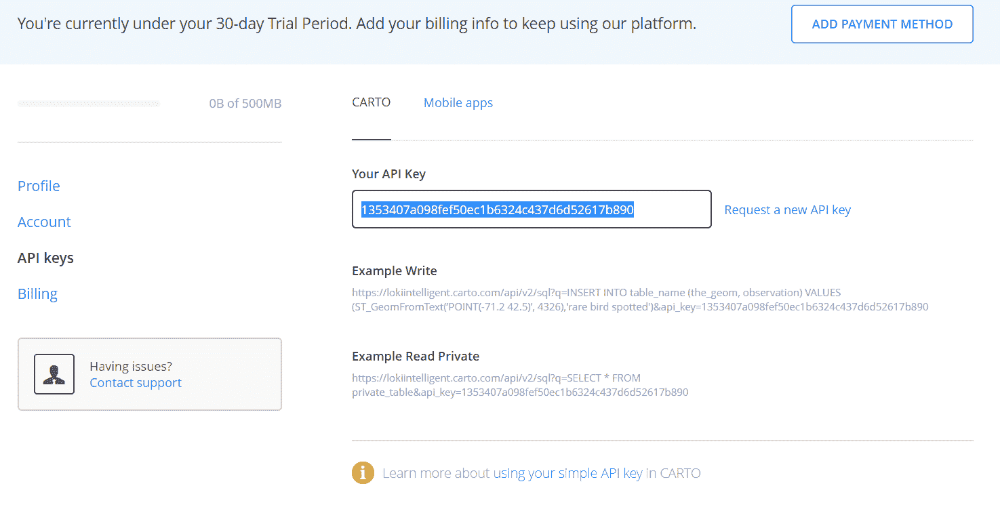

# 添加数据集

有一个方便的方法可以将您计算机上的数据添加到账户中。然而，当添加 shapefiles 时，构成 shapefile 的所有数据文件必须在一个 ZIP 文件中。我们将从 第十一章，*Flask 和 GeoAlchemy2*，将 NBA 场馆 shapefile 作为 ZIP 文件添加到账户中。点击仪表板数据集区域中的“新建数据集”按钮：

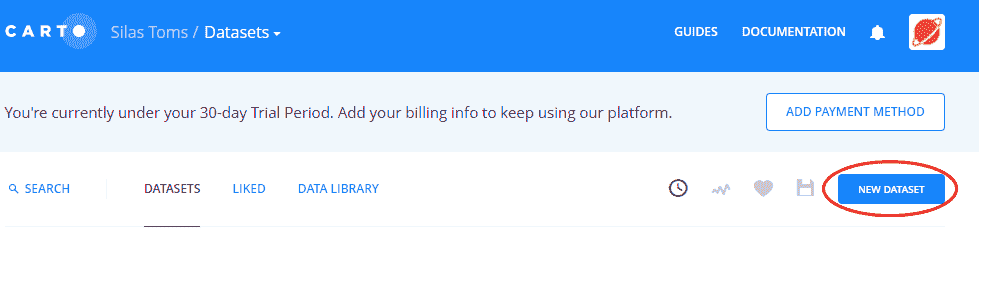

一旦按下“新建数据集”按钮，并出现“连接数据集”界面，点击“浏览”并导航到 ZIP 文件以上传它：

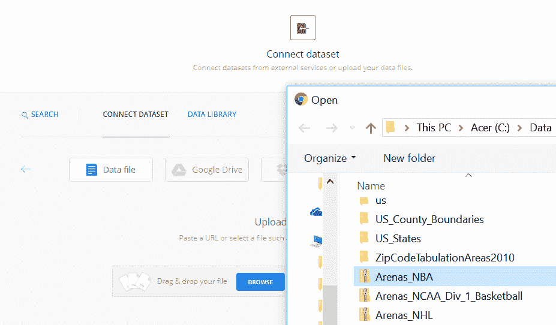

上传过程完成后，数据将被分配一个 URL，并可以使用 Builder 进行编辑。它也可以使用 CARTOframes 进行编辑。

现在账户已经设置好了，并且已经从本地文件以及数据库中添加了一个数据集，我们需要在我们的本地机器上设置 Python 环境，以便能够连接到账户中存储的数据。

# 虚拟环境

为了管理 CARTOframes 和其他相关 Python 3 模块的安装，我们将使用虚拟环境包 `virtualenv`。这个 Python 模块使得在同一台计算机上设置完全独立的 Python 安装变得非常容易。使用 `virtualenv`，会创建一个 Python 的副本，当激活时，所有安装的模块都将与主要的 Python 安装分开（换句话说，虚拟环境中安装的模块不会添加到主要的 `site-packages` 文件夹中）。这大大减少了包管理的麻烦。

# 安装 virtualenv

使用 PyPI 的 `pip` 安装 `virtualenv` 包非常简单 ([pypi.org](http://pypi.org))：

```py
pip install virtualenv
```

这个命令将添加 `virtualenv` 及其支持模块。请确保主要的 Python 安装已经被添加到 Windows 环境变量中，这样 `virtualenv` 才能从命令行调用。

# 运行 virtualenv

要创建虚拟环境，打开命令行并输入以下命令结构，`virtualenv {环境名称}`*.* 在这个例子中，环境名称是 `cartoenv`：

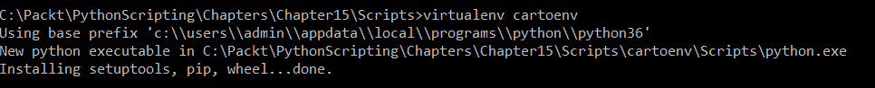

在创建 `virtualenv` 的文件夹内，会生成一系列包含支持 Python 的必要代码文件的文件夹。还有一个 `Lib` 文件夹，其中包含 `site-packages` 文件夹，它将包含在这个 Python 版本中安装的所有模块：

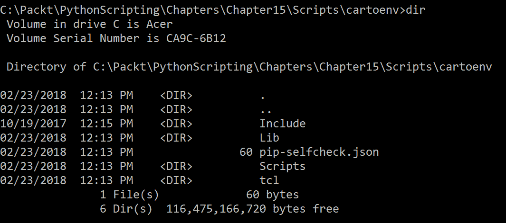

# 激活虚拟环境

要从命令行开始使用新的虚拟环境，在虚拟环境所在的文件夹中传递以下参数。这将运行 `activate` 批处理文件，并启动虚拟环境：

```py
C:\PythonGeospatial3>cartoenv\Scripts\activate
```

一旦激活了虚拟环境，环境名称将出现在文件夹名称之前，这表明命令是在环境中运行的，并且任何执行的操作（如安装模块）都不会影响主要的 Python 安装：

```py
(cartoenv) C:\PythonGeospatial3>
```

在 Linux 环境中，使用命令 `source {environment}/bin/activate` 代替。在 Linux 中编程时，终端中的命令将看起来像这样：

```py
silas@ubuntu16:~$ mkdir carto
silas@ubuntu16:~$ cd carto/
silas@ubuntu16:~/carto$ virtualenv cartoenv
New python executable in /home/silas/carto/cartoenv/bin/python
Installing setuptools, pip, wheel...done.
silas@ubuntu16:~/carto$ source cartoenv/bin/activate
(cartoenv) silas@ubuntu16:~/carto$
```

在任何操作系统上，要停止虚拟环境，传递 `deactivate` 命令。这将结束虚拟会话：

```py
C:\PythonGeospatial3>cartoenv\Scripts\activate

(cartoenv) C:\PythonGeospatial3>deactivate
C:\PythonGeospatial3>
```

# 在 virtualenv 中安装模块

由于每个虚拟环境都与主要的 Python 安装分开，每个环境都必须安装所需的模块。虽然这可能会让人感到烦恼，但 `pip` 使得这个过程相当简单。在设置第一个虚拟环境之后，一个名为 `freeze` 的 `pip` 命令允许你生成一个名为 `requirements.txt` 的文件。这个文件可以被复制到一个新的虚拟环境中，并使用 `pip install` 命令，所有列出的模块都将从 PyPI 添加。

要在当前文件夹中生成 `requirements.txt` 文件，使用以下命令：

```py
(cartoenv) C:\Packt\Chapters>pip freeze > requirements.txt
```

在将文件复制到新的虚拟环境文件夹后，激活环境并传递以下命令来读取文件：

```py
(newenv) C:\Packt\Chapters>pip install -r requirements.txt
```

# 要使用的模块

对于这个虚拟环境，我们将安装两个模块 CARTOframes 和 Jupyter。第二个模块将允许我们运行 Jupyter Notebooks，这些是专门的基于浏览器的编码环境。

激活虚拟环境，并使用以下命令在虚拟环境中安装模块：

```py
(cartoenv) C:\Packt\Chapters>pip install cartoframes
(cartoenv) C:\Packt\Chapters>pip install jupyter
```

所需的所有模块也将被下载并安装，包括我们直接安装的两个模块。使用 `pip` 和 `virtualenv` 使得包安装和管理变得简单快捷。

# 使用 Jupyter Notebook

我们已经在 第一章，*包安装与管理* 以及前一章的多个实例中介绍了 Jupyter Notebook 的基本安装。

在这里，我们将使用 Jupyter Notebook for CARTOframes 来连接账户并分析地理空间数据以及展示它。

# 连接到账户

在第一个代码框中，我们将导入 CARTOframes 模块，并传递 API 密钥字符串以及基础 URL，该 URL 由你的 CARTO 用户名生成，格式为 `https://{username}.carto.com`。在这种情况下，URL 是 `https://lokiintelligent.carto.com`：

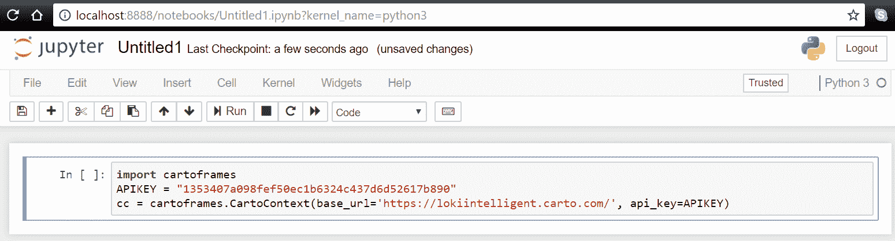

在这个代码块中，API 密钥和 URL 被传递给 `CartoContext` 类，并返回一个 `CartoContext` 连接对象，并将其分配给变量 `cc`。有了这个对象，我们现在可以与我们的账户关联的数据集进行交互，将数据集加载到账户中，甚至可以直接在 Jupyter Notebook 中生成地图。

一旦代码输入到该部分，点击运行按钮以执行当前部分的代码。任何输出都将出现在代码运行的下方 Out 部分。此部分可以包括地图、表格，甚至图表——Jupyter Notebooks 常用于科学计算，因为它们能够即时生成图表并在笔记本中保存。

# 保存凭据

可以使用 `Credentials` 库保存并稍后访问 CARTO 账户的凭据：

```py
from cartoframes import Credentials
creds = Credentials(username='{username}', key='{password}')
creds.save()
```

# 访问数据集

要访问我们已加载到账户中的 NBA 场馆数据集，我们将使用 `CartoContext` 的 `read` 方法，将我们想要交互的数据集名称作为字符串传递。在 Jupyter Notebook 部分，运行以下代码：

```py
import cartoframes
APIKEY = "{YOUR API KEY}"
cc = cartoframes.CartoContext(base_url='https://{username}.carto.com/', api_key=APIKEY)
df = cc.read('arenas_nba')
print(df)
```

使用 `CartoContext` 访问账户。使用 `cc` 对象，`read` 方法从 NBA `arenas` 数据集创建一个 `DataFrame` 对象。`DataFrame` 对象是查询或更新的对象。

`print` 语句将生成一个包含 NBA `arenas` 数据集值的表格，这些数据已被加载到 CARTOframe 对象中：

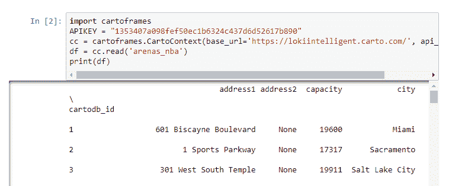

可以使用点符号（例如，`df.address1`）或使用键（例如，`df['address1']`）来访问单个列：

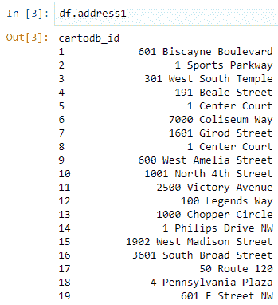

# 选择单个行

要选择 Pandas 数据框中来自 CARTO 账户数据集的特定行，可以将条件语句传递到括号中的对象。在这里，通过传递 NBA 团队名称作为参数，查询 NBA `arenas` 数据集的团队列：

```py
df[df.team=='Toronto Raptors']
```

# 加载 CSV 数据集

要使用 CARTOframes 将数据集加载到账户中，我们将再次使用与 Jupyter 模块一起安装的 `pandas` 库。Pandas 允许我们从 CSV（以及其他文件格式）中读取数据，将其加载到 Pandas 数据框（一个特殊的数据对象，允许进行多种数据操作，并生成输出）。然后，使用 `CartoContext`，将数据框（作为一个表）写入账户：

```py
import pandas as pd
APIKEY = "{YOUR API KEY}"
cc = cartoframes.CartoContext(base_url='https://{username}.carto.com/', api_key=APIKEY)
df = pd.read_csv(r'Path\to\sacramento.csv')
cc.write(df, 'sacramento_addresses')
```

这将把作为数据框导入的 CSV 表写入 CARTO 账户的 DATASETS 部分：

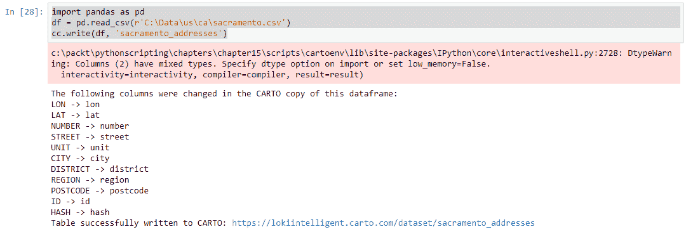

导入的数据集将不是一个地理空间表，而是一个可以查询并连接到空间数据的表。

# 加载 shapefile

如我们之前所探讨的，手动将地理空间数据加载到 CARTO 中很容易。当使用 CARTOframes 时，这甚至更容易，因为它使得自动化数据管理成为可能。新的、更新的数据文件或来自 REST API 的数据可以转换为数据框并写入 CARTO 账户。

Shapefiles 需要安装 GeoPandas 库，因为几何形状需要 GeoPandas `DataFrame` 对象进行数据管理。

# 安装 GeoPandas

GeoPandas，如第五章 Vector Data Analysis 中讨论的，是 Pandas 的地理空间补充。为了能够从形状文件创建数据帧对象，我们必须确保 GeoPandas 已安装并添加到虚拟环境中。使用`pip install`添加 GeoPandas 库：

```py
(cartoenv) C:\PythonGeospatial3>pip install geopandas
```

如果在 Windows 上遇到安装问题，GeoPandas 和 Fiona（GeoPandas 的驱动库）的预构建二进制文件可供在此处使用，以及许多其他 Python 库：[`www.lfd.uci.edu/~gohlke/pythonlibs`](https://www.lfd.uci.edu/~gohlke/pythonlibs)。通过下载它们，将它们复制到一个文件夹中，并使用`pip install`从轮子中安装 Fiona 和 GeoPandas。例如，在这里，Fiona 是从轮子文件安装的：

```py
C:\PythonGeospatial3>pip install Fiona-1.7.11.post1-cp36-cp36m-win_amd64.whl
```

# 写入 CARTO

将形状文件写入 CARTO 账户只需要一个`CartoContext`对象、一个文件路径以及常用的 URL 和 API 密钥组合。现在 GeoPandas 已安装，MLB Stadiums 形状文件可以加载到 GeoPandas `DataFrame`中，然后使用`CartoContext`的`write`方法写入 CARTO 账户：

```py
import geopandas as gdp
import cartoframes
APIKEY = "{API KEY}"
cc = cartoframes.CartoContext(base_url='https://{username}.carto.com/',
                              api_key=APIKEY)
shp = r"C:\Data\Stadiums_MLB\Stadiums_MLB.shp"
data = gdp.read_file(shp)
cc.write(data,"stadiums_mlb")
```

登录到 CARTO 账户以确认数据集已被添加。

# 加载具有几何形状的 CSV

为了确保具有纬度和经度列的表格（在这种情况下为 OpenAddresses 的地址数据）作为地理空间数据集导入，我们必须使用 Shapely 库的`Point`类。每个`Point`几何对象都是从已导入的地址数据集的`LON`和`LAT`字段生成的：

```py
import geopandas as gdp
import cartoframes
import pandas as pd
from shapely.geometry import Point
APIKEY = "{API KEY}"
cc = cartoframes.CartoContext(base_url='https://{username}.carto.com/',
                              api_key=APIKEY)
address_df = pd.read_csv(r'data/city_of_juneau.csv')
geometry = [Point(xy) for xy in zip(address_df.LON, address_df.LAT)]
address_df = address_df.drop(['LON', 'LAT'], axis=1)
crs = {'init': 'epsg:4326'}
geo_df = gdp.GeoDataFrame(address_df, crs=crs, geometry=geometry)
cc.write(geo_df, 'juneau_addresses')
```

在导入 CARTOframes 之前确保导入 GeoPandas 库，以避免从 Fiona 库中导入错误。

# 地理空间分析

要执行地理空间分析，使用云数据集，我们可以通过 CARTOframes 连接，并使用 GeoPandas 和 Shapely 的组合进行空间查询。在这个例子中，NBA `arenas`数据集与 US States 形状文件使用相交空间查询进行比较。如果`arena`对象与州对象相交，则打印出`arena`和州的名称：

```py
import geopandas as gdp
import cartoframes
import pandas as pd
APIKEY = "1353407a098fef50ec1b6324c437d6d52617b890"

cc = cartoframes.CartoContext(base_url='https://lokiintelligent.carto.com/',
                              api_key=APIKEY)
from shapely.geometry import Point
from shapely.wkb import loads
arenas_df = cc.read('arenas_nba')
shp = r"C:\Data\US_States\US_States.shp"
states_df = gdp.read_file(shp)

for index, orig in states_df.iterrows():
    for index2, ref in arenas_df.iterrows():
      if loads(ref['the_geom'], hex=True).intersects(orig['geometry']):
          print(orig['STATE'], ref['team'])
```

# 编辑和更新数据集

因为 CARTOframes 集成了可以在内存中编辑的 Pandas 数据帧对象，并将写入存储在 CARTO 账户中的数据集，我们可以创建脚本来自动化地理空间数据的上传。数据集可以完全更新，或者可以使用 Pandas 数据方法（如`replace`）更新单个行和值。这，加上 Builder，CARTO 网络地图部署工具，使得创建具有网络地图前端和云数据存储的 GIS 变得容易，这些数据可以通过脚本进行管理。

在这个示例代码中，使用`intersect`查询找到包含 NBA `arena`的州的名称。这些名称被添加到一个列表中，然后该列表被添加到`arena` dataframe 中作为名为 states 的新列。存储在`arenas`数据集中的几何数据需要使用`loads`模块转换为 Shapely 对象：

```py
import geopandas as gdp
import cartoframes
import pandas as pd
from shapely.wkb import loads
APIKEY = "API KEY"
cc = cartoframes.CartoContext(base_url='https://{username}.carto.com/',
                api_key=APIKEY)
arenas_df = cc.read('arenas_nba')
shp = r"C:\Data\US_States\US_States.shp"
states_df = gdp.read_file(shp)
data = []
for index, ref in arenas_df.iterrows():
  check = 0
  for index2, orig in states_df.iterrows():
    if loads(ref['the_geom'], hex=True).intersects(orig['geometry']):
      data.append(orig['STATE'])
      check = 1
  if check == 0:
    data.append(None)
arenas_df['state'] = data
cc.write(arenas_df,'arenas_nba', overwrite=True)
```

# overwrite=True

每次更新数据集时，必须将更改写入 CARTO 账户。要使用新数据覆盖云数据库中的数据，必须将 `overwrite` 参数设置为 `True`：

```py
cc.write(data,"stadiums_mlb",'overwrite=True')
```

# 创建地图

由于 Jupyter Notebooks 的交互性，代码和代码输出是同时存在的。当处理地理空间数据时，这非常棒，因为它使得创建数据地图变得容易。在这个例子中，NBA `arenas` 和 MLB 体育场数据集被添加到一个覆盖 `BaseMap` 对象的地图上：

```py
from cartoframes import Layer, BaseMap, styling
cc.map(layers=[BaseMap('light'),
               Layer('arenas_nba',),
              Layer('stadiums_mlb')], interactive=True)
```

生成的输出如下：

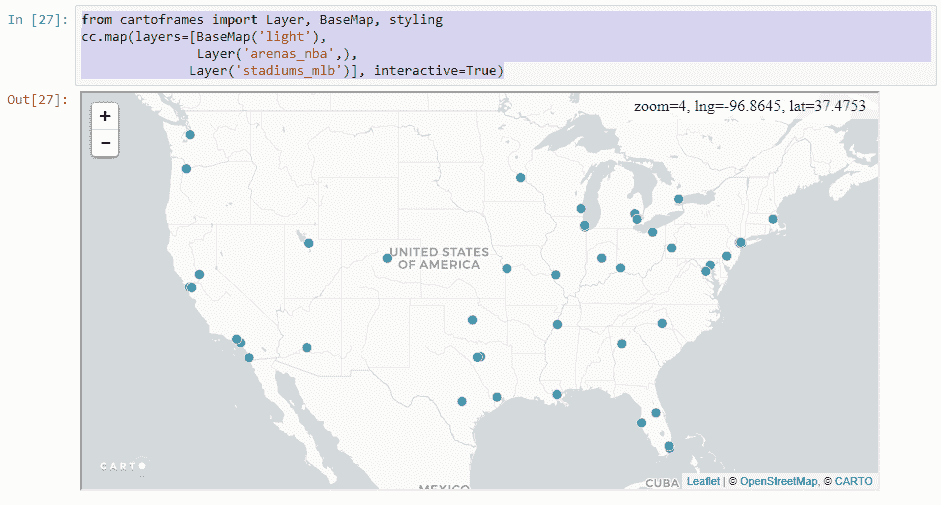

# 摘要

本章涵盖了以下主题。首先，我们介绍了 CARTOframes Python 库，并讨论了它与 CARTO 栈的其他部分（如 CARTO Builder 和 CARTO Data Observatory）的关系。接下来，我们解释了如何安装 CARTOframes 库，它依赖于哪些其他 Python 包，以及在哪里查找文档。由于 CARTOframes 使用 CARTO Builder 的数据，我们解释了如何设置 CARTO Builder 账户。在构成本章其余部分的示例脚本中，我们看到了如何将库与 `pandas` 数据框集成，如何处理表格，以及如何制作地图并将它们与其他地理空间库（如 Shapely 和 GeoPandas）结合使用。

在下一章中，我们将介绍另一个利用 Jupyter Notebooks 和地图可视化技术的模块，即 MapboxGL—Jupyter。
