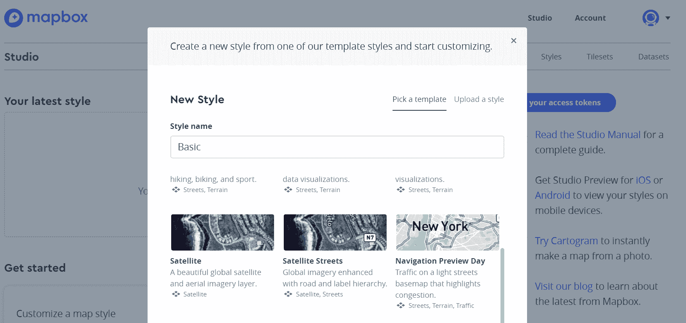

# 自动化云制图

Mapbox 已成为移动制图和数据可视化的同义词。除了被应用程序开发者和制图师采用的基图样式工具集外，他们还在生产用 Python 和 JavaScript 编写的有趣的制图工具。

将这两种有用的语言结合成一个包，Mapbox 最近发布了新的 MapboxGL—Jupyter Python 模块。这个新模块允许在 Jupyter Notebook 环境中即时创建数据可视化。与 Mapbox Python SDK 一起，一个允许 API 访问账户服务的模块，Python 使将 Mapbox 工具和服务添加到企业地理空间应用变得容易。

在本章中，我们将学习：

+   如何创建 Mapbox 账户以生成访问令牌

+   如何样式化自定义基础图

+   对云数据和基础图的读写访问

+   如何创建面状图

+   如何创建渐变圆可视化

# 所有制图相关内容

由埃里克·冈德森于 2010 年创立的 Mapbox 迅速发展，并超越了其初创公司的根基，成为制图复兴的领导者。他们的 MapboxGL JavaScript API 是一个用于创建交互式网络地图和数据可视化的有用库。他们向地理空间社区贡献了多个开放制图规范，包括矢量瓦片。

Mapbox 专注于为地图和应用程序开发者提供定制基础图瓦片，将自己定位为网络制图和移动应用领域的领先软件公司。本章中使用的两个 Python 模块允许 GIS 经理和开发人员将他们的服务和工具集成到企业地理信息生态系统中。

# 如何将 Mapbox 集成到您的 GIS 中

通过他们的 JavaScript 库和新的 MapboxGL—Jupyter Python 模块，Mapbox 工具的使用比以往任何时候都更容易。地理空间开发者和程序员可以将他们的工具集成到现有的 GIS 工作流程中，或者创建利用 Mapbox 提供的套件的新地图和应用程序。

Mapbox，就像 CARTO 一样，允许基于账户的云数据存储。然而，他们的重点更少在分析工具上，更多在制图工具上。对于大小不同的制图团队，使用 Mapbox 工具可以降低创建和支持自定义基础图的成本，并且比其他地图瓦片选项（如 Google Maps API）提供更大的节省。

Mapbox Studio 使创建具有制图外观和感觉的地图变得容易，可以与公司或部门的品牌相匹配。基础图可以使用现有样式构建，并叠加您的组织层，或者设计一个全新的基础图。它甚至允许基于被拖入工作室的图像进行样式化，根据从图像像素生成的直方图为要素分配颜色。

# Mapbox 工具

在地理空间领域（例如 Mapbox 开源项目负责人 Sean Gillies，Shapely、Fiona 和 Rasterio 的主要开发者）的领导下，Mapbox 为开源许可下的分析和地图制作 Python 库做出了贡献。他们新的 MapboxGL—Jupyter 库代表了一种利用其工具套件结合其他 Python 模块（如 Pandas/GeoPandas）和多种数据类型（如 GeoJSON、CSVs 以及甚至 shapefiles）的新方法。

除了新的 Python 模块外，Mapbox 的开源工具还包括建立在**Web 图形库**（**WebGL**）之上的 MapboxGL JavaScript 库，以及 Mapbox Python SDK。

# MapboxGL.js

MapboxGL 建立在知名的 JavaScript 地图库`Leaflet.js`之上。Leaflet 于 2011 年发布，支持多种知名的 Web 地图应用，包括 Foursquare、Craigslist 和 Pinterest。Leaflet 的开发者 Vladimir Agafonkin 自 2013 年以来一直在 Mapbox 工作。

在 Leaflet 原始开发努力的基础上，`MapboxGL.js`集成了 WebGL 库，利用 HTML 5 的`canvas`标签支持无需插件的 Web 图形。`MapboxGL.js`支持矢量瓦片，以及平滑缩放和平移的 3D 环境。它支持 GeoJSON 叠加以及标记和形状。包括点击、缩放和平移在内的事件可以用来触发数据处理函数，使其非常适合交互式 Web 地图应用。

# Mapbox Python SDK

Mapbox Python SDK 用于访问大多数 Mapbox 服务，包括路线、地理编码、分析和数据集。对支持数据编辑和上传、管理管理和基于位置的查询的云服务进行低级访问，允许与本地 GIS 进行企业集成和扩展。

# 安装 Python SDK

使用`pip`安装 Python SDK，以允许对 Mapbox 服务的 API 访问。此模块不是使用 MapboxGL—Jupyter 工具所必需的，但对于上传和查询很有用：

```py
C:\Python3Geospatial>pip install mapbox
```

在此处下载 Mapbox Python SDK：

[`github.com/mapbox/mapbox-sdk-py`](https://github.com/mapbox/mapbox-sdk-py).

# 开始使用 Mapbox

要开始使用 Mapbox 工具和 Mapbox Studio，您需要注册一个账户。这将允许您生成 API 密钥，这些密钥是添加 Mapbox 底图瓦片到网络地图以及创建区分您地图的定制底图所必需的。有了这个账户，您还可以将数据加载到云端，以便在您的地图中使用。

# 注册 Mapbox 账户

要使用 Mapbox 工具和底图，您必须注册一个账户。这是一个简单的过程，需要提供用户名、电子邮件和密码：


注册后，您将被带到账户仪表板，其中可以生成 API 访问令牌并访问 Mapbox Studio。仪表板还包括您的账户统计信息，包括对各种服务（如路线、地理编码和数据集）的 API 调用次数。

# 创建 API 令牌

新账户默认包含账户仪表板，该仪表板提供 API 访问令牌。这个公开访问令牌或密钥以 pk 开头，是一长串字符。此 API 访问令牌用于验证将使用此账户构建的所有地图和应用程序。复制字符串并将其添加到您的地图中：


要创建新的 API 访问令牌，点击“创建令牌”按钮并选择它将允许的访问级别：


在 JavaScript 代码中，API 访问令牌被传递给 MapboxGL 对象以启用对瓦片和工具的访问。以下是一个简单的网络地图，使用 HTML/JavaScript 作为如何使用访问令牌创建地图的示例。将以下代码中提到的访问令牌替换为您自己的公开访问令牌：

```py
<html><head>
<script src='https://api.tiles.mapbox.com/mapbox-gl-js/v0.44.1/mapbox-gl.js'></script>
<link href='https://api.tiles.mapbox.com/mapbox-gl-js/v0.44.1/mapbox-gl.css' rel='stylesheet' />
</head><body>
<div id='map' style='width: 400px; height: 300px;'></div>
<script>
mapboxgl.accessToken = 'pk.eyJ1IjoibG9raXByZXNpZGVud0.8S8l9kH4Ws_ES_ZCjw2i8A';
var map = new mapboxgl.Map({
    container: 'map',
    style: 'mapbox://styles/mapbox/streets-v9'
});
</script></body></html>
```

将此代码保存为"index.html"，然后使用浏览器打开以查看简单的地图。请确保将早期示例中的 API 访问令牌替换为您自己的密钥，否则地图将不会显示。

探索文档以了解 API 访问令牌的各种配置：

[`www.mapbox.com/help/how-access-tokens-work/`](https://www.mapbox.com/help/how-access-tokens-work/).

# 将数据添加到 Mapbox 账户

Mapbox 支持使用您自己的数据。您不仅可以为底图瓦片设置样式，甚至可以将自己的数据添加到瓦片中，使其更符合您的客户或用户的需求。这可以通过 Mapbox Python SDK 和上传以及数据集 API 进行编程管理。

要上传数据，您必须创建一个秘密 API 访问令牌。这些令牌是通过之前详细说明的创建令牌过程创建的，但包括秘密范围。选择以下范围以允许数据集和瓦片集的读写能力：

+   DATASETS:WRITE

+   UPLOADS:READ

+   UPLOADS:WRITE

+   TILESETS:READ

+   TILESETS:WRITE

在此处了解更多关于将数据加载到您的 Mapbox 账户的信息：

[`www.mapbox.com/help/how-uploads-work/`](https://www.mapbox.com/help/how-uploads-work/).

# 瓦片集

瓦片集是经过分块处理的栅格数据，用于创建**可滑动地图**，允许它们叠加在底图上。它们可以从矢量数据生成，以创建带有您自己数据的自定义底图。使用 Mapbox Python SDK 中的`Uploader`类，可以将 GeoJSON 文件和 shapefile 以编程方式作为瓦片集加载到您的云账户中。

在此处了解更多关于瓦片集的信息：

[`www.mapbox.com/api-documentation/#tilesets`](https://www.mapbox.com/api-documentation/#tilesets).

# 数据集

数据集是 GeoJSON 图层，可以比瓦片集更频繁地编辑。虽然您可以使用账户仪表板上传数据集，但要加载大于 5 MB 的数据集，您必须使用数据集 API。

在这里了解更多关于数据集的信息：

[`www.mapbox.com/api-documentation/#datasets`](https://www.mapbox.com/api-documentation/#datasets).

# 示例 - 上传 GeoJSON 数据集

`mapbox`模块有一个`Datasets`类，用于在账户中创建和填充数据集。此演示代码将从邮政编码 GeoJSON 文件中读取，并将一个邮政编码 GeoJSON 对象加载到新的数据集中。将秘密访问令牌传递给`Datasets`类：

```py
from mapbox import Datasets
import json
datasets = Datasets(access_token='{secrettoken}')
create_resp = datasets.create(name="Bay Area Zips", 
              description = "ZTCA zones for the Bay Area")
listing_resp = datasets.list()
dataset_id = [ds['id'] for ds in listing_resp.json()][0]
data = json.load(open(r'ztca_bayarea.geojson'))
for count,feature in enumerate(data['features'][:1]):
    resp = datasets.update_feature(dataset_id, count, feature)
```

这将为图层添加一个邮政编码，您可以在账户仪表板上查看：


# 示例 - 将数据作为瓦片集上传

可以将瓦片集添加到自定义底图样式，这使得快速加载数据图层成为可能。此演示代码使用具有读写能力的秘密令牌，通过 Mapbox Python SDK 将 GeoJSON 文件作为瓦片集上传：

```py
token = 'sk.eyJ1IjoibG9oxZGdqIn0.Y-qlJfzFzr3MGkOPPbtZ5g' #example secret token
from mapbox import Uploader
import uuid
set_id = uuid.uuid4().hex
service = Uploader(access_token=token)
with open('ztca_bayarea.geojson', 'rb') as src:
    response = service.upload(src, set_id)
print(response)
```

如果返回的响应是`201`响应，则上传成功。

在这里了解更多关于上传 API 的信息：

[`www.mapbox.com/api-documentation/?language=Python`](https://www.mapbox.com/api-documentation/?language=Python).

# Mapbox Studio

即使对于经验丰富的制图员来说，创建自定义底图也可能是一个耗时的过程。为了帮助简化这个过程，Mapbox 工程师使用了**Open Street Map**（**OSM**）数据来生成预构建的自定义底图，这些底图可用于商业和非商业应用。使用 Mapbox Studio，还可以调整这些样式以添加更多定制功能。此外，可以从头开始构建底图，以创建适用于您应用程序的特定外观：


要访问 Mapbox Studio，请登录账户仪表板并点击 Mapbox Studio 链接。在这个 Studio 环境中，您可以管理底图、瓦片集和数据集。

# 定制底图

点击新建样式按钮并选择卫星街道主题：



一个快速教程解释了定制选项。已经添加了各种可用的图层，并且可以通过点击目录表中的图层来调整它们的标签和样式。还可以添加新的图层，包括账户瓦片集：


可以调整地图缩放级别、方位角、俯仰角和初始坐标。使用地图位置菜单，可以更改这些地图参数，并使用底部的锁定按钮将其锁定为默认位置：


探索其他样式选项，例如标签颜色和图层比例级别。完成定制后，通过点击发布样式按钮来发布样式。样式 URL 将添加到这些 Jupyter Notebook 练习的 MapboxGL 可视化或网络地图中。

# 添加瓦片集

要将你的数据添加到基图样式，请点击图层按钮并从可用选择中选择一个瓦片集。之前使用 Mapbox Python SDK 加载的 zip 瓦片集应该可用，并可以添加到基图并对其进行样式化：


# 虚拟环境

使用 `virtualenv`（参见上一章中的安装说明）启动一个虚拟环境，并使用 `pip` 安装以下列出的模块。如果你有一个文件夹路径为 `C:\Python3Geospatial`，`virtualenv` 将创建一个虚拟环境文件夹，这里称为 `mapboxenv`，它可以按以下方式激活：

```py
C:\Python3Geospatial>virtualenv mapboxenv
Using base prefix 'c:\\users\\admin\\appdata\\local\\programs\\python\\python36'
New python executable in C:\Python3Geospatial\mapboxenv\python.exe
Installing setuptools, pip, wheel...done.

C:\Python3Geospatial>mapboxenv\Scripts\activate
```

# 安装 MapboxGL – Jupyter

MapboxGL—Jupyter 库可以通过 `pip` 从 [PyPI.org](http://pypi.org) 仓库获取：

```py
(mapboxenv) C:\Python3Geospatial>pip install mapboxgl
```

所有支持模块都将与 Mapbox 创建的核心库一起定位和安装。

# 安装 Jupyter Notebooks

在虚拟环境中安装 Jupyter Notebooks 库：

```py
(mapboxenv) C:\Python3Geospatial>pip install jupyter
```

# 安装 Pandas 和 GeoPandas

Pandas 应该已经安装，因为它是与 GeoPandas 一起安装的，但如果尚未安装，请使用 `pip` 在 [PyPI.org](http://pypi.org) 仓库中查找它：

```py
(mapboxenv) C:\Python3Geospatial>pip install geopandas
```

如果你在 Windows 计算机上安装这些模块时遇到任何问题，请在此处探索预构建的 wheel 二进制文件（下载后使用 `pip` 安装）：

[`www.lfd.uci.edu/~gohlke/pythonlibs/`](https://www.lfd.uci.edu/~gohlke/pythonlibs/)

# 使用 Jupyter Notebook 服务器

启动 Jupyter Notebook 服务器很简单。当使用虚拟环境时，你需要首先激活环境，然后启动服务器。如果不这样做，请确保 Python 和 Notebook 服务器位置在路径环境变量中。

打开命令提示符并输入 `jupyter notebook` 以启动服务器：

```py
(mapboxenv) C:\Python3Geospatial>jupyter notebook
```

服务器将启动并显示其端口号和可以用于重新登录网页浏览器的令牌：


启动服务器将在系统浏览器中打开一个浏览器窗口。服务器地址是 `localhost`，默认端口是 `8888`。浏览器将在 `http://localhost:8888/tree` 打开：


点击新建按钮创建一个新的笔记本。从笔记本部分选择 Python 版本，新的笔记本将在第二个标签页中打开。这个笔记本应该重命名，因为它很快就会变得难以组织未命名的笔记本：


窗口打开后，编码环境将处于活动状态。在这个例子中，我们将使用 GeoPandas 导入人口普查区数据，将其转换为点数据，选择特定列，并使用 MapboxGL—Jupyter 进行可视化。

# 使用 GeoPandas 导入数据

导入所需的模块并将 API 密钥分配给一个变量。以下命令应添加到 Jupyter Notebook 单元中：

```py
import geopandas as gpd
import pandas as pd
import os
from mapboxgl.utils import *
from mapboxgl.viz import *
token = '{user API Key}'
```

API 密钥也可以分配给 Windows 路径环境变量（例如，`"MAPBOX_ACCESS_TOKEN"），并使用`os`模块调用：

```py
token = os.getenv("MAPBOX_ACCESS_TOKEN")
```

# 从多边形创建点数据

旧金山地区的人口普查区 GeoJSON 文件包含具有多边形`geometry`的人口数据。为了创建第一个可视化，我们需要将几何类型转换为点：

```py
tracts = gpd.read_file(r'tracts_bayarea.geojson')
tracts['centroids'] = tracts.centroid
tract_points = tracts
tract_points = tract_points.set_geometry('centroids')
tract_points.plot()
```

之前代码的输出如下：


# 数据清理

这份数据可视化将比较旧金山地区的男性和女性人口。为了生成圆可视化，我们可以使用 Geopandas 的数据帧操作重命名和删除不必要的列：

```py
tract_points['Total Population'] = tract_points['ACS_15_5YR_S0101_with_ann_Total; Estimate; Total population']
tract_points['Male Population'] = tract_points['ACS_15_5YR_S0101_with_ann_Male; Estimate; Total population']
tract_points['Female Population'] = tract_points['ACS_15_5YR_S0101_with_ann_Female; Estimate; Total population']
tract_points = tract_points[['Total Population',
                'Male Population','Female Population',
                'centroids' ]]
```

这段代码从三个现有列中创建了三个新列，通过传递新列的名称并将数据值赋给现有列。然后，整个 GeoDataFrame（在内存中）被重写，只包含三个新列和中心点列，消除了不需要的列。探索新 GeoDataFrame 的前五行可以让我们看到新的数据结构：


# 将点保存为 GeoJSON

将新清理的 GeoDataFrame 保存下来是将其加载到 Mapbox 的`CircleViz`类所必需的。必须指定 GeoJSON 驱动程序，因为默认的输出文件格式是 shapefile：

```py
tract_points.to_file('tract_points.geojson',driver="GeoJSON")
```

# 将点添加到地图上

要简单地查看地图上的点，我们可以提供一些参数并调用`CircleViz`对象的`show`属性：

```py
viz = CircleViz('tract_points.geojson', access_token=token, 
                radius = 2, center = (-122, 37.75), zoom = 8)
viz.show()
```

之前的代码将产生以下输出：


为了分类数据，我们可以为特定字段设置颜色停止点，通过传递包含相关颜色信息的类断点列表：

```py
color_stops = [
    [0.0, 'rgb(255,255,204)'],    [500.0, 'rgb(255,237,160)'],
    [1000.0, 'rgb(252,78,42)'],    [2500.0, 'rgb(227,26,28)'],
    [5000.0, 'rgb(189,0,38)'],
    [max(tract_points['Total Population']),'rgb(128,0,38)']
]
viz.color_property = 'Total Population'
viz.color_function_type = 'interpolate'
viz.color_stops = color_stops
viz.radius = 1
viz.center = (-122, 37.75)
viz.zoom = 8

viz.show() 
```

输出将看起来像这样：


向`tract_points` GeoDataFrame 添加一些新字段并重新保存：

```py
tract_points['Percent Male'] = tract_points['Male Population']/tract_points['Total Population']
tract_points['Percent Female'] = tract_points['Female Population']/tract_points['Total Population']
tract_points.to_file("tract_points2.geojson", driver="GeoJSON")
```

# 创建渐变色可视化

这段代码将手动为数据的特定部分分配颜色，将数据分为类别。这也为数据分配了特定的半径大小，以便可视化可以通过颜色和圆的大小传达信息：

```py
color_stops = [
    [0.0, 'rgb(107,174,214)'],    [3000.0, 'rgb(116,196,118)'],
    [8000.0, 'rgb(254,153,41)'],
    [max(tract_points['Total Population']), 'rgb(222,45,38)'], 
]

minmax = [min(tract_points['Percent Male']),
          max(tract_points['Percent Male'])]
diff = minmax[1] - minmax[0]
radius_stops = [
    [round(minmax[0],2), 4.0],
    [round(minmax[0]+(diff/6.0),2), 7.0],
    [round(minmax[1]-(diff/2.0),2), 10.0],
    [minmax[1], 15.0],]
```

设置了这些半径大小和颜色范围后，它们可以应用于新的 GeoJSON 中的两个字段：`总人口`和`男性百分比`。对于这个可视化，圆的大小将表示人口的男性百分比，颜色将表示总人口：

```py
vizGrad = GraduatedCircleViz('tract_points2.geojson', access_token=token)

vizGrad.color_function_type = 'interpolate'
vizGrad.color_stops = color_stops
vizGrad.color_property = 'Total Population'
vizGrad.color_default = 'grey'
vizGrad.opacity = 0.75

vizGrad.radius_property = 'Percent Male'
vizGrad.radius_stops = radius_stops
vizGrad.radius_function_type = 'interpolate'
vizGrad.radius_default = 1

vizGrad.center = (-122, 37.75)
vizGrad.zoom = 9
vizGrad.show()
```

这将产生一个交互式地图，如下所示：


# 自动设置颜色、大小和断点

与手动设置颜色、半径大小和断点不同，MapboxGL—Jupyter 包含了创建颜色（或大小）与断点值之间匹配的实用工具（例如 `create_color_stops`）。颜色方案通过传递 `YlOrRd` 关键字（表示**黄橙红**）来设置。此外，我们可以通过设置可视化样式为样式 URL 来调整底图：

```py
measure_color = 'Percent Male'
color_breaks = [round(tract_points[measure_color].quantile(q=x*0.1),3) for x in range(1, 11,3)]
color_stops = create_color_stops(color_breaks, colors='YlOrRd')
measure_radius = 'Total Population'
radius_breaks = [round(tract_points[measure_radius].quantile(q=x*0.1),1) for x in range(2, 12,2)]
radius_stops = create_radius_stops(radius_breaks, 5.0, 20)
vizGrad = GraduatedCircleViz('tract_points2.geojson', 
                          access_token=token,
                          color_property = measure_color,
                          color_stops = color_stops,
                          radius_property = measure_radius,
                          radius_stops = radius_stops,
                          stroke_color = 'black',
                          stroke_width = 0.5,
                          center = (-122, 37.75),
                          zoom = 9,
                          opacity=0.75)
vizGrad.style='mapbox://styles/mapbox/dark-v9'
vizGrad.show()
```

深色底图使得渐变圆可视化更加清晰可见：


探索文档中可用的可视化选项：

[`github.com/mapbox/mapboxgl-jupyter/blob/master/docs-markdown/viz.md.`](https://github.com/mapbox/mapboxgl-jupyter/blob/master/docs-markdown/viz.md)

探索这里可用的数据实用工具：

[`github.com/mapbox/mapboxgl-jupyter/blob/master/docs-markdown/utils.md`](https://github.com/mapbox/mapboxgl-jupyter/blob/master/docs-markdown/utils.md).

探索这里可用的颜色渐变：

[`github.com/mapbox/mapboxgl-jupyter/blob/master/mapboxgl/colors.py`](https://github.com/mapbox/mapboxgl-jupyter/blob/master/mapboxgl/colors.py).

# 创建一个面状图

使用面状图，我们可以显示一个多边形 GeoJSON 文件。使用 `tracts` GeoDataFrame，我们将创建另一个具有多边形 `geometry` 和一个表格字段的 GeoDataFrame，并将其保存为 `GeoJSON` 文件：

```py
tract_poly = tracts
tract_poly['Male Population'] = tract_poly['ACS_15_5YR_S0101_with_ann_Male; Estimate; Total population']
tract_poly = tract_poly[['Male Population','geometry' ]]
tract_poly.to_file('tracts_bayarea2.geojson', driver="GeoJSON")
```

可视化是使用 `ChoroplethViz` 类创建的。底图样式是 *MapBox Studio* 章节中先前创建的卫星影像样式 URL：

```py
vizClor = ChoroplethViz('tracts_bayarea2.geojson', 
    access_token=API_TOKEN,
    color_property='Male Population',
    color_stops=create_color_stops([0, 2000, 3000,5000,7000, 15000], 
    colors='YlOrRd'),
    color_function_type='interpolate',
    line_stroke='-',
    line_color='rgb(128,0,38)',
    line_width=1,
    opacity=0.6,
    center=(-122, 37.75),
    zoom=9)
vizClor.style='mapbox://styles/lokipresident/cjftywpln22sp9fcpqa8rl'
vizClor.show()
```

生成的输出如下：


# 保存地图

要保存面状图，请使用可视化的 `create_html` 方法：

```py
with open('mpop.html', 'w') as f:
    f.write(vizClor.create_html())
```

要在本地查看保存的 HTML 文件，请打开命令提示符，并在与保存的 HTML 文件相同的文件夹中使用 Python 启动本地 HTTP 服务器。然后，在浏览器中打开 `http://localhost:8000/mpop.html` 来查看地图：

```py
C:\Python3Geospatial>python -m http.server
Serving HTTP on 0.0.0.0 port 8000 (http://0.0.0.0:8000/) ...
```

# 创建热图

使用 `HeatmapViz` 类从数据生成热图：

```py
measure = 'Female Population'
heatmap_color_stops = create_color_stops([0.01, 0.25, 0.5, 0.75, 1], colors='PuRd')
heatmap_radius_stops = [[0, 3], [14, 100]] 
color_breaks = [round(tract_poly[measure].quantile(q=x*0.1), 2) for x in range(2,10)]
color_stops = create_color_stops(color_breaks, colors='Spectral')
heatmap_weight_stops = create_weight_stops(color_breaks) 
vizheat = HeatmapViz('tracts_points2.geojson', 
                  access_token=token,
                  weight_property = "Female Population",
                  weight_stops = heatmap_weight_stops,
                  color_stops = heatmap_color_stops,
                  radius_stops = heatmap_radius_stops,
                  opacity = 0.8,
                  center=(-122, 37.78),
                  zoom=7,
                  below_layer='waterway-label'
                 )
vizheat.show()
```

# 使用 Mapbox Python SDK 上传数据

使用 MapboxGL—Jupyter 和 Mapbox Python SDK 在账户中存储数据集并将它们与其他表格数据连接起来是可能的。加载 GeoJSON 文件需要仅分配给秘密 API 访问令牌的特定权限。为了确保使用的 API 令牌具有正确的范围，您可能需要生成一个新的 API 令牌。转到您的账户仪表板并生成一个新的令牌，并确保您检查了如 *Mapbox 入门* 部分所示的读取和写入能力：

# 创建数据集

第一步是创建一个数据集，如果您还没有创建，则此代码将在账户中生成一个空数据集，它将具有 `datasets.create` 方法提供的名称和描述：

```py
from mapbox import Datasets
import json
datasets = Datasets(access_token={secrettoken})
create_resp = datasets.create(name="Bay Area Zips", 
              description = "ZTCA zones for the Bay Area")
```

# 将数据加载到数据集中

要将数据加载到新的数据集中，我们将遍历包含在邮政编码 GeoJSON 中的特征，并将它们全部写入数据集（而不是像之前演示的那样只写入一个）。由于此文件大于 5MB，必须使用 API 加载，该 API 通过 `mapbox` 模块访问。`update_feature` 方法所需的全部参数包括数据集的 ID（使用 `datasets.list` 方法检索）、行 ID 和 `feature`： 

```py
listing_resp = datasets.list()
dataset_id = [ds['id'] for ds in listing_resp.json()][0]
data = json.load(open(r'ztca_bayarea.geojson'))
for count,feature in enumerate(data['features']):
    resp = datasets.update_feature(dataset_id, count, feature)
```

完成的数据集现在在 Mapbox Studio 中看起来是这样的：


# 从数据集中读取数据

要读取存储在数据集中的 JSON 数据，请使用 `read_dataset` 方法：

```py
 datasets.read_dataset(dataset_id).json()
```

# 删除行

要从数据集中删除特定行，请将数据集 ID 和行 ID 传递给 `datasets.delete_feature` 方法：

```py
resp = datasets.delete_feature(dataset_id, 0)
```

# 摘要

在本章中，我们学习了如何使用 MapboxGL—Jupyter 和 Mapbox Python SDK 创建数据可视化以及将数据上传到 Mapbox 账户。我们创建了点数据可视化、面状图、热力图和渐变圆可视化。我们学习了如何自定义底图样式，如何将其添加到 HTML 地图中，以及如何将自定义瓦片集添加到底图中。我们还学习了如何使用 GeoPandas 将多边形数据转换为点数据，以及如何可视化结果。

在下一章中，我们将探讨使用 Python 模块和 Hadoop 进行地理空间分析的应用。
