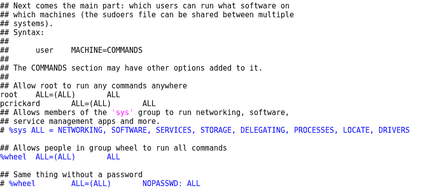
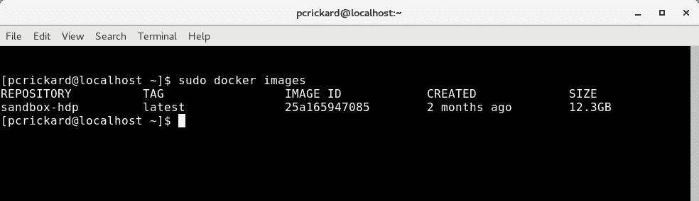
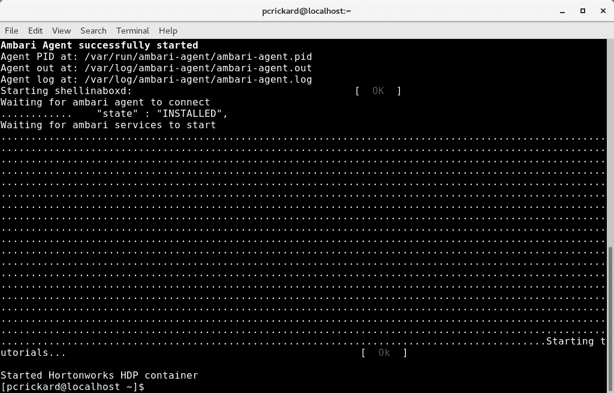
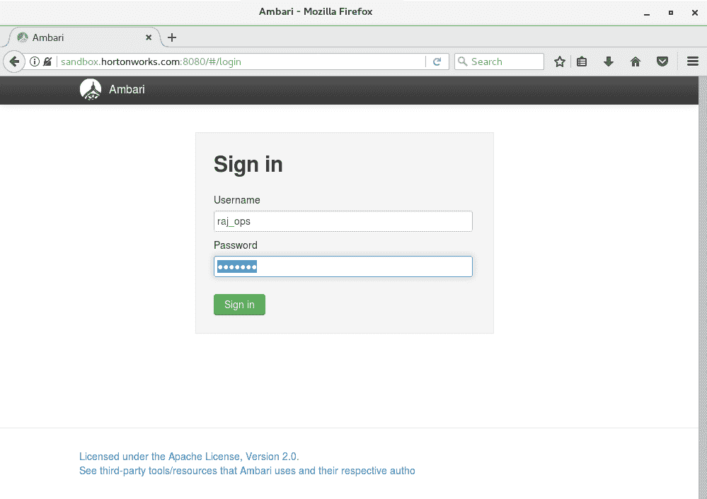
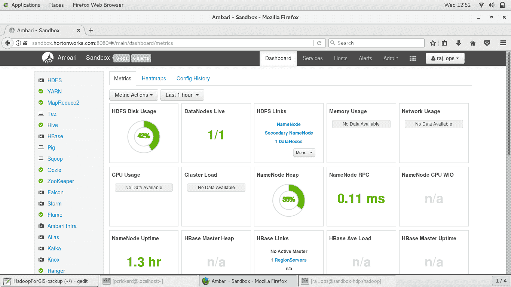
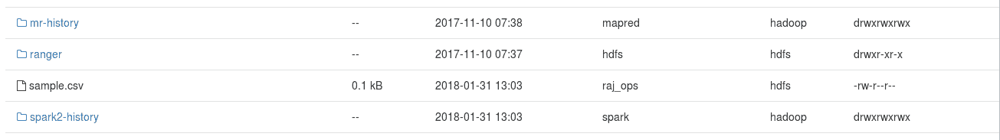
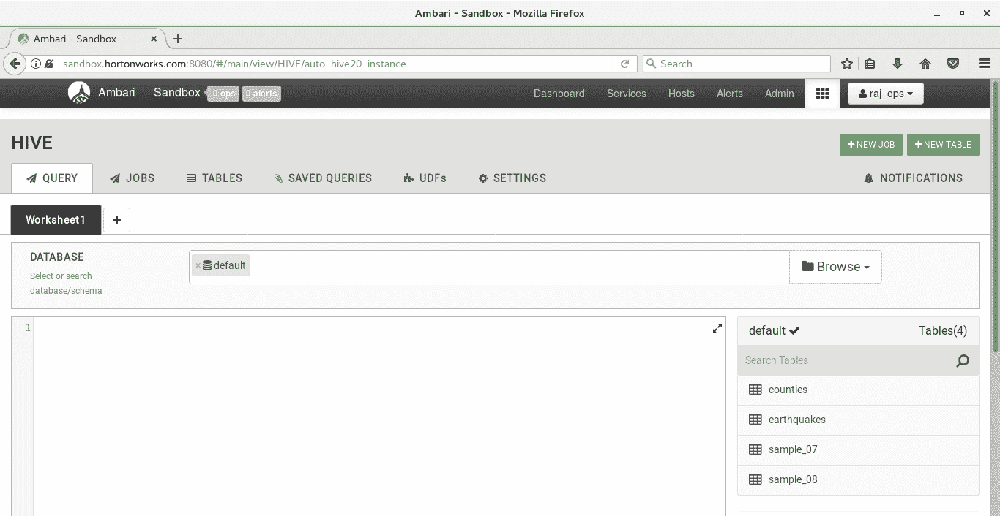
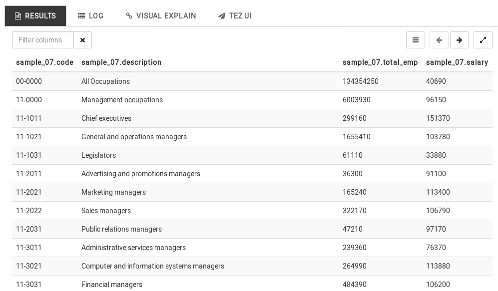

# 使用 Hadoop 进行 Python 地理处理

本书中的大多数示例都使用了相对较小的数据集，并且在一个计算机上工作。但随着数据量的增加，数据集甚至单个文件可能会分布在机器集群中。处理大数据需要不同的工具。在本章中，你将学习如何使用 Apache Hadoop 处理大数据，以及 Esri GIS 工具用于 Hadoop 以空间方式处理大数据。

本章将教你如何：

+   安装 Linux

+   安装和运行 Docker

+   安装和配置 Hadoop 环境

+   在 HDFS 中处理文件

+   使用 Hive 进行基本查询

+   安装 Esri GIS 工具用于 Hadoop

+   在 Hive 中执行空间查询

# 什么是 Hadoop？

Hadoop 是一个开源框架，用于处理分布在单台计算机到数千台计算机上的大量数据。Hadoop 由四个模块组成：

+   **Hadoop 核心**

+   **Hadoop 分布式文件系统**（**HDFS**）

+   **另一个资源协调器**（**YARN**）

+   **MapReduce**

Hadoop 核心构成了运行其他三个模块所需的所有组件。HDFS 是一个基于 Java 的文件系统，它被设计成分布式，并且能够在多台机器上存储大量文件。当我们说大量文件时，我们指的是千兆字节级别的文件。YARN 管理你的 Hadoop 框架中的资源和调度。MapReduce 引擎允许你并行处理数据。

有几个其他项目可以安装以与 Hadoop 框架一起使用。在本章中，你将使用 Hive 和 Ambari。Hive 允许你使用 SQL 读取和写入数据。你将在本章末使用 Hive 运行数据的空间查询。Ambari 为 Hadoop 和 Hive 提供了一个网络用户界面。在本章中，你将使用它上传文件并输入你的查询。

现在你已经对 Hadoop 有了一个概述，下一节将展示如何设置你的环境。

# 安装 Hadoop 框架

在本章中，你将不会自己配置 Hadoop 框架的每个组件。你将运行一个 Docker 镜像，这需要你安装 Docker。目前，Docker 在 Windows 10 专业版或企业版上运行，但在 Linux 或 Mac 上运行得更好。Hadoop 也可以在 Windows 上运行，但需要你从源代码构建，因此它将在 Linux 上运行得更容易。此外，你将使用的 Docker 镜像正在运行 Linux，因此熟悉 Linux 可能会有所帮助。在本节中，你将学习如何安装 Linux。

# 安装 Linux

设置 Hadoop 框架的第一步是安装 Linux。你需要获取一个 Linux 操作系统的副本。Linux 有很多版本。你可以选择你喜欢的任何版本，然而，这一章是使用 CentOS 7 编写的，因为大多数你将要安装的工具也已经在 CentOS 上进行了测试。CentOS 是基于 Red Hat 的 Linux 版本。你可以在以下网址下载 ISO：[`www.centos.org/`](https://www.centos.org/)。选择“立即获取 CentOS”。然后，选择 DVD 图像。选择一个镜像来下载 ISO。

下载镜像后，你可以使用 Windows 将其烧录到磁盘上。一旦你烧录了磁盘，将其放入将要运行 Linux 的机器中并启动它。安装过程中会有提示。需要特别注意的两个步骤是软件选择步骤和分区。在软件选择步骤中，选择 GNOME 桌面。这将提供一个带有流行 GUI 的足够的基础系统。如果你在计算机上还有其他文件系统，你可以覆盖它或在分区屏幕上选择分区上的空闲空间。

对于如何安装 Linux 的更详细说明，谷歌是你的朋友。有许多优秀的教程和 YouTube 视频会带你完成这个过程。不幸的是，看起来 CentOS 网站没有 CentOS 7 的安装手册。

# 安装 Docker

Docker 提供了软件，以便您能够运行容器。**容器**是一个可执行的程序，它包含了运行其中软件所需的所有内容。例如，如果我有一个配置了运行 Hadoop、Hive 和 Ambari 的 Linux 系统，并且从它创建了一个容器，我可以把容器给你，当你运行它时，它将包含运行该系统所需的所有内容，无论你的计算机配置或安装了什么软件。如果我把这个容器镜像给任何其他人，它也会始终以相同的方式运行。容器不是虚拟机。虚拟机是在硬件层面的抽象，而容器是在应用层面的抽象。容器包含了运行软件所需的一切。对于本章，这就是你需要知道的所有内容。

现在你已经安装了 Linux 并且了解了 Docker 是什么，你可以安装一个 Docker 副本。使用你的终端，输入以下命令：

```py
curl -fsSL https://get.docker.com/ | sh
```

前面的命令使用`curl`应用程序下载并安装 Docker 的最新版本。参数告诉`curl`在服务器错误发生时静默失败，不显示进度，报告任何错误，并在服务器表示位置已更改时进行重定向。`curl`命令的输出被管道`- | -`传递到`sh`（Bash shell）以执行。

当 Docker 安装完成后，你可以通过执行以下命令来运行它：

```py
sudo systemctl start docker
```

上一条命令使用`sudo`以管理员（`root`）的身份运行命令。想象一下在 Windows 上右键点击并选择以管理员身份运行选项。下一条命令是`systemctl`。这是在 Linux 中启动服务的方式。最后，`start docker`正是这样做的，它启动了`docker`。如果你在执行前面提到的命令时收到提及 sudoers 的错误，那么你的用户可能没有权限以`root`身份运行应用程序。你需要以`root`身份登录（或使用`su`命令）并编辑`/etc/sudoers`中的文本文件。添加以下行：

```py
your username  ALL=(ALL) ALL
```

上一行将赋予你使用`sudo`的权限。你的`/etc/sudoers`文件应该看起来像以下截图：



现在，你已经运行了 `docker`，你可以下载我们将要加载的包含 Hadoop 框架的镜像。

# 安装 Hortonworks

与安装 Hadoop 和所有其他组件相比，你将使用预配置的 Docker 镜像。Hortonworks 有一个数据平台沙盒，它已经有一个可以在 Docker 中加载的容器。要下载它，请访问 [`hortonworks.com/downloads/#sandbox`](https://hortonworks.com/downloads/#sandbox) 并选择“为 Docker 下载”。

你还需要安装 `start_sandox_hdp_version.sh` 脚本。这将简化在 Docker 中启动容器。你可以从 GitHub 下载脚本：[`gist.github.com/orendain/8d05c5ac0eecf226a6fed24a79e5d71a`](https://gist.github.com/orendain/8d05c5ac0eecf226a6fed24a79e5d71a)[.](https://raw.githubusercontent.com/hortonworks/data-tutorials/master/tutorials/hdp/sandbox-deployment-and-install-guide/assets/start_sandbox-hdp.sh.)

现在，你需要在 Docker 中加载镜像。以下命令将向你展示如何操作：

```py
docker load -i <image name>
```

之前的命令将镜像加载到 Docker 中。镜像名称将类似于 `HDP_2.6.3_docker_10_11_2017.tar`，但它将根据你的版本而变化。要查看沙盒是否已加载，请运行以下命令：

```py
docker images
```

如果没有其他容器，输出应该看起来如下截图所示：



为了使用基于 Web 的 GUI Ambari，你将需要为沙盒设置一个域名。为此，你需要容器的 IP 地址。你可以通过运行两个命令来获取它：

```py
docker ps docker inspect <container ID> 
```

第一个命令将包含 `container ID`，第二个命令将获取 `container ID` 并返回大量信息，其中 IP 地址位于末尾。或者，你可以利用 Linux 命令行，只需使用以下命令即可获取 IP 地址：

```py
docker inspect $(docker ps --format "{{.ID}}") --format="{{json .NetworkSettings.IPAddress}}"
```

之前的命令将之前提到的命令封装成一个单独的命令。`docker inspect` 命令将 `docker ps` 的输出作为 `container ID`。它是通过将输出封装在 `$()` 中来实现的，但它也传递了一个过滤器，以便只返回 `ID`。然后，`inspect` 命令还包括一个过滤器，只返回 IP 地址。`{{}}` 之间的文本是一个 Go 模板。此命令的输出应该是一个 IP 地址，例如，172.17.0.2。

现在你已经有了镜像的 IP 地址，你应该使用以下命令更新你的主机文件：

```py
echo '172.17.0.2 sandbox.hortonworks.com sandbox-hdp.hortonworks.com sandbox-hdf.hortonworks.com' | sudo tee -a /etc/hosts
```

之前的命令将 `echo` 的输出重定向——这是你想要放在 `/etc/hosts` 文件中的文本——并发送到 `sudo tee -a /etc/hosts` 命令。第二个命令使用 `sudo` 以 `root` 身份运行。`tee` 命令将输出发送到文件和终端（`STDOUT`）。`-a` 告诉 `tee` 向文件追加，而 `/etc/hosts` 是你想要追加的文件。现在，在你的浏览器中，你将能够使用名称而不是 IP 地址。

现在你已经准备好启动镜像并浏览到你的 Hadoop 框架。

# Hadoop 基础知识

在本节中，你将启动你的 Hadoop 镜像，并学习如何使用`ssh`和 Ambari 进行连接。你还将移动文件并执行一个基本的 Hive 查询。一旦你了解了如何与框架交互，下一节将展示如何使用空间查询。

首先，从终端使用提供的 Bash 脚本启动 Hortonworks 沙盒。以下命令将展示如何操作：

```py
sudo sh start_sandbox-hdp.sh
```

之前的命令执行了你下载的沙盒脚本。同样，它使用了`sudo`以`root`身份运行。根据你的机器，完全加载并启动所有服务可能需要一些时间。完成之后，你的终端应该看起来像以下截图：



# 通过安全外壳连接

现在沙盒正在运行，你可以使用安全外壳（SSH）进行连接。安全外壳允许你远程登录到另一台机器。打开一个新的终端并输入以下命令：

```py
ssh raj_ops@127.0.0.1 -p2222
```

之前的命令使用`ssh`以用户`raj_ops`的身份连接到本地的`localhost`（`127.0.0.1`）的`2222`端口。你将收到一个警告，表明无法验证主机的真实性。我们没有为`ssh`创建任何密钥。只需键入`yes`，然后你会被提示输入密码。用户`raj_ops`的密码是`raj_ops`。你的终端提示符现在应该看起来像以下行：

```py
[raj_ops@sandbox-hdp ~]$
```

如果你的终端像之前代码中那样，你现在已经登录到容器中了。

有关用户、权限和配置沙盒的更多信息，请访问以下页面：[`hortonworks.com/tutorial/learning-the-ropes-of-the-hortonworks-sandbox/`](https://hortonworks.com/tutorial/learning-the-ropes-of-the-hortonworks-sandbox/)

你现在可以使用大多数 Linux 命令在容器中导航。你现在可以下载和移动文件，运行 Hive，以及从命令行使用所有其他工具。这一节已经对 Linux 进行了大量的介绍，所以你将不会在本章中仅使用命令行。相反，下一节将展示如何在 Ambari 中执行这些任务，Ambari 是一个基于 Web 的 GUI，用于执行任务。

# Ambari

Ambari 是一个用于简化 Hadoop 管理的用户界面。在前一节中，你学习了如何将`ssh`集成到容器中。从那里你可以管理 Hadoop，运行 Hive 查询，下载数据，并将其添加到 HDFS 文件系统。Ambari 使得所有这些操作都变得简单得多，尤其是如果你不熟悉命令行的话。要打开 Ambari，请浏览到以下 URL：[`sandbox.hortonworks.com:8080/`](http://sandbox.hortonworks.com:8080/)。

Ambari 的 URL 取决于你的安装。如果你已经遵循了本章中的说明，那么这将是你需要使用的 URL。你还必须从 Docker 镜像启动了服务器。

您将被引导到 Ambari 登录页面。输入用户/密码组合`raj_ops`/`raj_ops`，如下截图所示：



登录后，您将看到 Ambari 仪表板。它看起来如下截图所示：



在左侧，您有一个服务列表。窗口的主要部分包含指标，顶部菜单栏有不同功能的标签页。在本章中，您将使用由九个小方块组成的方形。将鼠标悬停在方形图标上，您将看到一个文件视图的下拉菜单。

这是 HDFS 文件系统的`root`目录。

当通过`ssh`连接到容器时，运行`hdfs dfs -ls /`命令，您将看到相同的目录结构。

从这里，您可以上传文件。为了尝试一下，打开一个文本编辑器并创建一个简单的 CSV 文件。此示例将使用以下数据：

```py
40, Paul
23, Fred
72, Mary
16, Helen
16, Steve 
```

保存 CSV 文件，然后在 Ambari 中点击上传按钮。您可以将 CSV 拖放到浏览器中。Ambari 将文件添加到容器上的 HDFS 文件系统：



现在您已经将数据加载到容器中，您可以使用 SQL 在 Hive 中查询它。再次使用方形图标，选择 Hive View 2.0 的下拉菜单。您应该看到一个如下所示的工作区：



在 Hive 中，您有工作表。在工作表中，您连接到的数据库是您正在使用的数据库，在这种情况下是默认数据库。在其下方，您有主查询窗口。在右侧，您有一个现有表的列表。最后，向下滚动，您将看到执行按钮，结果将加载在该按钮下方。

在查询面板中，输入以下 SQL 查询：

```py
SELECT * FROM sample_07
```

之前的查询是一个基本的 SQL 全选查询。结果将如下所示：



# Esri GIS 工具用于 Hadoop

在设置好环境并具备一些关于 Ambari、HDFS 和 Hive 的基本知识后，您现在将学习如何将空间组件添加到您的查询中。为此，我们将使用 Esri 的 Hadoop GIS 工具。

第一步是下载位于 GitHub 仓库中的文件，该仓库位于：[`github.com/Esri/gis-tools-for-hadoop`](https://github.com/Esri/gis-tools-for-hadoop)。您将使用 Ambari 将文件移动到 HDFS 而不是容器中，因此请将这些文件下载到您的本地机器上。

Esri 有一个教程，说明如何使用`ssh`连接到容器，然后使用`git`克隆仓库来下载文件。您可以在此处遵循这些说明：[`github.com/Esri/gis-tools-for-hadoop/wiki/GIS-Tools-for-Hadoop-for-Beginners`](https://github.com/Esri/gis-tools-for-hadoop/wiki/GIS-Tools-for-Hadoop-for-Beginners)。

您可以通过使用存储库右侧的 GitHub Clone 或下载按钮来下载文件。要解压存档，请使用以下命令之一：

```py
unzip gis-tools-for-hadoop-master.zip
unzip gis-tools-for-hadoop-master.zip -d /home/pcrickard
```

第一条命令将在当前目录中解压文件，这很可能是您家目录中的 `Downloads` 文件夹。第二条命令将解压文件，但通过传递 `-d` 和一个路径，它将解压到该位置。在这种情况下，这是我的家目录的 `root`。

现在您已经解压了文件，可以通过从图标下拉菜单中选择它来在 Ambari 中打开文件视图。选择上传，将打开一个模态窗口，允许您拖放文件。在您的本地机器上，浏览到 Esri **Java ARchive** (JAR) 文件的位置。如果您将 zip 文件移动到您的家目录，路径将类似于 `/home/pcrickard/gis-tools-for-hadoop-master/samples/lib`。您将有三个 JAR 文件：

+   `esri-geometry-api-2.0.0.jar`

+   `spatial-sdk-hive-2.0.0.jar`

+   `spatial-sdk-json-2.0.0.jar`

将这三个文件中的每一个移动到 Ambari 的 `root` 文件夹。这是 `/` 目录，这是您启动文件视图时默认打开的位置。

接下来，您通常会也将数据移动到 HDFS，然而，您在之前的示例中已经那样做了。在这个示例中，您将保留本地机器上的数据文件，您将学习如何在不位于 HDFS 的情况下将它们加载到 Hive 表中。

现在您已经准备好在 Hive 中执行空间查询。从图标下拉菜单中选择 Hive View 2.0。在查询面板中，输入以下代码：

```py
add jar hdfs:///esri-geometry-api-2.0.0.jar;
add jar hdfs:///spatial-sdk-json-2.0.0.jar;
add jar hdfs:///spatial-sdk-hive-2.0.0.jar;

create temporary function ST_Point as 'com.esri.hadoop.hive.ST_Point';
create temporary function ST_Contains as 'com.esri.hadoop.hive.ST_Contains';

drop table earthquakes;
drop table counties;

CREATE TABLE earthquakes (earthquake_date STRING, latitude DOUBLE, longitude DOUBLE, depth DOUBLE, magnitude DOUBLE,magtype string, mbstations string, gap string, distance string, rms string, source string, eventid string)
ROW FORMAT DELIMITED FIELDS TERMINATED BY ','
STORED AS TEXTFILE;

CREATE TABLE counties (Area string, Perimeter string, State string, County string, Name string, BoundaryShape binary)                  
ROW FORMAT SERDE 'com.esri.hadoop.hive.serde.EsriJsonSerDe'
STORED AS INPUTFORMAT 'com.esri.json.hadoop.EnclosedEsriJsonInputFormat'
OUTPUTFORMAT 'org.apache.hadoop.hive.ql.io.HiveIgnoreKeyTextOutputFormat';

LOAD DATA LOCAL INPATH '/gis-tools-for-hadoop-master/samples/data/earthquake-data/earthquakes.csv' OVERWRITE INTO TABLE earthquakes;

LOAD DATA LOCAL INPATH '/gis-tools-for-hadoop-master/samples/data/counties-data/california-counties.json' OVERWRITE INTO TABLE counties;

SELECT counties.name, count(*) cnt FROM counties
JOIN earthquakes
WHERE ST_Contains(counties.boundaryshape, ST_Point(earthquakes.longitude, earthquakes.latitude))
GROUP BY counties.name
ORDER BY cnt desc;
```

运行前面的代码将花费一些时间，具体取决于您的机器。最终结果将类似于以下图像所示：


之前的代码和结果没有解释，这样您可以运行示例并查看输出。之后，代码将逐块进行解释。

第一段代码如下所示：

```py
add jar hdfs:///esri-geometry-api-2.0.0.jar;
add jar hdfs:///spatial-sdk-json-2.0.0.jar;
add jar hdfs:///spatial-sdk-hive-2.0.0.jar;

create temporary function ST_Point as 'com.esri.hadoop.hive.ST_Point';
create temporary function ST_Contains as 'com.esri.hadoop.hive.ST_Contains';

```

此代码块将 HDFS 位置的 JAR 文件添加到其中。在这种情况下，它是 `/` 文件夹。一旦代码加载了 JAR 文件，它就可以通过调用 JAR 文件中的类来创建函数 `ST_Point` 和 `ST_Contains`。一个 JAR 文件可能包含许多 Java 文件（类）。`add jar` 语句的顺序很重要。

下面的代码块将删除两个表——`earthquakes` 和 `counties`。如果您从未运行过示例，可以跳过这些行：

```py
drop table earthquakes;
drop table counties; 
```

接下来，代码将创建 `earthquakes` 和 `counties` 表。创建 `earthquakes` 表，并将每个字段和类型传递给 `CREATE`。行格式指定为 CSV——`','`。最后，它是一个文本文件：

```py
CREATE TABLE earthquakes (earthquake_date STRING, latitude DOUBLE, longitude DOUBLE, depth DOUBLE, magnitude DOUBLE,magtype string, mbstations string, gap string, distance string, rms string, source 
string, eventid string)
ROW FORMAT DELIMITED FIELDS TERMINATED BY ','
STORED AS TEXTFILE;
```

`counties`表通过将字段名称和类型传递给`CREATE`创建，但数据是 JSON 格式，并将使用你导入的 JAR 文件`spatial-sdk-json-2.0.0`中的`com.esri.hadoop.hive.serde.EsriJSonSerDe`类。`STORED AS INPUTFORMAT`和`OUTPUTFORMAT`对于 Hive 来说，是必须的，以便解析和操作 JSON 数据：

```py
CREATE TABLE counties (Area string, Perimeter string, State string, County string, Name string, BoundaryShape binary)                  
ROW FORMAT SERDE 'com.esri.hadoop.hive.serde.EsriJsonSerDe'
STORED AS INPUTFORMAT 'com.esri.json.hadoop.EnclosedEsriJsonInputFormat'
OUTPUTFORMAT 'org.apache.hadoop.hive.ql.io.HiveIgnoreKeyTextOutputFormat';
```

接下来的两个块将数据加载到创建的表中。数据存在于你的本地机器上，而不是 HDFS 上。为了在不首先将数据加载到 HDFS 的情况下使用本地数据，你可以使用`LOCAL`命令与`LOAD DATA INPATH`一起指定数据的本地路径：

```py
LOAD DATA LOCAL INPATH '/gis-tools-for-hadoop-master/samples/data/earthquake-data/earthquakes.csv' OVERWRITE INTO TABLE earthquakes;

LOAD DATA LOCAL INPATH '/gis-tools-for-hadoop-master/samples/data/counties-data/california-counties.json' OVERWRITE INTO TABLE counties;

```

在加载了 JAR 文件并创建了表并填充了数据后，你现在可以使用两个定义好的函数——`ST_Point`和`ST_Contains`来运行空间查询。这些函数的使用方式与第三章中的示例相同，*地理数据库简介*：

```py
 SELECT counties.name, count(*) cnt FROM counties
 JOIN earthquakes
 WHERE ST_Contains(counties.boundaryshape, 
 ST_Point(earthquakes.longitude, earthquakes.latitude))
 GROUP BY counties.name
 ORDER BY cnt desc;
```

之前的查询通过将县几何形状和每个地震的位置作为点传递给`ST_Contains`来选择县的`name`和地震的`count`。结果如下所示：


# HDFS 和 Hive 在 Python 中

这本书是关于地理空间开发的 Python，因此在本节中，你将学习如何使用 Python 进行 HDFS 操作和 Hive 查询。Python 和 Hadoop 有多个数据库包装库，但似乎没有哪一个库成为突出的首选库，其他库，如 Snakebite，似乎还没有准备好在 Python 3 上运行。在本节中，你将学习如何使用两个库——PyHive 和 PyWebHDFS。你还将学习如何使用 Python 的子进程模块来执行 HDFS 和 Hive 命令。

要获取 PyHive，你可以使用`conda`和以下命令：

```py
conda install -c blaze pyhive
```

你可能还需要安装`sasl`库：

```py
conda install -c blaze sasl
```

之前的库将使你能够从 Python 运行 Hive 查询。你还将想要能够将文件移动到 HDFS。为此，你可以安装`pywebhdfs`：

```py
conda install -c conda-forge pywebhdfs
```

之前的命令将安装库，并且，一如既往，你也可以使用`pip install`或使用任何其他方法。

在安装了库之后，让我们首先看看`pywebhdfs`。

`pywebhdfs`的文档位于：[`pythonhosted.org/pywebhdfs/`](http://pythonhosted.org/pywebhdfs/)

要在 Python 中建立连接，你需要知道你的 Hive 服务器位置。如果你已经遵循了本章，特别是`/etc/hosts`中的配置更改——你可以使用以下代码这样做：

```py
from pywebhdfs.webhdfs import PyWebHdfsClient as h
hdfs=h(host='sandbox.hortonworks.com',port='50070',user_name='raj_ops')
```

之前的代码将`PyWebHdfsClient`导入为`h`。然后它创建到容器中运行的 HDFS 文件系统的连接。容器映射到`sandbox.hortonworks.com`，HDFS 在端口`50070`上。由于示例一直使用的是`raj_ops`用户，代码也是如此。

现在可用于 `hdfs` 变量的函数类似于你的标准终端命令，但名称不同——`mkdir` 现在是 `make_dir`，`ls` 是 `list_dir`。要删除文件或目录，你将使用 `delete_file_dir`。`make` 和 `delete` 命令在成功时将返回 `True`。

让我们用 Python 查看我们的 HDFS 文件系统的 `root` 目录：

```py
ls=hdfs.list_dir('/')
```

之前代码发出了 `list_dir` 命令（与 `ls` 相当），并将其分配给 `ls`。结果是包含目录中所有文件和文件夹的字典。

要查看单个记录，你可以使用以下代码：

```py
ls['FileStatuses']['FileStatus'][0]
```

之前的代码通过使用字典键 `FileStatuses` 和 `FileStatus` 来获取单个记录。

要获取字典中的键，你可以使用 `.keys()` 或 `ls.keys()`，它返回 `[FileStatuses]`，以及 `ls['FileStatuses'].keys()`，它返回 `['FileStatus']`。

之前代码的输出如下所示：

```py
{'accessTime': 0, 'blockSize': 0, 'childrenNum': 1, 'fileId': 16404, 'group': 'hadoop', 'length': 0, 'modificationTime': 1510325976603, 'owner': 'yarn', 'pathSuffix': 'app-logs', 'permission': '777', 'replication': 0, 'storagePolicy': 0, 'type': 'DIRECTORY'}
```

每个文件或目录都包含多个数据项，但最重要的是类型、所有者和权限。

运行 Hive 查询示例的第一步是将我们的数据文件从本地机器移动到 HDFS。使用 Python，你可以使用以下代码来完成此操作：

```py
hdfs.make_dir('/samples',permission=755)
f=open('/home/pcrickard/sample.csv')
d=f.read()
hdfs.create_file('/samples/sample.csv',d)
```

之前的代码创建了一个名为 `samples` 的目录，权限设置为 `755`。在 Linux 中，权限基于三种用户的读取（`4`）、写入（`2`）和执行（`1`）权限——所有者、组和其它。因此，`755` 的权限意味着所有者具有读取、写入和执行权限（4+2+1=7），而组和其它用户具有读取和执行权限（4+1=5）。

接下来，代码打开并读取我们想要传输到 HDFS 的 CSV 文件，并将其分配给变量 `d`。然后，代码在 `samples` 目录中创建 `sample.csv` 文件，传递 `d` 的内容。

为了验证文件已创建，你可以使用以下代码读取文件内容：

```py
hdfs.read_file('/samples/sample.csv')
```

之前代码的输出将是一个 CSV 文件的字符串。它已成功创建。

或者，你可以使用以下代码来获取文件的状态和详细信息：

```py
hdfs.get_file_dir_status('/samples/sample.csv')
```

之前代码将返回以下详细信息，但仅当文件或目录存在时。如果不存在，前面的代码将引发 `FileNotFound` 错误。你可以在 `try`...`except` 块中包含前面的代码：

```py
{'FileStatus': {'accessTime': 1517929744092, 'blockSize': 134217728, 'childrenNum': 0, 'fileId': 22842, 'group': 'hdfs', 'length': 47, 'modificationTime': 1517929744461, 'owner': 'raj_ops', 'pathSuffix': '', 'permission': '755', 'replication': 1, 'storagePolicy': 0, 'type': 'FILE'}}
```

在将数据文件传输到 HDFS 后，你可以继续使用 Hive 查询数据。

PyHive 的文档位于：[`github.com/dropbox/PyHive`](https://github.com/dropbox/PyHive)

使用 `pyhive`，以下代码将创建一个表：

```py
from pyhive import hive
c=hive.connect('sandbox.hortonworks.com').cursor()
c.execute('CREATE TABLE FromPython (age int, name string)  ROW FORMAT DELIMITED FIELDS TERMINATED BY ","')
```

之前代码将 `pyhive` 导入为 `hive`。它创建了一个连接并获取了 `cursor`。最后，它执行了一个 Hive 语句。一旦你有了连接和 `cursor`，你就可以通过将它们包裹在 `.execute()` 方法中来执行 SQL 查询。要将 HDFS 中的 CSV 数据加载到表中并选择所有内容，你会使用以下代码：

```py
c.execute("LOAD DATA INPATH '/samples/sample.csv' OVERWRITE INTO TABLE FromPython")
c.execute("SELECT * FROM FromPython")
result=c.fetchall()
```

之前的代码使用了两次 `execute()` 方法来加载数据，然后执行了全选操作。使用 `fetchall()`，结果被传递到 `result` 变量中，其输出将如下所示：

```py
[(40, ' Paul'), (23, ' Fred'), (72, ' Mary'), (16, ' Helen'), (16, ' Steve')]
```

使用 `pyhive` 与使用 `psycopg2` —— 连接到 PostgreSQL 的 Python 库——的感觉相似。大多数数据库包装库都非常相似，你只需建立连接，获取一个 `cursor`，然后执行语句。结果可以通过获取所有、一个或下一个（可迭代）来检索。

# 摘要

在本章中，你学习了如何设置 Hadoop 环境。这需要你安装 Linux 和 Docker，从 Hortonworks 下载镜像，并学习该环境的使用方法。本章的大部分内容都花在了环境和如何使用提供的 GUI 工具执行空间查询上。这是因为 Hadoop 环境很复杂，如果没有正确的理解，就很难完全理解如何使用 Python 来操作它。最后，你学习了如何在 Python 中使用 HDFS 和 Hive。用于与 Hadoop、Hive 和 HDFS 一起工作的 Python 库仍在开发中。本章为你提供了一个基础，这样当这些库得到改进时，你将拥有足够的关于 Hadoop 和相关技术的知识，以实现这些新的 Python 库。
