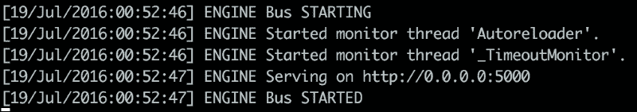
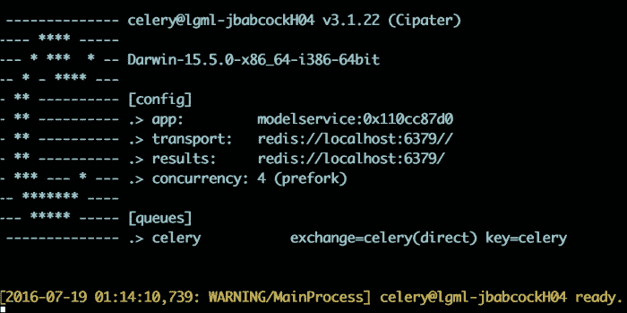

# 第八章. 使用预测服务共享模型

到目前为止，我们已经探讨了如何使用从标准“表格”数据到文本和图像的各种数据源构建各种模型。然而，这仅仅完成了我们在商业分析中的部分目标：我们可以从数据集中生成预测，但无法轻松与同事或其他公司内部的软件系统共享结果。我们也无法在新的数据可用时轻松复制结果，而无需手动重新运行前几章讨论的分析，或者随着时间的推移将其扩展到更大的数据集。在没有通过我们代码中公开的分析模型参数揭示分析细节的情况下，我们还将难以在公共环境中（如公司的网站）使用我们的模型。

为了克服这些挑战，下一章将描述如何构建“预测服务”，这些是封装并自动化数据转换、模型拟合以及新观测评分等核心组件的 Web 应用程序，这些内容我们在前几节讨论预测算法时已经讨论过。通过将我们的分析打包成 Web 应用程序，我们不仅可以轻松扩展建模系统，还可以更改底层算法的实现，同时使这些更改对消费者（无论是人类还是其他软件系统）不可见，消费者通过向我们的应用程序通过 Web URL 和标准的 REST **应用程序编程接口**（**API**）发送请求来与我们的预测模型交互。这还允许通过调用服务来自动化分析初始化和更新，使预测建模任务保持一致并可重复。最后，通过仔细参数化许多步骤，我们可以使用同一服务与可互换的数据源计算框架交互。

从本质上讲，构建预测服务涉及将我们已讨论的几个组件（如数据转换和预测建模）与本章首次讨论的一系列新组件相连接。为此，我们将涵盖以下主题：

+   如何使用 Cherrypy 和 Flask 框架对基本 Web 应用程序和服务器进行监控

+   如何使用 RESTful API 自动化通用建模框架

+   使用 Spark 计算框架扩展我们的系统

+   将我们的预测模型结果存储在数据库系统中，以便在第九章中讨论的报告应用程序中，*报告和测试 – 在分析系统中迭代*

# 预测服务的架构

现在有了明确的目标——通过 Web 应用程序共享和扩展我们的预测建模结果——要实现这一目标需要哪些组件？

第一个是*客户端*：这可以是网络浏览器，或者简单地是用户在终端中输入`curl`命令（见旁注）。在两种情况下，客户端都使用**超文本传输协议**（**HTTP**）发送请求，这是一种标准传输约定，用于在网络中检索或传输信息（Berners-Lee, Tim, Roy Fielding, and Henrik Frystyk. *Hypertext transfer protocol--HTTP/1.0*. No. RFC 1945\. 1996）。HTTP 标准的一个重要特性是客户端和服务器不必“知道”任何关于对方实现的信息（例如，用于编写这些组件的编程语言），因为只要遵循 HTTP 标准，消息在他们之间就会保持一致。

下一个组件是*服务器*，它从客户端接收 HTTP 请求并将它们转发到应用程序。你可以将其视为客户端请求通往我们实际预测建模应用的网关。在 Python 中，Web 服务器和应用程序都遵循**Web 服务器网关接口**（**WSGI**），它指定了服务器和应用程序应该如何通信。就像客户端和服务器之间的 HTTP 请求一样，这个标准允许服务器和应用程序只要两者一致实现接口就可以模块化。实际上，服务器和应用程序之间甚至可能存在中间件来进一步修改两者之间的通信：只要这种通信的格式保持一致，接口两边的细节就是灵活的。虽然我们将使用 Cherrypy 库为我们构建服务器，但其他常见的选择是 Apache Tomcat 和 Nginx，它们都是用 Java 编程语言编写的。

在客户端请求被服务器接收并转发之后，应用程序会根据请求执行操作，并返回一个值来指示任务的执行成功或失败。例如，这些请求可以获取特定用户的预测分数，更新训练数据集，或者进行一轮模型训练。

### 小贴士

**旁注：curl 命令**

作为测试我们的预测服务的一部分，有一个快速向服务器发送命令并观察我们收到的响应的方法是非常有用的。虽然我们可以通过使用网络浏览器的地址栏进行一些交互式操作，但在我们需要运行多个测试或复制特定命令的情况下，脚本浏览器活动并不容易。大多数 Linux 命令行终端中都可以找到的`curl`命令对于这个目的非常有用：可以使用`curl`命令向预测服务发出与在浏览器中给出的相同的请求（就 URL 而言），并且可以使用 shell 脚本自动化这个调用。`curl`应用程序可以从[`curl.haxx.se/`](https://curl.haxx.se/)安装。

Web 应用程序依赖于服务器端代码来执行响应于 Web 服务器请求的命令。在我们的例子中，这个服务器端代码被分为几个组件：第一个是为建模逻辑提供的通用接口，它指定了构建预测模型、使用输入数据集对其进行训练以及评分传入数据的标准方式。第二个是使用第五章中的逻辑回归算法（*Putting Data in its Place – Classification Methods and Analysis*）实现此框架。此代码依赖于执行 Spark 作业，这些作业可以在本地（在 Web 应用程序所在的同一台机器上）或远程（在单独的集群上）执行。

这个链的最后一部分是数据库系统，它可以持久化预测服务使用的信息。这个数据库可能只是与 Web 服务器在同一台机器上的文件系统，也可能像分布式数据库软件一样复杂。在我们的例子中，我们将使用 Redis（一个简单的键值存储）和 MongoDB（一个 NoSQL 数据库）来存储用于建模的数据、关于我们应用程序的瞬态信息以及模型结果本身。

正如我们之前强调的，这三个组件的一个重要特征是它们在很大程度上是独立的：因为 WGSI 标准定义了 Web 服务器和应用程序之间的通信方式，所以我们可以更改服务器和预测模型实现，只要在 Web 应用程序中使用的命令相同，代码仍然可以工作，因为这些命令是以一致的方式格式化的。

现在我们已经介绍了预测服务的基本组件以及它们如何相互通信，让我们更详细地考察每一个。

# 客户端和发出请求

当客户端向服务器和下游应用程序发出请求时，我们可能会遇到一个主要的设计问题：我们如何事先知道我们可能会收到什么类型的请求？如果我们每次开发 Web 应用程序时都必须重新实现一组新的标准请求，那么将很难重用代码并编写其他程序可以调用的通用服务，因为它们的请求可能会随着客户端可能与之交互的每个 Web 应用程序而变化。

这就是 HTTP 标准解决的问题，它描述了一种标准语言和格式，用于服务器和客户端之间发送请求，使我们能够依赖于一个通用的命令语法，该语法可以被许多不同的应用程序消费。虽然从理论上讲，我们可以通过将 URL 粘贴到浏览器的地址栏中（例如 GET，下面将描述）向我们的预测服务发出一些这些命令，但这只会覆盖我们想要发出的请求类型的一个子集。我们在 Web 应用程序中通常实现的请求类型包括：

## GET 请求

`GET`请求只检索信息，这些信息将根据响应类型在我们的 Web 浏览器中渲染。我们可能会收到一个实际的`html`页面，或者只是一段文本。为了指定我们想要接收的信息，GET 请求将在 URL 中包含变量，形式为`url?key1=value1&key2=value2`。URL 是提供给预测服务的 Web 地址，在我们的例子中将是本地机器，但也可能是任何有效的 IP 地址或 URL。这个 URL 通过一个问号（**?**）与定义我们信息请求参数的（键，值）对分开。可以指定多个参数：例如，我们可以使用字符串`userid=12894&itemid=93819`来表示用户和项目数据集的一对参数，每个键值对由与符号（`&`）分隔。

我们可以直接通过将之前描述的 URL 格式粘贴到浏览器的地址栏中，或者通过在终端中输入以下命令向同一地址发出一个`curl`命令来直接发出一个`GET`请求：

```py
> curl <address>

```

我们还可以使用 Python requests 库（[`docs.python-requests.org/en/master/`](http://docs.python-requests.org/en/master/)），它允许我们不必担心 URL 格式化的细节。使用这个库，相同的 GET 请求可以通过以下方式调用：

```py
>>> r = requests.get(url,params)

```

在这里，`params`是我们本应传递到 URL 中的键值对字典。requests 库为我们执行了这种格式化，正如我们可以通过打印生成的 URL 所看到的那样：

```py
>>> print(r.url)

```

一旦我们发出了请求，我们可以使用以下两个命令中的任何一个来检查结果：

```py
>>> r.json()
>>> r.text

```

我们还可以检查响应的状态码，以查看是否发生了错误（参见关于标准响应代码的附录）：

```py
>>> r.status_code

```

### 小贴士

**附录：HTTP 状态码**

当我们使用本章讨论的方法向 Web 应用程序发出请求时，检查请求成功的一种方法是通过检查响应代码，它给出一个与 Web 应用程序对请求的响应相对应的标准数字。你可能甚至在没有意识到的情况下见过这些代码，例如当网页在你的浏览器中无法显示时返回的 404 错误。需要注意的标准代码如下：

200：成功，我们通常检查这个值以确保我们收到了正确的响应。

404：未找到，表示 Web 应用程序找不到我们请求的资源。

500：服务器错误，如果我们运行的 Web 应用程序代码遇到问题，我们通常会收到这个错误。

对于更全面的列表，请参阅（Nottingham, Mark，和 Roy Fielding. "Additional HTTP Status Codes." (2012)；Berners-Lee, Tim，Roy Fielding，和 Henrik Frystyk. Hypertext transfer protocol--HTTP/1.0\. No. RFC 1945\. 1996）。

## POST 请求

与 GET 命令不同，POST 请求不使用 URL 中包含的数据，而是传输与 URL 分离的信息。如果您曾在在线商店输入过信用卡信息，那么这些信息可能就是通过 POST 请求传输的，这是幸运的，因为这样信息就保持隐藏了。然而，由于请求信息不包含在 URL 中，我们不能简单地将其粘贴到 Web 浏览器的地址栏中：我们需要网页上发出 POST 请求的表单，或者我们自己编程发出请求。如果没有实际的表单在网页上，我们可以使用 `curl` 命令，使用以下语法发出 POST 请求：

```py
> curl –x POST  -d  <data> <url>

```

我们还可以使用 Python 的 requests 库：

```py
>>> r = requests.post(url,data)

```

在前面的代码中，`data` 是一个 Python 字典，包含网络应用程序在满足 POST 请求时可以访问的信息。

## HEAD 请求

与 GET 请求类似，HEAD 请求检索信息，但它只检索响应的元数据（例如编码），而不是响应的主体（例如网页或 JSON）。我们可以使用以下方式发出 HEAD 请求：

```py
> curl –i –X HEAD <url>

```

注意，我们已向此请求添加了 `–i` 标志；通常，没有此选项，`curl` 命令不会打印头部信息。使用 Python 的 requests 库，我们将使用以下命令：

```py
>>>  requests.head(url)

```

## PUT 请求

在我们的网络应用程序可以访问数据库系统的情况下，我们发出 PUT 命令以存储新信息。使用 `curl`，我们使用以下方式发出此请求：

```py
> curl -X PUT -d key1=value1 -d key2=value2 <url>

```

我们还可以使用 requests 库发出此请求：

```py
>>>  r = requests.put(url,data)

```

在这里，数据是我们希望放置在应用程序存储系统中的参数的字典。

## DELETE 请求

与 PUT 命令相反，DELETE 请求用于从应用程序的存储系统中删除数据。curl 命令如下：

```py
> curl -X DELETE -d key1=value1 -d key2=value2 <url>

```

而使用 requests 库执行相同请求的方式如下：

```py
>>>  r = requests.delete(url,data)

```

在这里，数据是我们希望从应用程序存储系统中删除的参数的字典。

尽管还有其他请求类型可用，但在此讨论中我们将不涉及它们；更多详情请参阅（Berners-Lee, Tim, Roy Fielding, and Henrik Frystyk. 超文本传输协议--HTTP/1.0\. No. RFC 1945\. 1996）。请注意，由于我们可以使用 Python 的 request 库发出这些请求，我们实际上可以在本卷练习中使用的 Python 笔记本中测试我们的 Web 应用程序。

对于我们的目的，客户端将是 Jupyter 笔记本本身或终端的命令行；然而，我们可以想象其他情况，其中客户端实际上是另一个发出这些命令并对响应采取行动的 Web 应用程序。再次强调，由于服务器只需要保证特定的消息格式而不是发送者的详细信息，两种选项可以互换。

现在我们知道了如何向我们的服务发出 HTTP 请求，让我们来看看服务器。

# 服务器 – 网络流量控制器

要运行我们的预测服务，我们需要与外部系统通信以接收训练模型、评分新数据、评估现有性能或提供模型参数信息的请求。Web 服务器执行这个功能，接受传入的 HTTP 请求，并将它们直接或通过可能使用的任何中间件转发到我们的 Web 应用程序。

尽管我们可以在展示这个示例时选择许多不同的服务器，但我们选择了 CherryPy 库，因为它与 Apache Tomcat 或 Nginx 等其他流行的服务器不同，它是用 Python 编写的（允许我们在笔记本中演示其功能），并且是可扩展的，只需几毫秒就能处理许多请求（[`www.aminus.org/blogs/index.php/2006/12/23/cherrypy_3_has_fastest_wsgi_server_yet`](http://www.aminus.org/blogs/index.php/2006/12/23/cherrypy_3_has_fastest_wsgi_server_yet)）。服务器连接到特定的端口或端点（这通常以`url:port`的格式给出），我们将请求指向该端点，然后请求被转发到 Web 应用程序。端口的用途意味着在理论上我们可以在给定的 URL 上有多个服务器，每个服务器监听不同的端点。

如我们之前讨论的，服务器使用 WGSI 规范与应用程序本身进行通信。具体来说，服务器有一个名为可调用（callable）的功能（例如，任何具有`__call__`方法的对象），每次接收到请求时都会执行这个功能，并将结果传递给应用程序。在本章的示例中，WGSI 已经被 CherryPy 实现，我们将简单地说明它是如何做到这一点的。该接口的完整文档可在[`www.python.org/dev/peps/pep-0333/`](https://www.python.org/dev/peps/pep-0333/)找到。从某种意义上说，WGSI 解决了服务器与应用程序之间通信中与 HTTP 相同的问题：它提供了一个两个系统交换信息的通用方式，使我们能够在不改变信息传输基本方式的情况下交换组件或放置中间组件。

在我们可能希望将应用程序扩展到更大负载的情况下，我们可以想象在服务器和应用程序之间有一个中间件，比如负载均衡器。这个中间件会接收可调用输出并将其传递给 Web 应用程序。在负载均衡器的情况下，这可能会将请求重新分配到许多相同的预测服务的单独实例，使我们能够水平扩展服务（见旁注）。然后，这些服务中的每一个都会在将响应发送回客户端之前将其发送回服务器。

### **提示**

**旁注：水平和垂直扩展**

随着我们的预测服务数据量或计算复杂度的增加，我们有两种主要方式来提高服务的性能。第一种，称为水平扩展，可能涉及添加我们应用程序的更多实例。另外，我们也可能增加我们底层计算层中的资源数量，例如 Spark。相比之下，垂直扩展涉及通过添加更多 RAM、CPU 或磁盘空间来改进现有资源。虽然仅使用软件就可以更容易地实现水平扩展，但针对此类资源约束的正确解决方案将取决于问题领域和组织预算。

## 应用程序 – 预测服务的引擎

一旦请求从客户端传递到应用程序，我们需要提供执行这些命令并返回响应给服务器以及随后客户端的后续逻辑。为此，我们必须将一个函数附加到我们预期接收的特定端点和请求上。

在本章中，我们将使用 Flask 框架来开发我们的 Web 应用程序([`flask.pocoo.org/`](http://flask.pocoo.org/))。虽然 Flask 也可以支持 HTML 页面的模板生成，但在本章中，我们将仅使用它通过对应于之前讨论的 HTTP 请求的 URL 端点来实现对底层预测算法代码的各种请求。实现这些端点允许通过一个一致的接口，许多其他软件系统可以与我们的应用程序交互——他们只需要指向适当的 Web 地址并处理从我们的服务返回的响应。如果你担心我们不会在我们的应用程序中生成任何实际的“网页”，请不要担心：我们将在第九章，*报告和测试 – 在分析系统中迭代*中使用相同的 Flask 框架，来开发一个基于我们将在本章通过预测建模服务生成数据的仪表板系统。

在编写我们的预测建模应用程序的逻辑时，重要的是要记住，响应客户端请求而调用的函数本身可以是指定通用、模块化服务的接口。虽然我们可以在网络应用程序的代码中直接实现特定的机器学习算法，但我们选择抽象这种设计，让网络应用程序通过一些参数构建模型、训练和评分的通用调用，而不论应用程序中使用的数据或特定模型。这使我们能够在许多不同的算法上重用网络应用程序代码，同时也提供了随着时间的推移以不同方式实现这些算法的灵活性。这也迫使我们确定算法的一致操作集，因为网络应用程序将通过这个抽象层与它们交互。

最后，我们有算法本身，这是由网络应用程序代码调用的。这个程序需要实现函数，例如使用一组数据训练模型和评分记录，这些函数在网络应用程序中指定。随着时间的推移，这些细节可能会发生重大变化，而无需修改网络应用程序，这使得我们能够灵活地开发新的模型或尝试不同的库。

# 使用数据库系统持久化信息

我们的预测服务将以多种方式使用数据。当我们启动服务时，我们希望检索标准配置（例如，模型参数），并且我们也可能希望记录应用程序响应的请求记录以供调试目的。在我们评分数据或准备训练模型时，我们理想情况下希望将这些数据存储在某个地方，以防预测服务需要重新启动。最后，正如我们将更详细讨论的，数据库可以让我们跟踪应用程序状态（例如，哪些任务正在进行）。对于所有这些用途，可以应用多种数据库系统。

数据库通常分为两组：关系型和非关系型。关系型数据库可能对你来说很熟悉，因为它们被用于大多数商业数据仓库。数据以表格形式存储，通常包含事实（如购买或搜索事件），这些事实包含列（如用户账户 ID 或项目标识符），这些列可以与维度表（包含有关项目或用户的信息）或关系信息（如定义在线商店内容的物品 ID 层次结构）相关联。在 Web 应用程序中，关系型系统可以在幕后用于检索信息（例如，响应用户信息的 GET 请求），插入新信息或从数据库中删除行。由于关系型系统中的数据存储在表中，它需要遵循一系列常见的列，并且这些系统并不是针对嵌套结构（如 JSON）设计的。如果我们知道将经常查询的列（如项目 ID），我们可以在这些系统中的表上设计索引，以加快检索速度。一些常见的流行（和开源）关系型系统包括 MySQL、PostgreSQL 和 SQLite。

非关系型数据库，也称为'NoSQL'，遵循一个非常不同的数据模型。这些系统不是由多列的表组成，而是设计为具有替代布局，例如键值存储，其中一行信息（如客户账户）有一个键（如项目索引）和值字段中的任意数量的信息。例如，值可以是单个项目或嵌套的其他键值序列。这种灵活性意味着 NoSQL 数据库可以在同一表中存储具有不同模式的信息，因为值字段中的字段不需要具体定义。其中一些应用程序允许我们在值中的特定字段上创建索引，就像关系型系统一样。除了键值数据库（如 Redis）和文档存储（如 MongoDB）之外，NoSQL 系统还包括列存储，其中数据主要基于列块而不是行（例如 Cassandra 和 Druid），以及图数据库，如 Neo4j，这些数据库针对由节点和边组成的数据进行了优化（例如我们在第三章中研究的谱聚类上下文），*在噪声中寻找模式 - 聚类和无监督学习*。在本章的示例中，我们将使用 MongoDB 和 Redis。

除了存储具有灵活模式的数据，如我们可能在 REST API 调用中遇到的嵌套 JSON 字符串外，键值存储还可以通过允许我们持久化任务的状태在 Web 应用程序中发挥另一个功能。对于快速响应的请求，如获取信息的 GET 类，这并不是必需的。然而，预测服务可能经常有长时间运行的任务，这些任务是通过 POST 请求启动的，需要时间来计算响应。即使任务尚未完成，我们也希望立即向启动任务的客户端返回一个响应。否则，客户端将等待服务器完成而停滞，这可能会影响客户端的性能，并且与之前描述的系统组件解耦的哲学非常不符。相反，我们希望立即向客户端返回一个任务标识符，这将允许客户端轮询服务以检查任务的进度，并在结果可用时检索它。我们可以使用键值数据库存储任务的状태，并提供更新方法，允许我们通过编辑任务记录提供中间进度信息，以及 GET 方法，允许客户端检索任务的当前状态。在我们的示例中，我们将使用 Redis 作为后端存储长时间运行应用程序的任务结果，并且作为任务可以通过其通信的消息队列，这个角色被称为“经纪人”。

现在我们已经涵盖了预测服务的基本结构，让我们考察一个具体的例子，这个例子将结合我们在前几节中开发的许多预测建模任务的模式。

# 案例研究 – 逻辑回归服务

作为之前提到的架构的示例，让我们来看一个实现逻辑回归模型的预测服务示例。该模型既用于训练数据，也用于使用通过 URL 传递的信息（无论是通过网页浏览器还是通过命令行调用 curl）对新数据进行评分，并展示了这些组件是如何协同工作的。我们还将检查如何使用之前相同的 IPython 笔记本交互式测试这些组件，同时允许我们将生成的代码无缝部署到独立的应用程序中。

我们的首要任务是设置用于存储建模中使用的信息的数据库，以及结果和模型参数。

## 设置数据库

在我们的应用程序的第一步中，我们将设置数据库以存储我们的训练数据和模型，以及为新数据获得的分数。这个练习的示例包括来自营销活动的数据，其目标是说服客户订阅定期存款（Moro, Sérgio, Paulo Cortez, 和 Paulo Rita. "A data-driven approach to predict the success of bank telemarketing."Decision Support Systems 62 (2014): 22-31）。因此，使用这些数据的目的是根据客户的特征变量预测他们是否可能为此服务付费。数据包含在`bank-full.csv`文件中，我们需要将其加载到 MongoDB 中([`www.mongodb.org/`](https://www.mongodb.org/))。

在您的系统上安装 MongoDB 后，您可以通过在终端中运行以下命令来测试数据库：

```py
$ mongodb

```

上述命令应该启动数据库。现在，为了导入我们的训练数据，我们可以在另一个终端窗口中使用以下命令：

```py
$ mongoimport -d datasets -c bank --type csv --file bank-full.csv —headerline

```

这将使我们能够将数据导入一个名为'datasets'的数据库中，在名为 bank 的集合中。我们可以通过在终端中打开一个 mongo 客户端来测试数据是否已成功加载：

```py
$ mongo

```

如果我们运行以下命令，我们应该能够在 datasets 数据库下看到我们的数据集列表：

```py
$ use datasets
$ show collections

```

我们可以通过检查一条记录来验证数据是否被正确解析：

```py
$ db.bank.findOne()

```

### 注意

这里的代码灵感来源于[`github.com/jadianes/spark-movie-lens`](https://github.com/jadianes/spark-movie-lens)和[`fgimian.github.io/blog/2012/12/08/setting-up-a-rock-solid-python-development-web-server`](http://fgimian.github.io/blog/2012/12/08/setting-up-a-rock-solid-python-development-web-server)中的示例。

您可以看到记录看起来像 Python 字典。为了检索具有特定值的元素，我们可以使用带有 key:values 设置为要应用的过滤器的 findOne：

```py
$ db.bank.findOne({},{key:value,..})

```

现在我们已经加载数据，我们可以通过使用 pymongo 客户端通过 Python 与之交互。我们使用以下方式初始化一个客户端，以访问我们刚刚创建的数据库：

```py
>>> from pymongo import MongoClient
>>> MONGODB_HOST = 'localhost'
>>> MONGODB_PORT = 27017
>>> DBS_NAME = 'datasets'
>>> COLLECTION_NAME = 'bank'
>>> connection = MongoClient(MONGODB_HOST, MONGODB_PORT)
>>> collection = connection[DBS_NAME][COLLECTION_NAME]
>>> customers = collection.find(projection=FIELDS)

```

注意，`mongod`命令仍然需要在单独的终端窗口中运行，以便您可以通过 Python 访问数据库。客户对象将包含每个客户的记录。而对于当前示例，我们将主要使用 SparkConnector 通过 MongoDB 进行分析，上述命令将在第九章，*报告和测试 – 在分析系统中迭代*时有用，当我们分析模型输出时。实际上，MongoDB 数据库允许我们存储模型服务使用的信息，也可以成为我们将要在第九章，*报告和测试 – 在分析系统中迭代*中构建的报告服务共享信息的来源，通过可视化我们的建模结果。

如前所述，我们还将使用 Redis ([`redis.io/`](http://redis.io/)) 键值存储来记录长时间运行任务的中间状态，以及存储在 Spark 中训练模型的序列化输出。在您的系统上安装 Redis 数据库后，您应该在终端中键入以下命令来启动服务器：

```py
 > redis-server

```

如果成功，应该会得到以下输出：


redis-py 包中的 Redis Python 接口（类似于我们在前几章中看到的许多库，可以使用`pip`或`easy_install`安装）与 MongoDB 相当。如果我们想从我们的 redis 数据库中检索记录，我们可以使用以下命令启动客户端并发出查询或存储数据：

```py
>>> import redis
>>> r = redis.StrictRedis(host='localhost', port=6379, db=1)
>>> r.get(key)
>>> r.set(key,value)

```

当我们使用 'StrictRedis' 启动新客户端时，我们指定 redis-server 监听的端口（默认为 6379）和数据库标识符。通过发出 get 和 set 命令，我们可以分别检索先前结果或更新数据库中的新信息。与 Python mongo 客户端一样，我们需要在单独的命令行窗口中运行 redis-server 命令，以便我们可以在 Python 中向数据库发出命令。

现在我们已经设置了数据库，让我们看看将管理使用这些数据的请求的服务器。

## 网络服务器

如前所述，网络服务器接收请求并将它们转发到网络应用程序。对于我们的示例，我们使用 main 函数启动服务器：

```py
>>>if __name__ == "__main__":

 modelparameters = json.loads(open(sys.argv[1]).readline())

 service = modelservice(modelparameters)

 run_server(service)

```

有三个步骤：我们读取此服务的参数（在这里，只是使用的算法名称），它作为命令行参数传递，创建网络应用程序（使用在构造函数中创建时传递的相同参数文件），然后启动服务器。如您所见，预测服务运行的算法使用字符串参数指定。稍后我们将检查这如何允许我们编写一个通用的预测服务类，而不是为每个可能使用的新算法编写特定的网络应用程序。当我们启动服务器时；它在 localhost 的 5000 端口上注册，如您通过检查`run_server`函数的主体所见：

```py
>>>  def run_server(app):
 import paste
 from paste.translogger import TransLogger
 app_ = TransLogger(app)
 cherrypy.tree.graft(app_, '/')
 cherrypy.config.update({
 'engine.autoreload.on': True,
 'log.screen': True,
 'server.socket_port': 5000,
 'server.socket_host': '0.0.0.0'
 })
 cherrypy.engine.start()
 cherrypy.engine.block()

```

在这个函数中发生了一些关键的事情。首先，我们看到中间件的作用，因为来自 paste 库的 TransLogger 类在服务器和应用程序之间传递请求。然后，TransLogger 对象代表一个有效的 WGSI 应用程序，因为它有一个可调用的对象（即应用程序）。我们使用`tree.graft`命令附加应用程序（即模型服务本身），这样当 CherryPy 模型服务器接收到 HTTP 请求时，就会调用该对象。

当我们启动 cherrypy 服务器时，我们会提供一些配置。`enable.autoreload.on`参数控制当更改应用程序指向的源文件时，应用程序是否会刷新，在这种情况下是我们的 Flask 应用程序。`Log.screen`将错误和访问消息的输出定向到 stdout，这在调试时很有用。最后，最后两个设置指定了我们将向应用程序发送请求的 URL 和端点。

一旦我们启动了应用程序，我们也会将其设置为阻塞模式，这意味着它必须完成处理一个请求之后才会考虑另一个请求。如果我们想调整性能，我们可以移除这个配置，这样应用程序就可以在等待第一个请求完成之前接收多个请求。因此，一旦服务器启动，可以通过`http://0.0.0.0:5000`访问这个服务器的 URL——这是我们向预测服务发送各种命令的地址。要启动服务器，请在命令行中输入以下内容：

```py
> python modelserver.py parameters.json

```

`parameters.json`文件可能包含在启动建模应用程序时将使用的`modelservice`应用程序的参数，但到目前为止，我们实际上在这个文件中放置了空的内容。如果成功，你应该在终端中看到以下输出：



当我们向服务器发出`curl`命令时，我们将在输出中看到相应的响应。

## 网络应用程序

现在我们已经启动了服务器，并且可以开始接收来自客户端的命令，让我们看看我们的应用程序将要执行的命令，例如通过 Python 笔记本或 curl 命令发出的 HTTP 请求。当我们向`CherryPy`服务器发送请求时执行的代码包含在`modelservice.py`文件中。

当我们启动应用程序时，`CherryPy`服务器会调用构造函数，该构造函数返回一个使用 Flask 框架指定的 app 对象：

```py
>>> def modelservice(model_parameters):
 …return app
What is the definition of app? If we examine the beginning of the modelservice.py file, we see that app is defined using the Flask library:
>>> app = Flask(__name__)
… app.config.update(CELERY_BROKER_URL='redis://localhost:6379',CELERY_RESULT_BACKEND='redis://localhost:6379')
… celery = Celery(app.import_name, backend=app.config['CELERY_RESULT_BACKEND'],broker=app.config['CELERY_BROKER_URL'])
… celery.conf.update(app.config)

```

除了创建 Flask 对象 app，我们还生成一个 celery 对象。这个 celery 对象是什么？如前所述，我们不希望我们的客户端在等待长时间运行的任务响应，因为这可能会导致客户端应用程序挂起或超时。因此，我们的应用程序需要是非阻塞的，并且对于长时间运行的任务，立即返回一个 ID，这个 ID 允许我们通过 REST API 访问任务的进度和结果。我们希望在辅助进程中运行长时间运行的任务，并在结果或中间状态可用时报告它们。对于我们的应用程序，我们将使用 `Celery` 库（[`www.celeryproject.org/`](http://www.celeryproject.org/)），这是一个异步任务队列系统，非常适合此类应用程序。Celery 由提交作业到队列的客户机和读取此队列、执行工作并将结果返回给客户的工人任务组成。客户端和工人通过消息队列进行通信，例如我们之前提到的 Redis 键值存储，结果也持久化到这个数据库中。`CELERY_BROKER_URL` 和 `CELERY_RESULT_BACKEND` 参数分别用于指定工人任务检索计划任务信息的位置，以及我们可以查找当前运行任务状态信息的位置。在我们的示例中，这两个功能都由 Redis 提供，但我们可以用其他系统替换，例如消息队列系统 RabbitMQ（[`www.rabbitmq.com/`](https://www.rabbitmq.com/)）。

为了让我们向 Celery 工人任务发出 HTTP 请求，我们需要确保 redis 已经运行，然后使用以下命令启动 Celery 工人：

```py
> celery worker -A modelservice.celery

```

这将启动具有对 `modelservice.py` 中指定命令的访问权限的芹菜工作进程，我们将在下面进行介绍。如果成功，你将在你的终端中看到以下内容。



当我们稍后向服务发送请求，这些请求被传递给 Celery 工人时，信息（如 Spark 输出）也将在此窗口中打印。

### 预测服务的流程 - 训练模型

因此，现在我们已经启动了 Celery 进程以及 Flask 应用程序，我们如何定义工人执行的函数以响应我们的 HTTP 请求？我们如何指定我们将发出 curl 命令的 URL？我们将通过展示对训练函数的调用如何启动一系列 Spark 作业以执行交叉验证并存储逻辑回归模型来展示事件流程。

我们首先向 `train` 函数发出 curl 命令，如下所示：

```py
curl -X POST http://0.0.0.0:5000/train/ -d @job.json --header "Content-Type: application/json"

```

我们同样可以使用 Python 的 requests 库将 `job.json` 中的信息传输给模型训练任务。`job.json` 文件包含了我们在解析数据和训练模型各个阶段可能需要使用的所有参数，正如我们在遍历这个请求流程时将会看到的。当这个命令被 CherryPy 模型服务器接收时，它会被转发到在 `modelservice.py` 中定义的 Flask 应用。我们如何让 Flask 应用响应这个请求呢？这就像提供一个装饰器，指定一个在接收到这个 URL 的请求时运行的函数一样简单：

```py
>>> @app.route("/train/",methods=["POST"])
… def train():
…    try:
 …       parsed_parameters = request.json
 …   trainTask = train_task.apply_async(args=[parsed_parameters])
 …   return json.dumps( {"job_id": trainTask.id } )
 except:
 …    print(traceback.format_exc())

```

`@app.route` 装饰器表示 Flask 对象 app 监听一个作为 route 参数提供的 URL 的 POST 命令。在响应中，它从 POST 请求中提取参数字典，并将其传递给 `train_task`，该任务将通过 `apply_async` 函数在 Celery 工作进程上运行。然后我们立即返回与这个任务关联的任务标识符，我们可以使用它来检查状态，或者，正如我们将看到的，识别结果的模型输出。

我们如何指定 Celery 任务 `train_task`？同样，我们提供一个装饰器，表示这个函数将在工作进程中运行：

```py
>>> @celery.task(bind=True)
… def train_task(self,parameters):
…   try: 
 …       spark_conf = start_conf(parameters)
…        model.set_model(parameters)
…        messagehandler = MessageHandler(self)
 …       model.train(parameters,messagehandler=messagehandler,sc=spark_conf)
 …   except:
…        messagehandler.update('FAILURE',traceback.format_exc())

```

这里有几个重要的细节。首先，除了使用 `@celery.task` 装饰函数外，我们还提供了 `bind=True` 参数。这确保了函数有一个 `self` 参数。我们为什么需要一个 `self` 参数呢？在我们的例子中，我们使用函数的引用（self）将 `MessageHandler` 对象附加到训练任务上，这样我们就可以在任务进行过程中注入状态更新，并检索在发出 POST 请求后返回的任务标识符。`MessageHandler` 类相对简单，如下所示，定义在代码示例这一章的 `messagehandler.py` 文件中：

```py
>>> class MessageHandler:
 …
 …def __init__(self,parent):
 …    self.parent = parent
 …   self.task_id = parent.request.id
 …
 … def update(self,state,message):
 …    self.parent.update_state(state=state,meta={"message": message})
 …
 …def get_id(self):
 …return self.task_id

```

当我们构建 `MessageHandler` 对象时，我们从 `request.id` 字段检索与任务关联的 ID。如果我们没有在上面的 `bind=True` 参数中使用，我们就无法访问这个字段，因为我们没有任务对象的引用（self）来传递给 `MessageHandler`。这也需要 `update` 函数，它允许我们使用上面的训练任务引用注入任务进度的状态更新。最后，如果我们需要在应用程序的其他地方访问训练任务标识符，我们可以使用 `get_id` 来实现。

我们如何访问更新后修改的任务状态？如果你还记得，当我们初始化 Celery 应用时，我们提供了 Redis 数据库作为任务状态信息的存储位置。使用我们 POST 请求返回的标识符，我们可以使用 GET 方法来查找这个任务的状态，我们通过另一个 Flask 应用端点来指定这个状态：

```py
>>> @app.route('/training/status/<task_id>')
… def training_status(task_id):
…    try: 
…        task = train_task.AsyncResult(task_id)
…        message = ""
…        if task.state == 'PENDING':
 …           response = {
 …               'status': task.status,
 …               'message': "waiting for job {0} to start".format(task_id)
 …           }
 …       elif task.state != 'FAILED':
 …           if task.info is not None:
 …               message = task.info.get('message','no message')
 …           response = {
 …               'status': task.status,
 …               'message': message
 …           }
 …       else:
…            if task.info is not None:
 …               message = task.info.get('message','no message')
 …           response = {
 …              'status': task.status,
 …              'message': message 
 …           }
 …       return json.dumps(response)
 …   except:
 …       print(traceback.format_exc())

```

因此，使用`curl`命令，我们可以发出一个 GET 请求来获取我们训练任务的状况，要么将其打印到控制台，要么如果我们使这个应用程序更复杂，可以使用它来生成一个工作状态仪表板，用于管道或系统。

既然我们已经有了注入关于任务状态更新的方法，让我们回到`train_task`定义。除了为这个任务创建`MessageHandler`之外，我们还生成一个`SparkConfiguration`并初始化一个模型对象。`SparkConfiguration`可能看起来与之前章节中的一些示例相似，并且由以下函数返回：

```py
>>> def start_conf(jobparameters):
 … conf = SparkConf().setAppName("prediction-service")
 … conf.set("spark.driver.allowMultipleContexts",True)
 …conf.set("spark.mongodb.input.uri",jobparameters.get('inputCollection',\
 …     "mongodb://127.0.0.1/datasets.bank?readPreference=primaryPreferred"))
 … conf.set("spark.mongodb.output.uri",jobparameters.get('outputCollection',\
 …    "mongodb://127.0.0.1/datasets.bankResults"))
 …return conf

```

### 注意

注意，`SparkConfiguration`的参数由 Spark mongo 连接器使用。这个连接器是一个外部依赖项，需要在运行时下载并添加到我们的 Spark 应用程序的系统路径中，这可以通过向您的系统参数添加以下内容来完成（假设 Linux 命令行环境）：

```py
export PYSPARK_SUBMIT_ARGS="--packages org.mongodb.spark:mongo-spark-connector_2.10:1.0.0 pyspark-shell"

```

在这里，我们设置了应用程序名称，我们将通过该名称在 Spark UI 的 4040 端口上识别训练任务，并允许通过`"spark.driver.allowMultipleContexts"`使用多个上下文，这样几个 Spark 应用程序可以并行运行。最后，我们提供了`mongodb`输入和输出位置，Spark 将从中读取训练数据并将评分结果存储在这些位置。请注意，这些默认值可以更改，只需修改`job.json`文件中的参数即可，这样我们的应用程序可以通过仅更改 POST 请求的参数来在不同的输入上运行并将数据存储到不同的输出位置。

现在我们有了传递给 Spark 作业的配置，让我们看看将接收这些参数的模型对象。我们在`modelservice`文件的开始处构建它，如下所示：

```py
>>> model = ModelFactory()

```

如果您检查随代码示例提供的`modelfactory.py`文件中`ModelFactory`类的定义，您会看到它为不同机器学习算法的训练和预测函数提供了一个通用接口：

```py
>>> class ModelFactory:

...  def __init__(self):
…    self._model = None

…  def set_model(self,modelparameters):
…    module = importlib.import_module(modelparameters.get('name'))
…    model_class = getattr(module, modelparameters.get('name'))
…    self._model = model_class(modelparameters)

…  def get_model(self,modelparameters,modelkey):
…    module = importlib.import_module(modelparameters.get('name'))
…    model_class = getattr(module, modelparameters.get('name'))
…    self._model = model_class(modelparameters)
…    self._model.get_model(modelkey)

…  def train(self,parameters,messagehandler,sc):
…    self._model.train(parameters,messagehandler,sc)

…  def predict(self,parameters,input_data):
…    return self._model.predict(parameters,input_data)

…  def predict_all(self,parameters,messagehandler,sc):
…    self._model.predict_all(parameters,messagehandler,sc)

```

正如你所见，在这个类中，我们并没有指定训练或预测任务的特定实现。相反，我们创建了一个具有内部成员（`self_model`）的对象，我们可以通过 `set_model` 使用它来设置，通过使用 `importlib` 动态检索与特定算法相关的代码。`"name"` 参数也来自 `job.json`，这意味着我们可以在应用程序中加载不同的算法并运行训练任务，只需更改我们的 POST 请求的参数即可。在这个例子中，我们将模型指定为 `LogisticRegressionWrapper`，这将导致在调用 `train_task` 时，此模型（以及同名的类）被加载并插入到 `ModelFactory` 的 `self_model` 中。ModelFactory 还有一个用于加载现有模型的通用方法 `get_model`，它接受一个任务 ID 作为输入，例如响应我们的训练请求生成的任务 ID，并将 `self_model` 设置为使用此任务 ID 作为参考检索到的先前训练的模型对象。此外，这个类还有用于预测（为单行数据提供预测响应）或 `predict_all`（使用 Spark 执行批量评分）的方法。

回顾一下，现在我们看到，在响应我们的 POST 请求时，CherryPy 服务器将 `data.json` 中的信息传递给我们的 Flask 服务中的 `train` 函数，该函数在 Celery 工作器上启动一个后台进程。这个工作进程将我们的 Flask 应用程序的通用模型对象设置为逻辑回归，创建一个 Spark 配置来运行训练任务，并返回一个任务 ID，我们可以用它来监控模型训练的进度。在这次 POST 请求的最终步骤中，让我们看看逻辑回归模型是如何实现训练任务的。

在 `LogisticRegressionWrapper.py` 文件中，你可以看到训练任务的规格：

```py
>>> def train(self,parameters,messagehandler,spark_conf):
…        try:
…            sc = SparkContext(conf=spark_conf, pyFiles=['modelfactory.py', 'modelservice.py'])
…            sqlContext = SQLContext(sc)
…            iterations = parameters.get('iterations',None)
…            weights = parameters.get('weights',None)
…           intercept = parameters.get('intercept',False)
…            regType = parameters.get('regType',None)
 …           data = sqlContext.\
 …               createDataFrame(\
 …               sqlContext.read.format("com.mongodb.spark.sql.DefaultSource").\
 …               load().\
 …               map(lambda x: DataParser(parameters).parse_line(x)))
 …           lr = LogisticRegression()
 …           pipeline = Pipeline(stages=[lr])
 …           paramGrid = ParamGridBuilder()\
 …               .addGrid(lr.regParam, [0.1]) \
 …               .build()

 …           crossval = CrossValidator(estimator=pipeline,\
 …                 estimatorParamMaps=paramGrid,\
 …                 evaluator=BinaryClassificationEvaluator(),\
 …                 numFolds=2)
 …           messagehandler.update("SUBMITTED","submitting training job")
 …           crossvalModel = crossval.fit(data)
 …           self._model = crossvalModel.bestModel.stages[-1]
 …           self._model.numFeatures = len(data.take(1)[0]['features'])
 …           self._model.numClasses = len(data.select('label').distinct().collect())
 …          r = redis.StrictRedis(host='localhost', port=6379, db=1)
 …          r.set( messagehandler.get_id(), self.serialize(self._model) )
 …          messagehandler.update("COMPLETED","completed training job")
 …          sc.stop()
 …      except:
 …          print(traceback.format_exc())
 ….          messagehandler.update("FAILED",traceback.format_exc())

```

首先，我们使用传递给此函数的 SparkConfiguration 中定义的参数启动 SparkContext。我们的 `job.json` 文件中的参数还包括算法参数，我们解析这些参数。然后，我们以分布式方式从 mongodb 读取我们在 SparkConfiguration 中指定的输入数据，将其读取到 Spark DataFrame 中，使用 lambda 函数解析输入。解析逻辑在 `dataparser.py` 文件中的 `DataParser` 类的 `parse_line` 函数中定义：

```py
>>> def parse_line(self,input,train=True):
…        try:
…            if train:
…               if self.schema_dict.get('label').get('values',None) is not None:
 …                   label = self.schema_dict.\
 …                   get('label').\
 …                   get('values').\
 …                   get(input[self.schema_dict.\
 …                   get('label').\
…                    get('key')])
 …               else:
 …                   label = input[self.schema_dict.\
 …                   get('label').\
 …                   get('key')]
 …           features = []
 …           for f in self.schema_dict['features']:
 …               if f.get('values',None) is not None:
 …                   cat_feature = [ 0 ] * len(f['values'].keys())
 …                  if len(f['values'].keys()) > 1: # 1 hot encoding
 …                       cat_feature[f['values'][str(input[f.get('key')])]] = 1
 …                   features += cat_feature # numerical
 …               else:
 …                   features += [ input[f.get('key')] ]

 …           if train:
 …               Record = Row("features", "label")
 …               return Record(Vectors.dense(features),label)
 …           else:
 …               return Vectors.dense(features)

…        except:
…            print(traceback.format_exc())
…            pass

```

`DataParser`类接受一个包含数据模式的参数字典作为输入，该模式——再次强调——我们在我们的`job.json`数据中指定了，这是我们包含在 POST 请求中的。这些信息存储在解析器的`self._schema`属性中。使用这些信息，parse_line 函数提取标签（响应列）并在必要时将其编码为数值。同样，解析每个记录的特征，并在必要时使用 POST 请求中的信息进行独热编码。如果数据要用于训练（`train=True`），解析器返回标签和特征向量。否则，它只返回用于评分新记录的特征。在任何情况下，特征都编码为来自 Spark ml 库的密集向量（这对于逻辑回归算法是必需的），并将行作为 Row 对象返回，以与用于训练代码的 Spark DataFrame 兼容。因为我们在`job.json`数据中指定的字段用作特征，所以我们可以使用相同的数据集的不同列来训练模型，而无需更改底层代码。

一旦数据被解析，我们构建一个 Spark Pipeline 对象来处理模型训练的阶段。在我们的示例中，唯一的步骤就是模型训练本身，但我们可能具有像我们在第六章中检查的 Vectorizers 这样的转换，作为文本数据处理的管道的一部分。然后我们创建一个 ParamGrid 来执行模型正则化参数的网格搜索，并将其传递给 CrossValidator，它将执行 n 折验证以确定最佳模型。一旦我们拟合了这个模型，我们就从 CrossValidator 的结果中检索最佳模型，并确定模型中使用的特征和类的数量。最后，我们通过使用函数序列化该模型后，打开与 Redis 数据库的连接并存储其参数：

```py
>>> def serialize(self,model):
…        try:
…            model_dict = {}
 …           model_dict['weights'] = model.weights.tolist()
…            model_dict['intercept'] = model.intercept
 …           model_dict['numFeatures'] = model.numFeatures
…            model_dict['numClasses'] = model.numClasses
 …           return json.dumps(model_dict)
…        except:
 …           raise Exception("failed serializing model: {0}".format(traceback.format_exc()))

```

注意，我们使用附加到该任务的 MessageHandler 来检索任务 ID，该 ID 用作在 Redis 中存储序列化模型的键。此外，尽管我们将结果存储在由 Celery 用于队列任务和更新后台任务状态的同一 Redis 实例（监听端口 6379）中，但我们将其保存到 db 1 而不是默认的 0，以分离信息。

通过追踪上述步骤，你现在应该能够看到如何将 POST 请求转换成一系列命令，这些命令解析数据，执行交叉验证网格搜索来训练模型，然后将该模型序列化以供以后使用。你也应该欣赏到每一层的参数化如何使我们能够仅通过修改 POST 请求的内容来修改训练任务的行为，以及应用程序的模块化如何使其易于扩展到其他模型。我们还使用了 Spark，这将允许我们随着时间的推移轻松地将我们的计算扩展到更大的数据集。

既然我们已经说明了我们预测服务中的数据逻辑流程，让我们通过检查预测函数来结束，这些函数的输出将用于第九章，*报告和测试 – 在分析系统中迭代*。

### 按需和批量预测

现在我们已经在系统中保存了一个训练好的模型，我们如何利用它来评分新数据？我们的 Flask 应用程序为此服务提供了两个端点。在第一个端点，我们发送一个 POST 请求，其中包含一行数据作为 json，以及一个模型 ID，并请求从逻辑回归模型中获取一个评分：

```py
>>> @app.route("/predict/",methods=['POST'])
… def predict():
…    try:
…        parsed_parameters = request.json
 …       model.get_model(parsed_parameters,parsed_parameters.get('modelkey'))
…        score = model.predict(parsed_parameters,parsed_parameters.get('record'))
…        return json.dumps(score)
…    except:
 …       print(traceback.format_exc())

```

这次，我们不是调用 `ModelFactory` 的 `set_model` 方法，而是使用 `get_model` 加载一个先前训练好的模型，然后使用它来预测输入记录的标签并返回值。在逻辑回归的情况下，这将是一个 0 或 1 的值。虽然在这个例子中我们没有提供用户界面，但我们可以想象一个简单的表单，用户在其中指定记录的几个特征，并通过 POST 请求提交它们，实时收到预测结果。

在观察 `LogisticRegressionWrapper` 中 `get_model` 的实现时，我们发现可以检索并反序列化我们在训练任务中生成的模型，并将其分配给 `ModelFactory` 的 `self._model` 成员：

```py
>>> def get_model(self,modelkey):
…        try:
…            r = redis.StrictRedis(host='localhost', port=6379, db=1)
…            model_dict = json.loads(r.get(modelkey))
 …           self._model = LogisticRegressionModel(weights=Vectors.dense(model_dict['weights']),\
 …               intercept=model_dict['intercept'],\
 …               numFeatures=model_dict['numFeatures'],\
 …               numClasses=model_dict['numClasses']
 …               )
 …       except:
 …          raise Exception("couldn't load model {0}: {1}".format(modelkey,traceback.format_exc()))

```

随后，当我们评分一个新记录时，我们调用 `predict` 函数来解析这个记录，并使用反序列化的模型生成一个预测：

```py
>>> def predict(self,parameters,input_data):
…        try:
…            if self._model is not None:
 …               return self._model.predict(DataParser(parameters).parse_line(input_data,train=False))
 …           else:
 …               return "Error, no model is trained to give predictions"
 …       except:
 …           print(traceback.format_exc())

```

这种功能对于交互式应用程序非常有用，例如，人类用户提交一些感兴趣的记录以获取预测，或者对于实时应用程序，我们可能会接收流输入并提供即时使用的预测。请注意，尽管在这个特定实例中我们没有使用 Spark，但我们仍然有很好的横向扩展机会。一旦我们训练了模型，我们就可以在多个 modelservice 副本中反序列化结果参数，这样我们就可以在收到许多请求时避免超时。然而，在需要大量预测且必要的延迟不是实时的案例中，利用 Spark 来执行数据库中记录的批量评分可能更有效。我们通过在 Flask 应用程序中指定`predictall`端点的方式，使用 Celery 任务实现这种批量评分功能，类似于`train_task`：

```py
>>> @app.route("/predictall/",methods=["POST"])
… def predictall():
…    try:
…       parsed_parameters = request.json

…        predictTask = predict_task.apply_async(args=[parsed_parameters])
…        return json.dumps( {"job_id": predictTask.id } )
…    except:
…        print(traceback.format_exc())

```

相关的 Celery 任务如下所示：

```py
>>> @celery.task(bind=True)
… def predict_task(self,parameters):
…    try: 
…        spark_conf = start_conf(parameters)
 …       messagehandler = MessageHandler(self)
…        model.get_model(parameters,parameters.get('modelkey'))
…        print(model._model._model)
 …       model.predict_all(parameters,messagehandler=messagehandler,sc=spark_conf)
…    except:
…        messagehandler.update('FAILURE',traceback.format_exc())

```

再次，我们创建一个 SparkConfiguration 和一个 MessageHandler，就像 predict 方法一样，我们使用`job.json`中指定的先前模型 ID 来加载一个之前的训练模型。然后我们调用该模型的`predict_all`方法来启动一个批量评分流程，该流程将为大量数据生成预测，并将结果存储在 SparkConfiguration 输出位置参数指定的`mongodb`集合中。对于`LogisticRegressionWrapper`，`predict_all`方法如下所示：

```py
>>> def predict_all(self,parameters,messagehandler,spark_conf):
…        try:
…            sc = SparkContext(conf=spark_conf, pyFiles=['modelfactory.py', 'modelservice.py'])
…            sqlContext = SQLContext(sc)
…            Record = Row("score","value")
…           scored_data = sqlContext.\
…                createDataFrame(\
…                sqlContext.read.format("com.mongodb.spark.sql.DefaultSource").\
…                load().\
…                map(lambda x: Record(self._model.predict(DataParser(parameters).parse_line(x,train=False)),x)))
…           messagehandler.update("SUBMITTED","submitting scoring job")
… scored_data.write.format("com.mongodb.spark.sql.DefaultSource").mode("overwrite").save()
…            sc.stop()
…        except:
…         messagehander.update("FAILED",traceback.format_exc())

```

与训练任务一样，我们使用在 Celery 任务中定义的 SparkConfiguration 启动一个 SparkContext，并使用 Spark 连接器从 mongodb 加载数据。我们不仅解析数据，还使用`get_model`命令加载的反序列化模型对解析的记录进行评分，并将这两个以及原始记录都传递给一个新的 Row 对象，该对象现在有两个列：评分和输入。然后我们将这些数据保存回 mongodb。

如果你打开 mongo 客户端并检查`bankResults`集合，你可以验证它现在包含批量评分的输入数据。我们将在第九章 *报告和测试 – 在分析系统中迭代*中使用这些结果，我们将这些评分暴露在报告应用程序中以可视化我们模型的持续性能并诊断模型性能中的潜在问题。

# 摘要

在本章中，我们描述了基本预测服务的三个组成部分：客户端、服务器和 Web 应用。我们讨论了这种设计如何使我们能够与其他用户或软件系统共享预测建模的结果，以及如何将我们的建模水平化和模块化以适应各种用例的需求。我们的代码示例说明了如何创建一个具有通用模型和数据解析功能的预测服务，这些功能可以在我们尝试特定业务用例的不同算法时重复使用。通过利用 Celery 工作线程中的后台任务以及在 Spark 上进行分布式训练和评分，我们展示了如何有可能将此应用程序扩展到大型数据集，同时向客户端提供任务状态的中间反馈。我们还展示了如何使用按需预测工具通过 REST API 生成数据流的实时评分。

使用这个预测服务框架，在下一章中，我们将扩展这个应用以提供对我们预测模型性能和健康状况的持续监控和报告。
