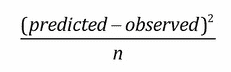
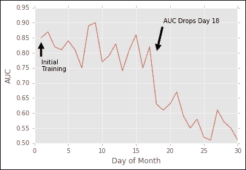
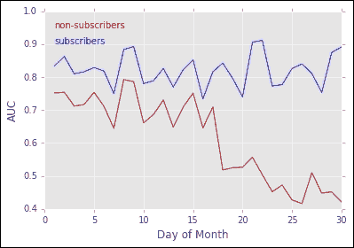
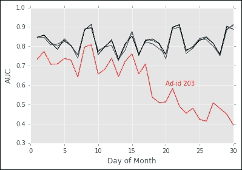
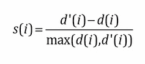
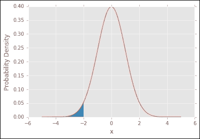
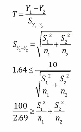
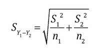
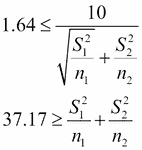
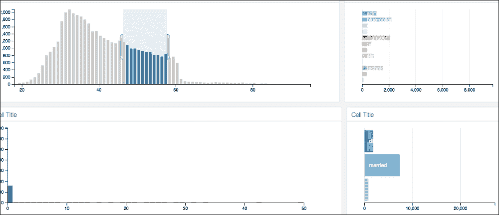

# 第九章。报告和测试 – 迭代分析系统

在前面的章节中，我们考虑了许多分析应用组件，从输入数据集到算法选择和调整参数，甚至展示了使用 Web 服务器的一个潜在部署策略。在这个过程中，我们考虑了可扩展性、可解释性和灵活性等参数，以使我们的应用能够应对算法的后续改进和规模需求的变化。然而，这些细节忽略了此应用最重要的元素：希望从模型中获得洞察力的业务伙伴以及组织持续的需求。我们应该收集哪些关于模型性能的指标来证明其影响？我们如何迭代初始模型以优化其在商业应用中的使用？如何将这些结果传达给利益相关者？这些问题在传达为组织构建分析应用的好处时至关重要。

正如我们可以使用越来越大的数据集来构建预测模型一样，自动分析包和“大数据”系统正在使收集大量关于算法行为的信息变得更加容易。因此，挑战不再是我们能否收集算法数据或如何衡量这种性能，而是选择哪些统计数据在商业分析环境中最能体现价值。为了使你具备更好地监控预测应用健康状况、通过迭代里程碑改进它们以及在本章中向他人解释这些技术的技能，我们将：

+   审查常见的模型诊断和性能指标。

+   描述如何使用 A/B 测试迭代改进模型。

+   总结在报告中传达预测模型预测洞察的方法。

# 使用诊断工具检查模型的健康状况

在前面的章节中，我们主要关注预测建模的初始步骤，从数据准备和特征提取到参数优化。然而，我们的客户或业务不太可能保持不变，因此预测模型通常也需要适应。我们可以使用多种诊断工具来检查模型随时间的变化性能，这些工具作为评估我们算法健康状况的有用基准。

## 评估模型性能的变化

让我们考虑一个场景，在这个场景中，我们在客户数据上训练一个预测模型，并在之后的每个月每天对一组新的记录进行性能评估。如果这是一个分类模型，例如预测客户在下一个支付周期是否会取消订阅，我们可以使用之前在第五章中看到的**曲线下面积**（**AUC**）和**接收者操作特征**（**ROC**）曲线的度量，即*将数据放在合适的位置 – 分类方法和分析*。或者，在回归模型的情况下，例如预测平均客户消费，我们可以使用*R²*值或平均平方误差：



为了量化随时间推移的性能。如果我们观察到这些统计数据中的一个下降，我们如何进一步分析可能的原因？



在上面的图表中，我们展示了这样一个场景，我们通过量化有多少目标用户点击了通过电子邮件发送的广告并访问了我们的公司网站，来衡量在初始训练后的 30 天内一个假设的广告定位算法的 AUC。我们看到 AUC 在第 18 天开始下降，但由于 AUC 是准确性的总体度量，因此不清楚是否所有观察结果都被错误预测，或者只有一部分子群体导致了性能下降。因此，除了测量总体 AUC 之外，我们还可能考虑计算由输入特征定义的数据子集的 AUC。除了提供识别问题新数据（并建议何时需要重新训练模型）的方法之外，此类报告还提供了一种识别我们模型整体业务影响的方法。



以我们的广告定位算法为例，我们可能会查看整体性能，并将其与我们数据集中的某个标签进行比较：用户是否是当前订阅者。性能在订阅者身上通常更高可能并不令人惊讶，因为这些用户已经很可能访问过我们的网站。从未访问过我们网站的未订阅者代表了这种情况下的真正机会。在前面的图表中，我们可以看到，确实，在第 18 天非订阅者的性能下降了。然而，也值得注意，这并不一定能够完全解释性能下降的原因。我们仍然不知道为什么新成员的性能较低。我们可以再次对数据进行子集划分，并寻找相关的变量。例如，如果我们查看多个广告 ID（这些 ID 对应于在电子邮件中向客户展示的不同图片），我们可能会发现性能下降是由于某个特定的广告（请参阅以下图表）。通过跟进我们的业务利益相关者，我们可能会发现这个特定的广告是为季节性产品做的，并且每年只展示 12 个月。因此，这个产品对订阅者来说很熟悉，他们可能之前见过这个产品，但对非会员来说则不熟悉，因此他们没有点击它。我们可能可以通过查看订阅者数据来验证这个假设，看看模型的性能是否也会在服务期限少于 12 个月的订阅者身上下降。



这种调查可以开始探讨如何优化针对新成员的特定广告，同时也可能指出改进我们模型训练的方法。在这种情况下，我们可能是在一个简单随机样本的数据上训练了算法，而这个样本对当前订阅者是有偏见的，因为我们如果对事件数据进行了简单随机抽样，那么我们关于这些客户的数据就更多了：订阅者更加活跃，因此他们产生的印象（他们可能已经注册了促销电子邮件）更多，点击广告的可能性也更大。为了改进我们的模型，我们可能想要在订阅者和非订阅者之间平衡我们的训练数据，以补偿这种偏差。

在这个简单的例子中，我们能够通过检查模型在数据的一小部分子段上的性能来诊断问题。然而，我们无法保证这种情况总是会发生，手动搜索数百个变量将是不高效的。因此，我们可能考虑使用预测模型来帮助缩小搜索范围。例如，可以考虑使用来自第五章的**梯度提升机**（**GBM**），*将数据放在合适的位置 – 分类方法和分析*，输入数据与训练预测模型所用的相同数据，输出数据为误分类（对于分类模型，可以是标签 1 或 0，对于回归模型，可以是平方误差或对数损失等连续误差）。现在我们有一个预测第一个模型中错误的模型。使用 GBM 这样的方法允许我们系统地检查大量潜在变量，并使用由此产生的变量重要性来缩小假设的数量。

当然，任何这些方法的成功都取决于导致性能下降的变量是否是我们训练集的一部分，以及问题是否与基本算法或数据有关。当然，也可以想象其他情况，其中存在一个我们没有使用来构建训练数据集的额外变量，这导致了问题，例如，在特定互联网服务提供商上的糟糕连接阻止用户点击广告到我们的网页，或者系统问题，如电子邮件投递失败。

通过对各个部分进行性能分析，也可以帮助我们确定在做出更改时算法是否按预期运行。例如，如果我们重新加权我们的训练数据以强调非订阅者，我们希望这些客户的 AUC 性能会提高。如果我们只检查整体性能，我们可能会观察到对现有客户的改进，但不是我们实际希望实现的效果。

## 特征重要性变化

除了检查模型随时间的准确性外，我们还可能想检查不同输入数据的重要性变化。在回归模型中，我们可能通过大小和统计显著性来判断重要系数，而在基于决策树的算法（如随机森林或 GBM）中，我们可以查看变量重要性的度量。即使模型的表现与之前讨论的评估统计量相同，底层变量的变化可能表明数据记录的问题或底层数据中具有商业意义的真实变化。

让我们考虑一个流失率模型，其中我们为用户账户输入一系列特征（如邮编、收入水平、性别以及每周在我们网站上花费的小时数等参与度指标），并尝试预测在每一个账单周期结束时，特定用户是否会取消其订阅。虽然有一个预测流失可能性的分数是有用的，因为我们可以针对这些用户进行额外的促销活动或定向信息，但贡献于这个预测的底层特征可能为我们提供更具体行动的见解。

在这个例子中，我们每周生成一个报告，列出预测模型中最重要的 10 个特征。从历史来看，这个列表一直保持一致，其中顾客的职业和收入是顶级变量。然而，在一周内，我们发现收入不再在这个列表中，取而代之的是邮编。当我们检查流入模型的数据时，我们发现收入变量不再被正确记录；因此，与收入相关的邮编在模型中成为了这个特征的替代品，而我们常规的变量重要性分析帮助我们检测到一个重大的数据问题。

如果收入变量被正确记录了呢？在这种情况下，如果底层特征都在捕捉客户的财务状况，那么邮编比收入更有预测力似乎不太可能。因此，我们可能会检查在过去一周内，是否有特定的邮编其流失率发生了显著变化。经过调查，我们发现竞争对手最近在某些邮编地区推出了价格更低的网站，这让我们既理解了邮编作为预测因素上升的原因（选择更低价格选项的客户更有可能放弃我们的网站），又指出了更大兴趣的市场动态。

这种第二种场景还暗示了另一个我们可能需要监控的变量：数据集中变量之间的相关性。虽然在大数据集中全面考虑每一对变量在计算上困难重重，在实践上又受到限制，但我们可以使用如第六章中描述的主成分分析等降维技术，*文字与像素 - 处理非结构化数据*，来提供变量之间相关性的高级概述。这把监控这些相关性的任务简化为检查几个重要成分的图表，反过来，这又能使我们注意到数据底层结构的变化。

## 无监督模型性能的变化

我们之前考察的例子都涉及一个监督模型，其中我们有一个预测的目标，并通过查看 AUC 或类似指标来衡量性能。在第三章中考察的无监督模型，即《在噪声中寻找模式 – 聚类和无监督学习》，我们的结果是聚类成员资格而不是目标。在这种情况下，我们可以查看哪些诊断？

在我们有黄金标准标签的情况下，例如如果我们对电子邮件文档进行聚类，我们有垃圾邮件与非垃圾邮件消息的人类标注标签，我们可以检查消息是否最终进入不同的聚类或混合。在某种程度上，这类似于查看分类精度。然而，对于无监督模型，我们可能经常没有任何已知的标签，聚类纯粹是一个探索性工具。我们仍然可以使用人类标注的示例作为指导，但对于更大的数据集来说，这可能变得不可行。在其他场景中，例如在线媒体的情感，仍然足够主观，以至于人类标签可能不会显著丰富来自如我们在第六章中讨论的 LDA 主题模型等自动化方法的标签。在这种情况下，我们如何判断聚类随时间的变化质量？

在那些组数是动态确定的场景中，例如通过第三章中描述的亲和传播聚类算法，即《在噪声中寻找模式 – 聚类和无监督学习》，我们检查聚类数量是否随时间保持不变。然而，在我们之前考察的大多数情况下，聚类数量是固定的。因此，我们可以设想一种诊断方法，即检查训练周期之间最近聚类中心的距离：例如，对于一个有 20 个聚类的 k-means 模型，将第 1 周中的每个聚类分配给第 2 周中最接近的匹配，并比较 20 个距离的分布。如果聚类保持稳定，那么这些距离的分布也应该如此。变化可能表明 20 已不再是拟合数据的良好数字，或者 20 个聚类的组成随时间显著变化。我们还可以检查 k-means 聚类随时间变化的平方和误差等值，以查看获得的聚类质量是否显著变化。

另一个对特定聚类算法无差别的质量指标是轮廓分析（Rousseeuw, Peter J. "Silhouettes: a graphical aid to the interpretation and validation of cluster analysis." *Journal of computational and applied mathematics 20* (1987): 53-65）。对于集合中的每个数据点**i**，我们询问它与其他簇中点的平均差异（由聚类算法中使用的距离度量判断），给出一个值*d(i)*。如果点**i**被适当地分配，那么*d(i)*接近 0，因为**i**与其簇中其他点的平均差异低。我们还可以为**i**计算其他簇的相同平均差异值，第二个最低值（i 的第二好簇分配）由*d'(i)*给出。然后我们使用公式获得一个介于-1 和 1 之间的轮廓分数：



如果一个数据点很好地分配到其簇中，那么它在平均上与其他簇的相似度要低得多。因此，`d'(i)`（i 的“第二好簇”）大于`d(i)`，并且轮廓分数公式中的比率接近 1。相反，如果点分配到其簇中的效果不佳，那么`d'(i)`的值可能小于`d(i)`，在轮廓分数公式的分子中给出负值。接近零的值表明该点可以合理地分配到两个簇中。通过查看数据集上轮廓分数的分布，我们可以了解点随时间聚类的效果。

最后，我们可能使用一种自举方法，即多次重新运行聚类算法，并询问两个点有多少次最终落在同一个簇中。这些簇共现的分布（介于 0 和 1 之间）也可以给出关于分配随时间稳定性的感觉。

与聚类模型一样，降维技术也不容易找到一个金标准来衡量模型质量随时间的变化。然而，我们可以取数据集的主成分向量等值，并检查它们的成对差异（例如，使用第三章中描述的余弦分数 Chapter 3，*在噪声中寻找模式 – 聚类和无监督学习*），以确定它们是否发生了显著变化。在矩阵分解技术的情况下，我们还可以查看原始矩阵与分解元素乘积（例如，非负矩阵分解中的*W*和*H*矩阵）之间的重建误差（例如，所有矩阵元素的平均平方差）。

# 通过 A/B 测试迭代模型

在上述示例以及本书的前几章中，我们主要从预测能力方面分析了分析系统。然而，这些指标并不一定最终能衡量出对商业有意义的各种结果，例如收入和用户参与度。在某些情况下，这种不足可以通过将模型的性能统计数据转换为更易于商业应用理解的单位来克服。例如，在我们的先前的流失率模型中，我们可能会将我们对“取消”或“未取消”的预测乘以，以生成通过订阅者取消而损失的预测金额。

在其他情况下，我们基本上无法使用历史数据来衡量业务结果。例如，在尝试优化搜索模型时，我们可以衡量用户是否点击了推荐，以及他们点击后是否购买了任何东西。通过这种回顾性分析，我们只能优化用户在网页上实际看到的推荐顺序。然而，可能的情况是，通过更好的搜索模型，我们会向用户展示一组完全不同的推荐，这将导致更高的点击率和收入。然而，我们无法量化这种假设情景，这意味着我们需要在改进算法时采用替代方法来评估算法。

做这件事的一种方法是通过实验过程，或 A/B 测试，这个名字来源于比较随机分配到治疗 A 和 B 的测试对象（例如，客户）的结果的概念，以确定哪种方法产生最佳结果。在实践中，可能存在许多超过两种治疗方法的情况，实验可以在用户、会话（例如，在网站上的登录和登出之间的时间段）、产品或其他单位上进行随机化。虽然对 A/B 测试的全面讨论超出了本章的范围，但我们建议感兴趣的读者参考更广泛的参考资料（Bailey, Rosemary A. *比较实验设计*. 第 25 卷. 剑桥大学出版社，2008 年；Eisenberg, Bryan 和 John Quarto-vonTivadar. *始终在测试：Google 网站优化器的完整指南*. 约翰·威利父子出版社，2009 年；Finger, Lutz 和 Soumitra Dutta. *询问、衡量、学习：使用社交媒体分析来理解和影响客户行为*. "O'Reilly 媒体公司"，2014 年）。

## 实验分配 - 将客户分配到实验中

你有一个希望改进的算法——如何比较其性能在提高一个指标（如收入、留存、参与度）方面与现有模型（或根本不使用预测模型）相比？在这个比较中，我们想要确保除了两个（或更多）模型本身之外，移除所有可能混淆的因素。这个想法是实验随机化的概念：如果我们随机将客户（例如）分配给接收来自两个不同模型的搜索推荐，客户人口统计学的任何变化，如年龄、收入和订阅期限，应该在两组之间大致相同。因此，当我们比较根据这种随机分配在时间上两组之间模型的性能时，算法性能的差异可以归因于模型本身，因为我们已经通过这种随机化考虑了其他潜在变化来源。

我们如何保证用户被随机分配到实验组？一种可能性是为每个成员分配一个介于 0 和 1 之间的随机数，并根据这个数是否大于 0.5 来划分他们。然而，这种方法可能存在缺点，即由于分配给用户的随机数可能会改变，因此很难复制我们的分析。另一种可能性是，我们通常会有用户 ID，这是分配给特定账户的随机数。假设这个数的格式足够随机，我们可以取这个数的模（除以一个固定的除数，如 2）的余数，并根据模数（例如，如果除数是 2，这将基于账户 ID 是偶数还是奇数来决定是 0 还是 1）将用户分配到两组。因此，用户被随机分配到两组，但我们可以轻松地在未来重新创建这种分配。

我们还可能考虑是否总是想要一个简单的随机分层。在之前讨论的广告定位示例中，我们实际上更关心算法在非订阅者上的性能，而不是在我们的例子中可能构成随机分配大部分的现有用户。因此，根据我们的目标，我们可能需要考虑随机分配分层样本，其中我们对某些账户进行过采样，以补偿数据中固有的偏差。例如，我们可能会强制执行每个国家账户数量大致相等，以抵消对人口较多的地区的地理偏差，或者为以年轻用户为主的服务提供相同数量的青少年和成年用户。

除了根据特定算法随机分配用户以接收某种体验（如搜索推荐或通过电子邮件发送的广告）之外，我们通常还需要一个控制组，以便将其结果进行比较。在某些情况下，控制组可能是没有使用任何预测模型时预期的结果。在其他情况下，我们是在比较旧的预测模型与新的版本。

## 决定样本大小

现在我们已经知道了我们试图测试的内容，并且有了一种随机分配用户的方法，那么我们应该如何确定分配给实验的人数呢？如果我们有一个对照组和几个实验条件，我们应该将多少用户分配给每个组？如果我们的预测模型依赖于用户交互（例如，评估搜索模型的性能需要用户访问网站）而这种情况可能并不保证在实验人群中的每个成员都会发生，我们需要积累多少活动（例如，搜索）来判断实验的成功？这些问题都涉及到对效应大小和实验功效的估计。

如您可能从统计学中回忆起来，在控制实验中，我们试图确定两个群体（例如，我们实验评估不同广告定位预测算法时用户群体产生的收入）之间的结果差异更有可能是由于随机变化还是算法性能的实际差异。这两个选项也被称为零假设，通常用 *H0* 表示（即，两组之间没有差异）和用 *H1* 表示的备择假设。为了确定一个效应（例如，两组之间的收入差异）是否由随机机会解释，我们将这个效应与一个分布（以下我们将讨论的原因）进行比较，并询问如果真实效应是 **0**，观察这个效应或更大的可能性是什么。这个值——在无效应假设下，观察到的效应大于或等于给定效应的累积概率——被称为 p 值，我们通常将其应用于一个阈值，例如 0.05（在下面的例子中，这由标准正态分布左侧的阴影区域表示）。



当我们评估这种统计显著性时，我们可能会遇到两种类型的错误，因为任何效应的测量都受到不确定性的影响。我们永远不知道效应的真正值，而是用一些误差来测量这个真实、未知的效果。首先，我们可能会错误地宣布一个结果具有统计学意义，而实际上它并没有。这被称为第一类错误（假阳性）。其次，我们可能会未能宣布一个结果具有统计学意义，而实际上它确实具有（也称为第二类错误，或假阴性）。

我们可以提出问题，如果我们两个群体之间确实存在差异（例如，收入差异），我们需要多少样本才能宣布这种特定效果（例如，收入差异）具有显著性。虽然具体应用可能有所不同，但为了说明，我们将假设两组足够大，并且测量平均值的任何差异（例如收入或点击率）都遵循正态分布，这是由于**大数定律**。然后，我们可以使用 t 分布来评估这种差异，它近似于大样本的标准正态分布，但不需要我们知道总体均值和方差，只需知道样本的均值和方差。然后，计算所需样本数量只需要使用以下公式（对于方差可能不等的双样本 t 检验，也称为 Welch 的 t 检验）：



在这里，*Y* 是每个组的平均效果（例如，每位客户的收入），而 S（标准差）由以下方程给出：



在这里，*S[1]* 和 *S[2]* 是两组的样本方差，而 *n[1]* 和 *n[2]* 是两组的样本大小。因此，如果我们想能够检测到 10 的差异，例如，以 0.05 的 p 值，我们求解在零假设下 t 统计量导致 5%的假阳性（我们使用 1.64 的正常近似值，这是标准正态分布累积分布函数值为 0.05 的值）。我们可以求解：



因此，给定实验中各组方差的值，我们可以为两组输入不同的 *n* 值，并查看它们是否足够满足不等式。为此应用，我们可能通过查看给定样本大小的用户历史收入数据来估计方差。

如果你仔细观察前面方程的右侧，你会看到（假设样本方差合理相似，这在许多大规模实验中并不算不合理，例如在消费者网站上进行的实验），这个值将由 *n[1]* 和 *n[2]* 中的较小者决定，因为当我们增加一个样本大小时，包含它的项趋向于 0。因此，我们通常通过将两组的样本量分配得相等来实现最佳功效。这个事实在考虑如何决定我们的控制组和实验组的相对大小时非常重要。以一个例子来说明，我们有三版广告定位算法，以及没有任何算法作为控制，并测量产生的点击率。根据前面的计算，我们需要决定我们的主要问题是什么。如果我们想知道是否有任何算法比没有算法更好，我们应该在控制和任何三个算法变体之间平均分配用户。然而，如果我们想决定哪个算法与控制相比最好，我们希望所有四个单元格中的用户数量相等，这样控制和每个处理都是大约相等的大小。

注意，前面的计算假设我们感兴趣的是两组之间固定的 10 个单位的响应差异。我们也可以简单地询问是否存在任何差异（例如，差异不是零）。这个选择取决于算法所代表的任何提升是否具有价值，或者是否需要固定的改进来实现当前的业务目标。

## 多重假设检验

我们将要讨论的最后一个话题有些微妙，但很重要，因为当模型具有众多可调参数和算法变体时，我们可能在单个 A/B 实验中执行大量假设测试。虽然我们可能以 0.05 的显著性水平评估每个测试，但如果我们执行 20 次这样的评估，我们找到一些显著结果的可能性为 20*0.05 = 1（或几乎肯定），即使它实际上是随机噪声。这个问题被称为*多重假设检验*，它要求我们可能需要重新调整我们的显著性阈值。这样做最简单的方法是将我们使用的 p 值阈值（例如，0.05）除以执行的测试次数（20），以获得新的显著性阈值。这被称为 Bonferroni 校正（Dunn, Olive Jean. "Estimation of the medians for dependent variables." *The Annals of Mathematical Statistics* (1959): 192-197; Dunnett, Charles W. "A multiple comparison procedure for comparing several treatments with a control." *Journal of the American Statistical Association* 50.272 (1955): 1096-1121），虽然正确，但在某些情况下可能过于保守。它假设我们希望类型 I（假阳性）率为零。然而，在探索性分析中，只要我们合理确信大多数显著结果是可以复制的，我们通常可以接受一些非零的假阳性率。在这种情况下，一种**全家族错误率**（**FWER**）的方法可能更可取。虽然 FWER 的讨论超出了本章的范围，但我们建议感兴趣的读者参考该主题的参考文献（Shaffer, Juliet Popper. "Multiple hypothesis testing." *Annual review of psychology* 46 (1995): 561; Toothaker, Larry E. *Multiple comparison procedures*. No. 89\. Sage, 1993)。

# 沟通指南

现在我们已经涵盖了预测模型的调试、监控和迭代测试，我们将以一些关于如何将算法结果传达给更广泛受众的注意事项作为结尾。

## 将术语翻译成商业价值

在本文中，我们经常讨论评估统计量或系数，其解释可能并不明显，也不明显这些值的数值变化差异。系数较大或较小意味着什么？AUC 在预测客户互动方面意味着什么？在任何这些情况下，将基础值转换为业务指标以向非技术同事解释其重要性都是有用的：例如，线性模型中的系数表示特定输入变量变化 1 个单位时结果（如收入）的单位变化。对于转换变量，将诸如对数几率（来自逻辑回归）之类的值与诸如事件概率加倍之类的值相关联可能是有用的。此外，如前所述，我们可能需要将预测的结果（如取消）转换为财务金额，以使其含义清晰。此类转换不仅有助于传达预测算法的影响，而且有助于在规划中明确优先事项。如果一个算法的开发时间（其成本可能由涉及员工的工资来估算）不能抵消其性能的估计收益，那么这表明从业务角度来看，这不是一个有用的应用。 

## 可视化结果

虽然我们讨论的并非所有算法都适合可视化，但许多算法都有可能通过绘图来清晰展示其元素。例如，可以通过条形图比较回归系数，而树模型可以通过导致特定结果的分支决策点进行视觉表示。此类图形有助于将本质上数学的对象转化为更易于理解的结果，同时也提供了对模型性能的持续洞察，如前所述。

作为构建此类服务的实际示例，本章的案例研究将介绍如何生成一个自定义仪表板，作为我们在第八章中构建的预测服务的扩展，即*通过预测服务共享模型*。

### 案例研究：构建一个报告服务

在第八章中，我们创建了一个使用 MongoDB 作为后端数据库来存储模型数据和预测的预测服务。我们可以使用这个相同的数据库作为创建报告服务的源。就像我们在第八章中描述的 CherryPy 服务器和建模服务应用程序之间的关注点分离一样，报告服务可以编写而不需要了解数据库中信息的生成方式，这使得在建模代码可能随时间变化的情况下，可以生成灵活的报告基础设施。就像预测服务一样，我们的报告服务有几个关键组件。

+   将接收报告服务输出请求的服务器。

+   服务器运行的报告应用程序，它接收来自服务器的请求并将它们路由以显示正确的数据。

+   从中检索用于制作图表所需信息的数据库。

+   为最终用户渲染我们感兴趣的图表的图表系统。

让我们逐个分析每个组件的示例，这将说明它们是如何相互配合的。

## 报告服务器

我们的服务器代码与我们在第八章中使用的`CherryPy`服务器非常相似，*通过预测服务共享模型*。

### 注意

这个例子受到了[`github.com/adilmoujahid/DonorsChoose_Visualization`](https://github.com/adilmoujahid/DonorsChoose_Visualization)上可用的代码的启发。

唯一的区别是，我们不是启动`modelservice`应用程序，而是使用服务器来启动`reportservice`，正如你在`main`方法中看到的那样：

```py
>>> if __name__ == "__main__":
…      service = reportservice()
…    run_server(service)

```

我们可以通过在命令行上简单地运行以下命令来测试这个服务器：

```py
python report_server.py

```

你应该看到服务器开始将信息记录到控制台，就像我们之前观察到的`modelserver`一样。

## 报告应用程序

在应用程序代码中，它也是一个像我们在第八章中构建的模型服务一样的 Flask 应用程序，*通过预测服务共享模型*，我们需要一些之前没有使用过的额外信息。首先是路径变量，用于指定我们构建图表时所需的 JavaScript 和 CSS 文件的位置，这些文件使用以下命令指定：

```py
>>> static_dir = os.path.join(os.path.dirname(os.path.abspath(__file__)), 'templates/assets')

```

我们还需要指定包含我们图表的 HTML 页面的位置，这些图表将渲染给用户，使用以下参数：

```py
>>> tmpl_dir = os.path.join(os.path.dirname(os.path.abspath(__file__)), 'templates')

```

当我们初始化应用程序时，我们将这两个变量作为变量传递给构造函数：

```py
>>> app = Flask(__name__,template_folder=tmpl_dir,static_folder=static_dir)

```

当服务器调用此应用程序时，我们只需在`reportservice`函数中返回`app`即可：

```py
>>> def reportservice():
…    return app

```

现在，我们只需要指定服务器转发的请求的应用程序响应。首先是简单地渲染一个包含我们图表的页面：

```py
>>> @app.route("/")
…   def index():
…     return render_template("layouts/hero-thirds/index.html")

```

本例中的模板来自 [`github.com/keen/dashboards`](https://%20github.com/keen/dashboards)，这是一个开源项目，提供了用于快速生成仪表板的可重用模板。

第二个路由将允许我们检索用于填充图表的数据。这不应该暴露给最终用户（尽管如果您在浏览器中导航到这个端点，您会看到我们集合中所有 JSON 的文本输出）：它是由客户端 JavaScript 代码用来检索填充图表所需信息的。首先，我们需要在另一个终端窗口中使用以下命令启动 mongodb 应用程序：

```py
> mongod

```

接下来，在我们的代码中，我们需要指定用于访问数据的 MongoDB 参数。虽然我们可以将这些参数作为 URL 中的参数传递，但为了简化本例，我们将在 reportservice 代码的顶部直接硬编码它们，以便指向我们在第八章 分享预测服务中的模型 中训练 Spark 逻辑回归模型所使用的银行数据集的批量评分结果：

```py
>>> FIELDS = {'score': True, \
…          'value': True, \
…          '_id': False}
… MONGODB_HOST = 'localhost'
… MONGODB_PORT = 27017
… DBS_NAME = 'datasets'
… COLLECTION_NAME = 'bankResults'

```

注意，我们同样可以通过更改 `MONGODB_HOST` 参数，将数据源指向远程服务器，而不是我们机器上运行的本地数据源。回想一下，当我们存储批量评分的结果时，我们保存了包含两个元素的记录，即评分和原始数据行。为了绘制我们的结果，我们需要提取原始数据行，并使用以下代码将其与评分一起展示：

```py
>>> @app.route("/report_dashboard")
…  def run_report():
…    connection = MongoClient(MONGODB_HOST, MONGODB_PORT)
…    collection = connection[DBS_NAME][COLLECTION_NAME]
…    data = collection.find(projection=FIELDS)
…    records = []
…    for record in data:
…        tmp_record = {}
…        tmp_record = record['value']
…        tmp_record['score'] = record['score']
…        records.append(tmp_record)
…    records = json.dumps(records, default=json_util.default)
…    connection.close()

```

现在我们已经将所有评分记录存储在一个单独的 json 字符串数组中，我们可以使用一点 JavaScript 和 HTML 来绘制它们。

## 可视化层

我们还需要的是用于填充图表的客户端 JavaScript 代码，以及一些修改 `index.html` 文件以使用图表代码的修改。让我们依次查看这些内容。

生成图表的代码是一个包含在 `report.js` 文件中的 JavaScript 函数，您可以在项目目录下的 `templates/assets/js` 中找到它，对应于第九章 报告和测试 - 在分析系统中迭代。我们从这个函数开始，调用所需的数据，并使用异步函数 `d3.queue()` 等待其检索：

```py
>>> d3_queue.queue() 
… .defer(d3.json, "/report_dashboard")
… .await(runReport);

```

注意，这个 URL 与我们在报告应用程序中之前指定的相同端点，用于从 MongoDB 中检索数据。`d3_queue` 函数调用此端点，并在运行 `runReport` 函数之前等待数据返回。虽然更深入的讨论超出了本文的范围，但 `d3_queue` 是 `d3` 库的一个成员 ([`d3js.org/`](https://d3js.org/))，这是一个流行的 JavaScript 语言可视化框架。

一旦我们从数据库中检索到数据，我们需要指定如何使用`runReport`函数来绘制它。首先，我们将声明与函数相关的数据：

```py
>>> function runReport(error, recordsJson) { 
…  var reportData = recordsJson; 
…  var cf = crossfilter(reportData);

```

虽然直到我们视觉上检查生成的图表时才会明显，但`crossfilter`库（[`square.github.io/crossfilter/`](http://square.github.io/crossfilter/））允许我们在一个图表中突出显示数据的一个子集，并同时突出显示另一个图表中对应的数据，即使绘制的维度不同。例如，想象一下，我们有一个系统中特定`account_ids`的年龄直方图，以及一个特定广告活动的点击率与`account_id`的散点图。`Crossfilter`函数将允许我们使用我们的光标选择散点图的点的一个子集，同时过滤直方图，只显示与所选点对应的年龄。这种过滤对于深入特定数据子段非常有用。接下来，我们将生成我们在绘图时将使用的维度：

```py
>>>  var ageDim = cf.dimension(function(d) { return d["age"]; });
…  var jobDim = cf.dimension(function(d) { return d["job"]; });
…  var maritalDim = cf.dimension(function(d) { return d["marital"]; });

```

这些函数中的每一个都接受输入数据并返回请求的数据字段。维度包含列中的所有数据点，并形成我们将用于检查数据子集的超集。使用这些维度，我们构建了唯一的值组，我们可以使用，例如，在绘制直方图时：

```py
>>>  var ageDimGroup = ageDim.group();
…  var jobDimGroup = jobDim.group();
…  var maritalDimGroup = maritalDim.group();

```

对于我们的一些维度，我们想要添加表示最大值或最小值的值，我们在绘制数值数据的范围时使用这些值：

```py
>>> var minAge = ageDim.bottom(1)[0]["age"];
… var maxAge = ageDim.top(1)[0]["age"];
… var minBalance = balanceDim.bottom(1)[0]["balance"];
… var maxBalance = balanceDim.top(1)[0]["balance"];

```

最后，我们可以使用`dc`（[`dc-js.github.io/dc.js/`](https://dc-js.github.io/dc.js/）），一个使用`d3`和 crossfilter 创建交互式可视化的图表库，来指定我们的图表对象。每个图表构造函数给出的`#`标签指定了我们在将其插入 HTML 模板时将使用的 ID。我们使用以下代码构建图表：

```py
>>>  var ageChart = dc.barChart("#age-chart"); 
…  var jobChart = dc.rowChart("#job-chart"); 
…  var maritalChart = dc.rowChart("#marital-chart"); 
…

```

最后，我们指定这些图表的维度和轴：

```py
>>>  ageChart
…  .width(750) 
…  .height(210) 
…  .dimension(ageDim) 
…  .group(ageDimGroup) 
…  .x(d3_scale.scaleLinear()
…  .domain([minAge, maxAge]))
…  .xAxis().ticks(4); 

>>>  jobChart 
…  .width(375) 
…  .height(210) 
…  .dimension(jobDim) 
…  .group(jobDimGroup) 
…  .xAxis().ticks(4);

```

我们只需要一个渲染调用来显示结果：

```py
>>>  dc.renderAll();

```

最后，我们需要修改我们的`index.html`文件以显示我们的图表。如果你在这个文件中打开一个文本编辑器，你会注意到几个地方有`<div>`标签，例如：

```py
>>>  <div class="chart-stage">
…
…       </div>

```

这是我们需要使用以下 ID 放置图表的位置，这些 ID 我们在前面的 JavaScript 代码中已经指定了：

```py
>>>  <div id="age-chart">
…         </div>

```

最后，为了渲染图表，我们需要在 HTML 文档底部的`<script>`标签中包含我们的`javascript`代码：

```py
>>> <script type="text/javascript" … src="img/report.js"></script>

```

现在，你应该能够导航到`CherryPy`服务器指向的 URL，即`localhost:5000`，现在应该显示如下图表：



在给定年龄范围内的用户子集的其他维度上突出显示的 Crossfilter 图表。

数据来源于我们在第八章中使用的训练模型服务的银行违约示例，*与预测服务共享模型*。您可以看到，通过选择年龄分布中的数据点子集，我们突出了这些相同用户的职业、银行余额和教育分布。这种可视化对于深入诊断问题点（例如，如果数据点的子集被模型错误分类）非常有用。使用这些基本成分，您现在不仅可以使用第八章中提到的预测服务进行模型训练，还可以通过报告层来可视化其行为。

# 摘要

在本章中，我们学习了在初始设计之后监控预测模型性能的几种策略，并观察了模型性能或组件随时间变化的多种场景。作为模型优化过程的一部分，我们探讨了 A/B 测试策略，并说明了如何执行基本的随机分配以及估计测量改进所需的样本量。我们还展示了如何利用我们的预测服务基础设施来创建用于监控的仪表板可视化，这可以轻松扩展到其他用例。
