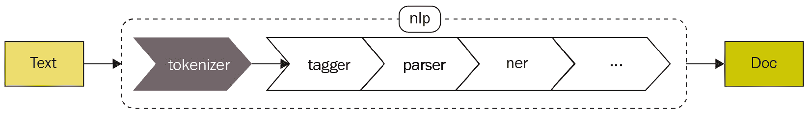
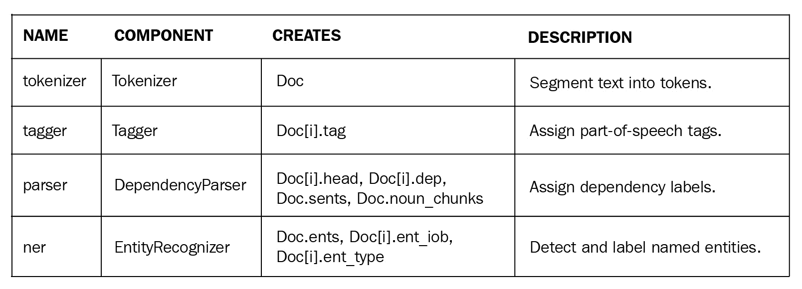
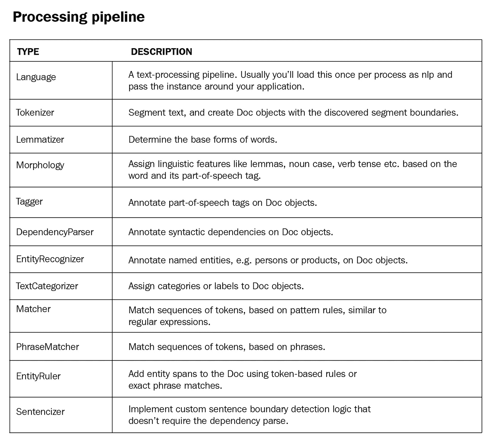
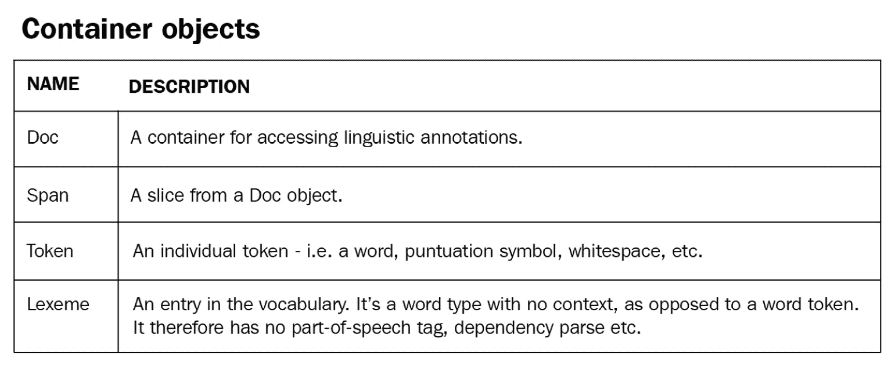
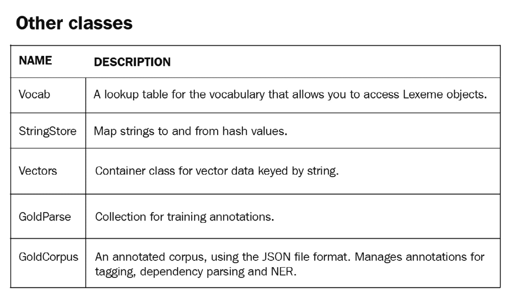
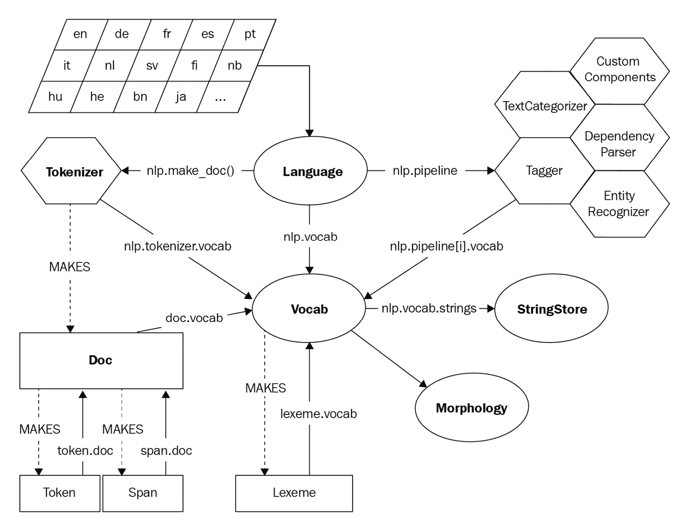
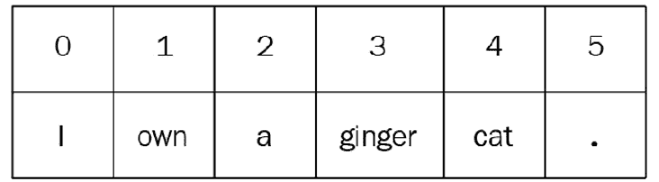
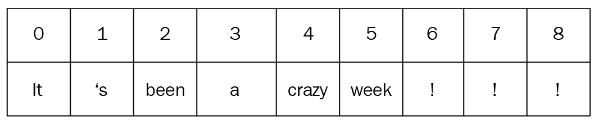
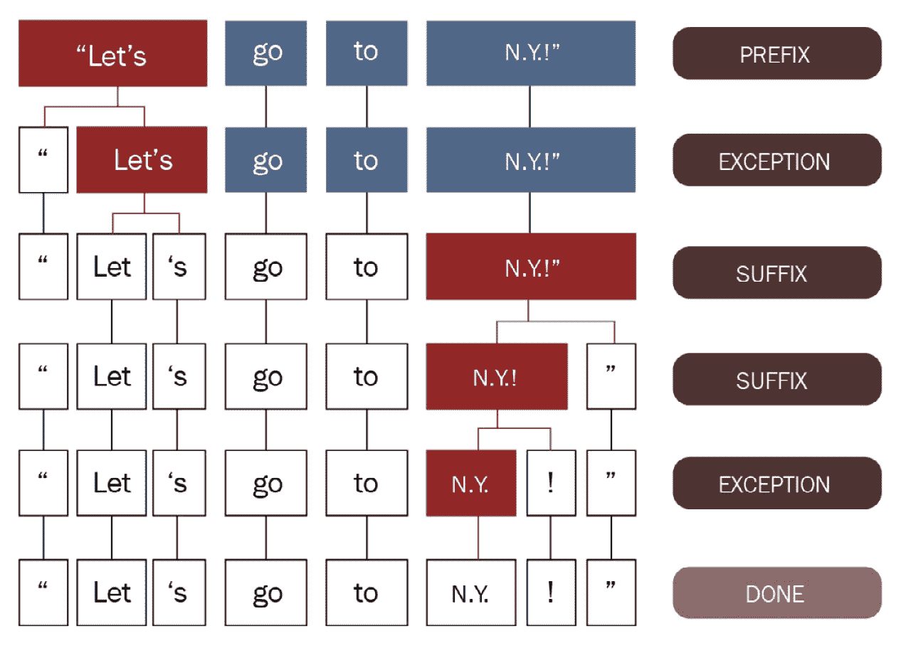

# 第二章：使用 spaCy 的核心操作

在本章中，你将学习使用 spaCy 的核心操作，例如创建语言管道、分词文本以及将文本分解成句子。

首先，你将学习什么是语言处理管道以及管道组件。我们将继续介绍 spaCy 的通用约定——重要的类和类组织——以帮助你更好地理解 spaCy 库的组织结构，并对你对库本身有一个坚实的理解。

你将接着学习第一个管道组件——**分词器**。你还将了解一个重要的语言学概念——**词形还原**——以及它在**自然语言理解**（**NLU**）中的应用。随后，我们将详细介绍**容器类**和**spaCy 数据结构**。我们将以有用的 spaCy 特性结束本章，这些特性你将在日常 NLP 开发中使用。

在本章中，我们将涵盖以下主要主题：

+   spaCy 约定的概述

+   介绍分词

+   理解词形还原

+   spaCy 容器对象

+   更多 spaCy 特性

# 技术要求

本章的代码可以在本书的 GitHub 仓库中找到：[`github.com/PacktPublishing/Mastering-spaCy/tree/main/Chapter02`](https://github.com/PacktPublishing/Mastering-spaCy/tree/main/Chapter02)

# spaCy 约定的概述

每个 NLP 应用程序都包含对文本进行处理的几个步骤。正如你在第一章中看到的，我们总是创建了名为`nlp`和`doc`的实例。但我们到底做了什么呢？

当我们在文本上调用`nlp`时，spaCy 会应用一些处理步骤。第一步是分词，以生成一个`Doc`对象。然后，`Doc`对象会进一步通过`Doc`处理，然后传递给下一个组件：



图 2.1 – 处理管道的高级视图

当我们加载语言模型时，会创建一个 spaCy 管道对象。在以下代码段中，我们加载了一个英语模型并初始化了一个管道：

```py
 import spacy
 nlp = spacy.load("en_core_web_md")
 doc = nlp("I went there")
```

在前面的代码中实际上发生了以下情况：

1.  我们首先导入了`spaCy`。

1.  在第二行，`spacy.load()`返回了一个`Language`类实例，`nlp`。`Language`类是*文本处理管道*。

1.  然后，我们将`nlp`应用于示例句子`我去那里`，并得到了一个`Doc`类实例，`doc`。

`Language`类在幕后将所有先前的管道步骤应用于你的输入句子。在将`nlp`应用于句子后，`Doc`对象包含标记、词形还原，如果标记是实体，则标记为实体（我们将在稍后详细介绍这些是什么以及如何实现）。每个管道组件都有一个明确定义的任务：



图 2.2 – 管道组件和任务

spaCy 语言处理管道始终**依赖于统计模型**及其能力。这就是为什么我们总是将语言模型作为代码中的第一步通过`spacy.load()`加载。

每个组件都对应一个`spaCy`类。`spaCy`类有自解释的名称，如`Language`和`Doc`类 – 让我们看看所有处理管道类及其职责：



图 2.3 – spaCy 处理管道类

不要被类的数量吓倒；每个类都有独特的功能，可以帮助你更好地处理文本。

有更多数据结构可以表示文本数据和语言数据。例如，Doc 容器类包含关于句子、单词和文本的信息。除了 Doc 之外，还有其他容器类：



图 2.4 – spaCy 容器类

最后，spaCy 为向量、语言词汇和注释提供了辅助类。在这本书中，我们将经常看到`Vocab`类。`Vocab`代表一种语言的词汇。Vocab 包含我们加载的语言模型中的所有单词：



图 2.5 – spaCy 辅助类

spaCy 库的核心数据结构是`Doc`和`Vocab`。`Doc`对象通过拥有标记序列及其所有属性来抽象文本。`Vocab`对象为所有其他类提供集中式的字符串和词汇属性。这样 spaCy 就避免了存储多个语言数据的副本：



图 2.6 – spaCy 架构

你可以将组成前面 spaCy 架构的对象分为两类：**容器**和**处理管道组件**。在本章中，我们将首先了解两个基本组件，**分词器**和**词形还原器**，然后我们将进一步探索**容器对象**。

spaCy 在幕后为我们执行所有这些操作，使我们能够专注于我们自己的应用程序开发。在这个抽象级别上，使用 spaCy 进行 NLP 应用程序开发并非巧合。让我们从`Tokenizer`类开始，看看它为我们提供了什么；然后我们将在本章中逐个探索所有容器类。

# 介绍分词

我们在*图 2.1*中看到，文本处理管道的第一步是分词。分词总是第一个操作，因为所有其他操作都需要标记单元。

分词简单来说就是将句子拆分成其标记单元。**标记单元**是语义的一个单位。你可以将标记单元想象为文本中最小的有意义的部分。标记单元可以是单词、数字、标点符号、货币符号以及任何其他构成句子的有意义的符号。以下是一些标记单元的例子：

+   `USA`

+   `N.Y.`

+   `city`

+   `33`

+   `3rd`

+   `!`

+   `…`

+   `?`

+   `'s'

输入到 spaCy 标记化器的是 Unicode 文本，结果是 `Doc` 对象。以下代码显示了标记化过程：

```py
 import spacy
 nlp = spacy.load("en_core_web_md")
 doc = nlp("I own a ginger cat.")
 print ([token.text for token in doc])
 ['I', 'own', 'a', 'ginger', 'cat', '.']
```

以下是我们刚刚所做的事情：

1.  我们首先导入 `spaCy`。

1.  然后，我们通过 `en` 快捷方式加载了英语语言模型以创建 `nlp` `Language` 类的实例。

1.  然后，我们将 `nlp` 对象应用于输入句子以创建 `Doc` 对象，`doc`。`Doc` 对象是一个 `Token` 对象序列的容器。当我们创建 `Doc` 对象时，spaCy 隐式地生成 `Token` 对象。

1.  最后，我们打印出前一句子的标记列表。

就这样，我们只用了三行代码就完成了标记化。你可以通过以下方式可视化标记化：

![图 2.7 – “我有一只姜黄色猫。”的标记化]



图 2.7 – “我有一只姜黄色猫。”的标记化

如示例所示，标记化确实可能很棘手。有许多方面我们应该注意：标点符号、空白、数字等等。使用 `text.split(" ")` 从空白处分割可能很有吸引力，看起来它对于示例句子 *我有一只姜黄色猫* 是有效的。

那么，`"It's been a crazy week!!!"` 这个句子呢？如果我们使用 `split(" ")`，得到的标记将是 `It's`、`been`、`a`、`crazy`、`week!!!`，这并不是你想要的。首先，`It's` 不是一个标记，它是两个标记：`it` 和 `'s'`。`week!!!` 不是一个有效的标记，因为标点符号没有被正确分割。此外，`!!!` 应该按符号标记化，并生成三个 *!*。 (这可能看起来不是一个重要的细节，但请相信我，这对 *情感分析* 非常重要。我们将在 *第八章**，使用 spaCy 进行文本分类* 中介绍情感分析。) 让我们看看 spaCy 标记化器生成了什么：

```py
 import spacy
 nlp = spacy.load("en_core_web_md")
 doc = nlp("It's been a crazy week!!!")
 print ([token.text for token in doc])
['It', "'s", 'been', 'a', 'crazy', 'week', '!', '!', '!']
```

这次句子是这样分割的：

![图 2.8 – 引号和标点符号的标记化]



图 2.8 – 引号和标点符号的标记化

spaCy 是如何知道在哪里分割句子的？与其他管道部分不同，标记化器不需要统计模型。标记化基于语言特定的规则。你可以在这里看到指定语言的数据示例：[`github.com/explosion/spaCy/tree/master/spacy/lang`](https://github.com/explosion/spaCy/tree/master/spacy/lang)。

标记化器异常定义了异常的规则，例如 `it's`、`don't`、`won't`、缩写等等。如果你查看英语的规则：[`github.com/explosion/spaCy/blob/master/spacy/lang/en/tokenizer_exceptions.py`](https://github.com/explosion/spaCy/blob/master/spacy/lang/en/tokenizer_exceptions.py)，你会看到规则看起来像 `{ORTH: "n't", LEMMA: "not"}`，这描述了 `n't` 对标记化器的分割规则。

前缀、后缀和内嵌词主要描述了如何处理标点符号 – 例如，如果句尾有一个句号，我们就将其分割，否则，它很可能是缩写的一部分，如 N.Y.，我们不应该对其进行操作。在这里，`ORTH` 表示文本，而 `LEMMA` 表示不带任何屈折变化的词的基本形式。以下示例展示了 spaCy 分词算法的执行过程：



图 2.9 – spaCy 使用异常规则进行分词（图片来自 spaCy 分词指南（https://spacy.io/usage/linguistic-features#tokenization））

分词规则取决于个别语言的语法规则。像分割句号、逗号或感叹号这样的标点符号规则在许多语言中或多或少是相似的；然而，一些规则是特定于个别语言的，例如缩写词和撇号的使用。spaCy 通过允许手动编码的数据和规则来支持每个语言都有其特定的规则，因为每个语言都有自己的子类。

小贴士

spaCy 提供了非破坏性分词，这意味着我们总是可以从标记中恢复原始文本。在分词过程中，空白和标点信息被保留，因此输入文本保持原样。

每个 `Language` 对象都包含一个 `Tokenizer` 对象。`Tokenizer` 类是执行分词的类。当你创建 `Doc` 类实例时，通常不直接调用这个类，而 `Tokenizer` 类在幕后工作。当我们想要自定义分词时，我们需要与这个类进行交互。让我们看看它是如何完成的。

## 自定义分词器

当我们处理特定领域，如医学、保险或金融时，我们经常会遇到需要特别注意的单词、缩写和实体。你将处理的多数领域都有其特有的单词和短语，需要自定义分词规则。以下是如何向现有的 `Tokenizer` 类实例添加特殊案例规则的方法：

```py
 import spacy
 from spacy.symbols import ORTH
 nlp = spacy.load("en_core_web_md")
 doc = nlp("lemme that")
 print([w.text for w in doc])
['lemme', 'that']
 special_case = [{ORTH: "lem"}, {ORTH: "me"}]
 nlp.tokenizer.add_special_case("lemme", special_case)
 print([w.text for w in nlp("lemme that")])
['lem', 'me', 'that']
```

这里是我们所做的工作：

1.  我们再次从导入 `spacy` 开始。

1.  然后，我们导入了 `ORTH` 符号，这意味着正字法；即文本。

1.  我们继续创建一个 `Language` 类对象，`nlp`，并创建了一个 `Doc` 对象，`doc`。

1.  我们定义了一个特殊案例，其中单词 `lemme` 应该分词为两个标记，`lem` 和 `me`。

1.  我们将规则添加到了 `nlp` 对象的分词器中。

1.  最后一行展示了新规则是如何工作的。

当我们定义自定义规则时，标点分割规则仍然适用。我们的特殊案例将被识别为结果，即使它被标点符号包围。分词器将逐步分割标点符号，并将相同的处理过程应用于剩余的子串：

```py
 print([w.text for w in nlp("lemme!")])
['lem', 'me', '!']
```

如果你定义了一个带有标点的特殊规则，则特殊规则将优先于标点分割：

```py
 nlp.tokenizer.add_special_case("...lemme...?", [{"ORTH": "...lemme...?"}])
 print([w.text for w in nlp("...lemme...?")])
'...lemme...?'
```

小贴士

只有在真正需要的时候才通过添加新规则来修改分词器。相信我，使用自定义规则可能会得到相当意外的结果。真正需要这种情况之一是处理 Twitter 文本，它通常充满了标签和特殊符号。如果你有社交媒体文本，首先将一些句子输入到 spaCy NLP 管道中，看看分词是如何进行的。

## 调试分词器

spaCy 库有一个用于调试的工具：`nlp.tokenizer.explain(sentence)`。它返回（`tokenizer rule/pattern, token`）**元组**，帮助我们了解分词过程中确切发生了什么。让我们看一个例子：

```py
 import spacy
 nlp = spacy.load("en_core_web_md")
 text = "Let's go!"
 doc = nlp(text)
 tok_exp = nlp.tokenizer.explain(text)
 for t in tok_exp:
     print(t[1], "\t", t[0])
Let    SPECIAL-1
's     SPECIAL-2
go     TOKEN
!      SUFFIX
```

在前面的代码中，我们导入了`spacy`，并像往常一样创建了一个`Language`类实例，`nlp`。然后我们使用句子`Let's go!`创建了一个`Doc`类实例。之后，我们向`nlp`的`Tokenizer`类实例`tokenizer`请求对这句话分词的解释。`nlp.tokenizer.explain()`逐个解释了分词器使用的规则。

在将句子分割成词素之后，现在是时候将文本分割成句子了。

## 句子分割

我们看到将句子分割成词素并不是一个简单直接的任务。那么将文本分割成句子呢？由于标点、缩写等原因，标记句子开始和结束的位置确实要复杂一些。

一个 Doc 对象的句子可以通过`doc.sents`属性访问：

```py
 import spacy
 nlp = spacy.load("en_core_web_md")
 text = "I flied to N.Y yesterday. It was around 5 pm."
 doc = nlp(text)
 for sent in doc.sents:
     print(sent.text)
I flied to N.Y yesterday.
It was around 5 pm.
```

确定句子边界比分词更复杂。因此，spaCy 使用依存句法分析器来执行句子分割。这是 spaCy 的独特功能——没有其他库将如此复杂的思想付诸实践。一般来说，结果非常准确，除非你处理的是非常特定类型的文本，例如来自对话领域或社交媒体文本。

现在我们知道了如何将文本分割成句子并将句子分词。我们准备好逐个处理词素了。让我们从词元化开始，这是语义分析中常用的一种操作。

# 理解词元化

**词元**是词素的基本形式。你可以将词元想象成词典中词素出现的形态。例如，*eating*的词元是*eat*；*eats*的词元也是*eat*；*ate*同样映射到*eat*。词元化是将词形还原到其词元的过程。以下是一个使用 spaCy 进行词元化的快速示例：

```py
 import spacy
 nlp = spacy.load("en_core_web_md")
 doc = nlp("I went there for working and worked for 3 years.")
 for token in doc:
     print(token.text, token.lemma_)
I -PRON-
went go
there
for for
working work
and and
worked work
for for
3 3
years year
. .
```

到现在为止，你应该熟悉代码的前三行做了什么。回想一下，我们导入了`spacy`库，使用`spacy.load`加载了一个英语模型，创建了一个管道，并将管道应用于前面的句子以获取一个 Doc 对象。在这里，我们遍历了词素以获取它们的文本和词元。

在第一行中，你看到 `–PRON-`，这看起来不像一个真正的标记。这是一个 **代词词元**，一个用于个人代词词元的特殊标记。这是出于语义目的的一个例外：个人代词 *you*、*I*、*me*、*him*、*his* 等看起来不同，但在意义上，它们属于同一组。spaCy 为代词词元提供了这个技巧。

如果这一切听起来过于抽象，请不要担心——让我们通过一个现实世界的例子来看看词元化的实际应用。

## NLU 中的词元化

词元化是 NLU 的重要步骤。我们将在本小节中通过一个示例来讲解。假设你为票务预订系统设计了一个 NLP 管道。你的应用程序处理客户的句子，从中提取必要的信息，然后将它传递给预订 API。

NLP 管道旨在提取旅行的形式（航班、巴士或火车）、目的地城市和日期。应用程序需要验证的第一件事是旅行方式：

```py
fly – flight – airway – airplane - plane
bus 
railway – train 
```

我们有这个关键词列表，并希望通过在关键词列表中搜索标记来识别旅行方式。进行此搜索的最紧凑方式是查找标记的词元。考虑以下客户句子：

```py
List me all flights to Atlanta.
I need a flight to NY.
I flew to Atlanta yesterday evening and forgot my baggage.
```

在这里，我们不需要在关键词列表中包含动词 *fly* 的所有词形（*fly*、*flying*、*flies*、*flew* 和 *flown*），对于单词 `flight` 也是如此；我们将所有可能的变体都缩减到了基本形式 – *fly* 和 *flight*。不要只考虑英语；像西班牙语、德语和芬兰语这样的语言也有许多来自单个词元的词形。

当我们想要识别目的地城市时，词元化也很有用。全球城市有许多昵称，而预订 API 只能处理官方名称。默认的分词器和词元化器不会区分官方名称和昵称。在这种情况下，你可以添加特殊规则，就像我们在 *介绍分词* 部分中看到的那样。以下代码玩了一个小把戏：

```py
 import spacy
 from spacy.symbols import ORTH, LEMMA
 nlp = spacy.load('en')
 special_case = [{ORTH: 'Angeltown', LEMMA: 'Los Angeles'}]
 nlp.tokenizer.add_special_case(u'Angeltown', special_case)
 doc = nlp(u'I am flying to Angeltown')
 for token in doc:
     print(token.text, token.lemma_)
I -PRON-
am be
flying fly
to to
Angeltown Los Angeles
```

我们通过将 `Angeltown` 的词元替换为官方名称 `Los Angeles` 来为该词定义了一个特殊情况。然后我们将这个特殊情况添加到 `Tokenizer` 实例中。当我们打印标记词元时，我们看到 `Angeltown` 正如我们希望的那样映射到 `Los Angeles`。

## 理解词元化与词干提取的区别

词元是单词的基本形式，并且总是语言词汇的一部分。词干不一定必须是有效的单词。例如，*improvement* 的词元是 *improvement*，但词干是 *improv*。你可以把词干看作是承载意义的单词的最小部分。比较以下示例：

```py
Word                Lemma
university        university
universe          universe
universal         universal
universities     university
universes        universe
improvement  improvement
improvements improvements
improves         improve
```

上述词元-词元示例展示了如何通过遵循语言的语法规则来计算词元。在这里，复数形式的词元是其单数形式，第三人称动词的词元是动词的基本形式。让我们将它们与以下词根-词对示例进行比较：

```py
Word                Stem
university        univers
universe          univer
universal         univers
universities     universi
universes        univers
improvement  improv
improvements improv
improves         improv
```

在前面的例子中，需要注意的第一个和最重要的点是词元不必是语言中的有效单词。第二个点是许多单词可以映射到同一个词干。此外，来自不同语法类别的单词也可以映射到同一个词干；例如，名词 *improvement* 和动词 *improves* 都映射到 *improv*。

尽管词干不是有效单词，但它们仍然承载着意义。这就是为什么词干提取在 NLU 应用中通常被使用的原因。

词干提取算法对语言的语法一无所知。这类算法主要通过从词的起始或结束部分修剪一些常见的后缀和前缀来工作。

词干提取算法比较粗糙，它们从词的首部和尾部切割单词。对于英语，有几种可用的词干提取算法，包括 Porter 和 Lancaster。你可以在 NLTK 的演示页面上尝试不同的词干提取算法：[`text-processing.com/demo/stem/`](https://text-processing.com/demo/stem/)。

相反，词形还原考虑了单词的形态分析。为此，重要的是要获得算法查找的词典，以便将形式与其词元联系起来。

spaCy 通过字典查找提供词形还原，每种语言都有自己的字典。

小贴士

词干提取和词形还原都有它们自己的优势。如果你只对文本应用统计算法，而不进行进一步的语义处理（如模式查找、实体提取、指代消解等），词干提取会给出非常好的结果。此外，词干提取可以将大型语料库缩减到更适中的大小，并提供紧凑的表示。如果你在管道中使用语言特征或进行关键词搜索，请包括词形还原。词形还原算法准确，但计算成本较高。

# spaCy 容器对象

在本章的开头，我们看到了一个包含 **Doc**、**Token**、**Span** 和 **Lexeme** 的容器对象列表。我们已经在代码中使用了 Token 和 Doc。在本小节中，我们将详细查看容器对象的属性。

使用容器对象，我们可以访问 spaCy 分配给文本的语言属性。容器对象是文本单元（如文档、标记或文档的片段）的逻辑表示。

spaCy 中的容器对象遵循文本的自然结构：文档由句子组成，句子由标记组成。

我们在开发中最广泛地使用 Doc、Token 和 Span 对象，分别代表文档、单个标记和短语。容器可以包含其他容器，例如文档包含标记和片段。

让我们逐一探索每个类及其有用的属性。

## Doc

我们在代码中创建了 Doc 对象来表示文本，所以你可能已经意识到 Doc 代表文本。

我们已经知道如何创建 Doc 对象：

```py
 doc = nlp("I like cats.") 
```

`doc.text` 返回文档文本的 Unicode 表示：

```py
 doc.text
I like cats.
```

Doc 对象的构建块是 Token，因此当您迭代 Doc 时，您会得到 Token 对象作为项目：

```py
 for token in doc:
     print(token.text)
I
like
cats
.
```

同样的逻辑也适用于索引：

```py
 doc[1]
like
```

Doc 的长度是它包含的标记数量：

```py
 len(doc)
4
```

我们已经看到了如何获取文本的句子。`doc.sents` 返回句子列表的迭代器。每个句子都是一个 Span 对象：

```py
 doc = nlp("This is a sentence. This is the second sentence")
 doc.sents
<generator object at 0x7f21dc565948>
 sentences = list(doc.sents)
 sentences
["This is a sentence.", "This is the second sentence."]
```

`doc.ents` 提供文本中的命名实体。结果是 Span 对象的列表。我们将在稍后详细讨论命名实体——现在，请将它们视为专有名词：

```py
 doc = nlp("I flied to New York with Ashley.")
 doc.ents
(New York, Ashley)
```

另一个句法属性是 `doc.noun_chunks`。它产生文本中找到的名词短语：

```py
 doc = nlp("Sweet brown fox jumped over the fence.")
 list(doc.noun_chunks)
[Sweet brown fox, the fence]
```

`doc.lang_` 返回 `doc` 创建的语言：

```py
 doc.lang_
'en'
```

一个有用的序列化方法是 `doc.to_json`。这是将 Doc 对象转换为 JSON 的方法：

```py
 doc = nlp("Hi")
 json_doc = doc.to_json()
{
  "text": "Hi",
  "ents": [],
  "sents": [{"start": 0, "end": 3}],
  "tokens": [{"id": 0, "start": 0, "end": 3, "pos": "INTJ", "tag": "UH", "dep": "ROOT", "head": 0}]
}
```

小贴士

您可能已经注意到我们调用 `doc.lang_`，而不是 `doc.lang`。`doc.lang` 返回语言 ID，而 `doc.lang_` 返回语言的 Unicode 字符串，即语言名称。您可以在以下 Token 特性中看到相同的约定，例如，`token.lemma_`、`token.tag_` 和 `token.pos_`。

Doc 对象具有非常实用的属性，您可以使用这些属性来理解句子的句法属性，并在您自己的应用程序中使用它们。让我们继续了解 Token 对象及其提供的功能。

## Token

Token 对象代表一个单词。Token 对象是 Doc 和 Span 对象的构建块。在本节中，我们将介绍 `Token` 类的以下属性：

+   `token.text`

+   `token.text_with_ws`

+   `token.i`

+   `token.idx`

+   `token.doc`

+   `token.sent`

+   `token.is_sent_start`

+   `token.ent_type`

我们通常不会直接构建 Token 对象，而是先构建 Doc 对象，然后访问其标记：

```py
 doc = nlp("Hello Madam!")
 doc[0]
Hello
```

`token.text` 与 `doc.text` 类似，并提供底层 Unicode 字符串：

```py
 doc[0].text
Hello
```

`token.text_with_ws` 是一个类似的属性。如果 `doc` 中存在，它将提供带有尾随空白的文本：

```py
 doc[0].text_with_ws
'Hello '
 doc[2].text_with_ws
'!"
```

找到标记的长度与找到 Python 字符串的长度类似：

```py
 len(doc[0])
5
```

`token.i` 给出标记在 `doc` 中的索引：

```py
 token = doc[2]
 token.i
2
```

`token.idx` 提供了标记在 `doc` 中的字符偏移量（字符位置）：

```py
 doc[0].idx
0
 doc[1].idx
6
```

我们还可以按照以下方式访问创建 `token` 的 `doc`：

```py
 token = doc[0]
 token.doc
Hello Madam!
```

获取 `token` 所属的句子与访问创建 `token` 的 `doc` 的方式类似：

```py
 token = doc[1]
 token.sent
Hello Madam!
```

`token.is_sent_start` 是另一个有用的属性；它返回一个布尔值，指示标记是否开始句子：

```py
 doc = nlp("He entered the room. Then he nodded.")
 doc[0].is_sent_start
True
 doc[5].is_sent_start
True
 doc[6].is_sent_start
False
```

这些是您每天都会使用的 Token 对象的基本属性。还有另一组属性，它们与句法和语义更相关。我们已经在上一节中看到了如何计算标记的词元：

```py
 doc = nlp("I went there.")
 doc[1].lemma_
'go'
```

您已经了解到 `doc.ents` 提供了文档中的命名实体。如果您想了解标记是哪种类型的实体，请使用 `token.ent_type_`：

```py
 doc = nlp("President Trump visited Mexico City.")
 doc.ents
(Trump, Mexico City)
 doc[1].ent_type_
'PERSON'
 doc[3].ent_type_
'GPE'  # country, city, state
 doc[4].ent_type_
'GPE'  # country, city, state
 doc[0].ent_type_
''  # not an entity
```

与词性标注相关的两个语法功能是`token.pos_`和`token.tag`。我们将在下一章学习它们是什么以及如何使用它们。

另一套语法功能来自依存句法分析器。这些功能包括`dep_`、`head_`、`conj_`、`lefts_`、`rights_`、`left_edge_`和`right_edge_`。我们将在下一章中也介绍它们。

小贴士

如果你之后不记得所有功能，这是完全正常的。如果你不记得一个功能的名称，你总是可以执行`dir(token)`或`dir(doc)`。调用`dir()`将打印出对象上所有可用的功能和方法的名称。

Token 对象具有丰富的功能集，使我们能够从头到尾处理文本。让我们继续到 Span 对象，看看它为我们提供了什么。

## Span

Span 对象代表文本的短语或片段。技术上，Span 必须是一系列连续的标记。我们通常不会初始化 Span 对象，而是通过切片 Doc 对象来创建：

```py
 doc = nlp("I know that you have been to USA.")
 doc[2:4]
"that you"
```

尝试切片一个无效的索引将引发一个`IndexError`。Python 字符串的大多数索引和切片规则也适用于文档切片：

```py
 doc = nlp("President Trump visited Mexico City.")
 doc[4:]  # end index empty means rest of the string
City.
 doc[3:-1]  # minus indexes are supported
 doc[6:]
Traceback (most recent call last):
  File "<stdin>", line 1, in <module>
  File "span.pyx", line 166, in spacy.tokens.span.Span.__repr__
  File "span.pyx", line 503, in spacy.tokens.span.Span.text.__get__
  File "span.pyx", line 190, in spacy.tokens.span.Span.__getitem__
IndexError: [E201] Span index out of range.
 doc[1:1]  # empty spans are not allowed
Traceback (most recent call last):
  File "<stdin>", line 1, in <module>
  File "span.pyx", line 166, in spacy.tokens.span.Span.__repr__
  File "span.pyx", line 503, in spacy.tokens.span.Span.text.__get__
  File "span.pyx", line 190, in spacy.tokens.span.Span.__getitem__
IndexError: [E201] Span index out of range.
```

创建 Span 还有另一种方法——我们可以使用`char_span`对 Doc 对象进行字符级别的切片：

```py
 doc = nlp("You love Atlanta since you're 20.")
 doc.char_span(4, 16)
love Atlanta
```

Span 对象的基本构建块是 Token 对象。如果你迭代一个 Span 对象，你会得到 Token 对象：

```py
 doc = nlp("You went there after you saw me")
 span = doc[2:4]
 for token in span:
     print(token)
there
after
```

你可以将 Span 对象视为一个*初级*文档对象，实际上它是由它创建的文档对象的一个视图。因此，文档的大多数功能也适用于 Span。例如，`len`是相同的：

```py
 doc = nlp("Hello Madam!")
 span = doc[1:2]
 len(span)
1
```

Span 对象也支持索引。切片 Span 对象的结果是另一个 Span 对象：

```py
 doc = nlp("You went there after you saw me")
 span = doc[2:6]
 span 
there after you saw
 subspan = span[1:3]
after you
```

`char_spans`也适用于 Span 对象。记住，Span 类是一个初级文档类，因此我们也可以在 Span 对象上创建字符索引的跨度：

```py
 doc = nlp("You went there after you saw me")
 span = doc[2:6]
 span.char_span(15,24)
after you
```

就像 Token 知道它创建的文档对象一样；Span 也知道它创建的文档对象：

```py
 doc = nlp("You went there after you saw me")
 span = doc[2:6]
 span.doc
You went there after you saw me
 span.sent
You went there after you saw me
```

我们也可以在原始的`Doc`中定位`Span`：

```py
 doc = nlp("You went there after you saw me")
 span = doc[2:6]
 span.start
2
 span.end
6
 span.start_char
9
 span.end_char
28
```

`span.start`是 Span 的第一个标记的索引，而`span.start_char`是 Span 在字符级别上的起始偏移量。

如果你想要一个新的 Doc 对象，你可以调用`span.as_doc()`。它将数据复制到一个新的 Doc 对象中：

```py
 doc = nlp("You went there after you saw me") 
 span = doc[2:6]
 type(span)
<class 'spacy.tokens.span.Span'>
 small_doc = span.as_doc()
 type(small_doc)
<class 'spacy.tokens.doc.Doc'>
```

`span.ents`、`span.sent`、`span.text`和`span.text_wth_ws`与它们对应的文档和标记方法类似。

亲爱的读者，我们已经到达了详尽章节的结尾。接下来，我们将在本节中探讨更多关于详细文本分析的功能和方法。

# 更多 spaCy 功能

大多数 NLP 开发都是基于标记和跨度进行的；也就是说，它处理标签、依存关系、标记本身和短语。大多数时候我们会消除没有太多意义的短词；我们以不同的方式处理 URL，等等。我们有时做的事情取决于 **标记形状**（标记是一个短词或标记看起来像 URL 字符串）或更语义的特征（例如，标记是一个冠词，或标记是一个连词）。在本节中，我们将通过示例查看这些标记特征。我们将从与标记形状相关的特征开始：

```py
 doc = nlp("Hello, hi!")
 doc[0].lower_
'hello'
```

`token.lower_` 返回标记的小写形式。返回值是一个 Unicode 字符串，这个特征等同于 `token.text.lower()`。

`is_lower` 和 `is_upper` 与它们的 Python 字符串方法 `islower()` 和 `isupper()` 类似。`is_lower` 返回 `True` 如果所有字符都是小写，而 `is_upper` 则对大写字母做同样处理：

```py
 doc = nlp("HELLO, Hello, hello, hEllO")
 doc[0].is_upper
True
 doc[0].is_lower
False
 doc[1].is_upper
False
 doc[1].is_lower
False
```

`is_alpha` 返回 `True` 如果标记的所有字符都是字母。非字母字符的例子包括数字、标点和空白字符：

```py
doc = nlp("Cat and Cat123")
 doc[0].is_alpha
True
 doc[2].is_alpha
False
```

`is_ascii` 返回 `True` 如果标记的所有字符都是 ASCII 字符。

```py
 doc = nlp("Hamburg and Göttingen")
 doc[0].is_ascii
True
 doc[2].is_ascii
False
```

`is_digit` 返回 `True` 如果标记的所有字符都是数字：

```py
 doc = nlp("Cat Cat123 123")
 doc[0].is_digit
False
 doc[1].is_digit
False
 doc[2].is_digit
True
```

`is_punct` 返回 `True` 如果标记是标点符号：

```py
 doc = nlp("You, him and Sally")
 doc[1]
,
 doc[1].is_punct
True
```

`is_left_punct` 和 `is_right_punct` 分别返回 `True` 如果标记是左标点符号或右标点符号。右标点符号可以是任何关闭左标点符号的标记，例如右括号、> 或 ». 左标点符号类似，左括号 < 和 « 是一些例子：

```py
doc = nlp("( [ He said yes. ] )")
doc[0]
(
doc[0].is_left_punct
True
doc[1]
[
doc[1].is_left_punct
True
doc[-1]
)
doc[-1].is_right_punct
True
doc[-2]
]
doc[-2].is_right_punct
True
```

`is_space` 返回 `True` 如果标记仅包含空白字符：

```py
 doc = nlp(" ")
 doc[0]
 len(doc[0])
1
 doc[0].is_space
True
 doc = nlp("  ")
 doc[0]
 len(doc[0])
2
 doc[0].is_space
True
```

`is_bracket` 返回 `True` 对于括号字符：

```py
 doc = nlp("( You said [1] and {2} is not applicable.)")
 doc[0].is_bracket, doc[-1].is_bracket
(True, True)
 doc[3].is_bracket, doc[5].is_bracket
(True, True)
 doc[7].is_bracket, doc[9].is_bracket
(True, True)
```

`is_quote` 返回 `True` 对于引号：

```py
 doc = nlp("( You said '1\" is not applicable.)")
 doc[3]
'
 doc[3].is_quote
True
 doc[5]
"
 doc[5].is_quote
True
```

`is_currency` 返回 `True` 对于货币符号，如 `$` 和 `€`（此方法由我实现）：

```py
 doc = nlp("I paid 12$ for the tshirt.")
 doc[3]
$
 doc[3].is_currency
True
```

`like_url`、`like_num` 和 `like_email` 是关于标记形状的方法，分别返回 `True` 如果标记看起来像 URL、数字或电子邮件。当我们要处理社交媒体文本和抓取的网页时，这些方法非常方便：

```py
 doc = nlp("I emailed you at least 100 times")
 doc[-2]
100
 doc[-2].like_num
True
 doc = nlp("I emailed you at least hundred times")
 doc[-2]
hundred
 doc[-2].like_num
True doc = nlp("My email is duygu@packt.com and you can visit me under https://duygua.github.io any time you want.")
 doc[3]
duygu@packt.com
 doc[3].like_email
True
 doc[10]
https://duygua.github.io/
 doc[10].like_url
True
```

`token.shape_` 是一个不寻常的特征——在其他 NLP 库中没有类似的东西。它返回一个字符串，显示标记的 orthographic 特征。数字被替换为 `d`，大写字母被替换为 `X`，小写字母被替换为 `x`。您可以将结果字符串用作机器学习算法中的特征，并且标记形状可以与文本情感相关联：

```py
 doc = nlp("Girl called Kathy has a nickname Cat123.")
 for token in doc:
     print(token.text, token.shape_)
Girl Xxxx
called xxxx
Kathy Xxxxx
has xxx
a x
nickname xxxx
Cat123 Xxxddd
. .
```

`is_oov` 和 `is_stop` 是语义特征，与前面的形状特征相对。`is_oov` 返回 `True` 如果标记是 **Out Of Vocabulary** (**OOV**)，即不在 Doc 对象的词汇表中。OOV 单词对于语言模型以及处理管道组件都是未知的：

```py
 doc = nlp("I visited Jenny at Mynks Resort")
 for token in doc:
     print(token, token.is_oov)
I False
visited False
Jenny False
at False
Mynks True
Resort False
```

`is_stop` 是机器学习算法中经常使用的一个特征。通常，我们会过滤掉那些意义不大的词，例如 *the*，*a*，*an*，*and*，*just*，*with* 等等。这样的词被称为停用词。每种语言都有自己的停用词列表，你可以在这里访问英语停用词：[`github.com/explosion/spaCy/blob/master/spacy/lang/en/stop_words.py`](https://github.com/explosion/spaCy/blob/master/spacy/lang/en/stop_words.py)

```py
 doc = nlpI just want to inform you that I was with the principle.")
 for token in doc:
     print(token, token.is_stop)
I True
just True
want False
to True
inform False
you True
that True
I True
was True
with True
the True
principle False
. False
```

我们已经详尽地列出了 spaCy 的句法、语义和正字法特性。不出所料，许多方法都集中在 Token 对象上，因为分词是文本的句法单位。

# 摘要

我们现在已经到达了 spaCy 核心操作和基本特性的详尽章节的结尾。这一章节为你提供了 spaCy 库类和方法的全面概述。我们深入探讨了语言处理管道，并了解了管道组件。我们还覆盖了一个基本但重要的句法任务：分词。我们继续探讨了词形还原这一语言概念，并学习了 spaCy 功能的一个实际应用。我们详细探讨了 spaCy 容器类，并以精确且实用的 spaCy 特性结束了这一章节。到目前为止，你对 spaCy 语言管道有了很好的掌握，并且对完成更复杂的任务充满信心。

在下一章中，我们将深入挖掘 spaCy 的全部语言能力。你将发现包括 spaCy 最常用的功能：词性标注器、依存句法分析器、命名实体和实体链接在内的语言特性。
