# 第三章：语言特征

本章深入探讨了 spaCy 的全部功能。你将发现语言特征，包括 spaCy 最常用的功能，如**词性（POS）标签器**、**依存句法分析器**、**命名实体识别器**以及**合并/拆分**功能。

首先，你将学习 POS 标签的概念，了解 spaCy POS 标签器的功能，以及如何将 POS 标签放入你的**自然语言理解（NLU**）应用中。接下来，你将学习通过依存句法分析器以结构化的方式表示句子句法。你将了解 spaCy 的依存标签以及如何通过揭示性示例来解释 spaCy 依存标签器的结果。然后，你将学习一个非常重要的 NLU 概念，它是许多**自然语言处理（NLP**）应用的核心——**命名实体识别（NER**）。我们将通过 NER 从文本中提取信息的示例。最后，你将学习如何合并/拆分你提取的实体。

在本章中，我们将涵盖以下主要主题：

+   什么是 POS 标签？

+   依存句法分析简介

+   介绍 NER

+   合并和拆分标记

# 技术要求

本章的代码可以在本书的 GitHub 仓库中找到：[`github.com/PacktPublishing/Mastering-spaCy/tree/main/Chapter03`](https://github.com/PacktPublishing/Mastering-spaCy/tree/main/Chapter03)

# 什么是 POS 标签？

在上一章讨论 spaCy `Token`类功能时，我们简要地看到了术语*POS 标签*和*POS 标签化*。从名称上看，它们指的是将 POS 标签标记到标记上的过程。这里仍有一个问题：*什么是 POS 标签？*在本节中，我们将详细探讨 POS 的概念以及如何在我们的 NLP 应用中充分利用它。

**POS 标签**的缩写是**part-of-speech tagging**。**词性**是一个句法类别，每个词都根据其在句子中的功能落入一个类别。例如，英语有九个主要类别：动词、名词、代词、限定词、形容词、副词、介词、连词和感叹词。我们可以描述每个类别的功能如下：

+   **动词**：表示动作或存在状态

+   **名词**：识别人、地点或事物，或命名这些中的一个（专有名词）

+   **代词**：可以替换名词或名词短语

+   **限定词**：放在名词前面以表达数量或阐明名词所指的内容——简而言之，名词引入者

+   **形容词**：修饰名词或代词

+   **副词**：修饰动词、形容词或另一个副词

+   **介词**：将名词/代词与其他句子部分连接起来

+   **连词**：将单词、从句和句子粘合在一起

+   **感叹词**：以突然和感叹的方式表达情感

这个核心类别集，没有任何语言特定的形态学或句法特征，被称为`pos_`特征，并以下列示例描述它们：

![图 3.1 – 使用示例解释 spaCy 通用标签]

![图 B16570_03_01.jpg]

![图 3.1 – 使用示例解释 spaCy 通用标签]

在整本书中，我们提供了使用英语的示例，因此在本节中，我们将专注于英语。不同的语言提供不同的标签集，spaCy 通过每个语言子模块下的`tag_map.py`支持不同的标签集。例如，当前的英语标签集位于`lang/en/tag_map.py`下，德语标签集位于`lang/de/tag_map.py`下。此外，同一种语言可以支持不同的标签集；因此，spaCy 和其他 NLP 库总是*指定*它们使用的标签集。spaCy 的英语 POS 标签器使用`Ontonotes 5`标签集，德语的 POS 标签器使用`TIGER Treebank`标签集。

spaCy 支持的每种语言都有自己的精细粒度标签集和标记方案，这是一种特定的标记方案，通常涵盖形态学特征、动词的时态和语态、名词的数量（单数/复数）、代词的人称和数量信息（第一、第二、第三人称单数/复数）、代词类型（人称、指示、疑问）、形容词类型（比较级或最高级）等等。

spaCy 支持精细粒度的 POS 标签以满足语言特定的需求，`tag_`特征对应于精细粒度标签。以下截图展示了这些精细粒度 POS 标签及其对英语更通用 POS 标签的映射：

![图 3.2 – 精细粒度的英语标签和通用标签映射]

![图 B16570_03_02.jpg]

图 3.2 – 精细粒度的英语标签和通用标签映射

如果您之前没有使用过 POS 标签，不要担心，因为通过我们的示例练习，您将变得熟悉。我们总是会包括对我们使用的标签的解释。您也可以在标签上调用`spacy.explain()`。我们通常以两种方式调用`spacy.explain()`，要么直接在标签名称字符串上，要么使用`token.tag_`，如下面的代码片段所示：

```py
 spacy.explain("NNS)
'noun, plural'
 doc = nlp("I saw flowers.")
 token = doc[2]
 token.text, token.tag_, spacy.explain(token.tag_)
('flowers', 'NNS', 'noun, plural')
```

如果你想了解更多关于 POS 的信息，你可以在两个优秀的资源中了解更多：http://partofspeech.org/上的*词性*，以及[`www.butte.edu/departments/cas/tipsheets/grammar/parts_of_speech.html`](http://www.butte.edu/departments/cas/tipsheets/grammar/parts_of_speech.html)上的*八种词性*。

如您所见，POS 标签提供了对句子非常基本的句法理解。POS 标签在 NLU 中被广泛使用；我们经常想要找到句子中的动词和名词，并更好地区分一些词的意义（关于这个话题很快会有更多讨论）。

每个单词都根据其 *上下文*（其他周围的单词及其 POS 标签）被标记为一个 POS 标签。POS 标签器是顺序统计模型，这意味着 *一个单词的标签取决于其词邻标记、它们的标签以及单词本身*。POS 标记一直以不同的形式进行。**序列到序列学习**（**Seq2seq**）始于早期的**隐马尔可夫模型**（**HMMs**），并演变为神经网络模型——通常是**长短期记忆**（**LSTM**）变体（spaCy 也使用 LSTM 变体）。您可以在 ACL 网站上见证最先进 POS 标记的发展（[`aclweb.org/aclwiki/POS_Tagging_(State_of_the_art`](https://aclweb.org/aclwiki/POS_Tagging_(State_of_the_art))）。

现在是时候看看一些代码了。同样，spaCy 通过 `token.pos (int)` 和 `token.pos_ (unicode)` 特性提供通用 POS 标签。细粒度 POS 标签可通过 `token.tag (int)` 和 `token.tag_ (unicode)` 特性获得。让我们通过一些例子来了解更多您将遇到最多的标签。以下例子包括名词、专有名词、代词和动词标签的例子：

```py
 import spacy
 nlp = spacy.load("en_core_web_md")
 doc = nlp("Alicia and me went to the school by bus.")
 for token in doc:
     token.text, token.pos_, token.tag_, \
     spacy.explain(token.pos_), spacy.explain(token.tag_)
...
('Alicia', 'PROPN', 'NNP', 'proper noun', 'noun, proper singular')
('and', 'CCONJ', 'CC', 'coordinating conjunction', 'conjunction, coordinating')
('me', 'PRON', 'PRP', 'pronoun', 'pronoun, personal')
('went', 'VERB', 'VBD', 'verb', 'verb, past tense')
('to', 'ADP', 'IN', 'adposition', 'conjunction, subordinating or preposition')
('school', 'NOUN', 'NN', 'noun', 'noun, singular or mass')
('with', 'ADP', 'IN', 'adposition', 'conjunction, subordinating or preposition')
('bus', 'NOUN', 'NN', 'noun', 'noun, singular or mass')
('.', 'PUNCT', '.', 'punctuation', 'punctuation mark, sentence closer')
```

我们遍历了标记并打印了标记的文本、通用标签和细粒度标签，以及在此概述的解释：

+   `Alicia` 是一个专有名词，正如预期的那样，`NNP` 是专有名词的标签。

+   `me` 是一个代词，`bus` 是一个名词。`NN` 是单数名词的标签，`PRP` 是个人代词标签。

+   动词标签以 `V` 开头。在这里，有三个动词，如下所示：

现在，考虑以下句子：

```py
 doc = nlp("My friend will fly to New York fast and she is staying there for 3 days.")
 for token in doc:
     token.text, token.pos_, token.tag_, \
     spacy.explain(token.pos_), spacy.explain(token.tag_)
…
('My', 'DET', 'PRP$', 'determiner', 'pronoun, possessive')
('friend', 'NOUN', 'NN', 'noun', 'noun, singular or mass')
('will', 'VERB', 'MD', 'verb', 'verb, modal auxiliary')
('fly', 'VERB', 'VB', 'verb', 'verb, base form')
('to', 'ADP', 'IN', 'adposition', 'conjunction, subordinating or preposition')
('New', 'PROPN', 'NNP', 'proper noun', 'noun, proper singular')
('York', 'PROPN', 'NNP', 'proper noun', 'noun, proper singular')
('fast', 'ADV', 'RB', 'adverb', 'adverb')
('and', 'CCONJ', 'CC', 'coordinating conjunction', 'conjunction, coordinating')
('she', 'PRON', 'PRP', 'pronoun', 'pronoun, personal')
('is', 'AUX', 'VBZ', 'auxiliary', 'verb, 3rd person singular present')
('staying', 'VERB', 'VBG', 'verb', 'verb, gerund or present participle')
('there', 'ADV', 'RB', 'adverb', 'adverb')
('for', 'ADP', 'IN', 'adposition', 'conjunction, subordinating or preposition')
('3', 'NUM', 'CD', 'numeral', 'cardinal number')
('days', 'NOUN', 'NNS', 'noun', 'noun, plural')
('.', 'PUNCT', '.', 'punctuation', 'punctuation mark, sentence closer')
```

让我们从动词开始。正如我们在第一个例子中指出的那样，动词标签以 `V` 开头。在这里有三个动词，如下所示：

+   `fly`：基本形式

+   `staying`：一个 *-ing* 形式

+   `is`：一个助动词

对应的标签是 `VB`、`VBG` 和 `VBZ`。

另一个细节是 `New` 和 `York` 都被标记为专有名词。如果一个专有名词由多个标记组成，那么所有标记都接受 `NNP` 标签。`My` 是一个物主代词，被标记为 `PRP$`，与前面的个人代词 `me` 及其标签 `PRP` 相比。

让我们继续一个可以根据上下文是动词或名词的单词：`ship`。在以下句子中，`ship` 被用作动词：

```py
 doc = nlp("I will ship the package tomorrow.")
 for token in doc:
     token.text, token.tag_, spacy.explain(token.tag_)
... 
('I', 'PRP', 'pronoun, personal')
('will', 'MD', 'verb, modal auxiliary')
('ship', 'VB', 'verb, base form')
('the', 'DT', 'determiner')
('package', 'NN', 'noun, singular or mass')
('tomorrow', 'NN', 'noun, singular or mass')
('.', '.', 'punctuation mark, sentence closer') 
```

在这里，`ship` 被标记为动词，正如我们所预期的那样。我们的下一句话也包含了单词 `ship`，但作为名词。现在，spaCy 标签器能否正确地标记它？请看下面的代码片段以了解详情：

```py
 doc = nlp("I saw a red ship.")
 for token in doc:
...  token.text, token.tag_, spacy.explain(token.tag_)
... 
('I', 'PRP', 'pronoun, personal')
('saw', 'VBD', 'verb, past tense')
('a', 'DT', 'determiner')
('red', 'JJ', 'adjective')
('ship', 'NN', 'noun, singular or mass')
('.', '.', 'punctuation mark, sentence closer')
```

*Et voilà*！这次，单词 `ship` 现在被标记为名词，正如我们想要看到的那样。标签器检查了周围的单词；在这里，`ship` 与一个限定词和一个形容词一起使用，spaCy 推断它应该是一个名词。

这个句子怎么样：

```py
 doc = nlp("My cat will fish for a fish tomorrow in a fishy way.")
 for token in doc:
     token.text, token.pos_, token.tag_, \
     spacy.explain(token.pos_), spacy.explain(token.tag_)
…
('My', 'DET', 'PRP$', 'determiner', 'pronoun, possessive')
('cat', 'NOUN', 'NN', 'noun', 'noun, singular or mass')
('will', 'VERB', 'MD', 'verb', 'verb, modal auxiliary')
('fish', 'VERB', 'VB', 'verb', 'verb, base form')
('for', 'ADP', 'IN', 'adposition', 'conjunction, subordinating or preposition')
('a', 'DET', 'DT', 'determiner', 'determiner')
('fish', 'NOUN', 'NN', 'noun', 'noun, singular or mass')
('tomorrow', 'NOUN', 'NN', 'noun', 'noun, singular or mass')
('in', 'ADP', 'IN', 'adposition', 'conjunction, subordinating or preposition')
('a', 'DET', 'DT', 'determiner', 'determiner')
('fishy', 'ADJ', 'JJ', 'adjective', 'adjective')
('way', 'NOUN', 'NN', 'noun', 'noun, singular or mass')
('.', 'PUNCT', '.', 'punctuation', 'punctuation mark, sentence closer')
```

我们想用单词 `fish` 的不同用法来愚弄标签器，但标签器足够智能，能够区分动词 `fish`、名词 `fish` 和形容词 `fishy`。这是它如何做到的：

+   首先，`fish`紧随情态动词`will`之后，因此标注器将其识别为动词。

+   其次，`fish`作为句子的宾语，并被限定词修饰；标签最有可能是名词。

+   最后，`fishy`以`y`结尾，并在句子中位于名词之前，因此它显然是一个形容词。

spaCy 标注器在这里对预测一个棘手的句子做了非常顺利的工作。在非常准确的标注示例之后，我们心中只剩下一个问题：*为什么我们需要词性标注？*

词性标注在自然语言理解中的重要性是什么，我们为什么需要区分词的类别呢？答案很简单：许多应用程序需要知道词的类型以获得更好的准确性。以机器翻译系统为例：`fish (V)`和`fish (N)`在西班牙语中对应不同的单词，如下面的代码片段所示：

```py
I will fish/VB tomorrow.  ->  Pescaré/V mañana.
I eat fish/NN.  -> Como pescado/N.
```

句法信息可以在许多自然语言理解任务中使用，而玩一些词性标注的小技巧可以帮助你的自然语言理解代码。让我们继续一个传统问题：**词义消歧**（**WSD**），以及如何借助 spaCy 标注器来解决这个问题。

## 词义消歧

**词义消歧**（**WSD**）是在句子中决定一个特定单词使用的哪个**词义**的经典自然语言理解问题。一个词可以有多个词义——例如，考虑单词*bass*。以下是我们能想到的一些词义：

+   低音——海鲈鱼，鱼（`N`）

+   低音——最低的男性声音（`N`）

+   低音——音域最低的男性歌手（`N`）

确定单词的词义在搜索引擎、机器翻译和问答系统中可能至关重要。对于先前的例子，不幸的是，词性标注器对*bass*的帮助不大，因为标注器将所有词义都标记为名词。我们需要比词性标注器更多的东西。那么，单词*beat*怎么样？让我们来看看这个例子：

+   击败——猛烈打击（`V`）

+   击败——在游戏或比赛中击败某人（`V`）

+   击败——音乐或诗歌中的节奏（`N`）

+   击败——鸟的翅膀动作（`N`）

+   击败——完全耗尽（`ADJ`）

在这里，词性标注确实能帮上大忙。`ADJ`标签明确地决定了词义；如果单词*beat*被标注为`ADJ`，它识别的词义是*完全耗尽*。这里的`V`和`N`标签并非如此；如果单词*beat*被标记为`V`标签，其词义可以是*猛烈打击*或*击败某人*。词义消歧是一个开放性问题，已经提出了许多复杂的统计模型。然而，如果你需要一个快速的原型，你可以在某些情况下（例如在先前的例子中）借助 spaCy 标注器来解决这个问题。

## 自然语言理解应用中的动词时态和语气

在上一章中，我们通过使用**词形还原**的例子，从旅行社应用程序中获得了动词的基础形式（这些形式摆脱了时态和语气）。在本小节中，我们将关注如何使用在词形还原过程中丢失的动词时态和语气信息。

**动词时态**和**体**可能是动词提供给我们最有趣的信息，告诉我们动作何时发生以及动词的动作是已完成还是正在进行的。时态和体一起表明动词对当前时间的参照。英语有三种基本时态：过去、现在和未来。时态伴随着简单、进行/连续或完成体。例如，在句子“我在吃饭”中，动作“吃”发生在现在并且是持续的，因此我们描述这个动词为“现在进行/连续”。 

到目前为止，一切顺利。那么，我们如何在我们的旅行社 NLU 中使用这些信息呢？考虑以下可以指向我们的 NLU 应用的客户句子：

```py
I flew to Rome.
I have flown to Rome.
I'm flying to Rome.
I need to fly to Rome.
I will fly to Rome.
```

在所有句子中，动作是“飞”：然而，只有一些句子表示有订票意图。让我们想象以下带有周围上下文的句子：

```py
I flew to Rome 3 days ago. I still didn't get the bill, please send it ASAP.
I have flown to Rome this morning and forgot my laptop on the airplane. Can you please connect me to lost and found?
I'm flying to Rome next week. Can you check flight availability?
I need to fly to Rome. Can you check flights on next Tuesday?
I will fly to Rome next week. Can you check the flights?   
```

快速浏览一下，动词“fly”的过去式和完成式根本不表示预订意图。相反，它们指向客户投诉或客户服务问题。另一方面，不定式和现在进行时形式则指向预订意图。让我们用以下代码段标记和词干化动词：

```py
 sent1 = "I flew to Rome".
 sent2 = "I'm flying to Rome."
 sent3 = "I will fly to Rome." 
 doc1 = nlp(sent1)
 doc2 = nlp(sent2)
 doc3 = nlp(sent3)
 for doc in [doc1, doc2, doc3]
     print([(w.text, w.lemma_) for w in doc if w.tag_== 'VBG' or w.tag_== 'VB'])
... 
[]
[('flying', 'fly')]
[('fly', 'fly')]
```

我们逐个迭代了三个`doc`对象，并对每个句子检查标记的细粒度标签是否为`VBG`（现在进行时的动词）或`VB`（基本/不定式形式的动词）。基本上，我们过滤出了现在进行时和基本形式的动词。你可以将这个过程视为动词的语义表示，形式为`(词形，词干，标签)`，如下面的代码片段所示：

```py
flying: (fly, VBG)
```

我们已经覆盖了一个语义任务和一个形态学任务——词义消歧和动词的时态/体。我们将继续探讨一个棘手的问题：如何充分利用一些特殊的标签——即数字、符号和标点符号标签。

## 理解数字、符号和标点符号标签

如果你查看英语的 POS（词性标注），你会注意到`NUM`、`SYM`和`PUNCT`标签。这些分别是数字、符号和标点的标签。这些类别被细分为细粒度类别：`$`、`SYM`、`''`、`-LRB-`和`-RRB-`。这些在下面的屏幕截图中有显示：

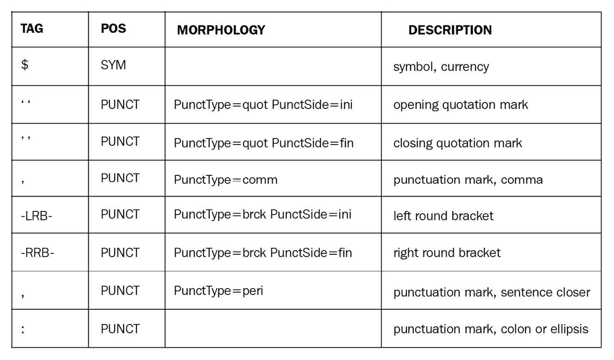

图 3.3 – spaCy 标点符号标签，一般和细粒度

让我们标记一些包含数字和符号的示例句子，如下所示：

```py
 doc = nlp("He earned $5.5 million in 2020 and paid %35 tax.")
 for token in doc:
     token.text, token.tag_, spacy.explain(token.tag_)
... 
('He', 'PRP', 'pronoun, personal')
('earned', 'VBD', 'verb, past tense')
('$', '$', 'symbol, currency')
('5.5', 'CD', 'cardinal number')
('million', 'CD', 'cardinal number')
('in', 'IN', 'conjunction, subordinating or preposition')
('2020', 'CD', 'cardinal number')
('and', 'CC', 'conjunction, coordinating')
('paid', 'VBD', 'verb, past tense')
('35', 'CD', 'cardinal number')
('percent', 'NN', 'noun, singular or mass')
('tax', 'NN', 'noun, singular or mass')
('.', '.', 'punctuation mark, sentence closer')
```

我们再次遍历了标记并打印了细粒度的标签。标记器能够区分符号、标点符号和数字。甚至单词“百万”也被识别为数字！

现在，关于符号标签怎么办？货币符号和数字提供了一种系统地提取货币描述的方法，在金融文本（如财务报告）中非常方便。我们将在*第四章*的*基于规则的匹配*中看到如何提取货币实体。

就这样——你已经到达了本节详尽内容的结尾！有很多东西需要分解和消化，但我们向你保证，你对工业 NLP 工作的投资是值得的。现在，我们将继续探讨另一个句法概念——依赖句法解析。

# 依赖句法解析简介

如果你已经熟悉 spaCy，你肯定遇到过 spaCy 依赖句法解析器。尽管许多开发者看到 spaCy 文档中的**依赖句法解析器**，但他们可能对此有所顾虑，或者不知道如何充分利用这一功能。在本部分，你将探索一种系统性地表示句子句法的方法。让我们从依赖句法实际上是什么开始。

## 什么是依赖句法解析？

在上一节中，我们专注于词性标注——单词的句法类别。尽管词性标注提供了关于相邻单词标签的信息，但它们并没有给出给定句子中非相邻单词之间的任何关系。

在本节中，我们将关注依赖句法解析——一种更结构化的探索句子句法的方法。正如其名所示，**依赖句法解析**与通过标记之间的依赖关系分析句子结构相关。**依赖句法解析器**标记句子标记之间的句法关系，并连接句法相关的标记对。**依赖**或**依赖关系**是两个标记之间的**有向链接**。

依赖句法解析的结果始终是一个**树**，如下截图所示：

![图 3.4 – 依赖树的示例（摘自维基百科）]

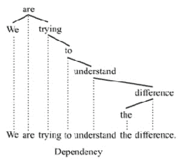

图 3.4 – 依赖树的示例（摘自维基百科）

如果你不太熟悉树形数据结构，你可以在这个优秀的计算机科学资源中了解更多信息：

https://www.cs.cmu.edu/~clo/www/CMU/DataStructures/Lessons/lesson4_1.htm

## 依赖关系

那么**依赖关系**有什么用呢？在 NLP 中，许多统计方法都围绕单词的向量表示展开，并将句子视为单词的序列。正如你在*图 3.4*中可以看到的，一个句子不仅仅是标记的序列——它有一个结构；句子中的每个单词都有一个明确的角色，例如动词、主语、宾语等等；因此，句子肯定是有结构的。这种结构在聊天机器人、问答系统和机器翻译中得到广泛的应用。

最有用的应用之一是确定句子中的宾语和主语。再次，让我们回到我们的旅行社应用程序。想象一下，一位客户正在抱怨服务。比较以下两个句子，“我把邮件转发给你”和“你把邮件转发给我”；如果我们消除了停用词“我”、“你”、“我”和“的”，剩下的就是：

```py
I forwarded you the email. -> forwarded email
You forwarded me the email. -> forwarded email
```

尽管句子的剩余部分相同，但句子具有非常不同的含义，需要不同的答案。在第一个句子中，句子主语是`I`（因此，答案很可能会以`你`开头）和第二个句子的主语是`you`（这将结束于一个`I`答案）。

显然，依存分析器帮助我们更深入地了解句子的句法和语义。让我们从依存关系开始探索。

## 句法关系

spaCy 为每个标记分配一个依存标签，就像其他语言特征（如词元或词性标签）一样。spaCy 使用*有向弧*显示依存关系。以下截图显示了名词与其修饰名词的形容词之间的依存关系示例：

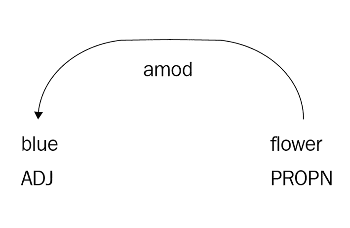

图 3.5 – 名词与其形容词之间的依存关系

依存标签描述了两个标记之间的句法关系类型如下：其中一个标记是`flower`，它是“head”，而`blue`是其依赖/子节点。

依存标签分配给子节点。标记对象有`dep (int)`和`dep_ (unicode)`属性，它们包含依存标签，如下面的代码片段所示：

```py
 doc = nlp("blue flower")
 for token in doc:
     token.text, token.dep_
…
('blue', 'amod')
('flower', 'ROOT')
```

在这个例子中，我们遍历了标记并打印了它们的文本和依存标签。让我们一步一步地回顾一下发生了什么，如下所示：

+   `blue`承认了`amod`标签。`amod`是形容词-名词关系的依存标签。有关`amod`关系的更多示例，请参阅*图 3.7*。

+   `flower`是`ROOT`。`ROOT`是依存树中的一个特殊标签；它分配给句子的主要动词。如果我们处理的是一个短语（而不是完整的句子），则`ROOT`标签分配给短语的根，即短语的中心名词。在`blue flower`短语中，中心名词`flower`是短语的根。

+   每个句子/短语都有一个根节点，它是分析树的根（记住，依存分析的结果是一个树）。

+   树节点可以有多个子节点，但每个节点只能有一个父节点（由于树的限制，以及不包含循环的树）。换句话说，每个标记恰好有一个头节点，但父节点可以有多个子节点。这就是为什么依存标签分配给依赖节点的原因。

这里是 spaCy 英语依存标签的完整列表：

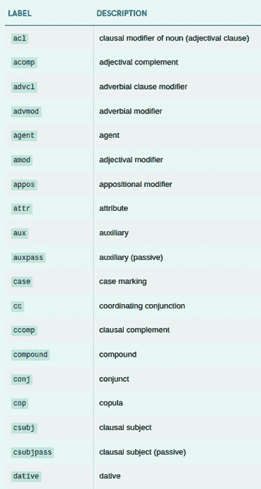

图 3.6 – spaCy 英语依存标签列表

这是一个很长的列表！不用担心——你不需要记住每个列表项。让我们首先看看最常见的和最有用的标签列表，然后我们将看到它们是如何将标记连接到一起的。首先是这个列表：

+   `amod`：形容词修饰语

+   `aux`：助动词

+   `compound`：复合

+   `dative`：宾格宾语

+   `det`：限定词

+   `dobj`：直接宾语

+   `nsubj`：名词主语

+   `nsubjpass`：名词主语，被动

+   `nummod`：数字修饰语

+   `poss`：所有格修饰语

+   `root`：根

让我们看看上述标签的使用示例以及它们表达的关系。`amod` 是形容词修饰语。从名称上可以理解，这种关系修饰名词（或代词）。在下面的屏幕截图中，我们看到**白色**修饰**羊**：

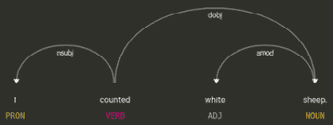

![图 3.7 – amod 关系`aux` 是你可能猜到的：它是助动词和主要动词之间的依赖关系；依赖项是助动词，头是主要动词。在下面的屏幕截图中，我们看到**has** 是主要动词 **gone** 的助动词：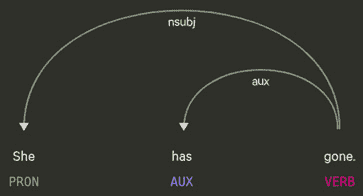

![图 3.8 – aux 关系`compound` 用于名词复合结构；第二个名词由第一个名词修饰。在下面的屏幕截图中，**电话簿**是一个名词复合结构，**电话**名词修饰**书籍**名词：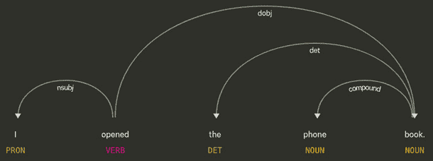

![图 3.9 – 电话和书籍的复合关系`det` 关系将限定词（依赖项）与其所修饰的名词（其头）联系起来。在下面的屏幕截图中，**the** 是这个句子中名词 **girl** 的限定词：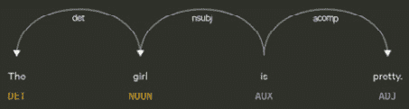

图 3.10 – det 关系

接下来，我们来看两种宾语关系，`dative` 和 `dobj`。`dobj` 关系存在于动词和它的直接宾语之间。一个句子可以有一个以上的宾语（如下面的例子所示）；直接宾语是动词所作用的对象，其他的是间接宾语。

直接宾语通常用 `dative` 关系标记，指向 `dative` 宾语，它从动词那里接受间接动作。在下面的屏幕截图中，间接宾语是 **me**，直接宾语是 **book**：

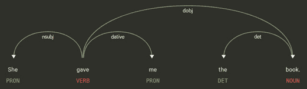

![图 3.11 – 句子的直接和间接宾语`nsubj` 和 `nsubjposs` 是两种与名词性句子主语相关的关联。句子的主语是执行动作的人。被动主语仍然是主语，但我们用 `nsubjposs` 来标记它。在下面的屏幕截图中，**Mary** 是第一句的名词主语：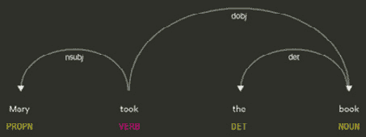

图 3.12 – nsubj 关系

在下面的屏幕截图中，**you** 是句子的被动名词主语：

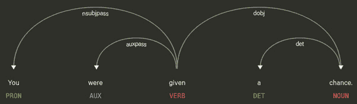

图 3.13 – nsubjpass 关系

我们现在已经涵盖了句子主语和宾语关系。现在，我们将发现两个修饰关系；一个是 `nummod` `poss` `nummod` 很容易找到；它在 **3** 和 **books** 之间：

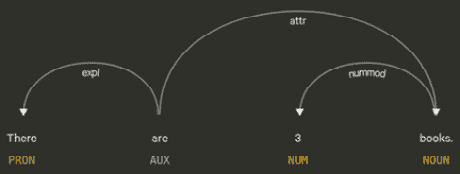

图 3.14 – nummod 关系

一个所有格修饰语发生在所有格代词和名词之间，或者所有格 `'s'` 和名词之间。在下面的屏幕截图所示的句子中，**my** 是名词 **book** 的所有格标记：

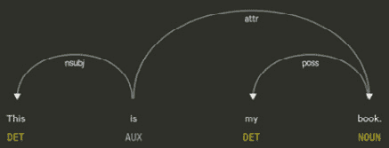

图 3.15 – "my" 和 "book" 之间的 poss 关系

最后，但同样重要的是，是 **root label**，它不是一个真实的关系，而是句子动词的标记。根词在句法树中没有真正的父节点；根是句子的主要动词。在前面的句子中，**took** 和 **given** 是相应的根。两个句子的主要动词都是助动词 **is** 和 **are**。请注意，根节点没有进入弧线——也就是说，没有父节点。

这些是我们 NLU 目的最有用的标签。你绝对不需要记住所有的标签，因为你在下一页的练习中会变得熟悉。此外，你可以在需要时通过 `spacy.explain()` 向 spaCy 询问任何标签。执行此操作的代码如下所示：

```py
 spacy.explain("nsubj")
'nominal subject'
 doc = nlp("I own a ginger cat.")
 token = doc[4]
 token.text, token.dep_, spacy.explain(token.dep_)
('cat', 'dobj', 'direct object')
```

深吸一口气，因为有很多东西要消化！让我们练习如何利用依存标签。

再次，`token.dep_` 包含了从属标记的依存标签。`token.head` 属性指向头/父标记。只有根标记没有父标记；spaCy 在这种情况下指向标记本身。让我们将 *图 3.7* 中的示例句子二分，如下所示：

```py
 doc = nlp("I counted white sheep.")
 for token in doc:
     token.text, token.pos_, token.dep_
... 
('I', 'PRP', 'nsubj')
('counted', 'VBD', 'ROOT')
('white', 'JJ', 'amod')
('sheep', 'NNS', 'dobj')
('.', '.', 'punct') 
```

我们遍历了标记并打印了细粒度的词性标注和依存标签。`counted` 是句子的主要动词，并被标记为 `ROOT`。现在，`I` 是句子的主语，而 `sheep` 是直接宾语。`white` 是一个形容词，修饰名词 `sheep`，因此其标签是 `amod`。我们再深入一层，这次打印标记的头，如下所示：

```py
 doc = nlp(“I counted white sheep.”) 
for token in doc:
      token.text, token.tag_, token.dep_, token.head
... 
('I', 'PRP', 'nsubj', counted)
('counted', 'VBD', 'ROOT', counted)
('white', 'JJ', 'amod', sheep)
('sheep', 'NNS', 'dobj', counted)
('.', '.', 'punct', counted)
```

可视化如下：

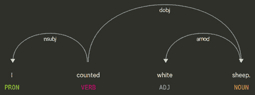

图 3.16 – 简单句的一个示例解析

当 `token.head` 属性也参与其中时，同时遵循代码和视觉是一个好主意。让我们一步一步地来理解视觉和代码是如何匹配的：

1.  我们从根开始阅读解析树。它是主要动词：`counted`。

1.  下一步，我们跟随其左侧的弧线指向代词 `I`，它是句子的名词主语，并被标记为 `nsubj`。

1.  现在，回到根节点，`counted`。这次，我们向右导航。跟随`dobj`弧线到达名词`sheep`。`sheep`由形容词`white`修饰，具有`amod`关系，因此这个句子的直接宾语是`white sheep`。

即使这样简单、平铺直叙的句子也有一个复杂的依存句法分析树，读起来很复杂，对吧？不要急——通过练习你会习惯的。让我们检查一个更长、更复杂的句子的依存句法树，如下所示：

```py
 doc = nlp("We are trying to understand the difference.")
 for token in doc:
     token.text, token.tag_, token.dep_, token.head
... 
('We', 'PRP', 'nsubj', trying)
('are', 'VBP', 'aux', trying)
('trying', 'VBG', 'ROOT', trying)
('to', 'TO', 'aux', understand)
('understand', 'VB', 'xcomp', trying)
('the', 'DT', 'det', difference)
('difference', 'NN', 'dobj', understand)
('.', '.', 'punct', trying)
```

现在，这次情况看起来有些不同，正如我们在*图 3.17*中将会看到的。我们定位到主要动词和根节点`trying`（它没有进入弧线）。`trying`这个词的左侧看起来可以管理，但右侧有一系列弧线。让我们从左侧开始。代词`we`被标记为`nsubj`，因此这是句子的名词主语。另一个左侧弧线，标记为`aux`，指向`trying`的从属动词`are`，它是主要动词`trying`的助动词。

到目前为止，一切顺利。现在，右侧发生了什么？`trying`通过`xcomp`关系连接到第二个动词`understand`。动词的`xcomp`（或开放补语）关系是一个没有自己主语的从句。在这里，`to understand the difference`从句没有主语，因此它是一个开放补语。我们跟随从第二个动词`understand`开始的`dobj`弧线，到达名词`difference`，它是`to understand the difference`从句的直接宾语，结果是：

![图 3.17 – 一个复杂的解析示例

![img/B16570_03_17.jpg]

图 3.17 – 一个复杂的解析示例

这是对这个示例句子的深入分析，它确实看起来并不那么复杂。接下来，我们处理一个包含拥有自己名词主语的从句的句子，如下所示：

```py
 doc = nlp("Queen Katherine, who was the mother of Mary Tudor, died at 1536.")
 for token in doc:
     token.text, token.tag_, token.dep_, token.head
... 
('Queen', 'NNP', 'compound', Katherine)
('Katherine', 'NNP', 'nsubj', died)
(',', ',', 'punct', Katherine)
('who', 'WP', 'nsubj', was)
('was', 'VBD', 'relcl', Katherine)
('the', 'DT', 'det', mother)
('mother', 'NN', 'attr', was)
('of', 'IN', 'prep', mother)
('Mary', 'NNP', 'compound', Tudor)
('Tudor', 'NNP', 'pobj', of)
(',', ',', 'punct', Katherine)
('died', 'VBD', 'ROOT', died)
('at', 'IN', 'prep', died)
('1536', 'CD', 'pobj', at)
```

为了使视觉效果足够大，我已经将可视化分成了两部分。首先，让我们找到根节点。根节点位于右侧。`died`是动词的主句和根节点（再次强调，它没有进入弧线）。右侧的其他部分没有复杂的内容。

另一方面，左侧有一些有趣的内容——实际上，一个关系从句。让我们将关系从句结构一分为二：

+   我们从专有名词`Katherine`开始，它与`died`通过`nsubj`关系连接，因此是句子的主语。

+   我们看到一个复合弧从`Katherine`指向专有名词`Queen`。在这里，`Queen`是一个头衔，所以它与`Katherine`的关系是复合的。右侧`Mary`和`Tudor`之间也存在相同的关系，姓氏和名字也通过复合关系联系在一起。

现在是时候将关系从句`who was the mother of Mary Tudor`一分为二了，如下所示：

+   首先，关系从句中提到的是`Katherine`，所以我们看到从`Katherine`到关系从句中的`was`的`relcl`（关系从句）弧线。

+   `who` 是从句的名词主语，通过 `nsubj` 关系与 `was` 相连。正如你在下面的截图中所见，依存句法树与之前例子句子中的不同，那个例子句子中的从句没有名词主语：

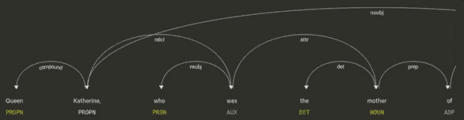

图 3.18 – 带有相对从句的依存句法树，左侧部分

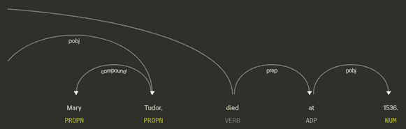

图 3.19 – 相同句子的右侧部分

如果你觉得自己无法记住所有关系，这是很正常的。不用担心——总是找到句子的根/主动词，然后跟随从根出发的弧线深入，就像我们之前做的那样。你总是可以查看 spaCy 文档([`spacy.io/api/annotation#dependency-parsing`](https://spacy.io/api/annotation#dependency-parsing))来了解关系类型意味着什么。直到你对这个概念和细节熟悉起来，请慢慢来。

这已经非常全面了！亲爱的读者——正如我们之前所说，请花些时间消化和实践例子句子。*displaCy* 在线演示是一个很好的工具，所以不要害羞，尝试你自己的例子句子并查看解析结果。你发现这一部分内容较多是很正常的。然而，这一部分是普通语言学以及*第四章*中信息提取和模式匹配练习的坚实基础，*基于规则的匹配*。在*第六章*中，*将一切整合：使用 spaCy 进行语义解析*的案例研究之后，你会更加得心应手。给自己一些时间，通过书中各个例子来消化依存句法分析。

依存句法分析之后是什么？毫无疑问，你一定经常在 NLU 世界中听到 NER（命名实体识别）这个词。让我们来探讨这个非常重要的 NLU 概念。

# 介绍 NER

我们以一个分词器开始了这一章，接下来我们将看到另一个非常实用的分词器——spaCy 的 NER 分词器。正如 NER 的名字所暗示的，我们感兴趣的是寻找命名实体。

什么是**命名实体**？命名实体是我们可以用一个专有名称或感兴趣的量来指代的现实世界中的对象。它可以是一个人、一个地方（城市、国家、地标、著名建筑）、一个组织、一家公司、一个产品、日期、时间、百分比、货币金额、一种药物或疾病名称。一些例子包括 Alicia Keys、巴黎、法国、勃兰登堡门、世界卫生组织、谷歌、保时捷卡宴等等。

命名实体总是指向一个**特定**的对象，而这个对象可以通过相应的命名实体来区分。例如，如果我们标记句子 *巴黎是法国的首都*，我们将 *巴黎* 和 *法国* 解析为命名实体，但不会标记单词 *首都*。原因是 *首都* 并不指向一个特定的对象；它是许多对象的通用名称。

NER 分类与 POS 分类略有不同。在这里，分类的数量可以高达我们想要的。最常见的分类是人物、地点和组织，几乎所有可用的 NER 标签器都支持这些分类。在下面的屏幕截图中，我们可以看到相应的标签：

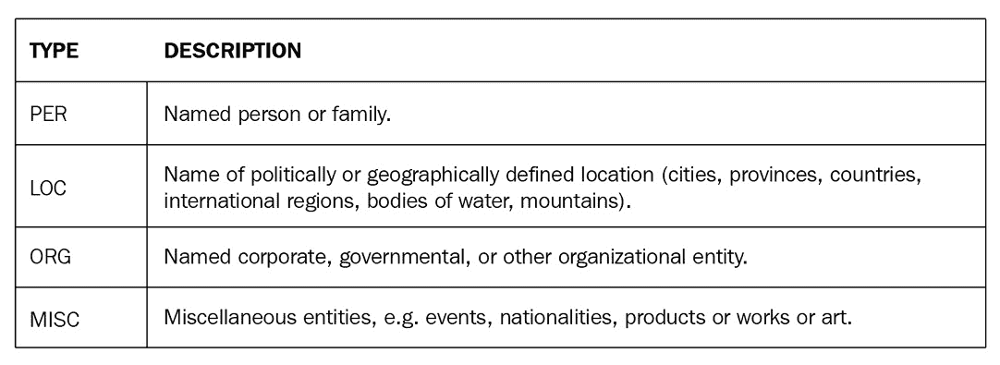

图 3.20 – 最常见的实体类型

spaCy 支持广泛的实体类型。您使用哪些类型取决于您的语料库。如果您处理财务文本，您最可能比 `WORK_OF_ART` 更频繁地使用 `MONEY` 和 `PERCENTAGE`。

下面是 spaCy 支持的实体类型列表：

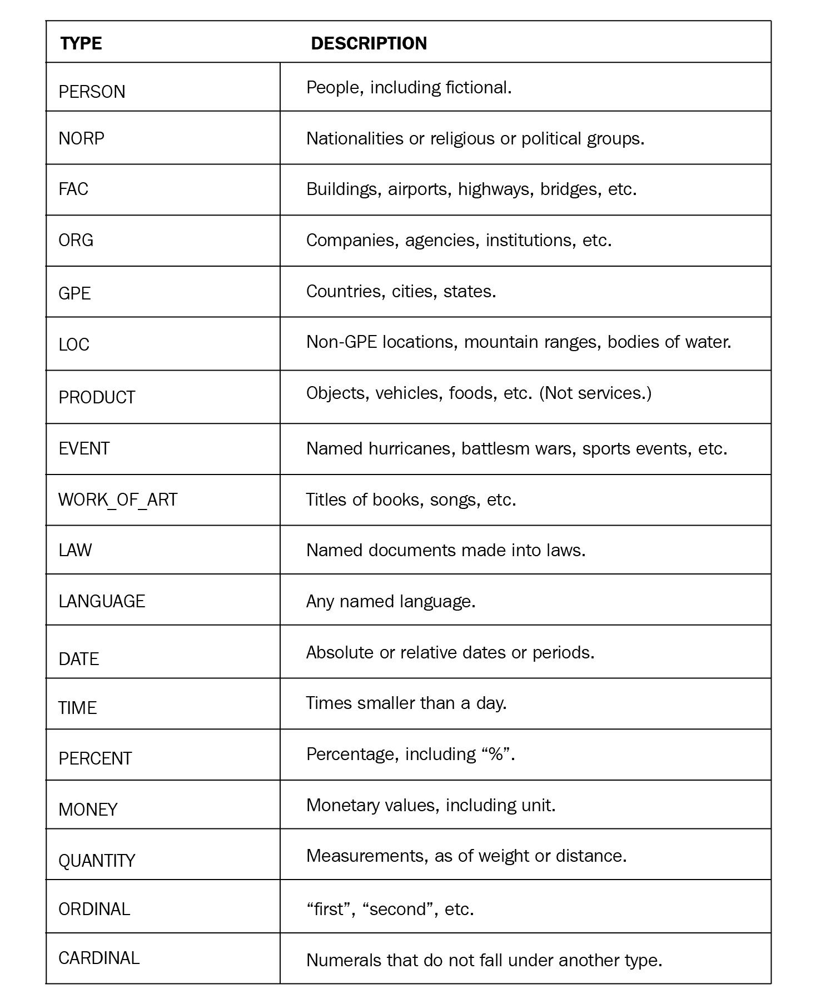

图 3.21 – spaCy 支持的实体类型完整列表

就像 POS 标签统计模型一样，NER 模型也是顺序模型。第一个现代 NER 标签模型是一个 **条件随机场**（**CRF**）。CRFs 是用于结构化预测问题（如标记和解析）的序列分类器。如果您想了解更多关于 CRF 实现细节的信息，可以阅读此资源：https://homepages.inf.ed.ac.uk/csutton/publications/crftutv2.pdf。当前最先进的 NER 标记是通过神经网络模型实现的，通常是 LSTM 或 LSTM+CRF 架构。

文档中的命名实体可以通过 `doc.ents` 属性访问。`doc.ents` 是一个 `Span` 对象的列表，如下面的代码片段所示：

```py
 doc = nlp("The president Donald Trump visited France.")
 doc.ents
(Donald Trump, France)
 type(doc.ents[1])
<class 'spacy.tokens.span.Span'>
```

spaCy 还会为每个标记分配实体类型。命名实体的类型可以通过 `token.ent_type (int)` 和 `token.ent_type_ (unicode)` 获取。如果标记不是命名实体，则 `token.ent_type_` 只是一个空字符串。

就像 POS 标签和依存标签一样，我们可以对标签字符串或 `token.ent_type_` 调用 `spacy.explain()`，如下所示：

```py
 spacy.explain("ORG")
'Companies, agencies, institutions, etc.
 doc = nlp("He worked for NASA.")
 token = doc[3]
 token.ent_type_, spacy.explain(token.ent_type_)
('ORG', 'Companies, agencies, institutions, etc.') 
```

让我们来看一些示例，看看 spaCy NER 标签器的实际应用，如下所示：

```py
 doc = nlp("Albert Einstein was born in Ulm on 1879\. He studied electronical engineering at ETH Zurich.")
 doc.ents
(Albert Einstein, Ulm, 1879, ETH Zurich)
 for token in doc:
     token.text, token.ent_type_, \
     spacy.explain(token.ent_type_)
... 
('Albert', 'PERSON', 'People, including fictional')
('Einstein', 'PERSON', 'People, including fictional')
('was', '', None)
('born', '', None)
('in', '', None)
('Ulm', 'GPE', 'Countries, cities, states')
('on', '', None)
('1879', 'DATE', 'Absolute or relative dates or periods')
('.', '', None)
('He', '', None)
('studied', '', None)
('electronical', '', None)
('engineering', '', None)
('at', '', None)
('ETH', 'ORG', 'Companies, agencies, institutions, etc.')
('Zurich', 'ORG', 'Companies, agencies, institutions, etc.')
('.', '', None)
```

我们逐个遍历标记并打印标记及其实体类型。如果标记未被标记为实体，则 `token.ent_type_` 只是一个空字符串，因此没有 `spacy.explain()` 的解释。对于属于 NE 的标记，返回适当的标记。在先前的句子中，`Albert Einstein`、`Ulm`、`1879` 和 `ETH Zurich` 分别被正确标记为 `PERSON`、`GPE`、`DATE` 和 `ORG`。

让我们看看一个更长且更复杂的句子，其中包含非英语实体，并查看 spaCy 如何标记它，如下所示：

```py
 doc = nlp("Jean-Michel Basquiat was an American artist of Haitian and Puerto Rican descent who gained fame with his graffiti and street art work")
 doc.ents
(Jean-Michel Basquiat, American, Haitian, Puerto Rican)
 for ent in doc.ents:
     ent, ent.label_, spacy.explain(ent.label_)
... 
(Jean-Michel Basquiat, 'PERSON', 'People, including fictional')
(American, 'NORP', 'Nationalities or religious or political groups')
(Haitian, 'NORP', 'Nationalities or religious or political groups')
(Puerto Rican, 'NORP', 'Nationalities or religious or political groups')
```

看起来不错！spaCy 标签器平滑地识别了一个带有 `-` 的人实体。总的来说，标签器在处理不同实体类型时表现相当好，正如我们在示例中看到的那样。

在标记具有不同句法特征的标记之后，我们有时希望将实体合并/拆分到更少/更多的标记中。在下一节中，我们将看到合并和拆分是如何进行的。在此之前，我们将看到 NER 标签的实际应用案例。

## 实际案例

NER 是 spaCy 中流行且经常使用的管道组件。NER 是理解文本主题的关键组件之一，因为命名实体通常属于一个**语义类别**。例如，*特朗普总统*在我们的脑海中唤起了*政治*主题，而*莱昂纳多·迪卡普里奥*则更多关于*电影*。如果你想深入了解解决文本意义和理解谁做了什么，你也需要命名实体。

这个现实世界的例子包括处理一篇*《纽约时报》*文章。让我们先运行以下代码来下载文章：

```py
from bs4 import BeautifulSoup
import requests
import spacy
def url_text(url_string):
    res = requests.get(url)
    html = res.text
    soup = BeautifulSoup(html, 'html5lib')
    for script in soup(["script", "style", 'aside']):
        script.extract()
    text = soup.get_text()
    return " ".join(text.split())
ny_art = url_text("https://www.nytimes.com/2021/01/12/opinion/trump-america-allies.html")
nlp = spacy.load("en_core_web_md")
doc = nlp(ny_art)
```

我们下载了文章，`BeautifulSoup`是一个流行的 Python 包，用于从 HTML 中提取文本和`nlp`对象，将文章主体传递给`nlp`对象，并创建了一个`Doc`对象。

让我们从文章的实体类型计数开始分析，如下所示：

```py
len(doc.ents)
136
```

对于包含许多实体的新闻文章来说，这是一个完全正常的数字。让我们进一步对实体类型进行分组，如下所示：

```py
from collections import Counter
labels = [ent.label_ for ent in doc.ents]
Counter(labels)
Counter({'GPE': 37, 'PERSON': 30, 'NORP': 24, 'ORG': 22, 'DATE': 13, 'CARDINAL': 3, 'FAC': 2, 'LOC': 2, 'EVENT': 1, 'TIME': 1, 'WORK_OF_ART': 1})
```

最频繁的实体类型是`GPE`，表示国家、城市或州。其次是`PERSON`，而第三频繁的实体标签是`NORP`，表示国籍/宗教政治团体。接下来是组织、日期和基数类型实体。

我们能否通过查看实体或理解文本主题来总结文本？为了回答这个问题，让我们首先统计实体中最频繁出现的标记，如下所示：

```py
items = [ent.text for ent in doc.ents]
Counter(items).most_common(10)
[('America', 12), ('American', 8), ('Biden', 8), ('China', 6), ('Trump', 5), ('Capitol', 4), ('the United States', 3), ('Washington', 3), ('Europeans', 3), ('Americans', 3)]
```

看起来像是一个语义组！显然，这篇文章是关于美国政治的，可能还涉及美国在政治上如何与世界其他国家互动。如果我们打印出文章中的所有实体，我们可以看到这里的猜测是正确的：

```py
print(doc.ents)
(The New York Times SectionsSEARCHSkip, indexLog inToday, storyOpinionSupported byContinue, LaughingstockLast week's, U.S., U.S., Ivan KrastevMr, Krastev, Jan., 2021  A, Rome, Donald Tramp, Thursday, Andrew Medichini, Associated PressDonald Trump, America, America, Russian, Chinese, Iranian, Jan. 6, Capitol, Ukraine, Georgia, American, American, the United States, Trump, American, Congress, Civil War, 19th-century, German, Otto von Bismarck, the United States of America, America, Capitol, Trump, last hours, American, American, Washington, Washington, Capitol, America, America, Russia, at least 10, Four years, Trump, Joe Biden, two, American, China, Biden, America, Trump, Recep Tayyip Erdogan, Turkey, Jair Bolsonaro, Brazil, Washington, Russia, China, Biden, Gianpaolo Baiocchi, H. Jacob Carlson, Social Housing Development Authority, Ezra Klein, Biden, Mark Bittman, Biden, Gail Collins, Joe Biden, Jake Sullivan, Biden, trans-Atlantic, China, Just a week ago, European, Sullivan, Europe, America, China, Biden, Europeans, China, German, Chinese, the European Union's, America, Christophe Ena, the European Council on Foreign Relations, the weeks, American, the day, Biden, Europeans, America, the next 10 years, China, the United States, Germans, Trump, Americans, Congress, America, Bill Clinton, Americans, Biden, the White House, the United States, Americans, Europeans, the past century, America, the days, Capitol, democratic, Europe, American, America, Ivan Krastev, the Center for Liberal Strategies, the Institute for Human Sciences, Vienna, Is It Tomorrow Yet?:, The New York Times Opinion, Facebook, Twitter (@NYTopinion, Instagram, AdvertisementContinue, IndexSite Information Navigation© 2021, The New York Times, GTM, tfAzqo1rYDLgYhmTnSjPqw&gtm_preview)
```

我们通过将文本粘贴到**displaCy 命名实体可视化器**（[`explosion.ai/demos/displacy-ent/`](https://explosion.ai/demos/displacy-ent/)）来制作整篇文章的可视化。以下截图是从捕获了部分可视化的演示页面中获取的：

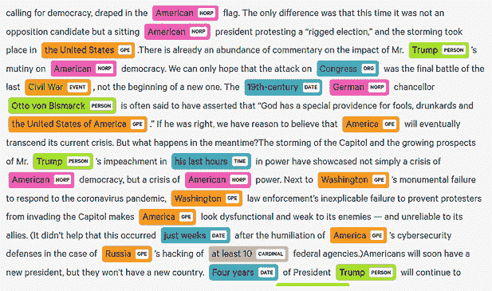

图 3.22 – 使用 displaCy 可视化的《纽约时报》文章的实体

spaCy 的 NER 为我们理解文本以及向我们自己、同事和利益相关者展示美观的视觉提供了强大的功能。

# 合并和拆分标记

我们在前一节中提取了命名实体，但如果我们想合并或拆分多词命名实体怎么办？还有，如果分词器在某些异国情调的标记上表现不佳，你想手动拆分它们怎么办？在本小节中，我们将介绍一种针对我们的多词表达式、多词命名实体和错别字的非常实用的补救措施。

`doc.retokenize`是合并和拆分跨度段的正确工具。让我们通过合并一个多词命名实体来查看重分词的示例，如下所示：

```py
 doc = nlp("She lived in New Hampshire.")
 doc.ents
(New Hampshire,)
 [(token.text, token.i) for token in doc]
[('She', 0), ('lived', 1), ('in', 2), ('New', 3), ('Hampshire', 4), ('.', 5)]
 len(doc)
6
 with doc.retokenize() as retokenizer:
     retokenizer.merge(doc[3:5], \
     attrs={"LEMMA": "new hampshire"})
... 
 [(token.text, token.i) for token in doc]
[('She', 0), ('lived', 1), ('in', 2), ('New Hampshire', 3), ('.', 4)]
 len(doc)
5
 doc.ents
(New Hampshire,)
 [(token.lemma_) for token in doc]
['-PRON-', 'live', 'in', 'new hampshire', '.']
```

这就是我们前面代码中所做的：

1.  首先，我们从样本句子创建了一个`doc`对象。

1.  然后，我们使用`doc.ents`打印了其实体，结果是预期的`New Hampshire`。

1.  在下一行，对于每个标记，我们打印了`token.text`，包括句子中的标记索引（`token.i`）。

1.  此外，我们通过在`doc`对象上调用`len`来检查`doc`对象的长度，结果是`6`（`.`也是一个标记）。

现在，我们想要合并位置`3`到`5`（`3`包含在内；`5`不包含），所以我们做了以下操作：

1.  首先，我们调用了`retokenizer`方法的`merge(indices, attrs)`。`attrs`是我们想要分配给新标记的标记属性字典，例如`lemma`、`pos`、`tag`、`ent_type`等。

1.  在前面的例子中，我们设置了新标记的词元；否则，词元只会是`New`（我们想要合并的跨度的起始标记的词元）。

1.  然后，我们打印了标记以查看操作是否按我们的意愿进行。当我们打印新标记时，我们看到新的`doc[3]`是`New Hampshire`标记。

1.  此外，`doc`对象现在长度为`5`，所以我们减少了 doc 一个标记。`doc.ents`保持不变，新标记的词元是`new hampshire`，因为我们用`attrs`设置了它。

看起来不错，那么如何将多词标记分割成几个标记呢？在这种情况下，要么是你想要修复的文本中存在拼写错误，要么是自定义标记化对于你的特定句子来说不满意。

分割一个跨度比合并跨度要复杂一些，原因如下：

+   我们正在改变依赖树。

+   我们需要为新标记分配新的词性标签、依赖标签和必要的标记属性。

+   基本上，我们需要考虑如何为新创建的标记分配语言特征。

让我们通过以下修复拼写错误的例子来看看如何处理新标记：

```py
 doc = nlp("She lived in NewHampshire")
 len(doc)
5
 [(token.text, token.lemma_, token.i) for token in doc]
[('She', '-PRON-', 0), ('lived', 'live', 1), ('in', 'in', 2), ('NewHampshire', 'NewHampshire', 3), ('.', '.', 4)]
 for token in doc:
     token.text, token.pos_, token.tag_, token.dep_
... 
('She', 'PRON', 'PRP', 'nsubj')
('lived', 'VERB', 'VBD', 'ROOT')
('in', 'ADP', 'IN', 'prep')
('NewHampshire', 'PROPN', 'NNP', 'pobj')
('.', 'PUNCT', '.', 'punct')
```

在分割操作之前，依赖树看起来是这样的：

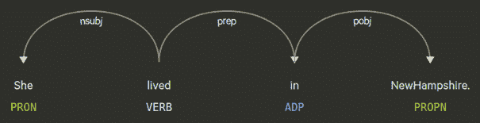

图 3.23 – 样本句子在重新标记前的依赖树

现在，我们将`doc[3]`、`NewHampshire`分割成两个标记：`New`和`Hampshire`。我们将通过`attrs`字典为新标记分配细粒度的词性标签和依赖标签。我们还将通过`heads`参数传递新标记的父标记来重新排列依赖树。在排列头部时，有两个事情需要考虑，如下所述：

+   首先，如果你在以下代码段中给出一个相对位置（例如`(doc[3], 1)`），这意味着`doc[3]`的头部将是+1 位置的标记，即新设置中的`doc[4]`（请参见以下可视化）。

+   其次，如果你给出一个绝对位置，这意味着在*原始* `Doc`对象中的位置。在以下代码片段中，`heads`列表中的第二项意味着`Hampshire`标记的头部是原始 Doc 中的第二个标记，即`in`标记（请参阅*图 3.23*）。

分割后，我们打印了新标记的列表和语言属性。我们还检查了`doc`对象的新长度，现在为`6`。你可以在这里看到结果：

```py
 with doc.retokenize() as retokenizer:
     heads = [(doc[3], 1), doc[2]]
     attrs = {"TAG":["NNP", "NNP"], 
              "DEP": ["compound", "pobj"]}
     retokenizer.split(doc[3], ["New", "Hampshire"], 
                       heads=heads, attrs=attrs)
... 
 [(token.text, token.lemma_, token.i) for token in doc]
[('She', '-PRON-', 0), ('lived', 'live', 1), ('in', 'in', 2), ('New', 'New', 3), ('Hampshire', 'Hampshire', 4), ('.', '.', 5)]
 for token in doc:
     token.text, token.pos_, token.tag_, token.dep_
... 
('She', 'PRON', 'PRP', 'nsubj')
('lived', 'VERB', 'VBD', 'ROOT')
('in', 'ADP', 'IN', 'prep')
('New', 'PROPN', 'NNP', 'pobj')
('Hampshire', 'PROPN', 'NNP', 'compound')
('.', 'PUNCT', '.', 'punct')
 len(doc)
6
```

这是分割操作后依赖树的模样（请与*图 3.22*进行比较）：

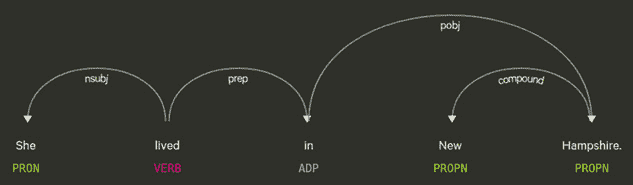

图 3.24 – 分割操作后的依赖树

你可以应用合并和分割到任何跨度，而不仅仅是命名实体跨度。这里最重要的部分是正确排列新的依赖树和语言属性。

# 摘要

就这样——你到达了本章的结尾！这确实是一次详尽且漫长的旅程，但我们已经完全揭示了 spaCy 的真实语言能力。本章为您提供了 spaCy 的语言特征及其使用方法的详细信息。

你学习了关于词性标注和应用的知识，还有许多示例。你还了解了一个重要但不太为人所知且使用得很好的 spaCy 特性——依赖标签。然后，我们发现了一个著名的 NLU 工具和概念，NER。我们看到了如何通过示例进行命名实体提取。我们用一个非常实用的工具结束了本章，这个工具可以合并和分割我们在前几节计算出的跨度。

那么，接下来是什么？在下一章中，我们又将发现一个你将在日常 NLP 应用程序代码中每天都会使用的 spaCy 特性——spaCy 的`Matcher`类。我们不想在这个美好的主题上给出剧透，所以让我们一起继续我们的旅程吧！
