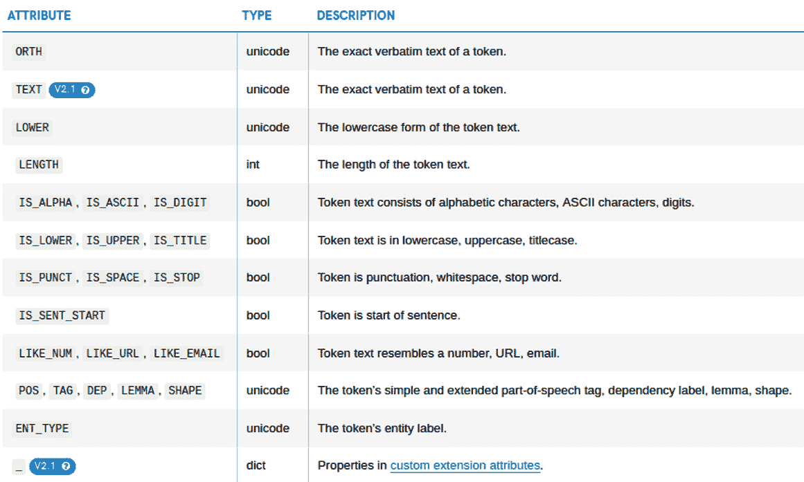

# 第四章：基于规则的匹配

**基于规则的实体提取**对于任何 NLP 管道都是必不可少的。某些类型的实体，如时间、日期和电话号码，具有独特的格式，可以通过一组规则识别，而无需训练统计模型。

在本章中，你将学习如何通过匹配模式和短语快速从文本中提取信息。你将使用 `Matcher` 对象。你将继续使用基于规则的匹配来细化统计模型，以提高准确性。

到本章结束时，你将了解信息提取的关键部分。你将能够提取特定格式的实体，以及特定领域的实体。

在本章中，我们将介绍以下主要主题：

+   基于标记的匹配

+   短语匹配器

+   实体规则器

+   结合 spaCy 模型和匹配器

# 基于标记的匹配

到目前为止，我们已经探讨了需要统计模型和其用法的复杂语言概念，以及使用 spaCy 的应用。某些 NLU 任务可以在没有统计模型帮助的情况下以巧妙的方式解决。其中一种方式是 **正则表达式**，我们用它来将预定义的模式与我们的文本进行匹配。

正则表达式（正则表达式）是一系列字符，它指定了一个搜索模式。正则表达式描述了一组遵循指定模式的字符串。正则表达式可以包括字母、数字以及具有特殊意义的字符，例如 *?*, *.*, 和 ***。Python 的内置库提供了强大的支持来定义和匹配正则表达式。还有一个名为 regex 的 Python 3 库，其目标是未来取代 **re**。

正在积极使用 Python 开发 NLP 应用的读者肯定遇到过正则表达式代码，甚至更好地，他们自己编写过正则表达式。

那么，正则表达式看起来是什么样子的呢？以下正则表达式匹配以下字符串：

+   巴拉克·奥巴马

+   巴拉克·奥巴马

+   巴拉克·侯赛因·奥巴马

```py
reg = r"Barack\s(Hussein\s)?Obama"  
```

这个模式可以读作：字符串 `Barack` 可以可选地后跟字符串 `Hussein`（正则表达式中的 `?` 字符表示可选的，即 `0` 或 `1` 次出现）并且应该后跟字符串 `Obama`。单词间的空格可以是一个空格字符、一个制表符或任何其他空白字符（`\s` 匹配所有类型的空白字符，包括换行符）。

即使对于如此简短且简单的模式，它也不太易读，对吧？这就是正则表达式的缺点，它是以下：

+   难以阅读

+   难以调试

+   容易出错，尤其是在空格、标点符号和数字字符方面

由于这些原因，许多软件工程师不喜欢在生产代码中使用正则表达式。spaCy 提供了一个非常干净、可读、生产级和可维护的替代方案：`Matcher`类。`Matcher`类可以将我们预定义的规则与`Doc`和`Span`对象中的标记序列进行匹配；此外，规则可以引用标记或其语言属性（关于这个主题，在本节稍后部分会详细介绍）。

让我们从如何调用`Matcher`类的基本例子开始：

```py
 import spacy
 from spacy.matcher import Matcher
 nlp = spacy.load("en")
 doc = nlp("Good morning, I want to reserve a ticket.")
 matcher = Matcher(nlp.vocab)
 pattern = [{"LOWER": "good"}, {"LOWER": "morning"}, 
            {"IS_PUNCT": True}]
 matcher.add("morningGreeting", None, pattern)
 matches = matcher(doc)
 for match_id, start, end in matches:
     m_span = doc[start:end]  
     print(start, end, m_span.text)
...
0 3 Good morning,
```

它看起来很复杂，但不要感到害怕，我们会逐行讲解：

+   在第一行，我们导入了`spacy`；这应该是熟悉的。

+   在第二行，我们导入了`Matcher`类，以便在代码的其余部分中使用它。

+   在接下来的几行中，我们像往常一样创建了`nlp`对象，并使用我们的示例句子创建了`doc`对象。

+   现在，请注意：一个`matcher`对象需要用`Vocabulary`对象进行初始化，因此在第 5 行，我们用语言模型词汇表初始化了我们的`matcher`对象（这是通常的做法）。

+   接下来要做的是定义我们想要匹配的模式。在这里，我们将`pattern`定义为列表，其中每个括号内的列表项代表一个标记对象。

你可以按照以下方式阅读前面代码片段中的模式列表：

1.  一个文本降低后的内容为`good`的标记

1.  一个文本降低后的内容为`morning`的标记

1.  一个标点符号标记（即，`IS_PUNCT`特征为`True`）

然后，我们需要将这个模式引入到`matcher`中；这正是`matcher.add()`行所做的事情。在第 7 行，我们将我们的模式引入到`matcher`对象中，并将其命名为`morningGreeting`。最后，我们可以在第 8 行通过调用`matcher`在`doc`上执行匹配操作。之后，我们检查得到的结果。一个匹配结果是形式为`(match id, start position, end position)`的三元组列表。在最后一行，我们遍历结果列表并打印匹配结果的起始位置、结束位置和文本。

正如你可能已经注意到的，`Good`和`morning`之间的空白根本无关紧要。实际上，我们可以在它们之间放两个空格，写下`Good morning`，结果将是相同的。为什么？因为`Matcher`匹配标记和标记属性。

一个模式始终指的是一个连续的标记对象序列，并且每个花括号中的项对应一个标记对象。让我们回到前面代码片段中的模式：

```py
pattern = [{"LOWER": "good"}, {"LOWER": "morning"}, 
           {"IS_PUNCT": True}]
```

我们可以看到，结果始终是三个标记的匹配。

我们能否添加多个模式？答案是肯定的。让我们通过一个例子来看一下，同时也会看到一个`match_id`的例子如下：

```py
 import spacy
 from spacy.matcher import Matcher
 nlp = spacy.load("en")
 doc = nlp("Good morning, I want to reserve a ticket. I will then say good evening!")
 matcher = Matcher(nlp.vocab)
 pattern1 = [{"LOWER": "good"}, {"LOWER": "morning"}, 
             {"IS_PUNCT": True}]
 matcher.add("morningGreeting",  [pattern1])
 pattern2 = [{"LOWER": "good"}, {"LOWER": "evening"}, 
             {"IS_PUNCT": True}]
 matcher.add("eveningGreeting",  [pattern2])
 matches = matcher(doc)
 for match_id, start, end in matches:
     pattern_name = nlp.vocab_strings[match_id]
     m_span = doc[start:end]  
     print(pattern_name, start, end, m_span.text)
...
morningGreeting 0 3 Good morning,
eveningGreeting 15 18 good evening!
```

这次我们做了一些不同的处理：

+   在第 8 行，我们定义了第二个模式，同样匹配三个标记，但这次是`evening`而不是`morning`。

+   在下一行，我们将它添加到了`matcher`中。此时，`matcher`包含了 2 个模式：`morningGreeting`和`eveningGreeting`。

+   再次，我们在我们的句子上调用 `matcher` 并检查结果。这次结果列表有两个项目，`Good morning` 和 `good evening!`，对应于两个不同的模式，`morningGreeting` 和 `eveningGreeting`。

在前面的代码示例中，`pattern1` 和 `pattern2` 只有一个标记不同：`evening/morning`。我们是否可以说 `evening` 或 `morning`？我们也可以这样做。以下是 Matcher 识别的属性：



图 4.1 – Matcher 的标记属性

让我们逐个通过一些示例来回顾这些属性。在前面的例子中，我们使用了 `LOWER`；这意味着标记文本的小写形式。`ORTH` 和 `TEXT` 与 `LOWER` 类似：它们意味着标记文本的精确匹配，包括大小写。以下是一个示例：

```py
 pattern = [{"TEXT": "Bill"}]
```

前面的代码将匹配 `BIll`，但不会匹配 `bill`。`LENGTH` 用于指定标记长度。以下代码查找所有长度为 `1` 的标记：

```py
 doc = nlp("I bought a pineapple.")
 matcher = Matcher(nlp.vocabulary)
 pattern = [{"LENGTH": 1}]
 matcher.add("onlyShort",  [pattern])
 matches = matcher(doc)
 for mid, start, end in matches:
     print(start, end, doc[start:end])
...
0 1 I
2 3 a
```

下一个标记属性块是 `IS_ALPHA`, `IS_ASCII`, 和 `IS_DIGIT`。这些特性对于查找数字标记和 *普通* 单词（不包括任何有趣的字符）很有用。以下模式匹配两个标记的序列，一个数字后面跟一个普通单词：

```py
 doc1 = nlp("I met him at 2 o'clock.")
 doc2 = nlp("He brought me 2 apples.")
 pattern = [{"IS_DIGIT": True},{"IS_ALPHA": True}] 
 matcher.add("numberAndPlainWord",  [pattern])
 matcher(doc1)
[]
 matches = matcher(doc2)
 len(matches)
1
 mid, start, end = matches[0]
 print(start, end, doc2[start:end])
3, 5, 2 apples
```

在前面的代码段中，`2 o'clock` 没有匹配到模式，因为 `o'clock` 包含一个撇号，这不是一个字母字符（字母字符是数字、字母和下划线字符）。`2 apples` 匹配，因为标记 `apples` 由字母组成。

`IS_LOWER`, `IS_UPPER`, 和 `IS_TITLE` 是用于识别标记大小写的有用属性。如果标记全部为大写字母，则 `IS_UPPER` 为 `True`；如果标记以大写字母开头，则 `IS_TITLE` 为 `True`。如果标记全部为小写字母，则 `IS_LOWER` 为 `True`。想象一下，我们想要在文本中找到强调的单词；一种方法就是寻找全部为大写字母的标记。大写标记在情感分析模型中通常具有显著的重要性。

```py
 doc = nlp("Take me out of your SPAM list. We never asked you to contact me. If you write again we'll SUE!!!!")
 pattern = [{"IS_UPPER": True}]
 matcher.add("capitals",  [pattern])
 matches = matcher(doc)
 for mid, start, end in matches:
     print(start, end, doc[start:end])
...
5, 6, SPAM
22, 23, SUE
```

`IS_PUNCT`, `IS_SPACE`, 和 `IS_STOP` 通常用于包含一些辅助标记的模式中，分别对应于标点符号、空格，而 `IS_SENT_START` 是另一个有用的属性；它匹配句子开头的标记。以下是一个以 *can* 开头且第二个单词首字母大写的句子模式：

```py
 doc1 = nlp("Can you swim?")
 doc2 = nlp("Can Sally swim?")
 pattern = [{"IS_SENT_START": True, "LOWER": "can"},
            {"IS_TITLE": True}]
 matcher.add("canThenCapitalized",  [pattern])
 matcher(doc)
[]
 matches = matcher(doc2)
 len(matches)
1
 mid, start, end = matches[0]
 print(start, end, doc2[start:end])
0, 2, Can Sally
```

在这里，我们做了不同的事情：我们将两个属性放入一个花括号中。在这个例子中，`pattern` 中的第一个项目表示一个标记是句子的第一个标记，并且其小写文本为 *can*。我们可以添加任意多的属性。例如，`{"IS_SENT_START": False, "IS_TITLE": True, "LOWER": "bill"}` 是一个完全有效的属性字典，它描述了一个首字母大写、不是句子第一个标记且文本为 `bill` 的标记。因此，它是那些不作为句子第一个单词出现的 `Bill` 实例的集合。

`LIKE_NUM`、`LIKE_URL` 和 `LIKE_EMAIL` 是与标记形状相关的属性；记住，我们在 *第三章**，语言特征* 中看到了它们。这些属性匹配看起来像数字、URL 和电子邮件的标记。

虽然前面的代码看起来简短且简单，但在 NLU 应用中，形状属性可以成为救命稻草。大多数时候，你需要的只是形状和语言属性的巧妙组合。

在看到形状属性之后，让我们看看 `POS`、`TAG`、`DEP`、`LEMMA` 和 `SHAPE` 语言属性。你在上一章中看到了这些标记属性；现在我们将使用它们进行标记匹配。以下代码片段查找以助动词开头的句子：

```py
 doc = nlp("Will you go there?')
 pattern = [{"IS_SENT_START": True, "TAG": "MD"}]
 matcher.add([pattern])
 matches = matcher(doc)
 len(matches)
1
 mid, start, end = matches[0]
 print(start, end, doc[start:end])
0, 1, Will
 doc2 = nlp("I might go there.")
 matcher(doc2)
[]
```

你可能还记得从 *第三章**，语言特征* 中，`MD` 是情态动词和助动词的标签。前面的代码片段是查找是/否疑问句的标准方法。在这种情况下，我们通常寻找以情态动词或助动词开头的句子。

小贴士

不要害怕与 `TEXT`/`LEMMA` 和 `POS`/`TAG` 一起工作。例如，当 `match` 是动词时，它与 `to go together` 是一致的，或者当它是名词时，它可以是一个 *fire starter tool*。在这种情况下，我们按照以下方式区分：

`{"LEMMA": "match", "POS": "VERB"}` 以及

`{"LEMMA": "match", "POS": "NOUN".`

类似地，你可以将其他语言特征与标记形状属性结合起来，以确保你只提取你想要的模式。

在接下来的章节中，我们将看到更多将语言特征与 `Matcher` 类结合的示例。现在，我们将探索更多匹配器功能。

## 扩展语法支持

匹配器允许在花括号内使用一些运算符，从而使模式更加丰富。这些运算符用于扩展比较，类似于 Python 的 `in`、`not in` 和比较运算符。以下是运算符列表：


图 4.2 – 丰富的比较运算符列表

在我们的第一个例子中，我们使用两个不同的模式匹配了 `good evening` 和 `good morning`。现在，我们可以通过使用 `IN` 来匹配 `good morning`/`evening`，使用一个模式如下：

```py
 doc = nlp("Good morning, I'm here. I'll say good evening!!")
 pattern = [{"LOWER": "good"},
            {"LOWER": {"IN": ["morning", "evening"]}},
            {"IS_PUNCT": True}]
 matcher.add("greetings",  [pattern])
 matches = matcher(doc)
 for mid, start, end in matches:
     print(start, end, doc[start:end])
...
0, 3, Good morning,
10, 13, good evening!
```

比较运算符通常与 `LENGTH` 属性一起使用。以下是一个查找长标记的示例：

```py
 doc = nlp("I suffered from Trichotillomania when I was in college. The doctor prescribed me Psychosomatic medicine.")
 pattern = [{"LENGTH": {">=" : 10}}]
 matcher.add("longWords",  [pattern])
 matches = matcher(doc)
 for mid, start, end in matches:
     print(start, end, doc[start:end])
...
3, 4, Trichotillomania
14, 15, Psychosomatic
```

这些词处理起来很有趣！现在，我们将继续探讨匹配器模式的另一个非常实用的功能，即类似正则表达式的运算符。

## 类似正则表达式的运算符

在本章的开头，我们指出 spaCy 的 `Matcher` 类提供了对正则表达式操作的更干净、更易读的等效方法，确实更加干净和易读。最常见的正则表达式操作是可选匹配（`?`）、至少匹配一次（`+`）和匹配 0 或多次（`*`）。spaCy 的 Matcher 也通过以下语法提供这些运算符：


图 4.3 – OP 键描述

本章的第一个正则表达式示例是匹配巴拉克·奥巴马的名字，中间名是可选的。正则表达式如下：

```py
R"Barack\s(Hussein\s)?Obama
```

`?` 操作符在 `Hussein` 之后意味着括号中的模式是可选的，因此这个正则表达式匹配了 `Barack Obama` 和 `Barack Hussein Obama`。我们在匹配器模式中使用 `?` 操作符如下：

```py
 doc1 = nlp("Barack Obama visited France.")
 doc2 = nlp("Barack Hussein Obama visited France.")
 pattern = [{"LOWER": "barack"},
            {"LOWER": "hussein", "OP": "?"},
            {"LOWER": "obama"}]
 matcher.add("obamaNames",  [pattern])
 matcher(doc1)
[(1881848298847208418, 0, 2)]
 matcher(doc2)
[(1881848298847208418, 0, 3)]
```

在这里，通过在第二个列表项中使用 `"OP": "?"`，我们使这个标记可选。`matcher` 选择了第一个文档对象中的 `Barack Obama` 和第二个文档对象中的 `Barack Hussein Obama`。

我们之前指出，`+` 和 `*` 操作符与它们的正则表达式对应物具有相同的意思。`+` 表示标记应该至少出现一次，而 `*` 表示标记可以出现 0 次或多次。让我们看一些例子：

```py
 doc1 = nlp("Hello hello hello, how are you?")
 doc2 = nlp("Hello, how are you?")
 doc3 = nlp("How are you?")
 pattern = [{"LOWER": {"IN": ["hello", "hi", "hallo"]},
             “OP”:”*”, {"IS_PUNCT": True}]
 matcher.add("greetings",  [pattern])
 for mid, start, end in matcher(doc1):
     print(start, end, doc1[start:end])
... 
2, 4, hello,
1, 4, hello hello,
0, 4, Hello hello hello,
 for mid, start, end in matcher(doc2):
     print(start, end, doc2[start:end])
... 
0 2 Hello, 
matcher(doc3)
...
[]
```

这是发生了什么：

+   在模式中，第一个标记表示 *hello、hi、hallo 应该出现 1 次或多次*，第二个标记是标点符号。

+   第三个 `doc` 对象完全不匹配；没有问候词。

+   第二个 `doc` 对象匹配 `hello,`。

当我们来看第一个 `doc` 对象匹配的结果时，我们看到不仅有 1 个，而是有 3 个不同的匹配。这是完全正常的，因为确实有三个序列与模式匹配。如果你仔细查看匹配结果，所有这些都与我们创建的模式匹配，因为 `hello`、`hello hello` 和 `hello hello hello` 都与 `(hello)+` 模式匹配。

让我们用 `*` 做相同的模式，看看这次会发生什么：

```py
doc1 = nlp("Hello hello hello, how are you?")
doc2 = nlp("Hello, how are you?")doc3 = nlp("How are you?")
pattern = [{"LOWER": {"IN": ["hello", "hi", "hallo"]},
            "OP": "+"}, {"IS_PUNCT": True}]
matcher.add("greetings",  [pattern])
for mid, start, end in matcher(doc1):
     print(start, end, doc1[start:end])
...
(0, 4, Hello hello hello,)
(1, 4, hello hello,)
(2, 4, hello,)
(3, 4, ,)
(7, 8, ?)
for mid, start, end in matcher(doc2):
     start, end, doc2[start:end]
... 
(0, 2, hello,)
(1, 2, ,)
(5, 6, ?)
for mid, start, end in matcher(doc3):
     start, end, doc3[start:end]
... 
(3, 4, ?)
```

在第一个 `doc` 对象的匹配中，有两个额外的项：`""` 和 `?`。`"*"` 操作符匹配 `0` 或更多，所以我们的 `(hello)*punct_character` 模式抓取了 `""` 和 `?`。同样适用于第二个和第三个文档：单独的标点符号而没有任何问候词被选中。这可能在你的 NLP 应用程序中不是你想要的。

上述例子是一个很好的例子，我们在创建我们的模式时应该小心；有时，我们得到不想要的匹配。因此，我们通常考虑使用 `IS_SENT_START` 并注意 `"*"` 操作符。

spaCy 匹配器类还接受一个非常特殊的模式，即通配符标记模式。通配符标记将匹配任何标记。我们通常用它来选择独立于其文本或属性或我们忽略的单词。让我们看一个例子：

```py
doc = nlp("My name is Alice and his name was Elliot.")
pattern = [{"LOWER": "name"},{"LEMMA": "be"},{}]
matcher.add("pickName", [pattern])
for mid, start, end in matcher(doc):
     print(start, end, doc[start:end])
... 
1 4 name is Alice
6 9 name was Elliot
```

在这里，我们想要捕获句子中的名字。我们通过解析形式为 *name is/was/be firstname* 的标记序列来实现。第一个标记模式，`LOWER:` `"name"`，匹配文本小写为 `name` 的标记。第二个标记模式，`LEMMA: "be"`，匹配 `is`、`was` 和 `be` 标记。第三个标记是通配符标记 `{}`，它表示 *任何* 标记。我们使用这个模式拾取任何在 *name is/was/be* 之后出现的标记。

当我们想要忽略一个标记时，我们也会使用通配符标记。让我们一起做一个例子：

```py
doc1 = nlp("I forwarded his email to you.")
doc2 = nlp("I forwarded an email to you.")
doc3 = nlp("I forwarded the email to you.")
pattern = [{"LEMMA": "forward"}, {}, {"LOWER": "email"}]
matcher.add("forwardMail",  [pattern])
for mid, start, end in matcher(doc1):
     print(start, end, doc1[start:end])
... 
1 4 forwarded his email
for mid, start, end in matcher(doc2):
     print(start, end, doc2[start:end])
... 
1 4 forwarded an email
for mid, start, end in matcher(doc3):
.    print(start, end, doc3[start:end])
... 
1 4 forwarded the email
```

这与前面的例子正好相反。在这里，我们想要提取 *forward email* 序列，并且我们允许一个标记在 `forward` 和 `email` 之间。在这里，语义上重要的部分是转发电子邮件的动作；它是谁的电子邮件并不那么重要。

到目前为止，我们已经在本章中多次提到了正则表达式，因此现在是时候看看 spaCy 的 Matcher 类如何使用正则表达式语法了。

## 正则表达式支持

当我们匹配单个标记时，通常我们想要允许一些变化，例如常见的拼写错误、UK/US 英语字符差异等等。正则表达式非常适合这项任务，而 spaCy Matcher 提供了对标记级正则表达式匹配的全面支持。让我们探索我们如何使用正则表达式为我们自己的应用服务：

```py
doc1 = nlp("I travelled by bus.")
doc2 = nlp("She traveled by bike.")
pattern = [{"POS": "PRON"}, 
           {"TEXT": {"REGEX": "[Tt]ravell?ed"}}]
for mid, start, end in matcher(doc1):
     print(start, end, doc1[start:end])
... 
0 2 I traveled
for mid, start, end in matcher(doc2):
     print(start, end, doc2[start:end])
... 
0 2 I travelled
```

在这里，我们的第二个标记模式是 `[Tt]ravell?ed`，这意味着标记可以是首字母大写也可以不是。此外，在第一个 `l` 后面有一个可选的 `l`。允许双元音和 *ise/ize* 变化是处理英国和美式英语变体的标准方式。

使用正则表达式的一种另一种方法是不仅与文本一起使用，还与 `POS` 标签一起使用。以下代码段做了什么？

```py
doc = nlp("I went to Italy; he has been there too. His mother also has told me she wants to visit Rome.")
pattern = [{"TAG": {"REGEX": "^V"}}] 
matcher.add("verbs",  [pattern])
for mid, start, end in matcher(doc):
    print(start, end, doc1[start:end])
... 
1 2 went
6 7 has
7 8 been
14 15 has
15 16 told
18 19 wants
20 21 visit
```

我们已经提取了所有的不定式动词（你可以将不定式动词视为非情态动词）。我们是如何做到这一点的？我们的标记模式包括正则表达式 `^V`，这意味着所有以 `V` 开头的细粒度 POS 标签：`VB`、`VGD`、`VBG`、`VBN`、`VBP` 和 `VBZ`。然后我们提取了具有动词 POS 标签的标记。

看起来很复杂！在 NLU 应用中，我们偶尔会使用一些技巧；在阅读本书的示例时，你也会学会它们。我们鼓励你回顾我们的示例，然后尝试一些你自己的示例句子。

## 匹配器在线演示

在整个匹配过程中，我们偶尔会看到匹配结果的可视化。正则表达式提供了 *regex101* ([`regex101.com/`](https://regex101.com/))，这是一个在线工具，用于检查你的正则表达式模式是否正确工作（正则表达式总是会有惊喜）。以下图显示了示例模式和对其进行的文本检查：


图 4.4 – 一个正则表达式匹配示例和模式解释

右侧的解释相当详细且具有启发性。这是一个不仅被 NLP 学习者/初学者，而且被专业人士使用的工具（正则表达式有时可能很难阅读）。

spaCy 匹配器在其在线演示页面([`explosion.ai/demos/matcher`](https://explosion.ai/demos/matcher))上提供了一个类似的工具。我们可以创建模式并交互式地测试它们与想要测试的文本。

在以下屏幕截图中，我们可以看到一个匹配示例。在右侧，我们可以选择属性、值和运算符（如 +、*、! 和 ?）。在做出此选择后，演示在复选框下方右侧输出相应的模式字符串。在左侧，我们首先选择我们想要的 spaCy 语言模型（在这个例子中，是英语核心小型），然后查看结果：


图 4.5 – spaCy 匹配器在线演示

就像 regex101 一样，spaCy 的 Matcher 演示可以帮助你看到为什么你的模式匹配或未匹配。

# PhraseMatcher

在处理金融、医疗或法律文本时，我们经常有长长的列表和字典，并希望将文本与我们的列表进行扫描。正如我们在前节中看到的，Matcher 模式相当是手工制作的；我们单独为每个标记编写代码。如果你有一长串短语列表，Matcher 就不太方便了。不可能一个接一个地编写所有术语。

spaCy 提供了一种将文本与长字典进行比较的解决方案 – `PhraseMatcher` 类。`PhraseMatcher` 类帮助我们匹配长字典。让我们从一个例子开始：

```py
import spacy
from spacy.matcher import PhraseMatcher
nlp = spacy.load("en_core_web_md")
matcher = PhraseMatcher(nlp.vocab)
terms = ["Angela Merkel", "Donald Trump", "Alexis Tsipras"]
patterns = [nlp.make_doc(term) for term in terms]
matcher.add("politiciansList", None, *patterns)
doc = nlp("3 EU leaders met in Berlin. German chancellor Angela Merkel first welcomed the US president Donald Trump. The following day Alexis Tsipras joined them in Brandenburg.")
matches = matcher(doc)
for mid, start, end in matches:
    print(start, end, doc[start:end])
…
9 11 Angela Merkel
16 18 Donald Trump
22 24 Alexis Tsipras
```

我们所做的是：

+   首先，我们导入了 `spacy`，然后导入了 `PhraseMatcher` 类。

+   在导入之后，我们创建了一个 `Language` 对象，`nlp`，并初始化了一个 `PhraseMatcher` 对象，`matcher`，并为其提供了词汇表。

+   接下来的两行是我们创建模式列表的地方。

+   在第 6 行，我们对每个术语调用了 `nlp.make_doc()` 来创建模式。

+   `make_doc()` 从每个术语创建一个 Doc，在处理方面非常高效，因为它只调用 `Tokenizer` 而不是整个管道。

+   其余的代码与我们在 Matcher 中的操作类似：我们遍历了生成的跨度。

这样，我们通过它们的精确文本值来匹配模式。如果我们想通过其他属性来匹配它们呢？这里是一个通过 `LOWER` 属性匹配的例子：

```py
matcher = PhraseMatcher(nlp.vocab, attr="LOWER")
terms = ["Asset", "Investment", "Derivatives", 
         "Demand",  "Market"]
patterns = [nlp.make_doc(term) for term in terms]
matcher.add("financeTerms", None, *patterns)
doc = nlp("During the last decade, derivatives market became an asset class of their own and influenced the financial landscape strongly.")
matches = matcher(doc)
for mid, start, end in matches:
    print(start, end, doc[start:end])
…
5 6 derivatives
6 7 market
```

在第 1 行，在创建 `PhraseMatcher` 实例时，我们传递了一个额外的参数，`attr=LOWER`。这样，`PhraseMatcher` 在匹配时使用了 `token.lower` 属性。注意，术语是大写的，而匹配结果是小写的。

PhraseMatcher 的另一个可能用途是匹配 `SHAPE` 属性。这种匹配策略可以用于系统日志，其中 IP 地址、日期和其他数值经常出现。这里的好事是，你不需要担心数值是如何分词的，你只需将其留给 `PhraseMatcher`。让我们看一个例子：

```py
matcher = PhraseMatcher(nlp.vocab, attr="SHAPE")
ip_nums = ["127.0.0.0", "127.256.0.0"]
patterns = [nlp.make_doc(ip) for ip in ip_nums]
matcher.add("IPNums", None, *pattern)
doc = nlp("This log contains the following IP addresses: 192.1.1.1 and 192.12.1.1 and 192.160.1.1 .")
for mid, start, end in matcher(doc):
    print(start, end, doc[start:end])
8 9 192.1.1.1
12 13 192.160.1.1
```

就这样！我们成功匹配了标记和短语；剩下的是命名实体。命名实体提取是任何 NLP 系统的一个基本组成部分，你将设计的多数管道都将包括一个 **命名实体识别**（**NER**）组件。下一节将专门介绍基于规则的命名实体提取。

# EntityRuler

在介绍 Matcher 时，我们看到了可以通过使用 `ENT_TYPE` 属性使用 Matcher 提取命名实体。我们回忆起前一章中提到的 `ENT_TYPE` 是一个语言属性，它指的是标记的实体类型，例如人、地点或组织。让我们看一个例子：

```py
pattern = [{"ENT_TYPE": "PERSON"}]
matcher.add("personEnt",  [pattern])
doc = nlp("Bill Gates visited Berlin.")
matches = matcher(doc)
for mid, start, end in matches:
    print(start, end, doc[start:end])
... 
0 1 Bill
1 2 Gates
```

再次，我们创建了一个名为 `matcher` 的 `Matcher` 对象，并在 `Doc` 对象 `doc` 上调用它。结果是两个标记，`Bill` 和 `Gates`；匹配器总是在标记级别进行匹配。我们得到了 `Bill` 和 `Gates`，而不是完整的实体 `Bill Gates`。如果你想要得到完整的实体而不是单个标记，你可以这样做：

```py
pattern = [{"ENT_TYPE": "PERSON", "OP": "+"}]
matcher.add("personEnt",  [pattern])
doc = nlp("Bill Gates visited Berlin.")
matches = matcher(doc)
for mid, start, end in matches:
    print(start, end, doc[start:end])
... 
0 1 Bill
1 2 Gates
0 2 Bill Gates
```

通常，我们会将两个或多个实体组合在一起，或者与其他语言属性一起提取信息。以下是一个例子，说明我们如何理解句子中的动作以及句子中哪个人物执行了这个动作：

```py
pattern = [{"ENT_TYPE": "PERSON", "OP": "+"}, {
            "POS" : "VERB"}]
matcher.add("personEntAction",  [pattern])
doc = nlp("Today German chancellor Angela Merkel met with the US president.")
matches = matcher(doc)
for mid, start, end in matches:
    print(start, end, doc[start:end])
... 
4 6 Merkel met
3 6 Angela Merkel met
```

我们注意到匹配器在这里返回了两个匹配项；通常，我们会遍历结果并选择最长的匹配项。

在前面的例子中，我们匹配了 spaCy 统计模型已经提取的实体。如果我们有特定领域的实体想要匹配怎么办？例如，我们的数据集由关于古希腊哲学家的维基页面组成。哲学家的名字自然是希腊语，并不遵循英语统计模式；预计在用英语文本训练的标记器中，偶尔会失败地提取实体名称。在这些情况下，我们希望 spaCy 识别我们的实体并将它们与统计规则结合起来。

spaCy 的 `EntityRuler` 是一个组件，它允许我们在统计模型之上添加规则，从而创建一个更强大的 **NER** 模型。

`EntityRuler` 不是一个匹配器，它是一个可以通过 `nlp.add_pipe` 添加到我们管道中的管道组件。当它找到匹配项时，匹配项会被追加到 `doc.ents` 中，而 `ent_type` 将会是我们在模式中传递的标签。让我们看看它是如何工作的：

```py
doc = nlp("I have an acccount with chime since 2017")
doc.ents
(2017,)
patterns = [{"label": "ORG", 
             "pattern": [{"LOWER": "chime"}]}]
ruler = nlp.add_pipe("entity_ruler")
ruler.add_patterns(patterns)
doc.ents
(chime, 2017)
doc[5].ent_type_
'ORG'
```

就这样，真的非常简单，但也很强大！我们只用了几行代码就添加了自己的实体。

`Matcher` 类和 `EntityRuler` 是 spaCy 库中令人兴奋且强大的功能，正如我们从示例中看到的。现在，我们将进入一个专门的部分，介绍一些快速且非常实用的技巧。

# 结合 spaCy 模型和匹配器

在本节中，我们将介绍一些技巧，这些技巧将指导你了解你在 NLP 职业生涯中会遇到的各种实体提取类型。所有示例都是现成的、真实世界的技巧。让我们从数字格式化的实体开始。

## 提取 IBAN 和账户号码

IBAN 和账户号码是金融和银行业中经常出现的两种重要实体类型。我们将学习如何解析它们。

IBAN 是一种国际银行账户号码格式。它由两位数字的国家代码后跟数字组成。以下是一些来自不同国家的 IBAN：


图 4.6 – 来自不同国家的 IBAN 格式（来源：维基百科）

我们如何为 IBAN 创建一个模式？显然，在所有情况下，我们从一个大写字母开始，后面跟着两个数字。然后可以跟任意数量的数字。我们可以将国家代码和接下来的两个数字表示如下：

```py
{"SHAPE": "XXdd"}
```

在这里，`XX`对应于两个大写字母，`dd`是两个数字。然后`XXdd`模式完美地匹配 IBAN 的第一个块。那么其他数字块呢？对于其他块，我们需要匹配一个 1 到 4 位的数字块。正则表达式`\d{1,4}`表示由 1 到 4 位数字组成的标记。这个模式将匹配一个数字块：

```py
{"TEXT": {"REGEX": "\d{1,4}"}}
```

我们有几个这样的块，所以匹配 IBAN 数字块的模式如下：

```py
{"TEXT": {"REGEX": "\d{1,4}"}, "OP": "+"}
```

然后，我们将第一个块与其他块结合起来。让我们看看代码和匹配结果：

```py
doc = nlp("My IBAN number is BE71 0961 2345 6769, please send the money there.")
doc1 = nlp("My IBAN number is FR76 3000 6000 0112 3456 7890 189, please send the money there.")
pattern = [{"SHAPE": "XXdd"}, 
           {"TEXT": {"REGEX": "\d{1,4}"}, "OP":"+"}]
matcher = Matcher(nlp.vocab)
matcher.add("ibanNum",  [pattern])
for mid, start, end in matcher(doc):
    print(start, end, doc[start:end])
... 
4 6 BE71 0961
4 7 BE71 0961 2345
4 8 BE71 0961 2345 6769
for mid, start, end in matcher(doc1):
    print(start, end, doc1[start:end])
... 
4 6 FR76 3000
4 7 FR76 3000 6000
4 8 FR76 3000 6000 0112
4 9 FR76 3000 6000 0112 3456
4 10 FR76 3000 6000 0112 3456 7890
4 11 FR76 3000 6000 0112 3456 7890 189
```

在解析数字实体时，你可以始终遵循类似的策略：首先，将实体分成一些有意义的部分/块，然后尝试确定各个块的形式或长度。

我们成功解析了 IBAN，现在我们可以解析账户号码。解析账户号码有点棘手；账户号码只是普通的数字，没有特殊的形式帮助我们区分它们和普通数字。那么我们该怎么办呢？在这种情况下，我们可以进行上下文查找；我们可以查看数字标记周围，看看我们是否可以在数字标记周围找到*account number*或*account num*。这个模式应该可以解决问题：

```py
{"LOWER": "account"}, {"LOWER": {"IN": ["num", "number"]}},{}, {"IS_DIGIT": True}
```

我们在这里使用了一个通配符：`{}`表示任何标记。我们允许一个标记在*number*和*account number*之间；这可以是*is*，*was*等等。让我们看看代码：

```py
 doc = nlp("My account number is 8921273.")
pattern = [{"LOWER": "account"}, 
           {"LOWER": {"IN": ["num", "number"]}},{}, 
           {"IS_DIGIT": True}]
matcher = Matcher(nlp.vocab)
matcher.add("accountNum",  [pattern])
for mid, start, end in matcher(doc):
    print(start, end, doc[start:end])
... 
1 5 account number is 8921273
```

如果你想，你可以在匹配中包含一个所有格代词，如*my*，*your*或*his*，具体取决于应用程序的需求。

银行号码就到这里。现在我们将提取另一种常见的数字实体，电话号码。

## 提取电话号码

电话号码的格式可能因国家而异，匹配电话号码通常是一项棘手的工作。这里最好的策略是明确你想要解析的国家电话号码格式。如果有几个国家，你可以在匹配器中添加相应的单个模式。如果你有太多的国家，那么你可以放宽一些条件，采用更通用的模式（我们将看到如何做到这一点）。

让我们从美国的电话号码格式开始。美国国内电话号码写作*(541) 754-3010*，国际电话号码写作*+1 (541) 754-3010*。我们可以用可选的*+1*来形成我们的模式，然后是一个三位数的区号，然后是两个用可选的*-*分隔的数字块。  以下是模式：

```py
{"TEXT": "+1", "OP": "?"}, {"TEXT": "("}, {"SHAPE": "ddd"}, {"TEXT": ")"}, {"SHAPE": "ddd"}, {"TEXT": "-", "OP": "?"}, {"SHAPE": "dddd"}
```

让我们看看一个例子：

```py
doc1 = nlp("You can call my office on +1 (221) 102-2423 or email me directly.")
doc2 = nlp("You can call me on (221) 102 2423 or text me.")
pattern = [{"TEXT": "+1", "OP": "?"}, {"TEXT": "("}, 
           {"SHAPE": "ddd"}, {"TEXT": ")"}, 
           {"SHAPE": "ddd"}, {"TEXT": "-", "OP": "?"}, 
           {"SHAPE": "dddd"}]
matcher = Matcher(nlp.vocab)
matcher.add("usPhonNum",  [pattern])
for mid, start, end in matcher(doc1):
    print(start, end, doc1[start:end])
... 
 6 13 +1 (221) 102-2423
for mid, start, end in matcher(doc2):
    print(start, end, doc2[start:end])
... 
 5 11 (221) 102-2423
```

我们是否可以将模式做得更通用，以便也适用于其他国家呢？在这种情况下，我们可以从一个 1 到 3 位的国家代码开始，后面跟着一些数字块。这将匹配更广泛的数字集合，因此最好小心不要匹配你文本中的其他数字实体。

我们将转到文本实体，从数字实体开始。现在我们将处理社交媒体文本，并提取社交媒体文本中可能出现的不同类型的实体。

## 提取提及

想象一下分析一个关于公司和产品的社交媒体帖子数据集，你的任务是找出哪些公司在以何种方式被提及。数据集将包含这种类型的句子：

```py
CafeA is very generous with the portions.
CafeB is horrible, we waited for mins for a table.
RestaurantA is terribly expensive, stay away!
RestaurantB is pretty amazing, we recommend.
```

我们要找的可能是最常见的模式，即 *BusinessName is/was/be adverb* 形式的模式。以下模式将有效：

```py
[{"ENT_TYPE": "ORG"}, {"LEMMA": "be"}, {"POS": "ADV", "OP": "*"}, {"POS": "ADJ"}]
```

在这里，我们寻找一个组织类型实体，然后是 *is/was/be*，然后是可选的副词，最后是一个形容词。

如果你想提取一个特定的企业，比如说公司 *ACME*，你只需要将第一个标记替换为特定的公司名称：

```py
[{"LOWER": "acme"}, {"LEMMA": "be"}, {"POS": "ADV", "OP": "*"}, {"POS": "ADJ"}]
```

就这样，简单易行！在提取社交媒体提及之后，接下来要做的事情是提取哈希标签和表情符号。

## 哈希标签和表情符号提取

处理社交媒体文本是一个热门话题，并且有一些挑战。社交媒体文本包括两种不寻常的标记类型：哈希标签和表情符号。这两种标记类型都对文本意义有巨大影响。哈希标签通常指代句子的主题/宾语，而表情符号可以自己赋予句子的情感。

哈希标签由一个位于开头的 `#` 字符组成，然后是 `ASCII` 字符的单词，没有单词间的空格。一些例子包括 *#MySpace*、*#MondayMotivation* 等等。spaCy 分词器将这些单词分词为两个标记：

```py
doc = nlp("#MySpace")
[token.text for token in doc]
['#', 'MySpace']
```

因此，我们的模式需要匹配两个标记，即 `#` 字符和其余部分。以下模式可以轻松匹配哈希标签：

```py
{"TEXT": "#"}, {"IS_ASCII": True}
```

以下代码提取了一个哈希标签：

```py
doc = nlp("Start working out now #WeekendShred")
pattern = [{"TEXT": "#"}, {"IS_ASCII": True}]
matcher = Matcher(nlp.vocab)
matcher.add("hashTag",  [pattern])
matches = matcher(doc)
for mid, start, end in matches:
    print(start, end doc[start:end])
...
4 6 #WeekendShred
```

那表情符号呢？表情符号通常根据它们的情感值编码为列表，例如积极、消极、快乐、悲伤等等。在这里，我们将表情符号分为两类，积极和消极。以下代码在文本中找到了选定的表情符号：

```py
pos_emoji = ["", "", "", "", "", ""]  
neg_emoji = ["", "", "", "", "", ""]
pos_patterns = [[{"ORTH": emoji}] for emoji in pos_emoji]
neg_patterns = [[{"ORTH": emoji}] for emoji in neg_emoji]
matcher = matcher(nlp.vocab)
matcher.add("posEmoji", pos_patterns)
matcher.add("negEmoji", neg_patterns)
doc = nlp(" I love Zara  ")
for mid, start, end in matcher(doc):
    print(start, end, doc[start:end])
...
3 4 
```

哈哈，表情符号  欢快地被提取了！我们将在情感分析章节中也使用表情符号。 

现在，让我们提取一些实体。我们将从扩展命名实体的常见程序开始。

## 扩展命名实体

经常，我们希望将命名实体的范围向左或向右扩展。想象一下，你想要提取带有头衔的 `PERSON` 类型命名实体，这样你可以轻松地推断性别或职业。spaCy 的 `NER` 类已经提取了人名，那么头衔呢？

```py
doc = nlp("Ms. Smith left her house 2 hours ago.")
doc.ents
(Smith, 2 hours ago)
```

正如你所见，单词 `Ms.` 没有包含在命名实体中，因为它不是人名的组成部分。一个快速的解决方案是创建一个新的实体类型，称为 `TITLE`：

```py
patterns = [{"label": "TITLE", "pattern": [{"LOWER": {"IN": ["ms.", "mr.", "mrs.", "prof.", "dr."]}}]}]
ruler = nlp.add_pipe("entity_ruler")
ruler.add_patterns(patterns)
nlp.add_pipe(ruler)
doc = nlp("Ms. Smith left her house")
print([(ent.text, ent.label_) for ent in doc.ents])
[('Ms.', 'TITLE'), ('SMITH', 'PERSON')]
```

这是一个快速且非常实用的方法。如果你处理维基文本或财经文本，你会经常遇到解析标题的情况。

在我们的下一个也是最后一个例子中，我们将结合 POS 属性、依存标签和命名实体。

## 结合语言特征和命名实体

在为句子赋予意义时，我们通过考虑它们出现的上下文来评估词义。单独匹配单词通常不能帮助我们理解完整的意义。在大多数自然语言理解任务中，我们必须结合语言特征。

想象一下你正在解析专业传记，并为主题制作一份工作历史。你希望提取人名、他们曾经居住的城市以及他们目前工作的城市。

显然，我们会寻找单词 *live*；然而，这里的关键在于 POS 标签：它是现在时还是过去时。为了确定哪个城市/地点，我们将使用由依存标签提供的句法信息。

让我们检查以下示例：

```py
doc = nlp("Einstein lived in Zurich.")
[(ent.text, ent.label_) for ent in doc.ents]
[('Einstein', 'PERSON'), ('Zurich', 'GPE')]
```

这里是前述示例的视觉表示：


图 4.7 – 示例解析，句子中的实体 "Einstein" 是主题

在这里，`lived` 是句子的主要动词，因此是句子的根。`Einstein` 是句子的主语，同时也是居住的人实体。正如我们所见，`Einstein` 标记的头部是 `lived`。句子中还有一个地点实体，`Zurich`。如果我们跟随从 `lived` 出发的弧线，我们通过介词附加到达 `Zurich`。最后，为了确定动词的时态，我们可以检查 POS 标签。让我们在下面的代码中看看：

```py
person_ents = [ent for ent in doc.ents if ent.label_ == "PERSON"]
for person_ent in person_entities:
    #We use head of the entity's last token
    head = person_ent[-1].head  
    If head.lemma_ == "live":
    #Check if the children of live contains prepositional 
    attachment 
    preps = [token for token in head.children if token.dep_ == "prep"]
    for prep in preps:         
        places = [token for token in prep.children if token.ent_type_ == "GPE"]   
        # Verb is in past or present tense
        print({'person': person_ent, 'city': places, 
               'past': head.tag_ == "VBD"})
```

在这里，我们结合了 POS 标签信息、依存标签（因此句子的句法信息）和命名实体。一开始你可能觉得这不容易理解，但通过练习你会掌握的。

# 摘要

本章向你介绍了 spaCy 的一个非常实用且强大的功能——spaCy 的匹配器类。你学习了如何使用语言和标记级特征进行基于规则的匹配。你了解了 `Matcher` 类，spaCy 的基于规则的匹配器。我们通过使用不同的标记特征（如形状、词元、文本和实体类型）来探索 `Matcher` 类。

然后，你学习了关于 `EntityRuler` 的内容，这是另一个非常有用的类，你可以用它做很多事情。你学习了如何使用 `EntityRuler` 类提取命名实体。

最后，我们将本章所学内容与你的先前知识相结合，通过几个示例将语言特征与基于规则的匹配相结合。你学习了如何提取模式、特定格式的实体以及特定领域的实体。

通过本章，你完成了语言特征的介绍。在下一章，我们将通过一个非常重要的概念——**词向量**——深入统计语义的世界。你将发现统计在表示单词、短语和句子方面的力量。让我们共同探索语义的世界吧！
