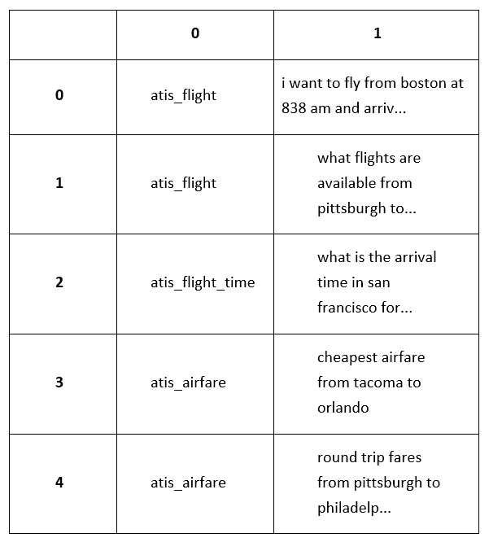
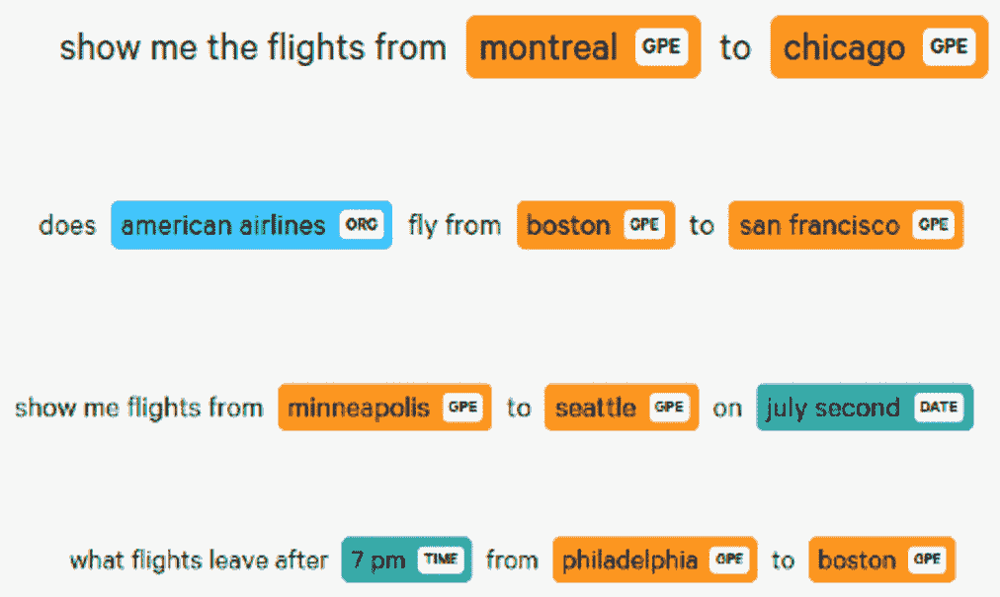
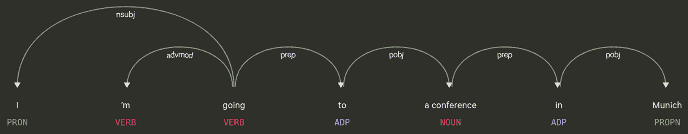
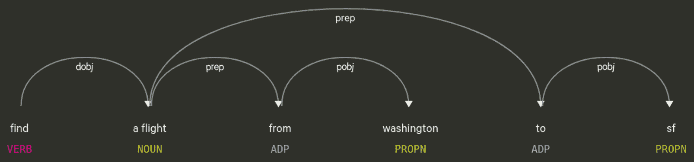
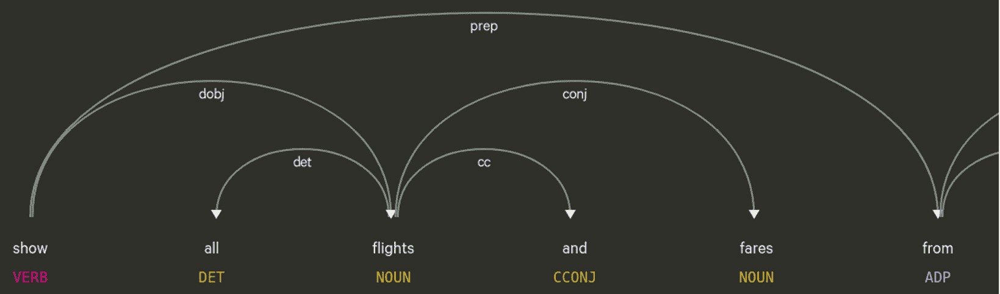

# 第六章：整合一切：使用 spaCy 进行语义解析

这是一个纯实践的部分。在本章中，我们将应用我们迄今为止所学的内容，应用到**航空旅行信息系统**（**ATIS**），一个著名的机票预订系统数据集。首先，我们将了解我们的数据集并做出基本统计。作为第一个**自然语言理解**（**NLU**）任务，我们将使用两种不同的方法提取命名实体，使用 spaCy 匹配器和通过遍历依存树。

下一个任务是确定用户话语的意图。我们也将以不同的方式探索意图识别：通过提取动词及其直接宾语，使用词表，以及通过遍历依存树来识别多个意图。然后你将匹配你的关键词到同义词列表中，以检测语义相似性。

此外，你还将使用基于词向量语义相似性的方法进行关键词匹配。最后，我们将结合所有这些信息为数据集话语生成语义表示。

到本章结束时，你将学会如何完全语义处理一个真实世界的数据集。你将学会如何提取实体、识别意图以及执行语义相似性计算。本章的工具正是你将为真实世界的**自然语言处理**（**NLP**）管道所构建的工具，包括一个 NLU 聊天机器人和一个 NLU 客户支持应用。

在本章中，我们将涵盖以下主要主题：

+   提取命名实体

+   使用依存关系进行意图识别

+   语义解析的语义相似性方法

+   整合一切

# 技术要求

在本章中，我们将处理一个数据集。数据集和本章的代码可以在[`github.com/PacktPublishing/Mastering-spaCy/tree/main/Chapter06`](https://github.com/PacktPublishing/Mastering-spaCy/tree/main/Chapter06)找到。

我们除了使用 spaCy 之外，还使用了 Python 的 pandas 库来操作我们的数据集。我们还使用了 awk 命令行工具。pandas 可以通过 pip 安装，而 awk 在许多 Linux 发行版中是预安装的。

# 提取命名实体

在许多 NLP 应用中，包括语义解析，我们通过检查实体类型并将实体提取组件放入我们的 NLP 管道中来开始寻找文本的意义。**命名实体**在理解用户文本的意义中起着关键作用。

我们还将通过从我们的语料库中提取命名实体来启动一个语义解析管道。为了了解我们想要提取哪种类型的实体，首先，我们将了解 ATIS 数据集。

## 了解 ATIS 数据集

在本章中，我们将使用 ATIS 语料库。ATIS 是一个知名的数据集；它是意图分类的标准基准数据集之一。该数据集包括想要预订航班、获取航班信息（包括航班费用、目的地和时刻表）的客户话语。

无论 NLP 任务是什么，您都应该用肉眼检查您的语料库。我们想要了解我们的语料库，以便我们将对语料库的观察整合到我们的代码中。在查看我们的文本数据时，我们通常会关注以下方面：

+   有哪些类型的话语？是短文本语料库，还是语料库由长文档或中等长度的段落组成？

+   语料库包含哪些类型的实体？人名、城市名、国家名、组织名等等。我们想要提取哪些？

+   标点符号是如何使用的？文本是否正确标点，或者根本不使用标点？

+   语法规则是如何遵循的？大写是否正确？用户是否遵循了语法规则？是否有拼写错误？

在开始任何处理之前，我们将检查我们的语料库。让我们先下载数据集：

```py
$ wget 
https://github.com/PacktPublishing/Mastering-spaCy/blob/main/Chapter06/data/atis_intents.csv
```

数据集是一个两列的 CSV 文件。首先，我们将使用 **pandas** 对数据集统计进行一些洞察。pandas 是一个流行的数据处理库，常被数据科学家使用。您可以在 [`pandas.pydata.org/pandas-docs/version/0.15/tutorials.html`](https://pandas.pydata.org/pandas-docs/version/0.15/tutorials.html) 上了解更多信息：

1.  让我们从将 CSV 文件读入 Python 开始。我们将使用 pandas 的 `read_csv` 方法：

    ```py
    import pandas as pd
    dataset = pd.read_csv("data/atis_intents.csv", header=None)
    ```

    数据集变量为我们保存了 CSV 对象。

1.  接下来，我们将对数据集对象调用 `head()`。`head()` 输出数据集的前 10 列：

    ```py
    dataset.head()
    ```

    结果如下所示：

    

    图 6.1 – 数据集概览

    如您所见，数据集对象包含行和列。它确实是一个 CSV 对象。第一列包含意图，第二列包含用户话语。

1.  现在我们可以打印一些示例话语：

    ```py
    for text in dataset[1].head():
        print(text)
    i want to fly from boston at 838 am and arrive in denver at 1110 in the morning
    what flights are available from pittsburgh to baltimore on thursday morning
    what is the arrival time in san francisco for the 755 am flight leaving washington
    cheapest airfare from tacoma to orlando
    round trip fares from pittsburgh to philadelphia under 1000 dollars
    ```

    如我们所见，第一个用户想要预订航班；他们包括了目的地、出发城市和航班时间。第三个用户询问特定航班的到达时间，第五个用户提出了一个价格限制的查询。这些话语没有大写或标点符号。这是因为这些话语是语音识别引擎的输出。

1.  最后，我们可以看到按意图划分的话语数量分布：

    ```py
    grouped = dataset.groupby(0).size()
    print(grouped)
    atis_abbreviation                            147
    atis_aircraft                                 81
    atis_aircraft#atis_flight#atis_flight_no      1
    atis_airfare                                 423
    atis_airfare#atis_flight_time                  1
    atis_airline                                 157
    atis_airline#atis_flight_no                    2
    atis_airport                                  20
    atis_capacity                                 16
    atis_cheapest                                  1
    atis_city                                     19
    atis_distance                                 20
    atis_flight                                 3666
    ```

    您可以在本书的 GitHub 仓库中找到数据集探索代码，链接为 [`github.com/PacktPublishing/Mastering-spaCy/blob/main/Chapter06/ATIS_dataset_exploration.ipynb`](https://github.com/PacktPublishing/Mastering-spaCy/blob/main/Chapter06/ATIS_dataset_exploration.ipynb)。

1.  在这一点之后，我们只处理话语文本。因此，我们可以删除第一列。为此，我们将使用 Unix 工具 awk 玩一个小技巧：

    ```py
    awk -F ',' '{print $2}' atis_intents.csv  > atis_utterances.txt
    ```

在这里，我们打印了输入 CSV 文件的第二列（其中字段分隔符是 `,`），并将输出重定向到名为 `atis_utterances.txt` 的文本文件。现在，我们的话语已经准备好处理，我们可以继续提取实体。

## 使用 Matcher 提取命名实体

如我们所见，这是一个航班数据集。因此，我们期望看到城市/国家名称、机场名称和航空公司名称：

1.  这里有一些示例：

    ```py
    does american airlines fly from boston to san francisco
    what flights go from dallas to tampa
    show me the flights from montreal to chicago
    what flights do you have from ontario
    The users also provide the dates, times, days of the weeks they wish to fly on. These entities include numbers, month names, day of the week names as well as time adverbs such as next week, today, tomorrow, next month. Let's see some example entities:
    list flights from atlanta to boston leaving between 6 pm and 10 pm on august eighth
    i need a flight after 6 pm on wednesday from oakland to salt lake city
    show me flights from minneapolis to seattle on july second
    what flights leave after 7 pm from philadelphia to boston
    ```

1.  此外，`atis_abbreviation` 意图包含关于某些缩写的询问。航班缩写可以是票价代码（例如，M = 经济舱），航空公司名称代码（例如，联合航空公司 = UA），以及机场代码（例如，柏林机场 = BER），等等。以下是一些示例：

    ```py
    what does the abbreviation ua mean
    what does restriction ap 57 mean
    explain restriction ap please
    what's fare code yn
    ```

1.  让我们可视化一些数据集中的话语。以下截图显示了带有其类型的实体：

    图 6.2 – 带有实体和实体类型高亮的示例语料库句子；由 displaCy 在线演示生成

1.  我们可以更系统地看到所有实体类型及其频率。以下代码段执行以下操作：

    a) 它读取了我们之前在数据集探索子节中创建的话语文本文件。

    b) 它遍历每个话语并创建一个 Doc 对象。

    c) 它从当前的文档对象中提取实体。

    d) 它使用实体的标签更新全局实体标签列表。

    e) 它最终使用计数器对象计算每个标签的频率。

    这里是代码：

    ```py
    from collections import Counter
    import spacy
    nlp = spacy.load("en_core_web_md")
    corpus = open("atis_utterances.txt", "r").read().split("\n")
    all_ent_labels = []
    for sentence in corpus:
         doc = nlp(sentence.strip())
          ents = doc.ents
          all_ent_labels += [ent.label_ for ent in ents]
    c = Counter(all_ent_labels)
    print(c)
    Counter({'GPE (location names), DATE, TIME, and ORGANIZATION. Obviously, the location entities refer to destination and source cities/countries, hence they play a very important role in the overall semantic success of our application.
    ```

1.  我们首先通过 spaCy Matcher 提取位置实体，通过搜索 `preposition location_name` 形式的模式。以下代码提取了由介词引导的位置实体：

    ```py
    import spacy
    from spacy.matcher import Matcher  
    nlp = spacy.load("en_core_web_md")
    matcher = Matcher(nlp.vocab)
    pattern = [{"POS": "ADP"}, {"ENT_TYPE": "GPE"}]
    matcher.add("prepositionLocation", [pattern])
    doc = nlp("show me flights from denver to boston on tuesday")
    matches = matcher(doc)
    for mid, start, end in matches:
        print(doc[start:end])
    ... 
    from denver
    to boston
    ```

    我们已经看到了如何初始化 Matcher 对象并向其中添加模式。尽管如此，我们还是回顾一下如何使用 Matcher 对象提取匹配项。以下是这段代码所做的事情：

    a) 我们从导入 `spacy` 和 `spacy.matcher` 类在第 1-2 行开始。

    b) 我们在第 3 行创建了一个语言管道对象，`nlp`。

    c) 在第 4 行，我们使用语言词汇初始化了 Matcher 对象。

    d) 在第 5 行，我们创建了一个匹配两个标记的模式，一个介词（`POS` 标签 `ADP` 表示 *adposition = preposition + postposition*）和一个位置实体（标签 `GPE` 表示 **location entity**）。

    e) 我们将此模式添加到 Matcher 对象中。

    f) 最后，我们在一个示例语料库句子中请求匹配项并打印了匹配项。

1.  虽然在这个数据集中 `from` 和 `to` 介词占主导地位，但关于离开和到达的动词可以与各种介词一起使用。以下是数据集中的一些更多示例句子：

    ```py
    doc = nlp("i'm looking for a flight that goes from ontario to westchester and stops in chicago")
    matches = matcher(doc)
    for mid, start, end in matches:
       print(doc[start:end])
    ... 
    from ontario
    to westchester
    in chicago
    ```

    第二个示例句子是一个疑问句：

    ```py
    doc = nlp("what flights arrive in chicago on sunday on continental")
    matches = matcher(doc)
    for mid, start, end in matches:
       print(doc[start:end])
    ... 
    in chicago
    ```

    数据集中另一个示例句子包含一个目的地实体中的缩写：

    ```py
    doc = nlp("yes i'd like a flight from long beach to st. louis by way of dallas")
    matches = matcher(doc)
    for mid, start, end in matches:
       print(doc[start:end])
    ... 
    from long
    to st
    of dallas
    ```

    我们最后的示例句子又是一个疑问句：

    ```py
    doc = nlp("what are the evening flights flying out of dallas")
    matches = matcher(doc)
    for mid, start, end in matches:
       print(doc[start:end])
    ... 
    of dallas
    ```

    在这里，我们可以看到一些短语动词，例如 `arrive in`，以及介词和动词的组合，例如 `stop in` 和 `fly out of`。`By the way of Dallas` 完全没有动词。用户表示他们想在达拉斯停留。`to`、`from`、`in`、`out` 和 `of` 是在旅行语境中常用的介词。

1.  在提取了位置信息之后，我们现在可以提取航空公司信息。`ORG` 实体标签表示一个组织，在我们的数据集中对应于航空公司名称。以下代码段提取了组织名称，可能是多词名称：

    ```py
    pattern = {"ENT_TYPE": "ORG", "ORG. We wanted to capture one or more occurrences to capture the multi-word entities as well, which is why we used the OP: "+" operator. 
    ```

1.  提取日期和时间并不非常不同；你可以用 `ENT_TYPE: DATE` 和 `ENT_TYPE: TIME` 代码复制前面的操作。我们鼓励你自己尝试。以下截图展示了日期和时间实体在细节上的样子：![图 6.3 – 带有日期和时间实体的高亮示例数据集句子。该图像由 displaCy 在线演示生成

    图 6.3 – 带有日期和时间实体的高亮示例数据集句子。该图像由 displaCy 在线演示生成

1.  接下来，我们将提取缩写类型实体。提取缩写实体稍微有些复杂。首先，我们将看看缩写是如何出现的：

    ```py
    what does restriction ap 57 mean?
    what does the abbreviation co mean?
    what does fare code qo mean
    what is the abbreviation d10
    what does code y mean
    what does the fare code f and fn mean
    what is booking class c
    ```

    只有这些句子中的一个包含实体。第一个示例句子包含一个 `AMOUNT` 实体，其值为 `57`。除此之外，缩写根本没有任何实体类型标记。在这种情况下，我们必须向匹配器提供一些自定义规则。让我们先做一些观察，然后形成一个匹配器模式：

    a) 缩写可以分成两部分 – 字母和数字。

    b) 字母部分可以是 1-2 个字符长。

    c) 数字部分也是 1-2 个字符长。

    d) 数字的存在表明了一个缩写实体。

    e) 以下单词的存在表明了一个缩写实体：class、code、abbreviation。

    f) 缩写的 `POS` 标签是名词。如果候选词是 1 个或 2 个字母的词，那么我们可以查看 `POS` 标签，看它是否是名词。这种方法消除了假阳性，例如 *us*（代词）、*me*（代词）、*a*（限定词）和 *an*（限定词）。

1.  现在我们将这些观察结果放入匹配器模式中：

    ```py
    pattern1 = [{"TEXT": {"REGEX": "\w{1,2}\d{1,2}"}}]
    pattern2 = [{"SHAPE": { "IN": ["x", "xx"]}}, {"SHAPE": { "IN": ["d", "dd"]}}]
    pattern3 = [{"TEXT": {"IN": ["class", "code", "abbrev", "abbreviation"]}}, {"SHAPE": { "IN": ["x", "xx"]}}]
    pattern4 =   [{"POS": "NOUN", "SHAPE": { "IN": ["x", "xx"]}}]
    ```

    然后我们使用我们定义的模式创建一个匹配器对象：

    ```py
    matcher = Matcher(nlp.vocab)
    matcher.add("abbrevEntities", [pattern1, pattern2, pattern3, pattern4])
    ```

    我们现在已经准备好将我们的句子输入到匹配器中：

    ```py
    sentences = [
    'what does restriction ap 57 mean',
    'what does the abbreviation co mean', 
    'what does fare code qo mean',
     'what is the abbreviation d10', 
    'what does code y mean', 
    'what does the fare code f and fn mean',
     'what is booking class c'
    ]
            18\. We're ready to feed our sentences to the matcher:for sent in sentences:
       doc = nlp(sent)
       matches = matcher(doc)
       for mid, start, end in matches:
         print(doc[start:end])
    ... 
    ap 57
    57
    abbreviation co
    co
    code qo
    d10
    code y
    code f
    class c
    c
    ```

    在前面的代码中，我们定义了四个模式：

    a) 第一个模式匹配单个标记，该标记由 1-2 个字母和 1-2 个数字组成。例如，`d1`、`d10`、`ad1` 和 `ad21` 将匹配此模式。

    b) 第二种模式匹配两个标记的缩写，第一个标记是 1-2 个字母，第二个标记是 1-2 个数字。缩写 `ap 5`、`ap 57`、`a 5` 和 `a 57` 将匹配此模式。

    c) 第三种模式也匹配两个标记。第一个标记是一个上下文线索词，例如 `class` 或 `code`，第二个标记应该是一个 1-2 个字母的标记。一些匹配示例是 `code f`、`code y` 和 `class c`。

    d) 第四种模式提取了 `POS` 标签为 `NOUN` 的 1-2 个字母的短词。前文句子中的某些匹配示例是 `c` 和 `co`。

spaCy 匹配器通过允许我们利用标记形状、上下文线索和标记 `POS` 标签来简化我们的工作。在本小节中，我们通过提取地点、航空公司名称、日期、时间和缩写词，成功地进行了实体提取。在下一小节中，我们将更深入地研究句子语法，并从上下文提供很少线索的句子中提取实体。

## 使用依存树提取实体

在前一小节中，我们提取了上下文提供明显线索的实体。从以下句子中提取目的地城市很容易。我们可以寻找 `to + GPE` 模式：

```py
I want to fly to Munich tomorrow. 
```

但假设用户提供了以下句子之一：

```py
I'm going to a conference in Munich. I need an air ticket.
My sister's wedding will be held in Munich. I'd like to book a flight.
```

在这里，介词 `to` 在第一句话中指的是 `conference`，而不是 `Munich`。在这句话中，我们需要一个类似于 `to + .... + GPE` 的模式。然后，我们必须小心哪些词可以放在 "to" 和城市名称之间，以及哪些词不应该出现。例如，这个句子有完全不同的含义，不应该匹配：

```py
I want to book a flight to my conference without stopping at Berlin.
```

在第二句话中，根本就没有 `to`。从这些例子中我们可以看到，我们需要检查词语之间的句法关系。在 *第三章**，语言特征* 中，我们已经看到了如何解释依存树来理解词语之间的关系。在本小节中，我们将遍历依存树。

遍历依存树意味着以自定义的顺序访问标记，而不一定是从左到右。通常，一旦找到我们想要的东西，我们就停止遍历依存树。再次强调，依存树显示了其词语之间的句法关系。回想一下 *第三章**，语言特征* 中，这些关系是用有向箭头表示的，连接关系的头部和子节点。句子中的每个词都必须至少涉及一个关系。这个事实保证了我们在遍历句子时会访问每个词。

回想

在继续编写代码之前，首先让我们回顾一下关于依赖树的一些概念。ROOT 是一个特殊的依赖标签，总是分配给句子的主谓。spaCy 使用弧来显示句法关系。其中一个标记是句法父节点（称为 HEAD），另一个是依赖节点（称为 CHILD）。以一个例子来说明，在 *图 6.3* 中，**going** 有 3 个句法子节点 – **I**，**m** 和 **to**。同样，**to** 的句法头是 **going**（这对 **I** 和 **m** 也适用）。

回到我们的例子，我们将迭代话语依赖树，以找出介词 **to** 是否与地点实体 **Munich** 有句法关系。首先，让我们看看我们的例子句子 *I'm going to a conference in Munich* 的依赖分析，并记住依赖树的样子：



图 6.4 – 示例句子的依赖分析

动词 **going** 没有进入的弧，所以 **going** 是依赖树的根（当我们查看代码时，我们会看到依赖标签是 **ROOT**）。这是应该发生的，因为 **going** 是句子的主谓。如果我们跟随右边的弧，我们会遇到 **to**；跳过右边的弧，我们会到达 **Munich**。这表明 **to** 和 **Munich** 之间存在句法关系。

现在我们用代码遍历依赖树。有两种可能的方式将 **to** 和 **Munich** 连接起来：

+   从左到右。我们从 **to** 开始，通过访问 "to" 的句法子节点来尝试到达 **Munich**。这种方法可能不是一个很好的主意，因为如果 "to" 有多个子节点，那么我们需要检查每个子节点并跟踪所有可能的路径。

+   从右到左。我们从 **Munich** 开始，跳到其头，然后跟随头的头，依此类推。由于每个词只有一个头，所以可以保证只有一条路径。然后我们确定 **to** 是否在这条路径上。

以下代码段实现了第二种方法，从 `Munich` 开始依赖树遍历，并查找 `to`：

```py
import spacy
nlp = spacy.load("en_core_web_md")
def reach_parent(source_token, dest_token):
  source_token = source_token.head
   while source_token != dest_token:
     if source_token.head == source_token:
       return None
    source_token = source_token.head
   return source_token
doc = nlp("I'm going to a conference in Munich.")
doc[-2]
Munich
doc[3]
to
doc[-1]
.
reach_parent(doc[-2], doc[3])
to
reach_parent(doc[-1], doc[3])
None
```

在 `reach_parent` 函数中，以下适用：

+   我们从一个源标记开始，尝试到达目标标记。

+   在 `while` 循环中，我们从源标记开始迭代每个标记的头。

+   当我们到达源标记或句子的根时，循环停止。

+   我们通过 `source_token == source_token.head` 这一行测试是否到达了根。因为根标记总是指代自身，其头也是自身（记住在依赖树中，根没有进入的弧）。

+   最后，我们在两个不同的测试用例上测试了我们的函数。在第一个测试用例中，源和目的地相关联，而在第二个测试用例中，没有关系，因此函数返回 `None`。

这种方法与前面小节的相当直接的方法非常不同。自然语言很复杂，难以处理，当你需要使用它们时，了解可用的方法和拥有必要的工具箱是很重要的。

接下来，我们将深入一个热门主题——使用句法方法进行意图识别。让我们看看设计一个好的意图识别组件的一些关键点，包括识别多个意图。

# 使用依存关系进行意图识别

在提取实体之后，我们想要找出用户携带的意图类型——预订航班、在他们已预订的航班上购买餐点、取消航班等等。如果你再次查看意图列表，你会看到每个意图都包括一个动词（预订）以及动词所作用的宾语（航班、酒店、餐点）。

在本节中，我们将从话语中提取及物动词及其直接宾语。我们将通过提取及物动词及其直接宾语来开始我们的意图识别部分。然后，我们将探讨如何通过识别动词和名词的同义词来理解用户的意图。最后，我们将看到如何使用语义相似度方法来确定用户的意图。在我们继续提取及物动词及其直接宾语之前，让我们首先快速回顾一下及物动词和直接/间接宾语的概念。

## 语言学入门

在本节中，我们将探讨与句子结构相关的某些语言学概念，包括动词和动词-宾语关系。动词是句子的一个非常重要的组成部分，因为它表明了句子中的动作。句子的宾语是受到动词动作影响的物体/人。因此，句子动词和宾语之间存在自然联系。及物性概念捕捉了动词-宾语关系。及物动词是需要一个宾语来对其施加动作的动词。让我们看看一些例子：

```py
I bought flowers.
He loved his cat.
He borrowed my book.
```

在这些示例句子中，`bought`、`loved`和`borrowed`是及物动词。在第一个句子中，`bought`是及物动词，而`flowers`是其宾语，即句子主语“我”所购买的物体。而`loved` – “他的猫”和`borrowed` – “我的书”是及物动词-宾语例子。我们将再次关注第一个句子——如果我们擦除`flowers`宾语会发生什么？

```py
I bought
```

买了**什么**？没有宾语，这个句子根本没有任何意义。在前面的句子中，每个宾语都完成了动词的意义。这是理解动词是否及物的一种方式——擦除宾语并检查句子是否在语义上保持完整。

有些动词是及物的，有些动词是不及物的。**不及物动词**是与及物动词相反的；它不需要宾语来对其施加动作。让我们看看一些例子：

```py
Yesterday I slept for 8 hours.
The cat ran towards me.
When I went out, the sun was shining.
Her cat died 3 days ago.
```

在所有前面的句子中，动词在没有宾语的情况下是有意义的。如果我们删除除了主语和宾语之外的所有单词，这些句子仍然是有效的：

```py
I slept.
The cat ran.
The sun was shining.
Her cat died.
```

将不及物动词与宾语搭配是没有意义的。你不能让某人/某物跑，你不能让某人/某物发光，你当然也不能让某人/某物死亡。

### 句子宾语

正如我们之前提到的，宾语是受到动词动作影响的物体/人。动词所陈述的动作是由句子主语执行的，而句子宾语受到影响。

一个句子可以是直接的或间接的。**直接宾语**回答问题**谁？** / **什么？** 你可以通过问**主语{动词}什么/谁？**来找到直接宾语。以下是一些例子：

```py
I bought flowers.  I bought what? - flowers
He loved his cat.  He loved who?  - his cat
He borrowed my book. He borrowed what? - my book
```

**间接宾语**回答问题**为了什么？**/**为了谁？**/**给谁？**。让我们看看一些例子：

```py
He gave me his book.  He gave his book to whom?  - me
He gave his book to me. He gave his book to whom? -me
```

间接宾语通常由介词 to、for、from 等引导。正如你从这些例子中看到的，间接宾语也是一个宾语，并且受到动词动作的影响，但它在句子中的角色略有不同。间接宾语有时被视为直接宾语的接受者。

这就是你需要了解的关于及物/不及物动词和直接/间接宾语的知识，以便消化本章的内容。如果你想了解更多关于句子语法的知识，你可以阅读 Emily Bender 的杰出著作《自然语言处理的语言学基础》**Emily Bender**：([`dl.acm.org/doi/book/10.5555/2534456`](https://dl.acm.org/doi/book/10.5555/2534456))。我们已经涵盖了句子语法的基础知识，但这仍然是一个深入了解语法的极好资源。

## 提取及物动词及其直接宾语

在识别意图的同时，我们通常将这些步骤应用于用户的说话：

1.  将句子拆分为标记。

1.  依存句法分析由 spaCy 执行。我们遍历依存树以提取我们感兴趣的标记和关系，这些标记和关系是动词和直接宾语，如下面的图所示：



图 6.5 – 来自语料库的示例句子的依存句法分析

在这个例子句子中，及物动词是**找到**，直接宾语是**航班**。关系**dobj**将及物动词与其直接宾语连接起来。如果我们沿着弧线追踪，从语义上看，我们可以看到用户想要执行的动作是找到，他们想要找到的物体是一个航班。我们可以将**找到**和**航班**合并成一个单词，**findAflight**或**findFlight**，这可以成为这个意图的名称。其他意图可以是**bookFlight**（预订航班）、**cancelFlight**（取消航班）、**bookMeal**（预订餐点）等等。

让我们以更系统的方式提取动词和直接宾语。我们首先通过在句子中寻找 `dobj` 标签来定位直接宾语。为了定位及物动词，我们查看直接宾语的句法主语。一个句子可以包含多个动词，因此在处理动词时要小心。以下是代码：

```py
import spacy
nlp = spacy.load("en_core_web_md")
doc = nlp("find a flight from washington to sf")
for token in doc:
  if token.dep_ == "dobj":
    print(token.head.text + token.text.capitalize())
findFlight
```

在这段代码中，以下内容适用：

+   我们将管道应用于我们的样本句子。

+   接下来，我们通过寻找依赖标签为 `dobj` 的标记来定位直接宾语。

+   当我们定位到直接宾语时，通过获取直接宾语的句法主语来定位相应的及物动词。

+   最后，我们打印出动词和宾语以生成这个意图的名称。

太好了！意图识别成功！在这里，我们识别出一个单一意图。有些语句可能包含多个意图。在下一节中，我们将学习如何根据本节的技巧识别多个意图。

## 提取具有联合关系的多个意图

有些语句包含多个意图。例如，考虑以下来自语料库的语句：

```py
show all flights and fares from denver to san francisco
```

在这里，用户想要列出所有航班，同时还想查看票价信息。一种处理方式是将这些意图视为一个单一且复杂的意图。在这种情况下，我们可以将这个复杂意图表示为 `action: show, objects: flights, fares`。另一种更常见的方式是给这种语句标注多个意图。在数据集中，这个示例语句被标记为两个意图 `atis_flight#atis_airfare`：



图 6.6 – 示例数据集语句的依存树。conj 关系在 "flight" 和 "fares" 之间

在前面的图中，我们看到 **dobj** 弧将 **show** 和 **flights** 连接起来。**conj** 弧将 **flights** 和 **fares** 连接起来，表示它们之间的联合关系。联合关系由诸如 **and** 或 **or** 这样的连词构建，表示一个名词通过这个连词与另一个名词相连。在这种情况下，我们提取直接宾语及其并列成分。现在让我们看看我们如何将这个过程转化为代码：

```py
import spacy
nlp = spacy.load("en_core_web_md")
doc = nlp("show all flights and fares from denver to san francisco") 
for token in doc:
   if token.dep_ == "dobj":
     dobj = token.text
     conj = [t.text for t in token.conjuncts]
     verb = donj.head
print(verb, dobj, conj)
show flights ['fares']
```

在这里，我们遍历所有标记以定位句子的直接宾语。当我们找到直接宾语时，我们获取其并列成分。之后，找到及物动词的方式与之前的代码段相同，我们提取直接宾语的主语。在提取动词和两个宾语之后，如果我们愿意，可以将它们组合起来创建两个意图名称 – `showFlights` 和 `showFares`。

## 使用词表识别意图

在某些情况下，除了及物动词和直接宾语之外的其他标记可能包含用户意图的语义。在这种情况下，你需要进一步深入句法关系并更深入地探索句子结构。

以我们的数据集中的一个以下语句为例：

```py
i want to make a reservation for a flight
```

在这个句子中，最能描述用户意图的**动词-宾语**对是**想要-航班**。然而，如果我们查看*图 6.7*中的分析树，我们会看到**想要**和**航班**在分析树中并没有直接关联。**想要**与及物动词**制作**相关，而**航班**与直接宾语**预订**分别相关：

![Figure 6.7 – 数据集中示例句子的分析树

![img/B16570_6_7.jpg]

Figure 6.7 – 数据集中示例句子的分析树

那么，我们将做什么呢？我们可以玩一个技巧，保留一个包含辅助动词的列表，例如**想要**、**需要**、**制作**和**需要**。以下是代码：

```py
doc = nlp("i want to make a reservation for a flight")
dObj =None
tVerb = None
# Extract the direct object and its transitive verb
for token in doc:
  If token.dep_ == "dobj":
    dObj = token
    tVerb = token.head
# Extract the helper verb
intentVerb = None
verbList = ["want", "like", "need", "order"]
if tVerb.text in verbList:
  intentVerb = tVerb
else:
  if tVerb.head.dep_ == "ROOT":
    helperVerb = tVerb.head
# Extract the object of the intent
intentObj = None
objList = ["flight", "meal", "booking"]
if dObj.text in objList:
  intentObj = dObj
else:
  for child in dObj.children:
    if child.dep_ == "prep":
      intentObj = list(child.children)[0]
      break
    elif child.dep_ == "compound":
      intentObj = child
      break 
print(intentVerb.text + intentObj.text.capitalize())
wantFlight
```

这是我们的逐步操作：

1.  我们首先定位直接宾语及其及物动词。

1.  一旦找到它们，我们就将它们与我们的预定义词汇列表进行比较。对于这个例子，我们使用了两个简化的列表，`verbList`包含辅助动词列表，而`objList`包含我们想要提取的可能宾语词汇列表。

1.  我们检查了及物动词。如果它不在辅助动词列表中，那么我们就检查句子的主要动词（由`ROOT`标记），它是及物动词的头部。如果及物动词是句子的主要动词，那么这个动词的句法头部就是它自己（`tVerb.head`是`tVerb`）。因此，`if tVerb.head.dep_ == "ROOT"`这一行评估为`True`，这种实现是有效的。

1.  接下来，我们检查直接宾语。如果它不在可能宾语列表中，那么我们就检查它的句法子节点。对于每个子节点，我们检查该子节点是否是直接宾语的介词。如果是，我们就选择该子节点的子节点（它只能有一个子节点）。

1.  最后，我们打印出表示意图名称的字符串，它是`wantFlight`。

在这一点上，深呼吸。消化和处理信息需要时间，尤其是当它涉及到句子句法时。你可以尝试从语料库中提取不同的句子，并通过检查点/在代码中添加打印语句来查看脚本的行为。

在下一节中，我们将探讨一个非常实用的工具，即使用同义词列表。让我们继续前进到下一节，学习如何充分利用语义相似性。

# 语义解析的语义相似性方法

自然语言使我们能够用不同的方式和不同的词汇表达相同的概念。每种语言都有同义词和语义相关的词汇。

作为一名 NLP 开发者，在为聊天机器人应用、文本分类或任何其他语义应用开发语义解析器时，你应该记住，用户为每个意图使用相当广泛的短语和表达方式。实际上，如果你正在使用 RASA（[`rasa.com/`](https://rasa.com/））或 Dialogflow（[https://dialogflow.cloud.google.com/](https://dialogflow.cloud.google.com/））等平台构建聊天机器人，你会被要求为每个意图提供尽可能多的句子示例。然后，这些句子被用来在幕后训练意图分类器。

通常有两种方法来识别语义相似性，要么使用同义词词典，要么使用基于词向量语义相似度方法。在本节中，我们将讨论这两种方法。让我们先从如何使用同义词词典来检测语义相似性开始。

## 使用同义词列表进行语义相似度

我们已经遍历了我们的数据集，并看到不同的动词被用来表达相同的行为。例如，“降落”、“到达”和“飞往”动词具有相同的意义，而“离开”、“出发”和“从飞往”动词形成另一个语义组。

我们已经看到，在大多数情况下，及物动词和直接宾语表达意图。判断两个句子是否代表相同意图的一个简单方法就是检查动词和直接宾语是否是同义词。

让我们举一个例子，并比较数据集中的两个示例句子。首先，我们准备一个小型的同义词词典。我们只包括动词和名词的基本形式。在进行比较时，我们也使用单词的基本形式：

```py
verbSynsets = [
("show", "list"),
("book", "make a reservation", "buy", "reserve")
] 
objSynsets = [
("meal", "food"),
("aircraft", "airplane", "plane")
]
```

每个**同义词集**（**synset**）包括我们领域的同义词集合。我们通常包括语言通用的同义词（飞机-飞机）和领域特定的同义词（书-购买）。

synsets 已经准备好使用，我们准备开始使用 spaCy 代码。让我们一步一步来：

1.  首先，我们构建两个与我们要比较的两个句子对应的 doc 对象，`doc`和`doc2`：

    ```py
    doc = nlp("show me all aircrafts that cp uses")
    doc2 = nlp("list all meals on my flight")
    ```

1.  然后，我们提取第一句话的及物动词和直接宾语：

    ```py
    for token in doc:
       if token.dep_ == "dobj":
         obj = token.lemma_
         verb = token.head.lemma_
         break
    ```

1.  然后，我们对第二个句子做同样的处理：

    ```py
    for token in doc2:
       if token.dep_ == "dobj":
         obj2 = token.lemma_
         verb2 = token.head.lemma_
         break
    verb, obj
    ('show' , 'aircraft')
    verb2, obj2
    ('list', 'meal')
    ```

1.  我们获得了第一个动词的 synset。然后，我们检查第二个动词列表是否在这个 synset 中，这返回`True`：

    ```py
    vsyn = [syn for syn in verbSynsets if verb in item]
    vsyn[0]
    ("show", "list")
    v2 in vsyn[0]
    True
    ```

1.  同样地，我们获得了第一个直接宾语“飞机”的 synset。然后我们检查第二个直接宾语“餐”是否在这个 synset 中，这显然是不正确的：

    ```py
    osyn = [syn for syn in objSynsets if obj in item]
    osyn[0]
    ("aircraft", "airplane", "plane")
    obj2 in vsyn[0]
    False
    ```

1.  我们推断出前两个句子不指代相同的意图。

同义词列表对于语义相似度计算非常有用，许多现实世界的 NLP 应用都受益于这样的预编译列表。但使用同义词并不总是适用。对于大型同义词集，对句子中的每个词进行字典查找可能变得低效。在下一节中，我们将介绍一种更高效的用词向量计算语义相似度的方法。

## 使用词向量识别语义相似度

在*第五章* *使用词向量和语义相似度* 中，我们已经看到词向量携带语义信息，包括同义信息。在非常具体的领域工作且同义词数量较少时，同义词列表很有用。在某些时候，处理大型的同义词集可能变得低效，因为我们必须每次都进行字典查找以获取动词和直接宾语。然而，词向量为我们提供了一种非常方便且基于向量的计算语义相似度的方法。

让我们再次回顾前一小节中的代码。这次，我们将使用 spaCy 词向量来计算单词之间的语义距离。让我们一步一步来：

1.  首先，我们构建两个想要比较的`doc`对象：

    ```py
    doc = nlp("show me all aircrafts that cp uses")
    doc2 = nlp("list all meals on my flight")
    ```

1.  然后我们提取第一句话的动词和宾语：

    ```py
    for token in doc:
       if token.dep_ == "dobj":
         obj = token
         verb = token.head
         break
    ```

1.  我们对第二句话重复相同的步骤：

    ```py
    for token in doc2:
       if token.dep_ == "dobj":
         obj2 = token
         verb2 = token.head
         break
    verb, obj
    ('show' , 'aircraft')
    verb2, obj2
    ('list', 'meal')
    ```

1.  现在，我们使用基于词向量的 spaCy 相似度方法计算两个直接宾语之间的语义相似度：

    ```py
    obj.similarity(obj2)
    0.15025872                    # A very low score, we can deduce these 2 utterances are not related at this point.
    ```

1.  最后，我们计算动词之间的相似度：

    ```py
    verb.similarity(verb2)
    0.33161193
    ```

    之前的代码与之前的代码不同。这次，我们直接使用了标记对象；不需要进行词形还原。然后我们调用了 spaCy 的`token.similarity(token2)`方法来计算直接宾语之间的语义距离。得到的分数非常低。在这个时候，我们推断这两个语句并不代表相同的意图。

这是一个计算语义相似度的简单且高效的方法。我们在第一章中提到，spaCy 为 NLP 开发者提供了易于使用且高效的工具，现在我们可以看到原因了。

# 将所有这些放在一起

我们已经以几种方式提取了实体并识别了意图。我们现在准备好将所有这些放在一起来计算用户语句的语义表示！

1.  我们将处理示例数据集的语句：

    ```py
    show me flights from denver to philadelphia on tuesday
    ```

    我们将使用一个字典对象来存储结果。结果将包括实体和意图。

1.  让我们提取实体：

    ```py
    import spacy
    from spacy.matcher import Matcher  
    nlp = spacy.load("en_core_web_md")
    matcher = Matcher(nlp.vocab)
    pattern = [{"POS": "ADP"}, {"ENT_TYPE": "GPE"}]
    matcher.add("prepositionLocation", [pattern])
    # Location entities
    doc = nlp("show me flights from denver to philadelphia on tuesday")
    matches = matcher(doc)
    for mid, start, end in matches:
        print(doc[start:end])
    ... 
    from denver
    to philadelphia
    # All entities:
    ents = doc.ents
    (denver, philedelphia, tuesday)
    ```

1.  基于这些信息，我们可以生成以下语义表示：

    ```py
    {
    'utterance': 'show me flights from denver to philadelphia on tuesday',
    'entities': {
                  'date': 'tuesday',
                  'locations': {
                                     'from': 'denver',
                                     'to': 'philadelphia'
                                     }
                      }
    }
    ```

1.  接下来，我们将执行意图识别以生成完整的语义解析：

    ```py
    import spacy
    nlp = spacy.load("en_core_web_md")
    doc = nlp("show me flights from denver to philadelphia on tuesday")
    for token in doc:
      if token.dep_ == "dobj":
        print(token.head.lemma_ + token.lemma_.capitalize())
    showFlight
    ```

1.  在确定意图后，这个语句的语义解析现在看起来是这样的：

    ```py
    {
    'utterance': 'show me flights from denver to philadelphia on tuesday',
    'intent ': ' showFlight',
    'entities': {
                  'date': 'tuesday',
                  'locations': {
                                     'from': 'denver',
                                     'to': 'philadelphia'
                                     }
                      }
    }
    ```

最终结果是，提取了这一话语、意图和实体的完整语义表示。这是一个可机器读取和使用的输出。我们将此结果传递给系统组件，该组件调用了 NLP 应用程序以生成响应动作。

# 摘要

恭喜！你已经到达了这一非常紧张章节的结尾！

在本章中，你学习了如何生成一个完整的语义解析。首先，你对你自己的数据集进行了发现，以获得关于数据集分析的认识。然后，你学习了使用两种不同的技术提取实体——使用 spaCy Matcher 和通过遍历依存树。接下来，你通过分析句子结构学习了执行意图识别的不同方法。最后，你将所有信息汇总起来以生成语义解析。

在接下来的章节中，我们将转向更多机器学习方法。下一节将关注如何在你自己的数据上训练 spaCy NLP 管道组件。让我们继续前进，并为我们自己定制 spaCy！
