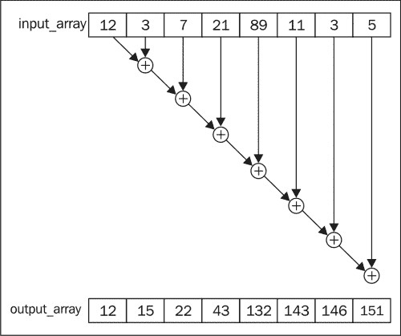
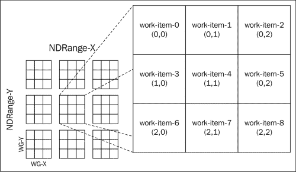
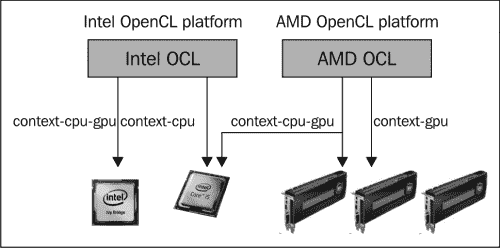
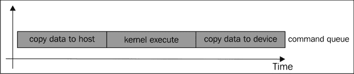
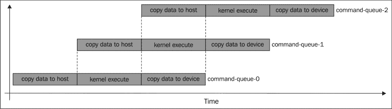
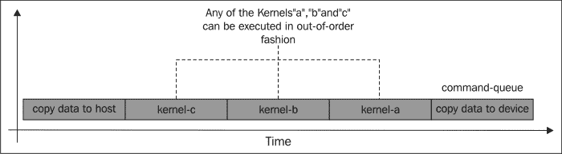

# 第一章. 使用 OpenCL

在本章中，我们将涵盖以下食谱：

+   查询 OpenCL 平台

+   查询您平台上的 OpenCL 设备

+   查询 OpenCL 设备扩展

+   查询 OpenCL 上下文

+   查询 OpenCL 程序

+   创建 OpenCL 内核

+   创建命令队列并将 OpenCL 内核入队

# 简介

让我们回顾一下计算的历史，并从它旨在统一异构设备的软件编程模型的角度来看，为什么 OpenCL 之所以重要。OpenCL 的目标是开发一个免版税标准，用于跨平台的现代处理器的并行编程，这些处理器在个人电脑、服务器和手持/嵌入式设备中都很常见。这项努力由“Khronos Group”发起，并得到了英特尔、ARM、AMD、NVIDIA、QUALCOMM、苹果和其他许多公司的参与。OpenCL 允许软件一次编写，然后在其支持的设备上执行。这种方式类似于 Java，这有好处，因为现在这些设备上的软件开发有了统一的方法，OpenCL 通过暴露各种数据结构来实现这一点，这些结构通过 **应用程序可编程接口**（**APIs**）与硬件交互。今天，OpenCL 支持包括 x86s、ARM 和 PowerPC 的 CPU，以及 AMD、Intel 和 NVIDIA 的 GPU。

开发者肯定能理解我们需要开发跨平台兼容的软件这一事实，因为它允许开发者在他们感到舒适的任何平台上开发应用程序，更不用说它提供了一个连贯的模型，我们可以将我们的想法表达成可以在支持此标准的任何设备上执行的程序。然而，跨平台兼容性也意味着异构环境的存在，并且相当长一段时间以来，开发者不得不学习和应对为这些设备编写软件时出现的问题，这些问题从执行模型到内存系统都有涉及。从在那些异构设备上开发软件中通常出现的另一个任务是，开发者还被期望从它们中表达和提取并行性。在 OpenCL 出现之前，我们知道为了处理在它们执行的设备上表达并行性的方面（例如，Fortran、OpenMP、MPI、VHDL、Verilog、Cilk、Intel TBB、统一并行 C、Java 等），已经发明了各种编程语言及其哲学。但这些工具是为同质环境设计的，尽管开发者可能认为这对他们有利，因为它为他们简历增添了相当多的专业知识。退一步再看，我们发现没有统一的方法来在异构环境中表达并行性。我们不必提及开发者在这些技术中需要多少时间才能变得高效，因为并行分解通常是一个复杂的过程，因为它在很大程度上依赖于硬件。更糟糕的是，许多开发者只需要处理同质计算环境，但过去几年，对异构计算环境的需求增长了。

对异构设备的需求部分是由于对高性能和高度反应性系统的需求，而“功耗墙”的存在使得提高更多性能的一种可能方式是在其中添加专门的处理器单元，以期从中提取每一盎司的并行性，因为这是达到能效的唯一途径。这种向混合计算转变的主要动机可以追溯到名为*Optimizing power using Transformations*的研究，该研究由*Anantha P. Chandrakasan*领导。它得出了一个基本结论，即多核芯片（其运行频率略低于当代 CPU）实际上更节能。没有统一开发方法（例如 OpenCL）的异构计算的问题在于，开发者需要掌握几种类型的 ISA，以及与之相关的各种并行级别及其内存系统。NVIDIA 开发的 CUDA GPGPU 计算工具包值得提及，不仅因为它与 OpenCL 有显著的相似性，而且还因为该工具包在学术界和工业界都有广泛的应用。不幸的是，CUDA 只能驱动 NVIDIA 的 GPU。

从异构环境中提取并行性的能力非常重要，因为计算应该是并行的，否则就会违背 OpenCL 的整个目的。幸运的是，主要的处理器公司都是 Khronos 集团领导的联盟的一部分，并且通过这些组织积极实现这一标准。不幸的是，故事还没有结束，但好事是，我们，开发者，意识到有必要理解并行性以及它在同构和异构环境中的工作方式。OpenCL 的设计初衷就是为了在异构环境中表达并行性。

很长一段时间以来，开发者们很大程度上忽视了他们的软件需要利用他们可用的多核机器的事实，并且继续在单线程环境中开发他们的软件，但这种情况正在改变（如前所述）。在多核世界中，开发者需要处理并发性的概念，而并发的优势在于，当有效使用时，它通过为其他进程提供进展而使一些进程停滞，从而最大化资源利用率。

当软件与多个处理元素同时执行，使得线程可以同时运行时，我们称之为并行计算。开发者面临的挑战是发现这种并发性并实现它。在 OpenCL 中，我们专注于两种并行编程模型：任务并行和数据并行。

任务并行意味着开发者可以创建和操作并发任务。当开发者为 OpenCL 开发解决方案时，他们需要将问题分解成不同的任务，其中一些任务可以并发运行，并且正是这些任务被映射到并行环境的**处理元素**（**PEs**）上以执行。另一方面，有些任务不能并发运行，甚至可能是相互依赖的。另一个复杂性是数据可以在任务之间共享。

当尝试实现数据并行时，开发者需要调整他们对数据的思考方式以及它们如何可以并发读取和更新。在并行计算中常见的一个问题是计算给定任意值数组的所有元素的总和，而存储中间求和值和一种可能的实现方式如图所示，其中应用的运算符，即，是任何二元结合运算符。从概念上讲，开发者可以使用一个任务来执行输入中两个元素的加法以得到求和值。



开发者是否选择体现任务/数据并行取决于问题，一个任务并行有意义的例子是通过遍历图。无论开发者更倾向于哪种模型，当他们开始通过 OpenCL 将程序映射到硬件时，都会遇到自己的一套问题。在 OpenCL 出现之前，开发者需要开发一个将在所需设备上执行的模块，并与驱动程序进行通信和 I/O。一个例子是图形渲染程序，其中 CPU 初始化数据并设置一切，然后在将渲染任务卸载到 GPU 之前。OpenCL 被设计用来利用所有检测到的设备，从而最大化资源利用率，因此在这方面它与“传统”的软件开发方式不同。

既然我们已经对 OpenCL 有了良好的理解，我们应该花些时间了解开发者如何学习它。而且不用担心，因为你在开始每一个项目时，OpenCL 都会要求你理解以下内容：

+   发现你正在为开发的异构系统的组成

+   通过探测来了解那些设备的属性

+   使用任务并行或数据并行中的任何一个或所有来启动并行程序分解，通过将它们表达为在平台上运行的指令，也称为内核

+   设置计算所需的数据结构

+   操作计算所需的内存对象

+   在适当的设备上按所需顺序执行内核

+   汇总结果并验证其正确性

接下来，我们需要通过更深入地研究 OpenCL 的各个组成部分来巩固前面的观点。以下组件共同构成了 OpenCL 架构：

+   **平台模型**：平台实际上是一个连接到一个或多个 OpenCL 设备的宿主。每个设备可能包含多个**计算单元**（**CUs**），这些单元可以分解为一个或多个处理元素，计算将在处理元素上运行。

+   **执行模型**：OpenCL 程序的执行是这样的，宿主程序将在宿主上执行，并且是宿主程序将内核发送到该平台上的一个或多个 OpenCL 设备上执行。

    当内核提交执行时，定义了一个索引空间，以便为该空间中的每个点实例化一个工作项。工作项将通过其全局 ID 来识别，并执行内核中表达的同一段代码。工作项被分组到工作组中，每个工作组都有一个 ID，通常称为其工作组 ID，并且是工作组的工作项在单个 CU 的 PE 上并发执行。

    我们之前提到的索引空间被称为 NDRange，它描述了一个 N 维空间，其中 N 的范围可以从一到三。当工作项分组到工作组中时，每个工作项都有一个全局 ID 和一个局部 ID，这是与其他工作项不同的，并且是从 NDRange 派生出来的。工作组 ID 也是如此。让我们用一个简单的例子来说明它们是如何工作的。

    给定两个各有 1024 个元素的数组 A 和 B，我们想要执行向量乘法，也称为点积，其中 A 的每个元素将与 B 中相应的元素相乘。内核代码看起来可能如下所示：

    ```py
    __kernel void vector_multiplication(__global int* a, 
                                        __global int* b,
                                        __global int* c) {
    int threadId = get_global_id(0); // OpenCL function
    c[i] = a[i] * b[i];
    }
    ```

    在这个场景中，让我们假设我们有 1024 个处理元素，我们将分配一个工作项来执行精确的一次乘法，在这种情况下，我们的工作组 ID 将是零（因为只有一个组）并且工作项 ID 的范围从{0 … 1023}。回想一下我们之前讨论的内容，是工作组的工作项可以在 PE 上执行。因此，回顾一下，这不是利用设备的好方法。

    在这个相同的场景中，让我们放弃之前的假设，采用这个：我们仍然有 1024 个元素，但我们把四个工作项分成一组，因此我们将有 256 个工作组，每个工作组的 ID 范围从{0 … 255}，但需要注意的是，工作项的全局 ID 仍然会从{0 … 1023}的范围，仅仅因为我们没有增加要处理元素的数量。这种将工作项分组到工作组的方式是为了在这些设备中实现可伸缩性，因为它通过确保所有 PE 都有工作可做来提高执行效率。

    NDRange 可以从概念上映射到一个 N 维网格，以下图表说明了 2DRange 的工作原理，其中 WG-X 表示特定工作组的行长度，WG-Y 表示工作组的列长度，以及工作项是如何分组，包括它们在工作组中的相应 ID。

    

    在内核在设备（们）上执行之前，主程序扮演着重要的角色，那就是与底层设备建立上下文并安排任务的执行顺序。主程序通过建立以下内容的实体来创建上下文（如果需要的话）：

    +   主程序将要使用的所有设备

    +   OpenCL 内核，即将在这些设备上运行的函数及其抽象

    +   封装了 OpenCL 内核将要使用/共享的数据的内存对象。

    +   一旦实现这一点，主机需要创建一个名为命令队列的数据结构，该数据结构将由主机用于协调设备上内核的执行，并将命令发布到该队列并调度到设备上。命令队列可以接受：内核执行命令、内存传输命令和同步命令。此外，命令队列可以按顺序执行命令，即按照它们被给出的顺序执行，或者可以乱序执行。如果问题被分解为独立的任务，则可以创建多个针对不同设备的命令队列，并将这些任务调度到它们上面，然后 OpenCL 将并发运行它们。

+   **内存模型**：到目前为止，我们已经了解了执行模型，现在是时候介绍 OpenCL 规定的内存模型了。回想一下，当内核执行时，实际上是工作项在执行其内核代码的实例。因此，工作项需要从内存中读取和写入数据，每个工作项都可以访问四种类型的内存：全局、常量、局部和私有。这些内存的大小和可访问性各不相同，其中全局内存具有最大的大小，并且对工作项来说最易访问，而私有内存可能是最受限的，因为它对工作项是私有的。常量内存是一个只读内存，其中存储了不可变对象，并且可以与所有工作项共享。局部内存仅对在同一个工作组中执行的所有工作项可用，并且由每个计算单元持有，即 CU 特定的。

    在主机上运行的应用程序使用 OpenCL API 在全局内存中创建内存对象，并将内存命令入队到命令队列以操作它们。主机的责任是确保当内核开始执行时，数据对设备可用，它通过复制数据或映射/取消映射内存对象的部分区域来实现这一点。在典型的从主机内存到设备内存的数据传输过程中，OpenCL 命令被发布到队列，这些队列可能是阻塞的或非阻塞的。阻塞和非阻塞内存传输的主要区别在于，在前者中，函数调用只在队列后返回一次（在入队后被认为是安全的），而在后者中，调用在命令入队后立即返回。

    OpenCL 中的内存映射允许内存空间的一部分可用于计算，这个区域可以是阻塞的或非阻塞的，开发者可以将这个空间视为可读的、可写的或两者兼具。

    从此以后，我们将专注于通过编写小的 OpenCL 程序来掌握 OpenCL 的基础知识，以更深入地了解如何使用 OpenCL 的平台和执行模型。

OpenCL 规范版本 1.2 是一个开放、免版税的标准，适用于从移动设备到传统 CPU，以及最近通过 API 和当时的标准支持的各种设备的通用编程。

+   基于数据和任务并行编程模型

+   实现了 ISO C99 的一个子集，并针对并行性添加了一些限制，例如不支持递归、可变参数函数和宏

+   数学运算符合 IEEE 754 规范

+   通过建立配置配置文件，可以将程序移植到手持设备和嵌入式设备

+   与 OpenGL、OpenGL ES 和其他图形 API 的互操作性

在整本书中，我们将向您展示如何精通 OpenCL 编程。

随着您阅读本书，您将发现不仅如何使用 API 对 OpenCL 设备执行各种操作，而且您还将学习如何建模问题，并将其从串行程序转换为并行程序。更常见的是，您将学习的技巧可以转移到其他编程工具集中。

在工具集里，我使用过 OpenCL^(TM)、CUDA^(TM)、OpenMP^(TM)、MPI^(TM)、Intel 线程构建块^(TM)、Cilk^(TM)、CilkPlus^(TM)，这允许开发者在一个统一的环境中表达并行性，并将学习工具到应用知识的过程分为四个部分。这四个阶段相当常见，我发现按照这个过程记忆它们非常有帮助。我希望你们也能从中受益。

+   **寻找并发性**：程序员在问题域中工作，以识别可用的并发性并将其暴露出来用于算法设计

+   **算法结构**：程序员使用高级结构来组织并行算法。

+   **支持结构**：这指的是并行程序的组织方式以及用于管理共享数据的技术。

+   **实现机制**：最后一步是查看用于实现并行程序的具体软件结构。

不要担心这些概念，随着我们通过本书的进展，它们将被解释。

我们接下来要检查的几个菜谱都与理解 OpenCL API 的使用有关，通过集中精力理解架构的平台模型。

# 查询 OpenCL 平台

在你开始编码之前，请确保你已经为你要开发的平台安装了适当的 OpenCL 开发工具包。在这个菜谱中，我们将演示如何使用 OpenCL 查询其平台以检索它检测到的兼容设备及其各种属性的信息。

## 准备工作

在这个第一个 OpenCL 应用程序中，你将能够查询你的计算机上安装的 OpenCL 平台类型。在你的计算机设置中，你可能有一个配置，其中同时安装了 NVIDIA 和 AMD 显卡，在这种情况下，你可能已经安装了 AMD APP SDK 和 NVIDIA 的 OpenCL 工具包。因此，你会安装这两个平台。

以下代码列表是从`Ch1/platform_details/platform_details.c`中提取的。

## 如何做…

注意包含的注释，因为它们将帮助你理解每个单独的函数：

```py
#include <stdio.h>
#include <stdlib.h>

#ifdef APPLE
#include <OpenCL/cl.h>
#else
#include <CL/cl.h>
#endif

void displayPlatformInfo(cl_platform_id id,
                         cl_platform_info param_name,
                         const char* paramNameAsStr) {
    cl_int error = 0;
    size_t paramSize = 0;

    error = clGetPlatformInfo( id, param_name, 0, NULL,
                               &paramSize );
    char* moreInfo = (char*)alloca( sizeof(char) * paramSize);
    error = clGetPlatformInfo( id, param_name, paramSize,
                               moreInfo, NULL );
    if (error != CL_SUCCESS ) {
        perror("Unable to find any OpenCL platform
                information");
        return;
    }
    printf("%s: %s\n", paramNameAsStr, moreInfo);
}

int main() {
   /* OpenCL 1.2 data structures */
   cl_platform_id* platforms;
   /* OpenCL 1.1 scalar data types */
   cl_uint numOfPlatforms;
   cl_int  error;

   /* 
      Get the number of platforms 
      Remember that for each vendor's SDK installed on the
      Computer, the number of available platform also
      increased. 
    */
   error = clGetPlatformIDs(0, NULL, &numOfPlatforms);
   if(error < 0) {      
      perror("Unable to find any OpenCL platforms");
      exit(1);
   }
   // Allocate memory for the number of installed platforms.
   // alloca(...) occupies some stack space but is
   // automatically freed on return
   platforms = (cl_platform_id*) alloca(sizeof(cl_platform_id)
               * numOfPlatforms);
   printf("Number of OpenCL platforms found: %d\n",
           numOfPlatforms);

   // We invoke the API 'clPlatformInfo' twice for each
   // parameter we're trying to extract
   // and we use the return value to create temporary data
   // structures (on the stack) to store
   // the returned information on the second invocation.
   for(cl_uint i = 0; i < numOfPlatforms; ++i) {
        displayPlatformInfo( platforms[i], 
                             CL_PLATFORM_PROFILE,
                             "CL_PLATFORM_PROFILE" );

        displayPlatformInfo( platforms[i], 
                             CL_PLATFORM_VERSION,
                             "CL_PLATFORM_VERSION" );

        displayPlatformInfo( platforms[i], 
                             CL_PLATFORM_NAME,   
                             "CL_PLATFORM_NAME" );

        displayPlatformInfo( platforms[i], 
                             CL_PLATFORM_VENDOR, 
                             "CL_PLATFORM_VENDOR" );

        displayPlatformInfo( platforms[i], 
                             CL_PLATFORM_EXTENSIONS,
                             "CL_PLATFORM_EXTENSIONS" );
   }
   return 0;
}
```

要在 UNIX 平台上编译它，你会运行一个类似于以下编译命令：

```py
gcc –std=c99 –Wall –DUNIX –g –DDEBUG –DAPPLE –arch i386 –o platform_details platform_details.c –framework OpenCL

```

当这种情况发生时，你将有一个名为`platform_details`的二进制可执行文件。

要运行程序，只需执行`platform_details`程序，一个示例输出将是 OSX：

```py
Number of OpenCL platforms found: 1
CL_PLATFORM_PROFILE: FULL_PROFILE
CL_PLATFORM_VERSION: OpenCL 1.0 (Dec 23 2010 17:30:26)
CL_PLATFORM_NAME: Apple
CL_PLATFORM_VENDOR: Apple
CL_PLATFORM_EXTENSIONS:
```

## 它是如何工作的…

当你刚开始学习编程 OpenCL 时，这可能是一项艰巨的任务，但随着我们的进展，它确实会变得更好。所以，让我们解析我们刚刚看到的源代码。文件是一个 C 源文件，你会注意到它被组织得如此之好，以至于系统头文件几乎总是放在顶部附近：

```py
| #include <stdlib.h>
| #include <stdio.h> 
```

接下来是 C 程序员所说的平台相关代码：

```py
| #ifdef APPLE
| #include <OpenCL/cl.h>
| #else
| #include <CL/cl.h>
| #endif
```

OpenCL 头文件对于程序编译是必需的，因为它们包含方法签名。现在，我们将尝试理解其余代码的功能。在 OpenCL 中，一个代码约定是数据类型以`cl_`为前缀，你可以找到每个平台、设备和上下文的数据类型，分别以`cl_platform_XX`、`cl_device_XX`、`cl_context_XX`表示，API 以类似的方式以`cl`为前缀，其中一个这样的 API 是`clGetPlatformInfo`。

在 OpenCL 中，API 并不假设你知道当你编写 OpenCL 代码时确切有多少资源（例如平台、设备和上下文）存在或需要。为了编写可移植的代码，语言的开发者想出了一个巧妙的方法来呈现 API，这样你可以使用相同的 API 提出一个一般性问题，并根据该问题的结果，通过相同的 API 请求更多信息。让我用一个例子来说明。

在代码中，你会注意到`clGetPlatformInfo()`被调用了两次。第一次调用是为了查询机器上安装的平台数量。根据查询结果，我们再次调用了`clGetPlatformInfo`，但这次我们传递了上下文相关的信息，例如，获取供应商的名称。当你用 OpenCL 编程时，你会发现这种模式经常出现，我可以想到的缺点是它有时会使 API 变得相当晦涩难懂，但它的好处是它防止了 API 在语言中的过度扩散。

老实说，这在整个 OpenCL 编程生态系统中相当简单，但后续章节将展示如何将顺序代码转换为 OpenCL 中的并行代码。

接下来，让我们在代码的基础上构建，并查询 OpenCL 以获取连接到平台上的设备。

# 查询平台上的 OpenCL 设备

我们现在将查询安装在你平台上的 OpenCL 设备。

## 准备中

在*如何做…*部分讨论的代码列表展示了`Ch1/device_details/device_details.c`中的代码的简略部分。这段代码演示了你可以如何通过`clGetDeviceIDs`获取你平台上安装的设备类型。你将使用这些信息通过传递给`clGetDeviceInfo`来检索有关设备的详细信息。

## 如何做…

对于这个菜谱，你需要完全参考相应的章节代码。注意包含的注释，因为它们将帮助你理解每个单独的函数。我们已包括带有突出注释的菜谱的主要部分：

```py
/* C-function prototype */
void displayDeviceDetails(cl_device_id id, cl_device_info param_name, const char* paramNameAsStr) ; 

…
void displayDeviceInfo(cl_platform_id id, 
                       cl_device_type dev_type) {
    /* OpenCL 1.1 device types */

    cl_int error = 0;
    cl_uint numOfDevices = 0;

    /* Determine how many devices are connected to your
       platform */
    error = clGetDeviceIDs(id, dev_type, 0, NULL,
                           &numOfDevices);
    if (error != CL_SUCCESS ) { 
        perror("Unable to obtain any OpenCL compliant device
                info");
        exit(1);
    }

    cl_device_id* devices = (cl_device_id*)
                  alloca(sizeof(cl_device_id) * numOfDevices);

    /* Load the information about your devices into the 
       variable 'devices'
    */
    error = clGetDeviceIDs(id, dev_type, numOfDevices, devices,
                           NULL);
    if (error != CL_SUCCESS ) { 
        perror("Unable to obtain any OpenCL compliant device
                info");
        exit(1);
    }

    printf("Number of detected OpenCL devices:
            %d\n",numOfDevices);

    /* 
      We attempt to retrieve some information about the
      devices. 
    */

    for(int i = 0; i < numOfDevices; ++ i ) {
        displayDeviceDetails( devices[i], CL_DEVICE_TYPE, "CL_DEVICE_TYPE" );
        displayDeviceDetails( devices[i], CL_DEVICE_VENDOR_ID, "CL_DEVICE_VENDOR_ID" );
        displayDeviceDetails( devices[i], CL_DEVICE_MAX_COMPUTE_UNITS, "CL_DEVICE_MAX_COMPUTE_UNITS" );
        displayDeviceDetails( devices[i], CL_DEVICE_MAX_WORK_ITEM_DIMENSIONS, "CL_DEVICE_MAX_WORK_ITEM_DIMENSIONS" );
        displayDeviceDetails( devices[i], CL_DEVICE_MAX_WORK_ITEM_SIZES, "CL_DEVICE_MAX_WORK_ITEM_SIZES" );
        displayDeviceDetails( devices[i], CL_DEVICE_MAX_WORK_GROUP_SIZE, "CL_DEVICE_MAX_WORK_GROUP_SIZE" );
    }
}

void displayDeviceDetails(cl_device_id id,
                          cl_device_info param_name, 
                          const char* paramNameAsStr) {
  cl_int error = 0;
  size_t paramSize = 0;

  error = clGetDeviceInfo( id, param_name, 0, NULL, &paramSize );
  if (error != CL_SUCCESS ) {
    perror("Unable to obtain device info for param\n");
    return;
  }

  /* 
    The cl_device_info are preprocessor directives defined in cl.h
  */

  switch (param_name) {
    case CL_DEVICE_TYPE: {
            cl_device_type* devType = (cl_device_type*)
                        alloca(sizeof(cl_device_type) * paramSize);
            error = clGetDeviceInfo( id, param_name, paramSize, devType, NULL );

            if (error != CL_SUCCESS ) {
                perror("Unable to obtain device info for param\n");
                return;
            }

            switch (*devType) {
              case CL_DEVICE_TYPE_CPU : 
                   printf("CPU detected\n");break;
              case CL_DEVICE_TYPE_GPU : 
                   printf("GPU detected\n");break;
              case CL_DEVICE_TYPE_DEFAULT : 
                   printf("default detected\n");break;
            }
            }break;

     // omitted code – refer to source "device_details.c"
   } //end of switch
}
```

在 UNIX 平台上，你可以在终端运行以下命令来编译`device_details.c`：

```py
gcc -std=c99 -Wall -DUNIX -g -DDEBUG -DAPPLE -arch i386 -o device_details device_details.c   -framework OpenCL

```

并且一个名为`device_details`的二进制可执行文件应该被本地存储在你的机器上。

当你在机器上执行依赖于你机器设置的二进制可执行文件时，你会看到不同的结果。但在我这里的 OSX 平台上，当在配备英特尔酷睿 i5 处理器和 NVIDIA 移动 GPU GT330m（扩展被突出显示）的机器上执行时，这是输出结果：

```py
Number of OpenCL platforms found: 1
CL_PLATFORM_PROFILE: FULL_PROFILE
CL_PLATFORM_VERSION: OpenCL 1.0 (Dec 23 2010 17:30:26)
CL_PLATFORM_NAME: Apple
CL_PLATFORM_VENDOR: Apple
CL_PLATFORM_EXTENSIONS: 
Number of detected OpenCL devices: 2
GPU detected
  VENDOR ID: 0x1022600
  Maximum number of parallel compute units: 6
  Maximum dimensions for global/local work-item IDs: 3
  Maximum number of work-items in each dimension: 512
  Maximum number of work-items in a work-group: 512
CPU detected
  VENDOR ID: 0x1020400
  Maximum number of parallel compute units: 4
  Maximum dimensions for global/local work-item IDs: 3
  Maximum number of work-items in each dimension: 1
  Maximum number of work-items in a work-group: 1
```

如果信息现在看起来没有意义，请不要过于担心，后续章节将揭示一切。

## 它是如何工作的…

利用我们在上一节中完成的工作，我们现在已经通过 `clGetPlatformInfo` 使用了平台，该平台被检测到以查询连接的设备。这次，我们使用了新的 API 函数 `clGetDeviceIDs` 和 `clGetDeviceInfo`。前者试图揭示连接到给定平台的所有设备的基本信息，我们使用 `clGetDeviceInfo` 来遍历结果以了解它们的更多功能。当您在构建算法时，这些信息非常有价值，并且不确定它将在哪个设备上运行。考虑到 OpenCL 支持各种处理器，这是一种编写可移植代码的好方法。

实际上，您可以从您的设备中获取更多信息，我强烈建议您参考 [`www.khronos.org/registry/cl/sdk/2.0/docs/man/xhtml/`](http://www.khronos.org/registry/cl/sdk/2.0/docs/man/xhtml/) 并查看 `clGetDeviceInfo` 的主页。

现在我们已经了解了如何查询平台和连接的设备，我们应该看看如何查询 OpenCL 扩展。扩展允许供应商定义与 OpenCL 兼容设备一起提供的附加功能，这反过来又允许您，作为程序员，利用它们。

# 查询 OpenCL 设备扩展

OpenCL 中的扩展允许程序员利用设备供应商提供的额外功能，因此它们是可选的。然而，有一些扩展被 OpenCL 识别，并且据说被主要供应商支持。

这里是 OpenCL 1.2 中批准和支持的扩展的部分列表。如果您想发现 OpenCL 采用者公开的整个扩展列表（其中一些在表中给出），请通过此链接查看 PDF 文档：[`www.khronos.org/registry/cl/specs/opencl-1.2-extensions.pdf`](http://www.khronos.org/registry/cl/specs/opencl-1.2-extensions.pdf)。

| 扩展名称 | 描述 |
| --- | --- |
| `cl_khr_fp64` | 此表达式提供双精度浮点数 |
| `cl_khr_int64_base_atomics` | 此表达式提供 64 位整数基本原子操作，提供加法、减法、交换、增量/减量以及 CAS 的原子操作 |
| `cl_khr_int64_extended_atomics` | 此表达式提供 64 位整数扩展原子操作，提供查找最小值、最大值以及布尔操作（如与、或、异或）的原子操作 |
| `cl_khr_3d_image_writes` | 此表达式写入 3D 图像对象 |
| `cl_khr_fp16` | 此表达式提供半精度浮点数 |
| `cl_khr_global_int32_base_atomics` | 此表达式提供 32 位操作数的原子操作 |
| `cl_khr_global_int32_extended_atomics` | 此表达式为 32 位操作数提供更多原子功能 |
| `cl_khr_local_int32_base_atomics` | 此表达式提供共享内存空间中 32 位操作数的原子操作 |
| `cl_khr_local_int32_extended_atomics` | 这个表达式为共享内存空间中的 32 位操作数提供了更多的原子功能 |
| `cl_khr_byte_addressable_store` | 这个表达式允许对小于 32 位字节的内存进行写入 |
| `cl_APPLE_gl_sharing` | 这个表达式提供了 MacOSX OpenGL 共享，并允许应用程序将 OpenGL 缓冲区、纹理和渲染缓冲区对象用作 OpenCL 内存对象 |
| `cl_khr_gl_sharing` | 这个表达式提供了 OpenGL 共享 |
| `cl_khr_gl_event` | 这个表达式从 GL 同步对象中检索 CL 事件对象 |
| `cl_khr_d3d10_sharing` | 这个表达式与 Direct3D 10 共享内存对象 |

接下来，让我们找出如何通过利用我们之前所做的工作来确定你的平台支持哪些扩展以及它们是否可用。

## 准备工作

下面的列表仅显示了`Ch1/device_extensions/device_extensions.c`中找到的有趣代码部分。各种符合 OpenCL 标准的设备将具有不同的功能，在你开发应用程序的过程中，你肯定想在使用它们之前确保某些扩展是可用的。本配方中“如何做…”部分讨论的代码展示了如何检索这些扩展。

## 如何做…

我们已经包含了主要的查询函数，它允许你实现这个特定的配方：

```py
void displayDeviceDetails(cl_device_id id,
                          cl_device_info param_name, 
                          const char* paramNameAsStr) {

  cl_int error = 0;
  size_t paramSize = 0;

  error = clGetDeviceInfo( id, param_name, 0, NULL, &paramSize );
  if (error != CL_SUCCESS ) {
    perror("Unable to obtain device info for param\n");
    return;
  }
  /* the cl_device_info are preprocessor directives defined in cl.h
  */
  switch (param_name) {
    // code omitted – refer to "device_extensions.c"
    case CL_DEVICE_EXTENSIONS : {
  size_t* ret = (size_t*) alloc(sizeof(size_t) * paramSize);
           error = clGetDeviceInfo( id, param_name, paramSize, ret, NULL );
           char* extension_info = (char*)malloc(sizeof(char) * (*ret));
           error = clGetDeviceInfo( id, CL_DEVICE_EXTENSIONS, sizeof(extension_info), extension_info, NULL);
           printf("\tSupported extensions: %s\n",
                  extension_info);
           }break;
  } //end of switch
}
```

要编译代码，就像你之前在终端上运行类似命令一样：

```py
gcc -std=c99 -Wall -DUNIX -g -DDEBUG -DAPPLE -arch i386 -o device_extensions device_extensions.c   -framework OpenCL

```

在 UNIX 平台上，当在英特尔酷睿 i5 处理器上使用 NVIDIA 移动 GPU GT330m 执行时，我们得到了以下结果（扩展被突出显示）：

```py
Number of OpenCL platforms found: 1
CL_PLATFORM_PROFILE: FULL_PROFILE
CL_PLATFORM_VERSION: OpenCL 1.0 (Dec 23 2010 17:30:26)
CL_PLATFORM_NAME: Apple
CL_PLATFORM_VENDOR: Apple
CL_PLATFORM_EXTENSIONS: 
Number of detected OpenCL devices: 2
GPU detected
  VENDOR ID: 0x1022600
  Maximum number of parallel compute units: 6
  Maximum dimensions for global/local work-item IDs: 3
  Maximum number of work-items in each dimension: ( 512 512 64  )
  Maximum number of work-items in a work-group: 512
  Supported extensions: cl_khr_byte_addressable_store cl_khr_global_int32_base_atomics cl_khr_global_int32_extended_atomics cl_APPLE_gl_sharing cl_APPLE_SetMemObjectDestructor cl_APPLE_ContextLoggingFunctions cl_khr_local_int32_base_atomics cl_khr_local_int32_extended_atomics 
CPU detected
  VENDOR ID: 0x1020400
  Maximum number of parallel compute units: 4
  Maximum dimensions for global/local work-item IDs: 3
  Maximum number of work-items in each dimension: ( 1 1 1  )
  Maximum number of work-items in a work-group: 1
  Supported extensions: cl_khr_fp64 cl_khr_global_int32_base_atomics cl_khr_global_int32_extended_atomics cl_khr_local_int32_base_atomics cl_khr_local_int32_extended_atomics cl_khr_byte_addressable_store cl_APPLE_gl_sharing cl_APPLE_SetMemObjectDestructor cl_APPLE_ContextLoggingFunctions
```

## 它是如何工作的…

当我们检查我们刚刚所做的工作时，我们只是利用现有的代码，并在需要的地方添加了所需的功能，即通过添加代码来处理`CL_DEVICE_EXTENSIONS`被传递的情况。我们在栈上创建了一个固定大小的数组，并将其传递给`clGetDeviceInfo`，在那里 API 最终将信息存储到数组中。提取信息就像打印出数组一样简单。对于高级使用，你可能希望将那些信息存储到全局表结构中，以便应用程序的其他部分可以使用它。

要了解这些扩展的含义以及如何利用它们，我建议你参考 Khronos 注册的 OpenCL：[`www.khronos.org/registry/cl/`](http://www.khronos.org/registry/cl/)。

我们不会过多地停留在迄今为止我们所看到的每个扩展上。让我们继续了解 OpenCL 上下文。

# 查询 OpenCL 上下文

OpenCL 上下文是通过一个或多个设备创建的。上下文被 OpenCL 运行时用于管理对象，例如命令队列（允许你向设备发送命令的对象）、内存、程序和内核对象，以及执行上下文中指定的一个或多个设备上的内核。

更详细地说，OpenCL 上下文可以通过通过 `clCreateContext` 将可用的设备集合关联到平台，或者通过通过 `clCreateContextFromType` 将其与特定类型的设备关联，例如 CPU、GPU 等，来创建。然而，无论哪种方式，你都不能创建与多个平台关联的上下文。让我们以 *简介* 部分中的向量乘法为例来演示这些概念。向量乘法或点积问题可以使用：笔和纸、CPU、GPU 或 GPU + CPU 来解决。显然，当我们有超过 20 个元素时，第一种方法并不太适用，而使用 OpenCL 你有更多的选择。你需要决定的第一件事是它应该在哪个平台上运行，在 OpenCL 中这意味着决定是否使用 AMD、NVIDIA、Intel 等等。接下来要决定的是是否要在该平台列出的所有设备上运行点积，或者只运行其中的一部分。

因此，让我们假设平台报告了一个英特尔酷睿 i7 和 3 个 AMD GPU，并且开发者可以使用 `clCreateContextFromType` 来限制执行到 CPU 或 GPU，但是当你使用 `clCreateContext` 时，你可以列出所有四个要执行的设备，从理论上讲（然而，在实践中，很难有效地使用所有 CPU 和 GPU，因为 GPU 可以推送比 CPU 更多的线程来执行）。以下图表说明了开发者创建上下文时可供选择的选项，假设主机环境安装了英特尔和 AMD 的 OpenCL 平台软件。当考虑到包括 HD 图形协处理器在内的 Ivy Bridge 英特尔处理器时，配置会变得更有趣，该协处理器允许上下文同时识别 CPU 和 GPU。 



上下文还有一个有趣的属性，即它保留了一个引用计数，这样第三方库就可以引用它并因此利用设备。例如，如果你的设备上提供了 `cl_khr_d3d10_sharing` 扩展，你实际上可以在 OpenCL 和 Direct3D 10 之间进行互操作，并将 Direct3D 10 资源类似于内存对象作为你可以从中读取或写入的 OpenCL 内存对象。然而，我们不会在这个书中用这个扩展来演示功能，而是将其留给读者去进一步探索。

## 准备工作

在 *如何做…* 部分给出的代码列表是从 `Ch1/context_query/context_details.c` 中提取的，它说明了如何创建和释放 OpenCL 上下文。

## 如何做…

要查询 OpenCL 上下文，你需要在你的代码中包含一个类似于以下的功能。你应该参考与此菜谱相关的完整代码列表：

```py
void createAndReleaseContext(cl_platform_id id, 
                             cl_device_type dev_type) {
    /* OpenCL 1.1 scalar types */
    cl_int error = 0;
    cl_uint numOfDevices = 0;

 /* Determine how many devices are connected to your platform */
    error = clGetDeviceIDs(id, dev_type, 0, NULL, &numOfDevices);
    if (error != CL_SUCCESS ) { 
        perror("Unable to obtain any OpenCL compliant device info");
        exit(1);
    }
    cl_device_id* devices = (cl_device_id*)
                     alloca(sizeof(cl_device_id) * numOfDevices);

    /* 
     Load the information about your devices into the variable
     'devices'
    */

    error = clGetDeviceIDs(id, dev_type, numOfDevices, devices, NULL);
    if (error != CL_SUCCESS ) { 
        perror("Unable to obtain any OpenCL compliant device info");
        exit(1);
    }

    printf("Number of detected OpenCL devices: %d\n",
            numOfDevices);

    /* 
       We attempt to create contexts for each device we find,
       report it and release the context. Once a context is
       created, its context is implicitly
       retained and so you don't have to invoke
      'clRetainContext'
     */

    for(int i = 0; i < numOfDevices; ++ i ) {
        cl_context context = clCreateContext(NULL, 1,
                                             &devices[i],
                                             NULL, NULL,
                                             &error); 
        cl_uint ref_cnt = 0;
        if (error != CL_SUCCESS) {
            perror("Can't create a context");
            exit(1);
        }

        error = clGetContextInfo(context,
                                 CL_CONTEXT_REFERENCE_COUNT,
                                 sizeof(ref_cnt), &ref_cnt,
                                 NULL);

        if (error != CL_SUCCESS) {
            perror("Can't obtain context information");
            exit(1);
        }
        printf("Reference count of device is %d\n", ref_cnt);
        // Release the context
        clReleaseContext(context);
    }
}
```

在 UNIX 平台上，你可以通过输入以下命令来编译和构建程序

```py
gcc -std=c99 -Wall -DUNIX -g -DDEBUG -DAPPLE -arch i386 -o context_details context_details.c   -framework OpenCL

```

在测试机器上，我们有两个符合 OpenCL 规范的设备。第一个是英特尔酷睿 i5 CPU，第二个是 NVIDIA 移动 GT330m GPU。以下是其输出：

```py
Number of OpenCL platforms found: 1
Number of detected OpenCL devices: 2
Reference count of device is 1
Reference count of device is 1
```

## 它是如何工作的…

如果你一直在跟随这本书学习，你应该意识到我们并没有做任何特别的事情，只是利用了之前的练习，发现了已安装的平台类型，并据此发现了设备和最终使用这些信息来创建相关上下文。最后，有了这些相关上下文，我们就可以查询它们。你会注意到，在两种情况下上下文的引用计数都是一，这表明当前有一个内存对象正在引用它，而我们传递的 `CL_CONTEXT_REFERENCE_COUNT` 也反映了这一点。这个计数器只有在你想检测应用程序是否经历上下文泄露（实际上意味着内存泄露）时才有用。对于 CPU 或 GPU 这样的 OpenCL 设备，这个问题可能并不严重。但对于移动处理器来说，它可能会造成相当严重的问题，因为内存泄露通常浪费资源，并最终耗尽电池寿命。

实际上，你还可以通过传递各种 `cl_context_info` 类型来使用 `clGetContextInfo` 查询更多细节。以下是一个列表：

| cl_context_info | 返回类型 | `param_name` 中返回的信息 |
| --- | --- | --- |
| `CL_CONTEXT_REFERENCE_COUNT` | `cl_uint` | 这个变量返回上下文的引用计数 |
| `CL_CONTEXT_NUM_DEVICES` | `cl_uint` | 这个变量返回上下文中的设备数量 |
| `CL_CONTEXT_DEVICES` | `cl_device_id[]` | 这个变量返回上下文中的设备列表 |
| `CL_CONTEXT_PROPERTIES` | `cl_context_properties` | 这个变量返回在 `clCreateContext` 或 `clCreateContextFromType` 中指定的属性参数 |

现在我们已经了解了查询平台、设备、扩展和上下文的基本知识，我认为是时候看看 OpenCL 内核以及如何编程它们了。

# 查询 OpenCL 程序

在 OpenCL 中，内核指的是程序中声明的一个函数。OpenCL 程序由一组内核组成，这些内核是在代码中使用 `__kernel` 限定符声明的函数。这样的程序封装了一个上下文、程序源或二进制文件以及附加的内核数量。以下几节将解释如何构建 OpenCL 程序，并最终在设备上加载内核以执行。

## 准备工作

为了运行 OpenCL 内核，你需要有一个程序（源代码或二进制文件）。目前，有两种方式来构建程序：一种是从源文件构建，另一种是通过 `clCreateProgramWithSource` 和 `clCreateProgramWithBinary` 分别从二进制对象构建（名字很聪明）。这两个 API 在成功时返回一个由 OpenCL 类型 `cl_program` 表示的程序对象。让我们检查方法签名以更好地理解它：

```py
cl_program clCreateProgramWithSource(cl_context context,
                                     cl_uint count,
                                     const char** strings,
                                     const size_t* lengths,
                                     cl_int* errcode_ret)
```

如果你仔细阅读签名，你会注意到在从源代码构建我们的程序之前，需要先创建 OpenCL 上下文。接下来，`strings`和`lengths`参数持有各种（内核）文件名及其相应的文件长度，最后一个参数`errcode_ret`反映了在构建程序时是否存在错误：

```py
cl_program clCreateProgramWithBinary(cl_context context,
                                     cl_uint num_devices,
                                     const cl_device_id* device_list,
                                     const size_t* lengths,
                                     const unsigned char** binaries,
                                     cl_int* binary_status,
                                     cl_int* errcode_ret)
```

检查签名，你很快就会意识到`binaries`和`lengths`参数持有程序二进制及其相应长度的指针。所有二进制文件都是通过`device_list`参数表示的设备加载的，加载到设备上的程序是否成功，反映在`binary_status`参数中。当二进制是唯一可以暴露给客户或甚至在系统集成测试期间可以使用的工件时，开发者会发现这种程序创建方式很有用。

为了使开发者能够通过使用`clCreateProgramWithBinary`从离线二进制文件中创建有效的 OpenCL 程序，他首先需要使用平台的编译器生成离线二进制文件，但遗憾的是这个过程是供应商特定的。如果你使用 AMD APP SDK，那么你需要启用`cl_amd_offline_devices` AMD 扩展，并在创建上下文时传递`CL_CONTEXT_OFFLINE_DEVICES_AMD`属性。如果你为 Intel 或 Apple OpenCL 平台开发，我们建议你咨询他们网站上的文档。

接下来，我们需要通过调用`clBuildProgram`并传递从`clCreateProgramFromSource`创建的`cl_program`对象来构建程序。在程序创建过程中，开发者可以向它提供额外的编译器选项（就像你在编译 C/C++程序时所做的）。让我们看看在*如何做…*部分给出的代码示例，该示例摘自`Ch1/build_opencl_program/build_opencl_program.c`，OpenCL 内核文件列在`Ch1/build_opencl_program/{simple.cl, simple_2.cl}`中。

## 如何做…

要查询 OpenCL 程序，你需要在你的代码中包含一个类似于以下的功能。你应该参考随此食谱一起提供的完整代码列表：

```py
int main(int argc, char** argv) {
   // code omitted – refer to "build_opencl_program.c"
   ...
   // Search for a CPU/GPU device through the installed
   // platform. Build a OpenCL program and do not run it.
   for(cl_uint i = 0; i < numOfPlatforms; i++ ) {
       // Get the GPU device
       error = clGetDeviceIDs(platforms[i], 
                              CL_DEVICE_TYPE_GPU, 1,
                              &device, NULL);
       if(error != CL_SUCCESS) {
          // Otherwise, get the CPU
          error = clGetDeviceIDs(platforms[i],
                                 CL_DEVICE_TYPE_CPU,
                                 1, &device, NULL);
       }
        if(error != CL_SUCCESS) {
            perror("Can't locate any OpenCL compliant device");
            exit(1);
        }
        /* Create a context */
        context = clCreateContext(NULL, 1, &device, NULL, NULL,
                                  &error);
        if(error != CL_SUCCESS) {
            perror("Can't create a valid OpenCL context");
            exit(1);
        }

        /* Load the two source files into temporary 
           datastores */
        const char *file_names[] = {"simple.cl",
                                    "simple_2.cl"};
        const int NUMBER_OF_FILES = 2;
        char* buffer[NUMBER_OF_FILES];
        size_t sizes[NUMBER_OF_FILES];
        loadProgramSource(file_names, NUMBER_OF_FILES, buffer,
                          sizes);

        /* Create the OpenCL program object */
        program = clCreateProgramWithSource(context,
                                            NUMBER_OF_FILES,
                                            (const
                                             char**)buffer,
                                            sizes, &error);      
      if(error != CL_SUCCESS) {
        perror("Can't create the OpenCL program object");
        exit(1);   
      }

        /* 
         Build OpenCL program object and dump the error
         message, if any
        */
        char *program_log;
        const char options[] = "-cl-finite-math-only \
                                -cl-no-signed-zeros";  
        size_t log_size;
        error = clBuildProgram(program, 1, &device, options,
                               NULL,NULL);		
        // Uncomment the line below, comment the line above;
        // build the program to use build options dynamically
        // error = clBuildProgram(program, 1, &device, argv[1],
        // NULL, NULL);    

      if(error != CL_SUCCESS) {
        // If there's an error whilst building the program,
            // dump the log
        clGetProgramBuildInfo(program, device,
                                  CL_PROGRAM_BUILD_LOG, 0,
                                  NULL,
                                  &log_size);
        program_log = (char*) malloc(log_size+1);
        program_log[log_size] = '\0';
        clGetProgramBuildInfo(program, device,
                                  CL_PROGRAM_BUILD_LOG, 
                                  log_size+1, program_log,
                                  NULL);
        printf("\n=== ERROR ===\n\n%s\n=============\n",
                   program_log);
        free(program_log);
        exit(1);
      }

        /* Clean up */
        for(i=0; i< NUMBER_OF_FILES; i++) { free(buffer[i]); }
        clReleaseProgram(program);
        clReleaseContext(context);
   }
}
```

与你之前所做的一样，编译命令不会离得太远：

```py
gcc -std=c99 -Wall -DUNIX -g -DDEBUG -DAPPLE -arch i386 -o build_opencl_program build_opencl_program.c   -framework OpenCL

```

你会在文件系统中找到名为`build_opencl_program`的可执行文件。

根据你如何编译程序，有两种运行程序的方式。如果你重新检查之前显示的代码片段，你会注意到编译器选项是在源代码中定义的，因此它是静态的，但还有另一种动态方式可以在编译期间传递编译器选项，以下就是这两种简单的方法：

如果你选择了定义构建选项为静态的选项，即如果你有如下几行：

```py
const char options[] = "-cl-nosigned-zeros –cl-finite-math-only";
error = clBuildProgram(program, 1, &device, options, NULL, NULL);
```

OpenCL 将简单地根据你提供的构建选项构建程序。这对于随应用程序一起提供的应用程序在不同客户设置上运行时具有一致的结果是非常合适的。

要运行程序，只需单击`build_opencl_program`可执行文件。

然而，如果你选择了允许用户传入他们选择的选项的其他选项（很大程度上取决于你的算法设计），也就是说，如果你有类似这样的东西：

```py
error = clBuildProgram(program, 1, &device, argv[1], NULL, NULL);
```

代替选项，我们有字符串指针数组，传统上用于通过命令行（对 C 程序员来说方便地称为`argv`）传递程序参数，然后你将允许用户传入多个构建选项。

要运行程序，你会输入一个类似于以下的命令，其中引用了（用引号括起来）你希望通过`–D`传递给程序的多个选项：

```py
./build_opencl_program -D"-cl-finite-math-only -cl-no-signed-zeros"

```

## 它是如何工作的…

本节中的代码示例比我们迄今为止所做的工作要复杂一些。我们所做的是构建一个 OpenCL 程序，包含两个文件：`simple.cl`和`simple_2.cl`，这两个文件通过这个（较早的）代码片段包含两个简单的 OpenCL 内核。

```py
const char *file_names[] = {"simple.cl",
                            "simple_2.cl"};
```

我们展示了如何创建必要的两个变量`buffer`和`sizes`来存储两个文件的内容及其程序长度。

接下来，我们展示了如何使用`clCreateProgramWithSource`返回的`cl_program`对象构建 OpenCL 程序，并使用预定义或用户定义的构建选项。我们还学习了如何使用`clGetProgramInfo`查询程序对象的构建结果。此外，主机应用程序还具有从该过程中转储任何构建错误的能力。

最后，我们以创建顺序的相反顺序释放了与程序和上下文相关的数据结构。在 OpenCL 1.2 中，你可以以另一种方式构建 OpenCL 程序对象，但你需要使用这两个新的 API：`clCompileProgram`和`clLinkProgram`。它们的背后原理是便于分离、编译和链接。

构建选项值得在这里进一步提及，因为通常有四组选项可供 OpenCL 程序员使用。以下信息供参考。

当你希望构建 OpenCL 程序时，通常有三个选项组可用：用于控制数学行为、优化和杂项的选项。

以下表格展示了可用的数学选项：

| `-cl-single-precision-constant` | 此选项将双精度浮点数视为单精度常数。 |
| --- | --- |
| `-cl-denorms-are-zero` | 此选项控制单精度和双精度未规格化数字的处理方式。编译器可以选择将这些数字清除为零。请参阅[`www.khronos.org/registry/cl/sdk/1.1/docs/man/xhtml/`](http://www.khronos.org/registry/cl/sdk/1.1/docs/man/xhtml/)。 |
| `-cl-fp32-correctly-rounded-divide-sqrt` | 此选项可以传递给 `clBuildProgram` 或 `clCompileProgram`，允许应用程序指定程序源中使用的单精度浮点除法（x / y 和 1 / x）以及 sqrt 是正确舍入的。 |

以下表格突出了可用的优化选项：

| `-cl-opt-disable` | 此选项禁用所有优化。优化默认启用 |
| --- | --- |
| `-cl-mad-enable` | 此选项允许使用降低精度的计算 a * b + c |
| `-cl-unsafe-math-optimizations` | 此选项结合了 `–cl-mad-enable` 和 `–cl-no-signed-zeros` 选项 |
| `-cl-no-signed-zeros` | 此选项允许浮点运算忽略零的符号，因为根据 IEEE 754，+0.0 和 -0.0 之间存在差异 |
| `-cl-finite-math-only` | 此选项允许优化假设没有浮点参数取 NaN 或无穷大值 |
| `-cl-fast-relaxed-math` | 此选项结合了 `–cl-unsafe-math-`优化和 `–cl-finite-math-only` 选项 |

以下表格突出了可用的各种选项：

| `-w` | 此选项阻止所有警告消息 |
| --- | --- |
| `-Werror` | 此选项将所有警告消息转换为错误 |
| `-cl-std=VERSION` | 此选项根据 OpenCL 编译器的版本（VERSION={CL1.1}）构建程序 |

让我们来看一个更大的例子，其中我们创建和查询 OpenCL 内核，并最终将它们放置在设备上的命令队列中。

# 创建 OpenCL 内核

到目前为止，我们已经从源文件中创建了一个程序。这些源文件实际上是 OpenCL 内核代码。以下是如何查看它们的示例：

```py
__kernel void simpleAdd(__global float *a,
                        __global float *b,
                        __global float *c) {

  int gid = get_global_id(0);
   c[gid] = a[gid] + b[gid];
}
```

内核通过 `__kernel` 修饰符识别，类似于 C 函数。`__global` 修饰符指的是变量所在的内存空间。我们将在后面的章节中对此进行更多讨论。

尽管我们已创建了程序对象，如前所述，但此程序无法在设备上执行。回想一下，一个程序可以引用多个内核，我们需要保留这些内核，因为是在设备上调度执行的是内核而不是程序对象。OpenCL 通过 `clCreateKernel` 或 `clCreateKernelsInProgram` 函数为我们提供了提取这些内核的功能。让我们仔细看看它们：

```py
cl_kernel clCreateKernel(cl_program program,
                         const char* kernel_name,
                         cl_int* errcode_ret) 
```

通过查看此代码，您会注意到，为了创建内核，我们首先需要创建程序对象，内核函数的名称以及捕获返回状态。此 API 返回 `cl_kernel`，表示内核对象在成功时。此 API 为程序员提供了一个选项，即不必将程序中的每个内核函数转换为实际可用于执行的 OpenCL 内核对象。

但如果您希望将程序中的所有内核函数简单地转换为内核对象，那么 `clCreateKernelsInProgram` 是要使用的 API：

```py
cl_int clCreateKernelsInProgram(cl_program program,
                                cl_uint num_kernels,
                                cl_kernel* kernels,
                                cl_uint* num_kernels_ret)
```

您使用此 API 请求 OpenCL 创建并加载内核到`kernels`参数中，并通过`num_kernels`参数向 OpenCL 编译器提示您期望的内核数量。

## 准备工作

完整的代码可以在`ch1/kernel_query/kernel_query.c`中找到。为了让我们专注于关键的 API，本食谱中讨论的代码片段展示了简化的代码。此代码需要一个或多个 OpenCL 源文件，即`*.cl`文件，一旦将它们放在一起，您需要更改程序的变量`file_names`和`NUMBER_OF_FILES`以反映相应的文件。

## 如何做…

要查询 OpenCL 内核，您需要在代码中包含一个类似于以下的功能。您应该参考与此食谱一起提供的完整代码列表：

```py
        /* 
         Query the program as to how many kernels were detected 
         */
        cl_uint numOfKernels;
        error = clCreateKernelsInProgram(program, 0, NULL,
                                         &numOfKernels);
        if (error != CL_SUCCESS) {
            perror("Unable to retrieve kernel count from
                    program");
            exit(1);
        }
        cl_kernel* kernels = (cl_kernel*)
                             alloca(sizeof(cl_kernel) *
                                                 numOfKernels);
        error = clCreateKernelsInProgram(program, numOfKernels,
                                         kernels, NULL);

        for(cl_uint i = 0; i < numOfKernels; i++) {
            char kernelName[32];
            cl_uint argCnt;
            clGetKernelInfo(kernels[i],
                            CL_KERNEL_FUNCTION_NAME,
                            sizeof(kernelName), 
                            kernelName, NULL);
            clGetKernelInfo(kernels[i], CL_KERNEL_NUM_ARGS,
                            sizeof(argCnt), &argCnt, NULL);
            printf("Kernel name: %s with arity: %d\n",
                    kernelName,
                    argCnt);
        }
        /* Release the kernels */
        for(cl_uint i = 0; I < numOfKernels; i++) 
            clReleaseKernel(kernels[i]);
```

编译与上一节中展示的`build_opencl_program.c`非常相似，所以我们跳过这一步。当此应用程序使用两个 OpenCL 源文件运行时，我们将得到以下输出：

```py
Number of OpenCL platforms found: 1
Kernel name: simpleAdd with arity: 3
Kernel name: simpleAdd_2 with arity: 3

```

两个源文件各自定义了一个简单的内核函数，该函数将两个参数相加并将结果存储到第三个参数中；因此，函数的`arity`为`3`。

## 工作原理…

代码调用`clCreateKernelsInProgram`两次。如果您还记得，这种模式在许多 OpenCL API 中都会出现，其中第一次调用会查询平台以获取某些详细信息，在这种情况下是程序中检测到的内核数量。后续调用会要求 OpenCL 将内核对象存入由`kernels`引用的存储中。

最后，我们调用`clGetKernelInfo`，向其传递检索到的内核对象，并通过`CL_KERNEL_FUNCTION_NAME`和`CL_KERNEL_NUM_ARGS`变量打印出有关内核函数的一些信息，例如内核函数的名称和函数的`arity`。

可以从内核对象查询的详细列表反映在下表中：

| cl_kernel_info | 返回类型 | 在 param_value 中返回的信息 |
| --- | --- | --- |
| `CL_KERNEL_FUNCTION_NAME` | `char[]` | 此变量返回内核函数的名称 |
| `CL_KERNEL_NUM_ARGS` | `cl_uint` | 此变量返回内核的参数数量 |
| `CL_KERNEL_REFERENCE_COUNT` | `cl_uint` | 此变量返回内核引用计数 |
| `CL_KERNEL_CONTEXT` | `cl_context` | 此变量返回与此内核关联的上下文 |
| `CL_KERNEL_PROGRAM` | `cl_program` | 此变量返回将绑定到内核对象的程序对象 |

现在我们已经弄清楚如何创建内核对象，我们应该看看如何创建命令队列并开始将我们的内核对象和数据入队以执行。

# 创建命令队列和入队 OpenCL 内核

本节将向您展示如何在设备上入队 OpenCL 内核对象。在我们这样做之前，让我们回顾一下，我们可以创建内核而不指定 OpenCL 设备，并且内核可以通过命令队列在设备上执行。

到目前为止，我们可能应该花一些时间来谈谈按顺序执行以及它们如何与乱序执行进行比较，尽管这个主题很复杂，但也很吸引人。当程序要被执行时，处理器可以选择按顺序或乱序处理程序中的指令；这两种方案之间的一个关键区别是，按顺序执行会产生一个静态的执行顺序，而乱序执行允许指令动态地调度。乱序执行通常涉及重新排序指令，以便充分利用处理器中的所有计算单元，并驱动目标以最小化计算停滞。

然而，内核并不是唯一可以入队到命令队列的对象。内核需要数据以便执行其操作，并且数据需要传输到设备上进行消费，这些数据可以是 OpenCL 缓冲区/子缓冲区或图像对象。封装数据的内存对象需要被传输到设备上，并且你必须向命令队列发出内存命令以实现这一点；在许多用例中，在计算之前用数据填充设备是很常见的。

以下图示突出了这种用例，其中内核被安排按顺序执行，假设内核需要显式复制数据或内存映射数据，并在计算完成后，数据从设备内存复制到主机内存。



还可以创建多个命令队列，并使用命令入队，它们存在的原因是您希望解决的问题可能涉及主机中的某些，如果不是所有异构设备。它们可以代表独立计算流，其中没有数据共享，或者依赖计算流，其中每个后续任务都依赖于前一个任务（通常，数据是共享的）。请注意，如果没有数据共享，这些命令队列将在设备上无同步地执行。如果数据共享，则程序员需要确保通过 OpenCL 规范提供的同步命令来同步数据。

作为独立计算流的示例，以下图示假设已经确定了三个独立任务，并且它们需要在设备上执行。可以形成三个命令队列（仅按顺序执行），每个队列中入队了任务，并可以形成一个流水线，这样设备在执行内核代码的同时进行 I/O 操作，从而在不让设备空闲等待数据的情况下提高利用率。



### 小贴士

请注意，尽管默认情况下，入队到命令队列中的命令按顺序执行，但你可以在创建命令队列时通过传递 `CL_QUEUE_OUT_OF_ORDER_EXEC_MODE_ENABLE` 标志来启用非顺序执行。

下面的图表显示了非顺序执行的示例，并假设我们的问题被分解为三个相互依赖的内核，每个内核将消耗和处理数据，然后将其传递到下一阶段。进一步假设内核的执行是非顺序的。接下来会发生的事情可能是混乱，这也可能是为什么这个选项不是默认设置的原因。



然而，读者应该注意来自 AMD 和 Intel 的 CPU。

当你开始处理内核时，你可能会发现某些内核似乎比其他内核的性能更好。你可以在微调内核时通过在创建命令队列时传递 `CL_QUEUE_PROFILING_ENABLE` 标志来分析内核。

## 准备工作

在不重复太多之前代码的基础上，以下是源自 `ch1/kernel_queue/kernel_queue.c` 的相关代码。此代码列表需要具有不同内核函数名称（不允许函数重载）的有效 OpenCL 内核文件，以及有效的函数参数。在 `ch1/kernel_queue/hello_world.cl` 中，你可以看到一个这样的函数或内核的示例。

```py
__kernel void hello(__global char* data) {              
} 
```

## 如何操作…

你应该参考与此配方一起的完整代码列表：

```py
cl_kernel* kernels = (cl_kernel*) alloca(sizeof(cl_kernel) *
                                         numOfKernels);
error = clCreateKernelsInProgram(program, numOfKernels,
                                 kernels, NULL);
for(cl_uint i = 0; i < numOfKernels; i++) {
    char kernelName[32];
    cl_uint argCnt;
    clGetKernelInfo(kernels[i], CL_KERNEL_FUNCTION_NAME,
                    sizeof(kernelName), kernelName, NULL);
    clGetKernelInfo(kernels[i], CL_KERNEL_NUM_ARGS,
                    sizeof(argCnt),
                    &argCnt, NULL);
    printf("Kernel name: %s with arity: %d\n", kernelName,
            argCnt);
    printf("About to create command queue and enqueue this
            kernel...\n");

    /* Create a command queue */
    cl_command_queue cQ = clCreateCommandQueue(context, 
                                               device,
                                               0,
                                               &error);
    if (error != CL_SUCCESS) { 
        perror("Unable to create command-queue");
        exit(1);
    }
    /* Create a OpenCL buffer object */
   cl_mem strObj = clCreateBuffer(context,CL_MEM_READ_ONLY |
                                          CL_MEM_COPY_HOST_PTR,
                                          sizeof(char) * 11,
                                          "dummy value", NULL);

   /* 
     Let OpenCL know that the kernel is suppose to receive an
     Argument
   */
   error = clSetKernelArg(kernels[i], 
                          0, 
                          sizeof(cl_mem), 
                          &strObj);
   if (error != CL_SUCCESS) { 
       perror("Unable to create buffer object");
       exit(1);
   }
   /* Enqueue the kernel to the command queue */
   error = clEnqueueTask(cQ, kernels[i], 0, NULL, NULL);

   if (error != CL_SUCCESS) { 
       perror("Unable to enqueue task to command-queue");
       exit(1);
   }
   printf("Task has been enqueued successfully!\n");
   /* Release the command queue */
   clReleaseCommandQueue(cQ);
}
/* Clean up */
for(cl_uint i = 0; i < numOfKernels; i++) {
    clReleaseKernel(kernels[i]);
}
```

如前所述，编译步骤与 `kernel_query.c` 中的类似，可以使用如下命令：

```py
gcc -std=c99 -Wall -DUNIX -g -DDEBUG -DAPPLE -arch i386 -o kernel_queue kernel_queue.c   -framework OpenCL

```

下面是我在我机器上执行应用程序时的示例输出：

```py
Number of OpenCL platforms found: 1
Kernel name: hello with arity: 1
About to create command queue and enqueue this kernel...
Task has been enqueued successfully!

```

从输出中，你可以看出任务已成功入队到命令队列中！

## 它是如何工作的…

在上一节中，我们成功查询了 OpenCL 内核对象的信息之后，我们利用那段代码通过 `clCreateCommandQueue` 创建命令队列，通过 `clEnqueueTask` 将内核入队到队列中，但在设置内核所需数据之前，需要通过 `clSetKernelArg` 和 `clCreateBuffer`。你现在可以忽略这两个 API，直到我们在后面的章节中解释它们。
