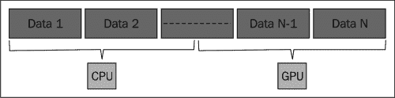
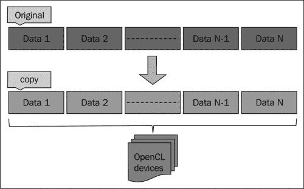
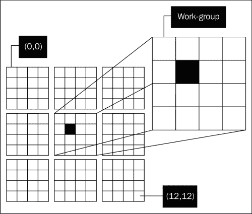

# 第二章：理解 OpenCL 数据传输和分区

在本章中，我们将介绍以下食谱：

+   创建 OpenCL 缓冲区对象

+   获取关于 OpenCL 缓冲区对象的信息

+   创建 OpenCL 子缓冲区对象

+   获取关于 OpenCL 子缓冲区对象的信息

+   理解事件和事件同步

+   在内存对象之间复制数据

+   使用工作项来分区数据

# 简介

在本章中，我们将探讨如何调用 OpenCL 的数据传输 API，查询内存对象，以及 GPU 和 CPU 之间的数据/工作分区。

### 小贴士

注意，并非所有 OpenCL SDK 都支持在 GPU 和 CPU 上同时编译和执行。AMD 的 OpenCL 实现支持其自己的 AMD 和 Intel CPU 以及 GPU；NVIDIA 支持其 GPU，而 Intel 支持其自己的 Intel Core CPU 和 Intel HD Graphics。请咨询供应商以了解支持的设备。

在**开放计算语言**（**OpenCL**）的开发中，你不可避免地需要处理数据，而该标准不允许你直接操作内存对象，就像你在 C 或 C++编程时做的那样，因为在异构环境中，主机中的数据内存最终会被传输到设备上进行处理，之前你会使用各种库或语言的编程结构来访问它们，这也是 OpenCL 出现的原因之一；因此，为了统一这些方法，标准添加了抽象来保护开发者免受这些问题的困扰。

在数据类型方面，除了单维数据缓冲区之外，还有一些你需要注意的类型。OpenCL 缓冲区对象可以用来加载和存储二维/三维数据。OpenCL 中的下一个数据类型是`image`对象；这些对象用于存储二维或三维图像（本书不会过多涉及`image`对象的使用）。

OpenCL 1.1 的新数据传输功能包括以下内容：

+   使用子缓冲区对象将缓冲区的区域分布到多个 OpenCL 设备上

+   3 分量向量数据类型

+   使用全局工作偏移，它使内核能够在 NDRange 的不同部分上操作——全局工作偏移指的是输入数据中的数据点，工作项可以从那里开始处理

+   读取、写入或复制缓冲区对象的 1D、2D 或 3D 矩形区域

# 创建 OpenCL 缓冲区对象

在上一章中，我们了解了创建或包装我们的主机内存对象到 OpenCL 可以操作的一种抽象的需要，在本食谱中，我们将探讨如何创建规范中定义的特定类型的内存对象，这种对象通常用于通用计算——缓冲区对象。开发者可以选择创建一个一维、二维或三维的内存对象，以最适合计算模型。

在 OpenCL 中创建缓冲区对象很简单，类似于您使用 C 的内存分配例程（如`malloc`和`alloca`）的方式。但是，相似之处到此为止，因为 OpenCL 不能直接操作由这些例程创建的内存结构。您可以做的只是创建一个存在于设备上的内存结构，该结构可以映射到主机上的内存，并通过向命令队列（您记得这是通往设备的通道）发出内存传输命令来将数据传输到设备。您需要决定的是对象的类型，以及您希望设备计算多少这样的对象。

在这个例子中，我们将学习如何根据用户定义的结构创建缓冲区对象，也称为 C/C++语言中的`structs`。在那之前，让我们了解 API：

```py
cl_mem clCreateBuffer(cl_context context,
                      cl_mem_flags flags,
                      size_t size,
                      void* host_ptr,
                      cl_int* errcode_ret)
```

您可以通过指定它应该附加到的`上下文`来创建一个缓冲区（记住上下文可以通过多个设备创建），指定数据的大小，以及如何使用`size`和`host_ptr`分别引用它，通过`flags`指定内存的分配方式和内存类型是只读、只读、读写或只写；最后在`errcode_ret`中捕获结果错误代码。请注意，`clCreateBuffer`不会将命令排队以从主机到设备内存进行内存传输。

## 准备工作

下面是`Ch2/user_buffer/user_buffer.c`代码的一部分，您将看到如何使用`clCreateBuffer` API 为用户定义的结构分配内存。在这个例子中，我们试图解决的问题是将一百万个用户定义的结构发送到设备进行计算。内核封装的计算非常简单——计算每个用户结构的所有元素的总和。细心的读者会注意到我们本可以用 OpenCL 的向量数据类型`int4`来演示这个数据结构；我们没有那样做的原因有两个：一是这是一个应用领域建模的例子，二是由于在当前的一小段文字中，我们想要展示如何使用数据类型对齐构造，现在不要担心数据类型，因为我们在下一章将深入探讨各种数据类型。继续前进，用户定义的结构如下：

```py
typedef struct UserData {
 int x;
 int y;
 int z;
 int w;
} UserData;
```

您需要做的是在主机应用程序中使用标准的 C/C++动态/静态内存分配技术，如`new`、`malloc`和`alloca`来创建一个缓冲区。接下来，您需要初始化该数据缓冲区，最后您必须调用`clCreateBuffer`，并确保在调用`clSetKernelArg`之前完成；记住我们提到内核在执行设备上的内核代码之前会被调度到设备上，它需要数据和值来工作，您可以通过调用`clSetKernelArg`来实现这一点，通常在创建缓冲区对象时这样做。

API `clSetKernelArg`看起来像以下代码，并且理解它是如何工作的将非常重要：

```py
cl_int clSetKernelArg(cl_kernel kernel,
                      cl_uint arg_index,
                      size_T arg_size,
                      const void *arg_value);
```

内核可以没有参数，或者至少有一个，可能还有更多参数，配置它们很简单。以下代码片段应该能完成这个故事：

```py
// in the kernel code
_kernel void somefunction(__global int* arg1, __global int* arg2) {…} 
// in the host code
int main(int argc, char**argv) {
// code omitted
cl_kernel kernel; 
// kernel is initialized to point to "somefunction" in the kernel file
clSetKernelArg(kernel, 0, sizeof(cl_mem), (void*) &memoryobjectA);
clSetKernelArg(kernel, 1, sizeof(cl_mem), (void*) &memoryobjectB);
```

因此，内核参数以编程方式配置，理解如果内核函数有`n`个参数，则`arg_index`的范围将从`0`到`n - 1`。

## 如何做到这一点…

我们从`Ch2/user_buffer/user_buffer.c`中包含了此菜谱的主要部分，并带有高亮注释：

```py
/* Defined earlier */
#define DATA_SIZE 1048576
UserData* ud_in = (UserData*) malloc(sizeof(UserData) *
                                     DATA_SIZE); // input to device
/* initialization of 'ud_in' is omitted. See code for details.*/
/* Create a OpenCL buffer object */
cl_mem UDObj = clCreateBuffer(context, 
                              CL_MEM_READ_ONLY |
                              CL_MEM_COPY_HOST_PTR, 
                              sizeof(UserData) * DATA_SIZE,
                              ud_in, &error);
if (error != CL_SUCCESS) {
  perror("Unable to create buffer object");
  exit(1)
}
```

在 OSX 上，你可以在终端运行以下命令来编译程序：

```py
gcc -std=c99 -Wall -DUNIX -g -DDEBUG -DAPPLE -arch i386 -o user_buffer user_buffer.c   -framework OpenCL

```

在带有 Intel OpenCL SDK 的 Ubuntu Linux 12.04 上，命令将如下所示：

```py
gcc -std=c99 -Wall -DUNIX -g -DDEBUG -m64 -o user_buffer user_buffer.c -I . -I /usr/include -L/usr/lib64/OpenCL/vendors/intel -lintelocl -ltbb -ltbbmalloc -lcl_logger -ltask_executor

```

在带有 AMD APP SDK v2.8 的 Ubuntu Linux 12.04 上，命令将如下所示：

```py
gcc -std=c99 -Wall -DUNIX -g -DDEBUG –m64 -o user_buffer user_buffer.c   -I. –I/opt/AMDAPP/include –L/opt/AMDAPP/lib/x86_64 –lOpenCL

```

无论平台如何，都会在本地存储一个二进制可执行文件`user_buffer`。

### 注意

在两个平台上运行应用程序，我们会得到以下结果：

```py
Number of OpenCL platforms found: 1
Kernel name: hello with arity: 1
About to create command queue and enqueue this kernel...
Task has been enqueued successfully!
Check passed!

```

## 它是如何工作的…

应用程序在主机上创建了百万个`UserData`对象。参考以下代码片段：

```py
/*
  Prepare an array of UserData via dynamic memory allocation
*/
UserData* ud_in = (UserData*) malloc( sizeof(UserData) * DATA_SIZE); // input to device
UserData* ud_out = (UserData*) malloc( sizeof(UserData) * DATA_SIZE); // output from device
  for( int i = 0; i < DATA_SIZE; ++i) {
    (ud_in + i)->x = i;
    (ud_in + i)->y = i;
    (ud_in + i)->z = i;
    (ud_in + i)->w = 3 * i;
  }
```

应用程序在程序和内核对象初始化后将其发送到设备进行计算，并将最近创建的`UDObj`内存对象分配给内核作为其参数。参考以下代码片段：

```py
error = clSetKernelArg(kernels[i], 0, sizeof(cl_mem), &UDObj);
  if (error != CL_SUCCESS) {
    perror("Unable to create buffer object");
      exit(1);
  }
```

接下来，我们向命令队列`cQ`发出内核执行命令，代码将在设备上运行，以下代码片段演示了内核的入队：

```py
  /* Enqueue the kernel to the command queue */
  error = clEnqueueTask(cQ, kernels[i], 0, NULL, NULL);
    if (error != CL_SUCCESS) {
      perror("Unable to enqueue task to command-queue");
      exit(1);
    }
```

之后，将设备内存中的数据读回，我们表示我们希望读取数据直到设备完成其执行，通过传递`CL_TRUE`来指示阻塞读取，否则可能会导致读取部分数据；最后，数据通过以下代码片段进行验证：

```py
/* Enqueue the read-back from device to host */
            error = clEnqueueReadBuffer(cQ, UDObj,
                                         CL_TRUE, // blocking read
                                         0, // write from the start
                                         sizeof(UserData) * DATA_SIZE, // how much to copy
                                         ud_out, 0, NULL, NULL);
    if ( valuesOK(ud_in, ud_out) ) {
      printf("Check passed!\n");
    } else printf("Check failed!\n");
```

让我们进一步探索如何使用`clCreateBuffer`。

在这种情况下，当向设备提供输入并且你想要确保没有其他东西正在写入数据存储时，你希望在设备上分配只读内存。因此，传递了标志`CL_MEM_READ_ONLY`，但如果你的输入数据旨在可读和可写，那么你需要使用`CL_MEM_READ_WRITE`来指示它。注意，我们实际上通过`ud_in`在主机上创建了一个数据存储，并且我们希望我们的 OpenCL 内存对象与`ud_in`和`C`语句的大小相同；最后，我们希望 OpenCL 知道新的内存对象将从`ud_in`复制其值，我们也提供了标志`CL_MEM_COPY_HOST_PTR`，并且我们使用标准美国键盘上表示为管道符号的位运算符`|`来合并这两个标志。

从概念上讲，你可以将其视为一个结构体的一维数组，或者更一般地说，是一个结构体数组。

| `UserData` | `UserData` | `UserData` | …………………………………………… | `UserData` |
| --- | --- | --- | --- | --- |

### 提示

将相同的应用数据类型声明提供给 OpenCL 内核文件（`*.cl`）以及主机应用程序文件（`*.c`, `*.h`, `*.cpp`, `*.hpp`）；否则，OpenCL 运行时会发出错误，以反映它正在寻找的结构不存在，并且复制是必要的，因为 OpenCL 禁止 `C` 头文件包含机制。

让我们花些时间来理解我们在本例中使用的 C `struct`。我们刚刚使用的 C 结构 `UserData` 是一个应用数据类型的例子。OpenCL 对缓冲区和图像之外的 OpenCL 数据类型的对齐没有要求；因此，OpenCL 开发者需要确保数据得到适当的对齐。幸运的是，OpenCL 提供了属性限定符，这样我们就可以注释我们的类型、函数和变量，以适应算法和 CPU/GPU 架构，主要动机是提高内存带宽。对齐必须是 2 的幂，并且至少是结构或联合中所有成员对齐的最小公倍数的完美倍数。

### 注意

请参阅 OpenCL 1.2 规范中的第 6.11.1 节“指定类型的属性”

让我们看看当涉及到对 `enum`、`struct` 或 `union` 等数据类型进行对齐时，开发者可以有哪些选择。

数据对齐是各种计算机系统限制原始数据类型允许地址的直接结果，要求某些类型对象的地址必须是某个值 *K*（通常是 2、4 或 8）的倍数，这实际上简化了处理器和内存系统之间硬件的设计。例如，如果处理器总是从地址必须是 8 的倍数的内存中获取 8 字节，那么值可以在单一内存操作中读取或写入，否则，处理器需要执行两个或更多的内存访问。

通过确保每个数据类型中的每个对象都按照满足其对齐限制的方式组织和分配来强制执行对齐。

让我们用一个例子来说明这一点。以下是为应用数据类型如 `UserData` 定义对齐的通用方式。在检查代码时，您会注意到如果没有 `aligned` 属性，这个数据结构将在假设 `int` 是 4 字节且 `char` 是 1 字节（在 32 位/64 位系统架构上）的情况下，分配在 17 字节边界上。一旦包含了这个属性，对齐如下：

```py
| __attribute__((aligned))
```

现在对齐由 OpenCL 编译器确定为 32 字节对齐，而不是 17 字节，即求所有结构成员的大小之和，规范指定对齐大小为最大的 2 的幂，因此它是 25，因为 24 多了 1 字节；然而，如果您将之前的对齐更改为以下对齐：

```py
| __attribute__((aligned (8)))
```

然后，对齐至少为 8 字节，如下面的代码所示：

```py
typedef struct __attribute__((aligned)) UserData {
    int x;
    int y;
    int z;
    int w;
    char c;
} UserData;
```

同样，你也可以更明确地写成如下形式：

```py
typedef struct __attribute__((aligned(32)) UserData {…}
```

通常，设计数据以内存对齐的金科玉律仍然是必要的实践；我牢记的一个经验法则是，对于 128 位访问，16 字节对齐，对于 256 位访问，32 字节对齐。

在故事的另一面，你可能发现自己希望对齐程度不是那么大，使用 OpenCL 你可以通过使用 `packed` 属性来表示这一点，如下面的代码所示，假设 `LargeUserData` 是一个假想的大型数据结构：

```py
typedef struct __attribute__((packed)) LargeUserData {…}
```

当你将此属性应用于 `struct` 或 `union` 时，你实际上是将属性应用于数据的每个成员；应用于 `enum` 意味着 OpenCL 编译器将选择在该架构上找到的最小整型。你可以参考 `Ch2/user_buffer_alignment/user_buffer_align.c` 来查看所做的工作以及如何通过 AMD APP SDK 在 `readme.txt` 文件中通过性能分析来分析应用程序。 

# 检索 OpenCL 缓冲区对象的信息

要检索有关缓冲区或子缓冲区对象的信息，你需要使用 API `clGetMemObjectInfo` 以及其签名，如下面的代码所示：

```py
cl_int clGetMemObjectInfo(cl_mem memobj,
                          cl_mem_info param_name,
                          size_t param_value_size,
                          void* param_value,
                          size_t* param_value_size_ret)
```

要查询内存对象，只需将对象传递给 `memobj`，指定你想要在 `param_name` 中获取的信息类型，通知 OpenCL 返回信息的尺寸在 `param_value_size` 中，以及在哪里存储它（`param_value`）；最后一个参数 `param_value_size_ret` 大部分是可选的，但它返回 `param_value` 中值的尺寸。

## 准备工作

下面是从 `Ch2/buffer_query/buffer_query.c` 代码中摘录的一段，展示了如何提取内存对象的信息，`UDObj` 被封装到一个用户定义的函数 `displayBufferDetails` 中，因为代码可能很长，这取决于你希望从内存对象中提取多少属性，你会在创建缓冲区对象之后或如果你已经得到了内存对象的句柄时调用此函数。以下代码演示了如何通过将 OpenCL 内存检索 API 抽象到函数 `displayBufferDetails` 中来显示内存对象的信息：

```py
cl_mem UDObj = clCreateBuffer(context, … sizeof(UserData) *                
                              DATA_SIZE, ud_in, &error);
/* Extract some info about the buffer object we created */
displayBufferDetails(UDObj);
```

## 如何做到这一点…

我们已经包括了此菜谱的主要部分，如下面的代码所示：

```py
void displayBufferDetails(cl_mem memobj) {
  cl_mem_object_type objT;
  cl_mem_flags flags;
  size_t memSize;
  clGetMemObjectInfo(memobj, CL_MEM_TYPE,
                     sizeof(cl_mem_object_type), &objT, 0);
  clGetMemObjectInfo(memobj, CL_MEM_FLAGS, sizeof(cl_mem_flags),
                     &flags, 0);
  clGetMemObjectInfo(memobj, CL_MEM_SIZE, sizeof(size_t),
                     &memSize, 0);
  char* str = '\0';
  switch (objT) {
    case CL_MEM_OBJECT_BUFFER: str = "Buffer or Sub
                                      buffer";break;
    case CL_MEM_OBJECT_IMAGE2D: str = "2D Image Object";break;
    case CL_MEM_OBJECT_IMAGE3D: str = "3D Image Object";break;
  }
  char flagStr[128] = {'\0'};
  if(flags & CL_MEM_READ_WRITE) strcat(flagStr, "Read-Write|");
  if(flags & CL_MEM_WRITE_ONLY) strcat(flagStr, "Write Only|");
  if(flags & CL_MEM_READ_ONLY)  strcat(flagStr, "Read Only|");
  if(flags & CL_MEM_COPY_HOST_PTR) strcat(flagStr, "Copy from
                                                    Host|");
  if(flags & CL_MEM_USE_HOST_PTR)  strcat(flagStr, "Use from
                                                    Host|");
  if(flags & CL_MEM_ALLOC_HOST_PTR) strcat(flagStr, "Alloc from
                                                     Host|");
  printf("\tOpenCL Buffer's details =>\n\t size: %lu MB,\n\t object type is: %s,\n\t flags:0x%lx (%s) \n", memSize >> 20, str, flags, flagStr);
}
```

在 OSX 上，你将通过在终端运行以下命令来编译程序：

```py
gcc -std=c99 -Wall -DUNIX -g -DDEBUG -DAPPLE -arch i386 -o buffer_query buffer_query.c   -framework OpenCL

```

在 Ubuntu Linux 12.04 上使用 Intel OpenCL SDK，命令将如下所示：

```py
gcc -std=c99 -Wall -DUNIX -g -DDEBUG -m64 -o buffer_query buffer_query.c -I . -I /usr/include -L/usr/lib64/OpenCL/vendors/intel -lintelocl -ltbb -ltbbmalloc -lcl_logger -ltask_executor

```

在 Ubuntu Linux 12.04 上使用 AMD APP SDK v2.8，命令将如下所示：

```py
gcc -std=c99 -Wall -DUNIX -g -DDEBUG –m64 -o buffer_query buffer_query.c   -I. –I/opt/AMDAPP/include –L/opt/AMDAPP/lib/x86_64 –lOpenCL

```

不论是哪个平台，一个名为 `buffer_query` 的二进制可执行文件将被本地存储。

在 OSX 10.6 和 Ubuntu 12.04 上使用 AMD APP SDK v2.7 运行程序将呈现以下结果：

```py
Number of OpenCL platforms found: 1
Kernel name: hello with arity: 1
About to create command queue and enqueue this kernel...
  OpenCL Buffer's details =>
    size: 128 MB,
    object type is: Buffer or Sub-buffer,
    flags:0x21 (Read-Write|Copy from Host)
Task has been enqueued successfully!
Check passed!
```

## 它是如何工作的…

主应用程序首先创建它将发送到设备的缓冲区，然后应用程序查询有关缓冲区的信息。可以查询的完整属性列表如下表所示：

| cl_mem_info | 返回类型 | 在 param_value 中返回的信息。 |
| --- | --- | --- |
| `CL_MEM_TYPE` | `cl_mem_object_type` | 如果`memobj`是通过`clCreateBuffer`或`clCreateSubBuffer`创建的，则返回`CL_MEM_OBJECT_BUFFER`。 |
| `Cl_MEM_FLAGS` | `cl_mem_flags` | 返回创建`memobj`时指定的标志参数。使用`clCreateBuffer`、`clCreateSubBuffer`、`clCreateImage2D`或`clCreateImage3D`创建`memobj`时返回。 |
| `CL_MEM_SIZE` | `size_t` | 返回与`memobj`关联的数据的实际大小（以字节为单位）。 |
| `CL_MEM_HOST_PTR` | `void*` | 如果`memobj`是通过`clCreateBuffer`或`clCreateImage2d`、`clCreateImage3D`创建的，则返回创建`memobj`时指定的`host_ptr`参数。如果`memobj`是通过`clCreateSubBuffer`创建的，则返回创建`memobj`时指定的`host_ptr`加上`origin`。参见`clCreateBuffer`了解`host_ptr`是什么。 |
| `CL_MEM_MAP_COUNT` | `cl_uint` | 映射计数。 |
| `CL_MEM_REFERENCE_COUNT` | `cl_uint` | 返回`memobj`的引用计数。 |
| `CL_MEM_CONTEXT` | `cl_context` | 返回创建内存时指定的上下文。如果`memobj`是通过`clCreateSubBuffer`创建的，则返回与内存对象关联的上下文，该上下文是作为`clCreateSubBuffer`的`buffer`参数指定的。 |
| `CL_MEM_ASSOCIATED_MEMOBJECT` | `cl_mem` | 返回创建`memobj`的内存对象。在`clCreateSubBuffer`中，它返回`buffer`参数；否则返回 NULL。 |
| `CL_MEM_OFFSET` | `size_t` | 适用于通过`clCreateSubBuffer`创建的`memobj`。它返回偏移量或 0。 |

# 创建 OpenCL 子缓冲区对象

子缓冲区是非常有用的数据类型，随着你继续在本章中探索 OpenCL，你会注意到这种数据类型可以用来划分数据并将它们分布到你的平台上的 OpenCL 设备上。

### 注意

在撰写本文时，OSX 10.6 中提供的 OpenCL 的子缓冲区支持尚未启用，因为官方版本是 OpenCL 1.0。然而，如果你有 OSX 10.7，那么你将能够无任何问题地运行此代码。

让我们看看方法签名并检查它：

```py
cl_mem clCreateSubBuffer(cl_mem buffer,
                         cl_mem_flags flags,
                         cl_buffer_create_type bufferType,
                         const void* buffer_create_info,
                         cl_int* errcode_ret)
```

参数`buffer`指的是通过`clCreateBuffer`创建的缓冲区，`flags`参数指的是你希望此选项具有的选项，如果为零，则默认选项为`CL_MEM_READ_WRITE`；此标志可以采用前表中任何值。参数`bufferType`是一个数据结构：

```py
typedef struct _cl_buffer_region {
  size_t origin;
  size_t size;
} cl_buffer_region;
```

因此，你通过`origin`参数指示创建区域的起始位置，并通过`size`参数指示它的大小。

## 准备工作

在本食谱的“如何做...”部分，有来自`Ch2/sub_buffers/sub_buffer.c`的摘录，其中我们创建了两个子缓冲区对象，每个对象包含一半的数据；这两个子缓冲区将发送到我的设置中的每个 OpenCL 设备上，它们将被计算并检查结果。从概念上讲，以下是代码所做的工作：



## 如何操作...

我们已经将此菜谱的主要部分包含在以下代码中：

**/* 在所有设备之间均匀分割数据并创建子缓冲区 */**

```py
  cl_buffer_region region;
  region.size   = (sizeof(UserData)*DATA_SIZE) / numOfDevices; 
  region.origin = offset * region.size;
  cl_mem subUDObj = clCreateSubBuffer(UDObj,
                                CL_MEM_READ_WRITE, // read-write
                                CL_BUFFER_CREATE_TYPE_REGION,
                                &region, &error);
  if (error != CL_SUCCESS) { 
    perror("Unable to create sub-buffer object");
    exit(1);
  }
```

**/* 让 OpenCL 知道内核应该接收一个参数 */**

```py
error = clSetKernelArg(kernels[j], 0, sizeof(cl_mem), &subUDObj);
// Error handling code omitted
```

如前所述，此应用程序在 OSX 10.6 上无法工作，因此要使用 AMD APP SDK 编译它，你需要输入以下命令：

```py
gcc –std=c99 –Wall –DUNIX –g –DDEBUG –m64 –o sub_buffer sub_buffer.c –I. –I/opt/AMDAPP/include –L/opt/AMDAPP/lib/x86_64 –lOpenCL

```

对于 Intel OpenCL SDK，你需要输入以下命令：

```py
gcc –std=c99 –Wall –DUNIX –g –DDEBUG –m64 –o sub_buffer sub_buffer.c –I. –I/usr/include 
–L/usr/lib64/OpenCL/vendors/intel
-lintelocl
-ltbb
-ltbbmalloc
-lcl_logger
-ltask_executor

```

对于 Ubuntu Linux 12.04 上的 NVIDIA，你需要输入以下命令：

```py
gcc –std=c99 –Wall –DUNIX –g –DDEBUG –m64 –o sub_buffer sub_buffer.c –I. –I/usr/local/cuda/include –lOpenCL

```

无论平台如何，二进制可执行文件`sub_buffer`都会被本地存储。

在我设置的 Ubuntu Linux 12.04 环境中，有一个 NVIDIA GTX460 显卡，安装了 NVIDIA 和 Intel 的 OpenCL 工具包，以下是我的输出结果：

```py
Number of OpenCL platforms found: 2
Number of detected OpenCL devices: 1
Kernel name: hello with arity: 1
About to create command queue and enqueue this kernel...
Task has been enqueued successfully!
Check passed!

```

在另一个 Ubuntu Linux 12.04 环境中，有一个 ATI 6870x2 显卡和 AMD APP SDK 安装的设置中，输出的差异仅在于平台数量为 1，数据在 CPU 和 GPU 之间分割：

```py
Number of OpenCL platforms found: 1
Number of detected OpenCL devices: 2
Kernel name: hello with arity: 1
About to create command queue and enqueue this kernel...
Task has been enqueued successfully!
Check passed!
Kernel name: hello with arity: 1
About to create command queue and enqueue this kernel...
Task has been enqueued successfully!
Check passed!

```

## 它是如何工作的...

应用程序基本上会发现所有符合 OpenCL 规范的设备，并跟踪其发现过程。接下来，应用程序使用先前信息在将数据入队执行之前将数据分配到各个设备上，以下代码片段展示了以下内容：

```py
cl_buffer_region region;
region.size   = (sizeof(UserData)*DATA_SIZE) / numOfDevices;
region.origin = offset * region.size;
cl_mem subUDObj = clCreateSubBuffer(UDObj,
                                    CL_MEM_READ_WRITE, // read-write
                                    CL_BUFFER_CREATE_TYPE_REGION,
                                    &region, &error);
```

最后，在从设备内存将数据读回到主机内存后，会检查数据的有效性，如下代码片段所示：

```py
error = clEnqueueReadBuffer(cQ, 
                            subUDObj,
                            CL_TRUE, // blocking read
                            region.origin, // write from the last offset
                            region.size, // how much to copy
                            ud_out, 0, NULL, NULL);
                /* Check the returned data */
                if ( valuesOK(ud_in, ud_out, DATA_SIZE/numOfDevices){
                  printf("Check passed!\n");
               } else printf("Check failed!\n");
```

你刚才看到的是一种数据分区技术，也称为一维数据块上的分布式数组模式。

### 注意

根据分布式数组模式，已经开发出三种一般技术，它们是一维和二维数据块，最后是块循环模式。

根据你是否安装了一个或多个供应商的 OpenCL 工具包，OpenCL 会报告适当的平台，并且 OpenCL **可安装客户端驱动程序**（**ICD**）允许多个 OpenCL 实现共存于同一台物理机器上。有关 ICD 的更多信息，请参阅 URL [`www.khronos.org/registry/cl/extensions/khr/cl_khr_icd.txt`](http://www.khronos.org/registry/cl/extensions/khr/cl_khr_icd.txt)。这解释了为什么你的程序可能为每个安装的平台显示不同的数字。ICD 实际上标识了在您设置的机器上提供 OpenCL 实现的供应商，其主要功能是向主机代码暴露平台，以便开发者可以选择运行相关算法。ICD 包含两条信息——（a）供应商 OpenCL 实现在文件系统上安装的库中的入口点，（b）用于识别该供应商提供的 OpenCL 扩展后缀的字符串。

# 获取 OpenCL 子缓冲区对象的信息

获取 OpenCL 子缓冲区信息的检索与之前菜谱中描述的非常相似，涉及到调用`clGetMemObjInfo`。让我们来看看它。

### 小贴士

OSX 注意事项——你需要至少 OpenCL 1.1 的实现来看到这个构建和运行；由于 OSX 10.6 不支持这个版本，你将需要获取 OSX 10.7 来运行这段代码。

## 准备工作

在`Ch2/sub_buffer_query/subbuffer_query.c`中，你可以找到以下代码的摘录，展示了我们如何将子缓冲区内存对象传递给我们的定义函数`displayBufferDetails`：

```py
cl_buffer_region region;
region.size = sizeof(UserData)*DATA_SIZE;
region.origin = 0;
cl_mem subUDObj = clCreateSubBuffer(UDObj,
                                    CL_MEM_READ_WRITE, // read-write
                                    CL_BUFFER_CREATE_TYPE_REGION,
                                    &region, &error);
displayBufferDetails(subUDObj);
```

### 小贴士

在我的实验过程中，我发现与 AMD 的 APP SDK v2.7 相比，NVIDIA CUDA 5 OpenCL 工具包在评估传递给`clCreateSubBuffer`的参数标志中的属性时更为严格。请注意，当你阅读这本书的时候，这个错误可能已经被修复了。作为一个具体的例子，以下代码在 NVIDIA 上运行时会抛出错误，而在 AMD 上则不会，当你编写以下内容时：

`clCreateSubBuffer(buffer,CL_MEM_READ_WRITE|CL_MEM_COPY_HOST_PTR,…)`以反映`CL_MEM_COPY_HOST_PTR`没有意义的事实。

## 如何去做…

我们已经包括了本菜谱的主要部分，如下面的代码所示：

```py
void displayBufferDetails(cl_mem memobj) {
  cl_mem_object_type objT;
  cl_mem_flags flags;
  size_t memSize;
  size_t memOffset;
  cl_mem mainBuffCtx;
  clGetMemObjectInfo(memobj, CL_MEM_TYPE,
                     sizeof(cl_mem_object_type), &objT, 0);
  clGetMemObjectInfo(memobj, CL_MEM_FLAGS, sizeof(cl_mem_flags),
                     &flags, 0);
  clGetMemObjectInfo(memobj, CL_MEM_SIZE, sizeof(size_t),
                     &memSize, 0);
  clGetMemObjectInfo(memobj, CL_MEM_OFFSET, sizeof(size_t),
                     &memOffset, 0); // 'CL_MEM_OFF_SET' new in OpenCL 1.2
  clGetMemObjectInfo(memobj, CL_MEM_ASSOCIATED_MEMOBJECT,
                     sizeof(size_t),
                     &memOffset, 0);
  char* str = '\0';
  if (mainBuffCtx) { // implies that 'memobj' is a sub-buffer
    switch (objT) {
      case CL_MEM_OBJECT_BUFFER: str = "Sub-buffer";break;
      case CL_MEM_OBJECT_IMAGE2D: str = "2D Image Object";break;
      case CL_MEM_OBJECT_IMAGE3D: str = "3D Image Object";break;
    }
  } else {
switch (objT) {
  case CL_MEM_OBJECT_BUFFER: str = "Buffer";break;
  case CL_MEM_OBJECT_IMAGE2D: str = "2D Image Object";break;
  case CL_MEM_OBJECT_IMAGE3D: str = "3D Image Object";break;
  } 
}
  char flagStr[128] = {'\0'};
  if(flags & CL_MEM_READ_WRITE) strcat(flagStr, "Read-Write|");
  if(flags & CL_MEM_WRITE_ONLY) strcat(flagStr, "Write Only|");
  if(flags & CL_MEM_READ_ONLY)  strcat(flagStr, "Read Only|");
  if(flags & CL_MEM_COPY_HOST_PTR) strcat(flagStr, "Copy from
                                                    Host|");
  if(flags & CL_MEM_USE_HOST_PTR)  strcat(flagStr, "Use from
                                                    Host|");
  if(flags & CL_MEM_ALLOC_HOST_PTR) strcat(flagStr, "Alloc from
                                                     Host|");
  printf("\tOpenCL Buffer's details =>\n\t size: %lu MB,\n\t object type is: %s,\n\t flags:0x%lx (%s) \n", memSize >> 20, str, flags, flagStr);
}
```

在 Ubuntu Linux 12.04 和 AMD 的 APP SDK v2.8 上，以下命令就足够了：

```py
gcc –std=c99 –Wall –DUNIX –g –DDEBUG –m64 –o subbuffer _query subbuffer_query.c –I. –I/opt/AMDAPP/include –L/opt/AMDAPP/lib/x86_64 –lOpenCL

```

对于 Intel OpenCL SDK，你需要输入以下命令：

```py
gcc –std=c99 –Wall –DUNIX –g –DDEBUG –m64 –o subbuffer_query subbuffer_query.c –I. –I/usr/include 
–L/usr/lib64/OpenCL/vendors/intel
-lintelocl
-ltbb
-ltbbmalloc
-lcl_logger
-ltask_executor

```

对于 Ubuntu Linux 12.04 上的 NVIDIA，你需要输入以下命令：

```py
gcc –std=c99 –Wall –DUNIX –g –DDEBUG –m64 –o subbuffer_query subbuffer_query.c –I. –I/usr/local/cuda/include –lOpenCL

```

不论是哪个平台，一个二进制可执行文件`subbuffer_query`都会被本地存储。

当你运行程序时，你应该得到以下类似的输出：

```py
Number of OpenCL platforms found: 2
Kernel name: hello with arity: 1
About to create command queue and enqueue this kernel...
    OpenCL Buffer's details =>
    size: 128 MB,
   object type is: Buffer,
    flags:0x21 (Read-Write|Copy from Host|) 
    OpenCL Buffer's details =>
    size: 128 MB,
    object type is: Sub-buffer,
    flags:0x1 (Read-Write|) 
Task has been enqueued successfully!
Check passed!
```

## 它是如何工作的…

应用程序能够解析它是否是一个 OpenCL 子缓冲区对象，这要归功于 OpenCL 1.2 中引入的两个标志。它们是`CL_MEM_OFFSET`和`CL_MEM_ASSOCIATED_MEMOBJECT`；使用任一标志都可以揭示它是否是一个子缓冲区，但要注意的是，对于子缓冲区，`CL_MEM_OFFSET`可以是零，因为这表示 OpenCL 从哪里开始提取数据；一个更好、更推荐的选择是使用`CL_MEM_ASSOCIATED_MEMOBJECT`，因为它的存在意味着参数`memobj`是一个子缓冲区。参见之前的菜谱，*获取 OpenCL 缓冲区对象信息*。

# 理解事件和事件同步

之前的菜谱展示了如何创建封装要从一个主机内存传输到设备内存的数据的内存对象，并讨论了如何通过子缓冲区将输入数据分配到各个设备。

在这个菜谱中，我们将探讨开发者如何利用 OpenCL 的事件系统来控制内核命令以及内存命令的执行。这对开发者来说是有益的，因为它提供了多种控制异构环境中执行流程的方法。

当开发者希望被通知某个事件发生，并可以选择对那个事件之后进行处理的操作时，事件通常是一种被动的机制；与轮询（polling）相对，轮询是一种更主动的机制，因为应用程序会主动查询当前状态，并在满足特定条件时决定下一步操作。

OpenCL 中的事件分为以下两类：

+   主机监控事件

+   命令事件

在这两种事件类型中，开发者需要显式创建事件，并通过等待列表（waitlists）将它们与对象关联起来；等待列表实际上只是一个容器，其中包含命令必须等待完成的事件，也就是说，在执行下一个命令之前，事件的状态必须是`CL_COMPLETE`或`CL_SUCCESS`。这两种事件类型（正如我们很快将看到的）之间的区别在于队列中下一个后续命令的执行方式，主机事件由开发者更新，当完成更新时，程序源会指示这一点；另一方面，等待列表上的命令事件由 OpenCL 运行时更新。考虑到在等待列表中保留的事件必须在执行下一个命令之前达到某种状态，这意味着等待列表实际上是同步点，因为没有清空该列表就无法取得进展。

让我们先来检查主机事件。到目前为止，我们已经了解到需要将命令放入命令队列，以便它们可以被调度执行，而主机监控事件允许开发者监控已入队的命令状态，并且我们可以选择性地将回调函数附加到事件上，以便当它返回我们期望的状态时，回调函数将执行。这是通过 API `clCreateUserEvent`、`clSetUserEventStatus`、`clReleaseEvent`和`clSetEventCallback`实现的。在*如何操作*部分的一个示例将说明如何实现这一点。

## 准备工作

假设一个内核希望处理两个名为`objA`和`objB`的 1D 内存对象，并将结果写入`objC`（对于这个例子，我们可以忽略`objC`的输出）。我们希望从`objB`复制输入数据只在我们指示主机程序时进行。

## 如何操作...

完整的源代码在`Ch2/events/{events.c,sample_kernel.cl}`中演示，我们必须首先创建必要的数据结构，就像之前一样；接下来，我们将创建事件对象，如下所示：

```py
event1 = clCreateUserEvent(context, &ret);
```

在此事件对象中，我们接下来可以为事件分配一个回调函数，并指示当事件的状态变为`CL_COMPLETE`时，回调函数将像以下代码那样执行：

```py
void CL_CALLBACK postProcess(cl_event event, cl_int status, void *data) {
  printf("%s\n", (char*)data);
}
clSetEventCallback(event1, CL_COMPLETE, &postProcess, "Looks like its done.");
```

然后，主机程序将继续为`objA`和`objB`执行内存传输，但不会继续处理命令队列上排队的任何更多 OpenCL 命令，直到`event1`的状态设置为`CL_COMPLETE`。

```py
ret = clEnqueueWriteBuffer(command_queue, objA, CL_TRUE, 0, 4*4*sizeof(float), A, 0, NULL, NULL );
  printf("A has been written\n");
  /* The next command will wait for event1 according to its status*/
  ret = clEnqueueWriteBuffer(command_queue, objB, CL_TRUE, 0, 4*4*sizeof(float), B, 1, &event1, NULL);
  printf("B has been written\n");
clSetUserEventStatus(event1, CL_COMPLETE);
//….code omitted
clReleaseEvent(event1);
```

我们将要介绍的另一个 API 是`clWaitForEvents`，其签名如下：

```py
Cl_int clWaitForEvents(cl_uint num_events, const cl_event* event_list);
```

这通常用于使主线程暂停，直到事件列表中的所有命令都完成（下一个代码片段将演示如何实现）。

我们接下来要讨论的主题是命令事件，通常在你想被通知与命令相关联的某些事件时使用。一个典型的用例如下，你有一个命令队列，你希望被通知内存传输命令（如 `clEnqueueWriteBuffer`）的状态，并根据该状态采取特定行动：

```py
cl_event event1;
// create memory objects and other stuff
ret = clEnqueueWriteBuffer(queue, object, CL_TRUE, 0, 1048576, hostPtrA, 1, &event1, NULL);
clWaitForEvents(&event1); // stalls the host thread until 'event1' has a status of CL_COMPLETE.
```

你可以很容易地推断出你有一个大型异构计算环境，有大量的 CPU 和 GPU，显然你希望最大化你的计算能力，OpenCL 中的事件机制允许开发者设计如何排序这些计算并协调这些计算。然而，作为最佳实践，你可能希望清理与命令关联的事件对象，但你需要发现你正在观察的事件的状态，否则你可能会提前释放事件，以下是如何通过轮询 API `clGetEventInfo` 并传入你正在观察的事件来完成这一操作；以下代码演示了这个想法：

```py
int
waitAndReleaseEvent(cl_event* event) {
  cl_int eventStatus = CL_QUEUED;
  while(eventStatus != CL_COMPLETE) {
    clGetEventInfo(*event, 
                   CL_EVENT_COMMAND_EXECUTION_STATUS,
                   sizeof(cl_int), 
                   &eventStatus, NULL);
  }
  clReleaseEvent(*event);
  return 0;
}
```

## 还有更多…

有两种情况值得提及，它们涉及到（a）你希望为事件组接收通知（假设它们与内存对象相关联）和（b）你希望暂停管道中任何命令的执行，即命令队列，直到你正在观察的这一组事件完成。API `clEnqueueMarkerWithWaitList` 用于前者，而 `clEnqueueBarrierWithWaitList` 适用于后者。你被鼓励在 OpenCL 1.2 规范中探索它们。

### 注意

如果你仍在使用 OpenCL 1.1，你可以使用 `clEnqueueMarker` 和 `clEnqueueBarrier`（它们是 `clEnqueueMarkerWithWaitList` 和 `clEnqueueBarrierWithWaitList` 的旧版本），但请注意，它们在 OpenCL 1.2 中都被弃用了。

# 在内存对象之间复制数据

你会很快意识到 OpenCL 中的事件机制在控制算法的各个部分时是多么有用，它可以在常见的内核和内存命令中找到。本食谱将从创建内存对象开始，重点关注这些内存对象如何从主机内存传输到设备内存，反之亦然，我们将专注于数据传输 API `clEnqueueReadBuffer` 和 `clEnqueueWriteBuffer`，这是用于一维数据块，以及 `clEnqueueReadBufferRect` 和 `clEnqueueWriteBufferRect` 用于二维数据块；我们还将查看 `clEnqueueCopyBuffer` 用于设备内存中内存对象之间的数据传输。首先，我们来看一下在内存对象之间复制数据。

有时会需要在不同内存对象之间复制数据，OpenCL 为我们提供了一个方便的方法，通过 `clEnqueueCopyBuffer` 来实现。这只能发生在两个不同的内存对象之间（例如，一个是普通缓冲区，另一个是子缓冲区）或者两个相似的对象之间（例如，两者都是子缓冲区或普通缓冲区），并且复制的区域不能重叠。以下是方法签名：

```py
cl_int clEnqueueCopyBuffer(cl_command_queue command_queue,
                           cl_mem src_buffer,
                           cl_mem dst_buffer,
                           size_t src_offset,
                           size_t dst_offset,
                           size_t cb,
                           cl_uint num_events_in_wait_list,
                           const cl_event* event_wait_list,
                           cl_event* event)
```

在内存对象之间复制数据的函数列表如下：

+   `clEnqueueCopyBuffer`

+   `clEnqueueCopyImage`

+   `clEnqueueCopyBufferToImage`

+   `clEnqueueCopyImageToBuffer`

+   `clEnqueueCopyBufferRect`

要复制一个缓冲区，你需要通过 `src_buffer` 和 `dst_buffer` 指示源和目标 `cl_mem` 对象，通过 `src_offset` 和 `dst_offset` 分别指示 `src_buffer` 和 `dst_buffer` 的偏移量以及要复制的数据大小通过 `cb`。如果你希望在某些操作之后进行数据复制，你需要指示这些操作的数量以及代表每个操作的 `cl_event` 对象的有效数组，分别通过 `num_events_in_wait_list` 和 `event_wait_list`。

### 小贴士

注意，你可以通过传递事件对象到 `event` 参数来查询设备复制状态，当你的数据数组很大时。另一种方法是排队一个 `clEnqueueBarrier` 命令。

## 准备就绪

以下代码是 `Ch2/copy_buffer/copy_buffer.c` 的摘录，它说明了如何将 `clEnqueueCopyBuffer` 命令排队到命令队列中，并且内核使用这个数据副本进行计算。这个过程在机器上检测到的所有 OpenCL 设备之间迭代。以下图解说明了原始数据块（前一个图）是如何复制到另一个 `cl_mem` 对象（下一个图）并传递给 OpenCL 设备进行计算的。



## 如何操作...

我们已经包括了这个菜谱的主要部分，并带有高亮注释：

```py
cl_mem UDObj = clCreateBuffer(context,
                              CL_MEM_READ_WRITE |
                              CL_MEM_COPY_HOST_PTR,
                              sizeof(UserData) * DATA_SIZE, 
                              ud_in, &error);
… // code omitted. See the source.
/* Create a buffer from the main buffer 'UDObj' */
cl_mem copyOfUDObj = clCreateBuffer(context, CL_MEM_READ_WRITE,	                                               
                                    sizeof(UserData) * DATA_SIZE,
                                    0, &error)
if (error != CL_SUCCESS) { 
  perror("Unable to create sub-buffer object");
  exit(1);
}
/* Let OpenCL know that the kernel is suppose to receive an argument */
error = clSetKernelArg(kernels[j], 
                       0,
                       sizeof(cl_mem),
                       &copyOfUDObj);
if (error != CL_SUCCESS) { 
  perror("Unable to set buffer object in kernel");
  exit(1);
}
// code omitted. See the source.
/* Enqueue the copy-write from device to device */
error = clEnqueueCopyBuffer(cQ,
                            UDObj,
                            copyOfUDObj,              
                            0,            // copy from which offset
                            0,            // copy to which offset
                            sizeof(UserData)*DATA_SIZE,
                            0, NULL, NULL);
printf("Data will be copied!\n");
// Code for enqueueing kernels is omitted.
/* Enqueue the read-back from device to host */
error = clEnqueueReadBuffer(cQ, 
                            copyOfUDObj, 
                            CL_TRUE,  // blocking read
                            0,        // read from the start
                            sizeof(UserData)*DATA_SIZE,
                            ud_out, 0, NULL, NULL);
```

在 OSX 上，你可以运行以下命令：

```py
gcc -std=c99 -Wall -DUNIX -g  -DAPPLE -arch i386 -o copy_buffer copy_buffer.c   -framework OpenCL

```

在安装了 Intel OpenCL SDK 的 Ubuntu Linux 12.04 上，你可以运行以下命令：

```py
gcc -std=c99 -Wall -DUNIX -g -DDEBUG -m64 -o copy_buffer copy_buffer.c -I . -I /usr/include -L/usr/lib64/OpenCL/vendors/intel -lintelocl -ltbb -ltbbmalloc -lcl_logger -ltask_executor

```

在安装了 NVIDIA CUDA 5 的 Ubuntu Linux 12.04 上，你可以运行以下命令：

```py
gcc -std=c99 -Wall -DUNIX -g -DDEBUG -m64 -o copy_buffer copy_buffer.c -I. -I/usr/local/cuda/include  -lOpenCL

```

一个名为 `copy_buffer` 的二进制可执行文件将被放置在目录中。

根据你的机器上安装了多少个 OpenCL SDK，你的输出可能会有所不同，但在我自己的 OSX 上，以下是这样的输出：

```py
Number of OpenCL platforms found: 1
Number of detected OpenCL devices: 2
Kernel name: hello with arity: 1
About to create command queue and enqueue this kernel...
Task has been enqueued successfully!
Data will be copied!
Check passed!
Kernel name: hello with arity: 1
About to create command queue and enqueue this kernel...
Task has been enqueued successfully!
Data will be copied!
Check passed!
```

## 它是如何工作的...

应用程序需要计算复制的缓冲区，你可以通过以下语句定义 `clSetKernelArg` 来判断这一点：

```py
error = clSetKernelArg(kernels[j], 0, sizeof(cl_mem), &copyOfUDObj);
```

接下来，我们可以通过 `clEnqueueCopyBuffer` 执行一个复制操作，该操作发生在设备的内存中，并通过 `clEnqueueReadBuffer` 最终检索计算出的值。

### 小贴士

创建的命令队列将默认为顺序执行，而不是乱序执行，因此设备将按照队列的顺序执行命令。

现在，我们将讨论一维和二维数据传输 API，如`clEnqueueReadBuffer`、`clEnqueueWriteBuffer`、`clEnqueueWriteBufferRect`和`clEnqueueReadBufferRect`，我们现在这样做是因为你已经看到，到目前为止，我们的大部分示例都是通过`clCreateBuffer`与主机中的内存结构关联来演示内存对象的创建，尽管这可能适用于某些情况，你可能希望有更多控制的 API，当设备内存中的内存对象需要写入或读取时。这些 API 给予开发者的控制，是因为它们被排入命令队列，并带有开发者可能创建的任何事件；这为在异构环境中构建 I/O 提供了良好的策略和灵活性。

### 注意

注意，有类似的 API 用于从主机到设备内存读取和写入二维或三维图像。它们的名称是`clEnqueueReadImage`、`clEnqueueWriteImage`、`clEnqueueReadImageRect`和`clEnqueueWriteImageRect`。有关更多详细信息，请参阅 OpenCL 1.2 规范。

这些 API 允许我们向设备指示我们希望数据传输何时发生，这与`clEnqueueCopyBuffer`非常相似。让我们看看它们的方法签名：

```py
cl_int clEnqueueReadBuffer(cl_command_queue command_queue,
                        cl_mem buffer,
                           cl_bool blocking_read, 
                           size_t offset,
                           size_t cb, 
                           void *ptr,
                           cl_uint num_events_in_wait_list,
                           const cl_event *event_wait_list,
                           cl_event *event)
cl_int clEnqueueWriteBuffer(cl_command_queue command_queue,
                        cl_mem buffer,
                           cl_bool blocking_write, 
                           size_t offset,
                           size_t cb, 
                           const void *ptr,
                           cl_uint num_events_in_wait_list,
                           const cl_event *event_wait_list,
                           cl_event *event)
```

这两个函数彼此非常相似，它们基本上说明如果你想要读写内存缓冲区，即`cl_mem`对象，你需要通过`command_queue`指定哪个命令队列，通过`buffer`指定哪个缓冲区，是否为阻塞读写通过`blocking_read/blocking_write`，通过`offset`和`cb`指定从哪里读取/写入什么大小的数据，通过`ptr`指定从哪里读取数据或写入数据到，是否在某个事件之后执行这个读写命令通过`num_events_in_wait_list`和`event_wait-list`。函数的最后一个参数是`event`，它允许查询读取或写入操作，这在`clEnqueueCopyBuffer`中有描述。

在`clEnqueuReadBuffer`中的阻塞读取意味着命令不会退出，直到主机指针被设备内存缓冲区填充；同样，在`clEnqueueWriteBuffer`中的阻塞写入意味着命令不会退出，直到整个设备内存缓冲区被主机指针写入。

要了解这些调用是如何使用的，你可以参考早期示例中的代码，在配方*理解事件和事件同步*中，为了方便起见，以下是在`Ch2/events/events.c`中的相关代码：

```py
ret = clEnqueueWriteBuffer(command_queue, objA, CL_TRUE, 0, 4*4*sizeof(float), A, 0, NULL, NULL );
ret = clEnqueueWriteBuffer(command_queue, objB, CL_TRUE, 0, 4*4*sizeof(float), B, 1, &event1, NULL);
```

能够模拟一维内存对象的能力非常棒，但 OpenCL 更进一步，通过促进二维内存对象内存传输。

这里是一个从设备内存读取二维数据块到主机内存输出缓冲区的示例；摘自`Ch2/simple_2d_readwrite/simple_2d_readwrite.c`。代码展示了如何使用`buffer_origin`、`host_origin`和`region`，正如 API 中所示。应用程序将从表示一维输入数据的`UDObj cl_mem`对象中读取，将其作为 2 x 2 矩阵写入由`outputPtr`表示的主机内存数据块。应用程序将从设备读取数据到主机内存，并检查数据是否合理。

```py
cl_int hostBuffer[NUM_BUFFER_ELEMENTS] = {0, 1, 2, 3, 4, 5, 6, 7,
                                          8,9,10,11,12,13,14,15};
cl_int outputPtr[16] = {-1, -1, -1, -1,-1, -1, -1, -1,-1, -1, -1, 
                        -1,-1, -1, -1, -1};
for(int idx = 0; idx < 4; ++ idx) {	
    size_t buffer_origin[3] = {idx*2*sizeof(int), idx, 0}; 
    size_t host_origin[3] = {idx*2*sizeof(int), idx, 0}; 
    size_t region[3] = {2*sizeof(int), 2, 1};
error = clEnqueueReadBufferRect (cQ,
                                 UDObj,
                                 CL_TRUE,
                                 buffer_origin,
                                 host_origin,
                                 region,
                                 0, //buffer_row_pitch,
                                 0, //buffer_slice_pitch,
                                 0, //host_row_pitch,
                                 0, //host_slice_pitch,
                                 outputPtr,
                                 0, NULL, NULL);
}//end of for-loop
```

在这个例子中，我们使用了`C`语言中的`for`循环和标准数组索引技术来模拟如何遍历二维数组并引用元素，以便我们逐步复制输入。我们不会过多地深入这个话题，因为构建和运行它与之前非常相似，你应该探索目录以了解如何通过 Makefile 构建和运行程序。

# 使用工作项来分区数据

在上一章中，我们介绍了如何在多个工作项之间对一维数组进行分区（如果你现在记不起来的话，应该翻回来看），以及每个工作项将如何获得一个索引，内核可以使用这个索引在内核代码`vector_multiplication`中进行计算。在本食谱中，我们将在此基础上，更详细地探索二维数据分区。

到现在为止，你应该意识到 OpenCL 的一个基石是将数据通过内核传输到设备/进行处理，你已经看到了数据如何通过内核在不同设备之间进行分区。在前者中，你看到了我们如何使用分布式数组模式将数据分区到设备中；这指的是粗粒度数据并行性。后者指的是 OpenCL 提供的粗粒度任务并行性，它之所以是粗粒度的，是因为 OpenCL 既能实现数据并行性，也能实现任务并行性。

你到目前为止看到的代码大部分都使用了`clEnqueueTask`来根据一维数据块执行内核，并且为了让内核处理二维或三维数据，我们需要理解`clEnqueueNDRangeKernel`；以及如何在二维或三维空间中概念性地布局数据。

### 小贴士

在设备内存中可视化二维或三维数据布局为基于行而不是基于列是有帮助的。

`clEnqueueNDRangeKernel`中的`NDRange`指的是一种数据索引方案，它应该跨越一个 N 维值的范围，因此得名。目前，在这个 N 维索引空间中，*N*可以是 1、2 或 3。接下来，我们可以将每个维度分成大小为 2、3、4 或更大的块，直到达到参数`CL_DEVICE_MAX_WORK_ITEM_DIMENSIONS`允许的最大值。有关如何获取值的说明，请参阅`Ch1/device_details/device_details.c`。这将决定我们可以并行运行多少个处理组，在 OpenCL 中它们被称为**工作组**。工作组将有一些可用的处理单元，这些单元被称为**工作项**，尽管我喜欢把它们看作是可执行的线程。

让我们通过一个例子来理解，使用 12 行 12 列的二维数据大小，即一个 12 x 12 的矩阵。让我们看一下以下图表，以了解工作组和工作项之间的关系：



在这个例子中，我决定将二维空间划分为九个工作组，其中每个工作组是一个 4 x 4 的矩阵。接下来，为了决定每个工作组中应该有多少个工作项，你有两个选择：a) 将一个工作项分配给处理 4 x 4 矩阵中的每个单元格，b) 将一个工作项分配给处理 4 x 4 矩阵中的 n 个单元格；在第二种情况下，它类似于向量处理，其中 n 个值一起加载以供工作项处理。让我们假设我们已经决定选择选项 a

### 提示

我们将在第三章中查看各种数据类型，*理解 OpenCL 数据类型*。

现在，让我们详细看看 API `clEnqueueNDRangeKernel`及其以下方法签名，并了解如何通过我们的例子输入这些值：

```py
cl_int
clEnqueueNDRangeKernel(cl_command_queue command_queue,
                       cl_kernel kernel,
                       cl_uint work_dim,
                       const size_t *global_work_offset,
                       const size_t *global_work_size,
                       const size_t *local_work_size,
                       cl_uint num_events_in_wait_list,
                       const cl_event *event_wait_list,
                       cl_event *event)
```

让我们看看`clEnqueueNDRangeKernel`中的那些变量是用来做什么的；`command_queue`指的是特定的队列，如`kernel`，用于执行。接下来，你需要通过`work_dim`指示你的输入数据有多少维；接下来的两个变量`global_work_size`和`local_work_size`将指示有多少个工作组以及每个工作组中可以执行多少个工作项/工作线程。回想一下，内核在设备上被调度，但工作组会分配设备的计算单元，工作项在计算单元的处理器上执行。接下来，如果你需要内核的启动等待算法中的几个事件，你可以通过`num_events_in_wait_list`和`event_wait_list`来指示它们，最后，如果你希望将事件关联到这个内核的状态，你可以通过这个 API 中的`event`传递一个事件类型。

到现在为止，方法签名不应该让你感到那么令人生畏。给定一个 12 x 12 的矩阵，划分为九个工作组，其中每个工作组是一个 4 x 4 的矩阵，每个工作项将处理一个数据单元格，我们将像以下代码片段那样编写代码：

```py
 cl_uint work_dim = 2; // 2-D data
 size_t global_work_offset[2] = {0,0}; // kernel evals from (0,0)
 size_t global_work_size[2] = {12,12};
 size_t local_work_size[2]  = {4,4};
 clEnqueueNDRangeKernel(command_q, kernel, work_dim,
 global_work_offset,global_work_size, local_work_size, 0,
 NULL,NULL);
```

为了确保你的计算正确，你可以使用以下简单的公式：

### 小贴士

工作组数量 = (global_work_size[0]*…*global_work_size[n-1]) / (local_work_size[0]*…*local_work_size[n-1])

接下来，我们将看看如何使这项任务并行和数据并行能够由 CPU 和 GPU 处理，其中每个设备将从输入缓冲区复制一个一维数据数组，并将其视为二维矩阵进行并行计算，最后将结果输出到一个一维矩阵中。

## 准备工作

在 `Ch2/work_partition/work_partition.c` 中，我们看到了一个摘录，其中我们需要使用二维数据格式从输入缓冲区复制一百万个元素到输出缓冲区。我们继续将数据划分为一个 1024 x 1024 的矩阵，其中每个工作项处理一个单元格，我们创建大小为 64 x 2 矩阵的工作组。

### 小贴士

注意——在我的实验中，这个程序在运行 OSX 10.6 Intel Core i5 和 OpenCL 1.0 时崩溃了，因为在每个维度上工作组只能有一个大小。我们将在第三章 理解 OpenCL 数据类型 中探讨如何使我们的程序更具可移植性。

内核函数 `copy2Dfloat4` 是一个典型的在设备上执行的功能，我们希望表达从一点到另一点传输元素向量的想法，一旦完成，应用程序将进行数据完整性检查，这将使程序通过或失败；请参阅 `Ch2/work_partition/work_partition.cl`。

## 如何操作...

我们在以下代码中包含了这个菜谱的主要部分，并突出显示了注释：

```py
// --------- file: work_partition.cl --------------
#define WIDTH 1024
#define DATA_TYPE float4
/*
  The following macros are convenience 'functions'
  for striding across a 2-D array of coordinates (x,y)
  by a factor which happens to be the width of the block
  i.e. WIDTH
*/
#define A(x,y) A[(x)* WIDTH + (y)]
#define C(x,y) C[(x)* WIDTH + (y)]
__kernel void copy2Dfloat4(__global DATA_TYPE *A, __global DATA_TYPE *C)
{
    int x = get_global_id(0);
    int y = get_global_id(1);
    // its like a vector load/store of 4 elements
    C(x,y) = A(x,y);
}
// --------- file: work_partition.c ---------
cl_float* h_in = (float*) malloc( sizeof(cl_float4) * DATA_SIZE); // input to device
cl_float* h_out = (float*) malloc( sizeof(cl_float4) * DATA_SIZE); // output from device
  for( int i = 0; i < DATA_SIZE; ++i) {
    h_in[i] = (float)i;
  }
// code omitted
cl_mem memInObj = clCreateBuffer(context, CL_MEM_READ_WRITE | CL_MEM_COPY_HOST_PTR, sizeof(cl_float4) * (DATA_SIZE), h_in, &error);
cl_mem memOutObj = clCreateBuffer(context, 
                                  CL_MEM_WRITE_ONLY ,
                                  sizeof(cl_float4) * (DATA_SIZE),
                                  NULL, &error);
if(error != CL_SUCCESS) {
  perror("Can't create an output buffer object");
  exit(1);
}
/* Let OpenCL know that the kernel is suppose to receive two arguments */
error = clSetKernelArg(kernels[j], 0, sizeof(cl_mem), &memInObj);
if (error != CL_SUCCESS) {
  perror("Unable to set buffer object in kernel");
  exit(1);
}
error = clSetKernelArg(kernels[j], 1, sizeof(cl_mem), &memOutObj);
if (error != CL_SUCCESS) {
  perror("Unable to set buffer object in kernel");
  exit(1);
}
/* Enqueue the kernel to the command queue */
size_t globalThreads[2];
globalThreads[0]=1024;
globalThreads[1]=1024;
size_t localThreads[2];
localThreads[0] = 64;
localThreads[1] = 2;
cl_event evt;
error = clEnqueueNDRangeKernel(cQ, 
                               kernels[j],
                               2,
                               0,
                               globalThreads,
                               localThreads,
                               0, 
                               NULL, &evt);
clWaitForEvents(1, &evt);
if (error != CL_SUCCESS) {
  perror("Unable to enqueue task to command-queue");
  exit(1);
}
clReleaseEvent(evt);
```

在 OSX 上，你可以运行以下命令：

```py
gcc -std=c99 -Wall -DUNIX -g  -DAPPLE -arch i386 -o work_partition work_partition.c   -framework OpenCL

```

在安装了 Intel OpenCL SDK 的 Ubuntu Linux 12.04 上，你可以运行以下命令：

```py
gcc -std=c99 -Wall -DUNIX -g -DDEBUG -m64 -o work_partition work_partition.c -I . -I /usr/include -L/usr/lib64/OpenCL/vendors/intel -lintelocl -ltbb -ltbbmalloc -lcl_logger -ltask_executor

```

在安装了 NVIDIA CUDA 5 的 Ubuntu Linux 12.04 上，你可以运行以下命令：

```py
gcc -std=c99 -Wall -DUNIX -g -DDEBUG -m64 -o work_partition work_partition.c -I. -I/usr/local/cuda/include  -lOpenCL

```

一个名为 `work_partition` 的二进制可执行文件将被存放在目录中。

在安装了 AMD APP SDK v2.8 和 NVIDIA CUDA 5 的 Ubuntu Linux 12.04 上，我得到了以下输出。如果你使用 Intel® OpenCL SDK 运行了程序，那么你将不会看到与离散图形芯片相关的输出。在这个例子中，我们展示了粗粒度和细粒度的数据以及任务并行：

```py
Number of OpenCL platforms found: 2
Number of detected OpenCL devices: 1
Running GPU 
    => Kernel name: copy2Dfloat4 with arity: 2
    => About to create command queue and enqueue this kernel...
    => Task has been enqueued successfully!
Check passed!
Number of detected OpenCL devices: 1
Running on CPU ........
    => Kernel name: copy2Dfloat4 with arity: 2
    => About to create command queue and enqueue this kernel...
    => Task has been enqueued successfully!
Check passed!
```

## 它是如何工作的...

主应用程序分配了两个缓冲区，可以存储一百万个`cl_float4`类型的数据元素，这是一种 OpenCL 的`vector`数据类型。接下来，我们通过`clBuildProgramWithSource`（参考`Ch2/work_partition/work_partition.c`）构建程序，并从内核文件（`*.cl`）中提取所有内核。每个检测到的设备都会提取一个一维输入缓冲区，将其转换为二维矩阵，并将数据分配到其并行计算单元中，其中每个工作组将计算以下内容：

+   通过`get_global_id(0)`获取行的索引；这可以被视为 x 轴上的线程 ID

+   通过`get_global_id(1)`获取列的索引；这可以被视为 y 轴上的线程 ID

+   与行和列索引一起，执行 4 个元素的内存加载，并通过`C(x,y) = A(x,y)`将其存储。

OpenCL 运行时会将数据分配到工作组中，同时还包括工作项和工作组的 ID；因此，不会出现线程 ID 重复的情况，从而避免对计算造成混乱（OpenCL 供应商有责任确保这种情况不会发生）。OpenCL 知道如何做到这一点，因为输入数据的维度、工作组的数量以及执行的工作项的数量都是通过`clEnqueueNDRangeKernel` API 中的`work_dim`、`global_work_size`和`local_work_size`参数传递的。

以下是一个示例来澄清这一点：假设假设的输入数据具有二维，`global_work_size`为 8192，`local_work_size`为 16*16，那么我们将有 32 个工作组；为了能够引用二维数据块中的任何元素，你需要编写一些类似的代码来生成全局线程 ID（这不是唯一的方法，但通常是首选方法）：

```py
int x = get_local_id(0);//x would range from 0 to 15
int y = get_local_id(1);//y would range from 0 to 15
int blockIdX = get_group_id(0);
int blockIdY = get_group_id(1);
int blockSizeX = get_local_size(0); // would return 16
int blockSizeY = get_local_size(1); // would return 16
uint globalThreadId = (blockIdx * blockSizeX + x) + 
                      (blockIdY * blockSizeY + y);
```

由于调用了`clWaitForEvents`（我们将在下一章中讨论这一点），OpenCL 内核最终将完成其计算，然后通过`clEnqueueReadBuffer`将设备内存中的数据存储到输出缓冲区，并对数据进行合理性检查。
