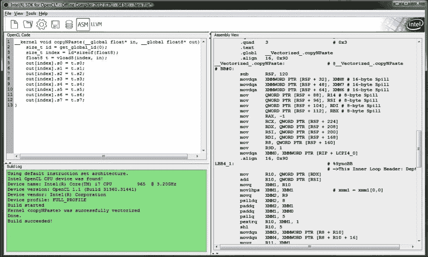
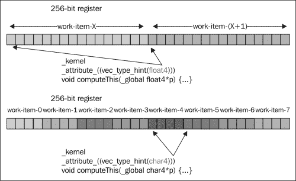
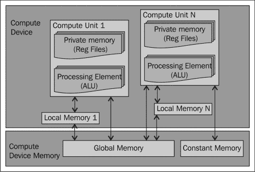
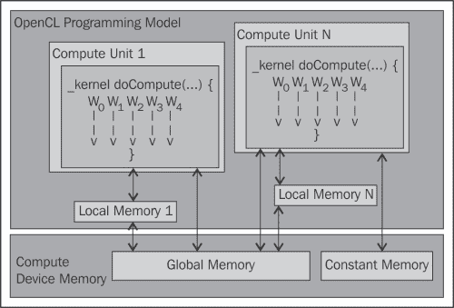

# 第三章：理解 OpenCL 数据类型

在本章中，我们将介绍以下内容：

+   初始化 OpenCL 标量数据类型

+   初始化 OpenCL 向量数据类型

+   使用 OpenCL 标量类型

+   理解 OpenCL 向量类型

+   向量和标量地址空间

+   配置你的 OpenCL 项目以启用双精度数据类型

# 简介

OpenCL 支持从 C 编程语言派生出的广泛的数据类型。它们被广泛分为两组，称为标量和向量。标量基本上是基本值，而向量是一组基本值，向量好的一点是许多 OpenCL SDK 供应商已经提供了自动化向量化，这使得值可以被加载到宽的，即 128 位、256 位或 512 位寄存器中进行消费。

OpenCL 标量整型数据类型包括`bool`、`char`、`short`、`int`、`long`、`uchar`、`ushort`、`uint`和`ulong`的符号和无符号类型；对于浮点值，有`float`、`half`和`double`。要在你的主机程序中表示这些类型，你只需在每个类型前加上字母`cl_`，OpenCL 编译器就会理解。

OpenCL 向量数据类型由多个标量整型和浮点数据类型组成，它们是`char<N>`、`short<N>`、`int<N>`、`long<N>`、`uchar<N>`、`ushort<N>`、`uint<N>`、`ulong<N>`和`float<N>`，其中`<N>`代表 2、3、4、8 或 16 的值。同样，你将在主机程序中通过在每个数据类型前加上字母`cl_`来表示这些类型。

在这两种情况下，如果你更喜欢无符号类型的显式形式，那么你可以将数据类型中的字母`u`替换为关键字`unsigned`。

# 初始化 OpenCL 标量数据类型

在这个菜谱中，我们将演示初始化标量类型的各种方法，如果你已经使用 C 编程语言进行编程，那么大多数技术都会非常有意义。

## 准备工作

除了在 OpenCL 中定义的常规数据类型外，标准还添加了一些我们在上一节中提到之外的数据类型，以下表格展示了它们：

| 类型 | 描述 |
| --- | --- |
| `half` | 它是一个 16 位浮点数。`half`数据类型必须符合 IEEE 754-2008 `half 精度`存储格式。 |
| `bool` | 它是一个条件数据类型，其值评估为真或假。true 扩展为整数 1，而 false 扩展为 0。 |
| `size_t` | 它是 sizeof 运算符的结果的无符号整型。这可以是一个 32 位或 64 位无符号整型。 |
| `ptrdiff_t` | 它是一个 32 位或 64 位有符号整数，通常用于表示两个点相减的结果 |
| `intptr_t` | 它是一个 32 位或 64 位的有符号整数，具有任何有效指针都可以转换为该类型的属性，然后可以转换回指向 void，并且结果将与原始指针比较相等。 |
| `uintptr_t` | 它是一个 32 位或 64 位的无符号整数，具有与`intptr_t`相同的属性。 |

OpenCL 允许在源代码中使用以下数据类型进行互换：

| OpenCL 中的类型 | 应用程序中的类型 |
| --- | --- |
| `bool` | `n/a` |
| `char` | `cl_char` |
| `unsigned char` `, uchar` | `cl_uchar` |
| `short` | `cl_short` |
| `unsigned short` `, ushort` | `cl_ushort` |
| `int` | `cl_int` |
| `unsigned int` `, uint` | `cl_uint` |
| `long` | `cl_long` |
| `unsigned long` `, ulong` | `cl_ulong` |
| `float` | `cl_float` |
| `double` | `cl_double` |
| `half` | `cl_half` |
| `size_t` | `n/a` |
| `ptrdiff_t` | `n/a` |
| `intptr_t` | `n/a` |
| `uintptr_t` | `n/a` |
| `void` | `void` |

因此，以下是一些示例，说明您如何在内核和主机源代码中声明和定义标量数据类型：

```py
float f = 1.0f;                  // In the OpenCL kernel
char c = 'a';                    // In the OpenCL kernel
const char* cs = "hello world\n";
cl_char c1 = 'b';                // in the host program
cl_float f1 = 1.0f;              // in the host program
const cl_char* css = "hello world\n";
```

在上一章*理解 OpenCL 数据传输和分区*中，我们花了一些时间讨论数据类型以及对齐是如何工作的，或者说，数据对齐如何影响性能。标量数据类型始终对齐到数据类型的大小（以字节为单位）。大小不是 2 的幂的内置数据类型必须对齐到下一个更大的 2 的幂。也就是说，`char`变量将对齐到 1 字节边界，`float`变量将对齐到 4 字节边界。

## 如何做到这一点...

如果您的应用程序需要用户定义的数据类型，那么您需要将这些类型放置在`__attribute__((aligned))`中；有关更多详细信息，请参阅第二章，*理解 OpenCL 数据传输和分区*。

在 OpenCL 中，有几个运算符可以将操作数的值从一种类型转换为另一种类型，这通常被称为隐式转换；另一种方式是在操作数或二元运算的结果上应用类型转换操作。除了`void`和`half`数据类型外，支持标量内置类型之间的隐式转换。这可以通过以下代码说明：

```py
cl_int x = 9;
cl_float y = x; // y will get the value 9.0
```

或者

```py
int x = 9;
float y = x;  // y will get the value 9.0
```

您可以在应用程序代码中使用这两种形式。在 OpenCL 中，您也可以将一种数据类型强制转换为另一种数据类型，就像在 C 编程语言中做的那样。请参考以下示例：

```py
float f = 1.0f;
int i = (int) f; // i would receive the value of 1
```

您还可以使用以下代码在 OpenCL 中将标量数据类型强制转换为向量数据类型：

```py
float f = 1.0f;
float4 vf = (float4)f; // vf is a vector with elements (1.0, 1.0, 1.0, 1.0)
uchar4 vtrue = (uchar4)true; // vtrue is a vector with elements(true, true, true, true)
             // which is actually (0xff, 0xff, 0xff, 0xff)
```

# 初始化 OpenCL 向量数据类型

向量对于 OpenCL 程序员来说非常强大，因为它允许硬件批量加载/存储数据到/从内存；这类计算通常利用算法的空间和时间局部性属性。在本食谱中，我们将熟悉创建各种类型的向量。

## 准备工作

你可以通过两种主要方式初始化一个向量，如下所示：

+   向量字面量

+   向量组合

创建一个向量字面量简单地说就是你可以构造你想要的任何类型的向量，如下面的代码所示：

```py
float a = 1.0f;
float b = 2.0f;
float c = 3.0f;
float d = 4.0f;
float4 vf = (float4) (a, b, c, d);
//vf will store (1.0f, 2.0f, 3.0f, 4.0f)
```

初始化向量的另一种方式是通过标量值，如下面的代码所示：

```py
uint4 ui4 = (uint4)(9); // ui4 will store (9, 9, 9, 9)
```

你也可以以下这种方式创建向量：

```py
float4 f = (float4) ((float2) (1.1f, 2.2f), 
                     (float2) (3.3f, 4.4f));
float4 f2 = (float4) (1.1f, (float2) (2.2f, 3.3f), 4.4f);
```

左侧和右侧的数据类型必须相同，否则 OpenCL 编译器将发出警告。

## 如何做到这一点...

向量还有一个显著特性，那就是你可以通过索引访问单个分量，也就是说，如果你想访问 `float4` 向量 `v` 的每个分量，那么你会通过 `v.x`、`v.y`、`v.z`、`v.w` 分别进行，对于更大型的 8 或 16 元素向量，我们会通过 `v.s0`、`v.s1` 到 `v.s7`，以及 `v.s0`、`v.s1`、`v.sa` 到 `v.sf` 分别访问这些单个元素。因此，`char2`、`uchar2`、`short2`、`ushort2`、`int2`、`uint2`、`long2`、`ulong2` 和 `float2` 类型的向量可以访问它们的 `.xy` 元素。

以下是通过组合创建向量的另一种方式：

```py
float4 c;
c.xyzw = (float4) (1.0f, 2.0f, 3.0f, 4.0f);
float4 d;
d.x = c.x;
d.y = c.y;
d.z = c.z;
d.w = c.w; // d stores (1.0f, 2.0f, 3.0f, 4.0f)
```

## 它是如何工作的...

在类似的情况下，你也可以使用数值索引来引用向量中的分量，并依次创建向量。以下表格显示了各种向量数据类型的索引列表：

| 向量分量 | 可以使用的数值索引 |
| --- | --- |
| 2-分量 | `0, 1` |
| 3-分量 | `0, 1, 2` |
| 4-分量 | `0, 1, 2, 3` |
| 8-分量 | `0, 1, 2, 3, 4, 5, 6, 7` |
| 16-分量 | `0, 1, 2, 3, 4, 5, 6, 7, 8, 9, a, A, b, B, c, C, d, D, e, E, f, F` |

要使用这些数值索引，你必须以字母 *s* 或 *S* 开头，以下是一些如何创建向量的快速示例：

```py
float4 pos = (float4)(1.0f, 2.0f, 3.0f, 4.0f); 
float4 swiz= pos.wzyx; // swiz = (4.0f, 3.0f, 2.0f, 1.0f) 
float4 dup = pos.xxyy; // dup = (1.0f, 1.0f, 2.0f, 2.0f)
float4 f, a, b;
f.xyzw = a.s0123 + b.s0123;
```

## 还有更多...

最后，向量数据类型可以使用 `.lo`（或 `.even`）和 `.hi`（或 `.odd`）后缀来组合新的向量类型，或者将较小的向量类型组合成较大的向量类型。可以使用多级的 `.lo`（或 `.even`）和 `.hi`（或 `.odd`）后缀，直到它们指代一个标量项。`.lo` 和 `.hi` 后缀指的是向量的下半部分，而向量的 `.even` 和 `.odd` 后缀指的是向量的偶数和奇数元素。以下是通过组合创建向量的示例：

```py
float4 vf = (float4) (1.0f, 2.0f, 3.0f, 4.0f);
float2 low = vf.lo; // returns vf.xy
float2 high = vf.hi; // returns vf.zw
float4 vf4 = (float4) (low, high);// returns (1.0f, 2.0f, 3.0f, 4.0f)
```

向量不允许隐式转换，因此你不能执行以下操作：

```py
float4 vf4, wf4;
int4 if4;
wf4 = vf4; // illegal
if4 = wf4; // illegal
```

向量类型之间的显式转换也是不允许的，实际上，唯一可以显式转换为向量类型的情况是在使用标量初始化向量时：

```py
float f = 4.4f;
float4 va = (float4) (f); // va stores ( 4.4f, 4.4f, 4.4f, 4.4f)
```

如果你通过后缀 `.lo`（或 `.even`）、`.hi`（或 `.odd`）提取 3 分量向量类型的分量，那么 3 分量向量类型会表现得像 4 分量向量类型，除了 `w` 分量是未定义的。

# 使用 OpenCL 矢量类型

标量数据类型与你在用 C 语言编程时预期的相当相似。然而，有两个主题值得更多关注，我们将在本食谱中涉及；我们将查看`half`数据类型，并检查 OpenCL 设备可能如何排序他们的数据。

## 准备工作

许多符合 OpenCL 规范的设备实际上都是小端架构，开发者需要确保他们的内核在大小端设备上都被测试过，以确保与当前和未来设备的源代码兼容性。让我们用一个简单的例子来说明字节序。

## 如何做…

考虑一个变量`x`，它持有值`0x01234567`，且`x`的地址从`0x100`开始。在计算机体系结构术语中，值`0x01`是**最高有效字节**（**MSB**），而`0x67`是**最低有效字节**（**LSB**）。大端存储方案首先存储 MSB 直到遇到 LSB，而小端存储方案首先存储 LSB 直到遇到 MSB。

大端

| **地址** | 0x100 | 0x101 | 0x102 | 0x103 |   |
| --- | --- | --- | --- | --- | --- |
| **值** | 0x01 | 0x23 | 0x45 | 0x67 | … |

小端

| **地址** | 0x100 | 0x101 | 0x102 | 0x103 |   |
| --- | --- | --- | --- | --- | --- |
| **值** | 0x67 | 0x45 | 0x23 | 0x01 | … |

### 注意

查看列在`Ch3/byte_ordering/show_bytes.c`中的完整代码，按照顺序运行`cmake`和`make`命令来编译代码；这将生成一个名为`ShowBytes`的二进制文件，然后运行该程序以查看其输出。此代码将打印出一系列输出，并且根据架构的字节序，你会注意到不同的字节序。

参考以下代码：

```py
#include <stdio.h>
typedef unsigned char* byte_pointer;
void show_bytes(byte_pointer start, int len) {
  int i;
  for(i = 0; i < len; i++)
    printf(" %.2x", start[i]);
  printf("\n");
}
void show_int(int x) {
  show_bytes((byte_pointer) &x, sizeof(int));
}
void show_float(float x) {
  show_bytes((byte_pointer) &x, sizeof(float));
}
void show_pointer(void* x) {
  show_bytes((byte_pointer) &x, sizeof(void*));
}
void test_show_bytes(int val ) {
  int ival = val;
  float fval = (float) ival;
  int* pval = &ival;
  show_int(ival);
  show_float(fval);
  show_pointer(pval);
}
```

由于你已经理解了字节序如何影响数据（标量）的读取和写入方式；让我们看看字节序如何影响 OpenCL 中的向量数据类型。在向量数据类型中，每个值内字节的顺序以及值之间的顺序都被反转。以一个包含值`0x000102030405060708090A0B0C0D0E0F`的`uint4`向量为例，地址为`0x100`，以下表格显示了小端存储方案的外观：

| 0x100 | 0x104 | 0x108 | 0x1b0 |
| --- | --- | --- | --- |
| 0x0F0E0D0C | 0x0B0A0908 | 0x07060504 | 0x3020100 |

如果你正在处理数据压缩和计算机图像算法，了解这一事实非常重要，因为这两类算法在字节级操作方面有大量的操作，你不想被这些问题困扰。

## 它是如何工作的…

被方便地称为`half`的`half-precision`数据类型实际上具有常规`float`类型一半的存储和精度。`half`类型符合 IEEE754-2008 标准，并由 NVIDIA 和工业光魔公司首次引入。你可以用这种类型做的唯一一件事是声明一个指向包含`half`值的缓冲区的指针；这些值必须是有限数、正常数、非规范化数、无穷大和 NaN。

您可以选择使用向量加载和存储函数，例如 `vload_half`、`vload_halfn`、`vstore_half` 等。然而，请记住，加载/存储操作将创建一个中间的浮点值。

### 注意

`load` 函数从内存中读取 `half` 值并将其转换为常规的 `float` 值。`store` 函数接受一个 `float` 作为输入，将其转换为 `half` 值并将其存储到内存中。

要确定您的设备是否支持此功能，您可以在 `Ch2/device_extension/device_extensions` 目录中运行程序，输出应包含 `cl_khr_fp16`；或者，您可以通过传递参数 `CL_DEVICE_EXTENSIONS` 到 `clGetDeviceInfo` 来查询设备。以下是从 `Ch2/device_extensions/device_extensions.c` 的代码片段：

```py
/* --- file: device_extensions.c --- */
displayDeviceDetails( devices[i], CL_DEVICE_EXTENSIONS, "CL_DEVICE_EXTENSIONS");
void displayDeviceDetails(cl_device_id id,
                          cl_device_info param_name,
                          const char* paramNameAsStr) {
  cl_int error = 0;
  size_t paramSize = 0;
  error = clGetDeviceInfo( id, param_name, 0, NULL, &paramSize );
  if (error != CL_SUCCESS ) {
    perror("Unable to obtain device info for param\n");
    return;
  }
  /* the cl_device_info are preprocessor directives defined in cl.h */
  switch (param_name) {
// code omitted
    case CL_DEVICE_EXTENSIONS : {
// beware of buffer overflow; alternatively use the OpenCL C++ //bindings
      char* extension_info[4096];
      error = clGetDeviceInfo( id, CL_DEVICE_EXTENSIONS, sizeof(extension_info), extension_info, NULL);
      printf("\tSupported extensions: %s\n", extension_info);
    }break;
  } //end of switch
```

# 理解 OpenCL 向量类型

当您开始处理您的 OpenCL 项目时，您不可避免地会使用标量和向量数据类型来模拟算法。标量的工作方式类似于您在大多数编程语言中遇到的任何变量声明/定义，您应该将向量视为一个宽容器，可以并行地提供该容器中的所有项目，而区分标量和向量的唯一一点是，当对一个标量应用操作时，它只影响单个值，而当对向量应用相同的操作时，它并行地影响其中的所有项目。

在现代处理器中，存在一个专门的硬件单元，每个周期可以处理更多数据，它们通常被称为 **单指令多数据**（**SIMD**）或称为 **流式 SIMD 扩展**（**SSE**），这是英特尔对 SIMD 的实现。SIMD 指令提供的优势是它们允许在一个大寄存器中在一个周期内操作多个值；通常有很多这样的单元，从而提高程序的性能。我们应该清楚，SIMD 描述的是一个允许并行性发生的机制，这是从弗林分类法中获得的，而 SSE 描述了两个 CPU 处理器制造商，即英特尔和 AMD 如何实现 SIMD。

在揭示 OpenCL 内核如何在 GPU 上工作之前，故事的第一部分是告诉您 OpenCL 内核在 CPU 上是如何运行的，目前我们将注意力放在英特尔 CPU 架构上。在这些架构上，OpenCL 看到一个具有多个计算单元的单个设备，如果您猜测每个核心都是一个计算单元，那么您是对的，因此，除非您使用 OpenCL 1.2 中新引入的设备分裂扩展，否则您的内核将在所有计算单元上运行。

### 注意

OpenCL 1.2 中引入的设备分裂（`cl_khr_device_fission`）目前由英特尔、AMD 和 IBM Cell Broadband 的多核 CPU 支持。GPU 目前不支持。

故事的下一段是描述 OpenCL 内核如何在 AMD 制造的 GPU 上运行，我们关注的是本书中使用的基于 AMD 南方群岛架构的 AMD GPU，该架构包括他们的 Radeon HD 7900、7800 和 7700 GPU；顺便提一下，你可能希望查阅 NVIDIA 的网站以获取有关其 GPU 的更多产品细节，网址为[www.nvidia.com](http://www.nvidia.com)。

内核基本上执行基于标量或向量的指令，工作负载以 64 个工作项的块分配给计算单元，这被称为波前。波前有一个单独的程序计数器，被视为一个小的工作单元，这意味着它们以同步的方式执行。

当你的应用程序将工作负载传递给 GPU 时，它必须首先编译内核并将其加载到内存中。它还必须绑定源数据和结果数据的缓冲区，最后它将决定如何在 GPU 上执行给定的工作负载。当工作负载要执行时，GPU 将输入域划分为 64 线程的块，称为波前（wavefronts），并将它们调度到**计算单元**（compute unit，简称**CU**）。接下来，内核被检索到指令缓存中，计算单元开始向执行单元调度指令；每个计算单元可以并行处理多个波前，同时处理向量算术逻辑单元（ALU）计算以及内存访问。波前将继续执行，直到内核的末尾，此时波前将被终止，新的波前可以接替其在 GPU 上的位置。

考虑到波前对内存的访问是并行的，你可能会期望出现某种延迟，处理器在处理这种情况时相当聪明，它所做的就是并行执行许多波前，并且它的工作方式是，如果一个波前正在等待从内存中获取结果，其他波前可以发出内存请求，并且如果它们是独立的计算，它们可以在挂起的内存请求与并行执行 ALU 操作之间进行并行处理。可以从程序中提取的并行程度增加的因素各不相同，但其中之一就是可用于并行计算的硬件单元的实际数量，在 OpenCL 术语中，它被称为 CU，在 CPU 和 GPU 中，它们基本上是处理器。

计算单元是并行计算的基础，在南方群岛架构中，该架构支持其他产品，计算单元的数量会有所不同，每个计算单元基本上包含以下内容：

+   标量算术逻辑单元（Scalar ALU）和标量**通用寄存器**（General-Purpose Registers，简称**GPRs**）也称为**SGPRs**

+   四个 SIMD（单指令多数据），每个由一个向量算术逻辑单元（vector ALU）和向量通用寄存器（vector GPRs，简称 VGPRs）组成

+   本地内存

+   通过一级缓存对向量内存进行读写访问

+   指令缓存，由四个计算单元共享，即计算单元

+   常量缓存，由四个计算单元（compute units，简称 CUs）共享，即计算单元

现在我们将专注于 GPU 上的向量操作，这包括 ALU 和内存操作。每个四路 SIMD 包含一个在四个周期内对波前进行操作的向量-ALU；每个 SIMD 还可以托管十个正在飞行的波前，即一个 CU 可以并行执行四十个波前。在本书中使用的基于南方群岛架构的 AMD GPU（AMD HD 7870）上，我们有 20 个计算单元，我们知道每个 CU 包含四个 SIMD，每个 SIMD 执行一个波前意味着在任何时候我们都可以有 20 x 4 x 10 x 64 = 51,200 个工作项，如果您想象每个工作项都处于执行向量操作的阶段，那么 GPU 提供的并行性将远远大于 CPU；我们指的是具有 60 个核心的 Intel Xeon Phi，每个核心托管 4 个工作项，这提供了 60 x 4 = 240 个工作项；请注意，我们并不是说 GPU 优于 CPU，因为每个设备都有其特定的领域，但我们展示这些数字是为了说明一个简单的事实，即 GPU 的吞吐量高于 CPU。

说了这么多，我们很快将看到一个例子，但首先请记住，向量操作是按组件进行的，并且可以通过数字索引访问向量，每个索引可以组合成更大的索引组以执行内存的存储/加载操作。请参考以下代码：

```py
float4 v, u;
float f;
v = u + f;
// equivalent to 
// v.x = u.x + f
// v.y = u.y + f
// v.z = u.z + f
// v.w = u.w + f
float4 a, b, c;
c = a + b
// equivalent to 
// c.x = a.x + b.x
// c.y = a.y + b.y
// c.z = a.z + b.z
// c.w = a.w + b.w
```

向量可以通过组件方式聚合以执行操作，而不需要代码冗余，这种方式实际上有助于程序员在日常工作中提高工作效率。接下来，我们可以深入了解向量类型是如何转换为利用您的硬件的。

## 准备工作

我们将要描述的演示有两个部分。首先，我们将使用 Windows 上的 Intel OpenCL 编译器来演示内核代码的隐式向量化；其次，我们将演示如何在您的代码中启用原生向量类型表示法，以表达使用 Linux 上的 AMD APP SDK v2.7 或 v2.8 生成向量化代码的愿望。

我们结合这两种方法，旨在解决将大输入数组从设备内存的一部分传输到另一部分的问题，最终我们提取并比较它们以检查是否相等。与之前一样，我们会在主机代码中准备传输的数据结构，并编写一个合适的 OpenCL 内核来实际传输内存内容。源代码可以在`Ch3/vectorization`中找到，我们使用 AMD APP SDK 构建程序。

### 注意

对于对 AMD CPU 和 GPU 平台的 OpenCL 代码生成感兴趣的读者，应咨询`AMD CodeXL`产品，因为 AMD APP 内核分析器已经停用。当您研究中间语言输出时，可能还需要查阅 AMD 中间语言手册。

隐式向量化是所有符合 OpenCL 编译器实现要求的必备功能，我们选择使用 Intel OpenCL 编译器来演示此功能的原因是生成的 SIMD 指令更有可能被读者识别，而不是其他编译器实现（如 AMD 或 NVIDIA 的）生成的中间代码。我们提供的内核代码可以在`Ch3/vectorization/vectorization.cl`中找到，如下所示：

```py
__kernel void copyNPaste(__global float* in, __global float8* out) {
  size_t id = get_global_id(0);
  size_t index = id*sizeof(float8);
  float8 t = vload8(index, in);
  out[index].s0 = t.s0;
  out[index].s1 = t.s1;
  out[index].s2 = t.s2;
  out[index].s3 = t.s3;
  out[index].s4 = t.s4;
  out[index].s5 = t.s5;
  out[index].s6 = t.s6;
  out[index].s7 = t.s7;
}
```

此内核的主要操作是将内容从一个地方传输到另一个地方，它是通过使用两个包含八个浮点数的向量并行传输来实现的，你将注意到我们使用向量分量符号来明确表示这些内存传输。

在接下来的演示中，我们将从内核代码回到主机代码，假设开发者希望以更明确的方式控制代码生成；这可以通过原生向量类型符号来实现。

我们要求读者参考*更多内容…*部分以获取详细信息，但这里的演示基于开发者希望在设备内存传输完成后手动调整处理数据验证的程序的假设，这个函数可以在`Ch3/vectorization/vectorization.c`中找到，命名为`valuesOK`，以下是如何实现的代码：

```py
#ifdef __CL_FLOAT4__
int valuesOK(cl_float8* to, cl_float8* from, size_t length) {
#ifdef DEBUG
  printf("Checking data of size: %lu\n", length);
#endif
  for(int i = 0; i < length; ++i) {
#ifdef __SSE__
    __cl_float4 __toFirstValue = to->v4[0];
    __cl_float4 __toSecondValue = to->v4[1];
    __cl_float4 __fromFirstValue = from->v4[0];
    __cl_float4 __fromSecondValue = from->v4[1];
    __m128i vcmp = (__m128i) _mm_cmpneq_ps(__toFirstValue, __fromFirstValue);
    uint16_t test = _mm_movemask_epi8(vcmp);
    __m128i vcmp_2 = (__m128i) _mm_cmpneq_ps(__toSecondValue, __fromSecondValue);
    uint16_t test_2 = _mm_movemask_epi8(vcmp_2);
    if( (test|test_2) != 0 ) return 0; // indicative that the result failed
#else
    #error "SSE not supported, which is required for example code to work!"
#endif
  }
return 1;
}
#endif
```

## 如何操作...

通过 Intel OpenCL 编译器实现隐式向量化相对简单，在这个简单的例子中，我们选择在 Windows 操作系统上安装它。你可以从[`software.intel.com/en-us/vcsource/tools/opencl`](http://software.intel.com/en-us/vcsource/tools/opencl)下载编译器。

要见证如何通过此编译器实现隐式向量化，你需要将内核代码（前面的代码）复制粘贴到 GUI 的编辑面板中，并开始编译。一旦编译完成，你可以通过点击 GUI 上的**ASM**或**LLVM**按钮来查看生成的代码。以下是一个示例截图：



下一步是手动调整我们的数据验证代码`valuesOK`以展示向量化。这个例子只是为了说明如何完成类似的事情，你不需要做任何事情，只需在`Ch3/vectorization`目录中调用`make`，一个可执行的向量化程序将被放入文件系统中，我们将在下一部分对其进行剖析。

### 注意

如果你在 Mac OSX 10.7 上运行 OpenCL 1.1，那么将标志`–cl-auto-vectorizer-enable`传递给`clBuildProgram`作为构建选项，将使 CPU 上将要执行的内核进行向量化。SIMD 指令将与你在本食谱中看到的大致相同。

以这种方式手动调整你的代码基本上是关闭了隐式向量化，你将需要根据你的场景判断这种努力是否值得，与问题的复杂性相比。要查看生成的 SIMD 代码，最好的做法是将程序放在调试器下，在 Linux 上，最好的调试器将是 GNU GDB。你基本上是将程序加载到调试器中，并发出命令 `disassemble /m valuesOK` 以验证是否确实生成了 SIMD 指令。以下是一个示例 `gdb` 会话，其中反汇编与源代码交织在一起：

```py
$ gdb ./Vectorization 
GNU gdb (GDB) 7.5-ubuntu
Copyright (C) 2012 Free Software Foundation, Inc.
License GPLv3+: GNU GPL version 3 or later sa<http://gnu.org/licenses/gpl.html>
This is free software: you are free to change and redistribute it.
There is NO WARRANTY, to the extent permitted by law. Type "show copying" and "show warranty" for details.
This GDB was configured as "x86_64-linux-gnu".
For bug reporting instructions, please see:
<http://www.gnu.org/software/gdb/bugs/>...
Reading symbols from /home/tayboonl/PACKT_OpenCL_Book/src/Ch3/vectorization/Vectorization...done.
(gdb) disassemble /m valuesOK 
Dump of assembler code for function valuesOK:
warning: Source file is more recent than executable.
31 int valuesOK(cl_float8* to, cl_float8* from, size_t length) {
  0x000000000040117c <+0>: push  %rbp
  0x000000000040117d <+1>: mov  %rsp,%rbp
  0x0000000000401180 <+4>: sub  $0xf0,%rsp
  0x0000000000401187 <+11>: mov  %rdi,-0xd8(%rbp)
  0x000000000040118e <+18>: mov  %rsi,-0xe0(%rbp)
  0x0000000000401195 <+25>: mov  %rdx,-0xe8(%rbp)
32 #ifdef DEBUGf
33 printf("Checking data of size: %lu\n", length);
  0x000000000040119c <+32>: mov  -0xe8(%rbp),%rax
  0x00000000004011a3 <+39>: mov  %rax,%rsi
  0x00000000004011a6 <+42>: mov  $0x4020a8,%edi
  0x00000000004011ab <+47>: mov  $0x0,%eax
  0x00000000004011b0 <+52>: callq  0x400f20 <printf@plt>
34 #endif
35 for(int i = 0; i < length; ++i) {
  0x00000000004011b5 <+57>: movl  $0x0,-0xc4(%rbp)
  0x00000000004011bf <+67>: jmpq  0x4012a9 <valuesOK+301>
  0x00000000004012a2 <+294>: addl  $0x1,-0xc4(%rbp)
  0x00000000004012a9 <+301>: mov  -0xc4(%rbp),%eax
  0x00000000004012af <+307>: cltq  
  0x00000000004012b1 <+309>: cmp  -0xe8(%rbp),%rax
  0x00000000004012b8 <+316>: jb  0x4011c4 <valuesOK+72>
36 #ifdef __SSE__
37    __cl_float4 __toFirstValue = to->v4[0];
  0x00000000004011c4 <+72>: mov  -0xd8(%rbp),%rax
  0x00000000004011cb <+79>: movaps (%rax),%xmm0
  0x00000000004011ce <+82>: movaps %xmm0,-0xc0(%rbp)
38    __cl_float4 __toSecondValue = to->v4[1];
  0x00000000004011d5 <+89>: mov  -0xd8(%rbp),%rax
  0x00000000004011dc <+96>: movaps 0x10(%rax),%xmm0
  0x00000000004011e0 <+100>: movaps %xmm0,-0xb0(%rbp)

39    __cl_float4 __fromFirstValue = from->v4[0];
  0x00000000004011e7 <+107>: mov  -0xe0(%rbp),%rax
  0x00000000004011ee <+114>: movaps (%rax),%xmm0
  x00000000004011f1 <+117>: movaps %xmm0,-0xa0(%rbp)
40    __cl_float4 __fromSecondValue = from->v4[1];
  0x00000000004011f8 <+124>: mov  -0xe0(%rbp),%rax
  0x00000000004011ff <+131>: movaps 0x10(%rax),%xmm0
  0x0000000000401203 <+135>: movaps %xmm0,-0x90(%rbp)
  0x000000000040120a <+142>: movaps -0xc0(%rbp),%xmm0
  0x0000000000401211 <+149>: movaps %xmm0,-0x60(%rbp)
---Type <return> to continue, or q <return> to quit---
  0x0000000000401215 <+153>: movaps -0xa0(%rbp),%xmm0
  0x000000000040121c <+160>: movaps %xmm0,-0x50(%rbp)
41    __m128i vcmp = (__m128i) _mm_cmpneq_ps(__toFirstValue, __fromFirstValue);
  0x0000000000401229 <+173>: movdqa %xmm0,-0x80(%rbp)
  0x000000000040122e <+178>: movdqa -0x80(%rbp),%xmm0
  0x0000000000401233 <+183>: movdqa %xmm0,-0x40(%rbp)
42    uint16_t test = _mm_movemask_epi8(vcmp);
  0x0000000000401241 <+197>: mov  %ax,-0xc8(%rbp)
  0x0000000000401248 <+204>: movaps -0xb0(%rbp),%xmm0
  0x000000000040124f <+211>: movaps %xmm0,-0x30(%rbp)
  0x0000000000401253 <+215>: movaps -0x90(%rbp),%xmm0
  0x000000000040125a <+222>: movaps %xmm0,-0x20(%rbp)
43    __m128i vcmp_2 = (__m128i) _mm_cmpneq_ps(__toSecondValue, __fromSecondValue);
  0x0000000000401267 <+235>: movdqa %xmm0,-0x70(%rbp)
  0x000000000040126c <+240>: movdqa -0x70(%rbp),%xmm0
  0x0000000000401271 <+245>: movdqa %xmm0,-0x10(%rbp)
44    uint16_t test_2 = _mm_movemask_epi8(vcmp_2);
  0x000000000040127f <+259>: mov  %ax,-0xc6(%rbp)
45    if( (test|test_2) != 0 ) return 0; // indicative that the result failed
  0x0000000000401286 <+266>: movzwl -0xc6(%rbp),%eax
  0x000000000040128d <+273>: movzwl -0xc8(%rbp),%edx
  0x0000000000401294 <+280>: or  %edx,%eax
  0x0000000000401296 <+282>: test  %ax,%ax
  0x0000000000401299 <+285>: je  0x4012a2 <valuesOK+294>
  0x000000000040129b <+287>: mov  $0x0,%eax
  0x00000000004012a0 <+292>: jmp  0x4012c3 <valuesOK+327>
46 #else
47    #error "SSE not supported, which is required for example code to work!"  
48 #endif
49  }
50 return 1;
  0x00000000004012be <+322>: mov  $0x1,%eax
51  }
  0x00000000004012c3 <+327>: leaveq
  0x00000000004012c4 <+328>: retq
End of assembler dump
(gdb)
```

## 它是如何工作的…

隐式向量化是写入实现提供的编译器中的复杂软件的一部分，并且肯定与硬件相关，通常由处理器制造商的专有 **中间语言**（**IL**）表示，但遗憾的是，文档并不完善，所以我们更愿意关注更详细地了解原生向量类型表示法的工作方式。

### 注意

然而，感兴趣的读者被邀请去探索由 AMD 和 NVIDIA 开发的 IL，分别被称为 AMD IL 和 NVIDIA 的 PTX。

这种手动调整的方法允许开发者引用他们正在工作的平台内置的向量化数据类型，而不是依赖于 OpenCL 编译器自动向量化代码，并且可能会带来性能上的好处。到目前为止，在 OpenCL 中实现这一点的做法是将这些差异抽象成文件 `cl_platform.h` 中的平台相关宏。让我们来看看在我们的示例中这是如何工作的。

我们之前看到的示例是在 Ubuntu Linux 12.04 操作系统上，使用英特尔酷睿 i7 CPU 和 AMD Radeon HD 7870 GPU 进行测试的，但鉴于我们的示例专注于主机代码的显式向量化，这意味着我们需要根据英特尔指令集知道 SIMD 向量的宽度。我们知道这是 128 位，这意味着如下：

```py
float4 a,b;
float4 c = a + b;
```

上述代码被转换成以下 C 代码片段：

```py
__m128 a, b;
__m128 c = __mm_add_ps(a, b);
```

函数 `__mm_add_ps` 是 SIMD 函数，通过逐个添加它们的单精度浮点值来添加两个向量，最初看起来像是一种语法糖，但实际上这是 OpenCL 提供跨平台兼容性的许多方法之一，并且消除了为各种处理器架构提供定制化向量化代码的痛苦，因此以这种方式，一个门面实际上是一件好事。

回到我们试图解决的问题，即对输入和输出数组进行数据验证的过程进行向量化。在我们的例子中，我们选择了可以包含 8 个浮点数的数组或向量，我们想要做的是检查它们并比较它们是否相等。使用 OpenCL 的本地向量类型表示法，我们知道 8 元素向量可以分解成 4 元素向量，因为 OpenCL 规定，如果一个平台可以支持本地向量类型，那么该宏在`cl_platform.h`文件中以`__CL_<TYPEN>`命名，其中`<TYPEN>`可以是`UCHAR16`、`CHAR16`、`INT4`、`FLOAT4`，即向量化的原始数据类型。一般来说，你可以使用`.v<N>`子向量表示法来访问本地组件，其中`<N>`是子向量中的元素数量。

使用这个新发现的信息，我们可以分析之前看到的程序，其中原始主机内存的内容由`cl_float8 *`表示，而主机到设备复制的内存内容由`cl_float8*`持有：

```py
int valuesOK(cl_float8* to, cl_float8* from, size_t length) {
// code omitted
for(int i = 0; i < length; ++i) {
```

我们需要遍历输入和输出数组中的向量，并按照以下方式从主机指针中提取第一个和第二个 4 元素向量：

```py
    __cl_float4 __hostFirstValue = to->v4[0];
    __cl_float4 __hostSecondValue = to->v4[1];
```

然后我们按照以下方式从设备指针中提取第一个和第二个 4 元素向量：

```py
    __cl_float4 __deviceFirstValue = from->v4[0];
    __cl_float4 __deviceSecondValue = from->v4[1];
```

现在，我们使用 SSE API `__mm_cmp_neq_ps`比较每一半，并将每个测试的结果保存在变量 test 和 test2 中，如下面的代码所示：

```py
    __m128i vcmp = (__m128i) _mm_cmpneq_ps(__hostFirstValue, __deviceFirstValue);
    uint16_t test = _mm_movemask_epi8(vcmp);
    __m128i vcmp_2 = (__m128i) _mm_cmpneq_ps(__hostSecondValue, __deviceSecondValue);
    uint16_t test_2 = _mm_movemask_epi8(vcmp_2);
```

最后，我们按照以下方式比较这些结果：

```py
    if( (test|test_2) != 0 ) return 0; // indicative that the result failed
#else
```

## 还有更多...

我们还想要告诉你的向量化故事的一部分是，作为开发人员，你有权通过向内核代码提供显式的编译器提示来控制自动向量化。如果你想要手动调整代码的向量化，这可能很有用。

我们所提到的编译器提示是`vec_type_hint(<type>)`，其中`<type>`是我们之前提到的任何内置标量或向量数据类型。属性`vec_type_hint(<type>)`表示内核的计算宽度，如果没有指定，则假定内核应用了`vec_type_hint(int)`限定符，即 4 字节宽。以下代码片段说明了内核的计算宽度如何从 16 字节变为 8 字节，最后变为 4 字节，这恰好是默认值：

```py
// autovectoize assuming float4 as computation width
__kernel __attribute__((vec_type_hint(float4)))
void computeThis(__global float4*p ) {…}
// autovectorize assuming double as computation width
__kernel __attribute__((vec_type_hint(double)))
void computeThis(__global float4*p ) {…}
// autovectorize assuming int (default) as computation width
__kernel __attribute__((vec_type_hint(int)))
void computeThis(__global float4*p ) {…}
```

对于您，开发者来说，要能够使用这个功能，您需要知道您平台中向量单元的宽度，这可能是在 CPU 或 GPU 上运行的。在下一张图中，我们展示了两种场景，我们假设两个`__kernel`函数分别使用`__attribute_((vec_type_hint(float4)))`和`__attribute_((vec_type_hint(char4)))`声明。此外，我们还假设内核正在 256 位宽的寄存器上运行，以及自动向量化器如何选择运行一个或多个工作项以最大化寄存器的使用；这当然取决于编译器的实现。以下图展示了 OpenCL 编译器可能如何生成工作项以消耗宽寄存器中的数据：



在原生向量类型表示法中进行显式向量化的原生向量类型方法中，我们提到原生向量类型通过`cl_platform.h`中的`__CL_<TYPEN>__`预处理符号（也称为 C 宏）在`cl_platform.h`中标识，但我们还没有告诉您我们如何在代码示例中使用 SSE 指令。现在让我们找出原因，我们需要参考 OpenCL 1.2 标准定义的`cl_platform.h`（您可以从[`www.khronos.org/registry/cl/api/1.2/cl_platform.h`](http://www.khronos.org/registry/cl/api/1.2/cl_platform.h)下载）。

代码示例在 Ubuntu Linux 12.04 64 位操作系统上进行了测试，该系统配备英特尔酷睿 i7 CPU 和 AMD Radeon HD 7870 GPU，我们应该忽略 GPU 的存在，因为它除了通知您机器配置外没有其他相关性。

这个设置告诉我们，我们有一个支持 SSE 的指令集，并且按照 UNIX 和 GCC 社区的一般惯例，我们应该寻找`__SSE__`预处理符号，我们确实是这样做的，如下所示：

```py
#if defined(__SSE__)
#if defined(__MINGW64__)
#include <intrin.h>
#else
#include <xmmintrin.h> 
#endif
#if defined(__GNUC__)
typedef float __cl_float4 __attribute__((vector_size(16)));
#else
typedef __m128 __cl_float4;// statement 1
#endif
#define __CL_FLOAT4__ 1// statement 2
#endif
```

从前面的代码片段中，我们知道我们应该关注语句 1，因为它为我们提供了 SIMD 向量的指示性宽度，我们还知道按照惯例`__m128`表示其向量的宽度为 128 位；其他值包括 64 位和 256 位。我们还应该注意将显式向量化包含在预处理器的保护中，这是一个最佳实践，即`#ifdef __CL_FLOAT4__`。利用这种理解，我们可以继续寻找允许我们操作所需宽度数据值的适当 SSE API。感兴趣的读者可以查阅英特尔开发者手册和 AMD 开发者手册，并探索这些 ISA 如何比较以及最重要的是它们在哪里不同。

# 向量和标量地址空间

现在我们已经了解了如何在 OpenCL 中使用标量和向量，是时候检查 OpenCL 定义的四个地址空间了：`__global`、`__local`、`__constant`和`__private`，在这些地址空间中，向量和标量可以存在。这些空间映射到内存单元，因此受设备实际资源的限制，并定义了工作项如何访问内存。

## 准备工作

以下是对各种内存域的概念图：



前一个图的下半部分中找到的**全局内存**和**常量内存**对应于`__global`和`__constant`域。与 OpenCL 中每个计算单元（执行内核代码）关联的**局部内存**将有一个由块中所有工作项共享的内存空间，这对应于`__local`内存空间，而每个处理元素将拥有自己的命名空间来存储数据，它由`__private`内存空间表示。请注意，工作项无法以任何方式访问另一个工作项的（`__private`）内存空间，无论它们是否在同一个工作组中，同样适用于共享内存，即`__local`内存，因为没有任何两个工作组可以检查对方的内存。

设备中的每个计算单元都有一定数量的处理元素，这些处理元素执行工作项，并且计算单元作为一个整体会根据计算需要访问局部、常量或全局内存空间。每个处理元素（工作组或工作项）在其私有内存空间中存储自己的私有变量。

## 如何做到这一点...

`__global`地址空间名称用于引用从全局内存池分配的内存对象。为了确定设备上实际可用的资源量，你需要传递参数`CL_DEVICE_GLOBAL_MEM_SIZE`到`clGetDeviceInfo`。以下代码片段来自`Ch2/device_details/device_details.c`：

```py
displayDeviceDetails( devices[i], CL_DEVICE_GLOBAL_MEM_SIZE, "CL_DEVICE_GLOBAL_MEM_SIZE");
void displayDeviceDetails(cl_device_id id,
                          cl_device_info param_name,
                          const char* paramNameAsStr) {
  cl_int error = 0;
  size_t paramSize = 0;
  error = clGetDeviceInfo( id, param_name, 0, NULL, &paramSize );
  if (error != CL_SUCCESS ) {
    perror("Unable to obtain device info for param\n");
    return;
  }
  /* the cl_device_info are preprocessor directives defined in cl.h */
  switch (param_name) { 
    case CL_DEVICE_GLOBAL_MEM_SIZE:
    case CL_DEVICE_MAX_MEM_ALLOC_SIZE: {
      cl_ulong* size = (cl_ulong*) alloca(sizeof(cl_ulong) * paramSize);
      error = clGetDeviceInfo( id, param_name, paramSize, size, NULL );
      if (error != CL_SUCCESS ) {
        perror("Unable to obtain device name/vendor info for param\n");
        return;
      }
```

`__local`地址空间名称用于描述需要在局部内存中分配并共享工作组中所有工作项的变量。你可以通过传递参数`CL_DEVICE_MAX_LOCAL_MEM_SIZE`到`clGetDeviceInfo`来确定这个空间的最大大小。

`__constant`地址空间名称用于描述需要作为只读分配到全局内存中的不可变变量，并且在内核执行期间可以被所有工作项读取。你可以通过传递参数`CL_DEVICE_MAX_CONSTANT_BUFFER_SIZE`到`clGetDeviceInfo`来确定这个空间的最大大小。这个地址空间在存在特定值且内核函数需要时非常有用，这个值不会改变。

`__private` 地址空间用于描述仅对特定工作项私有的对象；因此，如果它们被标记为 `__private`，则工作项无法检查彼此的变量。默认情况下，内核函数内部未声明任何地址空间限定符（如：`__global`、`__local` 或 `__constant`）的变量被标记为 `__private`；这包括所有非内核函数和函数参数中的所有变量。以下来自 `Ch3/vectorization/vectorization.cl` 的内核代码将说明全局和私有内存空间，其中变量 `id`、`index` 和 `t` 位于私有内存空间，因此对其他工作项不可见，因此不受干扰，而变量 `in` 和 `out` 位于全局内存空间，对所有工作项可见：

```py
__kernel void copyNPaste(__global float* in, __global float8* out) {
    size_t id = get_global_id(0);
    size_t index = id*sizeof(float8);
    float8 t = vload8(index, in);
    out[index].s0 = t.s0;
  //code omitted
  out[index].s7 = t.s7;
}
```

## 它是如何工作的…

以下图示说明了 OpenCL 编程模型：



让我们使用前面的图示来了解您的内核在 OpenCL 中的工作方式。想象您有一个名为 `doCompute` 的内核，它接受几个参数，这些参数引用全局、常量、局部或私有内存空间。工作和数据在由 W[0…4] 表示的计算单元之间的内核中划分；它们将代表工作组（工作项集合）或工作项。

通常，在 OpenCL 中的计算通常涉及单个工作项通过全局、私有或常量空间独立执行计算，或者收集这些工作项以形成一个工作组，这样它们就可以通过利用局部内存空间更有效地加载数据和存储数据，因为该空间允许工作组中所有工作项之间共享数据，从而防止从设备内存进行多次内存加载。

# 配置您的 OpenCL 项目以启用双精度数据类型

今天，来自 Intel、AMD 和 ARM 的现代处理器都拥有符合 IEEE 754 标准的浮点单元（FPUs）；然而，ARM 除了支持单精度和双精度数字外，还支持硬件和软件对半精度数字的支持。因此，这意味着您的 OpenCL 程序实际上可以在基于 ARM 的处理器上利用半精度，这引发了一个问题：如何确定设备具有哪种类型的浮点支持。

这个问题的答案是，通过 `clGetDeviceInfo` API 查询设备，并传递以下任何参数：`CL_DEVICE_SINGLE_FP_CONFIG`、`CL_DEVICE_DOUBLE_FP_CONFIG` 和 `CL_DEVICE_HALF_FP_CONFIG`，这些参数标识设备是否支持单精度、双精度或半精度数字操作。

### 小贴士

`CL_DEVICE_HALF_FP_CONFIG` 和 `CL_DEVICE_DOUBLE_FP_CONFIG` 在 OpenCL 1.0 的 Mac OSX 10.6 上不受支持。

API 调用结果返回一个 `cl_device_fp_config` 类型的对象。

### 小贴士

在撰写本文时，`CL_FP_SOFT_FLOAT` 在 Mac OSX 10.6 上不可用，但在 AMD APP SDK v2.7 和 Intel OpenCL SDK 中可用。

在双精度浮点值的情况下，OpenCL 设备扩展 `cl_khr_fp64` 必须存在，你才能在内核中使用 `double` 数据类型。截至 OpenCL 1.2，开发者不再需要查询设备的扩展来验证双精度浮点数支持的存在，我们将在本食谱的后续部分解释在这种情况下你需要做什么。

### 小贴士

截至 OpenCL 1.1，工作委员会没有强制要求通过 OpenCL 1.1 设备扩展 `cl_khr_fp64` 支持双精度数据类型。如果你使用 AMD 设备，你应该知道 AMD 提供了一个实现 `cl_khr_fp64` 子集的扩展，称为 `cl_amd_fp64`。

让我们用一个简单的例子来理解这一点。

## 准备工作

在即将到来的例子中，例子的目标是说明使用 `double` 数据类型来保存两个 `float` 相加的中间结果，然后我们将这个 `double` 发送到结果数组中作为 `float` 存储起来。请注意，如果启用了扩展 `cl_khr_fp64` 或 `cl_amd_fp64`（对于 AMD 设备），则不能在内核代码中使用 `double` 类型。

涉及的两个测试机器在英特尔酷睿 i7 处理器和 NVIDIA GPU 上支持 `cl_khr_fp64`，但 ATI 6870x2 GPU 不支持 `cl_khr_fp64` 或 `cl_amd_fp64`。

## 如何做到这一点...

以下是从 `Ch3/double_support/double_support.cl` 文件中摘录的代码片段，它说明了内核代码：

```py
#ifdef fp64
#pragma OPENCL EXTENSION cl_khr_fp64 : enable
#endif
__kernel void add3(__global float* a, __global float* b, __global float* out) {
  int id = get_global_id(0);
#ifdef fp64
  double d = (double)a[id] + (double)b[id];
  out[id] = d;
#else
  out[id] = a[id] + b[id];
#endif
}
```

接下来，是从 `Ch3/double_support/double_support.c` 文件中摘录的代码片段，其中展示了如何将内核参数设置到 `add3` 函数中：

```py
// memobj1 & memobj2 refers to float arrays for consumption
// outObj refers to the output float array
error = clSetKernelArg(kernels[j], 0, sizeof(cl_mem), &memobj1);
error = clSetKernelArg(kernels[j], 1, sizeof(cl_mem), &memobj2);
error = clSetKernelArg(kernels[j], 2, sizeof(cl_mem), &outObj);
if (error != CL_SUCCESS) { 
  perror("Unable to set buffer object in kernel arguments");
  exit(1);
}
/* Enqueue the kernel to the command queue */
size_t local[1] = {1};
size_t global[1] = {64};
error = clEnqueueNDRangeKernel(cQ, kernels[j], 1, NULL, global, local, 0, NULL, NULL);
if (error != CL_SUCCESS) {
  perror("Unable to enqueue task to command-queue");
  exit(1);}
```

要使用 `CMake` 构建程序，请导航到 `Ch3/double_support` 目录，并输入 `make`。它应该会生成一个名为 `DoubleSupport` 的二进制文件，你可以执行它来观察结果。在两个测试机器上，小规模运行的结果，即 64 个浮点值，在 CPU 和 GPU 上的运行都是好的。

```py
Number of OpenCL platforms found: 1
Number of detected OpenCL devices: 2
Kernel name: add3 with arity: 3
About to create command queue and enqueue this kernel...
Task has been enqueued successfully!
Checking data of size: 64
Check passed!
Kernel name: add3 with arity: 3
About to create command queue and enqueue this kernel...
Task has been enqueued successfully!
Checking data of size: 64
Check passed!

```

在这个例子中，代码的构建方式是这样的，即使不支持 `double`，程序也能运行。在检查代码时，你会发现它的用例是保存两个 `float` 值相加的结果（有意不会溢出），但在其他情况下，你可能想使用 `double`，即使用条件指令，也就是 `#ifdef`、`#else` 和 `#endif` 来检查设备是否支持双精度浮点数，这是一个标准技术。

## 它是如何工作的...

类型 `cl_device_fp_config` 实际上由几个值组成（如下表所示），你可以通过执行位与操作来确定某个特性是否受支持。例如，如果我们想确定双精度操作中支持哪些舍入模式，那么我们将有以下的代码：

```py
cl_device_fp_config config;
clGetDeviceInfo( deviceId, CL_DEVICE_DOUBLE_FP_CONFIG, sizeof(config), &config, NULL);
if (config & CL_FP_ROUND_TO_NEAREST) printf("Round to nearest is supported on the device!");
```

| 参数 | float | double | half |
| --- | --- | --- | --- |
| `CL_FP_DENORM` | 可选 | 支持 | 可选 |
| `CL_FP_INF_NAN` | 支持 | 支持 | 支持 |
| `CL_FP_ROUND_TO_NEAREST` | 支持 | 支持 | 可选 |
| `CL_FP_ROUND_TO_ZERO` | 可选 | 支持 | 支持 |
| `CL_FP_ROUND_TO_INF` | 可选 | 支持 | 支持 |
| `CL_FP_FMA` | 可选 | 支持 | 可选 |
| `CL_FP_SOFT_FLOAT` | 可选 | 可选 | 可选 |

对于倾向于使用 OpenCL 1.2 的人来说，规范已将双精度作为一个可选特性而不是扩展，这意味着你不需要检查设备是否存在扩展 `cl_khr_fp64` 或 `cl_amd_fp64`，你只需检查当传递参数 `CL_DEVICE_PREFERRED_VECTOR_WIDTH_DOUBLE` 和 `CL_DEVICE_NATIVE_VECTOR_WIDTH` 给 `clGetDeviceInfo` 函数时返回的值，如果设备支持双精度，则该值必须等于 `1`。以下代码片段说明了如何检查内置标量类型可以放入向量的首选原生向量宽度大小：

```py
cl_uint vectorWidth;
size_t returned_size;
clGetDeviceInfo( deviceId, CL_DEVICE_PREFERRED_VECTOR_WIDTH_DOUBLE,sizeof(cl_uint), &vectorWidth, &returned_size);
if(vectorWidth > 0) printf("Vectors of size %d for 'double' are:", vectorWidth);
```
