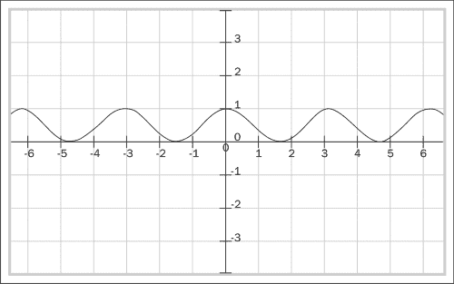
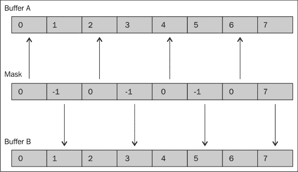

# 第四章：使用 OpenCL 函数

在本章中，我们将介绍以下食谱：

+   将向量存储到数组中

+   从数组中加载向量

+   使用几何函数

+   使用整数函数

+   使用浮点函数

+   使用三角函数

+   OpenCL 中的算术和舍入

+   在 OpenCL 中使用 shuffle 函数

+   在 OpenCL 中使用选择函数

# 简介

在本章中，我们将探讨如何在你的代码中利用 OpenCL 提供的常用函数。我们正在检查的函数将主要是应用于元素的数学运算，特别是应用于元素向量。回想一下，向量是 OpenCL 允许多个元素在硬件上并行处理的主要方式。由于 OpenCL 供应商通常可以生成矢量化硬件指令来有效地加载和存储此类元素，因此尽可能多地使用它们。

详细来说，我们将深入了解以下内容的工作原理：

+   向量的数据加载和存储函数

+   几何函数

+   整数函数

+   浮点函数

+   三角函数

最后，我们将介绍两个部分，说明如果你选择在你的应用程序中使用 OpenCL 的 `shuffle` 和 `select` 函数，它们将如何工作。

# 将向量存储到数组中

在前面的章节中，你瞥见了我们如何以各种方式使用向量，从一种将数据以高效方式传输到设备并从设备传输的工具，到 OpenCL 实际上在向量上工作的函数。我们还了解到 OpenCL 提供了大量针对向量的函数。在本节中，我们将探讨如何将向量存储到数组中（当我们在这个上下文中使用数组与向量一起时，我们指的是包含标量值的数组）。

`vstore<N>` 函数，其中 `<N>` 是 `2`、`3`、`4`、`8` 和 `16`，是你将使用的主要函数，以实际通知 OpenCL 你希望将你的向量元素以并行方式存储到目的地；这通常是一个标量数组或另一个向量。

我们应该清楚，`gentypeN` 不是一个类似于 C 的数据类型别名，而是一个用于诸如 `char`、`uchar`、`short`、`ushort`、`int`、`uint`、`long`、`ulong`、`float` 和 `double` 等类型的逻辑占位符。`N` 表示它是一个聚合 `2`、`3`、`4`、`8` 或 `16` 个元素的数结构。记住，如果你希望存储 `double` 类型的向量，那么你需要在内核代码中声明任何 `double` 精度数据类型之前，确保代码中包含指令 `#pragma OPENCL EXTENSION cl_khr_fp64 : enable`。

### 小贴士

因此，`vstoreN` API 将将数据提供的 `sizeof(gentypeN)` 字节写入地址 `(p + (offset * N))`。如果 `gentype` 是 `char` 或 `uchar`，则计算为 `(p + (offset * N))` 的地址必须是 8 位对齐；如果 `gentype` 是 `short` 或 `ushort`，则必须是 16 位对齐；如果 `gentype` 是 `int` 或 `uint`，则必须是 32 位对齐；如果 `gentype` 是 `long`、`ulong` 或 `double`，则必须是 64 位对齐。

你应该注意到，内存写入可以跨越全局内存空间（`__global`），到局部（`__local`），甚至到工作项私有内存空间（`__private`），但永远不会到常量内存空间（`__constant`是只读的）。根据你的算法，你可能需要通过内存屏障（也称为栅栏）来协调对另一个内存空间的写入。

### 小贴士

你需要内存屏障或栅栏的原因是，通常情况下，内存的读取和写入可能会发生乱序，而造成这种情况的主要原因在于源代码的编译器优化会重新排序指令，以便利用硬件的优势。

为了进一步阐述这个想法，你可能知道 C++有一个关键字`volatile`，它用于标记一个变量，使得编译器优化通常不会对该变量的任何使用应用优化过的加载/存储；基本上，这种变量的任何使用通常都涉及在每个使用点（也称为序列点）的加载-使用-存储周期。

循环展开是一种优化技术，编译器试图在代码中移除分支，从而发出任何分支预测指令，以便代码高效执行。在你习惯的循环中，你经常会找到一个如下所示的表达式：

```py
for(int i = 0; i  < n; ++i ) { ... }
```

这里发生的情况是，当这段代码被编译时，你会注意到 ISA 会发出一条指令来比较`i`的值与`n`的值，并根据比较结果执行某些操作。当执行线程在条件为真时采取一条路径，条件为假时采取另一条路径时，就会发生分支。通常，CPU 会同时执行这两条路径，直到它以 100%的确定性知道应该采取其中一条路径，CPU 可以丢弃另一条未使用的路径，或者它需要回溯其执行。在任一情况下，当这种情况发生时，你都会损失几个 CPU 周期。因此，开发者可以帮助编译器，在我们的情况下，向编译器提供关于`n`的值的提示，这样编译器就不必生成代码来检查`i < n`。不幸的是，OpenCL 1.2 不支持作为扩展的循环展开，而是 AMD APP SDK 和 CUDA 工具包提供了以下 C 指令：

```py
#pragma unroll <unroll-factor>
#pragma unroll 10
for(int i = 0; i < n; ++i) { ... }
```

没有这些函数，OpenCL 内核可能会为每个处理的元素发出一个内存加载/存储操作，如下面的图示所示：


让我们通过一个简单的例子来看看我们如何使用这些`vstoreN`函数。

## 准备工作

这个配方将向你展示来自 `Ch4/simple_vector_store/simple_vector_store.cl` 的代码片段，其中使用 `vstore16(...)` 加载并随后复制一个 16 个元素的向量。这个 API 并不完全等同于 16 个元素的循环展开的糖语法，原因是编译器生成从内存中加载 16 个元素的向量的指令；另外，OpenCL 1.1 中不存在我们知道的循环展开，但如果这有助于理解 `vstoreN` API 背后的概念，那么从那个角度思考是没有害处的。

## 如何做…

下面的内核代码是我们将演示数据传输的地方：

```py
//
// This kernel loads 64-elements using a single thread/work-item
// into its __private memory space and writes it back out
__kernel void wideDataTransfer(__global float* in,__global float* out) {
    size_t id = get_global_id(0);
    size_t offsetA = id ;
    size_t offsetB = (id+1);
    size_t offsetC = (id+2);
    size_t offsetD = (id+3);

    // each work-item loads 64-elements
    float16 A = vload16(offsetA, in);
    float16 B = vload16(offsetB, in);
    float16 C = vload16(offsetC, in);
    float16 D = vload16(offsetD, in);

    vstore16(A, offsetA, out);
    vstore16(B, offsetB, out);
    vstore16(C, offsetC, out);
    vstore16(D, offsetD, out);
}
```

要在 OS X 平台上编译它，你将不得不运行一个类似于以下编译命令：

```py
gcc –std=c99 –Wall –DUNIX –g –DDEBUG –DAPPLE –arch i386 –o VectorStore vector_store.c –framework OpenCL

```

或者，你可以在 `Ch4/simple_vector_store/` 源目录中输入 `make`。当这样做时，你将得到一个名为 `VectorStore` 的二进制可执行文件。

要在 OS X 上运行程序，只需执行程序 `VectorStore`，你应该看到以下输出：`Check passed!` 或 `Check failed!`，如下所示：

```py
Check passed!

```

## 它是如何工作的…

这段代码可以从这样一个角度来理解：在全局内存空间中存在一个大向量，我们的尝试是将这个向量加载到私有内存中的一个变量中，即每个工作项都有一个名为 `t` 的唯一变量；对它不做任何操作，并将其存储回全局内存空间中另一个内存数组。

### 小贴士

如果你对此工作原理感到好奇，内存写入实际上是合并的，以便以字节突发的方式发出写入。这个突发的大小取决于硬件的内部架构。以 AMD 的 ATI GPU 为例，这些内存写入在已知发生 16 次写入后才会发出，这与 GPU 中工作项的实现有关。你可以看到，对于 GPU 来说，为每个工作项发出读取或写入是非常低效的。当你结合这样一个事实，即在一个集群 GPU 解决方案中可能存在数十万个活跃的计算线程，你可以想象，如果制造商实现一个允许开发者以工作项/线程粒度管理程序的逻辑，那么复杂性将是难以想象的。因此，显卡制造商决定，以锁步方式执行一组线程更有效率。ATI 称这组执行线程为波前，NVIDIA 称其为 warp。当你开始在 OpenCL 设备上开发非平凡算法时，这种理解是至关重要的。

当你构建示例应用程序并运行它时，它并没有做我们看到的特别特殊的事情，但看到底层代码是如何生成的是有用的，在这个例子中，Intel OpenCL SDK 是说明性的。


特别的，汇编代码片段是结果翻译到 **SSE2/3/4** 或 **Intel AVX** （**高级向量扩展**）代码。

# 从数组中加载向量

`vloadN` 函数通常用于从内存中的数组加载多个元素到内存中的目标数据结构，通常是向量。类似于 `vstoreN` 函数，`vloadN` 函数也加载来自全局（`__global`）、局部（`__local`）、工作项私有（`__private`）以及最后常量内存空间（`__constant`）的元素。

我们应该清楚，`gentypeN` 不是一个类似于 C 的数据类型别名，而是一个用于类型的逻辑占位符：`char`、`uchar`、`short`、`ushort`、`int`、`uint`、`long`、`ulong`、`float` 或 `double`，而 `N` 表示它是一个聚合 `2`、`3`、`4`、`8` 或 `16` 个元素的 数据结构。没有这个函数，内核需要发出可能多个内存加载，如下面的图示所示：


## 准备工作

以下是从 `Ch4/simple_vector_load/simple_vector_load.cl` 的摘录。我们专注于理解如何在设备内存空间中加载元素向量以进行设备内的计算，即 CPU/GPU。但这次，我们使用了一种称为**预取**（当你的代码即将使用数据时预热缓存，并且你希望它也接近，也称为空间和时间局部性）的优化技术，通常用于分配给局部内存空间，以便所有工作项都可以从缓存中读取数据，而不会在总线上产生过多的请求。

## 如何做到这一点…

以下是我们将从中汲取灵感的内核代码：

```py
__kernel void wideDataTransfer(__global float* in, __global float* out) {
  size_t id = get_group_id(0) * get_local_size(0) +get_local_id(0);
  size_t STRIDE = 16;
  size_t offsetA = id;
  prefetch(in + (id*64), 64);
  barrier(CLK_LOCAL_MEM_FENCE);

  float16 A = vload16(offsetA, in);
  float a[16]; 
  a[0] = A.s0;
  a[1] = A.s1;
  a[2] = A.s2;
  a[3] = A.s3;
  a[4] = A.s4;
  a[5] = A.s5;
  a[6] = A.s6;
  a[7] = A.s7;
  a[8] = A.s8;
  a[9] = A.s9;
  a[10] = A.sa;
  a[11] = A.sb;
  a[12] = A.sc;
  a[13] = A.sd;
  a[14] = A.se;
  a[15] = A.sf;
  for( int i = 0; i < 16; ++i ) {
    out[offsetA*STRIDE+i] = a[i];
  }
}
```

要在 OS X 平台上编译它，你必须运行一个类似于以下命令的编译命令：

```py
gcc –std=c99 –Wall –DUNIX –g –DDEBUG –DAPPLE –arch i386 –o VectorLoad vector_load.c –framework OpenCL

```

或者，你可以在源目录 `Ch4/simple_vector_load/` 中输入 `make`。当这样做时，你将得到一个名为 `VectorLoad` 的二进制可执行文件。

要在 OS X 上运行程序，只需执行程序 `VectorLoad`，你应该会看到以下输出：`Check passed!` 或 `Check failed!`：

```py
Check passed!

```

## 它是如何工作的…

内核将继续从全局内存空间通过工作组中的第一个工作项预取 `16` 个 `float` 类型的值到全局缓存，这些值最终将通过 `vload16` API 到达工作项的 `__private` 内存空间。一旦这些值被加载，我们可以将单个浮点数分配给数组，并最终通过显式写入 `out` 的 `__global` 内存空间将它们输出到目标位置。这是从驻留在全局内存空间中的标量数组进行内存加载的一种方法。

```py
prefetch(in +(id*64), 64);
```

前一行是一个优化技术，用于通过在需要之前提供数据来提高数据重用性；这个预取指令应用于工作组中的一个工作项，并且我们选择了每个工作组中的第一个工作项来执行这项操作。在存在大量数据重用的算法中，其好处将比以下示例更显著：

你可能还注意到我们没有编写以下代码：

```py
out[offset*STRIDE + i] = A; // 'A' is a vector of 16 floats
```

我们没有这样做的原因是 OpenCL 禁止隐式/显式地将向量类型转换为标量。


除了生成的 SSE 指令之外，还有一件有趣的事情值得指出，那就是即使代码只提到了一个预取指令，也会生成多个硬件预取指令。这种伪装允许 OpenCL 供应商根据开放标准实现功能，同时仍然允许供应商向开发者隐藏实际的实现细节。

# 使用几何函数

几何函数被程序员用于在向量上执行常见计算，例如，叉积或点积，归一化向量，以及向量的长度。为了回顾一下向量的叉积和点积，请记住，在数学意义上，向量代表具有方向和大小的数量，这些向量在计算机图形学中被广泛使用。

很频繁地，我们需要计算两个向量之间的距离（以度或弧度为单位），为此，我们需要计算点积，它被定义为：


因此，如果 *a* 与 *b* 垂直，那么它必须满足 *a . b = 0*。点积还用于计算矩阵-向量乘法，这解决了被称为 **线性系统** 的一类问题。两个 3D 向量的叉积将产生一个垂直于它们的向量，可以定义为：


这些乘积之间的区别在于，点积产生一个标量值，而叉积产生一个向量值。

以下是一个 OpenCL 的几何函数列表：

| 函数 | 描述 |
| --- | --- |
| `float4 cross(float4 m, float4 n)` `float3 cross(float3 m, float3 n)` | 返回 `m.xyz` 和 `n.xyz` 的叉积，结果向量中的 `w` 分量始终为零 |
| `float dot(floatn m, floatn n)` | 返回两个向量的点积 |
| `float distance(floatn m, floatn n)` | 返回 `m` 和 `n` 之间的距离。这是通过 `length(m – n)` 计算得出的 |
| `float length(floatn p)` | 返回向量 `p` 的长度 |
| `floatn normalize(floatn p)` | 返回与 `p` 方向相同但长度为 `1` 的向量 |
| `float fast_distance(floatn p0, floatn p1)` | 返回 `fast_length(p0 – p1)` |
| `float fast_length(floatn p)` | 返回向量 `p` 的长度，计算方式为:`half_sqrt()` |
| `floatn fast_normalize(floatn p)` | 返回与 `p` 方向相同但长度为 `1` 的向量。`fast_normalize` 是通过:`p * half_sqrt()` 计算得出的 |

你应该知道，这些函数是在 OpenCL 中使用 *四舍五入到最接近偶数* 的舍入模式实现的，也称为 **rte-mode**。

接下来，让我们看看一个利用这些函数的示例。

## 准备工作

`Ch4/simple_dot_product/matvecmult.cl` 中的代码片段说明了如何计算二维向量和矩阵之间的点积，并将该计算的输出结果写回输出数组。当你刚开始使用 OpenCL 时，可能会有两种可能的方式来编写这个功能，我认为发现这些差异是有教育意义的；然而，我们只展示了演示点积 API 的相关代码片段。

## 如何操作…

以下是最简单的矩阵点积操作的实现：

```py
__kernel void MatVecMultUsingDotFn(__global float4* matrix,__global float4* vector, __global float* result) {
    int i = get_global_id(0);
    result[i] = dot(matrix[i], vector[0]);
}
```

要在 OS X 平台上编译此程序，你需要运行一个类似于以下的编译命令：

```py
gcc –std=c99 –Wall –DUNIX –g –DDEBUG –DAPPLE –arch i386 –o MatVecMult matvecmult.c –framework OpenCL

```

或者，你可以在源目录 `Ch4/simple_dot_product/` 中输入 `make`。当这样做时，你将有一个名为 `MatVecMult` 的二进制可执行文件。

要在 OS X 上运行程序，只需执行名为 `MatVecMult` 的程序，你应该会看到以下输出：`Check passed!` 或 `Check failed!`：

```py
Check passed!

```

## 它是如何工作的…

之前的代码片段可能是你想要编写的最简单的实现矩阵点积操作的代码。内核实际上从两个输入的 `__global` 内存空间中读取 `4` 个浮点数向量，计算它们之间的点积，并将结果写回目标 `__global` 内存空间。之前我们提到可能还有另一种编写方式。是的，有，相关的代码如下：

```py
__kernel void MatVecMult(const __global float* M,const __global float* V, uint width, uint height,__global float* W) {
    // Row index
    uint y = get_global_id(0);
    if (y < height) {
       // Row pointer
       const __global float* row = M + y * width;
       // Compute dot product
       float dotProduct = 0;
      for (int x = 0; x < width; ++x)
        dotProduct += row[x] * V[x];
    // Write result to global memory
    W[y] = dotProduct;
    }
}
```

当你比较这个没有使用点积 API 的实现时，你会发现你不仅需要输入更多，而且你还将增加工作项变量的数量，这些变量恰好位于 `__private` 内存空间中；通常你不想这样做，因为它阻碍了代码的可读性，并且也非常重要的是可扩展性，因为消耗了太多的寄存器。

### 注意

在 OpenCL 实现中，他们需要管理设备上的可用资源，这些资源可能是可用内存或可用计算单元。其中一种资源是包含固定数量通用寄存器的寄存器文件，设备使用这些寄存器来执行一个或多个内核。在 OpenCL 内核编译期间，将确定每个内核执行所需的寄存器数量。例如，我们假设开发了一个内核，它使用 `__private` 内存空间中的 10 个变量，寄存器文件为 `65536`，这意味着我们可以启动 65536 / 10 = 6553 个工作项来运行我们的内核。如果你以这种方式重写你的内核，使用更多的 `__local` 内存空间中的数据共享，那么你可以释放更多的寄存器，并且可以更好地扩展你的内核。

# 使用整数函数

OpenCL 中的整数函数主要提供了有用的方式，你可以使用它们来执行常规的数学计算，例如获取绝对值、将值除以二、定位三个值的最小值或最大值、数字的循环移位，以及为解决特定类问题而设计的特殊乘法形式。我们提到的许多函数，如 `min` 和 `max`，并不以原子的方式执行比较，但如果你确实想确保这一点，则可以使用一类原子函数，我们将在稍后考察它们。

整数函数的一类是原子函数，它允许开发者以原子方式交换值（包括单精度浮点值），其中一些函数实现了**CAS**（**比较并交换**）语义。通常，你可能想确保某些操作具有原子性，因为没有这个特性，你将遇到竞态条件。


原子函数通常接受两个输入（它们必须是整型，只有 `atomic_xchg` 支持单精度浮点类型），第一个参数是一个指向全局（`__global`）和局部（`__local`）内存空间中内存位置的指针，它们通常用 `volatile` 关键字进行标注，这阻止编译器优化与变量使用相关的指令；这很重要，因为读取和写入可能是不按顺序的，可能会影响程序的正确性。以下是一个说明原子操作如何序列化对共享数据的访问的心理模型：


以下示例 `atomic_add` 有两种版本，它们可以处理有符号或无符号值：

```py
int atomic_add(volatile __global int*p, int val)
unsigned int atomic_add(volatile __global uint*p, uint val)
```

你需要注意到的一个另一点是，仅仅因为你可以应用原子性来断言某些值的正确性，并不意味着程序的正确性。

这种情况的原因是由于工作项的实现方式，正如我们在本章前面提到的，NVIDIA 和 ATI 以称为工作组的形式执行工作项，每个工作组包含多个执行线程块，分别称为**warp**（32 个线程）和**wavefront**（64 个线程）。因此，当工作组在内核上执行时，该组中的所有工作项都是同步执行的，通常这不会成为问题。问题出现在工作组足够大，可以包含多个 warp/wavefront 的情况下；那么你将面临一个情况，其中一个 warp/wavefront 的执行速度比另一个慢，这可能会成为一个大问题。

真正的问题是，无法在所有符合 OpenCL 标准的设备上强制执行内存排序；因此，唯一的方法是在程序中的某些点上放置内存屏障，来告诉内核我们希望加载和存储操作协调一致。当存在这样的屏障时，编译器将生成指令，确保在执行屏障之后的任何指令之前，所有执行工作项都完成了在屏障之前对全局/局部内存空间的加载和存储操作，这将保证更新的数据被看到；或者用编译器的术语来说：内存加载和存储操作将在任何加载和存储操作之后提交到内存中。

这些 API 为开发者提供了在读取和写入排序、只读或只写方面更好的控制级别。参数标志可以组合 `CLK_LOCAL_MEM_FENCE` 和/或 `CLK_GLOBAL_MEM_FENCE`。

## 准备工作

该配方将向你展示 `Ch4/par_min/par_min.cl` 中的代码片段，用于在设备（即 GPU 或 CPU 内存空间）中的大数组中找到最小值。此示例结合了几个概念，例如使用 OpenCL 的原子指令来启用原子函数和内存屏障来协调内存加载和存储。

## 如何操作...

以下代码演示了如何在包含大量整数的容器中找到最小数的方法：

```py
#pragma OPENCL EXTENSION cl_khr_local_int32_extended_atomics : enable
#pragma OPENCL EXTENSION cl_khr_global_int32_extended_atomics : enable
__kernel void par_min(__global uint4* src,__global uint * globalMin, __local  uint * localMin,int numOfItems) {
    uint count = ( numOfItems / 4) / get_global_size(0);
    uint index = get_global_id(0) * count;
    uint stride = 1;
    uint partialMin = (uint) -1;
    for(int i = 0; i < count; ++i,index += stride) {
      partialMin = min(partialMin, src[index].x);
      partialMin = min(partialMin, src[index].y);
      partialMin = min(partialMin, src[index].z);
      partialMin = min(partialMin, src[index].w);
    }
    if(get_local_id(0) == 0) localMin[0] = (uint) -1;
      barrier(CLK_LOCAL_MEM_FENCE);
    atomic_min(localMin, partialMin);
    barrier(CLK_LOCAL_MEM_FENCE);
    if (get_local_id(0) == 0)
      globalMin[ get_group_id[0] ] = localMin[0];
}
__kernel void reduce(__global uint4* src,__global uint * globalMin) {
    atom_min(globalMin, globalMin[get_global_id(0)]);
}
```

要在 OS X 平台上编译它，你必须运行一个类似于以下编译命令：

```py
gcc –std=c99 –Wall –DUNIX –g –DDEBUG –DAPPLE –arch i386 –o ParallelMin par_min.c –framework OpenCL

```

或者，你可以在源目录 `Ch4/par_min/` 中输入 `make`。当这样做时，你将得到一个名为 `ParallelMin` 的二进制可执行文件。

在 OS X 操作系统上运行程序，只需执行程序 `ParallelMin`，你应该会看到以下输出：`Check passed!` 或 `Check failed!`，如下所示：

```py
Check passed!

```

## 它是如何工作的...

这种工作方式是，一个工作项遍历源缓冲区并尝试并行地找到最小值，当内核在 CPU 或 GPU 上运行时，源缓冲区被均匀地分配给这些线程，每个线程将遍历分配给它们的 `__global` 缓冲区，并将所有值减少到 `__private` 内存中的最小值。

随后，所有线程将通过原子操作将它们 `__private` 内存中的最小值减少到 `__local` 内存，并将此减少的值刷新到 `_` `_global` 内存。

一旦工作组完成执行，第二个内核，即 `reduce`，将使用原子操作将所有工作组的值减少到 `__global` 内存中的单个值。

# 使用浮点函数

到目前为止，你已经看到了几个函数，它们接受单精度或双精度浮点数值作为输入或输出。给定一个浮点值 *x*，OpenCL 浮点函数为你提供了通过 `frexp()` 从 *x* 中提取尾数和指数的能力，通过 `modf()` 分解 *x*，通过 `nextafter()` 计算下一个最大的/最小的单精度浮点值，以及其他功能。考虑到有如此多的有用浮点函数，有两个函数非常重要，因为它们在 OpenCL 代码中非常常见。它们是 `mad()` 和 `fma()` 函数，分别对应乘加和融合乘加指令。

**乘加**（**Multiply-Add**，**MAD**）指令执行浮点数乘法后跟浮点数加法，但产品及其中间产品是否四舍五入是不确定的。**融合乘加**（**Fused Multiply-Add**，**FMA**）指令仅对产品进行四舍五入，不对其任何中间产品进行四舍五入。实现通常在操作的精度和速度之间进行权衡。

我们可能不应该深入这类学术研究；然而，在这样的时代，我们认为指出学术在许多情况下如何帮助我们做出明智的决定可能是有帮助的。话虽如此，代尔夫特理工大学的一项特别研究，题为 *CUDA 和 OpenCL 的全面性能比较* [链接](http://www.pds.ewi.tudelft.nl/pubs/papers/icpp2011a.pdf)，表明与 MAD 实现相比，FMA 指令计数更高，这可能会让我们得出结论，即 MAD 应该比 FMA 运行得更快。我们可以通过简单地比较两个指令计数来猜测大约快多少，但我们应指出，这是一个非常简化的观点，因为我们不应忽视编译器供应商在优化编译器中扮演着重要角色的事实，并强调 NVIDIA 进行了一项名为 *精度与性能：NVIDIA GPU 的浮点数和 IEEE 754 兼容性* 的研究，该研究可在以下链接中阅读：[链接](http://developer.download.nvidia.com/assets/cuda/files/NVIDIA-CUDA-Floating-Point.pdf)。该研究建议 FMA 可以提供精度和性能，NVIDIA 至少是我们所知的一个公司，它们在 GPU 芯片中用 FMA 替换了 MAD。

遵循乘法的主题，你应该知道有针对整数乘法而不是浮点数的指令；这些指令的例子有 `mad_hi`、`mad_sat` 和 `mad24`，这些函数为开发者提供了对影响更高效计算以及如何使用这些优化版本实现的精细控制。例如，`mad24` 只在 32 位整数的低 24 位上操作，因为当操作有符号整数时预期值在 [-223, 223 -1] 范围内，对于无符号整数则是 [0, 224 -1]。

## 准备工作

`Ch4/simple_fma_vs_mad/fma_mad_cmp.cl` 中的代码片段演示了如何测试 MAD 和 FMA 指令之间的性能，如果你愿意，可以完成计算。然而，我们将要演示的是简单地依次运行每个内核，并检查两种计算的结果是否相同。

## 如何做…

以下代码演示了如何在 OpenCL 中使用 MAD 和 FMA 函数：

```py
__kernel void mad_test(__global float* a, __global float* b, __global float* c, __global float* result) {
  float temp = mad(a, b, c);
  result[get_global_id(0)] = temp;
}
__kernel void fma_test(__global float* a, __global float* b,__global float* c, __global float* result) {
  float temp = fma(a, b, c);
  result[get_global_id(0)] = temp;
}
```

要在 OS X 平台上编译它，你将需要运行一个类似于以下命令的编译命令：

```py
gcc –std=c99 –Wall –DUNIX –g –DDEBUG –DAPPLE –arch i386 –o FmaMadCmp fma_mad_cmp.c –framework OpenCL

```

或者，你可以在源目录 `Ch4/simple_fma_vs_mad/` 中输入 `make`。当这样做时，你将得到一个名为 `FmaMadCmp` 的二进制可执行文件。

要在 OS X 上运行程序，只需执行程序 `FmaMadCmp`，你应该看到以下输出：`Check passed!` 或 `Check failed!`，如下所示：

```py
Check passed!

```

## 它是如何工作的…

驱动代码使用单精度浮点值通过在 GPU/CPU 上依次运行两个内核来计算方程的值。每个内核都会将值从 `__global` 内存空间加载到工作项/线程的 `__private` 内存空间。两个内核之间的区别在于一个使用 FMA 指令，而另一个使用 MAD 指令。检测所选设备上是否支持 FMA 指令的方法是在调用 `clGetDeviceInfo` 时传递以下参数之一：`CL_DEVICE_SINGLE_FP_CONFIG`、`CL_DEVICE_DOUBLE_FP_CONFIG` 和 `CL_DEVICE_HALF_FP_CONFIG`。我们使用标志 `CP_FP_FMA` 和 `FP_FAST_FMA` 通过包含头文件 `#include <math.h>` 在我们的平台上加载 `fma` 函数。

### 注意

如果定义了 C 宏 `FP_FAST_FMA`，则将其设置为 1 的常量，以指示 `fma()` 通常执行速度与乘法和加法双操作数相当，或者更快。如果此宏未定义，则意味着你的硬件不支持它。在 GNU GCC 编译器套件中，你想要检测的宏是 `__FP_FAST_FMA`，如果定义了它，则链接到 `FP_FAST_FMA`，或者将 `–mfused-madd` 传递给 GCC 编译器（默认开启，如果 ISA 支持，则自动生成 FMA 指令）。

# 使用三角函数

如果你在计算机图形学行业工作，或者你正在编写用于天气预报、连分数等的模拟程序，三角函数将非常有用。OpenCL 在提供三角函数支持时提供了常用的函数，如 `cos`、`acos`、`sin`、`asin`、`tan`、`atan`、`atanh`（双曲反正切）、`sinh`（双曲正弦）等。

在本节中，我们将探讨流行的三角恒等式函数：

```py
*sin2 + cos2 = 1*

```

从毕达哥拉斯定理中，我们了解到，在 *a*、*b*、*c* 边的直角三角形中，在 *a* 和 *c* 相遇的顶点处有一个角 *t*，根据定义，*cos(t)* 是 *a*/*c*，*sin(t)* 是 *b*/*c*，因此 *cos2(t) + sin2(t) = (a/c)2 + (b/c)2*，结合事实 *a2 + b2 = c2*，因此 *cos2(t) + sin2(t) = 1*。

在掌握了这些知识之后，你可以用这个恒等式解决许多有趣的问题，但为了说明，让我们假设我们想要找到单位圆的数量。

单位圆是另一种看待我们刚才讨论的恒等式的方法。一个虚构的例子是确定从给定的两个数组中哪些值会是有效的单位圆。

## 准备工作

`Ch4/simple_trigonometry/simple_trigo.cl` 中的代码片段展示了用于计算从两个数据源中哪些值可以正确形成一个单位圆的 OpenCL 内核。

### 注意

如果你还记得你上过的基础三角学课程，当你将 *sin(x) + cos(x)* 的结果相加，其中 *x* 是来自正数或负数的值时，它将产生两个不同的直线函数 *y = 1* 和 *y = -1*，并且当你对 *sin(x)* 和 *cos(x)* 的结果进行平方，*cos2(t) + sin2(t) = 1* 的结果显然。请参见以下图表以供说明：


上述图表和以下图表分别反映了 *sin(x)* 和 *cos(x)* 的图表：



以下图表说明了如何将前两个图表叠加在一起，从而得到由以下方程表示的直线：


## 如何做…

以下代码片段展示了将确定单位圆的内核代码：

```py
__kernel void find_unit_circles(__global float16* a,__global float16* b, __global float16* result) {
    uint id = get_global_id(0);
    float16 x = a[id];
    float16 y = b[id];
    float16 tresult = sin(x) * sin(x) + cos(y) * cos(y);
    result[id] = tresult;
}
```

要在 OS X 平台上编译它，你需要运行一个类似于以下命令的编译命令：

```py
gcc –std=c99 –Wall –DUNIX –g –DDEBUG –DAPPLE –arch i386 –o SimpleTrigo simple_trigo.c –framework OpenCL

```

或者，你可以在源目录 `Ch4/simple_trigonometry/` 中输入 `make`。当这样做时，你将得到一个名为 `SimpleTrigo` 的二进制可执行文件。

要在 OS X 上运行程序，只需执行程序 `SimpleTrigo`，你应该会看到以下所示的输出：

```py
Find Unit Circle:
Unit circle with x=1, y=1

```

## 它是如何工作的…

驱动程序通过填充值来加载两个数据源，并将数据源注册在设备命令队列上，同时注册了准备执行的内核程序对象。

在内核执行期间，数据源通过单一精度浮点 16 元素向量加载到设备中。正如前几章所强调的，这利用了设备的向量化硬件。内存中的向量被传递到正弦和余弦函数中，这两个版本中一个接受标量值，另一个接受向量值，一旦完成，我们就将结果输出到全局内存中；您会注意到乘法/加法运算符实际上执行的是逐分量乘法和加法。

# OpenCL 中的算术和舍入

舍入是 OpenCL 中的一个重要主题，我们还没有真正深入探讨，但这种情况即将改变。OpenCL 1.1 支持四种舍入模式：四舍五入到最接近的数（偶数）、四舍五入到零、四舍五入到正无穷大和四舍五入到负无穷大。OpenCL 1.1 合规设备所需的唯一舍入模式是四舍五入到最近的偶数。

### 注意

如果结果是两个可表示值之间的中间值，则选择偶数表示。在这里，“偶数”意味着最低位为零。

您应该知道，这些适用于 OpenCL 1.1 支持的单一精度浮点值；我们必须与提供操作双精度浮点值函数的供应商进行核对，尽管作者怀疑它们至少应该遵守以支持四舍五入到最近的偶数模式。

另一点是，您不能通过编程方式配置您的内核以继承/更改调用环境使用的舍入模式，这很可能是您的程序在 CPU 上执行的地方。在 GCC 至少，您实际上可以使用内联汇编指令，例如，`asm("assembly code inside quotes")`，通过向程序中插入适当的硬件指令来更改程序中的舍入模式。下一节将尝试通过使用常规 C 编程并从 GCC 获得一些帮助来演示如何实现这一点。

### 注意

在 Intel 64 和 IA-32 架构中，舍入模式由一个 2 位的**舍入控制**（**RC**）字段控制，其实现在两个硬件寄存器中隐藏：**x87 FPU**控制寄存器和**MXCSR**寄存器。这两个寄存器都有 RC 字段，x87 FPU 控制寄存器中的 RC 在 CPU 执行 x87 FPU 计算时被使用，而 MXCSR 中的 RC 字段用于控制使用**SSE/SSE2**指令执行的**SIMD**浮点计算的舍入。

## 准备工作

在 `Ch4/simple_rounding/simple_rounding.cl` 代码片段中，我们展示了 *四舍五入到最接近的偶数* 模式是 OpenCL 1.1 提供的内置函数中的默认模式。示例继续演示了特定内置函数和余数将如何使用默认舍入模式来存储浮点计算的结果。接下来的几个操作是为了演示以下 OpenCL 内置函数的用法，如 `rint`、`round`、`ceil`、`floor` 和 `trunc`。

## 如何做到这一点...

以下代码片段检查了各种舍入模式：

```py
__kernel void rounding_demo(__global float *mod_input, __global float *mod_output, __global float4 *round_input,__global float4 *round_output) {
    mod_output[1] = remainder(mod_input[0], mod_input[1]);
    round_output[0] = rint(*round_input);
    round_output[1] = round(*round_input);
    round_output[2] = ceil(*round_input);
    round_output[3] = floor(*round_input);
    round_output[4] = trunc(*round_input);
}
```

要在 OS X 平台上编译它，你必须运行一个类似于以下命令的编译命令：

```py
gcc –std=c99 –Wall –DUNIX –g –DDEBUG –DAPPLE –arch i386 –o SimpleRounding simple_rounding.c –framework OpenCL

```

或者，你可以在源目录 `Ch4/simple_rounding/` 中输入 `make`。当这样做时，你将得到一个名为 `SimpleRounding` 的二进制可执行文件。

要在 OS X 上运行程序，只需执行程序 `SimpleRounding`，你应该会看到以下所示的输出：

```py
Input: -4.5f, -1.5f, 1.5f, 4.5f
Rint:
Round:
Ceil:
Floor:
Trunc:

```

## 它是如何工作的...

如前所述，主机上的内存数据结构使用值初始化，并在创建设备命令队列后一次性发送到设备；一旦完成，内核就会被发送到命令队列进行执行。随后，结果从设备读取并显示在控制台上。

为了理解这些函数是如何工作的，我们首先通过探究它们的方法签名，然后分析程序执行的结果，以获得对结果是如何产生的洞察是非常重要的。

## 还有更多……

OpenCL 1.2 为开发者带来了丰富的数学函数，以武装其能力，其中四个常见的函数是计算地板和天花板、四舍五入到整数、截断以及四舍五入浮点数。地板函数的签名是：

```py
gentype floor(gentype x);
// gentype can be float,float2,float3,float4,float8,float16
```

此函数使用*四舍五入到负无穷*舍入模式四舍五入到整数值。首先，你的 OpenCL 设备需要支持这种舍入模式，你可以通过在传递 `CL_DEVICE_DOUBLE_FP_CONFIG` 到 `clGetDeviceInfo(device_id, ...)` 时检查 `CL_FP_ROUND_TO_INF` 值的存在来确定这一点。

下一个方法，ceil 的签名是：

```py
gentype ceil(gentype x);
// gentype can be float,float2,float3,float4,float8,float16
```

此函数使用*四舍五入到正无穷*舍入模式四舍五入到整数值。

注意，当将介于 `-1` 和 `0` 之间的值传递给 `ceil` 时，结果将自动变为 `-0`。

四舍五入到整数值的方法签名如下：

```py
gentype rint(gentype x);
// gentype can be float,float2,float3,float4,float8,float16
```

此函数使用*四舍五入到最接近的偶数*舍入模式四舍五入到整数值。

注意，当将介于 `-0.5` 和 `0` 之间的值传递给 `rint` 时，结果将自动变为 `-0`。

截断函数在精度不是你优先考虑的事项时非常有用，其方法签名是：

```py
gentype trunc(gentype x);
// gentype can be float,float2,float3,float4,float8,float16
```

此函数使用*四舍五入到零*舍入模式四舍五入到整数值。

舍入方法签名如下：

```py
gentype round(gentype x);
// gentype can be float,float2,float3,float4,float8,float16
```

此函数返回最接近 *x* 的整数值，对于四舍五入的情况，无论当前舍入方向如何，都舍去零。可用函数的完整列表可以在 OpenCL 1.2 规范的 *第 6.12.2 节* 中找到。

当你运行程序时，你应该得到以下结果：

```py
Input: -4.5, 1.5, 1.5, 4.5
Rint:  -4.0, -2.0, 2.0, 4.0
Round: -5.0, -2.0, 2.0, 5.0
Ceil:  -4.0, -1.0, 2.0, 5.0
Floor: -5.0, -2.0, 1.0, 4.0
Trunc: -4.0, -1.0, 1.0, 4.0

```

# 在 OpenCL 中使用 shuffle 函数

`shuffle` 和 `shuffle2` 函数是在 OpenCL 1.1 中引入的，用于从它们的输入（这些输入可以是单个向量或两个向量）构建元素排列，并返回与输入相同类型的向量；返回向量的元素数量由传递给它的参数 `mask` 决定。让我们看看它的方法签名：

```py
gentypeN shuffle(gentypeM x, ugentypeN mask);
gentypeN shuffle(gentypeM x, gentypeM y, ugentypeN mask);
```

在签名中使用的 `N` 和 `M` 代表返回向量和输入向量的长度，可以取值 `{`2`，`3`，`4`，`8`，`16`}`。`ugentype` 代表无符号类型，`gentype` 代表 OpenCL 中的整数类型以及浮点类型（即半精度、单精度或双精度）；如果你选择使用浮点类型，请记住扩展 `cl_khr_fp16` 或 `cl_khr_fp64`。

这里有一个它如何工作的例子：

```py
uint4 mask = {0,2,4,6};
uint4 elements = {0,1,2,3,4,5,6};
uint4 result = shuffle(elements, mask);
// result = {0,2,4,6};
```

让我们看看一个简单的实现，我们从流行的 **Fisher-Yates Shuffle**（**FYS**）算法中汲取灵感。这个 FYS 算法生成一个有限集合的随机排列，其基本过程类似于从一个容器中随机抽取一个编号的票，或者从一副牌中抽取一张牌，依次进行，直到容器/牌堆中没有剩余的牌。这个算法最令人欣赏的特性之一是它保证产生一个无偏的结果。我们的例子将关注于如何进行洗牌，因为它本质上是根据一个应该随机生成的掩码来选择特定的元素。

## 准备工作

`Ch4/simple_shuffle/simple_shuffle.cl` 中的代码片段几乎捕捉了我们试图说明的大部分想法。想法很简单，我们想要生成一个掩码，并使用该掩码生成输出数组的排列。我们不会使用梅森旋转器这样的伪随机数生成器，而是依赖于 C 的 `stdlib.h` 函数，一个具有有效种子的随机函数，从这个函数中生成一系列随机数，其中每个数不能超过输出数组最大大小的值，即 `15`。

### 注意

`stdlib.h` 中的 `rand()` 函数并不真正受欢迎，因为它生成的随机序列比 `random()` 生成的序列要少，因为 `rand()` 生成的低十二位数字会通过一个循环模式。

## 如何操作…

在我们开始洗牌之前，我们需要先对 RNG 进行初始化，这可以通过对 `srandom()` 进行简单的 API 调用并传递种子来实现。下一步是运行我们的内核多次，我们通过将内核执行封装在循环中来实现这一点。以下是从 `Ch4/simple_shuffle/simple_shuffle.c` 中的主机代码的代码片段，展示了这一点：

```py
#define ITERATIONS 6
#define DATA_SIZE 1024
srandom(41L);
  for(int iter = 0; iter < ITERATIONS; ++iter) {
    for(int i = 0; i < DATA_SIZE; ++i) {
      mask[i] = random() % DATA_SIZE;
      // kernel is invoked
    }// end of inner-for-loop
   }//end of out-for-loop
```

以下内核代码通过*a*和*b*传输输入，它们的组合元素大小为`16`，掩码正在传输到常量内存空间（即只读）。

```py
__kernel void simple_shuffle(__global float8* a,__global float8* b, __constant uint16 mask,__global float16* result) {
    uint id = get_global_id(0);
    float8 in1 = a[id];
    float8 in2 = b[id];
    result[id] = shuffle2(in1, in2, mask);
}
```

要在 OS X 平台上编译它，你必须运行一个类似于以下命令的编译命令：

```py
gcc –std=c99 –Wall –DUNIX –g –DDEBUG –DAPPLE –arch i386 –o SimpleShuffle simple_shuffle.c –framework OpenCL

```

或者，你可以在源目录`Ch4/simple_shuffle/.`中键入`make`。当这样做时，你将有一个名为`SimpleShuffle`的二进制可执行文件。

要在 OS X 上运行程序，只需执行名为`SimpleShuffle`的程序，你应该会看到如下所示的输出：

```py
Shuffle: -4.5f, -1.5f, 1.5f, 4.5f

```

## 它是如何工作的…

以下图表表明，每个正在执行的内核通过从`__global`内存空间获取数据到`__private`内存空间的部分源数组工作，该数组包含*k*个元素。接下来的操作是使用预生成的随机数向量进行洗牌，这些随机数是在主机上预先生成的，对于每个分区数据块，内核将生成一个结果数组；一旦完成，内核将数据刷新到`__global`内存空间。以下图表说明了这个想法，其中结果数组由其单个组成部分的排列组成的排列数组：


# 在 OpenCL 中使用 select 函数

`select`函数首先与我们在上一节中看到的`shuffle`和`shuffle2`函数相似，也被称为**三元选择**，并且它是 OpenCL 中的关系函数之一，在 C++和 Java 编程语言中常见；但有一个显著的区别，那就是`select`函数及其变体`bitselect`不仅与单精度或双精度浮点类型一起工作，还与单精度或双精度浮点值向量一起工作。下面是它的样子：

```py
(predicate_is_true? eval_expr_if_true : eval_expr_if_false)
```

因此，当谓词评估为真时，冒号左侧的表达式将被评估；否则，评估冒号右侧的表达式，并且在两种评估中，都会返回一个结果。

使用 OpenCL 中的示例，以下条件语句：

```py
if (x == 1) r = 0.5;
if (x == 2) r = 1.0;
```

可以使用`select()`函数重写为：

```py
r = select(r, 0.5, isequal(x, 1));
r = select(r, 1.0, isequal(x, 2));
```

为了使这种转换正确，原始的`if`语句不能包含任何调用 I/O 的代码。

`select`/`bitselect`提供的主要优势是，供应商可以选择从其实施中消除分支和分支预测，这意味着生成的程序可能更高效。这意味着这两个函数充当了一个门面，使得像 AMD 这样的供应商可以使用 SSE2 的`__mm_cmpeq_pd`和`__mm_cmpneq_pd`等 ISA 来实现实际的功能；同样，Intel 可以选择 Intel AVX 的 ISA，如`__mm_cmp_pd`、`__mm256_cmp_pd`或从 SSE2 来实现`select`或`bitselect`的功能。

## 准备工作

以下示例演示了我们可以如何使用 `select` 函数。该函数展示了它提供的便利性，因为它在向量的抽象上操作，将函数应用于多个数据值。`Ch4/simple_select_filter/select_filter.cl` 中的代码片段试图通过依次从每个列表中选择元素来执行选择，以建立结果，在这个例子中结果恰好是一个向量。

## 如何做到这一点…

以下代码片段演示了如何在 OpenCL 中使用 `select` 函数：

```py
__kernel void filter_by_selection(__global float8* a,__global float8* b, __global float8* result) {
    uint8 mask = (uint8)(0,-1,0,-1,0,-1,0,-1);
    uint id = get_global_id(0);
    float8 in1 = a[id];
    float8 in2 = b[id];
    result[id] = select(in1, in2, mask);
}
```

要在 OS X 平台上编译它，你将不得不运行一个类似的编译命令：

```py
gcc –std=c99 –Wall –DUNIX –g –DDEBUG –DAPPLE –arch i386 –o SelectFilter simple_select.c –framework OpenCL

```

或者，你可以在源目录 `Ch4/simple_select/` 中输入 `make`。当这样做时，你将得到一个名为 `SelectFilter` 的二进制可执行文件。

要在 OS X 上运行程序，只需执行程序 `SelectFilter`，你应该会看到以下输出：

```py
select: -4.5f, -1.5f, 1.5f, 4.5f

```

## 工作原理…

程序继续通过 `clGetPlatformIDs` 和 `clGetDeviceIDs` API 建立到 OpenCL 兼容设备的上下文。一旦建立，我们就着手创建内存中的数据结构，并准备将其提交到设备的命令队列。

主机上的内存数据结构是小型数组，我们可以将其提交给设备以供消费，通过将其发送到系统总线来在设备内存中填充这些结构。它们作为局部变量 `in1` 和 `in2` 存留在设备内存中。

一旦数据在设备的内存中膨胀，`select_filter.cl` 中的算法将依次通过位比较来选择每个元素，其中检查最高有效位；如果最高有效位等于 `1`，则返回 **Buffer B** 中相应的值；否则返回 **Buffer A** 中相应的位置。从计算机科学中回忆起来，-1，即一元减 1，在二进制补码表示法中等于 `0xffff`，因此该值的最高有效位肯定等于 `1`。

以下图表说明了这个选择过程。与之前一样，一旦选择过程完成，它就会被刷新到结果向量 `result` 中。


