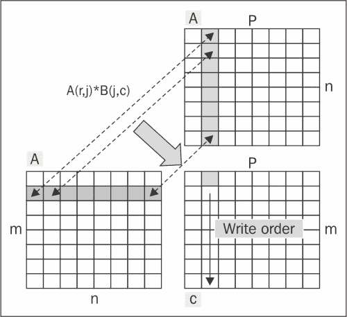
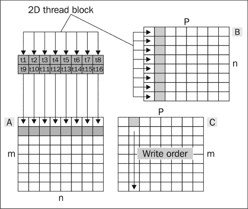
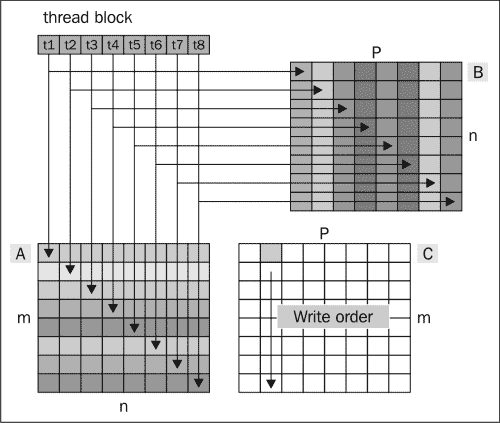
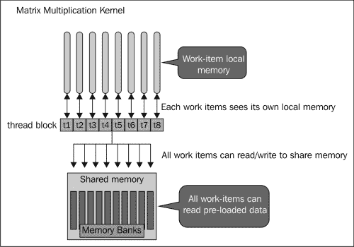

# 第七章. 使用 OpenCL 开发矩阵乘法

在本章中，我们将涵盖以下内容：

+   理解矩阵乘法

+   矩阵乘法的 OpenCL 实现

+   通过线程粗化加速矩阵乘法的 OpenCL 实现

+   通过寄存器细分加速矩阵乘法的 OpenCL 实现

+   通过矩阵乘法中的共享内存数据预取减少全局内存

# 简介

在本章中，我们将探讨两个矩阵相乘以产生另一个矩阵的问题。这个问题也被称为矩阵乘法，其应用范围包括数学、金融、物理，并且是解决线性方程的流行系统。为了说明目的，我们提供了一个解决线性方程的典型用例：


这些方程可以建模为，其中方程的左侧由一个 2x2 的矩阵组成，该矩阵乘以一个 2x1 的矩阵（通常称为向量，它们可以是行向量或列向量），等于右侧的向量。考虑到矩阵可以具有任意行和列的顺序，数学家发明了如下表示法，，为了解这个问题，我们必须确定。在这里，正如我们所看到的，需要知道矩阵的逆。到此为止，这就是我们关于矩阵美妙世界的所有想说的，以免我们陷入兔子洞！

### 注意

你应该知道，只有方阵才有逆，即使在这样的矩阵中，逆也不一定存在。我们不会在本章或本书中介绍计算逆。

# 理解矩阵乘法

两个矩阵 A 和 B 的乘积 C 定义为，其中 j 是所有可能的 i 和 k 值的和。这里隐含地对索引 i、j 和 k 进行了求和。矩阵 C 的维度为：，其中表示一个有行和列的矩阵，当我们明确写出乘积时，它看起来如下：


矩阵乘法的另一个特性是乘法在加法上是结合的，并且对加法是分配的，但它们却不是交换的。

### 注意

如果两个矩阵 A 和 B 是对角矩阵并且维度相同，则认为它们是交换的。

了解这些属性将帮助我们制定从以下公式开始的初始算法：*c[ik]* = *a[ij]*b[jk]*。交换律基本上告诉我们矩阵 A 和 B 之间乘法的顺序很重要，而结合律允许我们探索当两个矩阵 A 和 B 太大而无法适合 OpenCL 设备上的可用内存，并且我们需要将矩阵数据分配到多个设备时会发生什么。以下图表说明了当读取矩阵 A 的行和矩阵 B 的列并将其聚合结果写入输出矩阵 C 的适当位置时会发生什么：



## 准备工作

到目前为止，我们已经有很好的基础来尝试矩阵乘法。像以前一样，我们从 C/C++ 的实现开始，这是公式的直接翻译，然后我们将发展更好的直觉，了解如何将其导入 OpenCL 并应用适当的优化。

在本章的剩余部分，我们将构建我们的算法，使其在您的桌面/笔记本电脑上的 GPU 上运行。这样做的原因是因为 GPU 拥有比 CPU 更多的计算单元，并且 GPU 通常配备有其他硬件组件，这允许 OpenCL 利用这些硬件（包括本地数据存储、乱序执行单元、共享数据存储等），这通常允许执行大量的线程。当前的 CPU 处理器不实现 OpenCL 共享内存，因此使用 GPU 可能是最佳选择！

### 小贴士

获取一个支持 OpenCL 1.1 的 GPU，上述信息足以进行这些实验。

## 如何做到这一点...

到现在为止，您应该熟悉创建必要的数据结构来表示我们正在讨论的三个矩阵（让我们称它们为 A、B 和 C）。巧合的是，它们恰好是方阵，但这以任何方式都不会影响我们的理解。

当我们从上一节检查这个问题时，我们理解我们基本上想要以下方式遍历两个矩阵：

1.  从矩阵 A 中选择一行。

1.  从矩阵 B 中选择一列。

1.  将所选行的每个元素与所选列的对应元素相乘。

从这个描述中，我们可以开始考虑各种实现方法，其中一种方法可能是以下：

1.  为 A 和 B 创建两个内存中的数据结构，例如 `TmpA` 和 `TmpB`。

1.  遍历 A 并选择一个行，将其每个元素存入 `TmpA` 的对应位置，对所选列做同样的操作，存入 `TmpB`：

    ```py
      loop until i < number_of_rowsA:
        TmpA[i] = A[i]
      endloop
      loop until i < number_of_colsB:
        TmpB[i] = B[i]
      endloop
    ```

1.  遍历 `TmpA` 和 `TmpB` 并执行矩阵乘法。

1.  在伪代码中，它看起来像这样：

    ```py
    loop until (i,j) < (rowA * colB):
      loop through A[i][_] deposit values into TmpA
      loop through B[_][j] deposit values into TmpB
      foreach value in TmpA and TmpB:
        C[a] = TmpA[x] * TmpB[y]
    endloop
    ```

另一种实现方式与这一种非常相似，只是我们使用标准的 C/C++ 数组索引技术来引用相应的行和列，并在以下章节中展示实现方式。

## 它是如何工作的…

正如我们之前讨论的那样，在 C/C++ 中实现矩阵乘法算法有多种方式。似乎没有一种最佳的设计方案。我个人一直更喜欢可读的设计而不是复杂的设计。然而，有时有必要编写高性能的代码，以便你可以榨取编程语言或硬件所能提供的全部力量。

### 小贴士

到目前为止，你可能已经或还没有发展出设计算法所必需的直觉，但一种方法是持续不断地练习使用不同的技术，并使用一些基准测试来衡量每个实现，除非你非常有信心，否则不要将所有优化都集中在一种算法上。

既然我们已经对矩阵乘法的含义有了初步的了解，那么我们现在开始探索算法被转换为顺序形式后的样子是时候了。以下是一个矩阵乘法程序顺序形式的示例（代码仅由一个线程执行）：

```py
Void matrixMul(float *C, 
               const float *A, 
               const float *B, 
               unsigned int hA, 
               unsigned int wA, 
               unsigned int wB) {
    for (unsigned int i = 0; i < hA; ++i)
        for (unsigned int j = 0; j < wB; ++j){   
            float sum = 0;
            for (unsigned int k = 0; k < wA; ++k) {   
                double a = A[i * wA + k]; // statement 1
                double b = B[k * wB + j]; // statement 2
                sum += a * b;
            }   

            C[i * wB + j] = (float)sum; // statement 3
        }   
}
```

当你检查这段代码时，你会注意到有三个循环结构，我们使用常规的 C/C++ 数组索引技术来引用从各自的行和列中引用的后续元素。现在花点时间来确信我们实际上是在计算矩阵乘法。

如前所述，我们戴上并行开发者的帽子，试图看看我们如何提供等效程序的并行 OpenCL 版本。再次，我自然地被循环结构所吸引，我们这里有三个循环结构！

我们注意到，当我们遍历矩阵 A 和 B 时，最内层的循环是执行所有重负载的代码块，包括“语句 1”、“语句 2”和“语句 3”。这些语句将代表我们 OpenCL 内核的核心，让我们去看看我们如何将其映射到 OpenCL。

# 矩阵乘法的 OpenCL 实现

我们已经花费了大量时间来理解矩阵乘法的工作原理，并研究了它在顺序形式下的样子。现在，我们将尝试以最直接的方式将其映射到 OpenCL。

这里使用的实现技术利用了这样一个事实：我们创建了二维线程块，其中每个维度中的每个线程/工作项都将访问它们在行/列维度中的相应元素。

## 准备中

在这个菜谱中，我们将使用两个维度为 1024 x 1024 的矩阵（我们称之为 A 和 B），并将这两个矩阵相乘，以产生一个 1024 x 1024 的第三个矩阵，我们称之为 C。

### 注意

在这个阶段，你可能需要刷新一下你的基本矩阵理论，以确信这是正确的。

我们在主机代码中构建熟悉的数据结构，并用随机值填充它们。`Ch7/matrix_multiplication_01/MatrixMultiplication.c` 中的主机代码如下：

```py
matrixA = (cl_int*)malloc(widthA * heightA * sizeof(cl_int));
matrixB = (cl_int*)malloc(widthB * heightB * sizeof(cl_int));
matrixC = (cl_int*)malloc(widthB * heightA * sizeof(cl_int));

memset(matrixA, 0, widthA * heightA * sizeof(cl_int));
memset(matrixB, 0, widthB * heightB * sizeof(cl_int));
memset(matrixC, 0, widthB * heightA * sizeof(cl_int));

fillRandom(matrixA, widthA, heightA, 643);
fillRandom(matrixB, widthB, heightB, 991);
```

接下来，我们设置 OpenCL 命令队列以启用分析，因为我们想继续观察我们将要应用的后续优化的效果。确实，建立一个参考点是至关重要的，这样你的测量结果就可以与之比较。

### 注意

回想一下，OpenCL 命令队列可以被创建为按顺序执行命令。在这本书中，所有命令队列都是按顺序创建的，以便它们按程序顺序执行，也称为程序读取顺序。

## 如何做到这一点…

我们展示了我们的第一次尝试，为你提供一个顺序矩阵乘法算法的 OpenCL 版本。内核可以在 `Ch7/matrix_multiplication_01/simple_mm_mult.cl` 中找到：

```py
__kernel void mmmult(int widthB, 
                     int heightA, 
                      __global int* A, 
                      __global int* B, 
                      __global int* C) {

    int i = get_global_id(0);
    int j = get_global_id(1);
    int tmp = 0;

    if ((i < heightA) && (j < widthB)) {
        tmp = 0;
        for(int k = 0; k < widthB; ++k) {
            tmp += A[i*heightA + k] * B[k*widthB + j];
        }
        C[i*heightA + j] = tmp;
    }
}
```

给定前面的 OpenCL 内核代码，我们需要构建一个可执行文件，以便它可以在你的平台上执行。和之前一样，编译过程对你来说应该是熟悉的。在我的配置中，使用 Intel Core i7 CPU 和 AMD HD6870x2 GPU 运行 Ubuntu 12.04 LTS，编译过程如下，并且它会在目录中创建一个名为 `MatrixMultiplication` 的可执行文件：

```py
gcc -std=c99 -Wall -DUNIX -g -DDEBUG -arch i386 -o MatrixMultiplication -framework OpenCL

```

到目前为止，你应该在那个目录中有一个可执行文件，你现在需要做的就是运行程序，只需在目录中简单地执行 `MatrixMultiplication` 程序，你应该已经注意到以下输出：

```py
Passed!
Execution of matrix-matrix multiplication took X.Xs

```

## 它是如何工作的…

我们讨论了矩阵的初始化方式，接下来要实现的是每个维度中每个工作项对每个元素进行工作的执行模型。为了完成这个任务，我们必须确保执行 OpenCL 内核代码的调用不指定线程块的大小：

```py
size_t globalThreads[] = {widthB, heightA};

cl_event exeEvt; 
cl_ulong executionStart, executionEnd;
error = clEnqueueNDRangeKernel(queue,
                               kernel,
                               2,
                               NULL,
                               globalThreads,
                               NULL, 
                               0,
                               NULL,
                               &exeEvt);
clWaitForEvents(1, &exeEvt);
```

我们通过将 `NULL` 值传递给 `clEnqueueNDRangeKernel` API 中用于指定工作组大小的占位符来实现这一点。接下来，我们将全局工作项的值设置为矩阵 B 的宽度和矩阵 A 的高度，分别由 `widthB` 和 `heightA` 变量表示。

以下图表用于说明执行将看起来是什么样子：



一个敏锐的读者可能会开始猜测这不是进行这项业务的最佳方式，你是对的！我们很快将深入探讨如何使这项工作做得更好。

# 通过线程粗化加速矩阵乘法的 OpenCL 实现

在本节中，让我们尝试通过应用并行编程中的技术：线程粗化，来让这个“野兽”运行得更快。这很重要，因为当你有一个工作项访问一个元素，然后你有大矩阵时，你可能会拥有数百万个工作项在运行！一般来说，这不是一个好现象，因为今天许多设备都无法支持在 *n* 维度上数百万个工作项，除非它是超级计算机。但通常有巧妙的方法来减少所需的工作项数量。

## 准备工作

这里的通用技术是探索我们可以合并线程的方法，以便每个线程现在计算多个元素。当我们重新审视前面的代码时，我们可能会想知道我们是否可以用更少的线程并让它们计算更多的元素，实际上我们可以。

我们采用的战略基本上将有一个工作项在遍历矩阵 A 和 B 的同时更新矩阵 C 中的整个行。此时，我们甚至不需要探索在 OpenCL 中使用原子函数，因为这是我们应尽可能延迟探索的方面。不探索使用原子的主要原因很简单，就是它们的执行时间太长，而且还没有充分利用 OpenCL 设备的能力。

## 如何做到这一点…

这个 OpenCL 内核是基于线程粗化的概念修订的，可以在 `Ch7/matrix_multiplication_02/mmult.cl` 中找到：

```py
__kernel void mmmult(int widthB, 
                     int heightA, 
                      __global int* A,  
                      __global int* B,  
                      __global int* C) {

    int i = get_global_id(0); 
    int tmp = 0;

    if (i < heightA) {
        for(int j = 0; j < widthB; ++j) {
            tmp = 0;
            for(int k = 0; k < widthB; ++k) {
                tmp += A[i*heightA + k] * B[k*widthB + j]; 
            }   
            C[i*heightA + j] = tmp;
        }   
    }   
}
```

现在我们已经仔细查看过 OpenCL 内核，我们需要构建一个可执行形式。和之前一样，编译过程对你来说应该很熟悉。在我的配置中，有一个 Intel Core i7 CPU 和 AMD HD6870x2 GPU 运行 Ubuntu 12.04 LTS，编译过程如下，它会在目录中创建一个名为 `MatrixMultiplication` 的可执行文件：

```py
gcc -std=c99 -Wall -DUNIX -g -DDEBUG -arch i386 -o MatrixMultiplication -framework OpenCL

```

到目前为止，可执行文件应该已经存放在目录中，要执行它，只需在目录中运行程序 `MatrixMultiplication` 即可，你应该已经注意到以下输出：

```py
Passed!
Execution of matrix-matrix multiplication took X.Xs

```

现在如果你要比较之前的结果，你会注意到它运行得更快！

## 它是如何工作的…

这里的难点在于能够识别出正在应用冗余工作。但在我们的情况下，识别出我们实际上使用了过多的线程并不会花费太多精力。你可能会问，为什么会这样？线索在于原始的矩阵乘法算法是使用一个执行线程运行的，所以我们使用多个工作项的事实确实意味着我们还可以做更多来改进它。

因此，当我们回顾算法时，我们发现了一种通过更富有创意地使用一个工作项获取这些值来使它们运行更快的方法。在这个时候，你应该确信我们刚才查看的 OpenCL 内核确实如预期那样引用了矩阵 A 和 B 中的数据值。

为了实现我们所做的，我们对 `Ch7/matrix_multiplication_02/MatrixMultiplication.c` 中的代码做了一些修改，如下所示：

```py
size_t globalThreads[] = {heightA};
size_t localThreads[] = {256};
cl_event exeEvt; 
cl_ulong executionStart, executionEnd;
error = clEnqueueNDRangeKernel(queue,                                                                               
                               kernel,
                               1,  
                               NULL,
                               globalThreads,
                               localThreads,
                               0,  
                               NULL,
                               &exeEvt);
clWaitForEvents(1, &exeEvt);
```

我们知道问题的大小，即对 1024 x 1024 维度的矩阵进行矩阵乘法。我选择工作组大小为 256 的原因是因为我的 GPU 有四个计算单元，你可以通过传递`CL_DEVICE_MAX_COMPUTE_UNITS`到`clGetDeviceInfo`来发现这一点。以下图表说明了线程粗化后的情况：



当你能够通过线程粗化减少冗余工作时，内核现在将执行得更快，并且扩展得更好，因为现在更多的处理器可以执行。这看起来可能有些反直觉，因为它违背了常识，因为执行内核的线程越多，它应该执行得越快。好吧，这就是简单的画面。

在底层发生的事情更为复杂，它始于这样一个事实：每个 GPU 都有一定数量的处理器，每个处理器都会执行内核。为了使 GPU 能够以全容量运行，自然其处理器必须填充数据缓存中的数据，指令应该准备好被触发并执行 OpenCL 内核。

然而，由于数据空间和时间局部性较差，数据缓存的表现不佳，这导致指令流水线中的停滞，这转化为延迟执行。另一个问题也与内存访问模式可能是不规则或非归约的事实有关，这转化为缓存未命中和可能的内存驱逐。这最终导致更多的延迟。

回到问题本身，还有另一种优化内核的方法，那就是通过重用工作项的硬件寄存器。

# 通过注册分块加快矩阵乘法的 OpenCL 实现

注册分块是我们可以对矩阵乘法算法应用的其他技术之一。它基本上意味着探索重用硬件寄存器的机会。在我们的情况下，这意味着我们需要检查内核代码并找到重用寄存器的机会。

现在，我们需要戴上我们硬核 C 开发者帽（这个人需要从处理器核心的层面思考，比如数据如何在总线上移动，内存的加载和存储等等）。一旦你的思维足够敏感到这个层面，事情就会变得更好。

回想一下上一节的内核代码，我们会注意到经过仔细审查后，`A[i * heightA + k]`语句总是在循环结构中执行，这导致大量的内存流量，因为数据需要从设备内存加载到设备寄存器中。

## 准备工作

为了减少由`A[i * heightA + k]`语句引起的全局内存流量，我们可以将这个语句从循环结构中提取出来，创建一个仅对执行线程可见的线程局部内存结构，然后我们可以在后续的计算中重用预取的数据。

## 如何做到这一点

这个 OpenCL 内核代码位于`Ch7/matrix_multiplication_03/mmult.cl`：

```py
__kernel void mmmult(int, 
                     int widthB heightA, 
                      __global int* A,                      __global int* B, 
                      __global int* C) {

    int i = get_global_id(0); 

    int tmp = 0;

    int tmpData[1024];

    if (i < heightA) {
        for(int k = 0; k < widthB; ++k )
            tmpData[k] = A[i*heightA + k];

        for(int j = 0; j < widthB; ++j) {
            tmp = 0;
            for(int k = 0; k < widthB; ++k) {
                tmp += tmpData[k] * B[k*widthB + j];
            }
            C[i*heightA + j] = tmp;
        }
    }
}
```

现在我们已经仔细查看过 OpenCL 内核，我们需要构建一个可执行形式，以便我们可以执行。和之前一样，编译过程对你来说应该很熟悉。在我的配置中，使用 Intel Core i7 CPU 和 AMD HD6870x2 GPU 运行 Ubuntu 12.04 LTS，编译过程如下，并且它会在目录中创建一个名为`MatrixMultiplication`的可执行文件：

```py
gcc -std=c99 -Wall -DUNIX -g -DDEBUG -arch i386 -o MatrixMultiplication -framework OpenCL

```

到目前为止，可执行文件应该已经在你所在的目录中可用。要运行程序，只需在`MatrixMultiplication`目录中执行程序，你应该会看到以下输出：

```py
Passed!
Execution of matrix-matrix multiplication took X.Xs

```

现在如果你将结果与之前的一个比较，你会注意到它运行得更快。

## 它是如何工作的……

这个想法源自高性能计算中的一种技术，有些人喜欢称之为标量替换。这是我们在这个部分应用的形式。让我们花点时间通过一个简单的算法来理解这一点。

假设我们有一个以下算法：

```py
for i1 = 1 to 6
  for i2 = 1 to 6
    A[i1,i2] = A[i1 – 1, i2] + A[i1,i2 -2]
```

现在我们展开循环，使其看起来像这样：

```py
for i1 = 1 to 6 step-by-2
  for i2 = 1 to 6 step-by-2
    A[i1,i2] = A[i1 –1, i2] + A[i1,i2 -2]    //statement 1
    A[i1 +1,i2] = A[i1,i2] + A[i1+1,i2 -1]    //statement 2
    A[i1,i2 +1] = A[i1 –1, i2+1] + A[i1,i2]   //statement 3
    A[i1+1,i2+1] = A[i1, i2 +1] + A[i1+1,i2]
```

当我们仔细观察这段代码时，我们会注意到`statement 1`、`statement 2`和`statement 3`有一些共同点，那就是这段代码，`A[i1,i2]`。用计算机科学术语来说，我们注意到有一个存储到内存的操作和两个从内存到寄存器的加载操作。在标量替换中，我们将`A[i1,i2]`替换为一个变量，暂时称之为`X`。标量替换后，代码现在看起来如下：

```py
for i1 = 1 to 6 step-by-2
  X = A[i1,0]
  for i2 = 1 to 6 step-by-2
    X          = A[i1 –1, i2] + X
    A[i1 +1,i2] = X + A[i1+1,i2 -1]    
    A[i1,i2 +1] = A[i1 –1, i2+1] + X   
    A[i1+1,i2+1] = A[i1, i2 +1] + A[i1+1,i2]
     A[i1,i2] = X 
```

当替换工作一致完成，并且算法仍然按预期工作，我们现在就可以了。喝杯茶吧！

让我们看看我们做了什么。我们将数组引用（实际上就是内存引用）替换为标量，这样做的好处是我们实际上通过在寄存器内存中处理这些项目来减少了内存流量。考虑到内存速度比寄存器读写速度慢得多，这个改进的算法形式要好得多。

### 小贴士

循环展开通常用于展开循环，以便我们可以识别可能重复的表达式或语句，并允许标量替换将这些表达式/语句提取到线程私有寄存器内存中。

实际操作中，标量替换要复杂得多，但这里的演示旨在说明一般概念。

我们还想与你分享的另一件事是优化工作项的内存使用，我们之前在章节中也提到了几个关于它的例子。

# 通过矩阵乘法中的共享内存数据预取减少全局内存

我们改进的矩阵乘法算法看起来相当不错，但还不是完全如此。该算法仍然在全局内存中对矩阵 B 进行了大量引用，我们实际上可以通过预取数据来减少这种流量。你可能没有注意到，但预取的概念是为了保持缓存“热”（一个从 CPU 借来的想法）。CPU 通常具有相当大的数据和指令缓存（实际上是非常大的硬件寄存器），这样处理器就可以利用数据的时空局部性。这个概念如何映射到其他 OpenCL 设备，例如 GPU？

每个符合 OpenCL 规范的 GPU 都有一小部分内存用于此目的，它们的尺寸通常是 32 KB 到 64 KB。如果你想要确定可用的高速内存的确切数量，只需将`CL_DEVICE_LOCAL_MEM_SIZE`变量传递给`clGetDeviceInfo`即可获取设备信息。

## 准备工作

为了让我们能够减少对全局内存的引用，我们需要对我们的代码进行修改，以便加载我们所需的数据。再次筛选代码后，我们发现确实有一个这样的机会，如下所示：

```py
for(int j = 0; j < widthB; ++j) {
    tmp = 0;
    for(int k = 0; k < widthB; ++k) {
        tmp += tmpData[k] * B[k*widthB + j];
    }
//more code omitted
}
```

专注于这个循环，我们注意到矩阵 B 总是被加载，并且其值总是被执行此内核的所有工作项重用。我们当然可以将这些数据预加载到共享内存中。这应该会显著减少全局内存请求。

## 如何做…

以下 OpenCL 内核可以在`Ch7/matrix_multiplicatione_04/mmult.cl`中找到：

```py
__kernel void mmmult(int widthB, 
                     int heightA, 
                      __global int* A,  
                      __global int* B,  
                      __global int* C,
                      __local  int* shared) {

    int i = get_global_id(0);
    int id = get_local_id(0);
    int size = get_local_size(0);
    int tmp = 0;

    int tmpData[1024];

    if (i < heightA) {
        /*
         Pre-load the data into the work-item's register memory that is 
         Visible to the work-item only. 
         */
        for(int k = 0; k < widthB; ++k ) {
            tmpData[k] = A[i*heightA + k]; 
        }   

        /*
         Data pre-fetching into shared memory allows all work-items
         To read the data off it instead of loading the data from global
         Memory for every work-item
        */
        for(int k = id; k < widthB; k += size) 
            shared[k] = B[k*widthB +k];
        barrier(CLK_LOCAL_MEM_FENCE);

        for(int j = 0; j < widthB; ++j) {
            tmp = 0;
            for(int k = 0; k < widthB; ++k) {
                tmp += tmpData[k] * shared[k];
            }
            C[i*heightA + j] = tmp;
        }
    }
}
```

现在你已经查看过 OpenCL 内核，你可能会想编译代码并运行它。和之前一样，编译过程对你来说应该是熟悉的。在我的配置中，有一个 Intel Core i7 CPU 和 AMD HD6870x2 GPU，运行 Ubuntu 12.04 LTS，编译过程如下，它会在目录中创建一个名为`MatrixMultiplication`的可执行文件。

```py
gcc -std=c99 -Wall -DUNIX -g -DDEBUG -arch i386 -o MatrixMultiplication -framework OpenCL

```

要运行程序，只需在目录中执行`MatrixMultiplication`程序，你应该会得到一个类似于以下输出的结果：

```py
Passed!
Execution of matrix-matrix multiplication took X.Xs

```

现在如果你要比较这个结果与之前的结果，你会注意到它运行得快得多！

## 如何工作…

我们所介绍的代码可能会让你产生一些疑问，因为它看起来是顺序执行的，但实际上在运行时是并行执行的。并行性是通过`localThreads`变量中指示的值引入的，该值传递给`clEnqueueNDRangeKernel`。我们在代码中放置的内存屏障的作用是停止所有工作项执行超过该点，直到该点之前的所有函数都已执行，以下图表用于说明这一点：


到目前为止，你已经看到了对 OpenCL 内核代码所做的更改，现在我们需要修改我们的主机代码，以便我们实际上能够完成这项工作。以下代码片段取自`Ch7/matrix_multiplication_04/MatrixMultiplication.c`：

```py
clSetKernelArg(kernel, 0, sizeof(cl_int),(void*)&widthB);
clSetKernelArg(kernel, 1, sizeof(cl_int),(void*)&heightA);
clSetKernelArg(kernel, 2, sizeof(cl_mem),(void*)&matrixAMemObj);
clSetKernelArg(kernel, 3, sizeof(cl_mem),(void*)&matrixBMemObj);
clSetKernelArg(kernel, 4, sizeof(cl_mem),(void*)&matrixCMemObj);
clSetKernelArg(kernel, 5, sizeof(cl_int)*heightA,NULL);

size_t globalThreads[] = {heightA};
size_t localThreads[] = {256};
cl_event exeEvt; 
cl_ulong executionStart, executionEnd;
error = clEnqueueNDRangeKernel(queue,
                               kernel,
                               1,
                               NULL,
                               globalThreads,
                               localThreads,
                               0,
                               NULL,
                               &exeEvt);
clWaitForEvents(1, &exeEvt);
```

最终算法的框图让我们对算法进行了调整，使其达到一个初始的合理性能，并且可以用以下图表进行概念上的表示：



### 小贴士

如果你想知道你可以创建多少共享内存，并将`CL_DEVICE_LOCAL_MEM_SIZE`参数传递给`clGetDeviceInfo`以获取你的设备，返回的值将以字节为单位。典型值在 32 KB 到 64 KB 之间。
