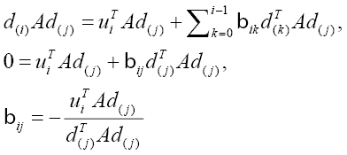

# 第八章 开发 OpenCL 中的稀疏矩阵向量乘法

在本章中，我们将介绍以下内容：

+   使用共轭梯度法解决 **SpMV**（**稀疏矩阵向量乘法**）

+   理解包括 ELLPACK、ELLPACK-R、COO 和 CSR 在内的各种 SpMV 数据存储格式

+   理解如何使用 ELLPACK-R 格式解决 SpMV

+   理解如何使用 CSR 格式解决 SpMV

+   理解如何使用 VexCL 解决 SpMV

# 简介

在上一章关于矩阵乘法的章节中，我们欣赏了问题空间及其应用领域，但我们之前没有告诉你的是，除了它们的密集和稀疏向量之外，还有密集矩阵和稀疏矩阵。当我们说密集或稀疏矩阵/向量时，我们指的是有很多非零或零值。

从计算角度来看，矩阵是密集的还是稀疏的很重要，因为将任何值与零相乘实际上是没有意义的，结果显然是零；如果你要应用解决这个问题的天真方法，即使用你在矩阵乘法中开发的方法来解决矩阵或向量稀疏的问题，但你不会利用你刚刚购买的全新 OpenCL CPU/GPU，你只是在浪费处理器周期，也在浪费大量的带宽。问题在于以高效的方式解决这个问题，这需要理解如何高效地计算，这解决了问题的一部分。问题的另一部分是要研究如何高效地存储稀疏矩阵，因为为存储主要由零填充的矩阵分配内存空间是浪费内存空间。

我们将快速浏览这个主题，但不会详尽无遗。关于这个主题已经有很多文献发表了。然而，我们将花一些时间通过认识到过去和当前的大部分工作都集中在创建既高效又紧凑的数据结构来表示稀疏结构来形成一个基本和一般的概念。我们还将花一些时间设计那些数据结构上的高效计算方法。至于矩阵而言，我们不会探讨动态矩阵（通过插入或删除）的可能性，而是将重点放在静态稀疏矩阵格式上。

接下来，我们将通过构建我们的知识到共轭梯度（通过最速下降和格拉姆-施密特正交化）来展示解决 SpMV 高效的理论，在应用该算法之前，我们将探讨一些常见的数据存储方案。我们将使用 VexCL 和 **共轭梯度**（**CG**）方法，这是一个使用 C++ 构建的 OpenCL 框架，来展示一个实现。

以下是一些稀疏矩阵的例子：


# 使用共轭梯度法解决稀疏矩阵向量乘法（SpMV）

共轭梯度法是解决稀疏线性系统最流行的迭代方法，我将尝试让您理解它是如何工作的。在这个过程中，我们将探讨最速下降、共轭梯度收敛等问题。

### 小贴士

我想对 *Jonathan Richard Shewchuk*（加州大学助理教授）表示衷心的感谢，没有他，我可能无法理解为什么共轭梯度很重要。您可以在 [`www.cs.cmu.edu/~jrs/`](http://www.cs.cmu.edu/~jrs/) 了解更多关于他的信息。

共轭梯度法在解决稀疏系统问题中受欢迎的原因之一是它不仅很好地处理了非常大的稀疏矩阵，而且效率也非常高。

在上一章关于矩阵乘法的章节中，我们已经看到了两个矩阵相乘的含义，这次我们将关注的问题是如何 ，其中 *A* 是已知的正定方阵，*x* 是未知向量，*b* 是已知向量。

## 准备就绪

两个向量的内积表示为 *x^Ty*，它代表标量之和 。 *xTy* 等价于 *yTx*，如果 *x* 和 *y* 正交（彼此成直角，这在研究最速下降时将非常重要），那么 *xTy = 0*。

### 小贴士

正定矩阵 *A* 满足对于每个非零向量 *x*，*xTAx > 0*。

二次型实际上是一个向量的标量和二次函数，其形式如下：


正如任何线性函数一样，我们会知道它的梯度，可以用以下导出形式表示 （是的，这不是打字错误，我们指的是矩阵 *A* 的转置），当我们知道矩阵 *A* 是对称的，即  变为 *A* 因为 *AT=A*，那么这个方程就简化为 。像任何线性方程的导数一样，我们知道当它等于 *0* 时，可以通过求解  来找到  的数学解。目标是找到一个特定的 *x* 值，使其最小化 。从图解上看，可以想象成一个像下面图中那样的抛物线，这就是  评估出的确切值：


这为我们研究最速下降及其相关方法——共轭梯度法奠定了基础。在接下来的章节中，让我们首先探讨最速下降背后的概念，然后转向共轭梯度法。

在最速下降法中，我们从任意点*x[(0)]*开始，滑向抛物面的底部。我们继续采取步骤*x(1)*，*x(2)*，等等，直到我们相当有信心地说我们已经到达了解*x*。基本上就是这样工作的。一般来说，我们还没有说如何选择下一个滑动到的点，因为像往常一样，魔鬼在细节中。继续前进！

当我们迈出一步时，我们选择减少最快的方向，现在适当地介绍两个向量，我们将使用这两个向量来判断我们是否朝着正确的方向下降（也就是说，如果我们是朝着抛物线的底部移动）。误差向量衡量我们从当前步骤的解有多远。残差向量衡量我们离*b*的正确值有多远，这个向量可以被认为是下降最快的方向。当我们迈出下一步以便我们更接近实际解*x*时，我们实际上是在选择一个点，你会注意到另一个变量已经被选择，那就是 alpha，。

这个变量无论其值如何，都会告诉我们我们是否到达了抛物线的底部。换一种说法，想象你自己掉进一个沙拉碗（我能想到的最接近的东西）中，你唯一停止下落的方法就是坐在碗底。我们知道从微积分中，你落点的导数是零，也就是说，它的梯度也是*0*。为了确定这个值，我们必须将这个点的导数设为零，我们已经看到了方程，现在我们知道。

## 如何做...

现在我们来计算当等于零时的方向导数，因为最小化*f*。使用链式法则，我们知道，并将我们知道的代入，我们得到以下推导序列，通过这些推导我们得到的值：


总结来说，最速下降法包括以下方程：


使用最速下降法意味着我沿着兔子洞走下去，在迈出下一步之前，我会猜测它将会是什么，然后采取行动；如果我猜对了，那就太好了！

共轭梯度法建立在最速下降法的基础上，两者有很多相似之处，即共轭梯度法会做出猜测，最终将导致在*x*中的解。两种方法都使用残差向量来判断猜测与正确答案的距离。

策略是选择一组正交搜索方向，在每个方向上我们正好走一步（这与我们之前看到的大致相同）。结果是我们需要使搜索方向*A-正交*而不是正交。我们说两个向量和是 A-正交的，如果。当我们使用搜索方向时，我们想要最小化的是搜索空间的大小，为此我们需要*线性无关的向量*。从那里，我们可以使用 Gram-Schmidt 过程来生成它们，并且我们会得到以下：


正如我们在最速下降法中所做的那样，让我们使用同样的技巧来确定是什么，因为它看起来非常熟悉，就像一样，我们使用以下方法推导它：



从前面的方程中，我们插入两个向量是 A-正交的事实，即方程的左边是*0*，然后我们解右边的方程，结果是。当我们比较这个值与时，我们会发现它们几乎相同，除了 CG 方法使用的是线性无关的向量而不是最速下降法中发现的残差向量。

CG 方法建立在 Gram-Schimdt 过程/共轭和最速下降法的基础上，通过消除搜索向量的存在。它更倾向于使用残差向量，这在计算上很重要，否则你的程序需要存储所有的搜索向量，对于一个大的领域空间，这可能是一个非常糟糕的主意。我们跳过了一部分数学，但你可以从以下链接下载*Jonathan Shewchuk*的原始论文：

[`www.cs.cmu.edu/~quake-papers/painless-conjugate-gradient.pdf`](http://www.cs.cmu.edu/~quake-papers/painless-conjugate-gradient.pdf)

在共轭梯度法中，我们有以下方程：


我们将看看如何将其转换为 OpenCL。但首先，是时候来一杯咖啡了！

既然我们已经对 CG 方法的基本概念有了基本的了解，那么现在是时候看看一个简单的 SpMV 核是如何实现的了。然而，请记住我提到过我们必须理解稀疏矩阵中的数据是如何存储的。这实际上在实现中是至关重要的，因此花上接下来的几节来向您介绍这些众所周知的数据存储格式是合理的。

# 理解包括 ELLPACK、ELLPACK-R、COO 和 CSR 在内的各种 SpMV 数据存储格式

存储稀疏矩阵的方法有很多种，每种方法都有不同的存储需求，甚至计算特性，而且随着这些特性的不同，你可以以不同的方式访问和操作矩阵的元素。我之前提到过，我们将重点关注静态稀疏矩阵格式，并且在这里我展示了四种已被证明相当流行的存储格式，这不仅因为它们有不错的性能，还因为它们也是一些最早在标量和向量架构中流行的格式，而且最近在 GPGPUs 中也非常流行。

在接下来的段落中，我们将按照以下顺序向您介绍以下稀疏矩阵表示：

+   ELLPACK 格式

+   ELLPACK-R 格式

+   坐标格式

+   压缩稀疏行格式

让我们从 ELLPACK 格式开始。这个格式也被称为 ELL。对于一个最大每行有*K*个非零值的*M x N*矩阵，ELLPACK 格式将非零值存储到一个名为`data`的密集*M x K*数组中，其中每行小于*K*个非零值的行用零填充。同样，相应的列索引存储在另一个数组中，我们将其命名为`indices`。再次，使用零或某些哨兵值来填充这个数组。以下矩阵的表示说明了它的样子：


对这个格式的快速分析表明，如果每行中非零值的最大数量与平均值相差不大，那么 ELLPACK 格式相当吸引人，因为它至少对我来说是直观的。

接下来，我们检查 ELLPACK-R 格式。这个格式是 ELLPACK 格式的变体，除了之前看到的数组之外，我们还有一个名为`rl`的新数组，用于存储每行的实际长度。以下表示说明了它的样子：


现在还不明显这与 ELLPACK 有什么不同，但我们在后面将要看到的串行和并行核将利用这个新数组来使代码和数据传输更加紧密。

我们继续使用坐标格式。坐标格式是一种简单的存储方案。数组`row`、`col`和`data`分别存储非零矩阵条目的行索引、列索引和值。COO 是一种通用的稀疏矩阵表示，因为所需的存储总是与非零值的数量成比例。以下是 COO 格式的外观：


在这种格式中，有三个一维数组——`row`、`col`和`data`。

列表中的最后一个格式是**压缩稀疏行（CSR**）格式。CSR 格式是一种流行的通用稀疏矩阵表示。与 COO 格式类似，CSR 格式明确地在数组`indices`和`data`中存储列索引和非零值。第三个数组`ptr`用于行指针，它表示 CSR 表示。对于一个*M x N*矩阵，`ptr`的长度为*M + 1*，在`ptr[i]`中存储第*i*行的偏移量。`ptr`中的最后一个条目，通常对应于*M + 1*^(th)行，存储矩阵中的非零值数量。以下表示展示了其外观：


在这一点上，这就是我想讨论关于稀疏矩阵数据表示的所有内容。

### 小贴士

你应该知道还有其他格式，如**DIA**，也称为**对角格式**，混合/混合的 ELL/COO，以及数据包（用于类似向量架构的处理器）。

## 如何做到这一点...

现在我们已经检查了三种数据存储格式，让我们进一步探讨如何使用 ELLPACK 格式解决 SpMV 问题。像之前一样，我们希望从这个部分开始，通过展示 SpMV CPU 内核的代码来启动：

```py
// num_rows  – number of rows in matrix
// data      – the array that stores the non-zero values
// indices   – the array that stores the column indices for zero, non-
//              zero values in the matrix
// num_cols  – the number of columns.
// vec       - the dense vector
// y         - the output 
void spmv_ell_cpu(const int num_rows,
                  const int num_cols,
                  const int * indices;
                  const float * data,
                  const float * vec, float * out) {
for( int row = 0; row < num_rows, row++) {
    float temp = 0;
      // row-major order
    for(int n = 0; n < num_cols; n++) {
        int col = indices[num_cols * row + n];
        float value = data[num_cols * row + n];
        if (value != 0 && col != 0)
            temp += value * vec[col];
    }
    out[row] += temp;
}
}
```

花点时间让自己相信我们确实在使用 ELLPACK 格式来解决 SpMV，并且当数据存储在低级内存中时，是以行主序存储的。再次戴上并行开发者的帽子，一种策略是让一个线程/工作项处理矩阵数据的一行，这意味着你可以移除外层循环结构，从而得到可能的 SpMV ELL 内核。

```py
// num_rows  – number of rows in matrix
// data      – the array that stores the non-zero values
// indices   – the array that stores the column indices for zero, non-
//              zero values in the matrix
// num_cols  – the number of columns.
// vec       - the dense vector
// y         - the output 
__kernel void
spmv_ell_gpu(__global const int num_rows,
             __global const int num_cols,
             __global const int * indices;
             __global const float * data,
             __global const float * vec, float * out) {
     int row = get_global_id(0);
     if (row < num_rows) {
    float temp = 0;
	    // row-major order
    for(int n = 0; n < num_cols; n++) {
        int col = indices[num_cols * row + n];
        float value = data[num_cols * row + n];
        if (value != 0 && col != 0)
            temp += value * vec[col];
    }
    out[row] += temp;
}
}
```

你可能会首先注意到外层循环结构已经被移除，当你考虑到这个结构最初存在是为了我们可以迭代包含矩阵行和向量点积实际工作的内层循环时，这是直观的。

现在，当我们使用我们的细粒度并行策略检查其内存访问模式时，我们会得到以下表示，并且当我们稍后在 SpMV CSR 内核部分查看时，它将表现出类似的问题：


# 了解如何使用 ELLPACK-R 格式解决 SpMV

ELLPACK-R 是 ELLPACK 格式的变体，显然它对于在 GPU 上实现 SpMV 相当流行。如果没有可以利用的常规子结构，如非对角线或稠密块，则应使用 ELLPACK-R。基本思想是通过将所有非零条目左移来压缩行，并将结果矩阵列按列连续存储在主主机内存中，其中*N*是每行非零条目的最大数量。

## 如何做到这一点

SpMV ELLPACK-R 标量内核被称为标量，是因为在 OpenCL 中开发并行程序时，我们没有利用到 GPU 特有的一个特定方面。这个方面被称为**波前/ warp 级编程**。我们将在下一节的 SpMV CSR 内核介绍中更多地讨论这一点。因此，在这一部分，我们将展示我们的 OpenCL 内核，如下面的代码所示，它采用了使用一个线程处理矩阵数据一行的策略，这次，我们得到了另一个数组`rowLengths`的帮助，该数组记录了矩阵中每行包含非零值的实际长度：

```py
// data – the 1-D array containing non-zero values
// vec – our dense vector
// cols – column indices indicating where non-zero values are
// rowLengths – the maximum length of non-zeros in each row
// dim – dimension of our square matrix
// out – the 1-D array which our output array will be 
__kernel void
spmv_ellpackr_kernel(__global const float * restrict data,
                     __global const float * restrict vec
                     __global const int * restrict cols,
                     __global const int * restrict rowLengths,
                     const int dim, 
                     __global float * restrict out) {
    int t = get_global_id(0);

    if (t < dim)
    {
        float result = 0.0;
        int max = rowLengths[t];
        for (int i = 0; i < max; i++) {
            int ind = i * dim + t;
            result += data [ind] * vec[cols[ind]];
        }
        out[t] = result;
    }
}
```

检查前面的代码，我们注意到我们再次通过认识到每个线程或工作项（如果你记得的话，在 OpenCL 术语中）可以在内循环中独立执行工作的事实，将两个`for`循环减少为一个。

在下面的代码中，我们展示了我们的“向量化”内核，我们认识到我们的 SpMV ELLPACK-R 内核可以通过利用硬件内置的运行多个线程执行代码并同步执行的功能来得到改进。

### 小贴士

如果你在你的 OpenCL x86 兼容 CPU 上执行此向量化操作，除非 GPU 有可用的向量化硬件，否则它将不起作用。

当需要这种情况时，这非常有用，而且这种情况正是需要的。这导致了我们下面代码中显示的 SpMV ELLPACK-R 向量内核。我们的策略是在矩阵的每一行处理一个 warp，我们将每一行拆分，以便线程可以在 warp 或波前中处理数据：

```py
// data – the 1-D array containing non-zero values
// vec – our dense vector
// cols – column indices indicating where non-zero values are
// rowLengths – the maximum length of non-zeros in each row
// dim – dimension of our square matrix
// out – the 1-D array which our output array will be 
#define VECTOR_SIZE 32 // NVIDIA = 32, AMD = 64
__kernel void
spmv_ellpackr_vector_kernel(__global const float * restrict val,
                            __global const float * restrict vec,
                            __global const int * restrict cols,
                            __global const int * restrict rowLengths,
                            const int dim,
                            __global float * restrict out) {

    // Thread ID in block
    int t = get_local_id(0);
    // Thread id within warp/wavefront
    int id = t & (VECTOR_SIZE-1);
    // one warp/wavefront per row
    int threadsPerBlock = get_local_size(0) / VECTOR_SIZE;
    int row = (get_group_id(0) * threadsPerBlock) + (t / VECTOR_SIZE);

    __local float volatile partialSums[128];

    if (row < dim) {
        float result = 0.0;
        int max = ceil(rowLengths[row]/VECTOR_SIZE);
        // the kernel is vectorized here where simultaneous threads
        // access data in an adjacent fashion, improves memory
        // coalescence and increase device bandwidth
        for (int i = 0; i < max; i ++) {
            int ind = i * (dim * VECTOR_SIZE) + row * VECTOR_SIZE + id;
            result += val[ind] * vec[cols[ind]];
        }
        partialSums[t] = sum;
        barrier(CLK_LOCAL_MEM_FENCE);

        // Reduce partial sums
        // Needs to be modified if there is a change in vector length
        if (id < 16) partialSums[t] += partialSums[t +16];
        barrier(CLK_LOCAL_MEM_FENCE);
        if (id <  8) partialSums[t] += partialSums[t + 8];
        barrier(CLK_LOCAL_MEM_FENCE);
        if (id <  4) partialSums[t] += partialSums[t + 4];
        barrier(CLK_LOCAL_MEM_FENCE);
        if (id <  2) partialSums[t] += partialSums[t + 2];
        barrier(CLK_LOCAL_MEM_FENCE);
        if (id <  1) partialSums[t] += partialSums[t + 1];
        barrier(CLK_LOCAL_MEM_FENCE);

        // Write result
        if (tid == 0)
        {
            out[row] = partialSums[tid];
        }

    }
}
```

## 它是如何工作的

这个向量内核利用了两个事实：

+   内核由线程组执行，并且这些线程同步执行

+   **并行归约**：并行归约是正当其时的一个主题，而我们使用的变体技术被称为**分段归约**

为了帮助你理解并行归约的工作原理，让我们假设并想象我们有一个包含 16 个元素的二维数组，每个数组元素都有一个数字。现在，我想问你如何计算这个给定数组中所有元素的总和？肯定有不止两种方法可以做到这一点，但假设你有八个工作项可以同步执行。你如何利用这一点？

一种方法是将每个工作项添加两个数组元素，这样就会得到部分和，但你是如何将这些部分和相加以产生一个单一的数，这个数代表了数组的求和呢？不深入细节，让我们使用以下图表，看看你是否能弄清楚它是如何工作的：


# 理解如何使用 CSR 格式解决 SpMV 问题

在查看所有这些稀疏矩阵的不同数据表示后，你可能会意识到这幅图比我们之前想象的要复杂得多，这有助于强调研究人员和工程师已经花费了大量时间和精力以高效的方式解决看似简单的问题。因此，在本节中，我们将探讨如何使用 CSR 格式解决 SpMV 问题，并按顺序查看从顺序、标量到最终向量核的各种配方。

## 准备工作

现在，让我们看看 SpMV 代码在顺序形式下的样子，即在现代 CPU 上执行时，使用 CSR 格式，然后让我们看看 SpMV 的一个简单实现：

```py
// num_rows – number of rows in matrix
// ptr – the array that stores the offset to the i-th row in ptr[i]
// indices – the array that stores the column indices for non-zero
//           values in the matrix
// x       - the dense vector
// y       - the output 
void spmv_csr_cpu(const int num_rows,
                  const int * ptr;
                  const int * indices;
                  const float * data,
                  const float * vec, float * out) {
for( int row = 0; row < num_rows, row++) {
    float temp = 0;
    int start_row = ptr[row];
    int end_row = ptr[row+1];
    for(int jj = start_row; jj < end_row; jj++)
        temp += data[jj] * vec [indices[jj]];
    out[row] += temp;
}
}
```

检查前面的代码，你会注意到数组`ptr`被用来选择数组`data`中的非零元素——这是所希望的，同时`ptr`也被用来索引`indices`数组以检索向量`vec`中的正确元素，这样我们永远不会执行乘以零值的操作。这一点从计算角度来看非常重要，因为它意味着我们不会浪费宝贵的处理器周期去执行我们永远不会使用的工作；从另一个角度来看，这种表示也意味着缓存总是填充着我们需要的值，而不是存储那些本质上为零值的值。

正如承诺的那样，让我们看看另一种解决方案，它专注于在现代桌面 CPU 上执行的矩阵-向量乘法，在这两个例子中，唯一的区别是前面的代码考虑了矩阵是稀疏的，而下面的代码假设矩阵是密集的：

```py
// M – the matrix with dimensions 'height' x 'width'
// V – the dense vector of length 'width'
// W – the output
void matvec_cpu(const float* M, const float* V, int width, int height, float* W)
{
    for (int i = 0; i < height; ++i) {
        double sum = 0;
        for (int j = 0; j < width; ++j) {
            double a = M[i * width + j];
            double b = V[j];
            sum += a * b;
        }
        W[i] = (float)sum;
    }
}
```

花点时间检查这两个代码库，你会发现节省了多少计算周期和内存带宽，以及无谓地浪费了多少。

### 小贴士

始终建议将顺序形式与并行形式进行比较，以便您可以推导出关于转换算法的基本指标。

## 如何操作

现在我们已经做了一些基本的比较，我们需要确定我们的并行化策略。为此，我们需要再次戴上并行开发者的帽子，仔细审查前面显示的 SpMV CSR 串行内核的代码，寻找可并行化的部分。你可能已经注意到的一件事是，矩阵一行与向量`vec`的点积可以独立于所有其他行来计算。

以下代码演示了实现方式，其中有一个工作项处理矩阵的一行，有些文献会称这为标量内核。在这个内核中，和之前一样，我们的策略集中在查看两个循环结构，我们发现外层循环结构可以被展平并用工作项/线程替换，我们知道如何实现这一点；回到内层循环结构，这是每个工作项/线程实际上正在执行的内容，我们发现我们可以保留其所有执行流程，并在 OpenCL 内核中模拟它。

接下来，让我们看看 SpMV 内核是如何用 CSR 格式编写的：

```py
__kernel void 
spmv_csr_scalar_kernel( __global const float * restrict val,
                        __global const float * restrict vec,
                        __global const int * restrict cols,
                        __global const int * restrict ptr,
                        const int dim, __global float * restrict out){
    int row = get_global_id(0);

    if (row < dim) {
        float temp=0;
        int start = ptr[row];
        int end = ptr[row+1];
        for (int j = start; j < end; j++) {
            int col = cols[j];
            temp += val[j] * vec[col];
        }
        out[row] = temp;
    }
}
```

如果你能回忆起来，在上一章中我们提到，这种执行模型使用非常细粒度的并行性，这样的内核可能表现不会很好。问题并不在于 CSR 表示法本身，而在于工作项/线程并没有同时访问 CSR 中的那些值。实际上，每个线程在处理矩阵的每一行时，都会在以下图中产生一个内存访问模式。在追踪了 SpMV CSR 内核的四个工作项/线程的执行后，你会发现每个线程都会引用数组`val`（其中包含矩阵*A*中的所有非零项）的不同部分，并且内存加载会在缓存（包含内存银行和内存通道/行）上锁定，最后硬件寄存器会执行它们。

### 注意

从现在开始，你应该从底层工作的角度来思考 GPU 的工作方式。

让我们以前面找到的 CSR 格式的矩阵为例，来说明 SpMV CSR 实际上并不工作得很好。每个缓存实际上是通过通道/行实现的，这样每行可以容纳一定数量的字节，在我们的例子中，它假设每行可以容纳 16 个元素（假设每个元素的大小为 4 字节，相当于 64 字节）。

到现在为止，你应该很明显地看出，有很多缓存带宽的浪费。由于我们的内核是并行的，从理论上讲，我们可以有四条不同的行来持有输入数组的各个部分。我们希望的是一次将所有数据放入，并在处理过程中保持缓存活跃。

实现这一目标的一种方法就是应用你之前学到的技术。恭喜你想到这一点。然而，让我们学习另一种技术，在一些文献中它被称为 warp-/wavefront 级编程。我们在上一节中看到了它的实际应用。

回想一下，在另一章中，我们介绍了某些 OpenCL 设备（特别是 GPU）的线程在处理器中以 lock step 方式执行的事实。以下图示了在 CPU 上以串行方式构建和执行 SpMV CSR 内核时的内存访问模式：


### 小贴士

为了优化你的算法以适应内存访问，让单个 wavefront/warp 中的工作项访问同一缓存行的内存位置。

接下来，你可能想知道如何设计一个内核，能够将所需的元素加载到相同的缓存行中，并利用 warp 或 wavefront 中的线程以 lock step 方式执行的事实。这一事实也意味着你需要协调，但不用担心，我们不需要使用 OpenCL 中找到的原子函数来做这件事。

当我看到“lock step”这个术语时，我立刻会联想到 10 名跑者，就像在 warp/wavefront 中执行线程一样，排成一排进行 100 米赛跑，而与 warp-/wavefront 级编程相比的例外是，所有这些跑者都需要一起到达终点线。我知道这听起来很奇怪，但这就是它的工作方式。协调这批跑者就像给八匹马套上缰绳，用鞭子驱赶马车来加速或减速。

### 注意

在这一点上，我想要稍微偏离一下主题，并指出**英特尔数学内核库**（**Intel MKL**）11.0 使用基于 CSR 格式的数据存储格式来实现稀疏求解器，并且它们在 Intel CPU 上运行时性能良好，因为它们不仅优化了内存管理，还利用了**指令级并行性**（**ILP**）。

现在，你必须识别并想象你的内核将由一组线程执行，作为入门，让我们想象有 32 或 64 个线程同时运行。每个线程都有一个 ID，这是你识别和控制它们的主要方法，即放置允许或限制线程运行的流程控制结构。为了说明这一点，让我们看一下以下改进的 SpMV CSR 向量内核。

SpMV CSR OpenCL 内核位于`Ch8/SpMV/spmv.cl`：

```py
#define VECTOR_SIZE 32 
// Nvidia is 32 threads per warp, ATI is 64 per wavefront
__kernel void
spmv_csr_vector_kernel(__global const float * restrict val,
                       __global const float * restrict vec,
                       __global const int * restrict cols,
                       __global const int * restrict ptr,
                       const int dim, __global float * restrict out){
    int tid = get_local_id(0);
    int id = tid & (VECTOR_SIZE-1);
    // One row per warp
    int threadsPerBlock = get_local_size(0) / VECTOR_SIZE;
    int row = (get_group_id(0) * threadsPerBlock) + (tid / VECTOR_SIZE);

    __local volatile float partialSums[128];
    partialSums[t] = 0;

    if (row < dim)
    {
        int vecStart = ptr[row];
        int vecEnd   = ptr[row+1];
        float sum = 0;
        for (int j = vecStart + id; j < vecEnd; j += VECTOR_SIZE) {
            int col = cols[j];
            sum += val[j] * vec[col];
        }
        partialSums[tid] = sum;
        barrier(CLK_LOCAL_MEM_FENCE);

        // Reduce partial sums
        // Needs to be modified if there is a change in vector length
        if (id < 16) partialSums[tid] += partialSums[t +16];
        barrier(CLK_LOCAL_MEM_FENCE);
        if (id <  8) partialSums[tid] += partialSums[tid + 8];
        barrier(CLK_LOCAL_MEM_FENCE);
        if (id <  4) partialSums[tid] += partialSums[tid + 4];
        barrier(CLK_LOCAL_MEM_FENCE);
        if (id <  2) partialSums[tid] += partialSums[tid + 2];
        barrier(CLK_LOCAL_MEM_FENCE);
        if (id <  1) partialSums[tid] += partialSums[tid + 1];
        barrier(CLK_LOCAL_MEM_FENCE);

        // Write result
        if (id == 0)
        {
            out[row] = partialSums[tid];
        }
    }
}
```

现在我们已经仔细研究了 OpenCL 内核，我们需要构建一个可执行的形式来执行。和以前一样，编译过程对你来说应该是熟悉的。在我的配置中，有一个 Intel Core i7 CPU 和 AMD HD6870x2 GPU 运行 Ubuntu 12.04 LTS，编译过程如下，它会在工作目录中创建一个名为`SpMV`的可执行文件：

```py
gcc -std=c99 -Wall -DUNIX -g -DDEBUG -arch i386 -o SpMV -framework OpenCL

```

到目前为止，可执行文件应该已经在你所在的目录中可用。要运行程序，只需在目录中执行程序 `SpMV`，你应该会注意到一个类似于以下输出的结果：

```py
Passed!

```

## 它是如何工作的

这种工作方式值得大量的解释，但首先，我们必须认识到我们已经将我们的并行归约转换成了另一种形式，这通常被称为分段归约。到这个时候，你应该对代码的其余部分相对熟悉了，所以我不打算带你走一遍，因为你可能会打瞌睡。

在所有形式中，并行归约都是进行跨处理器甚至架构的归约的有效方法。著名的 Hadoop 框架是跨架构并行归约的一个例子，而我们现在看到的形式是局限于 OpenCL GPU 上的处理器。

让我带你看看在我们的 SpMV CSR 矩阵核的分段归约示例中发生了什么。最初，我们在内核中设置了一个共享内存空间来存储 128 个 `float` 类型的元素：

```py
__local volatile float partialSums[128];
```

### 小贴士

你可能好奇为什么在定义数组 `partialSums` 时需要使用关键字 `volatile`。主要原因是在 warp/波前级别的编程中，OpenCL 没有我们之前遇到的内存栅栏之类的同步函数，当你没有在声明共享内存时放置 `volatile` 关键字，编译器可以自由地将存储到和从 `__local` 内存中的加载替换为寄存器存储，从而引发执行错误。

目的是让 warp/波前中的每个线程将其自己的计算存储到由其线程 ID 标记的自己的槽位中。

接下来，我们看到以下这堆代码：

```py
if (id < 16) partialSums[tid] += partialSums[t +16];
barrier(CLK_LOCAL_MEM_FENCE);
if (id <  8) partialSums[tid] += partialSums[tid + 8];
barrier(CLK_LOCAL_MEM_FENCE);
if (id <  4) partialSums[tid] += partialSums[tid + 4];
barrier(CLK_LOCAL_MEM_FENCE);
if (id <  2) partialSums[tid] += partialSums[tid + 2];
barrier(CLK_LOCAL_MEM_FENCE);
if (id <  1) partialSums[tid] += partialSums[tid + 1];
barrier(CLK_LOCAL_MEM_FENCE);

// Write result
if (id == 0) {
    out[row] = partialSums[tid];
}
```

这段代码做了两件事——第一是它只允许具有特定 ID 的线程执行，第二件事是它只允许 ID 为 `0` 的线程，即零，将总和写入输出数组 `out` 的适当元素中。

让我们深入了解细节。当一个正在执行的线程/工作项尝试执行以下代码片段时，内核首先会确定其 ID 是否允许，ID 在 0 到 15 范围内的线程将得到执行，而以下代码中的线程将不会执行，我们将有 **线程发散**：

```py
if (id < 16) partialSums[tid] += partialSums[t +16];
barrier(CLK_LOCAL_MEM_FENCE);
```

### 注意

回想一下，线程发散发生在分支处，即 `if-then-else`、switch 等等，这基本上将 warp/波前分成两部分，其中一组的一部分执行代码，而另一部分则不执行。

在这一点上，您应该确信整个共享内存数组`partialSums`进行了成对减少，我在纸上或电脑上追踪它时发现这很有帮助（无论您更喜欢哪种方式）。当执行线程完成并行减少后，请注意没有重叠的写入（这是故意的），我们只需要在那个点放置一个内存栅栏，以确保在继续之前每个线程都已经到达那个点。这个内存栅栏很重要，否则会发生不好的事情。接下来，再次进行并行减少，但这次我们只需要处理数组的一半，并将线程数量限制为`8`：

```py
if (id < 8) partialSums[tid] += partialSums[t +8];
barrier(CLK_LOCAL_MEM_FENCE);
```

我们通过将可执行线程的数量减半重复这个循环，直到它达到`1`，此时最终的聚合值将位于数组`partialSums`的零位置。

一旦我们在数组`partialSums`的零位置得到最终的聚合值，我们就可以将其写入到数组`out`中相应的位置，该位置由我们处理的行索引。这种分段减少在以下图中展示：


# 理解如何使用 VexCL 解决 SpMV

最后，我想展示如何使用共轭梯度法解决 SpMV CSR 内核。我们在本章的开头研究了这种方法，希望我们仍然记得它是什么。让我通过刷新您对 CG 方法核心方程的记忆来帮助您：


到目前为止，我们已经通过 SpMV ELLPACK、ELLPACK-R 和 CSR 格式在标量和向量形式中，使用各种方法对 SpMV 问题有了相当好的理解，但确实花费了我们一些时间才达到这个目标。在本节中，您将了解到一个用于解决问题的 OpenCL 框架，它被称为 VexCL。可以从以下地址下载：

+   VexCL 主页：[`github.com/ddemidov/vexcl`](https://github.com/ddemidov/vexcl)

+   VexCL 维基：[`github.com/ddemidov/vexcl/wiki`](https://github.com/ddemidov/vexcl/wiki)

按照作者的观点，OpenCL 在工具支持方面存在不足，而 VexCL 在作者看来是围绕 OpenCL C++的更好封装之一，我喜欢在这一节中简要向您介绍它，您可以去下载它。

## 准备工作

为了让 VexCL 与您协同工作，您需要一个符合 C++11 规范的编译器，GNU GCC 4.6 和 Boost 库是合适的选择。在我的设置中，我已经成功编译了 GCC 4.7，并使用了 Boost List 版本 1.53，没有遇到太多麻烦。这意味着我不会列出安装说明，因为安装过程相对直接。

## 如何操作

以下 OpenCL 内核位于`Ch8/SpMV_VexCL/SpMV.cpp`：

```py
#define VEXCL_SHOW_KERNELS 
// define this macro before VexCL header inclusion to view output   
// kernels

#include <vexcl/vexcl.hpp>
typedef double real;
#include <iostream>
#include <vector>
#include <cstdlib>

void gpuConjugateGradient(const std::vector<size_t> &row,
                          const std::vector<size_t> &col,
                          const std::vector<real> &val,
                          const std::vector<real> &rhs,
                          std::vector<real> &x) {
    /*
     Initialize the OpenCL context
     */
    vex::Context oclCtx(vex::Filter::Type(CL_DEVICE_TYPE_GPU) &&
                        vex::Filter::DoublePrecision);

    size_t n = x.size();
    vex::SpMat<real> A(oclCtx, n, n, row.data(), col.data(), val.data());
    vex::vector<real> f(oclCtx, rhs);
    vex::vector<real> u(oclCtx, x);
    vex::vector<real> r(oclCtx, n);
    vex::vector<real> p(oclCtx, n);
    vex::vector<real> q(oclCtx, n);

    vex::Reductor<real,vex::MAX> max(oclCtx);
    vex::Reductor<real,vex::SUM> sum(oclCtx);

    /*
     Solve the equation Au = f with the "conjugate gradient" method
     See http://en.wikipedia.org/wiki/Conjugate_gradient_method
     */
    float rho1, rho2;
    r = f - A * u;

    for(uint iter = 0; max(fabs(r)) > 1e-8 && iter < n; iter++) {
        rho1 = sum(r * r);
        if(iter == 0 ) {
          p = r;
        } else {
          float beta = rho1 / rho2;
          p = r + beta * p;
        }

        q = A * p;

        float alpha = rho1 / sum(p * q);
        u += alpha * p;
        r -= alpha * q;
        rho2 = rho1;
    }

    using namespace vex;
    vex::copy(u, x); // copy the result back out to the host vector
}
```

## 如何工作

主代码基本上用所需的值填充一维数组，以便它们可以符合 CSR 格式。之后，声明设备向量并使用适当的数据类型与相应的宿主向量（复制将会发生，但这是在幕后进行的）相连接，并定义了两个归约器（它们基本上是我们之前见过的归约核）；归约器将仅在 OpenCL 设备上使用单个执行线程执行，所以它并不完全像我们之前看到的并行归约；它的归约是好的，但它是以顺序方式执行的。

接下来，我们初始化了一个名为`SpMAT`的 ADT（抽象数据类型），它持有稀疏矩阵的表示，并且这个 ADT 具有跨越多个设备的能力，这是一个非常理想化的属性，因为编写的代码对其实际底层计算设备是透明的。

在后台，你看到的 C++代码将导致代码生成发生，并且这就是将被使用、编译和再次执行的那个代码；如果你想看到生成的内核代码，只需放置 C 宏`VEXCL_SHOW_KERNELS`。我们最后使用`vex`命名空间中的`copy`函数将处理过的数据从设备内存传输到宿主内存。
