# 第十章. 使用 OpenCL 开发 Radix 排序

在本章中，我们将探讨以下食谱：

+   理解 Radix 排序

+   理解 MSD 和 LSD Radix 排序

+   理解归约

+   在 OpenCL 中开发 Radix 排序

# 简介

在上一章中，我们学习了如何使用 OpenCL 开发 Bitonic 排序。在本章中，我们将探讨如何使用 OpenCL 开发 Radix 排序。Radix 排序也被称为**桶排序**，我们将在稍后看到原因。

### 注意

第一个 Radix 排序算法来自一台名为**Hollerith machine**的机器，它在 1890 年用于编制美国人口普查，尽管它可能没有像*查尔斯·巴贝奇*创造的机器那样出名，但它确实在计算机历史中占有一席之地。

# 理解 Radix 排序

Radix 排序不是基于比较的排序算法，它有一些特性使其更适合并行计算，尤其是在像 GPU 和现代 CPU 这样的向量处理器上。

### 小贴士

我有些不愿意使用“现代”这个词，因为处理器技术随着时间的推移发展得如此之快，这个词的使用似乎有些过时。

Radix 排序的工作方式与比较排序算法（如快速排序）相比非常有趣；它们之间的主要区别在于它们如何处理输入数据的关键字。Radix 排序通过将关键字分解成更小的子关键字序列（如果可以这样说的話），然后逐个对这些子关键字进行排序来实现这一点。

数字可以转换为二进制，可以看作是位序列；同样的类比也可以从字符串中得出，它们是字符序列。当应用于此类关键字时，Radix 排序不比较单个关键字，而是处理和比较这些关键字的片段。

Radix 排序算法将关键字视为基-R 数系统中的数字。*R*被称为基数，因此该算法的名称由此而来。不同的*R*值可以应用于不同的排序类型。例如：

+   *R = 256* 将是对每个字符都是 8 位 ASCII 值的字符串进行排序

+   *R = 65536* 将是对每个字符都是 16 位 Unicode 值的 Unicode 字符串进行排序

+   *R = 2* 将是对二进制数进行排序

## 如何做到这一点…

在这一点上，让我们通过一个例子来看看 Radix 排序如何对数字 44565、23441、16482、98789 和 56732 进行排序，假设每个数字都是内存中连续位置排列的五位数

| 44565 | 23441 | 16482 | 98789 | 56732 |
| --- | --- | --- | --- | --- |

我们将按从右到左的顺序提取每个数字，首先检查最低有效位。因此，我们有以下：

| 5 | 1 | 2 | 9 | 2 |
| --- | --- | --- | --- | --- |

假设我们将计数排序应用于这个数字数组，它将变成以下样子：

| 1 | 2 | 2 | 5 | 9 |
| --- | --- | --- | --- | --- |

这意味着以下顺序。请注意，排序是稳定的：

| 23441 | 16482 | 56732 | 44565 | 98789 |
| --- | --- | --- | --- | --- |

接下来，我们将向左移动一位。注意，现在数字数组如下：

| 4 | 8 | 3 | 6 | 8 |
| --- | --- | --- | --- | --- |

再次应用计数排序并将其转换回数字顺序，我们有：

| 56732 | 23441 | 16482 | 98789 | 44565 |
| --- | --- | --- | --- | --- |

对于第 1,000 位，我们有：

| 23441 | 16482 | 56732 | 98789 | 44565 |
| --- | --- | --- | --- | --- |

对于第 10,000 位，我们有：

| 23441 | 44565 | 16482 | 56732 | 98789 |
| --- | --- | --- | --- | --- |

对于第 100,000 位，我们有：

| 16482 | 23441 | 44565 | 56732 | 98789 |
| --- | --- | --- | --- | --- |

哇！基数排序已经对五位数的数组进行了排序。我们应该注意，这种排序是**稳定的**。

### 备注

**稳定排序**指的是算法能够保持具有相等键的任意两个元素之间的相对顺序的能力。让我们假设有一个整型数组`int a[5]`，包含值`1`、`2`、`3`、`4`、`9`和`2`，通过某种排序算法 X，将元素排序为`1`、`2`、`2`、`3`、`4`和`9`。这里的要点是，我们看到的两个相等的值，即数字`2`，分别位于位置`1`和`5`（假设数组是零索引）。然后，通过 X，排序后的列表将使得`a[1]`始终在`a[5]`之前。

实际上，基数排序有两种基本方法。我们已经看到了一种方法，即我们检查最低有效位并对其进行排序。这通常被称为**LSD 基数排序**，因为我们从右到左进行操作。另一种方法是从左到右进行操作。

基数排序的关键考虑因素是**键**的概念。根据上下文，键可能是一个单词或字符串，并且它们的长度可以是固定的或可变的。

# 理解 MSD 和 LSD 基数排序

在我们开始开发 OpenCL 上的等效程序之前，让我们花些时间来理解 MSD 基数排序和 LSD 基数排序是如何工作的。

## 如何做到这一点…

基数排序假设我们希望首先考虑最高有效位来对基数-R 的数字进行排序。为了实现这一点，我们可以将输入分成*R*而不是仅仅两个部分，我们之前确实看到过这样做。这是数据分箱，但它通过计数排序进行了扩展。基数排序可以在 ASCII 字符、Unicode 字符、整数（32 位/64 位）或浮点数（排序浮点数是棘手的）上运行。你需要确定什么构成了键。键可以被认为是 8 位键、16 位键等等，现在我们知道基数排序需要重复迭代以提取键，并根据基数*R*对它们进行排序和分箱。

在下面的代码片段中，我们有一个 MSD 基数排序，它使用编程语言 C 对给定字符串中的字符进行排序，我们使用的基数是 256（无符号 8 位数的最大值，否则有符号 8 位数的范围是-128 到 127）：

```py
#define N // integers to be sorted with values from 0 – 256
void MSD(char[] s) {
  msd_sort(s, 0, len(s), 0);
}
void msd_sort(char[][] s, int lhs, int rhs, int d) {
  if (rhs <= lhs + 1) return;
  int* count = (int*)malloc(257 *sizeof(int));
  for(int i = 0; i < N; ++i)
    count[s[i][d]+1]++;
  for(int k = 1; k < 256; ++k) 
    count[k] += count[k-1];
  for(int j = 0; j < N; ++j) 
    temp[count[s[i][d]]++] = a[i];
  for(int i = 0; i < N; ++i) 
    s[i] = temp[i];
  for(int i = 0; i<255;++i)
    msd_sort(s, 1 + count[i], 1 + count[i+1], d+1);
}
```

基数排序的第二种方法是从右向左扫描输入，并通过对 MSD 基数排序应用类似操作来检查每个元素。这被称为**最低有效位**（**LSD**）基数排序。LSD 基数排序之所以有效，是因为当任何两个元素不同时，排序将它们放置在正确的相对顺序中，即使这两个元素不同，LSD 表现出稳定的排序特性，这意味着它们的相对顺序仍然保持不变。让我们看看它是如何对排序三个字符字符串起作用的：

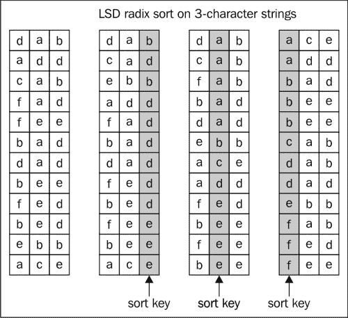

对给定字符串中的字符进行排序的典型 LSD 基数排序可能看起来像以下代码（假设所有键都有固定的宽度；让我们称它为`W`）：

```py
void lsd_sort(char[][] a) {
  int N = len(a);
  int W = len(a[0]);
  for(int d = W – 1; d >= 0; d--) {
    int[] count = (int*) malloc(sizeof(int) * 256);
    for(int i = 0; i< N; ++i) 
      count[a[i][d]+1]++;
    for(int k = 1; k < 256; k++)
      count[k] += count[k-1];
    for(int i = 0; i< N; ++i) 
      temp[count[a[i][d]]++] = a[i];
    for(int i= 0; i< N; ++i)
      a[i] = temp[i];
  }
}
```

## 它是如何工作的…

这两种方法都很相似，因为它们都将字符分入 *R* 个桶中，即 256 个桶，并且它们还使用了计数排序的思想来确定最终的排序排列，使用临时存储`temp`，然后使用这个临时存储并将数据移动到它们的排序位置。与 LSD 基数排序相比，MSD 基数排序的优点是 MSD 可能不会检查所有的键，并且适用于可变长度的键；尽管如此，这也带来了另一个问题——MSD 可能会遇到次线性排序；在实践中，当键的大小固定时，通常更倾向于使用 LSD。

与基于划分-征服方法的其它排序算法的运行时间相比，LSD 基数排序的运行时间是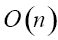，你可能倾向于得出结论，基数排序会比基于比较的排序算法（如快速排序）更快，你可能是对的。但是，在实践中，经过良好调优的快速排序可以通过应用更高级的技术来提高缓存友好性，从而比基数排序快 24%。然而，技术不断进步，研究人员和工程师将找到机会最大化性能。

### 小贴士

你可能想阅读 LaMarca 的论文《缓存对排序的影响》和 Rahman 和 Raman 的论文《将基数排序适应内存层次结构》，以了解更多他们所工作的算法改进。

# 理解归约

基数排序采用两种技术：**归约**和**扫描**。这些被归类为数据收集模式，因为它们在并行计算中经常出现。这个配方将专注于归约，它允许使用关联的二进制运算符将数据压缩为单个元素。扫描模式很容易与归约模式混淆，关键区别在于这种模式将集合的每个子序列减少到输入的每个位置。我们将推迟对扫描的讨论，直到我们到达下一节。

在归约模式中，我们通常有一个结合二进制运算符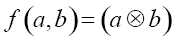，我们用它以成对的方式收集容器中的所有元素。我们需要一个结合二进制运算符是一个重要的因素，因为它意味着开发者可以重新组织组合函数以检查其效率；我们稍后会详细讨论这一点。让我们看一下以下代码片段中执行归约的串行算法：

```py
template<typename T>
T reduce(T (*f)(T, T),
         size_t n,
         T a[],
         T identity) {
  T accumulator = identity;
  for(size_t i = 0; i < n ; ++i)
        accumulator = f(accumulator, a[i]);
  return accumulator;
}
```

该算法基本上接受一个结合二进制运算符`f`（即函数的指针）和一个长度为`n`的数组`a`，并计算数组上的操作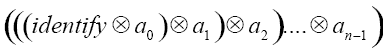，初始值由`identity`标识。

结合二进制运算符可以允许开发者从中提取并行性，因为结合性意味着运算符无论应用于元素的顺序如何，都会产生相同的结果。也就是说：

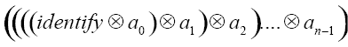

上述表达式等同于：

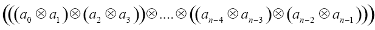

穿上多核帽子，我们实际上可以想象一个计算树，其中子树代表形式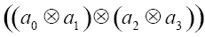的计算。第一次遍历将计算这个子树的结果，而第二次遍历将收集其他子树的结果。一旦你有机会在接下来的两个图中直观地检查它们，这将会很明显：

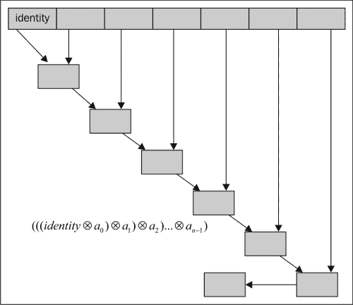

对比这些图示的不同方式对你来说将非常有用。其中一种方式是前者暗示了一个按遍历顺序的操作序列，这与后者（如下图中所示）非常不同：

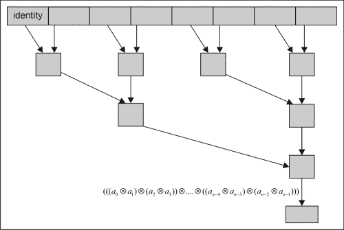

了解结合运算符允许归约并行化是个好消息，但这并不是全部，因为结合性只允许我们分组操作，并不能告诉我们这些二进制操作组是否需要按特定顺序发生。如果你想知道我们是否在谈论交换律，你完全正确！交换律给我们提供了改变应用顺序的重要属性。我们知道一些操作表现出其中之一，而另一些则表现出两者；例如，我们知道数字的加法和乘法既是结合的又是交换的。以下是一个交换律并行归约可能的样子：

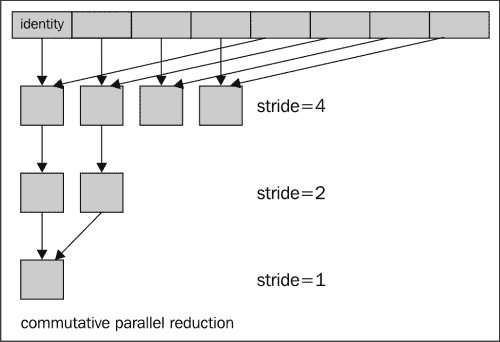

现在，看到这些信息，你可能会想知道这如何翻译成 OpenCL。我们将在这个菜谱中演示几个归约内核，每个内核都会在之前的基础上提供改进。

## 如何做到这一点…

对于这个配方，我们将假设我们有一个包含几百万个元素的数组，并且我们希望应用归约算法来计算所有元素的总和。首先要做的是为之前看到的串行版本生成一个并行算法。我们展示的所有内核都在`Ch10/Reduction/reduction.cl`。

在算法的串行版本中，您可能会注意到我们只是简单地将累加器传递给二进制函数以执行操作。然而，在 GPU 上我们不能使用这种方法，因为它不能支持成千上万的执行线程，而且设备可以包含比 x86 CPU 更多的处理器。唯一的解决方案是将数据分区到处理器上，以便每个块处理输入的一部分，当所有处理器并行执行时，我们应该期望工作在短时间内完成。

假设一个块已经计算出了其总和值，我们仍然需要一种方式来汇总所有块的所有部分总和，考虑到 OpenCL 没有全局同步原语或 API，我们有两种选择：让 OpenCL 汇总部分总和，或者让主机代码汇总部分总和；在我们的示例中，选择了第二种选项。

第一个内核`reduce0`是串行算法的直接翻译：

```py
__kernel void reduce0(__global uint* input, 
                      __global uint* output, 
                      __local uint* sdata) {
    unsigned int tid = get_local_id(0);
    unsigned int bid = get_group_id(0);
    unsigned int gid = get_global_id(0);
    unsigned int blockSize = get_local_size(0);

    sdata[tid] = input[gid];

    barrier(CLK_LOCAL_MEM_FENCE);
    for(unsigned int s = 1; s < BLOCK_SIZE; s <<= 1) {
        // This has a slight problem, the %-operator is rather slow
        // and causes divergence within the wavefront as not all threads
        // within the wavefront is executing.
        if(tid % (2*s) == 0)
        {
            sdata[tid] += sdata[tid + s];
        }
        barrier(CLK_LOCAL_MEM_FENCE);
    }

    // write result for this block to global mem
    if(tid == 0) output[bid] = sdata[0];
}
```

## 它是如何工作的...

这个内核块会将元素加载到其共享内存`sdata`中，我们在`sdata`中进行各种阶段的归约，这些阶段由`for`循环控制，允许具有 ID 为 2 的倍数的作业项执行成对归约。因此，在循环的第一迭代中，ID 为*{0, 2, 4, 6, 8, 10, 12, 14, ..., 254}*的作业项将执行，在第二迭代中，只有 ID 为*{0, 4, 8, 12, 252}*的作业项将执行，依此类推。按照归约算法，部分总和将被存入`sdata[0]`，最后这个值将由一个 ID 值恰好等于`0`的线程复制出来。诚然，这个内核相当不错，但它有两个问题：取模运算符执行时间较长，波前发散。这里更大的问题是波前发散问题，因为它意味着波前中的某些作业项正在执行，而有些则没有，在这种情况下，具有奇数 ID 的作业项没有执行，而具有偶数 ID 的作业项则执行，GPU 通过实现预测来解决此问题，这意味着以下代码片段中的所有作业项实际上都会执行。然而，GPU 上的预测单元将应用一个掩码，以便只有那些 ID 与条件匹配的作业项，即`if(tid % (2*s) == 0)`，将执行`if`语句中的语句，而那些未通过条件的作业项，即`false`，将使他们的结果无效。显然，这是计算资源的浪费：

```py
if(tid % (2*s) == 0)
{
    sdata[tid] += sdata[tid + s];
}
```

幸运的是，这可以通过很少的努力来解决，接下来的内核代码展示了这一点：

```py
__kernel void reduce1(__global uint* input, 
                      __global uint* output, 
                      __local uint* sdata) {
    unsigned int tid = get_local_id(0);
    unsigned int bid = get_group_id(0);
    unsigned int gid = get_global_id(0);
    unsigned int blockSize = get_local_size(0);

    sdata[tid] = input[gid];

    barrier(CLK_LOCAL_MEM_FENCE);
    for(unsigned int s = 1; s < BLOCK_SIZE; s <<= 1) {
        int index = 2 * s * tid;
        if(index < BLOCK_SIZE)
        {
            sdata[index] += sdata[index + s];
        }
        barrier(CLK_LOCAL_MEM_FENCE);
    }

    // write result for this block to global mem
    if(tid == 0) output[bid] = sdata[0];
}
```

我们将模运算符应用后的条件评估替换为更易于接受的内容。令人垂涎的部分是，我们不再有发散的前沿，我们还对共享内存进行了步进访问。

## 还有更多...

到目前为止，我们已经看到了如何将我们对结合律的理解应用于构建归约内核，以及如何利用我们对交换律的新理解来优化归约过程。交换律归约树实际上比结合律归约树更好，因为它通过压缩归约值更好地利用了共享内存，从而提高了效率；下面的内核，`reduce2`，反映了这一点：

```py
__kernel void reduce2(__global uint* input, 
                      __global uint* output, 
                      __local uint* sdata) {
    unsigned int tid = get_local_id(0);
    unsigned int bid = get_group_id(0);
    unsigned int gid = get_global_id(0);
    unsigned int blockSize = get_local_size(0);

    sdata[tid] = input[gid];

    barrier(CLK_LOCAL_MEM_FENCE);
    for(unsigned int s = BLOCK_SIZE/2; s > 0 ; s >>= 1) {
        // Notice that half of threads are already idle on first iteration
        // and with each iteration, its halved again. Work efficiency isn't very good
        // now
        if(tid < s)
        {
            sdata[tid] += sdata[tid + s];
        }
        barrier(CLK_LOCAL_MEM_FENCE);
    }

    // write result for this block to global mem
    if(tid == 0) output[bid] = sdata[0];
}
```

然而，这并不理想，因为在第一次迭代中，我们已经使一半的工作项闲置，效率肯定受到了影响。幸运的是，然而，补救措施很简单。我们减少了一半的块数，在共享内存的活化过程中，我们加载两个元素并将这两个元素的和存储起来，而不是仅仅从全局内存中加载值并将它们存储到共享内存中。内核，`reduce3`，反映了这一点：

```py
__kernel void reduce3(__global uint* input, 
                      __global uint* output, 
                      __local uint* sdata) {
    unsigned int tid = get_local_id(0);
    unsigned int bid = get_group_id(0);
    unsigned int gid = get_global_id(0);

    // To mitigate the problem of idling threads in 'reduce2' kernel,
    // we can halve the number of blocks while each work-item loads
    // two elements instead of one into shared memory
    unsigned int index = bid*(BLOCK_SIZE*2) + tid;
    sdata[tid] = input[index] + input[index+BLOCK_SIZE];

    barrier(CLK_LOCAL_MEM_FENCE);
    for(unsigned int s = BLOCK_SIZE/2; s > 0 ; s >>= 1) {
        // Notice that half of threads are already idle on first iteration
        // and with each iteration, its halved again. Work efficiency isn't very good
        // now
        if(tid < s)
        {
            sdata[tid] += sdata[tid + s];
        }
        barrier(CLK_LOCAL_MEM_FENCE);
    }

    // write result for this block to global mem
    if(tid == 0) output[bid] = sdata[0];
}
```

现在，事情开始看起来要好得多，我们使用了所谓的**逆序循环**（这基本上是反向计数）来消除发散前沿的问题；同时，我们也没有减少我们的元素归约能力，因为我们是在活化共享内存的同时执行这一操作的。问题是是否还有更多我们可以做的？实际上，我们还有一个可以验证的想法，那就是利用在 GPU 上执行的前沿或 warps 的原子性。下一个内核，`reduce4`，展示了我们如何利用前沿编程来原子性地减少块：

```py
__kernel void reduce4(__global uint* input, 
                      __global uint* output, 
                      __local uint* sdata) {
    unsigned int tid = get_local_id(0);
    unsigned int bid = get_group_id(0);
    unsigned int gid = get_global_id(0);
    unsigned int blockSize = get_local_size(0);

    unsigned int index = bid*(BLOCK_SIZE*2) + tid;
    sdata[tid] = input[index] + input[index+BLOCK_SIZE];

    barrier(CLK_LOCAL_MEM_FENCE);
    for(unsigned int s = BLOCK_SIZE/2; s > 64 ; s >>= 1) {
        // Unrolling the last wavefront and we cut 7 iterations of this
        // for-loop while we practice wavefront-programming
        if(tid < s)
        {
            sdata[tid] += sdata[tid + s];
        }
        barrier(CLK_LOCAL_MEM_FENCE);
    }

    if (tid < 64) {
        if (blockSize >= 128) sdata[tid] += sdata[tid + 64];
        if (blockSize >=  64) sdata[tid] += sdata[tid + 32];
        if (blockSize >=  32) sdata[tid] += sdata[tid + 16];
        if (blockSize >=  16) sdata[tid] += sdata[tid +  8];
        if (blockSize >=   8) sdata[tid] += sdata[tid +  4];
        if (blockSize >=   4) sdata[tid] += sdata[tid +  2];
        if (blockSize >=   2) sdata[tid] += sdata[tid +  1];
    }
    // write result for this block to global mem
    if(tid == 0) output[bid] = sdata[0];
}
```

在由语句`if (tid < 64)`定义的代码块中，我们不再需要放置内存屏障，因为该代码块只包含一个原子性地同步执行的前沿。

# 在 OpenCL 中开发基数排序

从本节开始，我们将为 OpenCL 开发这种排序方法。我们将做两件事：实现论文中描述的并行基数排序，这篇论文是由*Marco Zagha*和*Guy E. Blelloch*在 1991 年撰写的，题为*向量多处理器的基数排序*。前者算法是为 CRAY Y-MP 计算机设计的（该计算机反过来又从在**连接机（CM-2）**上运行的并行基数排序算法中改编而来）。

## 准备工作

基数排序试图将键视为多数字数，其中每个数字是一个依赖于基数大小 *R* 的整数。一个例子就是对一个大型 32 位数字数组进行排序。我们可以看到，这样的每个数字由四个字节组成（在今天的 CPU 和 GPU 处理器上，每个字节是 8 位），如果我们决定假设每个数字是 8 位，那么我们自然会把这个 32 位数字视为由四个数字组成。当你将这个概念应用到由多个字符组成的单词字符串时，这个概念最为自然。

1999 年论文中提出的原始算法基本上使用了计数排序算法，并且有三个主要组件，通过迭代这三个组件直到任务完成来对输入进行排序。伪代码，这是一个串行算法，如下所示：

```py
COUNTING-SORT
  HISTOGRAM-KEYS
    do i = 0 to 2r -1
      Bucket[i] = 0
    do i = 0 to N – 1
      Bucket[D[j]] = Bucket[D[j]] + 1
  SCAN-BUCKETS
    Sum = 0
    do i = 0 to 2r – 1
      Val = Bucket[i]
      Bucket[i] = Sum
      Sum = Sum + Val
  RANK-AND-PERMUTE
    do j = 0 to N – 1
      A = Bucket[D[j]]
      R[A] = K[j]
      Bucket[D[j]] = A + 1
```

算法 `HISTOGRAM-KEYS` 是我们在几章之前已经遇到过的，它实际上就是直方图。这个算法计算它在排序过程中遇到的键的分布。这个算法以串行方式表达，也就是说，它应该在单个执行线程上运行；我们已经学过如何并行化它，并且你可以在这里应用这些技术。然而，我们现在要做的将偏离你在上一章中看到的内容，我们很快就会揭示这一点。

下一个算法是 `SCAN-BUCKETS`，它之所以被命名为这样，是因为它实际上扫描整个直方图来计算前缀和（我们将在后面详细检查前缀和）。在这个扫描操作中，`Bucket[i]` 包含具有值 `j` 的数字的数量，其中 `j` 大于 `i`，这个值也是位置，即输出中的数组索引。

最终的算法是 `RANK-AND-PERMUTE`，每个具有值 `i` 的键通过从 `Bucket[i]` 获取偏移量并增加桶，以便具有相同值 `i` 的下一个键放置在下一个位置来放置在其最终位置。你也应该注意到 `COUNTING SORT` 是稳定的。

在我们深入探讨算法的并行化以及它们如何协同工作之前，重要的是花接下来的几段文字来理解前缀和是什么；下一段文字将强调它们在基数排序中的重要性。

在前面的章节中，我们介绍了 MSD 和 LSD 基数排序，以及前缀和的计算被嵌入到代码中。然而，当时我们没有特别指出这一点。所以，现在是时候了，以下就是代码（取自之前的 `lsd_sort` 和 `msd_sort` 部分）：

```py
for(int k = 1; k < 256; k++)
      count[k] += count[k-1];
```

如果你还记得 MSD/LSD 是如何工作的，我们基本上创建了一个我们遇到值的直方图，并且在排序的每个阶段，我们计算前缀和，以便算法知道在排序顺序中放置输出在哪里。如果你仍然怀疑，你现在应该停下来，翻回到那个部分，并处理三个字符字符串的 LSD 排序。

### 注意

前缀和实际上是全局和的推广，其原始公式大致如下：

前缀和操作接受一个二元结合运算符，一个有序的 n 个元素的集合，并返回一个有序的集合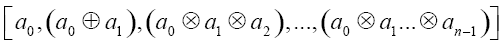。

我们用一个具体的例子来说明，比如对一个任意数组如`[39, 23, 44, 15, 86]`进行求和。使用加法运算符，输出将是`[39, 62, 108, 125, 211]`，这种计算为什么重要或者为什么需要并不明显。实际上，由于后续的每个计算都依赖于前一个计算，甚至不清楚是否有直接并行化此算法的方法。

前缀和的顺序版本具有的运行时间，可以表示如下，假设有两个数组`in_arr`和`out_arr`，并且`out_arr`被设计用来包含`in_arr`的前缀和：

```py
sum = 0
out_arr[0] = 0
do i = 0 to lengthOf(in_arr)
  t = in_arr[i+1]
  sum = sum + t
  out_arr[i] = sum
```

为了从这中提取并行性，我们需要调整我们看待任意输入值数组的观点，而我们正在讨论的调整实际上是将数组想象成被一个计算树消耗。让我们进一步探讨一下为什么。

在这个阶段，我们认为回顾历史并了解谁提出了原始的前缀和计算方法是很重要的。据我所知，1986 年，两位研究人员*丹尼尔·希尔利斯*和*盖·L·斯蒂尔*在*ACM（计算机机械协会）*杂志上发表的一篇题为*数据并行算法*的文章中提出了前缀和的一个版本，他们提出的算法如下（在该文章中如此引用）：

```py
for j = 1 to log2n do
  for all k in parallel do
    if (k >= 2j) then
      x[k] = x[k – 2j-1] + x[k]
    fi
  endfor
endfor
```

以下图表（由 NVIDIA 公司的*Mark Harris*提供），直观地说明了 Hillis 和 Steele 算法的工作原理。它从所有八个元素都被视为二叉树叶子的那一层开始，然后通过计算部分和逐步工作。计算的每一层，`d`，将基于上一层的计算计算部分和。算法中的一个假设是它假设有与元素一样多的处理器，这通过算法中的条件语句`if (k >= 2j)`得到证明。它还有一个问题就是效率不高；它的运行时间复杂度为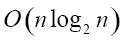，你将记得我们的顺序扫描以的速度运行，所以它肯定更慢。

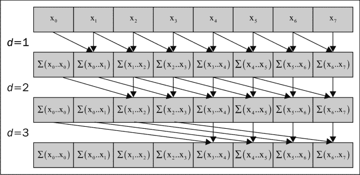

然而，*Guy Blelloch*找到了改进这种方法的方法，它们基于构建平衡二叉树并在每个节点上进行加法操作（从概念上讲）的想法。因为这样的树有*n*个叶子（这对应于数组中的元素数量），将有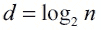层，每层有*2^d*个节点，运行时间复杂度为。以下图表展示了平衡二叉树如何计算任意值的数组：

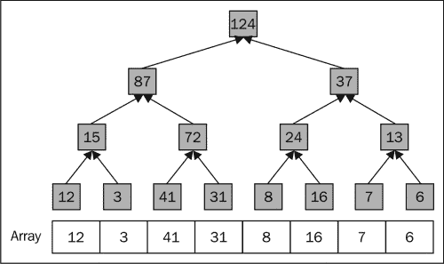

之前的图表创建了并列关系，并改变了你看同一份数据的方式，即包含任意值的一维扁平数组。想象一个计算树，它扫描并操作两个值。存储这些部分和的一种方法是将值就地写入数组，另一种方法是在设备上使用共享内存。

你敏锐的读者直觉会注意到，我们可能通过允许一个线程读取两个元素，将它们相加，并将结果写回数组，然后在数组中读取最后一个元素以获得最终和，来并行化树中每一层的计算。我们刚才描述的算法被称为**归约**内核或**上推**内核（因为我们正在将值向上推到树的根），我们在讨论 OpenCL 中稀疏矩阵计算的章节中看到了它是如何工作的。以下是由*Guy Blelloch*提出的归约阶段的更正式定义，当它应用于深度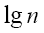的平衡二叉树时：

```py
for d from 0 to (log2 n) – 1
  in parallel for i from 0 to n – 1 by 2d+1
    array[i + 2d+1 – 1] = array[i + 2d – 1] + array[i + 2d+1 – 1]
```

你可能会认为这个上推内核仍然没有计算前缀和，但似乎我们已经找到了并行解决求和问题的解决方案；在这个时候，以下图表将帮助我们了解上推运行期间实际上发生了什么，我们发现稍微展开循环以检查其内存访问模式是有帮助的。

假设我们的数组中有八个元素（即，`n = 8`），我们的树将有一个深度为`3`，`d`的范围从`0`到`2`。想象一下，当我们处于`d = 0`时，通过到`2`，我们会得到以下表达式：

```py
d = 0 => i = [0..7,2] array[i + 1] = array[i] + array[i + 1]
d = 1 => i = [0..7,4] array[i + 3] = array[i + 1] + array[i + 3]
d = 2 => i = [0..7,8] array[i + 7] = array[i + 3] + array[i + 7]
```

下一张图表最好地解释了前面表达式的评估，而图片确实比简单的方程更能揭示故事：

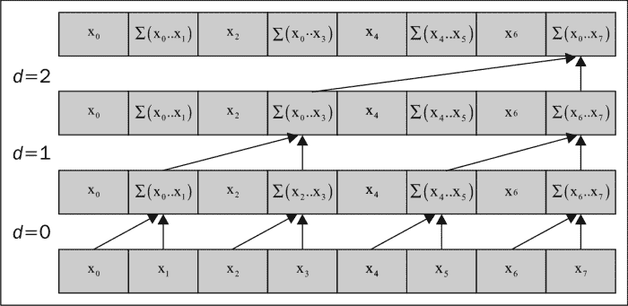

从这张图中，我们可以观察到在树的每一层构建了部分和，这里引入的一个效率是避免了任何重复的加法，也就是说，没有冗余。让我们演示这对于一个包含八个元素的数组是如何工作的，我们还将使用 up-sweep 算法。

以下图表说明了我们在扫描的树的每一层发生的写入操作；在该图表中，蓝色框表示在树的每一层构建的部分和，红色框表示最终的总和值：

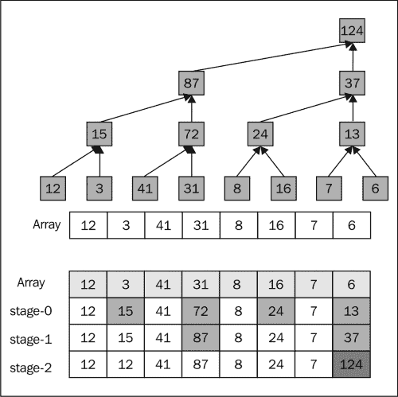

为了能够从 up-sweep 阶段计算前缀和，我们需要从树的根开始，并使用*Guy Blelloch*的此算法进行*down-sweep*：

```py
x[n-1]=0
for d = log2 n – 1 to 0 do
  for all k = 0 to n – 1 by 2d+1 in parallel do
    temp = x[k + 2d – 1]
    x[k + 2d – 1] = x[k + 2d+1 – 1]
    x[k + 2d+1 – 1] = temp + x[k + 2d+1 – 1]
  endfor
endfor
```

这个 down-sweep 在 reduce 阶段之后从树的顶部（或根）开始向下进行，并构建前缀和。让我们简化循环以检查其内存访问模式。

如同之前的 up-sweep 一样，让我们假设我们有八个元素（即，`n = 8`）；我们会有一个深度为`3`，这意味着`d`的范围从`0`到`2`。以下是一些简化后的表达式：

```py
d = 2 => k = [0..7,8] 
    temp = x[k + 3]
    x[k + 3] = x[k + 7]
    x[k + 7] = temp + x[k + 7]
d = 1 => k = [0..7,4]
    temp = x[k + 1]
    x[k + 1] = x[k + 3]
    x[k + 3] = temp + k[x + 3]
d = 0 => k = [0..7,2]
    temp = x[k]
    x[k] = x[k + 1]
    x[k + 1] = temp + x[k + 1]
```

以下图表最好地表达了从 reduce/up-sweep 阶段计算前缀和的方式：

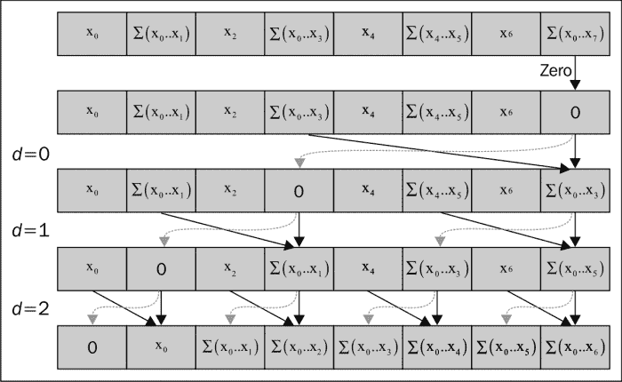

让我们通过以下图表具体化这些想法，看看在 reduce/up-sweep 阶段之后，down-sweep 阶段将如何进行；`input`数组是原始数组，我们保留它以便您验证根据之前的算法计算的前缀和是否正确。图表的下部说明了内存的访问方式。请注意，更新是在原地进行的，当您结合 up-sweep 和 down-sweep 阶段的图表时，您会注意到我们对原始输入数组进行了两次遍历，以得到前缀和的解，这正是我们想要的：

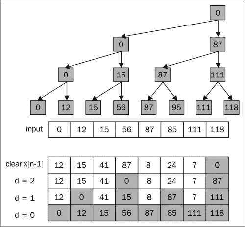

## 如何做到这一点 …

我们在这里提出的内核可以在`Ch10/RadixSort_GPU/RadixSort.cl`中找到，其实施受到了由*Mark Zagha*和*Guy E. Blelloch*撰写的学术论文《向量多处理器的基数排序》（*Radix Sort for Vector Multiprocessors*）的启发，该论文针对 32 位整数。该算法基于 LSD 基数排序，并迭代所有键，根据选择的基数移动键，并按顺序执行 OpenCL 内核；这在前面的图表中描述得最好。

如前所述，我们展示了基于*Zagha*和*Blelloch*的 Radix 排序的顺序版本，就像我们之前所做的那样，这是我们的黄金参考，我们将用它来确定 OpenCL 等效数据计算的准确性。我们不会在这里过多地讨论这个实现，但它作为参考点，当我们展示并行和顺序代码的差异时，你可以从中找到相似之处和不同之处：

```py
int radixSortCPU(cl_uint* unsortedData, cl_uint* hSortedData) {

    cl_uint *histogram = (cl_uint*) malloc(R * sizeof(cl_uint));
    cl_uint *scratch = (cl_uint*) malloc(DATA_SIZE * sizeof(cl_uint));

    if(histogram != NULL && scratch != NULL) {

        memcpy(scratch, unsortedData, DATA_SIZE * sizeof(cl_uint));
        for(int bits = 0; bits < sizeof(cl_uint) * bitsbyte ; bits += bitsbyte) {

            // Initialize histogram bucket to zeros
            memset(histogram, 0, R * sizeof(cl_uint));

            // Calculate 256 histogram for all element
            for(int i = 0; i < DATA_SIZE; ++i)
            {
                cl_uint element = scratch[i];
                cl_uint value = (element >> bits) & R_MASK;
                histogram[value]++;
            }

            // Apply the prefix-sum algorithm to the histogram
            cl_uint sum = 0;
            for(int i = 0; i < R; ++i)
            {
                cl_uint val = histogram[i];
                histogram[i] = sum;
                sum += val;
            }

            // Rearrange the elements based on prescanned histogram
            // Thus far, the preceding code is basically adopted from
            // the "counting sort" algorithm.
            for(int i = 0; i < DATA_SIZE; ++i)
            {
                cl_uint element = scratch[i];
                cl_uint value = (element >> bits) & R_MASK;
                cl_uint index = histogram[value];
                hSortedData[index] = scratch[i];
                histogram[value] = index + 1;
            }

            // Copy to 'scratch' for further use since we are not done yet
            if(bits != bitsbyte * 3)
                memcpy(scratch, hSortedData, DATA_SIZE * sizeof(cl_uint));
        }
    }

    free(scratch);
    free(histogram);
    return 1;
}
```

这段顺序代码类似于我们之前展示的`lsd_sort`代码，它本质上构建了一个使用计数排序对它们进行排序的键的直方图，并且它会一直这样做，直到所有数据都被处理。

以下内核来自`Ch10/RadixSort_GPU/RadixSort.cl`，当我们解释算法的内部工作原理时，我们将引用适当的代码：

```py
#define bitsbyte 8
#define R (1 << bitsbyte)

__kernel void computeHistogram(__global const uint* data,
                               __global uint* buckets,
                               uint shiftBy,
                               __local uint* sharedArray) {

    size_t localId = get_local_id(0);
    size_t globalId = get_global_id(0);
    size_t groupId = get_group_id(0);
    size_t groupSize = get_local_size(0);

    /* Initialize shared array to zero i.e. sharedArray[0..63] = {0}*/
    sharedArray[localId] = 0;
    barrier(CLK_LOCAL_MEM_FENCE);

    /* Calculate thread-histograms local/shared memory range from 32KB to 64KB */

    uint result= (data[globalId] >> shiftBy) & 0xFFU;
    atomic_inc(sharedArray+result);

    barrier(CLK_LOCAL_MEM_FENCE);

    /* Copy calculated histogram bin to global memory */

    uint bucketPos = groupId * groupSize + localId ;
    buckets[bucketPos] = sharedArray[localId];
} 
__kernel void rankNPermute(__global const uint* unsortedData,
                           __global const uint* scannedHistogram,
                           uint shiftCount,
                           __local ushort* sharedBuckets,
                           __global uint* sortedData) {

    size_t groupId = get_group_id(0);
    size_t idx = get_local_id(0);
    size_t gidx = get_global_id(0);
    size_t groupSize = get_local_size(0);

    /* There are now GROUP_SIZE * RADIX buckets and we fill
       the shared memory with those prefix-sums computed previously
     */
    for(int i = 0; i < R; ++i)
    {
        uint bucketPos = groupId * R * groupSize + idx * R + i;
        sharedBuckets[idx * R + i] = scannedHistogram[bucketPos];
    }

    barrier(CLK_LOCAL_MEM_FENCE);

    /* Using the idea behind COUNTING-SORT to place the data values in its sorted
       order based on the current examined key
     */
    for(int i = 0; i < R; ++i)
    {
        uint value = unsortedData[gidx * R + i];
        value = (value >> shiftCount) & 0xFFU;
        uint index = sharedBuckets[idx * R + value];
        sortedData[index] = unsortedData[gidx * R + i];
        sharedBuckets[idx * R + value] = index + 1;
        barrier(CLK_LOCAL_MEM_FENCE);
    }
}
__kernel void blockScan(__global uint *output,
                        __global uint *histogram,
                        __local uint* sharedMem,
                        const uint block_size,
                        __global uint* sumBuffer) {
      int idx = get_local_id(0);
      int gidx = get_global_id(0);
      int gidy = get_global_id(1);
      int bidx = get_group_id(0);
      int bidy = get_group_id(1);

      int gpos = (gidx << bitsbyte) + gidy;
      int groupIndex = bidy * (get_global_size(0)/block_size) + bidx;

      /* Cache the histogram buckets into shared memory
         and memory reads into shared memory is coalesced
      */
      sharedMem[idx] = histogram[gpos];
      barrier(CLK_LOCAL_MEM_FENCE);

    /*
       Build the partial sums sweeping up the tree using
       the idea of Hillis and Steele in 1986
     */
    uint cache = sharedMem[0];
    for(int stride = 1; stride < block_size; stride <<= 1)
    {
        if(idx>=stride)
        {
            cache = sharedMem[idx-stride]+block[idx];
        }
        barrier(CLK_LOCAL_MEM_FENCE); // all threads are blocked here

        sharedMem[idx] = cache;
        barrier(CLK_LOCAL_MEM_FENCE);
    }

    /* write the array of computed prefix-sums back to global memory */
    if(idx == 0)
    {
        /* store the value in sum buffer before making it to 0 */
        sumBuffer[groupIndex] = sharedMem[block_size-1];
        output[gpos] = 0;
    }
    else
    {
        output[gpos] = sharedMem[idx-1];
    }
}
__kernel void unifiedBlockScan(__global uint *output,
                               __global uint *input,
                               __local uint* sharedMem,
                               const uint block_size) {

    int id = get_local_id(0);
    int gid = get_global_id(0);
    int bid = get_group_id(0);

    /* Cache the computational window in shared memory */
    sharedMem[id] = input[gid];

    uint cache = sharedMem[0];

    /* build the sum in place up the tree */
    for(int stride = 1; stride < block_size; stride <<= 1)
    {
        if(id>=stride)
        {
            cache = sharedMem[id-stride]+sharedMem[id];
        }
        barrier(CLK_LOCAL_MEM_FENCE);

        sharedMem[id] = cache;
        barrier(CLK_LOCAL_MEM_FENCE);

    }
    /*write the results back to global memory */
    if(tid == 0) {
        output[gid] = 0;
    } else {
        output[gid] = sharedMem[id-1];
    }
}
__kernel void blockPrefixSum(__global uint* output,
                             __global uint* input,
                             __global uint* summary,
                             int stride) {

     int gidx = get_global_id(0);
     int gidy = get_global_id(1);
     int Index = gidy * stride +gidx;
     output[Index] = 0;

      // Notice that you don't need memory fences in this kernel
      // because there is no race conditions and the assumption
      // here is that the hardware schedules the blocks with lower
      // indices first before blocks with higher indices
     if(gidx > 0)
     {
         for(int i =0;i<gidx;i++)
             output[Index] += input[gidy * stride +i];
     }
     // Write out all the prefix sums computed by this block
     if(gidx == (stride - 1))
         summary[gidy] = output[Index] + input[gidy * stride + (stride -1)];
}

__kernel void blockAdd(__global uint* input,
                       __global uint* output,
                       uint stride) {

      int gidx = get_global_id(0);
      int gidy = get_global_id(1);
      int bidx = get_group_id(0);
      int bidy = get_group_id(1);

      int gpos = gidy + (gidx << bitsbyte);

      int groupIndex = bidy * stride + bidx;

      uint temp;
      temp = input[groupIndex];

      output[gpos] += temp;
}
__kernel void mergePrefixSums(__global uint* input,
                        __global uint* output) {

   int gidx = get_global_id(0);
   int gidy = get_global_id(1);
   int gpos = gidy + (gidx << bitsbyte );
   output[gpos] += input[gidy];
}
```

## 它是如何工作的…

我们在这里提出的方法是分解键，即把 32 位整数分解成 8 位数字，然后逐个从最低有效位开始排序。基于这个想法，我们将循环四次，在每次循环编号*i*时，我们将检查*i*编号的 8 位数字。

根据之前的描述，以下代码给出了基于一般循环结构的代码：

```py
void runKernels(cl_uint* dSortedData, size_t numOfGroups, size_t groupSize) {
   for(int currByte = 0; currByte < sizeof(cl_uint) * bitsbyte; currByte += bitsbyte) {
    computeHistogram(currByte);
    computeBlockScans();
    computeRankingNPermutations(currByte,groupSize);
  }
}
```

循环中的三个调用是这个实现的“工作马”，它们调用内核根据当前我们正在查看的字节从输入中计算直方图。该算法基本上会计算它检查过的键的直方图；下一阶段是计算前缀和（我们将使用 Hillis 和 Steele 算法来完成这项工作），最后我们将更新数据结构并以排序顺序写出值。让我们详细了解一下它是如何工作的。

在主机代码中，你需要以与我们之前展示的不同方式准备数据结构，因为这些结构需要在主机代码和内核代码之间切换时共享。以下图示说明了`runKernels()`的一般概念，这种情况是因为我们创建了一个单个命令队列，所有内核都将按照程序顺序附加到它；这也适用于它们的执行：

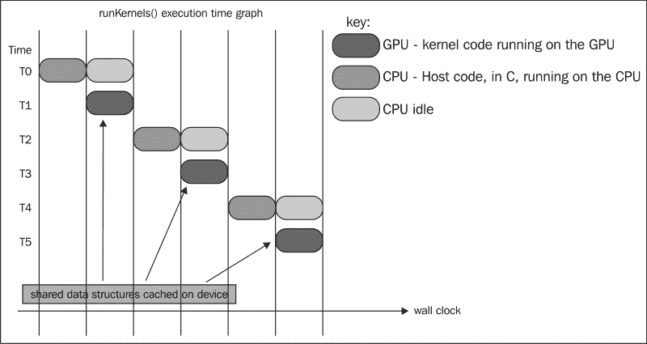

对于这个实现，需要读取并共享存储未排序数据的数据结构（即`unsortedData_d`）。因此，你需要使用带有标志`CL_MEM_USE_HOST_PTR`的设备缓冲区，因为 OpenCL 规范保证它在多个内核调用之间缓存了它。接下来，我们将看看如何在 GPU 上计算直方图。

直方图的计算基于我们在前一章中引入的线程化直方图，但这次我们决定向您展示另一种实现，该实现基于在 OpenCL 中使用原子函数，特别是使用`atomic_inc()`。`atomic_inc`函数将更新指向该位置的值加一。由于我们选择了使用共享内存，而 CPU 目前还不支持这一点，因此直方图在 OpenCL 支持的 GPU 上工作。策略是将我们的输入数组划分为*N x R*元素的块，其中*R*是基数（在我们的情况下*R = 8*，因为每个数字是 8 位宽，且*2⁸=256*），而*N*是执行该块的线程数。这种策略基于我们的问题大小总是会比可用的线程数大得多的假设，我们在启动内核之前在主机代码中程序化地配置它，如下面的代码所示：

```py
void computeHistogram(int currByte) {
    cl_event execEvt;
    cl_int status;
    size_t globalThreads = DATA_SIZE;
    size_t localThreads  = BIN_SIZE;
    status = clSetKernelArg(histogramKernel, 0, sizeof(cl_mem),
             (void*)&unsortedData_d);
    status = clSetKernelArg(histogramKernel, 1, sizeof(cl_mem),
             (void*)&histogram_d);
    status = clSetKernelArg(histogramKernel, 2, sizeof(cl_int),
             (void*)&currByte);
    status = clSetKernelArg(histogramKernel, 3, sizeof(cl_int) *
             BIN_SIZE, NULL);
    status = clEnqueueNDRangeKernel(
        commandQueue,
        histogramKernel,
        1,
        NULL,
        &globalThreads,
        &localThreads,
        0,
        NULL,
        &execEvt);
    clFlush(commandQueue);
    waitAndReleaseDevice(&execEvt);
}
```

通过将 OpenCL 线程块设置为等于`BIN_SIZE`，即 256，内核通过轮询 OpenCL 设备以获取其执行状态来等待计算完成；这种轮询-释放机制由`waitAndReleaseDevice()`封装。

### 注意

当你有多个内核调用，其中一个内核等待另一个内核时，你需要同步，OpenCL 通过`clGetEventInfo`和`clReleaseEvent`提供这种同步。

在直方图内核中，我们通过将输入读取到共享内存中（在将其初始化为零之后）来构建直方图，为了防止任何线程在所有数据加载到共享内存之前执行从共享内存中读取的内核代码，我们放置了一个内存屏障，如下所示：

```py
    /* Initialize shared array to zero i.e. sharedArray[0..63] = {0}*/
    sharedArray[localId] = 0;       
    barrier(CLK_LOCAL_MEM_FENCE);   
```

### 注意

我们是否应该初始化共享内存是有争议的，但最佳实践是初始化数据结构，就像在其他编程语言中做的那样。在这种情况下，权衡的是程序正确性与浪费处理器周期。

接下来，我们将数据值（位于共享内存中）通过一个数字`shiftBy`进行位移，这个数字是我们排序的关键，提取字节，然后原子性地更新局部直方图。之后，我们放置了一个内存屏障。最后，我们将分箱值写入全局直方图中的适当位置，你会注意到这种实现执行了我们所说的*分散写入*：

```py
    uint result= (data[globalId] >> shiftBy) & 0xFFU; //5
    atomic_inc(sharedArray+result);                         //6

    barrier(CLK_LOCAL_MEM_FENCE);                           //7

    /* Copy calculated histogram bin to global memory */

    uint bucketPos = groupId  * groupSize + localId ; //8
    buckets[bucketPos] = sharedArray[localId];        //9
```

一旦建立了直方图，`runKernels()`函数接下来的任务就是依次执行内核`blockScan`、`blockPrefixSum`、`blockAdd`、`unifiedBlockScan`和`mergePrefixSums`中的前缀和计算。我们将在接下来的章节中解释每个内核的功能。

此阶段的通用策略（封装在`computeBlockScans()`中）是在预扫描直方图桶，以便为每个桶生成累加和。然后我们将该值写入辅助数据结构`sum_in_d`，并将所有中间和写入另一个辅助数据结构`scannedHistogram_d`。以下是我们发送给`blockScan`内核的配置：

```py
    size_t numOfGroups = DATA_SIZE / BIN_SIZE;
    size_t globalThreads[2] = {numOfGroups, R};
    size_t localThreads[2] = {GROUP_SIZE, 1};
    cl_uint groupSize = GROUP_SIZE;

status = clSetKernelArg(blockScanKernel, 0, sizeof(cl_mem), (void*)&scannedHistogram_d);
    status = clSetKernelArg(blockScanKernel, 1, sizeof(cl_mem), (void*)&histogram_d);
    status = clSetKernelArg(blockScanKernel, 2, GROUP_SIZE * sizeof(cl_uint), NULL);
    status = clSetKernelArg(blockScanKernel, 3, sizeof(cl_uint), &groupSize);
    status = clSetKernelArg(blockScanKernel, 4, sizeof(cl_mem), &sum_in_d);
    cl_event execEvt;
    status = clEnqueueNDRangeKernel(
                commandQueue,
                blockScanKernel,
                2,
                NULL,
                globalThreads,
                localThreads,
                0,
                NULL,
                &execEvt);
    clFlush(commandQueue);
    waitAndReleaseDevice(&execEvt);
```

扫描背后的通用策略在以下图中得到说明，其中输入被分成单独的块，每个块将提交进行块扫描。生成的结果是累加和，但我们需要整理所有块的结果以获得一个连贯的视图。之后，使用这些累加和值更新直方图桶，然后最终我们可以使用更新的直方图桶对输入数组进行排序。

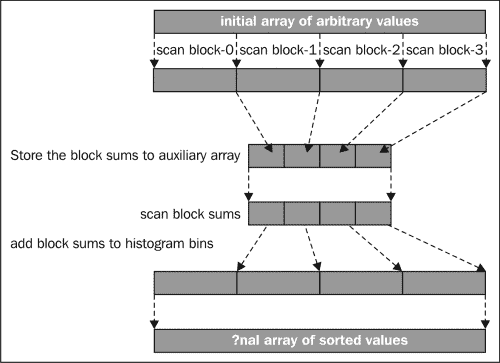

让我们通过检查`blockScan`来看看块扫描是如何进行的。首先，我们将之前计算出的直方图桶的值加载到其共享内存中，如下面的代码所示：

```py
__kernel void blockScan(__global uint *output,
                        __global uint *histogram,
                        __local uint* sharedMem,
                        const uint block_size,
                        __global uint* sumBuffer) {
      int idx = get_local_id(0);
      int gidx = get_global_id(0);
      int gidy = get_global_id(1);
      int bidx = get_group_id(0);
      int bidy = get_group_id(1);

      int gpos = (gidx << bitsbyte) + gidy;
      int groupIndex = bidy * (get_global_size(0)/block_size) + bidx;

      /* Cache the histogram buckets into shared memory
         and memory reads into shared memory is coalesced
      */
      sharedMem[idx] = histogram[gpos];
      barrier(CLK_LOCAL_MEM_FENCE);
```

接下来，我们在本地执行 Hillis 和 Steele 累加和算法，并为当前块构建累加值：

```py
    /*
       Build the partial sums sweeping up the tree using
       the idea of Hillis and Steele in 1986
     */
    uint cache = sharedMem[0];
    for(int dis = 1; dis < block_size; dis <<= 1)
    {
        if(idx>=dis)
        {
            cache = sharedMem[idx-dis]+block[idx];
        }
        barrier(CLK_LOCAL_MEM_FENCE); // all threads are blocked here

        sharedMem[idx] = cache;
        barrier(CLK_LOCAL_MEM_FENCE);
    }
```

最后，我们将此块的累加和写入`sum_in_d`，在以下代码中由`sumBuffer`表示，并将中间累加和写入`scannedHistogram_d`对象，在此处由`output`表示：

```py
    /* write the array of computed prefix-sums back to global memory */
    if(idx == 0)
    {
        /* store the value in sum buffer before making it to 0 */
        sumBuffer[groupIndex] = sharedMem[block_size-1];
        output[gpos] = 0;
    } else {        
        output[gpos] = sharedMem[idx-1];
    }
}
```

以下图说明了两个并行块扫描的概念（假设我们有一个包含八个元素的共享内存）以及它是如何存储到输出中的：

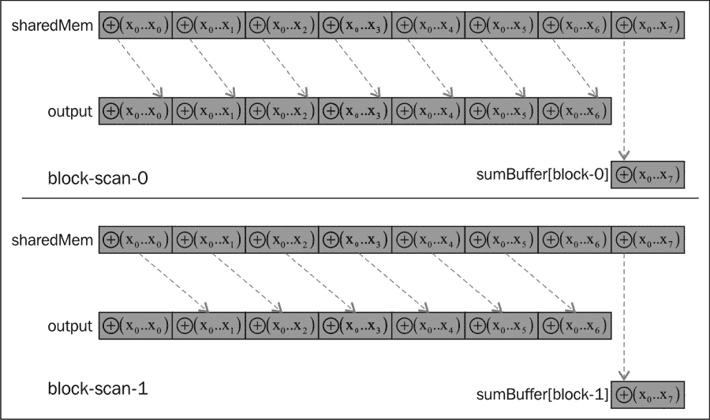

在这个计算阶段，我们已经成功计算了所有单个块的累加和。我们需要在下一个阶段整理它们，该阶段在`blockPrefixSum`内核中，每个工作项将累加单个块的累加值。每个线程的工作将计算不同块的总和。根据线程 ID，`i`将收集从块号`0`到`(i – 1)`的所有总和。以下`blockPrefixSum`中的代码说明了这个过程：

```py
__kernel void blockPrefixSum(__global uint* output,
                             __global uint* input,
                             __global uint* summary,
                             int stride) {

     int gidx = get_global_id(0);
     int gidy = get_global_id(1);
     int Index = gidy * stride +gidx;
     output[Index] = 0;

     if(gidx > 0) {
         for(int i =0;i<gidx;i++)
             output[Index] += input[gidy * stride +i];
     }
```

聪明的读者会注意到我们遗漏了一个块的累加和，以下是通过计算此块的最终累积累加和来获得的补救措施：

```py
     // Write out all the prefix sums computed by this block
     if(gidx == (stride - 1))
         summary[gidy] = output[Index] + input[gidy * stride + (stride -1)];
```

以下图最好地表示了上一个内核代码中的计算过程。它假设我们有一个 16 个元素的块扫描，已经在`blockScanKernel`中完成，并且每个元素都包含前缀和。为了整理这些和，我们配置内核运行八个线程，步进因子为`8`（假设块大小为八个），图表达了八个线程各自在做什么。线程通过计算整个输入的求和，逐步计算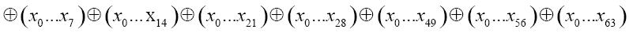并将它们写入`sum_out_d`和`summary_in_d`来整理这些和。

以下是一个图示，说明了给定输入时，该输入的所有元素都是所有块块扫描的求和值；算法基本上将所有内容相加并写入输出数组：


在这一点上，我们必须汇总计算出的中间前缀和，即在`sum_out_d`中的，以及从`scannedHistogram_d`中的值。我们基本上使用`blockAddKernel`将这两个中间求和值相加。以下是我们如何准备在启动内核之前：

```py
        cl_event execEvt2;
        size_t globalThreadsAdd[2] = {numOfGroups, R};
        size_t localThreadsAdd[2] = {GROUP_SIZE, 1};
        status = clSetKernelArg(blockAddKernel, 0, sizeof(cl_mem), (void*)&sum_out_d);
        status = clSetKernelArg(blockAddKernel, 1, sizeof(cl_mem), (void*)&scannedHistogram_d);
        status = clSetKernelArg(blockAddKernel, 2, sizeof(cl_uint), (void*)&stride);
        status = clEnqueueNDRangeKernel(
                    commandQueue,
                    blockAddKernel,
                    2,
                    NULL,
                    globalThreadsAdd,
                    localThreadsAdd,
                    0,
                    NULL,
                    &execEvt2);
        clFlush(commandQueue);
        waitAndReleaseDevice(&execEvt2);
```

然后，我们基本上使用`blockAddKernel`将这些值汇总回`scannedHistogram_d`，其代码如下所示：

```py
__kernel void blockAdd(__global uint* input,
                       __global uint* output,
                       uint stride) {

      int gidx = get_global_id(0);
      int gidy = get_global_id(1);
      int bidx = get_group_id(0);
      int bidy = get_group_id(1);

      int gpos = gidy + (gidx << bitsbyte);

      int groupIndex = bidy * stride + bidx;

      uint temp;
      temp = input[groupIndex];

      output[gpos] += temp;
}
```

最后，我们执行另一个前缀和操作，以汇总`summary_in_d`中的值，因为该数组中的所有元素都包含每个单独块的求和值。由于我们选择的基数值是`256`，我们需要计算出从块`0`到`y`的前缀和计算，通过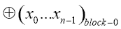到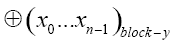。这在一个以下图中展示，并且封装在`unifiedBlockScan`内核中。我们不会展示内核代码，因为它与`blockPrefixSum`内核类似。

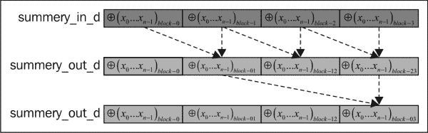

在此时刻，我们剩下将之前执行的前缀和写入`scannedHistogram_d`。这种汇总练习与之前的汇总不同，我们是在块之间收集中间前缀和，但尽管如此，它仍然是一个汇总练习，我们需要将`summary_in_d`中的值推入。我们通过`mergePrefixSumsKernel`完成了这项工作，以下是其主机代码的反映：

```py
        cl_event execEvt4;
        size_t globalThreadsOffset[2] = {numOfGroups, R};
        status = clSetKernelArg(mergePrefixSumsKernel, 0, sizeof(cl_mem), (void*)&summary_out_d);
        status = clSetKernelArg(mergePrefixSumsKernel, 1, sizeof(cl_mem), (void*)&scannedHistogram_d);
        status = clEnqueueNDRangeKernel(commandQueue, mergePrefixSumsKernel, 2, NULL, globalThreadsOffset, NULL, 0, NULL, &execEvt4);
        clFlush(commandQueue);
        waitAndReleaseDevice(&execEvt4);
```

`mergePrefixSumsKernel`练习是一个相对简单的练习，使用以下内核代码将值移到它们正确的位置：

```py
__kernel void mergePrefixSums(__global uint* input,
                              __global uint* output) {

   int gidx = get_global_id(0);
   int gidy = get_global_id(1);
   int gpos = gidy + (gidx << bitsbyte );
   output[gpos] += input[gidy];
}
```

通过这种方式，前缀和被正确计算。算法的下一阶段将是使用每个工作项/线程对键进行排序和排列，每个工作项/线程通过预先扫描的直方图桶排列其 256 个元素，封装在`computeRankNPermutations()`中。以下是为内核启动的主机代码：

```py
void computeRankingNPermutations(int currByte, size_t groupSize) {
    cl_int status;
    cl_event execEvt;

    size_t globalThreads = DATA_SIZE/R;
    size_t localThreads = groupSize;

    status = clSetKernelArg(permuteKernel, 0, sizeof(cl_mem), (void*)&unsortedData_d);
    status = clSetKernelArg(permuteKernel, 1, sizeof(cl_mem), (void*)&scannedHistogram_d);
    status = clSetKernelArg(permuteKernel, 2, sizeof(cl_int), (void*)&currByte);
    status = clSetKernelArg(permuteKernel, 3, groupSize * R * sizeof(cl_ushort), NULL); // shared memory
    status = clSetKernelArg(permuteKernel, 4, sizeof(cl_mem), (void*)&sortedData_d);

    status = clEnqueueNDRangeKernel(commandQueue, permuteKernel, 1, NULL, &globalThreads, &localThreads, 0, NULL, &execEvt);
    clFlush(commandQueue);
    waitAndReleaseDevice(&execEvt);
```

一旦内核成功完成，数据值将是有序的，并将由`sortedData_d`保存在设备内存中。我们需要将这些数据再次复制到`unsortedData_d`中，我们将继续这样做，直到我们完成键的迭代。

在`rankNPermute`内核中，我们再次利用共享内存。将数据放入共享内存中，数据组织为`GROUP_SIZE * RADIX`，其中`GROUP_SIZE = 64`和`RADIX = 256`表达式成立，并且由于每个工作组被配置为使用 64 个线程执行，我们基本上有一个线程填充其共享内存中的 256 个元素（以下代码片段演示了这一点）：

```py
__kernel void rankNPermute(__global const uint* unsortedData,
                           __global const uint* scannedHistogram,
                           uint shiftCount,
                           __local ushort* sharedBuckets,
                           __global uint* sortedData) {
    size_t groupId = get_group_id(0);
    size_t idx = get_local_id(0);
    size_t gidx = get_global_id(0);
    size_t groupSize = get_local_size(0);
    for(int i = 0; i < R; ++i) {
        uint bucketPos = groupId * R * groupSize + idx * R + i;
        sharedBuckets[idx * R + i] = scannedHistogram[bucketPos];
    }
    barrier(CLK_LOCAL_MEM_FENCE);
```

接下来，它根据与顺序算法中相同的思想对元素进行排序，你现在应该回顾一下那个算法。不同之处在于，我们从全局设备内存中的`unsortedData`中提取数据值，在设备内存中处理它们，确定值应该放在哪里，并将它们写入到`sortedData`中：

```py
    for(int i = 0; i < R; ++i) {
        uint value = unsortedData[gidx * R + i];
        value = (value >> shiftCount) & 0xFFU;
        uint index = sharedBuckets[idx * R + value];
        sortedData[index] = unsortedData[gidx * R + i];
        sharedBuckets[idx * R + value] = index + 1;
        barrier(CLK_LOCAL_MEM_FENCE);
    }
```

排序和排列完成后，`sortedData_d`对象中的数据值将根据当前检查的键进行排序。算法会将`sortedData_d`中的数据复制到`unsortedData_d`中，以便整个过程可以重复进行，总共四次。
