# 第二章：有效的结构

在本章中，我们将涵盖：

+   使用地理空间视图

+   使用触发器填充几何列

+   使用表继承结构化空间数据

+   扩展继承 – 表分区

+   标准化导入

+   标准化内部叠加

+   使用多边形叠加进行比例人口估计

# 简介

本章重点介绍使用 PostgreSQL 和 PostGIS 功能组合提供的数据结构化方法。这些方法对于结构化和清理导入数据、在输入时将表格数据“即时”转换为空间数据以及使用 PostgreSQL 和 PostGIS 强大组合的功能维护表和数据集之间的关系非常有用。我们将利用这些功能的三个技术类别：使用视图和触发器自动填充和修改数据、使用 PostgreSQL 表继承进行面向对象，以及使用 PostGIS 函数（存储过程）重建和标准化有问题的数据。

自动填充数据是本章的开始。通过利用 PostgreSQL 视图和触发器，我们可以创建灵活的解决方案，在表之间和表中创建连接。通过扩展，对于更正式或结构化的案例，PostgreSQL 提供了表继承和表分区，这允许在表之间显式地建立层次关系。这在对象继承模型强制数据关系以更好地表示数据、从而提高效率或减少随着时间的推移维护和访问数据集的行政负担的情况下非常有用。通过 PostGIS 扩展该功能，继承不仅适用于常用的表属性，还适用于利用表之间的空间关系，从而在非常大的数据集上实现更高的查询效率。最后，我们将探讨 PostGIS SQL 模式，它提供了数据输入的表标准化，因此来自平面文件系统或未标准化的数据集可以转换为我们在数据库中期望的形式。

# 使用地理空间视图

PostgreSQL 中的视图允许以不同的形式表示数据和数据关系。在本例中，我们将使用视图来允许基于表格输入自动创建点数据。我们可以想象一个案例，其中数据输入流是非空间数据，但包括经纬度或其他坐标。我们希望自动将此数据作为空间中的点显示。

# 准备工作

我们可以非常容易地创建一个视图来表示空间数据。创建视图的语法与创建表类似，例如：

```py
CREATE VIEW viewname AS 
  SELECT... 
```

在前面的命令行中，我们的 `SELECT` 查询为我们操作数据。让我们从一个小的数据集开始。在这种情况下，我们将从一些随机点开始，这些点可能是真实数据。

首先，我们创建一个表，视图将从该表构建，如下所示：

```py
-- Drop the table in case it exists 
DROP TABLE IF EXISTS chp02.xwhyzed CASCADE;  
CREATE TABLE chp02.xwhyzed 
-- This table will contain numeric x, y, and z values 
( 
  x numeric, 
  y numeric, 
  z numeric 
) 
WITH (OIDS=FALSE); 
ALTER TABLE chp02.xwhyzed OWNER TO me; 
-- We will be disciplined and ensure we have a primary key 
ALTER TABLE chp02.xwhyzed ADD COLUMN gid serial; 
ALTER TABLE chp02.xwhyzed ADD PRIMARY KEY (gid); 
```

现在，让我们使用以下查询用测试数据填充它：

```py
INSERT INTO chp02.xwhyzed (x, y, z) 
  VALUES (random()*5, random()*7, random()*106); 
INSERT INTO chp02.xwhyzed (x, y, z) 
  VALUES (random()*5, random()*7, random()*106); 
INSERT INTO chp02.xwhyzed (x, y, z) 
  VALUES (random()*5, random()*7, random()*106); 
INSERT INTO chp02.xwhyzed (x, y, z) 
  VALUES (random()*5, random()*7, random()*106); 
```

# 如何做...

现在，要创建视图，我们将使用以下查询：

```py
-- Ensure we don't try to duplicate the view
DROP VIEW IF EXISTS chp02.xbecausezed;
-- Retain original attributes, but also create a point   attribute from x and y
CREATE VIEW chp02.xbecausezed AS
SELECT x, y, z, ST_MakePoint(x,y)
FROM chp02.xwhyzed;

```

# 它是如何工作的...

我们的视图实际上是对现有数据进行简单转换的结果，使用 PostGIS 的`ST_MakePoint`函数。`ST_MakePoint`函数接受两个数字作为输入以创建一个 PostGIS 点，在这种情况下，我们的视图简单地使用我们的*x*和*y*值来填充数据。每当表中更新以添加包含*x*和*y*值的新记录时，视图将填充一个点，这对于不断更新的数据非常有用。

这种方法有两个缺点。第一个缺点是我们没有在视图中声明我们的空间参考系统，因此任何消费这些点的软件将不知道我们使用的坐标系，即它是地理坐标系（纬度/经度）还是平面坐标系。我们将很快解决这个问题。第二个问题是许多访问这些点的软件系统可能不会自动检测并使用表中的空间信息。这个问题在*使用触发器填充几何列*食谱中得到了解决。

**空间参考系统标识符**（**SRID**）允许我们指定给定数据集的坐标系。编号系统是一个简单的整数值，用于指定一个特定的坐标系。SRIDs 最初来源于**欧洲石油调查组**（**EPSG**），现在由**油气生产者国际协会**（**OGP**）的测绘与定位委员会维护。用于 SRID 的有用工具是空间参考([`spatialreference.org`](http://spatialreference.org))和 Prj2EPSG([`prj2epsg.org/search`](http://prj2epsg.org/search))。

# 还有更多...

要解决*如何工作...*部分中提到的第一个问题，我们可以简单地用另一个指定 SRID 为`ST_SetSRID`的函数包装现有的`ST_MakePoint`函数，如下面的查询所示：

```py
-- Ensure we don't try to duplicate the view 
DROP VIEW IF EXISTS chp02.xbecausezed; 
-- Retain original attributes, but also create a point   attribute from x and y 
CREATE VIEW chp02.xbecausezed AS 
  SELECT x, y, z, ST_SetSRID(ST_MakePoint(x,y), 3734) -- Add ST_SetSRID 
  FROM chp02.xwhyzed; 
```

# 参见

+   *使用触发器填充几何列*的食谱

# 使用触发器填充几何列

在这个食谱中，我们假设我们的数据库中数据不断增加，需要空间表示；然而，在这种情况下，我们希望硬编码的几何列在数据库上每次插入时更新，将*x*和*y*值转换为几何形状，就像它们被插入到数据库中一样。

这种方法的优势是，几何形状随后被注册在`geometry_columns`视图中，因此这种方法比创建新的地理空间视图与更多的 PostGIS 客户端类型更可靠。这也提供了允许进行空间索引的优势，这可以显著加快各种查询的速度。

# 准备工作

我们将首先创建另一个包含 `x`、`y` 和 `z` 值的随机点表格，如下查询所示：

```py
DROP TABLE IF EXISTS chp02.xwhyzed1 CASCADE; 
CREATE TABLE chp02.xwhyzed1 
( 
  x numeric, 
  y numeric, 
  z numeric 
) 
WITH (OIDS=FALSE); 
ALTER TABLE chp02.xwhyzed1 OWNER TO me; 
ALTER TABLE chp02.xwhyzed1 ADD COLUMN gid serial; 
ALTER TABLE chp02.xwhyzed1 ADD PRIMARY KEY (gid); 

INSERT INTO chp02.xwhyzed1 (x, y, z) 
  VALUES (random()*5, random()*7, random()*106); 
INSERT INTO chp02.xwhyzed1 (x, y, z) 
  VALUES (random()*5, random()*7, random()*106); 
INSERT INTO chp02.xwhyzed1 (x, y, z) 
  VALUES (random()*5, random()*7, random()*106); 
INSERT INTO chp02.xwhyzed1 (x, y, z) 
  VALUES (random()*5, random()*7, random()*106); 
```

# 如何做到这一点...

现在我们需要一个几何列来填充。默认情况下，几何列将填充为空值。我们使用以下查询来填充几何列：

```py
SELECT AddGeometryColumn ('chp02','xwhyzed1','geom',3734,'POINT',2); 
```

现在我们有一个名为 `geom` 的列，其 SRID 为 `3734`；即二维的点几何类型。由于我们有 `x`、`y` 和 `z` 数据，原则上我们可以使用类似的方法填充一个 3D 点表。

由于所有几何值目前都是空值，我们将使用以下 `UPDATE` 语句来填充它们：

```py
UPDATE chp02.xwhyzed1 
  SET the_geom = ST_SetSRID(ST_MakePoint(x,y), 3734); 
```

当分解查询时，这里很简单。我们更新 `xwhyzed1` 表并使用 `ST_MakePoint` 设置 `the_geom` 列，使用 `x` 和 `y` 列构建我们的点，并将其包裹在 `ST_SetSRID` 函数中，以便应用适当的空间参考信息。到目前为止，我们只是设置了表格。现在，我们需要创建一个触发器，以便在表格使用时继续填充这些信息。触发器的第一部分是使用以下查询的新填充几何函数：

```py
CREATE OR REPLACE FUNCTION chp02.before_insertXYZ() 
  RETURNS trigger AS 
$$ 
BEGIN 

if NEW.geom is null then 
   NEW.geom = ST_SetSRID(ST_MakePoint(NEW.x,NEW.y), 3734); 
end if; 
RETURN NEW; 
END; 

$$ 
LANGUAGE 'plpgsql'; 
```

实质上，我们创建了一个函数，它正好做了我们手动做的事情：使用 `ST_SetSRID` 和 `ST_MakePoint` 的组合更新表的几何列，但只更新新插入的注册，而不是整个表。

# 更多...

虽然我们已经创建了一个函数，但我们还没有将其作为触发器应用到表格上。让我们在这里按照以下步骤进行：

```py
CREATE TRIGGER popgeom_insert
 BEFORE INSERT ON chp02.xwhyzed1
 FOR EACH ROW EXECUTE PROCEDURE chp02.before_insertXYZ();
```

假设一般的几何列更新尚未发生，那么原始的五个注册仍然在其几何列中为 `null`。现在，一旦触发器被激活，任何插入到我们的表中的数据都应该包含新的几何记录。让我们使用以下查询进行测试插入：

```py
INSERT INTO chp02.xwhyzed1 (x, y, z)
 VALUES (random()*5, random()*7, 106),
 (random()*5, random()*7, 107),
 (random()*5, random()*7, 108),
 (random()*5, random()*7, 109),
 (random()*5, random()*7, 110);
```

使用以下命令检查行以验证 `geom` 列是否已更新：

```py
SELECT * FROM chp02.xwhyzed1;
```

或者使用 `pgAdmin`：

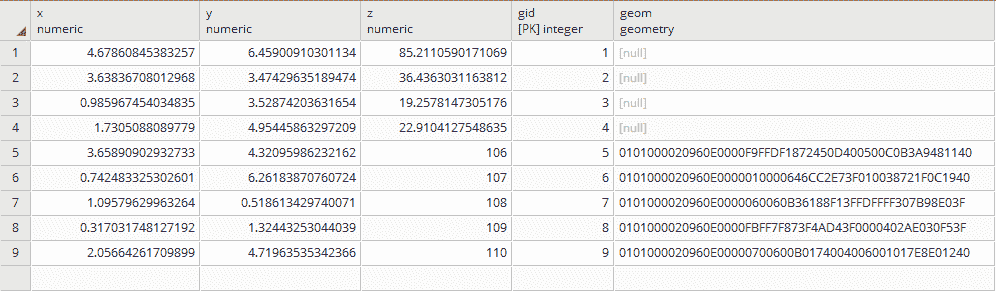

在应用一般更新后，所有注册的 `geom` 列都将有一个值：


# 进一步扩展...

到目前为止，我们已经实现了一个 `insert` 触发器。如果特定行的值发生变化怎么办？在这种情况下，我们将需要一个单独的更新触发器。我们将更改我们的原始函数以测试 `UPDATE` 的情况，并在我们的触发器中使用 `WHEN` 来约束对更改的列的更新。

此外，请注意，以下函数是基于用户希望始终根据变化值更新几何形状的假设编写的：

```py
CREATE OR REPLACE FUNCTION chp02.before_insertXYZ() 
  RETURNS trigger AS 
$$ 
BEGIN 
if (TG_OP='INSERT') then 
  if (NEW.geom is null) then 
    NEW.geom = ST_SetSRID(ST_MakePoint(NEW.x,NEW.y), 3734); 
  end if; 
ELSEIF (TG_OP='UPDATE') then 
  NEW.geom = ST_SetSRID(ST_MakePoint(NEW.x,NEW.y), 3734);
end if;
RETURN NEW; 
END; 

$$ 
LANGUAGE 'plpgsql'; 

CREATE TRIGGER popgeom_insert 
  BEFORE INSERT ON chp02.xwhyzed1 
  FOR EACH ROW EXECUTE PROCEDURE chp02.before_insertXYZ(); 

CREATE trigger popgeom_update 
  BEFORE UPDATE ON chp02.xwhyzed1 
  FOR EACH ROW  
  WHEN (OLD.X IS DISTINCT FROM NEW.X OR OLD.Y IS DISTINCT FROM  
    NEW.Y) 
  EXECUTE PROCEDURE chp02.before_insertXYZ(); 
```

# 参见

+   *使用地理空间视图* 的配方

# 使用表继承结构化空间数据

PostgreSQL 数据库的一个不寻常且有用的特性是它允许对象继承模型，这些模型适用于表。这意味着我们可以在表之间建立父子关系，并利用这一点以有意义的方式组织数据。在我们的例子中，我们将此应用于水文数据。这些数据可以是点、线、多边形或更复杂的结构，但它们有一个共同点：它们在物理上是明确链接的，并且本质上相关；它们都与水有关。水/水文是一个非常好的自然系统，可以以这种方式进行建模，因为我们对它的空间建模方式可以根据比例、细节、数据收集过程以及许多其他因素而大相径庭。

# 准备中

我们将要使用的数据是经过修改的工程*蓝线*（见以下截图）的水文数据，即非常详细且旨在用于接近 1:600 比例尺的数据。在原始应用中，这些数据作为断线，有助于详细的数字地形建模。

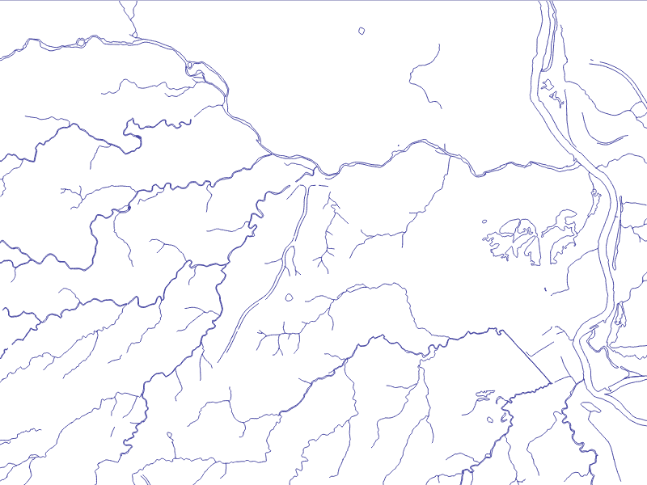

虽然本身很有用，但这些数据还进一步被操作，将线性特征与区域特征分开，并对区域特征进行了额外的多边形化，如下面的截图所示：

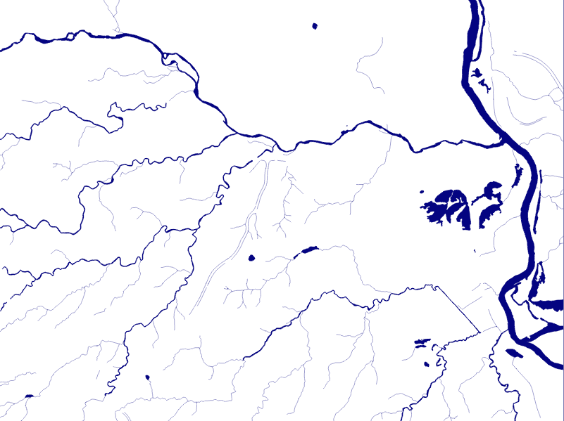

最后，数据被分类到基本水道类别，如下所示：

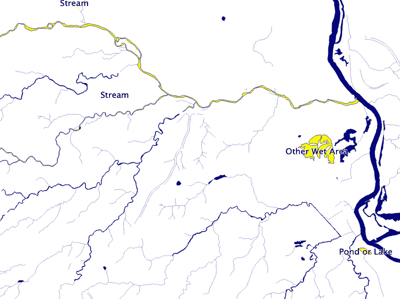

此外，还进行了一个过程来生成如河流等多边形特征的中心线，这些特征实际上是线性特征，如下所示：


因此，我们有三个相互独立但又相关的数据集：

+   `cuyahoga_hydro_polygon`

+   `cuyahoga_hydro_polyline`

+   `cuyahoga_river_centerlines`

现在，让我们看看表格数据的结构。从书籍存储库中解压水文文件并进入该目录。`ogrinfo`实用程序可以帮助我们，如下面的命令所示：

```py
> ogrinfo cuyahoga_hydro_polygon.shp -al -so  
```

输出如下：

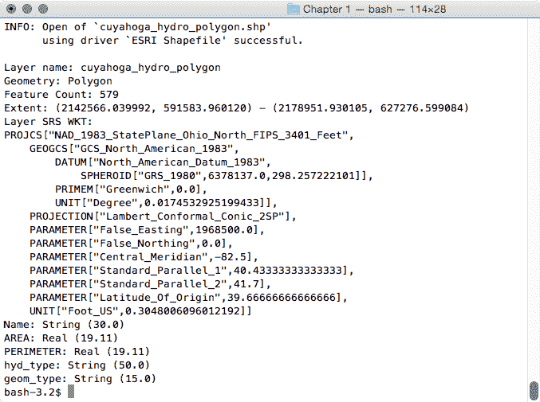

在每个形状文件上执行此查询，我们看到以下所有形状文件都通用的字段：

+   `name`

+   `hyd_type`

+   `geom_type`

通过理解我们的通用字段，我们可以应用继承来完全组织我们的数据。

# 如何操作...

现在我们知道了我们的通用字段，创建一个继承模型就很容易了。首先，我们将创建一个父表，其中包含所有表共有的字段，使用以下查询：

```py
CREATE TABLE chp02.hydrology ( 
  gid SERIAL PRIMARY KEY, 
  "name"      text, 
  hyd_type    text, 
  geom_type   text, 
  the_geom    geometry 
); 
```

如果你注意到了，我们还在其中添加了一个`geometry`字段，因为所有我们的形状文件都隐含了这种共性。使用继承，任何插入到子表中的记录也将保存在我们的父表中，但这些记录将存储没有为子表指定的额外字段。

为了为给定的表建立继承关系，我们只需要使用以下查询声明子表包含的额外字段：

```py
CREATE TABLE chp02.hydrology_centerlines ( 
  "length"    numeric 
) INHERITS (chp02.hydrology); 

CREATE TABLE chp02.hydrology_polygon ( 
  area    numeric, 
  perimeter    numeric 
) INHERITS (chp02.hydrology); 

CREATE TABLE chp02.hydrology_linestring ( 
  sinuosity    numeric 
) INHERITS (chp02.hydrology_centerlines); 
```

现在，我们已经准备好使用以下命令加载数据：

+   `shp2pgsql -s 3734 -a -i -I -W LATIN1 -g the_geom cuyahoga_hydro_polygon chp02.hydrology_polygon | psql -U me -d postgis_cookbook`

+   `shp2pgsql -s 3734 -a -i -I -W LATIN1 -g the_geom cuyahoga_hydro_polyline chp02.hydrology_linestring | psql -U me -d postgis_cookbook`

+   `shp2pgsql -s 3734 -a -i -I -W LATIN1 -g the_geom cuyahoga_river_centerlines chp02.hydrology_centerlines | psql -U me -d postgis_cookbook`

如果我们查看父表，我们将看到所有子表中的所有记录。以下是对`hydrology`字段的一个截图：

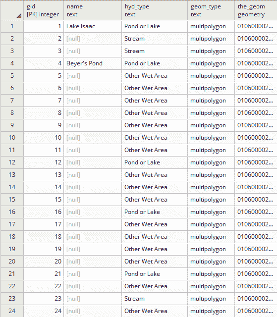

将它与`hydrology_linestring`中可用的字段进行比较，将揭示感兴趣的特定字段：

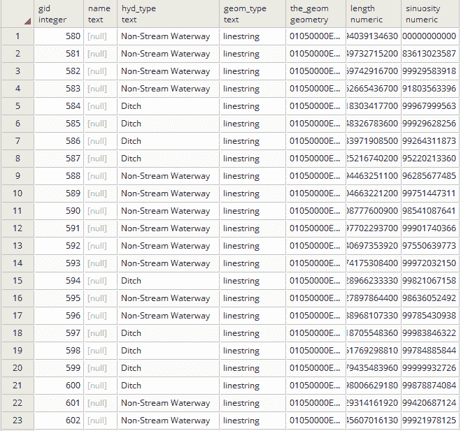

# 它是如何工作的...

PostgreSQL 表继承允许我们在表之间强制执行基本层次关系。在这种情况下，我们利用继承来允许相关数据集之间的共性。现在，如果我们想查询这些表中的数据，我们可以直接从父表查询，如下所示，具体取决于我们是否想要混合几何形状或只是针对特定数据集：

```py
SELECT * FROM chp02.hydrology 
```

从任何子表，我们可以使用以下查询：

```py
SELECT * FROM chp02.hydrology_polygon 
```

# 参见

可以通过结合使用`CHECK`约束和继承来扩展这个概念，以利用和优化存储和查询。有关更多信息，请参阅*扩展继承 – 表分区*配方。

# 扩展继承 – 表分区

表分区是特定于 PostgreSQL 的一种方法，它扩展了继承，用于模型化通常在可用字段上没有差异的表。但是，子表代表基于各种因素的数据的逻辑分区，无论是时间、值范围、分类，还是在我们的案例中，空间关系。分区的好处包括由于索引较小和针对数据的扫描而提高的查询性能，以及绕过真空操作成本的批量加载和删除。因此，可以将常用数据放在更快、更昂贵的存储上，而将剩余数据放在较慢、更便宜的存储上。与 PostGIS 结合使用，我们获得了空间分区的新颖功能，这对于大型数据集来说是一个非常强大的特性。

# 准备工作

我们可以举出许多大型数据集的例子，这些数据集可以从分区中受益。在我们的案例中，我们将使用等高线数据集。等高线是表示地形数据的有用方式，因为它们已经建立并且因此通常被解释。等高线还可以将地形数据压缩成线性表示，从而使其能够与其他数据一起轻松显示。

问题在于，轮廓数据的存储可能相当昂贵。一个美国县区的两英尺轮廓可能需要 20 到 40 GB，而对于更大区域，如地区或国家，存储此类数据可能从性能的角度来看变得相当有约束力。

# 如何操作...

在这个案例中，第一步可能是准备数据。如果我们有一个名为 `cuy_contours_2` 的单一轮廓表，我们可以选择将数据裁剪成一系列矩形，这些矩形将作为我们的表分区；在这种情况下，使用以下查询的 `chp02.contour_clip`：

```py
CREATE TABLE chp02.contour_2_cm_only AS 
  SELECT contour.elevation, contour.gid, contour.div_10, contour.div_20, contour.div_50, 
  contour.div_100, cc.id, ST_Intersection(contour.the_geom, cc.the_geom) AS the_geom FROM 
    chp02.cuy_contours_2 AS contour, chp02.contour_clip as cc 
    WHERE ST_Within(contour.the_geom,cc.the_geom 
      OR 
      ST_Crosses(contour.the_geom,cc.the_geom); 
```

在这里，我们在查询中执行了两个测试。我们使用了 `ST_Within`，它测试一个给定的轮廓是否完全位于我们的兴趣区域内。如果是这样，我们执行交集；结果几何形状应该是轮廓的几何形状。

`ST_Crosses` 函数检查轮廓是否穿过我们正在测试的几何形状的边界。这应该会捕获所有部分位于我们区域内部和外部几何形状。这些是我们将真正相交以获得结果形状的几何形状。

在我们的案例中，这样做更容易，我们不需要这一步。我们的轮廓形状已经是裁剪到矩形边界的独立形状文件，如下面的截图所示：

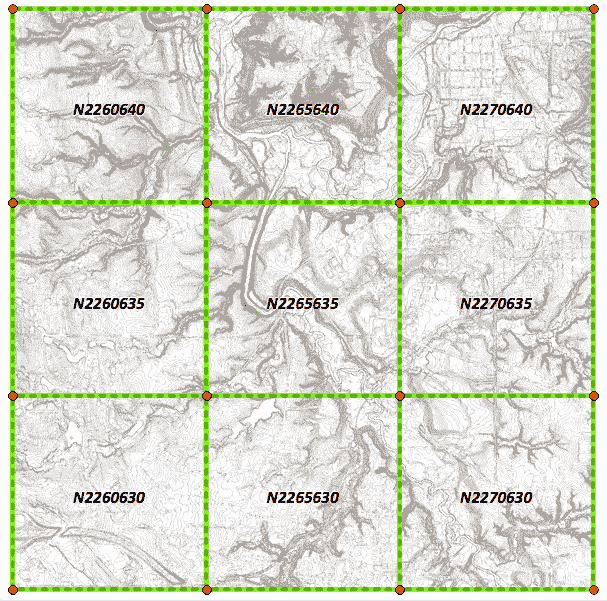

由于数据已经被裁剪成我们分区所需的块，我们只需继续创建适当的分区。

与继承类似，我们首先使用以下查询创建父表：

```py
CREATE TABLE chp02.contours 
( 
  gid serial NOT NULL, 
  elevation integer, 
  __gid double precision, 
  the_geom geometry(MultiLineStringZM,3734), 
  CONSTRAINT contours_pkey PRIMARY KEY (gid) 
) 
WITH ( 
  OIDS=FALSE 
); 
```

在这里，我们再次保持约束，如 `PRIMARY KEY`，并指定几何类型（`MultiLineStringZM`），并不是因为这些会传播到子表中，而是为了让任何访问父表的客户端软件能够预测这些约束。

现在，我们可以开始创建继承自父表的新表。在这个过程中，我们将创建一个 `CHECK` 约束，指定我们相关几何形状的限制，如下所示：

```py
CREATE TABLE chp02.contour_N2260630 
  (CHECK
    (ST_CoveredBy(the_geom,ST_GeomFromText
      ('POLYGON((2260000, 630000, 2260000 635000, 2265000 635000,
                 2265000 630000, 2260000 630000))',3734)
    )
  )) INHERITS (chp02.contours); 
```

我们可以使用与剩余表类似的 `CREATE TABLE` 查询来完成表结构的分区，如下所示：

```py
CREATE TABLE chp02.contour_N2260635 
  (CHECK 
    (ST_CoveredBy(the_geom,ST_GeomFromText
      ('POLYGON((2260000 635000, 2260000 640000,
                 2265000 640000, 2265000 635000, 2260000 635000))', 3734) 
    )
  )) INHERITS (chp02.contours); 
CREATE TABLE chp02.contour_N2260640 
  (CHECK
    (ST_CoveredBy(the_geom,ST_GeomFromText
      ('POLYGON((2260000 640000, 2260000 645000, 2265000 645000,
                 2265000 640000, 2260000 640000))', 3734) 
    )
  )) INHERITS (chp02.contours); 
CREATE TABLE chp02.contour_N2265630 
  (CHECK
    (ST_CoveredBy(the_geom,ST_GeomFromText 
      ('POLYGON((2265000 630000, 2265000 635000, 2270000 635000,
                 2270000 630000, 2265000 630000))', 3734)
    )
  )) INHERITS (chp02.contours); 
CREATE TABLE chp02.contour_N2265635 
  (CHECK 
    (ST_CoveredBy(the_geom,ST_GeomFromText
      ('POLYGON((2265000 635000, 2265000 640000, 2270000 640000,
                 2270000 635000, 2265000 635000))', 3734) 
    )
  )) INHERITS (chp02.contours); 
CREATE TABLE chp02.contour_N2265640 
  (CHECK 
    (ST_CoveredBy(the_geom,ST_GeomFromText
      ('POLYGON((2265000 640000, 2265000 645000, 2270000 645000,
                 2270000 640000, 2265000 640000))', 3734) 
    )
  )) INHERITS (chp02.contours); 
CREATE TABLE chp02.contour_N2270630 
  (CHECK 
    (ST_CoveredBy(the_geom,ST_GeomFromText
      ('POLYGON((2270000 630000, 2270000 635000, 2275000 635000, 
                 2275000 630000, 2270000 630000))', 3734) 
    )
  )) INHERITS (chp02.contours); 
CREATE TABLE chp02.contour_N2270635 
  (CHECK 
    (ST_CoveredBy(the_geom,ST_GeomFromText
      ('POLYGON((2270000 635000, 2270000 640000, 2275000 640000, 
                 2275000 635000, 2270000 635000))', 3734) 
    )
  )) INHERITS (chp02.contours); 
CREATE TABLE chp02.contour_N2270640 
  (CHECK
    (ST_CoveredBy(the_geom,ST_GeomFromText     
      ('POLYGON((2270000 640000, 2270000 645000, 2275000 645000, 
                 2275000 640000, 2270000 640000))', 3734) 
    )
  )) INHERITS (chp02.contours); 
```

现在，我们可以使用以下命令将 `contours1` ZIP 文件中找到的轮廓形状文件加载到每个子表中，通过替换文件名。如果我们想的话，我们甚至可以在父表上实现一个触发器，将每个插入操作放入正确的子表中，尽管这可能会影响性能：

```py
shp2pgsql -s 3734 -a -i -I -W LATIN1 -g the_geom N2265630 chp02.contour_N2265630 | psql -U me -d postgis_cookbook
```

# 它是如何工作的...

在这种情况下，结合继承的 `CHECK` 约束是构建表分区所需的所有内容。我们正在使用边界框作为 `CHECK` 约束，并简单地从父表继承列。现在我们已经设置了这些，对父表的查询将首先检查我们的 `CHECK` 约束，然后再执行查询。

这也允许我们将任何我们较少使用的等高线表放置在更便宜、更慢的存储上，从而允许对大型数据集进行成本效益的优化。这种结构对于快速变化的数据也有益，因为可以对整个区域应用更新；该区域的整个表可以有效地删除并重新填充，而无需遍历整个数据集。

# 参见

更多关于表继承的信息，特别是与子表中使用备用列相关的灵活性，请参阅之前的配方，*使用表继承结构化空间数据*。

# 规范化导入

通常，空间数据库中使用的数据是从其他来源导入的。因此，它可能不是我们当前应用有用的形式。在这种情况下，编写辅助函数将数据转换成对我们应用更有用的形式可能是有用的。这尤其适用于从平面文件格式，如 Shapefile，到关系数据库，如 PostgreSQL 的转换。

Shapefile 是一种事实上的以及格式规范，用于存储空间数据，可能是空间数据最常用的交付格式。尽管名为 Shapefile，但它绝不是单个文件，而是一组文件的集合。它至少包含`*.shp`（包含几何信息）、`*.shx`（索引文件）和`*.dbf`（包含 Shapefile 的表格信息）。这是一个强大且有用的格式，但作为一个平面文件，它本质上是非关系的。每个几何体与表格中的每一行都有一个一对一的关系。

有许多结构可能作为 Shapefile 中关系存储的代理。在这里我们将探讨其中一个：一个字段，用于分隔多个关系。这是将多个关系编码到平面文件中的一种不太常见的技巧。另一种常见的方法是创建多个字段来存储在关系安排中本应是一个单一字段的内容。

# 准备工作

我们将要处理的数据集是一个公园系统中一系列小径的线性范围数据集。这些数据是典型的 GIS 世界中的数据；作为一个平面 Shapefile，数据中没有显式的关系结构。

首先，解压`trails.zip`文件，然后使用命令行进入它，然后使用以下命令加载数据：

```py
shp2pgsql -s 3734 -d -i -I -W LATIN1 -g the_geom trails chp02.trails | psql -U me -d postgis_cookbook
```

观察线性数据，我们有关于用途类型的几个类别：

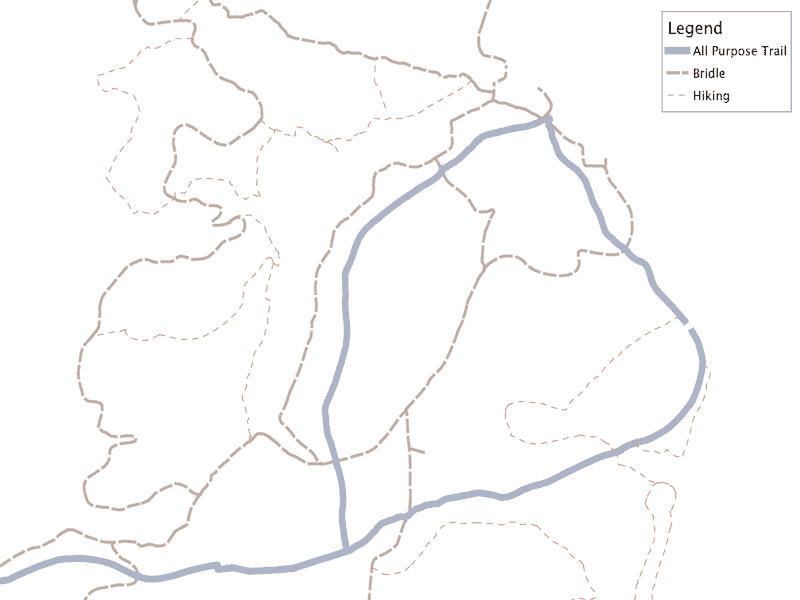

我们希望保留这些信息以及名称。不幸的是，`label_name`字段是一个混乱的字段，其中包含各种相关名称，通过和符号（`&`）连接，如下面的查询所示：

```py
SELECT DISTINCT label_name FROM chp02.trails 
  WHERE label_name LIKE '%&%' LIMIT 10;  
```

它将返回以下输出：

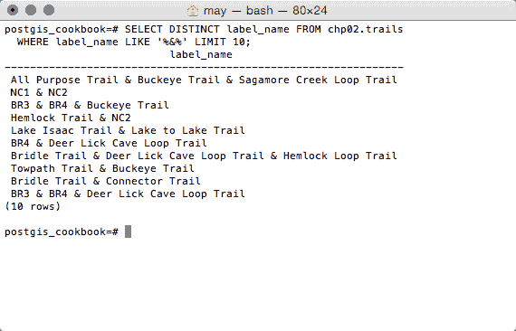

这是我们开始表规范化的地方。

# 如何做到...

我们需要做的第一件事是找到所有没有`&`的字段，并使用这些作为我们可用的独特路径列表。在我们的案例中，我们可以这样做，因为每个路径至少有一个唯一命名的段，并且不与另一个路径名称相关联。这种方法并不适用于所有数据集，所以在应用此方法之前要仔细理解你的数据。

要选择没有`&`的排序字段，我们使用以下查询：

```py
SELECT DISTINCT label_name, res 
  FROM chp02.trails 
  WHERE label_name NOT LIKE '%&%' 
  ORDER BY label_name, res; 
```

它将返回以下输出：

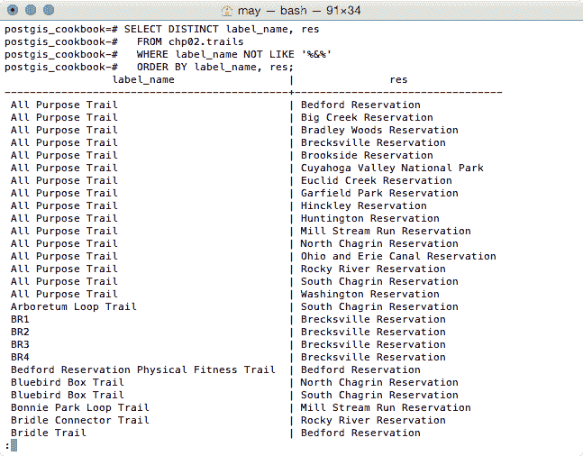

接下来，我们想要搜索所有匹配这些独特路径名称的记录。这将给我们一个记录列表，这些记录将作为关系。进行此搜索的第一步是在我们的独特列表中添加百分号（`%`）以构建一个可以使用`LIKE`查询进行搜索的字符串：

```py
SELECT '%' || label_name || '%' AS label_name, label_name as   label, res FROM 
  (SELECT DISTINCT label_name, res 
    FROM chp02.trails 
    WHERE label_name NOT LIKE '%&%' 
    ORDER BY label_name, res 
  ) AS label; 
```

最后，我们将在`WITH`块中使用这个来执行规范化本身。这将为我们提供第一列中每个段唯一的 ID 表，以及相关的`label`列。为了保险起见，我们将以`CREATE TABLE`过程的形式执行此操作，如下查询所示：

```py
CREATE TABLE chp02.trails_names AS WITH labellike AS 
( 
SELECT '%' || label_name || '%' AS label_name, label_name as   label, res FROM 
  (SELECT DISTINCT label_name, res 
    FROM chp02.trails 
    WHERE label_name NOT LIKE '%&%' 
    ORDER BY label_name, res 
  ) AS label 
) 
SELECT t.gid, ll.label, ll.res 
  FROM chp02.trails AS t, labellike AS ll 
  WHERE t.label_name LIKE ll.label_name 
  AND 
  t.res = ll.res 
  ORDER BY gid;
```

如果我们查看创建的表的第一个行，`trails_names`，我们使用`pgAdmin`得到以下输出：

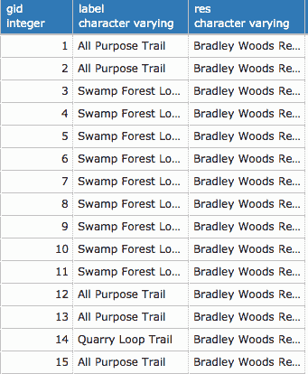

现在我们有了关系表，我们需要一个与`gid`关联的几何表。相比之下，这相当简单，如下查询所示：

```py
CREATE TABLE chp02.trails_geom AS 
  SELECT gid, the_geom 
  FROM chp02.trails; 
```

# 它是如何工作的...

在这个例子中，我们生成了一组可能的唯一记录列表，并与关联记录的搜索一起构建表关系。在一个表中，我们有每个空间记录的几何和唯一 ID；在另一个表中，我们有与每个唯一 ID 关联的名称。现在我们可以明确地利用这些关系。

首先，我们需要建立我们独特的 ID 作为主键，如下所示：

```py
ALTER TABLE chp02.trails_geom ADD PRIMARY KEY (gid); 
```

现在，我们可以使用以下查询在`trails_names`表中将其作为`FOREIGN KEY`的`PRIMARY KEY`：

```py
ALTER TABLE chp02.trails_names ADD FOREIGN KEY (gid) REFERENCES chp02.trails_geom(gid); 
```

这一步并非绝对必要，但它确实强制执行了以下查询等查询的引用完整性：

```py
SELECT geo.gid, geo.the_geom, names.label FROM 
  chp02.trails_geom AS geo, chp02.trails_names AS names 
  WHERE geo.gid = names.gid;
```

输出如下：

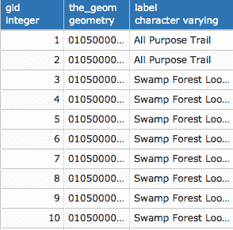

# 还有更多...

如果我们想要规范化多个字段，我们可以为每个字段编写`CREATE TABLE`查询。

值得注意的是，本食谱中提出的方法不仅限于我们有分隔字段的情况。这种方法可以提供一个相对通用的解决方案来规范化平面文件的问题。例如，如果我们有一个多个字段来表示关系信息的案例，例如`label1`、`label2`、`label3`或类似的多属性名称，我们可以编写一个简单的查询将它们连接起来，然后再将信息输入到我们的查询中。

# 规范化内部叠加

来自外部源的数据可能在表结构以及拓扑结构上存在问题，这是地理空间数据本身的固有属性。以具有重叠多边形的数据问题为例。如果我们的数据集中有多边形与内部重叠，那么对面积、周长和其他指标的查询可能不会产生可预测或一致的结果。

有几种方法可以解决具有内部重叠的多边形数据集的问题。这里提出的一般方法最初是由*Refractions Research*的*凯文·纽菲尔德*提出的。

在编写查询的过程中，我们还将提供一个将多边形转换为线字符串的解决方案。

# 准备工作

首先，解压`use_area.zip`文件，然后使用命令行进入它；接着，使用以下命令加载数据集：

```py
shp2pgsql -s 3734 -d -i -I -W LATIN1 -g the_geom cm_usearea_polygon chp02.use_area | psql -U me -d postgis_cookbook
```

# 如何做到这一点...

现在数据已加载到数据库中的表中，我们可以利用 PostGIS 来展平和获取多边形的并集，以便我们有一个规范化的数据集。使用这种方法的第一步将是将*多边形*转换为*线字符串*。然后我们可以连接这些*线字符串*并将它们转换回*多边形*，表示所有*多边形*输入的并集。我们将执行以下任务：

1.  将多边形转换为线字符串

1.  将线字符串转换回多边形

1.  找到结果多边形的中心点

1.  使用结果点来查询表格关系

要将多边形转换为线字符串，我们需要使用`ST_ExteriorRing`提取我们想要的多边形部分，使用`ST_DumpPoints`将这些部分转换为点，然后使用`ST_MakeLine`将这些点连接成线，就像连接点彩图一样。

进一步分解，`ST_ExteriorRing (the_geom)`将仅获取我们多边形的边界。但是`ST_ExteriorRing`返回多边形，因此我们需要将输出转换为线。最简单的方法是使用`ST_DumpPoints`将其转换为点，然后连接这些点。默认情况下，`Dump`函数返回一个名为`geometry_dump`的对象，它不仅仅是简单的几何形状，而是几何形状与整数数组的组合。最简单的方法是利用对象符号来提取`geometry_dump`的几何部分，如下所示：

```py
(ST_DumpPoints(geom)).geom 
```

使用`ST_ExteriorRing`将几何形状重新拼接起来，可以使用以下查询完成：

```py
SELECT (ST_DumpPoints(ST_ExteriorRing(geom))).geom 
```

这应该会给出一个点列表，按照从我们想要使用`ST_MakeLine`构建线的所有点的外部环的顺序排列，如下查询所示：

```py
SELECT ST_MakeLine(geom) FROM ( 
  SELECT (ST_DumpPoints(ST_ExteriorRing(geom))).geom) AS linpoints 
```

由于前面的方法是我们可能在许多其他地方想要使用的过程，因此可能明智地使用以下查询创建一个函数：

```py
CREATE OR REPLACE FUNCTION chp02.polygon_to_line(geometry) 
  RETURNS geometry AS 
$BODY$ 

  SELECT ST_MakeLine(geom) FROM ( 
    SELECT (ST_DumpPoints(ST_ExteriorRing((ST_Dump($1)).geom))).geom 

  ) AS linpoints 
$BODY$ 
  LANGUAGE sql VOLATILE; 
ALTER FUNCTION chp02.polygon_to_line(geometry) 
  OWNER TO me; 
```

现在我们有了`polygon_to_line`函数，我们仍然需要强制连接我们特定情况下的重叠线。`ST_Union`函数将有助于此，如下查询所示：

```py
SELECT ST_Union(the_geom) AS geom FROM ( 
  SELECT chp02.polygon_to_line(geom) AS geom FROM 
    chp02.use_area 
  ) AS unioned; 
```

现在让我们将线字符串转换回多边形，为此我们可以使用`ST_Polygonize`函数来多边形化结果，如下查询所示：

```py
SELECT ST_Polygonize(geom) AS geom FROM ( 
  SELECT ST_Union(the_geom) AS geom FROM ( 
    SELECT chp02.polygon_to_line(geom) AS geom FROM 
    chp02.use_area 
  ) AS unioned 
) as polygonized; 
```

`ST_Polygonize`函数将创建一个单一的多边形，所以如果我们想对它做任何有用的操作，我们需要将其分解成多个单一的多边形几何体。同时，我们还可以在`CREATE TABLE`语句中做以下操作：

```py
CREATE TABLE chp02.use_area_alt AS ( 
  SELECT (ST_Dump(the_geom)).geom AS the_geom FROM ( 
    SELECT ST_Polygonize(the_geom) AS the_geom FROM ( 
      SELECT ST_Union(the_geom) AS the_geom FROM ( 
        SELECT chp02.polygon_to_line(the_geom) AS the_geom
        FROM chp02.use_area 
      ) AS unioned 
    ) as polygonized 
  ) AS exploded 
); 
```

我们将对这个几何体执行空间查询，因此我们应该创建一个索引以确保我们的查询性能良好，如下查询所示：

```py
CREATE INDEX chp02_use_area_alt_the_geom_gist 
  ON chp02.use_area_alt 
  USING gist(the_geom); 
```

为了从原始几何体中找到适当的表信息并将其应用到我们的结果几何体上，我们将执行点在多边形内查询。为此，我们首先需要在结果几何体上计算质心：

```py
CREATE TABLE chp02.use_area_alt_p AS 
  SELECT ST_SetSRID(ST_PointOnSurface(the_geom), 3734) AS  
    the_geom FROM 
    chp02.use_area_alt; 
ALTER TABLE chp02.use_area_alt_p ADD COLUMN gid serial; 
ALTER TABLE chp02.use_area_alt_p ADD PRIMARY KEY (gid); 
```

并且，一如既往地，使用以下查询创建空间索引：

```py
CREATE INDEX chp02_use_area_alt_p_the_geom_gist 
  ON chp02.use_area_alt_p 
  USING gist(the_geom); 
```

然后，质心将根据以下查询在原始表格信息和结果多边形之间建立点在多边形内(`ST_Intersects`)的关系：

```py
CREATE TABLE chp02.use_area_alt_relation AS 
SELECT points.gid, cu.location FROM 
  chp02.use_area_alt_p AS points, 
  chp02.use_area AS cu 
    WHERE ST_Intersects(points.the_geom, cu.the_geom);
```

如果我们查看表的前几行，我们可以看到它将点的标识符与其相应的位置联系起来：

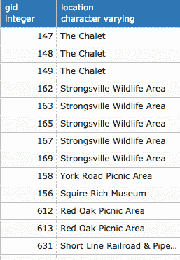

# 它是如何工作的...

我们的基本方法是查看几何体的底层拓扑，并重建一个非重叠的拓扑，然后使用这个新几何体的质心来构建一个查询，以建立与原始数据的关系。

# 还有更多...

在这个阶段，我们可以选择使用外键建立引用完整性框架，如下所示：

```py
ALTER TABLE chp02.use_area_alt_relation ADD FOREIGN KEY (gid) REFERENCES chp02.use_area_alt_p (gid); 
```

# 使用多边形叠加进行比例人口普查估计

PostgreSQL 提供了许多用于表格数据聚合的函数，包括`sum`、`count`、`min`、`max`等。作为框架的 PostGIS 并没有这些函数的空间等价物，但这并不妨碍我们使用 PostgreSQL 的聚合函数与 PostGIS 的空间功能一起构建函数。

在这个菜谱中，我们将探索使用美国人口普查数据的空间汇总。美国人口普查数据本质上就是汇总数据。这是有意为之，以保护公民的隐私。但当涉及到使用这些数据进行分析时，数据的汇总性质可能会成为问题。有一些技巧可以分解数据。其中最简单的一种是使用比例和，我们将在这次练习中这样做。

# 准备工作

当前的问题是，为了向公众提供服务，已经绘制了一条提议的路径。这个例子可以适用于道路建设，甚至可以用于寻找商业地产的地点，以提供服务。

首先，解压`trail_census.zip`文件，然后使用以下命令从解压的文件夹中快速加载数据：

```py
shp2pgsql -s 3734 -d -i -I -W LATIN1 -g the_geom census chp02.trail_census | psql -U me -d postgis_cookbook
shp2pgsql -s 3734 -d -i -I -W LATIN1 -g the_geom trail_alignment_proposed_buffer chp02.trail_buffer | psql -U me -d postgis_cookbook
shp2pgsql -s 3734 -d -i -I -W LATIN1 -g the_geom trail_alignment_proposed chp02.trail_alignment_prop | psql -U me -d postgis_cookbook
```

上述命令将产生以下输出：

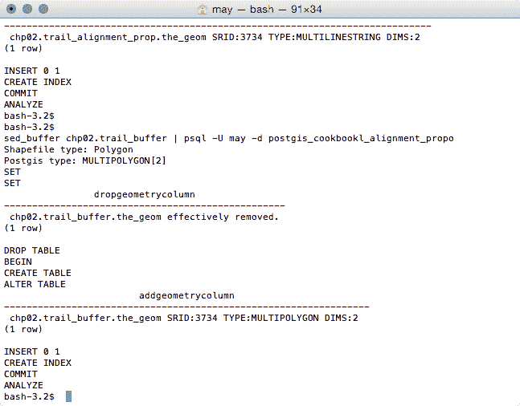

如果我们在我们最喜欢的桌面 GIS 中查看拟议的小径，我们会看到以下内容：

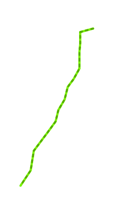

在我们的案例中，我们想要了解距离小径 1 英里范围内的居民数量，假设居住在距离小径 1 英里范围内的居民最有可能使用它，因此最有可能被它服务。

为了找出这个拟议小径附近的人口，我们在人口普查街区组人口密度信息上叠加。下一个截图展示了拟议小径周围的 1 英里缓冲区：

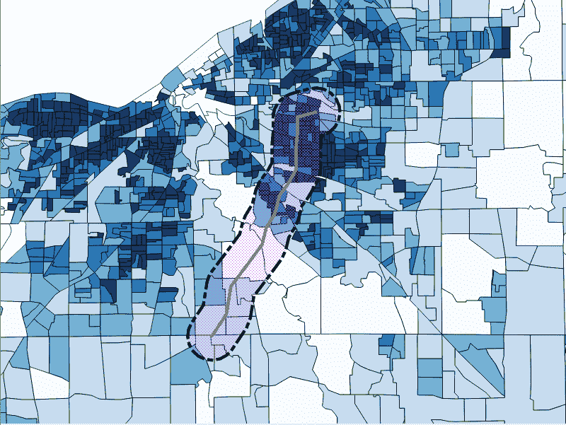

关于这些人口普查数据，我们可能会注意到人口密度和人口普查街区组大小的广泛范围。计算人口的一种方法就是简单地选择所有与我们的区域相交的街区，如下面的截图所示：

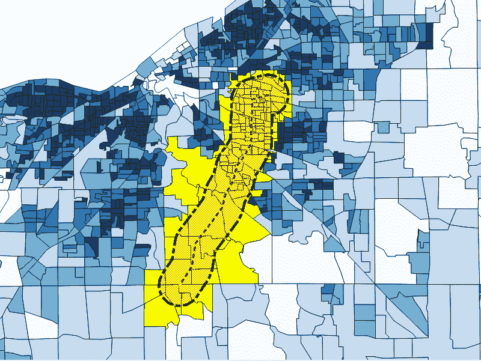

这是一个简单的程序，它给我们提供了一个估计值，即距离小径 1 英里范围内居住的 130 到 288 人，但通过观察选择的形状，我们可以看到，我们在估计中采用了完整的街区，因此高估了人口数量。

同样，如果我们只使用其质心位于我们拟议的小径 1 英里范围内的街区组，我们就会低估人口数量。

相反，我们将做出一些有用的假设。街区组被设计为在街区组人口分布内适度同质。假设这一点适用于我们的数据，我们可以假设对于给定的街区组，如果街区组的 50%位于我们的目标区域内，我们可以将那个街区组的一半人口归入我们的估计。将这一点应用于所有我们的街区组，将它们相加，我们就得到了一个更精确的估计，这比纯交集或质心查询更有可能准确。因此，我们采用比例求和。

# 如何操作...

由于比例求和问题是一个通用问题，它可能适用于许多问题。我们将把底层比例作为函数来编写。函数接受输入并返回一个值。在我们的案例中，我们希望我们的比例函数接受两个几何形状作为输入，即我们缓冲小径的几何形状以及街区组以及我们想要比例的值，我们希望它返回比例后的值：

```py
CREATE OR REPLACE FUNCTION chp02.proportional_sum(geometry,   geometry, numeric) 
  RETURNS numeric AS 
$BODY$ 
-- SQL here 
$BODY$ 
  LANGUAGE sql VOLATILE; 
```

现在，为了我们的计算目的，对于缓冲区域和街区组的任何给定交集，我们想要找到交集占整个街区组的比例。然后这个值应该乘以我们想要缩放的值。

在 SQL 中，函数看起来像以下查询：

```py
SELECT $3 * areacalc FROM 
  (SELECT (ST_Area(ST_Intersection($1, $2)) / ST_Area($2)):: numeric AS areacalc 
  ) AS areac; 
```

上述查询的完整形式如下：

```py
CREATE OR REPLACE FUNCTION chp02.proportional_sum(geometry,   geometry, numeric) 
  RETURNS numeric AS 
$BODY$ 
    SELECT $3 * areacalc FROM 
      (SELECT (ST_Area(ST_Intersection($1,           $2))/ST_Area($2))::numeric AS areacalc 
      ) AS areac 
; 
$BODY$ 
  LANGUAGE sql VOLATILE; 
```

# 它是如何工作的...

由于我们将查询编写为一个函数，查询使用`SELECT`语句遍历所有可用记录，并给出一个按比例的人口。敏锐的读者会注意到，我们还没有进行任何汇总工作；我们只处理了问题的比例部分。我们可以在调用函数时使用 PostgreSQL 的内置聚合函数来进行汇总。这种方法的优点在于，我们不仅需要应用求和，还可以计算其他聚合，如最小值或最大值。在下面的示例中，我们将只应用求和：

```py
SELECT ROUND(SUM(chp02.proportional_sum(a.the_geom, b.the_geom, b.pop))) FROM 
  chp02.trail_buffer AS a, chp02.trail_census as b 
  WHERE ST_Intersects(a.the_geom, b.the_geom) 
  GROUP BY a.gid; 
```

返回的值相当不同（人口为 96,081），这更有可能是准确的。
