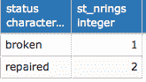
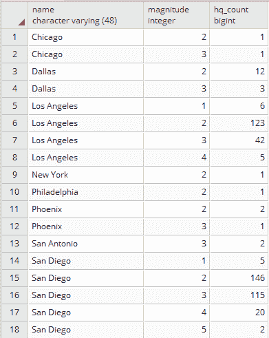

# 处理矢量数据 - 基础

在本章中，我们将介绍以下菜谱：

+   使用 GPS 数据

+   修复无效几何形状

+   使用空间连接进行 GIS 分析

+   简化几何形状

+   测量距离

+   使用公共属性合并多边形

+   计算交集

+   将几何形状裁剪以部署数据

+   使用 PostGIS 拓扑简化几何形状

# 简介

在本章中，你将使用一组 PostGIS 函数和矢量数据集。你首先将了解如何使用 PostGIS 与 GPS 数据交互——你将使用 `ogr2ogr` 导入此类数据集，然后使用 `ST_MakeLine` 函数从点几何形状中组合折线。

然后，你将看到 PostGIS 如何帮助你使用诸如 `ST_MakeValid`、`ST_IsValid`、`ST_IsValidReason` 和 `ST_IsValidDetails` 等函数查找和修复无效的几何形状。

然后，你将了解空间数据库中最强大的元素之一，空间连接。PostGIS 为你提供了一组丰富的运算符，例如 `ST_Intersects`、`ST_Contains`、`ST_Covers`、`ST_Crosses` 和 `ST_DWithin`，用于此目的。

之后，你将使用 `ST_Simplify` 和 `ST_SimplifyPrevergeTopology` 函数简化（泛化）几何形状，当你不需要太多细节时。虽然此函数在线性几何形状上表现良好，但对于多边形可能会引入拓扑异常。在这种情况下，你应该考虑使用外部 GIS 工具，如 `GRASS`。

然后，你将游览 PostGIS 函数以进行距离测量——`ST_Distance`、`ST_DistanceSphere` 和 `ST_DistanceSpheroid` 都在途中。

本章中解释的一个菜谱将指导你通过典型的 GIS 工作流程根据公共属性合并多边形；你将使用 `ST_Union` 函数来完成此目的。

然后，你将学习如何使用 `ST_Intersection` 函数裁剪几何形状，在最后介绍的第 2.0 版本中深入探讨 **PostGIS 拓扑**。

# 使用 GPS 数据

在这个菜谱中，你将使用 GPS 数据。这类数据通常保存在 `.gpx` 文件中。你将从流行的跑步者社交网络 **RunKeeper** 导入一系列 `.gpx` 文件到 PostGIS。

如果你有一个 RunKeeper 账户，你可以导出你的 `.gpx` 文件，并按照本菜谱中的说明进行处理。否则，你可以使用位于代码包中 `chp03` 目录下的 `runkeeper-gpx.zip` 文件中包含的 RunKeeper `.gpx` 文件。

你首先将创建一个 `bash` 脚本，使用 `ogr2ogr` 将 `.gpx` 文件导入到 PostGIS 表中。导入完成后，你将尝试编写一些 SQL 查询，并测试一些非常有用的函数，例如 `ST_MakeLine` 从点几何形状生成折线，`ST_Length` 计算距离，以及 `ST_Intersects` 执行空间连接操作。

# 准备工作

将 `data/chp03/runkeeper-gpx.zip` 文件解压到 `working/chp03/runkeeper_gpx`。如果你还没有通过 第一章，*在 PostGIS 中移动数据进和出*，确保 `countries` 数据集在 PostGIS 数据库中。

# 如何操作...

首先，确保你需要的 `.gpx` 文件格式正确。打开其中一个并检查文件结构——每个文件必须由一个 `<trk>` 元素组成，该元素包含一个 `<trkseg>` 元素，该元素包含多个 `<trkpt>` 元素（从跑步者的 GPS 设备存储的点）。将这些点导入到 PostGIS 的 `Point` 表中：

1.  使用以下命令创建一个名为 `chp03` 的新模式，用于存储本章中所有食谱的数据：

```py
      postgis_cookbook=# create schema chp03;
```

1.  在 PostgreSQL 中通过执行以下命令行创建 `chp03.rk_track_points` 表：

```py
 postgis_cookbook=# CREATE TABLE chp03.rk_track_points 
      ( 
        fid serial NOT NULL, 
        the_geom geometry(Point,4326), 
        ele double precision, 
        "time" timestamp with time zone, 
        CONSTRAINT activities_pk PRIMARY KEY (fid) 
      ); 
```

1.  创建以下脚本，使用 GDAL 的 `ogr2ogr` 命令将 `chp03.rk_track_points` 表中的所有 `.gpx` 文件导入：

以下是在 Linux 上的版本（命名为 `working/chp03/import_gpx.sh`）：

```py
        #!/bin/bash 
        for f in `find runkeeper_gpx -name \*.gpx -printf "%f\n"` 
        do 
          echo "Importing gpx file $f to chp03.rk_track_points 
                PostGIS table..." #, ${f%.*}" 
          ogr2ogr -append -update  -f PostgreSQL
          PG:"dbname='postgis_cookbook' user='me'
          password='mypassword'" runkeeper_gpx/$f 
          -nln chp03.rk_track_points 
          -sql "SELECT ele, time FROM track_points" 
        done 
```

以下是在 macOS 上的命令（命名为 `working/chp03/import_gpx.sh`）：

```py
        #!/bin/bash 
        for f in `find runkeeper_gpx -name \*.gpx ` 
        do 
          echo "Importing gpx file $f to chp03.rk_track_points 
                PostGIS table..." #, ${f%.*}" 
          ogr2ogr -append -update  -f PostgreSQL
          PG:"dbname='postgis_cookbook' user='me'
          password='mypassword'" $f 
          -nln chp03.rk_track_points 
          -sql "SELECT ele, time FROM track_points" 
        done 
```

以下是在 Windows 上的版本（命名为 `working/chp03/import_gpx.bat`）：

```py
        @echo off 
        for %%I in (runkeeper_gpx\*.gpx*) do ( 
          echo Importing gpx file %%~nxI to chp03.rk_track_points 
               PostGIS table... 
          ogr2ogr -append -update -f PostgreSQL
          PG:"dbname='postgis_cookbook' user='me'
          password='mypassword'" runkeeper_gpx/%%~nxI 
          -nln chp03.rk_track_points 
          -sql "SELECT ele, time FROM track_points" 
        ) 
```

1.  在 Linux 和 macOS 中，在运行之前别忘了为脚本分配执行权限。然后，运行以下脚本：

```py
      $ chmod 775 import_gpx.sh
      $ ./import_gpx.sh
      Importing gpx file 2012-02-26-0930.gpx to chp03.rk_track_points 
        PostGIS table...
      Importing gpx file 2012-02-29-1235.gpx to chp03.rk_track_points 
        PostGIS table...
      ...
      Importing gpx file 2011-04-15-1906.gpx to chp03.rk_track_points 
        PostGIS table...

```

在 Windows 中，只需双击 `.bat` 文件或从命令提示符使用以下命令运行它：

```py
      > import_gpx.bat
```

1.  现在，使用 `ST_MakeLine` 函数创建一个包含单个跑步者轨迹详情的多线表。假设跑步者在每个不同的日子只进行了一次训练。在这个表中，你应该包括轨迹详情的开始和结束时间，如下所示：

```py
 postgis_cookbook=# SELECT 
      ST_MakeLine(the_geom) AS the_geom, 
      run_date::date, 
      MIN(run_time) as start_time, 
      MAX(run_time) as end_time 
      INTO chp03.tracks 
      FROM ( 
        SELECT the_geom, 
        "time"::date as run_date, 
        "time" as run_time 
        FROM chp03.rk_track_points 
        ORDER BY run_time 
      ) AS foo GROUP BY run_date; 
```

1.  在查询创建的表之前，别忘了为两个表都添加空间索引以提高其性能，如下所示：

```py
 postgis_cookbook=# CREATE INDEX rk_track_points_geom_idx 
      ON chp03.rk_track_points USING gist(the_geom); 
      postgis_cookbook=# CREATE INDEX tracks_geom_idx 
      ON chp03.tracks USING gist(the_geom);
```

1.  如果你在任何给定的一天尝试在一个桌面 GIS 上打开这两个空间表，你应该会看到 `rk_track_points` 表中的点在 `tracks` 表中组成一个单独的多线几何记录，如下面的截图所示：

1.  如果你在一个桌面 GIS（如 QGIS）中打开所有轨迹，你会看到以下内容：


1.  现在，查询 `tracks` 表以获取跑步者每月跑步的总距离报告（单位：公里）。为此，使用 `ST_Length` 函数，如下所示：

```py
 postgis_cookbook=# SELECT 
        EXTRACT(year FROM run_date) AS run_year, 
        EXTRACT(MONTH FROM run_date) as run_month, 
        SUM(ST_Length(geography(the_geom)))/1000 AS distance 
        FROM chp03.tracks 
        GROUP BY run_year, run_month ORDER BY run_year, run_month; 
```


```py
 (28 rows) 
```

1.  通过在 `tracks` 和 `countries` 表之间进行空间连接，并再次使用 `ST_Length` 函数，如下所示，你可以得到跑步者按国家计算的跑步距离报告（单位：公里）：

```py
 postgis_cookbook=# SELECT 
        c.country_name, 
        SUM(ST_Length(geography(t.the_geom)))/1000 AS run_distance 
      FROM chp03.tracks AS t 
      JOIN chp01.countries AS c 
      ON ST_Intersects(t.the_geom, c.the_geom)
 GROUP BY c.country_name 
      ORDER BY run_distance DESC; 
```


```py
 (4 rows) 
```

# 它是如何工作的...

`.gpx` 文件存储所有点的详情在 WGS 84 空间参考系中；因此，我们创建了具有 SRID（4326）的 `rk_track_points` 表。

在创建 `rk_track_points` 表之后，我们使用 bash 脚本导入了 `runkeeper_gpx` 目录中的所有 `.gpx` 文件。该 bash 脚本迭代 `runkeeper_gpx` 目录中所有扩展名为 `*.gpx` 的文件。对于这些文件中的每一个，脚本运行 `ogr2ogr` 命令，使用 GPX GDAL 驱动程序将 `.gpx` 文件导入到 PostGIS 中（更多详情，请参阅 [`www.gdal.org/drv_gpx.html`](http://www.gdal.org/drv_gpx.html))。

在 GDAL 的抽象中，一个 `.gpx` 文件是一个由几个层组成的 OGR 数据源，如下所示：


在 `.gpx` 文件（OGR 数据源）中，你只有 `tracks` 和 `track_points` 层。作为一个快捷方式，你可以使用 `ogr2ogr` 只导入 `tracks` 层，但你需要从 `track_points` 层开始，以便使用一些 PostGIS 函数生成 `tracks` 层本身。这就是为什么在 bash 脚本中的 `ogr2ogr` 部分中，我们将来自 `track_points` 层的点几何形状以及一些有用的属性（如 `elevation` 和 `timestamp`）导入到 `rk_track_points` PostGIS 表中。

一旦导入记录，我们使用子查询向名为 `tracks` 的新多段线表中输入数据，并从 `rk_track_points` 表中选择了所有点几何形状及其日期和时间，按日期分组，并使用 `ST_MakeLine` 函数对几何形状进行聚合。此函数能够从点几何形状创建线字符串（更多详情，请参阅 [`www.postgis.org/docs/ST_MakeLine.html`](http://www.postgis.org/docs/ST_MakeLine.html))。

你不应该忘记在子查询中按 `datetime` 对点进行排序；否则，你将获得一个不规则的线字符串，从一个点到另一个点跳跃，并且不遵循正确的顺序。

在加载 `tracks` 表之后，我们测试了两个空间查询。

首先，你得到了跑步者每月跑步总距离的报告。为此目的，你选择了按日期（年和月）分组的所有轨迹记录，通过将单条轨迹的长度（使用 `ST_Length` 函数获得）相加来获得总距离。要从 `run_date` 函数中获取年和月，你使用了 PostgreSQL 的 `EXTRACT` 函数。请注意，如果你使用 WGS 84 系统中的几何形状来测量距离，你将获得以度为单位的结果。因此，你必须将几何形状投影到一个为特定区域设计的平面度量系统中，该区域的数据将被投影。

对于大规模区域，例如在我们的案例中，我们有一些跨越整个欧洲的点，如最后查询结果所示，一个好的选择是使用 PostGIS 1.5 中引入的 `geography` 数据类型。计算可能会慢一些，但比其他系统更准确。这就是为什么在测量之前将几何形状转换为 `geography` 数据类型的原因。

最后一个空间查询使用了 `ST_Intersects` 函数进行空间连接，以获取跑步者每条跑步轨迹所在国家的名称（假设跑步者没有跑过跨国轨迹）。获取每个国家跑步的总距离只需对 `country_name` 字段的选择进行聚合，并使用 PostgreSQL 的 `SUM` 操作符对轨迹距离进行聚合。

# 修复无效几何形状

您通常会在您的 PostGIS 数据库中找到无效的几何形状。这些无效的几何形状可能会损害 PostGIS 本身以及任何使用它的外部工具（如 QGIS 和 MapServer）的功能。作为符合 OGC 简单特征规范的系统，PostGIS 必须管理和处理有效的几何形状。

幸运的是，PostGIS 2.0 为您提供了 `ST_MakeValid` 函数，该函数与 `ST_IsValid`、`ST_IsValidReason` 和 `ST_IsValidDetails` 函数一起，是检查和修复数据库中几何形状的理想工具包。在本教程中，您将学习如何修复无效几何形状的常见情况。

# 准备工作

将 `data/TM_WORLD_BORDERS-0.3.zip` 文件解压到您的当前工作目录 `working/chp3` 中，然后使用 `shp2pgsql` 命令将 shapefile 导入到 PostGIS 中，如下所示：

```py
$ shp2pgsql -s 4326 -g the_geom -W LATIN1 -I TM_WORLD_BORDERS-0.3.shp chp03.countries > countries.sql
$ psql -U me -d postgis_cookbook -f countries.sql
```

该文件还包含 `wborders` 名称，因为对于某些操作系统，它不能与 `TM_WORLD_BORDERS-0.3.shp` 中的字符一起使用。

# 如何操作...

完成此教程所需执行的步骤如下：

1.  首先，调查导入的表中是否有任何几何形状无效。正如您在以下查询中可以看到的，使用 `ST_IsValid` 和 `ST_IsValidReason` 函数，我们找到了四个无效的几何形状，它们都是由于相同的理由——环自相交：

```py
 postgis_cookbook=# SELECT gid, name, ST_IsValidReason(the_geom) 
        FROM chp03.countries 
        WHERE ST_IsValid(the_geom)=false;
```


```py
 (4 rows) 
```

1.  现在，只关注一个无效的几何形状，例如，在表示俄罗斯的 multipolygon 几何形状中。创建一个只包含产生无效性的环的表，使用上一步 `ST_IsValidReason` 响应中给出的点坐标选择该表：

```py
 postgis_cookbook=# SELECT * INTO chp03.invalid_geometries FROM ( 
        SELECT 'broken'::varchar(10) as status,
 ST_GeometryN(the_geom, generate_series(
          1, ST_NRings(the_geom)))::geometry(Polygon,4326)
        as the_geom FROM chp03.countries 
        WHERE name = 'Russia') AS foo 
        WHERE ST_Intersects(the_geom, 
          ST_SetSRID(ST_Point(143.661926,49.31221), 4326)); 
```

`ST_MakeValid` 函数需要 GEOS 3.3.0 或更高版本；您可以使用以下 `PostGIS_full_version` 函数来检查您的系统是否支持它：


1.  现在，使用 `ST_MakeValid` 函数，在之前创建的表中添加一个包含相同几何形状有效版本的记录：

```py
 postgis_cookbook=# INSERT INTO chp03.invalid_geometries 
      VALUES ('repaired', (SELECT ST_MakeValid(the_geom) 
      FROM chp03.invalid_geometries)); 
```

1.  在您的桌面 GIS 中打开此几何形状；无效的几何形状只有一个自相交的环，在内部产生一个洞。虽然这在 ESRI shapefile 格式规范中是可接受的（这是您最初导入的数据集），但 OGC 标准不允许自相交的环，因此 PostGIS 也不允许：


1.  现在，在`invalid_geometries`表中，你有多边形的无效和有效版本。很容易看出，自相交的环是通过`ST_MakeValid`移除的，它向原始多边形添加了一个补充环，从而根据 OGC 标准生成了一个有效的几何形状： 

```py
 postgis_cookbook=# SELECT status, ST_NRings(the_geom) 
      FROM chp03.invalid_geometries; 
```



```py
 (2 rows)
```

1.  现在你已经确定了问题和解决方案，不要忘记通过执行以下代码修复`countries`表中的所有其他无效几何形状：

```py
 postgis_cookbook=# UPDATE chp03.countries 
      SET the_geom = ST_MakeValid(the_geom) 
      WHERE ST_IsValid(the_geom) = false; 
```

一种聪明的做法是在数据库中完全不保留无效几何形状，即在表上添加一个`CHECK`约束来检查有效性。这将增加更新或插入新几何形状时的计算时间，但会保持你的数据集有效。例如，在`countries`表中，可以按以下方式实现：

`ALTER TABLE chp03.countries`

`ADD CONSTRAINT geometry_valid_check`

`CHECK (ST_IsValid(the_geom));`

在实际应用中，很多时候你需要移除这样的约束，以便能够从不同的来源导入记录。在用`ST_MakeValid`函数进行验证后，你可以安全地再次添加该约束。

# 它是如何工作的...

有许多原因可能导致数据库中出现无效几何形状；例如，由多边形组成的环必须是闭合的，不能自相交或与另一个环共享超过一个点。

在使用`ST_IsValid`和`ST_IsValidReason`函数导入`country`形状文件后，你会发现有四个导入的几何形状是无效的，所有这些都是因为它们的多边形有自相交的环。

在这一点上，一个很好的方法是通过对多边形进行分解，检查其组成部分的环，来调查无效的多边形几何形状。为此，我们使用`ST_GeometryN`函数导出了导致无效性的环的几何形状，该函数能够从多边形中提取第*n*个环。我们将此函数与有用的 PostgreSQL `generate_series`函数相结合，迭代组成几何形状的所有环，并使用`ST_Intersects`函数选择所需的环。

如预期的那样，这个环产生无效性的原因是它是自相交的，并在多边形中产生了一个洞。虽然这符合形状文件规范，但它不符合 OGC 规范。

通过运行 `ST_MakeValid` 函数，PostGIS 已经能够使几何有效，生成第二个环。请注意，`ST_MakeValid` 函数仅在最新版本的 PostGIS（编译了最新 GEOS（3.3.0+））中可用。如果这不是你的工作环境设置，并且你无法升级（升级始终是推荐的！），你可以遵循过去使用的技术，并在保罗·拉姆齐（*Paul Ramsey*）在 [`blog.opengeo.org/2010/09/08/tips-for-the-postgis-power-user/`](http://blog.opengeo.org/2010/09/08/tips-for-the-postgis-power-user/) 上讨论的非常受欢迎、优秀的演示中找到这些技术。

# 使用空间连接进行 GIS 分析

对于常规 SQL 表的连接具有关系数据库的实际功能，而空间连接是像 PostGIS 这样的空间数据库引擎中最令人印象深刻的特性之一。

基本上，可以根据输入图层中每个特征的几何关系来关联不同图层的信息。在本教程中，我们将探讨一些空间连接的常见用例。

# 准备工作

1.  首先，将一些数据导入到 PostGIS 中作为测试平台。从美国地质调查局网站 [`earthquake.usgs.gov/earthquakes/eqarchives/epic/kml/2012_Earthquakes_ALL.kmz`](http://earthquake.usgs.gov/earthquakes/eqarchives/epic/kml/2012_Earthquakes_ALL.kmz) 下载包含 2012 年全球地震信息的 `.kmz` 文件。将其保存在 `working/chp03` 目录中（或者，你也可以使用本书附带代码包中包含的该文件副本）。

1.  `.kmz` 文件是由 ZIP 压缩器打包的 `.kml` 文件集合。因此，在解压文件后（你可能需要将 `.kmz` 文件扩展名更改为 `.zip`），你可能会注意到它仅由一个 `.kml` 文件组成。这个文件在 GDAL 抽象中，构成了一个由九个不同图层组成的 OGR KML 数据源，包含 3D 点几何形状。每个图层包含不同地震震级的地震数据：

```py
      $ ogrinfo 2012_Earthquakes_ALL.kml
```

此操作的输出如下：


1.  通过使用 `ogr2ogr` 命令执行以下脚本之一，同时将所有这些图层导入名为 `chp03.earthquakes` 的 PostGIS 表中。

以下为 Linux 版本（命名为 `import_eq.sh`）：

```py
        #!/bin/bash 
        for ((i = 1; i < 9 ; i++)) ; do 
          echo "Importing earthquakes with magnitude $i 
                to chp03.earthquakes PostGIS table..." 
          ogr2ogr -append -f PostgreSQL -nln chp03.earthquakes 
          PG:"dbname='postgis_cookbook' user='me' 
          password='mypassword'" 2012_Earthquakes_ALL.kml 
          -sql "SELECT name, description, CAST($i AS integer) 
          AS magnitude FROM \"Magnitude $i\"" 
        done 
```

以下为 Windows 版本（命名为 `import_eq.bat`）：

```py
        @echo off 
        for /l %%i in (1, 1, 9) do ( 
          echo "Importing earthquakes with magnitude %%i 
                to chp03.earthquakes PostGIS table..." 
          ogr2ogr -append -f PostgreSQL -nln chp03.earthquakes 
          PG:"dbname='postgis_cookbook' user='me' 
          password='mypassword'" 2012_Earthquakes_ALL.kml 
          -sql "SELECT name, description, CAST(%%i AS integer) 
          AS magnitude FROM \"Magnitude %%i\"" 
        )
```

1.  执行以下脚本（对于 Linux，你需要给它添加 `execute` 权限）：

```py
      $ chmod 775 import_eq.sh
      $ ./import_eq.sh
      Importing earthquakes with magnitude 1 to chp03.earthquakes 
        PostGIS table...
      Importing earthquakes with magnitude 2 to chp03.earthquakes 
        PostGIS table...
      ...
```

1.  为了与本书的约定保持一致，将几何列 `wkb_geometry`（`ogr2ogr` 中的默认几何输出名称）重命名为 `the_geom`，如下命令所示：

```py
 postgis_cookbook=# ALTER TABLE chp03.earthquakes 
      RENAME wkb_geometry  TO the_geom; 
```

1.  从[`nationalmap.gov/`](https://nationalmap.gov/)网站下载美国的`cities`形状文件，地址为[`dds.cr.usgs.gov/pub/data/nationalatlas/citiesx020_nt00007.tar.gz`](http://dds.cr.usgs.gov/pub/data/nationalatlas/citiesx020_nt00007.tar.gz)（此存档也包含在此书提供的代码包中），并在 PostGIS 中通过执行以下代码导入：

```py
      $ ogr2ogr -f PostgreSQL -s_srs EPSG:4269 -t_srs EPSG:4326 
      -lco GEOMETRY_NAME=the_geom -nln chp03.cities
      PG:"dbname='postgis_cookbook' user='me'
      password='mypassword'" citiesx020.shp
```

1.  从[`nationalmap.gov/`](https://nationalmap.gov/)网站下载美国的`states`形状文件，地址为[`dds.cr.usgs.gov/pub/data/nationalatlas/statesp020_nt00032.tar.gz`](http://dds.cr.usgs.gov/pub/data/nationalatlas/statesp020_nt00032.tar.gz)（此存档也包含在此书提供的代码包中），并在 PostGIS 中通过执行以下代码导入：

```py
      $ ogr2ogr -f PostgreSQL -s_srs EPSG:4269 -t_srs EPSG:4326 
      -lco GEOMETRY_NAME=the_geom -nln chp03.states -nlt MULTIPOLYGON 
      PG:"dbname='postgis_cookbook' user='me'
      password='mypassword'" statesp020.shp
```

# 如何做到这一点...

在这个菜谱中，您将亲自看到通过使用空间连接解决一系列典型问题来发挥空间 SQL 的力量：

1.  首先，查询 PostGIS 以获取 2012 年按州划分的注册地震数量：

```py
 postgis_cookbook=# SELECT s.state, COUNT(*) AS hq_count 
      FROM chp03.states AS s 
        JOIN chp03.earthquakes AS e 
        ON ST_Intersects(s.the_geom, e.the_geom) 
        GROUP BY s.state 
        ORDER BY hq_count DESC; 
```


```py
 (33 rows)
```

1.  现在，为了使问题稍微复杂一些，查询 PostGIS 以获取距离美国拥有超过 100 万居民的城镇不超过 200 公里的地震数量，按震级分组；执行以下代码：

```py
 postgis_cookbook=# SELECT c.name, e.magnitude, count(*) as hq_count 
      FROM chp03.cities AS c 
        JOIN chp03.earthquakes AS e 
        ON ST_DWithin(geography(c.the_geom), geography(e.the_geom), 200000) 
        WHERE c.pop_2000 > 1000000 
        GROUP BY c.name, e.magnitude 
        ORDER BY c.name, e.magnitude, hq_count; 
```



```py
 (18 rows)
```

1.  作为之前查询的一个变体，执行以下代码将给出地震的完整列表以及它们与城市的距离（以米为单位）：

```py
 postgis_cookbook=# SELECT c.name, e.magnitude,
 ST_Distance(geography(c.the_geom), geography(e.the_geom)) 
      AS distance FROM chp03.cities AS c 
        JOIN chp03.earthquakes AS e 
        ON ST_DWithin(geography(c.the_geom), geography(e.the_geom), 200000) 
        WHERE c.pop_2000 > 1000000 
        ORDER BY distance; 
```


```py
 (488 rows) 
```

1.  现在，通过执行以下代码请求 PostGIS 获取每个州的城镇数量和总人口：

```py
 postgis_cookbook-# SELECT s.state, COUNT(*) 
      AS city_count, SUM(pop_2000) AS pop_2000 
      FROM chp03.states AS s 
        JOIN chp03.cities AS c 
        ON ST_Intersects(s.the_geom, c.the_geom) 
        WHERE c.pop_2000 > 0 -- NULL values is -9999 on this field!
 GROUP BY s.state 
        ORDER BY pop_2000 DESC; 
```


```py
 (51 rows) 
```

1.  作为最后的测试，使用空间连接更新现有表。您需要将`state_fips`字段中的信息添加到`earthquake`表中的`states`表。首先，为了存储此类信息，您需要创建一个列，如下命令所示：

```py
 postgis_cookbook-# ALTER TABLE chp03.earthquakes 
      ADD COLUMN state_fips character varying(2); 
```

1.  然后，您可以使用空间连接更新新列，如下所示：

```py
 postgis_cookbook-# UPDATE chp03.earthquakes AS e 
        SET state_fips = s.state_fips 
        FROM chp03.states AS s 
        WHERE ST_Intersects(s.the_geom, e.the_geom); 
```

# 它是如何工作的...

空间连接是释放 PostGIS 空间功能的关键特性之一。对于常规连接，可以通过公共字段将两个不同表中的实体相关联。对于空间连接，可以使用任何空间关系函数（如`ST_Contains`、`ST_Covers`、`ST_Crosses`和`ST_DWithin`）将两个不同的空间表中的要素相关联。

在第一个查询中，我们使用了`ST_Intersects`函数将地震点与其相应的州连接起来。我们通过`state`列对查询进行分组，以获得州内的地震数量。

在第二个查询中，我们使用了`ST_DWithin`函数将每个城市与其 200 公里范围内的地震点相关联。我们过滤掉了人口少于 100 万的城市，并按城市名称和地震震级分组，以获取每个城市和震级的地震数量报告。

第三个查询与第二个查询类似，但不是按城市和震级分组。距离是通过`ST_Distance`函数计算的。请注意，由于特征坐标存储在 WGS 84 中，您需要将几何列转换为椭球体，并使用椭球体来获取以米为单位的距离。或者，您可以使用`ST_Transform`函数将几何形状投影到一个平面坐标系中，该坐标系适用于我们在此菜谱中研究的区域（在这种情况下，*ESPG:2163*，*US National Atlas Equal Area*将是一个不错的选择）。然而，在处理像我们在此菜谱中处理的大面积区域时，将几何体转换为地理类型通常是最佳选择，因为它提供了更准确的结果。

第四个查询使用了`ST_Intersects`函数。在这种情况下，我们按`state`列分组，并使用两个聚合 SQL 函数（`SUM`和`COUNT`）来获取所需的结果。

最后，在最后一个查询中，您使用空间连接的结果更新一个空间表。这个概念与上一个查询类似，但它是`UPDATE` SQL 命令的上下文。

# 简化几何形状

在许多情况下，您将需要生成一个更详细和更轻量级的矢量数据集版本，因为您可能不需要非常详细的特征，可能有几个原因。考虑一下您将要发布数据集到网站，并且性能是一个关注点的情况，或者也许您需要将数据集部署给一个不需要太多细节的同事，因为他们正在使用它来创建大面积地图。在这些所有情况下，GIS 工具都包括从给定数据集中减少不必要细节的实现**简化算法**。基本上，这些算法通过一定容差减少包含在其中的顶点数，该容差以距离单位表示。

为了这个目的，PostGIS 为您提供了`ST_Simplify`和`ST_SimplifyPreserveTopology`函数。在许多情况下，它们是简化任务的正确解决方案，但在某些情况下，特别是对于多边形特征，它们可能不是最佳选择，您可能需要使用不同的 GIS 工具，如`GRASS`或新的 PostGIS 拓扑支持。

# 如何操作...

完成此菜谱所需采取的步骤如下：

1.  使用以下代码设置 PostgreSQL `search_path`变量，以便所有您新创建的数据库对象都将存储在`chp03`模式中：

```py
 postgis_cookbook=# SET search_path TO chp03,public; 
```

1.  假设您需要一个更详细版本的`states`层用于您的映射网站或部署给客户端；您可以考虑使用以下`ST_SimplifyPreserveTopology`函数：

```py
 postgis_cookbook=# CREATE TABLE states_simplify_topology AS 
        SELECT ST_SimplifyPreserveTopology(ST_Transform(
 the_geom, 2163), 500) FROM states;
```

1.  之前的命令运行迅速，使用的是 **Douglas-Peucker** 算法的变体，并有效地减少了顶点数量。但有时，生成的多边形不再相邻。如果你放大查看任何多边形边界，你应该会注意到以下截图所示的内容：两个多边形共享边界的共有部分存在孔洞和重叠。这是因为 PostGIS 使用的是 OGC 简单特征模型，该模型不实现拓扑，所以该函数只是移除了冗余顶点，而没有考虑相邻的多边形：


1.  看起来 `ST_SimplifyPreserveTopology` 函数在处理线性特征时运行良好，但在处理多边形时会产生拓扑异常。如果你想要进行拓扑简化，另一种方法是以下由 *Paul Ramsey* 提出的代码（[`gis.stackexchange.com/questions/178/simplifying-adjacent-polygons`](http://gis.stackexchange.com/questions/178/simplifying-adjacent-polygons)）以及在 *Webspaces* 博客文章中改进的代码（[`webspaces.net.nz/page.php?view=polygon-dissolve-and-generalise`](http://webspaces.net.nz/page.php?view=polygon-dissolve-and-generalise)）：

```py
 SET search_path TO chp03, public; 
      -- first project the spatial table to a planar system 
        (recommended for simplification operations) 
      CREATE TABLE states_2163 AS SELECT ST_Transform
        (the_geom, 2163)::geometry(MultiPolygon, 2163) 
        AS the_geom, state FROM states; 
      -- now decompose the geometries from multipolygons to polygons (2895) 
        using the ST_Dump function 
      CREATE TABLE polygons AS SELECT (ST_Dump(the_geom)).geom AS the_geom 
        FROM states_2163; 
      -- now decompose from polygons (2895) to rings (3150) 
        using the ST_DumpRings function 
      CREATE TABLE rings AS SELECT (ST_DumpRings(the_geom)).geom 
        AS the_geom FROM polygons; 
      -- now decompose from rings (3150) to linestrings (3150) 
        using the ST_Boundary function 
      CREATE TABLE ringlines AS SELECT(ST_boundary(the_geom)) 
        AS the_geom FROM rings; 
      -- now merge all linestrings (3150) in a single merged linestring 
        (this way duplicate linestrings at polygon borders disappear) 
      CREATE TABLE mergedringlines AS SELECT ST_Union(the_geom) 
        AS the_geom FROM ringlines; 
      -- finally simplify the linestring with a tolerance of 150 meters 
      CREATE TABLE simplified_ringlines AS SELECT 
      ST_SimplifyPreserveTopology(the_geom, 150) 
      AS the_geom FROM mergedringlines; 
      -- now compose a polygons collection from the linestring 
      using the ST_Polygonize function 
      CREATE TABLE simplified_polycollection AS SELECT 
        ST_Polygonize(the_geom) AS the_geom FROM simplified_ringlines; 
      -- here you generate polygons (2895) from the polygons collection 
        using ST_Dumps 
      CREATE TABLE simplified_polygons AS SELECT 
        ST_Transform((ST_Dump(the_geom)).geom, 
        4326)::geometry(Polygon,4326) 
        AS the_geom FROM simplified_polycollection; 
      -- time to create an index, to make next operations faster 
        CREATE INDEX simplified_polygons_gist ON simplified_polygons 
        USING GIST (the_geom); 
      -- now copy the state name attribute from old layer with a spatial 
        join using the ST_Intersects and ST_PointOnSurface function 
      CREATE TABLE simplified_polygonsattr AS SELECT new.the_geom, 
        old.state FROM simplified_polygons new, states old 
        WHERE ST_Intersects(new.the_geom, old.the_geom) 
        AND ST_Intersects(ST_PointOnSurface(new.the_geom), old.the_geom); 
      -- now make the union of all polygons with a common name 
      CREATE TABLE states_simplified AS SELECT ST_Union(the_geom) 
        AS the_geom, state FROM simplified_polygonsattr GROUP BY state;
```

1.  这种方法看起来运行顺畅，但如果尝试将简化容差从 150 米增加到，比如说，500 米，你将再次遇到拓扑异常（你可以亲自测试一下）。更好的方法是使用 PostGIS 拓扑（你将在 *使用 PostGIS 拓扑简化几何形状* 章节中这样做）或能够像 `GRASS` 一样管理拓扑操作的第三方 GIS 工具。对于这个配方，你将使用 `GRASS` 方法。

    1.  如果你还没有安装 `GRASS`，请在你的系统上安装它。然后，创建一个目录来包含 `GRASS` 数据库（在 `GRASS` 术语中，称为 `GISDBASE`），如下所示：

    ```py
          $ mkdir grass_db
    ```

    1.  现在，通过在 Linux 命令提示符中输入 `grass` 或者在 Windows 中双击 GRASS GUI 图标（开始 | 所有程序 | OSGeo4W | GRASS GIS 6.4.3 | GRASS 6.4.3 GUI）或在 macOS 中的应用程序中，来启动 `GRASS`。你将被提示选择 `grass_db` 数据库作为 GIS 数据目录，但应该选择你在上一步中创建的目录。

        1.  使用“位置向导”按钮，创建一个名为 `postgis_cookbook` 的位置，标题为“PostGIS 烹饪书”（`GRASS` 使用名为位置的子目录，其中所有数据都保存在相同的坐标系、地图投影和地理边界中）。

        1.  在创建新位置时，选择 EPSG 2163 作为空间参考系统（你需要在“选择创建新位置的方法”下选择“选择空间参考系统的 EPSG 代码”选项）。

        1.  现在通过点击“启动 GRASS”按钮来启动 `GRASS`。程序的控制台将如以下截图所示启动：

        1.  将`states` PostGIS 空间表导入`GRASS`位置。为此，使用`v.in.ogr GRASS`命令，它将使用 OGR PostgreSQL 驱动程序（实际上，PostGIS 连接字符串语法是相同的）：

        ```py
              GRASS 6.4.1 (postgis_cookbook):~ > v.in.ogr 
              input=PG:"dbname='postgis_cookbook' user='me' 
              password='mypassword'" layer=chp03.states_2163 out=states
        ```

        1.  `GRASS`将导入 OGR PostGIS 表，并同时为该层构建拓扑，该层由点、线、区域等组成。可以使用`v.info`命令结合`-c`选项来检查属性表并获取有关导入层的更多信息，如下所示：

        ```py
              GRASS 6.4.1 (postgis_cookbook):~ > v.info states
        ```

        

        1.  现在，你可以使用具有 500 米容差（阈值）的`v.generalizeGRASS`命令简化多边形几何形状。如果你使用与本配方相同的数据集，你将最终从原始的 346,914 个顶点中获得 47,191 个顶点，组成 1,919 个多边形（区域），这些多边形来自原始的 2,895 个多边形：

        ```py
              GRASS 6.4.1 (postgis_cookbook):~ > v.generalize input=states 
              output=states_generalized_from_grass method=douglas threshold=500
        ```

        1.  使用`v.out.ogr`命令（`v.in.ogr`的对应命令）将结果导回 PostGIS，如下所示：

        ```py
              GRASS 6.4.1 (postgis_cookbook):~ > v.out.ogr 
              input=states_generalized_from_grass 
              type=area dsn=PG:"dbname='postgis_cookbook' user='me' 
              password='mypassword'" olayer=chp03.states_simplified_from_grass 
              format=PostgreSQL
        ```

        1.  现在，打开桌面 GIS，检查`ST_SimplifyPreserveTopology` PostGIS 函数和`GRASS`执行的几何形状简化之间的差异。在共享多边形边界处不应有孔洞或重叠。在下面的屏幕截图中，原始层边界用红色表示，由`ST_SimplifyPreserveTopology`构建的边界用蓝色表示，由`GRASS`构建的边界用绿色表示:

        # 它是如何工作的...

        `ST_Simplify` PostGIS 函数能够使用 Douglas-Peucker 算法（更多详情请参阅[`en.wikipedia.org/wiki/Ramer%E2%80%93Douglas%E2%80%93Peucker_algorithm`](http://en.wikipedia.org/wiki/Ramer%E2%80%93Douglas%E2%80%93Peucker_algorithm)）简化并泛化（简单或多）线性或多边形几何形状。由于在某些情况下它可能创建无效的几何形状，因此建议使用其进化版本——`ST_SimplifyPreserveTopology`函数，这将仅产生有效的几何形状。

        虽然这些函数与（多）线性几何形状配合得很好，但在（多）多边形的情况下，它们很可能会在共享多边形边界处创建拓扑异常，如重叠和孔洞。

        要在编写时获得有效的、拓扑简化的数据集，有以下两种选择：

        +   在外部 GIS 工具（如`GRASS`）上执行简化过程

        +   使用新的 PostGIS 拓扑支持

        虽然你将在“使用 PostGIS 拓扑简化几何形状”的配方中看到新的 PostGIS 拓扑特征，但在本配方中，你已经使用`GRASS`来执行简化过程。

        我们打开了`GRASS`，创建了一个 GIS 数据目录和一个项目位置，然后使用`v.ogr.in`命令将多边形 PostGIS 表导入`GRASS`位置，正如其名称所暗示的那样，基于 GDAL/OGR。

        到目前为止，你一直在使用 `GRASS v.generalize` 命令，通过以米为单位的容差（阈值）来执行数据集的简化。

        在简化数据集后，你使用 `v.ogr.out GRASS` 命令将其导入 PostGIS，然后在桌面 GIS 中打开派生的空间表，以查看该过程是否以拓扑正确的方式进行。

        # 测量距离

        在这个菜谱中，我们将检查用于距离测量的 PostGIS 函数（`ST_Distance` 及其变体），并找出考虑地球曲率在测量远距离点之间距离时会产生重大差异。

        # 准备工作

        你应该导入表示我们之前在菜谱中生成的美国城市的 shapefile（名为 `chp03.cities` 的 PostGIS 表）。如果你还没有这样做，请从 [`nationalmap.gov/`](https://nationalmap.gov/) 网站下载该 shapefile（[`dds.cr.usgs.gov/pub/data/nationalatlas/citiesx020_nt00007.tar.gz`](http://dds.cr.usgs.gov/pub/data/nationalatlas/citiesx020_nt00007.tar.gz)），并将其导入 PostGIS：

        ```py
        $ ogr2ogr -f PostgreSQL -s_srs EPSG:4269 -t_srs EPSG:4326 -lco GEOMETRY_NAME=the_geom -nln chp03.cities PG:"dbname='postgis_cookbook' user='me' password='mypassword'" citiesx020.shp

        ```

        # 如何操作...

        完成此菜谱所需执行的步骤如下：

        1.  首先，使用 `ST_Distance` 函数，通过球面墨卡托平面投影坐标系（EPSG:900913, EPSG:3857, 或 EPSG:3785；所有这些 SRID 表示都是等效的）来计算美国拥有超过 100 万人口的城市的距离。如果你想得到以米为单位的距离结果，可以使用以下 `ST_Transform` 函数将点坐标从经纬度度数（因为坐标最初在 EPSG:4326 中）转换为平面度量系统：

        ```py
         postgis_cookbook=# SELECT c1.name, c2.name, 
              ST_Distance(ST_Transform(c1.the_geom, 900913), 
         ST_Transform(c2.the_geom, 900913))/1000 AS distance_900913 
              FROM chp03.cities AS c1 
              CROSS JOIN chp03.cities AS c2 
              WHERE c1.pop_2000 > 1000000 AND c2.pop_2000 > 1000000 
         AND c1.name < c2.name 
              ORDER BY distance_900913 DESC; 
        ```

        

        ```py
         (36 rows) 
        ```

        1.  现在请像我们在上一个菜谱中做的那样，但使用一个更紧凑的表达式，通过 PostgreSQL **公共表表达式**（**CTE**）来编写相同的查询：

        ```py
         WITH cities AS ( 
                SELECT name, the_geom FROM chp03.cities 
                WHERE pop_2000 > 1000000 ) 
              SELECT c1.name, c2.name, 
              ST_Distance(ST_Transform(c1.the_geom, 900913),
              ST_Transform(c2.the_geom, 900913))/1000 AS distance_900913 
              FROM cities c1 CROSS JOIN cities c2 
              where c1.name < c2.name 
              ORDER BY distance_900913 DESC;
        ```

        1.  对于像这种情况的大距离，使用平面空间参考系是不正确的，但你应该考虑地球的曲率来进行计算。例如，之前使用的墨卡托平面系统，虽然非常适合用于地图输出，但在测量距离和面积时非常糟糕，因为它评估方向。为此，最好使用能够测量距离的空间参考系。你也可以使用 `ST_Distance_Sphere` 或 `ST_Distance_Spheroid` 函数（第一个更快，但精度较低，因为它在球体而不是椭球体上执行计算）。更好的选择是将几何形状转换为地理数据类型，这样你就可以直接使用 `ST_Distance`，因为它将自动使用椭球体进行计算。请注意，这与使用 `ST_DistanceSpheroid` 完全等效。尝试检查使用相同查询的各种方法之间的差异：

        ```py
         WITH cities AS ( 
                SELECT name, the_geom FROM chp03.cities 
                WHERE pop_2000 > 1000000 ) 
              SELECT c1.name, c2.name, 
              ST_Distance(ST_Transform(c1.the_geom, 900913),
              ST_Transform(c2.the_geom, 900913))/1000 AS d_900913,
              ST_Distance_Sphere(c1.the_geom, c2.the_geom)/1000 AS d_4326_sphere, 
              ST_Distance_Spheroid(c1.the_geom, c2.the_geom,
              'SPHEROID["GRS_1980",6378137,298.257222101]')/1000 
              AS d_4326_spheroid, ST_Distance(geography(c1.the_geom),
              geography(c2.the_geom))/1000 AS d_4326_geography 
              FROM cities c1 CROSS JOIN cities c2 
              where c1.name < c2.name 
              ORDER BY d_900913 DESC;
        ```

        

        ```py
         (36 rows) 
        ```

        1.  您可以从输出结果中轻松验证，使用平面系统（EPSG:900913，如在`d_900913`列中）而不是考虑地球曲率的系统有很大的不同。

        # 它是如何工作的...

        如果您需要计算两点之间的最小笛卡尔距离，可以使用 PostGIS 的`ST_Distance`函数。此函数接受两个几何形状作为输入参数，并且这些几何形状必须在相同的**空间参考系统**中指定。

        如果两个输入几何形状使用不同的空间参考，您可以使用`ST_Transform`函数对其中一个或两个进行操作，使它们与单个空间参考系统保持一致。

        为了获得更好的结果，您应该考虑地球的曲率，这在测量大距离时是强制性的，并使用`ST_Distance_Sphere`或`ST_Distance_Spheroid`函数。或者，使用`ST_Distance`，但将输入几何形状转换为**地理空间数据类型**，该类型针对此类操作进行了优化。地理类型将几何形状存储在 WGS 84 经纬度度数中，但它始终以米为单位返回测量值。

        在此食谱中，您使用了 PostgreSQL CTE，这是一种在主查询上下文中提供子查询的便捷方式。您可以将 CTE 视为仅在主查询范围内使用的临时表。

        # 使用公共属性合并多边形

        在 GIS 工作流程中，有许多情况需要根据公共属性合并多边形数据集。一个典型的例子是从**Nomenclature des Units Territoriales Statistiques**（**NUTS**）第 4 级开始合并欧洲行政区域（您可以在[`en.wikipedia.org/wiki/Nomenclature_of_Territorial_Units_for_Statistics`](http://en.wikipedia.org/wiki/Nomenclature_of_Territorial_Units_for_Statistics)中看到），直到 NUTS 第 1 级，使用 NUTS 代码合并，或者使用州代码合并美国县图层以获得州图层。

        PostGIS 允许您使用`ST_Union`函数执行此类处理操作。

        # 准备工作

        从[`nationalmap.gov/`](https://nationalmap.gov/)网站下载美国国家形状文件，地址为[`dds.cr.usgs.gov/pub/data/nationalatlas/co2000p020_nt00157.tar.gz`](http://dds.cr.usgs.gov/pub/data/nationalatlas/co2000p020_nt00157.tar.gz)（此存档也包含在此书提供的代码包中），并在 PostGIS 中按照以下步骤导入：

        ```py
        $ ogr2ogr -f PostgreSQL -s_srs EPSG:4269 -t_srs EPSG:4326 -lco GEOMETRY_NAME=the_geom -nln chp03.counties -nlt MULTIPOLYGON PG:"dbname='postgis_cookbook' user='me' password='mypassword'" co2000p020.shp

        ```

        # 如何操作...

        完成此食谱所需的步骤如下：

        1.  首先，通过运行以下命令检查导入的表：

        ```py
         postgis_cookbook=# SELECT county, fips, state_fips
              FROM chp03.counties ORDER BY county; 
        ```

        

        ```py
         (6138 rows) 
        ```

        1.  现在根据`state_fips`字段执行合并操作，使用 PostGIS 的`ST_Union`函数：

        ```py
         postgis_cookbook=# CREATE TABLE chp03.states_from_counties 
              AS SELECT ST_Multi(ST_Union(the_geom)) as the_geom, state_fips 
              FROM chp03.counties GROUP BY state_fips;
        ```

        1.  以下截图显示了桌面 GIS 中输出 PostGIS 层的外观；聚合县已成功由各自的州组成（由粗蓝色边框表示）：

        # 它是如何工作的...

        你一直在使用 `ST_Union` PostGIS 函数在公共属性上执行多边形合并。此函数可以用作聚合 PostgreSQL 函数（如 `SUM`、`COUNT`、`MIN` 和 `MAX`）在层的几何字段上，使用 `GROUP BY` 子句中的公共属性。

        注意，`ST_Union` 也可以用作非聚合函数，以执行两个几何体（即两个输入参数）的并集。

        # 计算交集

        一个典型的 GIS 地理处理工作流程是计算由相交线性几何体产生的交集。

        PostGIS 提供了一套丰富的函数来解决这类特定问题，你将在本配方中查看它们。

        # 准备工作

        对于这个配方，我们将使用北美和欧洲的河流 + 湖泊中心线数据集，比例尺为 1:10m。从以下 `naturalearthdata.com` 网站下载 `rivers` 数据集（或使用本书提供的代码包中包含的 ZIP 文件）：

        [`www.naturalearthdata.com/http//www.naturalearthdata.com/download/10m/physical/ne_10m_rivers_lake_centerlines.zip`](http://www.naturalearthdata.com/http//www.naturalearthdata.com/download/10m/physical/ne_10m_rivers_lake_centerlines.zip)

        或者在其网站上找到它：

        [`www.naturalearthdata.com/downloads/10m-physical-vectors/`](http://www.naturalearthdata.com/downloads/10m-physical-vectors/)

        将 shapefile 解压到工作目录 `chp03/working` 中。使用以下 `shp2pgsql` 命令将 shapefile 导入 PostGIS：

        ```py
        $ shp2pgsql -I -W LATIN1 -s 4326 -g the_geom ne_10m_rivers_lake_centerlines.shp chp03.rivers > rivers.sql
        $ psql -U me -d postgis_cookbook -f rivers.sql  
        ```

        # 如何做到这一点...

        你需要执行以下步骤来完成这个配方：

        1.  首先，在 `MultiLineString` 数据集和 PostGIS 的 `ST_Intersects` 函数之间执行自空间连接，并使用 `ST_Intersection` PostGIS 函数在连接上下文中找到交集。以下是一个基本查询，结果选择了 1,448 条记录：

        ```py
         postgis_cookbook=#  SELECT r1.gid AS gid1, r2.gid AS gid2,
         ST_AsText(ST_Intersection(r1.the_geom, r2.the_geom)) AS the_geom 
              FROM chp03.rivers r1 
              JOIN chp03.rivers r2 
              ON ST_Intersects(r1.the_geom, r2.the_geom) 
              WHERE r1.gid != r2.gid; 
        ```

        1.  你可能会草率地假设所有交集都是单点，但这并非事实；如果你使用 `ST_GeometryType` 函数检查几何交集的几何类型，你将遇到三种不同的交集情况，导致以下几何体：

            +   对于两个线性几何体之间的简单交集，使用 `ST_POINT` 几何体。

        +   +   如果两个线性几何体在多个点上相交，则使用 `ST_MultiPoint` 几何体。

            +   在两个 `MultiLineString` 对象相交并共享部分线的情况下，使用 `ST_GeometryCollection` 几何体。在这种情况下，几何体集合由 `ST_Point` 和/或 `ST_Line` 几何体组成。

        1.  你可以通过以下查询检查不同的案例：

        ```py
         postgis_cookbook=# SELECT COUNT(*), 
                ST_GeometryType(ST_Intersection(r1.the_geom, r2.the_geom)) 
                  AS geometry_type 
                FROM chp03.rivers r1 
                JOIN chp03.rivers r2 
                ON ST_Intersects(r1.the_geom, r2.the_geom) 
                WHERE r1.gid != r2.gid 
                GROUP BY geometry_type; 
        ```

        

        ```py
         (3 rows) 
        ```

        1.  首先，尝试仅计算前两种情况（由`ST_Point`和`ST_MultiPoint`几何形状组成的交点）的交点。只需生成一个包含`Point`和`MultiPoint`几何形状的表，排除具有由几何集合组成的交点的记录。通过执行以下命令，1,444 条记录中的 1,448 条被导入（使用`ST_GeometryType`函数忽略了具有几何集合的四个记录）：

        ```py
         postgis_cookbook=# CREATE TABLE chp03.intersections_simple AS 
                SELECT r1.gid AS gid1, r2.gid AS gid2,
         ST_Multi(ST_Intersection(r1.the_geom,
         r2.the_geom))::geometry(MultiPoint, 4326) AS the_geom 
                FROM chp03.rivers r1 
                JOIN chp03.rivers r2 
                ON ST_Intersects(r1.the_geom, r2.the_geom) 
                WHERE r1.gid != r2.gid 
                AND ST_GeometryType(ST_Intersection(r1.the_geom,
         r2.the_geom)) != 'ST_GeometryCollection';
        ```

        1.  如果您想从几何集合中导入点（但仅限于点，忽略可能的线字符串），一种方法是在`SELECT``CASE` PostgreSQL 条件语句的上下文中使用`ST_CollectionExtract`函数；这样，您可以按照以下方式导入所有 1,448 个交点：

        ```py
         postgis_cookbook=# CREATE TABLE chp03.intersections_all AS 
         SELECT gid1, gid2, the_geom::geometry(MultiPoint, 4326) FROM ( 
                SELECT r1.gid AS gid1, r2.gid AS gid2, 
                CASE 
                  WHEN ST_GeometryType(ST_Intersection(r1.the_geom, 
         r2.the_geom)) != 'ST_GeometryCollection' THEN 
                  ST_Multi(ST_Intersection(r1.the_geom,
         r2.the_geom))
         ELSE ST_CollectionExtract(ST_Intersection(r1.the_geom,
         r2.the_geom), 1) 
                END AS the_geom 
                FROM chp03.rivers r1 
                JOIN chp03.rivers r2 
                ON ST_Intersects(r1.the_geom, r2.the_geom) 
                WHERE r1.gid != r2.gid 
              ) AS only_multipoints_geometries; 
        ```

        1.  您可以通过以下方式查看两种过程之间的差异，计算生成的每个表中点的总数，如下所示：

        ```py
         postgis_cookbook=# SELECT SUM(ST_NPoints(the_geom))
                FROM chp03.intersections_simple; --2268 points per 1444 records 
              postgis_cookbook=# SELECT SUM(ST_NPoints(the_geom)) 
                FROM chp03.intersections_all; --2282 points per 1448 records
        ```

        1.  在以下屏幕截图（来自 QGIS）中，您可能会注意到两种方法生成的交点。在`intersection_all`层的情况下，您会注意到计算出了更多的交点（以红色显示）：

        在 QGIS 中可视化的河流交点层

        # 它是如何工作的...

        我们一直在使用线性 PostGIS 空间层的自空间连接来查找由该层特征生成的交点。

        为了生成自空间连接，我们使用了`ST_Intersects`函数。这样，我们发现所有特征在其各自的几何形状中至少有一个交点。

        在相同的自空间连接上下文中，我们使用`ST_Intersection`函数找到了交点。

        问题在于计算出的交点并不总是单个点。实际上，两条相交的线可以产生一个单点几何形状（`ST_Point`）的起点，如果两条线仅相交一次。但是，两条相交的线可以产生一个点集合（`ST_MultiPoint`）或甚至几何集合的起点，如果两条线在更多点上相交/共享公共部分。

        由于我们的目标是使用`ST_GeometryType`函数计算所有点交点（`ST_Point`和`ST_MultiPoint`），我们使用 SQL `SELECT CASE`构造过滤了值，其中特征具有`GeometryCollection`几何形状，我们使用`ST_CollectionExtract`函数（参数类型=1）从组成集合中提取了仅有的点（而不是可能的线字符串）。

        最后，我们比较了两个结果集，既使用纯 SQL 又使用桌面 GIS。计算出的交点从输出几何形状中过滤掉了几何集合，并从所有由交点生成的几何形状中计算出的交点，包括`GeometryCollection`特征。

        # 剪切几何形状以部署数据

        一个常见的 GIS 应用场景是将大型数据集裁剪成小部分（子集），每个子集可能代表一个感兴趣的区域。在这个菜谱中，您将从表示世界河流的 PostGIS 层导出，每个国家都有一个独特的 shapefile 组成河流。为此，您将使用 `ST_Intersection` 函数。

        # 准备工作

        确保您已将用于上一个菜谱的相同河流数据集（一个 shapefile）导入到 PostGIS 中。

        # 如何操作...

        完成此菜谱所需的步骤如下：

        1.  首先，您将创建一个视图，使用 `ST_Intersection` 和 `ST_Intersects` 函数裁剪每个国家的河流几何形状。将视图命名为 `rivers_clipped_by_country`：

        ```py
         postgis_cookbook=> CREATE VIEW chp03.rivers_clipped_by_country AS 
                 SELECT r.name, c.iso2, ST_Intersection(r.the_geom,
         c.the_geom)::geometry(Geometry,4326) AS the_geom
         FROM chp03.countries AS c 
                 JOIN chp03.rivers AS r 
                 ON ST_Intersects(r.the_geom, c.the_geom); 
        ```

        1.  按照以下步骤创建名为 `rivers` 的目录：

        ```py
              mkdir working/chp03/rivers
        ```

        1.  创建以下脚本以为每个国家导出 `rivers` shapefile。

        以下为 Linux 版本（命名为 `export_rivers.sh`）：

        ```py
                #!/bin/bash 
                for f in `ogrinfo PG:"dbname='postgis_cookbook' user='me' 
                password='mypassword'" -sql "SELECT DISTINCT(iso2) 
                FROM chp03.countries ORDER BY iso2" | grep iso2 | awk '{print $4}'` 
                do 
                  echo "Exporting river shapefile for $f country..." 
                  ogr2ogr rivers/rivers_$f.shp PG:"dbname='postgis_cookbook' 
                  user='me' password='mypassword'" 
                  -sql "SELECT * FROM chp03.rivers_clipped_by_country 
                  WHERE iso2 = '$f'" 
                done 
        ```

        以下为 Windows 版本（命名为 `export_rivers.bat`）：

        ```py
                FOR /F "tokens=*" %%f IN ('ogrinfo 
                PG:"dbname=postgis_cookbook user=me password=password" 
                -sql "SELECT DISTINCT(iso2) FROM chp03.countries 
                 ORDER BY iso2" ^| grep iso2 ^| gawk "{print $4}"') DO ( 
                   echo "Exporting river shapefile for %%f country..." 
                   ogr2ogr rivers/rivers_%%f.shp PG:"dbname='postgis_cookbook' 
                   user='me' password='password'" 
                   -sql "SELECT * FROM chp03.rivers_clipped_by_country 
                   WHERE iso2 = '%%f'" 
                )
        ```

        对于 Windows 用户

        该脚本使用 `grep` 和 `awk` Linux 命令，因此您需要从 [`unxutils.sourceforge.net/`](http://unxutils.sourceforge.net/) 下载它们的 Windows 版本。脚本已使用 `UnxUpdates.zip` 文件（包含 `gawk` 但不包含 `awk`）进行测试，但您也可以下载 [`sourceforge.net/projects/unxutils/`](https://sourceforge.net/projects/unxutils/) 上可用的完整版本。同时，请记住将包含可执行文件的文件夹添加到 Windows 路径中。如果您已安装 OSGeo4W，一个为 win32 环境提供大量开源地理空间软件的二进制发行版，那么您可能已经安装了它们。您可以在 [`trac.osgeo.org/osgeo4w/`](http://trac.osgeo.org/osgeo4w/) 找到它。

        1.  在 Windows 中运行批处理文件：

        ```py
              C:\export_rivers.bat
        ```

        1.  现在，运行以下脚本（在 Linux 或 macOS 中，您需要在运行 shell 文件之前将脚本的 `execute` 权限分配给脚本）：

        ```py
              $ chmod 775 export_rivers.sh
              $ ./export_rivers.sh
              Exporting river shapefile for AD country...
              Exporting river shapefile for AE country...
              ...
              Exporting river shapefile for ZM country...
              Exporting river shapefile for ZW country...
        ```

        您最终可以跳过创建 `rivers_clipped_by_country` 视图，只需将上一个脚本中的 `ogr2ogr` 语句替换为以下命令（`ogr2ogr` 将 `-sql` 选项的内容直接传递给 PostGIS）；对于 Windows，请使用 `%%f`：

        `ogr2ogr rivers/rivers_$f.shp PG:"dbname='postgis_cookbook' user='me' password='mypassword'" -sql "SELECT r.name, c.iso2, ST_Intersection(r.the_geom, c.the_geom) AS the_geom FROM chp03.countries AS c JOIN chp03.rivers AS r ON ST_Intersects(r.the_geom, c.the_geom) WHERE c.iso2 = '$f'"`

        1.  使用 `ogrinfo` 或桌面 GIS 检查输出。以下截图显示了在 QGIS 中的输出效果；我们添加了原始的 PostGIS `chp03.rivers` 层和几个生成的 shapefile：

        # 它是如何工作的...

        您可以使用 `ST_Intersection` 函数从另一个数据集中剪切一个数据集。在这个菜谱中，您首先创建了一个视图，在该视图中，您使用 `ST_Intersects` 函数在多边形层（国家）和线性层（河流）之间执行空间连接。在空间连接的上下文中，您使用了 `ST_Intersection` 函数来生成每个国家的河流快照。

        然后，您创建了一个 bash 脚本，遍历每个国家，并使用 `ogr2ogr` 和之前创建的视图作为输入层，将该国剪切的河流导出为 shapefile。

        在脚本中遍历国家时，您使用了带有 `-sql` 选项的 `ogrinfo`，使用一个 SQL `SELECT DISTINCT` 语句。您使用了 `grep` 和 `awk` Linux 命令的组合，通过管道连接以获取每个国家的代码。`grep` 命令是一个用于在纯文本数据集中搜索匹配正则表达式的行的实用程序，而 `awk` 是一种用于文本处理的解释性编程语言，通常用作数据提取和报告工具。

        # 使用 PostGIS 拓扑简化几何形状

        在之前的菜谱中，我们使用了 `ST_SimplifyPreserveTopology` 函数来尝试生成一个多边形 PostGIS 层的简化。

        不幸的是，虽然该函数对线性层工作良好，但它会在共享多边形边界处产生拓扑异常（重叠和空洞）。您使用外部工具集（`GRASS`）生成了有效的拓扑简化。

        在这个菜谱中，您将使用 PostGIS 拓扑支持在空间数据库中执行相同的任务，而无需将数据集导出到不同的工具集。

        # 准备工作

        要开始，请执行以下步骤：

        1.  确保您已在数据库实例中启用了 PostGIS 拓扑支持。此支持作为单独的扩展程序打包，如果您使用的是 PostgreSQL 9.1 或更高版本，您可以使用以下 SQL `CREATE EXTENSION` 命令进行安装：

        ```py
              postgis_cookbook=# CREATE EXTENSION postgis_topology;
        ```

        1.  从 `gadm.org` 网站下载匈牙利的行政区域存档 [`gadm.org/country`](http://gadm.org/country)（或使用本书提供的代码包中的副本）。

        1.  将 `HUN_adm1.shp` shapefile 从存档中提取到您的当前工作目录，`working/chp03`。

        1.  使用 `ogr2ogr` 或 `shp2pgsql` 等工具将 shapefile 导入 PostGIS，如下所示：

        ```py
              ogr2ogr -f PostgreSQL -t_srs EPSG:3857 -nlt MULTIPOLYGON 
              -lco GEOMETRY_NAME=the_geom -nln chp03.hungary 
              PG:"dbname='postgis_cookbook' user='me'
              password='mypassword'" HUN_adm1.shp
        ```

        1.  导入过程完成后，您可以使用以下命令来检查计数；请注意，这个空间表由 20 个多边形组成，每个多边形代表匈牙利的一个行政区域：

        ```py
         postgis_cookbook=# SELECT COUNT(*) FROM chp03.hungary; 
        ```

        

        ```py
         (1 row) 
        ```

        # 如何操作...

        您需要采取以下步骤来完成此菜谱：

        1.  与拓扑模块相关的所有函数和表都安装在一个名为 `topology` 的模式中，所以让我们将其添加到搜索路径中，以避免在每次使用 `topology` 函数或对象之前都加上前缀：

        ```py
         postgis_cookbook=# SET search_path TO chp03, topology, public; 
        ```

        1.  现在，您将使用`CreateTopology`函数创建一个新的名为`hu_topo`的`topology`模式，您将从中导入`hungary`表中的 20 个行政区域。在 PostGIS 拓扑中，一个拓扑模式所需的所有拓扑实体和关系都存储在单个 PostgreSQL 模式中，使用相同的空间参考系统。您将命名此模式为`hu_topo`并使用 EPSG:3857 空间参考（原始 shapefile 中使用的参考）：

        ```py
         postgis_cookbook=# SELECT CreateTopology('hu_topo', 3857);
        ```

        1.  注意以下代码中记录是如何被添加到`topology.topology`表的：

        ```py
         postgis_cookbook=# SELECT * FROM topology.topology; 
        ```

        

        ```py
         (1 rows) 
        ```

        1.  还要注意，为了存储和管理拓扑，已在该名为`hu_topo`的模式中生成四个表和一个视图，该模式由`CreateTopology`函数创建：

        ```py
         postgis_cookbook=# \dtv hu_topo.* 
        ```

        

        ```py
         (5 rows)
        ```

        1.  使用`topologysummary`函数检查创建的拓扑的初始信息，如下所示；然而，仍然没有任何拓扑实体（节点、边、面等）被初始化：

        ```py
         postgis_cookbook=# SELECT topologysummary('hu_topo'); 
        ```

        

        ```py
         (1 row) 
        ```

        1.  按照以下步骤创建一个新的 PostGIS 表以存储拓扑行政边界：

        ```py
         postgis_cookbook=# CREATE TABLE
                chp03.hu_topo_polygons(gid serial primary key, name_1 varchar(75)); 
        ```

        1.  使用`AddTopoGeometryColumn`函数按以下方式向此表添加拓扑几何列：

        ```py
         postgis_cookbook=# SELECT 
                AddTopoGeometryColumn('hu_topo', 'chp03', 'hu_topo_polygons', 
               'the_geom_topo', 'MULTIPOLYGON') As layer_id; 
        ```

        1.  使用`toTopoGeom`函数将非拓扑的`hungary`空间表中的多边形插入到拓扑表中：

        ```py
         postgis_cookbook=> INSERT INTO 
              chp03.hu_topo_polygons(name_1, the_geom_topo) 
                SELECT name_1, toTopoGeom(the_geom, 'hu_topo', 1) 
                FROM chp03.hungary; 
                Query returned successfully: 20 rows affected,
                                             10598 ms execution time.
        ```

        1.  现在运行以下代码以检查`toTopoGeom`函数如何修改拓扑模式的内容；你预计会有 20 个面，每个代表一个匈牙利行政区域，但结果却有 92 个：

        ```py
         postgis_cookbook=# SELECT topologysummary('hu_topo');
        ```

        

        1.  通过分析`hu_topo.face`表或使用桌面 GIS，可以轻松地识别问题。如果您使用`ST_Area`函数按面积对表中的多边形进行排序，您将在第一个多边形的详细信息之后注意到，该多边形有 1 个空面积（用于下一步中的拓扑截图）和 20 个大面积（每个代表一个行政区域），还有 77 个由拓扑异常（多边形重叠和空洞）生成的小多边形：

        ```py
         postgis_cookbook=# SELECT row_number() OVER 
              (ORDER BY ST_Area(mbr) DESC) as rownum, ST_Area(mbr)/100000 
              AS area FROM hu_topo.face ORDER BY area DESC; 
        ```

        

        ```py
         (93 rows)
        ```

        1.  您最终可以使用桌面 GIS 查看构建的拓扑元素（节点、边、面、拓扑几何体或 topogeoms）。以下截图显示了它们在 QGIS 中的外观：

        1.  现在，您将使用`CreateTopology`函数重建拓扑，使用一个小容差值——1 米——作为`CreateTopology`函数的附加参数，以消除不必要的面（容差将合并顶点，消除小多边形）。首先，使用`DropTopology`函数和`DROP TABLE`命令删除您的拓扑模式，并使用 1 米的拓扑容差重建它们，如下所示：

        ```py
         postgis_cookbook=# SELECT DropTopology('hu_topo'); 
              postgis_cookbook=# DROP TABLE chp03.hu_topo_polygons; 
              postgis_cookbook=# SELECT CreateTopology('hu_topo', 3857, 1); 
              postgis_cookbook=# CREATE TABLE chp03.hu_topo_polygons(
         gid serial primary key, name_1 varchar(75)); 
              postgis_cookbook=# SELECT AddTopoGeometryColumn('hu_topo',        'chp03', 'hu_topo_polygons', 'the_geom_topo',
                'MULTIPOLYGON') As layer_id; 
              postgis_cookbook=# INSERT INTO 
              chp03.hu_topo_polygons(name_1, the_geom_topo) 
                SELECT name_1, toTopoGeom(the_geom, 'hu_topo', 1) 
                FROM chp03.hungary;
        ```

        1.  现在，如果你使用`topologysummary`函数检查与拓扑相关的信息，如下所示，你可以看到每个行政边界都有一个面，并且之前由拓扑异常生成的 72 个面已经被消除，只剩下 20 个：

        ```py
         postgis_cookbook=# SELECT topologysummary('hu_topo'); 
        ```

        

        ```py
         (1 row) 
        ```

        1.  最后，使用 500 米的容差简化`topo_polygons`表中的多边形，如下所示：

        ```py
         postgis_cookbook=# SELECT ST_ChangeEdgeGeom('hu_topo',
         edge_id, ST_SimplifyPreserveTopology(geom, 500)) 
                FROM hu_topo.edge; 
        ```

        1.  现在是时候使用以下命令通过连接`hu_topo_polygons`表来更新原始的`hungary`表了：

        ```py
         postgis_cookbook=# UPDATE chp03.hungary hu 
                SET the_geom = hut.the_geom_topo 
                FROM chp03.hu_topo_polygons hut 
                WHERE hu.name_1 = hut.name_1;
        ```

        1.  简化过程应该顺利运行并生成一个有效的拓扑数据集。以下截图显示了简化后的拓扑（红色）与原始拓扑（黑色）的对比：

        # 它是如何工作的...

        我们使用`CreateTopology`函数创建了一个新的 PostGIS 拓扑模式。此函数创建了一个新的 PostgreSQL 模式，其中存储了所有拓扑实体。

        在同一个空间数据库中，我们可以有更多的拓扑模式，每个模式包含在不同的 PostgreSQL 模式中。PostGIS 的`topology.topology`表管理所有拓扑模式的元数据。

        每个拓扑模式由一系列表和视图组成，用于管理拓扑实体（如边、边数据、面、节点和 topogeoms）及其关系。

        我们可以使用`topologysummary`函数快速查看单个拓扑模式的描述，该函数总结了主要元数据信息——名称、SRID 和精度；节点、边、面、topogeoms 和拓扑层的数量；以及对于每个拓扑层，几何类型和 topogeoms 的数量。

        在创建拓扑模式后，我们使用`AddTopoGeometryColumn`函数创建了一个新的 PostGIS 表，并向其中添加了一个拓扑几何列（在 PostGIS 拓扑术语中称为`topogeom`）。

        然后，我们使用`ST_ChangeEdgeGeom`函数通过`ST_SimplifyPreserveTopology`函数更改拓扑边的几何形状，容差为 500 米，并检查了在拓扑模式上下文中使用此函数是否为多边形生成拓扑正确的结果。
