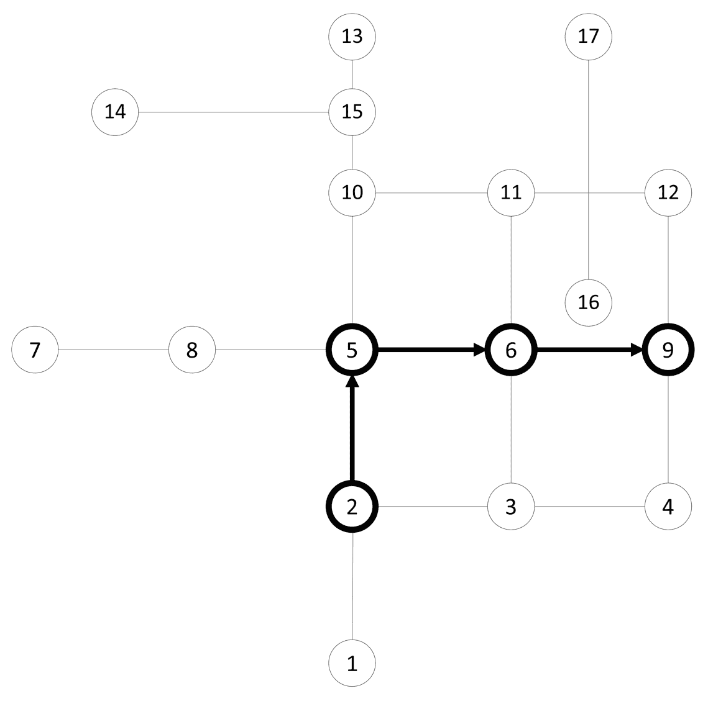
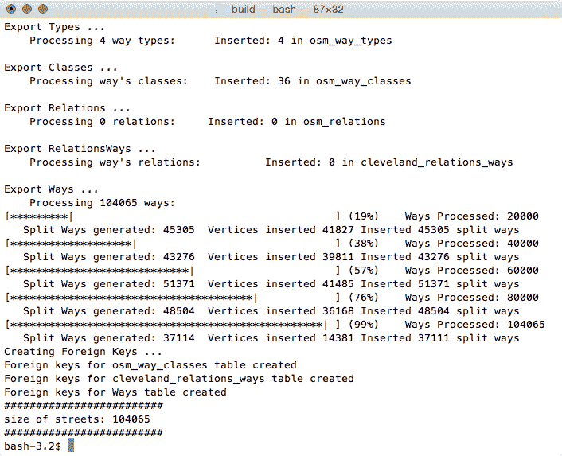
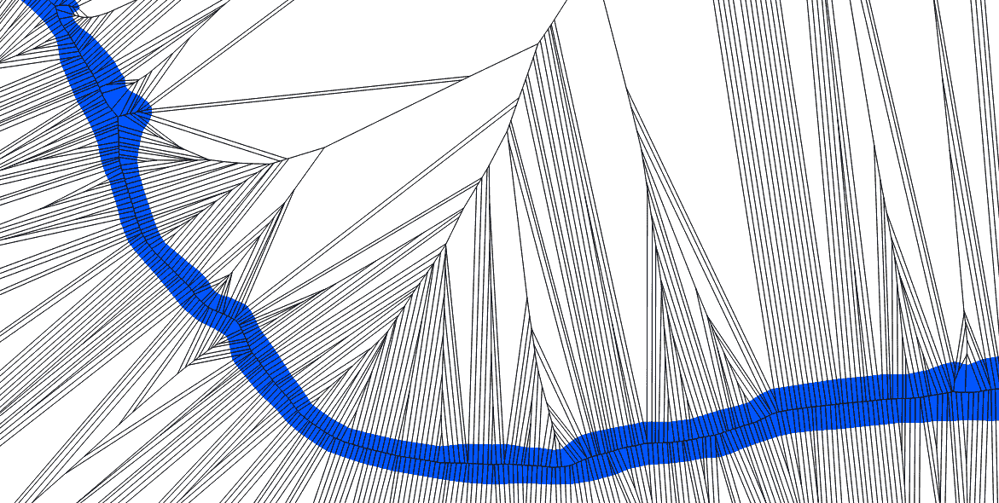

# 使用 pgRouting

在本章中，我们将涵盖以下主题：

+   启动 – Dijkstra 路由

+   从 OpenStreetMap 加载数据并使用 A* 寻找最短路径

+   计算驾驶距离/服务区域

+   使用人口统计数据计算驾驶距离

+   提取多边形的中心线

# 简介

到目前为止，我们已将 PostGIS 作为矢量工具和栅格工具使用，使用相对简单的对象关系和简单结构。在本章中，我们将回顾一个额外的与 PostGIS 相关的扩展：**pgRouting**。pgRouting 允许我们查询图结构，以回答诸如“我从哪里到我要去的最短路线是什么？”等问题。这是一个现有网络 API（如 Google、Bing、MapQuest 等）和服务高度占据的领域，但我们可以通过*自己构建*服务来更好地服务于许多用例。哪些用例？在尝试回答现有服务未解决的问题、我们拥有的数据更好或更适用，或者我们需要或希望避免这些 API 的服务条款的情况下，创建自己的服务可能是个好主意。

# 启动 – Dijkstra 路由

pgRouting 是一个独立的扩展，除了 PostGIS 之外还可以使用，现在它已经包含在 Application Stack Builder 上的 PostGIS 套件中（推荐用于 Windows）。它也可以通过 DEB、RPM、macOS X 软件包和 Windows 可执行文件进行下载和安装，这些文件可在 [`pgrouting.org/download.html`](http://pgrouting.org/download.html) 找到。

对于 macOS 用户，建议您使用 Git 上的源代码包（[`github.com/pgRouting/pgrouting/releases`](https://github.com/pgRouting/pgrouting/releases)），并使用 CMake 进行构建安装，CMake 可在 [`cmake.org/download/`](https://cmake.org/download/) 找到。

Linux Ubuntu 用户的软件包可以在 [`trac.osgeo.org/postgis/wiki/UsersWikiPostGIS22UbuntuPGSQL95Apt`](http://trac.osgeo.org/postgis/wiki/UsersWikiPostGIS22UbuntuPGSQL95Apt) 找到。

# 准备工作

pgRouting 不太擅长处理非默认模式，因此在我们开始之前，我们将使用以下命令设置我们的用户首选项中的模式：

```py
ALTER ROLE me SET search_path TO chp06,public;
```

接下来，我们需要将 `pgrouting` 扩展添加到我们的数据库中。如果 PostGIS 还未安装到数据库中，我们需要将其作为扩展添加：

```py
CREATE EXTENSION postgis;
CREATE EXTENSION pgrouting;
```

我们将首先加载一个测试数据集。您可以从 [`docs.pgrouting.org/latest/en/sampledata.html`](http://docs.pgrouting.org/latest/en/sampledata.html) 获取一些非常基本的样本数据。

这个样本数据由一个小街道网格组成，其中可以运行任何功能。

然后，运行数据集网站上的创建表和数据插入脚本。您应该调整以保留 `chp06` 的模式结构——例如：

```py
CREATE TABLE chp06.edge_table (
 id BIGSERIAL,
 dir character varying,
 source BIGINT,
 target BIGINT,
 cost FLOAT,
 reverse_cost FLOAT,
 capacity BIGINT,
 reverse_capacity BIGINT,
 category_id INTEGER,
 reverse_category_id INTEGER,
 x1 FLOAT,
 y1 FLOAT,
 x2 FLOAT,
 y2 FLOAT,
 the_geom geometry
);
```

现在数据已加载，让我们在表上构建拓扑（如果您在数据加载过程中还没有这样做）：

```py
SELECT pgr_createTopology('chp06.edge_table',0.001);
```

构建拓扑为我们创建了一个新的节点表—`chp06.edge_table_vertices_pgr`—以便我们查看。这个表将帮助我们开发查询。

# 如何做到这一点...

现在数据已加载，我们可以进行快速测试。我们将使用一个简单的算法 Dijkstra 来计算从节点 5 到节点 12 的最短路径。

Dijkstra 算法是一种有效且简单的路由算法，它在网络中从点 A 到点 B 的所有可用路径上运行搜索，也称为**图结构**。它不是最有效的路由算法，但总是会找到最佳路线。有关 Dijkstra 算法的更多信息，请参考维基百科，它有很好的解释，并配有插图，请参阅[`en.wikipedia.org/wiki/Dijkstra%27s_algorithm`](http://en.wikipedia.org/wiki/Dijkstra%27s_algorithm)。[`en.wikipedia.org/wiki/File:Dijkstras_progress_animation.gif`](http://en.wikipedia.org/wiki/File:Dijkstras_progress_animation.gif)中的动画特别有帮助。

需要注意的一个重要点是，在 pgRouting 拓扑创建过程中创建的节点在某些版本中是不经意间创建的。这在未来的版本中已经得到了修复，但对于某些版本的 pgRouting 来说，这意味着您的节点编号将不会与本书中使用的节点编号相同。在应用程序中查看您的数据以确定要使用哪些节点，或者您是否应该使用 k-最近邻搜索来找到最近的静态地理点。有关查看 PostGIS 数据的更多信息，请参阅第十一章，*使用桌面客户端*，以及有关自动查找最近节点的方法的第四章，*处理矢量数据 - 高级食谱*：

```py
SELECT * FROM pgr_dijkstra(
  'SELECT id, source, target, cost
  FROM chp06.edge_table_vertices_pgr', 2, 9,
); 
```

上述查询将产生以下结果：

****

当我们使用 Dijkstra 和其他路由算法请求路线时，结果通常以下列形式出现：

+   `seq`：这返回序列号，以便我们可以保持输出的顺序

+   `node`：这是节点 ID

+   `edge`：这是边 ID

+   `cost`：这是路线遍历的成本（通常是距离）

+   `agg_cost`：这是从起始节点到路线的聚合成本

例如，要获取几何形状，我们需要将边 ID 与原始表重新连接。为了使这种方法透明地工作，我们将使用`WITH`公共表表达式创建一个临时表，然后我们将将其与我们的几何形状连接：

```py
WITH dijkstra AS (
 SELECT pgr_dijkstra(
 'SELECT id, source, target, cost, x1, x2, y1, y2
 FROM chp06.edge_table', 2, 9
 )
)
SELECT id, ST_AsText(the_geom)
FROM chp06.edge_table et, dijkstra d
WHERE et.id = (d.pgr_dijkstra).edge;
```

上述代码将给出以下输出：

****

恭喜！您刚刚在 pgRouting 中完成了一条路线。以下图表说明了这一场景：



# 从 OpenStreetMap 加载数据并使用 A*算法找到最短路径

测试数据对于理解算法的工作原理非常有用，但真实数据通常更有趣。全球真实数据的良好来源是**OpenStreetMap**（**OSM**），这是一个全球性的、可访问的、维基风格的地理空间数据集。使用 OSM 与 pgRouting 结合的奇妙之处在于，它本质上是一个拓扑模型，这意味着它在构建时遵循与我们在 pgRouting 中的图遍历相同的规则。由于 OSM 中的编辑和社区参与方式，它通常与商业数据源一样好，甚至更好，并且当然与我们的开源模式非常兼容。

另一个很棒的功能是，有免费的开源软件可以导入 OSM 数据并将其导入到路由数据库中——`osm2pgrouting`。

# 准备工作

建议您从我们提供的示例数据集中下载可下载的文件，该数据集可在[`www.packtpub.com/support`](http://www.packtpub.com/support)找到。您将使用 XML OSM 数据。您也可以直接从网页界面[`www.openstreetmap.org/`](http://www.openstreetmap.org/)或通过使用 overpass turbo 界面访问 OSM 数据([`overpass-turbo.eu/`](https://overpass-turbo.eu/))来获取定制提取，但这可能会限制我们能够提取的区域。

一旦我们有了数据，我们需要使用我们喜欢的压缩工具解压它。在 Windows 和 macOS 机器上，双击文件通常可以解压。Linux 上解压的两个好工具是`bunzip2`和`zip`。剩下的就是我们想要的用于路由的 XML 数据提取。在我们的用例中，我们正在下载克利夫兰地区的相关数据。

现在我们需要一个工具将数据放入可路由的数据库中。一个这样的工具示例是`osm2pgrouting`，可以通过[`github.com/pgRouting/osm2pgrouting`](http://github.com/pgRouting/osm2pgrouting)上的说明进行下载和编译。使用[`cmake.org/download/`](https://cmake.org/download/)中的 CMake 在 macOS 上构建安装。对于 Linux Ubuntu 用户，有一个可用的包[`packages.ubuntu.com/artful/osm2pgrouting`](https://packages.ubuntu.com/artful/osm2pgrouting)。

# 如何操作...

当`osm2pgrouting`在没有设置任何内容的情况下运行时，输出会显示`osm2pgrouting`所需的和可用的选项：


要运行`osm2pgrouting`命令，我们需要一些必要的参数。在运行以下命令之前，请仔细检查指向`mapconfig.xml`和`cleveland.osm`的路径：

```py
osm2pgrouting --file cleveland.osm --conf /usr/share/osm2pgrouting/mapconfig.xml --dbname postgis_cookbook --user me --schema chp06 --host localhost --prefix cleveland_ --clean
```

我们的数据集可能相当大，处理和导入可能需要一些时间——请耐心等待。输出结果的结尾应该类似于以下内容：



我们的新向量表默认命名为 `cleveland_ways`。如果没有使用 `-prefix` 标志，表名就只是 `ways`。

你应该创建了以下表：


# 它是如何工作的...

`osm2pgrouting` 是一个强大的工具，它处理将 OSM 数据转换为可用于 pgRouting 的格式的许多翻译工作。在这种情况下，它从我们的输入文件中创建八个表。在这八个表中，我们将关注两个主要表：`ways` 表和 `nodes` 表。

我们的 `ways` 表代表所有在 OSM 中的街道、道路和小径的线条表。节点表包含所有交叉口。这有助于我们识别路由的起点和终点。

让我们应用 *A*（“A 星”）路由方法来解决这个问题。

*A* 是迪杰斯特拉算法的一个扩展，它使用启发式方法来加速最短路径的搜索，但偶尔可能无法找到最优路径。有关更多信息，请参阅 [`en.wikipedia.org/wiki/A*`](http://en.wikipedia.org/wiki/A*) 和 [`en.wikipedia.org/wiki/File:Astar_progress_animation.gif`](http://en.wikipedia.org/wiki/File:Astar_progress_animation.gif)。

你可以从迪杰斯特拉算法中识别出以下语法：

```py
WITH astar AS (
  SELECT * FROM pgr_astar(
    'SELECT gid AS id, source, target,
    length AS cost, x1, y1, x2, y2 
     FROM chp06.cleveland_ways', 89475, 14584, false
  ) 
) 
SELECT gid, the_geom
FROM chp06.cleveland_ways w, astar a
WHERE w.gid = a.edge;
```

以下截图显示了在地图上显示的结果（地图瓦片由 *Stamen Design 提供，根据 CC BY 3.0 许可；数据由 *OpenStreetMap 提供，根据 CC BY SA 许可））：


使用 pgRouting 在 QGIS 中可视化的示例计算路线

# 计算驾驶距离/服务区域

驾驶距离（`pgr_drivingDistance`）是一个查询，它计算从起始节点到指定驾驶距离内的所有节点。这是一个可选的 pgRouting 函数；因此，如果你自己编译 pgRouting，请确保启用它并包含 CGAL 库，这是 `pgr_drivingDistance` 的一个可选依赖项。

驾驶距离在需要提供真实驾驶距离估计时很有用，例如，对于所有距离五英里以驾驶、骑行或步行方式到达的客户。这些估计可以与缓冲技术进行对比，缓冲技术假设没有旅行障碍，并且对于揭示与个人位置相关的交通网络的基本结构很有用。

# 准备工作

我们将加载与 *Startup – Dijkstra 路由* 菜单中使用的相同数据集。请参考此菜谱以导入数据。

# 如何操作...

在以下示例中，我们将查看距离起点三单位距离内的所有用户——即节点 2 处的一个提议的自行车店：

```py
SELECT * FROM pgr_drivingDistance(
 'SELECT id, source, target, cost FROM chp06.edge_table',
 2, 3
);
```

前面的命令给出了以下输出：


如同往常，我们只是从 `pgr_drivingDistance` 表中获取一个列表，在这个例子中，它包括序列、节点、边成本和总成本。PgRouting，就像 PostGIS 一样，给我们提供了低级功能；我们需要从这些低级功能中重建我们需要的几何形状。我们可以使用那个节点 ID 来执行以下脚本，从而提取所有节点的几何形状：

```py
WITH DD AS (
  SELECT * FROM pgr_drivingDistance(
    'SELECT id, source, target, cost 
    FROM chp06.edge_table', 2, 3
  )
)

SELECT ST_AsText(the_geom)
FROM chp06.edge_table_vertices_pgr w, DD d
WHERE w.id = d.node; 
```

前面的命令给出了以下输出：


但我们看到的是只是一个点簇。通常，当我们想到驾驶距离时，我们会将其可视化为一个多边形。幸运的是，我们有 `pgr_alphaShape` 函数提供了这个功能。这个函数期望输入 `id`、`x` 和 `y` 值，因此我们首先将之前的查询更改为我们之前在 `edge_table_vertices_pgr` 中的几何形状转换为 `x` 和 `y`：

```py
WITH DD AS (
  SELECT * FROM pgr_drivingDistance(
    'SELECT id, source, target, cost FROM chp06.edge_table',
     2, 3
  )
)
SELECT id::integer, ST_X(the_geom)::float AS x, ST_Y(the_geom)::float AS y 
FROM chp06.edge_table_vertices_pgr w, DD d
WHERE w.id = d.node;
```

输出如下：


现在我们可以将前面的脚本包裹在 `alphashape` 函数中：

```py
WITH alphashape AS (
  SELECT pgr_alphaShape('
    WITH DD AS (
    SELECT * FROM pgr_drivingDistance(
       ''SELECT id, source, target, cost 
    FROM chp06.edge_table'', 2, 3
      )
    ),
    dd_points AS(
    SELECT id::integer, ST_X(the_geom)::float AS x, 
      ST_Y(the_geom)::float AS y
      FROM chp06.edge_table_vertices_pgr w, DD d
      WHERE w.id = d.node
    )
    SELECT * FROM dd_points
  ')
),  
```

因此，首先，我们将获取我们的点簇。正如我们之前所做的那样，我们将明确地将文本转换为几何点：

```py
alphapoints AS (
  SELECT ST_MakePoint((pgr_alphashape).x, (pgr_alphashape).y) FROM alphashape
),
```

现在我们有了点，我们可以通过连接它们来创建一条线：

```py
alphaline AS (
  SELECT ST_Makeline(ST_MakePoint) FROM alphapoints
)
SELECT ST_MakePolygon(ST_AddPoint(ST_Makeline, ST_StartPoint(ST_Makeline))) FROM alphaline;
```

最后，我们使用 `ST_MakePolygon` 将线构造为多边形。这需要通过执行 `ST_StartPoint` 来添加起点，以便正确地闭合多边形。完整的代码如下：

```py
WITH alphashape AS (
 SELECT pgr_alphaShape('
 WITH DD AS (
 SELECT * FROM pgr_drivingDistance(
 ''SELECT id, source, target, cost
 FROM chp06.edge_table'', 2, 3
 )
 ),
 dd_points AS(
 SELECT id::integer, ST_X(the_geom)::float AS x,
 ST_Y(the_geom)::float AS y
 FROM chp06.edge_table_vertices_pgr w, DD d
 WHERE w.id = d.node
 )
 SELECT * FROM dd_points
 ')
),
alphapoints AS (
 SELECT ST_MakePoint((pgr_alphashape).x,
 (pgr_alphashape).y)
 FROM alphashape
),
alphaline AS (
 SELECT ST_Makeline(ST_MakePoint) FROM alphapoints
)
SELECT ST_MakePolygon(
 ST_AddPoint(ST_Makeline, ST_StartPoint(ST_Makeline))
)
FROM alphaline;
```

我们第一次的驾驶距离计算可以通过以下图表更好地理解，其中我们可以从节点 2 以 3 英里的驾驶距离到达节点 9、11、13：


# 参见

+   *使用人口统计数据计算驾驶距离* 菜单

# 使用人口统计数据计算驾驶距离

在 第二章 的 *Using polygon overlays for proportional census estimates* 菜单中，我们在 *Structures That Work* 中使用了一个围绕小径对齐的简单缓冲区，结合人口统计数据来估计小径周围步行距离内的人们的统计数据，估计为 1 英里长。当然，这种方法的问题在于它假设这是一个“直线距离”的估计。实际上，河流、大型道路和没有道路的路段是人们穿越空间的真正障碍。使用 pgRouting 的 `pgr_drivingDistance` 函数，我们可以在可路由网络上现实地模拟人们的移动，并获得更好的估计。对于我们的用例，我们将保持模拟比小径对齐简单一些——我们将考虑一个公园设施的人口统计数据，比如克利夫兰都会动物园，以及在其 4 英里范围内的潜在自行车使用者，这大约相当于 15 分钟的自行车骑行时间。

# 准备工作

对于我们的分析，我们将使用第二章，*有效结构*中的`proportional_sum`函数，所以如果你还没有将其添加到你的 PostGIS 工具包中，请运行以下命令：

```py
CREATE OR REPLACE FUNCTION chp02.proportional_sum(geometry, geometry, numeric)
RETURNS numeric AS
$BODY$
SELECT $3 * areacalc FROM
(
  SELECT (ST_Area(ST_Intersection($1, $2))/ST_Area($2))::numeric AS areacalc
) AS areac
;
$BODY$
LANGUAGE sql VOLATILE;
```

`proportional_sum`函数将考虑我们的输入几何形状和人口计数值，并返回比例人口估计。

现在我们需要加载我们的普查数据。使用以下命令：

```py
shp2pgsql -s 3734 -d -i -I -W LATIN1 -g the_geom census chp06.census | psql -U me -d postgis_cookbook -h localhost
```

此外，如果你还没有加载*从 OpenStreetMap 加载数据并找到最短路径 A*配方中提到的数据，请现在花时间加载。

一旦所有数据都输入完毕，我们就可以进行分析了。

# 如何做到这一点...

我们创建的`pgr_drivingdistance`多边形是人口分析的第一步。如果你需要熟悉其使用，请参考*行驶距离/服务区域计算*配方。在这种情况下，我们将考虑骑行距离。根据我们加载的数据集，克利夫兰市立动物园最近的节点是 24746；因此，我们将使用该点作为`pgr_drivingdistance`计算的中心点，并使用大约 6 公里作为我们的距离，因为我们想知道在克利夫兰市立动物园这个距离内的动物园游客数量。然而，由于我们的数据使用的是 4326 EPSG，我们将给函数提供的距离将以度为单位，因此 0.05 将给我们大约 6 公里的距离，这将与`pgr_drivingDistance`函数兼容：

```py
CREATE TABLE chp06.zoo_bikezone AS (
  WITH alphashape AS (
    SELECT pgr_alphaShape('
      WITH DD AS (
    SELECT * FROM pgr_drivingDistance(
          ''SELECT gid AS id, source, target, reverse_cost 
          AS cost FROM chp06.cleveland_ways'',
          24746, 0.05, false
        )
      ),
      dd_points AS(
        SELECT id::int4, ST_X(the_geom)::float8 as x, 
          ST_Y(the_geom)::float8 AS y
        FROM chp06.cleveland_ways_vertices_pgr w, DD d
        WHERE w.id = d.node
      )
      SELECT * FROM dd_points
    ')
  ),
  alphapoints AS (
    SELECT ST_MakePoint((pgr_alphashape).x, (pgr_alphashape).y) 
    FROM alphashape
  ),
  alphaline AS (
    SELECT ST_Makeline(ST_MakePoint) FROM alphapoints
  )
  SELECT 1 as id, ST_SetSRID(ST_MakePolygon(ST_AddPoint(ST_Makeline, ST_StartPoint(ST_Makeline))), 4326) AS the_geom FROM alphaline
);  
```

前面的脚本给我们一个非常有趣的形状（由*Stamen Design*设计，根据 CC BY 3.0 许可；数据由*OpenStreetMap*提供，根据 CC BY SA 许可）。请看以下截图：


在前面的截图中，我们可以看到实际道路网络中骑行的距离（用蓝色阴影表示）与等效的 4 英里缓冲区或直线距离之间的差异。让我们使用以下脚本将此应用于我们的人口分析：

```py
SELECT ROUND(SUM(chp02.proportional_sum(
  ST_Transform(a.the_geom,3734), b.the_geom, b.pop))) AS population 
FROM Chp06.zoo_bikezone AS a, chp06.census as b
WHERE ST_Intersects(ST_Transform(a.the_geom, 3734), b.the_geom)
GROUP BY a.id;
```

输出如下：


```py
(1 row)
```

那么，前面的输出与如果我们查看缓冲距离我们会得到什么相比如何？

```py
SELECT ROUND(SUM(chp02.proportional_sum(
  ST_Transform(a.the_geom,3734), b.the_geom, b.pop))) AS population 
 FROM (SELECT 1 AS id, ST_Buffer(ST_Transform(the_geom, 3734), 17000) 
    AS the_geom 
 FROM chp06.cleveland_ways_vertices_pgr WHERE id = 24746
) AS a,  chp06.census as b
WHERE ST_Intersects(ST_Transform(a.the_geom, 3734), b.the_geom)
GROUP BY a.id;
```

****

```py
(1 row)
```

前面的输出显示了超过 60,000 人的差异。换句话说，使用缓冲区比使用`pgr_drivingdistance`高估了人口。

# 提取多边形的中心线

在第四章，“*处理矢量数据 - 高级食谱*”中的几个食谱中，我们探讨了从点集提取 Voronoi 多边形。在这个食谱中，我们将使用在“*使用外部脚本来嵌入新功能以计算 Voronoi 多边形*”部分中使用的 Voronoi 函数，作为提取多边形中心线的第一步。也可以使用“*使用外部脚本来嵌入新功能以计算 Voronoi 多边形 - 高级*”食谱，它在大数据集上运行得更快。对于这个食谱，我们将使用更简单但更慢的方法。

另一个附加的依赖项是我们将使用来自第二章，“*正常化内部叠加*”食谱中的`chp02.polygon_to_line(geometry)`函数。

我们所说的多边形中心线是什么意思？想象一下一条数字化的河流在其两侧之间流动，如下面的截图所示：


如果我们想要找到这个区域的中心以便模拟水流，我们可以使用骨架化方法来提取它，如下面的截图所示：


正如我们很快就会看到的，骨架化方法的困难在于它们通常容易受到噪声的影响，而自然特征，如我们的河流，会产生大量的噪声。这意味着典型的骨架化，如果简单地使用 Voronoi 方法就可以完成，因此对于我们的目的来说本质上是不够的。

这就带我们来到了为什么骨架化方法被包含在本章中的原因。路由是我们简化由 Voronoi 方法得到的骨架的一种方式。它允许我们从主要特征的一端追踪到另一端，并跳过中间的所有噪声。

# 准备工作

由于我们将使用第四章，“*处理矢量数据 - 高级食谱*”中“*使用外部脚本来嵌入新功能以计算 Voronoi 多边形*”食谱中的 Voronoi 计算，你应该参考那个食谱来准备使用本食谱中使用的函数。

我们将使用本书源包中水文文件夹下找到的流数据集。要加载它，请使用以下命令：

```py
shp2pgsql -s 3734 -d -i -I -W LATIN1 -g the_geom ebrr_polygon chp06.voronoi_hydro | psql -U me -d postgis_cookbook
```

我们创建的河流将如下截图所示：


# 如何做到这一点...

为了执行基本的骨架化，我们将计算组成原始河流多边形的节点上的 Voronoi 多边形。默认情况下，Voronoi 多边形的边缘找到点之间的中点所界定的线。我们将利用这种趋势，将我们的线条视为点——向线条添加额外的点，然后将线条转换为点集。这种方法与 Voronoi 方法相结合，将提供多边形中心线的初始估计。

我们将使用`ST_Segmentize`函数向我们的输入几何体添加额外的点，然后使用`ST_DumpPoints`将几何体转换为点：

```py
CREATE TABLE chp06.voronoi_points AS(
  SELECT (ST_DumpPoints(ST_Segmentize(the_geom, 5))).geom AS the_geom 
    FROM chp06.voronoi_hydro
  UNION ALL
  SELECT (ST_DumpPoints(ST_Extent(the_geom))).geom AS the_geom 
    FROM chp06.voronoi_hydro
)
```

如果我们在桌面 GIS 上查看，以下截图显示了我们的多边形作为一组点：


前面的截图中的点集是我们输入到 Voronoi 计算中的：

```py
CREATE TABLE chp06.voronoi AS(
  SELECT (ST_Dump(
    ST_SetSRID(
      ST_VoronoiPolygons(points.the_geom),
      3734))).geom as the_geom
FROM (SELECT ST_Collect(ST_SetSRID(the_geom, 3734)) as the_geom FROM chp06.voronoi_points) as points);
```

以下截图显示了从我们的点派生出的 Voronoi 图：



如果您仔细观察前面的截图，您将看到我们新数据中显示的基本中心线。现在我们将迈出第一步来提取它。我们应该对我们的输入进行索引，然后将 Voronoi 输出与原始流多边形相交，以便将数据清理回合理的状态。在提取过程中，我们还将从多边形中提取边缘，并移除原始多边形上的边缘，以便在我们的路由步骤之前移除任何多余的线条。这已在以下脚本中实现：

```py
CREATE INDEX chp06_voronoi_geom_gist
ON chp06.voronoi
USING gist(the_geom);

DROP TABLE IF EXISTS voronoi_intersect;

CREATE TABLE chp06.voronoi_intersect AS WITH vintersect AS (
  SELECT ST_Intersection(ST_SetSRID(ST_MakeValid(a.the_geom), 3734), 
  ST_MakeValid(b.the_geom)) AS the_geom 
  FROM Chp06.voronoi a, chp06.voronoi_hydro b
  WHERE ST_Intersects(ST_SetSRID(a.the_geom, 3734), b.the_geom)
),
linework AS (
  SELECT chp02.polygon_to_line(the_geom) AS the_geom 
  FROM vintersect
),
polylines AS (
  SELECT ((ST_Dump(ST_Union(lw.the_geom))).geom)
    ::geometry(linestring, 3734) AS the_geom 
  FROM linework AS lw
),
externalbounds AS (
  SELECT chp02.polygon_to_line(the_geom) AS the_geom 
  FROM voronoi_hydro
)

SELECT (ST_Dump(ST_Union(p.the_geom))).geom 
  FROM polylines p, externalbounds b 
  WHERE NOT ST_DWithin(p.the_geom, b.the_geom, 5);
```

现在，我们有了骨骼的第二级近似（如下面的截图所示）。它很杂乱，但它开始突出我们寻求的中心线：


# 还有更多...

现在，我们几乎准备好进行路由了。我们拥有的中心线计算是对直线骨骼的良好近似，但仍然受到自然世界噪声的影响。我们希望通过选择我们的特征并通过路由强调它们来消除这种噪声。首先，我们需要准备表格以允许进行路由计算，如下面的命令所示：

```py
ALTER TABLE chp06.voronoi_intersect ADD COLUMN gid serial;
ALTER TABLE chp06.voronoi_intersect ADD PRIMARY KEY (gid);

ALTER TABLE chp06.voronoi_intersect ADD COLUMN source integer;
ALTER TABLE chp06.voronoi_intersect ADD COLUMN target integer;
```

然后，要从我们的骨骼创建可路由的网络，输入以下命令：

```py
SELECT pgr_createTopology('voronoi_intersect', 0.001, 'the_geom', 'gid', 'source', 'target', 'true');

CREATE INDEX source_idx ON chp06.voronoi_intersect("source");
CREATE INDEX target_idx ON chp06.voronoi_intersect("target");

ALTER TABLE chp06.voronoi_intersect ADD COLUMN length double precision;
UPDATE chp06.voronoi_intersect SET length = ST_Length(the_geom);

ALTER TABLE chp06.voronoi_intersect ADD COLUMN reverse_cost double precision;
UPDATE chp06.voronoi_intersect SET reverse_cost = length;
```

现在，我们可以使用以下命令沿着我们多边形的主要中心线进行路由：

```py
CREATE TABLE chp06.voronoi_route AS
WITH dijkstra AS (
  SELECT * FROM pgr_dijkstra('SELECT gid AS id, source, target, length 
    AS cost FROM chp06.voronoi_intersect', 10851, 3, false)
)

SELECT gid, geom
FROM voronoi_intersect et, dijkstra d
WHERE et.gid = d.edge;
```

如果我们查看这个路由的细节，我们会看到以下内容：


现在，我们可以将原始多边形与其中心线的轨迹进行比较：


前面的截图显示了流的原几何形状与我们的中心线或骨骼的对比。这是一个非常优秀的输出，它极大地简化了我们的输入几何形状，同时保留了其相关特征。
