# 第七章：进入第 N 维

在本章中，我们将涵盖：

+   导入激光雷达数据

+   在激光雷达点云上执行 3D 查询

+   构建和提供 2.5D 建筑

+   使用 ST_Extrude 扩展建筑底图

+   为 PostGIS 创建任意 3D 对象

+   将模型导出为 X3D 格式以供网页使用

+   使用 PostGIS 3D 重建无人机（UAV）图像底图

+   PostGIS 中的无人机摄影测量 – 点云

+   PostGIS 中的无人机摄影测量 – 创建数字表面模型（DSM）

# 简介

在本章中，我们将探讨 PostGIS 的 3D 功能。我们将重点关注三个主要类别：如何将 3D 数据插入到 PostGIS 中，如何使用 3D 数据进行分析和执行查询，以及如何将 3D 数据从 PostGIS 中导出。本章将使用 3D 点云作为 3D 数据，包括激光雷达数据和由**运动结构**（**SfM**）技术派生出的数据。此外，我们将构建一个将建筑底图扩展到 3D 的功能。

需要注意的是，在本章中，我们将讨论 postgreSQL-pointcloud 扩展；点云通常是指在一个坐标系中三维点坐标的三维表示的大型数据集。点云用于以高精度表示感知对象的表面，例如使用地理激光雷达数据。pointcloud 扩展将帮助我们将激光雷达数据存储到数据库中的点云对象中。此外，此扩展还添加了允许您将点云对象转换为几何形状并使用点云数据进行空间过滤的功能。有关此扩展的更多信息，您可以访问官方 GitHub 仓库[`github.com/pgpointcloud/pointcloud`](https://github.com/pgpointcloud/pointcloud)。此外，您还可以查看 Paul Ramsey 的教程[`workshops.boundlessgeo.com/tutorial-lidar/`](http://workshops.boundlessgeo.com/tutorial-lidar/)。

下载我们提供的示例数据集以供您使用，可在[`www.packtpub.com/support`](http://www.packtpub.com/support)找到。

# 导入激光雷达数据

**光探测与测距**（**LiDAR**）是生成点云数据最常用的设备之一。该系统捕捉给定空间中对象或表面的 3D 位置和其他属性。这种方法与雷达非常相似，因为它使用电磁波来测量距离和亮度等。然而，LiDAR 与雷达的主要区别在于，前者使用激光束技术，而不是微波或无线电波。另一个区别是，LiDAR 通常发送一个单一的聚焦脉冲并测量返回脉冲的时间，计算距离和深度。相比之下，雷达在接收到返回脉冲之前会发送多个脉冲，因此需要额外的处理来确定每个脉冲的来源。

LiDAR 数据与地面和空中应用相结合已成为相当常见，有助于地面测量，增强并极大地自动化了摄影测量工程的一些方面。有许多数据源拥有大量的 LiDAR 数据。

LiDAR 数据通常以 **LAS** 或 **LASer** **格式**分发。**美国摄影测量与遥感学会**（**ASPRS**）建立了 LAS 标准。LAS 是一种二进制格式，因此将其读入 PostGIS 数据库是非平凡的。幸运的是，我们可以利用开源工具 PDAL。

# 准备工作

我们的数据源将以 LAS 格式存在，我们将使用可从 [`www.pdal.io/`](https://www.pdal.io/) 获取的 PDAL 库将其插入到我们的数据库中。此工具适用于 Linux/UNIX 和 Mac 用户；对于 Windows，它可通过 OSGeo4W 软件包获得（[`www.pdal.io/workshop/osgeo4w.html`](https://www.pdal.io/workshop/osgeo4w.html)）。

LAS 数据可以包含很多有趣的数据，不仅仅是 *X*、*Y* 和 *Z* 值。它还可以包括从被感知对象返回的强度以及对象的分类（地面、植被、建筑物）。当我们将 LAS 文件放入我们的 PostGIS 数据库中时，我们可以选择收集这些信息中的任何一项。此外，PDAL 内部构建一个管道来转换用于读取、处理和写入的数据。

在为此做准备之前，我们需要创建一个表示 PDAL 处理管道的 JSON 文件。对于每个 LAS 文件，我们创建一个 JSON 文件来配置读取器和写入器使用 postgres-pointcloud 选项。我们还需要编写数据库连接参数。对于测试文件 `test_1.las`，代码如下：

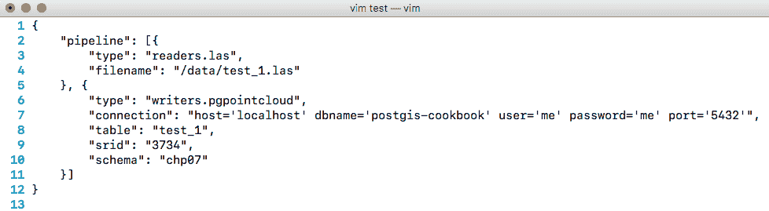

现在，我们可以下载我们的数据。建议您从 [`gis5.oit.ohio.gov/geodatadownload/`](http://gis5.oit.ohio.gov/geodatadownload/) 下载，或者下载我们为您提供的样本数据集，可在 [`www.packtpub.com/support`](http://www.packtpub.com/support) 获取。

# 如何做到这一点...

首先，我们需要将我们的 LAS 文件转换为 PDAL 可以使用的格式。我们创建了一个 Python 脚本，该脚本从 LAS 文件目录中读取并生成相应的 JSON。使用此脚本，如果我们有一个大文件目录，我们可以自动化生成。此外，我们选择 Python 是因为它简单，并且无论使用什么操作系统都可以执行脚本。要执行脚本，请在控制台中运行以下命令（对于 Windows 用户，请确保 Python 解释器已包含在 `PATH` 变量中）：

```py
$ python insert_files.py -f <lasfiles_path>
```

此脚本将读取每个 LAS 文件，并将与要插入数据库的 LAS 文件相关的所有元数据存储在名为 `pipelines` 的文件夹中。

现在，使用 PDAL，我们执行一个 `for` 循环将 LAS 文件插入到 Postgres：

```py
$ for file in `ls pipelines/*.json`; 
  do 
    pdal pipeline $file; 
  done 
```

这点云数据被分成三个不同的表。如果我们想合并它们，我们需要执行以下 SQL 命令：

```py
DROP TABLE IF EXISTS chp07.lidar; 
CREATE TABLE chp07.lidar AS WITH patches AS  
( 
  SELECT 
    pa  
  FROM "chp07"."N2210595"  
  UNION ALL 
  SELECT 
    pa  
  FROM "chp07"."N2215595"  
  UNION ALL 
  SELECT 
    pa  
  FROM "chp07"."N2220595" 
) 
SELECT 
  2 AS id, 
PC_Union(pa) AS pa  
FROM patches; 
```

postgres-pointcloud 扩展使用两个主要的点云对象作为变量：*PcPoint* 对象，它是一个可以有多个维度但至少包含 X 和 Y 值的点，这些值放置在空间中；以及 *PcPatch* 对象，它是一组紧密相邻的多个 PcPoint。根据插件的文档，将大量点作为单个记录存储在表中会变得效率低下。

现在我们已经将所有数据放入单个表中，如果我们想可视化点云数据，我们需要创建一个空间表，以便我们的图层查看器可以理解；例如，QGIS。Postgres 的点云插件具有 PostGIS 集成，因此我们可以将 *PcPatch* 和 *PcPoint* 对象转换为几何对象，并使用 PostGIS 函数分析数据：

```py
CREATE TABLE chp07.lidar_patches AS WITH pts AS  
( 
  SELECT 
    PC_Explode(pa) AS pt  
  FROM chp07.lidar 
) 
SELECT 
  pt::geometry AS the_geom  
FROM pts; 
ALTER TABLE chp07.lidar_patches ADD COLUMN gid serial; 
ALTER TABLE chp07.lidar_patches ADD PRIMARY KEY (gid); 
```

这个 SQL 脚本执行一个内部查询，最初使用 `PC_Explode` 函数从 *PcPatch* 返回一组 *PcPoints*。然后，对于返回的每个点，我们将从 *PcPoint* 对象转换为 PostGIS 几何对象。最后，我们创建 `gid` 列并将其添加到表中作为主键。

现在，我们可以使用我们最喜欢的桌面 GIS 查看我们的数据，如下面的图像所示：

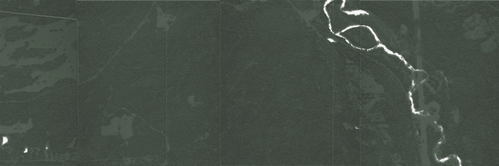

# 参见

+   *在 LiDAR 点云上执行 3D 查询* 配方

# 在 LiDAR 点云上执行 3D 查询

在之前的配方中，*导入 LiDAR 数据*，我们将一个 LiDAR 3D 点云导入到 PostGIS 中，从输入中创建了一个显式的 3D 数据集。有了 3D 形式的数据，我们就有能力对其执行空间查询。在这个配方中，我们将利用 3D 索引，以便我们的最近邻搜索可以在数据的所有维度上工作。

# 如何做到这一点...

我们将使用之前配方中导入的 LiDAR 数据作为我们的数据集。我们给那个表命名为 `chp07.lidar`。为了执行最近邻搜索，我们需要在数据集上创建一个索引。空间索引与普通数据库表索引类似，就像书籍索引一样，它们帮助我们更快地找到我们想要的东西。通常，这样一个索引创建步骤看起来如下（这次我们不会运行它）：

```py
CREATE INDEX chp07_lidar_the_geom_idx  
ON chp07.lidar USING gist(the_geom); 
```

3D 索引在 2D 查询中不如 2D 索引执行得快，因此 `CREATE INDEX` 查询默认创建一个 2D 索引。在我们的情况下，我们希望强制 gist 应用到所有三个维度，因此我们将明确告诉 PostgreSQL 使用索引的多维版本：

```py
CREATE INDEX chp07_lidar_the_geom_3dx 
ON chp07.lidar USING gist(the_geom gist_geometry_ops_nd); 
```

注意，之前代码中描述的方法如果存在时间维度或 3D 加时间维度也会有效。让我们加载第二个 3D 数据集以及我们将用于查询的流中心线：

```py
$ shp2pgsql -s 3734 -d -i -I -W LATIN1 -t 3DZ -g the_geom hydro_line chp07.hydro | PGPASSWORD=me psql -U me -d "postgis-cookbook" -h localhost  
```

如下所示，这些数据与我们的 LiDAR 点云叠加得很好：

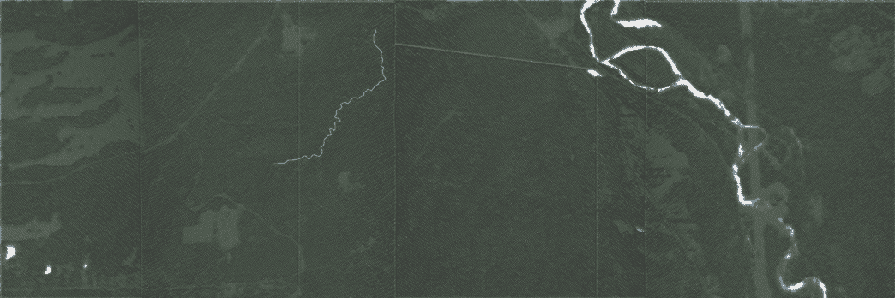

现在，我们可以构建一个简单的查询来检索所有位于我们溪流中心线一英尺范围内的激光雷达点：

```py
DROP TABLE IF EXISTS chp07.lidar_patches_within; 
CREATE TABLE chp07.lidar_patches_within AS 
SELECT chp07.lidar_patches.gid, chp07.lidar_patches.the_geom 
FROM chp07.lidar_patches, chp07.hydro  
WHERE ST_3DDWithin(chp07.hydro.the_geom, chp07.lidar_patches.the_geom, 5); 
```

但是，这有点草率；我们可能会得到重复的激光雷达点，因此我们将使用`LEFT JOIN`和`SELECT DISTINCT`来细化我们的查询，但继续使用`ST_DWithin`作为限制条件：

```py
DROP TABLE IF EXISTS chp07.lidar_patches_within_distinct; 
CREATE TABLE chp07.lidar_patches_within_distinct AS 
SELECT DISTINCT (chp07.lidar_patches.the_geom), chp07.lidar_patches.gid  
FROM chp07.lidar_patches, chp07.hydro  
WHERE ST_3DDWithin(chp07.hydro.the_geom, chp07.lidar_patches.the_geom, 5); 
```

现在，我们可以可视化我们返回的点，如下面的图像所示：

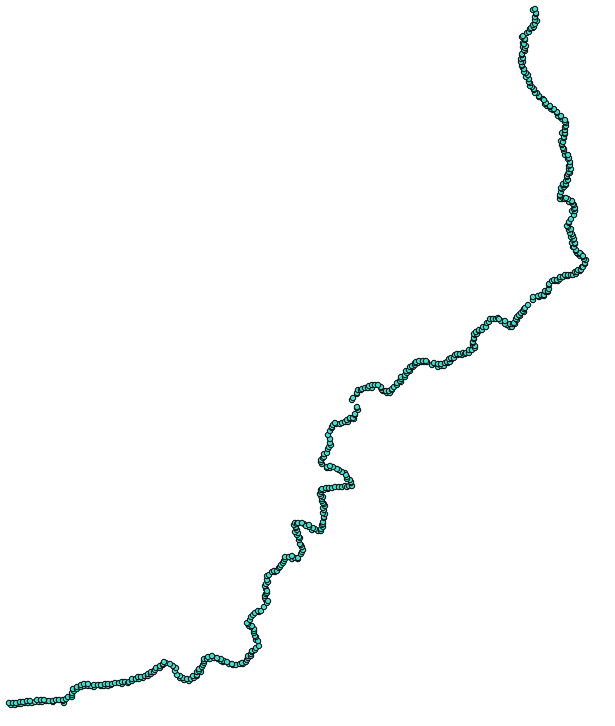

尝试使用`ST_DWithin`而不是`ST_3DDWithin`进行此查询。你会发现返回点的数量有有趣的不同，因为`ST_DWithin`将收集 XY 平面上可能接近我们的流线的激光雷达点，但在 3D 距离上并不那么接近。

你可以想象`ST_3DWithin`在围绕我们的线进行查询。相比之下，`ST_DWithin`将查询一个垂直的激光雷达点墙，因为它只基于 XY 距离搜索相邻点，完全忽略高度，因此收集所有在点上方和下方的狭窄墙体内的点。

# 构建 2.5D 建筑和提供服务

在第四章“*详细建筑足迹从激光雷达数据中生成*”的配方中，我们在“*处理矢量数据 - 高级配方*”部分探讨了使用激光雷达数据自动生成建筑足迹。我们试图从 3D 数据中创建 2D 数据。在这个配方中，我们尝试做相反的事情。我们以 2D 建筑足迹多边形开始，并将它们输入到一个函数中，使其扩展为 3D 多边形。

# 准备工作

对于这个配方，我们将挤压我们自行制作的建筑足迹。让我们快速创建一个包含单个建筑足迹的表，用于测试，如下所示：

```py
DROP TABLE IF EXISTS chp07.simple_building; 
CREATE TABLE chp07.simple_building AS  
SELECT 1 AS gid, ST_MakePolygon( 
  ST_GeomFromText( 
    'LINESTRING(0 0,2 0, 2 1, 1 1, 1 2, 0 2, 0 0)' 
  ) 
) AS the_geom; 
```

将 3D 建筑的创建尽可能简单地封装在一个函数中是有益的：

```py
CREATE OR REPLACE FUNCTION chp07.threedbuilding(footprint geometry, height numeric) 
RETURNS geometry AS 
$BODY$ 
```

我们的功能接受两个输入：建筑足迹和要挤压的高度。我们还可以想象一个接受第三个参数的功能：建筑底座的高度。

要构建建筑墙体，我们首先需要将我们的多边形转换为线字符串，然后进一步将线字符串分离成它们各自的两点段：

```py
WITH simple_lines AS 
( 
  SELECT  
    1 AS gid,  
    ST_MakeLine(ST_PointN(the_geom,pointn), 
    ST_PointN(the_geom,pointn+1)) AS the_geom 
  FROM ( 
    SELECT 1 AS gid, 
    polygon_to_line($1) AS the_geom  
  ) AS a 
  LEFT JOIN( 
    SELECT  
      1 AS gid,  
      generate_series(1,  
        ST_NumPoints(polygon_to_line($1))-1 
      ) AS pointn  
  ) AS b 
  ON a.gid = b.gid 
), 
```

上述代码返回我们原始形状的两个点段。例如，对于`simple_building`，输出如下：

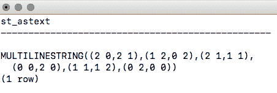

现在我们有一系列单独的线，我们可以使用这些线来构建建筑的墙体。首先，我们需要使用`ST_Force3DZ`将我们的 2D 线重新表示为 3D：

```py
threeDlines AS
( 
  SELECT ST_Force3DZ(the_geom) AS the_geom FROM simple_lines 
),
```

输出如下：

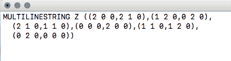

下一步是将`MULTILINESTRING`中的每条线分解成许多`LINESTRINGS`：

```py
explodedLine AS 
( 
  SELECT (ST_Dump(the_geom)).geom AS the_geom FROM threeDLines 
), 
```

这个输出的结果如下：

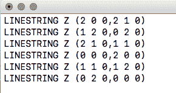

下一步是构建一个代表挤压墙体边界的线：

```py
threeDline AS 
( 
  SELECT ST_MakeLine( 
    ARRAY[ 
      ST_StartPoint(the_geom), 
      ST_EndPoint(the_geom), 
      ST_Translate(ST_EndPoint(the_geom), 0, 0, $2), 
      ST_Translate(ST_StartPoint(the_geom), 0, 0, $2), 
      ST_StartPoint(the_geom) 
    ] 
  ) 
  AS the_geom FROM explodedLine 
), 
```

现在，我们需要将每条线字符串转换为`polygon.threeDwall`:

```py
threeDwall AS 
( 
  SELECT ST_MakePolygon(the_geom) as the_geom FROM threeDline 
), 
```

最后，在我们的建筑上加上屋顶和地板，使用原始几何形状作为地板（强制转换为 3D）和原始几何形状的副本，该副本已平移到我们的输入高度：

```py
buildingTop AS 
( 
  SELECT ST_Translate(ST_Force3DZ($1), 0, 0, $2) AS the_geom 
), 
-- and a floor 
buildingBottom AS 
( 
  SELECT ST_Translate(ST_Force3DZ($1), 0, 0, 0) AS the_geom 
), 
```

我们将墙壁、屋顶和地板组合在一起，在过程中将其转换为 3D `MULTIPOLYGON`:

```py
wholeBuilding AS 
( 
  SELECT the_geom FROM buildingBottom 
    UNION ALL 
  SELECT the_geom FROM threeDwall 
    UNION ALL 
  SELECT the_geom FROM buildingTop 
), 
-- then convert this collecion to a multipolygon 
multiBuilding AS 
( 
  SELECT ST_Multi(ST_Collect(the_geom)) AS the_geom FROM  
    wholeBuilding 
), 
```

虽然我们可以将我们的几何形状保留为`MULTIPOLYGON`，但我们会做得更规范，并使用非正式的铸造到`POLYHEDRALSURFACE`。在我们的情况下，我们已经是`POLYHEDRALSURFACE`的有效格式，所以我们将使用`ST_AsText`将我们的几何形状转换为文本，用`POLYHEDRALSURFACE`替换单词，然后使用`ST_GeomFromText`将我们的文本转换回几何形状：

```py
textBuilding AS 
( 
  SELECT ST_AsText(the_geom) textbuilding FROM multiBuilding 
), 
textBuildSurface AS 
( 
  SELECT ST_GeomFromText(replace(textbuilding, 'MULTIPOLYGON', 
         'POLYHEDRALSURFACE')) AS the_geom FROM textBuilding 
) 
SELECT the_geom FROM textBuildSurface 
```

最后，整个函数是：

```py
CREATE OR REPLACE FUNCTION chp07.threedbuilding(footprint geometry,  
  height numeric) 
RETURNS geometry AS 
$BODY$ 

-- make our polygons into lines, and then chop up into individual line segments 
WITH simple_lines AS 
( 
  SELECT 1 AS gid, ST_MakeLine(ST_PointN(the_geom,pointn), 
    ST_PointN(the_geom,pointn+1)) AS the_geom 
  FROM (SELECT 1 AS gid, polygon_to_line($1) AS the_geom ) AS a 
  LEFT JOIN 
  (SELECT 1 AS gid, generate_series(1,  
    ST_NumPoints(polygon_to_line($1))-1) AS pointn  
  ) AS b 
  ON a.gid = b.gid 
), 
-- convert our lines into 3D lines, which will set our third  coordinate to 0 by default 
threeDlines AS 
( 
  SELECT ST_Force3DZ(the_geom) AS the_geom FROM simple_lines 
), 
-- now we need our lines as individual records, so we dump them out using ST_Dump, and then just grab the geometry portion of the dump 
explodedLine AS 
( 
  SELECT (ST_Dump(the_geom)).geom AS the_geom FROM threeDLines 
), 
-- Next step is to construct a line representing the boundary of the  extruded "wall" 
threeDline AS 
( 
  SELECT ST_MakeLine( 
    ARRAY[ 
    ST_StartPoint(the_geom), 
    ST_EndPoint(the_geom), 
    ST_Translate(ST_EndPoint(the_geom), 0, 0, $2), 
    ST_Translate(ST_StartPoint(the_geom), 0, 0, $2), 
    ST_StartPoint(the_geom) 
    ] 
  ) 
AS the_geom FROM explodedLine 
), 
-- we convert this line into a polygon 
threeDwall AS 
( 
  SELECT ST_MakePolygon(the_geom) as the_geom FROM threeDline 
), 
-- add a top to the building 
buildingTop AS 
( 
  SELECT ST_Translate(ST_Force3DZ($1), 0, 0, $2) AS the_geom 
), 
-- and a floor 
buildingBottom AS 
( 
  SELECT ST_Translate(ST_Force3DZ($1), 0, 0, 0) AS the_geom 
), 
-- now we put the walls, roof, and floor together 
wholeBuilding AS 
( 
  SELECT the_geom FROM buildingBottom 
    UNION ALL 
  SELECT the_geom FROM threeDwall 
    UNION ALL 
  SELECT the_geom FROM buildingTop 
), 
-- then convert this collecion to a multipolygon 
multiBuilding AS 
( 
  SELECT ST_Multi(ST_Collect(the_geom)) AS the_geom FROM wholeBuilding 
), 
-- While we could leave this as a multipolygon, we'll do things properly and munge an informal cast 
-- to polyhedralsurfacem which is more widely recognized as the appropriate format for a geometry like 
-- this. In our case, we are already formatted as a polyhedralsurface, minus the official designation, 
-- so we'll just convert to text, replace the word MULTIPOLYGON with POLYHEDRALSURFACE and then convert 
-- back to geometry with ST_GeomFromText 

textBuilding AS 
( 
  SELECT ST_AsText(the_geom) textbuilding FROM multiBuilding 
), 
textBuildSurface AS 
( 
  SELECT ST_GeomFromText(replace(textbuilding, 'MULTIPOLYGON',  
    'POLYHEDRALSURFACE')) AS the_geom FROM textBuilding 
) 
SELECT the_geom FROM textBuildSurface 
; 
$BODY$ 
  LANGUAGE sql VOLATILE 
  COST 100; 
ALTER FUNCTION chp07.threedbuilding(geometry, numeric) 
  OWNER TO me; 
```

# 如何做到这一点...

现在我们有了 3D 建筑拉伸函数，我们可以轻松地使用我们封装良好的函数拉伸我们的建筑底图：

```py
DROP TABLE IF EXISTS chp07.threed_building; 
CREATE TABLE chp07.threed_building AS  
SELECT chp07.threeDbuilding(the_geom, 10) AS the_geom  
FROM chp07.simple_building; 
```

我们可以将此函数应用于实际的建筑底图数据集（位于我们的数据目录中），在这种情况下，如果我们有一个高度场，我们可以根据它进行拉伸：

```py
shp2pgsql -s 3734 -d -i -I -W LATIN1 -g the_geom building_footprints\chp07.building_footprints | psql -U me -d postgis-cookbook \ -h <HOST> -p <PORT> 
DROP TABLE IF EXISTS chp07.build_footprints_threed; 
CREATE TABLE chp07.build_footprints_threed AS  
SELECT gid, height, chp07.threeDbuilding(the_geom, height) AS the_geom  
FROM chp07.building_footprints; 
```

结果输出给我们一组漂亮的拉伸建筑底图，如下面的图像所示：


第四章中的“*从 LiDAR 获取详细建筑底图*”配方，*处理矢量数据 - 高级配方*，探讨了从 LiDAR 中提取建筑底图。可以设想一个完整的工作流程，该流程从 LiDAR 中提取建筑底图，然后使用当前配方重建多边形几何形状，从而将点云转换为表面，将当前配方与之前引用的配方相结合。

# 使用`ST_Extrude`来拉伸建筑底图

PostGIS 2.1 为 PostGIS 带来了许多真正酷的附加功能。PostGIS 2.1 带来的更重要改进之一是对 PostGIS 栅格类型的操作。SFCGAL 库作为 PostGIS 的可选扩展被添加，是一个更安静但同样强大的变革者。根据网站[`sfcgal.org/`](http://sfcgal.org/)，SFCGAL 是一个围绕 CGAL 的 C++包装库，旨在支持 ISO 19107:2013 和 OGC 简单特征访问 1.2 的 3D 操作。

从实际的角度来看，这意味着什么？这意味着 PostGIS 正朝着完全功能的 3D 环境发展，从几何形状本身及其 3D 几何形状的操作。更多信息请参阅[`postgis.net/docs/reference.html#reference_sfcgal`](http://postgis.net/docs/reference.html#reference_sfcgal)。

本文档和几个其他配方将假设您已安装带有 SFCGAL 编译和启用的 PostGIS 版本。这样做将启用以下功能：

+   `ST_Extrude`：将表面拉伸到相关体积

+   `ST_StraightSkeleton`：从这个几何形状计算直骨骼

+   `ST_IsPlanar`：检查表面是否为平面

+   `ST_Orientation`：这决定了表面方向

+   `ST_ForceLHR`：这强制 LHR 方向

+   `ST_MinkowskiSum`：这计算 Minkowski 和

+   `ST_Tesselate`：这执行表面细分

# 如何操作...

对于这个配方，我们将像在之前的配方*构建和提供 2.5D 建筑*中使用我们自己的自定义函数一样使用`ST_Extrude`。与之前的配方相比的优势是，我们不需要在 PostGIS 中编译 SFCGAL 库。这个配方的优势在于我们能够更多地控制挤压过程；也就是说，我们可以在三个维度上进行挤压。

`ST_Extrude`返回一个几何体，具体是一个多面体表面。它需要四个参数：输入几何体以及沿*X*、*Y*和*Z*轴的挤压量：

```py
DROP TABLE IF EXISTS chp07.buildings_extruded; 
CREATE TABLE chp07.buildings_extruded AS  
SELECT gid, ST_CollectionExtract(ST_Extrude(the_geom, 20, 20, 40), 3) as the_geom 
FROM chp07.building_footprints 
```

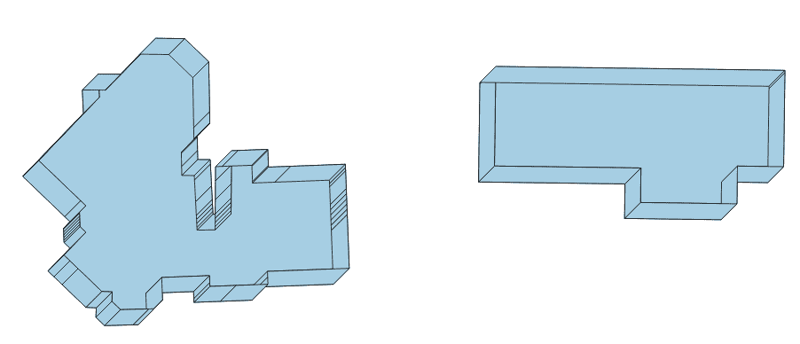

因此，借助*构建和提供 2.5D 建筑*配方，我们得到了挤压的建筑，但有一些额外的灵活性。

# 为 PostGIS 创建任意 3D 对象

3D 信息来源不仅来自 LiDAR，也不是纯粹从 2D 几何形状及其相关属性中合成，如*构建和提供 2.5D 建筑*和*使用 ST_Extrude 挤压建筑足迹*配方中所述，它们还可以根据计算机视觉原理创建。从图像之间相关关键点的关联计算 3D 信息的过程称为 SfM。

作为计算机视觉的概念，我们可以利用 SfM 以类似于人类大脑在 3D 中感知世界的方式生成 3D 信息，并将其进一步存储和处理在 PostGIS 数据库中。

计算机视觉是计算机科学中的一个学科，专注于从图像和视频中自动分析和推理。它被认为是一个开发算法的研究领域，这些算法以类似于人类视觉的方式解释世界。有关该领域的优秀总结可以在[`en.wikipedia.org/wiki/Computer_vision`](http://en.wikipedia.org/wiki/Computer_vision)找到。

许多开源项目已经成熟，用于解决 SfM 问题。其中最受欢迎的是 Bundler，可以在[`phototour.cs.washington.edu/bundler/`](http://phototour.cs.washington.edu/bundler/)找到，还有[`ccwu.me/vsfm/`](http://ccwu.me/vsfm/)的**VisualSFM**。这些工具的多个平台都有二进制文件，包括版本。这样的项目的优点是，可以使用一组简单的照片来重建 3D 场景。

对于我们的目的，我们将使用 VisualSFM 并跳过该软件的安装和配置。原因是 SfM 超出了 PostGIS 书籍详细介绍的范畴，我们将专注于如何在 PostGIS 中使用这些数据。

# 准备中

重要的是要理解，虽然 SfM 技术非常有效，但在将图像有效处理成点云的图像类型方面存在某些局限性。这些技术依赖于在后续图像之间找到匹配，因此可能会在处理平滑、缺少相机嵌入的 **Exchangeable Image File Format** (**EXIF**) 信息或来自手机相机的图像时遇到困难。

EXIF 标签是图像的元数据格式。这些标签中存储的通常是相机设置、相机类型、镜头类型以及其他与 SfM 提取相关的信息。

我们将从一个已知大部分可以工作的照片系列开始处理图像系列到点云，但随着你对 SfM 进行实验，你也可以输入你自己的照片系列。有关如何创建将产生 3D 模型的照片系列的优秀提示，可以在 [`www.youtube.com/watch?v=IStU-WP2XKs&t=348s`](https://www.youtube.com/watch?v=IStU-WP2XKs&t=348s) 和 [`www.cubify.com/products/capture/photography_tips.aspx`](http://www.cubify.com/products/capture/photography_tips.aspx) 找到。

# 如何操作...

从 [`ccwu.me/vsfm/`](http://ccwu.me/vsfm/) 下载 VisualSFM。在控制台终端中，执行以下命令：

```py
Visualsfm <IMAGES_FOLDER>
```

VisualSFM 将开始使用图像文件夹作为输入渲染 3D 模型。处理可能需要几个小时。完成后，它将返回一个点云文件。

我们可以在 **MeshLab** [`meshlab.sourceforge.net/`](http://meshlab.sourceforge.net/) 这样的程序中查看这些数据。有关如何使用 MeshLab 查看点云的优秀教程可以在 [`www.cse.iitd.ac.in/~mcs112609/Meshlab%20Tutorial.pdf`](http://www.cse.iitd.ac.in/~mcs112609/Meshlab%20Tutorial.pdf) 找到。

以下图像显示了在 MeshLab 中查看点云时的样子：

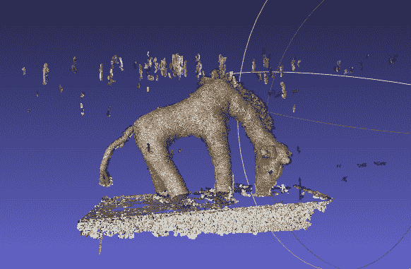

在 VisualSFM 的输出中，有一个扩展名为 `.ply` 的文件，例如，`giraffe.ply`（包含在本章源代码中）。如果你在文本编辑器中打开此文件，它看起来可能如下所示：

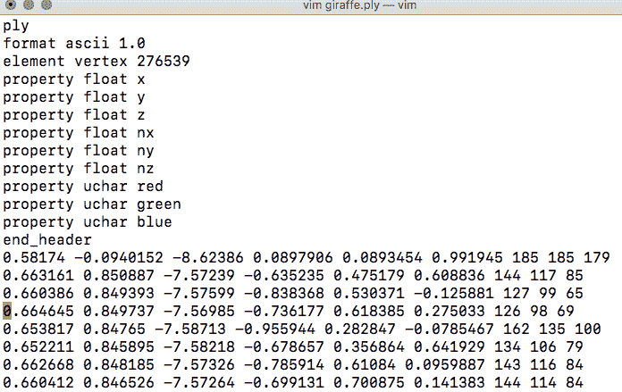

这是文件的头部部分。它指定了 `.ply` 格式、编码 `format ascii 1.0`、顶点数，以及所有返回数据的列名：`x`、`y`、`z`、`nx`、`ny`、`nz`、`red`、`green` 和 `blue`。

对于导入到 PostGIS，我们将导入所有字段，但将重点放在我们的点云的 `x`、`y` 和 `z` 上，以及查看颜色。对于我们的目的，此文件指定了相对的 `x`、`y` 和 `z` 坐标，以及每个点的颜色在通道 `red`、`green` 和 `blue` 中。这些颜色是 24 位颜色，因此它们可以具有介于 0 和 255 之间的整数值。

在接下来的食谱中，我们将创建一个 PDAL 管道，修改 JSON 结构读取器以读取`.ply`文件。查看本章中关于*导入 LiDAR 数据*的食谱，了解如何创建 PDAL 管道：

```py
{
  "pipeline": [{
    "type": "readers.ply",
    "filename": "/data/giraffe/giraffe.ply"
  }, {
    "type": "writers.pgpointcloud",
    "connection": "host='localhost' dbname='postgis-cookbook' user='me' 
     password='me' port='5432'",
    "table": "giraffe",
    "srid": "3734",
    "schema": "chp07"
  }]
}  
```

然后，我们在终端中执行以下操作：

```py
$ pdal pipeline giraffe.json"
```

这个输出将作为下一个食谱的输入。

# 将模型导出为 X3D 以供网络使用

在 PostGIS 数据库中输入 3D 数据，如果没有能力以某种可用的形式提取数据，那么这几乎就没有什么趣味。解决这个问题的方法之一是利用 PostGIS 将 3D 表格写入 X3D 格式的能力。

X3D 是用于显示 3D 数据的 XML 标准，通过网络工作得很好。对于那些熟悉**虚拟现实建模语言**（**VRML**）的人来说，X3D 是那个语言的下一代。

要在浏览器中查看 X3D，用户可以选择各种插件，或者他们可以利用 JavaScript API 来实现查看功能。我们将执行后者，因为它不需要用户配置即可工作。我们将使用 X3DOM 的 JavaScript 框架来完成这项工作。X3DOM 是 HTML5 和 3D 集成的演示，它使用**Web 图形库**（**WebGL**）；([`en.wikipedia.org/wiki/WebGL`](https://en.wikipedia.org/wiki/WebGL))来允许在浏览器中渲染和交互 3D 内容。这意味着我们的数据将不会在不支持 WebGL 的浏览器中显示。

# 准备工作

我们将使用前一个示例中的点云数据，以 X3D 格式提供服务。PostGIS 关于 X3D 的文档中包含了一个使用`ST_AsX3D`函数输出格式化 X3D 代码的示例：

```py
COPY(WITH pts AS (SELECT PC_Explode(pa) AS pt FROM chp07.giraffe) SELECT '
<X3D  
 showStat="false" showLog="false" x="0px" y="0px" width="800px" 
  height="600px">
  <Scene>
    <Transform>
      <Shape>' ||  ST_AsX3D(ST_Union(pt::geometry))  ||'</Shape>
    </Transform>
  </Scene>
</X3D>' FROM pts)
TO STDOUT WITH CSV;
```

我们包括了复制到`STDOUT WITH CSV`以进行原始代码的转储。用户可以将此查询保存为 SQL 脚本文件，并在控制台中执行它，以便将结果转储到文件中。例如：

```py
$ psql -U me -d postgis-cookbook -h localhost -f "x3d_query.sql" > result.html 
```

# 如何操作...

这个示例虽然完整地提供了纯 X3D，但需要额外的代码来允许在浏览器中查看。我们通过包含样式表和适当的 X3DOM 包含 XHTML 文档的标题来实现这一点：

```py
<link rel="stylesheet" type="text/css"   href="http://x3dom.org/x3dom/example/x3dom.css" />
<script type="text/javascript" src="img/x3dom.js"></script> 
```

生成 X3D 数据的 XHTML 的完整查询如下所示：

```py
COPY(WITH pts AS (
  SELECT PC_Explode(pa) AS pt FROM chp07.giraffe
)
SELECT regexp_replace('
  <!DOCTYPE html PUBLIC "-//W3C//DTD XHTML 1.0 Strict//EN"    "http://www.w3.org/TR/xhtml1/DTD/xhtml1-strict.dtd">
  <html >
    <head>
      <meta http-equiv="X-UA-Compatible" content="chrome=1" />
      <meta http-equiv="Content-Type" content="text/html;charset=utf-8"/>
      <title>Point Cloud in a Browser</title>
      <link rel="stylesheet" type="text/css"
       href="http://x3dom.org/x3dom/example/x3dom.css" />
      <script type="text/javascript"
       src="img/x3dom.js">
      </script>
    </head>
    <body>
      <h1>Point Cloud in the Browser</h1>
      <p>
        Use mouse to rotate, scroll wheel to zoom, and control 
        (or command) click to pan.
      </p>
      <X3D pl-k">       showStat="false" showLog="false" x="0px" y="0px" width="800px"
       height="600px">
        <Scene>
          <Transform>
            <Shape>' ||  ST_AsX3D(ST_Union(pt::geometry)) || '</Shape>
          </Transform>
        </Scene>
      </X3D>
    </body>
  </html>', E'[\\n\\r]+','', 'g')
FROM pts)TO STDOUT;
```

如果我们在最喜欢的浏览器中打开`.html`文件，我们将得到以下内容：

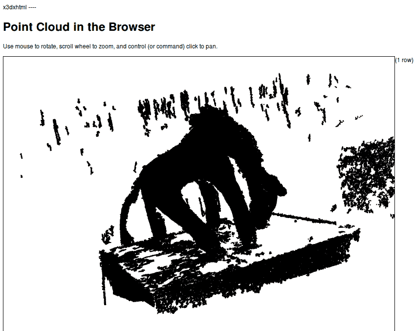

# 还有更多...

有些人可能希望将这个 X3D 转换作为一个函数使用，将几何形状输入到函数中，然后返回一个页面。这样，我们可以轻松地重用代码来处理其他表格。将 X3D 转换封装在函数中如下所示：

```py
CREATE OR REPLACE FUNCTION AsX3D_XHTML(geometry)
RETURNS character varying AS
$BODY$

SELECT regexp_replace(
  '
    <!DOCTYPE html PUBLIC "-//W3C//DTD XHTML 1.0 Strict//EN" 
     "http://www.w3.org/TR/xhtml1/DTD/xhtml1-strict.dtd">
    <html xmlns= "http://www.w3.org/1999/xhtml">
      <head>
        <meta http-equiv="X-UA-Compatible" content="chrome=1"/>
        <meta http-equiv="Content-Type" content="text/html;charset=utf-8"/>
        <title>Point Cloud in a Browser</title>
        <link rel="stylesheet" type="text/css"
         href="http://x3dom.org/x3dom/example/x3dom.css"/>
        <script type="text/javascript"
         src="img/x3dom.js">
        </script>
      </head>
      <body>
        <h1>Point Cloud in the Browser</h1>
        <p>
          Use mouse to rotate, scroll wheel to zoom, and control 
          (or command) click to pan.
        </p>
        <X3D xmlns="http://www.web3d.org/specifications/x3d-namespace" 
         showStat="false" showLog="false"  x="0px" y="0px" width="800px"
         height="600px">
          <Scene>
            <Transform>
              <Shape>'||  ST_AsX3D($1)  || '</Shape>
            </Transform>
          </Scene>
        </X3D>
      </body>
    </html>
  ', E'[\\n\\r]+' , '' , 'g' ) As x3dXHTML;
$BODY$
LANGUAGE sql VOLATILE
COST 100;
```

为了使函数能够工作，我们需要首先在几何参数上使用`ST_UNION`，然后将结果传递给`AsX3D_XHTML`函数：

```py
copy( 
  WITH pts AS ( 
    SELECT  
      PC_Explode(pa) AS pt  
    FROM giraffe 
  ) 
  SELECT AsX3D_XHTML(ST_UNION(pt::geometry)) FROM pts) to stdout; 
```

我们现在可以非常简单地直接从命令行或 Web 框架中生成适当的 XHTML。

# 使用 PostGIS 3D 重建无人机（UAV）图像足迹

作为数据收集器的**无人机系统**（**UAS**），也称为**无人机**（**UAVs**），其快速发展正在彻底改变各个领域的远程数据收集。在军事领域之外更广泛的应用障碍包括防止某些国家（如美国）飞行的监管框架，以及缺乏开源的后处理软件实现。在接下来的四个菜谱中，我们将尝试解决这两个障碍中的后者。

对于这个菜谱，我们将使用俄亥俄州交通运输部在辛尼卡县进行的无人机飞行元数据来绘制飞行覆盖范围。这些数据包含在本章的代码文件夹中。

这个菜谱的基本思路是估计无人机摄像头的视场，生成一个代表该视场的 3D 金字塔，并使用飞行星历（航向、俯仰角和滚转角）来估计地面覆盖。

# 开始

我们为飞行提供的元数据或星历包括无人机的航向、俯仰角和滚转角，以及其高度和位置：

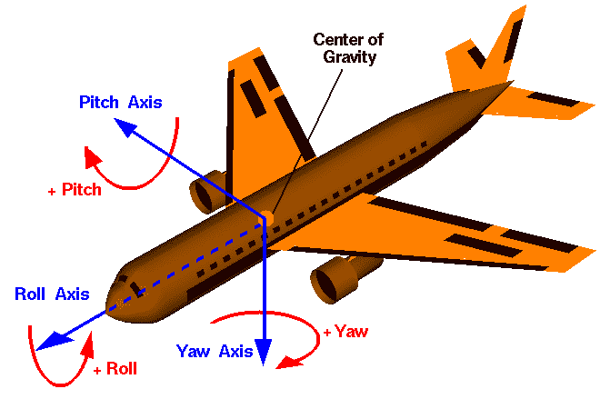

为了将这些星历转换为 PostGIS 术语，我们假设以下内容：

+   90 度减去俯仰角等于 `ST_RotateX`

+   负滚转等于 `ST_RotateY`

+   90 度减去航向等于 `ST_RotateZ`

为了执行我们的分析，我们需要外部函数。这些函数可以从[`github.com/smathermather/postgis-etc/tree/master/3D`](https://github.com/smathermather/postgis-etc/tree/master/3D)下载。

我们将使用 `ST_RotateX`、`ST_RotateY`（`ST_RotateX.sql` 和 `ST_RotateY.sql`）的修补版本，这些版本允许我们在输入点周围旋转几何形状，以及一个用于计算我们视场的函数 `pyramidMaker.sql`。PostGIS 的未来版本将内置这些版本的 `ST_RotateX` 和 `ST_RotateY`。我们还有一个名为 `ST_RotateXYZ` 的函数，它基于这些函数，并将通过允许我们同时指定三个旋转轴来简化我们的代码。

对于最后一步，我们需要执行体积交集（3D 交集的等效）的能力。为此，我们将使用 `volumetricIntersection.sql`，它允许我们仅返回交集的体积部分作为一个**三角不规则网络**（**TIN**）。

TIN 是表示表面和体积的 3D 表面模型，它是一个三角形的网格。

我们将按照以下方式安装功能：

```py
psql -U me -d postgis_cookbook -f ST_RotateX.sql
psql -U me -d postgis_cookbook -f ST_RotateY.sql
psql -U me -d postgis_cookbook -f ST_RotateXYZ.sql
psql -U me -d postgis_cookbook -f pyramidMaker.sql
psql -U me -d postgis_cookbook -f volumetricIntersection.sql
```

# 如何做到这一点...

为了计算视场足迹，我们将计算从视点到地面的矩形金字塔。这个金字塔需要根据无人机的滚转指向天顶的左右两侧，根据俯仰角从飞行器的前后移动，并根据航向相对于飞行器的移动方向进行定位。

`pyramidMaker`函数将为我们构建金字塔，而`ST_RotateXYZ`将旋转金字塔，以补偿翻滚、俯仰和方位。

以下图像是单个图像计算出的足迹示例地图。注意这个示例中轻微的向左倾斜，从上方看时导致金字塔看起来不对称：

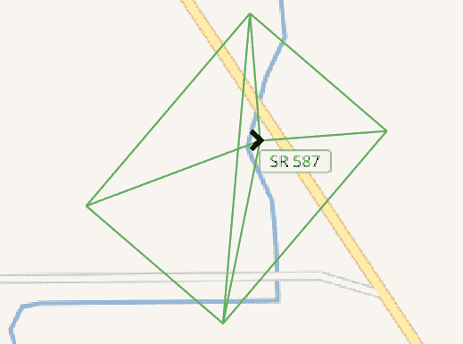

以下图像显示了无人机飞行轨迹叠加在等高线图上的总轨迹：

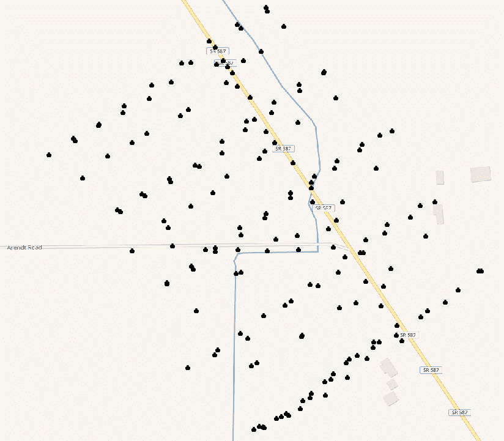

使用 QGIS 查看的飞行总轨迹

我们将编写一个函数来计算我们的足迹金字塔。为了输入函数，我们需要无人机位置作为几何形状（原点），俯仰、方位和翻滚，以及相机在`x`和`y`方向上的视场角。最后，我们需要无人机相对于地面的相对高度：

```py
CREATE OR REPLACE FUNCTION chp07.pbr(origin geometry, pitch numeric,  
  bearing numeric, roll numeric, anglex numeric, angley numeric,  
  height numeric) 
  RETURNS geometry AS 
$BODY$ 
```

我们的金字塔函数假设我们知道金字塔的底面积。我们最初不知道这个，所以我们将根据相机的视场角和无人机的高度来计算其大小：

```py
WITH widthx AS 
( 
  SELECT height / tan(anglex) AS basex 
), 
widthy AS 
( 
  SELECT height / tan(angley) AS basey 
), 
```

现在，我们有了足够的信息来构建我们的金字塔：

```py
iViewCone AS ( 
  SELECT pyramidMaker(origin, basex::numeric, basey::numeric, height)  
    AS the_geom 
    FROM widthx, widthy 
), 
```

我们需要以下代码来相对于俯仰、翻滚和方位旋转我们的视图：

```py
iViewRotated AS ( 
  SELECT ST_RotateXYZ(the_geom, pi() - pitch, 0 - roll, pi() -  
    bearing, origin) AS the_geom FROM iViewCone 
) 
SELECT the_geom FROM iViewRotated 
```

整个函数如下所示：

```py
CREATE OR REPLACE FUNCTION chp07.pbr(origin geometry, pitch numeric,  
  bearing numeric, roll numeric, anglex numeric, angley numeric,  
  height numeric) 
  RETURNS geometry AS 
$BODY$ 

WITH widthx AS 
( 
  SELECT height / tan(anglex) AS basex 
), 
widthy AS 
( 
  SELECT height / tan(angley) AS basey 
), 
iViewCone AS ( 
  SELECT pyramidMaker(origin, basex::numeric, basey::numeric, height)  
    AS the_geom 
    FROM widthx, widthy 
), 
iViewRotated AS ( 
  SELECT ST_RotateXYZ(the_geom, pi() - pitch, 0 - roll, pi() -  
    bearing, origin) AS the_geom FROM iViewCone 
) 
SELECT the_geom FROM iViewRotated 
; 
$BODY$ 
  LANGUAGE sql VOLATILE 
  COST 100; 
```

现在，为了使用我们的函数，让我们从本章源代码中包含的`uas_locations`形状文件中导入无人机位置：

```py
shp2pgsql -s 3734 -W LATIN1 uas_locations_altitude_hpr_3734 uas_locations | \PGPASSWORD=me psql -U me -d postgis-cookbook -h localhost
```

现在，我们可以为每个无人机位置计算一个估计的足迹：

```py
DROP TABLE IF EXISTS chp07.viewshed; 
CREATE TABLE chp07.viewshed AS 
SELECT 1 AS gid, roll, pitch, heading, fileName, chp07.pbr(ST_Force3D(geom), 
  radians(0)::numeric, radians(heading)::numeric, radians(roll)::numeric, 
  radians(40)::numeric, radians(50)::numeric, 
 ( (3.2808399 * altitude_a) - 838)::numeric) 
AS the_geom FROM uas_locations; 
```

如果你用你喜欢的桌面 GIS 导入此代码，例如 QGIS，你将能够看到以下内容：


使用地形模型，我们可以在这个分析中更进一步。由于我们的无人机足迹是体积的，我们首先加载地形模型。我们将从这个章节源代码中包含的`.backup`文件中加载它：

```py
pg_restore -h localhost -p 8000 -U me -d "postgis-cookbook" \ --schema chp07 --verbose "lidar_tin.backup"
```

接下来，我们将创建一个较小的`viewshed`表版本：

```py
DROP TABLE IF EXISTS chp07.viewshed; 
CREATE TABLE chp07.viewshed AS  
SELECT 1 AS gid, roll, pitch, heading, fileName, chp07.pbr(ST_Force3D(geom), radians(0)::numeric, radians(heading)::numeric, radians(roll) ::numeric, radians(40)::numeric, radians(50)::numeric, 1000::numeric) AS the_geom  
FROM uas_locations  
WHERE fileName = 'IMG_0512.JPG'; 
```

如果你用你喜欢的桌面 GIS 导入此代码，例如 QGIS，你将能够看到以下内容：

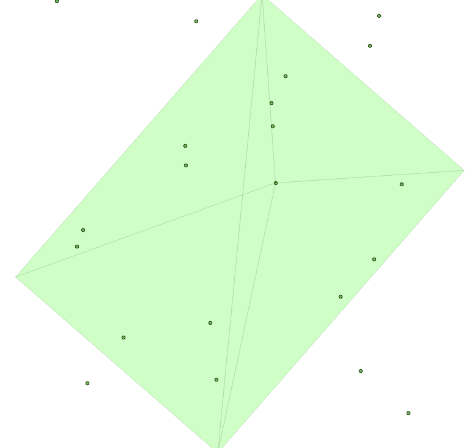

# PostGIS 中的无人机航摄影像测量 – 点云

我们将使用我们在之前名为“为 PostGIS 创建任意 3D 对象”的配方中使用的技巧，学习如何在 PostGIS 中创建和导入无人机衍生的点云。

在我们开始之前有一个注意事项是，虽然我们将处理地理空间数据，但我们将在相对空间中这样做，而不是在已知坐标系中。换句话说，这种方法将在任意坐标系中计算我们的数据集。`ST_Affine`可以与位置的字段测量相结合，将我们的数据转换到已知坐标系中，但这超出了本书的范围。

# 准备工作

与*为 PostGIS 创建任意 3D 对象*配方类似，我们将从一个图像系列转换成点云。然而，在本例中，我们的图像系列将来自无人机影像。下载本章代码文件夹中包含的图像系列`uas_flight`，并将其输入到 VisualSFM 中（有关如何使用此工具的更多信息，请参阅[`ccwu.me/vsfm/`](http://ccwu.me/vsfm/)）；为了检索点云，将其命名为`uas_points.ply`（此文件也包含在此文件夹中，以防您想使用它）。

PostGIS 的输入与之前相同。创建一个 JSON 文件，并使用 PDAL 将其存储到数据库中：

```py
{ 
  "pipeline": [{ 
    "type": "readers.ply", 
    "filename": "/data/uas_flight/uas_points.ply" 
  }, { 
    "type": "writers.pgpointcloud", 
    "connection": "host='localhost' dbname='postgis-cookbook' user='me'
                   password='me' port='5432'", 
    "table": "uas", 
    "schema": "chp07" 
  }] 
} 
```

# 如何操作...

现在，我们将点云数据复制到我们的表格中。请参考本章中的*导入 LiDAR 数据配方*以验证点云扩展对象表示：

```py
$ pdal pipeline uas_points.json
```

从 MeshLab ([`www.meshlab.net/`](http://www.meshlab.net/))中查看的`.ply`文件，这些数据非常有趣：

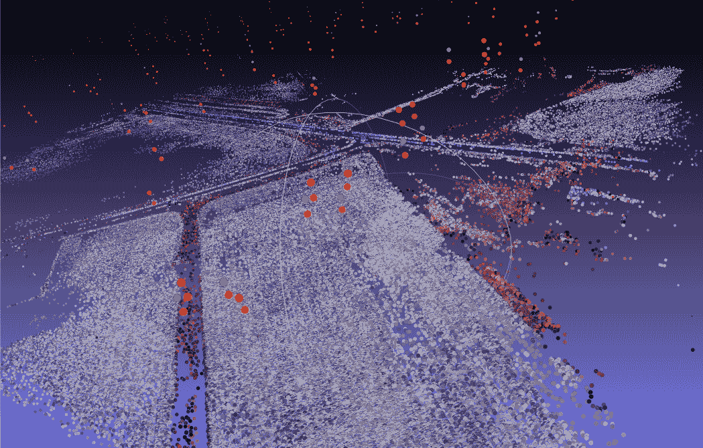

原始数据是彩色红外影像，因此植被显示为红色，农田和道路为灰色。注意天空中的亮色；这些是我们需要过滤掉的相机位置点。

下一步是从这些数据生成正射影像。

# PostGIS 中的无人机摄影测量 – 创建 DSM

如果我们不从输入中生成数字地形模型，则摄影测量示例将是不完整的。在这里，将输入点云分类为地面点、建筑点和植被点的完全严格解决方案是不可行的，但此配方将提供实现此类解决方案的基本框架。

在此配方中，我们将创建一个 3D TIN，它将代表点云的表面。

# 准备工作

在开始之前，`ST_DelaunayTriangles`仅在 PostGIS 2.1 使用 GEOS 3.4 时可用。这是本书中要求此类高级版本 PostGIS 和 GEOS 的少数配方之一。

# 如何操作...

`ST_DelaunayTriangles`将计算带有正确标志的 3D TIN：几何 `ST_DelaunayTriangles`（几何 `g1`，浮点 `tolerance`，整数 4 `flags`）：

```py
DROP TABLE IF EXISTS chp07.uas_tin; 
CREATE TABLE chp07.uas_tin AS WITH pts AS  
( 
   SELECT PC_Explode(pa) AS pt  
   FROM chp07.uas_flights 
) 
SELECT ST_DelaunayTriangles(ST_Union(pt::geometry), 0.0, 2) AS the_geom  
FROM pts; 
```

现在，我们有了数字表面模型的完整 TIN：

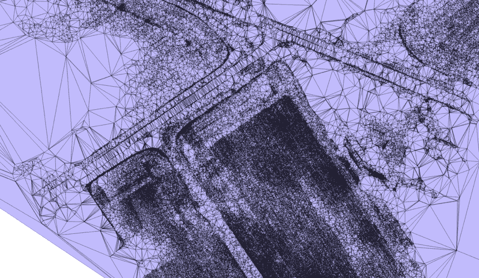
