# PostGIS 编程

在本章中，我们将涵盖以下主题：

+   使用 Psycopg 编写 PostGIS 向量数据

+   使用 OGR Python 绑定编写 PostGIS 向量数据

+   使用 PL/Python 编写 PostGIS 函数

+   使用 GeoNames 数据集进行地理编码和反向地理编码

+   使用 OSM 数据集和 trigrams 进行地理编码

+   使用 geopy 和 PL/Python 进行地理编码

+   使用 Python 和 GDAL 导入 NetCDF 数据集

# 简介

有几种方法可以编写 PostGIS 程序，在本章中我们将看到其中的一些。你将主要在本章中使用 Python 语言。Python 是一种出色的语言，拥有大量的 GIS 和科学库，可以与 PostGIS 结合编写出色的地理空间应用程序。

如果你刚开始接触 Python，你可以通过这些优秀的网络资源快速变得高效：

+   官方的 Python 教程在 [`docs.python.org/2/tutorial/`](http://docs.python.org/2/tutorial/)

+   流行的 *深入 Python* 书籍在 [`www.diveintopython.net/`](http://www.diveintopython.net/)

你可以将 Python 与一些优秀且流行的库结合起来，例如：

+   **Psycopg**：这是最完整且最受欢迎的 PostgreSQL Python DB API 实现；请参阅 [`initd.org/psycopg/`](http://initd.org/psycopg/)

+   **GDAL**：用于在 Python 脚本中解锁强大的 GDAL 库；请参阅 [`www.gdal.org/gdal_tutorial.html`](http://www.gdal.org/gdal_tutorial.html)

+   **requests**：这是一个方便的 Python 标准库，用于管理 HTTP 事务，例如打开 URL

+   **simplejson**：这是一个简单且快速的 JSON 编码器/解码器

本章中的食谱将涵盖一些其他有用的地理空间 Python 库，如果你正在开发地理空间应用程序，这些库值得一看。在这些 Python 库中，包括以下库：

+   **Shapely**：这是用于操作和分析平面几何对象的 GEOS 库的 Python 接口：[`toblerity.github.io/shapely/`](http://toblerity.github.io/shapely/)

+   **Fiona**：这是一个非常轻量级的 OGR Python API，可以用作本章中使用的 OGR 绑定的替代品，以管理向量数据集：[`github.com/Toblerity/Fiona`](https://github.com/Toblerity/Fiona)

+   **Rasterio**：这是一个 Pythonic 的 GDAL Python API，可以用作本章中使用的 GDAL 绑定的替代品，以管理栅格数据集：[`github.com/mapbox/rasterio`](https://github.com/mapbox/rasterio)

+   **pyproj**：这是到 PROJ.4 库的 Python 接口：[`pypi.python.org/pypi/pyproj`](https://pypi.python.org/pypi/pyproj)

+   **Rtree**：这是 `ctype` Python 包装器到 `libspatialindex` 库，提供了一些对某些类型的地理空间开发非常有用的空间索引功能：[`toblerity.github.io/rtree/`](http://toblerity.github.io/rtree/)

在第一个小节中，你将编写一个程序，使用 Python 及其实用工具（如`psycopg`、`requests`和`simplejson`）从网络获取天气数据并将其导入 PostGIS。

在第二个小节中，我们将引导你使用 Python 和 GDAL OGR Python 绑定库创建一个脚本，用于使用 GeoNames 网络服务之一对地名列表进行地理编码。

然后，你将使用 PL/Python 语言为 PostGIS 编写一个 Python 函数，查询[`openweathermap.org/`](http://openweathermap.org/) 网络服务，该服务已在第一个小节中使用，以计算 PostGIS 几何体的天气情况，并在 PostgreSQL 函数内部进行。

在第四个小节中，你将创建两个 PL/pgSQL PostGIS 函数，这些函数将允许你使用 GeoNames 数据集执行地理编码和反向地理编码。

在此之后，有一个小节，你将使用导入到 PostGIS 中的`OpenStreetMap`街道数据集，使用 Python 实现一个非常基本的 Python 类，以便为类的消费者提供使用 PostGIS 三重支持的地标实现。

第六个小节将展示如何使用 geopy 库创建一个 PL/Python 函数，使用网络地理编码 API（如 Google Maps、Yahoo! Maps、Geocoder、GeoNames 等）进行地址地理编码。

在本章的最后一个小节中，你将创建一个 Python 脚本，使用 GDAL Python 绑定将`netCDF`格式的数据导入 PostGIS。

在开始本章的小节之前，让我们先看看一些注意事项。

如果你使用 Linux 或 macOS，请按照以下步骤操作：

1.  创建一个 Python `virtualenv` ([`www.virtualenv.org/en/latest/`](http://www.virtualenv.org/en/latest/))，以保持一个 Python 隔离环境，用于本书中所有 Python 小节的 Python 脚本，并激活它。请在中央目录中创建它，因为你将需要使用它来编写本书中大多数 Python 小节的 Python 脚本：

```py
      $ cd ~/virtualenvs
      $ virtualenv --no-site-packages postgis-cb-env
      $ source postgis-cb-env/bin/activate
```

1.  一旦激活，你就可以安装本章小节所需的 Python 库：

```py
      $ pip install simplejson
      $ pip install psycopg2
      $ pip install numpy
      $ pip install requests
      $ pip install gdal
      $ pip install geopy
```

1.  如果你刚开始使用虚拟环境，并且想知道库安装在哪里，你应该在我们的开发箱中的`virtualenv`目录中找到所有内容。你可以使用以下命令查找库：

```py
      $ ls /home/capooti/virtualenv/postgis-cb-env/lib/
           python2.7/site-packages
```

如果你想知道前面的命令行发生了什么，那么`virtualenv`是一个用于创建隔离 Python 环境的工具，你可以在[`www.virtualenv.org`](http://www.virtualenv.org)上找到更多关于这个工具的信息，而`pip` ([`www.pip-installer.org`](http://www.pip-installer.org))是一个用于安装和管理用 Python 编写的软件包的包管理系统。

如果你使用 Windows，请按照以下步骤操作：

1.  获取 Python 以及本章小节所需的所有库的最简单方法是使用**OSGeo4W**，它是 Windows 上流行的开源地理空间软件的二进制发行版。你可以从[`trac.osgeo.org/osgeo4w/`](http://trac.osgeo.org/osgeo4w/)下载它。

1.  在我们编写这本书的时候，Windows 盒子中的 OSGeo4W shell 附带 Python 2.7，GDAL 2.2 Python 绑定，simplejson，psycopg2 和 numpy。你只需要安装 geopy。

1.  安装 geopy 以及最终向 OSGeo4W shell 添加更多 Python 库的最简单方法是按照[`www.pip-installer.org/en/latest/installing.html`](http://www.pip-installer.org/en/latest/installing.html)中找到的说明安装`setuptools`和`pip`。打开 OSGeo4W shell，只需输入以下命令：

```py
      > python ez_setup.py
      > python get-pip.py
      > pip install requests
      > pip install geopy
```

# 使用 Psycopg 编写 PostGIS 矢量数据

在这个菜谱中，你将使用 Python 结合 Psycopg，这是 Python 中最流行的 PostgreSQL 数据库库，以便使用 SQL 语言将一些数据写入 PostGIS。

你将编写一个过程来导入美国人口最多的城市的气象数据。你将从[`www.openweatherdata.org/`](http://www.openweatherdata.org/)导入此类气象数据，这是一个提供免费气象数据和预报 API 的 Web 服务。你将要编写的过程将迭代每个主要美国城市，并使用[`www.openweatherdata.org/`](http://www.openweatherdata.org/) Web 服务 API 从最近的气象站获取其实际温度，以 JSON 格式获取输出。（如果你对 JSON 格式不熟悉，可以在[`www.json.org/`](http://www.json.org/)找到有关它的详细信息。）

你还将生成一个新的 PostGIS 图层，包含每个城市最近的 10 个气象站。

# 准备工作

1.  使用以下命令为本章的菜谱创建数据库模式：

```py
      postgis_cookbook=# CREATE SCHEMA chp08;
```

1.  从[`nationalmap.gov/`](https://nationalmap.gov/)网站下载 USA 城市的 shapefile，地址为[`dds.cr.usgs.gov/pub/data/nationalatlas/citiesx020_nt00007.tar.gz`](http://dds.cr.usgs.gov/pub/data/nationalatlas/citiesx020_nt00007.tar.gz)（此存档也包含在本书的数据集中，与代码包一起提供），将其提取到`working/chp08`，并在 PostGIS 中导入它，过滤掉人口少于 100,000 的城市：

```py
      $ ogr2ogr -f PostgreSQL -s_srs EPSG:4269 -t_srs EPSG:4326 
      -lco GEOMETRY_NAME=the_geom -nln chp08.cities 
      PG:"dbname='postgis_cookbook' user='me' 
      password='mypassword'" -where "POP_2000 $ 100000" citiesx020.shp

```

1.  使用以下命令为每个城市添加一个存储温度的`real`字段：

```py
    postgis_cookbook=# ALTER TABLE chp08.cities 
    ADD COLUMN temperature real;
```

1.  如果你使用 Linux，请确保遵循本章的初始说明并创建一个 Python 虚拟环境，以便为本书中所有 Python 菜谱保持一个 Python 隔离的环境。然后，激活它：

```py
      $ source postgis-cb-env/bin/activate
```

# 如何做到这一点...

执行以下步骤：

1.  创建以下表格以存储气象站的数据：

```py
 CREATE TABLE chp08.wstations 
      ( 
        id bigint NOT NULL, 
        the_geom geometry(Point,4326), 
        name character varying(48), 
        temperature real, 
        CONSTRAINT wstations_pk PRIMARY KEY (id ) 
      ); 
```

1.  在[`openweathermap.org`](https://openweathermap.org)创建一个账户以获取 API 密钥。然后，检查你将要使用的 Web 服务的 JSON 响应。如果你想从一个点（城市质心）获取最近的 10 个气象站，你需要运行的请求如下（在浏览器中测试它）：[`api.openweathermap.org/data/2.5/find?lat=55&lon=37&cnt=10&appid=YOURKEY`](http://api.openweathermap.org/data/2.5/find?lat=55&lon=37&cnt=10&appid=YOURKEY)

1.  你应该得到以下 JSON 响应（最近的 10 个站点及其相对数据按距离点坐标的顺序排列，在这种情况下，坐标为 `lon=37` 和 `lat=55`）：

```py
        { 
          "message": "accurate", 
          "cod": "200", 
          "count": 10, 
          "list": [ 
            { 
              "id": 529315, 
              "name": "Marinki", 
              "coord": { 
              "lat": 55.0944, 
              "lon": 37.03 
            }, 
            "main": { 
              "temp": 272.15, 
              "pressure": 1011, 
              "humidity": 80, 
              "temp_min": 272.15, 
              "temp_max": 272.15 
            },       "dt": 1515114000, 
            "wind": { 
              "speed": 3, 
              "deg": 140 
            }, 
            "sys": { 
              "country": "" 
            }, 
            "rain": null, 
            "snow": null, 
            "clouds": { 
              "all": 90 
            }, 
            "weather": [ 
              { 
                "id": 804, 
                "main": "Clouds", 
                "description": "overcast clouds", 
                "icon": "04n" 
              } 
            ] 
        }, 
```

1.  现在，创建一个将提供所需输出的 Python 程序，并将其命名为 `get_weather_data.py`：

```py
        import sys 
        import requests 
        import simplejson as json 
        import psycopg2 

        def GetWeatherData(lon, lat, key): 
          """ 
            Get the 10 closest weather stations data for a given point. 
          """ 
          # uri to access the JSON openweathermap web service 
          uri = ( 
            'https://api.openweathermap.org/data/2.5/find?
             lat=%s&lon=%s&cnt=10&appid=%s' 
            % (lat, lon, key)) 
          print 'Fetching weather data: %s' % uri 
          try: 
            data = requests.get(uri) 
            print 'request status: %s' % data.status_code 
            js_data = json.loads(data.text) 
            return js_data['list'] 
          except: 
            print 'There was an error getting the weather data.' 
            print sys.exc_info()[0] 
            return [] 

        def AddWeatherStation(station_id, lon, lat, name, temperature): 
          """ 
            Add a weather station to the database, but only if it does 
            not already exists. 
          """ 
          curws = conn.cursor() 
          curws.execute('SELECT * FROM chp08.wstations WHERE id=%s',
                        (station_id,)) 
          count = curws.rowcount 
          if count==0: # we need to add the weather station 
              curws.execute( 
            """INSERT INTO chp08.wstations (id, the_geom, name,
               temperature) VALUES (%s, ST_GeomFromText('POINT(%s %s)',
               4326), %s, %s)""",
            (station_id, lon, lat, name, temperature) 
          ) 
          curws.close() 
          print 'Added the %s weather station to the database.' % name 
          return True 
        else: # weather station already in database 
          print 'The %s weather station is already in the database.' % name 
          return False 

        # program starts here 
        # get a connection to the database 
        conn = psycopg2.connect('dbname=postgis_cookbook user=me 
                                 password=password') 
        # we do not need transaction here, so set the connection 
        # to autocommit mode 
        conn.set_isolation_level(0) 

        # open a cursor to update the table with weather data 
        cur = conn.cursor() 

        # iterate all of the cities in the cities PostGIS layer, 
        # and for each of them grap the actual temperature from the 
        # closest weather station, and add the 10 
        # closest stations to the city to the wstation PostGIS layer 
        cur.execute("""SELECT ogc_fid, name, 
          ST_X(the_geom) AS long, ST_Y(the_geom) AS lat
          FROM chp08.cities;""") 
        for record in cur: 
          ogc_fid = record[0] 
          city_name = record[1] 
          lon = record[2] 
          lat = record[3] 
          stations = GetWeatherData(lon, lat, 'YOURKEY') 
          print stations 
          for station in stations: 
            print station 
            station_id = station['id'] 
            name = station['name'] 
            # for weather data we need to access the 'main' section in the
            # json 'main': {'pressure': 990, 'temp': 272.15, 'humidity': 54} 
            if 'main' in station: 
              if 'temp' in station['main']: 
                temperature = station['main']['temp'] 
            else: 
              temperature = -9999 
              # in some case the temperature is not available 
            # "coord":{"lat":55.8622,"lon":37.395} 
            station_lat = station['coord']['lat'] 
            station_lon = station['coord']['lon'] 
            # add the weather station to the database 
            AddWeatherStation(station_id, station_lon, station_lat, 
                              name, temperature) 
            # first weather station from the json API response is always 
            # the closest to the city, so we are grabbing this temperature 
            # and store in the temperature field in cities PostGIS layer 
            if station_id == stations[0]['id']: 
              print 'Setting temperature to %s for city %s' 
                    % (temperature, city_name) 
              cur2 = conn.cursor() 
              cur2.execute( 
                'UPDATE chp08.cities SET temperature=%s WHERE ogc_fid=%s', 
                (temperature, ogc_fid)) 
              cur2.close() 

        # close cursor, commit and close connection to database 
        cur.close() 
        conn.close() 
```

1.  运行 Python 程序：

```py
      (postgis-cb-env)$ python get_weather_data.py
      Added the PAMR weather station to the database.
      Setting temperature to 268.15 for city Anchorage
      Added the PAED weather station to the database.
      Added the PANC weather station to the database.
      ...
      The KMFE weather station is already in the database.
      Added the KOPM weather station to the database.
      The KBKS weather station is already in the database.
```

1.  检查你刚刚编写的 Python 程序的输出。使用你最喜欢的 GIS 桌面工具打开两个 PostGIS 图层 `cities` 和 `wstations`，并调查结果。以下截图显示了在 QGIS 中的样子：

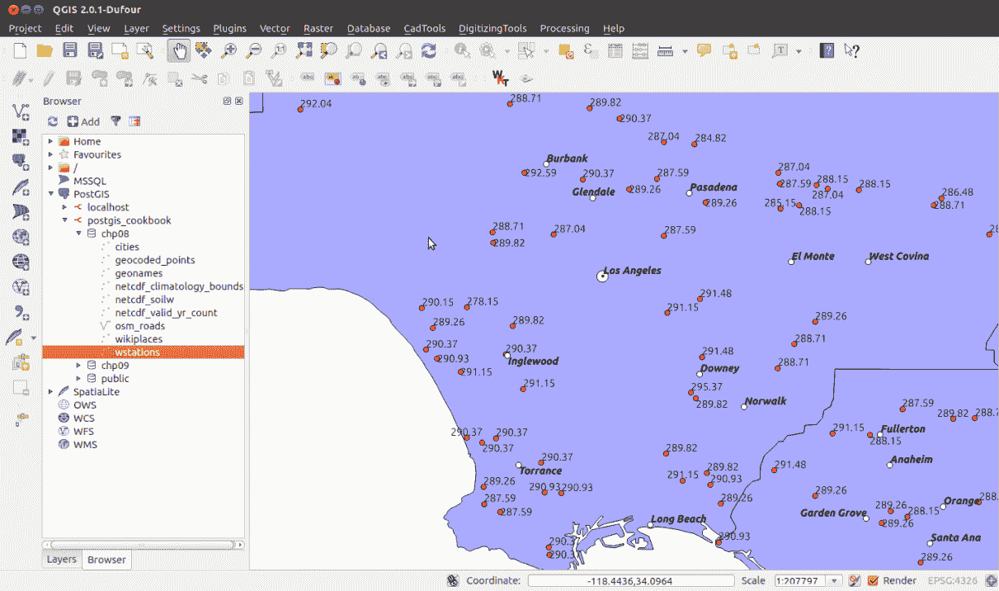

# 它是如何工作的...

**Psycopg** 是 Python 中最流行的 PostgreSQL 适配器，它可以用来创建发送 SQL 命令到 PostGIS 的 Python 脚本。在这个菜谱中，你创建了一个 Python 脚本，使用流行的 **JSON** 格式从 [`openweathermap.org/`](https://openweathermap.org/) 网络服务器查询天气数据，然后使用这些数据更新两个 PostGIS 图层。

对于其中一个图层 `cities`，使用离城市最近的气象站的温度数据来更新 `temperature` 字段。为此，你使用了 `UPDATE SQL` 命令。另一个图层 `wstations` 在从气象数据中识别到新的气象站并将其插入图层时更新。在这种情况下，你使用了 `INSERT SQL` 语句。

这是对脚本行为的快速概述（更多详细信息可以在 Python 代码中的注释中找到）。一开始，使用 Psycopg 的 `connection` 对象创建了一个 PostgreSQL 连接。`connection` 对象是通过主要连接参数（`dbname`、`user` 和 `password`）创建的，而 `server name` 和 `port` 的默认值未指定；相反，使用 `localhost` 和 `5432`。连接行为设置为 `auto commit`，这样 Psycopg 执行的任何 SQL 都将立即运行，而不会嵌入事务中。

使用游标，你首先迭代 `cities` PostGIS 图层中的所有记录；对于每个城市，你需要从 [`openweathermap.org/`](https://openweathermap.org/) 网络服务器获取温度。为此，对于每个城市，你调用 `GetWeatherData` 方法，并将城市的坐标传递给它。该方法使用 `requests` 库查询服务器，并使用 `simplejson` Python 库解析 JSON 响应。

你应该将 URL 请求发送到 `try...catch` 块。这样，如果网络服务（互联网连接不可用、HTTP 状态码不同于 200 或其他任何问题）出现任何问题，进程可以安全地继续使用下一个城市的（迭代）数据。

JSON 响应包含根据请求的信息，关于城市最近的 10 个气象站。你将使用离城市最近的第一个气象站的信息来设置城市的 `temperature` 字段。

然后，你将迭代所有的 `station` JSON 对象，并使用 `AddWeatherStation` 方法在 `wstation` PostGIS 图层中创建一个气象站，但前提是不存在具有相同 `id` 的气象站。

# 使用 OGR Python 绑定写入 PostGIS 向量数据

在这个菜谱中，你将使用 Python 和 GDAL/OGR 库的 Python 绑定来创建一个脚本来使用 GeoNames 网络服务之一对地点名称列表进行地理编码（[`www.geonames.org/export/ws-overview.html`](http://www.geonames.org/export/ws-overview.html)）。你将使用 **Wikipedia Fulltext Search** 网络服务（[`www.geonames.org/export/wikipedia-webservice.html#wikipediaSearch`](http://www.geonames.org/export/wikipedia-webservice.html#wikipediaSearch)），该服务对于给定的搜索字符串返回匹配该搜索字符串的地点坐标作为输出，以及来自维基百科的一些其他有用属性，包括维基百科的 `页面标题` 和 `url`。

脚本首先应该创建一个名为 `wikiplaces` 的 PostGIS 点图层，其中将存储由网络服务返回的所有位置及其属性。

这个菜谱应该为你提供使用其他类似网络服务的基础，例如 Google Maps、Yahoo! BOSS Geo Services 等，以类似的方式获取结果。

在开始之前，请注意 GeoNames 的使用条款：[`www.geonames.org/export/`](http://www.geonames.org/export/)。简而言之，在撰写本文时，每个应用程序（通过 `username` 参数识别）每天有 30,000 个信用额的限制；每小时限制为 2,000 个信用额。信用额是大多数服务的网络服务请求命中。

你将使用 GDAL/OGR Python 绑定（[`trac.osgeo.org/gdal/wiki/GdalOgrInPython`](http://trac.osgeo.org/gdal/wiki/GdalOgrInPython)）生成包含地理编码地点名称的 PostGIS 表。

# 准备工作

1.  要访问 GeoNames 网络服务，你需要在 [`www.geonames.org/login`](http://www.geonames.org/login) 创建一个用户。我们为这个菜谱创建的用户是 `postgis`；每次查询 GeoNames 网络服务 URL 时，你需要将其更改为你的用户名。

1.  如果你使用的是 Windows，请确保已按照本章初始说明中建议安装 OSGeo4W。

1.  如果你使用的是 Linux，请遵循本章的初始说明，创建一个 Python `virtualenv`，以便为本书中所有 Python 菜谱保持一个独立的 Python 环境，并激活它：

```py
      $ source postgis-cb-env/bin/activate
```

1.  一旦激活，如果你还没有这样做，你必须安装此菜谱所需的 `gdal` 和 `simplejson` Python 包：

```py
      (postgis-cb-env)$ pip install gdal
      (postgis-cb-env)$ pip install simplejson
```

# 如何做到这一点...

执行以下步骤：

1.  首先，使用以下请求自行测试网络服务和它们的 JSON 输出（根据需要更改 `q` 和 `username` 参数）：[`api.geonames.org/wikipediaSearchJSON?formatted=true&q=london&maxRows=10&username=postgis&style=full`](http://api.geonames.org/wikipediaSearchJSON?formatted=true&q=london&maxRows=10&username=postgis&style=full).

你应该得到以下 JSON 输出：

```py
        {    
          "geonames": [ 
            { 
              "summary": "London is the capital and most populous city of 
                 England and United Kingdom. Standing on the River Thames,
                 London has been a major settlement for two millennia, 
                 its history going back to its founding by the Romans, 
                 who named it Londinium (...)", 
              "elevation": 8, 
              "geoNameId": 2643743, 
              "feature": "city", 
              "lng": -0.11832, 
              "countryCode": "GB", 
              "rank": 100, 
              "thumbnailImg": "http://www.geonames.org/img/wikipedia/
                               43000/thumb-42715-100.jpg", 
              "lang": "en", 
              "title": "London", 
              "lat": 51.50939, 
              "wikipediaUrl": "en.wikipedia.org/wiki/London" 
            }, 
            { 
              "summary": "New London is a city and a port of entry on the 
                 northeast coast of the United States. It is located at 
                 the mouth of the Thames River in New London County, 
                 southeastern Connecticut. New London is located about from 
                 the state capital of Hartford, 
                 from Boston, Massachusetts, from Providence, Rhode (...)", 
              "elevation": 27, 
              "feature": "landmark", 
              "lng": -72.10083333333333, 
              "countryCode": "US", 
              "rank": 100, 
              "thumbnailImg": "http://www.geonames.org/img/wikipedia/
                              160000/thumb-159123-100.jpg", 
              "lang": "en", 
              "title": "New London, Connecticut", 
              "lat": 41.355555555555554, 
              "wikipediaUrl": "en.wikipedia.org/wiki/
                               New_London%2C_Connecticut" 
            },... 
          ]
        } 
```

1.  如您从 GeoNames 网络服务的 JSON 输出中看到的，对于给定的查询字符串（一个位置名称），您会得到一个与该位置相关的 Wikipedia 页面的列表，格式为 JSON。对于代表 Wikipedia 页面的每个 JSON 对象，您可以访问属性，例如 `page title`（页面标题）、`summary`（摘要）、`url` 和位置的 `coordinates`（坐标）。

1.  现在，创建一个名为 `working/chp08/names.txt` 的文本文件，其中包含您希望从 Wikipedia 全文搜索网络服务中地理编码的位置名称。添加一些地点名称，例如（在 Windows 中，使用记事本等文本编辑器）：

```py
      $ vi names.txt

      London
      Rome
      Boston
      Chicago
      Madrid
      Paris
      ...
```

1.  现在，在 `working/chp08/` 下创建一个名为 `import_places.py` 的文件，并将此菜谱的 Python 脚本添加到其中。以下是如何编写脚本（您应该可以通过阅读内联注释和 *How it works...* 部分来理解它）：

```py
        import sys 
        import requests 
        import simplejson as json 
        from osgeo import ogr, osr 

        MAXROWS = 10 
        USERNAME = 'postgis' #enter your username here 

        def CreatePGLayer(): 
          """ 
            Create the PostGIS table. 
          """ 
          driver = ogr.GetDriverByName('PostgreSQL') 
          srs = osr.SpatialReference() 
          srs.ImportFromEPSG(4326) 
          ogr.UseExceptions() 
          pg_ds = ogr.Open("PG:dbname='postgis_cookbook' host='localhost' 
             port='5432' user='me' password='password'", update = 1) 
          pg_layer = pg_ds.CreateLayer('wikiplaces', srs = srs, 
                geom_type=ogr.wkbPoint, options = [ 
            'DIM=3', 
             # we want to store the elevation value in point z coordinate 
            'GEOMETRY_NAME=the_geom', 
            'OVERWRITE=YES', 
            # this will drop and recreate the table every time 
            'SCHEMA=chp08', 
          ]) 
          # add the fields 
          fd_title = ogr.FieldDefn('title', ogr.OFTString) 
          pg_layer.CreateField(fd_title) 
          fd_countrycode = ogr.FieldDefn('countrycode', ogr.OFTString) 
          pg_layer.CreateField(fd_countrycode) 
          fd_feature = ogr.FieldDefn('feature', ogr.OFTString) 
          pg_layer.CreateField(fd_feature) 
          fd_thumbnail = ogr.FieldDefn('thumbnail', ogr.OFTString) 
          pg_layer.CreateField(fd_thumbnail) 
          fd_wikipediaurl = ogr.FieldDefn('wikipediaurl', ogr.OFTString) 
          pg_layer.CreateField(fd_wikipediaurl) 
          return pg_ds, pg_layer 

        def AddPlacesToLayer(places): 
        """ 
          Read the places dictionary list and add features in the 
          PostGIS table for each place. 
        """ 
        # iterate every place dictionary in the list 
        print "places: ", places 
        for place in places: 
          lng = place['lng'] 
          lat = place['lat'] 
          z = place.get('elevation') if 'elevation' in place else 0 
          # we generate a point representation in wkt, 
          # and create an ogr geometry 
          point_wkt = 'POINT(%s %s %s)' % (lng, lat, z) 
          point = ogr.CreateGeometryFromWkt(point_wkt) 
          # we create a LayerDefn for the feature using the one 
          # from the layer 
          featureDefn = pg_layer.GetLayerDefn() 
          feature = ogr.Feature(featureDefn) 
          # now time to assign the geometry and all the  
          # other feature's fields, if the keys are contained 
          # in the dictionary (not always the GeoNames 
          # Wikipedia Fulltext Search contains all of the information) 
          feature.SetGeometry(point) 
          feature.SetField('title', 
            place['title'].encode("utf-8") if 'title' in place else '') 
          feature.SetField('countrycode', 
            place['countryCode'] if 'countryCode' in place else '') 
          feature.SetField('feature', 
            place['feature'] if 'feature' in place else '') 
          feature.SetField('thumbnail', 
            place['thumbnailImg'] if 'thumbnailImg' in place else '') 
          feature.SetField('wikipediaurl', 
            place['wikipediaUrl'] if 'wikipediaUrl' in place else '') 
          # here we create the feature (the INSERT SQL is issued here) 
          pg_layer.CreateFeature(feature) 
          print 'Created a places titled %s.' % place['title'] 

        def GetPlaces(placename): 
          """ 
            Get the places list for a given placename. 
          """ 
          # uri to access the JSON GeoNames Wikipedia Fulltext Search 
          # web service 
          uri = ('http://api.geonames.org/wikipediaSearchJSON?
              formatted=true&q=%s&maxRows=%s&username=%s&style=full' 
              % (placename, MAXROWS, USERNAME)) 
          data = requests.get(uri) 
          js_data = json.loads(data.text) 
          return js_data['geonames'] 

        def GetNamesList(filepath): 
          """ 
            Open a file with a given filepath containing place names 
            and return a list. 
          """ 
          f = open(filepath, 'r') 
          return f.read().splitlines() 

        # first we need to create a PostGIS table to contains the places 
        # we must keep the PostGIS OGR dataset and layer global, 
        # for the reasons 
        # described here: http://trac.osgeo.org/gdal/wiki/PythonGotchas 
        from osgeo import gdal 
        gdal.UseExceptions() 
        pg_ds, pg_layer = CreatePGLayer()
        try: 
          # query geonames for each name and store found 
          # places in the table 
          names = GetNamesList('names.txt') 
          print names 
            for name in names: 
            AddPlacesToLayer(GetPlaces(name)) 
        except Exception as e: 
          print(e) 
          print sys.exc_info()[0] 
```

1.  现在，执行 Python 脚本：

```py
      (postgis-cb-env)$ python import_places.py
```

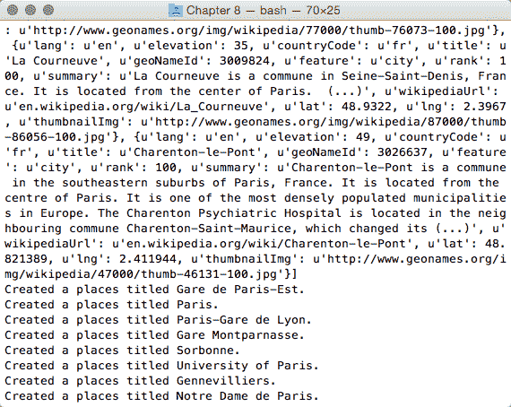

1.  使用 SQL 测试表是否正确创建并填充，并使用您喜欢的 GIS 桌面工具显示该层：

```py
      postgis_cookbook=# select ST_AsText(the_geom), title,
        countrycode, feature from chp08.wikiplaces;
```

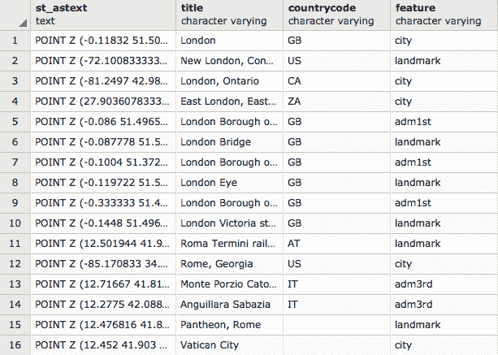

```py
 (60 rows) 
```

# How it works...

此 Python 脚本使用 `requests` 和 `simplejson` 库从 GeoNames 的 `wikipediaSearchJSON` 网络服务获取数据，并使用 GDAL/OGR 库在 PostGIS 数据库中存储地理信息。

首先，您创建一个 PostGIS 点表来存储地理数据。这是使用 GDAL/OGR 绑定完成的。您需要实例化一个 OGR PostGIS 驱动程序（[`www.gdal.org/drv_pg.html`](http://www.gdal.org/drv_pg.html)），从该驱动程序可以实例化一个数据集以使用指定的连接字符串连接到您的 `postgis_cookbook` 数据库。

连接字符串中的 `update` 参数指定 GDAL 驱动程序您将打开数据集以进行更新。

从 PostGIS 数据集中，我们创建了一个名为 `wikiplaces` 的 PostGIS 层，该层将使用 *WGS 84* 空间参考系统（`srs.ImportFromEPSG(4326)`）存储点（`geom_type=ogr.wkbPoint`）。在创建层时，我们还指定了其他参数，例如 `dimension`（`3`，因为你想存储 `z` 值），`GEOMETRY_NAME`（几何字段的名称）和 `schema`。创建层后，你可以使用 `CreateField` 层方法创建所有存储信息所需的字段。每个字段都将有一个特定的 `name` 和 `datatype`（在这种情况下，所有这些都是 `ogr.OFTString`）。

层创建完成后（请注意，我们需要在整个脚本中始终保持`pg_ds`和`pg_layer`对象处于上下文中，正如在[`trac.osgeo.org/gdal/wiki/PythonGotchas`](http://trac.osgeo.org/gdal/wiki/PythonGotchas)中所述），您可以使用`urllib2`库查询`names.txt`文件中每个地点名称的 GeoNames 网络服务。

我们使用`simplejson`库解析了 JSON 响应，然后迭代了 JSON 对象列表，并为 JSON 输出中的每个对象在 PostGIS 层中添加了一个特征。对于每个元素，我们使用`ogr.CreateGeometryFromWkt`方法创建了一个具有点`wkt`几何形状的特征（使用`lng`、`lat`和`elevation`对象属性），并使用特征`setField`方法（`title`、`countryCode`等）更新了其他字段，使用 GeoNames 返回的其他对象属性。

您可以通过以下由*Chris Garrard*提供的优秀资源获取更多关于使用 GDAL Python 绑定的编程信息：

[`www.manning.com/books/geoprocessing-with-python`](https://www.manning.com/books/geoprocessing-with-python)

# 使用 PL/Python 编写 PostGIS 函数

在这个菜谱中，您将使用 PL/Python 语言为 PostGIS 编写一个 Python 函数。PL/Python 过程语言允许您使用 Python 语言编写 PostgreSQL 函数。

您将使用 Python 查询[`openweathermap.org/`](http://openweathermap.org/)网络服务，这些服务已在之前的菜谱中使用，以从 PostgreSQL 函数内部获取 PostGIS 几何形状的天气。

# 准备工作

1.  验证您的 PostgreSQL 服务器安装是否具有 PL/Python 支持。在 Windows 上，这应该已经包含在内，但如果您使用的是例如 Ubuntu 16.04 LTS，则这不是默认设置，因此您可能需要安装它：

```py
      $ sudo apt-get install postgresql-plpython-9.1
```

1.  在数据库上安装 PL/Python（您可以考虑在`template1`数据库中安装它；这样，每个新创建的数据库都将默认具有 PL/Python 支持）：

您可以选择使用`createlang` shell 命令将 PL/Python 支持添加到您的数据库中（如果您使用的是 PostgreSQL 版本 9.1 或更低版本，这是唯一的方法）：

`$ createlang plpythonu postgis_cookbook`

`$ psql -U me postgis_cookbook`

`postgis_cookbook=# CREATE EXTENSION plpythonu;`

# 如何做到这一点...

执行以下步骤：

1.  在这个菜谱中，就像上一个菜谱一样，您将使用一个[`openweathermap.org/`](http://openweathermap.org/)网络服务来获取从最近的气象站获取的温度。您需要运行的请求（在浏览器中测试它）是[`api.openweathermap.org/data/2.5/find?lat=55&lon=37&cnt=10&appid=YOURKEY`](http://api.openweathermap.org/data/2.5/find?lat=55&lon=37&cnt=10&appid=YOURKEY)。

1.  您应该得到以下 JSON 输出（从最近的气象站读取的温度数据，该数据与您提供的经纬度点最接近）：

```py
        {
          message: "",
          cod: "200",
          calctime: "",
          cnt: 1,
          list: [
            {
              id: 9191,
              dt: 1369343192,
              name: "100704-1",
              type: 2,
              coord: {
                lat: 13.7408,
                lon: 100.5478
              },
              distance: 6.244,
              main: {
                temp: 300.37
              },
              wind: {
                speed: 0,
                deg: 141
              },
              rang: 30,
              rain: {
                1h: 0,
                24h: 3.302,
                today: 0
              }
            }
          ]  
        } 
```

1.  在 Python 中使用 PL/Python 语言创建以下 PostgreSQL 函数：

```py
        CREATE OR REPLACE FUNCTION chp08.GetWeather(lon float, lat float)
          RETURNS float AS $$
          import urllib2
          import simplejson as json
          data = urllib2.urlopen(
            'http://api.openweathermap.org/data/
             2.1/find/station?lat=%s&lon=%s&cnt=1'
            % (lat, lon))
          js_data = json.load(data)
          if js_data['cod'] == '200': 
          # only if cod is 200 we got some effective results
            if int(js_data['cnt'])>0: 
            # check if we have at least a weather station
              station = js_data['list'][0]
              print 'Data from weather station %s' % station['name']
              if 'main' in station:
                if 'temp' in station['main']:
                  temperature = station['main']['temp'] - 273.15 
                  # we want the temperature in Celsius
                else:
                  temperature = None
          else:
            temperature = None
          return temperature 
        $$ LANGUAGE plpythonu; 
```

1.  现在，测试你的函数；例如，获取曼谷 Wat Pho Templum 附近气象站的温度：

```py
 postgis_cookbook=# SELECT chp08.GetWeather(100.49, 13.74);
 getweather 
      ------------ 
      27.22 
      (1 row) 
```

1.  如果你想要获取 PostGIS 表中点特征的温度，你可以使用每个特征的几何体的坐标：

```py
 postgis_cookbook=# SELECT name, temperature,
      chp08.GetWeather(ST_X(the_geom), ST_Y(the_geom)) 
      AS temperature2 FROM chp08.cities LIMIT 5; 
      name     | temperature | temperature2 
      -------------+-------------+-------------- 
      Minneapolis |      275.15 |           15 
      Saint Paul  |      274.15 |           16 
      Buffalo     |      274.15 |        19.44 
      New York    |      280.93 |        19.44 
      Jersey City |      282.15 |        21.67 
      (5 rows) 
```

1.  现在如果我们的函数能够接受一个点的坐标，同时也能接受一个真正的 PostGIS 几何体以及一个输入参数那就太好了。对于某个特征的温度，你可以返回离该特征几何体质心最近的气象站的温度。你可以通过函数重载轻松实现这种行为。添加一个新的函数，具有相同的名称，直接支持 PostGIS 几何体作为输入参数。在函数体中，调用之前的函数，传递几何体质心的坐标。请注意，在这种情况下，你可以使用 PL/PostgreSQL 语言而不使用 Python 编写函数：

```py
 CREATE OR REPLACE FUNCTION chp08.GetWeather(geom geometry)
 RETURNS float AS $$ 
      BEGIN 
        RETURN chp08.GetWeather(ST_X(ST_Centroid(geom)),
               ST_Y(ST_Centroid(geom)));
 END; 
      $$ LANGUAGE plpgsql; 
```

1.  现在，测试这个函数，传递一个 PostGIS 几何体给函数：

```py
 postgis_cookbook=# SELECT chp08.GetWeather(
        ST_GeomFromText('POINT(-71.064544 42.28787)')); 
        getweather 
      ------------ 
      23.89 
      (1 row) 
```

1.  如果你在一个 PostGIS 图层上使用这个函数，你可以直接传递特征的几何体给函数，使用用 PL/PostgreSQL 语言编写的重载函数：

```py
 postgis_cookbook=# SELECT name, temperature,
      chp08.GetWeather(the_geom) AS temperature2 
      FROM chp08.cities LIMIT 5; 
      name     | temperature | temperature2 
      -------------+-------------+-------------- 
      Minneapolis |      275.15 |        17.22 
      Saint Paul  |      274.15 |           16 
      Buffalo     |      274.15 |        18.89 
      New York    |      280.93 |        19.44 
      Jersey City |      282.15 |        21.67 
      (5 rows) 
```

# 它是如何工作的...

在这个菜谱中，你使用 PL/Python 语言在 PostGIS 中编写了一个 Python 函数。在 PostgreSQL 和 PostGIS 函数中使用 Python 给你带来了巨大的优势，即能够使用你想要的任何 Python 库。因此，你将能够编写比使用标准 PL/PostgreSQL 语言编写的函数更强大的函数。

实际上，在这种情况下，你使用了`urllib2`和`simplejson`Python 库在 PostgreSQL 函数中查询一个网络服务——这将是使用纯 PL/PostgreSQL 无法完成的操作。你也已经看到了如何通过使用不同的输入参数方式来重载函数，以便为函数的用户提供不同的访问函数的方式。

# 使用 GeoNames 数据集进行地理编码和反向地理编码

在这个菜谱中，你将编写两个 PL/PostgreSQL PostGIS 函数，这将允许你使用 GeoNames 数据集执行地理编码和反向地理编码。

GeoNames 是一个包含世界上地名数据库，包含超过 800 万条记录，这些记录可以免费下载。为了这个菜谱的目的，你将下载数据库的一部分，将其加载到 PostGIS 中，然后在使用两个函数进行地理编码和反向地理编码。**地理编码**是从地理数据（如地址或地名）中查找坐标的过程，而**反向地理编码**是从坐标中查找地理数据（如地址或地名）的过程。

你将使用 PL/pgSQL 编写这两个函数，它是在 PostgreSQL SQL 命令的基础上添加了更多的命令和查询组合的能力、一系列控制结构、游标、错误管理和其他优点。

# 准备工作

下载 GeoNames 数据集。在撰写本文时，你可以从[`download.geonames.org/export/dump/`](http://download.geonames.org/export/dump/)下载一些准备好的数据集。你可以决定使用哪个数据集；如果你想遵循这个食谱，下载意大利数据集`IT.zip`（包含在本书的数据集中，位于`chp08`目录中）就足够了。

如果你想要下载完整的 GeoNames 数据集，你需要下载`allCountries.zip`文件；由于它大约有 250MB，所以下载时间会更长。

# 如何做...

执行以下步骤：

1.  将`IT.zip`文件解压到`working/chp08`目录。将提取两个文件：包含 GeoNames 数据库结构信息的`readme.txt`文件——你可以阅读它以获取更多信息——以及包含意大利所有 GeoNames 实体的`.csv`文件`IT.txt`。如`readme.txt`文件中建议的，CSV 文件的内容由以下属性组成的记录组成：

```py
 geonameid         : integer id of record in geonames  database 
      name              : name of geographical point (utf8) varchar(200) 
      asciiname         : name of geographical point in  plain 
                          ascii characters, varchar(200) 
      alternatenames    : alternatenames, comma separated varchar(5000) 
      latitude          : latitude in decimal degrees (wgs84) 
      longitude         : longitude in decimal degrees (wgs84) 
      ... 
```

1.  使用`ogrinfo`获取此 CSV 数据集的概览：

```py
      $ ogrinfo CSV:IT.txt IT -al -so
```

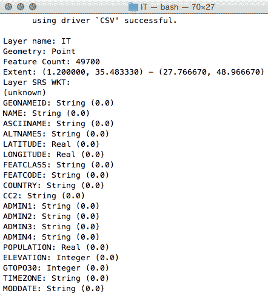

1.  你可以将`IT.txt`文件作为 OGR 实体查询。例如，分析数据集的一个特征，如下面的代码所示：

```py
      $ ogrinfo CSV:IT.txt IT -where "NAME = 'San Gimignano'"
```

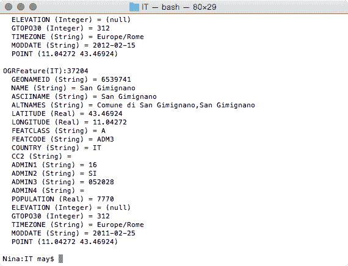

1.  对于你的目的，你只需要`name`、`asciiname`、`latitude`和`longitude`属性。你将使用 CSV OGR 驱动程序将文件导入 PostGIS（[`www.gdal.org/drv_csv.html`](http://www.gdal.org/drv_csv.html)）。使用`ogr2ogr`命令将此 GeoNames 数据集导入 PostGIS：

```py
 $ ogr2ogr -f PostgreSQL -s_srs EPSG:4326 -t_srs EPSG:4326 
      -lco GEOMETRY_NAME=the_geom -nln chp08.geonames 
      PG:"dbname='postgis_cookbook' user='me' password='mypassword'" 
      CSV:IT.txt -sql "SELECT NAME, ASCIINAME FROM IT" 
```

1.  尝试查询 PostGIS 中的新`geonames`表，以查看过程是否正确工作：

```py
 postgis_cookbook=# SELECT ST_AsText(the_geom), name 
      FROM chp08.geonames LIMIT 10;
```

1.  现在，创建一个 PL/PostgreSQL 函数，该函数将返回给定点的五个最近地点及其坐标（反向地理编码）：

```py
 CREATE OR REPLACE FUNCTION chp08.Get_Closest_PlaceNames(
        in_geom geometry, num_results int DEFAULT 5, 
        OUT geom geometry, OUT place_name character varying)
 RETURNS SETOF RECORD AS $$
 BEGIN
 RETURN QUERY
 SELECT the_geom as geom, name as place_name
 FROM chp08.geonames
 ORDER BY the_geom <-> ST_Centroid(in_geom) LIMIT num_results;
 END; 
      $$ LANGUAGE plpgsql; 
```

1.  查询新函数。你可以通过传递可选的`num_results`输入参数来指定你想要的结果数量：

```py
 postgis_cookbook=# SELECT * FROM chp08.Get_Closest_PlaceNames(
        ST_PointFromText('POINT(13.5 42.19)', 4326), 10); 
```

以下是该查询的输出：

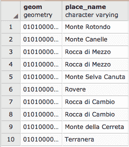

1.  如果你没有指定`num_results`可选参数，它将默认为五个结果：

```py
 postgis_cookbook=# SELECT * FROM chp08.Get_Closest_PlaceNames(
      ST_PointFromText('POINT(13.5 42.19)', 4326)); 
```

你将得到以下行：

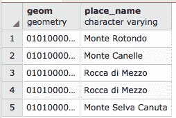

1.  现在，创建一个 PL/pgSQL 函数，该函数将返回包含其名称字段中文本搜索的地点名称和几何形状的列表（地理编码）：

```py
 CREATE OR REPLACE FUNCTION chp08.Find_PlaceNames(search_string text,
 num_results int DEFAULT 5,
 OUT geom geometry,
 OUT place_name character varying)
 RETURNS SETOF RECORD AS $$
 BEGIN
 RETURN QUERY
 SELECT the_geom as geom, name as place_name
 FROM chp08.geonames
 WHERE name @@ to_tsquery(search_string)
 LIMIT num_results;
 END; 
      $$ LANGUAGE plpgsql; 
```

1.  查询第二个函数以检查它是否正常工作：

```py
 postgis_cookbook=# SELECT * FROM chp08.Find_PlaceNames('Rocca', 10);
```

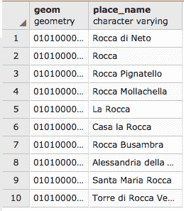

# 它是如何工作的...

在这个菜谱中，你编写了两个 PostgreSQL 函数来执行地理编码和反向地理编码。对于这两个函数，你定义了一组输入和输出参数，并在一些 PL/PostgreSQL 处理之后，通过执行查询将一组记录返回给函数客户端。

作为输入参数，`Get_Closest_PlaceNames`函数接受一个 PostGIS 几何形状和一个可选的`num_results`参数，如果没有由函数调用者提供，则默认设置为 5。这个函数的输出是`SETOF RECORD`，在函数体（由`$$`符号定义）中运行查询后返回。在这里，查询找到输入几何形状的重心最近的地点。这是通过索引最近邻搜索（KNN 索引）完成的，这是 PostGIS 2 中的一项新功能。

`Find_PlaceNames`函数接受作为输入参数的搜索字符串以及一个可选的`num_results`参数，在此情况下，如果没有由函数调用者提供，则默认设置为`5`。输出是一个`SETOF RECORD`，在运行使用`to_tsquery` PostgreSQL 文本搜索函数的查询后返回。查询的结果是从数据库中包含在名称字段中的`search_string`值的地点。

# 使用 OSM 数据集和三元组进行地理编码

在这个菜谱中，你将使用导入到 PostGIS 中的**OpenStreetMap**街道数据集来实现一个基本的 Python 类，以便为类的消费者提供地理编码功能。地理编码引擎将基于 PostgreSQL 的`contrib`模块提供的 PostgreSQL 三元组的实现：`pg_trgm`。

三元组是字符串中包含的三个连续字符的组合，通过计算两个字符串共有的三元组的数量，这是一种非常有效的方式来衡量两个字符串的相似度。

这个菜谱旨在提供一个非常基础的示例来实现一些地理编码功能（它将仅从街道名称返回一个或多个点），但它可以被扩展以支持更高级的功能。

# 准备工作

1.  对于这个菜谱，请确保你有最新的 GDAL，至少版本 1.10，因为你将使用`ogr2ogr` OGR OSM 驱动程序（[`www.gdal.org/drv_osm.html`](http://www.gdal.org/drv_osm.html)）：

```py
      $ ogrinfo --version GDAL 2.1.2, released 2016/10/24
      $ ogrinfo --formats | grep -i osm
      -> "OSM -vector- (rov): OpenStreetMap XML and PBF"
```

1.  由于你将使用 PostgreSQL 三元组，你需要安装 PostgreSQL 的`contrib`包（它包括`pg_trgm`）。Windows EDB 安装程序应该已经包括这个包。在 Ubuntu 12.4 盒子上，以下命令将帮助你完成它：

```py
      $ sudo apt-get install postgresql-contrib-9.1
```

1.  确保将`pg_trgm`扩展添加到数据库中：

```py
      postgis_cookbook=# CREATE EXTENSION pg_trgm;
      CREATE EXTENSION
```

你将需要使用包含在本章源中的某些 OSM 数据集。（在`data/chp08`书籍数据集目录中）。如果你使用 Windows，请确保已经安装了如本章初始说明中所建议的 OSGeo4W 套件。

1.  如果你使用的是 Linux，请遵循本章的初始说明，创建一个 Python 虚拟环境，以保持一个用于本书所有 Python 脚本的 Python 隔离环境。然后，按照以下方式激活它：

```py
      $ source postgis-cb-env/bin/activate
```

1.  一旦环境被激活，如果你还没有这样做，你可以安装这个菜谱所需的 Python 包：

```py
      (postgis-cb-env)$ pip install pygdal
      (postgis-cb-env)$ pip install psycopg2
```

# 如何操作...

执行以下步骤：

1.  首先，使用 `ogrinfo` 检查 OSM `.pbf` 文件是如何构建的。PBF 是一种二进制格式，旨在作为 OSM XML 格式的替代品，主要是因为它要小得多。正如你可能已经注意到的，它由几个层组成——你将导出 `lines` 层到 PostGIS，因为这个层包含你将用于整体地理编码过程的街道名称：

```py
 $ ogrinfo lazio.pbf
 Had to open data source read-only.
 INFO: Open of `lazio.pbf'
 using driver `OSM' successful.
 1: points (Point)
 2: lines (Line String)
 3: multilinestrings (Multi Line String)
 4: multipolygons (Multi Polygon) 
      5: other_relations (Geometry Collection)
```

1.  使用 `ogr2ogr` 将行 OSM 特征导出到 PostGIS 表中（`ogr2ogr`，像往常一样，将隐式创建 `pg_trgm` 模块运行所需的 GiST 索引）：

```py
 $ ogr2ogr -f PostgreSQL -lco GEOMETRY_NAME=the_geom 
      -nln chp08.osm_roads 
      PG:"dbname='postgis_cookbook' user='me' 
      password='mypassword'" lazio.pbf lines 
```

1.  现在尝试使用以下查询进行三元组匹配以识别与给定搜索文本相似的街道名称。注意，`similarity` 函数返回一个值，该值随着单词相似性的降低而从 `1` 减少到 `0`（`1` 时字符串相同；`0` 时字符串完全不同）：

```py
 postgis_cookbook=# SELECT name, 
        similarity(name, 'via benedetto croce') AS sml,
        ST_AsText(ST_Centroid(the_geom)) AS the_geom
 FROM chp08.osm_roads
 WHERE name % 'via benedetto croce'
 ORDER BY sml DESC, name; 
```

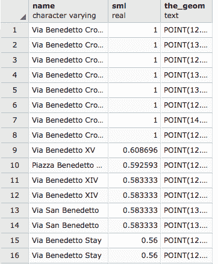

1.  作为变体，你将使用以下查询来完成菜谱（在这种情况下，当权重为 0 时，字符串相同）：

```py
 postgis_cookbook=# SELECT name, 
        name <-> 'via benedetto croce' AS weight
 FROM chp08.osm_roads
 ORDER BY weight LIMIT 10;
```

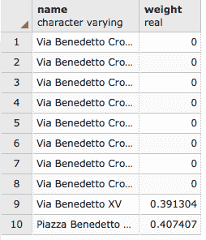

1.  我们将使用最后一个查询作为 Python 类的 SQL 核心部分，该类将为消费者提供地理编码功能，使用我们刚刚导入到 PostGIS 中的层（`chp08.osm_roads`）。首先，创建一个名为 `osmgeocoder.py` 的文件，并将以下类添加到其中：

```py
        import sys 
        import psycopg2 

        class OSMGeocoder(object): 
          """ 
            A class to provide geocoding features using an OSM 
            dataset in PostGIS. 
          """ 

          def __init__(self, db_connectionstring): 
            # initialize db connection parameters 
            self.db_connectionstring = db_connectionstring 

          def geocode(self, placename): 
            """ 
              Geocode a given place name. 
            """ 
            # here we create the connection object 
            conn = psycopg2.connect(self.db_connectionstring) 
            cur = conn.cursor() 
            # this is the core sql query, using trigrams to detect  
            # streets similar to a given placename 
            sql = """ 
              SELECT name, name <-> '%s' AS weight, 
              ST_AsText(ST_Centroid(the_geom)) as  point 
              FROM chp08.osm_roads 
              ORDER BY weight LIMIT 10; 
            """ % placename 
            # here we execute the sql and return all of the results 
            cur.execute(sql) 
            rows = cur.fetchall() 
            cur.close() 
            conn.close() 
            return rows 
```

1.  现在，添加 `__main__` 检查，为类用户提供一个直接从命令行使用地理编码器的方法：

```py
        if __name__ == '__main__': 
          # the user must provide at least two parameters, the place name 
          # and the connection string to PostGIS 
          if len(sys.argv) < 3 or len(sys.argv) > 3: 
            print "usage: <placename> <connection string>" 
            raise SystemExit 
          placename = sys.argv[1] 
          db_connectionstring = sys.argv[2] 
          # here we instantiate the geocoder, providing the needed 
          # PostGIS connection parameters 
          geocoder = OSMGeocoder(db_connectionstring) 
          # here we query the geocode method, for getting the  
          # geocoded points for the given placename 
          results = geocoder.geocode(placename) 
          print results 
```

1.  现在你可以通过调用脚本测试这个类，如下所示：

```py
 (postgis-cb-env)$ python osmgeocoder.py "Via Benedetto Croce" 
        "dbname=postgis_cookbook user=me password=mypassword"
 [('Via Benedetto Croce', 0.0, 'POINT(12.6999095325807
                                           42.058016054317)'),...
```

1.  因此，现在你已经编写了一个可以用于地理编码街道名称的类，假设另一个用户想要使用它来地理编码一个包含街道名称列表的文件，以便将其导入新的 PostGIS 层。以下是用户可以这样做的方法（也尝试一下）。首先，创建一个名为 `streets.txt` 的文件，其中包含街道名称列表；例如：

```py
      Via Delle Sette Chiese
      Via Benedetto Croce
      Lungotevere Degli Inventori
      Viale Marco Polo
      Via Cavour
```

1.  现在，创建一个名为 `geocode_streets.py` 的文件，并将以下 Python 代码添加到其中（你将使用 `OSMGeocoder` 类来地理编码街道名称列表，并使用 GDAL/OGR 创建一个新的 PostGIS 层来存储街道名称的地理编码点）：

```py
        from osmgeocoder import OSMGeocoder
        from osgeo import ogr, osr

        # here we read the file
        f = open('streets.txt')
        streets = f.read().splitlines()
        f.close()

        # here we create the PostGIS layer using gdal/ogr
        driver = ogr.GetDriverByName('PostgreSQL')
        srs = osr.SpatialReference()
        srs.ImportFromEPSG(4326)
        pg_ds = ogr.Open(
          "PG:dbname='postgis_cookbook' host='localhost' port='5432' 
             user='me' password='mypassword'", update = 1 )
           pg_layer = pg_ds.CreateLayer('geocoded_points', srs = srs, 
                 geom_type=ogr.wkbPoint, options = [
             'GEOMETRY_NAME=the_geom',
             'OVERWRITE=YES', 
               # this will drop and recreate the table every time
             'SCHEMA=chp08',
          ])
          # here we add the field to the PostGIS layer
          fd_name = ogr.FieldDefn('name', ogr.OFTString)
          pg_layer.CreateField(fd_name)
          print 'Table created.'

          # now we geocode all of the streets in the file 
          # using the osmgeocoder class
          geocoder = OSMGeocoder('dbname=postgis_cookbook user=me 
                                  password=mypassword')
          for street in streets:
            print street
            geocoded_street = geocoder.geocode(street)[0]
            print geocoded_street
            # format is
            # ('Via delle Sette Chiese', 0.0,
            #  'POINT(12.5002166330412 41.859774874774)')
            point_wkt = geocoded_street[2]
            point = ogr.CreateGeometryFromWkt(point_wkt)
            # we create a LayerDefn for the feature using the 
            # one from the layer
            featureDefn = pg_layer.GetLayerDefn()
            feature = ogr.Feature(featureDefn)
            # now we store the feature geometry and 
            # the value for the name field
            feature.SetGeometry(point)
            feature.SetField('name', geocoded_street[0])
            # finally we create the feature 
            # (an INSERT command is issued only here) 
            pg_layer.CreateFeature(feature) 
```

1.  运行前面的脚本，然后使用你喜欢的 PostgreSQL 客户端或 GIS 桌面工具检查街道名称的点是否正确进行了地理编码：

```py
 (postgis-cb-env)capooti@ubuntu:~/postgis_cookbook/working/chp08$  
      python geocode_streets.py
 Table created.
 Via Delle Sette Chiese
 ('Via delle Sette Chiese', 0.0, 
       'POINT(12.5002166330412 41.859774874774)')
 ...
 Via Cavour 
      ('Via Cavour', 0.0, 'POINT(12.7519263341222 41.9631244835521)') 
```

# 它是如何工作的...

对于这个菜谱，你首先使用 GDAL OSM 驱动程序，通过 `ogr2ogr` 将 OSM 数据集导入到 PostGIS 中。

然后，你创建了一个 Python 类，`OSMGeocoder`，为类消费者提供对地理编码街道名称的基本支持，使用的是导入到 PostGIS 中的 OSM 数据。为此，你使用了 PostgreSQL 中的 trigram 支持以及 `pg_trgm contrib` 模块。

你编写的类主要由两个方法组成：`__init__` 方法，其中必须传入连接参数以实例化一个 `OSMGeocoder` 对象，以及 `geocode` 方法。`geocode` 方法接受一个输入参数 `placename`，并使用 Psycopg2 库连接到 PostGIS 数据库，以执行查询以找到与 `placename` 参数名称相似的街道。

这个类可以从命令行使用 `__name__ == '__main__'` 代码块或从外部 Python 代码中消费。你尝试了这两种方法。在后一种方法中，你创建了一个新的 Python 脚本，在其中导入了 `OSMGeocoder` 类，并结合 GDAL/OGR Python 绑定来生成一个新的 PostGIS 点层，该层包含来自地理编码街道名称列表的特征。

# 使用 geopy 和 PL/Python 进行地理编码

在这个菜谱中，你将使用网络地理编码 API（如 Google Maps、Yahoo! Maps、Geocoder、GeoNames 等）来地理编码地址。在使用这些 API 进行生产之前，请务必仔细阅读其服务条款。

`geopy` Python 库（[`github.com/geopy/geopy`](https://github.com/geopy/geopy)）提供了对所有这些网络服务的方便统一访问。因此，你将使用它来创建一个 PL/Python PostgreSQL 函数，该函数可以在你的 SQL 命令中使用，以查询所有这些引擎。

# 准备工作

1.  全局安装 `geopy`。在这种情况下，你不能使用虚拟环境，因为运行 PostgreSQL 服务的用户需要通过其 Python 路径访问它。

在 Debian/Ubuntu 系统中，操作就像输入以下命令一样简单：

```py
      $ sudo pip install geopy
```

在 Windows 中，你可以使用以下命令：

```py
      > pip install geopy
```

1.  如果你还没有使用 PL/Python，请验证你的 PostgreSQL 服务器安装是否支持它。Windows EDB 安装程序应该已经包含了支持，但如果你使用的是例如 Ubuntu 16.04 LTS，那么这并不是默认设置，所以你很可能需要安装它：

```py
      $ sudo apt-get install postgresql-plpython-9.1
```

1.  在数据库中安装 PL/Python（你可以考虑在 `template1` 数据库中安装它；这样，每个新创建的数据库都将默认支持 PL/Python）：

```py
 $ psql -U me postgis_cookbook
 psql (9.1.6, server 9.1.8)
 Type "help" for help. 
      postgis_cookbook=# CREATE EXTENSION plpythonu; 
```

或者，你也可以使用 `createlang` 命令行来为你的数据库添加 PL/Python 支持（如果你使用的是 PostgreSQL 版本 9.1 及以下，这是唯一的方法）：

`$ createlang plpythonu postgis_cookbook`

# 如何操作...

执行以下步骤：

1.  作为第一个测试，打开你喜欢的 SQL 客户端（`psql` 或 `pgAdmin`），编写一个非常基本的 PL/Python 函数，仅使用 `geopy` 的 GoogleV3 地理编码 API。该函数将接受地址字符串作为输入参数，并在导入 `geopy` 后，实例化一个 `geopy` Google 地理编码器，运行地理编码过程，然后使用 `ST_GeomFromText` 函数和 `geopy` 输出返回点几何：

```py
        CREATE OR REPLACE FUNCTION chp08.Geocode(address text)
          RETURNS geometry(Point,4326) AS $$
          from geopy import geocoders
          g = geocoders.GoogleV3()
          place, (lat, lng) = g.geocode(address)
          plpy.info('Geocoded %s for the address: %s' % (place, address))
          plpy.info('Longitude is %s, Latitude is %s.' % (lng, lat))
          plpy.info("SELECT ST_GeomFromText('POINT(%s %s)', 4326)" 
                    % (lng, lat))
          result = plpy.execute("SELECT ST_GeomFromText('POINT(%s %s)',
                                4326) AS point_geocoded" % (lng, lat))
          geometry = result[0]["point_geocoded"]
          return geometry 
        $$ LANGUAGE plpythonu; 
```

1.  创建函数后，尝试测试它：

```py
 postgis_cookbook=# SELECT chp08.Geocode('Viale Ostiense 36, Rome');
 INFO:  Geocoded Via Ostiense, 36, 00154 Rome, 
      Italy for the address: Viale Ostiense 36, Rome
 CONTEXT:  PL/Python function "geocode"
 INFO:  Longitude is 12.480457, Latitude is 41.874345.
 CONTEXT:  PL/Python function "geocode"
 INFO:  SELECT ST_GeomFromText('POINT(12.480457 41.874345)', 4326)
 CONTEXT:  PL/Python function "geocode"
 geocode 
      ---------------------------------------------------- 
      0101000020E6100000BF44BC75FEF52840E7357689EAEF4440 
      (1 row) 
```

1.  现在，你将使函数变得更加复杂。首先，你将添加另一个输入参数，让用户指定地理编码 API 引擎（默认为 GoogleV3）。然后，使用 Python 的 `try...except` 块，你将尝试添加某种错误管理，以防 geopy 地理编码器无法返回有效结果：

```py
        CREATE OR REPLACE FUNCTION chp08.Geocode(address text,
                                                 api text DEFAULT 'google')
        RETURNS geometry(Point,4326) AS $$
        from geopy import geocoders
        plpy.info('Geocoing the given address using the %s api' % (api))
        if api.lower() == 'geonames':
          g = geocoders.GeoNames()
        elif api.lower() == 'geocoderdotus':
          g = geocoders.GeocoderDotUS()
        else: # in all other cases, we use google
          g = geocoders.GoogleV3()
        try:
          place, (lat, lng) = g.geocode(address)
          plpy.info('Geocoded %s for the address: %s' % (place, address))
           plpy.info('Longitude is %s, Latitude is %s.' % (lng, lat))
          result = plpy.execute("SELECT ST_GeomFromText('POINT(%s %s)',
                                4326) AS point_geocoded" % (lng, lat))
          geometry = result[0]["point_geocoded"]
          return geometry
        except:
          plpy.warning('There was an error in the geocoding process,
                        setting geometry to Null.')
          return None 
        $$ LANGUAGE plpythonu; 
```

1.  在不指定 API 参数的情况下测试你函数的新版本。在这种情况下，它应该默认为 Google API：

```py
 postgis_cookbook=# SELECT chp08.Geocode('161 Court Street, 
                         Brooklyn, NY');
 INFO:  Geocoing the given address using the google api
 CONTEXT:  PL/Python function "geocode2"
 INFO:  Geocoded 161 Court Street, Brooklyn, NY 11201, 
             USA for the address: 161 Court Street, Brooklyn, NY
 CONTEXT:  PL/Python function "geocode2"
 INFO:  Longitude is -73.9924659, Latitude is 40.688665.
 CONTEXT:  PL/Python function "geocode2"
 INFO:  SELECT ST_GeomFromText('POINT(-73.9924659 40.688665)', 4326)
 CONTEXT:  PL/Python function "geocode2"
 geocode2
 ----------------------------------------------------
 0101000020E61000004BB9B18F847F52C02E73BA2C26584440 
      (1 row) 
```

1.  如果你通过指定不同的 API 进行测试，它应该返回针对给定 API 处理的结果。例如：

```py
 postgis_cookbook=# SELECT chp08.Geocode('161 Court Street, 
                         Brooklyn, NY', 'GeocoderDotUS');
 INFO:  Geocoing the given address using the GeocoderDotUS api
 CONTEXT:  PL/Python function "geocode2"
 INFO:  Geocoded 161 Court St, New York, NY 11201 for the address: 161 
             Court Street, Brooklyn, NY
 CONTEXT:  PL/Python function "geocode2"
 INFO:  Longitude is -73.992809, Latitude is 40.688774.
 CONTEXT:  PL/Python function "geocode2"
 INFO:  SELECT ST_GeomFromText('POINT(-73.992809 40.688774)', 4326)
 CONTEXT:  PL/Python function "geocode2"
 geocode2
 ----------------------------------------------------
 0101000020E61000002A8BC22E8A7F52C0E52A16BF29584440 
      (1 row)
```

1.  作为额外步骤，在 PostgreSQL 中创建一个包含街道地址的表，并生成一个新的点 PostGIS 层，存储 Geocode 函数返回的地理编码点。

# 它是如何工作的...

你编写了一个 PL/Python 函数来对地址进行地理编码。为此，你使用了 `geopy` Python 库，它允许你以相同的方式查询多个地理编码 API。

使用 geopy，你需要使用给定的 API 实例化一个 `geocoder` 对象，并查询它以获取结果，例如地点名称和一对坐标。你可以使用 `plpy` 模块工具在数据库上运行查询，使用 PostGIS 的 `ST_GeomFromText` 函数，并为用户记录信息性消息和警告。

如果地理编码过程失败，你将使用 `try..except` Python 块向用户返回一个带有警告信息的 `NULL` 几何形状。

# 使用 Python 和 GDAL 导入 NetCDF 数据集

在这个菜谱中，你将编写一个 Python 脚本来从 NetCDF 格式导入数据到 PostGIS。

NetCDF 是一个开放标准格式，广泛用于科学应用，可以包含多个栅格数据集，每个数据集由一系列波段组成。为此，你将使用 GDAL Python 绑定和流行的 NumPy ([`www.numpy.org/`](http://www.numpy.org/)) 科学库。

# 准备工作

1.  如果你正在使用 Windows，请确保安装 OSGeo4W，正如本章初始说明中所建议的。这将包括 Python 和 GDAL Python 绑定，以及支持 NumPy。

对于 Linux 用户，如果你还没有这样做，请遵循本章初始说明，创建一个 Python 虚拟环境，以保持一个用于本书中所有 Python 脚本的 Python 隔离环境。然后，激活它：

```py
      $ source postgis-cb-env/bin/activate
```

1.  对于这个菜谱，您需要 GDAL Python 绑定和 NumPy，后者是 GDAL 方法（`ReadAsArray`）所需的数组。在最可能的情况下，您已经将 GDAL 安装在了您的虚拟环境中，因为您一直在使用它来运行其他菜谱，所以请确保在安装 NumPy 后将其移除并重新安装。实际上，如果您想使用其数组功能，GDAL 需要与 NumPy 支持一起编译：

```py
      (postgis-cb-env)$ pip uninstall gdal
      (postgis-cb-env)$ pip install numpy
      (postgis-cb-env)$ pip install gdal
```

1.  为了这个菜谱的目的，您将使用 NOAA **地球系统研究实验室**（**ESRL**）的样本数据集。ESRL 的优秀网络门户提供了大量 NetCDF 格式的数据，可以免费下载。例如，从 ESRL CPC 土壤湿度数据存储库下载以下数据集（您可以在本书的数据集目录中找到这个数据集的副本）：[`www.esrl.noaa.gov/psd/data/gridded/data.cpcsoil.html`](https://www.esrl.noaa.gov/psd/data/gridded/data.cpcsoil.html)。

# 如何操作...

执行以下步骤：

1.  作为第一步，使用`gdalinfo`调查您下载的数据集的 NetCDF 格式。这类数据集由几个子数据集组成，您可能已经通过查看`gdalinfo`输出意识到了这一点：

```py
      $ gdalinfo NETCDF:"soilw.mon.ltm.v2.nc"
```

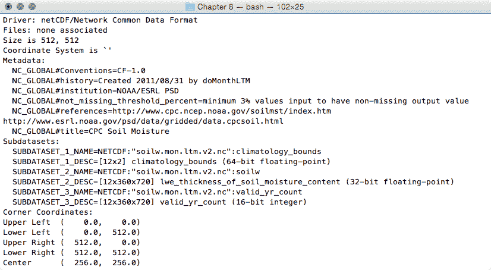

1.  使用`gdalinfo`调查文件的一个子数据集。NetCDF GDAL 驱动程序（[`www.gdal.org/frmt_netcdf.html`](http://www.gdal.org/frmt_netcdf.html)）使用的语法是在文件名末尾附加一个冒号，后跟变量名。例如，尝试找出`soilw`子数据集由多少个波段组成。这个子数据集代表`lwe_thickness_of_soil_moisture_content`，由 12 个波段组成。根据其元数据获得的信息，每个波段代表给定月份的 CPC 月度土壤湿度。月份由`NETCDF_DIM_time`元数据值标识，这是从年初开始的天数（`1 月为 0`，`2 月为 31`，`3 月为 59`，等等）：

```py
      $  gdalinfo NETCDF:"soilw.mon.ltm.v2.nc":soilw
```

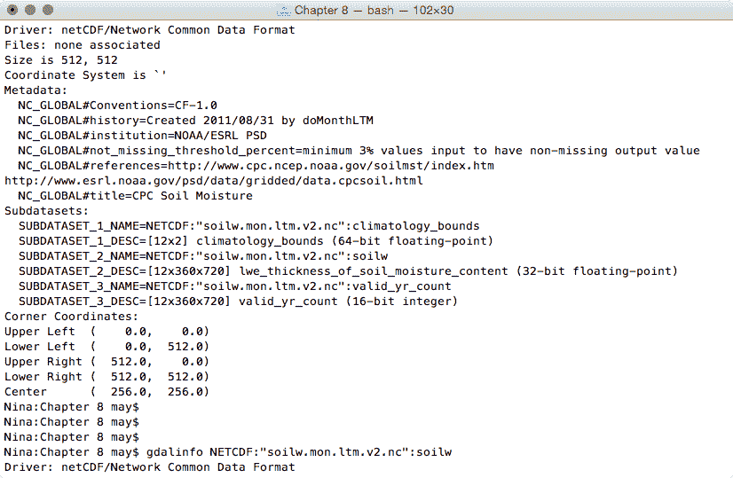

```py
      ...(12 bands)...
```

1.  您将要执行的操作是创建一个使用 GDAL 和 NumPy 的 Python 脚本。您将读取一个给定的 NetCDF 数据集，迭代其子数据集，然后迭代每个子数据集的波段。对于每个子数据集，您将创建一个点 PostGIS 层，并为每个波段添加一个字段以在层表中存储波段值。然后，您将迭代波段的单元格，并为每个单元格在层中添加一个带有相应波段值的点。因此，创建一个`netcdf2postgis.py`文件，并将以下 Python 代码添加到其中：

```py
        import sys
          from osgeo import gdal, ogr, osr
          from osgeo.gdalconst import GA_ReadOnly, GA_Update

        def netcdf2postgis(file_nc, pg_connection_string,
                           postgis_table_prefix):
          # register gdal drivers
          gdal.AllRegister()
          # postgis driver, needed to create the tables
          driver = ogr.GetDriverByName('PostgreSQL')
          srs = osr.SpatialReference()
          # for simplicity we will assume all of the bands in the datasets
          # are in the same spatial reference, wgs 84
          srs.ImportFromEPSG(4326)

          # first, check if dataset exists
          ds = gdal.Open(file_nc, GA_ReadOnly)
          if ds is None:
            print 'Cannot open ' + file_nc
            sys.exit(1)

          # 1\. iterate subdatasets
          for sds in ds.GetSubDatasets():
            dataset_name = sds[0]
            variable = sds[0].split(':')[-1]
            print 'Importing from %s the variable %s...' %
                  (dataset_name, variable)
            # open subdataset and read its properties
            sds = gdal.Open(dataset_name, GA_ReadOnly)
            cols = sds.RasterXSize
            rows = sds.RasterYSize
            bands = sds.RasterCount

            # create a PostGIS table for the subdataset variable
            table_name = '%s_%s' % (postgis_table_prefix, variable)
            pg_ds = ogr.Open(pg_connection_string, GA_Update )
            pg_layer = pg_ds.CreateLayer(table_name, srs = srs, 
            geom_type=ogr.wkbPoint, options = [
              'GEOMETRY_NAME=the_geom',
              'OVERWRITE=YES', 
                # this will drop and recreate the table every time
              'SCHEMA=chp08',
             ])
            print 'Table %s created.' % table_name

            # get georeference transformation information
            transform = sds.GetGeoTransform()
            pixelWidth = transform[1]
            pixelHeight = transform[5]
            xOrigin = transform[0] + (pixelWidth/2)
            yOrigin = transform[3] - (pixelWidth/2)

            # 2\. iterate subdataset bands and append them to data
            data = []
            for b in range(1, bands+1):
              band = sds.GetRasterBand(b)
              band_data = band.ReadAsArray(0, 0, cols, rows)
              data.append(band_data)
              # here we add the fields to the table, a field for each band
              # check datatype (Float32, 'Float64', ...)
              datatype = gdal.GetDataTypeName(band.DataType)
              ogr_ft = ogr.OFTString # default for a field is string
              if datatype in ('Float32', 'Float64'):
                ogr_ft = ogr.OFTReal
              elif datatype in ('Int16', 'Int32'):
                ogr_ft = ogr.OFTInteger
              # here we add the field to the PostGIS layer
              fd_band = ogr.FieldDefn('band_%s' % b, ogr_ft)
              pg_layer.CreateField(fd_band)
              print 'Field band_%s created.' % b

            # 3\. iterate rows and cols
            for r in range(0, rows):
              y = yOrigin + (r * pixelHeight)
              for c in range(0, cols):
                x = xOrigin + (c * pixelWidth)
                # for each cell, let's add a point feature
                # in the PostGIS table
                point_wkt = 'POINT(%s %s)' % (x, y)
                point = ogr.CreateGeometryFromWkt(point_wkt)
                featureDefn = pg_layer.GetLayerDefn()
                feature = ogr.Feature(featureDefn)
                # now iterate bands, and add a value for each table's field
                for b in range(1, bands+1):
                  band = sds.GetRasterBand(1)
                  datatype = gdal.GetDataTypeName(band.DataType)
                  value = data[b-1][r,c]
                  print 'Storing a value for variable %s in point x: %s, 
                   y: %s, band: %s, value: %s' % (variable, x, y, b, value)
                  if datatype in ('Float32', 'Float64'):
                    value = float(data[b-1][r,c])
                  elif datatype in ('Int16', 'Int32'):
                    value = int(data[b-1][r,c])
                  else:
                    value = data[r,c]
                  feature.SetField('band_%s' % b, value)
                # set the feature's geometry and finalize its creation
                feature.SetGeometry(point) 
                pg_layer.CreateFeature(feature) 
```

1.  要从命令行运行`netcdf2postgis`方法，请添加脚本的入口点。代码将检查脚本用户是否正确使用了三个必需的参数，这些参数是 NetCDF 文件路径、GDAL PostGIS 连接字符串以及用于 PostGIS 中表名的前缀/后缀：

```py
        if __name__ == '__main__':
          # the user must provide at least three parameters, 
          # the netCDF file path, the PostGIS GDAL connection string 
          # and the prefix suffix to use for PostGIS table names
          if len(sys.argv) < 4 or len(sys.argv) > 4:
            print "usage: <netCDF file path> <GDAL PostGIS connection 
                   string><PostGIS table prefix>"
            raise SystemExit
          file_nc = sys.argv[1]
          pg_connection_string = sys.argv[2]
          postgis_table_prefix = sys.argv[3] 
          netcdf2postgis(file_nc, pg_connection_string,
                         postgis_table_prefix) 
```

1.  运行脚本。请确保使用正确的 NetCDF 文件路径、GDAL PostGIS 连接字符串（请检查格式在 [`www.gdal.org/drv_pg.html`](http://www.gdal.org/drv_pg.html)），以及必须附加到将在 PostGIS 中创建的表名的表前缀：

```py
 (postgis-cb-env)$ python netcdf2postgis.py
 NETCDF:"soilw.mon.ltm.v2.nc"
 "PG:dbname='postgis_cookbook' host='localhost'
 port='5432' user='me' password='mypassword'" netcdf
 Importing from NETCDF:"soilw.mon.ltm.v2.nc":
 climatology_bounds the variable climatology_bounds...
 ...
 Importing from NETCDF:"soilw.mon.ltm.v2.nc":soilw the 
        variable soilw...
 Table netcdf_soilw created.
 Field band_1 created.
 Field band_2 created.
 ...
 Field band_11 created.
 Field band_12 created.
 Storing a value for variable soilw in point x: 0.25,
 y: 89.75, band: 2, value: -9.96921e+36
 Storing a value for variable soilw in point x: 0.25,
 y: 89.75, band: 3, value: -9.96921e+36 
      ... 
```

1.  在过程结束时，通过使用您最喜欢的 GIS 桌面工具打开其中一个输出 PostGIS 表来检查结果。以下截图显示了它在 QGIS `soilw` 图层中的样子，其背后是原始的 NetCDF 数据集：

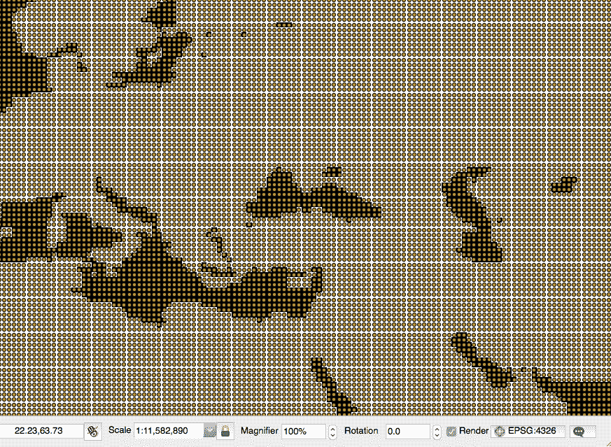

# 它是如何工作的...

您已经使用 Python 和 GDAL 以及 NumPy 创建了一个命令行实用程序，用于将 NetCDF 数据集导入到 PostGIS。

NetCDF 数据集由多个子数据集组成，每个子数据集由多个栅格波段组成。每个波段由单元格组成。在调查一个示例 NetCDF 数据集后，使用 `gdalinfo` GDAL 命令工具，这种结构应该对您来说很清晰。

有几种方法可以将单元格值导出到 PostGIS。您在这里采用的方法是为每个子数据集生成一个 PostGIS 点图层，该图层由每个子数据集波段的一个字段组成。然后，您迭代栅格单元格，并将从每个单元格波段读取的值附加到 PostGIS 图层中。

您使用 Python 的方式是通过使用 GDAL Python 绑定。对于读取，您打开 NetCDF 数据集，对于更新，您打开 PostGIS 数据库，使用正确的 GDAL 和 OGR 驱动程序。然后，您使用 `GetSubDatasets` 方法迭代 NetCDF 子数据集，并使用 `CreateLayer` 方法为每个子数据集创建一个名为 `NetCDF 子数据集变量`（带有前缀）的 PostGIS 表。

对于每个子数据集，您使用 `GetRasterBand` 方法迭代其波段。为了读取每个波段，您运行 `ReadAsArray` 方法，该方法使用 NumPy 将波段作为数组获取。

对于每个波段，您在 PostGIS 图层中创建一个字段，该字段具有正确的字段数据类型，可以存储波段的值。为了选择正确的数据类型，您调查波段的数据类型，使用 `DataType` 属性。

最后，您通过使用子数据集变换参数（通过 `GetGeoTransform` 方法获取）读取正确的 *x* 和 *y* 坐标来迭代栅格单元格。对于每个单元格，您使用 `CreateGeometryFromWkt` 方法创建一个点，然后设置字段值，并使用 `SetField` 功能方法从波段数组中读取。

最后，您使用 `CreateFeature` 方法将新点附加到 PostGIS 图层。
