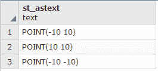
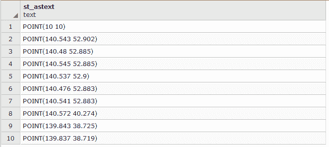

# 第十章：维护、优化和性能调整

本章将涵盖以下菜谱：

+   组织数据库

+   设置正确的数据权限机制

+   备份数据库

+   使用索引

+   为了效率进行聚类

+   优化 SQL 查询

+   将 PostGIS 数据库迁移到不同的服务器

+   使用流复制复制 PostGIS 数据库

+   地理空间分片

+   在 PostgreSQL 中并行处理

# 简介

与前面的章节不同，本章不讨论 PostGIS 的功能或应用。相反，它侧重于组织数据库的技术、提高查询性能以及确保空间数据的长期可行性。

这些技术通常被大多数 PostGIS 用户忽视，直到为时已晚——例如，当数据已经因为用户的行为而丢失，或者当数据量或用户数量增加时，性能已经下降。

这种忽视通常是由于学习每种技术所需的时间以及实施它们所需的时间量。本章试图以提炼的方式展示每种技术，以最大限度地减少学习曲线并最大限度地提高效益。

# 组织数据库

在创建和使用数据库时，需要考虑的最重要的事情之一是如何组织数据。布局应在首次建立数据库时确定。布局可以在稍后决定或更改，但这几乎可以保证是一个繁琐的，如果不是困难的任务。如果从未决定，数据库将随着时间的推移而变得杂乱无章，在升级组件或运行备份时引入重大障碍。

默认情况下，新的 PostgreSQL 数据库只有一个**模式**——即`public`。大多数用户将所有数据（他们自己的和第三方模块，如 PostGIS）放在`public`模式中。这样做会混合来自不同来源的不同信息。一种简单的方法来分离信息是使用模式。这使得我们可以为我们的数据使用一个模式，为其他所有事物使用一个单独的模式。

# 准备工作

在这个菜谱中，我们将创建一个数据库并在其自己的模式中安装 PostGIS。我们还将加载一些几何形状和栅格数据，以便在本书的其他菜谱中使用。

以下是在创建 PostGIS 启用数据库的两种方法：

+   使用`CREATE EXTENSION`语句

+   使用 PostgreSQL 客户端运行安装 SQL 脚本

如果您正在运行 PostgreSQL 9.1 或更高版本，则可以使用`CREATE EXTENSION`方法，这是安装 PostGIS 的推荐方法：

1.  访问以下链接下载加利福尼亚学校和警察局的 shapefiles：[`scec.usc.edu/internships/useit/content/california-emergency-facilities-shapefile`](http://scec.usc.edu/internships/useit/content/california-emergency-facilities-shapefile)。

# 如何操作...

执行以下步骤以创建和组织数据库：

1.  通过执行以下命令创建一个名为`chapter10`的数据库：

```py
      CREATE DATABASE chapter10;
```

1.  在`chapter10`数据库中创建一个名为`postgis`的模式，我们将在这里安装 PostGIS。执行以下命令：

```py
      CREATE SCHEMA postgis;
```

1.  在`chapter10`数据库的`postgis`模式中安装 PostGIS：

    1.  如果你运行的是 PostgreSQL 9.1 或更高版本，使用`CREATE EXTENSION`语句：

```py
               CREATE EXTENSION postgis WITH SCHEMA postgis;
```

`CREATE EXTENSION`语句的`WITH SCHEMA`子句指示 PostgreSQL 在`postgis`模式中安装 PostGIS 及其对象。

1.  通过运行以下命令检查 PostGIS 安装是否成功：

```py
      > psql -U me -d chapter10 
      > chapter10=# SET search_path = public, postgis;
```

********

验证模式中关系列表，它应该包括由扩展创建的所有关系：

****

如果你使用`pgAdmin`或类似的数据库系统，你还可以在图形界面中检查模式、视图和表是否已成功创建。

`SET`语句指示 PostgreSQL 在处理来自我们客户端连接的任何 SQL 语句时考虑`public`和`postgis`模式。没有`SET`语句，`\d`命令将不会从`postgis`模式返回任何关系。

1.  为了防止每次客户端连接到`chapter10`数据库时都需要手动使用`SET`语句，通过执行以下命令修改数据库：

```py
      ALTER DATABASE chapter10 SET search_path = public, postgis;
```

所有未来的连接和查询到`chapter10`都将导致 PostgreSQL 自动使用`public`和`postgis`模式。

注意：对于 Windows 用户，此选项可能不起作用；在版本 9.6.7 中它起作用，但在版本 9.6.3 中不起作用。如果不起作用，你可能需要在每个命令中明确定义`search_path`。两种版本都提供。

1.  通过执行以下命令加载 PRISM 栅格和旧金山边界几何形状，这些我们在第五章，“处理栅格数据”中使用过：

```py
      > raster2pgsql -s 4322 -t 100x100 -I -F -C -Y 
      C:\postgis_cookbook\data\chap5
      \PRISM\    PRISM_tmin_provisional_4kmM2_201703_asc.asc 
      prism | psql -d chapter10 -U me
```

然后，定义搜索路径：

```py
      > raster2pgsql -s 4322 -t 100x100 -I -F -C -Y 
      C\:postgis_cookbook\data\chap5
      \PRISM\PRISM_tmin_provisional_4kmM2_201703_asc.asc 
      prism | psql "dbname=chapter10 options=--search_path=postgis" me 
```

1.  正如我们在第五章，“处理栅格数据”中所做的那样，我们将通过执行以下命令对栅格文件名进行后处理，将其添加到`date`列：

```py
 ALTER TABLE postgis.prism ADD COLUMN month_year DATE;
 UPDATE postgis.prism SET month_year = ( 
 SUBSTRING(split_part(filename, '_', 5), 0, 5) || '-' || 
 SUBSTRING(split_part(filename, '_', 5), 5, 4) || '-01' 
 ) :: DATE;
```

1.  然后，我们通过执行以下命令加载旧金山边界：

```py
      > shp2pgsql -s 3310 -I
      C\:postgis_cookbook\data\chap5\SFPoly\sfpoly.shp sfpoly |
      psql -d chapter10 -U me
```

然后，定义搜索路径：

```py
      > shp2pgsql -s 3310 -I 
      C\:postgis_cookbook\data\chap5\SFPoly\sfpoly.shp 
      sfpoly | psql "dbname=chapter10 options=--search_path=postgis" me
```

1.  将本章的数据集复制到其自己的目录中，通过执行以下命令：

```py
      > mkdir C:\postgis_cookbook\data\chap10
      > cp -r /path/to/book_dataset/chap10 
      C\:postgis_cookbook\data\chap10
```

我们将使用南加州大学 USEIT 项目提供的加利福尼亚州学校和警察局的 shapefiles。通过执行以下命令导入 shapefiles；仅对警察局的 shapefile 使用空间索引标志`-I`：

```py
      > shp2pgsql -s 4269 -I 
      C\:postgis_cookbook\data\chap10\CAEmergencyFacilities\CA_police.shp 
      capolice | psql -d chapter10 -U me
```

然后，定义搜索路径：

```py
      > shp2pgsql -s 4269 C\:postgis_cookbook\data\chap10
      \CAEmergencyFacilities\CA_schools.shp 
      caschools | psql -d chapter10 -U me
```

然后，定义搜索路径：

```py
      shp2pgsql -s 4269 -I C\:postgis_cookbook\data\chap10
      \CAEmergencyFacilities\CA_schools.shp 
      caschools | psql "dbname=chapter10 options=--search_path=postgis" 
      me shp2pgsql -s 4269 -I 
      C\:postgis_cookbook\data\chap10\CAEmergencyFacilities\CA_police.shp 
      capolice | psql "dbname=chapter10 options=--search_path=postgis" me

```

# 它是如何工作的...

在这个菜谱中，我们创建了一个新的数据库并在其自己的模式中安装了 PostGIS。我们将 PostGIS 对象与我们的几何和栅格数据保持分离，而没有在 `public` 模式中安装 PostGIS。这种分离使 `public` 模式保持整洁，并减少了意外修改或删除 PostGIS 对象的风险。如果搜索路径的定义不起作用，那么在所有命令中使用显式的模式定义，如下所示。

在接下来的菜谱中，我们将看到我们决定在单独的模式中安装 PostGIS 的决定在维护数据库时导致的问题更少。

# 设置正确的数据权限机制

PostgreSQL 提供了一个细粒度的权限系统，它规定了谁可以使用特定的一组数据以及一组数据如何被授权用户访问。由于其细粒度特性，创建一个有效的权限集可能会令人困惑，并可能导致不希望的行为。可以提供不同级别的访问权限，从控制谁可以连接到数据库服务器本身，到谁可以查询视图，到谁可以执行 PostGIS 函数。

通过将数据库视为洋葱，可以最小化建立良好权限集的挑战。最外层有通用规则，每一层向内应用的规则比上一层更具体。一个例子是只有公司网络可以访问的公司数据库服务器。

公司的某个部门只能访问数据库 A，该数据库包含每个部门的模式。在一个模式内，所有用户都可以对视图执行 `SELECT` 查询，但只有特定的用户可以添加、更新或从表中删除记录。

在 PostgreSQL 中，用户和组被称为**角色**。一个角色可以是其他角色的父角色，而这些角色本身还可以是更多角色的父角色。

# 准备工作

在这个菜谱中，我们专注于为之前菜谱中创建的 `postgis` 模式建立最佳的权限集。通过正确的权限选择，我们可以控制谁可以使用几何、地理或栅格列的内容并对其执行操作。

值得一提的一个方面是，数据库对象（如数据库本身、模式或表）的所有者始终对该对象拥有完全控制权。除非有人更改所有者，否则通常创建数据库对象的用户是该对象的所有者。

再次强调，当在 Windows 上测试时，关于权限授予的功能在版本 9.6.7 上工作，但在版本 9.6.3 上则不工作。

# 如何操作...

在前面的菜谱中，我们将几个栅格和形状文件导入到相应的表中。默认情况下，对这些表的访问权限仅限于执行导入操作的用户，也称为所有者。以下步骤允许其他用户访问这些表：

1.  为了演示和测试通过以下命令在`chapter10`数据库中设置的权限，我们需要创建几个组和用户：

```py
      CREATE ROLE group1 NOLOGIN;
      CREATE ROLE group2 NOLOGIN;
      CREATE ROLE user1 LOGIN PASSWORD 'pass1' IN ROLE group1;
      CREATE ROLE user2 LOGIN PASSWORD 'pass2' IN ROLE group1;
      CREATE ROLE user3 LOGIN PASSWORD 'pass3' IN ROLE group2;
```

前两个`CREATE ROLE`语句创建了`group1`和`group2`组。最后三个`CREATE ROLE`语句创建了三个用户，其中`user1`和`user2`用户分配给`group1`，而`user3`用户分配给`group2`。

1.  我们希望`group1`和`group2`能够访问`chapter10`数据库。我们希望`group1`被允许连接到数据库并创建临时表，而`group2`应被授予所有数据库级别的权限，因此我们使用以下`GRANT`语句：

```py
      GRANT CONNECT, TEMP ON DATABASE chapter10 TO GROUP group1;
      GRANT ALL ON DATABASE chapter10 TO GROUP group2;
```

1.  让我们通过执行以下命令来检查`GRANT`语句是否生效：

```py
      > psql -U me -d chapter10
```

****

如您所见，`group1`和`group2`出现在`chapter10`数据库的`访问权限`列中：

```py
      group1=Tc/postgres
      group2=CTc/postgres
```

1.  在`chapter10`的权限中有一件事可能让我们感到担忧：

```py
      =Tc/postgres
```

与`group1`和`group2`的权限列表不同，这个列表在等号之前没有值（`*=*`）。这个列表是为特殊元组`public`准备的，它是 PostgreSQL 内置的，并且所有用户和组都自动属于这个元组。

1.  我们不希望每个人都能够访问`chapter10`数据库，因此我们需要使用`REVOKE`语句通过以下命令从`public`元组中移除权限：

```py
      REVOKE ALL ON DATABASE chapter10 FROM public;
```

1.  让我们通过执行以下命令来查看`chapter10`数据库模式的初始权限：


1.  `postgis`模式没有列出任何权限。然而，这并不意味着没有人可以访问`postgis`模式。只有模式的所有者（在这个例子中是`postgres`）可以访问它。我们将通过执行以下命令将`postgis`模式的访问权限授予`group1`和`group2`：

```py
      GRANT USAGE ON SCHEMA postgis TO group1, group2;
```

我们通常不希望将`CREATE`权限授予`postgis`模式中的任何用户或组。不应该向`postgis`模式添加新的对象（如函数、视图和表）。

1.  如果我们想让所有用户和组都能访问`postgis`模式，我们可以通过执行以下命令将`USAGE`权限授予元组`public`：

```py
      GRANT USAGE ON SCHEMA postgis TO public;
```

如果你想撤销这个权限，请使用以下命令：

```py
      REVOKE USAGE ON SCHEMA postgis FROM public;
```

1.  在继续之前，我们应该检查我们的权限是否已经在数据库中反映出来：

****

将`USAGE`权限授予一个模式并不允许被授予的用户和组在该模式中使用任何对象。`USAGE`权限仅允许用户和组查看模式的孩子对象。每个孩子对象都有自己的权限集，我们将在接下来的步骤中设置这些权限。

PostGIS 附带超过 1,000 个函数。为每个函数单独设置权限是不合理的。相反，我们授予元组`public`的`EXECUTE`权限，然后为特定的函数（如管理函数）授予和/或撤销权限。

1.  首先，通过执行以下命令将`EXECUTE`权限授予元组`public`：

```py
      GRANT EXECUTE ON ALL FUNCTIONS IN SCHEMA postgis TO public;
```

1.  现在，通过执行以下命令来撤销`public`元组对某些函数（如`postgis_full_version()`）的`EXECUTE`权限：

```py
      REVOKE ALL ON FUNCTION postgis_full_version() FROM public;
```

如果在`postgis`模式上访问函数有问题，请使用以下命令：

```py
      REVOKE ALL ON FUNCTION postgis.postgis_full_version() FROM public;
```

`GRANT`和`REVOKE`语句不会区分表和视图，因此必须小心确保所应用的权限适用于对象。

1.  我们将通过执行以下命令将`SELECT`、`REFERENCES`和`TRIGGER`权限授予`public`元组在所有`postgis`表和视图中；这些权限中的任何一个都不会赋予`public`元组更改表或视图内容的能力：

```py
      GRANT SELECT, REFERENCES, TRIGGER 
      ON ALL TABLES IN SCHEMA postgis TO public;
```

1.  我们希望允许`group1`能够向`spatial_ref_sys`表插入新记录，因此我们必须执行以下命令：

```py
      GRANT INSERT ON spatial_ref_sys TO group1;
```

不属于`group1`（如`group2`）的组和用户只能使用`spatial_ref_sys`上的`SELECT`语句。现在是`group1`的组和用户可以使用`INSERT`语句添加新的空间参考系统。

1.  让我们通过执行以下命令，给`user2`（`group1`的成员）赋予在`spatial_ref_sys`上使用`UPDATE`和`DELETE`语句的能力；我们不会给任何人赋予在`spatial_ref_sys`上使用`TRUNCATE`语句的权限：

```py
      GRANT UPDATE, DELETE ON spatial_ref_sys TO user2;
```

1.  在建立权限后，始终检查它们是否实际起作用是个好习惯。最好的做法是以其中一个用户登录到数据库。我们将通过执行以下命令使用`user3`用户来做这件事：

```py
      > psql -d chapter10 -u user3
```

1.  现在，通过执行以下命令检查我们是否可以在`spatial_ref_sys`表上运行`SELECT`语句：

```py
      chapter10=# SELECT count(*) FROM spatial_ref_sys;
```

如果需要定义模式，请使用以下语句：

****

1.  让我们通过执行以下命令尝试在`spatial_ref_sys`中插入一条新记录：

```py
      chapter10=# INSERT INTO spatial_ref_sys 
      VALUES (99999, 'test', 99999, '', '');
      ERROR:  permission denied for relation spatial_ref_sys
```

1.  太好了！现在通过执行以下命令更新`spatial_ref_sys`中的记录：

```py
      chapter10=# UPDATE spatial_ref_sys SET srtext = 'Lorum ipsum';
      ERROR:  permission denied for relation spatial_ref_sys
```

1.  通过执行以下命令对`postgis_full_version()`函数进行最后的检查：

```py
      chapter10=# SELECT postgis_full_version();
      ERROR:  permission denied for function postgis_full_version
```

# 它是如何工作的...

在这个菜谱中，我们根据组或用户授予和撤销权限，随着组或用户向下进入数据库，安全性逐渐提高。这导致`group1`和`group2`能够连接到`chapter10`数据库并使用`postgis`模式中的对象。`group1`还可以向`spatial_ref_sys`表插入新记录。只有`user2`被允许更新或删除`spatial_ref_sys`的记录。

在这个菜谱中使用的 `GRANT` 和 `REVOKE` 语句是有效的，但使用命令行实用程序（如 `psql`）使用它们可能会很繁琐。相反，使用提供授权向导的图形工具，如 pgAdmin。此类工具还使检查授权和撤销权限后数据库的行为变得更加容易。

为了进行额外的练习，设置 `public` 模式及其子对象的权限，以便尽管 `group1` 和 `group2` 将能够在表上运行 `SELECT` 查询，但只有 `group2` 能够在 `caschools` 表上使用 `INSERT` 语句。你还需要确保 `group2` 的用户执行的 `INSERT` 语句实际上可以工作。

# 备份数据库

维护数据和工作功能备份可能是最不受重视的，但却是提高你生产力和压力水平最重要的事情。你可能认为你不需要备份你的 PostGIS 数据库，因为你已经将原始数据导入到数据库中，但你记得你为开发最终产品所做的工作吗？中间产品呢？即使你记得过程中的每一步，创建中间和最终产品需要多少时间？

如果这些任何问题让你犹豫，你需要为你的数据创建一个备份。幸运的是，PostgreSQL 使备份过程变得简单，或者至少比其他方法痛苦少一些。

# 准备工作

在这个菜谱中，我们使用 PostgreSQL 的 `pg_dump` 工具。`pg_dump` 工具确保正在备份的数据是一致的，即使它目前正在使用中。

# 如何操作...

使用以下步骤来备份数据库：

1.  通过执行以下命令开始备份 `chapter10` 数据库：

```py
      > pg_dump -f chapter10.backup -F custom chapter10
```

我们使用 `-f` 标志指定备份应放置在 `chapter10.backup` 文件中。我们还使用 `-F` 标志将备份输出格式设置为自定义 - 默认情况下，这是 `pg_dump` 输出格式中最灵活和压缩的。

1.  通过执行以下命令将内容输出到 SQL 文件来检查备份文件：

```py
      > pg_restore -f chapter10.sql chapter10.backup
```

在创建备份后，确保备份有效是一个好习惯。我们使用 PostgreSQL 的 `pg_restore` 工具这样做。`-f` 标志指示 `pg_restore` 将恢复输出到文件而不是数据库。发出的输出包括标准 SQL 语句。

1.  使用文本编辑器查看 `chapter10.sql`。你应该会看到创建表、填充已创建的表和设置权限的 SQL 语句块，如下所示：

********

并且文件继续显示有关表、序列等信息：

****

1.  由于我们使用自定义格式备份了 `chapter10` 数据库，因此我们对 `pg_restore` 的行为以及它恢复的内容有细粒度的控制。让我们使用 `-n` 标志仅提取 `public` 模式，如下所示：

```py
      > pg_restore -f chapter10_public.sql -n public chapter10.backup
```

如果你将 `chapter10_public.sql` 与前一步导出的 `chapter10.sql` 文件进行比较，你会看到 `postgis` 模式没有被恢复。

# 它是如何工作的...

如你所见，在 PostgreSQL 中备份数据库非常简单。不幸的是，如果备份不是定期进行的，那么备份就没有意义。如果数据库丢失或损坏，自上次备份以来所做的任何工作也将丢失。建议你按照最小化丢失工作量的时间间隔进行备份。理想的时间间隔将取决于对数据库进行的更改频率。

可以通过向操作系统的任务调度器添加一个作业来安排 `pg_dump` 工具定期运行；有关如何操作的说明可以在 PostgreSQL 维基百科的 [`wiki.postgresql.org/wiki/Automated_Backup_on_Windows`](http://wiki.postgresql.org/wiki/Automated_Backup_on_Windows) 和 [`wiki.postgresql.org/wiki/Automated_Backup_on_Linux`](http://wiki.postgresql.org/wiki/Automated_Backup_on_Linux) 中找到。

`pg_dump` 工具并不适用于所有情况。如果你有一个不断变化的数据库或者大于几十个吉字节，你需要一个比本食谱中讨论的更强大的备份机制。有关这些强大机制的信息可以在 PostgreSQL 文档的 [`www.postgresql.org/docs/current/static/backup.html`](http://www.postgresql.org/docs/current/static/backup.html) 中找到。

以下是一些可用于建立强大和高级备份方案的第三方备份工具：

+   Barman 可在 [`www.pgbarman.org`](http://www.pgbarman.org) 获取

+   pg-rman 可在 [`code.google.com/p/pg-rman`](http://code.google.com/p/pg-rman) 获取

# 使用索引

数据库索引非常类似于书籍的索引（如这本书的索引）。虽然一本书的索引指示了包含某个单词的页面，但数据库列索引指示了包含搜索值的表中的行。就像一本书的索引不会指示单词在页面上的确切位置一样，数据库索引可能无法表示搜索值在行列中的确切位置。

PostgreSQL 有几种索引类型，如 `B-Tree`、`Hash`、`GIST`、`SP-GIST` 和 `GIN`。所有这些索引类型都是为了帮助查询更快地找到匹配的行而设计的。使索引不同的地方在于其底层算法。通常，为了保持简单，几乎所有 PostgreSQL 索引都是 `B-Tree` 类型。PostGIS（空间）索引是 `GIST` 类型。

几何形状、地理空间和栅格都是大型的复杂对象，与这些对象相关联或在这些对象之间进行关联需要时间。空间索引被添加到 PostGIS 数据类型中以提高搜索性能。性能提升不是来自比较实际的、可能复杂的空间对象，而是这些对象的简单边界框。

# 准备工作

对于这个菜谱，`psql`将如下使用来计时查询：

```py
> psql -U me -d chapter10
chapter10=# \timing on
```

我们将使用本章第一个菜谱中加载的`caschools`和`sfpoly`表。

# 如何做到这一点...

要了解查询如何受到索引的影响，最好的方法是运行添加索引前后的查询。在这个菜谱中，为了避免需要定义模式，所有表都被假定为位于 public 模式中。以下步骤将指导您通过使用索引优化查询的过程：

1.  运行以下查询，该查询返回在旧金山找到的所有学校的名称：

```py
      SELECT schoolid FROM caschools sc JOIN sfpoly sf 
      ON ST_Intersects(sf.geom, ST_Transform(sc.geom, 3310));
```

1.  查询的结果并不重要。我们更感兴趣的是查询的运行时间。当我们运行查询三次时，它的运行时间如下；您的数字可能与这些数字不同：

```py
      Time: 136.643 ms
      Time: 140.863 ms
      Time: 135.859 ms
```

1.  查询运行得很快。但是，如果需要多次运行查询（比如说 1,000 次），那么运行这么多次将需要超过 500 秒。查询能否运行得更快？使用`EXPLAIN ANALYZE`来查看 PostgreSQL 如何运行查询，如下所示：

```py
      EXPLAIN ANALYZE
      SELECT schoolid FROM caschools sc JOIN sfpoly sf 
      ON ST_Intersects(sf.geom, ST_Transform(sc.geom, 3310));
```

在查询之前添加`EXPLAIN ANALYZE`指示 PostgreSQL 返回用于执行查询的实际计划，如下所示：


在前面的`查询计划`中，重要的是`连接过滤器`，它消耗了大部分执行时间。这可能是因为`caschools`表在`geom`列上没有空间索引。

1.  按如下方式在`geom`列上添加空间索引：

```py
      CREATE INDEX caschools_geom_idx ON caschools
    USING gist (geom);
```

1.  重复执行步骤 1 三次以最小化运行时间的差异。使用空间索引，查询的运行时间如下：

```py
      Time: 95.807 ms
      Time: 101.626 ms
      Time: 103.748 ms
```

查询并没有因为空间索引而运行得更快。发生了什么？我们需要检查`查询计划`。

1.  您可以使用`EXPLAIN ANALYZE`查看 PostgreSQL 中`查询计划`是否以及如何改变，如下所示：


`查询计划`表与*步骤 4*中找到的相同。查询没有使用空间索引。为什么？

如果查看查询，我们使用了`ST_Transform()`将`caschools.geom`重新投影到`sfpoly.geom`的空间参考系上。在`ST_Intersects()`空间测试中使用的`ST_Transform()`几何形状位于 SRID 3310，但用于`caschools_geom_idx`索引的几何形状位于 SRID 4269。这种空间参考系的不同阻止了在查询中使用索引。

1.  我们可以创建一个使用在所需空间参考系中投影的几何形状的空间索引。使用函数的索引被称为**函数索引**。它可以按照以下方式创建：

```py
 CREATE INDEX caschools_geom_3310_idx ON caschools
 USING gist (ST_Transform(geom, 3310)); 
```

1.  重复执行步骤 1 三次以获得以下输出：

```py
      Time: 63.359 ms
      Time: 64.611 ms
      Time: 56.485 ms
```

这更好！过程的持续时间从大约 135 毫秒减少到 60 毫秒。

1.  按如下方式检查`查询计划`表：

****

计划显示查询使用了`caschools_geom_3310_idx`索引。`Index Scan`命令比之前使用的`Join Filter`命令快得多。

# 它是如何工作的...

数据库索引帮助我们快速有效地找到我们感兴趣的值。通常，使用索引的查询比不使用索引的查询要快，但性能提升可能不会像本食谱中找到的那样显著。

关于 PostgreSQL 和 PostGIS 索引的更多信息可以在以下链接中找到：

+   [`www.postgresql.org/docs/9.6/static/indexes.html`](https://www.postgresql.org/docs/9.6/static/indexes.html)

+   [`postgis.net/docs/using_postgis_dbmanagement.html#idm2267`](https://postgis.net/docs/using_postgis_dbmanagement.html#idm2267)

我们将在本章后面的食谱中更详细地讨论查询计划。通过理解查询计划，可以优化性能不佳的查询。

# 效率聚类

大多数用户在添加适当的索引后就会停止优化表性能。这通常是因为性能已经足够好。但如果表有数百万或数十亿条记录呢？这么多的信息可能无法适应数据库服务器的 RAM，从而迫使访问硬盘。通常，表记录在硬盘中按顺序存储。但查询从硬盘中检索的数据可能需要访问硬盘的许多不同部分。需要访问硬盘的不同部分是一个已知的性能限制。

为了减轻硬盘性能问题，数据库表可以在硬盘中重新排序其记录，以便相似的记录数据存储在彼此附近。数据库表的重新排序称为**聚类**，并用于 PostgreSQL 中的`CLUSTER`语句。

# 准备工作

我们将使用加利福尼亚学校（`caschools`）和旧金山边界（`sfpoly`）表来完成本食谱。如果这两个表都不可用，请参考本章的第一个食谱。

本食谱的查询将使用`psql`实用工具，如下所示：

```py
> psql -U me -d chapter10
chapter10=# \timing on
```

# 如何操作...

使用以下步骤对表进行聚类：

1.  在使用`CLUSTER`语句之前，通过执行以下命令检查之前食谱中使用的查询的时间：

```py
      SELECT schoolid FROM caschools sc JOIN sfpoly sf 
      ON ST_Intersects(sf.geom, ST_Transform(sc.geom, 3310));
```

1.  我们得到了以下三次查询运行的性能数字：

```py
      Time: 80.746 ms
      Time: 80.172 ms
      Time: 80.004 ms
```

1.  使用`caschools_geom_3310_idx`索引对`caschools`表进行聚类，如下所示：

```py
      CLUSTER caschools USING caschools_geom_3310_idx;
```

1.  重新运行第一步中的查询三次，以获取以下性能时间：

```py
      Time: 57.880 ms
      Time: 55.939 ms
      Time: 53.107 ms
```

性能提升并不显著。

# 它是如何工作的...

在`caschools`表上使用`CLUSTER`语句并没有带来显著的性能提升。这里的教训是，尽管数据是根据索引信息在物理上进行重新排序以优化搜索，但并不能保证查询性能在分簇表中会得到提升。分簇应仅用于已添加适当索引并优化了查询的表，并且只有当记录很大时才使用。

# 优化 SQL 查询

当接收到一个 SQL 查询时，PostgreSQL 会通过其规划器运行查询以决定最佳执行计划。最佳执行计划通常会导致最快的查询性能。尽管规划器通常做出正确的选择，但有时特定的查询可能会有次优的执行计划。

对于这些情况，以下是一些可以采取的措施来改变 PostgreSQL 规划器的行为：

+   向相关表添加适当的列索引

+   更新数据库表的统计信息

+   通过评估查询的执行计划并使用 PostgreSQL 安装中可用的功能来重写 SQL 查询

+   考虑更改或添加数据库表的布局

+   更改查询规划器的配置

添加索引（第一个要点）在本章的另一个单独的食谱中有讨论。更新统计信息（第二个要点）通常在表活动达到一定量后由 PostgreSQL 自动完成，但可以使用`ANALYZE`语句手动更新统计信息。更改数据库布局和查询规划器的配置（分别对应第四和第五个要点）是仅在尝试了前三个要点之后才使用的先进操作，因此将不再进一步讨论。

本食谱仅讨论第三种选项——即通过重写 SQL 查询来优化性能。

# 准备工作

对于这个食谱，我们将找到每个学校的最近警察局以及旧金山每个学校与其最近警察局之间的米距离；我们将尝试尽可能快地完成这项任务。这需要我们多次重写查询以使其更高效并利用新的 PostgreSQL 功能。为此食谱，请确保还包括`capolice`表。

# 如何做到这一点...

以下步骤将指导您通过迭代过程来提高查询性能：

1.  要找到旧金山的每个学校的最近警察局以及每个学校与其最近警察局之间的距离，我们首先将执行以下查询：

```py
      SELECT
        di.school,
        police_address,
        distance
      FROM ( -- for each school, get the minimum distance to a 
            -- police station
        SELECT
          gid,
          school,
          min(distance) AS distance
        FROM ( -- get distance between every school and every police 
               -- station in San Francisco
          SELECT
            sc.gid,
            sc.name AS school,
            po.address AS police_address,
            ST_Distance(po.geom_3310, sc.geom_3310) AS distance
          FROM ( -- get schools in San Francisco
            SELECT
              ca.gid,
              ca.name,
              ST_Transform(ca.geom, 3310) AS geom_3310
            FROM sfpoly sf
            JOIN caschools ca
              ON ST_Intersects(sf.geom, ST_Transform(ca.geom, 3310))
          ) sc
          CROSS JOIN ( -- get police stations in San Francisco
            SELECT
              ca.address,
              ST_Transform(ca.geom, 3310) AS geom_3310
            FROM sfpoly sf
            JOIN capolice ca
              ON ST_Intersects(sf.geom, ST_Transform(ca.geom, 3310))
    ) po ORDER BY 1, 2, 4
        ) scpo
        GROUP BY 1, 2
        ORDER BY 2
    ) di JOIN ( -- for each school, collect the police station 
               -- addresses ordered by distance
      SELECT
        gid,
        school,
        (array_agg(police_address))[1] AS police_address
      FROM (-- get distance between every school and 
            every police station in San Francisco
        SELECT
          sc.gid,
          sc.name AS school,
          po.address AS police_address,
          ST_Distance(po.geom_3310, sc.geom_3310) AS distance
        FROM ( -- get schools in San Francisco
          SELECT
            ca.gid,
            ca.name,
            ST_Transform(ca.geom, 3310) AS geom_3310
          FROM sfpoly sf
          JOIN caschools ca
            ON ST_Intersects(sf.geom, ST_Transform(ca.geom, 3310))
        ) sc
        CROSS JOIN ( -- get police stations in San Francisco
          SELECT
            ca.address,
            ST_Transform(ca.geom, 3310) AS geom_3310
    FROM sfpoly sf JOIN capolice ca 
          ON ST_Intersects(sf.geom, ST_Transform(ca.geom, 3310))
        ) po
        ORDER BY 1, 2, 4
      ) scpo
      GROUP BY 1, 2
      ORDER BY 2
      ) po
        ON di.gid = po.gid
      ORDER BY di.school;

```

1.  一般而言，这是一个粗略且简单的查询。子查询 `scpo` 在查询中出现了两次，因为它需要计算学校到最近警察局的最近距离以及每个学校最近的警察局名称。如果每个 `scpo` 实例需要 10 秒来计算，那么两个实例就需要 20 秒。这对性能非常有害。

注意：实验的时间可能会因机器配置、数据库使用等因素而有很大差异。然而，实验持续时间的改变将是明显的，并且应该遵循本节中展示的相同改进比率。

查询输出如下：

****

...

****

1.  查询结果提供了旧金山的学校地址，以及每所学校最近的警察局的地址和距离。然而，我们也很感兴趣尽快得到答案。在 `psql` 中开启计时，我们得到以下三次查询的性能数据：

```py
      Time: 5076.363 ms
      Time: 4974.282 ms
      Time: 5027.721 ms
```

1.  只需查看第一步中的查询，我们就可以看到存在冗余的子查询。让我们使用在 PostgreSQL 8.4 版本中引入的**公共表表达式**（**CTEs**）来消除这些重复。CTEs 用于逻辑上和语法上从查询的后续部分中分离出一段 SQL。由于 CTEs 是逻辑上分离的，它们在查询执行开始时运行，并且其结果被缓存以供后续使用：

```py
      WITH scpo AS ( -- get distance between every school and every 
                    -- police station in San Francisco
      SELECT
        sc.gid,
        sc.name AS school,
        po.address AS police_address,
        ST_Distance(po.geom_3310, sc.geom_3310) AS distance
      FROM ( -- get schools in San Francisco
        SELECT
          ca.*,
          ST_Transform(ca.geom, 3310) AS geom_3310
        FROM sfpoly sf
        JOIN caschools ca
          ON ST_Intersects(sf.geom, ST_Transform(ca.geom, 3310))
      ) sc
      CROSS JOIN ( -- get police stations in San Francisco
        SELECT
          ca.*,
          ST_Transform(ca.geom, 3310) AS geom_3310
        FROM sfpoly sf
        JOIN capolice ca
          ON ST_Intersects(sf.geom, ST_Transform(ca.geom, 3310))
      ) po
      ORDER BY 1, 2, 4
      )

      SELECT
        di.school,
        police_address,
        distance
      FROM ( -- for each school, get the minimum distance to a 
             -- police station
        SELECT
          gid,
          school,
          min(distance) AS distance
        FROM scpo
        GROUP BY 1, 2
        ORDER BY 2
      ) di
      JOIN ( -- for each school, collect the police station 
             -- addresses ordered by distance
        SELECT
          gid,
          school,
          (array_agg(police_address))[1] AS police_address
        FROM scpo
        GROUP BY 1, 2
        ORDER BY 2
      ) po
        ON di.gid = po.gid
      ORDER BY 1;
```

1.  不仅查询在语法上更简洁，性能也有所提高，如下所示：

```py
      Time: 2803.923 ms
      Time: 2798.105 ms
      Time: 2796.481 ms
```

执行时间从超过 5 秒减少到不到 3 秒。

1.  尽管有些人可能会在这个时候停止优化这个查询，但我们将继续提高查询性能。我们可以使用窗口函数，这是在 v8.4 版本中引入的另一个 PostgreSQL 功能。如下使用窗口函数，我们可以消除 `JOIN` 表达式：

```py
      WITH scpo AS ( -- get distance between every school and every
                     -- police station in San Francisco
        SELECT
          sc.name AS school,
          po.address AS police_address,
          ST_Distance(po.geom_3310, sc.geom_3310) AS distance
        FROM ( -- get schools in San Francisco
          SELECT
            ca.name,
            ST_Transform(ca.geom, 3310) AS geom_3310
          FROM sfpoly sf
          JOIN caschools ca
            ON ST_Intersects(sf.geom, ST_Transform(ca.geom, 3310))
        ) sc
        CROSS JOIN ( -- get police stations in San Francisco
          SELECT
            ca.address,
            ST_Transform(ca.geom, 3310) AS geom_3310
          FROM sfpoly sf
          JOIN capolice ca
            ON ST_Intersects(sf.geom, ST_Transform(ca.geom, 3310))
        ) po
        ORDER BY 1, 3, 2
      )
      SELECT
        DISTINCT school,
        first_value(police_address) 
          OVER (PARTITION BY school ORDER BY distance),
        first_value(distance) 
          OVER (PARTITION BY school ORDER BY distance)
      FROM scpo
      ORDER BY 1;
```

1.  我们使用 `first_value()` 窗口函数提取每个学校按学校与警察局之间的距离排序的第一个 `police_address` 和 `distance` 值。改进相当显著，从几乎 3 秒减少到大约 1.2 秒：

```py
      Time: 1261.473 ms
      Time: 1217.843 ms
      Time: 1215.086 ms
```

1.  然而，使用 `EXPLAIN ANALYZE VERBOSE` 检查执行计划是值得的，以查看是什么降低了查询性能。由于输出非常冗长，我们只剪裁了以下几行感兴趣的内容：

****

```py
      ...

      ->  Nested Loop  (cost=0.15..311.48 rows=1 width=48) 
          (actual time=15.047..1186.907 rows=7956 loops=1)
          Output: ca.name, ca_1.address, 
          st_distance(st_transform(ca_1.geom, 3310), 
          st_transform(ca.geom, 3310))
```

1.  在`EXPLAIN ANALYZE VERBOSE`的输出中，我们想要检查实际时间的值，这些值提供了查询该部分的实际开始和结束时间。在所有实际时间范围内，`Nested Loop`（在先前的输出中突出显示）的实际时间值 15.047..1186.907 是最差的。这个查询步骤至少消耗了总执行时间的 80%，因此任何旨在提高性能的工作都必须在这个步骤中完成。

1.  从慢速`Nested Loop`实用程序返回的列可以在输出值中找到。在这些列中，`st_distance()`只存在于这一步，而不在任何内部步骤中。这意味着我们需要减轻对`ST_Distance()`的调用次数。

1.  在这一步，没有运行 PostgreSQL 9.1 或更高版本，进一步的查询改进是不可能的。PostgreSQL 9.1 引入了使用`<->`和`<#>`运算符的索引最近邻搜索，分别用于比较几何图形的凸包和边界框。对于点几何图形，这两个运算符得出相同的答案。

1.  让我们重写查询以利用`<->`运算符。以下查询仍然使用了 CTEs 和窗口函数：

```py
      WITH sc AS ( -- get schools in San Francisco
        SELECT
          ca.gid,
          ca.name,
          ca.geom
        FROM sfpoly sf
        JOIN caschools ca
          ON ST_Intersects(sf.geom, ST_Transform(ca.geom, 3310))
      ), po AS ( -- get police stations in San Francisco
        SELECT
          ca.gid,
          ca.address,
          ca.geom
        FROM sfpoly sf
        JOIN capolice ca
          ON ST_Intersects(sf.geom, ST_Transform(ca.geom, 3310))
      )
      SELECT
        school,
        police_address,
        ST_Distance(ST_Transform(school_geom, 3310), 
        ST_Transform(police_geom, 3310)) AS distance
      FROM ( -- for each school, number and order the police
             -- stations by how close each station is to the school
        SELECT
          ROW_NUMBER() OVER (
            PARTITION BY sc.gid ORDER BY sc.geom <-> po.geom
          ) AS r,
          sc.name AS school,
          sc.geom AS school_geom,
          po.address AS police_address,
          po.geom AS police_geom
        FROM sc
        CROSS JOIN po
      ) scpo
      WHERE r < 2
      ORDER BY 1;
```

1.  该查询有以下性能指标：

```py
      Time: 83.002 ms
      Time: 82.586 ms
      Time: 83.327 ms
```

哇！使用带索引的最近邻搜索和`<->`运算符，我们将初始查询从一秒减少到不到十分之一秒。

# 它是如何工作的...

在这个菜谱中，我们优化了一个用户在使用 PostGIS 时可能会遇到的查询。我们首先利用 PostgreSQL 的功能来提高查询的性能和语法。当性能不能再提高时，我们运行`EXPLAIN ANALYZE VERBOSE`以找出消耗查询执行时间最多的是什么。我们了解到`ST_Distance()`函数消耗了执行计划中最多的时间。我们最终使用了 PostgreSQL 9.1 的`<->`运算符，显著提高了查询执行时间，使其低于一秒。

本菜谱中使用的`EXPLAIN ANALYZE VERBOSE`输出不易理解。对于复杂的查询，建议您使用 pgAdmin 中的可视化输出（在单独章节的菜谱中讨论）或[`explain.depesz.com/`](http://explain.depesz.com/)网络服务提供的颜色编码，如下面的截图所示：


# 将 PostGIS 数据库迁移到不同的服务器

在某个时候，用户数据库需要迁移到不同的服务器。这种服务器迁移的需求可能是由于新的硬件或数据库服务器软件升级。

以下是将数据库迁移的三个可用方法：

+   使用`pg_dump`和`pg_restore`导出和恢复数据库

+   使用`pg_upgrade`对数据库进行就地升级

+   从一个服务器到另一个服务器的流式复制

# 准备工作

在本菜谱中，我们将使用`dump`和`restore`方法将用户数据移动到具有新 PostGIS 安装的新数据库。与其他方法不同，这种方法是最保险的，适用于所有情况，并在预期不按预期工作时存储备份。

如前所述，为与 PostGIS 一起使用而创建的特定模式可能对 Windows 用户不起作用。在`public`模式上工作是一个测试结果的选择。

# 如何操作...

在命令行中，执行以下步骤：

1.  尽管在本章的第三个菜谱中已创建了一个备份文件，但通过执行以下命令创建一个新的备份文件：

```py
      > pg_dump -U me -f chapter10.backup -F custom chapter10
```

1.  通过执行以下命令创建一个新的数据库，将备份文件恢复到该数据库：

```py
      > psql -d postgres -U me
      postgres=# CREATE DATABASE new10;
```

1.  连接到`new10`数据库并创建一个`postgis`模式，如下所示：

```py
      postgres=# \c new10
      new10=# CREATE SCHEMA postgis;
```

1.  执行`CREATE EXTENSION`命令在`postgis`模式中安装 PostGIS 扩展：

```py
      new10=# CREATE EXTENSION postgis WITH SCHEMA postgis;
```

1.  确保您已将`search_path`参数设置为包含`postgis`模式，如下所示：

```py
      new10=# ALTER DATABASE new10 SET search_path = public, postgis;
```

1.  通过执行以下命令仅从备份文件中恢复`public`模式到`new10`数据库：

```py
      > pg_restore -U me -d new10 --schema=public chapter10.backup
```

1.  `restore`方法运行时不应生成错误。如果生成了错误，将出现如下错误消息：

```py
      pg_restore: [archiver (db)] Error while PROCESSING TOC:
      pg_restore: [archiver (db)] Error from TOC entry 3781; 03496229 
                  TABLE DATA prism postgres
      pg_restore: [archiver (db)] COPY failed for table "prism": 
      ERROR:  function st_bandmetadata(postgis.raster, integer[]) 
              does not exist
      LINE 1:  SELECT array_agg(pixeltype)::text[] 
               FROM st_bandmetadata($1...
```

我们现在已在`postgis`模式中安装了 PostGIS，但数据库服务器找不到`ST_BandMetadata()`函数。如果找不到函数，通常与`search_path`有关。我们将在下一步修复此问题。

1.  通过执行以下命令检查`pg_restore`实际上执行了什么：

```py
      pg_restore -f chapter10.sql --schema=public chapter10.backup
```

1.  查看 prism 表的`COPY`语句，一切看起来都很正常。但在此表之前显示的`search_path`方法没有包含`postgis`模式，如下所示：

```py
      SET search_path = public, pg_catalog;
```

1.  通过执行以下命令将`chapter10.sql`中的`search_path`值更改为包含`postgis`模式：

```py
      SET search_path = public, postgis, pg_catalog;
```

1.  使用`psql`运行`chapter10.sql`，如下所示；原始`chapter10.backup`文件不能使用，因为无法将必要更改应用于`pg_restore`：

```py
      > psql -U me -d new10 -f chapter10.sql  
```

# 它是如何工作的...

此过程本质上与标准的 PostgreSQL 备份和恢复周期相同。它可能不是简单的，但具有使用工具和过程每个步骤中可用的控制的优点。尽管其他迁移方法可能方便，但它们通常需要相信一个不透明的过程或安装额外的软件。

# 使用流复制复制 PostGIS 数据库

世界的现实是，给定足够的时间，一切都会出问题。这包括运行 PostgreSQL 的计算机的硬件和软件。为了保护 PostgreSQL 中的数据免受损坏或丢失，使用`pg_dump`等工具进行备份。然而，恢复数据库备份可能需要非常长的时间，在此期间用户无法使用数据库。

当必须将停机时间保持在最低限度或不可接受时，可以使用一个或多个备用服务器来补偿失败的 PostgreSQL 主服务器。备用服务器上的数据将通过尽可能频繁地流式传输数据与主 PostgreSQL 服务器保持同步。

此外，强烈建议你不要尝试混合不同的 PostgreSQL 版本。主服务器和备用服务器必须运行相同的 PostgreSQL 版本。

# 准备工作

在这个菜谱中，我们将使用 PostgreSQL 9.X 中引入的流复制功能。这个菜谱将使用一个服务器上的两个并行 PostgreSQL 安装，而不是典型的两个或更多服务器，每个服务器上有一个 PostgreSQL 安装。我们将使用两个新的数据库集群以保持事情简单。

# 如何操作...

使用以下步骤来复制一个 PostGIS 数据库：

1.  通过执行以下命令创建主数据库集群和备用数据库集群的目录：

```py
      > mkdir postgis_cookbook/db
      > mkdir postgis_cookbook/db/primary
      > mkdir postgis_cookbook/db/standby
```

1.  使用 `initdb` 初始化数据库集群，如下所示，将用户 `me` 定义为数据库的所有者：

```py
      > cd postgis_cookbook/db
      > initdb --encoding=utf8 --locale=en_US.utf-8 -U me -D primary
      > initdb --encoding=utf8 --locale=en_US.utf-8 -U me -D standby
```

1.  如果出现错误，你可以选择避免使用 `--locale=en_US.utf-8` 选项；在这种情况下，系统将采用计算机上的默认区域设置。

1.  通过执行以下命令创建主数据库集群和备用数据库集群的归档目录：

```py
 > mkdir postgis_cookbook/db/primary/archive
 > mkdir postgis_cookbook/db/standby/archive
```

1.  使用你喜欢的编辑应用程序打开主集群的 `pg_hba.conf` 认证文件。

1.  如果你正在运行 PostgreSQL 9.0，请将以下文本添加到 `pg_hba.conf` 文件的末尾：

****

对于 PostgreSQL 9.1 或更高版本，配置行已经包含在 `pg_hba.conf` 文件中。你只需从每个匹配行的开头删除注释字符（*#*）。

1.  编辑主集群的 `postgresql.conf` 配置文件，设置流复制参数。搜索每个参数，取消注释并替换分配的值如下：

```py
      port = 5433
      wal_level = hot_standby 
      max_wal_senders = 5
      wal_keep_segments = 32
      archive_mode = on
      archive_command = 'copy "%p" 
      "C:\\postgis_cookbook\\db\\primary\\archive\\%f"' # for Windows
```

也可以使用相对位置：

```py
      archive_command = 'copy "%p" "archive\\%f" "%p"'
```

当使用 Linux 或 macOS 时，请使用以下类型：

```py
      archive_command = 'cp %p archive\/%f'
```

1.  通过执行以下命令在主数据库集群上启动 PostgreSQL：

```py
      > pg_ctl start -D primary -l primary\postgres.log
```

1.  创建主数据库集群的基础备份并将其复制到备用数据库集群。在执行备份之前，通过执行以下命令为 `xcopy` 创建一个排除列表文件（仅限 Windows）：

```py
      > notepad exclude.txt
```

1.  将以下内容添加到 `exclude.txt`：

```py
      postmaster.pid
      pg_xlog
```

1.  执行以下操作以运行基础备份并将目录内容从主数据库集群复制到备用数据库集群：

```py
      > psql -p 5433 -U me -c "SELECT pg_start_backup('base_backup', true)"
      > xcopy primary\* standby\ /e /exclude:primary\exclude.txt
      > psql -p 5433 -U me -c "SELECT pg_stop_backup()"
```

1.  对备用集群的 `postgresql.conf` 配置文件进行以下更改，取消注释这些参数并调整值：

```py
      port = 5434
      hot_standby = on
      archive_command = 'copy "%p" 
      "C:\\postgis_cookbook\\db\\standby\\archive\\%f"' # for Windows
```

也可以使用相对位置：

```py
      archive_command = 'copy ".\\archive\\%f" "%p"'
```

当使用 Linux 或 macOS 时，请使用以下类型：

```py
      archive_command = 'cp %p archive\/%f'
```

1.  通过执行以下命令在备用集群目录中创建 `recovery.conf` 配置文件（针对 Windows）：

```py
      > notepad standby\recovery.conf
```

对于 Linux 或 macOS：

```py
      > nano standby\recovery.conf
```

1.  在 `recovery.conf` 配置文件中输入以下内容并保存更改：

```py
      standby_mode = 'on'
      primary_conninfo = 'port=5433 user=me'
      restore_command = 'copy 
      "C:\\postgis_cookbook\\db\\standby\\archive\\%f" "%p"'
```

或者也可以使用相对位置：

```py
      restore_command = 'copy ".\\archive\\%f" "%p"'
```

对于 Linux 或 macOS 使用：

```py
      restore_command = 'cp %p \archive\/%f"'
```

1.  通过执行以下命令在备用数据库集群上启动 PostgreSQL：

```py
      > pg_ctl start -U me -D standby -l standby\postgres.log
```

1.  运行一些简单的测试以确保复制工作正常。

1.  通过执行以下命令在主数据库服务器上创建`test`数据库和`test`表：

```py
      > psql -p 5433 -U me
      postgres=# CREATE DATABASE test;
      postgres=# \c test
      test=# CREATE TABLE test AS SELECT 1 AS id, 'one'::text AS value;
```

1.  通过执行以下命令连接到备用数据库服务器：

```py
      > psql -p 5434 -U me
```

1.  通过执行以下命令检查`test`数据库是否存在：

```py
      postgres=# \l  
```

********

1.  通过执行以下命令连接到`test`数据库并获取表列表：

```py
      postgres=# \c test  
```

****

1.  通过执行以下命令获取`test`表中的记录（如果有）：

****

恭喜！流式复制工作正常。

# 它是如何工作的...

如本配方所示，流式复制的基本设置非常简单。对主数据库服务器所做的更改会迅速推送到备用数据库服务器。

有第三方应用程序可以帮助在生产服务器上建立、管理和维护流式复制。这些应用程序允许复杂的复制策略，包括多主、多备用和适当的故障转移。以下是一些这些应用程序的例子：

+   Pgpool-II，可在[`www.pgpool.net`](http://www.pgpool.net)找到

+   Bucardo，可在[`bucardo.org/wiki/Bucardo`](http://bucardo.org/wiki/Bucardo)找到

+   Postgres-XC，可在[`postgresxc.wikia.com/wiki/Postgres-XC_Wiki`](http://postgresxc.wikia.com/wiki/Postgres-XC_Wiki)找到

+   Slony-I，可在[`slony.info`](http://slony.info)找到

# 地理空间分片

对于数据库引擎来说，处理大型数据集可能具有挑战性，尤其是当它们存储在单个表或单个数据库中时。PostgreSQL 提供了一个选项，可以将数据分割成几个外部数据库，这些数据库具有较小的表，逻辑上作为一个整体工作。分片允许将大型数据集的存储和处理负载进行分布，从而减少大型本地表的影响。

使其工作最重要的一个问题是定义一个函数来分类和均匀分配数据。鉴于这个函数可以是地理属性，因此可以将分片应用于地理空间数据。

# 准备工作

在本配方中，我们将使用`postgres_fdw`扩展，它允许创建外数据包装器，这是访问存储在外部 PostgreSQL 数据库中的数据所必需的。为了使用此扩展，我们需要几个概念的组合：服务器、外数据包装器、用户映射、外表和表继承。我们将在本配方中展示它们的作用，并欢迎您在 PostgreSQL 文档中详细探索它们。

我们将使用第一章，*在 PostGIS 中移动数据进和出*中使用的火灾热点数据集和世界国家边界 shapefile，根据地理标准分配热点数据的记录，我们将创建热点数据集的新分布式版本。

我们将使用`postgis_cookbook`数据库来完成这个菜谱。

# 如何做到这一点...

如果您没有遵循第一章，*在 PostGIS 中移动数据进和出*的菜谱，请确保将热点（`Global_24h.csv`）导入 PostGIS。以下步骤解释了如何使用`ogr2ogr`（您应该以原始 SRID，4326，导入数据集，以使空间操作更快）：

1.  在`postgis_cookbook`数据库中启动一个会话：

```py
 > psql -d postgis_cookbook -U me
```

1.  在`postgis_cookbook`数据库中创建一个新的模式`chp10`：

```py
 postgis_cookbook=# CREATE SCHEMA chp10;
```

1.  我们需要创建`hotspots_dist`表，它将作为外键表的父亲：

```py
 postgis_cookbook =# CREATE TABLE chp10.hotspots_dist (id serial 
      PRIMARY KEY, the_geom public.geometry(Point,4326));
```

1.  退出`psql`环境：

```py
 postgis_cookbook=# \q
```

1.  以 postgres 用户连接到 psql 环境：

```py
 > psql -U me
```

1.  创建远程数据库，连接它们，创建`postgis`扩展，并创建将接收分片数据的外键表。然后，退出`psql`环境。为此，执行以下 SQL 命令：

```py
 postgres=# CREATE DATABASE quad_NW;
 CREATE DATABASE quad_NE;
 CREATE DATABASE quad_SW;
 CREATE DATABASE quad_SE;
 postgres=# \c quad_NW;
 quad_NW =# CREAT EXTENSION postgis;
 quad_NW =# CREATE TABLE hotspots_quad_NW (
 id serial PRIMARY KEY, 
 the_geom public.geometry(Point,4326)
 );
 quad_NW =# \c quad_NE;
 quad_NE =# CREAT EXTENSION postgis;
 quad_NE =# CREATE TABLE hotspots_quad_NE (
 id serial PRIMARY KEY, 
 the_geom public.geometry(Point,4326)
 );
 quad_NW =# \c quad_SW;
 quad_SW =# CREAT EXTENSION postgis;
 quad_SW =# CREATE TABLE hotspots_quad_SW (
 id serial PRIMARY KEY, 
 the_geom public.geometry(Point,4326)
 );
 quad_SW =# \c quad_SE;
 quad_SE =# CREAT EXTENSION postgis;
 quad_SE =# CREATE TABLE hotspots_quad_SE (
 id serial PRIMARY KEY, 
 the_geom public.geometry(Point,4326)
 );
 quad_SE =# \q
```

1.  为了导入火灾数据集，创建一个由`Global_24h.csv`文件的一个层派生的 GDAL 虚拟数据源。为此，在 CSV 文件所在的同一目录中创建一个名为`global_24h.vrt`的文本文件，并按如下方式编辑它：

```py
        <OGRVRTDataSource> 
          <OGRVRTLayer name="Global_24h"> 
            <SrcDataSource>Global_24h.csv</SrcDataSource> 
            <GeometryType>wkbPoint</GeometryType> 
            <LayerSRS>EPSG:4326</LayerSRS> 
            <GeometryField encoding="PointFromColumns" 
             x="longitude" y="latitude"/> 
          </OGRVRTLayer> 
        </OGRVRTDataSource> 
```

1.  使用您在先前的菜谱中创建的`global_24.vrt`虚拟驱动程序将`Global_24h.csv`文件导入 PostGIS：

```py
      $ ogr2ogr -f PostgreSQL PG:"dbname='postgis_cookbook' user='me' 
      password='mypassword'" -lco SCHEMA=chp10 global_24h.vrt 
      -lco OVERWRITE=YES -lco GEOMETRY_NAME=the_geom -nln hotspots
```

1.  在数据库中创建`postgres_fdw`扩展：

```py
      postgis_cookbook =# CREATE EXTENSION postgres_fdw;
```

1.  定义将托管外部数据库的服务器。您需要定义数据库名称、主机地址以及数据库将接收连接的端口号。在这种情况下，我们将创建 4 个数据库，每个全球象限一个，根据墨卡托 SRID 的纬度和经度。执行以下命令以创建四个服务器：

```py
      postgis_cookbook =# CREATE SERVER quad_NW 
        FOREIGN DATA WRAPPER postgres_fdw OPTIONS 
        (dbname 'quad_NW', host 'localhost', port '5432');
      CREATE SERVER quad_SW FOREIGN DATA WRAPPER postgres_fdw OPTIONS 
        (dbname 'quad_SW', host 'localhost', port '5432');
      CREATE SERVER quad_NE FOREIGN DATA WRAPPER postgres_fdw OPTIONS 
        (dbname 'quad_NE', host 'localhost', port '5432');
      CREATE SERVER quad_SE FOREIGN DATA WRAPPER postgres_fdw OPTIONS 
        (dbname 'quad_SE', host 'localhost', port '5432');
```

1.  对于这个例子，我们将使用本地数据库，但主机参数可以是 IP 地址或数据库文件。创建这些命令的用户将被定义为服务器的本地所有者。

1.  创建用户映射，以便能够连接到外部数据库。为此，您需要在本地服务器上写入外部数据库所有者的登录信息：

```py
      postgis_cookbook =# CREATE USER MAPPING FOR POSTGRES SERVER quad_NW 
        OPTIONS (user 'remoteme1', password 'myPassremote1');
      CREATE USER MAPPING FOR POSTGRES SERVER quad_SW 
        OPTIONS (user 'remoteme2', password 'myPassremote2');
      CREATE USER MAPPING FOR POSTGRES SERVER quad_NE 
        OPTIONS (user 'remoteme3', password 'myPassremote3');
      CREATE USER MAPPING FOR POSTGRES SERVER quad_SE 
        OPTIONS (user 'remoteme4', password 'myPassremote4');

```

1.  在外部数据库中创建表，基于本地表`chp10.hotspots_dist`：

```py
    postgis_cookbook =# CREATE FOREIGN TABLE hotspots_quad_NW () 
      INHERITS (chp10.hotspots_dist) SERVER quad_NW 
      OPTIONS (table_name 'hotspots_quad_sw');
    CREATE FOREIGN TABLE hotspots_quad_SW () INHERITS (chp10.hotspots_dist) 
      SERVER quad_SW OPTIONS (table_name 'hotspots_quad_sw');
    CREATE FOREIGN TABLE hotspots_quad_NE () INHERITS (chp10.hotspots_dist) 
      SERVER quad_NE OPTIONS (table_name 'hotspots_quad_ne');
    CREATE FOREIGN TABLE hotspots_quad_SE () INHERITS (chp10.hotspots_dist) 
      SERVER quad_SE OPTIONS (table_name 'hotspots_quad_se');

```

1.  表名最好写成小写。

1.  创建一个函数，用于计算要插入数据库的点所在的象限：

```py
 postgis_cookbook=# CREATE OR REPLACE 
      FUNCTION __trigger_users_before_insert() RETURNS trigger AS $__$
 DECLARE
 angle integer;
 BEGIN
 EXECUTE $$ select (st_azimuth(ST_geomfromtext('Point(0 0)',4326), 
         $1)
 /(2*PI()))*360 $$ INTO angle
 USING NEW.the_geom;
 IF (angle >= 0 AND angle<90) THEN
 EXECUTE $$
 INSERT INTO hotspots_quad_ne (the_geom) VALUES ($1)
 $$ USING
 NEW.the_geom;
 END IF;
 IF (angle >= 90 AND angle <180) THEN
 EXECUTE $$ INSERT INTO hotspots_quad_NW (the_geom) VALUES ($1)
 $$ USING NEW.the_geom;
 END IF;
 IF (angle >= 180 AND angle <270) THEN
 EXECUTE $$ INSERT INTO hotspots_quad_SW (the_geom) VALUES ($1)
 $$ USING NEW.the_geom;
 END IF;
 IF (angle >= 270 AND angle <360) THEN
 EXECUTE $$ INSERT INTO hotspots_quad_SE (the_geom) VALUES ($1)
 $$ USING NEW.the_geom;
 END IF;
 RETURN null;
 END;
 $__$ LANGUAGE plpgsql;
 CREATE TRIGGER users_before_insert 
 BEFORE INSERT ON chp10.hotspots_dist 
 FOR EACH ROW EXECUTE PROCEDURE __trigger_users_before_insert();
```

1.  插入测试坐标（10, 10），（-10, 10）和（-10 -10）。第一个应该存储在东北象限，第二个在东南象限，第三个在西南象限。

```py
 postgis_cookbook=# INSERT INTO CHP10.hotspots_dist (the_geom)
        VALUES (0, st_geomfromtext('POINT (10 10)',4326));
 INSERT INTO CHP10.hotspots_dist (the_geom) 
        VALUES ( st_geomfromtext('POINT (-10 10)',4326));
 INSERT INTO CHP10.hotspots_dist (the_geom) 
        VALUES ( st_geomfromtext('POINT (-10 -10)',4326));
```

1.  检查表中的数据插入，包括本地视图和外部数据库`hotspots_quad_NE`：

```py
 postgis_cookbook=# SELECT ST_ASTEXT(the_geom) 
      FROM CHP10.hotspots_dist;
```



1.  如所示，本地版本显示了所有插入的点。现在，在远程数据库上执行查询：

```py
 postgis_cookbook=# SELECT ST_ASTEXT(the_geom) FROM hotspots_quad_ne;
```


远程数据库只存储根据之前定义的触发函数应该存储的点。

1.  现在，从原始热点表插入所有点，这些点在步骤 8 中已导入。对于这次测试，我们只需插入几何信息。执行以下 SQL 语句：

```py
 postgis_cookbook=# insert into CHP10.hotspots_dist
        (the_geom, quadrant)
 select the_geom, 0 as geom from chp10.hotspots;
```

1.  如同*步骤 15*，为了检查结果是否被正确分类和存储，对本地表`hotspots_dist`和远程表`hotsports_quad_ne`执行以下查询：

```py
 postgis_cookbook=# SELECT ST_ASTEXT(the_geom) 
      FROM CHP10.hotspots_dist;
```


1.  结果显示了本地数据库逻辑版本中存储的前 10 个点。

```py
 postgis_cookbook=# SELECT ST_ASTEXT(the_geom) FROM hotspots_quad_ne;
```



1.  结果显示了远程数据库中存储的前 10 个点，包括 NE 象限中的所有点。这些点确实显示它们都具有正的纬度和经度值。当在 GIS 应用程序中展示时，结果是以下内容：


# 它是如何工作的...

在这个配方中，展示了地理分片的基本设置。可以在相同提出的结构上轻松实现更复杂的功能。此外，对于重负载应用程序，市场上有一些产品可以考虑。

所示的示例部分基于以下链接中找到的 GitHub 实现：[`gist.github.com/sylr/623bab09edd04d53ee4e`](https://gist.github.com/sylr/623bab09edd04d53ee4e)。

# 在 PostgreSQL 中并行化

与分片类似，在 PostgreSQL 的地理空间表中处理大量行，将导致单个工作者的处理时间很长。随着 PostgreSQL 9.6 的发布，服务器能够执行可以由多个 CPU 处理的查询，以获得更快的答案。根据 PostgreSQL 文档，根据表的大小和查询计划，在实现并行查询而不是串行查询时，可能不会带来明显的优势。

# 准备工作

对于这个配方，我们需要 PostgreSQL 的一个特定版本。您不必下载和安装将要使用的 PostgreSQL 版本。原因是，一些开发者可能已经配置了一个带有数据的 PostgreSQL 数据库版本，而在计算机内运行多个服务器可能会在以后引起问题。

为了克服这个问题，我们将使用一个**docker 容器**。容器可以被定义为一个轻量级的软件应用实例，它与其他容器以及你的计算机主机隔离。类似于虚拟机，你可以在主机中存储多个软件版本，并在需要时启动多个容器。

首先，我们将从[`docs.docker.com/install/`](https://docs.docker.com/install/)下载 docker，并安装**社区版**（**CE**）。然后，我们将拉取一个已经预编译的 docker 镜像。打开一个终端并运行以下命令：

```py
$ docker pull shongololo/postgis
```

这个 docker 镜像包含 PostgreSQL 10、Postgis 2.4 和 SFCGAL 插件。现在我们需要根据镜像启动一个实例。一个重要的部分是`-p 5433:5432`。这些参数将你的主机（本地）计算机上接收到的每个连接和请求映射到容器的`5432`端口：

```py
$ docker run --name parallel -p 5433:5432 -v <SHP_PATH>:/data shongololo/postgis
```

现在，你可以连接到你的 PostgreSQL 容器：

```py
$ docker exec -it parallel /bin/bash
root@d842288536c9:/# psql -U postgres
psql (10.1)
Type "help" for help.
postgres=#
```

其中 root 和`d842288536c9`分别对应你的容器用户名和组。

# 如何操作...

因为我们已经创建了一个隔离的 PostgreSQL 数据库实例，我们必须重新创建数据库名称和模式才能使用。这些操作是可选的。然而，我们鼓励你遵循以下步骤，以确保这个食谱与本书的其他部分保持一致：

1.  在你的容器中创建用户`me`：

```py
 root@d842288536c9:/# psql -U postgres
 psql (10.1)
 Type "help" for help.
 postgres=# CREATE USER me WITH PASSWORD 'me';
 CREATE ROLE
 postgres=# ALTER USER me WITH SUPERUSER;
 ALTER ROLE
```

1.  重新连接到数据库，但现在作为用户`me`来创建数据库和模式：

```py
 root@d842288536c9:/# PGPASSWORD=me psql -U me -d postgres
 postgres=# CREATE DATABASE "postgis-cookbook";
 CREATE DATABASE
 postgres=# \c postgis-cookbook
```

你现在已连接到数据库`postgis-cookbook`，用户为`me`：

```py
 postgis-cookbook=# CREATE SCHEMA chp10;
 CREATE SCHEMA
 postgis-cookbook=# CREATE EXTENSION postgis;
 CREATE EXTENSION
```

1.  在数据库中插入一个层。在这种情况下，我们将使用来自哥伦比亚的`gis.osm_buildings_a_free_1 shapefile`。在启动容器之前，请确保这些文件位于`SHP_PATH`中。这种数据库插入可以以两种形式运行：第一种是在你的 docker 容器内部：

```py
 root@d842288536c9:/# /usr/lib/postgresql/10/bin/shp2pgsql -s 3734 
      -W latin1 /data/gis.osm_buildings_a_free_1.shp chp10.buildings | 
      PGPASSWORD=me psql -U me -h localhost -p 5432 -d postgis-cookbook
```

第二种选项是在你的主机计算机上。确保正确设置你的 shapefiles 路径和映射到容器端口`5432`的主机端口。此外，你的主机必须已安装`postgresql-client`：

```py
 $ shp2pgsql -s 3734 -W latin1 <SHP_PATH>
      /gis.osm_buildings_a_free_1.shp chp10.buildings | PGPASSWORD=me 
      psql -U me -h localhost -p 5433 -d postgis-cookbook
```

1.  执行并行查询。使用建筑表，我们可以并行执行一个`postgis`命令。为了检查创建了多少个工作线程，我们使用`EXPLAIN ANALYZE`命令。所以，例如，如果我们想在一个串行查询中计算表中所有几何形状的总和：

```py
 postgis-cookbook=# EXPLAIN ANALYZE SELECT Sum(ST_Area(geom)) 
      FROM chp10.buildings;
```

我们得到了以下结果：

```py
 Aggregate (cost=35490.10..35490.11 rows=1 width=8) 
        (actual time=319.299..319.2 99 rows=1 loops=1)
 -> Seq Scan on buildings (cost=0.00..19776.16 rows=571416 width=142) 
        (actual time=0.017..68.961 rows=571416 loops=1)
 Planning time: 0.088 ms
 Execution time: 319.358 ms
 (4 rows)
```

现在，如果我们修改`max_parallel_workers`和`max_parallel_workers_per_gather`参数，我们就可以激活 PostgreSQL 的并行查询功能：

```py
 Aggregate (cost=35490.10..35490.11 rows=1 width=8) 
        (actual time=319.299..319.299 rows=1 loops=1)
 -> Seq Scan on buildings (cost=0.00..19776.16 rows=571416 width=142) 
        (actual time=0.017..68.961 rows=571416 loops=1)
 Planning time: 0.088 ms
 Execution time: 319.358 ms
 (4 rows)
```

这个命令会在终端打印：

```py
 Finalize Aggregate (cost=21974.61..21974.62 rows=1 width=8) 
        (actual time=232.081..232.081 rows=1 loops=1)
 -> Gather (cost=21974.30..21974.61 rows=3 width=8) 
        (actual time=232.074..232.078 rows=4 loops=1)
 Workers Planned: 3 
 Workers Launched: 3 
 -> Partial Aggregate (cost=20974.30..20974.31 rows=1 width=8) 
        (actual time=151.785..151.785 rows=1 loops=4)
 -> Parallel Seq Scan on buildings 
        (cost=0.00..15905.28 rows=184328 width=142) 
        (actual time=0.017..58.480 rows=142854 loops=4)
 Planning time: 0.086 ms
 Execution time: 239.393 ms
 (8 rows)
```

1.  执行并行扫描。例如，如果我们想选择面积高于某个值的多边形：

```py
 postgis-cookbook=# EXPLAIN ANALYZE SELECT * FROM chp10.buildings 
      WHERE ST_Area(geom) > 10000;
```

我们得到了以下结果：

```py
 Seq Scan on buildings (cost=0.00..35490.10 rows=190472 width=190) 
        (actual time=270.904..270.904 rows=0 loops=1)
 Filter: (st_area(geom) > '10000'::double precision)
 Rows Removed by Filter: 571416
 Planning time: 0.279 ms
 Execution time: 270.937 ms
 (5 rows)
```

这个查询不会并行执行。这是因为`ST_Area`函数被定义为具有`COST`值为`10`。对于 PostgreSQL 来说，`COST`是一个正数，表示函数的估计执行成本。如果我们把这个值增加到`100`，我们可以得到一个并行计划：

```py
 postgis-cookbook=# ALTER FUNCTION ST_Area(geometry) COST 100;
 postgis-cookbook=# EXPLAIN ANALYZE SELECT * FROM chp10.buildings 
 WHERE ST_Area(geom) > 10000;
```

现在我们有一个并行计划，并且有 3 个工作者正在执行查询：

```py
 Gather (cost=1000.00..82495.23 rows=190472 width=190) 
        (actual time=189.748..189.748 rows=0 loops=1)
 Workers Planned: 3
 Workers Launched: 3
 -> Parallel Seq Scan on buildings 
        (cost=0.00..62448.03 rows=61443 width=190)
        (actual time=130.117..130.117 rows=0 loops=4)
 Filter: (st_area(geom) > '10000'::double precision)
 Rows Removed by Filter: 142854
 Planning time: 0.165 ms
 Execution time: 190.300 ms
 (8 rows)
```

1.  执行并行连接。首先，我们创建一个点表，其中每个多边形随机创建`10`个点：

```py
 postgis-cookbook=# DROP TABLE IF EXISTS chp10.pts_10;
 postgis-cookbook=# CREATE TABLE chp10.pts_10 AS

 SELECT (ST_Dump(ST_GeneratePoints(geom, 10))).geom
        ::Geometry(point, 3734) AS geom,
 gid, osm_id, code, fclass, name, type FROM chp10.buildings;
 postgis-cookbook=# CREATE INDEX pts_10_gix
 ON chp10.pts_10 USING GIST (geom);
```

现在，我们可以在两个表之间运行表连接，但这不会给我们一个并行计划：

```py
 Nested Loop (cost=0.41..89034428.58 rows=15293156466 width=269)
 -> Seq Scan on buildings (cost=0.00..19776.16 rows=571416 width=190)
 -> Index Scan using pts_10_gix on pts_10 
         (cost=0.41..153.88 rows=190 width=79)
 Index Cond: (buildings.geom && geom)
 Filter: _st_intersects(buildings.geom, geom)
```

对于这种情况，我们需要修改参数`parallel_tuple_cost`，该参数设置规划器对从一个并行工作者进程传输一个元组到另一个进程的成本的估计。将值设置为`0.001`会给我们一个并行计划：

```py
 Nested Loop (cost=0.41..89034428.58 rows=15293156466 width=269)
 -> Seq Scan on buildings (cost=0.00..19776.16 rows=571416 width=190)
 -> Index Scan using pts_10_gix on pts_10 
         (cost=0.41..153.88 rows=190 width=79)
 Index Cond: (buildings.geom && geom)
 Filter: _st_intersects(buildings.geom, geom)
```

# 它是如何工作的...

如本菜谱所示，在 PostgreSQL 中并行化查询允许优化涉及大量数据集的操作。数据库引擎已经能够实现并行性，但定义适当的配置对于利用该功能至关重要。

在这个菜谱中，我们使用了`max_parallel_workers`和`parallel_tuple_cost`来配置所需的并行度。我们可以使用`ANALYZE`函数来评估性能。
