开始使用 NumPy

本章介绍了数据分析中最强大的 Python 库之一：NumPy。您将学习用于分析的关键函数，我们还将讨论使用 NumPy 的数组和矩阵数据结构。最后，我们将通过一些作为未来学习模块基础的实用示例进行讲解。

在本章中，我们将涵盖以下内容：

+   理解 Python NumPy 数组及其重要性

+   单维和多维数组之间的差异

+   创建你的第一个 NumPy 数组

+   NumPy 和数组的实际应用案例

# 第五章：技术要求

这是本书的 GitHub 仓库：[`github.com/PacktPublishing/Practical-Data-Analysis-using-Jupyter-Notebook/tree/master/Chapter03`](https://github.com/PacktPublishing/Practical-Data-Analysis-using-Jupyter-Notebook/tree/master/Chapter03)。

您可以从以下链接下载和安装所需的软件：[`www.anaconda.com/products/individual`](https://www.anaconda.com/products/individual)。

# 理解 Python NumPy 数组及其重要性

几门关于 NumPy 的 Python 课程专注于构建编程或统计示例，旨在为数据科学打下基础。

虽然这很重要，但我希望忠实于那些刚开始使用数据工作的人，因此重点将放在 Python 和 NumPy 在数据分析中的实际应用上。这意味着不会涵盖 NumPy 的所有功能，所以我鼓励你通过查看“进一步阅读”部分中的资源来学习更多。NumPy 库的历史演变自最初命名为**数值 Python**。它是由 David Ascher、Paul Dubois、Konrad Hinsen、Jim Hugunin 和 Travis Oliphant 在 2001 年作为一个开源项目创建的。根据文档，其目的是扩展 Python，以便能够操作以网格状方式组织的大量对象。

Python 不支持开箱即用的数组，但有一个类似的功能称为**列表**，它在性能和可扩展性方面存在限制。

对 NumPy 创建原因的进一步研究指出，在处理大量数据时需要内存和存储的效率。如今，NumPy 可以在 GitHub 的公共搜索中找到，作为数百万个 Python 项目的依赖库，包括用于人脸识别的图像处理的数千个示例。

NumPy 库全部关于数组，因此让我们了解一下数组是什么以及为什么它很重要。我参加的任何计算机科学或编程课程都包括数组。我在三十七年前，也就是在谢尔曼夫人的四年级课堂上，第一次接触到了计算机——苹果 IIe——在此之前，我就接触到了数组。

在 Apple IIe 上可运行的一种教育软件叫做<q>Logo*，</q>这是一种允许你编写简单命令来控制计算机监视器上光标移动的编程语言。为了使过程对年轻观众更具吸引力，命令允许你创建几何形状并打印出代表海龟的值。在<q>*Logo*</q>中，数组使用`list`命令，该命令将一个或多个单词或数字组合成一个单一的对象，可以在同一会话中引用。你仍然可以找到可用的模拟器，允许你运行<q>Logo</q>编程语言，这对我是件有趣的事情，希望你也一样享受。

数组的更正式的定义是它是一个用于存储值列表或值集合（称为元素）的容器。元素必须使用适用于数组中所有值的特定数据类型来定义，并且该数据类型在创建数组期间不能更改。这听起来像是一条严格的规则，但它确实在所有数据值之间创造了一致性。使用 NumPy 库中找到的数组数据类型（称为`dtype`）有一些灵活性，这些数据类型被称为`dtype`（数据类型）。最常见的`dtype`是`Boolean`用于真/假值，`char`用于单词/字符串值，`float`用于小数，`int`用于整数。支持的完整数据类型列表可以在*进一步阅读*部分的文档中找到。

数组的例子可以是 1 到 10 的数字列表，或者如股票代码`APPL`、`IBM`和`AMZN`这样的字符列表。甚至像*战舰*和象棋这样的棋盘游戏也是数组的例子，其中棋子放置在棋盘上，并通过字母和数字的交互来识别。NumPy 中的数组支持复杂数据类型，包括句子，但请记住，你必须保持数据类型定义和一致，以避免错误。数组有各种形状和大小，所以让我们通过几个例子来了解一下。

## 单维和多维数组之间的区别

如果数组只有一个维度，它将表示一个单行或单列（但不能同时是两者）。以下例子展示了分配给名为`1d_array`的变量的一个一维数组：

```py
1d_array = ([1, 2, 3, 4, 5])
```

一个二维数组，也称为矩阵，可以是多行和多列的任意组合。以下方程式是一个二维数组的例子：

```py
2d_array =
([1, 'a'],
 [2, 'b'],
 [3, 'c'],
 [4, 'e'],
 [5, 'f'])
```

你可能已经从例子中意识到，由行和列组成的结构化数据表是一个二维数组！现在你可以看到为什么理解数组概念为对结构化数据进行数据分析奠定了基础。

一旦定义了数组，就可以在同一个会话中通过引用它来用于计算或操作，例如在改变值的顺序或根据需要替换值。数组在编程中有多种用途，所以我想要专注于与数据分析相关的特定用例。

理解数组不仅仅是简单的行和列的表格。所讨论的示例要么是一维的，要么是二维的。如果一个数组有超过一个维度，你可以通过轴（*X*，*Y*，或*Z*）来引用值。

使用`numpy`库包，核心功能是`ndarray`对象，它允许有任意数量的维度，这被称为*n*-维。这指的是数组在多个轴上的形状和大小。因此，具有*X*，*Y*和*Z*轴的 3D 立方体也可以使用 NumPy 数组创建。散点图可视化是分析数据类型的有用方式，我们将在第九章，*绘图、可视化和讲故事*中介绍，并给出一些示例。

NumPy 的一些其他关键特性包括以下内容：

+   能够对大数据集执行数学计算的能力

+   使用运算符比较值，例如大于和小于

+   将两个或更多数组中的值组合在一起

+   从它们存储的方式引用序列中的单个元素

使用块来表示元素的不同类型的数组可视化表示如下图所示。以下图是一个包含三个元素的数组，也称为向量，当处理有序数时，或者当处理有序对时称为元组。任何数组的第一个元素使用索引值`0`引用：

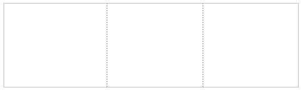

下面的图是一个二维数组，也称为矩阵。这个矩阵是从第一个一维数组构建的，但现在有两行三列，总共六个元素：


一个*n*-维数组可以表示为类似于以下图的立方体。这个*n*-维数组继续从前两个示例构建，现在包括第三个维度或轴：

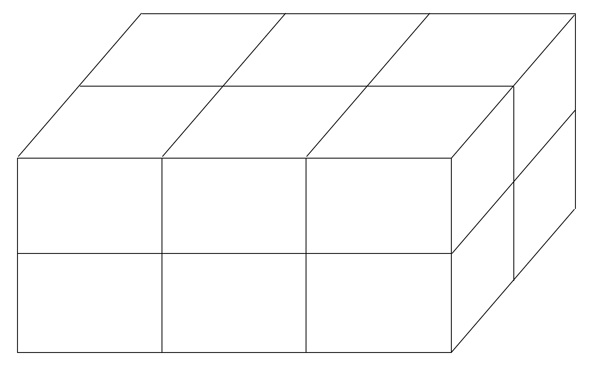

我认为最好的学习方法是通过实际操作，熟悉使用命令来处理数据，所以让我们启动一个 Jupyter 笔记本，通过一些简单的示例来学习。

# 创建你的第一个 NumPy 数组

创建一维数组的简单示例是一个直接的命令。在将你的 Jupyter 笔记本从`Untitled`重命名为`array_basics`后，首先要做的是通过在`In []`命令中输入`import numpy as np`并将单元格运行，将`numpy`库导入到你的活动会话中。

我喜欢首先运行这一行以确保库已正确安装，所以如果你收到错误，请仔细检查并确保`conda`或`pip`已正确设置。有关帮助，请参阅第二章，*Python 和 Jupyter Notebook 安装概述*。

接下来，你想要给数组对象分配一个变量名，这样你就可以在未来的命令中引用它。通常使用单个字符值，如`a`或`x`作为数组的快捷方式，但为了便于入门，让我们使用更描述性的名称，例如`my_first_array`以便更容易引用。在等号右侧，我们使用`np.array`引用`numpy`方法，后跟一个括号和方括号，它们封装了每个元素的分配值。运行命令后，为了确保语法正确，最后的命令将是打印数组以确保输出与输入匹配。一旦完成，结果应该类似于以下截图：

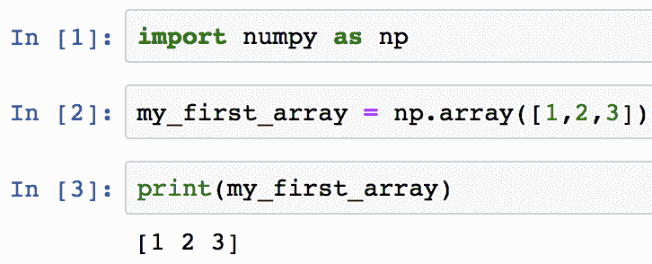

现在我们有了可用的数组，让我们来了解一下如何验证其内容。

## 有用的数组函数

这里包含了一些对 NumPy 中任何数组运行以获取元数据（关于数据的数据）的有用命令。这些命令是针对名为`my_first_array`的变量运行的：

+   `my_first_array.shape`：它提供了数组的维度。

+   `my_first_array.size`：这显示了数组元素的数量（类似于表格中的单元格数量）。

+   `len(my_first_array)`：这显示了数组的长度。

+   `my_first_array.dtype.name`：这提供了数组元素的数据类型。

+   `my_first_array.astype(int)`：这会将数组转换为不同的数据类型——在这个例子中，将显示为`int64`的整数。

如果你将在 Jupyter 中运行前面的命令，你的笔记本应该看起来类似于以下截图：

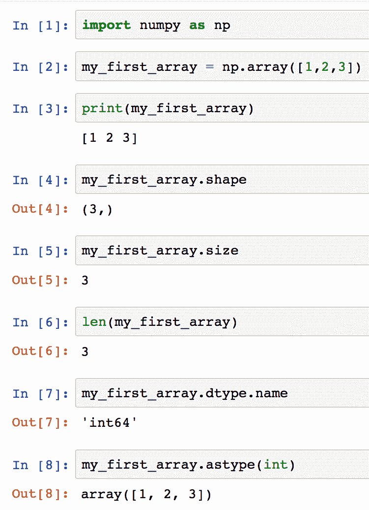

一维数组的形状、大小和长度都会输出相同的结果。

要引用数组中的单个元素，你使用方括号以及一个序数整数，这被称为数组索引。如果你熟悉 Microsoft Excel 函数`vlookup`，要引用要检索的数据的索引的行为有类似的概念。使用 NumPy 的任何数组中的第一个元素将是`0`，所以如果你只想显示上一个例子中的第一个值，你将输入`print(my_first_array[0])`命令，这将输出屏幕上的`1`，如以下截图所示：

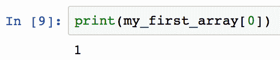

由于我们在这个例子中使用的数组具有数值，我们还可以对这些值执行一些数学函数。

注意 NumPy 中数组的默认`dtype`是`float`，但如果您在首次创建时不定义数据类型，Python 将根据分配的值自动分配一个，或者提供错误信息。

您可以对具有`dtype`为`int`或`float`的数值数组运行以下一些有用的统计函数：

+   `my_first_array.sum()`: 计算所有元素值的总和

+   `my_first_array.min()`: 提供整个数组中的最小元素值

+   `my_first_array.max()`: 提供整个数组中的最大元素值

+   `my_first_array.mean()`: 提供平均值或平均数，即元素的总和除以元素的数量

如果您在笔记本中对`my_first_array`运行这些统计命令，输出将类似于以下截图：

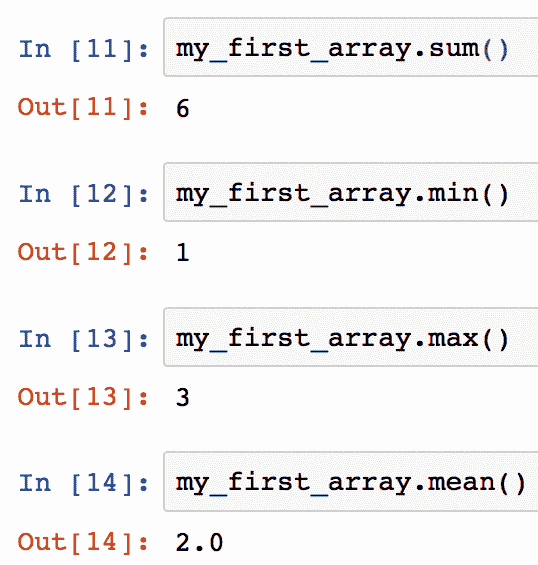

如您从这些几个示例中可以看到，NumPy 库中内置了许多有用的函数，这些函数将帮助您在分析过程中进行数据验证和质量检查。在*进一步阅读*部分，我放置了一个可打印的一页速查表链接，方便参考。

# NumPy 和数组的实际应用案例

让我们通过一个实际案例来了解如何在数据分析中使用一维数组。这里是场景——您是一位数据分析师，想知道当前**年度累计**（**YTD**）的股票代码的最高每日收盘价。为此，您可以使用数组将每个值作为元素存储，从高到低排序价格元素，然后打印第一个元素，这将显示最高价格作为输出值。

在将文件加载到 Jupyter 之前，最好检查文件内容，这支持我们在第一章中讨论的**了解您的数据**（**KYD**）概念，*数据分析基础*。以下截图是一个逗号分隔的、具有两列的结构化数据集。该文件包含一个带有`Date`字段的标题行，其格式为`YYYY-MM-DD`，以及一个标记为`Close`的字段，它代表该股票代码在交易日结束时的收盘价。这些数据是从 Yahoo Business 下载的，手动删除了一些列，然后以逗号分隔的格式存储为文件。文件名代表股票代码，因此`AAPL`代表苹果公司，这是一家在**全国证券交易商自动报价协会**（**NASDAQ**）股票交易所上市的上市公司：

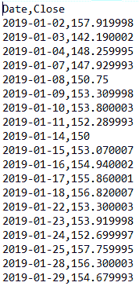

第一步将是加载包含数据的文件。为了方便，我已经将此文件放置在此书的 GitHub 仓库中，因此请继续使用第二章中介绍的最佳实践创建一个新的项目文件夹，启动一个新的 Jupyter Notebook。

使用 Python 的语法是明确和区分大小写的，所以如果预期的输出不正确或收到错误信息，不要气馁。在大多数情况下，简单地更改代码就可以解决问题，然后可以重新运行命令。

对于此场景，有几个选项可以使用 NumPy 将数据加载到数组中。

## 手动分配数组值

第一种选项是显式地将值手动分配给数组，如下面的截图所示：

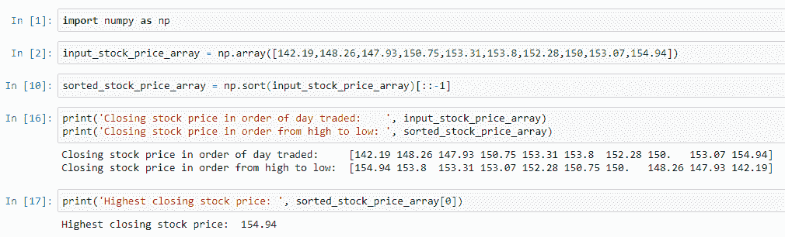

此选项适用于小型数据集、测试语法或其他特定用例，但在处理大数据或多个数据文件时将不切实际。我们通过仅输入源文件中的十个值来使用此选项进行了一些捷径。由于所有股票价格都是数值型并且具有一致的数据类型，我们可以使用默认`dtype`为`float`的一维数组。

重新生成此选项的步骤如下：

1.  启动 Jupyter 并创建一个新的 Python 笔记本。

1.  为了保持最佳实践的一致性，在继续之前，请确保将笔记本重命名为`highest_daily_closing_stock_price_option_1`。

1.  输入以下命令以在笔记本中导入`numpy`库，输入`In []:`，并运行单元格：

```py
In []: import numpy as np
```

1.  在下一个输入单元格中，添加以下命令使用快捷键`np`将值赋给名为`input_stock_price_array`的 NumPy 数组变量。通过运行单元格继续，这将不会产生输出，`Out []`：

```py
input_stock_price_array = np.array([142.19,148.26,147.93,150.75,153.31,153.8,152.28,150,153.07,154.94])
```

1.  在下一个输入`In []:`单元格中，添加以下命令将值赋给名为`sorted_stock_price_array`的 NumPy 数组变量，并运行该单元格。与之前类似，结果将不会产生输出，`Out []`：

```py
sorted_stock_price_array = np.sort(input_stock_price_array)[::-1] 
```

1.  输入以下命令，这些命令使用`print()`函数显示每个数组变量的结果：

```py
print('Closing stock price in order of day traded: ', input_stock_price_array)
print('Closing stock price in order from high to low: ', sorted_stock_price_array) 
```

按下*Enter*键创建新行，以便在运行单元格之前添加第二行命令。

1.  确认输出单元格显示`Out []`：

+   将会有两行输出，第一行是原始值数组。

+   第二行输出是数组中值的排序列表。

1.  输入以下命令以使用`print()`函数显示结果：

```py
print('Highest closing stock price: ', sorted_stock_price_array[0]) 
```

1.  确认输出单元格显示`Out []`。输出应声明`最高收盘股票价格：154.94`。

从这些步骤中需要记住的关键概念是，你加载一个初始的股票价格值数组，并将其命名为 `input_stock_price_array`。这一步是在导入 NumPy 库并将其分配给 `np` 快捷方式之后完成的，这是一种最佳实践。接下来，你从原始数组创建一个新的数组，命名为 `sorted_stock_price_array`，并使用 NumPy 的 `sort()` 函数。`sort()` 函数的好处是它会自动将原始数组的元素从低到高排序。由于本场景的目标是获取最高值，我们在函数中添加了 `[::-1]` 参数，这将按降序排序值元素。

从原始数组创建一个新的数组有助于使你的分析更容易重复和重用。操作顺序在这个过程中变得至关重要，因此你必须按顺序执行步骤以获得正确的结果。

为了验证结果，我们添加了一个额外的步骤来一起打印两个数组，以便直观地比较元素并确认新数组是按降序排序的。由于原始任务是获取 *最高* 股票价格，所以最终步骤是打印排序数组中的第一个元素，其索引值为 `0`。如果步骤没有错误地执行，你将看到数据样本中的最高收盘股票价格，即 `154.94`。

## 直接分配数组值

与手动在数组中分配值相比，一个更可扩展的选项是使用另一个名为 `genfromtxt()` 的 NumPy 命令，该命令在 `numpy` 库中可用。使用此函数，我们可以直接从读取文件的行和列中分配数组元素。`genfromtxt()` 函数有几个参数，可以支持通过隔离所需的特定列及其数据类型来处理数据的结构。

`genfromtxt()` 函数有多个必需和可选参数，你可以在 *进一步阅读* 部分找到它们。对于我们的示例，让我们浏览一下回答我们业务问题所需的那些参数： 

+   第一个参数是文件名，它被分配给我们上传的文件，命名为 `AAPL_stock_price_example.csv`。

+   第二个参数是分隔符，由于输入文件就是这样结构的，所以是逗号。

+   下一个参数是通知函数我们的输入数据文件有一个标题，通过将 `names=` 参数分配给 `True`。

+   最后一个参数是 `usecols=`，它定义了从哪个特定列读取数据。

根据 `genformtxt()` 函数的帮助信息，当传递一个值给 `usecols=` 参数时，默认情况下第一列总是被分配为 `0`。由于我们需要文件中的 `Close` 列，我们将参数值更改为 `1` 以匹配我们在输入文件中找到的顺序。

一旦使用`genfromtxt()`函数将`input_stock_price_array`加载到内存中，一个快速的*大小*检查将验证元素数量与源文件中的行数相匹配。请注意，标题行将不包括在内。在下面的屏幕截图中，您可以看到对手动数组选项的一些修改，但一旦数组用值填充，剩余的步骤非常相似。我在`print()`函数中添加了`[:5]`以显示前五个元素，使其更容易比较源输入数组和新的排序数组：

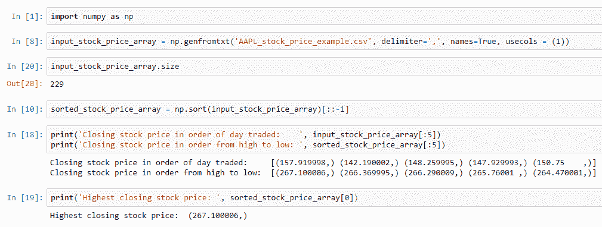

重现此选项的步骤如下：

1.  启动 Jupyter 并创建一个新的 Python 笔记本。

1.  为了保持最佳实践的一致性，在继续之前，请确保将笔记本重命名为`highest_daily_closing_stock_price_option_2`。

1.  将`AAPL_stock_price_example.csv`文件上传到 Jupyter 笔记本。

1.  在`In []:`单元格中输入`import numpy as np`。

1.  运行单元格。

1.  在下一个`In []:`单元格中输入`input_stock_price_array = np.genfromtxt('AAPL_stock_price_example.csv', delimiter=',', names=True, usecols = (1))`。

1.  运行单元格。

1.  在下一个`In []:`单元格中输入`input_stock_price_array.size`。

1.  验证输出单元格显示`Out []:`。当排除标题行时，行数为`229`。

1.  在下一个`In []:`单元格中输入`sorted_stock_price_array = np.sort(input_stock_price_array)[::-1]`。

1.  运行单元格。

1.  在下一个`In []:`单元格中输入`print('Closing stock price in order of day traded: ', input_stock_price_array[:5]) print('Closing stock price in order from high to low: ', sorted_stock_price_array[:5])`。

1.  运行单元格。

1.  验证输出单元格显示`Out []`：

+   将会有两行输出，第一行是原始值数组。

+   第二行输出是数组的排序值列表。

1.  在下一个`In []:`单元格中输入`print('Highest closing stock price: ', sorted_stock_price_array[0])`。

1.  运行单元格。

1.  验证输出单元格显示`Out []:`。输出应声明`Highest closing stock price: 267.100006`。

## 使用循环给数组赋值

另一种可能使用更多代码但更有灵活性来控制填充数组过程中的数据质量的方法是使用循环。使用这种方法需要了解一些概念，但我认为这将有助于理解这一点，并适用于进一步的学习练习。

过程的总结如下：

1.  将文件读入内存

1.  遍历每个单独的记录

1.  从每条记录中删除一个值

1.  将每个值分配给一个临时数组

1.  清理数组

1.  以降序对数组进行排序

1.  打印数组中的第一个元素以显示最高价格

在这个过程的最后几个步骤应该看起来很熟悉，因为它们是从上一个选项中重复的，其中我们清理数组，对其进行排序，然后打印第一个元素。重现此选项的完整步骤如下：

1.  启动 Jupyter 并创建一个新的 Python 笔记本。

1.  为了保持最佳实践的一致性，在继续之前，请确保将笔记本重命名为 `highest_daily_closing_stock_price_option_3`。

1.  将 `AAPL_stock_price_example.csv` 文件上传到 Jupyter 笔记本。

一定要将源 CSV 文件上传到正确的文件位置，这样你就可以在 Jupyter 笔记本中引用它。

1.  在笔记本输入 `In []:` 中输入以下命令以导入 `numpy` 库，并运行该单元。运行此命令后不会有输出：

```py
In []: import numpy as np
```

1.  在我们可以填充它之前，通过清理所有值来初始化数组。运行此命令后不会有输出：

```py
In []: temp_array = []
```

1.  在以下代码块中，我们必须在循环中连续执行多个命令。顺序很重要，Jupyter 会自动缩进，当你输入 `In []:` 单元时。我包括了注释以更好地理解代码。运行此命令后不会有输出：

```py
#A. Read the file into memory
 with open('AAPL_stock_price_example.csv', 'r') as input_file:

     #B. load all the data into a variable
     all_lines_from_input_file = input_file.readlines()

     #C. Loop through each individual record 
     for each_individual_line in all_lines_from_input_file:

         #D. Strip out a value from each record
         for value_from_line in \
           each_individual_line.rsplit(',')[1:]:

             #E. Remove the whitespaces from each value
             clean_value_from_line = \
                            value_from_line.replace("\n", "") 

             #F. Assign each value to the new array by element
             temp_array.append(clean_value_from_line)
```

1.  在 `temp_array` 被填充了元素之后，一个快速的 `print()` 函数识别出另一个需要执行的数据清理步骤。在下一个 `In []:` 单元中输入以下命令并运行该单元：

```py
print(temp_array[:5])
```

1.  确认输出单元显示 `Out []`，它将类似于以下截图。数组包括一个标题行值 `Close`，价格值周围有单引号：

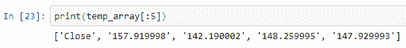

1.  源文件中的标题行已被包含在我们的数组中，这可以通过将数组赋值给自己并使用 `delete()` 函数删除第一个元素来轻松移除。运行此命令后不会有输出：

```py
temp_array = np.delete(temp_array,0)
```

1.  使用 `size()` 函数通过添加以下命令来确认数组的大小与原始源输入文件匹配，并运行该单元：

```py
temp_array.size
```

1.  确认输出单元显示 `Out []`，它将类似于以下截图。排除标题行时，行数为 `229`：

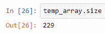

1.  数组的每个元素周围都有单引号。这可以通过使用 `astype()` 方法的简单命令来修复，将数组的 `dtype` 转换为 `float`，因为股票价格是十进制数值。运行此命令后不会有输出：

```py
input_stock_price_array = temp_array.astype(float)
```

1.  打印新数组中的前几个元素以验证数组已清理元素：

```py
print(input_stock_price_array[:5])
```

1.  验证数组现在只包含十进制格式的数值，并且引号已被移除，类似于以下截图：

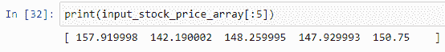

1.  最后几个步骤是之前练习的重复。我们使用 `sort()` 函数按降序排序数组，并通过传递参数 `[::-1]` 来从高到低排序。在下一个 `In []:` 单元中输入以下命令并运行该单元。运行此命令后不会有输出：

```py
sorted_stock_price_array = np.sort(input_stock_price_array)[::-1] 
```

1.  通过在`sorted_stock_price_array`中引用第一个排序元素并使用`print()`函数输入命令来运行单元格，打印数组中的前几个元素以显示最高价格：

```py
print('Closing stock price in order of day traded: ', input_stock_price_array[:5])
print('Closing stock price in order from high to low: ', sorted_stock_price_array[:5]) 
```

1.  确认输出单元格显示`Out []`：

+   将会有两行输出，第一行是原始值数组。

+   第二行输出是数组值的排序列表。

这将类似于以下截图：

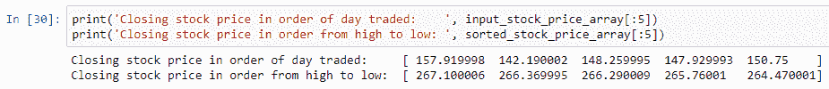

1.  要查看最高价格，请使用`print()`函数，并对排序后的数组使用`[0]`命令来显示第一个值：

```py
print('Highest closing stock price: ', sorted_stock_price_array[0])
```

1.  确认输出单元格显示`Out []`，这将类似于以下截图。输出应声明`最高收盘价：267.100006`：

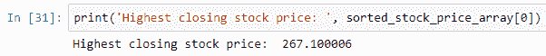

# 摘要

恭喜，我们现在已经学会了如何使用`numpy`库的关键特性以及一些实际应用案例。我们首先通过提供它们在计算机科学和编程语言中根植数十年的例子来了解数组及其重要性。我们还学习了结构化数据的基础，它使用数组的概念，通过解释单维和多维数组的区别以及我们通常如何将它们识别为具有列和行的表格。

在解释了历史和理论之后，我们学习了如何创建 NumPy 数组，并探讨了一些有用的函数。我们通过将股票价格加载到数组中作为实际应用案例来结束本章，以展示如何通过使用一些用于数据分析的 NumPy 命令来回答特定问题。通过理解数据类型如何影响数据分析以及 KYD 概念的重要性，本章加强了数据处理能力。

在下一章中，我们将通过一些实际操作课程来扩展你的数据处理能力，这些课程将使用`pandas`库中的数据结构 DataFrame。

# 进一步阅读

这里有一些链接，你可以参考，以了解更多关于本章相关主题的信息：

+   原始 NumPy 用户文档：[`people.csail.mit.edu/jrennie/python/numeric/numeric-manual.pdf`](http://people.csail.mit.edu/jrennie/python/numeric/numeric-manual.pdf)

+   *理解 Python 中的数据类型*：[`jakevdp.github.io/PythonDataScienceHandbook/02.01-understanding-data-types.html`](https://jakevdp.github.io/PythonDataScienceHandbook/02.01-understanding-data-types.html)

+   NumPy 快速参考：Python 中的数据分析：[`www.datacamp.com/community/blog/python-numpy-cheat-sheet`](https://www.datacamp.com/community/blog/python-numpy-cheat-sheet)

+   NumPy `genfromtxt()` 函数帮助指南：[`docs.scipy.org/doc/numpy/reference/generated/numpy.genfromtxt.html`](https://docs.scipy.org/doc/numpy/reference/generated/numpy.genfromtxt.html)

+   使用 NumPy 进行图像处理：[`www.degeneratestate.org/posts/2016/Oct/23/image-processing-with-numpy/`](http://www.degeneratestate.org/posts/2016/Oct/23/image-processing-with-numpy/)

+   Logo 编程语言的历史：[`www.sydlexia.com/logo.htm`](http://www.sydlexia.com/logo.htm)

+   Logo 模拟器：[`www.calormen.com/jslogo/#`](https://www.calormen.com/jslogo/#)

+   Python 列表和 NumPy 数组之间的区别：[`webcourses.ucf.edu/courses/1249560/pages/python-lists-vs-numpy-arrays-what-is-the-difference`](https://webcourses.ucf.edu/courses/1249560/pages/python-lists-vs-numpy-arrays-what-is-the-difference)

+   Yahoo Finance 股票行情数据：[`finance.yahoo.com/quote/AAPL/history?period1=1546318800&period2=1574744400&interval=1d&filter=history&frequency=1d`](https://finance.yahoo.com/quote/AAPL/history?period1=1546318800&period2=1574744400&interval=1d&filter=history&frequency=1d)
