创建您的第一个 pandas DataFrame

在本章中，我们将探讨使用文件系统和格式进行核心数据分析技能。我们将使用 Python OS 和字符串库探索用于操作来自源文件（如 **逗号分隔值**（**CSV**）、**可扩展标记语言**（**XML**）和 **JavaScript 对象表示法**（**JSON**））的文本和数值数据的不同文件格式。您将了解 pandas DataFrame 是什么以及如何从文件源创建 DataFrame 进行数据分析。

我们在本章中将涵盖以下主题：

+   操作表格数据的技术

+   理解 pandas 和 DataFrame

+   处理基本数据格式

+   数据字典和数据类型

+   创建您的第一个 DataFrame

# 技术要求

这是本书的 GitHub 仓库链接：[`github.com/PacktPublishing/Practical-Data-Analysis-using-Jupyter-Notebook/tree/master/Chapter04`](https://github.com/PacktPublishing/Practical-Data-Analysis-using-Jupyter-Notebook/tree/master/Chapter04)。

您可以从以下链接下载并安装所需的软件：[`www.anaconda.com/distribution/`](https://www.anaconda.com/distribution/)

# 操作表格数据的技术

现在，我们已经通过在 第三章 “使用 NumPy 入门” 中使用 NumPy 库更好地理解了数组数据结构，我们可以现在扩展我们的数据分析专业知识。我们将通过处理表格数据并专注于 Python 中可用的强大库 `pandas` 来做到这一点，该库可用于我们的 Jupyter 笔记本。

`pandas` 库扩展了我们分析结构化数据的能力，并于 2008 年由 Wes McKinney 作为 Python 库引入。McKinney 认识到通过使用库来扩展 Python 语言的力量，以及通过在 Python 中执行整个数据分析工作流程（无需切换到更特定领域的语言，如 R）来填补数据准备与数据洞察之间存在的差距的必要性。

`pandas` Python 库的名称取自术语 **panel data**（由 McKinney 提出），通过缩短和合并术语得到 `pan` 和 `da`。面板数据定义为可以在一段时间内用多个维度的值进行测量的观测值，在统计研究和研究论文中非常常见。我也见过面板数据被称为纵向数据、事实面板数据或横截面时间序列数据。面板数据以表格形式呈现，有行和列，并且有几种不同类型，如平衡的、不平衡的、长的、短的、固定的和旋转的。

这些面板数据类型都是基于数据集数量的精确表示方式。观察值的总数（数据行）通常用字母`N`表示。时间元素的单位，如年、月、季度或日期，通常用大写或小写的字母`T`表示。维度或变量（数据列）可以用每个实体的特定字母表示，例如`x`或`z`。所测量的量可以用一个或多个变量表示，通常分配给`y`。你应该能够用描述性术语总结任何面板数据，以便消费者在查看或以表格形式处理它之前理解。

根据数据集的不同，维度可能随时间变化，也可能不变化，因此可能使用不同的字母，如`k`来表示这种区别。

面板数据的一个例子是三个上市公司的 3 天每日收盘价，如下表所示：

| **日期** | **股票代码** | **收盘价** |
| --- | --- | --- |
| 12/2/2019 | ABC | $50.21 |
| 12/3/2019 | ABC | $52.22 |
| 12/4/2019 | ABC | $51.01 |
| 12/2/2019 | DEF | $24.22 |
| 12/3/2019 | DEF | $26.22 |
| 12/4/2019 | DEF | $29.50 |
| 12/2/2019 | GHI | $61.22 |
| 12/3/2019 | GHI | $65.33 |
| 12/4/2019 | GHI | $75.00 |

另一个例子是过去三个月（按月）按 ZIP 代码划分的最低、最高和平均温度，如下表所示：

| **月份** | **ZIP 代码** | **最低温度** | **最高温度** | **平均温度** |
| --- | --- | --- | --- | --- |
| 六月 | 19901 | 75 | 88 | 82 |
| 七月 | 19901 | 77 | 90 | 84 |
| 八月 | 19901 | 68 | 85 | 77 |
| 六月 | 08618 | 76 | 89 | 83 |
| 七月 | 08618 | 78 | 91 | 85 |
| 八月 | 08618 | 69 | 86 | 78 |
| 六月 | 18940 | 74 | 87 | 81 |
| 七月 | 18940 | 76 | 89 | 83 |
| 八月 | 18940 | 67 | 84 | 76 |

一个不平衡的面板将是一个其中至少有一个维度值缺失的值。一个平衡的面板将是一个包含所有维度元素且跨越所有时间段的包容性数据集。

我们从第一章，《数据分析基础》中了解到，数据以各种形状和大小存在，因此将数据以表格形式结构化将是分析过程的第一步，但在许多情况下，并非最终步骤。例如，在下面的表格中，我们有过去三年按城市划分的总销售额的汇总交叉表。

这类汇总数据可以识别为交叉表，这使得数据消费者能够快速识别按城市和按年份的最高和最低销售额。在这种情况下，这将是 2019 年的纽约，销售额为$120,000，以及 2017 年的波士顿，销售额为$25,000：

| **城市** | **2017** | **2018** | **2019** |
| --- | --- | --- | --- |
| 费城 | $50,000 | $75,000 | $100,000 |
| 纽约 | $35,000 | $65,000 | $120,000 |
| 波士顿 | $25,000 | $40,000 | $ 90,000 |

如果这个数据表只有有限行和列，这将是你的分析的最终步骤，因为你可以在不进行额外操作的情况下快速回答大多数商业问题，例如哪个城市的销售额最高。然而，如果记录数量增加到显示超过 100 个城市，我们将年份增加到最近 10 年，或者你想要获取更多细节以更好地理解销售额，通过增加维度（如产品、店铺编号、交易日期、一天中的时间和支付方式）来细分金额，会怎样呢？

增加列的数量将使回答简单的商业问题变得具有挑战性和耗时，例如，所有城市所有年份的平均销售额是多少？因此，分析的可扩展性取决于你操纵数据的能力，而不仅仅是接收数据的方式。

数据分析的最佳实践是*从结果出发开始分析*。因此，对于这个例子，我们想要生成的输出表将类似于以下表格，我们将列转置为行，以便更容易进行额外分析，并且我们准备好处理更大的数据量：

大规模的数据量是一个主观术语，但所使用的技术应该支持分析数百万或数十亿行数据。你将需要超出个人工作站可用 RAM 和 CPU 限制的额外基础设施。

| **城市** | **年份** | **销售额** |
| --- | --- | --- |
| 费城 | 2017 | $50,000 |
|  | 2018 | $75,000 |
|  | 2019 | $100,000 |
| 纽约 | 2017 | $35,000 |
|  | 2018 | $65,000 |
|  | 2019 | $120,000 |
| 波士顿 | 2017 | $25,000 |
|  | 2018 | $40,000 |
|  | 2019 | $90,000 |

从前面的输出中，我们可以看到：

+   数据结构类似于前面输出表的第一大优势是，每个列都有一个单一的数据类型，这通常被称为维度或轴。

+   第二个优势是，由于每个维度都可以被视为具有相同数据类型的独立值数组，因此统计分析变得更加容易，可以使用 NumPy 进行计算，如第三章所述，*NumPy 入门*。

+   第三个优势是能够按表中的任何字段排序，而不用担心每行/元组中的数据值变得错位或不一致。

+   保持数据的完整性可以建立对分析过程的信任，并确保你的分析将是准确的。

建议你在数据操作过程中分解每个步骤，以便使过程可重复——例如，如果你被要求在几个月后重复这个过程，或者如果你必须调试底层源数据中存在的异常，这是非常常见的。

# 理解 pandas 和 DataFrames

既然我们对表格数据有了更好的理解，我们也提供了一些关于面板数据以及 `pandas` 库创建原因的背景信息，那么让我们通过一些 `pandas` 的例子来深入了解，并解释 DataFrame 的使用方法。

`pandas` 库是一个强大的 Python 库，用于更改和分析数据。`pandas` DataFrame 是库中的一个功能，定义为具有标记轴（行和列）的二维、大小可变的、可能异构的表格数据结构。DataFrame 是一个二维数据结构——也就是说，数据以表格形式按行和列对齐。众所周知，`pandas` DataFrame 由三个主要组件组成：数据、行和列。作为一个视觉学习者，我创建了一个以下图表的例子，我们现在可以一起看看：

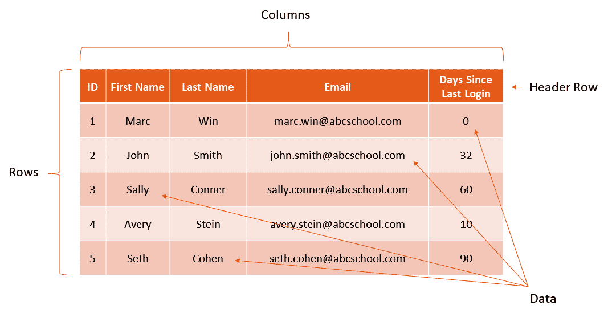

DataFrame 可以与电子表格进行比较，例如 Microsoft Excel 或 Google Sheets，任何 **关系数据库管理系统**（**RDBMS**）中找到的单个 SQL 表，或者甚至是一个 **QlikView 数据**（**QVD**）文件。之前的例子都包含一个 **标题行** 的共同元素，它定义了数据的标签和对齐方式，**行**（每行被识别为一个单独的记录），**列** 对每个字段值的结构进行分类，以及包含数值和/或文本值的 **数据**。

在我们的例子中，每一行都包含一个 `ID` 字段的身份记录，但这在 `pandas` DataFrame 中不是必需的。DataFrame 在 Python 中被视为对象，并支持直接将数据从文件或 SQL 源加载到内存中，以便进行额外的操作和分析。使用 DataFrame 的一些关键好处包括以下内容：

+   它允许您将所有源文件转换为可读的数据对象，以便更容易地进行合并和分析。

+   它提供自动或定义的索引，以帮助查找值或从 DataFrame 中选择交叉选择，这通常也称为数据切片。

+   每一列都可以被视为一个单独的 NumPy 数组，这些数组可以具有多种数据类型。

+   它在修复数据对齐和缺失数据元素方面表现卓越，这些元素显示和引用为 **非数字**（**NaN**）。

+   它允许在不返回每个数据集的记录源的情况下进行数据旋转和重塑。

+   使用单个 Python 命令添加、删除或更改数据很容易，这样可以加快对一个或多个数据源的分析。

+   允许对指标进行聚合，如 `Group By`，以及执行 `sum`、`min`、`max` 等其他计算。

+   允许对一个或多个 DataFrame 进行合并、排序、连接和过滤。

+   它可以扩展以支持可重复的工作流程分析。例如，以下伪代码步骤在 Jupyter 笔记本中很容易复制：

1.  导入 `pandas` 库。

1.  将源文件加载到新的 DataFrame 中。

1.  创建一个第二个 DataFrame，它会从原始 DataFrame 中删除重复的行或列。

1.  创建汇总指标。

1.  将第二个 DataFrame 保存为新的文件。

我喜欢使用`pandas`和 DataFrame 的原因是，作为数据分析师，内置命令的灵活性。让我们通过几个例子来了解一下。要从头开始创建一个包含有限记录的 DataFrame，你可以简单地使用几个命令来添加它们：

1.  要加载`pandas`，你只需将以下命令添加到你的 Jupyter 笔记本中并运行该单元格。你可以自由地跟随创建自己的笔记本；我已经在 GitHub 上添加了一个副本以供参考：

```py
In[]: import pandas as pd
```

1.  接下来，我们有几个产品——`a`、`b`和`c`——以及销售数量，我们将这些输入数据分配给一个名为`product_data`的变量：

```py
product_data = {
   'product a': [13, 20, 0, 10],
   'project b': [10, 30, 17, 20],
   'project c': [6, 9, 10, 0]
}
```

当手动加载数据时，请注意方括号的位置，用于封装每个列标签的值，以及数组必须具有相同的长度。

1.  然后，我们想要通过调用命令并使用`pd`快捷方式来引用`pandas`库以及`DataFrame()`命令来加载数据框。我们将 DataFrame 输入数据作为第二个变量分配，以便更容易引用，称为`purchase_data`。`In[]`单元格将如下所示：

```py
purchase_data = pd.DataFrame(product_data)
```

1.  为了验证结果，你可以运行`head()`函数来显示前五行数据，使用以下命令：

```py
purchase_data.head()
```

执行前面的代码后，我们可以看到：

+   输出结果将类似于以下截图，其中各个数组的副产品已被转换为一个带有标签标题行的 DataFrame，并且每个销售数量值都进行了对齐，以便于参考。

+   注意，在`product a`左侧创建了一个新的索引列，并分配了从`0`开始的顺序值：

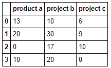

1.  拥有索引值对于参考很有用，但如果我们希望在创建 DataFrame 时定义它们，我们可以在创建过程中包含一个相关命令，如下所示：

```py
purchase_data = pd.DataFrame(product_data, index=['Ronny,' 'Bobby,' 'Ricky,' 'Mike'])
```

1.  现在，如果你运行`head()`命令来显示结果，你将看到每个索引号分配了特定的值，其显示方式如下所示：

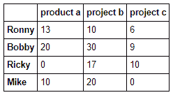

1.  要从 DataFrame 中选择特定的行，你使用`loc`函数通过索引检索结果，如下所示：

```py
purchase_data.loc['Ronny']
```

这将产生一个输出，如下面的截图所示，其中显示分配给`Ronny`的行的各个值以汇总格式呈现，每列和值都由一个包含索引名称和值的数据类型描述的行表示（`dtype: int64`）：

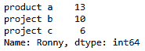

一旦索引被标记，你必须使用单引号中的名称来访问`loc[]`函数；然而，你可以使用`iloc[]`或`ix[]`函数通过数字引用行索引，第一行从`0`开始。因此，`purchase_data.iloc[0]`或`purchase_data.ix[0]`都将返回与前面截图相同的结果。

# 处理基本数据格式

通过更好地理解使用`pandas`库和数据框（DataFrames）功能的力量，让我们来探索处理多种数据格式，包括来自 CSV、JSON 和 XML 等源文件。我们在第一章，“数据分析基础”中简要介绍了这些不同的文件格式作为理解结构化数据的一部分，因此让我们深入探讨每种源文件类型，并学习一些处理它们时的基本技能。

## CSV

首先，我们有 CSV，这在我的职业生涯的大部分时间里一直是行业标准。通常通过`.csv`文件扩展名来识别 CSV 文件；然而，随着时间的推移，你会发现这并不总是如此，用于分隔数据记录中值的分隔符也不一定是逗号。CSV 文件之所以受欢迎，是因为它们具有可移植性，并且从创建它们的源系统中技术上是中立的。

这意味着 CSV 文件可能是由任何编程语言创建的，例如 Python、C++或 Java。同样，创建 CSV 文件的相同操作系统，如 Windows、Unix、Linux 或 macOS，也不需要读取文件。这有助于 IT 专业人士在需要时在组织内外移动数据，从而帮助其被广泛采用。

由于其持久性，你会发现多年来已经采用了许多不同的变体和标准。例如，记录可能包含或不包含标题行，并且字段/列之间的分隔符可以是制表符、管道（`|`）或任何其他 ASCII 或 UTF-8 字符值。

**美国信息交换标准代码**（**ASCII**）是计算机用来以数字方式解释键盘值的一种常见字符编码标准。**Unicode 转换格式**（**UTF-8**）是通用的字符编码标准，与 ASCII 向后兼容。这两个标准都很受欢迎，并且被广泛使用。

为正确的 CSV 格式定义了一些规则，但随着你继续使用它们，你可能会发现更多例外。由 Y. Shafranovich 在 2005 年发表的《互联网协会》中发布的部分规则如下：

+   CSV 文件中的每条记录应该是独立的，并包含一个换行符（`CRLF`）来标识每一行。

+   在最后一条记录后添加换行是可选的，但某种类型的**文件结束符**（**EOF**）将有助于在系统间读取数据。

+   标题行是可选的，但应包含与相应记录级别数据相同的字段/列数。

+   每条记录应使用一致的分隔符，例如逗号（`,`）、分号（`;`）、竖线（`|`）或制表符。

+   在每个字段值之间包含双引号是可选的，但建议这样做以避免错位或混淆，尤其是在读取包含字段值本身中的逗号的大型描述性文本数据时，例如`Also, Stacy enjoys watching movies`。

+   每个字段之间的前导和尾随空格也是可选的，但应在整个文件中保持一致。

+   CSV 文件的大小会有所不同，但可能相当大，并且取决于数据的密度（不同值的数量、行数和字段数）。

根据操作系统，例如 Linux，CSV 文件可能只包含每行的 **换行符**（**LF**），而不是 **回车符**（**CR**）。

在下面的屏幕截图中，我包含了一些 CSV 文件中样本行的示例，所有这些行都包含完全相同的信息，但使用不同的格式来分隔文件中的字段：

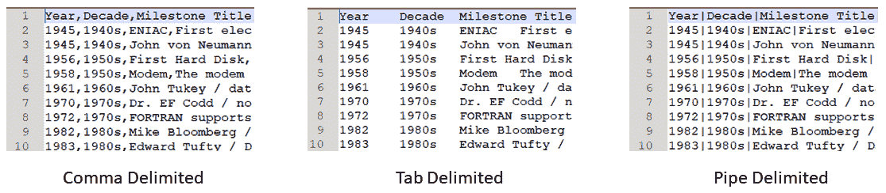

消费或生成 CSV 相对于其他格式的最大优势是能够在其他用于数据分析的工具之间共享。例如，电子表格解决方案，如 Excel，可以轻松读取 CSV 文件，而无需转换文件或使用第三方扩展。然而，一个缺点是丢失了每列定义的数据类型，这可能导致在分析中错误地表示值。例如，列中的`1`或`0`值可能代表布尔标志或来自网站的用户点击次数。

## CSV

XML 文件格式在 20 世纪 90 年代被引入作为一种标准格式。我还记得在我职业生涯的早期，XML 被提议作为 CSV 的替代品，甚至可以替代数据库作为数据存储库。XML 作为一种解决方案，对开发者来说非常灵活，可以用来创建网络应用，类似于 CSV，它被用来在组织内外移动数据。XML 是开源的，并且有一个由**万维网联盟**（**WC3**）组织维护的明确定义的标准。XML 文件格式的几个关键特性如下：

+   它通常与文件扩展名 `.xml` 相关联。

+   第一行应包含一个声明，其中包含编码细节和`.xml`版本，例如`<?xml version = "1.0" encoding="UTF-8" ?>`。

+   它在每个元素周围使用与 HTML 标签代码类似的标签，使用开始标签 `<` 和 `>` 或 `/>`。

+   它包含元素，这些是结构化数据中定义的字段或列。

+   它包含属性，这些是每个定义元素中的数据值。

+   包含 **文档类型定义**（**DTD**）是可选的，但推荐这样做，因为它提供了详细信息并有助于定义元素应该如何使用，以及数据类型。

下面的屏幕截图显示了示例 XML 文件。在这里，我将 `evolution_of_data_analysis.csv` 转换为 XML 格式，并显示了一些示例记录：

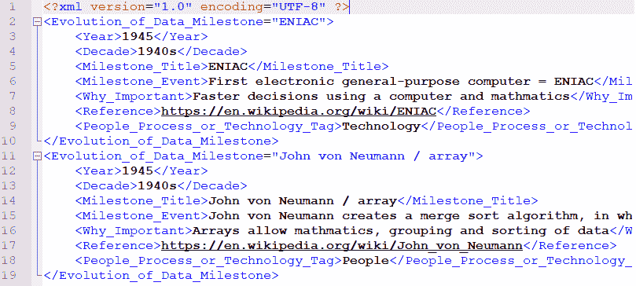

虽然 XML 的一个缺点是文件大小较大，因为需要在每个元素中添加标签和定义，但使用 XML 格式的优点是能够支持数据层次结构和定义的架构。让我们分析这两个要点。

### 数据层次结构

数据层次结构是数据字段或记录的明确和一致的分组。层次结构可能是显而易见的——例如，一个儿子有一个父亲和一个母亲——但从数据的角度来看，这种关系必须被定义。在 XML 文件格式中，您使用一个称为 XML 树的概念。树是由 XML 文件中具有定义关系的元素定义的。在 `Evolution of Data Analysis.xml` 文件的情况下，每个里程碑都有相关的详细信息分组在一起。现在，我们可以轻松地识别 `John von Neumann / array` 的里程碑事件是在 1945 年创建的，以及所有其他标记的辅助元素，如 `<Decade>`、`<Milestone Title>`、`<Milestone Event>`、`<Why Important>`、`<Reference>` 和 `<People Process or Technology Tag>`。这种层次结构关系通常被称为 **父子** 关系，其中每个缩进的元素都是父元素 `Evolution_of_Data_Milestone` 的子元素。

### 定义架构

定义架构意味着数据元素还将包括元数据（关于数据的资料），以帮助每个元素和属性的符合性。这个概念在大多数关系型数据库管理系统（RDBMS）中是必需的，但 XML 提供了将 DTD 文件包含在一个或多个 XML 文件中的概念。文件扩展名是 `.xsd`，它应该与每个 XML 文件相匹配。

XSD 文件的内容可能很复杂且非常密集，这取决于在 XML 文件中找到的记录的复杂性和在消费 XML 数据时定义刚性结构的需求。例如，为每个元素定义的数据类型可以帮助您更好地理解在分析期间如何使用数据。例如，如果使用 `type="xs:decimal"`，您就知道每个元素中的属性值必须包含数值，任何文本值都不应该存在。另一个有用的架构定义是 `use="required"` 的元素定义，这意味着特定的元素必须始终具有值，并且不应该包含任何空/空属性。

关于这个主题的更多细节可以在 W3C 网站上找到，您可以在本章的“进一步阅读”部分找到。

## JSON

JSON 是另一种用于系统间数据通信的开源文件标准。它由道格拉斯·克罗克福德于 2001 年左右创建，旨在通过一个称为**无状态**的概念来改善计算机和网页浏览器之间的通信。这意味着你的计算机的网页浏览器，即所谓的**客户端**，不必等待**服务器**响应，反之亦然。这也就是所谓的**表征状态转移**（**REST**）架构，在网页、API 和现代技术中非常常见，因为它可以扩展以支持数百万并发用户。

一旦 REST 成为流行的网络架构，寻找更快、更高效的通信协议的需求推动了 JSON 数据的采用，它既可以流式传输，也可以持久化为文件。由于许多网站使用 JavaScript 以及 JavaScript 友好的标记，这也增加了 JSON 的流行度。

与 XML 和 CSV 类似，JSON 不仅对人类可读，而且对许多不同类型的计算机系统和技术，如 Python，也是可读的。这也意味着 JSON 不是二进制文件格式，这意味着它不需要对文件进行编译以便计算机使用。我将 JSON 作为“数据分析的演变及其重要性”部分中的里程碑，在第一章，“数据分析基础”中包括，因为它对推进我们使用数据通信的贡献。以下截图显示了 JSON 格式示例，这与之前*XML*部分中的 XML 格式示例非常相似，因为你现在可以看到数据通过花括号（`{`和`}`）组织并按记录分组，以封装原始 CSV 文件中的每一行。每个使用花括号分组的都被识别为一个对象：

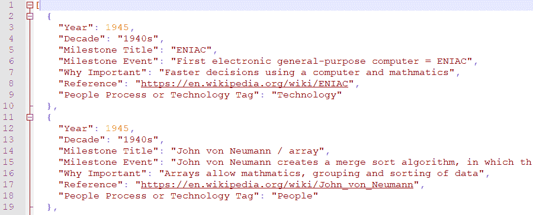

在理解 JSON 数据时，一个重要的概念是它起源于 XML，但简化了许多在 XML 格式中可能存在的复杂性。像 XML 一样，它受益于定义数据层次结构的能力，并包含一个定义良好的模式，支持称为**读取时模式**的概念。

在具有定义良好模式的传统解决方案中，生产者在任何数据加载或系统间传输之前被迫建立模式。这个过程需要专业知识，并在数据摄入期间增加了额外步骤，延迟了数据向消费者的交付。有了 JSON 和读取时模式的概念，生产者可以同时发送数据以及所有元数据。所有细节，如字段名称、每个字段的`dtype`（数据类型），以及在某些情况下，完整的数据字典，都将包括在内。提供这一级别的细节有助于数据消费者更好地理解每个元素和属性之间的关系。

你会在很多 JSON 格式的数据中找到`name: value`对的概念，这在之前的屏幕截图中的示例中也使用了。这个概念允许在识别每个记录中的字段的同时分配值，而不是将记录拆分到多行中。每个字段名称位于冒号（`:`）的左侧，而值位于冒号的右侧。

每个`name: value`关系由逗号分隔，许多示例将具有唯一的记录标识符，这有助于执行一对一关系的分析。因此，你可以在 JSON 结构中嵌套许多不同的关系，并且仍然有方法来识别`name: value`对属于哪个记录。如果需要在 JSON 文件中存储值数组，它们使用方括号（`[`和`]`）来定义值列表。

定义一个模式迫使数据具有超出观察到的控制项和上下文。它消除了对数据属性假设，并有助于解释数据值应该如何用于分析。例如，值`20191219`可以很容易地理解为整数值，或者可能是以`YYYYMMDD`格式存储的`12/19/2019`日期的表示。如果没有定义的模式来参考，以及关于如何以及为什么应该使用该字段的详细信息，你的数据分析可能会出现错误。

# 数据字典和数据类型

在整本书中，我将继续强调拥有数据字典以帮助分析数据的重要性。与迄今为止我们发现的所有数据一样，数据字典将具有各种形状和大小。这意味着它可能记录在源文件之外，这在帮助页面、维基或博客中很常见，或者在我们讨论的 XML 和 JSON 文件中记录在源数据内。

数据的定义和文档化将帮助你理解数据，但不会是成为数据集领域专家所需的所有方法。领域专业知识来自于理解数据如何使用以及底层源数据的业务或目的的经验。我们在第一章，“数据分析基础”，中讨论了这些概念，探讨了了解数据（**KYD**）和拥有数据字典如何有助于学习更多关于底层数据集的信息。

数据分析和 KYD 概念应该在整个数据分析过程中得到应用，所以请确保检查数字并验证结果是否符合数据的定义，以建立对洞察力的信任和信心。

数据字典在遗留系统、关系数据库管理系统（RDBMS）和传统的**企业数据仓库**（**EDW**）中很常见。通常会有一个数据目录可用，在许多情况下，它们是构建不同系统之间通信数据管道所必需的。在某些情况下，数据字典是作为监管要求的一部分或作为受控企业政策的一部分所必需的。

在现代系统中，**应用程序编程接口**（**APIs**）已成为元数据的中心存储库和事实上的数据字典，因为 JSON 是一种流行的通信工具，其中定义了模式并且应该有良好的文档。然而，在实践中，我发现文档是由程序员为程序员编写的，因此它可能无法满足完全理解数据和在分析期间回答所有业务问题的所有需求。

将数据字典版本化作为**主数据管理**（**MDM**）或数据治理解决方案的一部分也很常见。在这些版本中，您将揭示数据背后的**是什么**和**为什么**的细节。例如，一个字段可能被定义为非活动状态但仍然可用，因此它变得稀疏，因为用于填充它的应用程序/系统已经改变。

拥有如此详细的程度可能有助于识别数据差距或更好地理解如何通过在不同时间段结合两个不同领域的值来构建数据桥梁，以进行准确的历史分析。我曾经与一位客户合作，他正在用咨询硬件和软件替换一个耗资数百万美元的大型企业遗留系统。咨询时间按小时计算，每周有数十名专家前往客户现场。

在项目中有一个关键时刻，确定将所有遗留供应链、会计和人力资源细节从旧系统迁移到新系统是不切实际且成本过高的。为了避免延误，我们提出了一个分析解决方案，其中每天将遗留系统数据和新的系统数据合并在一起。构建了一个滚动时间窗口逻辑，因此 7 年后，遗留数据将不再用于分析，但在那个时间段内，包括不同字段和记录的两种系统的混合将用于分析。

对于此类解决方案，拥有数据字典是必不可少的，并且需要提供额外的文档以确保受众了解数据来源，这取决于报告和分析的时间段。该文档的一部分需要不同字段和数据类型变化的细节。某些系统将允许不同数据类型的混合，或者在 Python 中，将默认为特定的数据类型。

只需记住，你可能需要在多个来源之间转换数据类型，尤其是在不同系统和文件格式之间混合时。例如，在 JSON 中，定义为 `real` 的数字在 Python 中被称为 `float`。如果在加载数据时遇到转换数据类型的问题，可能需要回到数据源提供者并请求以更易于消费的格式重新发送。

随着你继续提高你的数据素养，你需要理解不同的技术和数据格式会导致不同的数据类型，这需要转换以确保对数据的准确分析，尤其是来自多个来源的数据。

# 创建我们的第一个 DataFrame

在我们开始一些动手示例之前，以下是一些在 `pandas` 中可以运行的实用命令：

+   `pd.read_csv('inport_filename.csv', header=1)`：直接从 CSV 文件读取数据到 `pandas` DataFrame

+   `my_df.to_csv('export_filename')`：直接将 DataFrame 导出为 CSV 文件到您的工作站

+   `my_df.shape`：提供 DataFrame 的行数和列数

+   `my_df.info()`：提供关于 DataFrame 的元数据，包括每列的数据类型

+   `my_df.describe()`：包括统计细节，其中包含计数、平均值、**标准差**（**std**）、最小值、最大值和百分位数（25th、50th 和 75th）的列

+   `my_df.head(2)`：显示 DataFrame 的前两条记录

+   `my_df.tail(2)`：显示 DataFrame 的最后两条记录

+   `my_df.sort_index(1)`：按轴上的标签排序——在这个例子中，按列标签标题从左到右字母顺序排序

+   `my_df.isnull()`：显示所有具有 `True`/`False` 指示器的行列表，如果任何列的值是空的

我们的第一个例子将从 CSV 文件加载数据到具有管道（`|`）分隔符的 `pandas` DataFrame 中，并运行一些前面的命令：

1.  启动 Jupyter 并创建一个新的 Python 笔记本。

1.  为了保持最佳实践的一致性，在继续之前，请确保将笔记本重命名为 `exploring_the_pandas_library`。

1.  在 `In []:` 单元格中输入 `import pandas as pd`。

1.  运行单元格。运行单元格后不会显示任何输出。

1.  在下一个 `In []:` 单元格中输入 `my_df = pd.read_csv('evolution_of_data_analysis.csv', header=0, sep="|")`。

1.  运行单元格。运行单元格后不会显示任何输出。

1.  在下一个 `In []:` 单元格中输入 `my_df.shape`。

1.  确认输出单元格显示 `Out []`。将显示 `(42, 7)`，这告诉你有 42 行和 7 列，如下截图所示：

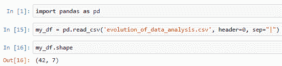

1.  在下一个 `In []:` 单元格中输入 `my_df.info()`。

1.  运行单元格。

1.  确认输出单元格显示 `Out []`。将会有多行，包括所有七列的数据类型，如下截图所示：

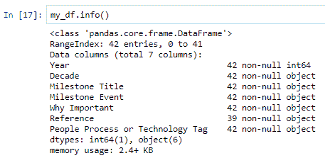

1.  在下一个 `In []:` 单元格中输入 `my_df.describe()`。

1.  运行单元格。

1.  验证输出单元格显示`Out []`。将有多个输出行，其中一列的标题为`Year`，如下面的截图所示。将显示来自`Year`字段的统计值，包括`count`、`mean`和`max`：

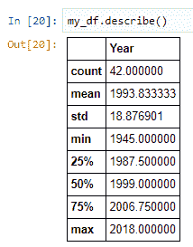

1.  将`my_df.head(2)`输入到下一个`In []:`单元格中并运行该单元格。

1.  验证输出单元格显示`Out []`：

+   输出应包括第一列的索引，起始行为`0`，如下面的截图所示。

+   所有七列都将显示，包括源文件的前两行：

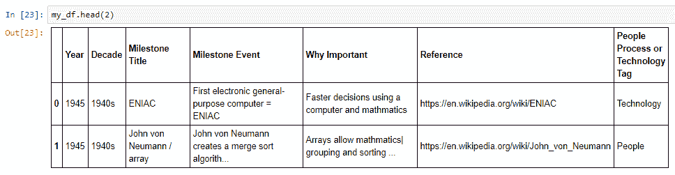

1.  将`my_df.tail(2)`输入到下一个`In []:`单元格中并运行该单元格。

1.  验证输出单元格显示`Out []`。输出应包括第一列的索引，起始行为`40`，如下面的截图所示。所有七列都将显示，包括源文件中的最后两行：

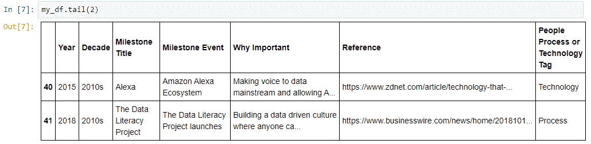

1.  将`my_df.sort_index(1)`输入到下一个`In []:`单元格中并运行该单元格。

1.  验证输出单元格显示`Out []`。输出应包括第一列的索引，起始行为`0`，如下面的截图所示。所有七列都将显示，但列的顺序已改为从左到右按字母顺序排序，从`Decade`开始，以`Year`结束：

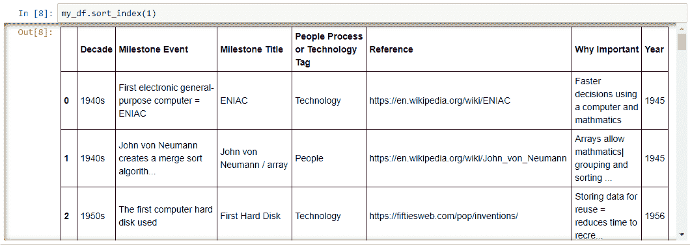

在下一个示例中，让我们通过探索`pandas`中的一些功能来回答一些来自数据的企业问题。第一个问题是*每个十年发生了多少个里程碑事件？*要回答这个问题，我们需要使用`groupby`功能，所以让我们通过以下步骤来提供答案。

重新生成此示例的步骤如下：

1.  启动 Jupyter 并创建一个新的 Python 笔记本。

1.  为了保持最佳实践的一致性，在继续之前，请确保将笔记本重命名为`exploring_the_pandas_library_example_2`。

1.  将`import pandas as pd`输入到`In []:`单元格中并运行该单元格。

1.  将`my_df = pd.read_csv('evolution_of_data_analysis.csv', header=0, sep="|")`输入到下一个`In []:`单元格中并运行该单元格。

1.  将`my_df.head(2)`输入到下一个`In []:`单元格中并运行该单元格。

1.  验证输出单元格显示`Out []`：

+   输出应包括第一列的索引，起始行为`0`。

+   所有七列都将显示，包括源文件的前两行。

1.  将`my_df.groupby(['Decade']).agg({'Year':'count'})`输入到`In []:`单元格中并运行该单元格。

1.  验证输出单元格显示`Out []`：

+   输出将显示 10 行数据，2 列。

+   第一列的标题行将是`Decade`，第二列将是`Year`。

+   结果将与以下截图匹配：

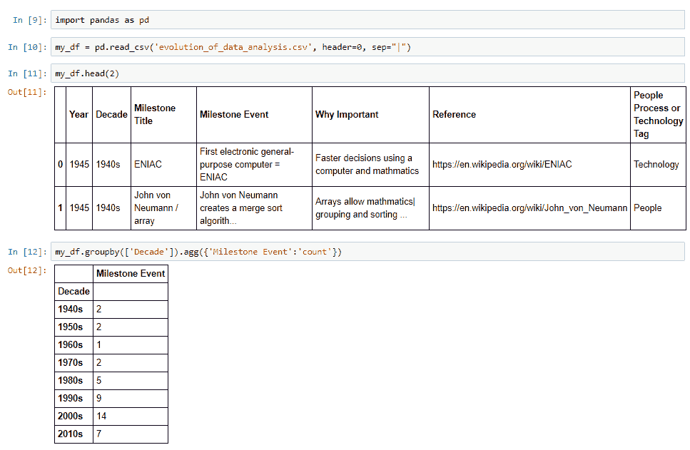

在前面的屏幕截图中，我们遵循了之前的步骤将 CSV 文件作为名为`my_df`的 DataFrame 加载。为了验证 DataFrame 已正确加载，我们运行了`head()`函数，并包括了参数`2`以限制在笔记本中显示的行数。最后一个命令是运行`groupby`对`Decade`列进行分组，并将其与聚合结合，以计算`Milestone Event`字段/列的值。我们现在可以回答一些关于这个数据集的问题，例如，在 2000 年代发生了 14 个里程碑事件，或者第一个有里程碑事件的十年是 1940 年代，因为这是第一个有值的行。

# 摘要

恭喜，你现在已经使用`pandas`库创建了你第一个 DataFrame！我们通过介绍结构化表格数据的概念以及通过转置和交叉数据来操作它的不同技术开始了这一章。更重要的是，我们讨论了为什么数据应该以表格形式存在的重要性。然后我们介绍了`pandas`库，并定义了 DataFrame，并展示了在数据分析过程中这个强大功能为您带来的许多好处。在处理基本数据格式时，我们通过 CSV、XML 和 JSON 文件格式的细节介绍了可用的不同数据格式。在我们通过创建第一个 DataFrame 来结束这一章之前，我们讨论了数据字典的重要性以及不同数据类型如何提高您的数据素养，以及为什么它们在数据分析工作流程完成前后都很重要。

在下一章，第五章，*在 Python 中收集和加载数据*，我们将向您介绍如何使用 SQL 从数据库加载数据，并继续使用`pandas`和 DataFrame 的功能。

# 进一步阅读

+   McKinney, W., 《Python 中的统计计算数据结构》，*《第 9 届 Python 科学会议论文集》*，第 445 卷（2010 年）

+   Torres-Reyna, O.，《使用 Stata 进行面板数据固定效应和随机效应分析》（版本 4.2），*Princeton.edu*，（2007 年），可在[`www.princeton.edu/~otorres/Panel101.pdf`](https://www.princeton.edu/~otorres/Panel101.pdf) [访问日期：2019 年 12 月 23 日]

+   **国家纵向调查**（**NLSes**）作为面板数据的例子：[`www.bls.gov/nls/home.htm`](https://www.bls.gov/nls/home.htm)

+   `pandas` DataFrame 的定义：[`www.geeksforgeeks.org/python-pandas-dataframe`](https://www.geeksforgeeks.org/python-pandas-dataframe/)

+   关于 QVD 文件格式的快速详情：[`help.qlik.com/en-US/sense/June2019/Subsystems/Hub/Content/Sense_Hub/Scripting/work-with-QVD-files.htm`](https://help.qlik.com/en-US/sense/June2019/Subsystems/Hub/Content/Sense_Hub/Scripting/work-with-QVD-files.htm)

+   ASCII 代表：[`www.ansi.org/about_ansi/overview/overview?menuid=1`](https://www.ansi.org/about_ansi/overview/overview?menuid=1)

+   Unicode 格式和编码标准：[`home.unicode.org/`](https://home.unicode.org/)

+   CSV 规则和标准：[`tools.ietf.org/html/rfc4180`](https://tools.ietf.org/html/rfc4180)

+   W3C 组织标准：[`www.w3.org/`](https://www.w3.org/)

+   REST 标准：[`www.ics.uci.edu/~fielding/pubs/dissertation/rest_arch_style.htm#sec_5_1_3`](https://www.ics.uci.edu/~fielding/pubs/dissertation/rest_arch_style.htm#sec_5_1_3)

+   Unicode 历史：[`docs.python.org/3.4/howto/unicode.html`](https://docs.python.org/3.4/howto/unicode.html)
