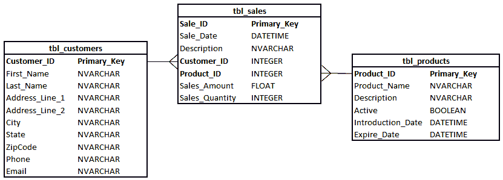
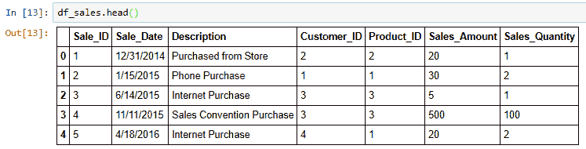
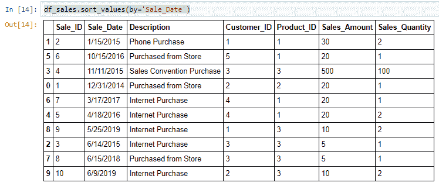
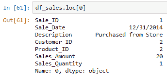
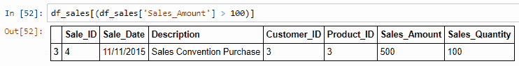
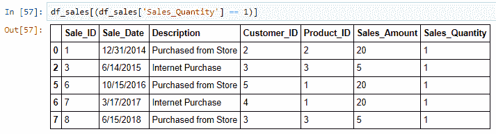
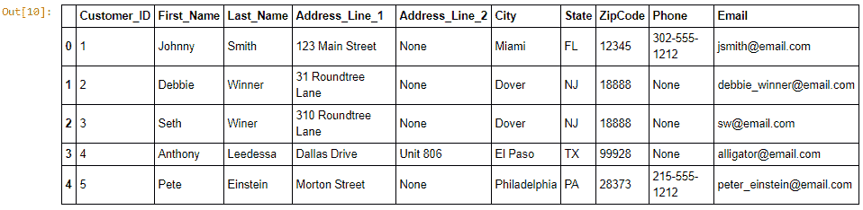
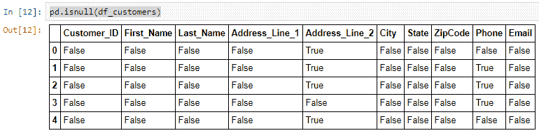
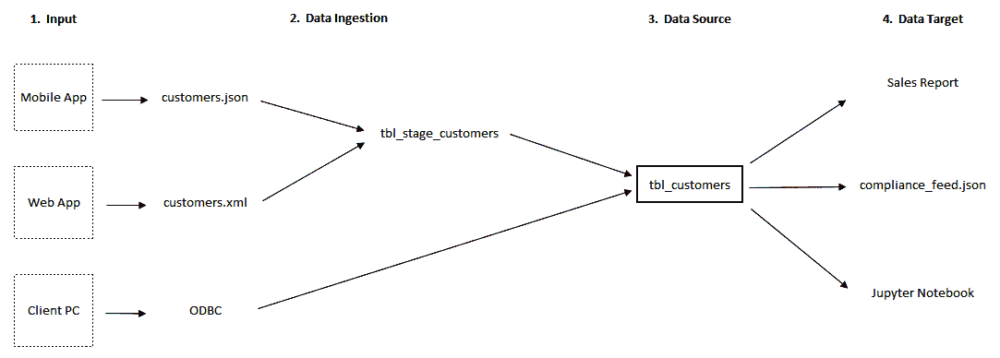

在 Python 中收集和加载数据

本章将通过教授您如何使用 SQLite 数据库来使用和访问数据库，解释 SQL 是什么以及为什么它对数据分析很重要。将提供关系数据库技术的概述，以及关于数据库系统的深入信息，以帮助提高您与专家沟通时的数据素养。您还将学习如何在 Jupyter Notebook 中运行 SQL `SELECT`查询，以及如何将它们加载到 DataFrames 中。基本统计、数据血缘和元数据（关于数据的数据）将使用`pandas`库进行解释。

本章我们将涵盖以下主题：

+   SQL 和关系数据库简介

+   从 SQL 到 pandas DataFrames

+   解释您数据的数据

+   数据血缘的重要性

# 第七章：技术要求

这是本书的 GitHub 仓库：[`github.com/PacktPublishing/Practical-Data-Analysis-using-Jupyter-Notebook/tree/master/Chapter05`](https://github.com/PacktPublishing/Practical-Data-Analysis-using-Jupyter-Notebook/tree/master/Chapter05)。

您可以从以下链接下载和安装所需的软件：[`www.anaconda.com/products/individual`](https://www.anaconda.com/products/individual)。

# SQL 和关系数据库简介

我们现在处于本书的这样一个阶段，我的职业生涯开始于与数据库和 SQL 一起工作。**结构化查询语言**（**SQL**）是几十年前作为一种与存储在表中的结构化数据进行通信的手段而创建的。多年来，SQL 已经从针对底层数据库技术的多种变体中演变而来。例如，IBM、Oracle 和 Sybase 都对其 SQL 命令有所变体，这在其客户中建立了忠诚度，但在更换供应商时需要做出改变。**国际标准化组织**（**ISO**）和**美国国家标准协会**（**ANSI**）标准的采用有助于定义今天普遍使用的标准。

到目前为止，本书中的所有结构化数据示例都集中在单个表或文件上。关系数据库通过使用主键和外键的概念，解决了在多个表中存储数据并保持它们之间一致性的问题：

+   主键是用于表示每个表中单个不同记录或元组的唯一值（通常是整数）。

+   外键将是一个表中的字段，它引用另一个表的主键。

这种关系定义了在所有数据中保持一致性的一个或多个表之间的完整性。由于存储和连接数据的概念是抽象的，这使得它可以应用于许多不同的数据主题。例如，您可以创建一个数据库来存储制造公司的销售数据，网站的用户点击，或金融服务公司的股票购买。正因为这种多功能性，SQL 仍然是顶级编程语言，也是数据分析必备的技能。

SQL 是为了与存储在具有定义模式的数据库表中的数据进行通信而创建的。数据库模式就像一个蓝图，在数据加载之前定义了存储数据的结构。这个定义包括规则、条件和表中每个字段的特定数据类型。数据库技术的基石是由 Codd 博士在 1970 年创立的，它是 *数据分析演变* 的重要里程碑，我在 第一章，*数据分析基础* 中定义了这一点。将数据持久化在定义的列和行中作为结构化关系中的表，展示了 Codd 博士对这一技术和数据的贡献的遗产。他与 Ralph Kimball 和 Bill Inmon 等人的贡献在多年中创造了新的行业和职业。如果你遇到一个 **企业数据仓库** (**EDW**)，你可以肯定它使用 Kimball 或 Inmon 方法作为标准。他们的影响，定义了与数据工作的新技能，不容小觑。我对那些推动支持所有数据技术和概念的技术和概念发展的人怀有深深的感激。

关系数据库的定义是一个庞大的主题，所以我将专注于构建你的数据素养和从使用 SQL 消费数据进行分析的相关内容。在处理任何 **关系数据库管理系统** (**RDBMS**) 时，关键概念始于如何与托管数据库的系统或服务器进行通信。大多数系统支持使用 ODBC 驱动程序，该驱动程序处理网络上的身份验证和通信。**开放数据库连接** (**ODBC**) 是一个用于在分析工具（例如 Jupyter Notebook）和数据存储之间发送和接收数据的常用标准。大多数大型企业关系数据库系统支持 ODBC 连接以与数据库进行通信。

传统上，这被称为客户端-服务器架构，其中你的本地计算机被称为客户端，数据库的位置由一个或多个服务器管理。当我是一名顾问时，我工作中遇到的最常见的企业关系数据库管理系统是 Microsoft SQL Server、Oracle、IBM DB2、MySQL 和 PostgreSQL。

可能需要在你的工作站上安装和配置 ODBC 驱动程序，以便与客户端-服务器架构进行通信。

现在，开源和供应商数据库产品都有其他版本，但许多确实应该支持 SQL 或其变体。例如，Apache 的 HiveQL 与 ASCI SQL 非常相似，但它在**Hadoop 分布式文件系统**（**HDFS**）上运行，而不是在数据库上。在我们的示例中，我们将使用 SQLite，这是一个基于文件的数据库，你可以本地安装或通过 ODBC 连接。SQLite 是开源的，跨平台的，这意味着我们可以在任何操作系统上安装它，根据他们的下载页面，它被誉为*世界上部署和使用最广泛的数据库引擎*，你可以在*进一步阅读*部分找到它。

一旦建立了连接，通常需要用户 ID 和密码，这些控制你可以执行的操作以及你可以访问的表。如果你自己安装了数据库，你就是数据库的所有者，可能拥有系统管理员权限，这让你可以完全访问创建、删除和读取任何表。如果你是客户端，**数据库管理员**（**DBA**）将负责为你的用户 ID 设置访问和权限。

我认为即使到现在，SQL 之所以成为一门流行的语言，是因为使用它所需的曲线学习。根据我的经验，许多商业用户和数据分析师即使没有计算机科学背景，也会觉得其语法直观易懂。SQL 代码易于阅读，并且可以迅速理解预期的结果。它还支持即时满足，一旦优化性能，即使数据量很大，几个命令也能在不到一秒内产生结果。

例如，假设我想知道 2018 年苹果股票的最高收盘价。即使没有真正理解这些数据是如何或在哪里存储的所有细节，这一行代码的语法也容易理解：

```py
SELECT max(closing_price) FROM tbl_stock_price WHERE year = 2018
```

让我们逐步分析这段代码，并分解其关键组件：

+   首先，我将保留词大写了，这些保留词在支持 ISO 标准/ASCI SQL 的任何关系数据库管理系统（RDBMS）中都是通用的。

+   `SELECT`命令指示代码从`FROM`语句之后定义的表中以行和列的形式检索数据。

+   在`SELECT`和`FROM`保留词之间是`max(closing_price)`命令。这是使用 SQL 中可用的`max()`函数从`closing_price`字段检索最大或最大值。无论数据中是否存在重复值，max 函数都只返回一行和一个值。

+   代码中的`FROM`部分让 SQL 解释器知道紧随其后的是引用一个表或对象。在这个例子中，我们正在寻找`tbl_stock_price`表中的记录。

+   `SELECT` SQL 语句中的`WHERE`子句通过减少行数到特定的条件来限制数据，该条件由等号右侧的特定字段`year`和`value`定义，即`2018`。

`SELECT` 是最常用的 SQL 命令，具有许多不同的使用场景和复杂度级别。我们只是触及了表面，你可以在*进一步阅读*部分找到更多资源。

SQL 对大小写不敏感，但所引用的表和字段可能因所使用的 RDBMS 而异。保留字之间需要有空格，但通常在表或字段名称中找不到空格。相反，下划线或破折号更为常见。

# 从 SQL 到 pandas DataFrame

现在我们对 SQL 和关系数据库有了背景知识，让我们下载 SQLite 数据库文件的本地副本，设置连接，并将一些数据加载到 `pandas` DataFrame 中。为此示例，我提供了名为 `customer_sales.db` 的数据库文件，所以请确保在 GitHub 存储库中事先下载它。

为了让你了解这个数据库文件，并支持我们在第一章“数据分析基础”中学到的**了解你的数据**（**KYD**）概念，我们创建了三个名为 `tbl_customers`、`tbl_products` 和 `tbl_sales` 的表格。这将是任何拥有客户购买产品并在任何时间段内产生销售的公司的一个简单示例。数据存储和连接的视觉表示，通常称为**ERD**（实体关系图），如下所示：



在前面的图中，我们可以看到三个表格的视觉表示，每个表格的列名定义在每个框的左侧，而每个列的数据类型则紧挨着其右侧。每个表格的主键通过名称后缀`_ID`来标识，并在每个表格的第一行文本上使用粗体表示。主键通常具有整数数据类型，这里也是如此。

`tbl_sales` 表包括两个这样的字段，`Customer_ID` 和 `Product_ID`，这意味着它们被分类为外键。表之间的线条加强了它们之间的关系，这也指示了如何将它们连接起来。看起来像*鸟爪*的小线条告诉消费者这些表是以一对一的关系定义的。在这个例子中，`tbl_sales` 将会有许多客户和许多产品，但每个 `Customer_ID` 在 `tbl_customers` 中只会分配一个值，而 `tbl_products` 将只会为每个 `Product_ID` 分配一个值。

现在我们对数据有了更多了解，让我们启动一个新的 Jupyter 笔记本，并将其命名为 `retrieve_sql_and_create_dataframe`。为了创建连接并使用 SQLite，我们必须使用代码导入一个新的库：

1.  要加载 SQLite 数据库连接，你只需在你的 Jupyter 笔记本中添加以下命令并运行该单元格。你可以自由地跟随操作，创建自己的笔记本（我已经在 GitHub 上放置了一个副本以供参考）：

```py
In[]: import sqlite3
```

`sqlite3` 模块是 Anaconda 分发版自带安装的。有关设置环境的帮助，请参阅 第二章，*Python 和 Jupyter Notebook 安装概述*。

1.  接下来，我们需要将一个名为 `conn` 的连接分配给变量，并指向数据库文件的位置，该文件名为 `customer_sales.db`。由于我们在之前的 `In[]` 行中已经导入了 `sqlite3` 库，我们可以使用这个内置函数与数据库通信：

```py
In[]: conn = sqlite3.connect('customer_sales.db')
```

请确保将 `customer_sales.db` 文件复制到正确的 Jupyter 文件夹目录，以避免连接错误。

1.  下一个需要导入的库应该是非常熟悉的，这样我们就可以使用 `pandas`，从而使代码如下所示：

```py
In[]: import pandas as pd
```

1.  要运行一个 SQL 语句并将结果分配给一个 DataFrame，我们必须运行这一行代码。`pandas` 库包含一个 `read_sql_query()` 函数，这使得使用 SQL 与数据库通信变得更容易。它需要一个连接参数，我们在前面的步骤中将其命名为 `conn`。我们将结果分配给一个新的 DataFrame 作为 `df_sales` 以便更容易识别：

```py
In[]: df_sales = pd.read_sql_query("SELECT * FROM tbl_sales;", conn)
```

1.  现在我们已经将结果放入 DataFrame 中，我们可以使用所有可用的 `pandas` 库命令来处理这些数据，而无需返回到数据库。要查看结果，我们只需运行 `head()` 命令针对这个 DataFrame 并使用此代码：

```py
In[]: df_sales.head()
```

输出将类似于以下截图，其中 `tbl_sales` 表已经被加载到一个带有标签的标题行 DataFrame 中，索引列位于左侧，起始值为 `0`：



1.  要对 DataFrame 中的值进行排序，我们可以使用 `sort_values()` 函数并包含一个字段名称参数，它将默认为升序。让我们首先按日期排序结果，以查看数据库中首次记录的销售日期：

```py
In[]: df_sales.sort_values(by='Sale_Date')
```

输出将类似于以下截图，其中 DataFrame 输出现在按 `Sale_Date` 字段从 `1/15/2015` 到 `6/9/2019` 排序。注意 `Sale_ID` 的差异，它是不连续的：



1.  要限制显示的数据，我们可以使用 `DataFrame.loc` 命令根据标题行的标签来隔离特定的行或列。要检索第一行可用的数据，我们只需运行这个命令针对我们的 DataFrame 并引用索引值，它从 `0` 开始：

```py
In[]: df_sales.loc[0]
```

输出将类似于以下截图，其中一条记录以序列的形式显示，多列转置为多行：



使用这种方法，你必须知道你正在通过索引查找哪个特定记录，这反映了数据是如何从 SQL 语句中加载的。为了确保数据库表之间的一致性，你可能想在将数据加载到 DataFrame 中时包含一个 `ORDER BY` 命令。

1.  要限制显示的数据，我们可以使用嵌套命令根据条件隔离特定的行。你可以使用这些数据解决的业务任务包括*识别销售量高的客户，以便我们可以亲自感谢他们*。为此，我们可以通过特定值过滤销售数据，并仅显示满足或超过该条件的行。在这个例子中，我们将`high`分配给一个任意数字，所以任何`Sales_Amount`超过 100 的记录都将使用此命令显示：

```py
In[]: df_sales[(df_sales['Sales_Amount'] > 100)]
```

输出将类似于以下截图，其中根据条件显示单个记录，因为只有一个记录的`Sales_Amount`大于`100`，即`Sale_ID`等于`4`：



1.  限制结果的一个例子是查找分配给 DataFrame 中特定字段的特定值。如果我们想更好地理解这些数据，我们可以通过查看`Sales_Quantity`字段来查看哪些记录只购买了一个产品：

```py
In[]: df_sales[(df_sales['Sales_Quantity'] == 1)]
```

输出将类似于以下截图，其中根据条件显示多个记录，其中`Sales_Quantity`等于`1`：



这些步骤定义了分析工作流程的最佳实践。检索 SQL 结果，将它们存储在一个或多个 DataFrame 中，然后在你的笔记本中进行分析是常见且被鼓励的。根据数据量，在数据库之间迁移数据可能需要大量的计算资源，所以请留意你有多少可用内存以及你正在处理的数据库有多大。

# 数据关于数据解释

现在我们已经更好地理解了如何使用 Python 和 pandas 处理 SQL 数据源，让我们探索一些基本统计量以及数据分析的实际应用。到目前为止，我们主要关注描述性统计与预测性统计。然而，我建议在充分理解描述性分析之前，不要进行任何数据科学的预测性分析。

## 基本统计量

描述性分析基于过去已经发生的事情，通过分析数据的数字足迹来获得洞察力，分析趋势，并识别模式。使用 SQL 从一个或多个表中读取数据支持这一努力，这应该包括基本的统计和算术。数据结构化和规范，包括每列定义的数据类型，一旦你理解了一些关键概念和命令，这种类型的分析就会变得更容易。SQL 和 Python 中都有许多统计函数可用。

我已经在这个表中总结了几个对您的数据分析至关重要的函数：

| **统计量** | **描述** | **最佳用途/用例** | **SQL 语法** | **pandas 函数** |
| --- | --- | --- | --- | --- |
| 计数 | 不论数据类型，一个值出现的次数 | 查找表的大小/记录数 | `SELECT Count(*) FROM table_name` | `df.count()` |
| 计数（不重复） | 不论数据类型，一个值出现的不同次数 | 移除重复值/验证用于数据类别中的唯一值 | `SELECT Count(distinct field_name) FROM table_name` | `df.nunique()` |
| 求和 | 对数值数据类型的值的整体或总计聚合 | 查找总人口或衡量金钱的数量 | `SELECT Sum(field_name) FROM table_name` | `df.sum()` |
| 平均值 | 来自两个或更多数值数据类型的算术平均值 | 值的总和除以值的计数 | `SELECT AVG(field_name) FROM table_name` | `df.mean()` |
| 最小值 | 字段中值的最低数值 | 查找最低值 | `SELECT MIN(field_name) FROM table_name` | `df.min()` |
| 最大值 | 字段中值的最高数值 | 查找最高值 | `SELECT MAX(field_name) FROM table_name` | `df.max()` |

在 SQL 中，我最常用的统计度量是 *计数*，即统计每个表中记录的数量。使用此函数有助于验证你正在处理的数据量与源系统、数据生产者和业务赞助者一致。例如，业务赞助者告诉你他们使用数据库来存储客户、产品和销售，并且他们有超过 30,000 名客户。让我们假设你运行以下 SQL 查询：

```py
SELECT count(*) from customers
```

有 90,000 个结果。为什么会有如此大的差异？首先的问题可能是：你是否使用了正确的表？任何数据库都是灵活的，因此它可以由 DBA 根据应用和业务需求进行组织，因此活跃客户（购买了产品并创建了销售数据的客户）可能存储在不同的表中，例如 `active_customers`。另一个问题是：是否有字段用于标识记录是否活跃？如果有，那么该字段应该包含在 `SELECT` 语句的 `WHERE` 部分中，例如，`SELECT count(*) from customers where active_flag = true`。

使用`count()`函数进行分析的第二个优点是为自己设定预期，了解每个查询返回结果所需的时间。如果你在产品、客户和销售表上运行`count(*)`，检索结果所需的时间将根据数据量以及 DBA 如何优化性能而变化。表格有形状，这意味着行数和列数在它们之间会有所不同。它们也可以根据其预期用途而增长或缩小。例如，`sales`表是事务性的，因此行数会随着时间的推移而显著增加。我们可以将事务表归类为深度，因为列数最少，但行数会增长。例如，`customers`和`products`表被称为参考表，它们在形状上较宽，因为它们可能有数十个列，但行数与事务表相比要少得多。

行数和列数众多且具有密集独特值的表格会占用更多磁盘空间，并且处理时需要更多的内存和 CPU 资源。如果`sales`表有数十亿行，那么通过`SELECT count(*) from sales`来计算行数可能需要数小时等待响应，并且会被管理员/IT 支持团队所劝阻。我曾与一个数据工程团队合作，他们能够在 100 亿条记录的表中在 10 秒内检索 SQL 结果。这种响应时间需要开发者的专业知识和对表进行配置以支持超快响应时间的管理权限。

在处理`count()`函数时，另一个有效的观点是了解频率与独特值之间的区别。根据你针对哪个表执行计数函数，你可能只是在计算记录出现的次数，或者记录的频率。以 30,000 个客户为例，如果`count(customer_id)`和`count(distinct customer_id)`的结果之间有差异，我们知道计数记录包括了重复的客户。这取决于你进行的分析，可能不是问题。如果你想知道客户购买任何产品的频率，那么`count(customer_id)`将回答这个问题。如果你想知道有多少客户购买每种产品，使用`distinct`将提供更准确的信息。

`sum()`函数，简称求和，是描述性分析中用于统计分析的另一个常用度量。计数与求和之间的一个关键区别是，求和需要一个数值来计算准确的结果，而计数可以对任何数据类型进行。例如，你不能也不应该对`customers`表中的`customer_name`字段求和，因为数据类型被定义为字符串。如果你将其定义为整数，技术上可以对`customer_id`字段求和，但这会提供误导性的信息，因为这不是该字段的预期用途。像`count`一样，`sum`是一个聚合度量，用于将特定字段（如`sales_amount`或销售表中的数量）中找到的所有值相加。

在 SQL 中使用`sum()`函数很简单。如果你想知道所有时间的总和而没有约束或条件，可以使用以下语法：

```py
 SELECT sum(field_name) from table_name
```

然后，你可以添加一个条件，例如只包括活跃客户，通过包含带有`flag`字段的`WHERE`子句，其语法如下：`SELECT sum(field_name) from table_name WHERE active_flg = TRUE`。

我们将在第八章理解连接、关系和聚合中揭示更多高级功能，例如使用 SQL 进行聚合。

均值或平均函数是另一个非常常用的统计函数，对于数据分析非常有用，并且使用 SQL 编写命令很容易。平均数是所有值的总和除以计数，语法为`SELECT avg(field_name) from table_name`。

计数值的分母是使用频率/发生次数与不同值相比，因此在运行 SQL 命令之前你应该理解表是如何填充的。例如，一个销售表是基于交易的，有多个客户和产品，所以平均数会与产品表或客户表的平均数不同，因为每条记录都是唯一的。

`min`和`max`函数在 SQL 中也非常有用且易于解释。内置函数是`min()`和`max()`，它们从数据集中返回最小数值以及最大或最高值。从你的表中理解的一个好业务问题是 2018 年的最低和最高销售额是多少？SQL 中的语法如下：

```py
SELECT min(sales_amount), max(sales_amount) from sales_table where year = 2018
```

了解每个客户和产品在所有时间段内的销售范围，这些信息将非常有用。

在对数据运行这些统计函数时，一个重要的因素是要理解值是空的还是通常所说的空值。在 SQL 中，`NULL`代表无物和值的不存在。在 RDBMS 中，空值是 DBA 为每个表定义架构时的一个规则。在通过为每个字段定义数据类型创建列的过程中，有一个选项允许空值。根据用例的不同，允许在数据库表设计时使用空值的原因也各不相同，但对于分析来说，重要的是要了解它们是否存在于你的数据中以及它们应该如何被处理。

让我们从我们的`customers`表中的一个例子开始，其中一个字段，如第二行地址允许`NULL`，这是常见的。为什么这是常见的？因为第二行地址字段是可选的，而且在许多情况下甚至没有被使用，但如果你是一家需要物理邮寄营销材料或发票给客户的公司呢？如果数据录入总是需要值，那么在数据库中的第二行地址字段中不必要地填充值，这是低效的，因为它需要更多的时间为每个客户输入值，并且需要更多的存储空间。在大多数情况下，在大规模企业系统中强制输入值会创建较差的数据质量，这随后需要时间来修复数据，或者在处理数据时造成混淆，尤其是在处理数百万客户的情况下。

## 元数据解释

元数据通常是指关于数据源描述性信息。在元数据分析中，一个关键概念与理解数据库中存在空值相关。从数据分析的角度来看，我们需要确保我们理解它对我们分析的影响。在 Python 和其他编程语言如 Java 中，你可能看到返回的单词`NaN`。这是“非数字”（Not a Number）的缩写，有助于你理解你可能无法对这些值执行统计计算或函数。在其他情况下，例如 Python，`NaN`值将具有特殊函数来处理它们，如下所示：

+   在 NumPy 中，使用`nansum()`函数

+   使用 pandas 的`isnull()`函数

+   在 SQL 中，根据你使用的 RDBMS 使用`is null`或`isnull`

由于你正在测试一个条件是否存在，你也可以包括`NOT`关键字来测试相反的情况，例如，`Select * from customer_table where customer_name is NOT null`。

理解空值和`NaN`归结为 KYD 以及你正在处理的数据源元数据。如果你无法访问数据库系统以查看元数据和底层架构，我们可以使用 pandas 和 DataFrames 来获取关于 SQL 数据的一些见解。让我们通过一个例子来操作，将单个表从数据库加载到笔记本中的 DataFrame，并运行一些元数据函数以获取更多信息。

首先，创建一个新的 Jupyter 笔记本，并将其命名为`test_for_nulls_using_sql_and_pandas`：

1.  与先前的例子类似，要加载 SQLite 数据库连接，你只需在你的 Jupyter 笔记本中添加以下命令并运行该单元格：

```py
In[]: import sqlite3
```

1.  接下来，我们需要将一个连接分配给名为 `conn` 的变量，并指向数据库文件的位置，该文件名为 `customer_sales.db`。由于我们在先前的 `In[]` 行中已经导入了 `sqlite3` 库，我们可以使用这个内置函数与数据库进行通信：

```py
In[]: conn = sqlite3.connect('customer_sales.db')
```

1.  如以下代码所示导入 `pandas` 库：

```py
In[]: import pandas as pd
```

1.  使用 `read_sql_query()` 函数，我们将结果分配给一个新的 DataFrame，命名为 `df_customers`，以便更容易识别：

```py
In[]: df_customers = pd.read_sql_query("SELECT * from tbl_customers;", conn)
```

1.  要查看结果，我们只需运行以下代码中的 `head()` 命令来针对这个 DataFrame：

```py
In[]: df_customers.head()
```

输出将类似于以下截图，其中 `tbl_customers` 表已被加载到 DataFrame 中，带有标签的标题行，索引列位于左侧，起始值为 `0`：



1.  我们可以使用以下命令来分析 DataFrame 并轻松地识别任何 `NULL` 值。`isnull()` pandas 函数在整个 DataFrame 中测试空值：

```py
In[]: pd.isnull(df_customers)
```

输出将类似于以下截图，其中 DataFrame 将返回每行和每列的 `True` 或 `False` 值，而不是单元格中的实际值：



几条命令，我们就学会了如何与数据库进行通信，并识别存储在表中的数据的一些重要元数据。为了继续提高我们的数据素养，让我们通过了解数据血缘来理解数据是如何填充到数据库中的。

# 数据血缘的重要性

**数据血缘**是指追踪数据集来源以及其创建方式的能力。对我来说，这是一个有趣的话题，因为它通常需要调查系统生成数据的历史，识别其处理方式，并与生产和使用数据的个人合作。这个过程有助于提高你的数据素养，即阅读、编写、分析和用数据辩论的能力，因为你能够了解数据对组织的影响。数据对于业务功能，如生成销售是否至关重要，或者它是为了合规目的而创建的？这些问题应该通过更多地了解数据的血缘来回答。

从经验来看，追踪数据血缘的过程涉及到直接与负责数据的人员进行工作会话，并揭示任何如*从 SQL 到 pandas DataFrames*部分中展示的 ERD（实体关系图）或帮助指南等文档。在许多情况下，随着时间的推移而成熟的企业的系统可用的文档可能不会反映你在分析数据时看到的细微差别。例如，如果在一个之前不存在表单的现有表中创建了一个新字段，那么历史数据将会有`NULL`或`NaN`值，直到数据录入开始的时间点。

数据血缘可能会迅速变得复杂，如果不进行适当的记录，则需要时间来解开并需要多个资源来揭示细节。当涉及多个系统时，与**主题专家**（**SMEs**）合作将加速流程，这样你就不必逆向工程数据流中的所有步骤。

## 数据流

**数据流**是数据血缘的一个子集，通常是大组织内部更大数据治理策略的一部分，因此可能已经存在一些工具或系统，这些工具或系统能够直观地表示数据是如何处理的，这通常被称为数据流。一个假设的数据流图示例如下所示，其中我们查看迄今为止我们在练习中处理的一些数据。在这个图中，我们有`tbl_customers`表从我们的 SQLite 数据库中填充的逻辑表示。我已经将输入和输出记录为第一阶段到第四阶段：



### 输入阶段

首先，我们有**输入**阶段，它被标识为**移动应用**、**Web 应用**和**客户端 PC**系统。这些系统已经创建了输出到多种文件格式的数据。在我们的例子中，这些数据是批量处理的，其中数据文件被保存并发送至下一阶段。

### 数据摄入阶段

**数据摄入**阶段是处理多个文件，如`customers.json`和`customers.xml`的地方。因为这个图是逻辑图而不是高度技术性的图，所以省略了处理数据摄入背后使用的技术细节。数据摄入也被称为**ETL**，即**提取、转换和加载**的缩写，这是由数据工程团队或开发者自动化和维护的。

在这个 ETL 过程中，我们可以看到一个中间步骤称为`tbl_stage_customers`，这是一个在源文件和数据库中的目标表之间处理数据的中间表。此阶段还包括一个`ODBC`连接，其中**客户端 PC**系统可以直接访问`tbl_customers`表以插入、更新和删除记录。

在学习更多关于数据流的过程中，务必询问表是否使用逻辑删除而不是物理删除行。在大多数情况下，不支持直接从表中删除行，因此使用布尔数据类型列来指示记录是否由系统或用户激活或标记为删除。

### 数据源阶段

第三阶段被称为**数据源**，定义为`tbl_customers`表。向开发人员或数据库管理员提出的一些问题如下：

+   你对这个数据的保留策略是什么/数据保留多长时间？

+   这个表中每天平均填充了多少条记录？

+   他们能否提供一些元数据，例如每个字段的行数、列数和数据类型？

+   这个表包括主键和外键在内的依赖/连接是什么？

+   这个表多久备份一次，我们是否应该注意可能影响分析的系统停机时间？

+   这个表/数据库是否存在数据字典？

### 数据目标阶段

第四阶段被称为**数据目标**，它帮助数据分析师理解从源表的下游依赖关系。在这个例子中，我们有一个**销售报告**、`compliance_feed.json`文件和**Jupyter Notebook**。需要揭示的有用信息包括合规数据发送的频率以及数据消费者是谁。

如果你的分析时间与**数据源**阶段的 数据馈送时间不一致，这可能变得很重要。对分析结果的信任以及能够论证你的分析是完整和准确的，来自于理解时间问题以及你解决和匹配多个数据目标输出之间计数的能力。

## 业务规则

数据血缘的另一个重要点是揭示业务规则、查找值或映射参考源。业务规则是一个抽象概念，有助于你理解在数据处理过程中应用到的软件代码。例如，当**移动应用**的用户点击**提交**按钮时，会创建一个新的`customers.json`文件。业务规则也可以更复杂，例如`tbl_stage_customers`表不会在`tbl_customers`中填充记录，直到所有源文件接收完毕并且每天凌晨 12 点（东部标准时间）运行批处理。业务规则可以在创建数据库表时明确定义，例如在列上定义主键的规则，在网页表单或移动应用程序中编码。

应该将记录这些业务规则包括在你的方法论中，以支持你的分析。这有助于你通过验证业务规则的存在或识别与关于源数据的假设相矛盾的反常值来从数据分析中得出见解。例如，如果你被告知一个数据库表被创建为不允许特定字段中的`NULL`，但你最终发现它存在，你可以与数据库管理员（DBA）一起审查你的发现，以揭示这种情况是如何发生的。这可能是创建了一个业务异常，或者是在表已经填充之后才实施了业务规则的执行。

理解业务规则有助于识别数据缺口并在分析过程中验证准确性。如果这个表的平均每日记录量连续多日降至零记录，那么可能是在**数据摄取**阶段的第 2 阶段出现了问题，或者可能只是假日，没有收到和处理客户记录。

在任何情况下，学习如何向主题专家提出这些问题并验证数据血缘将增强你对分析的信心，并赢得数据生产者和消费者双方的信任。

现在你已经理解了所有这些概念，让我们回顾一下本章中我们正在处理的数据血缘——`customer_sales.db`：

1.  在这个数据库的**输入**阶段，为了示例目的，手动创建了三个源 CSV 文件。每个源表都与一个名为`tbl_customers`、`tbl_products`和`tbl_sales`的 CSV 文件一一对应。

1.  在**数据摄取**阶段，每个文件都是通过几个 SQL 命令导入的，这为每个表创建了模式（字段名称、定义的数据类型和连接关系）。这个过程通常被称为 ETL，其中源数据被摄取并持久化为数据库中的表。如果需要修改源文件和目标数据库表之间的任何变化，应该记录业务规则以帮助提供数据生产者和消费者之间的透明度。对于这个例子，源数据和目标数据是一致的。

1.  在这个例子中，**数据源**阶段将是`customer_sales.db`。现在，这成为从数据库流向分析以及任何报告的数据的黄金副本。

1.  在我们的例子中，**目标**阶段将是 Jupyter 笔记本和为分析创建 DataFrame。

虽然这是一个只有几个步骤的小例子，但这些概念适用于具有更多数据源和用于自动化数据流的技术的大规模企业解决方案。我通常在开始任何数据分析之前绘制数据血缘的阶段，以确保我理解整个流程。这有助于与利益相关者和 SMEs 沟通，以确保从数据源中获得见解的准确性。

# 摘要

在本章中，我们涵盖了一些关键主题，帮助你通过学习与数据库交互和使用 SQL 来提高数据素养。我们了解了 SQL 的历史以及为在数据库中存储结构化数据奠定基础的人。我们通过一些示例介绍了如何将 SQL `SELECT` 语句中的记录插入到 `pandas` DataFrame 中进行分析。

通过使用 `pandas` 库，我们学习了如何排序、限制和限制数据，以及基本的统计函数，如计数、求和和平均值。我们介绍了如何在数据集中识别和处理 `NaN`（即空值），以及分析过程中数据来源的重要性。

在我们接下来的章节中，我们将探讨时间序列数据，并学习如何使用额外的 Python 库来可视化你的数据，以帮助提高你的数据素养技能。

# 进一步阅读

以下是一些链接，你可以参考这些链接以获取本章相关主题的更多信息：

+   关于 SQL 创建的历史细节：[`www.contrib.andrew.cmu.edu/~shadow/sql/sql1992.txt`](http://www.contrib.andrew.cmu.edu/~shadow/sql/sql1992.txt)

+   处理 `NULL` 值：[`codeburst.io/understanding-null-undefined-and-nan-b603cb74b44c`](https://codeburst.io/understanding-null-undefined-and-nan-b603cb74b44c)

+   使用 pandas 处理重复值：[`www.python-course.eu/dealing_with_NaN_in_python.php`](https://www.python-course.eu/dealing_with_NaN_in_python.php)

+   关于 SQLite 数据库：[`www.sqlite.org/about.html`](https://www.sqlite.org/about.html)

+   数据建模技术：[`www.kimballgroup.com/data-warehouse-business-intelligence-resources/kimball-techniques/dimensional-modeling-techniques/`](https://www.kimballgroup.com/data-warehouse-business-intelligence-resources/kimball-techniques/dimensional-modeling-techniques/)

+   pandas DataFrame 函数：[`pandas.pydata.org/pandas-docs/stable/reference/api/pandas.DataFrame.html`](https://pandas.pydata.org/pandas-docs/stable/reference/api/pandas.DataFrame.html)
