可视化和处理时间序列数据

无论数据源来自文件还是数据库，我们现在已经定义了一个可重复的分析工作流程。这个工作流程用于将数据加载到数组或 DataFrame 中，然后通过运行一些 Python 命令并使用相应的库来回答业务问题。

这个过程到目前为止一直很有效，是提高我们如何处理数据技能的必要步骤，这最终提高了数据素养。现在，我们将再迈出一步，帮助你通过可视化数据来传达分析。在本章中，我们将学习如何创建可以支持结构化数据的视觉元素。我们将通过揭示数据可视化创建的基本原理来分解图表的解剖结构。使用 Python 中可用的绘图功能，你将使用`matplotlib`库创建你的第一个时间序列图表。

本章将涵盖以下主题：

+   结果导向的数据建模

+   图表解剖和数据可视化最佳实践

+   比较分析

+   曲线的形状

让我们开始吧。

# 第九章：技术要求

你可以在[`github.com/PacktPublishing/Practical-Data-Analysis-using-Jupyter-Notebook/tree/master/Chapter06`](https://github.com/PacktPublishing/Practical-Data-Analysis-using-Jupyter-Notebook/tree/master/Chapter06)找到这本书的 GitHub 仓库。

你可以从[`www.anaconda.com/products/individual`](https://www.anaconda.com/products/individual)下载并安装所需的软件。

# 结果导向的数据建模

我们在第五章“在 Python 中收集和加载数据”中提供的数据建模介绍，让我们了解了关系数据库以及可以对结构化数据执行的基本统计。在这些例子中，我们学习了数据之间的关系以及数据可以从数据生产者的角度进行建模。**数据生产者**负责以结构化的方式存储数据，以确保数据的完整性保持一致。在前一章中，我们也学习了如何使用**实体关系图**（**ERD**）来定义表之间的关系。在本章中，我们将从**数据消费者**的角度应用这些相同的概念。因此，我们将专注于创建新的数据关系，使分析更容易。这个概念是报告领域的一次演变，催生了一个新兴行业，通常被称为**商业智能**（**BI**）和**分析**。

## 介绍维度和度量

分析用数据建模意味着我们正在从源表构建新的关系，目的是为消费者回答业务问题。创建一个具有这种关注点的新数据模型可以将你的分析扩展到单个 SQL `SELECT`语句之外，这些语句一次运行一个以回答一个问题。相反，使用新派生的数据模型进行分析将仅使用几个甚至一个表来回答数十个问题。这是如何实现的？这完全关乎为什么需要新的分析表以及这些关系是如何定义的。例如，支持用于社交媒体的移动应用所需的数据库表与用于销售分析的数据模型不相同。

在某些情况下，从数据生产者创建的数据模型可以用于消费者，这样你就不需要做任何修改，例如在前一章的例子中。在其他情况下，你只需通过添加新字段来扩展现有的数据模型，这些新字段可能来自新的数据源或从现有的数据行和列中派生出来。在任一情况下，从数据分析师的角度来看，我们通过考虑如何将列用作维度或度量来改变我们看待现有数据模型的方式。

数据模型中的*维度*是具有描述性属性的价值，通常用于识别一个人、地点或事物。记住维度字段的最简单方法是它们可以被归类为*名词*。一个很好的例子是日期维度，其中任何给定的日期值，例如`12/03/1975`，都会有多个可以从这个值派生出来的属性，如下表所示：

| **字段名称** | **字段值** |
| --- | --- |
| 日期 | `12/03/1975` |
| 年份 | `1975` |
| 月份编号 | `12` |
| 月份名称 | `December` |
| 星期 | `Wednesday` |
| 季度 | `Q4` |
| 是否周末标志 | `FALSE` |

数据模型中的度量（measure）是指任何可以采用统计计算（如`sum`、`min`、`max`或`average`）进行聚合的值。识别度量字段的简单方法是质疑这些值是否在行动中，这样您就可以将它们分类为动词。在许多情况下，度量值在表源中会以高频率重复。可以识别为度量的常见字段包括销售额、销售数量或收盘价。度量字段通常存储在可以抽象为`fact`表的表中。`fact`表可能已经由生产者定义，也可能在分析过程中派生。`fact`表代表数据库表中单行定义的事件、交易或实体。我们已在[第五章](https://cdp.packtpub.com/python_data_analysis_beginners_guide/wp-admin/post.php?post=28&action=edit)中定义的主键（primary key）用于唯一标识每一行，以确保报告和分析的一致性。如果需要多个字段来唯一标识一条记录，则将创建一个代理键（surrogate key）字段。

连接到事实表（fact table）的将是一张或多张维度表，这些表以某种方式组织，能够以可重复的方式回答业务问题。与用于支持系统和应用的关联数据模型不同，维度数据模型应该为分析和报告而构建。

这些概念是在大约 10 年前由我的导师和前同事 Rich Hunter 在我俩在纽约州伯克利山区的 Axis Group, LLC 工作时介绍给我的。我会将在这家精品 BI 咨询公司工作的人定义为*数据战士*，因为他们能够理解、适应和利用数据解决问题。解决问题和创建数据解决方案是他们标准操作程序的一部分。正是在这段时间里，Rich 通过向我介绍一种新的看待数据的方式，改变了我对如何处理数据的看法，从而改变了我的职业生涯。我很高兴现在能与你们分享同样的基础数据分析概念。我将永远感激与我在 Axis Group 的前同事们一起工作。

这一切始于了解由 Ralph Kimball 和 Bill Inmon 创建的数据建模方法，他们通常被认为是数据仓库的奠基人。这两位男士定义了可以用于构建数据的途径，这些数据可以随着公司规模和主题领域的任何大小而扩展，重点是数据分析以及创建针对它的报告。他们对数据技术行业的贡献是如此巨大，以至于我将它们视为*数据分析的演变*的一部分，这在[第一章](https://cdp.packtpub.com/python_data_analysis_beginners_guide/wp-admin/post.php?post=24&action=edit)中讨论的*数据分析基础*中有所提及。

数据仓库，通常称为**企业数据仓库**（**EDW**），是从多个来源集中数据的位置，目的是提供、报告和分析数据。传统数据仓库按主题组织，如人力资源、销售或会计。根据数据复杂性（**多样性**、**体积**和**速度**），数据仓库可能位于一个技术解决方案的中心，或分布在不同技术中。

为什么一个组织会创建一个集中的数据仓库？因为针对数据源进行报告的一致性和准确性是值得成本的。在某些情况下，质量的重要性如此之高，以至于公司会投资创建一个或多个数据仓库。一旦组织确定了对所有数据的集中位置的需求，它通常会被认为是所有报告和分析的*单一事实版本*。理想情况下，这是不同技术来源的不同数据集可以被收集并符合定义和一致的业务规则的地方。销售经理和**人力资源**（**HR**）经理可以分别查看来自不同报告的数据，但具有相同的准确性，以便做出数据驱动的决策。

现在你已经了解了为什么数据仓库是一个重要的概念，让我们简要回顾一下构建它们常用的两种方法。首先，它们不是针对特定技术定义的，因此当数据架构师创建它们时，重点是定义结构，这被称为数据库模式，以支持不同的主题领域。数据主题领域通常按业务线或组织结构组织。例如，人力资源仓库将专注于员工属性，如雇佣日期、经理和职位。一旦定义了表和关系，就可以在整个组织和其他下游系统（如员工福利和薪酬）中共享唯一的员工标识符。

我们用于在公司内部构建仓库设计的方法遵循两种不同的方法。比尔·英蒙建议自上而下的方法，即组织在实施前制定一个战略解决方案来定义一个共同的标准。拉尔夫·金伯尔推荐自下而上的方法，其中每个主题领域都是为支持管理决策需求而构建的，对严格标准的执行较少。

例如，我曾与一位客户一起工作，销售团队使用定义明确的地区进行地理层次报告，以组织他们开展业务的国家。因此，在仓库中定义了一个地区，使用精确的简写来表示值，并在任何报告或分析应用程序之间提供一致性。例如，**EMEA**代表欧洲、中东和非洲的所有国家。

这种方法一直有效，直到人力资源团队决定他们想要将 EMEA 地区的县分开，以便更好地进行报告和分析。为了解决这个问题，他们有几个选择，包括在国家和地区之间在层次结构中创建一个二级，这样报告就需要进行下钻；例如，从 EMEA 到中东到以色列。

另一个选择是创建一个独立于销售区域定义的人力资源区域字段。这使我们能够在不影响与销售分析相关的任何内容的情况下，向高管发送报告和分析细节。这个选项之所以有效，是因为工程团队能够取悦多个部门的商业用户，同时仍然在所有下游报告解决方案中创造一致性的价值。

为报告和分析对数据进行维度建模是技术无关的。虽然这个概念和技术通常在 SQL 解决方案中找到，但你并不局限于仅使用数据库技术来对分析中的数据进行建模。第一步是理解你试图用数据回答什么问题。然后，你可以决定哪种模型最能回答手头的问题。以下是一些可以应用于几乎任何数据模型的问题：

+   **谁？** 在数据中识别“谁”应该是直截了当的。对于员工数据，谁是实际员工唯一标识符，以及构成该个人的所有属性，包括他们的名字、姓氏、出生日期、电子邮件、雇佣日期等。对于与销售相关的数据，客户就是“谁”，因此这将包括客户的姓名、邮寄地址、电子邮件等。

+   **什么？** 正在购买什么产品或服务？这也会包括每个产品独特的所有属性（列）。所以，如果我购买了一杯咖啡，大小、口味和单位成本都应该包括在内。

+   **何时？** 何时是一个非常常见的问题，与之相关，很容易识别出与回答这个问题相关的不同字段。所有日期、时间和时间戳字段都用于回答何时的问题。例如，如果网络用户访问了一个网站，那么“何时”就是记录该事件的特定日期和时间。如果日期/时间数据类型没有标准化或者没有考虑到时区，例如**协调世界时**（**UTC**），这会变得更加复杂。一旦你有了所有相关值背后的具体细节粒度，就可以确定**年**、**月**、**周**和**星期**。

+   **在哪里？** 产品或服务的销售发生在哪里？我们是否有地理位置详情，或者它是一个有街道地址的商店？

+   **如何？** 事件是如何发生的，它是如何发生的？活动的“如何”，事件或结果，比如用户点击按钮将项目添加到他们的购物车？

+   **为什么**？我认为**为什么**通常是数据分析中最重要的一个问题，也是商业用户最常提出的问题。这个“为什么”是促销或营销活动，比如特定产品或服务的闪购吗？

如下所示图解可以直观地展示这一点，图中将所有这些关键问题作为维度，中心位置是一个**事件事实**。这通常被称为**星型模式**关系，其中高频率交易和大量行数据存储在**事件事实**中，而独特和唯一的值存储在解决**谁**、**什么**、**何时**、**何地**、**如何**和**为什么**等问题的维度表中：

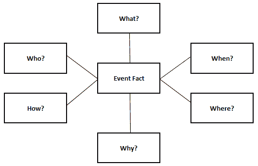

一个经验法则是事件事实表较窄（具有少量字段和多个连接键字段）但行数多。维度表将具有独特的记录和宽属性（具有大量字段和单个连接键）。

在提问和回答这些问题的过程中，你最终会将源数据中的一个或多个字段组合在一起，形成定义好的关系。例如，对于所有客户属性，你可以创建一个包含所有不同字段、使用单一唯一键来识别每个客户的表格、CSV 文件或 DataFrame。创建数据模型是构建图表和数据可视化的基础。

# 图表和数据可视化最佳实践的解剖

那么，什么使一个好的图表或可视化？答案取决于几个因素，其中大多数都与你所处理的数据集有关。将数据集想象成一个具有每列或字段一致性的行和列的表格。例如，年份应该有`2013`、`2014`和`2015`等值，并且格式一致。如果你的数据集格式不一致或包含值混合，那么在创建图表之前建议清理数据集。数据清理或清洗是修复或从数据集中删除不准确记录的过程。图表需要统一性，例如按升序排序年份值以准确展示趋势。

让我们用一个简单的例子来说明，如下所示图解。在这里，数据集的左侧是一个具有四行、两列和标题行的统一表格。为了确保你理解这个概念，表格是一种图表，你可以定义维度和度量。这个图表的标题使我们能够轻松理解每行的值应该代表什么，因为每一列都有一致的格式。正如我们在[第一章](https://cdp.packtpub.com/python_data_analysis_beginners_guide/wp-admin/post.php?post=24&action=edit)，“数据分析基础”中提到的，我们称之为**数据类型**，其中同一列中的每个值都将帮助创建一个图表，这将大大加快速度：

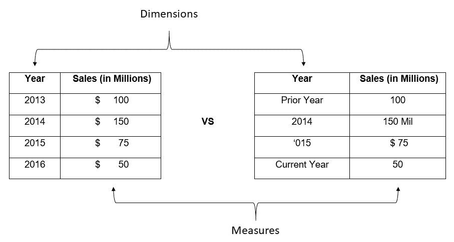

对于前面的图表，在创建任何可视化之前，我们有一些明显的清理工作要做。这个图表中的年份列包含多种值，由于所有这些不一致性，这将使创建视觉趋势变得困难。此外，对于销售额（以百万为单位）列，由于值是数字和字符的混合，将很难创建任何聚合，例如总销售额的总和。无论使用什么工具创建图表，数据清理都将确保其质量和准确性。

## 分析您的数据

一旦我们有一个干净的数据集，我们就可以根据图表的基本原则——维度和度量来分类数据集的字段。正如我们之前讨论的，解释这种差异的最简单方法是，维度是一个名词，它被分类为人物、地点或事物。最常用的维度字段，可以应用于许多不同的数据集，是日期/时间，它允许您创建时间趋势。

**度量**是动词，它们是从您的数据中的动作列，允许聚合（总和、计数、平均值、最小值、最大值等）。在以下图表中，我们有一个标记为**销售额（以百万为单位）**的条形图，我已经确定了它们之间的区别：

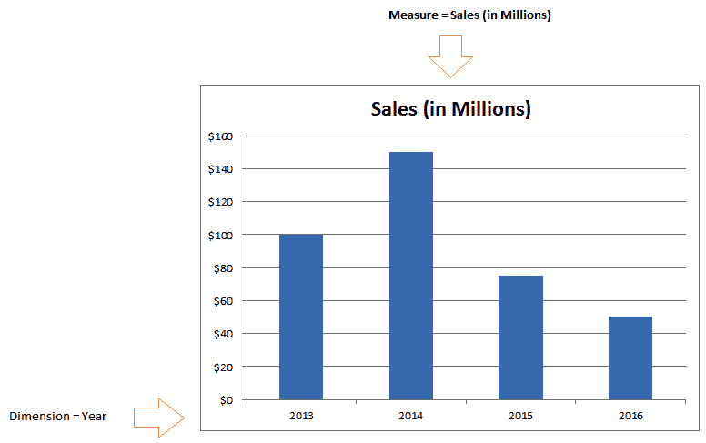

任何数据类型的字段都可以用作图表中的维度或度量，因此请确保您选择的视觉元素能够回答业务问题或提供所需的见解。

那么，为什么这些概念在创建图表时很重要？它们几乎适用于所有不同的图表类型，无论使用什么技术创建。显示时间趋势的条形图必须有一个日期维度（日、月或年）以及一些可以测量的内容——销售额、平均价格或用户数量。

现在，既然我们已经了解了基础知识，让我们通过几个例子来了解一下。以下图表所示的条形趋势图具有**年份**维度和**按产品销售的销售额**度量：

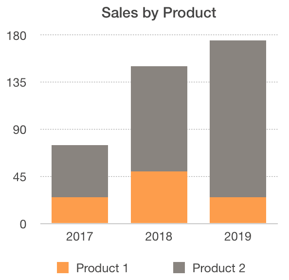

为了增加多样性，图表具有多个维度。在这种情况下，我们有两个维度——年份和产品。年份在*x*轴上以一系列的形式显示，但没有标签。**产品**值以堆叠条形表示，每个值对应于*y*轴上图例测量的颜色。

图表可以以不同的类型可视化，包括最常见的：条形图、折线图和饼图。以下屏幕截图所示的折线图为我们提供了一个直观的方式来识别时间上的加速增长：

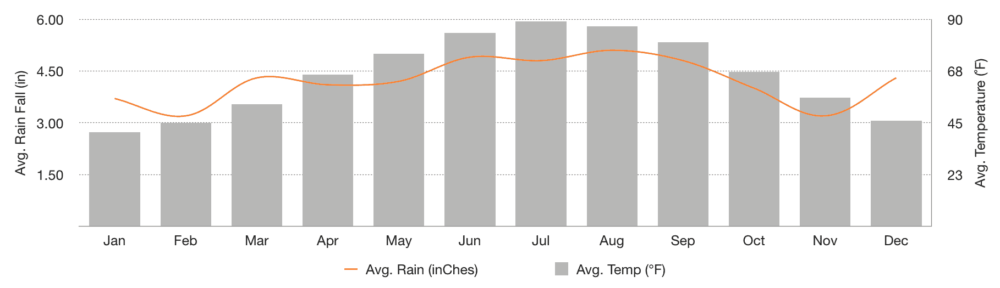

在上一张截图中的**组合**图表在同一图表中同时包含线和柱状图，两个不同的度量值分别位于两个不同的轴上。在这个例子中，柱状图代表的是**平均温度（华氏度）**的度量值。这些值可以在右侧轴上看到，并使用华氏度作为刻度。线条显示的是**平均降雨量（英寸）**的度量值，该值在左侧轴上从 1.50 英寸到 6.00 英寸进行标注。

有两个度量值允许我们使用一个共同的维度（在先前的例子中是一个日期）对不同度量值进行比较分析。根据这个例子中使用的图表技术，不同的日期维度，如时间戳、日期或数值月份值，可以在*x*轴上以 MMM 格式表示的月份进行使用。这张图表的最终结果通过突出显示低和高异常值，而不需要在表中扫描或搜索它们，讲述了一个戏剧性的故事，说明了这两个度量值随时间如何比较。

## 为什么饼图失去了优势

饼图作为首选图表已经不再流行，但在过去被广泛使用。实际上，斯蒂芬·弗（Stephen Few）写的一整本书涵盖了仪表板的**正确做法和错误做法**，他指出为什么应该用替代品，如这里提供的水平柱状图来代替饼图。如果你想了解更多信息，我在**进一步阅读**部分提供了这本书的参考。

水平柱状图相对于饼图的一些关键优势如下：

+   **易于消费**：我不需要查看图例来查找维度的值。

+   **排序能力**：你可以按最高或最低值进行排序，以强调数据集中的重要性。

+   **两者兼得**：它们具有分布和相对值，就像饼图一样。如果你看下面的图表，你会看到**产品 1**的面积是**产品 5**的两倍。在这里，你可以快速地看到差异，因为相同的*x*轴被用来方便地参考柱状图的宽度。

以下是一个水平柱状图的示例：

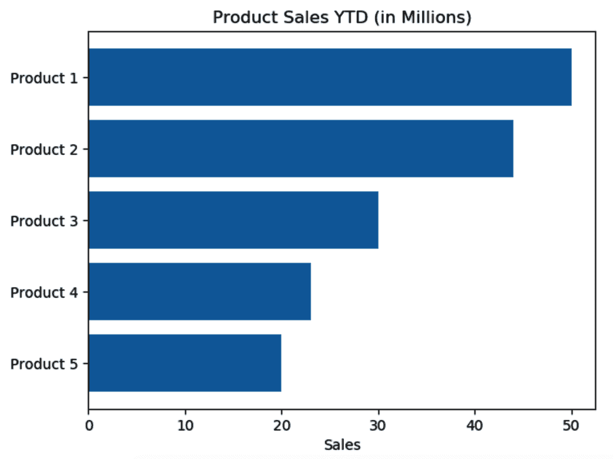

如果你仍然需要使用饼图，它们在只有两个不同值时效果最佳。在以下例子中，你可以轻松地看到**是**和**否**值之间的分布。使用主色强调，以及使用柔和的灰色颜色表示负值，有助于在这个图表中传达积极的消息：

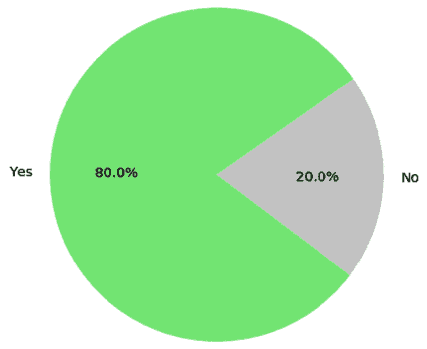

选择合适的图表是在作者想要用数据讲述的故事和从数据中可用的维度和度量之间取得平衡。我发现这是一种**艺术和科学**的方法，实践可以改进你创建良好可视化图表的能力。有关哪些图表能帮助你讲述最佳故事，有大量的资源可供参考。现在，你知道了任何使用维度和度量的图表类型的成分，你有一个可以在任何技术和主题领域应用的通用框架。选择合适的视觉图表来传达正确的信息也需要时间、经验和甚至尝试错误。

由于我将数据可视化归类为**一种**艺术和科学，因此花时间去了解你的业务问题确实需要时间。请随意使用**进一步阅读**部分中概述的图表选项作为指导。务必记住以下几点：

+   **重用代码是高度鼓励的**：不要从头开始创建一个新的图表来重新发明轮子。找到一个好的例子，并尝试将你的数据拟合到维度和度量中。

+   **少即是多**：避免干扰，让数据讲述故事——使用视觉提示来强调和突出异常值。过度使用多种颜色会分散消费者的注意力，因此只使用一种颜色来突出你想让图表观众关注的内容。

+   **外面有很多专家**：利用他们！我在**进一步阅读**部分放置了一些 URL 链接以供参考。

## 艺术与科学

对我来说，数据可视化**是**一种艺术和科学。对我来说，它始于四年级，我的老师塞格先生激发了我的创造力，并介绍了我认识了梵高、夏加尔和塞尚等大师工匠。艺术是通过视觉图像创造和激发自由思考。艺术如何定义是主观的，但它通常包括**艺术元素**，即形状、形式、价值、线条、颜色、空间和质感。让我们逐一分析：

+   **形状**作为艺术元素，被定义为**由边缘定义的区域**。形状为艺术作品之外的消费者提供了视觉背景和边界。

+   **形式**被定义为艺术作品的**感知体积或维度**。因此，形式将控制形状内的边界。

+   **价值**是指在艺术作品中对亮度和暗度的运用。光显然是任何艺术作品的重要元素，包括全部的光谱和缺乏光的情况。

+   **线条**作为艺术元素，可以是直线或曲线，跨越两点之间的距离，这使得艺术家能够在形式中定义强度。

+   **颜色**可能是最著名的艺术元素，它来自于光线撞击物体的时候。这有助于艺术作品的消费者视觉上单独或整体地解读作品。颜色的特性包括色调，这是我们通常与**红色**、**黄色**和**蓝色**等颜色联系在一起的东西。颜色还包括强度，它由可用的完整光谱颜色控制，以及价值，它控制亮度。

+   **空间**是艺术家在包含背景和前景时定义的区域。空间内或周围的距离是另一个需要考虑的重要因素。

+   对于艺术品的消费者来说，**纹理**是二维艺术中描绘的视觉感觉。

**科学**关于经验证据，这可以定义为通过观察或实验获得的数据。数据一直是科学研究方法的一部分，对于收集证据以证明理论或假设至关重要。

当这两个概念结合在一起时，它们允许你通过提供洞察力和使我们能够立即理解趋势的数据可视化来用信息讲故事。

## 什么造就了出色的数据可视化？

对我来说，这是一个主观的问题，我的答案随着时间的推移而演变，这意味着提供直接答案可能是一个挑战。

我觉得美丽且直观的东西可能对其他人来说并不那么有洞察力。这类似于艺术作品，不同的风格、时期和艺术家会有喜爱者和批评者。在过去的几年里，我见证了数据可视化如何演变成为一种艺术形式，技术编码使得创造力得以蓬勃发展。从创建简单的图表、图形和图形的这种运动已经演变到通常所说的**数据可视化**。

数据可视化可以是任何从信息图表到能够用数据讲述故事的动画视觉内容。当我看到一些美观且能激发我采取行动的东西时，我会将其归类为出色的数据可视化。这些行动可以根据提供的信息而有所不同，但常见的反应包括与他人分享数据可视化，目的是激发关于它的对话。此外，出色的数据可视化应该揭示模式和趋势。这有助于消费者轻松地将可操作信息与噪音区分开来。数据中的噪音意味着观众被图表所困惑，或者没有明显的视觉模式。展示的图形应该对观众来说直观易懂，不需要额外的上下文，也不应强迫消费者查找更多信息以理解图表。

我在[第一章](https://cdp.packtpub.com/python_data_analysis_beginners_guide/wp-admin/post.php?post=24&action=edit)“数据分析基础”的“数据分析演变”部分中包含了一些数据可视化领域的专家。他们包括 Stephen Few、Edward Tufte 和 Alberto Cairo。我鼓励你研究他们关于这个主题的许多不同书籍和文章——我还在“进一步阅读”部分添加了一些他们的作品。

数据可视化领域的另一位冠军是 Naomi B Robinson，她是[Meetup.com](http://meetup.com)上**数据可视化纽约**章节的创始人。这个公共社区汇集了来自任何行业的专业专家，他们拥有包括新闻、软件开发、数据架构师、UI/UX 专家、平面设计师和数据科学家在内的广泛专业技能。他们来自世界各地，他们的使命是分享最佳实践、专业知识，并创建一个开放的论坛来推广数据可视化作为一门技艺。会员对所有人均开放，所以我鼓励你作为会员加入，并希望你能像我一样享受这些活动。

这些年我在数据可视化方面获得的一些见解包括以下内容：

+   *数据可视化是一门技艺*，需要时间来掌握，但作为职业将会有回报，因为你学习的技巧越多，你在创建它们时就会越擅长。

+   单纯的技术并不能创造出伟大的数据可视化。技术使图表、仪表板或应用程序的作者能够创建数据解决方案，但在掌握每个工具时都有一定的学习曲线。

+   一份*优秀的可视化数据将激励人们推广和传播关于数据的故事*，而无需了解它是如何创建的。

一份优秀的可视化数据示例可以在纪录片《难以忽视的真相》中找到，其中一条折线图是关注人们应该关注气候变化的原因的焦点。这个形状像曲棍球的单一图表的加入，引发了争议和讨论。更重要的是，这个数据可视化使用数据向科学界以外的观众讲述了一个故事。

# 比较分析

现在我们对图表的解剖结构有了更好的理解，我们可以通过解释图表中日期和时间趋势的一些差异来深入探讨时间序列图表。

## 解释日期和时间趋势

我们将从以下图表中显示的示例开始，其中我们有一个折线图，每个数据点都由一个单一值表示。可视化数据的第一个优点是，即使没有所有关于它是如何生成的背景信息，也可以很容易地解释结果：

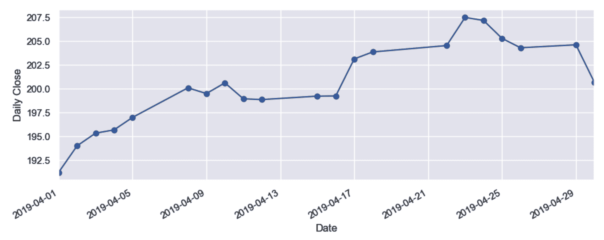

在前面的图表中强调的最佳实践是，显示的日期值采用标准的和一致的格式 YYYY-MM-DD。这有几个重要的原因。对于图表的制作者来说，保持一致的数据类型确保所有值在排序和完成时都是准确的，这意味着数据可视化与源数据相匹配。作为图表的制作者，还应考虑源数据中所有值中可用的最低日期值。这个概念被称为“数据粒度”，它决定了哪个日期可以用作图表的维度。如果同一字段中存在每日和月度数据值，你不应该以原样将它们显示在同一图表中，因为这可能会使消费者感到困惑。

我的同事迈克·乌尔西蒂喜欢说，好的仪表板设计是你创建了一个解决方案，消费者不需要思考，因此任何受众的解释都变得自然。当然，他说得对——很容易在日期值显示不一致或过度使用颜色引导的地方制造干扰，这会导致对图表制作者试图描绘的内容有更多疑问。因此，作为一名数据分析师，花时间思考哪种布局和设计将以逻辑方式呈现你的分析，并且易于任何受众消费。

在下面的图表中，我们与前面的例子具有相同的数据源，但现在数据已经按月汇总，表示为从 1 到 12 的整数。在这种情况下使用的标签很重要，可以帮助消费者理解用于表示每个时间段显示的值的聚合方式。从不同的日期格式查看数据的能力是学习数据分析的一个关键技能，并提高你的数据素养：

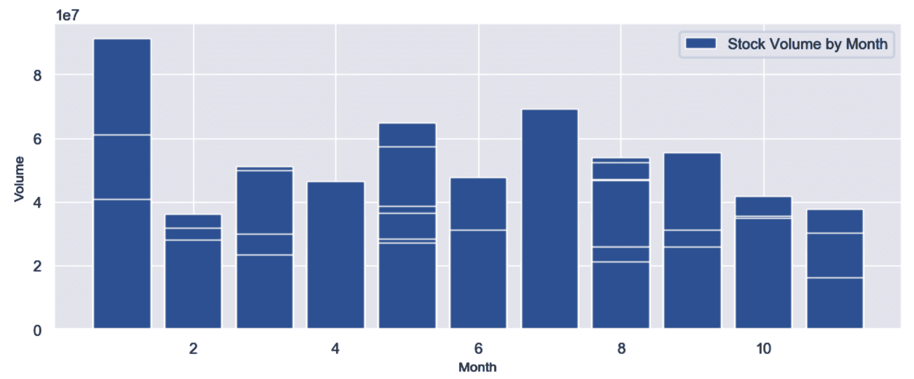

要就图表中的见解进行争论，需要你理解是否正确地使用了适当的聚合。在许多情况下，这需要消费者和制作者都对数据主题及其使用方式有所了解。对于这个例子，按月汇总“每日收盘股价”的值对于这个数据域来说是不相关的，并且主题专家会称这种度量不准确。

然而，提供不同的日期格式为我们提供了一个机会，以可能最初未考虑过的方式查看数据。你还可以更快地提供见解，因为你不必在单个日期值中寻找特定的值。例如，查看 12 个月的趋势在折线图上显示 12 个数据点，而不是显示数十个甚至数百个单独的天数。

在图表中比较一段时间内的结果，可以快速发现异常值或识别数据中的趋势。例如，如果您绘制苹果公司每天收盘价的图表，您将根据线的倾斜度直观地看到上升或下降趋势。这允许消费者更快地识别数据中的模式，如果单独查看每个值，可能不那么明显。

另一个流行且有用的数据分析是**逐年**。如果您正在查看当前年份，这种分析通常被称为**当年至今**（**YTD**）与**去年至今**（**PYTD**）。在这种情况下，您必须定义当前年份的一个固定点，例如当前日期或月份，然后只包括与去年相对应的日期或月份。

下面的图表是这种有用分析的示例，我们比较了当前年份（被识别为 2019 年）1 月至 4 月每个月苹果公司股票交易的量，然后与去年（被识别为 2018 年）的同一个月份的结果进行比较。我发现使用折线图是可视化这种分析的有用方式，因为它很容易对比两条线的差异。一个简单的表格视图也会向数据的消费者展示它们之间的差异：

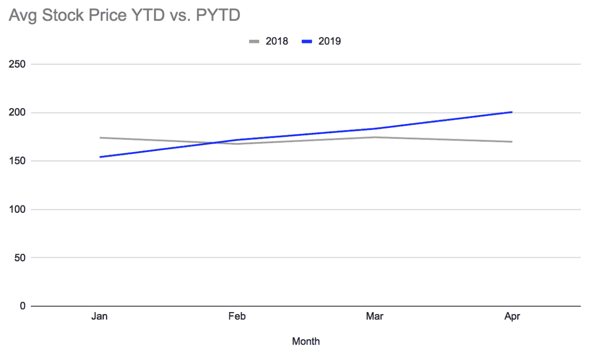

下表显示了相同的数据，但以不同的图表类型显示。如何呈现这些数据的视觉偏好可能会有所不同，您应该能够为您的观众提供任一选项：

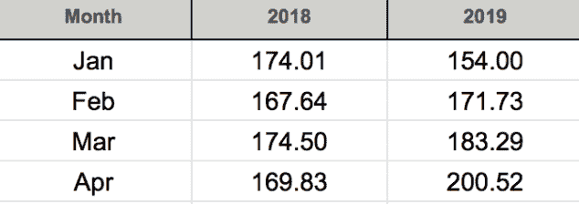

# 曲线的形状

现在我们将深入探讨如何使用名为`matplotlib`的新库从数据创建可视化，这个库是在您第一次使用 Anaconda 时安装的。根据[matplotlib.org](http://matplotlib.org)的历史页面，这个库是从 MATLAB 图形演变而来的，由 John D. Hunter 创建，其理念是*您应该能够仅用几个命令，或者一个命令就能创建简单的图表*。

就像我们介绍的大多数库一样，有许多功能和能力可供您创建图表和数据可视化。`matplotlib`库有一个生态系统，您可以根据不同的用例应用，很好地补充`pandas`和`numpy`库。

有许多教程和额外资源可供您学习这个库。我已经在*进一步阅读*部分添加了必要的链接供您参考。

在这个例子中，我们将加载一个包含上市公司在**全国证券交易商自动报价交易所**（**NASDAQ**）的股票价格详情的 CSV 文件。我们将使用折线图来可视化一个维度和一个度量，看看我们是否能在数据中识别出任何趋势。

为了开始，让我们创建一个新的 Jupyter Notebook 并将其命名为 `create_chart_with_matplotlib`。在这个例子中，我们将使用我们在前几章中学到的几个库和命令。我会一步步地引导您通过代码，所以请随时跟随。我已经在 GitHub 上放置了一个副本供您参考。

## 创建您的第一个时间序列图表

按照以下步骤创建您的第一个时间序列图表：

1.  要加载 `pandas` 库，请在您的 Jupyter Notebook 中使用以下命令并运行该单元格：

```py
In[]: import pandas as pd
```

这个库应该已经通过 Anaconda 可用。有关设置环境的帮助，请参阅[第二章](https://cdp.packtpub.com/python_data_analysis_beginners_guide/wp-admin/post.php?post=24&action=edit)，*Python 和 Jupyter Notebook 安装概述*。

1.  接下来，我们可以将 CSV 文件加载到一个新的 DataFrame 中，命名为 `df_stock_price`，以便更容易识别。为了减少准备数据分析所需步骤的数量，我们向 `pd.read_csv` 函数传递一些参数命令来索引文件中的第一列。我们还将包括 `parse_dates` 参数来定义 `Date` 字段的类型为 `datetime64`：

```py
In[]: df_stock_price=pd.read_csv('AAPL.csv', index_col=0,parse_dates=True)
```

确保您已将 `AAPL.csv` 文件复制到正确的 Jupyter 文件夹目录中，以避免在导入数据文件时出错。

1.  在可视化数据之前，作为一个良好的最佳实践，让我们确保 DataFrame 可以使用 `head()` 命令读取：

```py
In[]: df_stock_price.head(3)
```

1.  输出将如下所示，其中源 CSV 文件已被加载到 DataFrame 中，并带有标记的标题行，其中索引列被定义为 `Date`：

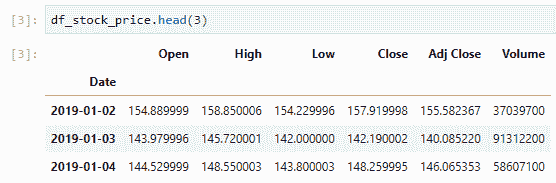

1.  为了验证索引字段的类型是否准确，您可以运行以下命令：

```py
In[]: df_stock_price.index
```

1.  输出将如下所示，其中为这个 DataFrame 定义的索引的 `dtype` 被分配给 `Date` 字段：

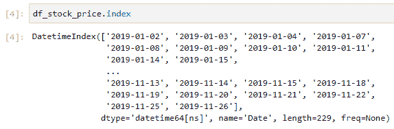

将索引定义为 `datetime` 数据类型字段系列将使绘图功能更容易处理。在可视化之前所做的更多数据准备将确保图表创建更快。

1.  现在，我们可以导入 `matplotlib` 库，以便我们可以引用用于可视化数据的函数。Matplotlib 是一个功能强大的库，具有多个模块。在这个例子中，我们将明确关注 `pyplot` 模块。我们将使用常见的 `plt` 便捷方式来方便引用和采用最佳实践标准：

```py
In[]: import matplotlib.pyplot as plt
```

1.  让我们使用 `plot()` 函数快速创建一个线形图表，针对我们的 DataFrame。为了避免在解释可视化或处理图表时产生混淆，让我们包括特定的 `Close` 字段。在使用这个库时，确保在行尾包含一个分号：

```py
In[]: df_stock_price['Close'].plot()
```

您可能需要在 Jupyter Notebook 中包含一行额外的 `%matplotlib inline` 来显示结果。这行额外的代码被称为魔法函数。

1.  输出将如下所示，其中显示了一条折线图，这是默认选项。它使用 `Date` 字段作为 *x* 轴，这也是维度，使用 `Close` 价格字段值作为 *y* 轴，这是我们的度量：

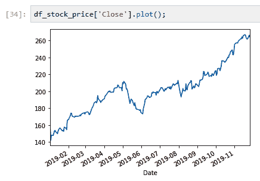

1.  `plot()` 函数有许多不同的参数可以用来自定义可视化。让我们通过调整以下命令中的线条宽度、颜色和线条样式来探索一些简单的更改：

```py
In[]: df_stock_price['Close'].plot(linewidth=.5, color='green',linestyle='dotted')
```

1.  输出将如下所示，其中显示了相同的折线图，但颜色已更改，线条宽度已减小，线条样式为虚线：

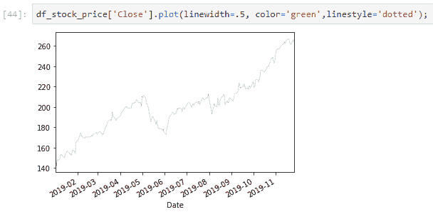

有许多不同的参数允许您通过一些细微的调整来更改可视化的样式。我在“进一步阅读”部分为您提供了库的参考。

1.  接下来，让我们通过添加标签来丰富图表功能，以便为消费者提供更多细节：

```py
In[]: df_stock_price['Close'].plot(linewidth=.5, color='green',linestyle='dotted')
plt.xlabel('Close Date')
plt.ylabel('Close Price')
plt.suptitle('AAPL Stock Price Trend');
```

1.  输出将如下所示，其中显示了之前的相同折线图，但现在我们包括了上下文细节，如维度和度量标签，以及图表的标题：

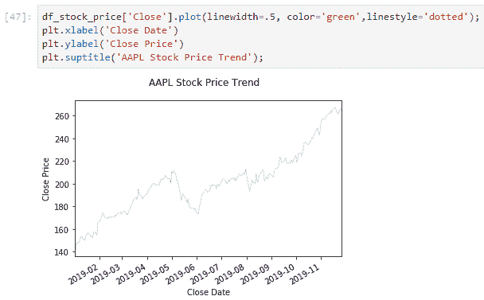

1.  该库中另一个可用的数据可视化功能是柱状图。要使用此功能，我们必须对命令进行一些调整。为了回答“股票量趋势是什么？”这个问题，我们可以使用这个命令。注意使用 `.index` 传递 `Date` 字段值：

```py
In[]: plt.bar(df_stock_price.index,df_stock_price['Volume']);
```

输出将如下所示，其中图表以柱状图的形式显示值：

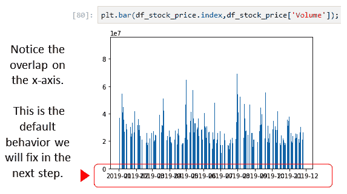

1.  然而，我注意到这个图表在向消费者展示时存在一些问题。标签重叠，因此难以理解可视化。让我们做一些小的调整，使图表更美观：

```py
In[]: plt.bar(df_stock_price.index,df_stock_price['Volume'], color='blue')
plt.xticks(rotation = 90)
plt.yticks(fontsize = 10)
plt.xlabel('Date')
plt.ylabel('Volume')
plt.suptitle('AAPL Stock Volume Trend');
```

输出将如下所示，其中图表以柱状图的形式显示值。请注意，然而，标签已被添加，使图表更容易消费和理解：

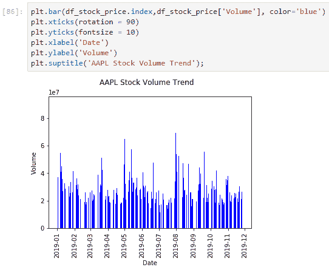

这些步骤定义了生成分析工作流程以可视化数据的最佳实践。一旦您将数据存储在 DataFrame 中并加载 `matplotlib` 库，可视化数据就会变得更快。在这个过程中调整参数时，进行一些尝试和错误是很常见的。始终保存您的作品和示例，这样您就可以轻松地重新创建提供快速洞察的数据可视化，而无需筛选数据行。

# 摘要

恭喜你——你现在已经学会了一些令人兴奋的新方法来可视化数据，并解释各种图表类型以帮助扩展你的数据素养技能！在本章中，你学习了一些最佳实践来找到适合特定分析类型的正确图表。你还学习了维度和度量之间的区别，以及如何建模数据以进行分析以回答问题。

接下来，你通过探索 pandas 中的各种时间序列和日期功能，学习了制作各种图表（如折线图和条形图）的必要技能。我们突出了数据可视化领域的领导者，如 Alberto Cairo 和 Naomi B. Robbins，并讨论了他们如何影响了数据分析的演变。最后，你使用了`.plot()`方法，通过`matplotlib`库创建时间序列图表。

在下一章中，我们将探讨我们可以使用的清理、精炼和合并多个数据集的技术。

# 进一步阅读

+   所有 Matplotlib 库功能的参考：[`matplotlib.org/index.html`](https://matplotlib.org/index.html)

+   需要避免的数据可视化陷阱：[`www.ometis.co.uk/data-visualisation-pitfalls/`](https://www.ometis.co.uk/data-visualisation-pitfalls/)

+   一篇优秀的文章，帮助你选择合适的图表：[`extremepresentation.typepad.com/blog/2006/09/choosing_a_good.html`](http://extremepresentation.typepad.com/blog/2006/09/choosing_a_good.html)

+   一个优秀的网站，可以帮助你找到适合特定分析类型的正确图表：[`labs.juiceanalytics.com/chartchooser/index.html`](http://labs.juiceanalytics.com/chartchooser/index.html)

+   一份优秀的速查表，以提高数据可视化：[`billiondollargraphics.com/wp-content/uploads/2015/09/Billion-Dollar-Graphics-Graphic-Cheat-Sheet.pdf`](http://billiondollargraphics.com/wp-content/uploads/2015/09/Billion-Dollar-Graphics-Graphic-Cheat-Sheet.pdf)

+   数据可视化指南：[`www.excelcharts.com/blog/god-and-moses-the-differences-between-edward-tufte-and-stephen-few/`](http://www.excelcharts.com/blog/god-and-moses-the-differences-between-edward-tufte-and-stephen-few/)

+   功能性艺术博客：[`www.thefunctionalart.com/`](http://www.thefunctionalart.com/)

+   纽约市数据可视化 Meetup 章节，对所有来自世界各地的成员开放：[`www.meetup.com/DataVisualization/`](https://www.meetup.com/DataVisualization/)

+   Kimball 集团维度建模技术：[`www.kimballgroup.com/data-warehouse-business-intelligence-resources/kimball-techniques/dimensional-modeling-techniques/`](https://www.kimballgroup.com/data-warehouse-business-intelligence-resources/kimball-techniques/dimensional-modeling-techniques/)
