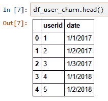
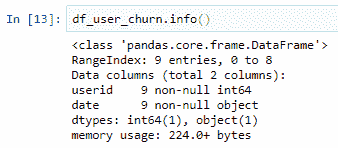
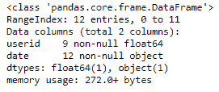
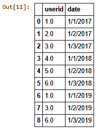
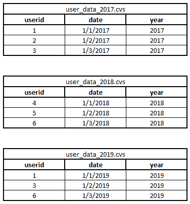
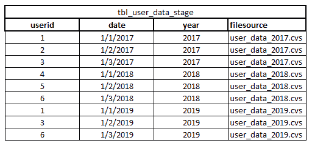
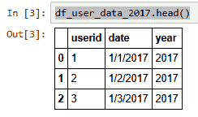
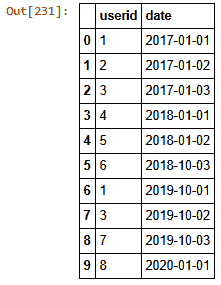
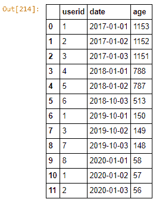

探索、清洗、精炼和融合数据集

在上一章中，我们学习了数据可视化的力量，以及拥有高质量、一致数据的重要性，这些数据通过维度和度量来定义。

现在我们已经理解了*为什么*这很重要，我们将通过实际操作数据，在本章中专注于*如何*。到目前为止，提供的多数示例都包括了已经*准备*（准备）好的数据，以便更容易消费。我们现在正在学习必要的技能，以便在处理数据时感到舒适，从而提高你的数据素养。

本章的一个关键概念是清洗、过滤和精炼数据。在许多情况下，你需要执行这些操作的原因是源数据本身并不提供高质量的分析。在我的整个职业生涯中，高质量的数据不是常态，数据缺口很常见。作为优秀的数据分析师，我们需要利用我们所能拥有的。我们将介绍一些技术来提高数据质量，这样你就可以在源数据不包含所需的所有信息的情况下，提供高质量的见解并回答数据中的问题。

根据我的经验，强调源数据质量差是一个洞察力，因为透明度不足，关键利益相关者对使用数据的挑战并不了解。底线是，数据质量差不应该阻止你继续与数据工作。我的目标是展示一个可重复的技术和工作流程，以提高分析数据的质量。

本章我们将涵盖以下主题：

+   检索、查看和存储表格数据

+   学习如何限制、排序和筛选数据

+   使用 Python 清洗、精炼和净化数据

+   合并和分箱数据

# 技术要求

这是本书的 GitHub 仓库链接：[`github.com/PacktPublishing/Practical-Data-Analysis-using-Jupyter-Notebook/tree/master/Chapter07`](https://github.com/PacktPublishing/Practical-Data-Analysis-using-Jupyter-Notebook/tree/master/Chapter07)。

你可以从以下链接下载和安装所需的软件：[`www.anaconda.com/products/individual`](https://www.anaconda.com/products/individual)。

# 检索、查看和存储表格数据

在前面的章节中已经多次介绍了检索和查看表格数据的能力；然而，那些例子都是侧重于消费者的视角。我们学习了理解结构化数据是什么，它可以采取的许多不同形式，以及如何从数据中回答一些问题的技能。在这段时间里，我们的数据素养有所提高，但我们一直依赖数据源的生产者，通过使用一些 Python 命令或 SQL 命令使其更容易阅读。在本章中，我们将从仅作为消费者转变为现在成为数据的生产者，通过学习操纵数据以进行分析的技能。

作为一名优秀的数据分析师，您需要消费者和供应商技能谱系的两侧来解决更复杂的数据问题。例如，企业要求的一个常见度量标准，针对网站或移动用户，被称为**使用分析**。这意味着在时间快照中计算用户数量，例如按日、周、月和年。更重要的是，您想更好地了解这些用户是新的、回头的还是流失的。

与使用分析相关的一些常见问题如下：

+   本日、本周或这个月有多少新用户访问了网站？

+   本日、本周或这个月有多少回头用户访问了网站？

+   本周、这个月或这一年我们失去了多少用户（60 天以上未活跃）？

要回答这些问题，您的数据源至少必须提供 `timestamp` 和唯一的 `user_id` 字段。在许多情况下，这些数据将具有高容量和速度，因此分析这些信息将需要正确的人员、流程和技术组合，我有幸与这些合作。数据工程团队构建数据摄取管道，以便使这些数据可用于报告和分析。

您可能需要与数据工程团队合作，将业务规则和汇总级别（也称为聚合）应用于包含回答用户分析问题所需额外字段的数据。在我们的示例中，我已经提供了一个更小的数据样本，我们将从现有的源数据文件中推导出新的数据字段。

我认为最好的学习方法是一起逐步操作，所以让我们创建一个新的 Jupyter 笔记本，命名为 `user_churn_prep`。我们将从数据库中检索数据并将其加载到 DataFrame 中开始，类似于第五章*在 Python 中收集和加载数据*中概述的步骤。为了简化，我们正在使用另一个 SQLite 数据库来检索源数据。

如果您想了解更多关于连接到 SQL 数据源的信息，请参阅第五章，*在 Python 中收集和加载数据*。

## 检索

要创建连接并使用 SQLite，我们必须使用代码导入一个新的库。对于这个例子，我已经提供了一个名为 `user_hits.db` 的数据库文件，所以请确保您事先从我的 GitHub 仓库下载它：

1.  要加载 SQLite 数据库连接，您只需在您的 Jupyter 笔记本中添加以下命令并运行该单元格。我已经在 GitHub 上放置了一个副本供参考：

```py
In[]: import sqlite3
```

1.  接下来，我们需要将一个连接分配给名为 `conn` 的变量，并指向数据库文件的位置，该文件名为 `user_hits.db`：

```py
In[]: conn = sqlite3.connect('user_hits.db')
```

确保您已将 `user_hits.db` 文件复制到正确的 Jupyter 文件夹目录中，以避免连接错误。

1.  导入 `pandas` 库，以便您可以创建一个 DataFrame：

```py
In[]: import pandas as pd
```

1.  执行一个 SQL 语句并将结果分配给一个 DataFrame：

```py
In[]: df_user_churn = pd.read_sql_query("SELECT * FROM tbl_user_hits;", conn)
```

1.  现在我们已经将结果存储在 DataFrame 中，我们可以使用所有可用的 `pandas` 库命令来处理这些数据，而无需返回到数据库。您的代码应类似于以下截图：


## 查看

执行以下步骤以查看检索到的数据的结果：

1.  要查看结果，我们可以运行 `head()` 命令对此 DataFrame 进行操作，使用以下代码：

```py
In[]: df_user_churn.head()
```

输出将类似于以下表格，其中 `tbl_user_hits` 表已被加载到 DataFrame 中，带有标签的标题行，左侧的索引列从 `0` 开始：



在我们进行下一步之前，让我们使用一些元数据命令来验证我们加载的数据。

1.  在下一个 `In[]:` 单元格中输入 `df_user_churn.info()` 并运行该单元格：

```py
In[]: df_user_churn.info()
```

确认输出单元格显示 `Out []`。将显示多行，包括所有列的数据类型，类似于以下截图：



## 存储

现在我们已经将数据作为 DataFrame 可用于 Jupyter 中的工作，让我们运行一些命令将其存储为文件以供参考。将数据作为分析快照存储是一种有用的技术，虽然我们的示例很简单，但这个概念将有助于未来的数据分析项目。

要将您的 DataFrame 存储到 CSV 文件中，您只需运行以下命令：

```py
In[]: df_user_churn.to_csv('user_hits_export.csv')
```

结果将类似于以下截图，其中在您的当前 Jupyter 笔记本相同的项目文件夹中创建了一个新的 CSV 文件。根据您在工作站上使用的操作系统，结果可能会有所不同：


您可以将 DataFrame 导出为其他格式，包括 Excel。您还应该注意您导出数据文件的文件路径。查看 *进一步阅读* 部分以获取更多信息。

# 学习如何限制、排序和筛选数据

现在我们已经将数据存储在 DataFrame 中，我们可以通过几个 Python 命令来了解如何限制、排序和筛选数据。我们将使用 pandas 来讲解的概念在 SQL 中也很常见，因此我也会包括相应的 SQL 命令以供参考。

## 限制

限制数据的概念，也称为过滤数据，主要是基于条件隔离一个或多个记录。简单的例子是当你只根据匹配特定字段和值检索结果时。例如，你可能只想看到某个用户或特定时间点的结果。限制数据的其他要求可能更复杂，包括需要复杂逻辑、业务规则和多个步骤的明确条件。我不会涵盖需要复杂逻辑的复杂示例，但将在 *进一步阅读* 部分添加一些参考。然而，涵盖的概念将教会你满足许多常见用例的基本技能。

在我们的第一个例子中，让我们从 DataFrame 中隔离一个特定的用户。使用 `pandas` 命令，这相当简单，所以让我们启动一个新的 Jupyter notebook，命名为 `user_churn_restricting`：

1.  导入 `pandas` 库，以便你可以创建一个 DataFrame：

```py
In[]: import pandas as pd
```

1.  通过从先前示例中创建的 CSV 文件加载数据创建一个新的 DataFrame：

```py
In[]: df_user_churn = pd.read_csv('user_hits_export.csv');
```

文件路径和文件名必须与先前示例中使用的相同。

现在我们已经将所有用户数据加载到一个单独的 DataFrame 中，我们可以轻松地引用源数据集来限制结果。保留这个源 DataFrame 完整是一个最佳实践，这样你可以为其他目的和分析引用它。在分析过程中，根据不断变化的需求进行调整，或者你只能通过调整来获得洞察力，这也是常见的。

在我的职业生涯中，我遵循在处理数据时的一种常见做法，即 *你不知道你不知道的*，所以能够轻松地引用源数据而不撤销你的更改是很重要的。这通常被称为快照分析，并具有根据需要回滚更改的能力。

当处理大于十亿行的数据源时，快照将需要大量的资源，其中 RAM 和 CPU 将受到影响。你可能需要按日期增量快照，或者创建一个滚动的时间窗口来限制一次可以处理的数据量。

要将我们的数据限制到特定用户，我们将从源 DataFrame 创建一个新的 DataFrame。这样，如果我们需要调整创建新 DataFrame 所使用的过滤器，我们不需要从头开始重新运行所有步骤。

1.  通过从源 DataFrame 加载数据创建一个新的 DataFrame。语法是嵌套的，所以你实际上是在同一个 `df_user_churn` DataFrame 内部调用它，并仅过滤出 `userid` 等于 `1` 的显式值：

```py
In[]: df_user_restricted = df_user_churn[df_user_churn['userid']==1]
```

1.  要查看和验证结果，你可以运行一个简单的 `head()` 命令：

```py
In[]: df_user_restricted.head()
```

结果将类似于以下截图，其中新的 `df_user_restricted` DataFrame 中只有两行在 `userid` 为 `1` 时有值：


限制数据有助于隔离特定类型的分析记录，从而帮助回答更多的问题。在下一步中，我们可以开始回答与使用模式相关的问题。

## 排序

现在我们已经通过创建一个新的 DataFrame 来隔离了特定的用户，该 DataFrame 现在可供参考，我们可以通过提出以下问题来增强我们的分析：

+   特定用户是什么时候开始使用我们的网站的？

+   这位用户多久访问一次我们的网站？

+   这位用户最后一次访问我们的网站是什么时候？

所有这些问题都可以通过一些简单的 Python 命令来回答，这些命令专注于排序命令。排序数据是任何编程语言的计算机程序员都熟悉的一项技能。通过添加`order by`命令，很容易用 SQL 完成排序。排序数据的概念是众所周知的，因此我将不会深入定义；相反，我将专注于在执行数据分析时的重要功能和最佳实践。

在结构化数据中，排序通常被理解为按特定列的行级排序，这将通过从低到高或从高到低排序值的顺序来定义。默认情况下是低到高，除非你明确更改它。如果值的数据类型是数值型，例如整数或浮点数，排序顺序将很容易识别。对于文本数据，值将按字母顺序排序，并且根据所使用的技术的不同，混合大小写的文本将被不同地处理。在 Python 和 pandas 中，我们有特定的函数和参数，可以处理许多不同的用例和需求。

让我们开始使用`sort()`函数回答我们之前概述的一些问题：

1.  要回答问题“*特定用户是什么时候开始使用我们的网站的？*”，我们只需要运行以下命令：

```py
In[]: df_user_restricted.sort_values(by='date')
```

结果将类似于以下截图，其中结果按`date`字段升序排序：


1.  要回答问题“*这位用户最后一次访问我们的网站是什么时候？*”，我们只需要运行以下命令：

```py
In[]: df_user_restricted.sort_values(by='date', ascending=False)
```

结果将类似于以下截图，其中显示的记录与之前的相同；然而，值是按此特定`userid`的最后可用日期降序排序的：


## 筛选

数据筛选的概念意味着我们根据一个或多个条件从数据集中隔离特定的列和/或行。在筛选与限制之间有一些细微的差别，所以我将筛选定义为需要对数据集的群体应用额外的业务规则或条件，以隔离数据的一个子集。筛选数据通常需要从源数据中创建新的派生列，以回答更复杂的问题。对于我们的下一个例子，关于使用情况的一个好问题是：*在周一访问我们网站的同一位用户是否也在同一周内返回？*

为了回答这个问题，我们需要隔离特定星期的使用模式。这个过程需要几个步骤，我们将从之前创建的原始 DataFrame 中一起概述：

1.  通过从源文件加载数据创建一个新的 DataFrame：

```py
In[]: df_user_churn_cleaned = pd.read_csv('user_hits_binning_import.csv', parse_dates=['date'])
```

接下来，我们需要通过添加新的派生列来扩展 DataFrame，以帮助简化分析。由于我们有可用的 `Timestamp` 字段，pandas 库有一些非常有用的函数可以帮助这个过程。标准 SQL 也有内置的功能，并且会根据使用的 RDMS 而有所不同，因此您需要参考可用的日期/时间函数。例如，Postgres 数据库使用 `select to_char(current_date,'Day');` 语法将日期字段转换为当前星期几。

1.  导入一个新的 `datetime` 库，以便轻松引用日期和时间函数：

```py
In[]: import datetime
```

1.  为当前的 `datetime` 分配一个变量，以便更容易地计算从今天起的 `age`：

```py
In[]: now = pd.to_datetime('now')
```

1.  添加一个名为 `age` 的新派生列，该列是从当前日期减去每个用户的日期值计算得出的：

```py
In[]: df_user_churn_cleaned['age'] = now - df_user_churn_cleaned['date']

```

如果您在笔记本中收到 `datetime` 错误，您可能需要升级您的 `pandas` 库。

# 使用 Python 清理、精炼和净化数据

数据质量对于任何数据分析和分析都至关重要。在许多情况下，您直到开始处理数据之前都不会了解数据质量是好是坏。我会将高质量数据定义为结构良好、定义明确且一致的信息，其中每个字段中的几乎所有值都按照预期定义。根据我的经验，数据仓库将拥有高质量的数据，因为整个组织都有报告。根据我的经验，不良的数据质量出现在数据源缺乏透明度的地方。不良的数据质量示例包括预期数据类型的不一致性和分隔数据集中值的一致模式。为了帮助解决这些数据质量问题，您可以从我们在第一章，“数据分析基础”，中涵盖的概念和问题开始理解您的数据，即**了解您的数据 (KYD)**。由于数据质量会因来源而异，您可以提出以下一些具体问题来了解数据质量：

+   数据是有结构还是无结构的？

+   数据的来源是否可以追溯到某个系统或应用程序？

+   数据是否被转换并存储在仓库中？

+   数据是否有具有定义的数据类型的模式？

+   您是否有包含业务规则文档的数据字典可用？

在事先收到这些问题的答案将是一种奢侈；在过程中发现它们对于数据分析师来说更为常见。在这个过程中，你仍然需要清洗、精炼和纯化你的数据以供分析。你需要花费多少时间将取决于许多不同的因素，而真正质量成本将是提高数据质量所需的时间和精力。

数据清洗可以采取多种不同的形式，并且几十年来一直是数据工程师和分析实践者的常见做法。企业级和大数据清洗需要许多不同的技术和技能集。数据清洗是信息技术（**IT**）行业的一部分，因为高质量数据值得外包的价格。

数据清洗的常见定义是从源数据中移除或解决低质量数据记录的过程，这取决于用于持久化数据的技术的不同，例如数据库表或编码文件。低质量数据可以识别为任何不符合生产者预期和定义要求的数据。这可以包括以下内容：

+   一行或多行字段中的缺失或空（`NaN`）值

+   孤立记录，其中主键或外键在任何引用的源表中找不到

+   腐坏记录，其中一条或多条记录无法被任何报告或分析技术读取

以我们的示例为例，让我们再次查看我们的使用数据，并看看我们是否可以通过分析它来发现任何问题，以查看是否存在任何异常：

1.  导入 CSV 文件并运行`info()`命令以确认数据类型和行数，并获取更多关于 DataFrame 的信息的概要：

```py
In[]: df_usage_patterns = pd.read_csv('user_hits_import.csv')
df_usage_patterns.info()
```

结果将类似于以下截图，其中展示了 DataFrame 的元数据：



发现的一个异常是两个字段之间的值数量不同。对于`userid`字段，有 9 个非空值，而对于`date`字段，有 12 个非空值。对于这个数据集，我们期望每一行两个字段都有一个值，但这个命令告诉我们存在缺失值。让我们运行另一个命令来识别哪个索引/行有缺失数据。

1.  运行`isnull()`命令以确认数据类型和行数，并获取更多关于 DataFrame 的信息的概要：

```py
In[]: pd.isnull(df_usage_patterns)
```

结果将类似于以下表格，其中按行和列显示了一列`True`和`False`值：


记录计数看起来不错，但请注意`userid`字段中存在空值（NaN）。对于每行数据的唯一标识符对于准确分析这些数据至关重要。`userid`为空的原因需要由数据的生产者解释，可能需要额外的工程资源来帮助调查和排除问题的根本原因。在某些情况下，这可能是数据源创建过程中简单的技术故障，需要微小的代码更改和重新处理。

我总是建议尽可能接近数据源进行数据清理，这样可以节省时间，避免其他数据分析师或报告系统重新工作。

在我们的分析中包含空值将影响我们的汇总统计和指标。例如，平均每日用户的计数在存在空值的日期会较低。对于用户流失分析，报告用户的频率度量将受到扭曲，因为 NaN 值可能是返回的`user_ids`之一或新用户。

对于任何高容量基于事务的系统，可能存在需要考虑的误差范围。作为一名优秀的数据分析师，要问的问题是：“质量成本和百分之一百准确性的成本是多少？”如果由于更改所需的时间和资源而价格过高，一个好的替代方案是排除和隔离缺失数据，以便稍后进行调查。

注意，如果您最终将隔离的数据添加回分析中，您将不得不重新陈述结果，并通知任何消费者您的指标发生了变化。

让我们通过一个例子来了解如何通过识别 NaN 记录并创建一个新的 DataFrame 来隔离和排除任何缺失数据：

1.  通过从源 DataFrame 加载数据创建一个新的 DataFrame，但我们将通过添加`dropna()`命令排除空值：

```py
In[]: df_user_churn_cleaned = df_usage_patterns.dropna()
```

1.  要查看和验证结果，您可以运行一个简单的`head()`命令，并确认 NaN/空值已被删除：

```py
In[]: df_user_churn_cleaned.head(10)
```

结果将类似于以下表格，其中新的 DataFrame 包含没有在`userid`或`date`中缺失值的完整记录：



# 数据合并和分箱

由于多种原因，有时需要合并多个数据源，以下是一些原因：

+   源数据被拆分为许多具有相同定义模式（表和字段名称）的不同文件，但行数会有所不同。一个常见的原因是为了存储目的，与一个大型文件相比，维护多个较小的文件大小更容易。

+   数据被分区，其中一个字段用于将数据拆分以加快对源数据的读取或写入响应时间。例如，HIVE/HDFS 建议按单个日期值存储数据，这样您可以轻松地识别数据何时被处理，并快速提取特定一天的数据。

+   历史数据存储在不同于当前数据的技术中。例如，工程团队更改了用于管理源数据的技术，并决定不导入特定日期之后的历史数据。

由于这里定义的任何原因，数据合并是数据分析中的常见做法。我将数据合并的过程定义为当你将两个或多个数据源分层到一个地方，其中所有来源的相同字段/列对齐时。在 SQL 中，这被称为 `UNION ALL`，而在 `pandas` 中，我们使用 `concat()` 函数将所有数据汇集在一起。

数据合并的一个良好视觉示例如下截图所示，其中多个源文件命名为 `user_data_YYYY.cvs`，并且每年都定义为 YYYY。这三个文件，它们都具有相同的字段名 `userid`、`date` 和 `year`，被导入到一个名为 `tbl_user_data_stage` 的 SQL 表中，如下截图所示。存储此信息的目标表还包括一个名为 `filesource` 的新字段，以便数据来源对生产者和消费者都更加透明：



一旦数据被处理并持久化到名为 `tbl_user_data_stage` 的表中，所有三个文件中的记录都将按以下表格所示保留。在此示例中，任何重复的记录都将保留在源文件和目标表之间：



数据工程团队创建 `阶段` 表的一个原因是为了帮助构建数据摄取管道并创建业务规则，其中重复的记录被删除。

为了在 Jupyter 中重现示例，让我们创建一个新的笔记本并将其命名为 `ch_07_combining_data`。导入多个文件有更高效的方法，但在我们的示例中，我们将分别将每个文件导入到单独的 DataFrame 中，然后合并它们：

1.  导入 `pandas` 库：

```py
In[]: import pandas as pd
```

您还需要将三个 CSV 文件复制到您的本地文件夹中。

1.  导入名为 `user_data_2017.csv` 的第一个 CSV 文件：

```py
In[]: df_user_data_2017 = pd.read_csv('user_data_2017.csv')
```

1.  运行 `head()` 命令以验证结果：

```py
In[]: df_user_data_2017.head()
```

结果将类似于以下截图，其中行以标题行和从值 `0` 开始的索引显示：



1.  对下一个 CSV 文件重复此过程，该文件名为 `user_data_2018.csv`：

```py
In[]: df_user_data_2018 = pd.read_csv('user_data_2018.csv')
```

1.  运行 `head()` 命令以验证结果：

```py
In[]: df_user_data_2018.head()
```

结果将类似于以下截图，其中行以标题行和从值 `0` 开始的索引显示：


1.  对下一个 CSV 文件重复此过程，该文件名为 `user_data_2019.csv`：

```py
In[]: df_user_data_2019 = pd.read_csv('user_data_2019.csv')
```

1.  运行 `head()` 命令以验证结果：

```py
In[]: df_user_data_2019.head()
```

结果将类似于以下截图，其中行以标题行和从值 `0` 开始的索引显示：


1.  下一步是使用`concat()`函数合并 DataFrame。我们包含`ignore_index=True`参数以为所有结果创建一个新的索引值：

```py
In[]: df_user_data_combined = pd.concat([df_user_data_2017, df_user_data_2018, df_user_data_2019], ignore_index=True)
```

1.  运行`head()`命令以验证结果：

```py
In[]: df_user_data_combined.head(10)
```

结果将类似于以下截图，其中行以标题行和从值`0`开始的索引显示：


## 分箱

分箱是一种非常常见的分析技术，允许您根据一个或多个标准对数值数据进行分组。这些组成为命名类别；它们在本质上是有序的，并且可以在范围之间具有相等的宽度或自定义要求。一个很好的例子是年龄范围，您通常在以下截图中所见的调查中看到：


在这个例子中，一个人的年龄范围是输入，但如果我们实际上在数据中有了每个人的出生日期怎么办？那么，我们可以计算今天的年龄并根据前面的截图中的标准分配年龄段。这就是分箱数据的过程。

另一个常见的例子是天气数据，其中*热*、*温暖*或*冷*等分配给华氏或摄氏温度的范围。每个区间值由数据分析师任意决定的条件定义。

对于我们的用户数据，让我们根据用户首次出现在我们的数据集中时的时间来分配年龄区间。我们将根据要求定义三个区间，这使我们能够调整分配的范围。在我们的例子中，我们定义区间如下：

+   不到 1 年

+   1 至 2 年

+   超过 3 年

如何创建区间的具体条件，一旦我们通过代码演示，就会变得明显。

这种类型分析的另一项酷特性是，我们的计算年龄是基于使用数据和每次我们运行代码时计算的一个时间点。例如，如果用户第一次访问网站的时间是*2017 年 1 月 1 日*，而我们在这个分析中是在 2018 年 12 月 3 日进行的，那么用户的年龄（以天为单位）将是 360 天，这将分配给*不到 1 年*的区间。

如果我们在稍后的日期，例如 2019 年 11 月 18 日，重新运行此分析，计算出的年龄将改变，因此新的分配区间将是*1 至 2 年*。

每个区间添加逻辑的位置的决定会有所不同。最灵活地更改分配的区间是在您提供分析的地方添加逻辑。在我们的例子中，那将是直接在 Jupyter 笔记本中。然而，在企业环境中，可能使用许多不同的技术来提供相同分析，将分箱逻辑移得更靠近源是有意义的。在某些情况下，存储在数据库中的非常大的数据集，使用 SQL 甚至更改表的模式是一个更好的选择。

如果你像我一样有幸拥有一个熟练的数据工程团队和与大数据工作的经验，将分箱逻辑移至数据表附近的决定就很容易了。在 SQL 中，你可以使用`CASE 语句`或 if/then 逻辑。Qlik 有一个名为`class()`的函数，可以根据线性尺度对值进行分箱。在 Microsoft Excel 中，可以使用嵌套公式根据函数混合来分配分箱。

因此，分箱的概念可以应用于不同的技术，作为一名优秀的数据分析师，你现在已经具备了理解如何实现它的基础。

让我们通过使用我们的使用数据和 Jupyter Notebook 的示例来巩固知识。

在执行以下步骤之前，请记住将任何依赖的 CSV 文件复制到工作文件夹中。

为了在 Jupyter 中重现示例，让我们创建一个新的笔记本，并将其命名为`ch_07_sifting_and_binning_data`：

1.  导入`pandas`库：

```py
In[]: import pandas as pd
```

1.  读取提供的 CSV 文件，该文件包含本例的附加数据，并创建一个新的 DataFrame，命名为`df_user_churn_cleaned`。我们还在导入时使用`parse_dates`参数将源 CSV 文件中找到的`date`字段转换为`datetime64`数据类型，这将使在接下来的几个步骤中更容易操作：

```py
In[]: df_user_churn_cleaned = pd.read_csv('user_hits_binning_import.csv', parse_dates=['date'])
```

1.  使用`head()`函数验证 DataFrame 是否有效：

```py
In[]: df_user_churn_cleaned.head(10)

```

函数的输出将类似于以下表格，其中 DataFrame 已加载具有正确数据类型的两个字段，并可用于分析：



1.  导入`datetime`和`numpy`库以供稍后参考，用于计算`userid`字段的`age`值：

```py
In[]: from datetime import datetime
      import numpy as np
```

1.  通过使用`now`函数和`date`字段计算当前日期和时间之间的差异来创建一个新的派生列`age`。为了以天为单位格式化`age`字段，我们包括`dt.days`函数，它将值转换为干净的`"%d"`格式：

```py
In[]: #df_user_churn_cleaned['age'] = (datetime.now() - pd.to_datetime(df_user_churn_cleaned['date'])).dt.days
df_user_churn_cleaned['age'] = (datetime(2020, 2, 28)  - pd.to_datetime(df_user_churn_cleaned['date'])).dt.days

```

为了与截图匹配，我明确地将日期值定义为 2020-02-28，日期格式为 YYYY-MM-DD。你可以取消注释前面的行来计算当前的时间戳。由于时间戳每次运行函数都会变化，结果将不会与任何图像完全匹配。

1.  验证新的`age`列是否已包含在你的 DataFrame 中：

```py
In[]: df_user_churn_cleaned.head()
```

函数的输出将类似于以下表格，其中 DataFrame 已经从原始导入中修改，并包含一个名为`age`的新字段：



1.  创建一个新的 DataFrame，命名为`df_ages`，它从现有的 DataFrame 中分组维度并按`userid`计算最大`age`值：

```py
In[]: df_ages = df_user_churn_cleaned.groupby('userid').max()
```

输出将类似于以下截图，其中行数已从源 DataFrame 中减少。仅显示具有最大`age`值的唯一`userid`值，当第一条记录由`userid`创建时：


1.  通过使用 `pandas` 库的 `cut()` 函数创建一个新的 `age_bin` 列。这将把 `age` 字段中的每个值放置在我们分配的 `bins` 范围之一之间。我们使用 `labels` 参数使分析对任何受众都更容易理解。注意，我们选择了 `9999` 的值来为 `age` 值创建一个最大边界：

```py
In[]: df_ages['age_bin'] = pd.cut(x=df_ages['age'], bins=[1, 365, 730, 9999], labels=['< 1 year', '1 to 2 years', '> 3 years'])

```

1.  显示 DataFrame 并验证显示的 bin 值：

```py
In[]: df_ages
```

函数的输出将类似于以下截图，其中 DataFrame 已被修改，我们现在可以看到 `age_bin` 字段中的值：


# 摘要

恭喜你，通过作为数据分析的消费者和生产者来处理数据，你已经提高了你的数据素养技能。我们涵盖了一些重要主题，包括通过创建数据视图、排序和从 SQL 源查询表格数据来操纵数据的必要技能。你现在有一个可重复的工作流程，可以将多个数据源合并成一个精炼的数据集。

我们探讨了使用 `pandas` DataFrame 的其他功能，展示了如何限制和筛选数据。我们通过使用 *u*<q>用户流失</q> 的概念来介绍现实世界的实际示例，以回答关于使用模式的关键业务问题，通过隔离特定用户和处理源数据中的缺失值。

我们下一章是第八章，*理解连接、关系和数据聚合*。除了使用聚合的概念创建总结分析外，我们还将详细介绍如何通过定义的关系连接数据。

# 进一步阅读

你可以参考以下链接以获取有关本章主题的更多信息：

+   使用 DataFrame 进行过滤和分组的良好教程：[`github.com/bhavaniravi/pandas_tutorial/blob/master/Pandas_Basics_To_Beyond.ipynb`](https://github.com/bhavaniravi/pandas_tutorial/blob/master/Pandas_Basics_To_Beyond.ipynb)

+   SQL 特性与它们等效的 pandas 函数的比较：[`pandas.pydata.org/pandas-docs/stable/getting_started/comparison/comparison_with_sql.html`](https://pandas.pydata.org/pandas-docs/stable/getting_started/comparison/comparison_with_sql.html)

+   关于将数据导出到 Excel 的更多信息：[`pandas.pydata.org/pandas-docs/stable/reference/api/pandas.DataFrame.to_excel.html#pandas.DataFrame.to_excel`](https://pandas.pydata.org/pandas-docs/stable/reference/api/pandas.DataFrame.to_excel.html#pandas.DataFrame.to_excel)

+   SQL 日期和时间函数的示例：[`www.postgresql.org/docs/8.1/functions-datetime.html`](https://www.postgresql.org/docs/8.1/functions-datetime.html)
