绘图、可视化和讲故事

本章将教你如何通过探索额外的图表选项，如直方图、箱线图和散点图来可视化数据，以提升你的数据素养技能。数据讲故事始于理解数字之间的关系，因此我们将学习分布曲线及其在分析中的应用。在分析数据的发现阶段，你将学习如何识别异常值和模式，以及可视化地理数据的最佳实践。我们将通过学习**相关性**与**因果关系**的区别来结束本章。

本章我们将涵盖以下主题：

+   解释分布分析

+   理解异常值和趋势

+   地理分析技术和技巧

+   在数据中寻找模式

# 第十二章：技术要求

本书 GitHub 仓库地址为[`github.com/PacktPublishing/Practical-Data-Analysis-using-Jupyter-Notebook/tree/master/Chapter09`](https://github.com/PacktPublishing/Practical-Data-Analysis-using-Jupyter-Notebook/tree/master/Chapter09)。

您可以从[`www.anaconda.com/products/individual`](https://www.anaconda.com/products/individual)下载并安装所需的软件。

# 解释分布分析

我无法回忆起历史上数据、统计学和科学像今天这样占据人们日常生活的情况。新闻周期正在实时呈现危机，人类行为的变化和社会规范正在被重新定义。在我撰写这本书的时候，**曲线平滑**的概念已经变得主流，并因冠状病毒（COVID-19）大流行而成为全球通用的概念。你可能已经看到了以下图表中展示的内容，该图表是从**疾病控制与预防中心**（**CDC**）改编的。这类可视化通常用于传达预防疾病传播的重要性。以下可视化有两个曲线，一个用黄色标注为**未采取干预措施**，另一个用蓝色标注为**采取预防措施**的“**曲线平滑**”。有一条虚线参考线，标注为**医疗保健能力**，用于比较两条曲线的相对能力。从数据素养的角度来看，我们可以将它们识别为并排显示的分布曲线，以测量*y*轴上的**每日病例数**，其共同维度为持续时间，标注为*x*轴上的**自首例病例以来天数**。分布曲线在数据分析中很常见，并直观地表示单个变量的数值数据：

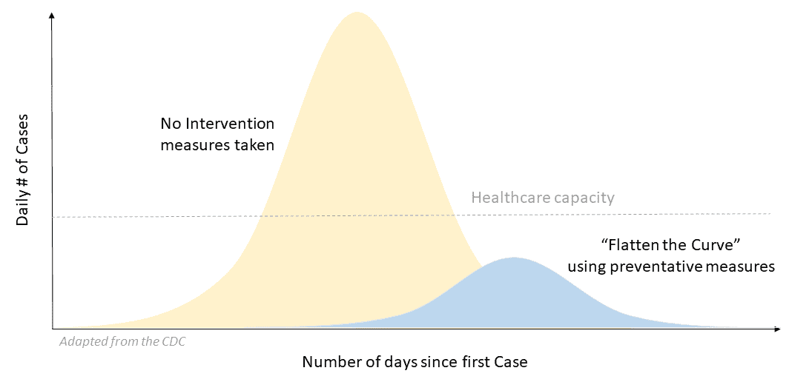

为了参考，让我们回顾最著名的分布曲线，它被称为**高斯分布**、**正态分布**或**钟形曲线**，因为它与物理钟形的形状在视觉上相似。在正态分布中，数值将表示在最高点所在的线上，最高点代表样本或整个数值群体的平均值或平均数。当线向两端延伸时，它显示了数值与平均值之间的差异。这种数值从平均值出发的扩散或分散通常被称为**标准差**（**SD**）。在完美的分布中，数值将落在加减一个、两个或三个标准差范围内，这会在线形上产生对称性。

关于正态分布，有一些有趣的事实需要了解：

+   大约 68%的数据值落在加减一个标准差范围内。

+   96%的数据值落在加减两个标准差之外。

+   99.7%的数据值落在加减三个标准差之内。

+   计算出的平均值、中位数和众数都相等。

+   数据在平均值左侧和右侧的分布是 50/50%。

回到我们的例子，在第一个标记为**未采取干预措施**的曲线中，数字实际上每隔几天就会翻倍，这使得曲线在接近最高点时变得非常陡峭。第二个曲线，被标记为**采取预防措施“平缓曲线”**，帮助数据消费者可视化停止病毒传播的重要性，因为曲线的高度已经显著降低。我相信这张图表之所以对大众传播变得相关，是因为它以简洁的方式解释了分布曲线，而不涉及背后的统计数据。即使不显示曲线背后的数据，任何人都可以直观地理解这一关键信息的意义。

在撰写这本书的这一时刻，我不知道全世界的人们是否已经成功实现了降低 COVID-19 死亡率的目标。此外，目前尚不清楚是否采取了足够的预防措施，如保持社交距离，是否有助于**平缓曲线**。全世界已有许多人遭受了 COVID-19 大流行的悲剧。我对所有遭受苦难的人表示衷心的慰问。

## KYD

要查看 COVID-19 数据的分布情况，我提供了一个快照 CSV 文件，该文件可在本书的 GitHub 仓库中找到。为了支持我们的数据分析师**了解你的数据**（**KYD**）口号，我将提供一些关于数据收集方式和格式的额外信息。`COVID-19 Cases.csv`文件是从权威的 COVID-19 开源数据源收集的。在*进一步阅读*部分提供了一个由约翰霍普金斯大学**系统科学与工程中心**（**CSSE**）维护的 GitHub 仓库。疾病控制与预防中心（CDC）也一直在为公共利益分发 COVID-19 数据。

CSV 文件中前几条记录的样本将类似于以下截图，该截图是从*进一步阅读*部分找到的权威来源获取的：

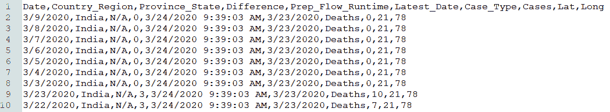

这个数据源包含按国家每日的 COVID-19 病例快照。我们分析中使用的关键字段如下：

+   `Date`字段是以`M/D/YYYY`格式表示的，是确认 COVID-19 病例的日期。

+   `Country_Region`字段是追踪 COVID-19 病例的原始国家。

+   `Cases`字段是按国家和日期累计的 COVID-19 病例数量。

+   `Difference`字段是按国家和日期每日的 COVID-19 病例数。

+   `Case_Type`字段是指定给每个值的病例类型，可以是`Confirmed`或`Deaths`。

从这个数据源中，我们可以回答关于数据的多个问题，但需要一些过滤来隔离按`Country`、`Date`和`Case_Type`记录。

## 曲线形状

现在我们对数据有了更多信息，我们可以启动一个新的 Jupyter Notebook 进行数据分析，以识别曲线的形状。

启动一个新的 Jupyter Notebook，并将其命名为`ch_09_exercises`。要将 CSV 数据导入到`pandas` DataFrame 中，以便我们可以创建直方图，我们使用以下步骤：

1.  通过在 Jupyter Notebook 中添加以下代码导入以下库，并运行该单元格。你可以自由地创建自己的 Notebook 来跟随；我还在 GitHub 上放置了一个副本以供参考：

```py
In[]: import pandas as pd
     import numpy as np
      import matplotlib.pyplot as plt
      %matplotlib inline
```

这些库应该已经通过 Anaconda 可用。如果你需要帮助设置环境，请参考第二章*，Python 和 Jupyter Notebook 的概述和安装*。`%matplotlib inline`是一个魔法命令，在运行单元格后，它可以在你的 Jupyter Notebook 中显示可视化结果。

1.  接下来，我们通过导入 CSV 文件创建一个新的 DataFrame：

```py
In[]: covid_df = pd.read_csv("COVID-19 Cases.csv", header=0)
```

确保你已经将`COVID-19 Cases.csv`文件复制到正确的 Jupyter 文件夹目录中，以避免连接错误。

1.  为了验证 DataFrame 是否正确加载，我们可以运行`head()`函数来显示前几条记录：

```py
In[]: covid_df.head()
```

输出将类似于以下截图，其中源 CSV 文件已被加载到 DataFrame 中，带有标记的标题行，索引列位于左侧，起始值为 `0`：

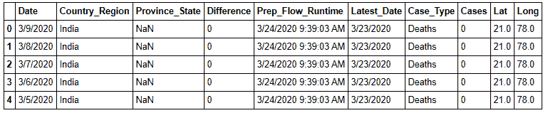

1.  接下来，我们将通过从源数据创建一个新的 DataFrame 并对其应用一些过滤器来隔离我们想要关注的特定数据。我们想要隔离满足以下所有条件的记录。首先，每日 `Difference` 计数大于零。其次，`Case_Type` 应为 `Confirmed`。最后，`Country_Region` 应仅限于 `Italy`：

```py
In[]: df_results = covid_df[(covid_df.Difference >0) & (covid_df.Case_Type == 'Confirmed') & (covid_df.Country_Region == 'Italy')]
```

默认情况下，新的 `df_results` DataFrame 不会在 Jupyter Notebook 中显示结果。

1.  要查看排序后的结果，我们运行以下命令：

```py
In[]: df_results.sort_values(by='Cases', ascending=False)
```

输出应类似于以下截图，其中显示了一个新的 `df_results` DataFrame，其值按 `Cases` 降序排序：

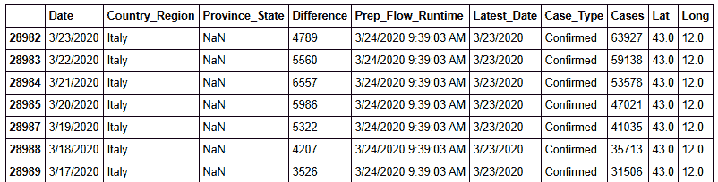

1.  现在，我们想要通过以下命令使用默认的 `hist()` 图表来可视化显示 `Difference` 列中值的分布：

```py
In[]: df_results.hist(column='Difference');
```

输出将类似于以下截图，其中显示的值以默认直方图图表的形式呈现。默认设置将数据值分成相等大小的区间，这些区间显示在 *x* 轴上。每个区间内值的出现频率或计数由 *y* 轴测量：

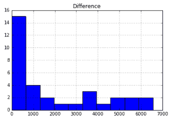

那么，这个直方图图表最初告诉我们关于前面图表中数据的什么信息？首先，由于最高的柱状图是左侧的第一个柱状图，因此大多数数据值都小于 **1,000**。其次，根据形状，我们知道数据不是正态分布，因为我们预计最频繁的结果应该在中间，接近数据的平均值。这种分析如何应用于 COVID-19 数据本身？这种形状是好的，因为每日增加的数量可能要大得多。

要了解更多关于此数据形状的细节，我们可以使用 `describe()` 函数针对 DataFrame 中的此特定列进行操作。

1.  使用 `describe()` 函数对此 DataFrame 进行操作以查看摘要统计信息。我们可以通过在方括号中明确传递它以及双引号中的列/字段名称来查看一个列：

```py
In[]: df_results["Difference"].describe()
```

输出将类似于以下截图，其中显示了此特定字段中数据的摘要统计信息：

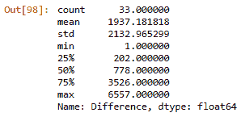

在前面的屏幕截图中，我们已识别了一些关键统计数据，以帮助更好地理解此数据的形状。在摘要表中，有`33`个值被标识为`count`，均值为`1937.181818`，`std`（标准差）为`2132.965299`。这三十三个值的范围从`1`到`6557`，分别由`min`和`max`标识。由于标准差值如此之高，我们知道这些数字分布得很广。

值将以`float64`数据类型显示，无论源数值的精度如何，都将保留六位小数。

25%、50%和 75%的标签返回该字段中值系列的相应百分位数。这些值也被称为**四分位距**（**IRQ**），其中 50%或第二四分位数等于**中位数**。将数据按四分位数划分，为数据值创建相等的区间或桶，有助于我们了解数值的分布情况。如果一个多数值落入一个特定的桶中，你就知道数据分布不均匀。以我们的例子为例，我们的均值和中位数之间有一个很大的差距（1937 与 778），因此我们可以将此数据分类为偏斜。数据中的偏斜有助于理解分布曲线或直方图的视觉形状不是对称的。为了帮助您记住分布类型和偏斜，我在以下图表中总结了它们。当均值大于中位数时，它会有正偏斜，而当相反的情况发生时，存在负偏斜。正如以下图表中每个视觉趋势顶部所描述的，偏斜的类型（负或正）与均值和中位数值直接相关。当所有均值、中位数和众数值相等时，你就有了一个对称的分布：

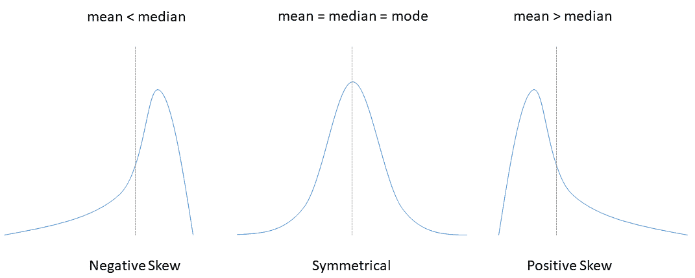

从数据分析的角度来看，定义这些关键统计数据有助于我们理解数据值的分布情况。计算均值、中位数和众数相对于你的数据值，统称为**集中趋势**的度量，这在第八章“理解连接、关系和聚合”中已介绍。集中趋势的一个重要且实用的应用是在数据科学模型中。在利用历史数据的预测回归模型中，计算预测的能力基于找到分布曲线的**最佳拟合**。如果数据有显著的正面或负面偏斜，且具有**长尾**，即值从中心趋势偏离多个标准差，算法的准确性就会降低。

因此，我们现在理解了计算中心趋势的重要性以及如何将对称数据以正态分布曲线的形式进行视觉表示。正态分布，也称为高斯分布和钟形曲线，当均值（平均值）等于中位数（中间值）且等于众数（最频繁出现的值）时发生。我发现添加一条正态分布线作为参考，与图表中的实际数据结果进行比较是有用的。这有助于分析结果的消费者从视觉上比较数据的理想形状与实际结果。那么，是什么原因导致数据偏斜或无法适应正态分布？作为一名数据分析师，你的任务是找出原因，第一步是隔离数据中可能存在的异常值。我们将在下一节中通过了解异常值和趋势来讨论这个问题。

# 理解异常值和趋势

寻找异常值首先从分布曲线开始，但需要额外的技术，我们将一起探讨。此外，不要低估软技能的需求，你必须与他人沟通，以更好地理解为什么你的数据中存在异常值。异常值通常是指与数据中的其他值显著不同的一个或多个数据值。根据所使用的数据可视化方法，发现数据中的异常值很容易，但在许多情况下，尤其是在数据量非常大时，它们在数据聚合时可能会被掩盖。如果你还记得第七章，*探索数据集的清理、精炼和合并*，我们与用户为网站创建的点击量进行了工作。掩盖异常值的一个好例子是当用户点击量按日期聚合时。如果一个特定用户每天有 1,000 次点击，而平均值为 2，那么在按周聚合数据后，很难识别出这个异常用户。那么，在一系列数据值中，异常值在视觉上看起来是什么样子？一个好的方法就是使用箱线图，因为它可以直观地表示`describe()`函数中找到的数据：

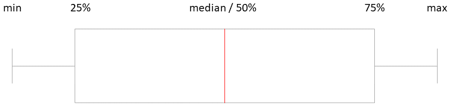

如前图所示，箱线隔离了 25%、50%和 75%的四分位数，以及值的最大/最小范围显示在最极端的垂直线上。箱线与最大/最小线之间的空间被称为箱线图的触须。如果你看到一个加号（+）显示，它们被称为飞线，在这个图表类型中是异常值。

箱线图可以水平或垂直显示，并且可以包括多个维度，这样你就可以比较它们之间的分布。

让我们继续分析我们现有的数据集，看看它是如何使用箱线图进行可视化的。与先前的例子类似，我们将从源中加载所有数据到一个单独的 DataFrame 中，然后使用过滤器创建一个子 DataFrame。我们将继续使用`ch_09_exercises` Jupyter Notebook：

1.  通过在您的 Jupyter Notebook 中添加以下命令来导入以下库，并运行该单元格。您可以自由地创建自己的笔记本来跟随；我已经在 GitHub 上放置了一个副本供参考：

```py
In[]: import pandas as pd
      import numpy as np
      import matplotlib.pyplot as plt
      %matplotlib inline
```

1.  通过导入 CSV 文件创建一个新的 DataFrame：

```py
In[]: covid_df = pd.read_csv("COVID-19 Cases.csv", header=0)
```

1.  要验证 DataFrame 已正确加载，我们可以运行`head()`函数来显示前几条记录：

```py
In[]: covid_df.head()
```

输出将类似于以下截图，其中源 CSV 文件已加载到 DataFrame 中，带有标记的标题行，索引列从左侧的值`0`开始：

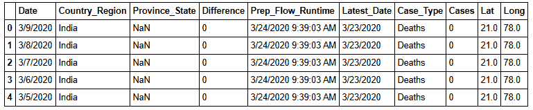

与之前的练习类似，我们将通过从源数据创建一个新的 DataFrame 并对其应用一些过滤器来隔离我们想要关注的焦点数据。我们想要隔离满足以下所有条件的记录。首先，每日`Difference`计数大于零。其次，`Case_Type`应该是`Confirmed`。最后，我们使用管道符号`|`创建一个`or`条件，允许有多个`Country_Region`：

```py
In[]: df_results = covid_df[(covid_df.Difference >0) & (covid_df.Case_Type == 'Confirmed') & ((covid_df.Country_Region == 'Italy') | (covid_df.Country_Region == 'Spain') | (covid_df.Country_Region == 'Germany'))]
```

默认情况下，新的`df_results` DataFrame 不会在 Jupyter Notebook 中显示结果。

1.  要查看结果，我们运行以下命令：

```py
In[]: df_results.head()
```

输出应类似于以下截图，其中将显示一个新的`df_results` DataFrame：

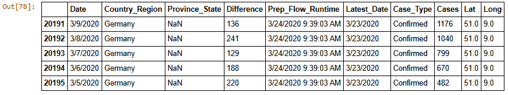

1.  要按`国家`显示箱线图，我们使用以下命令。`boxplot()`有几个参数，例如`by=`，它允许我们按`Country_Region`分组数据。我们还包括`column=`来隔离`Difference`字段中的值。最后，我们传入`grid=False`来关闭图表中的网格线：

```py
In[]: df_results.boxplot(by='Country_Region', column=['Difference'], grid=False)
```

输出将类似于以下截图，其中将显示箱线图：

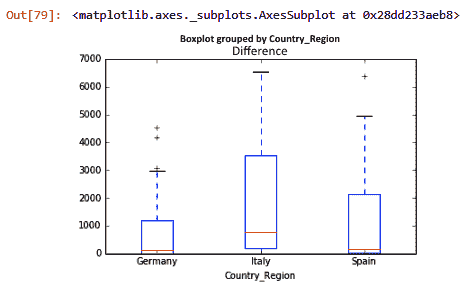

因此，将数据限制在仅三个国家，使我们能够缩小分析范围，并且将数据在箱线图图表中并排展示，如图中所示，使我们能够直观地比较结果。首先，我们注意到几个箱的大小，如果您还记得，这些是数据的四分位数，并且根据`国家`的不同而大小不同。德国有一个较小的箱，更接近正方形而不是长方形，这通常告诉我们数据的分布非常紧密。我们可以在图表中识别出的另一个观察结果是，我们显示了多个加号符号（+）；这些突出显示了德国和西班牙国家中存在的异常值。

分析按国家和其他与地理相关的属性的数据，是当今数据分析师的一个常见需求。接下来，我们将探讨与在地图和空间数据中可视化数据相关的最佳实践，这被称为地理分析。

# 地理分析技术和技巧

对于数据分析师来说，地理分析的概念是一个相对较新的技术，它应用于空间数据以了解数据在地理上的位置。然而，制图学，即地图的研究，已经存在几个世纪，传统上需要培训、专业知识和专门的软件来通过位置提供数据见解。今天，有多个附加模块和软件可用于创建图表和可视化，这些图表和可视化使用地图以令人兴奋的方式可视化数据，从而提供不同的视角。

首先，你需要了解你拥有的数据的粒度。除非源系统是为了捕获该信息而构建的，否则在源数据中拥有精确的经纬度是一个奢侈。例如，移动应用源数据通常会有这种详细程度，因为智能手机可以追踪你的位置。然而，如果我们回到我们的 COVID-19 源数据，个别病例的最低详细程度是按`Province_State`来划分的，因此你失去了显示低于该级别的数据的能力。

接下来，如果你的源数据不包含经纬度值，你必须添加它们，这听起来很简单，但通常有一些挑战需要克服。当你分析数据时，确保它在特定字段（如`Country`、`City`、`Parcel`或`Zip Code`）中具有一致性和一致性。如果存在`Country`值，它们是否有**国际标准化组织（ISO**）代码，这样你就可以将数据与常用来源连接起来？如果有，我在*进一步阅读*部分包含了一个链接到世界银行数据源。

最后，我发现包含一个世界或区域地图作为良好数据分析解决方案的补充，但不是替代品。在许多情况下，即使有颜色渐变的单一地图图表，也无法提供足够的答案来回答常见问题。例如，让我们看看以下截图，它显示了在 HealthMap 网站上找到的 COVID-19 疫情全球地图：

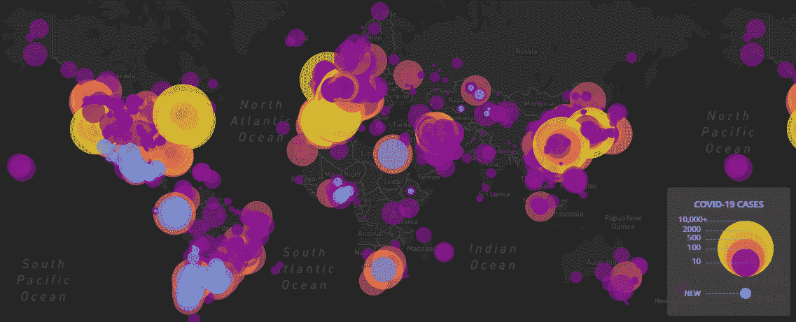

如前一张截图所示，图表右下角的图例通过气泡的颜色和大小提供了关于疫情按地区分布的见解。如果你将这个可视化视为一个静态地图，它会让观众对气泡与颜色的重叠产生更多疑问。例如，如何区分像纽约和费城这样紧密聚集的城市之间的细节？此外，使用这个地理分析图表的消费者可能想知道病例数量是否在每个地区都在加速，这一点并不明确。

然而，一旦你访问了网站，这些批评就会改变，因为网站允许用户与地图进行交互。

当你使用为 COVID-19 疫情创建的 HealthMap 网站时，你将获得一个提供以下功能的解决方案：

+   缩放功能，可以钻取到最低级别的细节，并缩放以比较不同位置的成果

+   鼠标悬停在提供按位置汇总计数以及所选位置或焦点上下文的圆圈上

+   一个时间线功能，使用户能够看到结果的前后变化

一旦你欣赏了在地理分析数据中拥有任何或所有这些功能，你期望你在作为数据生产者构建的任何解决方案中也能得到这些功能。如果你缺少数据或创建它的工具，我建议创建一个补充图表来支持它。例如，在下面的屏幕截图中，我们有一个按国家降序排列的水平条形图：

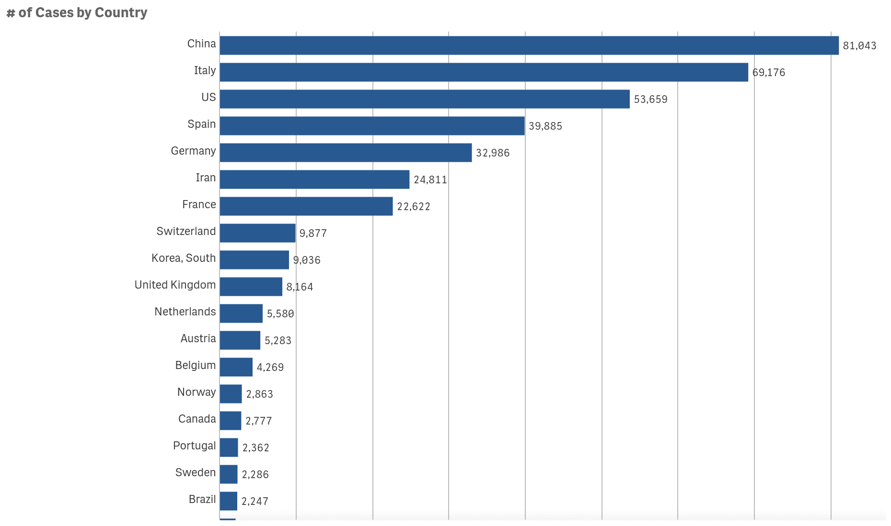

图表顶部的图例表明了所使用的度量标准，标题为**按国家病例数**，以帮助数据消费者轻松回答诸如截至特定日期哪个国家病例数最多等问题。当你将多个相互补充的图表放在一起时，它们为地理数据的消费者提供了上下文。

确保这些图表背后的数据源之间的公共连接键是一致的。如果你在地图上选择了一个国家，条形图应该过滤以匹配任何日期选择。

使用多个图表协同工作有助于用信息讲故事，与观众建立联系。今天的数据消费者很复杂，反复讲述同样的故事将不会有效。我建议使用时间久远的技巧，比如在故事中有一个教训或寓意，这样故事才能很好地发挥作用，你应该感到有力量调整以包括你自己的个人风格。

我从艺术和学习更多关于他们技艺的大师们中找到创意灵感。例如，艺术家巴勃罗·毕加索因其**蓝色时期**的作品而闻名，这一时期定义了他生命中一个时期，在这个时期，他画的不同主题中普遍使用了蓝色变体的主要颜色。这个时期持续了几年，反映了他在抑郁和财务困境中生活的个人挣扎。相比之下，COVID-19 大流行正在给全世界的人们带来个人挣扎。与 COVID-19 相关的死亡率高导致全球金融困境和无数个人损失的报道。毕加索在他的一生中创作了惊人的作品量，超过 10 万件，在 70 多年的时间里。即使在情感困扰的时候，毕加索也继续找到力量去创作新的艺术作品并精通他的技艺。我能够理解他在这个大流行期间所面临的挣扎，并受到启发，花时间在我的数据技艺上，帮助我度过这些艰难时期。

使用数据讲故事的力量成为建立与观众信任的关键技能，使他们能够理解信息。使用数据可视化可以打破在处理数据时可能存在的技术障碍。作为一个精通数据素养的人，您现在拥有了使用数据创建自己故事所需的额外技能。

现在您已经了解了在数据故事讲述中有效的地理技术，让我们将注意力集中在识别数据中的模式上。

# 在数据中寻找模式

现在我们对分布曲线和识别数据中可能存在的异常值有了更好的理解，让我们来分析如何找到数据中的模式。根据我的经验，随着您处理越来越多的数据，您将开始发展一种**第六感**，这有助于您更快地识别模式，例如，以下图表可能看起来像是一串随机的数字，其中没有明显的区分模式，直到您对其进行一些小的修改使其更容易识别：

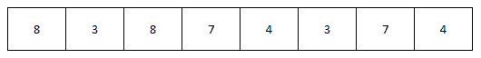

将数据排序后，您可以查看数据值中存在的分组和聚类。在这种情况下，我们有数字配对，直到您将它们一起排序之前并不明显。通过快速排序，我们现在可以看到所有的数字都是重复的，如下面的图表所示：

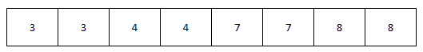

为了使这个观点更加明确，看看以下图表，其中前面两个图表中的相同数字现在按对进行着色，这创建了一个模式，使其更容易视觉识别：

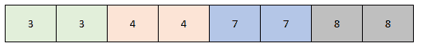

数据可视化和图表将帮助您识别这些模式，但根据数据的不同，某些图表比其他图表更适合。例如，为了查看数据随时间的变化模式，折线图或柱状图可以更好地显示趋势，并帮助您在数据中创建可识别的模式。以下截图是一个很好的例子，它是一个柱状图，*y*轴上的度量单位是**点击次数**，*x*轴上显示的是日期维度，以`M/DD/YYYY-DDD`格式的`dtype`显示星期几：

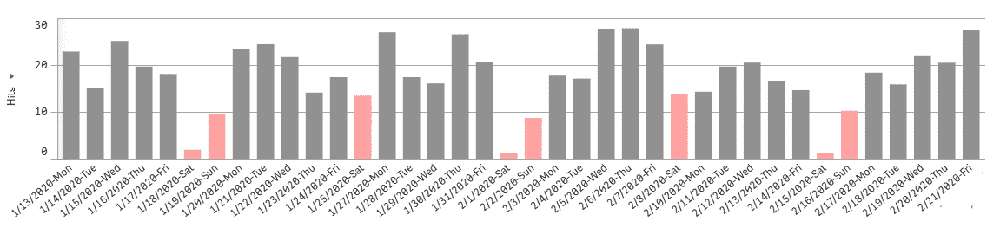

在前面的截图中，我们有一个趋势图，显示了每个日期的网页点击使用模式。当您查看排序后的数据时，更明显的是每几天自然出现的峰值和谷值。即使您不了解其背后的所有细节，这个模式表明我们的工作日数据使用量高于周末，我用不同的颜色突出显示，使其更明显。

在分析和识别模式的过程中，您将发现自己对数据得出结论。这样做是自然的，如果基于业务或领域专业知识，则是可行的。如果您在数据中发现适用于多个维度或变量的模式，您可以确定它们之间的相关性。相关性在数据中很常见，尤其是在同一时间段上叠加模式时。更正式的定义是，当一个变量或一系列值增加或减少时，第二个变量将平行跟随。两个值之间相关性的一个常见例子是冰淇淋店的销售额和天气。如果天气有雪或大雨或很冷，冰淇淋的销售额通常会较低。如果天气温暖且阳光明媚，销售额就会较高。基于这些信息，您可以说在同一时间段内，销售和天气这两个变量之间存在**正相关**。

如果存在相反的关系，即两个变量之间的反向模式发生，这将被认为是**负相关**。

要确定两个变量是否具有静态相关性，有一个称为**相关系数**的概念。这是一个介于 `1` 和 `-1` 之间的测量值，用 ***r*** 表示。如果值为 `0`，则两个变量之间没有相关性。值越接近 `1`，它们之间的相关性就越正，这意味着当一个变量的值发生变化时，另一个变量将趋向于同一方向。相反，当值越接近 `-1` 时，负相关性会在两个变量之间创建反向关系。因此，我们能否通过数据直观地看到相关性和模式？一个好的方法就是使用散点图。

让我们继续分析现有的数据集，看看如何使用散点图进行可视化。与先前的例子类似，我们将从源中加载数据到单个 DataFrame 中，然后使用筛选器创建子集 DataFrame。在这个例子中，我们将创建两个子集以进行对比。我们将继续使用 `ch_09_exercises` Jupyter Notebook：

1.  在您的 Jupyter Notebook 中添加以下命令以导入以下库，并运行该单元格。您可以自由地跟随创建自己的 Notebook；我已经在 GitHub 上放置了一个副本供参考：

```py
In[]: import pandas as pd
import numpy as np
import matplotlib.pyplot as plt
%matplotlib inline
```

1.  通过导入 CSV 文件创建一个新的 DataFrame：

```py
In[]: covid_df = pd.read_csv("COVID-19 Cases.csv", header=0)
```

1.  现在，我们将创建两个新的 DataFrame，它们将是原始源数据的子集。将它们命名为 `df_results_1` 和 `df_results_2` 的好处是，它允许您调整如本行中使用的 `Country_Region` 筛选器等筛选器，而无需更改其他步骤中的任何代码：

```py
In[]: df_results_1 = covid_df[(covid_df.Case_Type == 'Confirmed') & (covid_df.Country_Region == 'Germany')]
```

1.  运行 `head()` 函数以验证结果：

```py
In[]: df_results_1.head()
```

输出将类似于以下表格，其中显示了新的 `df_results_1` DataFrame：

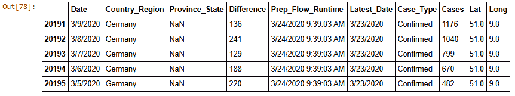

1.  我们将加载第二个 DataFrame，我们将使用以下命令与第一个 DataFrame 进行比较：

```py
In[]: df_results_2 = covid_df[(covid_df.Case_Type == 'Confirmed') & (covid_df.Country_Region == 'Italy')]
```

1.  运行 `head()` 函数以验证结果：

```py
In[]: df_results_2.head()
```

输出将类似于以下表格，其中显示了新的 `df_results_2` DataFrame：

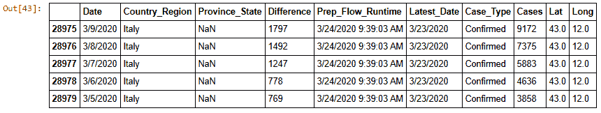

1.  让我们分析每个 DataFrame 中的数据，以更好地理解它。我们使用 `describe()` 函数来更好地识别关键统计信息以及数据的分布情况。首先，我们查看第一个 DataFrame 的内容：

```py
In[]: df_results_1["Cases"].describe()
```

输出将类似于以下截图，其中显示了结果：

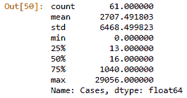

1.  然后，我们查看第二个 DataFrame 的内容：

```py
In[]: df_results_2["Cases"].describe()
```

输出将类似于以下截图，其中显示了结果：

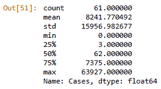

基于对每个 DataFrame 运行的 `describe()` 函数的结果，我们有了比较的基础。首先，我们有计数，即相同的 `61` 个值。这在创建散点图时很重要，因为需要的数据大小必须相同。两个数据系列之间的另一个常见值是最小值，它在 `0`。然而，最大值是不同的，略大于两倍（29,056 对比 63,927）。接下来，我们有平均值，差异很大。第一个结果有一个四舍五入的平均值 `2,707.49`，第二个是 `8,241.77`。最后，标准差（std）也不同，因此我们知道分布曲线的形状和大小将不同。

我们想要回答的问题是：这些值是否相关？为了直观地确认这一点，我们继续通过几个简单的命令创建散点图。散点图将具有 *x* 和 *y* 轴，并以点在网格中表示值与轴对齐的位置。

1.  我们使用 `plt.scatter()` 函数创建可视化。它需要两个参数，即用逗号分隔的 *x* 和 *y* 轴值。我们传递了在 `Cases` 列中找到的每个 DataFrame 的共同值系列。我们还包括标签和标题，以帮助观众理解图表：

```py
In[]: plt.scatter(df_results_1["Cases"], df_results_2["Cases"]);
plt.title("# of Cases")
plt.xlabel("Germany Cases")
plt.ylabel("Italy Cases");
```

输出将类似于以下图表，其中显示了结果：

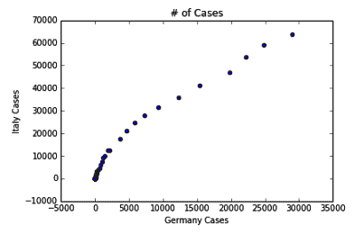

我们的散点图确实存在相关性，其中任一轴上靠近 0 的值聚集在一起，这在图表上以重叠的蓝色点表示。你还可以观察到，随着 **案例数量** 的增加，值之间存在自然的直线对齐。

每个相关性都伴随着一个不可避免的预期，即一个变量依赖于另一个变量，并是原因。因果关系是指一个变量直接影响另一个变量的方向。因果关系或根本原因分析是常见的分析技术。仅识别两个变量之间的因果关系是罕见的，需要更深入的分析来理解所有直接和间接影响变化的因素。首先需要理解的是，*相关性并不总是等于因果关系*。一个很好的例子是我们的冰淇淋店销售额和天气。我们知道吃更多的冰淇淋永远不会改善天气，但如果你纯粹地看数据，如果数据高度相关，你可能会意外地得出那种结论。在分析数据以确定相关性是否与因果关系相关时，另一个要点是基于数据的样本大小。我建议成为一个**数据怀疑论者**，如果数据集的总体不完整或覆盖的时间窗口很小，就质疑因果结论。最后，我们已经探讨了将数据联合起来的数据分析价值，但这也带来了得出独立存在的数据结论的机会。务必添加假设，并公开说明你如何联合数据的方法，以便相关性可以接受同行评审。

# 摘要

恭喜，我们现在已经学习了制作各种可视化数据分布的图表的基本技能。我们通过计算一系列数据值的标准差、均值、中位数和众数来讨论了与数据集中趋势相关的关键统计量。我们研究了正态分布以及数据值如何可能正向或负向偏斜。当数据具有对称性时，使用预测分析中的一些算法变得更容易。我们回顾了在处理数据集时常见的模式和异常值，以及如何使用箱线图来可视化异常值。

我们讨论了处理地理空间数据的最佳实践和技巧，以及如何使用它来帮助用数据讲述故事。最后，我们讨论了相关性与因果关系的区别，以及相关系数的重要性，这样你就可以理解两个变量/一系列数据值之间的关系。

在下一章中，我们将转向处理非结构化数据源，以及处理免费文本数据时的最佳实践。

# 进一步阅读

关于本章相关主题的更多信息，您可以访问以下链接：

+   COVID-19 数据的权威来源：[`github.com/CSSEGISandData/COVID-19`](https://github.com/CSSEGISandData/COVID-19)

+   疾病控制与预防中心 COVID-19 数据：[`www.cdc.gov/coronavirus/2019-ncov/`](https://www.cdc.gov/coronavirus/2019-ncov/)

+   使用 Python 创建数据可视化的速查表：[`python-graph-gallery.com/cheat-sheets/`](https://python-graph-gallery.com/cheat-sheets/)

+   世界银行 ISO 国家数据：[`datahelpdesk.worldbank.org/knowledgebase/articles/898590-country-api-queries`](https://datahelpdesk.worldbank.org/knowledgebase/articles/898590-country-api-queries)

+   开源地图软件：[`www.openstreetmap.org/`](https://www.openstreetmap.org/)

+   HealthMap 对 COVID-19 的地理分析示例：[`www.healthmap.org/covid-19/`](https://www.healthmap.org/covid-19/)
