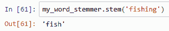

探索文本数据和非结构化数据

需要熟练掌握结构化和非结构化数据的需求持续演变。处理结构化数据有成熟的技巧，如合并和统一数据类型，这些我们在前面的章节中已经回顾过。然而，处理非结构化数据是一个相对较新的概念，正在迅速成为数据分析中的一项必备技能。**自然语言处理**（**NLP**）已经发展成为一项基本技能，因此本章介绍了可用于分析叙述自由文本的概念和工具。随着技术的进步，使用这些技术可以帮助你为非结构化数据提供透明度，这在几年前是难以发现的。

在本章中，我们将涵盖以下主题：

+   准备处理非结构化数据

+   词汇化解释

+   计数单词并探索结果

+   文本归一化技术

+   排除分析中的词汇

# 第十四章：技术要求

本书在 GitHub 上的仓库地址为[`github.com/PacktPublishing/Practical-Data-Analysis-using-Jupyter-Notebook/tree/master/Chapter10`](https://github.com/PacktPublishing/Practical-Data-Analysis-using-Jupyter-Notebook/tree/master/Chapter10)。

您可以从[`www.anaconda.com/products/individual`](https://www.anaconda.com/products/individual)下载并安装所需的软件。

# 准备处理非结构化数据

现在，我们生活在一个数字时代，数据以一种在以前技术上不可能或甚至无法想象的方式融入了我们的生活。从社交媒体到移动设备，再到**物联网**（**IoT**），人类正生活在通常被称为信息时代的环境中。在这个时代，关于你的数据呈指数级增长，你可以随时随地即时获取。使这一切成为可能的是人和技术相结合的结果，包括来自**数据分析的演变**的贡献，这在第一章，《数据分析基础》中有所介绍。

多个来源普遍预测，在未来几年内，全球产生的所有数据中将有 80%是非结构化的。如果你还记得第一章，《数据分析基础》中的内容，非结构化数据通常被定义为不提供统一性和预定义组织的信息。非结构化数据的例子包括自由文本、聊天机器人、**人工智能**（**AI**）、照片、视频和音频文件。社交媒体当然产生了最高量的非结构化数据，速度和多样性。因此，我们将重点关注这些数据源，但你也可以将本章学到的概念应用于任何基于叙述的文本数据源，如帮助台票据日志或电子邮件通信。

关于处理非结构化数据的重要理解是，它本质上是混乱的。没有结构、定义的数据类型以及在数据捕获时应用的一致性，就会产生不确定性。这不应该阻止或阻止你处理数据，但你应该意识到在某些情况下，精确性将是一种奢侈。例如，句子中的单词可能会拼写错误。一个词或短语的含义可能会被错误地表达，有时上下文也会丢失。尽管存在所有这些缺点，这项技术仍在不断改进，以至于你会在日常生活中发现它的应用。例如，聊天机器人现在正在取代许多客户服务解决方案，所以你可能认为你正在与一个代理交谈，但实际上是安装了 NLP 算法的软件。

NLP 的概念已经存在了几十年。使用 NLP 概念有一些基本原理，你可能过去已经使用过，比如基于规则的条件或标签。一个基于规则的例子是，当在数据集中找到一个特定的关键词或一组单词，并使用标志字段来识别它时，类似于以下表格，其中我们有三列和五行，包括一个标题行来识别每条记录的目的：


在表格中，我将关键词`balanced`的任何变体都改变了字体颜色，以便更容易识别。正如你可以从表格中观察到的，这个词确实有一些细微的变体，这对人类来说似乎是显而易见的，但必须编程为规则来考虑这些差异。因此，为了识别任何关键词的变体，例如它是否是大写或变形的，必须使用条件逻辑来考虑。在这个例子中，使用了一个名为`key_word_found_flag`的条件字段来确定短语字段是否包含关键词，它使用值`1`来识别一个真实案例。

基于规则的 NLP 已经从早期使用基本通配符搜索和 ASCII 字符识别的概念发展到了机器学习的统计模型。我并不打算深入探讨 NLP 所使用的数学模型的细节，但我鼓励你探索这个主题。在本章中，我将专注于使用预定义的 NLP 库，而不对其进行调整或训练模型。目的是帮助你建立一些信心，了解何时、何地以及如何使用它。在过去的几年里，我对利用 NLP 的解决方案背后的准确性水平印象深刻，但我认识到它是一个不断发展的技术。前几天当我与 Alexa 互动时，它告诉我无论我如何措辞，它都无法理解我的问题，这让我想起了这一点。

无论何时使用或创建与自然语言处理相关的解决方案，都存在**假阳性（FP）**或**假阴性（FN）**的可能性。FP 或 FN 是指自然语言处理算法错误地预测了输出。当输出返回为真，但实际结果是假时，这被认为是 FP。当模型返回为假或缺失，但正确的结果应该是返回真时，这被称为 FN。相反，当算法或模型正确预测输出时，这被称为**真阳性（TP）**或**真阴性（TN）**。通常使用混淆矩阵来识别和训练模型，以减少 FP 和 FN。

我创建了一个类似于以下截图中的混淆矩阵版本，以帮助识别自然语言处理预测结果，其中阳性结果用绿色表示，阴性结果用红色表示。颜色和标识的确定是通过比较预测输出中的实际诗句来实现的。例如，如果使用计算机模型来预测测试某个人是否患有疾病的结果，一个**TP**或**TN**将表明模型准确预测了该人患有疾病或确认他们没有疾病。对于这些情况，绿色方框表示与实际结果相匹配。对于任何其他结果，方框都涂成红色，因为预测不准确地返回了错误的结果：


当数据量较小时，验证自然语言处理模型的结果可以通过人工进行，这可以确保算法背后的代码具有可信度。然而，当数据量较大时，这变成了一项耗时的工作，在许多情况下，没有替代解决方案（如众包）就无法实现验证。众包解决方案是指在数据录入过程中使用人类，但通过分解任务并将它们分配给大量人群来大规模验证数据。

典型的自然语言处理或数据科学模型将使用监督学习技术，其中使用训练数据集来教会模型在预测输出中保持准确。用于训练的标记数据将是一个由具有准确结果的人或人们分类的小数据集。因此，用于准确预测结果的统计模型是基于根据训练数据教导自然语言处理模型。在监督式自然语言处理模型中使用错误标记的训练数据会导致更多的假阳性和不准确的结果。如果你与使用监督学习的数据科学家或数据工程团队合作，你可以通过询问用于重新训练和评估模型准确性的过程来展示你的数据素养知识。

现在我们对处理非结构化数据有一些基本理解，让我们来看看如何从其来源收集它。对于来自 Twitter 等平台的社交媒体数据，使用它们的 API 连接将是一个选项，并允许您通过将数据流式传输到 Jupyter 笔记本中几乎实时地消费数据。使用任何社交媒体的 API 将需要您设置用户账户并创建一个密钥，这样您就可以通过 HTTP 使用 REST 客户端连接。

根据您工作站使用的网络连接，您可能需要调整防火墙或代理设置，以便允许您通过 API 和 REST 访问数据：

由于不同平台在导出社交媒体数据时存在限制和不同的 API 限制，我们将使用 Python 库中预安装的样本数据。**自然语言工具包**（**NLTK**）包可以帮助我们处理多种用例中的非结构化数据。该软件是开源的，包含数十个模块，使用称为语料库的概念来支持 NLP。语料库创建了一个分类法，可以被语言学家、计算机科学家和机器学习爱好者使用。分类法是将文本体的语言分解为其基本元素的分解。例如，包括美国遗产词典和维基百科。它还作为使用软件时计数和搜索单词的基础。

## 语料库的实际应用

在我们的第一个例子中，我们将使用布朗语料库，它包含数百个按神秘短篇小说、政治新闻稿和宗教等主题的杂乱组合分类的样本语言文本。原始集合有超过一百万个单词被定义并标记为名词、动词和介词等词性。要在 Jupyter 笔记本中使用布朗语料库，请按照以下步骤操作：

1.  启动一个新的 Jupyter 笔记本，并将其命名为`ch_10_exercises`。

1.  通过在 Jupyter 笔记本中添加以下命令并运行单元格来导入以下库。您可以自由地通过创建自己的笔记本来跟随（我在 GitHub 上放置了一个副本以供参考）：

```py
In[]: import nltk
```

该库应该已经通过 Anaconda 可用。有关设置环境的帮助，请参阅第二章，*Python 和 Jupyter Notebook 安装概述*。如果您在防火墙后面，有一个`nltk.set_proxy`选项可用。有关更多详细信息，请查看[`www.nltk.org/`](http://www.nltk.org/)上的文档。

1.  接下来，我们下载我们想要使用的特定语料库。或者，您可以使用`all`参数下载所有包：

```py
In[]: nltk.download('brown')
```

输出将类似于以下截图，其中确认了包的下载，并且输出通过`True`进行了验证：


1.  要确认包在你的 Jupyter 笔记本中可用，我们可以使用以下命令通过常用的别名`brown`引用语料库：

```py
In[]: from nltk.corpus import brown
```

1.  要显示布朗语料库中可用的一些单词的列表，请使用以下命令：

```py
In[]: brown.words()
```

输出将类似于以下截图，其中显示六个单引号内的单词，以及方括号内的省略号：


1.  要计算所有可用的单词，我们可以使用`len()`函数，该函数计算字符串的长度或对象（如值数组）中的项目数量。由于我们的值由逗号分隔，它将计算所有可用的单词。为了使其格式化更容易，让我们将输出分配给一个名为`count_of_words`的变量，我们可以在下一步中使用它：

```py
In[]: count_of_words = len(brown.words())
```

1.  为了使数据消费者更容易理解输出，我们使用`print()`和`format()`函数通过以下命令显示结果：

```py
In[]: print('Count of all the words found the Brown Corpus =',format(count_of_words,',d'))
```

输出将类似于以下截图，其中将显示一个句子，该句子包括分配给`count_of_words`变量的所有单词的动态计数。我们还格式化了值以显示逗号：


太棒了，你现在已经成功加载了你的第一个 NLP 库，并且能够对流行的语料库包运行一些命令。让我们继续通过解释为什么分词很重要来剖析 NLP 的不同元素。

# 分词解释

分词是将非结构化文本（如段落、句子或短语）分解成一系列称为标记的文本值的过程。标记是 NLP 函数使用的最低单位，用于帮助识别和处理数据。这个过程创建了一个自然层次结构，有助于从最高单位到最低单位识别关系。根据源数据，标记可以代表单词、句子或单个字符。

分词文本、句子或短语的过程通常从使用它们之间的空白字符将单词分开开始。然而，为了准确识别每个标记，需要库包考虑到诸如连字符、撇号和语言字典等例外情况，以确保值被正确识别。因此，分词需要知道文本的原始语言才能进行处理。例如，Google Translate 是一个可以识别语言的 NLP 解决方案，但用户仍然可以选择定义它，以确保翻译的准确性。

这就是为什么分词是一个不断发展的过程的原因之一。例如，随着新单词被添加到英语中，NLP 参考库需要更新。处理讽刺、双重含义和流行语可能会在使用 NLP 解决方案（如 Alexa 或 Siri）时在翻译中丢失。例如，短语**社会大使**对人类来说有明显的含义，但需要库被训练以识别它作为一个标记短语。

NLP 用于解决这个问题的技术有几个。第一个被称为 n-gram，这是将同一句子中的单词作为一组组合的过程，通常是两到三个单词，以创建一个可以被 NLP 库识别的模式。缩写也可以用于 n-gram 中，但需要识别或训练才能有效。n-gram 可以用来识别**社会大使**，以理解这两个值可以一起使用。

n-gram 的另一个常见参考是二元组，它只使用两个单词。**n**表示 gram 的数量，所以 uni-gram 代表一个 gram，bi-gram 代表两个，tri-gram 代表三个，依此类推。

另一个概念被称为**词袋**，这指的是在源数据中存在特定单词的高频出现。使用**词袋**是另一种有助于识别大型文本数据源中模式和关键术语搜索的有用方法。例如，一个用于提高系统故障响应时间的预测模型可以使用在帮助台票据中找到的历史文本日志。**词袋**技术可以用来创建多个标志字段（是或否）作为算法的输入。

因此，分词和 NLP 的研究是一个深奥的主题，它将保持为一个不断发展的科学。我建议继续深入研究这个主题。斯坦福大学 NLP 网站是*进一步阅读*部分中一个极好的信息来源。

让我们在 Jupyter 笔记本中探索 NLTK 库中可用的附加功能。另一个可下载的库被称为**Punkt**，它用于将句子分解成单词。我在*进一步阅读*部分中包含了一个链接，指向 NLTK 提供的下载。算法背后的代码需要大量的文本以便模型可以进行训练，但 NLTK 数据包包括一个预训练的英文选项，我们可以使用。

## 分词实战

你将继续通过回到 Jupyter 中的`ch_10_exercises`笔记本：

1.  在你的 Jupyter 笔记本中添加以下命令并运行单元格以导入以下库。你可以自由地跟随创建自己的笔记本（我已经在 GitHub 上放置了一个副本以供参考）：

```py
In[]: nltk.download('punkt')
```

输出将类似于以下截图，其中确认了包的下载，并且输出通过`True`进行了验证：


1.  接下来，我们将创建一个名为`input_sentence`的新变量，并将其分配给一个必须用双引号括起来并单行输入的自由文本句子。在您运行单元格后，将不会有输入：

```py
In[]: input_sentence = "Seth and Becca love to run down to the playground when the weather is nice."
```

1.  接下来，我们将使用 NLTK 库中可用的`word_tokenize()`函数来分解单个单词和任何标点符号：

```py
In[]: nltk.word_tokenize(input_sentence)
```

输出将类似于以下截图，其中单个单词从句子中分离出来，形成一个包含单引号和方括号的值数组：


1.  接下来，让我们通过句子进行分词，这需要您使用以下命令从 NLTK 的`tokenize`库中导入`sent_tokenize`选项：

```py
In[]: from nltk.tokenize import sent_tokenize
```

1.  现在，让我们将一个名为`input_data`的新变量分配给一组句子，我们可以在代码的后续部分中使用。在您运行单元格后，将不会有输入：

```py
In[]: input_data = "Seth and Becca love the playground.  When it sunny, they head down there to play."
```

1.  然后，我们将`input_data`变量作为参数传递给`sent_tokenize()`函数，该函数将查看文本字符串并将其分解成单个标记值。我们用`print()`函数包装输出，以便在笔记本中清晰地显示结果：

```py
In[]: print(sent_tokenize(input_data))
```

输出将类似于以下截图，其中单个句子被分解为一个包含单引号和方括号的字符串值数组：


因此，现在您可以看到，拥有这些 NLTK 库功能可以帮助您通过将语言分解成基础部分来处理非结构化数据。作为一名数据分析师，您将面临许多不同形式的自由文本，因此现在您有一些额外的资源可以利用。一旦数据被分词，将提供额外的选项，我们将在下一节中探讨，例如通过计数单词频率来识别底层源中的模式。

# 计数单词并探索结果

计算单词频率将提供关于非结构化源文本的初始元数据。在文本体中暴露单词或特定单词缺失的计数被称为**文本挖掘**。文本挖掘将提供关于数据的分析，以便数据分析师可以确定数据资产的价值以及如何使用它来回答业务问题。同样，您可以通过查看应用程序系统日志来识别在意外中断期间影响用户的关键词模式。一旦确定了这些单词或短语，您就可以与开发者合作来识别根本原因，并减少对应用程序用户的影响。

文本分析中一个流行的选项是使用正则表达式或简称**regex**。正则表达式的概念是当你使用一系列规则和搜索模式从非常大的非结构化文本中提取特征时。当逐行读取文本不合理，基于所需的时间和人数时，正则表达式变得有用。正则表达式有广泛的应用，包括如何从源文本中分离电子邮件、电话号码和标签。例如，如果你在处理帮助台票据日志，你会将正则表达式规则的成功匹配标记为具有唯一票据 ID，这样你就可以将非结构化数据重新连接到数据模型。

正则表达式涵盖了各种技术，包括通配符字符搜索、基于限定符的模式匹配以及用于识别文本数据开始或结束的锚点。正则表达式规则通常与标准软件工程相结合，因此代码在查看高频数据源（如聊天机器人或系统日志）时可以模块化和自动化。例如，如果你在客户服务系统中创建了一个针对关键词`frustrated`任何组合的正则表达式规则，你可以创建一个名为`is_customer_frustrated_yes_no`的标志字段，其值为 1 表示真，0 表示假。正则表达式规则可以并且应该随着时间的推移而演变，基于数据和验证，准确的规则非常重要。这可以通过对数据进行随机抽样、手动验证条件是否存在并返回正确结果来完成。

## 单词计数

在我们探索这些选项之前，让我们继续进行 Jupyter 笔记本练习，并了解如何从自由文本的总体中计算单词频率。

你将继续通过回到 Jupyter 中的`ch_10_exercises`笔记本：

1.  导入 NTLK 库中可用的概率模块，以统计文本体中单词的频率。运行单元格后不会返回任何结果：

```py
In[]: from nltk.probability import FreqDist
```

1.  接下来，使用布朗语料库探索大量文本。为此，我们使用`FreqDist()`函数将所有可用的标记词的总体分配给一个名为`input_data`的变量。为了查看此数据的处理结果，我们可以打印变量：

```py
In[]: input_data = FreqDist(brown.words())
print(input_data)
```

输出将类似于以下截图，其中使用`print()`函数针对分配的变量`input_data`计算并打印频率分布结果：


1.  要查看`input_data`中存在的最常见单词列表，我们可以使用`most_common()`函数并配合一个参数来控制显示的数量。在这种情况下，我们想查看前 10 个：

```py
In[]: input_data.most_common(10)
```

输出将类似于以下截图，其中显示了一个包含十个行的两列表格，每个行显示一个标记，这可能是一个单词、标点符号或用单引号括起来的字符，以及一个整数值，表示该单词在源数据中出现的累积次数：


通过这个练习，我们可以从非结构化文本中识别和提取单词，这是创建正则表达式规则的基础。下一节将专注于规范单词以提高 NLP 模型预测的准确性。

# 文本规范化技术

在大多数情况下，通过添加新的代码逻辑或库来使正则表达式规则**更智能**是必要的。这样做的一种方法是通过使用规范文本的概念，即词干提取和词形还原。这两个术语都根植于语言学的研究，并且由于将 NLP 解决方案集成到从客户服务到语音到文本功能等各个方面，它们在技术中的应用已经爆炸式增长。

当应用于 NLP 时，词干提取是指任何单词被程序性地识别为其常见的词根形式。在这个过程中，任何后缀、复数形式或同义词都会被识别。词干提取器需要一个参考字典或查找表才能准确，因此需要源语言。词形还原考虑了单词的所有变体，以便将其根植于词典源。根据我的研究，词干提取和词形还原在 NLP 中通常一起使用，你可以从使用开源库开始，这些库我在《进一步阅读》部分中提到了。这些库应该足以涵盖常见单词，但你的组织中的类比或自定义术语将需要一个新语料库。使用词干提取或词形还原的简单例子包括识别单词**fishes**出现时，返回**fish**，或者**geese**返回**goose**。

这两个概念的主题相当广泛，所以我鼓励你继续学习它们，但底线是使用这些概念的好处将有助于清理和规范数据以进行分析。将多个相似值组合为单个值的数据规范化是必要的。这减少了你需要分析的数据量，并为创建数据科学或机器学习模型等更深入的统计分析做好了准备。

## 词干提取和词形还原的实际应用

对于我们的练习，我们将使用 Porter 词干提取器，它通常用于帮助准备文本数据和规范 NLP 中的数据。

让我们继续，回到 Jupyter 中的`ch_10_exercises`笔记本：

1.  导入 NTLK 库中可用的`PorterStemmer`模块以规范一个单词。运行单元格后不会返回任何结果：

```py
In[]: from nltk.stem import PorterStemmer
```

1.  要导入此功能的实例以便在代码中稍后引用，我们使用以下代码。运行单元格后不会返回任何结果：

```py
In[]: my_word_stemmer = PorterStemmer()
```

1.  现在，你可以将单个单词传递到实例中，以查看该单词将被如何规范化：

```py
In[]: my_word_stemmer.stem('fishing')
```

输出将类似于以下截图，其中单词 `fishing` 的词干将显示为 `fish`：



1.  要使用词元特征，我们需要使用以下命令下载 `WordNet` 语料库：

```py
In[]: nltk.download('wordnet')
```

1.  要导入此功能的实例以便在代码中稍后引用，我们使用以下代码。运行单元格后不会返回任何结果：

```py
In[]: from nltk.stem import WordNetLemmatizer
my_word_lemmatizer = WordNetLemmatizer()
```

1.  为了查看我们之前用于词干化的相同单词的词元输出，我们将相同的单词传递到 `lemmatize()` 函数中：

```py
In[]: my_word_lemmatizer.lemmatize('fishing')
```

输出将类似于以下截图，其中单词 `fishing` 的词元将显示为 `fishing`：


那么，为什么结果不同？NLTK 语料库中每个算法都采用不同的方法来规范化单词。词元化将调整到字典中定义的单词的形式或结构，而词干化旨在将单词分解为其词根。每个都是可用的工具，并且根据用例，您可能需要调整使用哪种方法来规范化分析数据。

为了更进一步，让我们使用循环将单词列表传递到每个实例中，并打印出结果以查看它们与原始单词的比较。我们将通过限制结果来使用布朗单词的样本：

如果你将超过一百万个单词传递到你的 Jupyter Notebook 会话的循环中，它将需要更长的时间来运行，并且需要占用资源（RAM 和 CPU）来处理。

1.  要创建一个列表但限制单词仅限于样本，我们可以将其分配给一个变量，我们使用以下命令。运行单元格后不会返回任何结果：

```py
In[]: my_list_of_words = brown.words()[:10]
```

1.  现在，我们创建一个循环，针对列表中的每个值打印结果。我们包括一些格式化，以便更容易理解每行的结果。确保包括换行符以创建新行，以便在没有错误的情况下使用 `print()` 函数：

```py
In[]: for x in my_list_of_words :    
    print('word =', x, ': stem =', my_word_stemmer.stem(x), ': lemma =', my_word_lemmatizer.lemmatize(x))
```

输出将类似于以下截图，其中打印了带有冒号分隔符的十行结果，用于分隔原始单词、单词的词干和单词的词元：


现在我们已经学习了如何在非结构化数据中规范化单词，让我们了解如何从数据中排除单词或短语以减少噪声，这样我们就可以专注于可以提供洞察力的有价值的关键词。

# 排除分析中的单词

在数据分析中，通过视觉筛选数百万个单词是不切实际的，因为语言中包含许多在文本主体中重复的连接动词。当你在源数据上应用 NLP 并对其进行标准化后，像**am**、**is**、**are**、**was**、**were**、**being**和**been**这样的常见单词将出现在`most_common()`列表的顶部。在改进 NLP 库的过程中，创建了一个**停用词**字典，包括一个更全面的单词列表，这些单词在文本分析中提供的价值较小。例如，**停用词**包括连接动词以及像**the**、**an**、**a**和**until**这样的单词。目标是创建一个数据子集，在从标记值中过滤掉这些停用词后，你可以专注于分析。

自然语言处理（NLP）可能需要大量的 CPU 和 RAM 资源，尤其是在处理大量词汇集合时，因此你可能需要将你的数据分成逻辑块，例如按字母顺序，以完成你的分析。

你将继续回到 Jupyter 中的`ch_10_exercises`笔记本：

1.  使用以下命令从 NLTK 库下载`stopwords`语料库：

```py
In[]: nltk.download('stopwords')
```

1.  接下来，导入停用词和`word_tokenize`功能，以便在练习中稍后使用：

```py
In[]: from nltk.corpus import stopwords
from nltk.tokenize import word_tokenize
```

1.  现在，让我们将一个名为`input_data`的新变量分配给一组句子，我们可以在稍后的代码中使用它。运行单元格后不会有输入：

```py
In[]: input_data = “Seth and Becca love the playground.  When it's sunny, they head down there to play.”
```

1.  我们将分配名为`stop_words`和`word_tokens`的对象变量，以便在代码中稍后引用：

```py
In[]: stop_words = set(stopwords.words('english'))word_tokens = word_tokenize(input_data)
```

1.  最后，我们有几行代码将循环遍历`input_data`中的单词标记，并将它们与`stop_words`进行比较。如果它们匹配，将被排除。最终结果将打印出经过标记化并移除停用词后的原始`input_data`。在输入代码时，请确保使用正确的缩进：

```py
In[]: input_data_cleaned = [x for x in word_tokens if not x in stop_words]
input_data_cleaned = []

for x in word_tokens:    
    if x not in stop_words:        
        input_data_cleaned.append(x)       
print(word_tokens)
print(input_data_cleaned)
```

输出将类似于以下截图，其中原始句子以包含所有单词的标记形式显示。输出的第二行将包含较少的标记单词，因为像`the`这样的停用词已经被移除：


太好了，我们现在已经学会了如何排除常见单词，这从大量文本中移除了噪声。你的分析重点将放在关键词和短语上，以在文本中提供上下文，而无需阅读整个非结构化数据体。

# 摘要

恭喜你，你已经成功走过了**自然语言处理**（**NLP**）的基础，以及处理非结构化数据时可用的重要功能。我们探讨了**自然语言工具包**（**NLTK**）Python 库，它通过下载不同的语料库来分析大量文本，提供了许多处理自由文本的选项。我们学习了如何将原始文本分割成有意义的单元，称为标记（tokens），以便进行解释和精炼。我们了解了正则表达式和模式匹配在 NLP 中的应用。我们还探讨了如何使用概率和统计模块来计算文本集中单词的频率。接下来，我们学习了如何使用词干提取和词形还原函数来规范化单词，这展示了单词的变体如何影响你的数据分析。我们解释了 n-gram 的概念以及如何使用 `stopwords` 来移除在处理大量自由文本数据时常见的噪声。

在下一章，第十一章，《实用情感分析》，我们将展示如何将预测模型应用于非结构化数据。

# 进一步阅读

如需了解更多关于本章相关主题的信息，您可以参考以下链接：

+   创建随机样本数据：[`www.mockaroo.com/`](https://www.mockaroo.com/)

+   NLTK 源代码和文档：[`www.nltk.org/`](https://www.nltk.org/)

+   斯坦福大学 NLP 参考资料：[`nlp.stanford.edu/`](https://nlp.stanford.edu/)
