整合一切

欢迎来到本章，我们将通过一些示例来展示你在这本书中学到的技能如何应用。在本章中，我们将学习关于开源真实世界数据集的知识，一些关于如何报告结果的小贴士，以及一个融合、转换和可视化来自多个数据源的数据的综合性项目。数据分析是一门技艺，也是一段旅程，其回报在于你永远不会停止学习新的数据处理方式、提供见解和解答问题的方法。**数据素养**技能，包括阅读、使用、分析和用数据辩论，与任何技术无关，但根据我的经验，没有任何经验能替代深入使用特定技术的体验。本书中我们选择使用的工具是 Jupyter Notebook，以及在使用 Python 生态系统时可用的一些可扩展库，如 pandas、NumPy 和 NTLK。随着你继续练习和应用这些技能，你将变成一个可以个人和职业上使用数据解决问题的通用资产。

在本章中，我们将涵盖以下主题：

+   发现真实世界数据集

+   报告结果

+   综合性项目

让我们开始吧！

# 第十六章：技术要求

本书对应的 GitHub 仓库地址为[`github.com/PacktPublishing/Practical-Data-Analysis-using-Jupyter-Notebook/tree/master/Chapter12`](https://github.com/PacktPublishing/Practical-Data-Analysis-using-Jupyter-Notebook/tree/master/Chapter12)。

此外，你可以从以下地址下载和安装本章所需的软件：[`www.anaconda.com/products/individual`](https://www.anaconda.com/products/individual)。

# 发现真实世界数据集

在本书的整个过程中，我强调了分析的力量来自于将来自多个来源的数据融合在一起。单个数据源很少包含回答关键问题所需的所有字段。例如，如果你有一个时间戳字段但没有关于用户的地理位置字段，你就无法回答任何关于事件发生地点的数据相关的问题。

作为一名优秀的数据分析师，始终提供富有创造性的解决方案，这些解决方案填补了数据空白或通过包含外部数据源提供不同的视角。今天发现新的数据源比以往任何时候都要容易。让我们来看几个例子。

## Data.gov

**Data.gov** 由美国总务管理局管理，提供数十万个关于各州和联邦层面各种主题的数据集。大多数数据集由特定机构整理并公开发布。这些数据集是开源的，但有限制。我喜欢使用 data.gov 的原因是其目录，它允许您跨所有主题、标签、格式和组织进行搜索。该网站使用开源技术创建，包括 CKAN.org，代表综合知识档案网络。这是一个专门为组织构建的开放数据门户平台，用于托管数据集并使其透明化。这个过程使数据集民主化，并为出版商制定了标准，例如公开数据格式（例如 CSV、API 和 XML）的源以及提供有关数据更新频率的详细信息。

以下是从 data.gov 网站截取的屏幕截图，您可以在该网站上搜索来自美国政府的开源数据集：

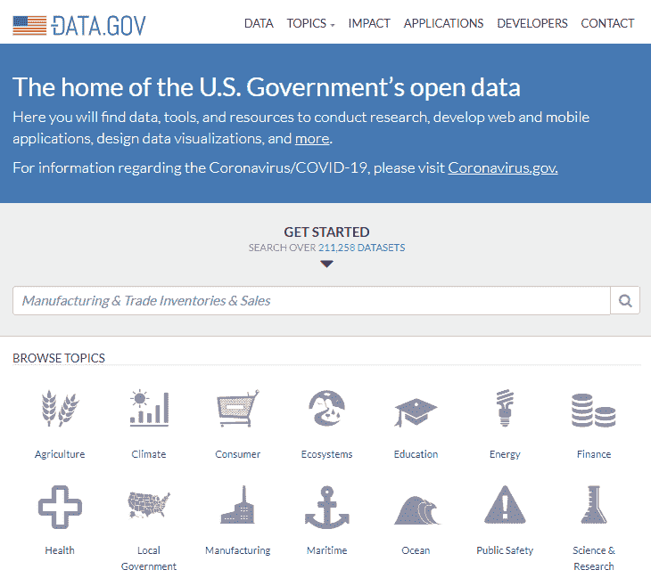

DATA.GOV（[data.gov](http://data.gov)）网站是一个良好的起点，但寻找特定的数据元素可能会感到不知所措。我发现下一个例子更容易且更快地找到和使用数据集。

## 人道主义数据交换

**人道主义数据交换**（**HDX**）由于 COVID-19 大流行而成为热门话题，但多年来一直在赞助开源数据集。这些数据集包含来自世界各地的健康特定统计数据，重点是帮助人类。这是一个通常被称为**数据善行**的真正例子，因为该网站免费提供其对人们影响的透明度。我喜欢这个网站的方式，它将 Creative Commons 许可证集成到数据目录中，这样您就可以了解关于从源头重新使用或分发数据的任何限制。他们的服务条款的一部分是限制任何**个人身份信息**（**PII**）的使用，这样数据就已经符合支持保护个人免受直接识别的法规。

以下是从 The Humanitarian Data Exchange（人道主义数据交换）网站（[data.humdata.org](http://data.humdata.org)）截取的屏幕截图，您可以在该网站上搜索关于世界各地位置的援助数据集：

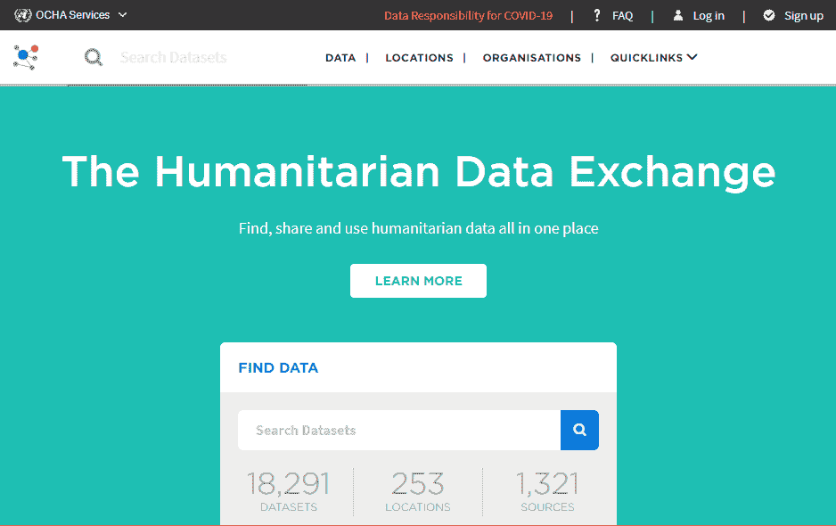

如果您正在寻找按全球统计指标分类的财务数据元素，您可以从**世界银行**数据门户开始搜索。

## 世界银行

**世界银行** 拥有一个开放的数据仓库，其中包含数千个数据集，这些数据集按国家分类并符合指标。该网站允许您将您的数据与全球基准指标进行比较，例如**国内生产总值**（**GDP**），这为您分析创建阈值和性能指标。我发现该网站易于导航，并且可以快速识别可以轻松与其他数据集连接的数据集，因为它包括定义的数据类型值，如 ISO 国家代码。

以下是从世界银行开放数据网站（[data.worldbank.org](http://data.worldbank.org)）的截图，您可以在其中搜索影响全球各国的金融数据集：

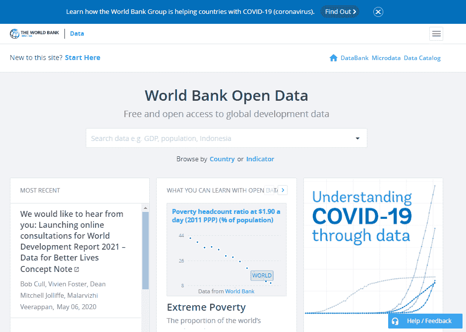

世界银行数据门户有许多丰富的示例，包括在使用它们之前进行快速分析和预览的数据可视化。我们将要查看的下一个网站，**我们的全球数据**，具有类似的可用性功能。

## 我们的全球数据

**我们的全球数据**网站始于牛津大学的研究数据，但已发展成为一个基于科学研究的在线出版物，旨在帮助世界使用数据解决问题。我喜欢这个网站，因为它可以揭示历史趋势，为人类在许多情况下如何改善提供背景信息，但当你查看不同国家时，改善的速度并不相同。我还发现他们的数据可视化易于使用和导航；例如，您可以在不同国家或地区之间过滤和比较结果。他们的数据和网站在 COVID-19 大流行期间变得非常有价值，因为您可以跟踪病例并比较不同国家以及美国国内的进展。

以下是从我们的全球数据网站（[ourworldindata.org](https://ourworldindata.org/)）的截图，您可以在其中探索数千个图表和开源数据，这些数据专注于帮助解决全球问题：

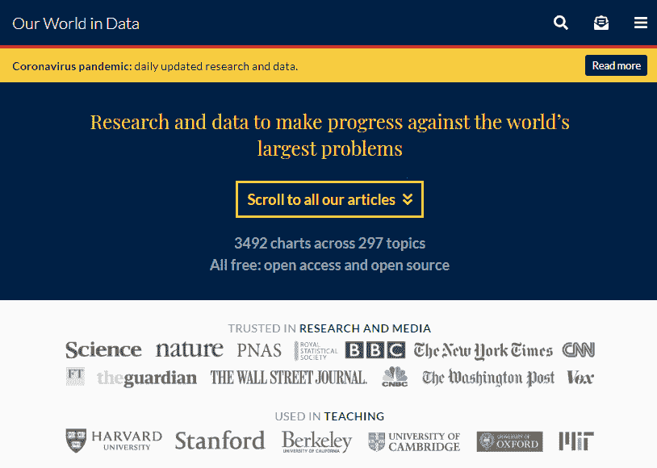

仅凭这里展示的少数例子，你可以看到你有权访问数千个可用于研究、混合或学习的数据集。请注意可能限制分发或限制你提取数据频率的开源许可证。当构建任何自动化数据管道或使用 API 按需提取数据时，这一点变得很重要。在这种情况下，你可能不得不寻找替代的付费数据公司。在任何情况下，即使源数据是符合和结构化的，也可能无法回答你分析所需的所有问题。另一个需要注意的点是数据的聚合级别可能不是很高。例如，如果数据按国家聚合，你就不能按城市合并数据。在这些情况下，在如何使用外部数据方面保持透明度很重要，同时引用来源并提供声明，说明正在使用外部数据。

接下来，我们将介绍一些可以用来报告分析结果的最佳实践。

# 报告结果

如何展示你的分析结果将根据受众、可用时间和所需详细程度来决定，以便讲述数据的故事。你的数据可能存在固有的偏差、不完整，或者需要更多属性来构建完整的画面，因此不要害怕在分析中包含这些信息。例如，如果你对气候变化进行了研究，这是一个非常广泛的话题，向你的分析消费者展示针对你数据集的具体假设的狭窄范围是很重要的。你如何以及在哪里包含这些信息并不像确保它们可供同行评审那样重要。

## 讲故事

使用数据讲故事需要一些练习，你需要时间来向受众传达你的信息。就像任何好的故事一样，以有开始、中间和结束的节奏展示数据结果将有助于分析内容的流畅性。我还发现使用类比来比较你的发现将在数据与预期消费者之间建立一些联系。了解你向谁展示分析结果与理解数据本身一样重要。

例如，在扑克牌游戏中，了解你的手牌概率和银行存款并不是成功的唯一因素。你对手的构成是影响你赢或输多少的一个因素。因此，了解桌面上玩家的反应将帮助你做出在游戏中弃牌、跟注或加注的决定。

因此，在展示结果时，要像扑克玩家一样思考，并注意你向谁展示数据以便说服观众接受你的结论。例如，如果你向高级管理层展示，时间有限，因此建议直接、简洁，并跳到总结结果。如果观众是你的同侪，那么讲述你得出结论的过程将产生共鸣，因为它建立了信誉和信任。

无论受众如何，如果你展示的图表随着时间的推移而趋势上升，请准备好提供证明基础来源的证据，以及如何计算该指标。如果没有这些信息，对重现你发现能力的怀疑将导致你的分析被驳回。

一个优秀的数据分析师将能够**读懂房间**，并了解在展示结果时需要多少细节。有很多次，我在展示发现时不得不缩短我的信息，因为当我抬头看人们参与度如何时，我意识到他们已经迷失了。与其继续下去，我停下来提出问题，这样我可以提供更多的清晰度。仅仅改变格式，在演示过程中提供提问时间，就帮助了观众和我重新将注意力集中在结论上。

因此，在分析中保持真实并提供透明度。如果你犯了错误或误解了数据，只要你继续改进并避免重复错误步骤，观众就会宽恕你。我发现，在展示自己之前，有能够提供诚实和建设性反馈的同侪、导师和经理，有助于改进你的信息和数据成果的展示。

从**数据素养**的角度来看，关注点应放在分析中获得的认识上，而不仅仅是所使用的技术。意识到解读你结果的人将来自不同的视角。CEO 可以理解公司财务数据的资产负债表图表，但可能并不关心你分析中使用了哪个 NumPy 库。在我们这本书的最后一项练习中，我们将创建一个以使用来自多个来源的数据来回答现实世界问题为重点的毕业设计项目。

# 毕业设计项目

对于我们的现实世界数据集示例，我们将使用两个不同的来源，并使用我们在本书中学到的技术将它们结合起来。由于**了解你的数据**（**KYD**）仍然适用，让我们来了解一下这些来源。

## KYD 来源

第一个来源来自世界银行，是一份绿色债券列表，这些债券用于资助减少碳排放和与气候相关项目。它从网站上下载的，因此是一个基于存储为 CSV 文件的时间点的快照，包含 115 行和 10 列，包括标题。

在以下屏幕截图中可以看到 Microsoft Excel 中数据的视觉预览：

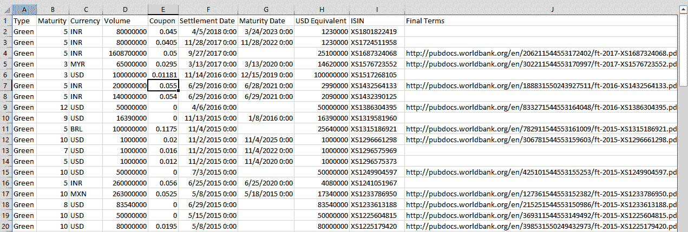

源数据中包含一些我们可以通过直接分析获得的见解，例如以下内容：

+   按货币发行的**债券**数量是多少？

+   债券的**货币**分布总情况是怎样的？

+   哪些**债券**将在未来 3 年、5 年、7 年或 10 年到期？

然而，对于发行国与当地货币相关的问题，我们存在数据缺口。由于货币汇率每日波动，如果我们有可用于通过货币字段加入的信息，我们就能回答更多的问题。因此，我们想要处理的第二个数据来源是来自**人道数据交换**（**HDX**）网站的数据。这包括按日期从`1/4/1999`到`5/7/2020`，以 M/D/YYYY 日期格式指定的货币作为基准的**外汇**（**FX**）汇率。这是一个可以下载的 CSV 文件，包含 5,465 行和 34 列，在特定日期上。文件中有一行标题，数据的第一条记录包括以井号（#）为前缀的元数据标签，这些标签由 HDX 网站用于元数据管理和编目。

以下截图显示了在 Microsoft Excel 中的数据视觉预览：

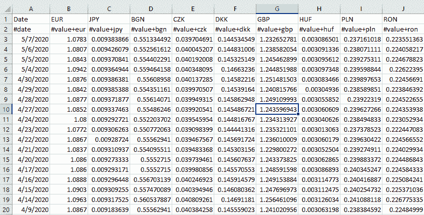

在使用 Jupyter Notebook 处理数据之前，如果希望直观地了解数据的结构，在 Microsoft Excel 或任何电子表格工具中预览数据是一种最佳实践。如果数据量很大，可以提取样本以便在工作站上加载。

因此，我们的债券数据按行列出值，我们的 FX 汇率数据则是按列列出每种货币的值，并为每个特定日期分配一个值。有几种方法可以解决这个问题，但以我们的示例为例，我们感兴趣的是将最新的 FX 汇率按货币与我们的债券数据混合，以便将**美元等值**转换为**当地货币等值**。这样，我们就可以在美元或相关国家的货币中进行数据分析，并报告结果。

## 练习

让我们打开一个新的 Jupyter Notebook 会话并开始：

1.  我们将导入所需的库以处理和分析结果，包括以下命令：

```py
In[]:import pandas as pd
import numpy as np
%matplotlib inline
```

1.  我们将使用`pandas`库读取第一个`.csv`文件，并将结果分配给名为`df_greenbonds`的变量：

```py
In[]:df_greenbonds = pd.read_csv('Green_Bonds_since_2008.csv')
```

确保将源 CSV 文件上传到正确的文件位置，以便在 Jupyter Notebook 中引用它。

1.  为了验证所有记录都已成功加载，我们需要在 DataFrame 上运行一个`shape()`函数：

```py
In[]:df_greenbonds.shape
```

输出将如下所示，其中将显示值`115`和`10`。这些值与源 CSV 文件中的行数和列数相匹配：

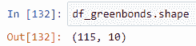

1.  要预览 DataFrame，我们可以运行以下`head()`函数：

```py
In[]:df_greenbonds.head()
```

输出将如下所示，其中 DataFrame 的结果将在 Notebook 中显示：

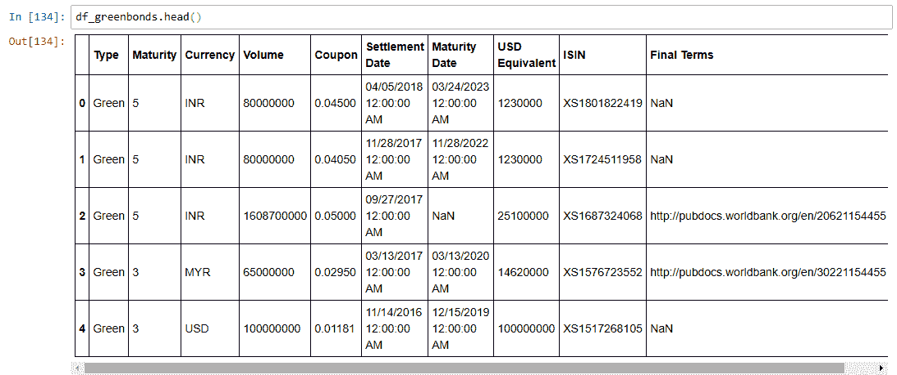

1.  我们将使用 `pandas` 库读取第二个 CSV 文件，并将结果分配给名为 `df_fx_rates` 的变量：

```py
In[]:df_fx_rates = pd.read_csv('ECB_FX_USD-quote.csv')
```

确保将源 CSV 文件上传到正确的文件位置，以便你可以在 Jupyter Notebook 中引用它。

1.  为了验证所有记录都已成功加载，请在 DataFrame 上运行一个 `shape()` 函数：

```py
In[]:df_fx_rates.shape
```

输出将如下所示，其中值 `5464` 和 `34` 将显示在括号中。这些值与源 CSV 文件中的行数和列数相匹配：

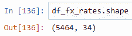

1.  为了预览 DataFrame，我们可以运行以下 `head()` 函数：

```py
In[]:df_fx_rates.head()
```

输出将如下所示，其中 DataFrame 结果将在 Notebook 中显示：

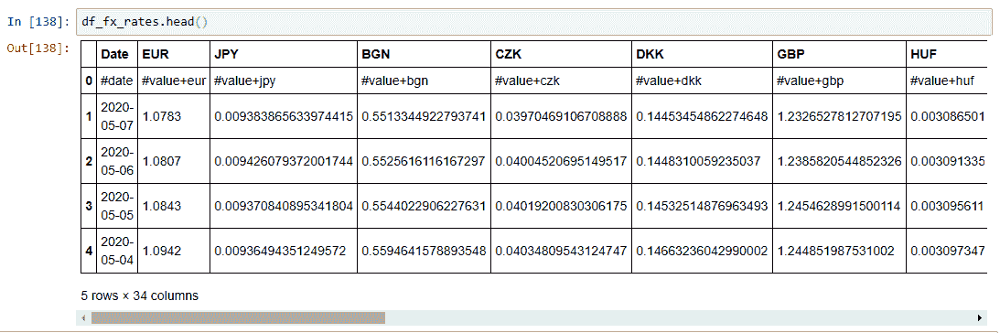

1.  由于我们知道从前面的章节中数据本身是杂乱的，需要一些清理，我们将删除第一行，因为它包含 HDX 标签元数据值，这些值对于我们的分析不是必需的：

```py
In[]:df_fx_rates = df_fx_rates.drop(0)
df_fx_rates.head()
```

建议你在分析步骤中逐步清理，以防需要调试并重新创建数据分析工作流程中的任何先前步骤。

输出将如下所示，其中 DataFrame 结果将在 Notebook 中显示：

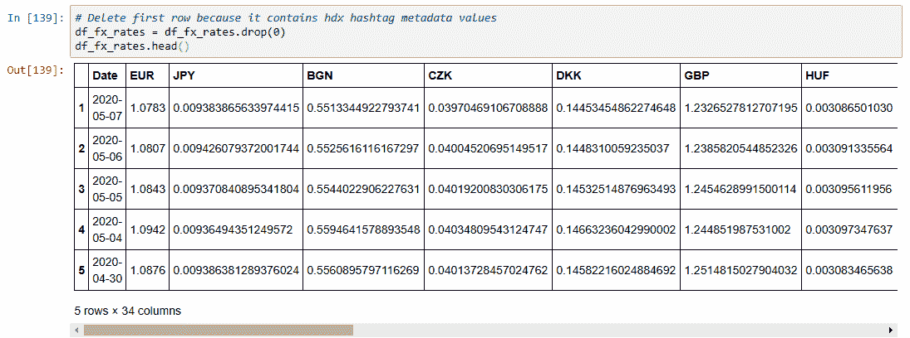

1.  对于我们的分析，我们希望关注文件中可用的最新 FX 汇率。你可以取 DataFrame 中的第一行，但更稳健的方法是使用 `max()` 函数，这样数据的排序方式就无关紧要了。在过滤 DataFrame 之前，为了验证正确的值将工作，请使用以下命令：

```py
In[]:df_fx_rates['Date'].max()
```

输出将如下所示，其中命令的结果将在 Notebook 中显示。在此数据集中，下载时的最大日期是 `2020-05-07`，日期格式为 `YYYY-MM-DD`：

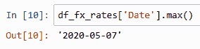

1.  在上一步中，我们确信我们的过滤器将使用正确的 `Date` 值，因此我们将创建一个新的 DataFrame，其中只包含一个特定的日期值，以便在后续步骤中合并结果。新的 DataFrame 命名为 `df_fx_rates_max_date`，它是通过 `Date` 字段过滤原始 DataFrame `df_fx_rates` 的结果，其中只返回计算出的最大 `Date` 值。我们将在 Notebook 中添加以下 `head()` 函数以验证结果：

```py
In[]:df_fx_rates_max_date = df_fx_rates[df_fx_rates.Date==df_fx_rates['Date'].max()]
df_fx_rates_max_date.head()
```

输出将如下所示，其中命令的结果将在 Notebook 中显示。新的 DataFrame，命名为 `df_fx_rates_max_date`，将只有一个包含 34 列的记录。每一列将代表使用三位国家代码的最新可用货币值，例如 `EUR`：

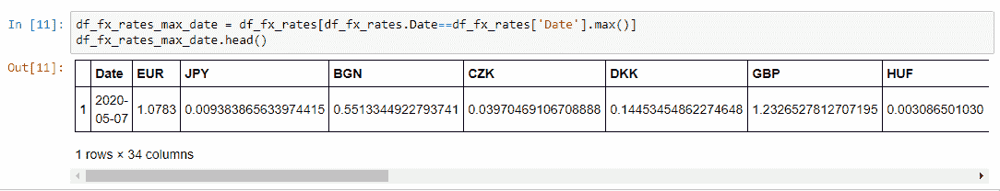

1.  我们仍然需要更多的工作来将此数据与我们的原始债券 DataFrame 合并。我们需要使用 `transpose()` 函数对其进行转换，这将所有列转换为行。在其他技术中，这个概念被称为 pivot、crosstab 或 crosstable；这在 第四章“创建您的第一个 pandas DataFrame”中已有更详细的介绍。结果存储在一个名为 `df_rates_transposed` 的新 DataFrame 中。我们重命名列以使其更容易处理。我们还需要运行以下 `head()` 命令来预览结果：

```py
In[]:df_rates_transposed = df_fx_rates_max_date.transpose()
df_rates_transposed.columns.name = 'Currency'
df_rates_transposed.columns = ['Currency_Value']
df_rates_transposed.head(10)
```

输出将如下所示，其中新的 DataFrame，命名为 `df_rates_transposed`，被显示。在这里，所有列都已被转换为行：

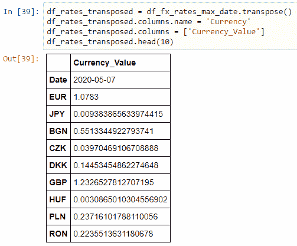

1.  目标是使我们的参考表具有所有按货币值排列的外汇汇率，并且格式相同。然而，请注意，在以下图表的第一行中，`Date` 值与需要具有相同数据类型的 `Currency_values` 混合在一起。在整个本书中，需要将符合和一致的数据值表示为结构化数据的需求得到了加强，因此我们将通过删除 `Date` 记录来清理 DataFrame。我们还将使用 `reindex()` 函数使其在下一步中更容易连接，然后运行以下 `head()` 命令来验证结果：

```py
In[]:df_rates_transposed = df_rates_transposed.drop('Date')
df_rates_transposed = df_rates_transposed.reindex()
df_rates_transposed.head()
```

输出将如下所示，其中新的 DataFrame，命名为 `df_rates_transposed`，显示方式与之前相同，但现在已删除 `Date` 记录。这意味着第一行将是 `EUR`，其 `Currency_Value` 为 `1.0783`：

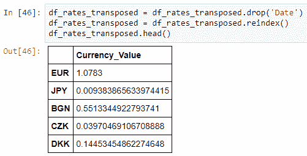

1.  现在我们已经准备好使用共同的 `Currency` 连接键字段将转换和清洗后的外汇汇率与我们的原始债券源合并。因为我们希望从 `df_greenbonds` 源获取所有记录，并且只匹配 `df_rates_transposed` 中的值，所以我们将使用左连接。为了显示和验证结果，我们使用以下 `head()` 命令：

```py
In[]:df_greenbonds_revised = df_greenbonds.merge(df_rates_transposed, how='left', left_on='Currency', right_index=True)
df_greenbonds_revised.head()
```

输出将如下所示，其中左连接的结果存储在 `df_greenbonds_revised` DataFrame 中。以下截图显示了一个包含 5 行和 11 列的表格。它包括一个标题行和未标记的索引值：

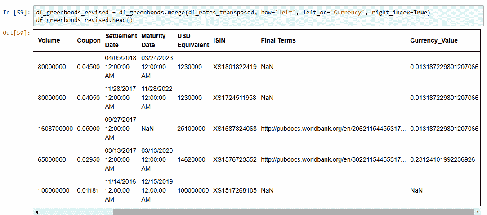

如前图所示，请确保向右滚动以查看包括了一个名为 `Currency_Value` 的新列。

1.  持续运行`head()`命令以验证每一步的结果的优势在于，你可以在准备和清理数据以进行进一步分析的同时对数据进行观察。在先前的屏幕截图中，我们可以看到`Currency_Value`中的`null()`值，显示为`NaN`。我们在第五章中介绍了如何处理 NaN 值，*在 Python 中收集和加载数据*。这是由于左连接的结果，这是预期的，因为 FX 汇率源数据中没有`USD`的值。这很有道理，因为你不需要转换美元的货币。然而，当我们尝试从这个列的值中创建计算时，这将会产生影响。在这种情况下，解决方案是将所有的`NaN`值转换为`1`，因为美元的 FX 汇率转换是 1。运行此命令后不会有输出：

```py
In[]:df_greenbonds_revised["Currency_Value"].fillna(1, inplace=True)
```

1.  由于我们的 CSV 文件源不包括数据字典，因此每个字段的定义数据类型是未知的。我们可以通过应用`astype()`函数来解决数据值中的任何不一致。我们将关注我们用于计算本地货币率的两个列，将它们转换为`float`类型的`dtype`。运行此命令后不会有输出：

```py
In[]:df_greenbonds_revised["Currency_Value"] = df_greenbonds_revised.Currency_Value.astype(float)
df_greenbonds_revised["USD Equivalent"] = df_greenbonds_revised["USD Equivalent"].astype(float)
```

1.  现在，我们已准备好在现有的 DataFrame 中创建一个新的计算列，该列将`USD Equivalent`列除以`Currency_Value`。结果将存储在同一 DataFrame 中的新列`Local CCY`中。运行此命令后不会有输出：

```py
In[]:df_greenbonds_revised['Local CCY'] = df_greenbonds_revised['USD Equivalent']/df_greenbonds_revised['Currency_Value']
```

1.  现在，我们可以将特定列的数据类型转换回整数，并通过明确标识它们来关注关键列。我们可以通过以下命令来完成：

```py
In[]:df_greenbonds_revised['Local CCY'] = df_greenbonds_revised['Local CCY'].astype(int)
df_greenbonds_revised['USD Equivalent'] = df_greenbonds_revised['USD Equivalent'].astype(int)
df_greenbonds_revised[['ISIN', 'Currency', 'USD Equivalent', 'Currency_Value', 'Local CCY']]
```

输出将如下所示，其中前面命令的结果将在笔记本中显示。原始列“美元等值”以整数形式显示，现在我们可以在“货币值”右侧看到“本地货币”列：

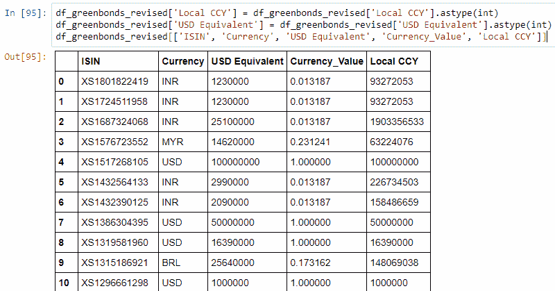

1.  为了分析结果，让我们按`货币`对数据进行分组，并使用以下命令仅对`USD Equivalent`和`Local CCY`字段求和：

```py
In[]:df_greenbonds_revised[['Currency', 'USD Equivalent', 'Local CCY']].groupby(['Currency']).sum().astype(int)
```

输出将如下所示，其中数据现在按`货币`聚合，同时还会显示`USD Equivalent`和`Local CCY`的总和：

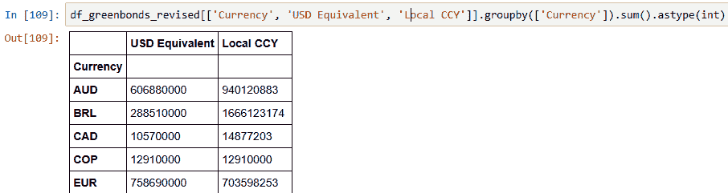

1.  另一种分析类型是，通过使用`matplotlib`库的`plot()`函数创建水平条形图来直观地查看数据按`货币`的分布情况：

```py
In[]:df_greenbonds_revised[['Currency', 'USD Equivalent']].groupby(['Currency']).size().plot(kind='barh');
```

输出将如下所示：

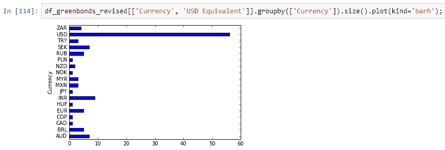

如你所见，大量的绿色债券是以美元发行的，因为与其他货币相比，它拥有最大的条形图，并且差距很大。仅通过查看这些数据，无法明显看出这种情况的原因，因此需要进一步的分析。当你向组织内部的其他人展示你的发现时，这通常是现实情况，将数据混合在一起可以提供更多见解，但同时也导致了更多未解决的问题。这反过来又导致了需要将更多数据添加到现有来源中的需求。在何时停止混合更多数据之间找到平衡是具有挑战性的，因此鼓励添加增量里程碑来展示你的发现。

# 摘要

通过这样，我们已经在一项综合练习中走过了这本书中涵盖的许多不同概念。在本章中，我们更多地了解了可用于分析的现实世界数据源。我们还创建了一个可重复的工作流程，可以概括为：收集外部数据源，将它们合并在一起，然后分析结果。由于我们知道与数据打交道的现实情况永远不会那么简单直接，所以我们探讨了与之相关的固有挑战。我们将收集多个来源的步骤、转换它们、清洗、合并、分组和可视化结果的过程进行了分解。你越是在实际操作中与数据打交道，就越容易将这些概念应用到任何数据集上，同时保持基础不变。当你在处理数据时提高你的数据素养技能，你会注意到语法和工具会发生变化，但解决问题的挑战和机遇保持不变。我鼓励你通过持续学习更多关于数据的知识来继续投资自己。我希望你发现这是一段像我一样充实的人生旅程！

# 进一步阅读

+   人道主义数据交换网站：[`data.humdata.org/`](https://data.humdata.org/)

+   Data.gov – 美国政府的开放数据：[`www.data.gov/`](https://www.data.gov/)

+   创意共享网站：[`creativecommons.org/`](https://creativecommons.org/)

+   开放数据公共网站：[`opendatacommons.org/`](https://opendatacommons.org/)

+   我们的世界数据网站：[`ourworldindata.org/`](https://ourworldindata.org/)

+   世界银行开放数据网站：[`data.worldbank.org/`](https://data.worldbank.org/)
