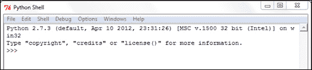
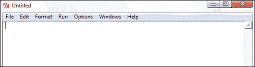
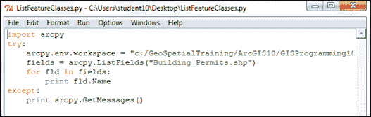
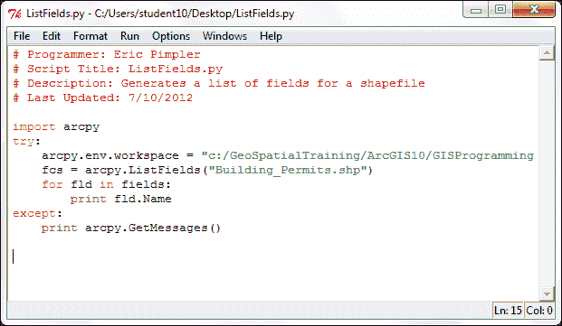

# 第一章：ArcGIS 的 Python 语言基础

Python 支持许多在其他语言中找到的编程结构。在本章中，我们将介绍 Python 中许多基本语言结构。最初，我们将介绍如何创建新的 Python 脚本和编辑现有脚本。从那里，我们将深入探讨语言特性，例如在代码中添加注释、创建和分配数据给变量，以及 Python 的内置变量类型，这使得使用 Python 编程变得简单且紧凑。

接下来，我们将探讨 Python 提供的各种内置数据类型，例如字符串、数字、列表和字典。类和对象是面向对象编程和 Python 语言中的基本概念。我们将向您介绍这些复杂的数据结构，您在编写 ArcGIS 的地理处理脚本时将广泛使用它们。

此外，我们将介绍包括决策支持和循环结构在内的语句，用于在代码中做出决策和/或多次遍历代码块，以及与 Arcpy 数据访问模块中的新`cursor`对象广泛使用的`with`语句。最后，您将学习如何访问提供 Python 语言额外功能的模块。到本章结束时，您将学习以下内容：

+   如何创建和编辑新的 Python 脚本

+   Python 语言特性

+   注释和数据变量

+   内置数据类型（字符串、数字、列表和字典）

+   复杂数据结构

+   循环结构

+   额外的 Python 功能

# 使用 IDLE 进行 Python 脚本开发

正如我在前言中提到的，当您安装 ArcGIS 桌面版时，Python 也会安装，并附带一个名为 IDLE 的工具，允许您编写自己的代码。"**IDLE**"代表**集成开发环境**。因为它与每个 ArcGIS 桌面安装一起提供，所以我们将使用 IDLE 开发环境来编写本书中的许多脚本，以及 ArcGIS 桌面中嵌入的 Python 窗口。随着您作为程序员的进步，您可能会发现比 IDLE 更喜欢的其他开发工具。您可以使用这些工具中的任何一个来编写代码。

## Python 外壳窗口

要启动 Python 的 IDLE 开发环境，您可以前往**开始** | **程序** | **ArcGIS** | **Python 2.7** | **IDLE**。请注意，ArcGIS 安装的 Python 版本将取决于您安装的 ArcGIS 版本。例如，ArcGIS 10.0 使用 Python 2.6，而 ArcGIS 10.1 使用 Python 2.7。

将显示与截图类似的 Python 外壳窗口：



Python 外壳窗口用于输出和脚本生成的错误信息。初学者常见的错误是认为地理处理脚本将在这个外壳窗口中编写。事实并非如此。您需要创建一个单独的代码窗口来存放您的脚本。

虽然 shell 窗口不用于编写整个脚本，但它可以用来交互式地编写代码并立即获得反馈。ArcGIS 内置了一个 Python shell 窗口，你可以以类似的方式使用它。我们将在下一章中检查 ArcGIS Python 窗口。

## Python 脚本窗口

你的脚本将写在 IDLE 中的单独窗口，称为**Python 脚本窗口**。要创建一个新的代码窗口，从 IDLE shell 窗口中选择**文件** | **新建窗口**。将显示一个类似于以下截图的窗口：



你的 Python 脚本将在这个新的代码窗口中编写。每个脚本都需要保存到本地或网络驱动器。默认情况下，脚本以`.py`文件扩展名保存。

## 编辑现有的 Python 脚本

可以通过在 Windows 资源管理器中右键单击文件并选择**使用 IDLE 编辑**来从 Windows 资源管理器打开现有的 Python 脚本文件，这将打开一个新的 shell 窗口以及加载到 Python 脚本编辑器中的脚本。你可以在以下截图中看到一个示例：


在这种情况下，我们已经使用 IDLE 加载了`ListFeatureClasses.py`脚本。代码加载在脚本窗口内：



现在代码窗口已打开，你可以开始编写或编辑代码。你还可以使用 IDLE 界面进行一些基本的脚本调试。调试是识别和修复代码中的错误的过程。

## 从 IDLE 执行脚本

一旦你在 IDLE 代码窗口中编写了地理处理脚本或打开了现有的脚本，你就可以从界面中执行代码。IDLE 确实提供了在运行脚本之前检查代码语法的功能。在代码窗口中，选择**运行** | **检查模块**来执行代码的语法检查。

任何语法错误都会在 shell 窗口中显示。如果没有语法错误，你应该只看到 shell 窗口中的提示符。虽然 IDLE 界面可以用来检查语法错误，但它不提供检查代码中逻辑错误的方法，也不提供其他开发环境中常见的更高级的调试工具，例如 PythonWin 或 Wingware。

一旦你确认代码中没有语法错误，你可以运行脚本。选择**运行** | **运行模块**来执行脚本：


任何错误信息都将写入 shell 窗口，包括`print`语句的输出和系统生成的消息。`print`语句只是将字符串输出到 shell 窗口。它通常用于更新正在运行的脚本的状态或用于调试代码。

# Python 语言基础

为了有效地编写 ArcGIS 的地理处理脚本，您至少需要了解 Python 语言的基本结构。Python 比大多数其他编程语言更容易学习，但学习并有效使用它需要一些时间。本节将教会您如何创建变量，将各种数据类型分配给变量，理解可以分配给变量的不同数据类型，使用不同类型的语句，使用对象，读写文件，以及导入第三方 Python 模块。

## 注释代码

Python 脚本应遵循常见的结构。每个脚本的开始应作为文档，详细说明脚本名称、作者以及脚本提供的处理的一般描述。此文档通过使用注释在 Python 中完成。注释是添加到脚本中以提供脚本提供的功能文档的代码行。这些代码行以单个井号（`#`）或双井号（`##`）开头，后跟您需要用于记录代码的任何文本。Python 解释器不会执行这些代码行。它们仅用于记录您的代码。在下一张屏幕截图中，注释的代码行以红色显示。您还应该努力在脚本中包含注释，以描述脚本的重要部分。当您需要更新脚本时，这将对您（或另一位程序员）很有用。



### 小贴士

**下载示例代码**

您可以从[`www.PacktPub.com`](http://www.PacktPub.com)的账户下载您购买的所有 Packt 书籍的示例代码文件。如果您在其他地方购买了这本书，您可以访问[`www.PacktPub.com/support`](http://www.PacktPub.com/support)并注册，以便将文件直接通过电子邮件发送给您。

## 导入模块

虽然 Python 包含许多内置函数，但您将经常需要访问存储在外部模块中的特定功能包。例如，**Math 模块**存储与处理数值相关的特定函数，而**R 模块**提供统计分析函数。模块通过使用`import`语句导入。在编写 ArcGIS 的地理处理脚本时，您始终需要导入 ArcPy 模块，这是用于访问 ArcGIS 提供的 GIS 工具和函数的 Python 包。`import`语句将是您脚本中的第一行代码（不包括注释）：

```py
import arcpy, os
```

## 变量

从高层次来看，你可以将变量视为在脚本运行期间为存储值而保留在计算机内存中的一个区域。你定义的 Python 变量会被赋予一个名称和一个值。分配给变量的值可以通过引用变量名来访问脚本的不同区域。例如，你可能创建一个包含要素类名称的变量，然后由**缓冲**工具使用该变量创建新的输出数据集。要创建一个变量，只需给它一个名称，后跟赋值运算符（即等号`=`），然后是一个值：

```py
fcParcels = "Parcels"
fcStreets = "Streets"
```

以下表格展示了使用前面的代码示例中变量名及其赋值：

| 变量名 | 变量值 |
| --- | --- |
| `fcParcels` | `Parcels` |
| `fcStreets` | `Streets` |

创建变量时必须遵循某些命名规则，包括以下内容：

+   可以包含字母、数字和下划线

+   第一个字符必须是一个字母

+   变量名中除下划线外没有特殊字符

+   不能使用 Python 关键字

有几十个 Python 关键字必须避免，包括`class`、`if`、`for`、`while`等。

Python 中一些合法变量名的例子：

+   `featureClassParcel`

+   `fieldPopulation`

+   `field2`

+   `ssn`

+   `my_name`

Python 中一些非法变量名的例子：

+   `class`（Python 关键字）

+   `return`（Python 关键字）

+   `$featureClass`（非法字符，必须以字母开头）

+   `2fields`（必须以字母开头）

+   `parcels&Streets`（非法字符）

Python 是一种区分大小写的语言，因此在脚本中对变量的命名和大小写要特别注意。大小写问题可能是新 Python 程序员遇到的最常见的错误来源，所以当你遇到代码中的错误时，始终要考虑这一点。让我们来看一个例子。以下是一个包含三个变量的列表；请注意，尽管每个变量名相同，但大小写不同，因此产生了三个不同的变量。

+   `mapsize = "22x34"`

+   `MapSize = "8x11"`

+   `Mapsize = "36x48"`

如果你打印这些变量，你将得到以下输出：

```py
print mapsize
>>> 22x34

print MapSize
>>> 8x11

print Mapsize
>>>36x48
```

Python 变量名在整个脚本中需要保持一致。最佳实践是使用驼峰命名法，即变量名的第一个单词全部小写，然后每个后续单词以大写字母开头。以下示例中的变量名`fieldOwnerName`展示了这一概念：第一个单词（`field`）全部小写，第二个单词（`Owner`）和第三个单词（`Name`）以大写字母开头：

```py
fieldOwnerName
```

在 Python 中，变量是动态类型的。**动态类型**意味着你可以定义一个变量并将其赋值，而不需要明确指定该变量名将包含特定类型的数据。可以分配给变量的常用数据类型包括以下几种：

| 数据类型 | 示例值 | 代码示例 |
| --- | --- | --- |
| 字符串 | `"Streets"` | `fcName = "Streets"` |
| 数字 | `3.14` | `percChange = 3.14` |
| 布尔 | `True` | `ftrChanged = true` |
| 列表 | `Streets, Parcels, Streams` | `lstFC = ["Streets", "Parcels", "Streams"]` |
| 字典 | `'0':Streets,'1':Parcels` | `dictFC = {'0':Streets,'1':Parcels]` |
| 对象 | `Extent` | `spatialExt = map.extent` |

我们将在接下来的章节中更详细地讨论这些数据类型。

例如，在 C# 中，在使用变量之前，你需要定义变量的名称和类型。在 Python 中，这并不是必需的。要使用变量，只需给它一个名称和值，你就可以立即开始使用它了。Python 会幕后工作，以确定变量中存储的数据类型。

例如，在 C# .NET 中，在处理变量之前，你需要命名并定义变量的数据类型。在下面的代码示例中，我们创建了一个名为 `aTouchdown` 的新变量，它被定义为整数变量，这意味着它只能包含整数数据。然后我们将值 `6` 分配给这个变量：

```py
int aTouchdown;
aTouchdown = 6;
```

在 Python 中，可以通过动态类型创建并分配数据给相同的变量。Python 解释器负责动态确定分配给变量的数据类型：

```py
aTouchdown = 6
```

你的 Python 地理处理脚本对于 ArcGIS 通常需要引用计算机或共享服务器上数据集的位置。对这些数据集的引用通常由存储在变量中的路径组成。在 Python 中，路径名是一个特殊情况，值得特别提及。Python 中的反斜杠字符是一个保留的转义字符和行续行字符，因此需要使用两个反斜杠、一个单斜杠或以字母 `r` 前缀的常规单斜杠来定义路径。这些路径名在 Python 中始终以字符串的形式存储。你将在下面的部分中看到一个例子。

非法路径引用：

```py
fcParcels = "c:\Data\Parcels.shp"
```

合法路径引用：

```py
fcParcels = "c:/Data/Parcels.shp"
fcParcels = "c:\\Data\\Parcels.shp"
fcParcels = r"c:\Data\Parcels.shp"
```

有时候，你可能知道你的脚本将需要一个变量，但事先并不一定知道将分配什么数据给这个变量。在这些情况下，你可以简单地定义一个变量而不给它分配数据。在脚本运行时，分配给变量的数据也可以更改。

变量可以存储许多不同类型的数据，包括原始数据类型，如字符串和数字，以及更复杂的数据，如列表、字典甚至对象。我们将检查可以分配给变量的不同数据类型，以及 Python 提供的用于操作数据的各种函数。

## 内置数据类型

Python 有许多内置的数据类型。我们将首先讨论的第一个内置类型是 `string` 数据类型。我们已经看到了几个 `string` 变量的例子，但这类变量可以通过很多方式来操作，所以让我们更仔细地看看这个数据类型。

### 字符串

字符串是有序字符集合，用于存储和表示基于文本的信息。这是一种相当枯燥的说法，即字符串变量包含文本。当分配给变量时，字符串变量被单引号或双引号包围。例如，可以包括一个名称、要素类名称、`Where` 子句或任何可以编码为文本的内容。

#### 字符串操作

在 Python 中，字符串可以通过多种方式进行操作。字符串连接是更常用的函数之一，并且实现简单。`+` 操作符用于操作符两边的字符串变量，以产生一个新的字符串变量，将两个字符串变量连接在一起：

```py
shpStreets = "c:\\GISData\\Streets" + ".shp"
print shpStreets
```

运行此代码示例会产生以下结果：

```py
>>>c:\GISData\Streets.shp
```

可以使用 Python 的 `==` 操作符测试字符串的相等性，它只是两个等号放在一起。不要将相等操作符与赋值操作符混淆，赋值操作符是一个单独的等号。相等操作符测试两个变量是否相等，而赋值操作符将值赋给变量：

```py
firstName = "Eric"
lastName = "Pimpler"
firstName == lastname
```

运行此代码示例会产生以下结果：

```py
>>>False
```

字符串可以使用 `in` 操作符进行包含性测试，如果第一个操作数包含在第二个操作数中，则返回 `True`。

```py
fcName = "Floodplain.shp"
print ".shp" in fcName
>>>True
```

我简要地提到字符串是一个字符的有序集合。这意味着什么？这仅仅意味着我们可以从字符串中访问单个字符或一系列字符。在 Python 中，访问单个字符被称为 **索引**，访问一系列字符被称为 **切片**。

通过在字符串后提供方括号内的数字偏移量，可以获取字符串中的字符。例如，你可以使用语法 `fc[0]` 获取 `fc` 变量的第一个字符串字符。可以使用负偏移量从字符串的末尾向前搜索。在这种情况下，字符串中的最后一个字符存储在索引 `-1` 处。索引始终创建一个新的变量来保存字符：

```py
fc = "Floodplain.shp"
print fc[0]
>>>'F'
print fc[10]
>>>'.'
print fc[13]
>>>'p'
```

以下图像说明了字符串是如何成为一个字符的有序集合，第一个字符占据位置 **0**，第二个字符占据位置 **1**，每个后续字符占据下一个索引号：


虽然字符串索引允许你从一个字符串变量中获取单个字符，但字符串切片允许你提取一个连续的字符串序列。其格式和语法与索引类似，但增加了第二个偏移量，用于告诉 Python 返回多少个字符。

以下代码示例提供了一个字符串切片的例子。`theString` 变量已被分配值为 `Floodplain.shp`。要获取包含 `Flood` 内容的切片变量，你会使用 `theString[0:5]` 语法：

```py
theString = "Floodplain.shp"
print theString[0:5]
>>>Flood
```

### 注意

Python 切片返回从第一个偏移量开始的字符，但不包括第二个偏移量。这对新 Python 程序员来说可能特别令人困惑，并且是错误的一个常见来源。在我们的例子中，返回的变量将包含字符`Flood`。第一个字符，占据位置`0`，是`F`。返回的最后一个字符是索引`4`，对应字符`d`。请注意，索引号`5`不包括在内，因为 Python 切片只返回到但不包括第二个偏移量的字符。

可以省略任一偏移量。这实际上创建了一个通配符。在`theString[1:]`的情况下，你是在告诉 Python 返回从第二个字符到字符串末尾的所有字符。在第二种情况下，`theString[:-1]`，你是在告诉 Python 从字符零开始，返回除了最后一个字符之外的所有字符。

Python 是处理字符串的出色语言，你可以使用许多其他函数来处理这类数据。大多数这些函数超出了本文的范围，但一般来说，以下所有字符串操作函数都是可用的：

+   字符串长度

+   大小写转换函数

+   移除前导和尾随空格

+   在字符串中查找字符

+   文本替换

+   根据分隔符拆分到单词列表

+   格式化

### 数字

Python 还内置了对数值数据（包括`int`、`long`、`float`和`complex`值）的支持。数字的分配方式与字符串类似，只是不需要在值周围加上引号，并且显然它必须是一个数值。

Python 支持所有常用的数值运算符，包括加法、减法、乘法、除法和取模或余数。此外，还有返回绝对值、将字符串转换为数值数据类型和四舍五入的函数。

虽然 Python 提供了一些内置的数学函数，但可以使用`math`模块来访问更多高级的数学函数。要使用这些函数，你必须具体导入`math`模块，如下所示：

```py
import math
```

`math`模块提供的函数包括返回数字的上限和下限、绝对值、三角函数、对数函数、角度转换和双曲函数。

### 列表

Python 提供的第三个内置数据类型是`list`。列表是有序的对象集合，可以存储 Python 支持的所有类型的数据，同时还能同时存储多种数据类型。这可以是数字、字符串、其他列表、字典或对象。例如，一个列表变量可以同时存储数字和字符串数据。列表是零基的，列表中的第一个元素占据位置`0`。列表中的每个后续对象递增一个。此外，列表具有动态增长和缩小的特殊能力。

列表是通过将一系列括号内的值赋值来创建的。要从列表中提取一个值，只需在变量名旁边使用括号内的整数值即可。下面的代码示例说明了这一点。您还可以使用列表的切片功能来返回多个值。**切片**列表始终返回一个新的列表变量。

```py
fcList = ["Hydrants", "Water Mains", "Valves", "Wells"]
fc = fcList[0]
print fc
>>>Hydrants
fc = fcList[3]
print fc
>>>Wells
```

列表本质上是动态的，这使得它们可以增长、缩小和更改内容，而无需创建列表的新副本。可以通过索引或切片来更改列表中的值。索引允许您更改单个值，而切片允许您更改多个列表项。

列表有许多方法允许您操作列表中的值。您可以通过使用`sort()`方法按升序或降序对列表的内容进行排序。可以使用`append()`方法向列表中添加项，该方法将对象添加到列表的末尾，以及使用`insert()`方法在列表中的某个位置插入对象。可以使用`remove()`方法从列表中删除项，该方法从列表中删除第一个出现的值，或者使用`pop()`方法删除并返回最后添加到列表中的对象。还可以使用`reverse()`方法反转列表的内容。

### 元组

元组与列表类似，但有一些重要的区别。就像列表一样，元组包含一系列值。唯一的区别是元组不能被修改，并且它们用圆括号而不是方括号来引用。创建一个元组就像在圆括号内放置一系列以逗号分隔的值一样简单，如下面的代码示例所示：

```py
fcTuples = ("Hydrants", "Water Mains", "Valves", "Wells")
```

与列表一样，元组的索引从`0`开始。访问存储在元组中的值的方式与列表相同。以下代码示例说明了这一点：

```py
fcTuples = ("Hydrants", "Water Mains", "Valves", "Wells")
print fcTuples[1]
>>>Water Mains
```

当结构的内容需要是静态的时候，通常使用元组来代替列表。您不能通过列表来确保这一点，但可以通过元组来确保。

### 字典

字典是 Python 中的第二种集合对象。它们与列表类似，但字典是一个无序的对象集合。与通过偏移量从集合中获取对象不同，字典中的项是通过键来存储和检索的。字典中的每个键都有一个关联的值。与列表类似，字典可以通过 `dictionary` 类的方法在原地增长和缩小。在下面的代码示例中，你将学习如何创建和填充字典，并了解如何通过键访问值。字典是通过使用花括号创建的。在这些括号内，每个键都由引号包围，后跟一个冒号，然后是与键关联的值。这些键/值对由逗号分隔：

```py
##create the dictionary
dictLayers = {'Roads': 0, 'Airports': 1, 'Rail': 2}

##access the dictionary by key
dictLayers['Airports']
>>>1
dictLayers['Rail']
>>>2
```

基本字典操作包括获取字典中的项目数量、使用键获取值、确定键是否存在、将键转换为列表以及获取值列表。字典对象可以在原地更改、扩展和缩小。这意味着 Python 不需要创建一个新的 `dictionary` 对象来保存字典的更改版本。向字典键赋值是通过在方括号中声明键值并将其设置为某个值来完成的。

### 小贴士

与列表不同，由于它们的元素是无序的，字典不能被切片。如果你需要遍历字典中的所有值，只需使用 `keys()` 方法，该方法返回字典中所有键的集合，然后可以单独使用这些键来设置或获取值。

## 类和对象

类和对象是面向对象编程中的基本概念。虽然 Python 更偏向于过程式语言，但它也支持面向对象编程。在面向对象编程中，类用于创建对象实例。你可以将类视为创建一个或多个对象的蓝图。每个对象实例都有相同的属性和方法，但对象中包含的数据可以并且通常会有所不同。对象是 Python 中的复杂数据类型，由属性和方法组成，可以像任何其他数据类型一样分配给变量。属性包含与对象关联的数据，而方法则是对象可以执行的操作。

这些概念最好通过一个例子来解释。在 ArcPy 中，`Extent` 类是一个通过提供地图单位中左下角和右上角的坐标来指定的矩形。`Extent` 类包含许多属性和方法。属性包括 `XMin`、`XMax`、`YMin` 和 `YMax`、`spatialReference` 以及其他属性。x 和 y 属性的最小值和最大值提供了范围矩形的坐标。`spatialReference` 属性持有 `SpatialReference` 对象的引用，用于 `Extent`。`Extent` 类的对象实例可以通过点表示法来设置和获取这些属性的值。以下代码示例展示了这一点：

```py
import arcpy
fc = "c:/ArcpyBook/data/TravisCounty/TravisCounty.shp"

# Fetch each feature from the cursor and examine the extent properties and spatial reference
for row in arcpy.da.SearchCursor(fc, ["SHAPE@"]):
  # get the extent of the county boundary
  ext = row[0].extent
  # print out the bounding coordinates and spatial reference
  print "XMin: " + ext.XMin
  print "XMax: " + ext.XMax
  print "YMin: " + ext.YMin
  print "YMax: " + ext.YMax
  print "Spatial Reference: " + ext.spatialReference.name
```

运行此脚本会产生以下输出：

```py
XMin: 2977896.74002
XMax: 3230651.20622
YMin: 9981999.27708
YMax:10200100.7854
Spatial Reference: NAD_1983_StatePlane_Texas_Central_FIPS_4203_Feet
```

`Extent` 类也有许多方法，这些是对象可以执行的操作。对于这个特定的对象，大多数方法都与在 `Extent` 对象和另一个几何体之间执行某种几何测试相关。例如包括 `contains()`、`crosses()`、`disjoint()`、`equals()`、`overlaps()`、`touches()` 和 `within()`。

你需要理解的一个额外的面向对象的概念是点表示法。**点表示法**提供了一种访问对象属性和方法的方式。它用于表示一个属性或方法属于特定的类。

使用点表示法的语法包括一个对象实例，后面跟着一个点，然后是属性或方法。语法在访问属性或方法时都是相同的。在点后面的单词末尾的括号和零个或多个参数表示正在访问一个方法。以下是一些示例，以更好地说明这个概念：

```py
Property: extent.XMin
Method: extent.touches()
```

## 语句

你用 Python 编写的每一行代码都被称为一个**语句**。有各种不同的语句类型，包括那些创建和分配数据到变量的语句，基于测试分支代码的决策支持语句，执行代码块多次的循环语句，以及其他语句。当你创建脚本中的语句时，你的代码需要遵循各种规则。你已经遇到过一种类型的语句：变量创建和赋值。

### 决策支持语句

`if`/`elif`/`else` 语句是 Python 中的主要决策语句，用于测试真/假条件。决策语句使你能够控制程序的流程。以下是一些你可以在代码中做出的决策示例：如果变量持有点要素类，获取 X、Y 坐标；如果要素类名称等于 `Roads`，则获取 `Name` 字段。

决策语句，如 `if`/`elif`/`else`，用于测试真假条件。在 Python 中，“真”值表示任何非零数字或非空对象。假值表示“非真”，在 Python 中用零数字或空对象表示。比较测试返回一个或零（真或假）的值。布尔和/或运算符返回真或假的操作数值。

```py
if fcName == 'Roads':
  gp.Buffer_analysis(fc, "c:\\temp\\roads.shp", 100)
elif fcName == 'Rail':
  gp.Buffer_analysis(fc, "c:\\temp\\rail.shp", 50)
else:
  print "Can't buffer this layer"
)
```

Python 代码必须遵循某些语法规则。语句一个接一个地执行，直到你的代码分支。分支通常通过使用 `if`/`elif`/`else` 来实现。此外，使用循环结构，如 `for` 和 `while`，可以改变语句流程。Python 自动检测语句和块边界，因此不需要在代码块周围使用大括号或分隔符。相反，缩进用于在块中分组语句。许多语言使用分号来终止语句，但 Python 只使用行结束字符来标记语句的结束。复合语句包括一个 "`:`" 字符。复合语句遵循以下模式：以冒号结尾的标题。然后，代码块作为单个语句编写，并缩进在标题之下。

语句缩进值得特别提一下，因为它对 Python 解释代码的方式至关重要。正如我提到的，Python 通过缩进来检测连续的代码段。默认情况下，所有 Python 语句都应该左对齐，直到使用循环、决策支持、`try`/`except` 和 `with` 语句。这包括 `for` 和 `while` 循环、`if`/`else` 语句、`try`/`except` 语句和 `with` 语句。所有以相同距离缩进的语句都属于同一代码块，直到该块通过缩进较少的行结束。

### 循环语句

循环语句允许你的程序根据需要重复执行代码行。`while` 循环会重复执行循环顶部的测试为真的一块代码。当条件测试评估为假时，Python 会立即开始解释 `while` 循环之后的代码。在下一个代码示例中，变量 `x` 被赋予了值 `10`。`while` 循环的测试会检查 `x` 是否小于 `100`。如果 `x` 小于 `100`，则当前 `x` 的值会被打印到屏幕上，并且 `x` 的值会增加 `10`。然后，处理会继续进行 `while` 循环的测试。第二次，`x` 的值将是 `20`；因此测试再次评估为真。这个过程会一直持续到 `x` 大于 `100`。此时，测试将评估为假，处理将停止。确保你的 `while` 语句有某种跳出循环的方法非常重要。否则，你可能会陷入无限循环。无限循环是计算机程序中的一系列指令，它会无限循环，要么是因为循环没有终止条件，要么是因为有一个永远无法满足的条件，或者是因为它会导致循环重新开始：

```py
x = 10
while x < 100:
 print x
 x = x + 10
```

`for` 循环执行预定的次数的代码块。它们有两种类型——一个计数循环，用于运行固定次数的代码块，和一个列表循环，它允许你遍历列表中的所有对象。以下示例中的列表循环会为字典中的每个值执行一次，然后停止循环：

```py
dictLayers = {"Roads":"Line","Rail":"Line","Parks":"Polygon"}
lstLayers = dictLayers.keys()
for x in lstLayers:
  print dictLayers[x]
```

有时候，你可能需要从循环的执行中跳出。`break` 和 `continue` 语句可以用来实现这一点。`break` 会跳出最近的封闭循环，而 `continue` 会跳回到最近的封闭循环的顶部。这些语句可以出现在代码块内部的任何位置。

### `try` 语句

`try` 语句是一个完整的、复合语句，用于处理异常。异常是一种高级控制设备，主要用于错误拦截或触发。Python 中的异常可以被拦截或触发。当你的代码中出现错误条件时，Python 会自动触发一个异常，这个异常可能或可能不会被你的代码处理。作为程序员，你有责任捕获自动触发的异常。异常也可以通过你的代码手动触发。在这种情况下，你还需要提供一个异常处理程序来捕获这些手动触发的异常。

`try` 语句有两种基本类型：`try`/`except`/`else` 和 `try`/`finally`。基本的 `try` 语句从 `try` 标题行开始，后面跟着一个缩进的语句块，然后是一个或多个可选的 `except` 子句，用于指定要捕获的异常，以及一个可选的 `else` 子句在末尾：

```py
import arcpy
import sys

inFeatureClass = arcpy.GetParameterAsText(0)
outFeatureClass = arcpy.GetParameterAsText(1)

try:
  # If the output feature class exists, raise an error

  if arcpy.Exists(inFeatureClass):
    raise overwriteError(outFeatureClass)
  else:
    # Additional processing steps

except overwriteError as e:
  # Use message ID 12, and provide the output feature class
  #  to complete the message.

  arcpy.AddIDMessage("Error", 12, str(e))
```

`try`/`except`/`else` 语句的工作原理如下。一旦进入 `try` 语句，Python 会标记你处于 `try` 块中，并且知道在此点发生的任何异常条件都将被发送到各种 `except` 语句进行处理。如果找到匹配的异常，则执行 `except` 块内的代码块。然后代码从 `try` 语句的下方继续执行。在这种情况下不会执行 `else` 语句。`try` 块内的每个语句都会被执行。假设没有发生异常条件，代码指针将跳转到 `else` 语句并执行 `else` 语句包含的代码块，然后再移动到 try 块下方的下一行代码。

另一种 `try` 语句类型是 `try`/`finally` 语句，它允许执行最终化操作。当在 `try` 语句中使用 `finally` 子句时，其语句块总是在最后运行，无论是否发生错误条件。

`try`/`finally` 语句的工作原理如下。如果发生异常，Python 会运行 `try` 块，然后是 `finally` 块，之后继续执行 `try` 语句之后的代码。如果在执行过程中没有发生异常，Python 会运行 `try` 块，然后是 `finally` 块。这在你想确保代码块运行后某个动作发生，无论是否发生错误条件时非常有用。清理操作，例如关闭文件或数据库连接，通常放置在 `finally` 块中，以确保无论代码中是否发生异常都会执行：

```py
import arcpy
from arcpy import env

try:
  if arcpy.CheckExtension("3D") == "Available":
    arcpy.CheckOutExtension("3D")
  else:
    # Raise a custom exception
    raise LicenseError

  env.workspace = "D:/GrosMorne"
  arcpy.HillShade_3d("WesternBrook", "westbrook_hill", 300)
  arcpy.Aspect_3d("WesternBrook", "westbrook_aspect")

except LicenseError:
  print "3D Analyst license is unavailable" 
except:
  print arcpy.GetMessages(2)
finally:
  # Check in the 3D Analyst extension
  arcpy.CheckInExtension("3D")
```

### `with` 语句

`with` 语句在有两个相关操作需要作为一个对执行，并且中间有一个代码块时非常有用。使用 `with` 语句的常见场景是打开、读取和关闭文件。打开和关闭文件是相关操作，而读取文件和对其内容进行处理是中间的代码块。在编写使用 ArcGIS 的地理处理脚本时，ArcGIS 10.1 版本引入的新 `cursor` 对象非常适合使用 `with` 语句。我们将在后面的章节中详细讨论 `cursor` 对象，但现在我会简要描述这些对象。游标是特征类或表属性表的记录的内存副本。游标有多种类型。插入游标允许你插入新记录，搜索游标是记录的只读副本，而更新游标允许你编辑或删除记录。使用 `with` 语句自动打开、以某种方式处理并关闭游标对象。

文件或游标对象的关闭由`with`语句自动处理，从而实现更干净、更高效的编码。这基本上就像使用`try`/`finally`块，但代码行数更少。在以下代码示例中，`with`块用于创建一个新的搜索游标，从游标中读取信息，并隐式关闭游标：

```py
import arcpy

fc = "c:/data/city.gdb/streets"

# For each row print the Object ID field, and use the SHAPE@AREA
# token to access geometry properties

with arcpy.da.SearchCursor(fc, ("OID@", "SHAPE@AREA")) as cursor:
  for row in cursor:
    print("Feature {0} has an area of {1}".format(row[0], row[1]))
```

## 文件输入/输出

你经常会发现需要从你的电脑上的文件中检索或写入信息。Python 有一个内置的对象类型，它提供了一种访问文件以执行许多任务的方法。我们只将涵盖文件操作功能的一小部分，但我们将涉及最常用的函数，包括打开和关闭文件，以及将数据读取和写入文件。

Python 的`open()`函数创建一个文件对象，该对象作为链接到你的电脑上存储的文件。在读取和/或写入文件数据之前，你必须对文件调用`open()`函数。`open()`函数的第一个参数是你想要打开的文件的路径。第二个参数对应于一个模式，通常是读取（`r`）、写入（`w`）或追加（`a`）。`r`的值表示你想要以只读方式打开文件，而`w`的值表示你想要以写入方式打开文件。如果你以写入方式打开一个已经存在的文件，这将覆盖文件中当前的所有数据，所以你必须小心使用写入模式。追加模式（`a`）将以写入方式打开文件，但不会覆盖任何现有数据，而是将新数据追加到文件的末尾。以下代码示例显示了使用`open()`函数以只读模式打开文本文件的方法：

```py
f = open('Wildfires.txt','r')
```

在完成对一个文件的读写操作后，你应该始终使用`close()`方法关闭文件。

文件一旦打开，就可以通过多种方式使用各种方法从其中读取数据。最典型的情况是使用`readline()`方法逐行从文件中读取数据。`readline()`可以用来将文件逐行读入一个字符串变量。你需要在 Python 代码中创建一个循环机制来逐行读取整个文件。如果你希望将整个文件读入一个变量，可以使用`read()`方法，它将读取文件直到文件结束标记（**EOF**）。你也可以使用`readlines()`方法来读取文件的整个内容，将每一行分隔成单独的字符串，直到找到 EOF。

在下面的代码示例中，我们以只读模式打开了名为 `Wildfires.txt` 的文本文件，并使用文件上的 `readlines()` 方法将其全部内容读取到一个名为 `lstFires` 的变量中，该变量是一个 Python 列表，包含文件中的每一行作为一个单独的字符串值。在这种情况下，`Wildfire.txt` 文件是一个以逗号分隔的文本文件，包含火灾的纬度和经度以及每个文件的置信度值。然后我们遍历 `lstFires` 中的每一行文本，并使用 `split()` 函数根据逗号作为分隔符提取值，包括纬度、经度和置信度值。纬度和经度值用于创建一个新的 `Point` 对象，然后使用插入游标将其插入到要素类中：

```py
import arcpy, os
try:

  arcpy.env.workspace = "C:/data/WildlandFires.mdb"
  # open the file to read
  f = open('Wildfires.txt','r')

 lstFires = f.readlines()
  cur = arcpy.InsertCursor("FireIncidents")

  for fire in lstFires:
    if 'Latitude' in fire:
      continue
    vals = fire.split(",")
    latitude = float(vals[0])
    longitude = float(vals[1])
    confid = int(vals[2])
    pnt = arcpy.Point(longitude,latitude)
    feat = cur.newRow()
    feat.shape = pnt
    feat.setValue("CONFIDENCEVALUE", confid)
    cur.insertRow(feat)
    except:
  print arcpy.GetMessages()
finally:
	del cur
	f.close()
```

就像读取文件一样，有几种方法可以将数据写入文件。`write()` 函数可能是最容易使用的，它接受一个字符串参数并将其写入文件。`writelines()` 函数可以用来将列表结构的内容写入文件。在下面的代码示例中，我们创建了一个名为 `fcList` 的列表结构，其中包含要素类的列表。我们可以使用 `writelines()` 方法将此列表写入文件：

```py
outfile = open('c:\\temp\\data.txt','w')
fcList = ["Streams", "Roads", "Counties"]
outfile.writelines(fcList)
```

# 摘要

在本章中，我们介绍了一些基本的 Python 编程概念，这些概念是在您能够编写有效的地理处理脚本之前需要理解的。我们以对编写和调试 Python 脚本的开发环境 IDLE 的概述开始本章。您学习了如何创建新脚本、编辑现有脚本、检查语法错误以及执行脚本。我们还介绍了基本的语言结构，包括导入模块、创建和分配变量、if/else 语句、循环语句以及各种数据类型，包括字符串、数字、布尔值、列表、字典和对象。您还学习了如何读取和写入文本文件。

在下一章中，您将学习使用 Python 编写 ArcGIS 地理处理脚本的基本技术。您将学习如何使用 ArcGIS Desktop 中的嵌入式 Python 窗口，将 ArcPy 包导入到脚本中，从脚本中执行 `ArcToolbox` 工具，在编写脚本时使用帮助系统，使用变量来存储数据，以及访问各种 ArcPy 模块。
