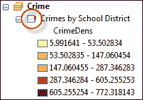
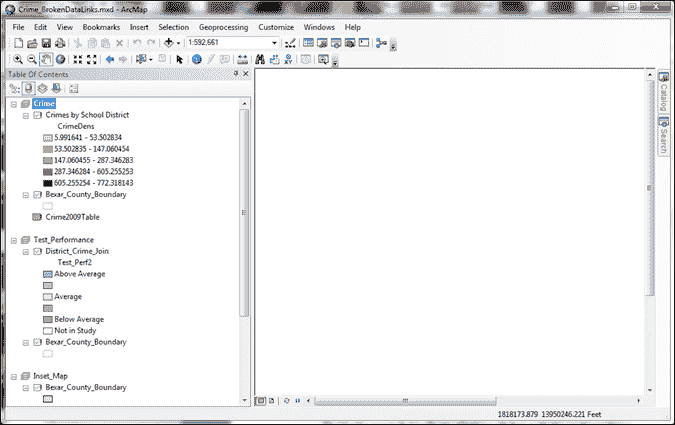
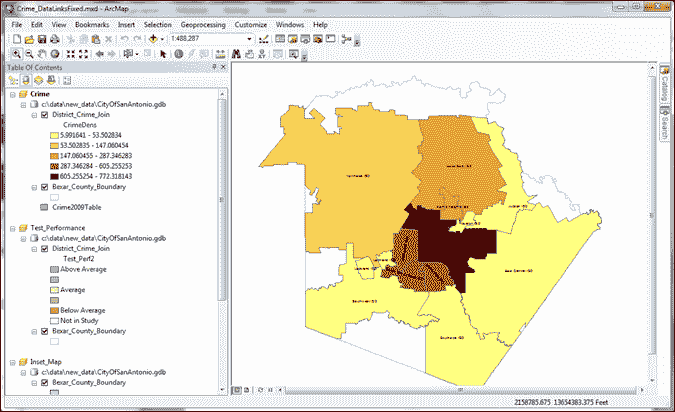
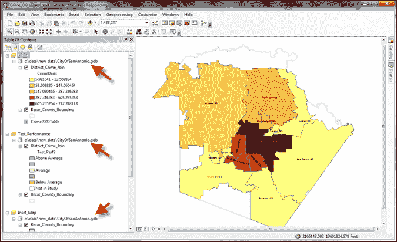
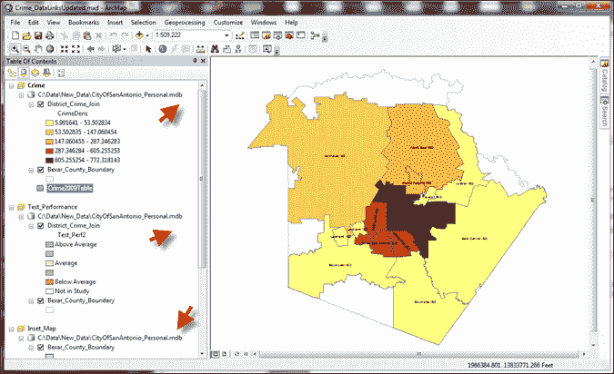
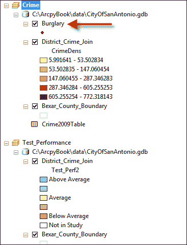
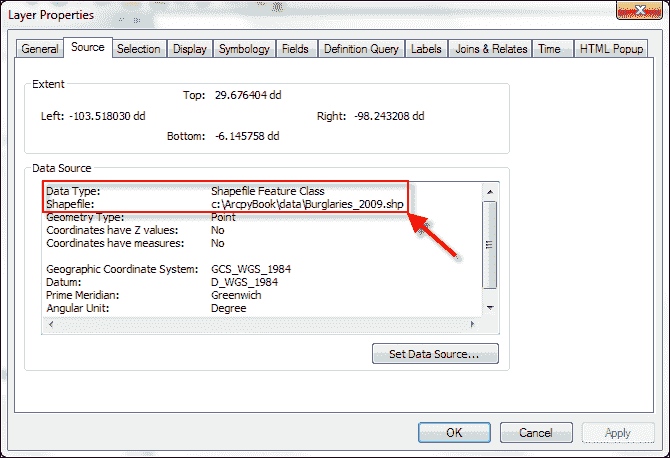
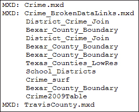

# 第四章：查找和修复损坏的数据链接

在本章中，我们将介绍以下菜谱：

+   在您的地图文档和图层文件中查找损坏的数据源

+   使用 MapDocument.findAndReplaceWorkspacePaths()修复损坏的数据源

+   使用 MapDocument.replaceWorkspaces()修复损坏的数据源

+   使用 replaceDataSource()修复单个图层和表格对象

+   在文件夹中的所有地图文档中查找所有损坏的数据源

# 简介

您的 GIS 数据源移动、迁移到新的数据格式或被删除的情况并不少见。结果可能导致许多地图文档或图层文件中的数据源损坏。这些损坏的数据源在修复之前无法使用，如果需要在多个地图文档中进行相同的更改，这可能是一个令人难以承受的过程。您可以使用`arcpy.mapping`自动化查找和修复这些数据源的过程，而无需打开受影响的地图文档。查找损坏的数据源是一个简单的过程，需要使用`ListBrokenDataSources()`函数，该函数返回一个包含地图文档或图层文件中所有损坏数据源的 Python 列表。通常，此函数用作脚本中的第一步，该脚本遍历列表并修复数据源。可以在单个数据层或公共工作空间中的所有图层上执行修复损坏数据源的操作。

# 在您的地图文档和图层文件中查找损坏的数据源

损坏的数据源是地图文档文件中非常常见的问题。您可以使用`arcpy.mapping`来识别已移动、已删除或更改格式的数据源。

## 准备工作

在 ArcMap 中，损坏的数据连接由图层名称前的红色感叹号表示。以下截图展示了这一点。`arcpy.mapping`中的`ListBrokenDataSources()`函数返回来自地图文档或图层文件的具有损坏数据连接的图层对象列表：



## 如何操作…

按以下步骤操作，了解如何在地图文档文件中查找损坏的数据源。

1.  在 ArcMap 中打开`C:\ArcpyBook\Ch4\Crime_BrokenDataLinks.mxd`。

    您将看到每个数据源都已损坏。在这种情况下，数据已移动到另一个文件夹，但如果数据已被删除或迁移到不同的格式，您也会看到相同的指示器。例如，将数据从个人地理数据库转换为文件地理数据库的情况并不少见：

    

1.  关闭 ArcMap。

1.  打开 IDLE 并创建一个新的脚本窗口。

1.  导入`arcpy.mapping`模块：

    ```py
    import arcpy.mapping as mapping
    ```

1.  引用`Crime_BrokenDataLinks.mxd`地图文档文件：

    ```py
    mxd = mapping.MapDocument(r"c:\ArcpyBook\Ch4\Crime_BrokenDataLinks.mxd")
    ```

1.  获取损坏数据源的列表：

    ```py
    lstBrokenDS = mapping.ListBrokenDataSources(mxd)
    ```

1.  遍历列表并打印出图层名称：

    ```py
    for layer in lstBrokenDS:
        print layer.name
    ```

    输出将按以下方式打印：

    ```py
    District_Crime_Join
    Bexar_County_Boundary
    District_Crime_Join
    Bexar_County_Boundary
    Bexar_County_Boundary
    Texas_Counties_LowRes
    School_Districts
    Crime_surf
    Bexar_County_Boundary
    Crime2009Table
    ```

1.  将您的脚本保存为`FindFixBrokenData.py`，保存在`c:\ArcpyBook\Ch4`文件夹中。

## 它是如何工作的…

`ListBrokenDataSources()`函数返回一个包含具有损坏数据源的图层的 Python 列表。然后我们使用一个`for`循环来遍历这个列表并对每个图层执行某种操作。在这种情况下，我们简单地打印出图层名称，只是为了说明该函数返回的数据。在后面的食谱中，我们将在此基础上构建代码，修复这些损坏的数据源。

## 更多内容...

除了从一个地图文档文件中返回一个损坏的数据源列表之外，`ListBrokenDataSources()`函数还可以在图层文件（`.lyr`）中找到损坏的数据源。只需传入图层文件的路径，让函数检查文件中的损坏数据源。请注意，使用`Map`或`Layer`包时不需要这些函数，因为这些数据与这些文件捆绑在一起，而图层文件则不同。

# 使用 MapDocument.findAndReplaceWorkspacePaths()修复损坏的数据源

`MapDocument.findAndReplaceWorkspacePaths()`方法用于在地图文档中的所有图层和表格上执行全局查找和替换工作区路径。您还可以一次性替换多个工作区类型的路径。

## 准备工作

在检查用于修复数据集的方法之前，我们需要介绍一些定义。您将在讨论用于修复损坏数据源的方法时经常看到这些术语，因此您需要理解它们在这个上下文中的含义。**工作区**只是一个数据容器。这可以是文件夹（在形状文件的情况下），个人地理数据库，文件地理数据库或 ArcSDE 连接。**工作区路径**是**工作区**的系统路径。在文件地理数据库的情况下，这包括**地理数据库**的名称。数据集是工作区内的一个要素类或表格，最后，数据源是工作区和数据集的组合。不要将数据集与要素数据集混淆。前者是一个通用的数据术语，而后者是地理数据库中的一个对象，它作为要素类和其他数据集的容器。

在修复损坏的数据源中涉及三个`acpy.mapping`类。它们是`MapDocument`、`Layer`和`TableView`。每个类都包含可以用来修复数据源的方法。在本食谱中，我们将探讨如何使用`MapDocument`类中的`findAndReplaceWorkspacePaths()`方法在地图文档中的图层和表格上执行全局查找和替换操作。

## 如何操作...

按以下步骤学习如何使用`findAndReplaceWorkspacePaths()`修复地图文档中的图层和表格：

1.  在 ArcMap 中打开`c:\ArcpyBook\Ch4\Crime_BrokenDataLinks.mxd`。

1.  右键单击任何图层并选择**属性**。

1.  切换到**源**选项卡，您会注意到图层的位置引用为`C:\ArcpyBook\Ch4\Data\OldData\CityOfSanAntonio.gdb`。这是一个文件地理数据库，但位置已不再存在；它已移动到`C:\ArcpyBook\data`文件夹。

1.  打开 IDLE 并创建一个新的脚本窗口。

1.  导入 `arcpy.mapping` 模块：

    ```py
    import arcpy.mapping as mapping
    ```

1.  引用 `Crime_BrokenDataLinks.mxd` 地图文档文件：

    ```py
    mxd = mapping.MapDocument(r"c:\ArcpyBook\Ch4\Crime_BrokenDataLinks.mxd")
    ```

1.  使用 `MapDocument.findAndReplaceWorkspacePaths()` 修复地图文档中每个数据源的资源路径：

    ```py
    mxd.findAndReplaceWorkspacePaths(r"C:\ArcpyBook\Ch4\Data\OldData\CityOfSanAntonio.gdb", r"C:\ArcpyBook\Data\CityOfSanAntonio.gdb")
    ```

1.  将结果保存到新的 `.mxd` 文件中：

    ```py
    mxd.saveACopy(r"C:\ArcpyBook\Ch4\Crime_DataLinksFixed.mxd")
    ```

1.  将脚本保存为 `C:\ArcpyBook\Ch4\MapDocumentFindReplace.py`。

1.  运行脚本。

1.  在 ArcMap 中打开 `C:\ArcpyBook\Ch4\Crime_DataLinksFixed.mxd` 文件。您将注意到所有数据源都得到了修复，如下面的截图所示：

## 它是如何工作的…

`MapDocument.findAndReplaceWorkspacePaths()` 方法用于在地图文档中对所有图层和表格中的工作空间路径进行全局查找和替换。您可以一次性替换多个工作空间类型的路径。

## 更多内容…

`Layer` 和 `TableView` 对象也具有 `findAndReplaceWorkspacePaths()` 方法，该方法执行相同类型的操作。区别在于，在 `Layer` 和 `TableView` 对象上使用此方法是为了修复单个损坏的数据源，而不是在地图文档中全局查找和替换所有损坏的数据源。

# 使用 `MapDocument.replaceWorkspaces()` 修复损坏的数据源

在正常的 GIS 操作过程中，将数据从一个文件类型迁移到另一个文件类型是一种相当常见的做法。例如，许多组织将数据从较旧的个人地理数据库格式迁移到新的文件地理数据库类型，甚至可能是企业 ArcSDE 地理数据库。您可以使用 `MapDocument.replaceWorkspaces()` 自动化将您的数据集更新到不同格式的过程。

## 准备工作

`MapDocument.replaceWorkspaces()` 与 `MapDocument.findAndReplaceWorkspacePaths()` 类似，但它还允许您从一个工作空间类型切换到另一个类型。例如，您可以从文件地理数据库切换到个人地理数据库。然而，它一次只能处理一个工作空间。在本例中，我们将使用 `MapDocument.replaceWorkspaces()` 将数据源从文件地理数据库切换到个人地理数据库。

## 如何操作…

按照以下步骤学习如何使用 `MapDocument.replaceWorkspaces()` 修复损坏的数据源：

1.  在 ArcMap 中打开 `c:\ArcpyBook\Ch4\Crime_DataLinksFixed.mxd`。

1.  注意，所有图层和表格都是从名为 `CityOfSanAntonio.gdb` 的文件地理数据库中加载的，如下面的截图所示：

1.  在 IDLE 中打开并创建一个新的脚本窗口。

1.  导入 `arcpy.mapping` 模块：

    ```py
    import arcpy.mapping as mapping
    ```

1.  引用 `Crime_BrokenDataLinks.mxd` 地图文档文件：

    ```py
    mxd = mapping.MapDocument(r"c:\ArcpyBook\Ch4\Crime_BrokenDataLinks.mxd.mxd")
    ```

1.  调用 `replaceWorkspaces()`，传递对旧地理数据库类型的引用以及新地理数据库类型的引用：

    ```py
    mxd.replaceWorkspaces(r"c:\ArcpyBook\data\CityOfSanAntonio.gdb", "FILEGDB_WORKSPACE",r"c:\ArcpyBook\new_data\CityOfSanAntonio_Personal.mdb","ACCESS_WORKSPACE")
    ```

1.  保存地图文档文件的副本。

    ```py
    mxd.saveACopy(r"c:\ArcpyBook\Ch4\Crime_DataLinksUpdated.mxd")
    ```

1.  将脚本保存为 `c:\ArcpyBook\Ch4\MapDocumentReplaceWorkspace.py`。

1.  运行脚本。

1.  在 ArcMap 中打开 `c:\ArcpyBook\Ch4\Crime_DataLinksUpdated.mxd` 文件。如下面的截图所示，所有数据源现在都引用了个人地理数据库（注意 `.mdb` 扩展名）：

## 它是如何工作的…

`MapDocument.replaceWorkspaces()` 方法接受多个参数，包括旧的和新的工作空间路径以及旧的和新的工作空间类型。工作空间的路径是自解释的，但关于工作空间类型的讨论可能会有所帮助。工作空间类型作为字符串关键字传递给该方法。在这种情况下，旧的工作空间类型是文件地理数据库，因此其关键字是 `FILEGDB_WORKSPACE`。新的工作空间类型是 `ACCESS_WORKSPACE`，这表示个人地理数据库。个人地理数据库存储在 Microsoft Access 文件中。有多种不同类型的工作空间可以存储 GIS 数据。请确保您提供适合您数据集的工作空间类型。以下是一个有效工作空间类型的列表（许多人仍在使用 shapefile，因此在这种情况下，工作空间类型将是 `SHAPEFILE_WORKSPACE`）：

+   `ACCESS_WORKSPACE`：个人地理数据库或 Access 工作空间

+   `ARCINFO_WORKSPACE`：ArcInfo 覆盖工作空间

+   `CAD_WORKSPACE`：CAD 文件工作空间

+   `EXCEL_WORKSPACE`：Excel 文件工作空间

+   `FILEGDB_WORKSPACE`：文件地理数据库工作空间

+   `NONE`：用于跳过参数

+   `OLEDB_WORKSPACE`：OLE 数据库工作空间

+   `PCCOVERAGE_WORKSPACE`：PC ARC/INFO 覆盖工作空间

+   `RASTER_WORKSPACE`：栅格工作空间

+   `SDE_WORKSPACE`：SDE 地理数据库工作空间

+   `SHAPEFILE_WORKSPACE`：shapefile 工作空间

+   `TEXT_WORKSPACE`：文本文件工作空间

+   `TIN_WORKSPACE`：TIN 工作空间

+   `VPF_WORKSPACE`：VPF 工作空间

# 使用 `replaceDataSource()` 修复单个 Layer 和 Table 对象

本章前面的食谱使用了 `MapDocument` 对象的各种方法来修复损坏的数据链接。`Layer` 和 `Table` 对象也有方法可以用来在单个对象级别修复损坏的数据链接，而不是在地图文档文件中的所有数据集中工作。

## 准备工作

`Layer` 和 `TableView` 类都有 `replaceDataSource()` 方法。此方法可以用来更改单个图层或表的 工作空间路径、工作空间类型和/或数据集名称。在本食谱中，您将编写一个脚本，更改单个图层的工作空间路径和工作空间类型。`replaceDataSource()` 方法对 `Layer` 和 `TableView` 类都是可用的。对于图层，它可以在地图文档或图层文件中。对于表，它只能指向地图文档，因为 `Table` 对象不能包含在图层文件中。

## 如何操作…

按照以下步骤学习如何使用 `replaceDataSource()` 方法在地图文档中修复单个 `Layer` 和 `Table` 对象：

1.  在 ArcMap 中打开 `c:\ArcpyBook\Ch4\Crime_DataLinksLayer.mxd`。**犯罪** 数据帧包含一个名为 **Burglary** 的图层，它是 `CityOfSanAntonio` 文件地理数据库中的一个要素类。您将用包含相同数据的 shapefile 图层替换此要素类：

1.  打开 IDLE 并创建一个新的脚本窗口。

1.  导入 `arcpy.mapping` 模块：

    ```py
    import arcpy.mapping as mapping
    ```

1.  引用 `Crime_BrokenDataLinks.mxd` 地图文档文件：

    ```py
    mxd = mapping.MapDocument(r"c:\ArcpyBook\Ch4\ Crime_DataLinksUpdated.mxd")
    ```

1.  获取 `Crime` 数据框的引用：

    ```py
    df = mapping.ListDataFrames(mxd,"Crime")[0]
    ```

1.  查找 `Burglary` 层并将其存储在一个变量中：

    ```py
    lyr = mapping.ListLayers(mxd,"Burglary",df)[0]
    ```

1.  在 `Layer` 对象上调用 `replaceDataSource()` 方法，并传入 shapefile 的路径、一个表示这将是一个 shapefile 工作区的关键词以及 shapefile 的名称：

    ```py
    lyr.replaceDataSource(r"c:\ArcpyBook\data","SHAPEFILE_WORKSPACE","Burglaries_2009")
    ```

1.  将结果保存到新的地图文档文件中。

    ```py
    mxd.saveACopy(r"c:\ArcpyBook\Ch4\Crime_DataLinksNewLayer.mxd")
    ```

1.  将脚本保存为 `c:\ArcpyBook\Ch4\LayerReplaceDataSource.py`。

1.  运行脚本。

1.  在 ArcMap 中打开 `C:\ArcpyBook\Ch4\Crime_DataLinksNewLayer.mxd`。你应该看到 **Burglary** 层现在引用了一个新的工作区：

1.  右键单击 **Burglary** 层并选择 **属性**。

1.  点击 **源** 选项卡并注意新的工作区、工作区类型和数据集名称：

## 它是如何工作的…

`replaceDataSource()` 方法接受两个必需参数和两个可选参数。前两个参数定义了用作替换的层的 workspace 路径和工作区类型。第三个参数 `dataset_name` 是一个可选参数，它定义了用作替换层的数据集名称。此名称需要完全匹配。例如，在这个菜谱中，我们传递了一个 `dataset_name` 属性 `Burglaries_2009`，这是现在将用作数据框中替换层的 shapefile 名称。如果没有提供名称，该方法将尝试通过查找与当前层的 dataset 属性同名的表来替换数据集。最后一个可选参数是 `validate`。默认情况下，此值设置为 `true`。当设置为 `true` 时，只有当 `workspace_path` 值是一个有效的工作区时，工作区才会被更新。如果不是有效的工作区，则工作区不会被替换。如果设置为 `false`，则方法将设置源以匹配 `workspace_path`，无论它是否是有效的匹配。这可能会导致损坏的数据源，但在创建或修改地图文档以准备尚未存在的数据时可能很有用。

## 还有更多…

`Layer` 和 `TableView` 类还包含一个 `findAndReplaceWorkspacePath()` 方法。此方法与 `MapDocument.findAndReplaceWorkspacePaths()` 方法非常相似。唯一的区别是它针对单个 `Layer` 或 `TableView` 类，而不是迭代整个地图文档或层文件。

# 在文件夹中查找所有地图文档中的所有损坏的数据源

在许多组织中，一个常见的场景涉及数据从一个工作区移动到另一个工作区，或者从一个工作区类型移动到另一个工作区类型。当这种情况发生时，任何引用这些数据源的地图文档或图层都会损坏。如果手动执行，找到每个这些数据源可能是一项巨大的任务。幸运的是，你可以创建一个地理处理脚本，该脚本将找到文件夹或文件夹列表中的所有损坏的数据源。

## 准备工作

在这个菜谱中，你将学习如何递归搜索目录中的地图文档文件，找到这些地图文档中的任何损坏的数据源，并将损坏的数据层名称写入文件。

## 如何操作...

按照以下步骤学习如何在文件夹中找到所有损坏的数据源：

1.  打开 IDLE 并创建一个新的脚本窗口。

1.  导入`arcpy`和`os`包：

    ```py
    import arcpy.mapping as mapping, os
    ```

1.  定义一个你想要开始搜索的路径。在这种情况下，我们将从`C:`目录开始搜索，然后递归搜索`C:`驱动器内的所有目录。你可能想要定义一个更具体的路径：

    ```py
    path = r"C:"
    ```

1.  打开一个文件，你将用它来写入损坏的图层名称：

    ```py
    f = open('BrokenDataList.txt','w')
    ```

1.  使用`os.walk()`方法和`for`循环遍历目录树：

    ```py
    for root,dirs,files in os.walk(path):
    ```

1.  在`for`循环内部，创建一个第二个`for`循环，遍历所有返回的文件。对于每个文件，使用`os.path.splitext()`方法获取基本文件名以及扩展名：

    ```py
    for filename in files:
        basename, extension = os.path.splitext(filename)
    ```

1.  测试文件扩展名以查看它是否是地图文档文件。如果是，获取地图文档文件的完整路径，使用路径创建一个新的地图文档对象实例，写入地图文档名称，遍历每个损坏的数据源，并将其写入文件：

    ```py
    if extension == ".mxd":
        fullPath = os.path.join(path,filename)
        mxd = mapping.MapDocument(fullPath)
        f.write("MXD: " + filename + "\n")
        brknList = mapping.ListBrokenDataSources(mxd)
        for brknItem in brknList:
            f.write("\t" + brknItem.name + "\n")
    ```

1.  关闭文件：

    ```py
    f.close()
    ```

1.  整个脚本应如下所示：

    ```py
    import arcpy.mapping as mapping, os
    path = r"C:"
    f = open('filename_here.txt','w')
    for root,dirs,files in os.walk(path):
        for filename in files:
            basename, extension = os.path.splitext(filename)
            if extension == ".mxd":
                fullPath = os.path.join(path,filename)
                mxd = mapping.MapDocument(fullPath)
                f.write("MXD: " + filename + "\n")
                brknList = mapping.ListBrokenDataSources(mxd)
                for brknItem in brknList:
                    f.write("\t" + brknItem.name + "\n")
    f.close()
    ```

1.  运行脚本以生成文件。

1.  打开文件以查看结果。你的输出将取决于你定义的路径。以下截图显示了我的输出文件：

## 它是如何工作的...

此脚本结合了 Python `os` 包和 `arcpy.mapping` 包中的方法。`os.walk()` 方法遍历目录树，并返回从您定义的根目录（`c:` 目录）开始的路径、目录列表和文件列表。这个根目录可以是任何目录。`os.walk()` 方法返回一个包含三个元素的元组，分别是根目录、目录列表和文件列表。然后我们遍历这个文件列表，并使用 `os.path.splitext()` 方法将每个文件拆分为基本文件名和文件扩展名。扩展名被测试以查看它是否与字符串 `.mxd` 匹配，这表示地图文档文件。被识别为地图文档的文件将它们的文件名写入文本文件，并创建一个新的 `MapDocument` 对象实例。然后使用 `ListBrokenDataSources()` 方法与地图文档的引用一起生成文件内的损坏数据源列表，并将这些损坏数据源也写入文件中。
