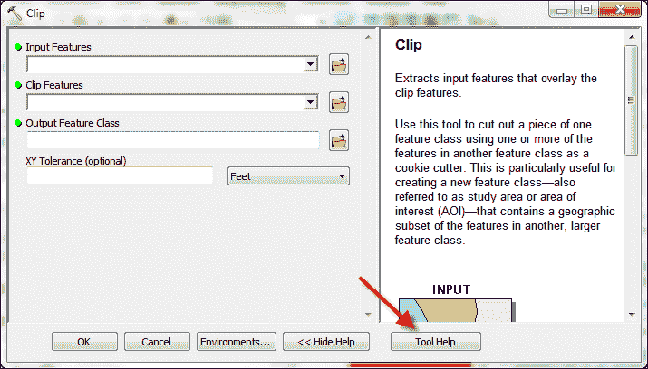
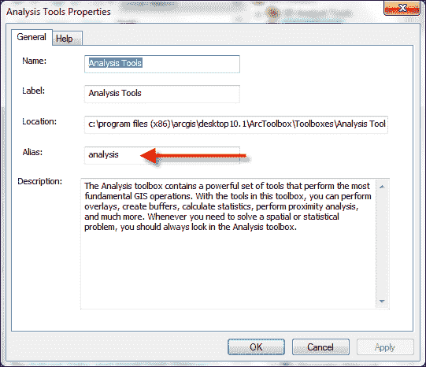
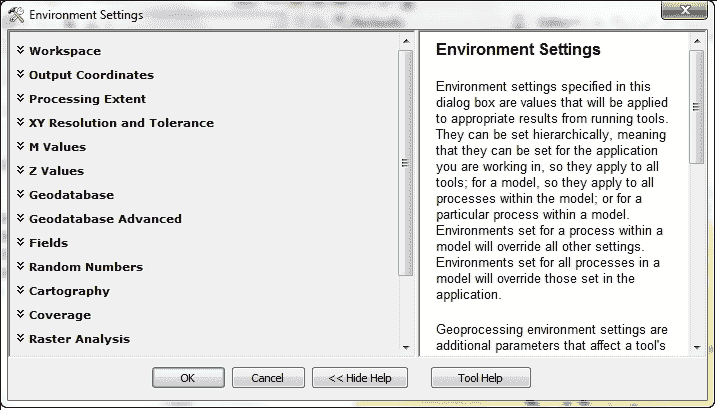

# 第六章。从脚本中执行地理处理工具

在本章中，我们将涵盖以下食谱：

+   查找地理处理工具

+   获取工具箱别名

+   从脚本中执行地理处理工具

+   将工具的输出用作另一个工具的输入

+   设置环境变量

# 简介

ArcGIS Desktop 包含超过 800 个地理处理工具，这些工具可用于您的 Python 脚本。在本章中，您将学习如何在脚本中使用这些工具。每个工具都有其独特的特性。执行每个工具的语法将根据需要成功执行工具所需的输入类型而有所不同。我们将探讨如何使用 ArcGIS Desktop 帮助系统确定任何工具的输入参数。工具的执行将导致创建一个或多个输出数据集以及工具运行期间生成的消息集。我们将探讨如何使用这些消息。最后，我们将探讨如何获取和设置脚本的环境变量。

# 查找地理处理工具

在您的地理处理脚本中使用工具之前，您需要确保您有权访问该工具，这取决于您正在运行的 ArcGIS Desktop 当前许可级别或您的最终用户将运行的许可级别。此信息包含在 ArcGIS Desktop 帮助系统中。

## 准备工作

您的脚本中地理处理工具的可用性取决于您使用的 ArcGIS 许可级别。在 ArcGIS Desktop 的 10.1 版本中，有三个许可级别，分别是 **基本**、**标准**和**高级**。这些以前分别被称为 **ArcView**、**ArcEditor**和**ArcInfo**。了解您在脚本中想要使用的工具所需的许可级别非常重要。此外，在 ArcGIS Desktop 中使用扩展可能会导致您的脚本可用更多工具。在 ArcGIS Desktop 中查找工具主要有两种方法。第一种是使用搜索窗口，第二种是简单地浏览 ArcToolbox 的内容。在本食谱中，您将学习如何使用搜索窗口查找可用于您脚本的可用地理处理工具。

## 如何操作…

1.  在 ArcMap 中打开 `C:\ArcpyBook\Ch6\Crime_Ch6.mxd`。

1.  从 **地理处理** 菜单项中选择 **搜索工具**。这将显示 **搜索** 窗口，如下面的截图所示。默认情况下，您将搜索 **工具**：

1.  在搜索文本框中输入术语`Clip`。当您开始输入此词时，**搜索**文本框将自动根据您输入的前几个字母过滤结果。您会注意到对于单词`Clip`，有三个可能的工具：`clip(analysis)`、`clip(coverage)`、`clip(data_management)`。在许多情况下，存在几个具有相同名称的地理处理工具。为了唯一地定义一个工具，工具箱别名附加到工具名称上。我们将在下一个菜谱中更详细地检查工具箱别名。

1.  现在，点击**搜索**按钮以生成匹配工具的列表。搜索应生成一个类似于以下截图的列表。工具在搜索结果中以锤子图标表示。您还会在搜索结果中看到几个其他图标。滚动图标表示 Python 脚本，而包含多色方块的图标表示模型：

1.  选择**Clip (Analysis)**工具。这将打开**Clip (Analysis)**工具的对话框。这对您作为脚本程序员来说并不那么有用。您可能对特定工具的 ArcGIS Desktop 帮助更感兴趣。

1.  点击工具对话框底部的**工具帮助**按钮以显示有关此特定工具的详细信息：

1.  滚动到**Clip**工具的帮助页面底部，以检查此特定工具的语法。

## 它是如何工作的…

帮助系统包含每个工具的摘要、插图、用法、语法、代码示例、可用环境变量、相关主题和许可信息。作为一个地理处理脚本程序员，您主要会对语法、代码示例和许可信息部分感兴趣，这些部分位于页面底部。

### 注意

您应该始终检查每个工具的帮助文档底部的许可信息部分，以确保您拥有适当的许可级别来使用该工具。

语法部分包含了关于如何从您的 Python 脚本中调用此工具的信息，包括工具的名称和所需的以及可选的输入参数。所有参数都将包含在括号内。`Clip`工具所需的参数是`in_features`、`clip_features`和`out_feature_class`。当您从脚本中调用此工具时，您需要提供这些参数以便工具能够正确执行。第四个参数是一个可选参数，称为`cluster_tolerance`。在语法中标有可选的参数被大括号包围。以下截图提供了一个被大括号包围的可选参数的示例。这并不意味着您在调用工具时将参数包围在大括号内。它仅位于帮助部分，以表明当从地理处理脚本中调用时此参数是可选的：


# 获取工具箱别名

所有工具箱都有一个别名，当与工具名称结合时，为 ArcGIS Desktop 中的任何工具提供了一个唯一的引用。这个别名是必要的，因为许多工具具有相同的名称。当从您的 Python 脚本引用工具时，需要同时引用工具名称和工具别名。

## 准备工作

在上一个菜谱中，我们探讨了 **Clip** 工具。实际上有三个 **Clip** 工具可以在 **Analysis, Coverage** 和 **Data Management** 工具箱中找到。每个 **Clip** 工具执行不同的功能。例如，**Analysis** 工具箱中的 **Clip** 工具使用输入要素裁剪矢量要素类，而 **Data Management** 工具箱中的 **Clip** 工具用于创建栅格的空间子集。由于可能存在具有相同名称的多个工具，我们可以通过提供工具名称和工具所在工具箱的别名来唯一地识别特定工具。在这个菜谱中，您将学习如何查找工具箱的别名。

## 如何操作…

1.  在 ArcMap 中打开 `C:\ArcpyBook\Ch6\Crime_Ch6.mxd`。

1.  如果需要，打开 **ArcToolbox**。

1.  查找如图所示的 **Analysis Tools** 工具箱：

1.  右键单击 **Analysis Tools** 工具箱并选择 **Properties**。这将显示如图所示的 **Analysis Tools Properties** 对话框。**Alias** 文本框将包含别名：

## 工作原理…

您可以遵循以下过程来查找任何工具箱的别名。在 Python 脚本中，您可以通过使用 `<toolname>_<toolbox alias>` 语法来执行工具。例如，如果您正在调用 **Buffer** 工具，它将是 `buffer_analysis`。工具箱别名总是简单的。它们通常是单个单词，不包含破折号或特殊字符。在下一个菜谱中，我们将创建一个简单的脚本，用于按照此格式执行工具。

# 从脚本中执行地理处理工具

一旦您确定了工具箱别名并验证了基于您当前许可级别的工具可访问性，您就可以将工具的执行添加到脚本中。

## 准备工作

现在您已经了解了如何查找可用的工具以及如何唯一引用它们，下一步是将这些组合起来并从地理处理脚本中执行工具。在这个菜谱中，您可以从您的脚本中执行工具。

## 如何操作…

1.  在 ArcMap 中打开 `C:\ArcpyBook\Ch6\Crime_Ch6.mxd`。

1.  点击 **Add Data** 按钮，并将 `EdgewoodSD.shp` 文件添加到目录表中。

1.  关闭**按学区划分的犯罪密度**和**2009 年盗窃事件**图层，以便更好地查看**EdgewoodSD**图层。此文件中只有一个多边形要素。它代表 Edgewood 学区。现在我们将编写一个脚本，将**2009 年盗窃事件**要素裁剪到这个学区。

1.  在 ArcMap 中打开 Python 窗口。

1.  导入`arcpy`模块：

    ```py
    import arcpy
    ```

1.  创建一个变量来引用要裁剪的输入要素类：

    ```py
    in_features = "c:/ArcpyBook/data/CityOfSanAntonio.gdb/Burglary"
    ```

1.  创建一个变量来引用用于裁剪的图层：

    ```py
    clip_features = "c:/ArcpyBook/Ch6/EdgewoodSD.shp"
    ```

1.  创建一个变量来引用输出要素类：

    ```py
    out_feature_class = "c:/ArcpyBook/Ch6/ClpBurglary.shp"
    ```

1.  从**分析工具**工具箱中执行`Clip`工具：

    ```py
    arcpy.Clip_analysis(in_features,clip_features,out_feature_class)
    ```

1.  运行脚本。包含仅限于 Edgewood 学区内的那些盗窃点的输出要素类应添加到数据框中，如下截图所示：

## 它是如何工作的…

在本食谱中，我们感兴趣的代码的主要行是执行`Clip`工具的最后一条线。注意，我们通过指定`Clip_analysis`的语法来调用此工具，这为我们提供了对**分析工具**工具箱中`Clip`工具的引用，该工具的别名为`analysis`。我们还传递了三个参数，分别引用输入要素类、裁剪要素类和输出要素类。我应该指出，我们硬编码了每个数据集的路径。这不是一个好的编程实践，但在这个特定的例子中，我只是想说明如何执行工具。未来的章节将说明如何从您的脚本中删除硬编码，并使它们更加灵活。

您使用的多数工具将需要数据源路径。此路径必须与 ArcCatalog **位置**工具栏上报告的路径相同，如下截图所示：


工具使用 ArcCatalog 通过 ArcCatalog 路径查找地理数据。此路径是一个字符串，并且对每个数据集都是唯一的。路径可以包括文件夹位置、数据库连接或 URL。因此，在尝试针对数据编写 Python 脚本之前，使用 ArcCatalog 检查路径是很重要的。ArcSDE 路径需要特别注意。许多 ArcSDE 用户没有标准化的连接名称，这可能在运行模型或脚本时引起问题。

## 还有更多…

地理处理工具以两种方式组织。您可以通过`arcpy`上的函数访问工具，也可以作为与工具箱别名匹配的模块访问。在第一种情况下，当工具可以通过`arcpy`作为函数访问时，它们将以您在本食谱中遵循的格式调用。工具名称后跟一个下划线，然后是工具箱别名。在第二种形式中，工具作为模块的函数调用，该模块的名称是工具箱别名。在这里，`analysis`是工具箱别名，因此它成为一个模块。`Clip`是该模块的函数，其调用方式如下：

```py
arcpy.analysis.Clip (in_features,clip_features,out_feature_class)
```

你使用哪种方法完全是个人喜好问题。它们都完成了相同的事情，即执行地理处理工具。

# 将工具的输出用作另一个工具的输入

在许多情况下，你需要将一个工具的输出用作另一个工具的输入。这被称为工具链。工具链的一个例子可能涉及缓冲河流图层，然后找到所有位于缓冲区内的住宅物业。在这种情况下，`Buffer`工具将输出一个新图层，然后该图层将被用作`Select by Location`工具或其他叠加工具的输入。在这个菜谱中，你将学习如何获取工具的输出并将其用作另一个工具的输入。

## 准备工作

`Buffer`工具使用指定的距离从一个输入要素类创建输出要素类。这个输出要素类可以存储在一个变量中，然后可以将其用作另一个工具的输入，例如`Select Layer by Location`工具。在这个菜谱中，你将学习如何将`Buffer`工具的输出用作`Select Layer by Location`工具的输入，以找到所有位于河流半英里范围内的学校。

## 如何操作...

按照以下步骤学习如何在 ArcMap 中访问当前活动的地图文档：

1.  使用新的地图文档文件（`.mxd`）打开 ArcMap。

1.  点击**添加数据**按钮并将`Streams`和`Schools`要素类从`c:\ArcpyBook\data\TravisCounty`添加进来。

1.  点击 Python 窗口按钮。

1.  导入`arcpy`模块：

    ```py
    import arcpy
    ```

1.  设置工作空间：

    ```py
    arcpy.env.workspace = "c:/ArcpyBook/data/TravisCounty"
    ```

1.  开始一个`try`语句并添加用于河流、缓冲河流图层、距离和学校的变量：

    ```py
    try:
      # Buffer areas of impact around major roads
      streams = "Streams.shp"
      streamsBuffer = "StreamsBuffer.shp"
      distance = "2640 Feet"
      schools2mile = "Schools.shp"
    ```

1.  调用`Buffer`工具并传入河流图层、缓冲河流图层、距离以及控制缓冲区外观的几个变量：

    ```py
    arcpy.Buffer_analysis(streams, streamsBuffer, distance,'FULL','ROUND','ALL')
    ```

1.  使用`Make Feature Layer`工具为学校创建一个临时图层：

    ```py
    arcpy.MakeFeatureLayer_management(schools2mile, 'Schools2Mile_lyr')
    ```

1.  使用`Select Layer by Location`工具选择所有位于河流半英里范围内的学校：

    ```py
    arcpy.SelectLayerByLocation_management('Schools2Mile_lyr', 'intersect', streamsBuffer)
    ```

1.  添加`except`块以捕获任何错误：

    ```py
    except:
      print 'Error in script'
    ```

1.  整个脚本应如下所示：

    ```py
    import arcpy
    arcpy.env.workspace = "c:/ArcpyBook/data/TravisCounty"
    try:
      # Buffer areas of impact around major roads
      streams = "Streams.shp"
      streamsBuffer = "StreamsBuffer.shp"
      distance = "2640 Feet"
      schools2mile = "Schools.shp"

      arcpy.Buffer_analysis(streams, streamsBuffer, distance,'FULL','ROUND','ALL')

      # Make a layer
      arcpy.MakeFeatureLayer_management(schools2mile, 'Schools2Mile_lyr') 
      arcpy.SelectLayerByLocation_management('Schools2Mile_lyr', 'intersect', streamsBuffer)
    except:
      print 'Error in script'
    ```

## 它是如何工作的...

`Buffer`工具创建一个输出要素类，我们将其命名为`StreamsBuffer.shp`并存储在一个名为`streamsBuffer`的变量中。然后，这个`streamsBuffer`变量被用作`Select Layer by Location`工具的输入，作为传递给函数的第三个参数。使用一个工具的输出只需要创建一个变量来保存输出数据，然后它可以在其他工具中按需重复使用。

# 设置环境变量和检查工具消息

环境变量提供可以设置的附加参数，这些参数作为全局变量在各个级别（包括您的脚本）中可访问。您的脚本可以获取环境变量的值以及设置值。您需要了解可供您的脚本使用的环境变量以及如何访问它们。此外，工具在执行过程中会生成消息。这些消息有多种类型。

## 准备工作

环境设置是在执行期间可供您的脚本使用的附加参数。这些是在 ArcGIS 桌面应用程序级别使用单独的对话框设置的值，该对话框通过“地理处理 - 环境”菜单项访问，并按类别组织：



这些设置与您可以在操作系统级别设置的类似的环境变量设置非常相似，但它们是针对 ArcGIS 地理处理框架的特定设置。这些应用程序级别的环境设置是最高级别的，并且在执行任何工具时都会应用所有工具的默认设置。除了应用程序级别的环境设置之外，您还可以在工具级别应用环境设置。工具级别的环境设置直接继承应用程序级别应用的设置。然而，这些设置可以在工具级别被覆盖。工具级别的设置仅适用于当前工具的执行。您的 Python 脚本可以通过 `arcpy` 中的 `env` 类获取和设置环境设置。这些都是读写属性。应用程序和工具级别的设置都会传递到脚本中，并将应用于您从脚本中运行的任何工具。您还可以在脚本内部覆盖任何环境设置，这些设置将在脚本执行期间应用。请注意，与工具一样，仅在脚本级别设置的环境设置仅适用于脚本当前执行。然而，有两种情况下环境设置不会传递到脚本。这包括在 ArcGIS 应用程序之外运行的脚本，例如，当它们从操作系统命令提示符运行时。此外，当脚本调用另一个脚本时，环境设置不会传递。在本食谱中，您将学习如何从您的 Python 脚本中设置环境设置并查看工具在执行期间生成的各种消息。

## 如何操作…

按照以下步骤学习如何在脚本中设置环境设置并生成消息：

1.  创建一个新的 IDLE 脚本，并将其保存为 `c:\ArcpyBook\Ch6\SetEnvVariables.py`。

1.  导入 `arcpy` 模块：

    ```py
    import arcpy
    ```

1.  使用环境变量设置工作空间：

    ```py
    arcpy.env.workspace = "c:/ArcpyBook/Ch6"
    ```

1.  调用 `Buffer` 工具，传入输入数据集 `Streams.shp`，输出数据集 `Streams_Buff.shp`，以及距离 200 英尺。

    ```py
    arcpy.Buffer_analysis("Streams.shp","Streams_Buff,’200 Feet’")
    ```

1.  保存脚本。

## 它是如何工作的…

环境变量可以在应用程序级别和工具级别进行设置。应用程序级别的环境设置类似于全局环境设置；在于它们影响所有工具。另一方面，在工具级别定义的环境设置仅影响工具的当前运行。两者都可以使用 ArcGIS Desktop 进行设置。您的脚本也可以设置环境变量，这些变量仅在脚本执行期间适用。它们类似于在工具级别设置的环境变量。可能，在脚本中最常设置的环境变量是 `env.workspace` 变量，它定义了脚本的当前工作目录。在脚本顶部设置此变量可以使您的代码更加简洁，因为您不必不断引用数据集的完整路径，而只需简单地引用当前工作空间中定义的数据集名称。
