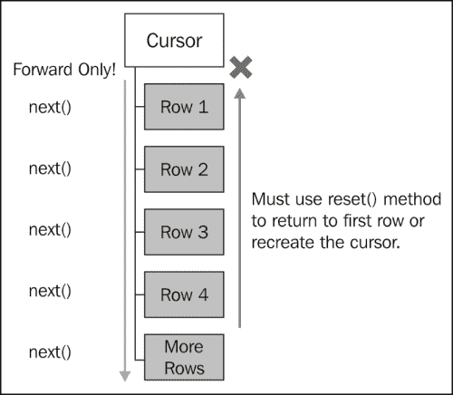
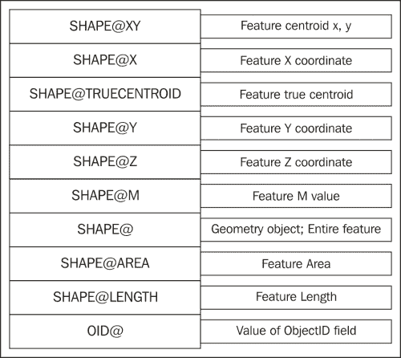
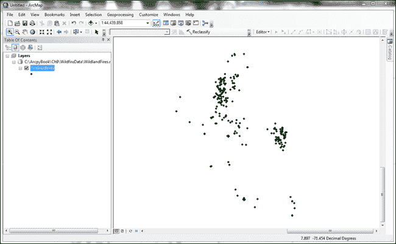
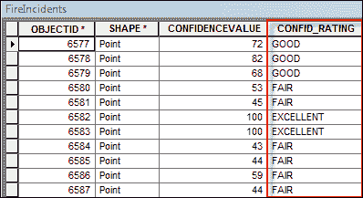
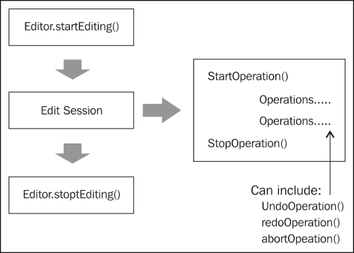
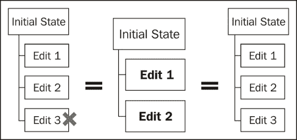

# 第九章：使用 ArcPy 数据访问模块选择、插入和更新地理数据和表

在本章中，我们将介绍以下菜谱：

+   游标对象概述

+   使用 SearchCursor 从要素类中检索特征

+   使用 where 子句过滤记录

+   使用几何标记提高游标性能

+   使用 InsertCursor 插入行

+   使用 UpdateCursor 更新行

+   使用 UpdateCursor 删除行

+   在编辑会话中插入和更新行

+   从要素类中读取几何形状

# 简介

我们将从本章的基本问题开始。什么是游标？**游标**是包含来自表或要素类中的一行或多行数据的内存对象。每一行包含数据源中每个字段的属性，以及每个要素的几何形状。游标允许您从表和要素类中搜索、添加、插入、更新和删除数据。

ArcPy 数据访问模块或 `arcpy.da` 是 ArcGIS 10.1 中新增的，它包含允许您遍历游标中每一行的方法。可以创建各种类型的游标。例如，可以创建搜索游标来读取行中的值。可以创建更新游标来更新行中的值或删除行，也可以创建插入游标来插入新行。

ArcPy 数据访问模块引入了许多游标改进。在 ArcGIS 10.1 之前，游标性能一直很慢。现在，游标的速度显著提高。Esri 估计，搜索游标的速度提高了高达 30 倍，而插入游标的速度提高了高达 12 倍。除了这些一般的性能改进之外，数据访问模块还提供了一些新的选项，允许程序员加快处理速度。现在，您可以选择返回游标中的部分字段，而不是所有字段，这提高了性能，因为需要返回的数据更少。同样适用于几何形状。传统上，在访问要素的几何形状时，会返回整个几何定义。现在，您可以使用几何标记来返回几何形状的一部分，而不是要素的完整几何形状。您还可以使用列表和元组而不是使用行。此外，还有编辑会话以及与版本、域和子类型一起工作的能力。

`arcpy.da` 中有三个游标函数。每个函数返回一个与函数同名的游标对象。`SearchCursor()` 创建一个只读的 `SearchCursor` 对象，包含来自表或要素类的行。`InsertCursor()` 创建一个 `InsertCursor` 对象，可用于向表或要素类中插入新记录。`UpdateCursor()` 返回一个游标对象，可用于编辑或删除表或要素类中的记录。每个游标对象都有访问游标中行的方法。您可以通过以下方式了解游标函数、它们创建的对象以及它们的使用方式：

| 函数 | 创建的对象 | 用途 |
| --- | --- | --- |
| `SearchCursor()` | `SearchCursor` | 从表或要素类中读取数据的只读视图 |
| `InsertCursor()` | `InsertCursor` | 向表或要素类添加行 |
| `UpdateCursor()` | `UpdateCursor` | 在表或要素类中编辑或删除行 |

`SearchCursor()` 函数用于返回一个 `SearchCursor` 对象。此对象只能用于迭代为只读目的返回的一组行。通过此对象不能进行插入、删除或更新操作。可以设置可选的 `where` 子句以限制返回的行。

一旦获取了游标实例，通常会对记录进行迭代，特别是使用 `SearchCursor` 或 `UpdateCursor`。你需要了解一些关于在游标中导航记录的特别之处。游标导航仅向前移动。当创建游标时，游标的指针位于游标中第一行之上。第一次调用 `next()` 将指针移动到第一行。你不仅可以调用 `next()` 方法，还可以使用 `for` 循环来处理每个记录，而无需调用 `next()` 方法。在完成对当前行的任何所需处理之后，后续调用 `next()` 将指针移动到第二行。只要你需要访问额外的行，这个过程就会继续。然而，一旦访问了行，就不能一次回退一个记录。例如，如果当前行是第三行，就不能以编程方式回退到第二行。你只能向前移动。要重新访问第一行和第二行，你需要调用 `reset()` 方法或重新创建游标并遍历对象。正如我提到的，游标通常通过 `for` 循环进行导航。事实上，这是遍历游标的一种更常见的方式，也是编写脚本的一种更有效的方式。游标导航在以下图中说明：



`InsertCursor()` 函数用于创建一个 `InsertCursor` 对象，允许你以编程方式向要素类和表中添加新记录。要插入行，请在此对象上调用 `insertRow()` 方法。你也可以通过 `fields` 属性检索一个只读元组，其中包含游标正在使用的字段名称。对通过游标访问的表或要素类执行锁定。始终以设计脚本的方式释放游标是很重要的。

`UpdateCursor()`函数可以用来创建一个`UpdateCursor`对象，该对象可以更新和删除表或要素类中的行。与`InsertCursor`一样，此函数在编辑或删除数据时会对数据进行锁定。如果游标在 Python 的`with`语句内部使用，锁将在数据处理完毕后自动释放。这并不总是如此。在 ArcGIS 10.1 之前，游标需要使用 Python 的`del`语句手动释放。一旦获取了`UpdateCursor`的实例，您就可以调用`updateCursor()`方法来更新表或要素类中的记录，以及调用`deleteRow()`方法来删除一行。

数据锁的主题需要稍作解释。插入和更新游标必须对其引用的数据源获取锁。这意味着没有其他应用程序可以同时访问此数据源。锁是防止多个用户同时更改数据并因此损坏数据的一种方式。当在您的代码中调用`InsertCursor()`和`UpdateCursor()`方法时，Python 会尝试获取数据的锁。此锁必须在游标完成处理之后特别释放，以便其他运行`ArcMap`或`ArcCatalog`等应用程序的用户可以访问数据源。否则，其他应用程序将无法访问数据。在 ArcGIS 10.1 和`with`语句之前，游标必须通过 Python 的`del`语句特别解锁。同样，`ArcMap`和`ArcCatalog`在更新或删除数据时也会获取数据锁。如果数据源被这些应用程序中的任何一个锁定，您的 Python 代码将无法访问数据。因此，最佳实践是在运行任何使用插入或更新游标的独立 Python 脚本之前关闭`ArcMap`和`ArcCatalog`。

在本章中，我们将介绍使用游标访问和编辑表和要素类的方法。然而，在 ArcGIS 10.1 之前存在的许多游标概念仍然适用。

# 使用 SearchCursor 从要素类检索要素

有许多场合需要从表或要素类中检索行以进行只读操作。例如，您可能想生成一个包含价值超过 100,000 美元的所有城市土地地块的列表。在这种情况下，您不需要编辑数据。您的需求仅通过生成满足某些条件的行列表即可满足。

## 准备工作

`SearchCursor()`函数用于返回一个`SearchCursor`对象。此对象只能用于遍历为只读目的返回的行集。通过此对象不能进行插入、删除或更新操作。可以设置一个可选的`where`子句来限制返回的行。在本食谱中，您将学习如何通过使用`SearchCursor()`函数在要素类上创建一个基本的`SearchCursor`对象。

`SearchCursor` 对象包含一个 `fields` 属性以及 `next()` 和 `reset()` 方法。`fields` 属性是一个只读结构，形式为 Python 元组，包含从要素类或表中请求的字段。您将经常在游标相关的上下文中听到术语元组。如果您之前没有覆盖这个主题，元组是用于存储类似 Python 列的数据序列的 Python 结构。但 Python 元组和列表之间有一些重要的区别。元组定义为括号内的值序列，而列表定义为方括号内的值序列。与列表不同，元组不能增长和缩小，这在某些情况下可能是一个非常好的事情，当您希望数据值每次都占据特定位置时。这种情况适用于使用元组存储来自表和要素类字段数据的游标对象。

## 如何操作...

按照以下步骤学习如何在 `SearchCursor` 对象内部检索表或要素类的行：

1.  打开 IDLE 并创建一个新的脚本窗口。

1.  将脚本保存为 `c:\ArcpyBook\Ch9\SearchCursor.py`。

1.  导入 `arcpy.da` 模块：

    ```py
    import arcpy.da
    ```

1.  设置工作空间：

    ```py
    arcpy.env.workspace = "c:/ArcpyBook/Ch9"
    ```

1.  使用 Python 的 `with` 语句创建游标：

    ```py
    with arcpy.da.SearchCursor("Schools.shp",("Facility","Name")) as cursor:
    ```

1.  遍历 `SearchCursor` 中的每一行并打印学校的名称。确保在 `with` 块内部缩进 `for` 循环：

    ```py
    for row in sorted(cursor):
      print("School name: " + row[1])
    ```

1.  保存脚本。

1.  运行脚本。你应该会看到以下输出：

    ```py
    School name: ALLAN
    School name: ALLISON
    School name: ANDREWS
    School name: BARANOFF
    School name: BARRINGTON
    School name: BARTON CREEK
    School name: BARTON HILLS
    School name: BATY
    School name: BECKER
    School name: BEE CAVE

    ```

## 它是如何工作的...

与 `SearchCursor()` 函数一起使用的 `with` 语句将创建、打开和关闭游标。因此，您不再需要担心像在 ArcGIS 10.1 之前那样显式释放游标的锁。传递给 `SearchCursor()` 函数的第一个参数是一个要素类，由 `Schools.shp` 文件表示。第二个参数是一个 Python 元组，包含我们希望在游标中返回的字段列表。出于性能考虑，将游标中返回的字段限制为仅您需要完成任务的字段是一种最佳实践。在这里，我们指定只返回 `Facility` 和 `Name` 字段。`SearchCursor` 对象存储在一个名为 `cursor` 的变量中。

在 `with` 块内部，我们使用 Python 的 `for` 循环遍历返回的每一所学校。我们还使用 Python 的 `sorted()` 函数对游标的内容进行排序。要从行中的字段访问值，只需使用您要返回的字段的索引号。在这种情况下，我们想返回 `Name` 列的内容，这将是一个索引号为 `1` 的值，因为它是在返回的字段名元组中的第二个项目。

# 使用 `where` 子句过滤记录

默认情况下，`SearchCursor` 将包含表或要素类中的所有行。然而，在许多情况下，您可能希望根据某种标准限制返回的行数。通过使用 `where` 子句应用过滤器可以限制返回的记录。

## 准备工作

默认情况下，当你创建一个`SearchCursor`对象时，将返回表或要素类中的所有行。然而，在许多情况下，你可能想要限制返回的记录。你可以通过创建一个查询，并在调用`SearchCursor()`函数时将其作为`where`子句参数传递来实现这一点。在这个菜谱中，你将在上一个菜谱中创建的脚本的基础上进行扩展，通过添加一个限制返回记录的`where`子句。

## 如何操作...

按照以下步骤将过滤器应用到`SearchCursor`对象上，以限制从表或要素类返回的行：

1.  打开 IDLE 并加载你在上一个菜谱中创建的`SearchCursor.py`脚本。

1.  通过添加一个查询`facility`字段的`where`子句来更新`SearchCursor()`函数，以查询具有文本`High School`的记录：

    ```py
    with arcpy.da.SearchCursor("Schools.shp",("Facility","Name"), '"FACILITY" = \'HIGH SCHOOL\'') as cursor:

    ```

1.  保存并运行脚本。现在输出将大大减小，仅限于那些高中：

    ```py
    High school name: AKINS
    High school name: ALTERNATIVE LEARNING CENTER
    High school name: ANDERSON
    High school name: AUSTIN
    High school name: BOWIE
    High school name: CROCKETT
    High school name: DEL VALLE
    High school name: ELGIN
    High school name: GARZA
    High school name: HENDRICKSON
    High school name: JOHN B CONNALLY
    High school name: JOHNSTON
    High school name: LAGO VISTA

    ```

## 它是如何工作的...

我们在第八章中介绍了查询的创建，*查询和选择数据*，所以希望你现在对这些创建方法以及编写这些结构时需要遵循的所有规则有很好的掌握。`where`子句参数接受任何有效的 SQL 查询，并且在此情况下用于限制返回的记录数。

# 使用几何令牌提高游标性能

**几何令牌**在 ArcGIS 10.1 中被引入，作为游标性能改进的一部分。而不是在游标内返回要素的整个几何形状，只返回几何形状的一部分。返回要素的整个几何形状可能会导致游标性能下降，因为需要返回的数据量很大。只返回所需的几何形状要快得多。

## 准备工作

令牌作为传递给游标构造函数的`field`列表中的一个字段提供，其格式为`SHAPE@<要返回的要素部分>`。此格式的唯一例外是`OID@`令牌，它返回要素的对象 ID。以下代码示例检索要素的 x 和 y 坐标：

```py
with arcpy.da.SearchCursor(fc, ("SHAPE@XY","Facility","Name")) as cursor:
```

以下表格列出了可用的几何令牌。并非所有游标都支持完整的令牌列表。请查阅 ArcGIS 帮助文件以获取有关每个游标类型支持的令牌的信息。`SHAPE@`令牌返回要素的整个几何形状。尽管如此，请谨慎使用，因为返回要素整个几何形状是一个昂贵的操作，可能会显著影响性能。如果你不需要整个几何形状，则不要包含此令牌！



在这个菜谱中，你将使用几何令牌来提高游标性能。你将从`parcels`要素类中检索每个地块的 x 和 y 坐标，以及一些关于地块的属性信息。

## 如何操作...

按照以下步骤将几何标记添加到光标中，这应该会提高该对象的表现：

1.  打开 IDLE 并创建一个新的脚本窗口。

1.  将脚本保存为`c:\ArcpyBook\Ch9\GeometryToken.py`。

1.  导入`arcpy.da`模块：

    ```py
    import arcpy.da, time
    ```

1.  设置工作空间：

    ```py
    arcpy.env.workspace = "c:/ArcpyBook/Ch9"
    ```

1.  我们将测量使用几何标记执行代码所需的时间。为脚本添加一个开始时间：

    ```py
    start = time.clock()
    ```

1.  使用 Python 的`with`语句创建一个光标，该光标包括每个特征的质心以及存储在`PY_FULL_OW`字段中的所有权信息：

    ```py
    with arcpy.da.SearchCursor("coa_parcels.shp",("PY_FULL_OW","SHAPE@XY")) as cursor:
    ```

1.  遍历`SearchCursor`中的每一行并打印学校的名称。确保在`with`块内缩进`for`循环：

    ```py
    for row in cursor:
      print("Parcel owner: {0} has a location of: {1}".format(row[0], row[1]))
    ```

1.  测量经过的时间：

    ```py
    elapsed = (time.clock() - start)
    ```

1.  打印执行时间：

    ```py
    print "Execution time: " + str(elapsed)
    ```

1.  保存脚本。

1.  运行脚本。你应该会看到以下类似的输出。注意执行时间；你的时间会有所不同：

    ```py
    Parcel owner: CITY OF AUSTIN ATTN REAL ESTATE DIVISION has a location of: (3110480.5197341456, 10070911.174956793)
    Parcel owner: CITY OF AUSTIN ATTN REAL ESTATE DIVISION has a location of: (3110670.413783513, 10070800.960865)
    Parcel owner: CITY OF AUSTIN has a location of: (3143925.0013213265, 10029388.97419636)
    Parcel owner: CITY OF AUSTIN % DOROTHY NELL ANDERSON ATTN BARRY LEE ANDERSON has a location of: (3134432.983822767, 10072192.047894118)
    Execution time: 9.08046185109

    ```

现在，我们将测量如果返回整个几何形状而不是我们需要的几何形状的一部分，执行时间会如何：

1.  将脚本的新副本保存为`c:\ArcpyBook\Ch9\GeometryTokenEntireGeometry.py`。

1.  将`SearchCursor()`函数更改为使用`SHAPE@`而不是`SHAPE@XY`来返回整个几何形状：

    ```py
    with arcpy.da.SearchCursor("coa_parcels.shp",("PY_FULL_OW","SHAPE@")) as cursor:
    ```

1.  保存并运行脚本。你应该会看到以下输出。你的时间可能会和我的不同，但请注意执行时间较慢。在这种情况下，它只慢了一点点，但我们只返回了 2600 个特征。如果特征类非常大，像许多情况一样，这将放大：

    ```py
    Parcel owner: CITY OF AUSTIN ATTN REAL ESTATE DIVISION has a location of: <geoprocessing describe geometry object object at 0x06B9BE00>
    Parcel owner: CITY OF AUSTIN ATTN REAL ESTATE DIVISION has a location of: <geoprocessing describe geometry object object at 0x2400A700>
    Parcel owner: CITY OF AUSTIN has a location of: <geoprocessing describe geometry object object at 0x06B9BE00>
    Parcel owner: CITY OF AUSTIN % DOROTHY NELL ANDERSON ATTN BARRY LEE ANDERSON has a location of: <geoprocessing describe geometry object object at 0x2400A700>
    Execution time: 10.1211390896

    ```

## 它是如何工作的…

几何标记可以作为游标构造函数中提供的字段名之一提供。这些标记通过只返回部分几何形状而不是整个几何形状来提高游标性能。这可以显著提高游标的性能，尤其是在处理大型折线或多边形数据集时。如果你只需要游标中几何形状的特定属性，你应该使用这些标记。

# 使用 InsertCursor 插入行

你可以使用`InsertCursor`对象将行插入到表或要素类中。如果你想将属性值与新行一起插入，你需要按属性表中的顺序提供这些值。

## 准备工作

`InsertCursor()`函数用于创建一个`InsertCursor`对象，该对象允许你以编程方式向要素类和表添加新记录。`InsertCursor`对象上的`insertRow()`方法添加行。行以列表或元组的形式传递到`insertRow()`方法中。列表中的值必须与创建`InsertCursor`对象时定义的字段值相对应。就像其他类型的游标一样，你也可以使用方法的第二个参数限制返回的字段名。此函数也支持几何标记。

以下代码示例说明了如何使用 `InsertCursor` 向要素类中插入新行。在这里，我们正在向 `California` 要素类中插入两个新的野火点。要插入的行值定义在一个 `list` 变量中。然后创建一个 `InsertCursor` 对象，传入要素类和字段。最后，使用 `insertRow()` 方法将新行插入到要素类中：

```py
rowValues = [{'Bastrop','N',3000,(-105.345,32.234)),('Ft Davis','N', 456, (-109.456,33.468))]
fc = "c:/data/wildfires.gdb/California"
fields["FIRE_NAME", "FIRE_CONTAINED", "ACRES", "SHAPE@XY"]
with arcpy.da.InsertCursor(fc, fields) as cursor:
  for row in rowValues:
    cursor.insertRow(row)
```

在这个示例中，您将使用 `InsertCursor` 将从 `text` 文件中检索到的野火数据添加到点要素类中。当向要素类插入行时，您需要知道如何将要素的几何表示添加到要素类中。这可以通过使用 `InsertCursor` 以及两个其他对象：`Array` 和 `Point` 来实现。在这个练习中，我们将以野火事件的形式将点要素添加到空点要素类中。此外，您还将使用 Python 文件操作技术从文本文件中读取坐标数据。

## 如何做到这一点…

我们将导入来自 2007 年 10 月某一天的北美野火事件数据。这些数据包含在一个逗号分隔的文本文件中，该文件包含该特定日期上每个火灾事件的单独一行。每个火灾事件都有一个由逗号分隔的纬度/经度坐标对以及一个置信度值。这些数据是通过使用遥感数据来推断野火的存在或不存在而自动生成的。置信度值范围从 0 到 100。数值越高表示这是一个真正的野火的置信度越大：

1.  打开文件 `c:\ArcpyBook\Ch9\Wildfire Data\NorthAmericaWildfire_2007275.txt` 并检查其内容。

    您会注意到这是一个简单的逗号分隔的文本文件，包含每个火灾的经纬度值以及一个置信度值。我们将使用 Python 逐行读取此文件的内容，并将新的点要素插入到位于 `c:\ArcpyBook\Ch9 \WildfireData\WildlandFires.mdb` 个人地理数据库中的 `FireIncidents` 要素类中。

1.  关闭文件。

1.  打开 `ArcCatalog`。

1.  导航到 `c:\ArcpyBook\Ch9\WildfireData`。

    您应该看到一个名为 `WildlandFires` 的个人地理数据库。打开此地理数据库，您将看到一个名为 `FireIncidents` 的点要素类。目前这是一个空要素类。我们将通过读取您之前检查的文本文件并插入点来添加要素。

1.  右键单击 `FireIncidents` 并选择 **属性**。

1.  点击 **字段** 选项卡。

    我们之前检查的文件中找到的纬度/经度值将被导入到 `SHAPE` 字段中，置信度值将被写入到 `CONFIDENCEVALUE` 字段中。

1.  打开 IDLE 并创建一个新的脚本。

1.  将脚本保存到 `c:\ArcpyBook\Ch9\InsertWildfires.py`。

1.  导入 `arcpy` 和 `os` 模块：

    ```py
    import arcpy,os
    ```

1.  设置工作空间：

    ```py
    arcpy.env.workspace = "C:/ArcpyBook/Ch9/WildfireData/WildlandFires.mdb"
    ```

1.  打开文本文件，将所有行读入一个列表：

    ```py
    f = open("C:/ArcpyBook/Ch9/WildfireData/NorthAmericaWildfires_2007275.txt","r")
    lstFires = f.readlines()
    ```

1.  开始一个 `try` 块：

    ```py
    try:
    ```

1.  使用 `with` 块创建一个 `InsertCursor` 对象。确保在 `try` 语句内部进行缩进。光标将在 `FireIncidents` 要素类上创建：

    ```py
    with da.InsertCursor("FireIncidents",("SHAPE@XY","CONFIDENCEVALUE")) as cur:
    ```

1.  创建一个计数器变量，用于打印脚本的进度：

    ```py
    cntr = 1
    ```

1.  使用 `for` 循环逐行遍历文本文件。由于文本文件是逗号分隔的，我们将使用 Python 的 `split()` 函数将每个值分离到一个名为 `vals` 的列表变量中。然后，我们将提取单独的纬度、经度和置信度值项并将它们分配给变量。最后，我们将这些值放入一个名为 `rowValue` 的列表变量中，然后将其传递给 `InsertCursor` 对象的 `insertRow()` 函数，然后我们打印一条消息：

    ```py
    for fire in lstFires:
          if 'Latitude' in fire:
            continue
          vals = fire.split(",")
          latitude = float(vals[0])
          longitude = float(vals[1])
          confid = int(vals[2])
          rowValue = [(latitude,longitude),confid]
          cur.insertRow(rowValue)
          print "Record number " + str(cntr) + " written to feature class"
          #arcpy.AddMessage("Record number" + str(cntr) + " written to feature class")
          cntr = cntr + 1
    ```

1.  添加 `except` 块以打印可能发生的任何错误：

    ```py
    except Exception as e:
      print e.message
    ```

1.  添加一个 `finally` 块来关闭文本文件：

    ```py
    finally:
      f.close()
    ```

1.  整个脚本应如下所示：

    ```py
    import arcpy, os

    arcpy.env.workspace = "C:/ArcpyBook/Ch9/WildfireData/WildlandFires.mdb"
    f = open("C:/ArcpyBook/Ch9/WildfireData/NorthAmericaWildfires_2007275.txt","r")
    lstFires = f.readlines()
    try:
      with da.InsertCursor("FireIncidents",("SHAPE@XY","CONFIDENCEVALUE")) as cur:
        cntr = 1
        for fire in lstFires:
          if 'Latitude' in fire:
            continue
          vals = fire.split(",")
          latitude = float(vals[0])
          longitude = float(vals[1])
          confid = int(vals[2])
          rowValue = [(latitude,longitude),confid]
          cur.insertRow(rowValue)
          print "Record number " + str(cntr) + " written to feature class"
          #arcpy.AddMessage("Record number" + str(cntr) + " written to feature class")
          cntr = cntr + 1
    except Exception as e:
      print e.message
    finally:
      f.close()
    ```

1.  保存并运行脚本。当脚本运行时，你应该会在输出窗口看到消息被写入：

    ```py
    Record number: 406 written to feature class
    Record number: 407 written to feature class
    Record number: 408 written to feature class
    Record number: 409 written to feature class
    Record number: 410 written to feature class
    Record number: 411 written to feature class

    ```

1.  打开 `ArcMap` 并将 `FireIncidents` 要素类添加到内容表中。点应该可见，如下面的截图所示：

## 它是如何工作的…

这里可能需要一些额外的解释。`lstFires` 变量包含一个列表，其中包含逗号分隔的文本文件中包含的所有野火。`for` 语句将逐个遍历这些记录，将每个单独的记录插入到 `fire` 变量中。我们还包含了一个 `if` 语句，用于跳过文件中的第一个记录，该记录作为标题。正如我之前解释的，然后我们从 `vals` 变量中提取单独的纬度、经度和置信度值项，`vals` 只是一个 Python 列表对象，并将它们分配给名为 `latitude`、`longitude` 和 `confid` 的变量。然后，我们将这些值按照我们在创建 `InsertCursor` 时定义的顺序放入一个新的列表变量 `rowValue` 中。也就是说，纬度和经度对应该首先放置，然后是置信度值。最后，我们在变量 `cur` 分配的 `InsertCursor` 对象上调用 `insertRow()` 函数，传入新的 `rowValue` 变量。我们通过打印一条消息来结束，该消息指示脚本的进度，并创建我们的 `except` 和 `finally` 块来处理错误和关闭文本文件。将 `file.close()` 方法放在 `finally` 块中确保它将执行，并关闭文件，即使前面的 `try` 语句中存在错误。

# 使用 UpdateCursor 更新行

如果你需要编辑或从表或要素类中删除行，你可以使用 `UpdateCursor`。与 `InsertCursor` 一样，可以通过使用 `where` 子句来限制 `UpdateCursor` 的内容。

## 准备工作

`UpdateCursor()` 函数可用于更新或删除表或要素类中的行。返回的游标会对数据进行锁定，如果在使用 Python `with` 语句时使用，则会自动释放。从对该方法的调用返回一个 `UpdateCursor` 对象。

`UpdateCursor` 对象在编辑或删除数据时会对数据进行锁定。如果游标在 Python `with` 语句中使用，则在数据被处理后，锁定会自动释放。这并不总是这种情况。游标的先前版本需要使用 Python `del` 语句手动释放。一旦获得 `UpdateCursor` 的实例，就可以调用 `updateCursor()` 方法来更新表或要素类中的记录，以及调用 `deleteRow()` 方法来删除一行。

在这个菜谱中，你将编写一个脚本，通过将 `poor`、`fair`、`good` 或 `excellent` 的值分配给一个新字段，该字段更详细地描述了置信度值，并使用 `UpdateCursor` 更新 `FireIncidents` 要素类中的每个要素。在更新记录之前，你的脚本将向 `FireIncidents` 要素类添加一个新字段。

## 如何操作…

按照以下步骤创建一个 `UpdateCursor` 对象，该对象将用于编辑要素类中的行：

1.  打开 IDLE 并创建一个新的脚本。

1.  将脚本保存到 `c:\ArcpyBook\Ch9\UpdateWildfires.py`。

1.  导入 `arcpy` 和 `os` 模块：

    ```py
    import arcpy,os
    ```

1.  设置工作空间：

    ```py
    arcpy.env.workspace = "C:/ArcpyBook/Ch9/WildfireData/WildlandFires.mdb"
    ```

1.  开始一个 `try` 块：

    ```py
    try:
    ```

1.  向 `FireIncidents` 要素类添加一个名为 `CONFID_RATING` 的新字段。确保在 `try` 语句内缩进：

    ```py
    arcpy.AddField_management("FireIncidents","CONFID_RATING","TEXT","10")
    print "CONFID_RATING field added to FireIncidents"
    ```

1.  在 `with` 块内创建一个新的 `UpdateCursor` 实例：

    ```py
    with arcpy.da.UpdateCursor("FireIncidents",("CONFIDENCEVALUE","CONFID_RATING")) as cursor:
    ```

1.  创建一个计数变量，该变量将用于打印脚本的进度。确保缩进此行代码以及 `with` 块内随后的所有代码行：

    ```py
    cntr = 1
    ```

1.  遍历 `FireIncidents` 火灾类中的每一行。根据以下指南更新 `CONFID_RATING` 字段：

    +   置信度值 0 至 40 = `差`

    +   置信度值 41 至 60 = `一般`

    +   置信度值 61 至 85 = `良好`

    +   置信度值 86 至 100 = `优秀`

        ```py
        for row in cursor:
              # update the confid_rating field
              if row[0] <= 40:
                row[1] = 'POOR'
                cursor.updateRow(row)
              elif row[0] > 40 and row[0] <= 60:
                row[1] = 'FAIR'
                cursor.updateRow(row)
              elif row[0] > 60 and row[0] <= 85:
                row[1] = 'GOOD'
                cursor.updateRow(row)
              else:
                row[1] = 'EXCELLENT'
                cursor.updateRow(row)
        print "Record number " + str(cntr) + " updated"
        cntr = cntr + 1
        ```

1.  添加 `except` 块以打印可能发生的任何错误：

    ```py
    except Exception as e:
      print e.message
    ```

1.  整个脚本应如下所示：

    ```py
    import arcpy, os

    arcpy.env.workspace = "C:/ArcpyBook/Ch9/WildfireData/WildlandFires.mdb"
    try:
      #create a new field to hold the values
      arcpy.AddField_management("FireIncidents","CONFID_RATING","TEXT","10")
      print "CONFID_RATING field added to FireIncidents"
      with arcpy.da.UpdateCursor("FireIncidents",("CONFIDENCEVALUE","CONFID_RATING")) as cursor:
        cntr = 1
        for row in cursor:
          # update the confid_rating field
          if row[0] <= 40:
            row[1] = 'POOR'
          elif row[0] > 40 and row[0] <= 60:
            row[1] = 'FAIR'
          elif row[0] > 60 and row[0] <= 85:
            row[1] = 'GOOD'
          else:
            row[1] = 'EXCELLENT'
          cursor.updateRow(row)			
    print "Record number " + str(cntr) + " updated"
          cntr = cntr + 1
    except Exception as e:
      print e.message
    ```

1.  保存并运行脚本。当脚本运行时，你应该会看到消息被写入输出窗口：

    ```py
    Record number 406 updated
    Record number 407 updated
    Record number 408 updated
    Record number 409 updated
    Record number 410 updated

    ```

1.  打开 `ArcMap` 并添加 `FireIncidents` 要素类。打开属性表，你应该能看到已添加并使用 `UpdateCursor` 填充的新 `CONFID_RATING` 字段：

    ### 注意

    当你在游标中插入、更新或删除数据时，更改是永久的，如果你在编辑会话外工作，则无法撤销。然而，使用 ArcGIS 10.1 提供的新编辑会话功能，你现在可以在编辑会话内进行这些更改以避免这些问题。我们很快就会介绍编辑会话。

## 工作原理…

在这种情况下，我们使用了`UpdateCursor`来更新要素类中的每个要素。我们首先使用`Add Field`工具添加一个名为`CONFID_RATING`的新字段，该字段将保存我们根据另一个字段中找到的值分配的新值。这些组是差、一般、好和优秀，基于`CONFIDENCEVALUE`字段中找到的数值。然后，我们根据`FireIncidents`要素类创建了一个新的`UpdateCursor`实例，并返回了之前提到的两个字段。然后脚本遍历每个要素，并根据`CONFIDENCEVALUE`中找到的数值将`CONFID_RATING`字段（`row[1]`）的值设置为差、一般、好或优秀。使用 Python 的`if`/`elif`/`else`结构根据数值控制脚本的流程。然后通过将行变量传递到`updateRow()`方法中，将`CONFID_RATING`的值提交到要素类。

# 使用`UpdateCursor`删除行

除了用于编辑表或要素类中的行之外，`UpdateCursor`还可以用于删除行。请记住，当在编辑会话之外删除行时，更改是永久的。

## 准备工作

除了更新记录外，`UpdateCursor`还可以从表或要素类中删除记录。在两种情况下创建`UpdateCursor`对象的方式相同，但不是调用`updateRow()`，而是调用`deleteRow()`来删除记录。您还可以将`where`子句应用于`UpdateCursor`，以限制返回的记录。在本例中，我们将使用带有`where`子句过滤的`UpdateCursor`对象来从我们的`FireIncidents`要素类中删除记录。

## 如何做到这一点…

按照以下步骤创建一个`UpdateCursor`对象，该对象将用于从要素类中删除行：

1.  打开 IDLE 并创建一个新的脚本。

1.  将脚本保存到`c:\ArcpyBook\Ch9\DeleteWildfires.py`。

1.  导入`arcpy`和`os`模块：

    ```py
    import arcpy,os
    ```

1.  设置工作空间：

    ```py
    arcpy.env.workspace = "C:/ArcpyBook/Ch9/WildfireData/WildlandFires.mdb"
    ```

1.  开始一个`try`块：

    ```py
    try:
    ```

1.  在`with`块内创建`UpdateCursor`的新实例：

    ```py
    with arcpy.da.UpdateCursor("FireIncidents",("CONFID_RATING"),'[CONFID_RATING] = \'POOR\'') as cursor:
    ```

1.  创建一个计数器变量，该变量将用于打印脚本的进度。确保缩进此行代码以及`with`块内随后的所有代码行：

    ```py
    cntr = 1
    ```

1.  通过调用`deleteRow()`方法删除返回的行。这是通过遍历返回的光标并逐行删除行来完成的：

    ```py
    for row in cursor:
      cursor.deleteRow()
         print "Record number " + str(cntr) + " deleted"
         cntr = cntr + 1
    ```

1.  添加`except`块以打印可能发生的任何错误：

    ```py
    except Exception as e:
      print e.message
    ```

1.  整个脚本应该如下所示：

    ```py
    import arcpy, os

    arcpy.env.workspace = "C:/ArcpyBook/Ch9/WildfireData/WildlandFires.mdb"
    try:
      with arcpy.da.UpdateCursor("FireIncidents",("CONFID_RATING"),'[CONFID_RATING] = \'POOR\'') as cursor:
        cntr = 1
        for row in cursor:
          cursor.deleteRow()
          print "Record number " + str(cntr) + " deleted"
          cntr = cntr + 1
    except Exception as e:
      print e.message
    ```

1.  保存并运行脚本。当脚本运行时，你应该会看到消息被写入输出窗口。`FireIncidents`要素类应该删除 37 条记录：

    ```py
    Record number 1 deleted
    Record number 2 deleted
    Record number 3 deleted
    Record number 4 deleted
    Record number 5 deleted

    ```

## 它是如何工作的…

可以使用 `UpdateCursor` 上的 `deleteRow()` 方法从要素类和表中删除行。在这个菜谱中，我们在 `UpdateCursor` 构造函数中使用了一个 `where` 子句来限制返回的记录仅限于那些具有 `CONFID_RATING` 为 `POOR` 的要素。然后我们遍历游标返回的要素，并调用 `deleteRow()` 方法从要素类中删除该行。

# 在编辑会话内插入和更新行

正如我在本章中提到的，在编辑会话外对表或要素类进行的插入、更新或删除是永久的。它们无法撤销。编辑会话为您提供了更多的灵活性，可以回滚任何不希望的变化。

## 准备就绪

到目前为止，我们已使用插入和更新游标从要素类和表中添加、编辑和删除数据。这些更改在脚本执行后立即生效，并且无法撤销。数据访问模块中的新 `Editor` 类支持创建编辑会话和操作的能力。使用编辑会话，对要素类或表应用的变化是临时的，直到通过特定的方法调用永久应用。这与 ArcGIS Desktop 中的 `Edit` 工具栏提供的功能相同。

编辑会话从调用 `Editor.startEditing()` 开始，这会启动会话。在会话内部，您随后使用 `Editor.startOperation()` 方法开始一个操作。在这个操作内部，您然后执行各种操作，这些操作会对您的数据进行编辑。这些编辑也可以受到撤销、重做和终止操作的影响，以回滚、前进和终止您的编辑操作。操作完成后，您随后调用 `Editor.stopOperation()` 方法，然后调用 `Editor.stopEditing()`。会话可以在不保存更改的情况下结束。在这种情况下，更改不会被永久应用。以下截图提供了此过程的概述：



编辑会话也可以在不保存更改的情况下结束。在这种情况下，更改不会被永久应用。编辑会话还允许在会话内应用操作，然后要么将它们永久应用到数据库中，要么回滚。此外，`Editor` 类还支持撤销和重做操作。

以下代码示例显示了完整的编辑会话堆栈，包括创建 `Editor` 对象、开始编辑会话和操作、对数据进行编辑（在这种情况下是插入）、停止操作，以及最后通过保存数据结束编辑会话：

```py
edit = arcpy.da.Editor('Database Connections/Portland.sde')
edit.startEditing(False)
edit.startOperation()
with arcpy.da.InsertCursor("Portland.jgp.schools",("SHAPE","Name")) as cursor:
  cursor.insertRow([7642471.100, 686465.725), 'New School'])
edit.stopOperation()
edit.stopEditing(True)
```

`Editor`类可以与个人、文件和 ArcSDE 地理数据库一起使用。此外，还可以在版本化数据库上启动和停止会话。您一次只能编辑一个工作空间，并且可以通过传递一个引用工作空间的字符串来在`Editor`对象的构造函数中指定此工作空间。一旦创建，此`Editor`对象就可以访问所有用于启动、停止和取消操作以及执行撤销和重做操作的方法。

## 如何操作…

按照以下步骤将`UpdateCursor`包裹在编辑会话内：

1.  打开 IDLE。

1.  打开`c:\ArcpyBook\Ch9\UpdateWildfires.py`脚本并将其保存为名为`c:\ArcpyBook\Ch9\EditSessionUpdateWildfires.py`的新脚本。

1.  我们将对现有脚本进行多次修改，该脚本用于更新`CONFID_RATING`字段中的值。

1.  删除以下代码行：

    ```py
    arcpy.AddField_management("FireIncidents","CONFID_RATING","TEXT","10")
    print "CONFID_RATING field added to FireIncidents"
    ```

1.  创建`Editor`类的实例并启动编辑会话。以下代码行应放置在`try`块内：

    ```py
    edit = arcpy.da.Editor('C:\ArcpyBook\data\CityOfSanAntonio.gdb')
    edit.startEditing(True)
    ```

1.  修改`if`语句，使其如下所示：

    ```py
    if row[0] > 40 and row[0] <= 60:
      row[1] = 'GOOD'
    elif row[0] > 60 and row[0] <= 85:
      row[1] = 'BETTER'
    else:
      row[1] = 'BEST'
    ```

1.  结束编辑会话并保存编辑。将此代码行放置在计数器增加之下：

    ```py
    edit.stopEditing(True)
    ```

1.  整个脚本应如下所示：

    ```py
    import arcpy, os

    arcpy.env.workspace = "C:/ArcpyBook/Ch9/WildfireData/WildlandFires.mdb"
    try:
      edit = arcpy.da.Editor('C:\ArcpyBook\data\CityOfSanAntonio.gdb')
      edit.startEditing(True)
      with arcpy.da.UpdateCursor("FireIncidents",("CONFIDENCEVALUE","CONFID_RATING")) as cursor:
        cntr = 1
        for row in cursor:
          # update the confid_rating field
          if row[0] > 40 and row[0] <= 60:
            row[1] = 'GOOD'
          elif row[0] > 60 and row[0] <= 85:
            row[1] = 'BETTER'
          else:
            row[1] = 'BEST'
          cursor.updateRow(row)
          print "Record number " + str(cntr) + " updated"
          cntr = cntr + 1
      edit.stopEditing(True)
    except Exception as e:
      print e.message
    ```

1.  保存并运行脚本。

## 如何工作…

编辑操作应在编辑会话内进行，可以使用`Editor.startEditing()`方法启动编辑会话。`startEditing()`方法包含两个可选参数，包括`with_undo`和`multiuser_mode`。`with_undo`参数接受布尔值`true`或`false`，默认为`true`。当设置为`true`时，将创建一个撤销/重做堆栈。`multiuser_mode`参数默认为`true`。当设置为`false`时，您可以对非版本化或版本化数据集进行完全控制。如果您的数据集是非版本化的，并且您使用`stopEditing(False)`，则您的编辑将不会被提交。否则，如果设置为`true`，则您的编辑将被提交。`Editor.stopEditing()`方法接受单个布尔值`true`或`false`，表示是否应保存更改。默认为`true`。

`Editor`类支持撤销和重做操作。我们首先来看撤销操作。在编辑会话期间，可以应用各种编辑操作。如果在需要撤销之前的操作时，调用`Editor.undoOperation()`将移除堆栈中最先前的编辑操作。这如下所示：


由`Editor.redoOperation()`方法启动的操作将重做之前已撤销的操作。这如下所示：



# 从要素类读取几何信息

有时候您可能需要检索要素类中要素的几何定义。ArcPy 通过各种对象提供了读取此信息的能力。

## 准备工作

在 ArcPy 中，要素类有相关的几何对象，包括 `Polygon`、`Polyline`、`PointGeometry` 和 `MultiPoint`，你可以从你的游标中访问这些对象。这些对象引用要素类的属性表中的 `shape` 字段。你可以通过这些对象读取要素类中每个要素的几何形状。

折线和多边形要素类由包含多个部分的要素组成。你可以使用 `partCount` 属性来返回每个要素的部分数量，然后对要素中的每个部分使用 `getPart()` 来遍历每个点并提取坐标信息。点要素类由每个要素的一个 `PointGeometry` 对象组成，该对象包含每个点的坐标信息。

在这个菜谱中，你将使用 `SearchCursor` 和 `Polygon` 对象来读取多边形要素类的几何形状。

## 如何做到这一点…

按照以下步骤学习如何从要素类中的每个要素读取几何信息：

1.  打开 IDLE 并创建一个新的脚本。

1.  将脚本保存到 `c:\ArcpyBook\Ch9\ReadGeometry.py`。

1.  导入 `arcpy` 模块：

    ```py
    import arcpy
    ```

1.  将输入要素类设置为 `SchoolDistricts` 多边形要素类：

    ```py
    infc = "c:/ArcpyBook/data/CityOfSanAntonio/SchoolDistricts"
    ```

1.  使用输入要素类创建一个 `SearchCursor` 对象，并返回 `ObjectID` 和 `Shape` 字段。`Shape` 字段包含每个要素的几何形状。游标将在一个 `for` 循环内创建，我们将使用它遍历要素类中的所有要素：

    ```py
    for row in arcpy.da.SearchCursor(infc, ["OID@", "SHAPE@"]):
    Print the object id of each feature.  
    # Print the current ID
      print("Feature {0}:".format(row[0]))
      partnum = 0
    ```

1.  使用 `for` 循环遍历要素的每个部分：

    ```py
      # Step through each part of the feature
      for part in row[1]:
        # Print the part number
        print("Part {0}:".format(partnum))
    ```

1.  使用 `for` 循环遍历每个部分中的每个顶点并打印 x 和 y 坐标：

    ```py
        # Step through each vertex in the feature
        #
        for pnt in part:
          if pnt:
            # Print x,y coordinates of current point
            #
            print("{0}, {1}".format(pnt.X, pnt.Y))
          else:
            # If pnt is None, this represents an interior ring
            #
            print("Interior Ring:")
        partnum += 1
    ```

1.  保存并运行脚本。当脚本为每个要素、每个要素的部分以及定义每个部分的 x 和 y 坐标写入信息时，你应该看到以下输出：

    ```py
    Feature 1:
    Part 0:
    -98.492224986, 29.380866971
    -98.489300049, 29.379610054
    -98.486967023, 29.378995028
    -98.48503096, 29.376808947
    -98.481447988, 29.375624018
    -98.478799041, 29.374304981

    ```

## 它是如何工作的…

我们最初创建了一个 `SearchCursor` 对象来保存我们要素类的所有内容。之后，我们使用 `for` 循环遍历游标中的每一行。对于每一行，我们遍历几何形状的所有部分。记住，折线和多边形要素由两个或多个部分组成。对于每个部分，我们还返回与每个部分相关的点，并打印每个点的 `x` 和 `y` 坐标。
