# 第十一章. 使用插件自定义 ArcGIS 界面

在本章中，我们将介绍以下菜谱：

+   下载和安装 Python 插件向导

+   创建按钮插件

+   安装和测试插件

+   创建工具插件

# 简介

在本章中，我们将介绍使用 Python 创建插件的创建、测试、编辑和共享。**插件**提供了一种通过模块化代码库向 ArcGIS Desktop 添加用户界面元素的方法，该代码库旨在执行特定操作。界面组件可以包括按钮、工具、工具栏、菜单、组合框、工具板和应用程序扩展。插件概念首次在 ArcGIS Desktop 10.0 中引入，可以使用 .NET 或 Java 创建。然而，随着 ArcGIS 10.1 的发布，现在可以使用 Python 创建插件。插件使用 Python 脚本和一个定义用户界面应如何显示的 XML 文件创建。

插件提供了一种简单的方式来向最终用户分发用户界面自定义。不需要安装程序。只需将一个扩展名为 `.esriaddin` 的单个压缩文件复制到已知文件夹中，ArcGIS Desktop 就会处理其余部分。为了进一步简化开发，Esri 提供了 Python 插件向导。您可以从 Esri 网站下载向导。我们将在本章的第一个菜谱中这样做。

可以创建多种类型的插件。按钮和工具是最简单的插件类型，您可以创建。按钮在点击时简单地执行业务逻辑。工具与按钮类似，但在执行业务逻辑之前需要与地图进行交互。组合框为用户提供了一组选项供其选择。

还有一些容器对象，包括菜单、工具栏、工具板和应用扩展。菜单充当按钮或其他菜单的容器。工具栏是按钮、工具、组合框、工具板和菜单的容器。它们是插件容器类型中最灵活的。工具板也充当工具的容器，需要在工具暴露之前添加到工具栏中。最后，应用程序扩展是最复杂的插件类型。此类插件协调其他组件之间的活动，并负责监听和响应各种事件，例如从数据帧中添加或删除图层。

# 下载和安装 Python 插件向导

Esri 提供了一款工具，可以帮助您简化插件的开发。Python 插件向导可以从 Esri 网站下载，是创建插件的一个很好的资源。

## 准备工作

Python 插件向导是一个创建插件所需文件的极好资源。它从可视化界面生成所需的插件文件。在本菜谱中，您将下载并安装 Python 插件向导。

## 如何操作…

按照以下步骤学习如何下载和安装 Python 添加组件向导：

1.  打开网页浏览器并导航到：[`www.arcgis.com/home/item.html?id=5f3aefe77f6b4f61ad3e4c62f30bff3b`](http://www.arcgis.com/home/item.html?id=5f3aefe77f6b4f61ad3e4c62f30bff3b)。

    您应该看到一个类似于以下截图的网页：

    

1.  点击**打开**按钮以下载安装文件。

1.  使用 Windows 资源管理器，在您的计算机上创建一个名为 `Python Add-In Wizard` 的新文件夹。文件夹的名称无关紧要，但为了简单易记，您应该选择 `Python Add-In Wizard` 或类似名称。

1.  将文件解压缩到这个新文件夹中。有许多工具可以用来解压缩文件。每个工具的使用方法略有不同，但使用 WinZip，您应该可以右键单击文件并选择**解压缩**。

1.  打开解压缩的 `bin` 文件夹，双击 `addin_assistant.exe` 以运行向导。在以下截图中，我已创建一个名为 `Python Add-In Wizard` 的新文件夹并解压缩了下载的文件。`bin` 文件夹已创建，并且在这个文件夹中有一个名为 `addin_assistant.exe` 的文件：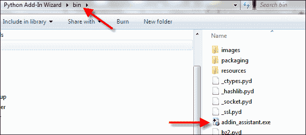

1.  双击 `addin_assistant.exe` 将提示您选择一个用作添加组件项目根目录的目录：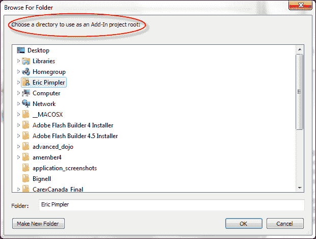

## 它是如何工作的…

Python 添加组件向导是一个可视化界面工具，您可以使用它为 ArcGIS Desktop 创建添加组件。它通过点选工具大大简化了过程。在下一个示例中，您将使用向导创建基本的 ArcGIS Desktop 添加组件。

# 创建按钮添加组件

按钮添加组件是最简单的添加组件类型，也是最常用的。使用按钮添加组件，您在脚本中编写的功能将在每次点击按钮时执行。

## 准备工作

创建添加组件项目是创建新添加组件的第一步。要使用 Python 添加组件向导创建项目，您选择工作目录，输入各种项目设置，然后点击**保存**按钮。添加组件的创建随后遵循一个定义良好的过程，如以下截图所示：

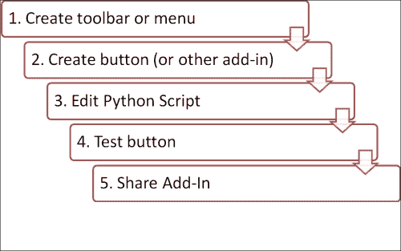

您必须首先为添加组件创建一个容器，这可以是工具栏或菜单。接下来，创建您想要添加到容器中的按钮、工具或另一个添加组件。在本例中，我们假设它是一个按钮。接下来，您需要编辑与按钮关联的 Python 脚本。您还希望测试按钮以确保其按预期工作。最后，您可以与他人共享添加组件。在本例中，您将学习如何使用添加组件向导创建 ArcGIS Desktop 的按钮添加组件。按钮添加组件将运行您在早期示例中创建的自定义脚本工具，该工具从文本文件将野火数据加载到点要素类中。

## 如何操作…

按照以下步骤学习如何创建按钮附加组件：

1.  通过双击位于您提取向导的`bin`文件夹中的`addin_assistant.exe`文件来打开 ArcGIS Python 附加组件向导。

1.  创建一个名为`Wildfire_Addin`的新项目文件夹并单击**确定**：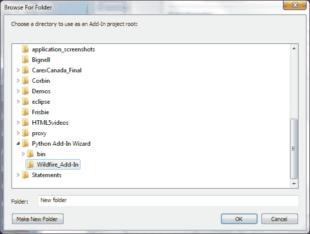

1.  **项目设置**选项卡最初应该是活动的，并显示您刚刚创建的工作目录。默认情况下，ArcMap 应该是选定的产品，但您应该验证这一点：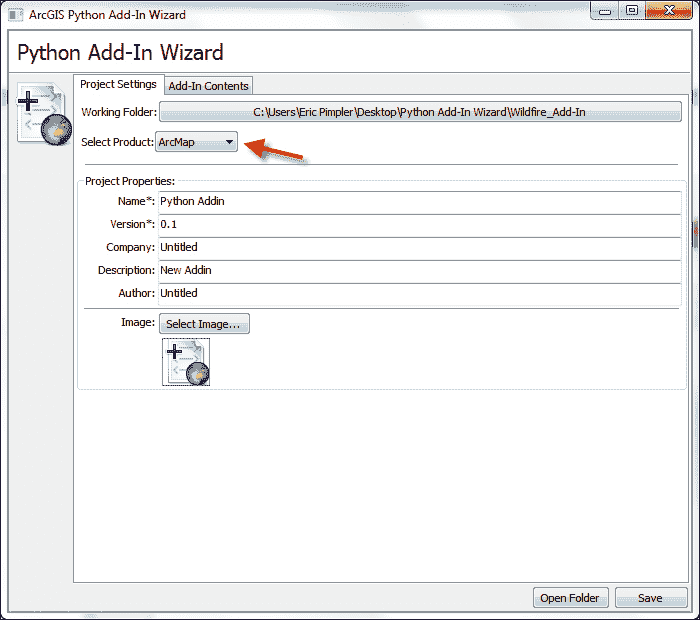

1.  给您的项目起一个名字。我们将称之为`Load Wildfire Data Addin`：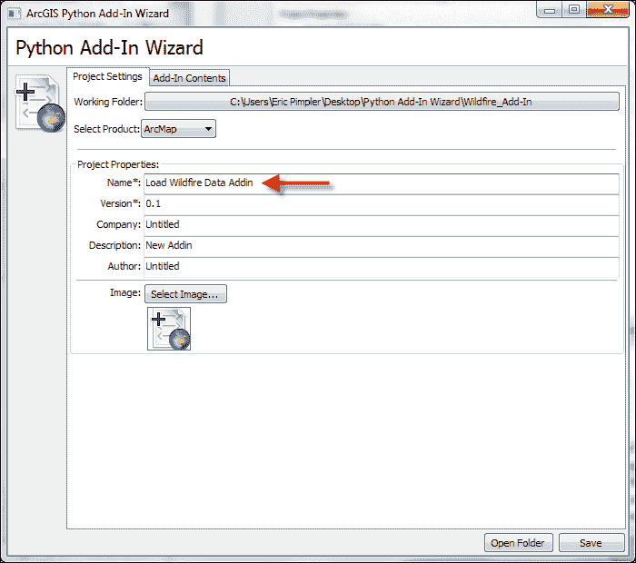

1.  默认情况下，版本号为 0.1。如果您愿意，可以更改此值。版本号应在您更新或添加工具时更改。这有助于跟踪和共享您的附加组件：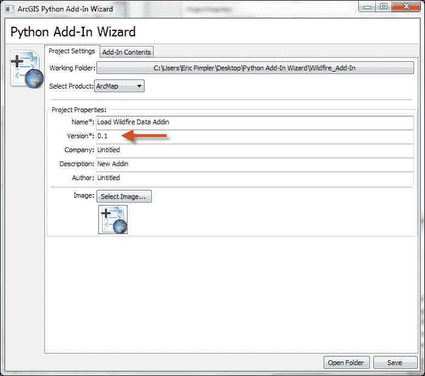

1.  名称和版本属性是仅有的两个必需属性。按照以下截图所示，添加公司、描述和作者信息是一个好习惯。添加您自己的信息：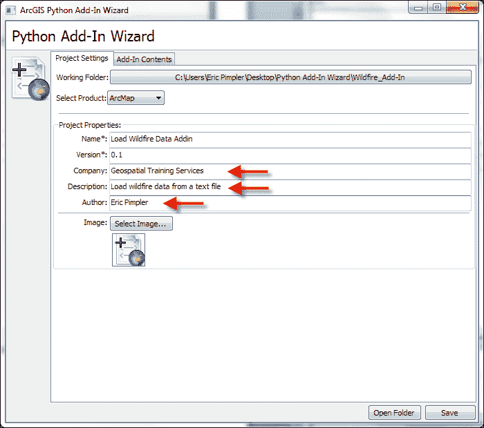

1.  您可能还希望为附加组件添加图片。在`C:\ArcpyBook\Ch11`文件夹中提供了一个名为`wildfire.png`的文件用于此目的：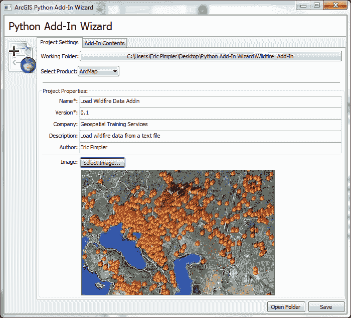

1.  **附加组件内容**选项卡用于定义可以创建的各种附加组件。在此步骤中，我们将创建一个工具栏，用于包含一个运行野火脚本的单个按钮附加组件，该脚本将`fires`从文本文件导入到要素类中。单击**附加组件内容**选项卡：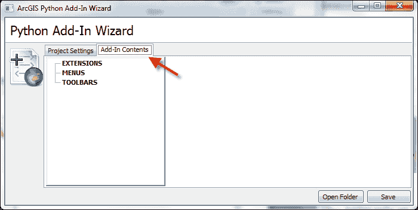

1.  在**附加组件内容**选项卡中，右键单击**工具栏**并选择**新建工具栏**。为工具栏添加标题，接受默认 ID，并确保选中**初始显示**复选框：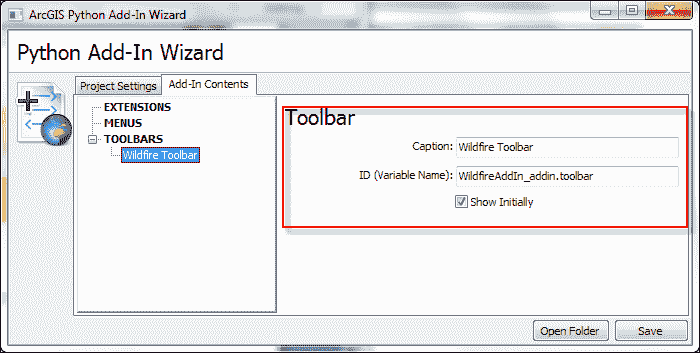

    **工具栏**附加组件虽然功能上并不太多，但非常重要，因为它充当其他附加组件（如按钮、工具、组合框、工具板和菜单）的容器。工具栏可以是浮动的或停靠的。使用 Python 附加组件向导创建工具栏附加组件很容易。

1.  单击**保存**按钮。

1.  现在，通过在新**Wildfire 工具栏**选项上右键单击并选择**新建按钮**来添加一个按钮。

1.  填写按钮详细信息，包括标题、类名、ID、工具提示等。您还可以为控件添加图片。在此情况下，我没有这样做，但您可能希望这样做。这些信息将保存到附加组件的配置文件中：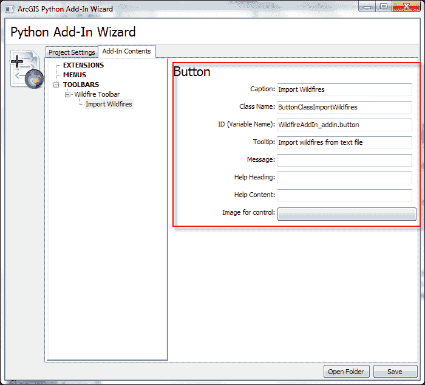

1.  单击**保存**按钮。

    附加组件有一个与之关联的 Python 脚本。默认情况下，此文件将命名为`AddIns_addin.py`，并位于您工作项目文件夹的`install`目录中。

1.  我们已经创建了一个自定义的 ArcToolbox Python 脚本工具，该工具可以从包含野火数据的磁盘上的逗号分隔文本文件中加载到要素类中。我们将在我们的插件中使用此脚本。在 Windows 资源管理器中，转到您之前创建的`addin`目录。它应该被称为`Wildfire_Addin`。转到`Install`文件夹，您应该找到一个名为`WildfireAddin_addin.py`的文件。将此文件加载到您的 Python 编辑器中。

1.  找到以下代码片段中显示的`onClick(self)`方法。当按钮被点击时，此方法会被触发：

    ```py
    import arcpy
    import pythonaddins

    class ButtonClassImportWildfires(object):
      """Implementation for WildfireAddIn_addin.button (Button)"""
      def __init__(self):
        self.enabled = True
        self.checked = False
      def onClick(self):
        pass
    ```

1.  从`onClick`事件中移除`pass`语句。

1.  在第七章中，您创建了一个自定义脚本工具，该工具可以从文本文件将野火数据加载到要素类中。在`onClick`事件内部，调用此从文本文件加载野火的自定义脚本工具，以便显示选择文本文件、模板和要写入的要素类的用户界面。

    ```py
    def onClick(self):
        LoadWildfires_wildfire()
    ```

1.  保存文件。

在下一节中，您将学习如何安装您的新插件。

## 它是如何工作的...

正如您在本食谱中看到的，Python 插件向导通过可视化界面处理插件的创建。然而，在幕后，向导为插件创建了一系列文件夹和文件。插件文件结构实际上非常简单。两个文件夹和一组文件构成了插件结构。您可以在以下屏幕截图中看到此结构：

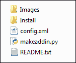

`Images`文件夹包含您的插件使用的任何图标或其他图像文件。在本食谱中，我们使用了`wildfire.png`图像。因此，此文件现在应该在`Images`文件夹中。`Install`文件夹包含处理插件业务逻辑的 Python 脚本。这是您用于编写插件的文件。它执行按钮、工具、菜单项等需要执行的所有业务逻辑。插件主文件夹中的`config.xml`文件定义用户界面以及任何静态属性，如名称、作者、版本等。可以双击`makeaddin.py`文件来创建具有`.esriaddin`扩展名的`.esriaddin`文件，该文件将所有内容压缩成一个带有`.esriaddin`扩展名的文件。这个`.esriaddin`文件将被分发给最终用户，以便安装插件。

# 安装和测试插件

在将插件分发给最终用户之前，您需要测试插件。为了测试，您首先需要安装该插件。

## 准备工作

在您的插件工作文件夹中，可以使用`makeaddin.py`脚本将所有文件和文件夹复制到工作目录中的一个压缩插件文件夹中，文件格式为`<工作文件夹名称>.esriaddin`。双击此`.esriaddin`文件以启动 ESRI ArcGIS 插件安装实用程序，该实用程序将安装您的插件。然后您可以在 ArcGIS Desktop 中测试插件。自定义工具栏或菜单可能已经可见并准备好测试。如果不可见，请转到**自定义**菜单并点击**插件管理器**。**插件管理器**对话框列出了针对当前应用程序的已安装插件。插件信息，如名称、描述和图像，应作为项目设置输入并显示。

## 如何操作…

要了解如何安装和测试 Python 插件，请按照以下步骤操作：

1.  在您的插件主文件夹内将有一个名为`makeaddin.py`的 Python 脚本文件。此脚本创建`.esriaddin`文件。双击脚本以执行并创建`.esriaddin`文件。以下截图展示了这一过程：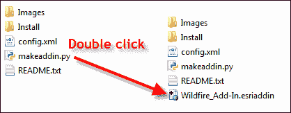

1.  要为 ArcGIS Desktop 安装插件，请双击`Widlfire_Add-In.esriaddin`文件，这将启动**Esri ArcGIS 插件安装实用程序**窗口，如下截图所示：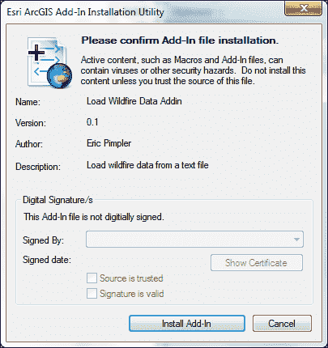

1.  点击**安装插件**。如果一切顺利，您应该会看到以下消息：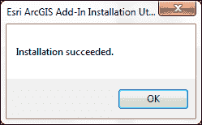

1.  要测试插件，请打开 ArcMap。您的插件可能已经激活。如果没有，请选择**自定义** | **插件管理器**。这将显示**插件管理器**对话框，如下截图所示。您应该能够看到您创建的插件：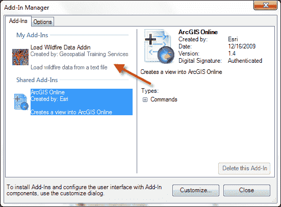

1.  如有需要，请选择**自定义**按钮。要将工具栏添加到应用程序中，请点击**工具栏**选项卡并选择您创建的工具栏：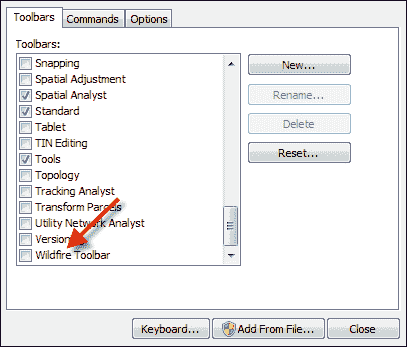

## 如何操作…

实用程序将插件放置到 ArcGIS Desktop 可发现的已知文件夹中。已知文件夹的位置如下：

+   `Vista/7: C:\Users\<username>\Documents\ArcGIS\AddIns\Desktop10.1`

+   `XP: C:\Documents and Settings\<username>\My Documents\ArcGIS\AddIns\Desktop10.1`

在已知文件夹内将创建一个具有全局唯一标识符或 GUID 名称的文件夹。插件将驻留在该唯一文件夹名称内。以下截图展示了这一过程。当 ArcGIS Desktop 启动时，它将搜索这些目录并加载插件：

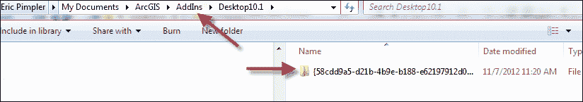

该插件将类似于以下内容：


### 注意

默认插件文件夹位于您的用户账户中的 ArcGIS 文件夹内。例如，如果您的 ArcGIS 安装版本为 10.1，插件将被复制到以下位置（在 Vista 或 Windows 7 操作系统上）：`c:\users\<username>\Documents\ArcGIS\AddIns\Desktop10.1`。

您还可以使用私有网络驱动器向最终用户分发插件。ArcGIS Desktop 中的插件管理器添加并维护可以搜索插件的文件夹列表。选择**选项**选项卡，然后选择**添加文件夹**将网络驱动器添加到列表中。

# 创建工具插件

工具插件类似于按钮，但工具需要与地图进行某种类型的交互。例如，缩放工具就是一种工具。工具应放置在工具栏或工具调色板内。属性与按钮中的属性非常相似。您还需要编辑 Python 脚本。

## 准备中

`Tool`类具有多个属性，包括`cursor`、`enabled`和`shape`。`cursor`属性设置工具被点击时的光标，并定义为与光标类型相对应的整数值，如下所示：

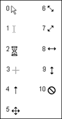

默认情况下，工具是启用的。但这可以通过将`enabled`属性设置为`false`来更改。最后，`shape`属性指定要绘制的形状类型，可以是线、矩形或圆形。这些属性通常在工具的构造函数中设置，该构造函数由`__init__`方法定义，如下面的代码示例所示。`self`指的是当前对象（在这种情况下是工具）并是一个指向此当前对象的变量：

```py
def __init__(self):
  self.enabled = True
  self.cursor = 3
  self.shape = 'Rectangle'
```

与`Tool`类相关联有许多函数。所有类都将有一个构造函数，用于定义类的属性。您之前已经看到了这个`__init__`函数的例子。工具类中的其他重要函数包括`onRectangle()`、`onCircle()`和`onLine()`。这些函数对应于使用工具在地图上绘制的形状。绘制的形状的几何形状被传递到函数中。还有许多鼠标和键盘函数可以使用。最后，当您想要停用工具时，可以调用`deactivate()`函数。

我们已经看到了`Tool`类的构造函数的实际应用。这个名为`__init__`的函数用于在创建工具时设置各种属性。在这里，我们还展示了`Tool`类的`onRectangle()`函数。当在地图上绘制矩形时，会调用此函数。矩形的几何形状以及工具本身的引用被传递到函数中：

```py
def onRectangle(self, rectangle_geometry):
```

在本教程中，您将学习如何创建一个响应用户在地图上拖动矩形的工具插件。该工具将使用**生成随机点**工具在矩形内生成点。

## 如何操作...

按照以下步骤使用 ArcGIS Python Add-In 向导创建工具插件：

1.  通过双击位于提取向导的`bin`文件夹中的`addin_assistant.exe`文件来打开 ArcGIS Python Add-In 向导。

1.  创建一个名为`Generate_Random_Points`的新项目文件夹并点击**确定**。

1.  在**项目设置**选项卡中，输入包括**名称**、**版本**、**公司**、**描述**和**作者**等属性：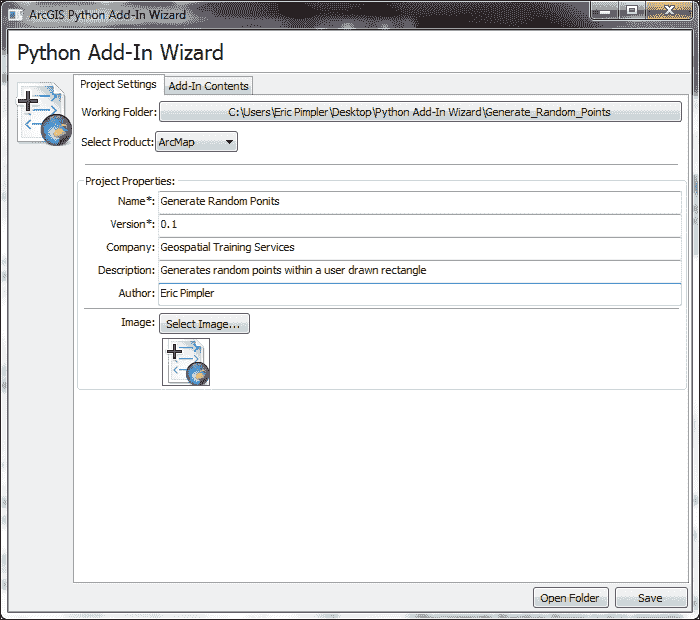

1.  点击**插件内容**选项卡。

1.  右键单击**工具栏**并选择**新建工具栏**。

1.  将工具栏的标题设置为`Random Points Toolbar`。

1.  右键单击新创建的`Random Points Toolbar`并选择**新建工具**。

1.  按照以下截图输入工具项：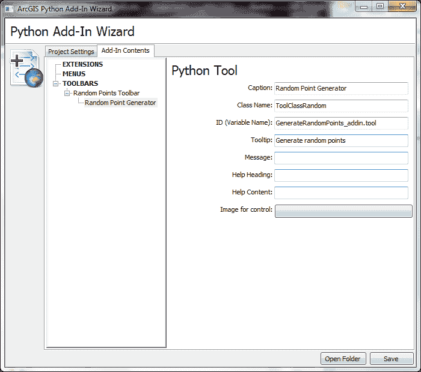

1.  点击**保存**。这将生成插件的文件夹和文件结构。

1.  前往新插件的`Install`文件夹，并在 IDLE 中打开`GenerateRandomPoints_addin.py`文件。

1.  将以下代码添加到工具的构造函数`__init__`中：

    ```py
    def __init__(self):
      self.enabled = True
      self.cursor = 3
      self.shape = 'Rectangle'
    ```

1.  在`onRectangle()`函数中编写代码以在屏幕上绘制的矩形内生成一组随机点：

    ```py
    def onRectangle(self, rectangle_geometry):
      extent = rectangle_geometry
      arcpy.env.workspace = r'c:\ArcpyBook\Ch11'
       if arcpy.Exists('randompts.shp'):
         arcpy.Delete_management('randompts.shp')
         randompts = arcpy.CreateRandomPoints_management(arcpy.env.workspace,'randompts.shp',"",rectangle_geometry)
         arcpy.RefreshActiveView()
       return randompts
    ```

1.  保存文件。

1.  通过在插件的根目录中双击`makeaddin.py`文件来生成`.esriaddin`文件。

1.  通过双击`Generate_Random_Points.esriaddin`来安装插件。

1.  使用新的地图文档文件打开 ArcMap，并在必要时添加生成随机点工具栏。

1.  从`C:\ArcpyBook\data\CityOfSanAntonio.gdb`添加`BexarCountyBoundaries`要素类。

1.  通过在地图上拖动矩形来测试插件。输出应类似于以下截图。不过，由于点生成是随机的，你的地图可能会有所不同：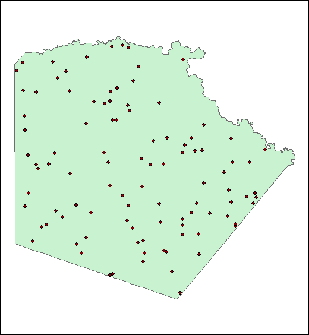

## 它是如何工作的...

工具插件与按钮插件非常相似，区别在于工具插件在功能触发之前需要与地图进行某种形式的交互。与地图的交互可以包括点击地图、绘制多边形或矩形，或执行各种鼠标或键盘事件。Python 代码被编写来响应这些事件之一或多个。在本食谱中，你学习了如何编写响应`onRectangle()`事件的代码。你还在插件的构造函数中设置了各种属性，包括`cursor`和`shape`，这些将在地图上绘制。

## 更多内容...

你可以创建许多其他插件。`ComboBox`插件提供了一个下拉列表，用户可以从中选择值，或者他们可以在可编辑字段中输入新值。与其他插件一样，你首先想要使用 Python Add-In 向导创建一个新项目，添加一个新工具栏，然后创建一个组合框并将其添加到工具栏中。

工具调色板提供了一种分组相关工具的方法。它需要添加到现有的工具栏中。默认情况下，工具将以网格状模式添加到调色板中。

`菜单`插件充当按钮和其他菜单的容器。除了在 ArcGIS Desktop 插件管理器中显示外，菜单还会在 ArcGIS Desktop 的**自定义**对话框中显示。

应用程序扩展用于向 ArcGIS Desktop 添加特定的一组相关功能。几个例子包括空间分析器、3D 分析器和商业分析师。通常，应用程序扩展负责监听事件并处理它们。例如，您可以创建一个应用程序扩展，每次用户将图层添加到地图时，都会保存地图文档文件。应用程序扩展还协调组件之间的活动。
