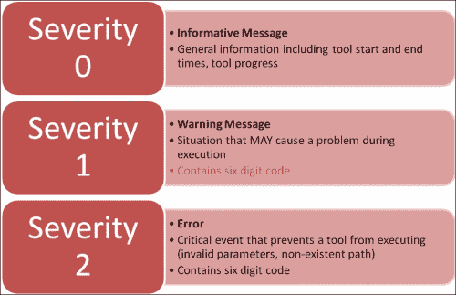
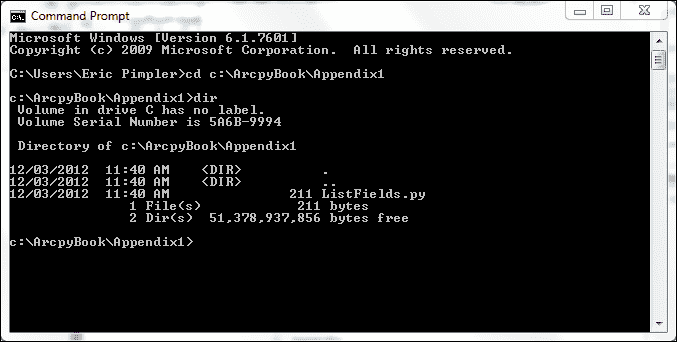
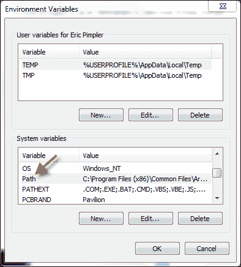
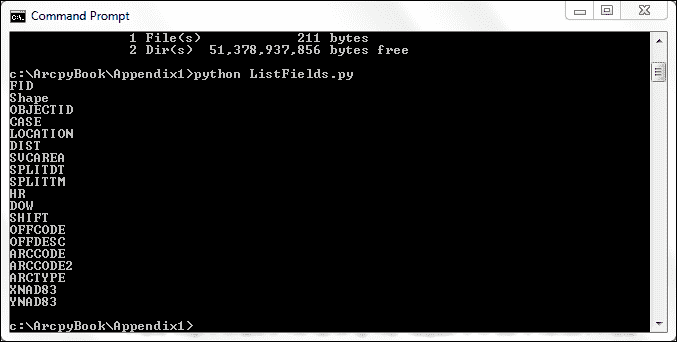
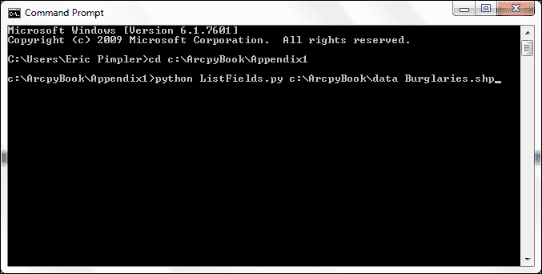
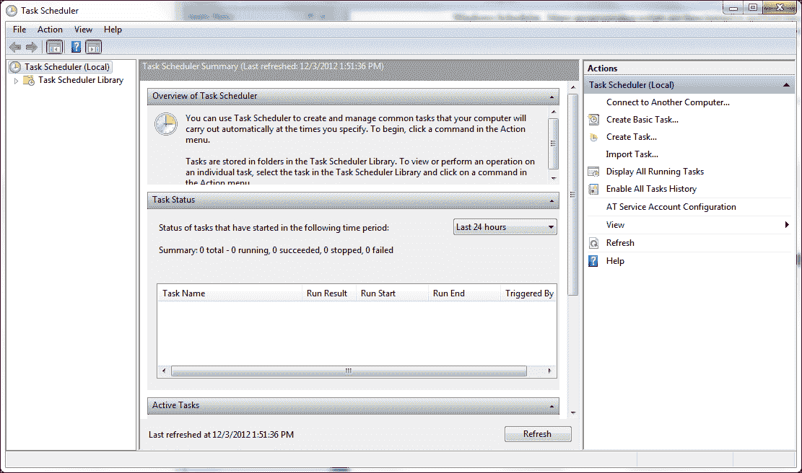
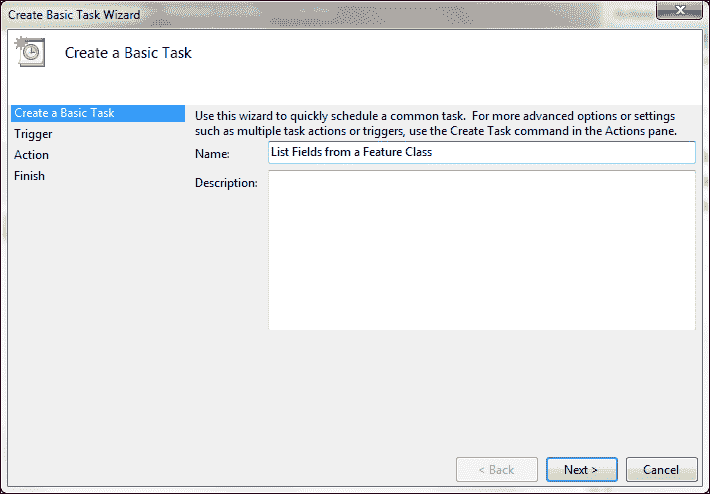
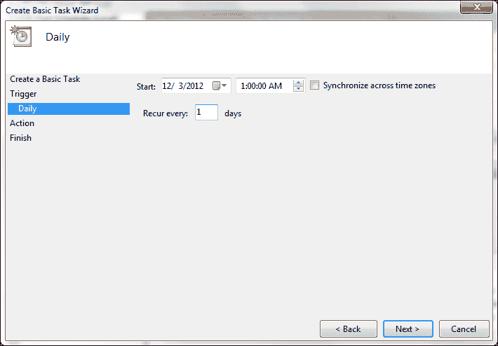
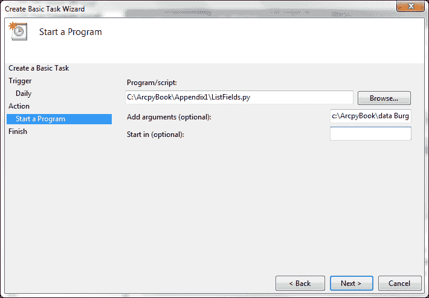
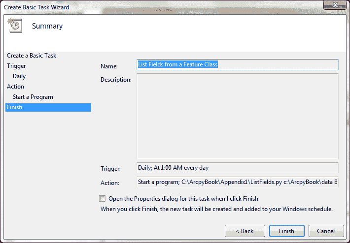

# 第十二章. 错误处理和故障排除

在本章中，我们将介绍以下内容：

+   探索默认的 Python 错误信息

+   添加 Python 异常处理结构（try/except/finally）

+   使用 GetMessages()检索工具消息

+   通过严重程度级别过滤工具消息

+   使用 GetMessage()返回单个消息

+   测试并响应特定错误消息

# 简介

在执行 ArcGIS 地理处理工具和函数的过程中，会返回各种消息。这些消息可能是信息性的，或者指示警告或错误条件，可能导致工具无法创建预期的输出，或者工具执行完全失败。这些消息不会以消息框的形式出现。相反，您需要使用各种 ArcPy 函数来检索它们。到目前为止，本书中我们忽略了这些消息、警告和错误的存在。这主要是因为我想让您集中精力学习一些基本概念，而不添加创建健壮的地理处理脚本所需的额外代码复杂性，这些脚本可以优雅地处理错误情况。话虽如此，现在是时候学习如何创建地理处理和 Python 异常处理结构，这将使您能够创建灵活的地理处理脚本。这些脚本可以处理在脚本运行时生成的指示警告、错误和一般信息的消息。这些代码细节将帮助使您的脚本更加灵活，减少错误发生的可能性。您已经使用基本的`try`和`except`块执行了一些基本的错误处理。但是，在本章中，我们将更详细地介绍为什么以及如何使用这些结构。 

# 探索默认的 Python 错误信息

默认情况下，Python 会在您的脚本中遇到问题时生成错误消息。这些错误消息并不总是对运行脚本的最终用户非常有信息性。然而，查看这些原始消息是有价值的。在后面的菜谱中，我们将使用 Python 错误处理结构来获取更清晰的错误视图，并根据需要进行响应。

## 准备工作

在这个菜谱中，我们将创建并运行一个故意包含错误条件的脚本。我们不会在脚本中包含任何地理处理或 Python 异常处理技术。我们故意这样做，因为我想让您看到 Python 返回的错误信息。

## 如何操作…

按照以下步骤操作，以查看在脚本执行过程中工具执行时产生的原始 Python 错误信息：

1.  打开 IDLE 并创建一个新的脚本。

1.  将脚本保存到`c:\ArcpyBook\Ch12\ErrorHandling.py`。

1.  导入`arcpy`模块：

    ```py
    import arcpy
    ```

1.  设置工作空间：

    ```py
    arcpy.env.workspace = "c:/ArcpyBook/data"
    ```

1.  调用`Buffer`工具。`Buffer`工具需要一个缓冲距离作为其参数之一。在这个代码块中，我们故意省略了距离参数：

    ```py
    arcpy.Buffer_analysis("Streams.shp","Streams_Buff.shp")
    ```

1.  运行脚本。你应该看到以下错误信息：

    ```py
     Runtime error Traceback (most recent call last): File "<string>", line 1, in <module> File "c:\program files (x86)\arcgis\desktop10.1\arcpy\arcpy\analysis.py", line 687, in Buffer  raise e ExecuteError: Failed to execute. Parameters are not valid. ERROR 000735: Distance [value or field]: Value is required Failed to execute (Buffer).

    ```

## 它是如何工作的...

你在输出错误信息中看到的内容并不十分有用。如果你是一个经验丰富的程序员，你通常会能够识别出问题所在。在这种情况下，我们没有包括缓冲距离。然而，在许多情况下，返回的错误信息不会给你提供多少你可以用来解决问题的信息。代码中的错误是编程生活中不可避免的事实。然而，你的代码如何响应这些错误，也称为异常，是非常重要的。你应该计划使用 Python 错误处理结构来优雅地处理错误，这些结构会检查 `arcpy` 生成的异常并相应地采取行动。如果没有这些结构，你的脚本将立即失败，从而让用户感到沮丧。

# 添加 Python 异常处理结构（try/except/finally）

Python 内置了异常处理结构，允许你捕获生成的错误信息。使用这些错误信息，你可以向最终用户显示更合适的消息，并根据需要做出响应。

## 准备工作

异常是在你的代码中发生的异常或错误条件。Python 中的异常语句允许你捕获和处理代码中的错误，使你能够优雅地从错误条件中恢复。除了错误处理之外，异常还可以用于各种其他事情，包括事件通知和特殊情况处理。

Python 异常以两种方式发生。Python 中的异常可以是拦截的或触发的。当你的代码中发生错误条件时，Python 会自动触发异常，这可能或可能不会被你的代码处理。作为程序员，是否捕获自动触发的异常取决于你。异常也可以通过你的代码手动触发。在这种情况下，你还需要提供一个异常处理例程来捕获这些手动触发的异常。你可以通过使用 `raise` 语句手动触发异常。

`try`/`except` 语句是一个完整的、复合的 Python 语句，用于处理异常。这种 `try` 语句以 `try` 标题行开始，后跟一个缩进的语句块，然后是一个或多个可选的 `except` 子句，这些子句命名了要捕获的异常，以及一个可选的 `else` 子句。

`try`/`except`/`else` 语句的工作方式如下。一旦进入 `try` 语句，Python 会标记你处于 `try` 块中，并且知道该块内发生的任何异常条件都将被转发到各个 `except` 语句进行处理。

`try` 块内的每个语句都会被执行。假设没有发生异常条件，代码指针将跳转到 `else` 语句并执行 `else` 语句中包含的代码块，然后移动到 `try` 块下方的下一行代码。如果在 `try` 块内部发生异常，Python 将搜索匹配的异常代码。如果找到匹配的异常，`except` 块内的代码块将被执行。然后代码从 `try` 语句的下方继续执行。在这种情况下，`else` 语句不会被执行。如果没有找到匹配的异常头，Python 将将异常传播到此代码块上方的 `try` 语句。如果在整个过程中没有找到匹配的 `except` 头，异常将出现在进程的最顶层。这会导致未处理的异常，你最终会收到我们在本章第一个菜谱中看到的错误消息类型。

在这个菜谱中，我们将添加一些基本的 Python 异常处理结构。`try`/`except`/`else`/`finally` 异常处理结构有多种变体。在这个菜谱中，我们将从一个非常简单的 `try`/`except` 结构开始。

## 如何操作...

按照以下步骤将 Python 错误处理结构添加到脚本中：

1.  如果需要，在 IDLE 中打开 `c:\ArcpyBook\Ch12\ErrorHandling.py` 文件。

1.  修改你的脚本以包含一个 `try`/`except` 块：

    ```py
    import arcpy
    try:
      arcpy.env.workspace = "c:/ArcpyBook/data"
      arcpy.Buffer_analysis("Streams.shp","Streams_Buff.shp")
    except:
      print "Error"
    ```

1.  保存并运行脚本。你应该看到简单的消息 `Error`。这并不比我们在第一个菜谱中收到的输出更有帮助。事实上，它甚至更没有用。然而，这个菜谱的目的仅仅是向你介绍 `try`/`except` 错误处理结构。

## 它是如何工作的…

这是一个极其简单的结构。`try` 块表示 `try` 语句下缩进的任何内容都将受到异常处理的影响。如果找到任何类型的异常，代码处理的控制将跳转到 `except` 部分，并打印错误消息（在这种情况下是简单的 `Error`）。正如我提到的，这对用户来说几乎没有任何信息量，但希望这能给你一个基本的想法，了解 `try`/`except` 块是如何工作的，并且作为程序员，你将更好地理解用户报告的任何错误。在下一个菜谱中，你将学习如何向这个结构添加工具生成的消息。

## 还有更多...

另一种类型的`try`语句是`try`/`finally`语句，它允许执行最终化操作。当在`try`语句中使用`finally`子句时，其语句块总是在最后执行，无论是否发生错误条件。`try`/`finally`语句的工作方式如下。如果发生异常，Python 将运行`try`块，然后运行`finally`块，然后执行继续到整个`try`语句之后。如果在执行过程中没有发生异常，Python 将运行`try`块，然后运行`finally`块，然后执行返回到更高级别的`try`语句。这在确保代码块运行后无论是否发生错误条件都要执行某些操作时非常有用。

# 使用 GetMessages() 获取工具消息

ArcPy 包含一个`GetMessages()`函数，你可以使用它来检索在 ArcGIS 工具执行时生成的消息。消息可以包括信息性消息，例如工具执行的开始和结束时间，以及警告和错误，这些可能导致结果不如预期或工具执行失败。

## 准备工作

在工具执行过程中，会生成各种消息。这些消息包括信息性消息，例如工具执行的开始和结束时间、传递给工具的参数值以及进度信息。此外，工具还可以生成警告和错误。这些消息可以通过你的 Python 脚本读取，并且你可以设计代码来适当地处理已生成的任何警告或错误。

ArcPy 存储了最后执行的工具的消息，你可以使用`GetMessages()`函数检索这些消息，该函数返回一个包含最后执行的工具所有消息的单个字符串。你可以通过严重性过滤这个字符串，以返回仅包含某些类型的消息，例如警告或错误。第一条消息将始终包含执行的工具的名称，最后一条消息是开始和结束时间。

在这个菜谱中，你将在`except`语句中添加一行代码，这将打印关于当前工具运行更详细的信息。

## 如何做到这一点...

按照以下步骤学习如何将`GetMessages()`函数添加到你的脚本中，以生成来自最后执行的工具的消息列表。

1.  如果需要，在 IDLE 中打开`c:\ArcpyBook\Ch12\ErrorHandling.py`文件。

1.  修改你的脚本以包含`GetMessages()`函数：

    ```py
    import arcpy
    try:
      arcpy.env.workspace = "c:/ArcpyBook/data"
      arcpy.Buffer_analysis("Streams.shp","Streams_Buff.shp")
    except:
      print arcpy.GetMessages()
    ```

1.  保存并运行脚本。这次，错误消息应该更加详细。同时请注意，还会生成其他类型的消息，包括脚本执行的开始和结束时间：

    ```py
    Executing: Buffer c:/ArcpyBook/data\Streams.shp c:/ArcpyBook/data\Streams_Buff.shp # FULL ROUND NONE #
    Start Time: Tue Nov 13 22:23:04 2012
    Failed to execute. Parameters are not valid.
    ERROR 000735: Distance [value or field]: Value is required
    Failed to execute (Buffer).
    Failed at Tue Nov 13 22:23:04 2012 (Elapsed Time: 0.00 seconds)

    ```

## 它是如何工作的...

`GetMessages()` 函数返回最后运行的工具生成的所有消息。我想强调的是，它只返回最后运行的工具的消息。如果您有一个运行多个工具的脚本，请记住这一点。通过此函数无法访问历史工具运行消息。然而，如果您需要检索历史工具运行消息，可以使用 `Result` 对象。

# 通过严重程度级别过滤工具消息

正如我在上一个菜谱中提到的，所有工具都会生成一些可以被归类为信息、警告或错误消息的消息。`GetMessages()` 方法接受一个参数，允许您过滤返回的消息。例如，您可能对脚本中的信息或警告消息不感兴趣。然而，您当然对错误消息感兴趣，因为它们表明了一个致命的错误，这将阻止工具成功执行。使用 `GetMessages()`，您可以过滤返回的消息，只保留错误消息。

## 准备工作

消息被归类为三种类型之一，这些类型由严重程度级别指示。**信息性消息**提供了有关工具进度、工具的开始和结束时间、输出数据特征等方面的描述性信息。信息性消息的严重程度级别由 `0` 的值表示。**警告消息**在执行过程中发生问题时生成，可能会影响输出。警告由 `1` 的严重程度级别表示，通常不会阻止工具运行。最后一种消息是**错误消息**，由 `2` 的数值表示。这些表示阻止工具运行的事件。在工具执行过程中可能会生成多个消息，这些消息被存储在一个列表中。有关消息严重程度级别的更多信息，请参阅以下图像。在本菜谱中，您将学习如何过滤 `GetMessages()` 函数生成的消息。



## 如何做…

过滤工具返回的消息实际上非常简单。您只需将您希望返回的严重程度级别作为参数传递给 `GetMessages()` 函数。

1.  如果需要，请在 IDLE 中打开 `c:\ArcpyBook\Ch12\ErrorHandling.py` 文件。

1.  修改 `GetMessages()` 函数，使其只传递 `2` 作为唯一参数：

    ```py
    import arcpy
    try:
      arcpy.env.workspace = "c:/ArcpyBook/data"
      arcpy.Buffer_analysis("Streams.shp","Streams_Buff.shp")
    except:
      print arcpy.GetMessages(2)
    ```

1.  保存并运行脚本以查看输出：

    ```py
    Failed to execute. Parameters are not valid.
    ERROR 000735: Distance [value or field]: Value is required
    Failed to execute (Buffer).

    ```

## 它是如何工作的…

正如我提到的，`GetMessages()` 方法可以接受 `0`、`1` 或 `2` 的整数参数。传递 `0` 的值表示应返回所有消息，而传递 `1` 的值表示您希望看到警告。在我们的情况下，我们传递了一个 `2` 的值，这表示我们只想看到错误消息。因此，您将看不到其他任何信息消息，例如脚本的开始和结束时间。

# 测试并响应特定错误信息

所有的错误和警告都会生成一个特定的错误代码。你可以在脚本中检查特定的错误代码，并根据这些错误执行某些操作。这可以使你的脚本更加灵活。

## 准备中…

由地理处理工具生成的所有错误和警告都包含一个六位代码和描述。你的脚本可以测试特定的错误代码并相应地做出反应。你可以在 ArcGIS 桌面帮助系统中通过访问**地理处理** | **工具错误和警告**来获取所有可用错误消息和代码的列表。这在下图中得到了说明。所有错误都将有一个独特的页面，简要描述错误代码：


## 如何操作…

按照以下步骤学习如何编写一个响应由地理处理工具执行生成的特定错误代码的代码：

1.  通过访问**开始** | **程序** | **ArcGIS** | **ArcGIS for Desktop 帮助**来打开 ArcGIS 桌面帮助系统。

1.  前往**地理处理** | **工具错误和警告** | **工具错误 1-10000** | **工具错误和警告：701-800**。

1.  选择**000735: <value>: 值是必需的**。这个错误表示工具所需的参数尚未提供。你会记得在运行此脚本时，我们没有提供缓冲距离，因此生成的错误消息包含我们在帮助系统中查看的错误代码。在下面的代码中，你会找到错误消息的完整文本。注意错误代码。

    ```py
    ERROR000735:Distance[valueorfield]:Valueisrequired
    ```

1.  如果需要，在 IDLE 中打开`c:\ArcpyBook\Ch12\ErrorHandling.py`文件。

1.  在你的脚本中，修改`except`语句，使其如下所示：

    ```py
    except:
     print “Error found in Buffer tool \n”
    errCode = arcpy.GetReturnCode(3)
     if str(errCode) in “735”:
     print “Distance value not provided \n”
     print “Running the buffer again with a default value \n”
    defaultDistance = “100 Feet”
    arcpy.Buffer_analysis(“Streams.shp”, “Streams_Buff”, defaultDistance)
     print “Buffer complete”
    ```

1.  保存并运行脚本。你应该会看到各种消息被打印出来，如下所示：

    ```py
    Error found in Buffer tool
    Distance value not provided for buffer
    Running the buffer again with a default distance value
    Buffer complete
    ```

## 它是如何工作的…

在这个代码块中，你所做的是使用`arcpy.GetReturnCode()`函数来返回工具生成的错误代码。然后，使用一个`if`语句来测试错误代码是否包含值`735`，这个代码表示工具未提供所需的参数。你随后为缓冲距离提供了一个默认值，并再次调用了`Buffer`工具；这次提供了默认的缓冲值。

# 使用 GetMessage()返回单个消息

虽然`GetMessages()`返回一个包含最后一次工具运行中所有消息的列表，但你也可以使用`GetMessage()`从字符串中获取单个消息。

## 准备中

到目前为止，我们一直在返回工具生成的所有消息。然而，你可以通过 `GetMessage()` 方法将单个消息返回给用户，该方法接受一个整数参数，表示你想要检索的特定消息。工具生成的每个消息都被放置在一个消息列表或数组中。我们在本书前面讨论了列表对象，所以你会记得这只是一个某种对象的集合。提醒一下：列表是从零开始的，意味着列表中的第一个元素位于位置 `0`。例如，`GetMessage(0)` 会返回列表中的第一条消息，而 `GetMessage(1)` 会返回列表中的第二条消息。第一条消息总是执行的工具以及任何参数。第二条消息返回脚本的开始时间，而最后一条消息返回脚本的结束时间。

## 如何做...

1.  如果需要，在 IDLE 中打开 `c:\ArcpyBook\Ch12\ErrorHandling.py` 文件。

1.  修改 `except` 块如下：

    ```py
    import arcpy
    try:
      arcpy.env.workspace = "c:/ArcpyBook/data"
      arcpy.Buffer_analysis("Streams.shp","Streams_Buff.shp")
    except:
      print arcpy.GetMessage(1)
      print arcpy.GetMessage(arcpy.GetMessageCount() – 1)
    ```

1.  保存并运行脚本以查看输出：

    ```py
    Start Time: Wed Nov 14 09:07:35 2012
    Failed at Wed Nov 14 09:07:35 2012 (Elapsed Time: 0.00 seconds)

    ```

## 它是如何工作的...

我们还没有介绍 `GetMessageCount()` 函数。这个函数返回工具返回的消息数量。请记住，我们的消息列表是从零开始的，所以我们必须从 `GetMessageCount()` 函数中减去一，才能得到列表中的最后一条消息。否则，我们会尝试访问一个不存在的消息。在这个脚本中，我们已经访问了脚本的开始和结束时间。第二条消息总是脚本的开始时间，而最后一条消息总是脚本的结束时间。这个概念如下所示：

```py
Message 0 - Executing: Buffer c:/ArcpyBook/data\Streams.shp c:/ArcpyBook/data\Streams_Buff.shp # FULL ROUND NONE #
Message 1 - Start Time: Tue Nov 13 22:23:04 2012
Message 2 - Failed to execute. Parameters are not valid.
Message 3 - ERROR 000735: Distance [value or field]: Value is required
Message 4 - Failed to execute (Buffer).
Message 5 - Failed at Tue Nov 13 22:23:04 2012 (Elapsed Time: 0.00 seconds)

```

消息总数为 `6`，但最后一条消息是编号 `5`。这是因为计数从 `0` 开始。这就是为什么你需要减去 `1`，如前所述。在这种情况下，开始和结束时间相同，因为脚本中包含了一个错误。然而，它确实说明了如何访问工具生成的单个消息。

# 附录 A. 自动化 Python 脚本

在本章中，我们将介绍以下菜谱：

+   从命令行运行 Python 脚本

+   使用 sys.argv[] 捕获命令行输入

+   将 Python 脚本添加到批处理文件中

+   安排批处理文件在指定时间运行

# 简介

Python 地理处理脚本可以作为独立脚本在 ArcGIS 外部执行，也可以作为脚本工具在 ArcGIS 内部执行。这两种方法都有其优点和缺点。到这本书的这一部分，我们所有的脚本要么在 ArcGIS 内部作为脚本工具运行，要么从 Python 开发环境（如 IDLE 或 ArcGIS 中的 Python 窗口）运行。然而，Python 脚本也可以从 Windows 操作系统命令行执行。命令行是一个你可以输入命令的窗口，而不是 Windows 提供的通常的点按和点击方法。运行 Python 脚本的方法对于安排脚本的执行非常有用。你可能有很多理由想要安排你的脚本。许多地理处理脚本需要很长时间才能完全执行，并且需要定期在工作时间之外安排运行。此外，一些脚本需要定期执行（每天、每周、每月等），并且应该为了效率而安排。在本章中，你将学习如何从命令行执行脚本，将脚本放入批处理文件中，并在指定的时间安排脚本的执行。请记住，任何从命令行运行的脚本仍然需要访问 ArcGIS Desktop 许可证才能使用 `arcpy` 模块。

# 从命令行运行 Python 脚本

到这本书的这一部分，你所有的 Python 脚本都作为 ArcGIS 中的脚本工具或从 Python 开发环境（如 IDLE 或 ArcGIS 中的 Python 窗口）运行。Windows 命令提示符提供了执行你的 Python 脚本的另一种方式。命令提示符主要用于执行作为批处理文件的一部分运行或作为计划任务的脚本。

## 准备工作

从命令提示符运行 Python 地理处理脚本有几个优点。这些脚本可以安排在非工作时间批量处理你的数据，以提高处理效率，并且由于内置的 Python 错误处理和调试功能，它们更容易调试。

在这个菜谱中，你将学习如何使用 Windows 命令提示符来执行 Python 脚本。你需要管理员权限来完成这个菜谱，因此你可能需要联系你的信息技术支持团队来做出这个更改。

## 如何操作…

按照以下步骤学习如何在 Windows 命令提示符中运行脚本：

1.  在 Windows 中，转到 **开始** | **所有程序** | **附件** | **命令提示符** 以显示一个类似于以下截图的窗口：

    窗口将显示当前目录。你的目录可能会有所不同。让我们更改到本附录的目录。

1.  输入 `cd c:\ArcpyBook\Appendix1`。

1.  输入 `dir` 以查看文件和子目录的列表。你应该只看到一个名为 `ListFields.py` 的单个 Python 文件：

1.  确保 Python 解释器可以从目录结构的任何位置运行。转到**开始** | **所有程序** | **附件** | **系统工具** | **控制面板**。

1.  点击**系统和安全**。

1.  点击**系统**。

1.  点击**高级系统设置**。

1.  在**系统属性**对话框中，选择**高级**选项卡，然后点击**环境变量**按钮，如图以下截图所示：

1.  在下面的截图中找到**路径**系统变量并点击**编辑**。

1.  检查整个文本字符串中是否存在目录`c:\Python27\ArcGIS10.1`。如果找不到文本字符串，请将其添加到末尾。确保在添加路径之前添加一个分号。现在，当你在命令提示符中键入`python`时，它将遍历**路径**系统变量中的每个目录，检查是否存在名为`python.exe`的可执行文件。

1.  点击**确定**以关闭**编辑系统变量**对话框。

1.  点击**确定**以关闭**环境变量**对话框。

1.  点击**确定**以关闭**系统属性**对话框。

1.  返回到命令提示符。

1.  输入`python ListFields.py`。这将运行`ListFields.py`脚本。经过短暂的延迟后，你应该会看到以下输出：

## 它是如何工作的…

本食谱中提供的`ListFields.py`脚本是一个简单的脚本，用于列出`Burglaries_2009.shp`文件的属性字段。工作空间和 shapefile 名称在脚本中是硬编码的。键入`python`后跟脚本名称，在本例中为`ListFields.py`，将触发使用 Python 解释器执行脚本。如我所述，工作空间和 shapefile 名称在这个脚本中是硬编码的。在下一个食谱中，您将学习如何向脚本传递参数，以便您可以移除硬编码并使脚本更加灵活。

# 使用 sys.argv[ ]捕获命令行输入

与在脚本中硬编码特定数据集的路径相比，您可以通过允许它们从命令提示符以参数形式接受输入来使您的脚本更加灵活。这些输入参数可以使用 Python 的`sys.argv[]`对象捕获。

## 准备工作

Python 的`sys.argv[]`对象允许您在脚本执行时从命令行捕获输入参数。一个示例可以用来说明它是如何工作的。看看下面的截图：



每个单词都必须用空格分隔。这些单词存储在一个名为 `sys.argv[]` 的零基列表对象中。使用 `sys.argv[]`，列表中的第一个项目，通过索引 `0` 引用，存储脚本的名称。在这种情况下，它将是 `ListFields.py`。每个后续的单词通过下一个整数引用。因此，第一个参数（`c:\ArcpyBook\data`）将存储在 `sys.argv[1]` 中，第二个参数（`Burglaries.shp`）将存储在 `sys.argv[2]` 中。`sys.argv[]` 对象中的每个参数都可以在您的地理处理脚本中访问和使用。在这个菜谱中，您将更新 `ListFields.py` 脚本以接受来自命令行的输入参数。

## 如何操作...

按照以下步骤创建一个 Python 脚本，该脚本可以使用 `sys.argv[]` 从命令提示符接收输入参数：

1.  在 IDLE 中打开 `C:\ArcpyBook\Appendix1\ListFields.py`。

1.  导入 `sys` 模块：

    ```py
    import arcpy, sys
    ```

1.  创建一个变量来保存将被传递到脚本中的工作空间：

    ```py
    wkspace = sys.argv[1]
    ```

1.  创建一个变量来保存将被传递到脚本中的要素类：

    ```py
    fc = sys.argv[2]
    ```

1.  更新设置工作空间和调用 `ListFields()` 函数的代码行：

    ```py
    arcpy.env.workspace = wkspace
    fields = arcpy.ListFields(fc)
    ```

    您完成的脚本应如下所示：

    ```py
    import arcpy, sys
    wkspace = sys.argv[1]
    fc = sys.argv[2]
    try:
      arcpy.env.workspace = wkspace
      fields = arcpy.ListFields(fc)
      for fld in fields:
        print fld.name
    except:
      print arcpy.GetMessages()
    ```

1.  保存脚本。

1.  如有必要，打开命令提示符并导航到 `c:\ArcpyBook\Appendix1`。

1.  在命令行中，键入以下内容并按 *Enter* 键：

    ```py
    python ListFields.py c:\ArcpyBook\data Burglaries_2009.shp
    ```

1.  再次运行后，您应该看到输出详细说明 `Burglaries_2009.shp` 文件的属性字段。不同之处在于您的脚本不再有硬编码的工作空间和要素类名称。现在您有一个更灵活的脚本，能够列出任何要素类的属性字段。

## 工作原理...

`sys` 模块包含一个名为 `argv[]` 的对象列表，用于存储 Python 脚本命令行执行的输入参数。列表中存储的第一个项目始终是脚本的名称。因此，在这种情况下，`sys.argv[0]` 包含单词 `ListFields.py`。脚本中传递了两个参数，包括工作空间和要素类。这些值分别存储在 `sys.argv[1]` 和 `sys.argv[2]` 中。然后，将这些值分配给变量并在脚本中使用。

# 将 Python 脚本添加到批处理文件中

要安排 Python 脚本在指定时间运行，您需要创建一个包含一个或多个脚本和/或操作系统命令的批处理文件。然后，可以将这些批处理文件添加到 Windows 计划任务中，以便在特定时间间隔内运行。

## 准备工作

批处理文件是包含运行 Python 脚本或执行操作系统命令的命令行序列的文本文件。它们具有 `.bat` 文件扩展名，Windows 识别为可执行文件。由于批处理文件仅包含命令行序列，因此可以使用任何文本编辑器编写，尽管建议您使用基本的文本编辑器，如记事本，这样您可以避免由 Microsoft Word 等程序插入的无形特殊字符。在本食谱中，您将创建一个简单的批处理文件，该文件将导航到包含您的 `ListFields.py` 脚本的目录并执行它。

## 如何操作...

按照以下步骤创建批处理文件：

1.  打开记事本。

1.  将以下文本行添加到文件中：

    ```py
    cd c:\ArcpyBook\Appendix1
    python ListFields.py c:\ArcpyBook\data Burglaries_2009.shp
    ```

1.  将文件保存到您的桌面上，命名为 `ListFields.bat`。确保将 **另存为类型** 下拉列表更改为 **所有文件**，否则您将得到一个名为 `ListFields.bat.txt` 的文件。

1.  在 Windows 中，导航到您的桌面，双击 `ListFields.bat` 以执行命令序列。

1.  执行过程中将显示命令提示符。在命令执行完毕后，命令提示符将自动关闭。

## 它是如何工作的...

Windows 将批处理文件视为可执行文件，因此双击文件将自动在新的命令提示符窗口中执行文件中包含的命令序列。所有 `print` 语句都将写入窗口。在命令执行完毕后，命令提示符将自动关闭。如果需要跟踪输出，可以将语句写入输出日志文件。

## 更多内容...

批处理文件可以包含变量、循环、注释和条件逻辑。此功能超出了本食谱的范围。然而，如果您将为您的组织编写和运行许多脚本，花些时间学习更多关于批处理文件的知识是值得的。批处理文件已经存在很长时间了，因此关于这些文件的网上信息并不匮乏。有关批处理文件的更多信息，请参阅此主题的维基百科页面。

# 在指定时间安排批处理文件的运行

一旦创建，您就可以使用 Windows 计划任务在指定时间安排批处理文件的运行。

## 准备工作

许多地理处理脚本需要大量时间，最好在非工作时间运行，这样它们可以充分利用系统资源，并为您腾出时间来专注于其他任务。在本食谱中，您将学习如何使用 Windows 计划任务安排批处理文件的执行。

## 如何操作...

按照以下步骤使用 Windows 计划任务安排批处理文件：

1.  通过转到 **开始** | **程序** | **附件** | **系统工具** | **控制面板** | **管理工具** 打开 Windows 计划任务。选择 **任务计划程序**。计划任务应该会像以下截图所示显示：

1.  选择**操作**菜单项，然后**创建基本任务**以显示**创建基本任务向导**对话框，如图下所示。

1.  给您的任务起一个名字。在这种情况下，我们将称之为`List Fields from a Feature Class`。点击**下一步**：

1.  选择任务执行时的触发器。这可以是，并且通常会是基于时间的触发器，但也可以有其他类型的触发器，例如用户登录或计算机启动。在这种情况下，让我们只选择**每日**。点击**下一步**：

1.  选择一个开始日期/时间以及重复间隔。在下面的屏幕截图中，我选择了日期为`12/3/2012`，时间为`1:00:00 AM`，重复间隔为 1 天。因此，每天凌晨 1:00，这个任务将被执行。点击**下一步**：

1.  选择**启动程序**作为操作：

1.  浏览到你的脚本并添加参数。点击**下一步**：

1.  点击**完成**将任务添加到计划程序：

1.  任务现在应显示在活动任务列表中：

## 它是如何工作的...

Windows 任务计划程序会跟踪所有活动任务，并在预定触发器被触发时处理这些任务的执行。在这个菜谱中，我们已经安排了任务每天凌晨 1:00 执行。那时，我们将触发的批处理文件，以及我们在创建任务时指定的参数将被传递到脚本中。使用计划程序在非工作时间自动执行地理处理任务，无需 GIS 人员与脚本交互，这为您提供了更多的灵活性并提高了效率。您还可能希望考虑将 Python 脚本的错误记录到日志文件中，以获取有关特定问题的更多信息。

# 附录 B.每个 GIS 程序员都应该知道如何用 Python 做的五件事

在本章中，我们将介绍以下菜谱：

+   从分隔符文本文件中读取数据

+   发送电子邮件

+   从 FTP 服务器检索文件

+   创建 ZIP 文件

+   读取 XML 文件

# 简介

在本章中，您将学习如何编写使用 Python 执行通用任务的脚本。任务，如读取和写入分隔符文本文件、发送电子邮件、与 FTP 服务器交互、创建`.zip`文件以及读取和写入 JSON 和 XML 文件。每个 GIS 程序员都应该知道如何编写包含此功能的 Python 脚本。

# 从分隔符文本文件中读取数据

使用 Python 处理文件是 GIS 程序员非常重要的一个话题。文本文件常被用作系统间数据交换的格式。它们简单、跨平台且易于处理。逗号和制表符分隔的文本文件是文本文件中最常用的格式之一，因此我们将详细探讨可用于处理这些文件的 Python 工具。对于 GIS 程序员来说，一个常见的任务是读取包含 x 和 y 坐标以及其他属性信息的逗号分隔文本文件。然后，这些信息将被转换为 GIS 数据格式，如 shapefile 或地理数据库。

## 准备工作

要使用 Python 的内置文件处理功能，您必须首先打开文件。一旦打开，文件内的数据将使用 Python 提供的函数进行处理，最后关闭文件。务必记住，完成操作后关闭文件。

在这个菜谱中，您将学习如何打开、读取、处理和关闭逗号分隔的文本文件。

## 如何操作...

按照以下步骤创建一个读取逗号分隔文本文件的 Python 脚本：

1.  在您的 `c:\ArcpyBook\data` 文件夹中，您将找到一个名为 `N_America.A2007275.txt` 的文件。在文本编辑器中打开此文件。它应如下所示：

    ```py
    18.102,-94.353,310.7,1.3,1.1,10/02/2007,0420,T,72
    19.300,-89.925,313.6,1.1,1.0,10/02/2007,0420,T,82
    19.310,-89.927,309.9,1.1,1.0,10/02/2007,0420,T,68
    26.888,-101.421,307.3,2.7,1.6,10/02/2007,0425,T,53
    26.879,-101.425,306.4,2.7,1.6,10/02/2007,0425,T,45
    36.915,-97.132,342.4,1.0,1.0,10/02/2007,0425,T,100

    ```

    此文件包含来自 2007 年某一天卫星传感器的野火事件数据。每一行包含火灾的纬度和经度信息，以及额外的信息，包括日期和时间、卫星类型、置信值等。在这个菜谱中，您将只提取纬度、经度和置信值。

1.  打开 IDLE 并创建一个名为 `c:\ArcpyBook\Appendix2\ReadDelimitedTextFile.py` 的文件。

1.  使用 Python 的 `open()` 函数打开文件以进行读取：

    ```py
    f = open("c:/ArcpyBook/data/N_America.A2007275.txt','r')
    ```

1.  将文本文件的内容读取到一个列表中：

    ```py
    lstFires = f.readlines()
    ```

1.  向 `lstFires` 变量中读取的所有行添加一个 `for` 循环以迭代：

    ```py
    for fire in lstFires:
    ```

1.  使用 `split()` 函数使用逗号作为分隔符将值拆分到一个列表中。这个列表将被分配给一个名为 `lstValues` 的变量。确保将此行代码缩进到您刚刚创建的 `for` 循环中：

    ```py
    lstValues = fire.split(",")
    ```

1.  使用引用纬度、经度和置信值的索引值创建新的变量：

    ```py
    latitude = float(lstValues[0])
    longitude = float(lstValues[1])
    confid = int(lstValues[8])
    ```

1.  使用 `print` 语句打印每个值：

    ```py
    print "The latitude is: " + str(latitude) + " The longitude is: " + str(longitude) + " The confidence value is: " + str(confid)
    ```

1.  关闭文件：

    ```py
    f.close()
    ```

1.  整个脚本应如下所示：

    ```py
    f = open('c:/ArcpyBook/data/N_America.A2007275.txt','r')
    lstFires = f.readlines()
    for fire in lstFires:
      lstValues = fire.split(',')
      latitude = float(lstValues[0])
      longitude = float(lstValues[1])
      confid = int(lstValues[8])
      print "The latitude is: " + str(latitude) + " The longitude is: " + str(longitude) + " The confidence value is: " + str(confid)
    f.close()
    ```

1.  保存并运行脚本。您应该看到以下输出：

    ```py
    The latitude is: 18.102 The longitude is: -94.353 The confidence value is: 72
    The latitude is: 19.3 The longitude is: -89.925 The confidence value is: 82
    The latitude is: 19.31 The longitude is: -89.927 The confidence value is: 68
    The latitude is: 26.888 The longitude is: -101.421 The confidence value is: 53
    The latitude is: 26.879 The longitude is: -101.425 The confidence value is: 45
    The latitude is: 36.915 The longitude is: -97.132 The confidence value is: 100

    ```

## 它是如何工作的...

Python 的`open()`函数创建一个文件对象，该对象作为链接到您计算机上文件的桥梁。您必须在读取或写入文件数据之前调用`open()`函数。`open()`函数的第一个参数是您想要打开的文件的路径。`open()`函数的第二个参数对应于一个模式，通常是读取（`r`）、写入（`w`）或追加（`a`）。`r`的值表示您想要以只读方式打开文件，而`w`的值表示您想要以写入方式打开文件。如果您以写入模式打开的文件已经存在，它将覆盖文件中的任何现有数据，所以请小心使用此模式。追加模式（`a`）将以写入方式打开文件，但不会覆盖任何现有数据，而是将数据追加到文件末尾。因此，在这个菜谱中，我们以只读模式打开了`N_America.A2007275.txt`文件。

然后，`readlines()`函数将整个文件内容读取到一个 Python 列表中，然后可以迭代这个列表。这个列表存储在一个名为`lstFires`的变量中。文本文件中的每一行都将是一个列表中的唯一值。由于这个函数将整个文件读取到列表中，您需要谨慎使用此方法，因为大文件可能会引起显著的性能问题。

在`for`循环内部，该循环用于遍历`lstFires`中的每个值，使用`split()`函数从某种方式分隔的文本行创建一个列表对象。我们的文件是逗号分隔的，因此我们可以使用`split(",")`。您也可以根据其他分隔符（如制表符、空格或任何其他分隔符）进行分割。由`split()`创建的新列表对象存储在一个名为`lstValues`的变量中。这个变量包含每个野火值。这在上面的屏幕截图中有说明。您会注意到纬度位于第一个位置，经度位于第二个位置，依此类推。列表是从零开始的：


使用索引值（这些值参考纬度、经度和置信度），我们创建了新的变量，分别称为`latitude`、`longitude`和`confid`。最后，我们打印出每个值。一个更健壮的地理处理脚本可能会使用`InsertCursor`对象将此信息写入一个要素类。

## 还有更多...

正如读取文件的情况一样，有几种方法可以将数据写入文件。`write()`函数可能是最容易使用的。它接受一个字符串参数并将其写入文件。`writelines()`函数可以用来将列表结构的内容写入文件。在将数据写入文本文件之前，您需要以写入或追加模式打开文件。

# 发送电子邮件

在某些情况下，您可能需要从 Python 脚本中发送电子邮件。一个例子可能是对于长时间运行的地理处理操作的完成或错误警报。在这些和其他情况下，发送电子邮件可能会有所帮助。

## 准备工作

通过 Python 脚本发送电子邮件需要您有权访问邮件服务器。这可以是一个公共电子邮件服务，例如 Yahoo、Gmail 或其他服务。它也可以使用配置了应用程序的出站邮件服务器，例如 Microsoft Outlook。在任一情况下，您都需要知道电子邮件服务器的主机名和端口号。Python 的`smtplib`模块用于创建与邮件服务器的连接并发送电子邮件。

Python 的`email`模块包含一个`Message`类，该类表示电子邮件消息。每个消息都包含标题和正文。此类不能用于发送电子邮件；它只是处理其对象表示。在本菜谱中，您将学习如何使用`smtp`类通过脚本发送包含附件的电子邮件。`Message`类可以使用`message_from_file()`或`message_from_string()`函数解析字符流或包含电子邮件的文件。两者都将创建一个新的`Message`对象。可以通过调用`Message.getpayload()`来获取邮件的正文。

### 注意

我们在这个练习中使用 Google Mail 服务。如果您已经有了 Gmail 账户，那么只需简单地提供用户名和密码作为这些变量的值。如果您没有 Gmail 账户，您需要创建一个或使用不同的邮件服务来完成这个练习；Gmail 账户是免费的。

## 如何操作…

按照以下步骤创建一个可以发送电子邮件的脚本：

1.  打开 IDLE 并创建一个名为`c:\ArcpyBook\Appendix2\SendEmail.py`的文件。

1.  为了发送带有附件的电子邮件，您需要导入`smtplib`模块以及`os`模块，以及电子邮件模块中的几个类。将以下`import`语句添加到您的脚本中：

    ```py
    import smtplib
    from email.MIMEMultipart import MIMEMultipart
    from email.MIMEBase import MIMEBase
    from email.MIMEText import MIMEText
    from email import Encoders
    import os
    ```

1.  创建以下变量，并将您的 Gmail 用户名和密码作为值分配。请记住，从 Python 脚本中发送电子邮件的方法可能会引起问题，因为它需要您包含用户名和密码：

    ```py
    gmail_user = "<username>"
    gmail_pwd = "<password>"
    ```

1.  创建一个新的 Python 函数`mail()`。此函数将接受四个参数：`to`、`subject`、`text`和`attach`。这些参数应该是自解释的。创建一个新的`MIMEMultipart`对象，并将`from`、`to`和`subject`键分配给它。您还可以使用`MIMEMultipart.attach()`将电子邮件文本附加到这个新的`msg`对象：

    ```py
    def mail(to, subject, text, attach):
      msg = MIMEMultipart()
      msg['From'] = gmail_user
      msg['To'] = to
      msg['Subject'] = subject

      msg.attach(MIMEText(text))
    ```

1.  将文件附加到电子邮件：

    ```py
      part = MIMEBase('application', 'octet-stream')
      part.set_payload(open(attach, 'rb').read())
      Encoders.encode_base64(part)
      part.add_header('Content-Disposition',
         'attachment; filename="%s"' % os.path.basename(attach))
      msg.attach(part)
    ```

1.  创建一个新的 SMTP 对象，该对象引用 Google Mail 服务，传递用户名和密码以连接到邮件服务，发送电子邮件，并关闭连接：

    ```py
      mailServer = smtplib.SMTP("smtp.gmail.com", 587)
      mailServer.ehlo()
      mailServer.starttls()
      mailServer.ehlo()
      mailServer.login(gmail_user, gmail_pwd)
      mailServer.sendmail(gmail_user, to, msg.as_string())
      mailServer.close()
    ```

1.  调用`mail()`函数，传入电子邮件的收件人、电子邮件的主题、电子邮件文本和附件：

    ```py
      mail("<email to send to>",
      "Hello from python!",
      "This is an email sent with python",
      "c:/ArcpyBook/data/bc_pop1996.csv")
    ```

1.  整个脚本应该如下所示：

    ```py
    import smtplib
    from email.MIMEMultipart import MIMEMultipart
    from email.MIMEBase import MIMEBase
    from email.MIMEText import MIMEText
    from email import Encoders
    import os

    gmail_user = "<username>"
    gmail_pwd = "<password>"

    def mail(to, subject, text, attach):
     msg = MIMEMultipart()

     msg['From'] = gmail_user
     msg['To'] = to
     msg['Subject'] = subject

     msg.attach(MIMEText(text))

     part = MIMEBase('application', 'octet-stream')
     part.set_payload(open(attach, 'rb').read())
     Encoders.encode_base64(part)
     part.add_header('Content-Disposition',
         'attachment; filename="%s"' % os.path.basename(attach))
     msg.attach(part)

     mailServer = smtplib.SMTP("smtp.gmail.com", 587)
     mailServer.ehlo()
     mailServer.starttls()
     mailServer.ehlo()
     mailServer.login(gmail_user, gmail_pwd)
     mailServer.sendmail(gmail_user, to, msg.as_string())
     mailServer.close()

    mail("<email to send to>",
     "Hello from python!",
     "This is an email sent with python",
     "bc_pop1996.csv")
    ```

1.  保存并运行脚本。为了测试，我使用了我的个人 Yahoo 账户作为收件人。你会注意到我的收件箱中有一封来自我的 Gmail 账户的新消息；也请注意附件：

## 工作原理…

将第一个参数传递给`mail()`函数的是将接收电子邮件的电子邮件地址。这可以是任何有效的电子邮件地址，但你希望提供一个你可以实际检查的邮件账户，这样你就可以确保你的脚本运行正确。第二个参数只是电子邮件的主题行。第三个参数是电子邮件的文本内容。最后一个参数是要附加到电子邮件中的文件的名称。在这里，我简单地定义了`bc_pop1996.csv`文件应该被附加。你可以使用你能够访问的任何文件，但你可能只想使用这个文件进行测试。

然后，我们在`mail()`函数内部创建一个新的`MIMEMultipart`对象，并分配`from`、`to`和`subject`键。你也可以使用`MIMEMultipart.attach()`将电子邮件的文本附加到这个新的`msg`对象上。然后，使用`MIMEBase`对象将`bc_pop1996.csv`文件附加到电子邮件上，并使用`msg.attach(part)`附加到电子邮件上。

到目前为止，我们已经探讨了如何发送基本的文本电子邮件。然而，我们想要发送一个包含文本和附件的更复杂的电子邮件消息。这需要使用 MIME 消息，它提供了处理多部分电子邮件的功能。MIME 消息需要在多个部分之间有边界，以及额外的头信息来指定发送的内容。《MIMEBase》类是《Message》的抽象子类，使得这种类型的电子邮件可以被发送。因为它是一个抽象类，所以你不能创建这个类的实际实例。相反，你使用其子类之一，例如`MIMEText`。`mail()`函数的最后一步是创建一个新的 SMTP 对象，该对象引用 Google Mail 服务，传递用户名和密码以连接到邮件服务，发送电子邮件，并关闭连接。

# 从 FTP 服务器检索文件

从 FTP 服务器检索文件进行处理的操作对于 GIS 程序员来说非常常见，并且可以使用 Python 脚本来自动化。

## 准备工作

通过`ftplib`模块实现连接到 FTP 服务器并下载文件。通过 FTP 对象创建对 FTP 服务器的连接，该对象接受主机、用户名和密码以创建连接。一旦打开连接，你就可以搜索和下载文件。

在这个菜谱中，你将连接到国家间机构火灾中心事件 FTP 站点，并下载一个阿拉斯加野火的 Google Earth 格式文件。

## 如何做…

按照以下步骤创建一个连接到 FTP 服务器并下载文件的脚本：

1.  打开 IDLE 并创建一个名为`c:\ArcpyBook\Appendix2\ftp.py`的文件。

1.  我们将连接到 NIFC 的 FTP 服务器。访问他们的网站[`ftpinfo.nifc.gov/`](http://ftpinfo.nifc.gov/)获取更多信息。

1.  导入`ftplib`、`os`和`socket`模块：

    ```py
    import ftplib
    import os
    import socket
    ```

1.  添加以下变量，以定义 URL、目录和文件名：

    ```py
    HOST = 'ftp.nifc.gov'
    DIRN = '/Incident_Specific_Data/ALASKA/Fire_Perimeters/20090805_1500'
    FILE = 'FirePerimeters_20090805_1500.kmz'
    ```

1.  添加以下代码块以创建连接。如果发生连接错误，将生成一条消息。如果连接成功，将打印成功消息：

    ```py
    try:
      f = ftplib.FTP(HOST)
    except (socket.error, socket.gaierror), e:
      print 'ERROR: cannot reach "%s"' % HOST
    print '*** Connected to host "%s"' % HOST
    ```

1.  添加以下代码块以匿名登录到服务器：

    ```py
    try:
      f.login()
    except ftplib.error_perm:
      print 'ERROR: cannot login anonymously'
      f.quit()
    print '*** Logged in as "anonymous"'
    ```

1.  添加以下代码块以切换到`DIRN`变量中指定的目录：

    ```py
    try:
      f.cwd(DIRN)
    except ftplib.error_perm:
      print 'ERROR: cannot CD to "%s"' % DIRN
      f.quit()
    print '*** Changed to "%s" folder' % DIRN
    ```

1.  使用`FTP.retrbinary()`函数检索 KMZ 文件：

    ```py
    try:
      f.retrbinary('RETR %s' % FILE,
         open(FILE, 'wb').write)
    except ftplib.error_perm:
      print 'ERROR: cannot read file "%s"' % FILE
      os.unlink(FILE)
    else:
      print '*** Downloaded "%s" to CWD' % FILE
    ```

1.  确保您从服务器断开连接：

    ```py
    f.quit()
    ```

1.  整个脚本应如下所示：

    ```py
    import ftplib
    import os
    import socket
    HOST = 'ftp.nifc.gov'
    DIRN = '/Incident_Specific_Data/ALASKA/Fire_Perimeters/20090805_1500'
    FILE = 'FirePerimeters_20090805_1500.kmz'

    try:
      f = ftplib.FTP(HOST)
    except (socket.error, socket.gaierror), e:
      print 'ERROR: cannot reach "%s"' % HOST
    print '*** Connected to host "%s"' % HOST

    try:
      f.login()
    except ftplib.error_perm:
      print 'ERROR: cannot login anonymously'
      f.quit()
    print '*** Logged in as "anonymous"'

    try:
      f.cwd(DIRN)
    except ftplib.error_perm:
      print 'ERROR: cannot CD to "%s"' % DIRN
      f.quit()
    print '*** Changed to "%s" folder' % DIRN

    try:
      f.retrbinary('RETR %s' % FILE,
         open(FILE, 'wb').write)
    except ftplib.error_perm:
      print 'ERROR: cannot read file "%s"' % FILE
      os.unlink(FILE)
    else:
      print '*** Downloaded "%s" to CWD' % FILE
    f.quit()
    ```

1.  保存并运行脚本。如果一切顺利，您应该看到以下输出：

    ```py
    *** Connected to host "ftp.nifc.gov"
    *** Logged in as "anonymous"
    *** Changed to "/Incident_Specific_Data/ALASKA/Fire_Perimeters/20090805_1500" folder
    *** Downloaded "FirePerimeters_20090805_1500.kmz" to CWD

    ```

1.  检查您的`c:\ArcpyBook\Appendix2`目录中的文件。默认情况下，FTP 会将文件下载到当前工作目录：

## 它是如何工作的……

要连接到 FTP 服务器，您需要知道 URL。您还需要知道将要下载的文件的目录和文件名。在这个脚本中，我们硬编码了这些信息，这样您可以专注于实现 FTP 特定的功能。使用这些信息，我们随后创建了一个连接到 NIFC FTP 服务器。这是通过`ftplib.FTP()`函数完成的，该函数接受主机的 URL。

`nifc.gov`服务器接受匿名登录，因此我们以这种方式连接到服务器。请注意，如果服务器不接受匿名连接，您将需要获取用户名/密码。一旦登录，脚本随后将 FTP 服务器的根目录更改为`DIRN`变量中定义的路径。这是通过`cwd(<path>)`函数实现的。使用`retrbinary()`函数检索了`kmz`文件。最后，您将想要在完成操作后关闭与 FTP 服务器的连接。这是通过`quit()`方法完成的。

## 还有更多……

有许多额外的 FTP 相关方法，您可以使用它们执行各种操作。通常，这些可以分为目录级操作和文件级操作。目录级方法包括`dir()`方法以获取目录中的文件列表，`mkd()`创建新目录，`pwd()`获取当前工作目录，以及`cwd()`更改当前目录。

`ftplib`模块还包括各种用于文件操作的方法。您可以使用二进制或纯文本格式上传和下载文件。`retrbinary()`和`storbinary()`方法分别用于检索和存储二进制文件。纯文本文件可以使用`retrlines()`和`storlines()`进行检索和存储。

FTP 类还有其他一些方法你应该知道。删除文件可以使用 `delete()` 方法完成，而重命名文件可以使用 `rename()` 方法。你还可以通过 `sendcmd()` 方法向 FTP 服务器发送命令。

# 创建 ZIP 文件

GIS 常常需要使用大文件，这些文件将被压缩成 `.zip` 格式以便于共享。Python 包含了一个模块，你可以使用它来解压缩和压缩这种格式的文件。

## 准备工作

Zip 是一种常见的压缩和存档格式，在 Python 中通过 `zipfile` 模块实现。`ZipFile` 类可以用来创建、读取和写入 `.zip` 文件。要创建一个新的 `.zip` 文件，只需提供文件名以及一个模式，例如 `w`，这表示你想要向文件中写入数据。在下面的代码示例中，我们正在创建一个名为 `datafile.zip` 的 `.zip` 文件。第二个参数 `w` 表示将创建一个新文件。在写入模式下，将创建一个新文件，或者如果存在同名文件，则将其截断。在创建文件时还可以使用可选的压缩参数。此值可以设置为 `ZIP_STORED` 或 `ZIP_DEFLATED`：

```py
zipfile.ZipFile('dataFile.zip', 'w',zipfile.ZIP_STORED)
```

在这个练习中，你将使用 Python 创建文件、添加文件并对 `.zip` 文件应用压缩。你将存档位于 `c:\ArcpyBook\data` 目录中的所有 shapefiles。

## 如何操作…

按照以下步骤学习如何创建一个构建 `.zip` 文件的脚本：

1.  打开 IDLE 并创建一个名为 `c:\ArcpyBook\Appendix2\CreateZipfile.py` 的脚本。

1.  导入 `zipfile` 和 `os` 模块：

    ```py
    import os
    import zipfile
    ```

1.  以写入模式创建一个名为 `shapefiles.zip` 的新 `.zip` 文件并添加一个压缩参数：

    ```py
    zfile = zipfile.ZipFile("shapefiles.zip", "w", zipfile.ZIP_STORED)
    ```

1.  接下来，我们将使用 `os.listdir()` 函数创建数据目录中的文件列表：

    ```py
    files = os.listdir("c:/ArcpyBook/data")
    ```

1.  遍历所有文件的列表，并将以 `shp`、`dbf` 或 `shx` 结尾的文件写入 `.zip` 文件：

    ```py
    for f in files:
      if f.endswith("shp") or f.endswith("dbf") or f.endswith("shx"):
        zfile.write("C:/ArcpyBook/data/" + f)
    ```

1.  打印出添加到 zip 存档中的所有文件的列表。你可以使用 ZipFile.namelist() 函数创建存档中的文件列表：

    ```py
    for f in zfile.namelist():
        print "Added %s" % f
    ```

1.  关闭 `.zip` 存档：

    ```py
    zfile.close()
    ```

1.  整个脚本应如下所示：

    ```py
    import os
    import zipfile

    #create the zip file
    zfile = zipfile.ZipFile("shapefiles.zip", "w", zipfile.ZIP_STORED)
    files = os.listdir("c:/ArcpyBook/data")

    for f in files:
      if f.endswith("shp") or f.endswith("dbf") or f.endswith("shx"):
        zfile.write("C:/ArcpyBook/data/" + f)

    #list files in the archive
    for f in zfile.namelist():
        print "Added %s" % f

    zfile.close()
    ```

1.  保存并运行脚本。你应该看到以下输出：

    ```py
    Added ArcpyBook/data/Burglaries_2009.dbf
    Added ArcpyBook/data/Burglaries_2009.shp
    Added ArcpyBook/data/Burglaries_2009.shx
    Added ArcpyBook/data/Streams.dbf
    Added ArcpyBook/data/Streams.shp
    Added ArcpyBook/data/Streams.shx

    ```

1.  在 Windows 资源管理器中，你应该能够看到如下截图所示的输出 `.zip` 文件。注意存档的大小。此文件是在没有压缩的情况下创建的：

1.  现在，我们将创建 `.zip` 文件的压缩版本以查看差异。对创建 `.zip` 文件的代码行进行以下更改：

    ```py
    zfile = zipfile.ZipFile("shapefiles2.zip", "w", zipfile.ZIP_DEFLATED)
    ```

1.  保存并重新运行脚本。

1.  查看你刚刚创建的新 `shapefiles2.zip` 文件的大小。注意由于压缩导致的文件大小减少：

## 工作原理…

在这个示例中，你以写入模式创建了一个名为 `shapefiles.zip` 的新 `.zip` 文件。在脚本的第一次迭代中，你没有压缩文件的内容。然而，在第二次迭代中，你通过将 `DEFLATED` 参数传递给 `ZipFile` 对象的构造函数来压缩了文件内容。然后脚本获取数据目录中的文件列表，并遍历每个文件。每个扩展名为 `.shp`、`.dbf` 或 `.shx` 的文件随后使用 `write()` 函数写入存档文件。最后，将写入存档的每个文件的名称打印到屏幕上。

## 还有更多...

可以使用 `read()` 方法读取存储在 ZIP 存档中的现有文件的文件内容。首先应以读取模式打开文件，然后你可以调用 `read()` 方法，传入一个表示要读取的文件名的参数。然后可以将文件内容打印到屏幕上，写入另一个文件，或存储为列表或字典变量。

# 读取 XML 文件

XML 文件被设计为一种传输和存储数据的方式。由于数据存储在纯文本文件中，因此它们是平台无关的。尽管与 HTML 类似，但 XML 的不同之处在于 HTML 是为显示目的而设计的，而 XML 数据是为数据而设计的。XML 文件有时被用作 GIS 数据在不同软件系统之间交换的格式。

## 准备工作

XML 文档由一个根元素、子元素和元素属性组成的树状结构。元素也被称为 **节点**。所有 XML 文件都包含一个 **根** 元素。这个根元素是所有其他元素或子节点的父元素。以下代码示例说明了 XML 文档的结构。与 HTML 文件不同，XML 文件是区分大小写的：

```py
<root>
 <child att="value">
 <subchild>.....</subchild>
 </child>
</root>
```

Python 提供了多个编程模块，你可以使用这些模块来处理 XML 文件。你应该根据适合工作的模块来决定使用哪个模块。不要试图强迫单个模块做所有事情。每个模块都有它们擅长执行的具体功能。在这个示例中，你将学习如何使用文档中的 `nodes` 和 `element` 属性从 XML 文件中读取数据。

有多种方法可以访问 XML 文档中的节点。也许，最简单的方法是通过标签名称查找节点，然后遍历包含子节点列表的树。在这样做之前，你将想要使用 `minidom.parse()` 方法解析 XML 文档。一旦解析，你可以使用 `childNodes` 属性获取从树根开始的所有子节点的列表。最后，你可以使用 `getElementsByTagName(tag)` 函数通过标签名称搜索节点，该函数接受一个标签名称作为参数。这将返回与该标签相关联的所有子节点的列表。

你也可以通过调用 `hasAttribute(name)` 来确定一个节点是否包含属性，这将返回一个 `true`/`false` 值。一旦确定属性存在，调用 `getAttribute(name)` 将获取属性的值。

在这个练习中，你将解析一个 XML 文件并提取与特定元素（节点）和属性相关的值。我们将加载一个包含野火数据的 XML 文件。在这个文件中，我们将寻找 `<fire>` 节点和每个这些节点的 `address` 属性。地址将被打印出来。

## 如何做到这一点…

1.  打开 IDLE 并创建一个名为 `c:\ArcpyBook\Appendix2\XMLAccessElementAttribute.py` 的脚本。

1.  将使用 `WitchFireResidenceDestroyed.xml` 文件。该文件位于你的 `c:\ArcpyBook\Appendix2` 文件夹中。你可以如下查看其内容样本：

    ```py
    <fires>
      <fire address="11389 Pajaro Way" city="San Diego" state="CA" zip="92127" country="USA" latitude="33.037187" longitude="-117.082299" />
      <fire address="18157 Valladares Dr" city="San Diego" state="CA" zip="92127" country="USA" latitude="33.039406" longitude="-117.076344" />
      <fire address="11691 Agreste Pl" city="San Diego" state="CA" zip="92127" country="USA" latitude="33.036575" longitude="-117.077702" />
      <fire address="18055 Polvera Way" city="San Diego" state="CA" zip="92128" country="USA" latitude="33.044726" longitude="-117.057649" />
    </fires>
    ```

1.  从 `xml.dom` 导入 `minidom`：

    ```py
    from xml.dom import minidom
    ```

1.  解析 XML 文件：

    ```py
    xmldoc = minidom.parse("WitchFireResidenceDestroyed.xml")
    ```

1.  从 XML 文件生成节点列表：

    ```py
    childNodes = xmldoc.childNodes
    ```

1.  生成所有 `<fire>` 节点的列表：

    ```py
    eList = childNodes[0].getElementsByTagName("fire")
    ```

1.  遍历元素列表，检查 `address` 属性是否存在，如果存在则打印属性值：

    ```py
    for e in eList:
      if e.hasAttribute("address"):
        print e.getAttribute("address")
    ```

1.  保存并运行脚本。你应该看到以下输出：

    ```py
    11389 Pajaro Way
    18157 Valladares Dr
    11691 Agreste Pl
    18055 Polvera Way
    18829 Bernardo Trails Dr
    18189 Chretien Ct
    17837 Corazon Pl
    18187 Valladares Dr
    18658 Locksley St
    18560 Lancashire Way

    ```

## 它是如何工作的…

将 XML 文档加载到你的脚本中可能是你可以用 XML 文件做的最基本的事情。你可以使用 `xml.dom` 模块通过 `minidom` 对象来实现这一点。`minidom` 对象有一个名为 `parse()` 的方法，它接受一个 XML 文档的路径，并从 `WitchFireResidenceDestroyed.xml` 文件创建一个 **文档对象模型** (**DOM**) 树对象。

DOM 树的 `childNodes` 属性生成 XML 文件中所有节点的列表。然后你可以使用 `getElementsByTagName()` 方法访问每个节点。最后一步是遍历 `eList` 变量中包含的所有 `<fire>` 节点。对于每个节点，我们使用 `hasAttribute()` 方法检查 `address` 属性是否存在，如果存在，我们调用 `getAttribute()` 函数并将地址打印到屏幕上。

## 还有更多…

有时会需要你在 XML 文档中搜索特定的文本字符串。这需要使用 `xml.parsers.expat` 模块。你需要定义一个从基本 `expat` 类派生的搜索类，然后从这个类创建一个对象。一旦创建，你就可以在搜索对象上调用 `parse()` 方法来搜索数据。最后，你可以使用 `getElementsByTagName(tag)` 函数通过标签名搜索节点，该函数接受一个标签名作为参数。这将返回与该标签相关联的所有子节点的列表。
