# 第一章：ArcGIS 的 Python 语言基础

Python 支持许多在其他语言中找到的编程结构。在本章中，我们将介绍 Python 中许多基本语言结构。最初，我们将介绍如何创建新的 Python 脚本和编辑现有脚本。从那里，我们将深入研究语言特性，例如在您的代码中添加注释，创建和分配数据到变量，以及 Python 的内置变量类型，这使得使用 Python 编码变得简单且紧凑。

接下来，我们将查看 Python 提供的各种内置数据类型，例如字符串、数字、列表和字典。类和对象是面向对象编程和 Python 语言中的基本概念。我们将向您介绍这些复杂的数据结构，您将在使用 ArcGIS 编写地理处理脚本时广泛使用它们。

除了这些，我们还将涵盖语句，包括决策支持和循环结构，以便在您的代码中做出决策，以及/或使用 `with` 语句多次遍历代码块，`with` 语句与 ArcPy 数据访问模块中的 `cursor` 对象广泛使用，这些对象用于插入、搜索和更新数据。最后，您将学习如何访问为 Python 语言提供额外功能的模块。到本章结束时，您将学习以下内容：

+   如何在 IDLE 中创建和编辑新的 Python 脚本

+   如何在 ArcGIS Python 窗口中创建和编辑脚本

+   Python 的语言特性

+   注释和数据变量

+   内置数据类型（字符串、数字、列表和字典）

+   复杂数据结构

+   循环结构

+   额外的 Python 功能

# 使用 IDLE 进行 Python 脚本开发

如前言所述，当您安装 ArcGIS for Desktop 时，Python 也会安装，并附带一个名为 **IDLE** 的工具，允许您编写自己的代码。IDLE 代表 **Integrated DeveLopment Environment**。由于它与每个 ArcGIS for Desktop 安装一起提供，因此我们将使用 IDLE 来编写本书中的许多脚本，以及 ArcGIS for Desktop 中嵌入的 Python 窗口。随着您作为程序员的进步，您可能会发现比 IDLE 更喜欢的其他开发工具。还有许多其他开发环境可以考虑，包括 PyScripter、Wingware、Komodo 等。您选择哪种开发环境完全是个人喜好问题。您可以使用这些工具中的任何一个来编写代码。

## Python 命令行窗口

要启动 Python 开发环境，您可以导航到 **开始** | **所有程序** | **ArcGIS** | **Python 2.7** | **IDLE**。请注意，ArcGIS 安装的 Python 版本将根据您安装的 ArcGIS 版本而有所不同。例如，ArcGIS 10.3 使用 Python 2.7，而 ArcGIS 10.0 使用 Python 2.6 版本。

将显示与以下截图类似的 Python 命令行窗口：

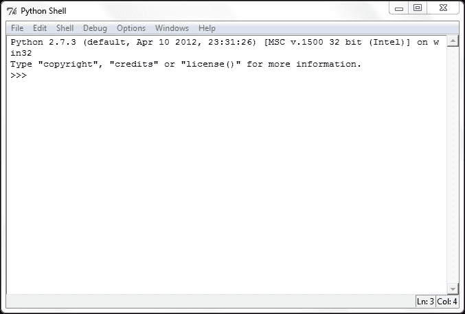

Python 外壳窗口用于显示脚本生成的输出和错误消息。初学者常见的错误是假设地理处理脚本将写入此外壳窗口。这不是事实。您需要创建一个单独的代码窗口来保存您的脚本。

虽然外壳窗口不用于编写整个脚本，但它可以用于交互式编写代码并立即获得反馈。ArcGIS 有一个内置的 Python 外壳窗口，您可以使用类似的方式使用它。我们将在下一章中检查 ArcGIS Python 窗口。

## Python 脚本窗口

您的脚本将写入 IDLE 中的单独窗口，称为 **Python 脚本窗口**。要创建新的代码窗口，从 IDLE 壳窗口导航到 **文件** | **新建窗口**。将显示类似以下窗口：

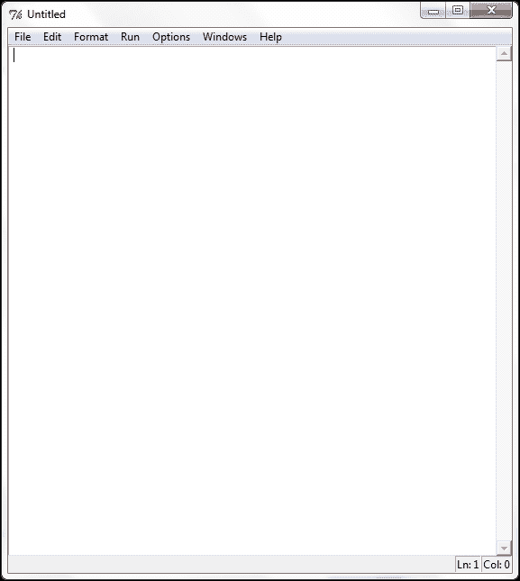

您的 Python 脚本将写入这个新的代码窗口。每个脚本都需要保存到本地或网络驱动器。默认情况下，脚本以 `.py` 文件扩展名保存，以表示它是一个 Python 脚本。

## 编辑现有的 Python 脚本

可以通过从 IDLE 壳窗口选择 **文件** | **打开** 来打开现有的 Python 脚本文件。此外，您还可以通过在 Windows 资源管理器中右键单击文件并选择 **使用 IDLE 编辑** 来打开 Python 脚本，这将打开一个新的外壳窗口以及加载到 Python 脚本编辑器中的脚本。您可以在下面的屏幕截图中看到示例：

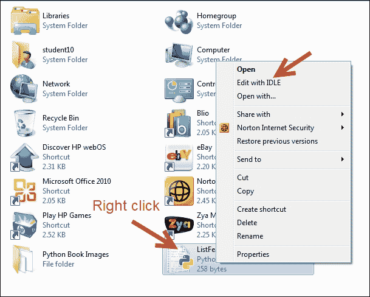

在这种情况下，我们已使用 IDLE 加载了 `ListFeatureClasses.py` 脚本。代码加载在脚本窗口中：

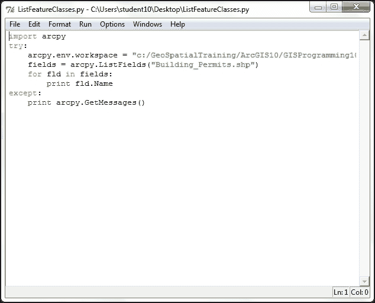

现在代码窗口已打开，您可以从头开始编写或编辑代码。您还可以使用 IDLE 界面进行一些基本的脚本调试。调试是识别和修复代码中错误的过程。

## 从 IDLE 执行脚本

一旦您在 IDLE 代码窗口中编写了地理处理脚本或打开了现有脚本，您就可以从界面中执行代码。IDLE 提供了允许您在运行脚本之前检查代码语法的功能。在代码窗口中，导航到 **运行** | **检查模块** 来执行代码的语法检查。

任何语法错误都会在外壳窗口中显示。如果没有语法错误，您应该只看到外壳窗口中的提示。虽然 IDLE 界面可以用来检查语法错误，但它不提供检查代码中逻辑错误的方法，也不提供其他开发环境中找到的更高级的调试工具，例如 PyScripter 或 Wingware。

一旦您确认代码中没有语法错误，您就可以运行脚本。导航到 **运行** | **运行模块** 来执行脚本：

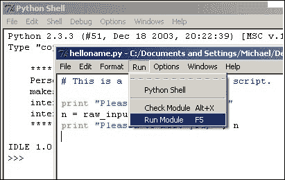

任何错误信息都将写入壳窗口，与 `print` 语句的输出和系统生成的消息一起。`print` 语句只是将文本输出到壳窗口。它通常用于更新正在运行的脚本的状态或用于调试代码。

# 使用 ArcGIS Python 窗口

在本教程中，您将学习如何使用 ArcGIS Python 窗口。在上一个部分，您学习了如何使用 Python 的 IDLE 开发环境，因此本部分将为您提供另一种编写地理处理脚本的替代方法。两种开发环境都可以使用，但人们通常会在 ArcGIS for Desktop Python 窗口中开始编写脚本，然后在脚本变得复杂时转向 IDLE 或其他开发环境。

## ArcGIS Python 窗口

ArcGIS Python 窗口是 ArcGIS for Desktop 10.x 中嵌入的交互式 Python 窗口。它较新，非常适合测试小块代码、学习 Python 基础知识、构建快速简便的工作流程以及执行地理处理工具。对于新手程序员来说，ArcGIS Python 窗口是一个很好的起点！

除了是编写代码的位置之外，ArcGIS Python 窗口还具有许多功能。您可以将窗口的内容保存到磁盘上的 Python 脚本文件中，或者将现有的 Python 脚本加载到窗口中。窗口可以是固定的或浮动的。在浮动状态下，窗口可以按您的意愿扩展或收缩。窗口还可以固定在 ArcGIS 显示的各个部分。您还可以通过右键单击窗口并选择 **格式** 来格式化窗口中显示的字体和文本颜色。

## 显示 ArcGIS Python 窗口

可以通过点击标准 ArcGIS for Desktop 工具栏上的 Python 窗口按钮来打开 Python 窗口，如图所示。这是一个浮动窗口，因此您可以按需调整大小，也可以将其停靠在 **ArcMap** 界面的各个位置：

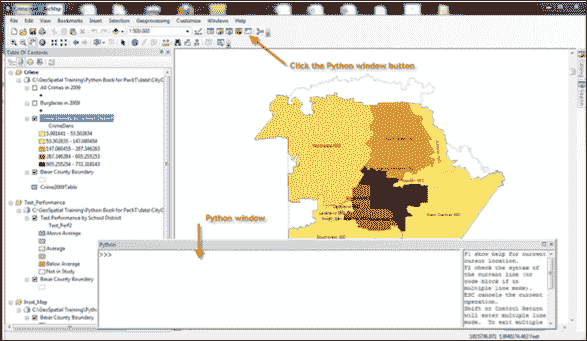

Python 窗口本质上是一个允许您逐行输入语句的壳窗口，就在 `>>>` 行输入字符之后。在分隔符的右侧，您将找到一个帮助窗口。

您可以通过在 Python 窗口内部右键单击并从菜单中选择 **加载…** 来加载现有的脚本。您还可以通过右键单击窗口并选择 **格式** 来格式化窗口中显示的字体和文本颜色。您将提供白色和黑色主题；您可以单独选择字体和颜色：

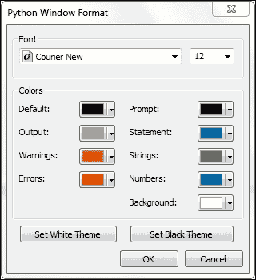

点击 **设置黑色主题** 按钮查看示例。如果您花很多时间编写代码，您可能会发现较暗的主题对眼睛更容易接受：

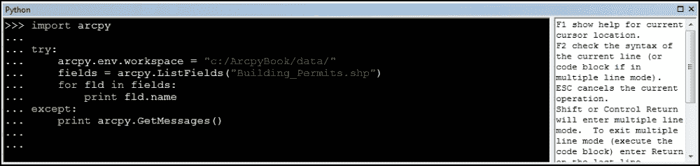

ArcGIS Python 窗口还提供了代码自动补全功能，这使程序员的编程生活变得更加容易。你可以通过打开 ArcGIS Python 窗口，在第一行输入 `arcpy` 后跟一个点来尝试这个功能。ArcPy 是一个面向模块的包，这意味着你使用点符号来访问对象的属性和方法。注意，提供了一个可下拉的物品列表。这些是可用于特定对象的工具、函数、类和扩展。所有对象都有它们自己的相关物品，因此展示的物品列表将根据你当前选择的对象而有所不同：

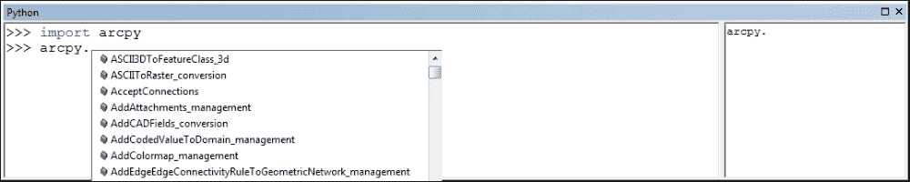

这是一个自动过滤的列表，所以当你开始输入工具、函数、类或扩展的名称时，列表将根据你输入的内容进行过滤：

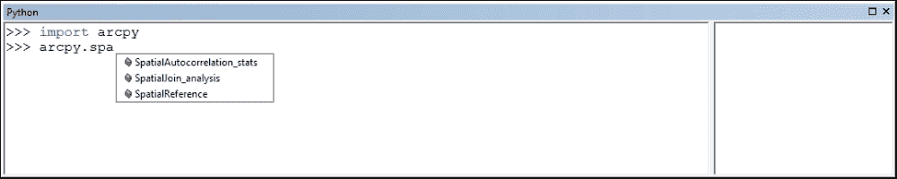

你可以选择让 Python 窗口自动为你补全文本，通过使用鼠标从列表中选择一个项目，或者使用箭头键突出显示你的选择，然后使用 *Tab* 键输入命令。这个自动补全功能使你成为一个更快、更高效的程序员。这不仅易于使用，而且还能显著减少你代码中的错误。 

# Python 语言基础

为了有效地编写 ArcGIS 的地理处理脚本，你需要至少了解 Python 语言的基本结构。Python 语言比大多数其他编程语言更容易学习，但学习并有效使用它仍需要一些时间。本节将教会你如何创建变量，将各种数据类型分配给变量，理解可以分配给变量的不同类型的数据，使用不同类型的语句，使用对象，读写文件，以及导入第三方 Python 模块。

## 注释代码

Python 脚本应遵循一个常见的结构。通常的做法是，每个脚本的开始部分应作为文档，详细说明脚本名称、作者以及脚本提供的处理功能的一般描述。这份介绍性文档将帮助您和其他未来的程序员快速扫描脚本的细节和目的。这份文档通过在 Python 中使用注释来完成。注释是您添加到脚本中的代码行，用作脚本提供的功能的文档。这些代码行以单个井号（`#`）或双井号（`##`）开头，后面跟着您需要用来记录代码的任何文本。Python 解释器不会执行这些代码行。它们只是用来记录您的代码。在下一张屏幕截图中，带有单个井号的注释代码行显示了代码行。您还应该努力在脚本中包含注释，以描述脚本的重要部分。当您需要更新脚本时，这对您（或另一位程序员）将非常有用：

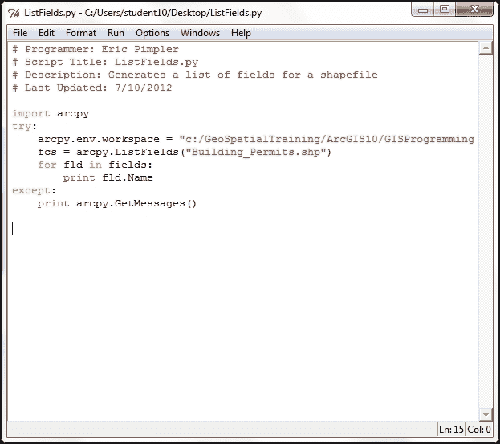

### 小贴士

**下载示例代码**

您可以从您在 [`www.PacktPub.com`](http://www.PacktPub.com) 的账户中下载您购买的所有 Packt 书籍的示例代码文件。如果您在其他地方购买了这本书，您可以访问 [`www.PacktPub.com/support`](http://www.PacktPub.com/support) 并注册，以便将文件直接通过电子邮件发送给您。

## 导入模块

虽然 Python 包含许多内置函数，但您将经常需要访问存储在外部模块中的特定功能包。例如，`Math` 模块存储与处理数值相关的特定函数，而 `R` 模块提供统计分析函数。我们尚未讨论函数的话题，但基本上函数是在调用时执行的命名代码块。模块通过使用 `import` 语句导入。当使用 ArcGIS 编写地理处理脚本时，您始终需要导入 `arcpy` 模块，这是用于访问 ArcGIS 提供的 GIS 工具和函数的 Python 包。`import` 语句将是您脚本中的第一行代码（不包括注释）。以下代码行导入了 `arcpy` 和 `os` 模块。Python 的 `os` 模块提供了一种与底层操作系统的接口方式：

```py
import arcpy
import os
```

## 变量

从高层次来看，你可以将变量视为在脚本运行期间为存储值而保留的计算机内存区域。在 Python 中定义的变量被赋予一个名称和一个值。分配给变量的值可以通过引用变量名来访问脚本的不同部分。例如，你可能创建一个包含要素类名称的变量，然后由 **Buffer** 工具使用该变量创建新的输出数据集。要创建变量，只需给它一个名称，后跟赋值运算符（即等号 `=`），然后是一个值：

```py
fcParcels = "Parcels"
fcStreets = "Streets"
```

以下表格展示了使用前面的代码示例中变量名和分配给变量的值：

| 变量名 | 变量值 |
| --- | --- |
| `fcParcels` | `Parcels` |
| `fcStreets` | `Streets` |

在创建变量时，你必须遵循某些命名规则，包括以下内容：

+   它可以包含字母、数字和下划线

+   第一个字符必须是一个字母

+   变量名中除了下划线外不能使用特殊字符

+   Python 关键字和空格是不允许的

有一些 Python 关键字必须避免，包括 `class`、`if`、`for`、`while` 以及其他一些。这些关键字通常与其他 Python 语句使用不同的字体颜色突出显示。

以下是一些 Python 中合法变量名的示例：

+   `featureClassParcel`

+   `fieldPopulation`

+   `field2`

+   `ssn`

+   `my_name`

这些是 Python 中非法变量名的示例：

+   `class`（Python 关键字）

+   `return`（Python 关键字）

+   `$featureClass`（非法字符，必须以字母开头）

+   `2fields`（必须以字母开头）

+   `parcels&Streets`（非法字符）

Python 是一种区分大小写的语言，因此在脚本中注意变量的大小写和命名非常重要。区分大小写的问题可能是新 Python 程序员最常见的错误来源，因此在遇到代码中的错误时，始终考虑这一点作为可能性。让我们看一个例子。以下是一个包含三个变量的列表；请注意，尽管每个变量名相同，但大小写不同，因此产生了三个不同的变量：

+   `mapsize = "22x34"`

+   `MapSize = "8x11"`

+   `Mapsize = "36x48"`

如果你打印这些变量，你将得到以下输出：

```py
print(mapsize)
>>> 22x34

print(MapSize)
>>> 8x11  #output from print statement

print(Mapsize)
>>>36x48  #output from print statement
```

Python 变量名在整个脚本中需要保持一致。最佳实践是使用驼峰命名法，即变量名的第一个单词全部小写，然后每个后续单词以大写字母开头。以下示例中的 `fieldOwnerName` 变量名展示了这一概念：第一个单词（`field`）全部小写，第二个单词（`Owner`）和第三个单词（`Name`）以大写字母开头：

```py
fieldOwnerName
```

在 Python 中，变量是动态类型的。**动态类型**意味着你可以定义一个变量并给它分配数据，而不必明确指定变量名将包含特定类型的数据。可以分配给变量的常用数据类型包括以下几种：

| 数据类型 | 示例值 | 代码示例 |
| --- | --- | --- |
| 字符串 | `"Streets"` | `fcName = "Streets"` |
| 数字 | `3.14` | `percChange = 3.14` |
| 布尔值 | `True` | `ftrChanged = True` |
| 列表 | `"Streets", "Parcels", "Streams"` | `lstFC = ["Streets", "Parcels", "Streams"]` |
| 字典 | `'0':Streets,'1':Parcels` | `dictFC = {'0':Streets,'1':Parcels}` |
| 对象 | `Extent` | `spatialExt = map.extent` |

我们将在接下来的章节中更详细地讨论这些数据类型。

例如，在 C# 中，在使用变量之前，你需要定义变量的名称和类型。在 Python 中这不是必需的。要使用变量，只需给它一个名称和值，你就可以立即开始使用它。Python 会幕后工作以确定变量中存储的数据类型。

在下面的 C# 代码示例中，我们创建了一个名为 `aTouchdown` 的新变量，它被定义为整数变量，这意味着它只能包含整数数据。然后我们将 `6` 的值分配给这个变量：

```py
int aTouchdown;
aTouchdown = 6;
```

在 Python 中，可以通过动态类型创建和分配数据。Python 解释器负责动态确定分配给变量的数据类型：

```py
aTouchdown = 6
```

有时候，你可能知道你的脚本将需要一个变量，但事先并不一定知道将分配什么数据给这个变量。在这些情况下，你可以简单地定义一个变量而不给它分配数据。在这里，你将找到一个代码示例，展示了如何创建一个未分配数据的变量：

```py
aVariable = ''
aVariable = NULL
```

在脚本运行时，分配给变量的数据也可以更改。

变量可以存储许多不同类型的数据，包括原始数据类型，如字符串和数字，以及更复杂的数据，如列表、字典甚至对象。我们将检查可以分配给变量的不同数据类型，以及 Python 提供的用于操作数据的各种函数。

## 内置数据类型

Python 有许多内置数据类型。我们将首先讨论的内置类型是 `string` 数据类型。我们已经看到了几个 `string` 变量的例子，但这类变量可以以多种方式操作，所以让我们更仔细地看看这个数据类型。

### 字符串

字符串是有序字符集合，用于存储和表示基于文本的信息。这可以说是一种相当枯燥的说法，即字符串变量持有文本。当将文本赋给变量时，字符串变量被单引号或双引号包围。示例可能包括姓名、要素类名称、`Where`子句或任何可以编码为文本的内容。

#### 字符串操作

在 Python 中，字符串可以通过多种方式进行操作。字符串连接是更常用的函数之一，并且实现简单。使用`+`运算符与操作符两边的`string`变量一起使用，以产生一个新的`string`变量，将两个字符串变量连接在一起：

```py
shpStreets = "c:\\GISData\\Streets" + ".shp"
print(shpStreets)
```

运行此代码示例会产生以下结果：

```py
>>>c:\GISData\Streets.shp
```

可以使用 Python 的`==`运算符测试字符串的相等性，该运算符简单地放置了两个等号。不要将相等运算符与赋值运算符混淆，赋值运算符是一个单独的等号。相等运算符测试两个变量是否相等，而赋值运算符将值赋给变量：

```py
firstName = "Eric"
lastName = "Pimpler"
firstName == lastName
```

运行此代码示例会产生以下结果，因为`firstName`和`lastName`变量不相等：

```py
>>>False
```

可以使用`in`运算符测试字符串是否包含，如果第一个操作数包含在第二个操作数中，则返回`True`：

```py
fcName = "Floodplain.shp"
print(".shp" in fcName)
>>>True
```

我简要地提到过字符串是一个有序字符集合。这意味着什么？这仅仅意味着我们可以从字符串中访问单个字符或一系列字符，并且字符的顺序将保持不变，直到我们改变它们。某些集合，如字典，不保持一定的顺序。在 Python 中，这种情况被称为访问单个字符时的**索引**，以及访问一系列字符时的**切片**。

通过在字符串后提供方括号内的数字偏移量，可以获取字符串中的字符。例如，您可以使用`fc[0]`语法获取`fc`变量中的第一个字符串字符。Python 是一种零基语言，意味着列表中的第一个项是`0`。可以使用负偏移量从字符串的末尾向前搜索。在这种情况下，字符串中的最后一个字符存储在`-1`索引处。索引始终创建一个新的变量来保存字符：

```py
fc = "Floodplain.shp"
print(fc[0])
>>>'F'
print(fc[10])
>>>'.'
print(fc[13])
>>>'p'
```

以下图像说明了字符串是有序字符集合，第一个字符占据**0**位置，第二个字符占据**1**位置，每个后续字符占据下一个索引号：


虽然字符串索引允许您从`string`变量中获取单个字符，但字符串切片允许您提取连续的字符串序列。其格式和语法与索引类似，但增加了第二个偏移量，用于告诉 Python 返回哪些字符。

以下代码示例提供了一个字符串切片的例子。`theString`变量已被分配值为`Floodplain.shp`。要获取包含 Flood 内容的切片变量，您可以使用`theString[0:5]`语法：

```py
theString = "Floodplain.shp"
print(theString[0:5])
>>>Flood
```

### 注意

Python 的切片操作返回从第一个偏移量开始的字符，直到但不包括第二个偏移量。这对新 Python 程序员来说可能特别令人困惑，并且是错误的一个常见来源。在我们的示例中，返回的变量将包含 `Flood` 字符。第一个字符，占据 `0` 位置，是 `F`。返回的最后一个字符是 `4` 索引，对应于 `d` 字符。请注意，`5` 索引号不包括在内，因为 Python 的切片操作只返回到但不包括第二个偏移量的字符。

可以省略任一偏移量。这实际上创建了一个通配符。在 `theString[1:]` 的情况下，您告诉 Python 返回从第二个字符开始到字符串末尾的所有字符。在第二种情况下，`theString[:-1]`，您告诉 Python 从字符零开始，返回除了最后一个字符之外的所有字符。

Python 是一种非常出色的字符串操作语言，并且有许多额外的函数可以用来处理这类数据。大多数这些函数超出了本文的范围，但一般来说，以下所有的字符串操作函数都是可用的：

+   字符串长度

+   大小写转换函数

+   移除前导和尾随空白

+   在字符串中查找字符

+   文本替换

+   根据分隔符分割成单词列表

+   格式化

您的 ArcGIS Python 地理处理脚本通常会需要引用您计算机上或可能是一个共享服务器上的数据集位置。对这些数据集的引用通常由存储在变量中的路径组成。在 Python 中，路径名是一个特殊情况，值得特别提及。Python 中的反斜杠字符是一个保留的转义字符和行续行字符，因此需要使用两个反斜杠、一个正斜杠或以 `r` 前缀的常规单个反斜杠来定义路径。这些路径名在 Python 中始终以字符串的形式存储。您将在下一节中看到一个示例。

非法路径引用的示例如下：

```py
fcParcels = "c:\Data\Parcels.shp"
```

合法路径引用的示例如下：

```py
fcParcels = "c:/Data/Parcels.shp"
fcParcels = "c:\\Data\\Parcels.shp"
fcParcels = r"c:\Data\Parcels.shp"
```

### 数字

Python 还内置了对数值数据类型（包括 `int`、`long`、`float` 和 `complex`）的支持。数值的赋值方式与字符串类似，只是不需要在值周围加上引号，并且显然它必须是一个数值。

Python 支持所有常用的数值运算符，包括加法、减法、乘法、除法和取模或余数。除此之外，还有用于返回绝对值、将字符串转换为数值数据类型和四舍五入的函数。

虽然 Python 提供了一些内置的数学函数，但可以使用 `math` 模块来访问更多高级的 `math` 函数。要使用这些函数，您必须按照以下方式明确导入 `math` 模块：

```py
import math
```

`math` 模块提供的函数包括返回数字的上限和下限、绝对值、三角函数、对数函数、角度转换和双曲函数。值得注意的是，没有简单的函数可以计算平均值或平均数，这些必须编写代码来计算。有关 `math` 模块的更多详细信息，可以通过导航到 **所有程序** | **ArcGIS** | **Python 2.7** | **Python 手册** 来找到。在打开 Python 手册后，导航到 **Python 标准库** | **数值和数学模块**。你也可以参考这个来了解任何数据类型、语法、内置函数以及其他你希望详细了解的内容，其中有很多内容无法在此处涵盖。

### 列表

Python 提供的第三种内置数据类型是列表。列表是有序元素集合，可以存储 Python 支持的任何类型的数据，同时还能同时存储多种数据类型。这可以包括数字、字符串、其他列表、字典或对象。例如，一个列表变量可以同时存储数字和字符串数据。列表是基于零的，列表中的第一个元素占据**0**的位置。这一点在此处得到了说明：


列表中的每个后续对象都会增加一个。此外，列表还具有动态增长和收缩的特殊能力。

列表是通过分配一系列括号内的值来创建的。要从列表中提取值，只需在变量名旁边使用括号内的整数值即可。以下代码示例提供了这一点的说明：

```py
fcList = ["Hydrants", "Water Mains", "Valves", "Wells"]
fc = fcList[0] ##first item in the list - Hydrants
print(fc)
>>>Hydrants
fc = fcList[3]  ##fourth item in the list - Wells
print(fc)
>>>Wells
```

你可以通过使用 `append()` 方法向现有列表中添加新项目，如下面的代码示例所示：

```py
fcList.append("Sewer Pipes")
print(fcList)
>> Hydrants, Water Mains, Valves, Wells, Sewer Pipes
```

你还可以使用切片与列表来返回多个值。要切片一个列表，你可以提供两个由冒号分隔的偏移量值，如下面的代码示例所示。第一个偏移量表示起始索引号，第二个表示停止点。第二个索引号将不会返回。**切片**列表始终返回一个新的列表：

```py
fcList = ["Hydrants", "Water Mains", "Valves", "Wells"]
fc = fcList[0:2] ##get the first two items – Hydrants, Water Mains
```

列表本质上是动态的，这意味着你可以向现有列表中添加和删除项目，以及更改现有内容，而无需创建列表的新副本。在列表中更改值可以通过索引或切片完成。索引允许你更改单个值，而切片允许你更改多个列表项。

列表有许多方法可以让你操作列表中的值。你可以通过使用`sort()`方法以升序或降序对列表的内容进行排序。你可以使用`append()`方法向列表中添加项，该方法将对象添加到列表的末尾，以及使用`insert()`方法在列表中的某个位置插入对象。你可以使用`remove()`方法从列表中删除项，该方法从列表中删除第一个出现的值，或者使用`pop()`方法删除并返回列表末尾的对象。你还可以使用`reverse()`方法反转列表的内容。

### 元组

元组与列表类似，但有一些重要的区别。就像列表一样，元组包含一系列值。元组的内容可以包括任何类型的数据，就像列表一样。然而，与列表不同，元组的内容是静态的。一旦创建了元组，你就不能更改值的序列，也不能添加或删除值。这在需要数据始终占据特定位置的情况下可能是个好事。创建元组就像在圆括号内放置一些用逗号分隔的值一样简单，如下面的代码示例所示：

```py
fcTuples = ("Hydrants", "Water Mains", "Valves", "Wells")
```

你可能已经注意到创建元组与创建列表非常相似。唯一的区别是，在值周围使用圆括号而不是方括号。

与列表类似，元组的索引从`0`开始。访问存储在元组中的值的方式与列表相同。这将在下面的代码示例中说明：

```py
fcTuples = ("Hydrants", "Water Mains", "Valves", "Wells")
print(fcTuples[1])
>>>Water Mains
```

当结构的内容需要是静态的时候，通常使用元组来代替列表。你不能通过列表来确保这一点，但你可以通过元组来确保。

### 字典

字典是 Python 中的第二种集合对象类型。它们与列表类似，但字典是一个无序的对象集合。不是通过使用偏移量从集合中检索对象，而是通过键来存储和检索字典中的项。每个字典中的键都有一个关联的值，如下所示：

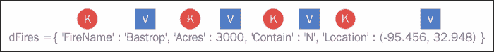

与列表类似，字典可以通过使用`dictionary`上的方法在原地增长和缩小。在下面的代码示例中，你将学习如何创建和填充字典，并看到如何通过使用键来访问值。字典是通过使用花括号创建的。在这些括号内，每个键后面跟着一个冒号，然后与键关联一个值。这些键/值对由逗号分隔：

```py
##create the dictionary
dictLayers = {'Roads': 0, 'Airports': 1, 'Rail': 2}

##access the dictionary by key
print(dictLayers['Airports'])
>>>1
print(dictLayers['Rail'])
>>>2
```

基本的`字典`操作包括获取字典中的项目数量、使用键获取值、确定键是否存在、将键转换为列表以及获取值的列表。`字典`对象可以在原地更改、扩展和缩小。这意味着 Python 不需要创建一个新的`字典`对象来保存字典的更改版本。通过在方括号中声明键值并将其设置为某个值，可以完成对`字典`键的赋值。

### 小贴士

与列表不同，由于字典的内容是无序的，因此不能进行切片。如果你需要遍历字典中的所有值，只需使用`keys()`方法，它返回字典中所有键的集合，然后可以单独使用它们来设置或获取它们的值。

## 类和对象

类和对象是面向对象编程的基本概念。虽然 Python 更偏向于过程式语言，但它也支持面向对象编程。在面向对象编程中，类用于创建对象实例。你可以把类看作是创建一个或多个对象的蓝图。每个对象实例都有相同的属性和方法，但对象中包含的数据可以并且通常会有所不同。对象是 Python 中的复杂数据类型，由属性和方法组成，可以像任何其他数据类型一样分配给变量。属性包含与对象相关的数据，而方法则是对象可以执行的操作。

这些概念最好通过一个例子来解释。在 ArcPy 中，`extent`类是通过提供地图单位中左下角和右上角的坐标来指定矩形的类。`extent`类包含许多属性和方法。属性包括`XMin`、`XMax`、`YMin`、`YMax`、`spatialReference`等。`x`和`y`属性的极大值提供了范围矩形的坐标。`spatialReference`属性持有`extent`的`spatialReference`对象的引用。`extent`类的对象实例既可以用来设置也可以用来通过点表示法获取这些属性的值。以下代码示例展示了这一点：

```py
# get the extent of the county boundary
ext = row[0].extent
# print out the bounding coordinates and spatial reference
print("XMin: " + str(ext.XMin))
print("XMax: " + str(ext.XMax))
print("YMin: " + str(ext.YMin))
print("YMax: " + str(ext.YMax))
print("Spatial Reference: " + ext.spatialReference.name)
```

运行此脚本会产生以下输出：

```py
XMin: 2977896.74002
XMax: 3230651.20622
YMin: 9981999.27708
YMax:10200100.7854
Spatial Reference: NAD_1983_StatePlane_Texas_Central_FIPS_4203_Feet
```

`extent`类也有许多方法，这些是对象可以执行的操作。对于这个特定的对象，大多数方法都与在`extent`对象和另一个几何体之间执行某种几何测试相关。例如包括`contains()`、`crosses()`、`disjoint()`、`equals()`、`overlaps()`、`touches()`和`within()`。

你需要理解的一个额外的面向对象的概念是**点表示法**。点表示法提供了一种访问对象属性和方法的方式。它用于表示一个属性或方法属于特定的类。

使用点符号的语法包括一个对象实例，后面跟着一个点，然后是属性或方法。无论您是访问属性还是方法，语法都是相同的。在点后面的单词末尾的括号和零个或多个参数表示正在访问一个方法。以下是一些示例，以更好地说明这一概念：

```py
Property: extent.XMin
Method: extent.touches()
```

## 语句

您用 Python 编写的每一行代码都称为**语句**。有各种不同类型的语句，包括创建和分配数据到变量的语句、基于测试分支代码的决策支持语句、执行代码块多次的循环语句等。在创建脚本中的语句时，您的代码需要遵循各种规则。您已经遇到了一种类型的语句：变量创建和赋值。

### 决策支持语句

`if`/`elif`/`else`语句是 Python 中的主要决策语句，用于测试`True`/`False`条件。决策语句使您能够控制程序的流程。以下是一些您可以在代码中做出的决策示例：如果变量包含点要素类，获取`X`、`Y`坐标；如果要素类名称等于`Roads`，则获取`Name`字段。

决策语句，如`if`/`elif`/`else`，测试`True`/`False`条件。在 Python 中，`True`值表示任何非零数字或非空对象。`False`值表示`not true`，在 Python 中用零数字或空对象表示。比较测试返回一个或零（真或假）的值。布尔和/or 运算符返回真或假的操作数值：

```py
if fcName == 'Roads':
  arcpy.Buffer_analysis(fc, "c:\\temp\\roads.shp", 100)
elif fcName == 'Rail':
  arcpy.Buffer_analysis(fc, "c:\\temp\\rail.shp", 50)
else:
  print("Can't buffer this layer")
```

Python 代码必须遵循某些语法规则。语句依次执行，直到您的代码分支。分支通常通过使用`if`/`elif`/`else`来实现。此外，使用循环结构，如`for`和`while`，可以改变语句流程。Python 自动检测语句和代码块边界，因此不需要在代码块周围使用大括号或分隔符。相反，缩进用于将语句分组到代码块中。许多语言使用分号来终止语句，但 Python 只是使用行尾字符来标记语句的结束。复合语句包括一个"`:`"字符。复合语句遵循以下模式，即以冒号结束的标题。然后，代码块作为单个语句编写，并缩进在标题下方。

### 循环语句

循环语句允许你的程序根据需要重复执行代码行。`while`循环会重复执行循环顶部的测试评估为`True`的语句块。当条件测试评估为`False`时，Python 开始立即解释`while`循环之后的代码。在下一个代码示例中，`10`的值已被分配给`x`变量。`while`循环的测试检查`x`是否小于`100`。如果`x`小于`100`，则将`x`的当前值打印到屏幕上，并将`x`的值增加`10`。然后，处理继续进行`while`循环测试。第二次，`x`的值将是`20`；因此，测试再次评估为`True`。这个过程会一直持续到`x`等于或大于`100`。此时，测试将评估为`False`，处理将停止。非常重要的一点是`while`语句必须有一种方法跳出循环。否则，你将陷入无限循环。无限循环是计算机程序中的一系列指令，它无限循环，要么是因为循环没有终止条件，要么是因为有一个永远无法满足的条件，或者是因为它导致循环重新开始：

```py
x = 10
while x < 100:
     print(x)
     x = x + 10
```

`for`循环执行一个预定的次数的语句块。它们有两种类型——一个计数循环，用于执行固定次数的代码块，和一个列表循环，它允许你遍历列表中的所有对象。以下示例中的列表循环对字典中的每个值执行一次，然后停止循环：

```py
dictLayers = {"Roads":"Line","Rail":"Line","Parks":"Polygon"}
for key in dictLayers:
  print(dictLayers[key])
```

有时候，你可能需要从循环的执行中跳出。`break`和`continue`语句可以用来做到这一点。`break`跳出最近的封闭循环，而`continue`跳回到最近的封闭循环的顶部。这些语句可以出现在代码块中的任何位置。

### 尝试语句

`try`语句是一个完整的、复合语句，用于处理异常。异常是一种高级控制设备，主要用于错误拦截或触发。Python 中的异常可以被拦截或触发。当你的代码中出现错误条件时，Python 会自动触发一个异常，这个异常可能或可能不会被你的代码处理。作为程序员，你有责任捕获自动触发的异常。异常也可以通过你的代码手动触发。在这种情况下，你还需要提供一个异常处理例程来捕获这些手动触发的异常。

`try`语句有两种基本类型：`try`/`except`/`else`和`try`/`finally`。基本的`try`语句从`try`标题行开始，后面跟着一个缩进的语句块。然后，这后面跟着一个或多个可选的`except`子句，这些子句命名了要捕获的异常。之后，你将在末尾找到一个可选的`else`子句：

```py
import arcpy
import sys

inFeatureClass = arcpy.GetParameterAsText(0)
outFeatureClass = arcpy.GetParameterAsText(1)

try:
  # If the output feature class exists, raise an error

  if arcpy.Exists(inFeatureClass):
    raise overwriteError(outFeatureClass)
  else:
    # Additional processing steps
    print("Additional processing steps")

except overwriteError as e:
  # Use message ID 12, and provide the output feature class
  #  to complete the message.

  arcpy.AddIDMessage("Error", 12, str(e))
```

`try`/`except`/`else` 语句的工作原理如下。一旦进入 `try` 语句块，Python 会标记你处于 `try` 块中，并且知道在此点发生的任何异常条件都将被发送到各个 `except` 语句进行处理。如果找到匹配的异常，则执行 `except` 块内的代码块。然后代码会继续执行完整的 `try` 语句，这将在稍后提到。在这种情况下，`else` 语句不会执行。`try` 块内的每个语句都会执行。假设没有发生异常条件，代码指针将跳转到 `else` 语句并执行 `else` 语句包含的代码块，然后再移动到 `try` 块之后的下一行代码。

另一种类型的 `try` 语句是 `try`/`finally` 语句，它允许执行最终化操作。当在 `try` 语句中使用 `finally` 子句时，其语句块总是在最后执行，无论是否发生错误条件。

下面是 `try`/`finally` 语句的工作方式：如果发生异常，Python 会运行 `try` 块，然后是 `except` 块，接着是 `finally` 块，然后继续执行 `try` 语句之后的代码。如果在执行过程中没有发生异常，Python 会运行 `try` 块，然后是 `finally` 块。这在你想要确保代码块运行后发生某个动作时很有用，无论是否发生错误条件。清理操作，如关闭文件或数据库连接，通常放置在 `finally` 块中，以确保无论代码中是否发生异常都会执行：

```py
import arcpy

try:
  if arcpy.CheckExtension("3D") == "Available":
    arcpy.CheckOutExtension("3D")
  else:
    # Raise a custom exception
    raise LicenseError

  arcpy.env.workspace = "D:/GrosMorne"
  arcpy.HillShade_3d("WesternBrook", "westbrook_hill", 300)
  arcpy.Aspect_3d("WesternBrook", "westbrook_aspect")

except LicenseError:
  print("3D Analyst license is unavailable")
except:
  print(arcpy.GetMessages(2))
finally:
  # Check in the 3D Analyst extension
  arcpy.CheckInExtension("3D")
```

### `with` 语句

当你有两个相关的操作需要作为一个代码块中的配对执行时，`with` 语句就很有用。使用 `with` 语句的常见场景是打开、读取和关闭文件。打开和关闭文件是相关操作，而读取文件和对其内容进行处理是中间的代码块。在编写 ArcGIS 的地理处理脚本时，使用 ArcGIS 10.1 版本引入的新 `cursor` 对象非常适合使用 `with` 语句。我们将在稍后的章节中详细讨论 `cursor` 对象，但现在我将简要描述这些对象。游标是特征类或表属性表的记录的内存副本。游标有多种类型。插入游标允许你插入新记录，搜索游标是记录的只读副本，而更新游标允许你编辑或删除记录。使用 `with` 语句可以自动打开、以某种方式处理并关闭游标对象。

文件或游标对象的关闭由 `with` 语句自动处理，从而实现更简洁、更高效的编码。这基本上就像使用 `try`/`finally` 块，但代码行数更少。在下面的代码示例中，`with` 块用于创建一个新的搜索游标，从游标中读取信息，并隐式关闭游标：

```py
import arcpy

fc = "c:/data/city.gdb/streets"

# For each row print the Object ID field, and use the SHAPE@AREA
# token to access geometry properties

with arcpy.da.SearchCursor(fc, ("OID@", "SHAPE@AREA")) as cursor:
  for row in cursor:
    print("Feature {0} has an area of {1}".format(row[0], row[1]))
```

### 语句缩进

语句缩进值得特别提及，因为它对于 Python 解释代码的方式至关重要。Python 中的复合语句使用缩进来创建一组语句。这包括 `if`/`then`、`for`、`while`、`try` 和 `with` 语句。Python 解释器使用缩进来检测这些代码块。复合语句的开始是通过冒号的使用来定义的。所有跟在复合语句开始之后的行都应该缩进相同的距离。你可以使用任意数量的空格来定义缩进，但你应该为每个语句使用相同的缩进级别。一个常见的做法是通过使用制表符来定义缩进。当 Python 解释器遇到一个缩进较少的行时，它将假设代码块已结束。以下代码通过使用 `try` 语句说明了这个概念。注意，在 `try` 语句之后有一个冒号。这表示随后的语句是复合语句的一部分，应该缩进。这些语句将形成一个代码块。

此外，一个 `if` 语句位于 `try` 语句内部。这也被视为一个复合语句，这是通过语句末尾的冒号定义的。因此，任何属于 `if` 语句的语句都应该进一步缩进。你也应该注意到，`if` 语句内部有一个没有缩进的语句，但它处于同一级别。这个 `statement4` 是 `try` 代码块的一部分，但不是 `if` 代码块的一部分：

```py
try:
  if <statement1>:
    <statement2>
    <statement3>
  <statement4> <………..>
except:
  <statement>
  <………..>
except:
  <statement>
  <…………>
```

许多语言，包括 JavaScript、Java 和 .NET，使用花括号来表示一组语句。Python 通过使用缩进来代替花括号，试图减少你不得不编写的代码量，并使代码更易于阅读。任何使用过这些其他语言的人都可以证实，阅读包含许多花括号的代码是多么困难。然而，缩进确实需要一些习惯，并且对于 Python 执行代码行的方式至关重要。

## 文件输入输出

你经常会发现需要从你的计算机上的文件中检索或写入信息。Python 有一个内置的对象类型，它提供了一种访问文件以执行许多任务的方法。我们只将涵盖文件操作功能的一小部分，但我们将涉及最常用的函数，包括打开和关闭文件，以及将数据读取和写入文件。

Python 的 `open()` 函数创建一个文件对象，该对象作为你电脑上文件的一个链接。在读取和/或写入文件数据之前，必须在文件上调用 `open()` 函数。`open()` 函数的第一个参数是你想要打开的文件的路径。第二个参数对应于一个模式，通常是读取（`r`）、写入（`w`）或追加（`a`）。`r` 的值表示你想要以只读方式打开文件，而 `w` 的值表示你想要以写入方式打开文件。如果你以写入方式打开一个已存在的文件，这将覆盖文件中现有的任何数据，所以你必须小心使用写入模式。追加模式（`a`）将以写入方式打开文件，但不会覆盖任何现有数据，而是将新数据追加到文件末尾。以下代码示例展示了如何使用 `open()` 函数以只读模式打开一个文本文件：

```py
with open('Wildfires.txt','r') as f:
```

注意，我们同样使用了 `with` 关键字来打开文件，确保在使用该文件的代码执行完毕后，文件资源将被 *清理*。

文件打开后，可以使用多种方式和多种方法从中读取数据。最典型的情况是使用 `readline()` 方法逐行从文件中读取数据。`readline()` 函数可以将文件逐行读入一个字符串变量中。你需要在 Python 代码中创建一个循环机制来逐行读取整个文件。如果你希望将整个文件读入一个变量中，可以使用 `read()` 方法，该方法将读取文件直到 **文件结束标记** (**EOF**)。你也可以使用 `readlines()` 方法来读取文件的全部内容，将每一行分割成单独的字符串，直到找到 EOF。

在以下代码示例中，我们以只读模式打开了一个名为 `Wildfires.txt` 的文本文件，并使用 `readlines()` 方法将文件的全部内容读入一个名为 `lstFires` 的变量中，该变量是一个 Python 列表，包含文件中的每一行作为一个单独的字符串值。在这种情况下，`Wildfire.txt` 文件是一个以逗号分隔的文本文件，包含火灾的纬度和经度以及每个火灾的置信度值。然后我们遍历 `lstFires` 中的每一行文本，并使用 `split()` 函数根据逗号作为分隔符提取值，包括纬度、经度和置信度值。纬度和经度值用于创建一个新的 `Point` 对象，然后使用插入游标将其插入到要素类中：

```py
import arcpy, os
try:

  arcpy.env.workspace = "C:/data/WildlandFires.mdb"
  # open the file to read
  with open('Wildfires.txt','r') as f:   #open the file

    lstFires = f.readlines() #read the file into a list
    cur = arcpy.InsertCursor("FireIncidents")

    for fire in lstFires: #loop through each line
      if 'Latitude' in fire: #skip the header
        continue
      vals = fire.split(",") #split the values based on comma
      latitude = float(vals[0]) #get latitude
      longitude = float(vals[1]) #get longitude
      confid = int(vals[2]) #get confidence value
      #create new Point and set values
      pnt = arcpy.Point(longitude,latitude) 
      feat = cur.newRow()
      feat.shape = pnt
      feat.setValue("CONFIDENCEVALUE", confid)
      cur.insertRow(feat) #insert the row into featureclass
except:
    print(arcpy.GetMessages()) #print out any errors
finally:
  del cur
  f.close()
```

就像读取文件一样，有几种方法可以将数据写入文件。`write()` 函数可能是最容易使用的，它接受一个字符串参数并将其写入文件。`writelines()` 函数可以用来将列表结构的内容写入文件。在下面的代码示例中，我们创建了一个名为 `fcList` 的列表结构，其中包含一系列要素类。我们可以使用 `writelines()` 方法将此列表写入文件：

```py
outfile = open('c:\\temp\\data.txt','w')
fcList = ["Streams", "Roads", "Counties"]
outfile.writelines(fcList)
```

# 摘要

在本章中，我们介绍了一些基本的 Python 编程概念，这些概念是在你能够编写有效的地理处理脚本之前需要理解的。我们以 IDLE 开发环境的概述开始本章，用于编写和调试 Python 脚本。你学习了如何创建新脚本、编辑现有脚本、检查语法错误以及执行脚本。我们还涵盖了基本语言结构，包括导入模块、创建和分配变量、if/else 语句、循环语句以及各种数据类型，包括字符串、数字、布尔值、列表、字典和对象。你还学习了如何读取和写入文本文件。
