# 第二章：管理地图文档和图层

在本章中，我们将介绍以下菜谱：

+   引用当前地图文档

+   在磁盘上引用地图文档

+   获取地图文档中的图层列表

+   限制图层列表

+   缩放到选定的要素

+   改变地图范围

+   将图层添加到地图文档

+   将图层插入到地图文档中

+   更新图层符号

+   更新图层属性

+   在数据框架中处理具有时间功能的图层

# 简介

ArcPy 映射模块为地图自动化提供了许多令人兴奋的功能，包括管理地图文档和图层文件以及这些文件中的数据的能力。支持自动化地图导出和打印、创建 PDF 地图集以及将地图文档发布到 ArcGIS Server 地图服务。这是一个极其有用的模块，可以完成 GIS 分析师日常执行的大多数任务。

在本章中，您将学习如何使用 ArcPy 映射模块来管理地图文档和图层文件。您还将学习如何从地图文档文件中添加和删除地理图层和表格，将图层插入到数据框架中，以及在地图文档中移动图层。最后，您将学习如何更新图层属性和符号。

# 引用当前地图文档

当从 ArcGIS Python 窗口或自定义脚本工具运行地理处理脚本时，您通常会需要引用当前加载在 ArcMap 中的地图文档。在您对地图文档中的图层和表执行地理处理操作之前，这是脚本中的第一步。在本菜谱中，您将学习如何从您的 Python 地理处理脚本中引用当前地图文档。

## 准备工作

在您实际上对地图文档文件执行任何操作之前，您需要在您的 Python 脚本中引用它。这是通过在`arcpy.mapping`模块上调用`MapDocument()`方法来完成的。您可以引用当前正在运行的文档或磁盘上特定位置的文档。要引用当前活动文档，您只需将关键字`CURRENT`作为参数提供给`MapDocument()`函数。这将加载 ArcMap 中当前活动的文档。以下代码示例显示了如何获取当前活动文档的引用：

```py
mxd = mapping.MapDocument("CURRENT")
```

### 注意

您只能在从 ArcGIS Python 窗口或 ArcToolbox 中的自定义脚本工具运行脚本时使用`CURRENT`关键字。如果您尝试从 IDLE 或任何其他开发环境运行脚本时使用此关键字，它将无法访问当前加载在 ArcGIS 中的地图文档文件。我还应该指出，`CURRENT`关键字不区分大小写。您也可以简单地使用`"current"`。

要引用本地或远程驱动器上的地图文档，只需提供地图文档的路径以及地图文档名称作为`MapDocument()`参数即可。例如，您将使用以下引用引用`c:\data`文件夹中的`crime.mxd`文件：`arcpy.mapping.MapDocument("C:/data/crime.mxd")`。

## 如何操作…

按照以下步骤学习如何在 ArcMap 中访问当前活动地图文档：

1.  使用 ArcMap 打开`c:\ArcpyBook\Ch2\Crime_Ch2.mxd`。

1.  点击位于主 ArcMap 工具栏上的 Python 窗口按钮。

1.  通过在 Python 窗口中输入以下内容来导入`arcpy.mapping`模块。在这里，以及未来的菜谱中，我们将`arcpy.mapping`模块分配给一个名为`mapping`的变量。这将使您的代码更容易阅读，并减少您需要编写的代码量。您不需要在所有代码前都加上`arcpy.mapping`前缀，您只需将其称为`mapping`即可。虽然这不是强制性的，但它确实使您的代码更整洁，编写起来更快。此外，您可以按自己的意愿命名变量。例如，您不必将其称为`mapping`，您也可以将其称为`MAP`、`mp`或任何有意义的名称。

    ```py
    import arcpy.mapping as mapping
    ```

1.  通过在 Python 窗口中输入以下内容，引用当前活动文档（`Crime_Ch2.mxd`）并将引用分配给变量：

    ```py
    mxd = mapping.MapDocument("CURRENT")
    ```

1.  为地图文档设置标题：

    ```py
    mxd.title = "Crime Project"
    ```

1.  使用`saveACopy()`方法保存地图文档文件的副本：

    ```py
    mxd.saveACopy("c:/ArcpyBook/Ch2/crime_copy.mxd")
    ```

1.  导航到**文件** | **地图文档属性**，以查看您为地图文档设置的新标题。

1.  您可以通过检查`c:\ArcpyBook\code\Ch2\ReferenceCurrentMapDocument.py`解决方案文件来检查您的工作。

## 它是如何工作的…

`MapDocument`类有一个构造函数，用于创建此类的一个实例。在面向对象的编程中，一个**实例**也称为**对象**。`MapDocument`的构造函数可以接受`CURRENT`关键字或本地或远程驱动器上地图文档文件的路径。构造函数创建一个对象并将其分配给变量`mxd`。然后，您可以使用点符号访问此对象上可用的属性和方法。在这种情况下，我们使用`MapDocument.title`属性打印出地图文档文件的标题，我们还使用了`MapDocument.saveACopy()`方法来保存地图文档文件的副本。

# 在磁盘上引用地图文档

除了能够在 ArcMap 中引用当前活动地图文档文件外，您还可以通过使用`MapDocument()`构造函数访问存储在本地或远程驱动器上的地图文档文件。在本菜谱中，您将学习如何访问这些地图文档。

## 准备工作

如我之前提到的，您还可以引用存储在您的计算机或共享服务器上的地图文档文件。这只需提供文件的路径即可完成。这是一种更灵活的获取地图文档引用的方法，因为它可以在 ArcGIS Python 窗口之外运行。稍后，当我们讨论脚本中的参数时，您将理解您可以使此路径成为参数，从而使脚本更加灵活，每次需要时都能输入新的路径。

## 如何操作...

按照以下步骤学习如何访问存储在本地或远程驱动器上的地图文档：

1.  从**开始** | **所有程序** | **ArcGIS** | **Python 2.7** | **IDLE**打开 IDLE 开发环境。

1.  通过导航到 IDLE 壳窗口中的**文件** | **新建窗口**创建一个新的 IDLE 脚本窗口。

1.  导入`arcpy.mapping`：

    ```py
    import arcpy.mapping as mapping
    ```

1.  引用您在最后一个配方中创建的`crime`地图文档副本：

    ```py
    mxd = mapping.MapDocument("c:/ArcpyBook/Ch2/crime_copy.mxd")
    ```

1.  打印地图文档的标题：

    ```py
    print(mxd.title)
    ```

1.  运行脚本，您将看到以下输出：

    ```py
    Crime Project

    ```

1.  您可以通过检查`c:\ArcpyBook\code\Ch2\ReferenceMapDocumentOnDisk.py`解决方案文件来检查您的工作。

## 它是如何工作的...

与上一个配方相比，唯一的区别在于我们提供了一个指向本地或远程驱动器上的地图文档文件的引用，而不是使用`CURRENT`关键字。除非您确信您的地处理脚本将在 ArcGIS 内运行，无论是 Python 窗口还是自定义脚本工具，否则这是引用地图文档文件的推荐方式。

# 获取地图文档中的图层列表

通常，地处理脚本中的第一步是获取地图文档中的图层列表。一旦获取，您的脚本可以遍历每个图层并执行某种类型的处理。映射模块包含一个`ListLayers()`函数，它提供了获取此图层列表的能力。在本配方中，您将学习如何获取地图文档中包含的图层列表。

## 准备工作

`arcpy.mapping`模块包含各种列表函数，用于返回图层、数据框架、损坏的数据源、表视图和布局元素的列表。这些列表函数通常作为多步骤过程中的第一步，其中脚本需要从列表中获取一个或多个项目以进行进一步处理。每个这些列表函数都返回一个 Python 列表，正如您在本书前面的内容中所知，这是一个用于存储信息的高度功能性的数据结构。

通常，列表函数作为多步骤过程的一部分使用，其中创建列表只是第一步。脚本中的后续处理将遍历列表中的一个或多个项目。例如，您可能从地图文档中获取图层列表，然后遍历每个图层以查找特定的图层名称，然后对其进行进一步的地处理。

在本教程中，你将学习如何从地图文档文件中获取图层列表。

## 如何操作...

按照以下步骤学习如何从地图文档中获取图层列表：

1.  使用 ArcMap 打开 `c:\ArcpyBook\Ch2\Crime_Ch2.mxd`。

1.  从 ArcMap 主工具栏中点击 Python 窗口按钮。

1.  导入 `arcpy.mapping` 模块：

    ```py
    import arcpy.mapping as mapping
    ```

1.  引用当前活动文档（`Crime_Ch2.mxd`）并将引用分配给一个变量：

    ```py
    mxd = mapping.MapDocument("CURRENT")
    ```

1.  调用 `ListLayers()` 函数并传递地图文档的引用：

    ```py
    layers = mapping.ListLayers(mxd)
    ```

1.  开始一个 `for` 循环并打印出地图文档中每个图层的名称：

    ```py
    for lyr in layers:
        print(lyr.name)
    ```

1.  运行脚本以查看以下输出（你可以通过检查 `c:\ArcpyBook\code\Ch2\GetListLayers.py` 解决方案文件来验证你的工作）：

    ```py
    Burglaries in 2009
    Crime Density by School District
    Bexar County Boundary
    Test Performance by School District
    Bexar County Boundary
    Bexar County Boundary
    Texas Counties
    School_Districts
    Crime Surface
    Bexar County Boundary

    ```

## 工作原理...

`ListLayers()` 函数检索地图文档、特定数据框架或图层文件中的图层列表。在这种情况下，我们将当前地图文档的引用传递给 `ListLayers()` 函数，它应该检索地图文档中所有图层的列表。结果存储在一个名为 `layers` 的变量中，这是一个可以由 `for` 循环迭代的 Python 列表。这个 Python 列表包含一个或多个 `Layer` 对象。

## 更多内容…

`ListLayers()` 函数是 `arcpy.mapping` 模块提供的许多列表函数之一。这些函数中的每一个都返回一个包含某种类型数据的 Python 列表。其他一些列表函数包括 `ListTableViews()`，它返回一个 `Table` 对象的列表；`ListDataFrames()`，它返回一个 `DataFrame` 对象的列表；以及 `ListBookmarks()`，它返回地图文档中的书签列表。还有其他一些列表函数，其中许多我们将在本书的后续章节中介绍。

# 限制图层列表

在前面的教程中，你学习了如何使用 `ListLayers()` 函数获取图层列表。有时你可能不希望获取地图文档中所有图层的列表，而只想获取图层的一个子集。`ListLayers()` 函数允许你限制生成的图层列表。在本教程中，你将学习如何通过通配符和特定的数据框架从 ArcMap 内容表中限制返回的图层。

## 准备工作

默认情况下，如果你只传递地图文档或图层文件的引用，`ListLayers()` 函数将返回这些文件中所有图层的列表。然而，你可以通过使用可选的通配符参数或传递特定数据框架的引用来限制该函数返回的图层列表。通配符是一个字符，它将匹配搜索中的任何字符或字符序列。这将在本教程中演示。

### 注意

如果你正在处理图层文件（`.lyr`），则不能使用数据框架来限制图层。图层文件不支持数据框架。

在本教程中，你将学习如何通过使用通配符和数据框架来限制 `ListLayers()` 返回的图层列表。

## 如何操作...

按照以下步骤学习如何从一个地图文档中限制图层列表：

1.  使用 ArcMap 打开`c:\ArcpyBook\Ch2\Crime_Ch2.mxd`。

1.  从主 ArcMap 工具栏中点击 Python 窗口按钮。

1.  导入`arcpy.mapping`模块：

    ```py
    import arcpy.mapping as mapping
    ```

1.  引用当前活动文档（`Crime_Ch2.mxd`）并将引用分配给一个变量：

    ```py
    mxd = mapping.MapDocument("CURRENT")
    ```

1.  获取地图文档中的数据框列表并搜索名为`Crime`的特定数据框（请注意，文本字符串可以由单引号或双引号包围）：

    ```py
    for df in mapping.ListDataFrames(mxd):
      if df.name == 'Crime':
    ```

1.  调用`ListLayers()`函数，并传递地图文档的引用、一个通配符以限制搜索，以及上一步找到的数据框以进一步限制搜索。`ListLayers()`函数应该缩进在刚刚创建的`if`语句内部：

    ```py
    layers = mapping.ListLayers(mxd,'Burg*',df)
    ```

1.  开始一个 for 循环并打印出地图文档中每个图层的名称：

    ```py
    for layer in layers:
        print(layer.name)
    ```

1.  完整的脚本应如下所示，或者你可以查阅位于`c:\ArcpyBook\code\Ch2\RestrictLayers.py`的解决方案文件：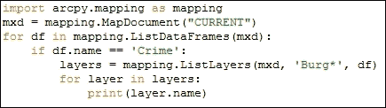

1.  运行脚本以查看以下输出：

    ```py
    Burglaries in 2009

    ```

## 它是如何工作的…

`ListDataFrames()`函数是`arcpy.mapping`提供的另一个列表函数。此函数返回地图文档中所有数据框的列表。然后我们遍历该函数返回的每个数据框，寻找名为`Crime`的数据框。如果我们找到具有该名称的数据框，我们调用`ListLayers()`函数，将可选通配符值`Burg*`作为第二个参数传递，以及`Crime`数据框的引用。作为第二个参数传递的通配符值接受任意数量的字符和一个可选的通配符字符（`*`）。

在这个特定的菜谱中，我们搜索了所有以字符`Burg`开头并且数据框名为`Crime`的图层。任何符合这些限制的图层都会被打印出来。请注意，在这个例子中，我们只是打印了图层名称，但在大多数情况下，你将使用工具或其他函数执行额外的地理处理，拥有一个更短的列表将加快你的脚本速度，并保持整洁。

# 缩放以查看所选要素

在 ArcMap 中创建选择集是一个常见任务。选择集通常作为属性或空间查询的结果创建，但也可以在用户手动选择要素时发生，有时在某些其他情况下也会发生。为了更好地可视化选择集，用户通常会缩放到所选要素的范围。这可以通过 Python 以多种方式编程实现。在这个菜谱中，你将学习如何缩放到数据框中所有所选要素以及单个图层。

## 准备工作

`DataFrame.zoomToSelectedFeatures` 属性将缩放到数据帧中所有选定特征的范围内。本质上，它执行与 **选择** | **缩放到所选特征** 操作相同的操作。一个区别是，如果没有选择任何特征，它将缩放到所有层的完整范围。

缩放到单个图层中选定特征的范围需要您使用 `Layer` 对象。`Layer` 对象包括一个 `getSelectedExtent()` 方法，您可以调用它来缩放到选定记录的范围。这返回一个 `Extent` 对象，然后您可以使用它作为参数传递给 `DataFrame.panToExtent()` 方法。

## 如何操作…

按照以下步骤学习如何获取和设置 ArcMap 的活动数据帧和活动视图：

1.  使用 ArcMap 打开 `c:\ArcpyBook\Ch2\Crime_Ch2.mxd`。

1.  在 ArcMap **目录** 窗格中，确保 `Crime` 是活动数据帧。

1.  在 **目录** 窗格中，点击 **按选择列表** 按钮。

1.  通过点击图层名称右侧的切换按钮使 **Bexar County Boundaries** 图层不可选择：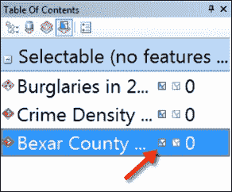

1.  在 **目录** 窗格中点击 **按来源列表** 按钮。使用 **选择特征** 工具，在 **Northside ISD** 边界内拖动一个框来包围犯罪集群。这应该会选中特定学区的边界以及一些犯罪，如下面的图所示：

1.  从主 ArcMap 工具栏中点击 Python 窗口按钮。

1.  导入 `arcpy.mapping` 模块：

    ```py
    import arcpy.mapping as mapping
    ```

1.  引用当前活动文档（`Crime_Ch2.mxd`）并将引用分配给一个变量：

    ```py
    mxd = mapping.MapDocument("CURRENT")
    ```

1.  获取活动数据帧（`Crime`）并缩放到选定特征：

    ```py
    mxd.activeDataFrame.zoomToSelectedFeatures()
    ```

1.  如果没有选择任何记录，调用 `zoomToSelectedFeatures()` 将会缩放到数据帧中所有记录的范围。通过导航到 **选择** | **清除所选特征** 来清除所选特征。这将清除选择集。现在，再次执行相同的代码行，以查看这如何影响 `zoomToSelectedFeatures()` 方法的操作：

    ```py
    mxd.activeDataFrame.zoomToSelectedFeatures()
    ```

1.  现在，我们将缩放到特定图层中选定特征的范围。使用 **选择特征** 工具，在 **Northside ISD** 边界内拖动一个框来包围犯罪集群。

1.  首先，获取 `Crime` 数据帧的引用。调用 `ListDataFrames()` 函数并传入 `Crime` 通配符将返回一个包含单个项目的 Python 列表。我们使用 `[0]` 提取这个项目，它返回列表中的第一个也是唯一的项目：

    ```py
    df = mapping.ListDataFrames(mxd, "Crime")[0]
    ```

1.  现在，我们将获取对 `Burglaries` 图层的引用，该图层包含一些选定的要素。以下代码使用通配符 `*` 在我们上一行代码中引用的数据帧内搜索 `**2009 年 Burglaries**` 图层。`ListLayers()` 函数返回一个 Python 列表，我们使用 `[0]` 来提取包含单词 `Burglaries` 的第一个也是唯一的图层：

    ```py
    layer = mapping.ListLayers(mxd,"Burglaries*",df)[0]
    ```

1.  最后，我们将通过获取图层中选定要素的范围来设置数据帧的范围：

    ```py
    df.extent = layer.getSelectedExtent
    ```

1.  缩放到图层选定要素的完整脚本应如下所示，或者您可以查阅位于 `c:\ArcpyBook\code\Ch2\ZoomSelectedExtent.py` 的解决方案文件：

    ```py
    import arcpy.mapping as mapping
    mxd = mapping.MapDocument("CURRENT")
    df = mapping.ListDataFrames(mxd, "Crime")[0]
    layer = mapping.ListLayers(mxd,"Burglaries*",df)[0]
    df.extent = layer.getSelectedExtent
    ```

## 它是如何工作的...

在这个菜谱中，您学习了如何缩放到数据帧中所有图层的所有选定记录的范围，以及如何缩放到数据帧中特定图层的所有选定记录的范围。要缩放到数据帧中所有图层的所有选定记录的范围，只需获取活动数据帧的引用，然后调用 `zoomToSelectedFeatures()` 即可。

将视图缩放到特定图层中选定记录的范围需要更多的编码。在导入 `arcpy.mapping` 模块并获取地图文档的引用后，我们接着获取对 `Crime` 数据帧的引用。使用 `ListLayers()` 函数，我们传递了数据帧的引用以及一个搜索以文本 `Burglaries` 开头的图层的通配符。`ListLayers()` 函数返回一个 Python 列表，因为我们知道只有一个图层与通配符搜索匹配，所以我们提取了第一个图层并将其分配给一个名为 `layer` 的变量。最后，我们使用 `layer.getSelectedExtent` 设置数据帧的范围。

# 更改地图范围

在许多情况下，您将需要更改地图范围。这在您自动化地图生产过程并需要创建不同区域或特征的许多地图时经常发生。有几种方法可以使用 `arcpy` 来更改地图范围。然而，对于这个菜谱，我们将专注于使用定义表达式来更改范围。

## 准备工作

`DataFrame` 类有一个 `extent` 属性，您可以使用它来设置地理范围。这通常与用于为图层定义定义查询的 `Layer.definitionQuery` 属性一起使用。在这个菜谱中，您将学习如何使用这些对象和属性来更改地图范围。

## 如何做...

按照以下步骤学习如何从地图文档中获取图层列表：

1.  使用 ArcMap 打开 `c:\ArcpyBook\Ch2\Crime_Ch2.mxd`。

1.  从主 ArcMap 工具栏中单击 Python 窗口按钮。

1.  导入 `arcpy.mapping` 模块：

    ```py
    import arcpy.mapping as mapping
    ```

1.  引用当前活动的文档（`Crime_Ch2.mxd`）并将引用分配给一个变量：

    ```py
    mxd = mapping.MapDocument("CURRENT")
    ```

1.  创建一个 `for` 循环，该循环将遍历地图文档中的所有数据帧：

    ```py
    for df in mapping.ListDataFrames(mxd):
    ```

1.  找到名为 `Crime` 的数据框架以及我们将应用定义查询的特定图层：

    ```py
    if df.name == 'Crime':
      layers = mapping.ListLayers(mxd,'Crime Density by School District',df)
    ```

1.  创建一个 `for` 循环，该循环将遍历图层。只有一个图层，但我们仍然会创建循环。在 `for` 循环中，创建一个定义查询并设置数据框架的新范围：

    ```py
    for layer in layers:
      query = '"NAME" = \'Lackland ISD\''
      layer.definitionQuery = query
      df.extent = layer.getExtent()
    ```

1.  整个脚本应如下所示，或者您可以查阅位于 `c:\ArcpyBook\code\Ch2\ChangeMapExtent.py` 的解决方案文件：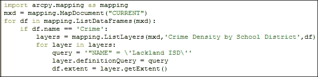

1.  保存并运行脚本。数据视图的范围应更新，以便仅可视化与定义表达式匹配的特征，如下面的截图所示：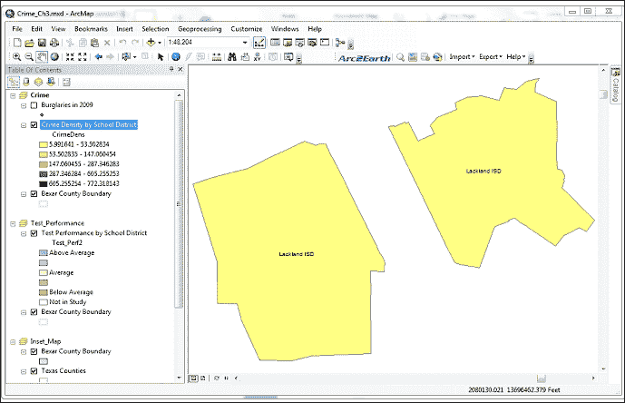

## 它是如何工作的...

此菜谱使用图层上的定义查询来更新地图范围。在脚本末尾，您创建了一个名为 `query` 的新变量，该变量包含定义表达式。定义表达式被设置为查找名为 **Lackland ISD** 的学区。然后，将此查询字符串应用于 `definitionQuery` 属性。最后，将 `df.extent` 属性设置为 `layer.getExtent()` 返回的值。

# 向地图文档中添加图层

将会有许多需要向地图文档添加图层的情况。映射模块通过 `AddLayer()` 函数提供此功能。在本菜谱中，您将学习如何使用此函数向地图文档添加图层。

## 准备工作

`arcpy.mapping` 模块提供了将图层或图层组添加到现有地图文档文件的能力。您可以利用 ArcMap 的 *自动排列* 功能，该功能会自动将图层放置在数据框架中以供查看。这基本上与 ArcMap 中 **添加数据** 按钮提供的功能相同，该按钮根据几何类型和图层权重规则将图层放置在数据框架中。

### 注意

图层不能添加到图层文件（`.lyr`）中。

当向地图文档添加图层时，该图层必须引用磁盘上图层文件中存在的现有图层，同一地图文档和数据框架，同一地图文档的不同数据框架，或完全独立的地图文档。图层可以是地图文档中的图层或 `.lyr` 文件中的图层。要向地图文档添加图层，您必须首先创建 `Layer` 类的实例，然后调用 `AddLayer()` 函数，传入新图层以及它应该放置的数据框架和其位置规则。

## 如何做到这一点...

按照以下步骤学习如何向地图文档添加图层：

1.  使用 ArcMap 打开 `c:\ArcpyBook\Ch2\Crime_Ch2.mxd`。

1.  从 ArcMap 的主工具栏中点击 Python 窗口按钮。

1.  导入 `arcpy.mapping` 模块：

    ```py
    import arcpy.mapping as mapping
    ```

1.  引用当前活动文档（`Crime_Ch2.mxd`）并将引用分配给变量：

    ```py
    mxd = mapping.MapDocument("CURRENT")
    ```

1.  获取对 `Crime` 数据帧的引用，它是 `ListDataFrames()` 方法返回的列表中的第一个数据帧。代码末尾指定的 `[0]` 值获取 `ListDataFrames()` 方法返回的数据帧列表中的第一个数据帧。列表是从 0 开始计数的，因此为了检索第一个数据帧，我们提供了一个索引 `0`：

    ```py
    df = mapping.ListDataFrames(mxd)[0]
    ```

1.  创建一个引用 `.lyr` 文件的 `Layer` 对象：

    ```py
    layer = mapping.Layer(r"C:\ArcpyBook\data\School_Districts.lyr")
    ```

1.  将图层添加到数据帧：

    ```py
    mapping.AddLayer(df,layer,"AUTO_ARRANGE")
    ```

1.  您可以查阅位于 `c:\ArcpyBook\code\Ch2\AddLayersMapDocument.py` 的解决方案文件。运行脚本。`School_Districts.lyr` 文件将被添加到数据帧中，如下面的截图所示：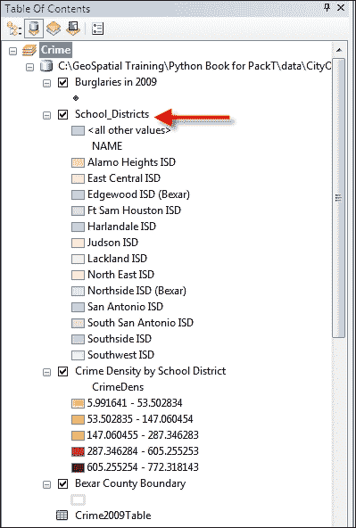

## 工作原理...

在前两行中，我们简单地引用了 `arcpy.mapping` 模块并获取了对当前活动地图文档的引用。接下来，我们创建了一个名为 `df` 的新变量，它持有对 `Crime` 数据帧的引用。这是通过返回数据帧对象列表的 `ListDataFrames()` 函数获得的。然后我们使用列表访问返回列表中的第一个项目，即 `Crime` 数据帧。然后从磁盘上存储的 `layer` 文件创建了一个新的 `Layer` 实例，该实例称为 `layer`。这个 `layer` 文件被称为 `School_Districts.lyr`。最后，我们调用了 `AddLayer()` 函数，传递了图层应理想地驻留的数据帧的引用以及图层的引用，以及一个参数，表示我们想要使用 **自动排列** 功能。除了允许 ArcMap 使用自动排列自动将图层放置到数据帧中之外，您还可以使用 `BOTTOM` 或 `TOP` 位置将图层放置在数据帧或组图层的顶部或底部。

## 还有更多...

除了提供将图层添加到地图文档的能力之外，`arcpy.mapping` 还提供了一个 `AddLayerToGroup()` 函数，可以用于将图层添加到组图层。图层可以添加到组图层的顶部或底部，或者您可以使用自动排列进行放置。您还可以将图层添加到空组图层。然而，就像常规图层对象一样，组图层不能添加到图层文件中。

图层也可以从数据帧或组图层中移除。`RemoveLayer()` 函数用于移除图层或组图层。如果两个图层具有相同的名称，则只移除第一个，除非您的脚本已设置为迭代。

# 将图层插入地图文档

`AddLayer()` 函数可用于将图层添加到地图文档中，无论是通过自动排列还是作为数据帧中的第一层或最后一层。然而，它并不提供您在数据帧中插入图层所需的具体控制。为了获得这种额外的控制，您可以使用 `InsertLayer()` 函数。在本教程中，您将学习如何控制添加到数据帧中的图层的放置。

## 准备工作

`AddLayer()`函数简单地将图层添加到数据框或组图层中，并自动使用自动排列放置图层。您可以选择将图层放置在顶部或底部。`InsertLayer()`方法允许您更精确地将新图层定位到数据框或组图层中。它使用引用图层来指定位置，图层被添加到引用图层之前或之后，具体取决于您的代码。由于`InsertLayer()`需要使用引用图层，因此您不能在空数据框上使用此方法。以下截图说明了这一点，其中**District_Crime_Join**是引用图层，**School_Districts**是要添加的图层。使用`InsertLayer()`可以将**School_Districts**图层放置在引用图层之前或之后：


## 如何操作…

按照以下步骤学习如何使用`InsertLayer()`将图层插入到数据框中：

1.  使用 ArcMap 打开`c:\ArcpyBook\Ch2\Crime_Ch2.mxd`。

1.  从主 ArcMap 工具栏中点击 Python 窗口按钮。

1.  导入`arcpy.mapping`模块：

    ```py
    import arcpy.mapping as mapping
    ```

1.  引用当前活动的文档（`Crime_Ch2.mxd`）并将引用分配给一个变量：

    ```py
    mxd = mapping.MapDocument("CURRENT")
    ```

1.  获取对**Crime**数据框的引用：

    ```py
    df = mapping.ListDataFrames(mxd, "Crime")[0]
    ```

1.  定义引用图层：

    ```py
    refLayer = mapping.ListLayers(mxd, "Burglaries*", df)[0]
    ```

1.  定义相对于引用图层的要插入的图层：

    ```py
    insertLayer = mapping.Layer(r"C:\ArcpyBook\data\CityOfSanAntonio.gdb\Crimes2009")
    ```

1.  将图层插入到数据框：

    ```py
    mapping.InsertLayer(df,refLayer,insertLayer,"BEFORE")
    ```

1.  您可以查阅`c:\ArcpyBook\code\Ch2\InsertLayerMapDocument.py`中的解决方案文件以验证您代码的准确性。

1.  运行脚本。**Crimes2009**要素类将作为图层添加到数据框中，如下截图所示：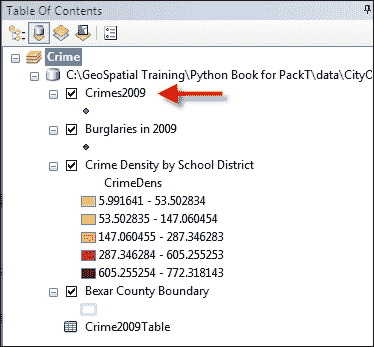

## 工作原理…

在获取到`arcpy.mapping`模块、当前地图文档文件和**Crime**数据框的引用后，我们的脚本定义了一个引用图层。在这种情况下，我们使用`ListLayers()`函数和一个通配符`Burglaries*`以及**Crime**数据框来限制返回的图层列表只包含一个项目。这个项目应该是**2009 年入室盗窃**图层。我们使用 Python 列表访问并设置值为`0`来从列表中检索此图层并将其分配给一个图层对象。接下来，我们定义了`insert`图层，一个新的`Layer`对象，它引用了`CityOfSanAntonio`地理数据库中的**Crimes2009**要素类。最后，我们调用`InsertLayer()`函数，传入数据框、引用图层、要插入的图层以及一个关键字，表示要插入的图层应该放在引用图层之前。这如下面的截图所示：

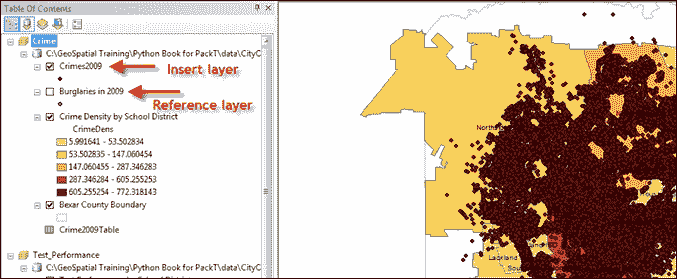

## 更多内容…

你还可以重新定位已经位于数据框架或组图层中的图层。`MoveLayer()` 函数提供了在数据框架或组图层内重新定位图层的功能。图层的移动必须在同一数据框架内进行。你不能将图层从一个数据框架移动到另一个数据框架。就像 `InsertLayer()` 一样，`MoveLayer()` 使用参考图层来重新定位图层。

# 更新图层符号

有时候你可能需要更改地图文档中图层的符号。这可以通过使用 `UpdateLayer()` 函数来实现，该函数可以用来更改图层的符号以及图层的各种属性。在本例中，你将使用 `UpdateLayer()` 函数来更新图层的符号。

## 准备工作

`arcpy.mapping` 模块还通过使用 `UpdateLayer()` 函数，使你能够在脚本中更新图层符号。例如，你可能希望你的脚本将图层的符号从渐变色更改为渐变符号，如图下截图所示。`UpdateLayer()` 也可以用来更新各种图层属性，但默认功能是更新符号。由于 `UpdateLayer()` 是一个强大的函数，能够更改符号和属性，因此你需要了解可以提供的各种输入参数：

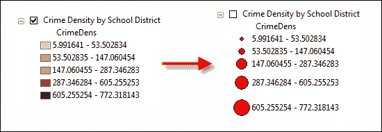

## 如何操作…

按照以下步骤学习如何使用 `UpdateLayer()` 更新图层的符号：

1.  使用 ArcMap 打开 `c:\ArcpyBook\Ch2\Crime_Ch2.mxd`。

1.  从主 ArcMap 工具栏中点击 Python 窗口按钮。

1.  导入 `arcpy.mapping` 模块：

    ```py
    import arcpy.mapping as mapping
    ```

1.  引用当前活动文档（`Crime_Ch2.mxd`）并将引用分配给一个变量：

    ```py
    mxd = mapping.MapDocument("CURRENT")
    ```

1.  获取对 `Crime` 数据框架的引用：

    ```py
    df = mapping.ListDataFrames(mxd, "Crime")[0]
    ```

1.  定义将要更新的图层：

    ```py
    updateLayer = mapping.ListLayers(mxd,"Crime Density by School District",df)[0]
    ```

1.  定义用于更新符号的图层：

    ```py
    sourceLayer = mapping.Layer(r"C:\ArcpyBook\data\CrimeDensityGradSym.lyr")
    ```

1.  调用 `UpdateLayer()` 函数来更新符号：

    ```py
    mapping.UpdateLayer(df,updateLayer,sourceLayer,True)
    ```

1.  你可以查阅位于 `c:\ArcpyBook\code\Ch2\UpdateLayerSymbology.py` 的解决方案文件，以验证你代码的准确性。

1.  运行脚本。现在**学区犯罪密度**图层将使用渐变符号而不是渐变色进行符号化，如图下截图所示：

## 工作原理…

在这个菜谱中，我们使用了`UpdateLayer()`函数来更新图层的符号。我们没有更新任何属性，但在下一个菜谱中我们会这样做。`UpdateLayer()`函数要求您传递多个参数，包括数据框架、要更新的图层以及一个参考图层，从该图层中提取符号并将其应用到更新图层。在我们的代码中，`updateLayer`变量引用了**按学区划分的犯罪密度**图层，其符号将被更新。从该图层提取符号并将其应用到更新图层的源图层是一个图层文件（`CrimeDensityGradSym.lyr`），包含渐变符号。

要更新图层的符号，您必须首先确保更新图层和源图层具有相同的几何形状（点、线或多边形）。在某些情况下，您还需要检查属性定义是否相同，这取决于渲染器。例如，渐变色符号和渐变符号基于特定的属性。在这种情况下，两个图层都具有多边形几何形状，并且包含犯罪密度信息的`CrimeDens`字段。

一旦我们有了两个图层的引用，我们就调用了`UpdateLayer()`函数，传递了数据框架和图层，以及一个第四个参数，表示我们只更新符号。我们提供了`True`值作为这个第四个参数，表示我们只更新符号，而不更新属性：

```py
mapping.UpdateLayer(df,updateLayer,sourceLayer,True)

```

## 还有更多...

`UpdateLayer()`函数还提供了替换一个图层并添加另一个图层的功能。图层可以完全不相关，因此不需要确保几何类型和属性字段与重新定义图层符号时相同。这种图层切换本质上执行了一个对`RemoveLayer()`的调用，然后是一个对`AddLayer()`的调用，作为一个操作。要利用此功能，您必须将`symbology_only`参数设置为`False`。

# 更新图层属性

在前面的菜谱中，您学习了如何更新图层的符号。正如我提到的，`UpdateLayer()`也可以用来更新图层的各种属性，如字段别名、查询定义等。在这个菜谱中，您将使用`UpdateLayer()`来更改图层的各种属性。

## 准备工作

您还可以使用 `UpdateLayer()` 函数来更新有限数量的图层属性。特定的图层属性，例如字段别名、选择符号、查询定义、标签字段等，可以使用 `UpdateLayer()` 进行更新。一个常见的场景是，在许多地图文档中有一个图层需要更改所有地图文档中该图层实例的特定属性。为了实现这一点，您将不得不使用 ArcMap 修改具有适当属性的图层并将其保存到图层文件中。然后，该图层文件将成为源图层，它将被用来更新另一个名为 `update_layer` 的图层的属性。在这个菜谱中，您将使用 ArcMap 修改图层的属性，将其保存到图层文件（`.lyr`）中，然后使用 Python 编写一个脚本，该脚本使用 `UpdateLayer()` 将属性应用到另一个图层。

## 如何操作…

按照以下步骤学习如何使用 `UpdateLayer()` 更新图层属性：

1.  使用 ArcMap 打开 `c:\ArcpyBook\Ch2\Crime_Ch2.mxd`。对于这个菜谱，您将使用 **2009 年入室盗窃**要素类，如图下所示：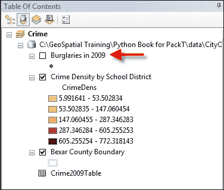

1.  双击 **Crime** 数据框中的 **2009 年入室盗窃**要素类以显示 **图层属性** 窗口，如图下所示。每个选项卡代表可以为此图层设置的属性：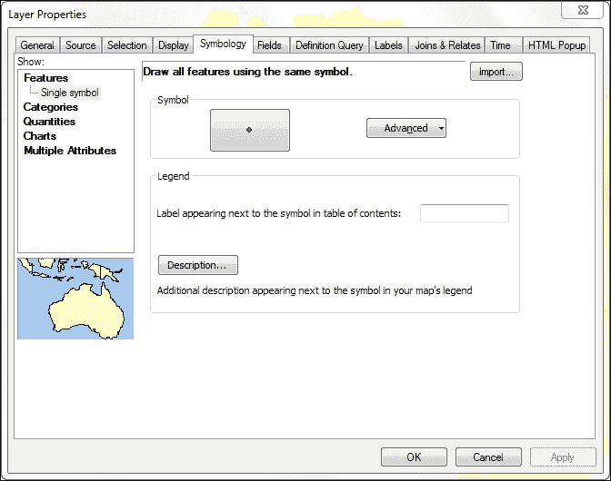

1.  点击 **常规** 选项卡，并将 **图层名称** 文本框中的值更改为名称，如图下所示：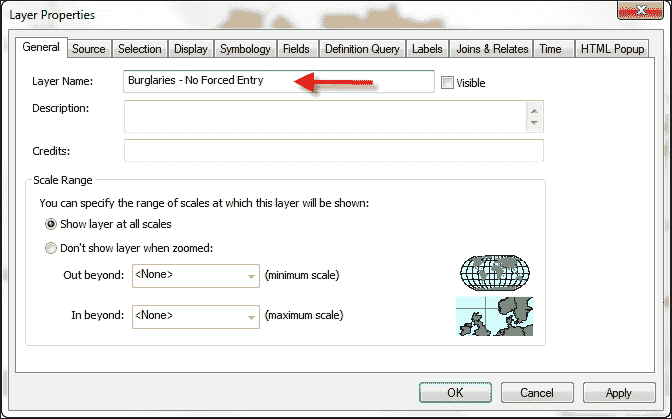

1.  点击 **定义查询** 选项卡并定义查询，如图下所示。您可以使用 **查询构建器…** 按钮定义查询或直接输入查询：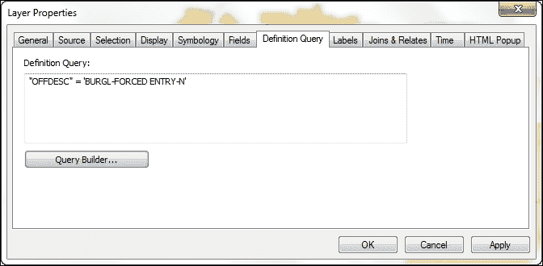

1.  将 `OFFDESC` 字段的别名更改为 `Offense Description`，如图下所示。

1.  在 **图层属性** 中点击 **字段** 选项卡，并仅使以下截图中所选的字段可见。这是通过取消选中以下截图中的字段来完成的：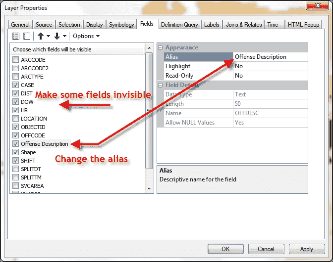

1.  点击 **确定** 关闭 **图层属性** 对话框。

1.  在数据框中，右键单击 **Burglaries – No Forced Entry** 并选择 **另存为图层文件**。

1.  将文件保存为 `c:\ArcpyBook\data\BurglariesNoForcedEntry.lyr`。

1.  右键单击 **Burglaries – No Forced Entry** 图层并选择 **删除**。

1.  使用 ArcMap 中的 **添加数据** 按钮添加来自 `CityOfSanAntonio` 地理数据库的 `Crimes2009` 要素类。要素类将被添加到数据框中，如图下所示：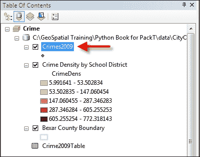

1.  在 ArcMap 中打开 Python 窗口。

1.  导入 `arcpy.mapping` 模块：

    ```py
    import arcpy.mapping as mapping
    ```

1.  引用当前活动文档（`Crime_Ch2.mxd`）并将引用分配给变量：

    ```py
    mxd = mapping.MapDocument("CURRENT")
    ```

1.  获取 `Crime` 数据框的引用：

    ```py
    df = mapping.ListDataFrames(mxd, "Crime")[0]
    ```

1.  定义将更新的图层：

    ```py
    updateLayer = mapping.ListLayers(mxd,"Crimes2009",df)[0]
    ```

1.  定义将用于更新属性的图层：

    ```py
    sourceLayer = mapping.Layer(r"C:\ArcpyBook\data\BurglariesNoForcedEntry.lyr")
    ```

1.  调用`UpdateLayer()`函数来更新符号：

    ```py
    mapping.UpdateLayer(df,updateLayer,sourceLayer,False)
    ```

1.  您可以查阅位于`c:\ArcpyBook\code\Ch2\UpdateLayerProperties.py`的解决方案文件以验证代码的准确性。

1.  运行脚本。

1.  **Crimes2009**图层将更新与`BurglariesNoForcedEntry.lyr`文件关联的属性。如图下截图所示。打开图层以查看已应用的定义查询。您还可以打开**图层属性**对话框以查看已应用到**Crimes2009**要素类的属性更改：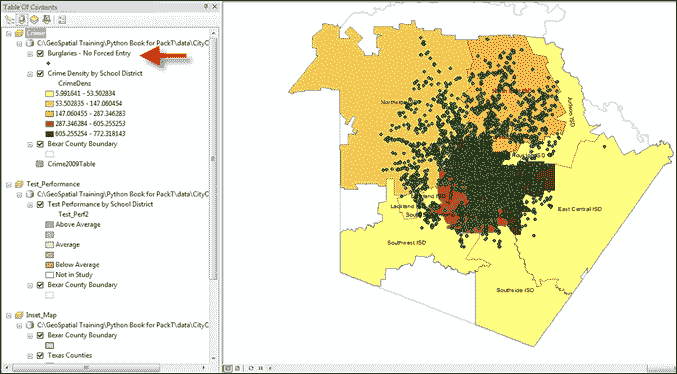

# 在数据帧中处理时间启用图层

在本食谱中，您将学习如何为图层和数据帧启用时间。然后，您将编写一个脚本，该脚本循环遍历图层的时间范围，并以七天为间隔导出显示犯罪历史的 PDF 地图。

## 准备工作

`DataFrameTime`对象提供了对数据帧中时间启用图层的时间管理操作的访问。当您引用`DataFrame.time`属性时返回此对象，并包括用于检索当前时间、结束时间、开始时间、时间步长间隔以及其他通过使用**时间滑块选项**对话框并保存到地图文档中设置的属性。数据帧中必须有一个或多个图层启用时间，此功能才能正常工作。

## 如何操作...

按照以下步骤学习如何处理时间启用图层：

1.  使用 ArcMap 打开`c:\ArcpyBook\Ch2\Crime_Ch2.mxd`。

1.  在 ArcMap 的**内容表**中，确保`Crime`是活动数据帧。

1.  通过右键单击图层并选择**属性**打开**2009 年入室盗窃**的**图层属性**对话框。选择**时间**选项卡，如图下截图所示：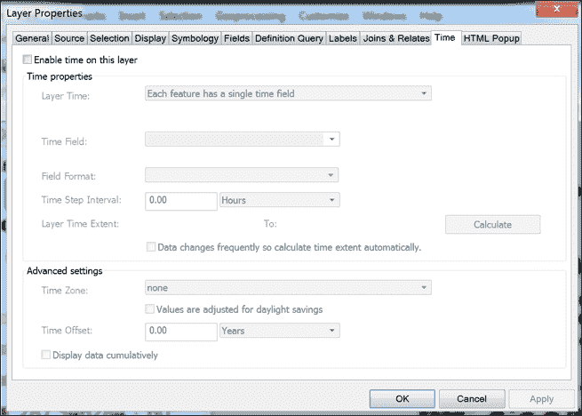

    通过点击**在此图层上启用时间**复选框来为图层启用时间。

1.  在**时间属性**下，为**图层时间**选择**每个要素有一个单独的时间字段**。选择**时间字段**为**SPLITDT**字段。定义**时间步长间隔**为**7.00 天**，如图下截图所示：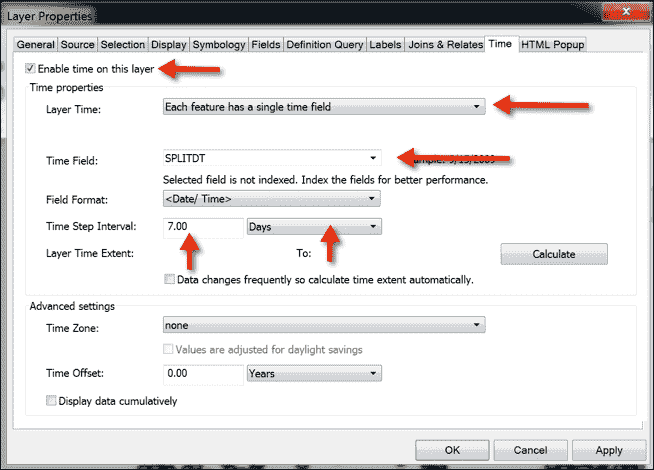

    通过点击以下截图中的**计算**按钮定义**图层时间范围**，如图所示：

    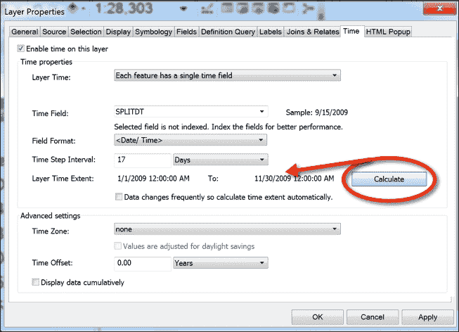

1.  检查**时间步长间隔**字段。您可能需要将其重置为**7 天**。

1.  点击**应用**然后**确定**。

1.  在 ArcMap 的**工具**工具栏中，选择时间滑块选项按钮以显示如图下截图所示的**时间滑块选项**对话框：

1.  在**时间显示**选项卡的**时间滑块选项**对话框中，确保**时间步长间隔**设置为**7.0 天**。如果不是，请将其设置为**7.0 天**。同样操作**时间窗口**选项。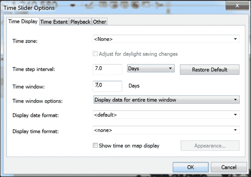

1.  点击**确定**。

1.  保存你的地图文档。保存与地图文档关联的时间启用数据非常重要。除非这样做，否则你编写的代码将无法工作。

1.  打开 Python 窗口。

1.  导入`arcpy.mapping`模块：

    ```py
    import arcpy.mapping as mapping
    ```

1.  引用当前活动的文档（`Crime_Ch2.mxd`），并将引用分配给一个变量：

    ```py
    mxd = mapping.MapDocument("CURRENT")
    ```

1.  获取`Crime`数据帧：

    ```py
    df = mapping.ListDataFrames(mxd, "Crime")[0]
    ```

1.  生成`DataFrameTime`对象：

    ```py
    dft = df.time
    ```

1.  将`DataFrameTime.currentTime`属性设置为`DataFrameTime.startTime`属性：

    ```py
    dft.currentTime = dft.startTime
    ```

1.  启动一个`while`循环，该循环将在`currentTime`小于或等于`endTime`时循环：

    ```py
    while dft.currentTime <= dft.endTime:
    ```

1.  在 while 循环内部，为每个将要创建的 PDF 文件创建一个文件，导出 PDF，并重置`currentTime`属性。整个`while`循环应如下所示：

    ```py
    while dft.currentTime <= dft.endTime:
           fileName = str(dft.currentTime).split(" ")[0] + ".pdf"
           mapping.ExportToPDF(mxd,os.path.join(r"C:\ArcpyBook\Ch2", fileName), df)
           print("Exported " + fileName)
           dft.currentTime = dft.currentTime + dft.timeStepInterval
    ```

1.  整个脚本应如下所示。你可以查阅位于`c:\ArcpyBook\code\Ch2\TimeEnabledLayers.py`的解决方案文件来验证你代码的准确性：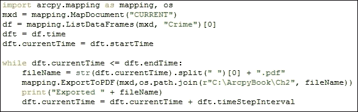

## 它是如何工作的…

`DataFrameTime`对象提供了对数据帧中时间管理操作的访问。在这个菜谱中使用了`DataFrameTime`的几个属性，包括`currentTime`、`startTime`、`endTime`和`timeStepInterval`。最初，我们将`currentTime`属性设置为`startTime`属性。初始`startTime`是在你设置 ArcMap 中的**时间步长间隔**属性时计算的。`while`循环被设置为在`currentTime`属性大于`endTime`属性时循环。在循环内部，我们创建了一个`fileName`变量，将其设置为`currentTime`属性，并添加一个`.pdf`扩展名。然后我们调用`ExportToPDF()`函数，传入路径和文件名。理想情况下，这将导出页面布局视图到 PDF 文件。最后，我们通过将**时间步长间隔**属性中设置的**7.0 天**更新`currentTime`属性。
