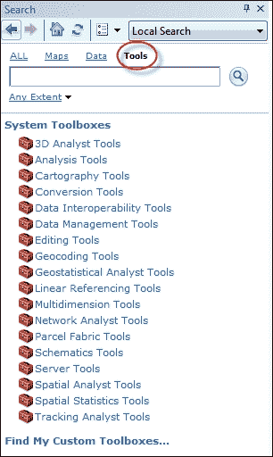
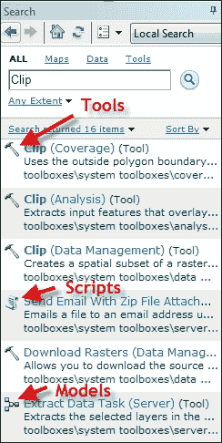
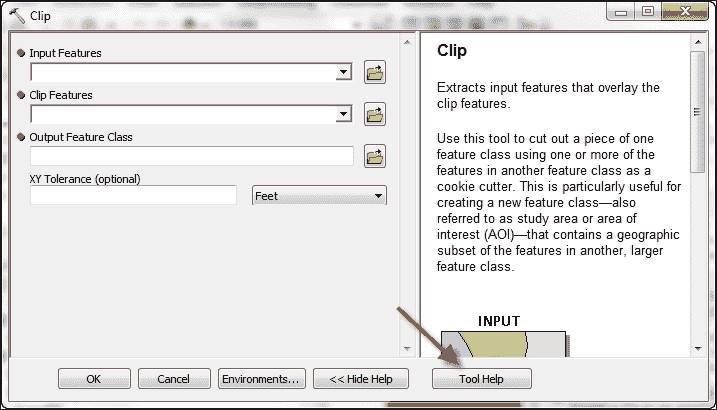
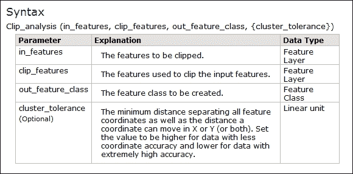
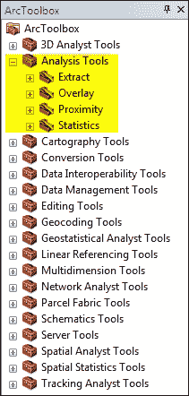
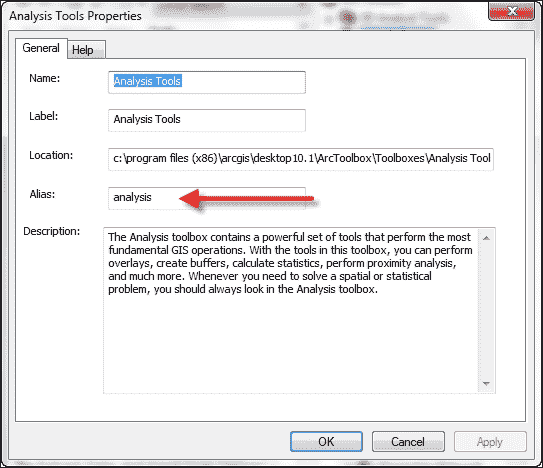
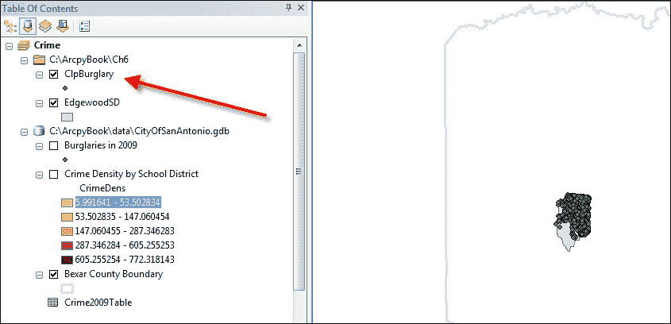
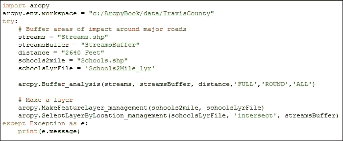
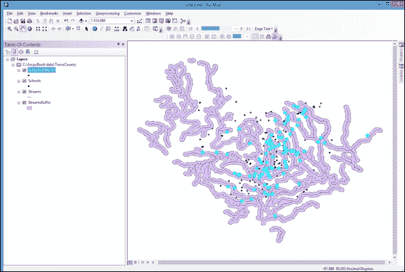

# 第五章。从脚本中执行地理处理工具

在本章中，我们将涵盖以下菜谱：

+   查找地理处理工具

+   获取工具箱别名

+   从脚本中执行地理处理工具

+   将工具的输出用作另一个工具的输入

# 简介

ArcGIS for Desktop 包含超过 800 个地理处理工具，这些工具可以在您的 Python 脚本中使用。在您的 Python 脚本中使用地理处理工具可以使您执行复杂的流程并执行批量地理处理任务。在本章中，您将学习如何在脚本中使用这些工具。每个工具都有其独特的特性。执行每个工具的语法将根据所需输入类型的不同而有所不同。我们将探讨如何使用 ArcGIS for Desktop 帮助系统确定任何工具的输入参数。工具的执行将导致创建一个或多个输出数据集，以及工具运行期间生成的消息集。我们将探讨如何使用这些消息。

# 查找地理处理工具

在您的地理处理脚本中使用工具之前，您需要确保您可以根据当前运行的 ArcGIS for Desktop 许可证级别访问此工具，或者您的最终用户将运行。此外，您已许可并启用的任何扩展也必须考虑在内。这些信息包含在 ArcGIS for Desktop 帮助系统中。

## 准备工作

您的脚本中地理处理工具的可用性取决于您使用的 ArcGIS 许可证级别。在 ArcGIS for Desktop 的 10.3 版本中，有三个许可证级别，即基本、标准和高级。这些以前分别被称为 **ArcView**、**ArcEditor** 和 **ArcInfo**。了解您在脚本中想要使用的工具所需的许可证级别非常重要。此外，在 ArcGIS for Desktop 中使用扩展可能会导致您的脚本可用更多工具。在 ArcGIS for Desktop 中查找工具有两种主要方法。第一种是使用搜索窗口，第二种是简单地浏览 **ArcToolbox** 的内容。在本菜谱中，您将学习如何使用搜索窗口查找可用于您脚本的可用地理处理工具。

## 如何做…

1.  在 ArcMap 中打开 `C:\ArcpyBook\Ch5\Crime_Ch5.mxd`。

1.  从 **地理处理** 菜单项中选择 **搜索工具**。这将显示 **搜索** 窗口，如图下所示。默认情况下，您将搜索 **工具**：

1.  在搜索框中输入`Clip`术语。当您开始输入这个单词时，搜索框将自动根据您输入的前几个字母过滤结果。您会注意到对于`Clip`，有三种可能的工具：`clip(analysis)`、`clip(coverage)`和`clip(data_management)`。存在许多情况，其中有几个地理处理工具具有相同的名称。为了唯一地定义一个工具，工具箱别名附加到工具名称上。我们将在下一个菜谱中更详细地检查工具箱别名。

1.  现在，点击搜索按钮以生成匹配工具的列表。搜索应生成类似于以下截图的列表。工具在搜索结果中以锤子图标表示。您还会在搜索结果中看到几个其他图标。滚动图标表示 Python 脚本，而包含多色方块的图标表示模型：

1.  选择**Clip (Analysis)**工具。这将打开**Clip (Analysis)**工具的对话框。这对您作为脚本程序员来说并不那么有用。您可能对 ArcGIS for Desktop 提供的特定工具的帮助更感兴趣。

1.  点击工具对话框底部的**工具帮助**按钮以显示有关此特定工具的详细信息：

1.  滚动到帮助页面底部以检查**Clip**工具的语法。

## 它是如何工作的…

帮助系统包含每个工具的摘要、插图、用法、语法、代码示例、可用环境变量、相关主题和许可信息。作为地理处理脚本程序员，您主要会对语法、代码示例和底部附近的许可信息部分感兴趣。

### 小贴士

您应该始终检查每个工具的帮助文档底部的许可信息部分，以确保您拥有使用该工具的适当许可级别。

语法部分包含有关如何从您的 Python 脚本中调用此工具的信息，包括工具的名称和必需的以及可选的输入参数。所有参数都将包含在括号内。`Clip`工具的必需参数是`in_features`、`clip_features`和`out_feature_class`。当您从脚本调用此工具时，您必须提供这些参数以使工具正确执行。第四个参数是一个可选参数，称为`cluster_tolerance`。在语法中标记为可选的参数被大括号包围。以下截图提供了一个大括号包围的可选参数的示例。这并不意味着您在调用工具时将参数包围在大括号内。它仅用于帮助部分，以表明当从地理处理脚本调用时此参数是可选的：



# 获取工具箱别名

所有工具箱都有一个别名，当与工具名称结合时，为 ArcGIS for Desktop 中的任何工具提供唯一的引用。这个别名是必要的，因为许多工具具有相同的名称。当从你的 Python 脚本引用工具时，需要引用工具名称和别名。

## 准备工作

在上一个示例中，我们探讨了**裁剪**工具。实际上有三个**裁剪**工具，它们分别位于**分析工具**、**覆盖工具**和**数据管理工具**工具箱中。每个**裁剪**工具执行不同的功能。例如，**分析工具**工具箱中的**裁剪**工具使用输入要素裁剪矢量要素类，而**数据管理工具**工具箱中的**裁剪**工具用于创建栅格的空间子集。由于可能存在多个具有相同名称的工具，我们可以通过提供工具名称和工具所在的工具箱别名来唯一地识别特定的工具。在这个示例中，你将学习如何找到工具箱的别名。

## 如何操作…

1.  在 ArcMap 中打开 `C:\ArcpyBook\Ch5\Crime_Ch5.mxd`。

1.  如果需要，打开**ArcToolbox**。

1.  查找如图所示的**分析工具**工具箱：

1.  右键单击**分析工具**工具箱并选择**属性**。这将显示如图所示的**分析工具属性**对话框。**别名**文本框将包含别名：

## 它是如何工作的…

你可以按照以下过程找到任何工具箱的别名名称。在 Python 脚本中，你可以通过使用 `<toolname>_<toolbox alias>` 语法来执行工具。例如，如果你正在调用**缓冲区**工具，它将是 `Buffer_analysis`。工具箱别名通常是简单的。它们通常是单个单词，不包含破折号或特殊字符。在下一个示例中，我们将创建一个简单的脚本，按照这个格式执行工具。

# 从脚本中执行地理处理工具

一旦你确定了工具箱别名并验证了基于你当前许可级别的工具可访问性，你就可以将工具的执行添加到脚本中。

## 准备工作

现在你已经了解了如何找到可用的工具以及如何唯一引用它们，下一步就是将这些工具组合起来，并在地理处理脚本中执行一个工具。在这个示例中，你可以从你的脚本中执行这个工具。

## 如何操作…

1.  在 ArcMap 中打开 `C:\ArcpyBook\Ch5\Crime_Ch5.mxd`。

1.  点击**添加数据**按钮，将 `EdgewoodSD.shp` 文件从 `c:\ArcpyBook\Ch5` 文件夹添加到内容表中。

1.  如果需要，关闭**按学区划分的犯罪密度**和**2009 年盗窃案**图层，以更好地查看**EdgewoodSD**图层。此文件中只有一个多边形要素。它代表**Edgewood 学区**。现在，我们将编写一个脚本，将**2009 年盗窃案**要素剪辑到这个学区。

1.  在 ArcMap 中打开 Python 窗口。

1.  导入`arcpy`模块：

    ```py
    import arcpy
    ```

1.  创建一个变量，引用要剪辑的输入要素类：

    ```py
    in_features = "c:/ArcpyBook/data/CityOfSanAntonio.gdb/Burglary"
    ```

1.  创建一个变量，引用用于剪辑的图层：

    ```py
    clip_features = "c:/ArcpyBook/Ch5/EdgewoodSD.shp"
    ```

1.  创建一个变量，引用输出要素类：

    ```py
    out_feature_class = "c:/ArcpyBook/Ch5/ClpBurglary.shp"
    ```

1.  从**分析工具箱**中执行**Clip**工具：

    ```py
    arcpy.Clip_analysis(in_features,clip_features, out_feature_class)
    ```

1.  你可以通过检查`c:\ArcpyBook\code\Ch5\ExecuteGeoprocessingTools.py`解决方案文件来检查你的工作。

1.  运行脚本。包含仅限于**EdgewoodSD**学区内的盗窃点的输出要素类应添加到数据框中，如下截图所示：

## 如何工作…

在这个菜谱中，我们关注的代码主要行是执行**Clip**工具的最后一行。注意，我们通过指定`Clip_analysis`语法来调用此工具，这给了我们**Clip**工具在**分析工具箱**中的引用，该工具别名为`analysis`。我们还传递了三个参数，分别引用输入要素类、剪辑要素类和输出要素类。我应该指出，我们硬编码了每个数据集的路径。这不是一个好的编程实践，但在这个特定实例中，我只是想说明如何执行一个工具。未来的章节将展示如何从你的脚本中移除硬编码，并使它们更加灵活。

你使用的多数工具都需要数据源路径。此路径必须与 ArcCatalog **位置**工具栏上报告的路径相同，如下截图所示：


工具使用 ArcCatalog 通过 ArcCatalog 路径查找地理数据。此路径是一个字符串，并且对每个数据集都是唯一的。路径可以包括文件夹位置、数据库连接或 URL。因此，在尝试针对数据编写 Python 脚本之前，使用 ArcCatalog 检查路径是很重要的。ArcSDE 路径需要特别注意。许多 ArcSDE 用户没有标准化的连接名称，这可能在运行模型或脚本时引起问题。

## 还有更多...

地理处理工具以两种方式组织。您可以通过`arcpy`上的函数或与工具箱别名匹配的模块访问工具。在第一种情况下，当工具可以通过`arcpy`作为函数访问时，它们将以您在本教程中遵循的格式调用。工具名称后跟一个下划线和工具箱别名。在第二种形式中，工具作为模块的函数调用，该模块的名称与工具箱别名相同。在这里，`analysis`是工具箱别名，因此它成为一个模块。`Clip`是这个模块的函数，调用方式如下：

```py
arcpy.analysis.Clip(in_features,clip_features,out_feature_class)
```

您使用哪种方法完全是个人喜好问题。它们都完成了相同的事情，即执行地理处理工具。

# 使用工具的输出作为另一个工具的输入

在许多情况下，您需要将一个工具的输出作为另一个工具的输入。这被称为工具链。工具链的一个例子可能涉及缓冲一个`stream`层，然后找到所有位于缓冲区内的住宅属性。在这种情况下，`Buffer`工具将输出一个新的层，然后该层将被用作`Select by Location`工具或其他叠加工具的输入。在本教程中，您将学习如何获取工具的输出并将其用作另一个工具的输入。

## 准备工作

`Buffer`工具使用指定的距离从一个输入要素层创建输出要素类。这个输出要素类可以存储在变量中，然后可以将其用作另一个工具的输入，例如**按位置选择层**工具。在本教程中，您将学习如何使用`Buffer`工具的输出作为**按位置选择层**工具的输入，以找到位于溪流半英里范围内的学校。

## 如何操作...

按照以下步骤学习如何在 ArcMap 中访问当前活动的地图文档：

1.  使用新的地图文档文件（`.mxd`）打开 ArcMap。

1.  点击**添加数据**按钮，并将`c:\ArcpyBook\data\TravisCounty`中的溪流和学校要素文件添加到地图中。

1.  点击 Python 窗口按钮。

1.  导入`arcpy`模块：

    ```py
    import arcpy
    ```

1.  设置工作空间：

    ```py
    arcpy.env.workspace = "c:/ArcpyBook/data/TravisCounty"
    ```

1.  开始`try`语句并添加用于溪流、缓冲溪流层、距离和学校的变量：

    ```py
    try:
      # Buffer areas of impact around major roads
      streams = "Streams.shp"
      streamsBuffer = "StreamsBuffer.shp"
      distance = "2640 Feet"
      schools2mile = "Schools.shp"
      schoolsLyrFile = 'Schools2Mile_lyr'
    ```

1.  通过传递输入要素类、输出要素类、距离以及控制输出缓冲区外观的几个可选变量来执行`Buffer`工具。

    ```py
    arcpy.Buffer_analysis(streams, streamsBuffer, distance,'FULL','ROUND','ALL')
    ```

1.  使用`MakeFeatureLayer`工具创建学校的临时图层：

    ```py
    arcpy.MakeFeatureLayer_management(schools2mile, schoolsLyrFile)
    ```

1.  使用`SelectLayerByLocation`工具选择位于溪流半英里范围内的所有学校：

    ```py
    arcpy.SelectLayerByLocation_management(schoolsLyrFile, 'intersect', streamsBuffer)
    ```

1.  添加`except`块以捕获任何错误：

    ```py
    except Exception as e:
      print(e.message)
    ```

1.  整个脚本应如下所示：

1.  您可以通过检查`c:\ArcpyBook\code\Ch5\ToolOutputUsedAsInput.py`解决方案文件来检查您的作业。

1.  运行脚本以查看以下截图所示的结果：

## 工作原理...

`Buffer` 工具创建一个输出要素类，我们称之为 `StreamsBuffer.shp`，并存储在一个名为 `streamsBuffer` 的变量中。然后，`streamsBuffer` 变量被用作 `SelectLayerByLocation` 工具的输入，作为传递给函数的第三个参数。创建 `Schools2Mile_lyr` 层文件也实现了将此输出作为输入参数的功能。使用一个工具的输出只需创建一个变量来存储输出数据，然后它可以在其他工具中按需重复使用。
