# 第六章：创建自定义地理处理工具

在本章中，我们将介绍以下食谱：

+   创建自定义地理处理工具

+   创建 Python 工具箱

# 简介

除了可以访问 ArcGIS 提供的系统工具外，您还可以创建自己的自定义工具。这些工具与系统工具的工作方式相同，可以在 ModelBuilder、Python 窗口或独立的 Python 脚本中使用。许多组织构建自己的工具库，这些工具库执行特定于其数据的地理处理操作。

# 创建自定义地理处理工具

除了能够在脚本中执行任何可用的工具外，您还可以创建自己的自定义工具，这些工具也可以从脚本中调用。自定义工具通常用于处理特定于组织的地理处理任务。这些工具也可以轻松共享。

## 准备工作

在本食谱中，您将学习如何通过在 ArcToolbox 中的自定义工具箱中附加 Python 脚本来创建自定义地理处理脚本工具。创建自定义脚本工具有许多优点。当您采取这种方法时，脚本成为地理处理框架的一部分，这意味着它可以从模型、命令行或另一个脚本中运行。此外，脚本可以访问 ArcMap 的环境设置和帮助文档。其他优点包括美观、易于使用的用户界面和错误预防功能。提供的错误预防功能包括一个对话框，它会通知用户某些错误。

这些自定义开发的脚本工具必须添加到您创建的自定义工具箱中，因为 ArcToolbox 提供的系统工具箱是只读工具箱，因此不能接受新工具。

在本食谱中，您将获得一个预先编写的 Python 脚本，该脚本从逗号分隔的文本文件中读取野火数据，并将这些信息写入名为 `FireIncidents` 的点要素类。对这些数据集的引用是硬编码的，因此您必须修改脚本以接受动态变量输入。然后，您将脚本附加到 ArcToolbox 中的自定义工具，以便您的最终用户可以通过可视界面使用该脚本。

## 如何操作…

您编写的自定义 Python 地理处理脚本可以添加到自定义工具箱中的 ArcToolbox 中。您不允许将您的脚本添加到任何系统工具箱中，例如 **分析** 或 **数据管理** 工具箱。然而，通过创建一个新的自定义工具箱，您可以这样添加脚本：

1.  使用空地图文档文件打开 ArcMap 并打开 ArcToolbox 窗口。

1.  在 ArcToolbox 的空白区域中右键单击，然后选择 **添加工具箱**。

1.  导航到 `C:\ArcpyBook\Ch6` 文件夹。

1.  在 **添加工具箱** 对话框中，单击新建工具箱按钮。这将创建一个名为 `Toolbox.tbx` 的默认名称的新工具箱；您将在下一步中重命名工具箱：

1.  将工具箱命名为`WildfireTools.tbx`：

1.  通过选择`WildfireTools.tbx`并点击**打开**按钮来打开工具箱。现在工具箱应该如以下截图所示显示在**ArcToolbox**中：

1.  每个工具箱都应该有一个名称和一个别名。别名将用于唯一地定义您的自定义工具。别名名称应保持简短，不应包含任何特殊字符。右键单击新工具箱并选择**属性**。添加一个别名为`wildfire`，如以下截图所示：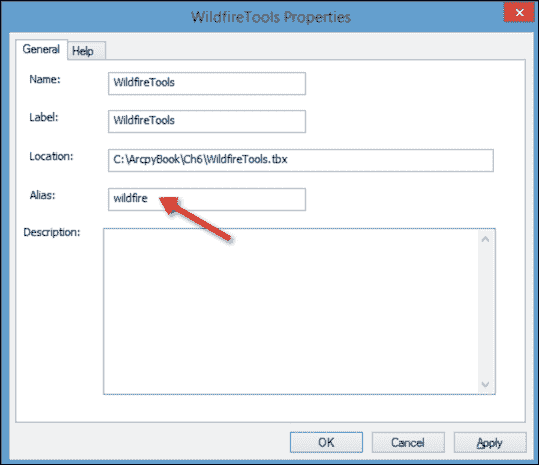

    ### 注意

    您可以选择在这个工具箱内部创建一个新的工具集，通过右键单击工具箱并导航到**新建** | **工具集**。工具集允许您按功能分组您的脚本。在这个例子中，这样做可能不是必要的，但如果您将来需要分组您的脚本，那么这就是您如何实现它的方法。

1.  在下一步中，我们将修改一个名为`InsertWildfires.py`的现有 Python 脚本，使其能够接受用户通过 ArcToolbox 界面提供的动态输入。在 IDLE 中打开`c:\ArcpyBook\Ch6\InsertWildfires.py`。

    注意，我们已经将工作空间的路径以及包含野火事件的逗号分隔文本文件的路径硬编码：

    ```py
    arcpy.env.workspace = "C:/ArcpyBook/data/Wildfires/WildlandFires.mdb"
    f = open("C:/ArcpyBook/data/Wildfires/NorthAmericaWildfires_2007275.txt","r")
    ```

1.  删除前面的两行代码。

    此外，我们还硬编码了输出要素类的名称：

    ```py
    cur = arcpy.InsertCursor("FireIncidents")
    ```

    这种硬编码限制了脚本的有用性。如果数据集移动或被删除，脚本将无法运行。此外，脚本缺乏指定不同输入和输出数据集的灵活性。在下一步中，我们将移除这种硬编码，并替换为接受动态输入的能力。

1.  我们将使用`arcpy`中的`GetParameterAsText()`函数来接受用户的动态输入。将以下代码行添加到 try 块中，使您的代码如下所示：

    ```py
    try:
      #the output feature class name
      outputFC = arcpy.GetParameterAsText(0)

      # template featureclass that defines the attribute schema
      fClassTemplate = arcpy.GetParameterAsText(1)

      # open the file to read
      f = open(arcpy.GetParameterAsText(2),'r')

          arcpy.CreateFeatureclass_management (os.path.split(outputFC)[0], os.path.split(outputFC)[1], "point", fClassTemplate)
    ```

    注意我们调用了位于**数据管理工具**工具箱中的`CreateFeatureClass`工具，并将`outputFC`变量以及模板要素类（`fClassTemplate`）传递给它。此工具将创建一个包含用户定义的输出要素类的空要素类。

1.  您还需要修改创建`InsertCursor`对象的代码行。按照以下方式更改该行：

    ```py
    with arcpy.da.InsertCursor(outputFC) as cur:
    ```

1.  整个脚本应如下所示：

    ```py
    #Script to Import data to a feature class within a geodatabase
    import arcpy, os
    try:
        outputFC = arcpy.GetParameterAsText(0)
        fClassTemplate = arcpy.GetParameterAsText(1)
        f = open(arcpy.GetParameterAsText(2),'r')
        arcpy.CreateFeatureclass_management(os.path.split(outputFC)[0], os.path.split(outputFC)[1],"point",fClassTemplate)
        lstFires = f.readlines()
        with arcpy.da.InsertCursor(outputFC) as cur:
            cntr = 1
            for fire in lstFires:
                if 'Latitude' in fire:
                    continue
                vals = fire.split(",")
                latitude = float(vals[0])
                longitude = float(vals[1])
                confid = int(vals[2])
                pnt = arcpy.Point(longitude, latitude)
                feat = cur.newRow()
                feat.shape = pnt
                feat.setValue("CONFIDENCEVALUE", confid)
                cur.insertRow(feat)
                arcpy.AddMessage("Record number" + str(cntr) + "written to feature class")
                cntr = cntr + 1
    except:
        print arcpy.GetMessages()
    finally:
        f.close()
    ```

1.  您可以通过检查`c:\ArcpyBook\code\Ch6\InsertWildfires.py`解决方案文件来检查您的工作。

1.  在下一步中，我们将把刚刚创建的脚本添加到**Wildfire Tools**工具箱中作为一个脚本工具。

1.  在 ArcToolbox 中，右键单击您之前创建的**Wildfire Tools**自定义工具箱，然后导航到**添加** | **脚本**。这将显示**添加脚本**对话框，如下截图所示。为您的脚本提供一个名称、标签和描述。**名称**字段不能包含任何空格或特殊字符。**标签**字段是显示在脚本旁边的名称。对于本例，给它一个标签为`从文本加载野火`。最后，添加一些描述性信息，详细说明脚本将执行的操作。

1.  与**名称**、**标签**和**描述**相关的详细信息如下截图所示：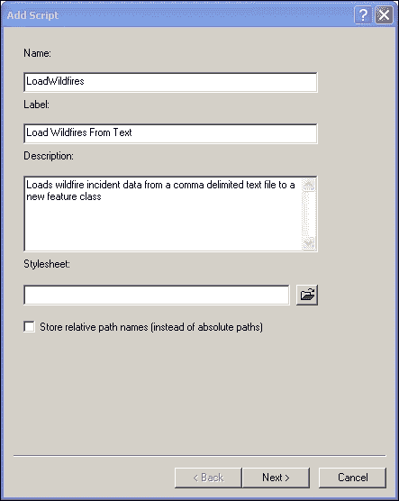

1.  点击**下一步**以显示**添加脚本**的下一个输入对话框。

1.  在此对话框中，您将指定要附加到工具的脚本。导航到`c:\ArcpyBook\Ch6\InsertWildfires.py`并将`InsertWildfires.py`作为脚本添加。

1.  您还希望确保选中了**在进程中运行 Python 脚本**复选框，如下截图所示。在进程中运行 Python 脚本可以增加脚本的性能。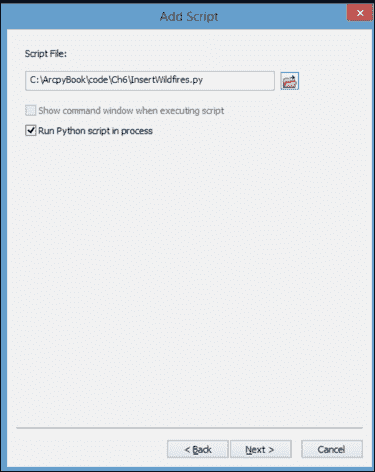

    ### 注意

    在进程外运行脚本需要 ArcGIS 创建一个单独的进程来执行脚本。启动此过程并执行脚本所需的时间会导致性能问题。始终在进程中运行您的脚本。在进程中运行脚本意味着 ArcGIS 不需要生成第二个进程来运行脚本。它将在与 ArcGIS 相同的进程空间中运行。

1.  点击**下一步**以显示参数窗口，如下截图所示：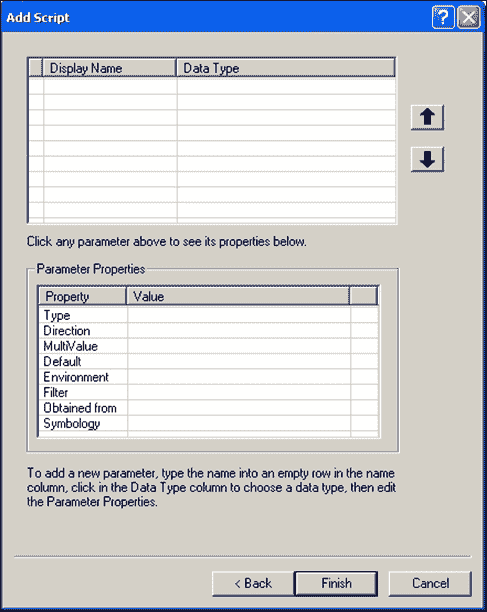

    您在此对话框中输入的每个参数都对应于对`GetParameterAsText()`的单次调用。之前，您通过`GetParameterAsText()`方法修改了您的脚本以接受动态参数。参数应按脚本期望接收它们的顺序输入此对话框。例如，您在代码中插入以下行：

    ```py
    outputFC = arcpy.GetParameterAsText(0)
    ```

    添加到对话框中的第一个参数需要与此行相对应。在我们的代码中，此参数代表此脚本创建的特征类。您可以通过点击**显示名称**下第一行的第一个可用行来添加参数。您可以在该行中输入任何文本。此文本将显示给用户。您还需要为参数选择一个对应的数据类型。在这种情况下，数据类型应设置为**特征类**，因为这是从用户那里收集的预期数据。每个参数还可以设置一些属性。一些更重要的属性包括**类型**、**方向**和**默认值**。

1.  将以下信息，如以下屏幕截图所示，输入到你的对话框中，用于输出要素类。确保将**方向**设置为`Output`：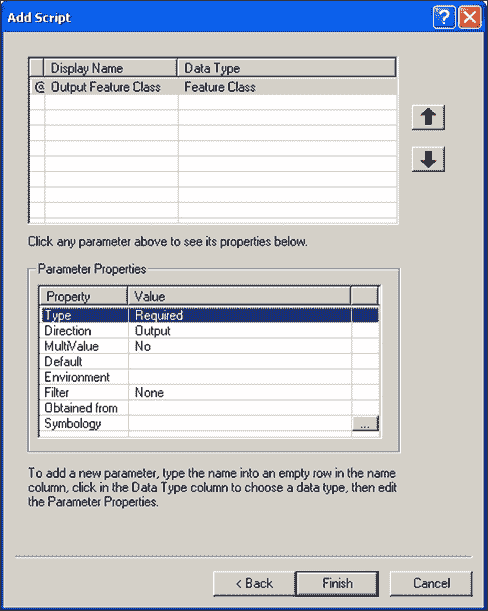

1.  接下来，我们需要添加一个参数，用于定义将用作我们新要素类属性模板的要素类。在对话框中输入以下信息：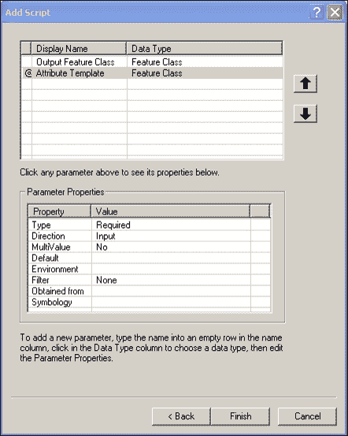

1.  最后，我们需要添加一个参数，用于指定在创建我们的新要素类时用作输入的逗号分隔的文本文件。将以下信息输入到你的对话框中：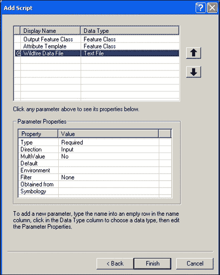

1.  点击**完成**。新的脚本工具将被添加到你的**Wildfire Tools**工具箱中，如下一个屏幕截图所示：

1.  现在，我们将测试这个工具以确保它正常工作。双击脚本工具以显示如下所示的对话框：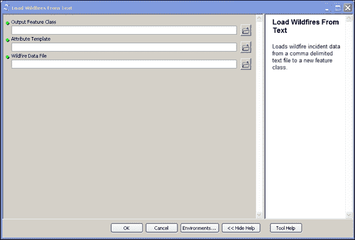

1.  定义一个新的输出要素类，它应该加载到现有的`WildlandFires.mdb`个人地理数据库中，如下一个屏幕截图所示。点击打开文件夹图标，导航到`WildlandFires.mdb`个人地理数据库，它应该位于`c:\ArcpyBook\data\Wildfires`。

1.  你还需要给你的新要素类起一个名字。在这个例子中，我们将要素类命名为`TodaysWildfires`，但名字可以是任何你想要的。在下面的屏幕截图中，你可以看到一个如何操作的例子。点击**保存**按钮：

1.  对于属性模板，你需要指向已经为你创建的`FireIncidents`要素类。这个要素类包含一个名为`CONFIDENCEVAL`的字段。这个字段将在我们的新要素类中创建。点击**浏览**按钮，导航到`c:\ArcpyBook\data\Wildfires\WildlandFires.mdb`，你应该能看到`FireIncidents`要素类。选择它并点击**添加**。

1.  最后，最后一个参数需要指向包含野火信息的逗号分隔的文本文件。此文件位于`c:\ArcpyBook\data\Wildfires\NorthAmericaWildfires_2007275.txt`。点击**浏览**按钮，导航到`c:\ArcpyBook\data\Wildfires`。点击`NorthAmericaWildfires_2007275.txt`，然后点击**添加**按钮。你的工具应该如下所示：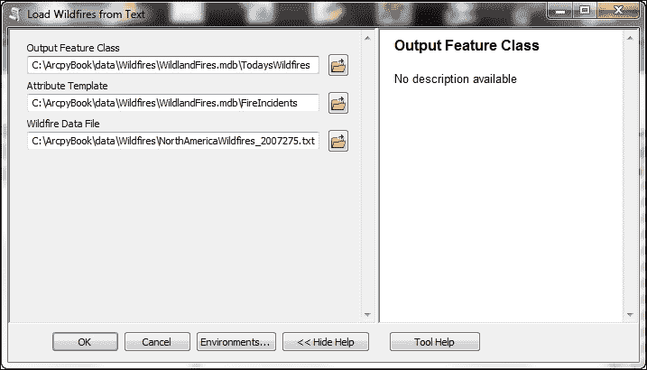

1.  点击**确定**以执行工具。任何消息都将写入如下所示的对话框。这是任何地理处理工具的标准对话框。

1.  如果一切设置正确，你应该会看到下面的屏幕截图，显示一个新的要素类将被添加到 ArcMap 显示中：

1.  在 ArcMap 中，选择**添加底图**，然后选择地形**底图**。点击**添加**按钮以添加**底图**图层。

这将为您刚刚导入的数据提供参考，如前一个截图所示。

## 它是如何工作的…

几乎所有的脚本工具都有参数，这些值是为工具对话框设置的。当工具执行时，参数值会发送到您的脚本。您的脚本读取这些值，然后继续其工作。Python 脚本可以接受参数作为输入。参数，也称为参数，使您的脚本变得动态。到目前为止，我们所有的脚本都使用了硬编码的值。通过为脚本指定输入参数，您可以在运行时提供要素类的名称。这种能力使您的脚本更加灵活。

`GetParameterAsText()` 方法用于捕获参数输入，它是基于零的，第一个输入的参数占据 `0` 索引，每个后续参数增加 `1`。通过读取逗号分隔的文本文件创建的输出要素类由 `outputFC` 变量指定，该变量通过 `GetParameterAsText(0)` 获取。使用 `GetParameterAsText(1)`，我们捕获一个将作为输出要素类属性模式的模板的要素类。模板要素类中的属性字段用于定义将填充我们的输出要素类的字段。最后，`GetParameterAsText(2)` 用于创建一个名为 `f` 的变量，该变量将保存要读取的逗号分隔的文本文件。

## 还有更多...

`arcpy.GetParameterAsText()` 方法并不是捕获传递到您的脚本中的信息的唯一方式。当您从命令行调用 Python 脚本时，您可以传递一组参数。当向脚本传递参数时，每个单词必须由一个空格分隔。这些单词存储在一个名为 `sys.argv` 的零基于列表对象中。使用 `sys.argv`，列表中的第一个项目，通过 `0` 索引引用，存储脚本的名称。每个后续的单词通过下一个整数引用。因此，第一个参数将存储在 `sys.argv[1]` 中，第二个在 `sys.argv[2]` 中，依此类推。然后可以从脚本内部访问这些参数。

建议您使用 `GetParameterAsText()` 函数而不是 `sys.argv`，因为 `GetParameterAsText()` 没有字符限制，而 `sys.argv` 每个参数有 1,024 个字符的限制。在任何情况下，一旦参数被读入脚本，您的脚本就可以使用输入值继续执行。

# 创建 Python 工具箱

在 ArcGIS 中创建工具箱有两种方式：在自定义工具箱中的脚本工具，这是我们上一道菜谱中提到的，以及在 Python 工具箱中的脚本工具。Python 工具箱是在 ArcGIS 10.1 版本中引入的，它将所有内容封装在一个地方：参数、验证代码和源代码。这与使用向导和单独处理业务逻辑的脚本创建的自定义工具箱不同。

## 准备工作

**Python 工具箱**类似于 **ArcToolbox** 中的任何其他工具箱，但它完全由 Python 创建，并具有 `.pyt` 文件扩展名。它通过名为 `Toolbox` 的类以编程方式创建。在本菜谱中，您将学习如何创建 **Python 工具箱** 并添加自定义工具。在完成 `Toolbox` 和 `Tool` 的基本结构后，您将通过添加连接到 **ArcGIS Server** 地图服务、下载实时数据并将其插入要素类的代码来完成工具的功能。

## 如何操作…

完成以下步骤以创建 **Python 工具箱** 并创建一个连接到 **ArcGIS Server** 地图服务、下载实时数据并将其插入要素类的自定义工具：

1.  打开**ArcCatalog**。您可以通过在文件夹上右键单击并选择**新建** | **Python 工具箱**来在文件夹中创建一个 Python 工具箱。在 ArcCatalog 中，有一个名为 **Toolboxes** 的文件夹，其中包含一个 **My Toolboxes** 文件夹，如图所示：

1.  右键单击此文件夹并选择 **新建** | **Python 工具箱**。

1.  工具箱的名称由文件名控制。将工具箱命名为 `InsertWildfires.pyt`：

1.  **Python 工具箱**文件（`.pyt`）可以在任何文本或代码编辑器中编辑。默认情况下，代码将在 **记事本** 中打开。您可以通过转到 **地理处理** | **地理处理选项** 并进入 **编辑器** 部分来设置脚本的默认编辑器。您会注意到在下图中，我已经将我的编辑器设置为 **PyScripter**，这是我首选的环境。您可能希望将其更改为 **IDLE** 或您目前正在使用的任何开发环境。请注意，此步骤不是必需的。如前所述，默认情况下，它将在记事本中打开您的代码。

1.  右键单击 `InsertWildfires.pyt` 并选择 **编辑**。这将打开您的开发环境。您的开发环境将取决于您定义的编辑器。

1.  记住，你不会更改类的名称，该名称是`Toolbox`。然而，你将重命名`Tool`类以反映你想要创建的工具的名称。每个工具都将有各种方法，包括`__init__()`，这是工具的构造函数，以及`getParameterInfo()`、`isLicensed()`、`updateParameters()`、`updateMessages()`和`execute()`。你可以使用`__init__()`方法设置初始化属性，例如工具的标签和描述。查找`Tool`类并将其名称更改为`USGSDownload`。还要设置标签和描述，如下面的代码所示：

    ```py
    class USGSDownload(object):
        def __init__(self):
            """Define the tool (tool name is the name of the class)."""
            self.label = "USGS Download"
            self.description = "Download from USGS ArcGIS Server instance"
    ```

1.  你可以通过复制和粘贴类及其方法，将`Tool`类用作其他你想要添加到工具箱中的工具的模板。我们在这个特定的练习中不会这样做，但我希望你知道这个事实。你需要将每个工具添加到`Toolbox`的`tools`属性中。添加`USGS Download`工具，如下面的代码所示：

    ```py
    class Toolbox(object):
        def __init__(self):
            """Define the toolbox (the name of the toolbox is the name of the
            .pyt file)."""
            self.label = "Toolbox"
            self.alias = ""
            # List of tool classes associated with this toolbox
            self.tools = [USGSDownload]
    ```

1.  当你关闭代码编辑器时，你的**工具箱**应该会自动刷新。你也可以通过右键单击工具箱并选择**刷新**来手动刷新工具箱。如果你的代码中发生语法错误，工具箱图标将改变，如下面的截图所示。注意工具箱旁边的红色**X**

1.  在这个时候，你不应该有任何错误，但如果有的话，右键单击工具箱并选择检查语法以显示错误，如下面的截图所示。注意，如果你有错误，它可能与以下示例不同：

1.  假设你没有语法错误，你应该看到以下工具箱/工具结构：

1.  几乎所有工具都有参数，你可以在工具对话框或脚本中设置它们的值。当工具执行时，参数值将发送到你的工具源代码。你的工具读取这些值并继续其工作。你使用`getParameterInfo()`方法来定义你的工具的参数。作为这个过程的一部分，创建单个`Parameter`对象。在`getParameterInfo()`方法中添加以下参数，然后我们将讨论它们：

    每个`Parameter`对象都是使用`arcpy.Parameter`创建的，并传递了定义对象的一组参数。

    对于第一个`Parameter`对象（`param0`），我们将捕获一个包含当前野火数据的 ArcGIS Server 地图服务的 URL。我们给它一个显示名称（ArcGIS Server Wildfire URL），它将在工具的对话框中显示，一个参数名称，数据类型，参数类型（这是必需的），以及方向。

    在第一个参数（`param0`）的情况下，我们还分配了一个初始值，即包含野火数据的现有地图服务的 URL。

    对于第二个参数，我们定义了一个输出要素类，用于将从中读取的野火数据写入。一个空的要素类已为您创建以存储数据。最后，我们将这两个参数添加到一个名为`params`的 Python 列表中，并将列表返回给调用函数

1.  工具的主要工作是在`execute()`方法中完成的。这是您的工具地理处理发生的地方。在以下代码中看到的`execute()`方法可以接受多个参数，包括工具（self）、参数和消息：

    ```py
      def execute(self, parameters, messages):
            """The source code of the tool. """
            return
    ```

1.  要访问传递给工具的参数值，您可以使用`valueAsText()`方法。将以下代码添加到您的工具中，以访问将要传递给您的工具的参数值。记住，正如之前提到的步骤中所示，第一个参数将包含一个包含野火数据的地图服务的 URL，第二个参数是数据将被写入的输出要素类：

    ```py
    def execute(self, parameters, messages):
            inFeatures = parameters[0].valueAsText
            outFeatureClass = parameters[1].valueAsText
    ```

1.  到目前为止，您已经创建了一个 Python 工具箱，添加了一个工具，定义了工具的参数，并创建了将保存最终用户定义的参数值的变量。最终，此工具将使用传递给工具的 URL 连接到 ArcGIS 服务器地图服务，下载当前的野火数据，并将野火数据写入要素类。我们将在下一步这样做。

1.  注意，为了完成本练习的剩余部分，您需要使用`pip`安装 Python 的`requests`模块（请参阅[`docs.python-requests.org/en/latest/`](http://docs.python-requests.org/en/latest/)）。在继续下一步之前，现在就做这件事。`pip`和`requests`的安装说明可以在提供的链接中找到。

1.  接下来，添加连接到野火地图服务以执行查询的代码。在此步骤中，您还将定义传递给地图服务查询的`QueryString`参数。首先，我们将通过添加以下代码来导入`requests`和`json`模块：

    ```py
    import requests
    import json
    ```

1.  然后，创建一个将保存`QueryString`参数的 payload 变量。请注意，在这种情况下，我们定义了一个`where`子句，以便只返回大于`5`英亩的火灾。`inFeatures`变量包含 URL：

    ```py
    def execute(self, parameters, messages):
            inFeatures = parameters[0].valueAsText
            outFeatureClass = parameters[1].valueAsText

            agisurl = inFeatures

            payload = { 'where': 'acres > 5','f': 'pjson', 'outFields': 'latitude,longitude,fire_name,acres'}
    ```

1.  将请求提交给 ArcGIS 服务器实例，并将响应存储在名为`r`的变量中。向对话框打印一条消息，指示响应：

    ```py
    def execute(self, parameters, messages):
            inFeatures = parameters[0].valueAsText
            outFeatureClass = parameters[1].valueAsText

            agisurl = inFeatures

            payload = { 'where': 'acres > 5','f': 'pjson', 'outFields': 'latitude,longitude,fire_name,acres'}

            r = requests.get(inFeatures, params=payload)
    ```

1.  让我们测试一下代码，以确保我们走在正确的道路上。保存文件并在 ArcCatalog 中刷新您的工具箱。执行工具并保留默认 URL。如果一切按预期工作，您应该会看到一个进度对话框的 JSON 对象输出。您的输出可能会有所不同。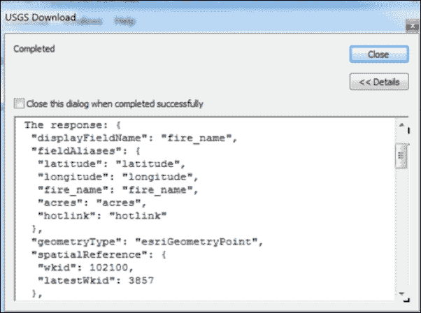

1.  返回到`execute()`方法，并将 JSON 对象转换为 Python 字典：

    ```py
        def execute(self, parameters, messages):
            inFeatures = parameters[0].valueAsText
            outFeatureClass = parameters[1].valueAsText

            agisurl = inFeatures

            payload = { 'where': 'acres > 5','f': 'pjson', 'outFields': 'latitude,longitude,fire_name,acres'}

            r = requests.get(inFeatures, params=payload)

            decoded = json.loads(r.text)
    ```

1.  通过传递工具对话框中定义的输出要素类以及将要填充的字段来创建一个 `InsertCursor`。然后我们开始一个 `for` 循环，循环遍历从 ArcGIS 服务器地图服务请求返回的每个要素（野火）。`decoded` 变量是一个 Python 字典。在 `for` 循环内部，我们从 `attributes` 字典中检索火灾名称、纬度、经度和面积。最后，我们调用 `insertRow()` 方法将新的行插入到要素类中，并将火灾名称和面积作为属性。进度信息被写入到 **进度对话框**，并更新计数器。`execute()` 方法现在应如下所示：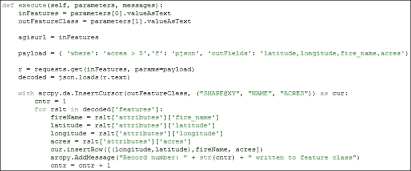

1.  保存文件并在需要时刷新您的 **Python 工具箱**。

1.  您可以通过检查 `c:\ArcpyBook\code\Ch6\InsertWildfires_PythonToolbox.py` 解决方案文件来验证您的操作。

1.  双击**USGS 下载**工具。

1.  保持默认的 URL 并选择位于 `c:\ArcpyBook\data` 中的 **WildlandFires** 地理数据库中的 **RealTimeFires** 要素类。**RealTimeFires** 要素类为空，并包含 `NAME` 和 `ACRES` 字段。

1.  点击**确定**以执行工具。写入要素类的要素数量将根据当前的野火活动情况而变化。大多数时候，至少会有一点活动，但不太可能（尽管有可能）在美国没有任何野火：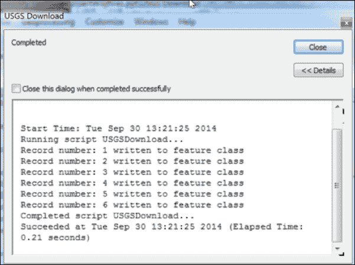

1.  在 **ArcMap** 中查看要素类以查看其要素。您可能想添加一个 `basemap` 图层以提供参考，如图中所示：

## 它是如何工作的…

新风格的 ArcGIS Python 工具箱提供了一种以 Python 为中心的创建自定义脚本工具的方法。在 ArcGIS for Desktop 中创建自定义脚本工具的旧方法结合了 Python 和基于向导的方法来定义工具的各个方面。新方法为创建工具提供了一种更直接的方法。您创建的所有工具都包含在一个名为 `Toolbox` 的类中，该类不应重命名。默认情况下，`Toolbox` 内将创建一个单独的 `Tool` 类。这个 `Tool` 类应该重命名。在本食谱中，我们将其重命名为 `USGSDownload`。在 `USGSDownload` 类内部，存在 `getParameterInfo()` 和 `execute()` 方法等。使用 `getParameterInfo()` 方法，可以定义 `Parameter` 对象来保存输入数据。在这个工具中，我们定义了一个 `Parameter` 来捕获包含实时野火数据的 ArcGIS 服务器地图服务的 URL，以及一个用于引用本地要素类的第二个 `Parameter` 对象来保存数据。最后，当用户在工具中点击 **OK** 按钮时，将触发 `execute()` 方法。参数信息以 `parameters` 变量的形式作为参数发送给 `execute()` 方法。在这个方法内部，使用 Python 的 `requests` 模块提交一个请求以从远程 ArcGIS 服务器实例获取野火数据。响应以 `json` 对象的形式返回，并将其转换为存储在名为 **decoded** 的变量中的 Python 字典。从解码变量中提取火灾名称、纬度、经度和英亩数，并使用来自 `arcpy.da` 模块的 `InsertCursor` 对象将其写入本地要素类。我们将在本书的后续章节中详细介绍 `arcpy.da` 模块。
