# 第十章：使用插件自定义 ArcGIS 界面

在本章中，我们将介绍以下食谱：

+   下载和安装 Python 插件向导

+   创建按钮插件并使用 Python 插件模块

+   安装和测试插件

+   创建工具插件

# 简介

在本章中，我们将介绍使用 Python 创建插件的创建、测试、编辑和共享。**插件**提供了一种通过模块化代码库将用户界面项添加到 ArcGIS for Desktop 的方法，该代码库旨在执行特定操作。界面组件可以包括按钮、工具、工具栏、菜单、组合框、工具调色板和应用扩展。插件概念首次在 ArcGIS for Desktop 10.0 中引入，可以使用 .NET 或 Java 创建。然而，从 ArcGIS 10.1 的发布开始，现在可以使用 Python 创建插件。插件使用 Python 脚本和一个定义用户界面应如何显示的 XML 文件创建。

插件提供了一种简单的方法将用户界面自定义分发到最终用户。不需要安装程序。一个扩展名为 `.esriaddin` 的单个压缩文件被复制到一个知名文件夹中，然后 ArcGIS for Desktop 处理其余部分。为了进一步简化开发，Esri 提供了一个 Python 插件向导。您可以从 Esri 网站下载向导。我们将在本章的第一个食谱中这样做。

可以创建多种类型的插件。按钮和工具是最简单的插件类型，您可以创建。按钮在点击时简单地执行业务逻辑。工具与按钮类似，但在执行业务逻辑之前需要与地图进行交互。组合框为用户提供了一组选项供选择。

此外，还有许多容器对象，包括菜单、工具栏、工具调色板和应用扩展。菜单充当按钮或其他菜单的容器。工具栏是按钮、工具、组合框、工具调色板和菜单的容器。它们是插件中最通用的容器类型。工具调色板也充当工具的容器，需要在工具暴露之前添加到工具栏中。最后，应用扩展是最复杂的插件类型。此类插件协调其他组件之间的活动，并负责监听和响应各种事件，例如从数据帧中添加或删除图层。

# 下载和安装 Python 插件向导

Esri 提供了一个工具，您可以使用它使插件的开发更容易。Python 插件向导可以从 Esri 网站下载，是创建插件的绝佳资源。

## 准备工作

Python 插件向导是一个创建插件所需文件的绝佳资源。它从可视化界面生成插件所需的文件。在本食谱中，您将下载并安装 Python 插件向导。

## 如何操作...

按照以下步骤学习如何下载和安装 Python 插件向导：

1.  打开网页浏览器并导航到 [`www.arcgis.com/home/item.html?id=5f3aefe77f6b4f61ad3e4c62f30bff3b`](http://www.arcgis.com/home/item.html?id=5f3aefe77f6b4f61ad3e4c62f30bff3b).

    您应该看到一个类似于以下截图的网页：

    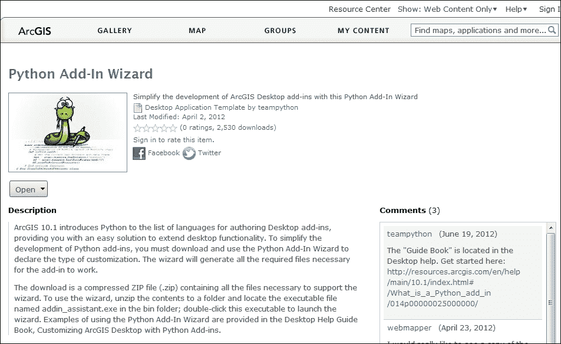

1.  点击 **打开** 按钮下载安装文件。

1.  使用 Windows 资源管理器，在您的计算机上创建一个名为 `Python Add-In Wizard` 的新文件夹。文件夹的名称无关紧要，但为了简单易记，您应该选择 `Python Add-In Wizard` 或类似名称。

1.  将文件解压到这个新文件夹中。有许多工具可以用来解压文件。它们的使用方法可能略有不同，但使用 WinZip，您应该可以右键单击文件并选择 **解压**。

1.  打开解压后的 `bin` 文件夹，双击 `addin_assistant.exe` 运行向导。在下面的截图中，我已经创建了一个名为 `Python Add-In Wizard` 的新文件夹，并解压了下载的文件。创建了 `bin` 文件夹，在这个文件夹中有一个名为 `addin_assistant.exe` 的文件：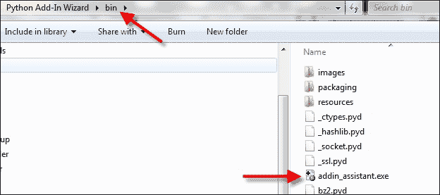

1.  双击 `addin_assistant.exe` 将提示您选择一个目录作为插件项目根目录：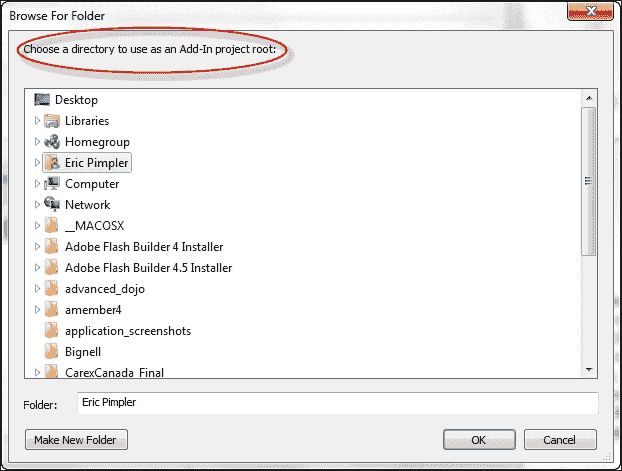

## 工作原理…

Python 插件向导是一个可视化界面工具，您可以使用它为 ArcGIS for Desktop 创建插件。它通过点选工具大大简化了过程。在下一个菜谱中，您将使用向导创建基本的 ArcGIS for Desktop 插件。

# 创建按钮插件和使用 Python 插件模块

`按钮` 插件是最简单类型的插件，也是最常用的。使用按钮插件，您在脚本中编写的功能会在每次点击按钮时执行。

## 准备工作

创建插件项目是创建新插件的第一步。要使用 Python 插件向导创建项目，您需要选择一个工作目录，输入各种项目设置，然后点击 **保存** 按钮。插件的创建随后遵循一个定义良好的过程，如下面的截图所示：

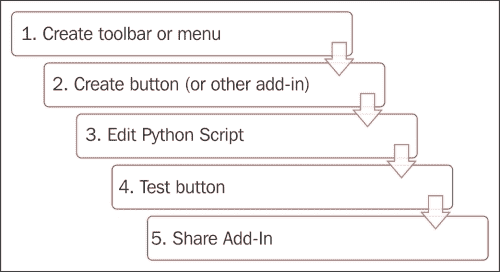

您必须首先为插件创建一个容器，这可以是工具栏或菜单的形式。接下来，创建按钮、工具或您想要添加到容器中的任何其他插件。在本例中，我们将创建一个按钮。然后，您需要编辑与按钮关联的 Python 脚本。您还希望测试按钮以确保它按预期工作。最后，您可以与他人共享插件。在本例中，您将学习如何使用插件向导创建 ArcGIS for Desktop 的按钮插件。按钮插件将执行使用`pythonaddins`模块的代码，以显示一个对话框，允许用户添加已经为数据框架创建的特征类。

## 如何操作...

按照以下步骤学习如何创建一个按钮插件：

1.  通过双击位于您提取向导的`bin`文件夹中的`addin_assistant.exe`文件来打开 ArcGIS Python 插件向导。

1.  创建一个名为`Wildfire_Addin`的新项目文件夹，并选择**确定**：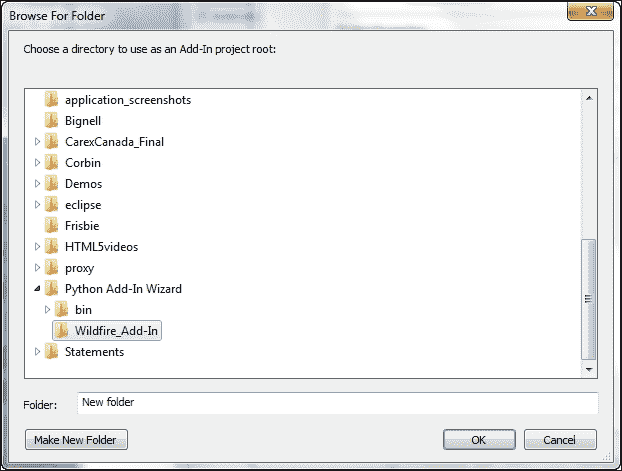

1.  初始时应该激活**项目设置**选项卡，并显示您刚刚创建的工作目录。默认情况下，**ArcMap**应该是选定的产品，但您应该验证这一点：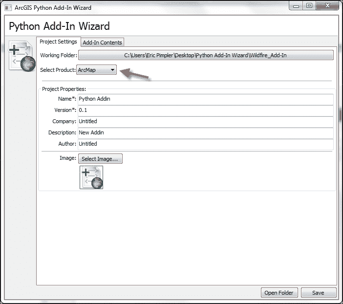

1.  给您的项目起一个名字。我们将称之为`Load Wildfire Data Addin`：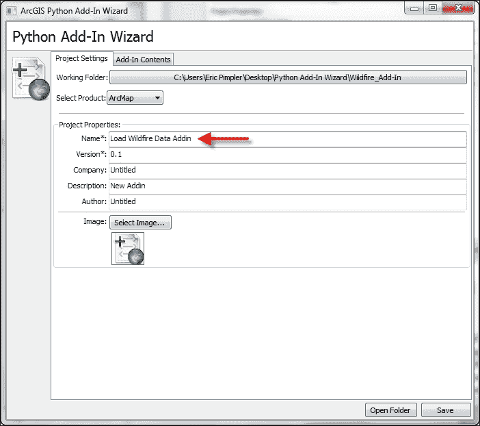

1.  默认情况下，**版本**是**0.1**。如果您愿意，可以更改它。版本号应随着您更新或添加工具而更改。这有助于跟踪和共享您的插件：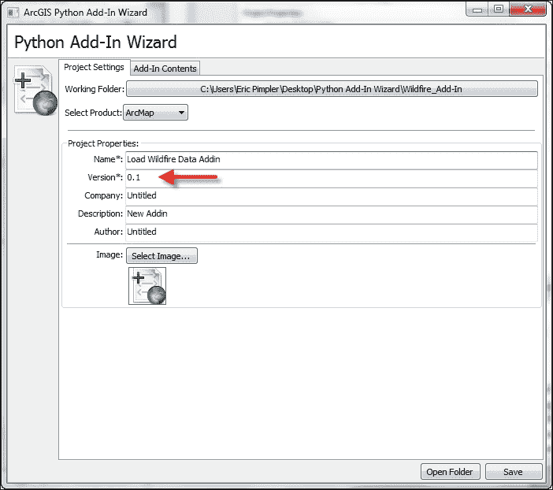

1.  **名称**和**版本**属性是仅有的两个必需属性。按照以下截图所示，添加公司、描述和作者信息是一个好习惯。添加您自己的信息：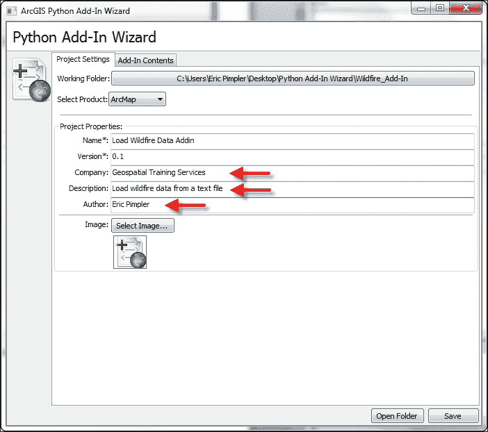

1.  您可能还希望为插件添加一个图像。在`C:\ArcpyBook\Ch10`文件夹中提供了一个名为`wildfire.png`的文件用于此目的：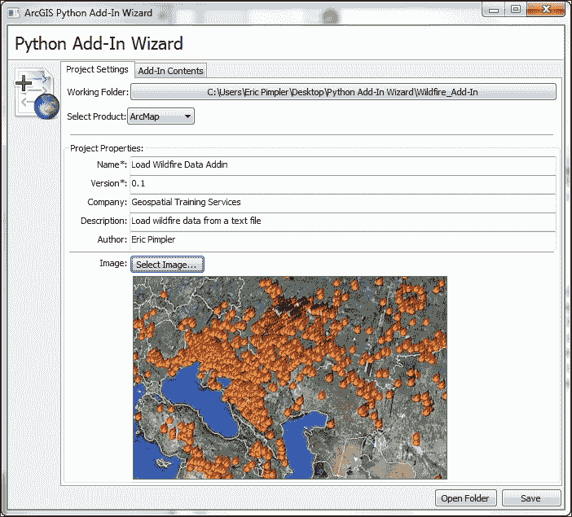

1.  **插件内容**选项卡用于定义可以创建的各种插件。在本步骤中，我们将创建一个工具栏，用于包含一个运行野火脚本的单一按钮插件，该脚本将`fires`从文本文件导入到特征类。单击**插件内容**选项卡：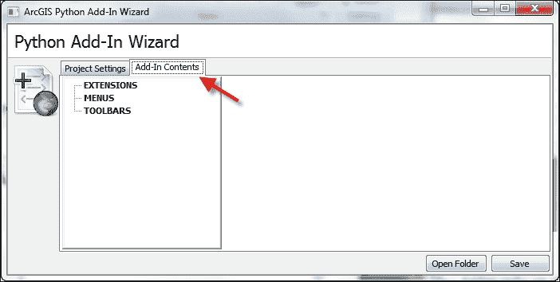

1.  在**插件内容**选项卡中，右键单击**工具栏**并选择**新建工具栏**。为工具栏提供一个**标题**，接受默认名称，并确保选中**初始显示**复选框：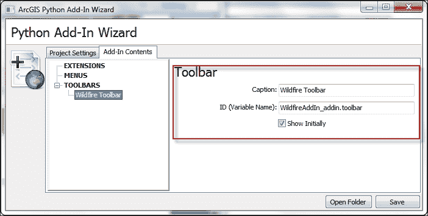

    虽然在功能上并没有做很多事情，但工具栏插件非常重要，因为它充当其他插件的容器，例如按钮、工具、组合框、工具板和菜单。工具栏可以是浮动的或固定的。使用`Python 插件向导`创建工具栏插件很容易。

1.  点击**保存**按钮。

1.  现在，我们将通过右键单击新的**野火工具栏**选项并选择**新建按钮**来添加一个按钮。

1.  填写**按钮**的详细信息，包括**标题**、**类名**、**ID（变量名）**、**工具提示**等。你还可以包括**控件图像**。在此情况下，我没有这样做，但你可以选择这样做。这些信息将保存到附加件的配置文件中：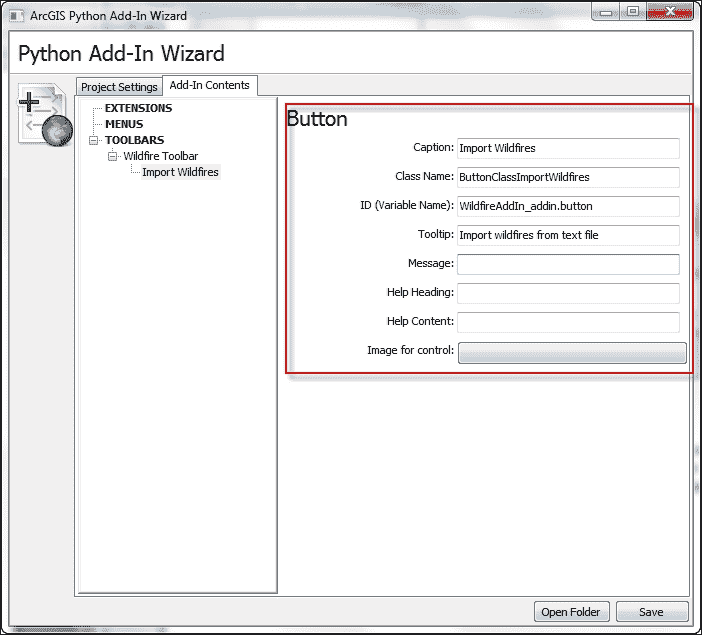

1.  点击**保存**按钮。附加件有一个它们所附加的 Python 脚本。默认情况下，此文件将命名为 `AddIns_addin.py`，并位于你工作项目文件夹的 `install` 目录中。

1.  我们已经创建了一个自定义的 `ArcToolbox` Python 脚本工具，该工具从包含野火数据的磁盘上的逗号分隔文本文件加载到要素类中。我们将在我们的附加件中使用此脚本的输出。在 Windows 资源管理器中，转到你之前创建的 `addin` 目录。它应该被称为 `Wildfire_Addin`。转到 `Install` 文件夹，你应该找到一个名为 `WildfireAddin_addin.py` 的文件。将此文件加载到你的 Python 编辑器中。

1.  在这一步，我们将编写使用 `pythonaddins` 模块的代码，以打开一个对话框，允许你向选定的数据框添加一个或多个图层。`pythonaddins` 中的 `OpenDialog()` 和 `GetSelectedTOCLayerorDataFrame()` 函数用于完成此任务。找到以下代码片段中显示的 `onClick(self)` 方法。此方法在按钮被点击时触发。从 `onClick` 事件中删除 `pass` 语句并添加以下代码：

    ```py
    import arcpy
    import pythonaddins

    class ButtonClassImportWildfires(object):
        """Implementation for Wildfire_addin.button (Button)"""
        def __init__(self):
            self.enabled = True
            self.checked = False
        def onClick(self):
            layer_files = pythonaddins.OpenDialog('Select Layers to Add', True, r'C:\ArcpyBook\data\Wildfires', 'Add')
            mxd = arcpy.mapping.MapDocument('current')
            df = pythonaddins.GetSelectedTOCLayerOrDataFrame()
            if not isinstance(df, arcpy.mapping.Layer):
                for layer_file in layer_files:
                    layer = arcpy.mapping.Layer(layer_file)
                    arcpy.mapping.AddLayer(df, layer)
            else:
                pythonaddins.MessageBox('Select a data frame', 'INFO', 0)
    ```

1.  保存文件。

1.  你可以通过检查 `C:\ArcpyBook\code\Ch10\WildfireAddIn.py` 解决方案文件来检查你的工作。

在下一个菜谱中，你将学习如何安装你的新附加件。

## 它是如何工作的...

正如你在本菜谱中看到的，Python 附加件向导通过可视化界面处理附加件的创建。然而，在幕后，向导为附加件创建了一系列文件夹和文件。附加件文件结构实际上非常简单。两个文件夹和一组文件构成了附加件结构。你可以在以下屏幕截图中看到此结构：

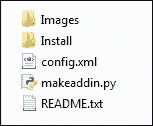

`Images` 文件夹包含插件使用的任何图标或其他图像文件。在本示例中，我们使用了 `wildfire.png` 图像。因此，此文件现在应在 `Images` 文件夹中。`Install` 文件夹包含处理插件业务逻辑的 Python 脚本。这是您将大量工作的文件，用于编写插件。它执行按钮、工具、菜单项等需要执行的所有业务逻辑。插件主文件夹中的 `config.xml` 文件定义用户界面和静态属性，例如名称、作者、版本等。可以双击 `makeaddin.py` 文件来创建 `.esriaddin` 文件，该文件将所有内容封装到一个带有 `.esriaddin` 扩展名的压缩文件中。这个 `.esriaddin` 文件将分发给最终用户，以便安装插件。

# 安装和测试插件

在分发插件给最终用户之前，您可能想要测试插件。要测试这些插件，您首先需要安装插件。

## 准备工作

在您的插件工作文件夹中，可以使用 `makeaddin.py` 脚本来将所有文件和文件夹复制到工作目录中的一个压缩插件文件夹中，该文件夹以 `<working folder name>.esriaddin` 文件格式命名。双击此 `.esriaddin` 文件以启动 Esri ArcGIS 插件安装实用程序，这将安装您的插件。然后您可以在 ArcGIS for Desktop 中测试插件。自定义工具栏或菜单可能已经可见并准备好测试。如果不可见，请转到**自定义**菜单并点击**插件管理器**。**插件管理器**对话框列出了针对当前应用程序的已安装插件。插件信息，如名称、描述和图像，作为项目设置输入，应显示。

## 如何操作…

1.  在您的插件主文件夹内部，将有一个名为 `makeaddin.py` 的 Python 脚本文件。此脚本创建 `.esriaddin` 文件。双击脚本以执行并创建 `.esriaddin` 文件。此过程在下面的截图中有说明：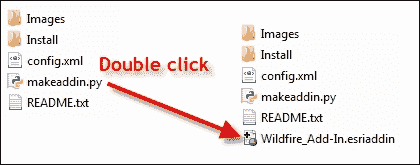

1.  要安装 ArcGIS for Desktop 的插件，请双击 `Widlfire_Add-In.esriaddin` 文件，这将启动**Esri ArcGIS 插件安装实用程序**窗口，如下面的截图所示：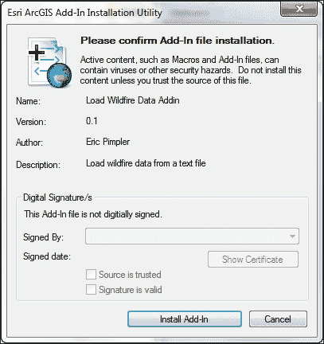

1.  点击**安装插件**。如果一切顺利，您应该看到以下消息：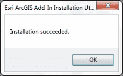

1.  要测试插件，请打开**ArcMap**。您的插件可能已经处于活动状态。如果不是，请导航到**自定义** | **插件管理器**。这将显示**插件管理器**对话框，如下面的截图所示。您应该能够看到您创建的插件：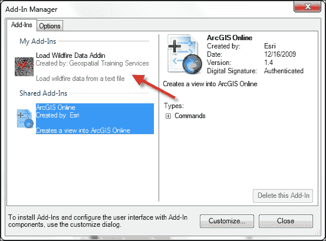

1.  如果需要，请选择**自定义**按钮。要将工具栏添加到应用程序中，请单击**工具栏**选项卡并选择您创建的工具栏：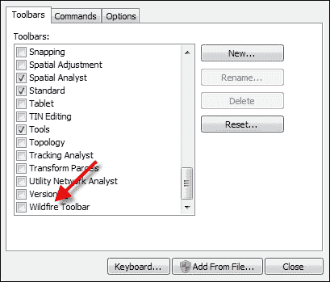

    插件现在应显示，如本截图所示：

    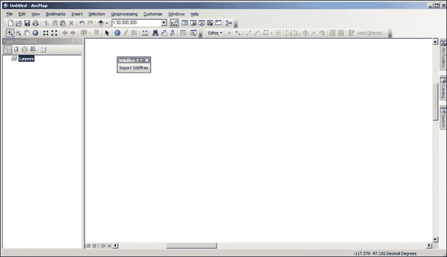

1.  点击按钮，在显示的对话框中，导航到`Wildfires`图层，这些图层您之前在`WildlandFires.mdb`中创建。选择并添加到显示中：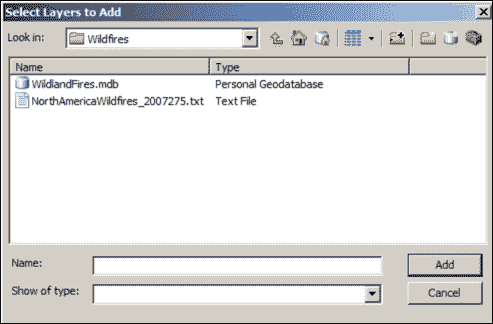

    在这里，您将看到从对话框中选择一个或多个图层后的输出：

    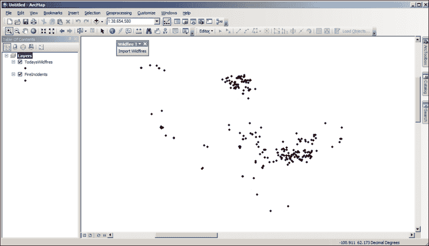

## 如何工作…

该实用程序将插件放置在 ArcGIS for Desktop 可发现的知名文件夹中。此文件夹的位置如下：

+   Windows 8: `C:\Users\<用户名>\Documents\ArcGIS\AddIns\Desktop10.3`

+   Vista/7: `C:\Users\<用户名>\Documents\ArcGIS\AddIns\Desktop10.3`

+   XP: `C:\Documents and Settings\<用户名>\My Documents\ArcGIS\AddIns\Desktop10.3`

在知名文件夹内将创建一个具有唯一**全局唯一标识符**或**GUID**名称的文件夹。插件将驻留在该唯一文件夹名称内。以下截图展示了这一点。当 ArcGIS for Desktop 启动时，它将搜索这些目录并加载插件：

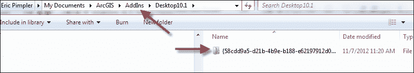

插件将类似于以下所示：


### 注意

默认插件文件夹位于您的用户账户中的`ArcGIS`文件夹内。例如，如果您的`ArcGIS`安装版本为 10.1，则插件在 Vista 或 Windows 7 操作系统上被复制到`C:\users\<用户名>\Documents\ArcGIS\AddIns\Desktop10.1`。

您还可以使用私有网络驱动器向最终用户分发插件。ArcGIS for Desktop 中的`Add-In Manager`添加并维护可以搜索插件的文件夹列表。选择**选项**选项卡，然后选择**添加文件夹**以将网络驱动器添加到列表中。

# 创建工具插件

工具插件类似于按钮，但工具需要与地图进行某种类型的交互。例如，缩放工具就是一种工具。工具应放置在工具栏或工具调色板内。它们的属性类似于按钮。您还需要编辑 Python 脚本。

## 准备就绪

`Tool`类有几个属性，包括`cursor`、`enabled`和`shape`。`cursor`属性设置工具被点击时的光标，并定义为对应于光标类型的整数值，如下所示：

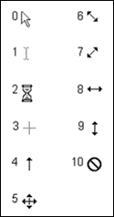

默认情况下，工具是启用的。不过，可以通过将 `enabled` 属性设置为 `false` 来更改此设置。最后，`shape` 属性指定要绘制的形状类型，可以是线、矩形或圆形。这些属性通常在工具的构造函数中设置，该构造函数由 `__init__` 方法定义，如下面的代码示例所示。`self` 对象指的是当前对象（在这种情况下是工具）并是一个引用当前对象的变量：

```py
def __init__(self):
  self.enabled = True
  self.cursor = 3
  self.shape = 'Rectangle'
```

与 `Tool` 类相关联有许多函数。所有类都将有一个构造函数，用于定义类的属性。你之前已经看到了这个 `__init__` 函数的例子。工具类中的其他重要函数包括 `onRectangle()`、`onCircle()` 和 `onLine()`。这些函数对应于使用工具在地图上绘制的形状。绘制的形状的几何形状被传递到函数中。还有许多鼠标和键盘函数可以使用。最后，当您想要停用工具时，可以调用 `deactivate()` 函数。

我们已经看到了 `Tool` 类的构造函数在行动中的样子。这个名为 `__init__` 的函数用于在创建工具时设置各种属性。在这里，我们还展示了 `Tool` 类的 `onRectangle()` 函数。当在地图上绘制矩形时，会调用此函数。函数接收矩形的几何形状以及工具本身的引用：

```py
def onRectangle(self, rectangle_geometry):
```

在本教程中，你将学习如何创建一个工具插件，该插件能够响应用户在地图上拖动矩形。该工具将使用 **生成随机点** 工具在矩形内生成点。

## 如何操作...

按照以下步骤使用 **ArcGIS Python Add-In 向导** 创建工具插件：

1.  通过双击位于提取向导的 `bin` 文件夹中的 `addin_assistant.exe` 文件来打开 **ArcGIS Python Add-In 向导**。

1.  创建一个名为 `Generate_Random_Points` 的新项目文件夹，并选择 **确定**。

1.  在 **项目设置** 选项卡中输入属性，包括 **名称**、**版本**、**公司**、**描述** 和 **作者**：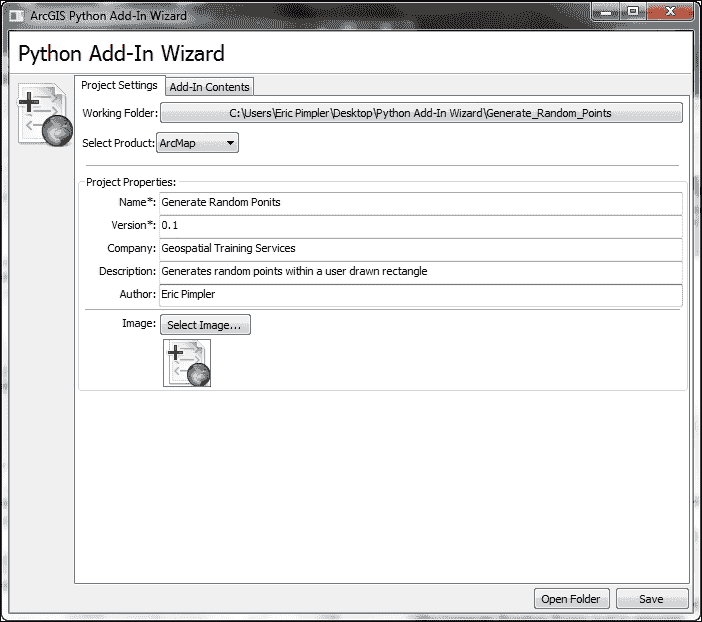

1.  点击 **插件内容** 选项卡。

1.  右键单击 **工具栏** 并选择 **新建工具栏**。

1.  将工具栏的标题设置为 `随机点工具栏`。

1.  右键单击新创建的 `随机点工具栏` 并选择 **新建工具**。

1.  按照以下截图所示输入工具项：

1.  点击 **保存**。这将生成插件的文件夹和文件结构。

1.  前往新插件的 `Install` 文件夹，并在 IDLE 中打开 `GenerateRandomPoints_addin.py` 文件。

1.  将以下代码添加到 `__init__` 函数中，这是工具的构造函数：

    ```py
    def __init__(self):
      self.enabled = True
      self.cursor = 3
      self.shape = 'Rectangle'
    ```

1.  在 `onRectangle()` 函数中，编写代码以在屏幕上绘制的矩形内生成一组随机点：

    ```py
    import arcpy
    import pythonaddins

    def __init__(self):
      self.enabled = True
      self.cursor = 3
      self.shape = 'Rectangle'

    def onRectangle(self, rectangle_geometry):
        extent = rectangle_geometry
        arcpy.env.workspace = r'c:\ArcpyBook\Ch10'
        if arcpy.Exists('randompts.shp'):
            arcpy.Delete_management('randompts.shp')
            randompts = arcpy.CreateRandomPoints_management(arcpy.env.workspace,'randompts.shp',"",rectangle_geometry)
            arcpy.RefreshActiveView()
        return randompts
    ```

1.  保存文件。

1.  你可以通过检查 `C:\ArcpyBook\code\Ch10\GenerateRandomPoints_addin.py` 解决方案文件来检查你的工作。

1.  通过在插件的 `main` 文件夹中双击 `makeaddin.py` 文件来生成 `.esriaddin` 文件。

1.  通过双击 `GenerateRandom_Points.esriaddin` 来安装插件。

1.  打开 **ArcMap** 并添加 `Generate Random Points` 工具栏，如果需要的话。

1.  将 `BexarCountyBoundaries` 特征类从 `C:\ArcpyBook\data\CityOfSanAntonio.gdb` 添加。

1.  通过在地图上拖动矩形来测试插件。输出应类似于以下截图。你的地图可能会有所不同，因为点是以随机方式生成的：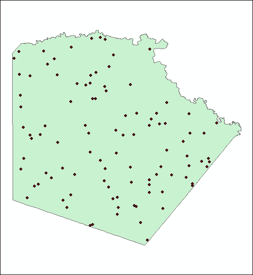

## 它是如何工作的...

工具插件与按钮插件非常相似，区别在于工具插件在触发功能之前需要与地图进行某种形式的交互。与地图的交互可以包括多种操作，例如点击地图、绘制多边形或矩形，或执行各种鼠标或键盘事件。Python 代码编写用于响应这些事件中的一个或多个。在本菜谱中，你学习了如何编写响应 `onRectangle()` 事件的代码。你还在插件的构造函数中设置了各种属性，包括 `cursor` 和 `shape`，这些将在地图上绘制。

## 还有更多...

你可以创建许多额外的插件。`ComboBox` 插件提供了一个下拉列表，用户可以从中选择值，或者也可以在可编辑字段中输入新值。与其他插件一样，你首先需要使用 Python 插件向导创建一个新项目，添加一个新的工具栏，然后创建一个组合框添加到工具栏中。

工具调色板提供了一种将相关工具分组的方法。它需要添加到一个现有的工具栏中。默认情况下，工具将以网格状模式添加到调色板中。

`Menu` 插件充当按钮和其他菜单的容器。除了在 ArcGIS for Desktop 插件管理器中显示外，菜单还会在 ArcGIS for Desktop 的 **自定义** 对话框中显示。

应用程序扩展用于向 ArcGIS for Desktop 添加特定的一组相关功能。一些例子包括空间分析器、3D 分析器和商业分析师。通常，应用程序扩展负责监听事件并处理它们。例如，你可以创建一个应用程序扩展，每次用户将图层添加到地图时都会保存地图文档文件。应用程序扩展还协调组件之间的活动。
