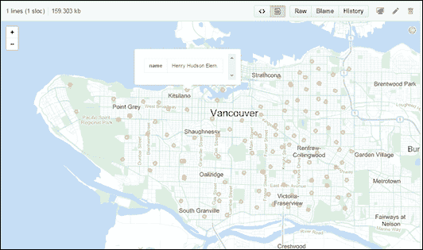
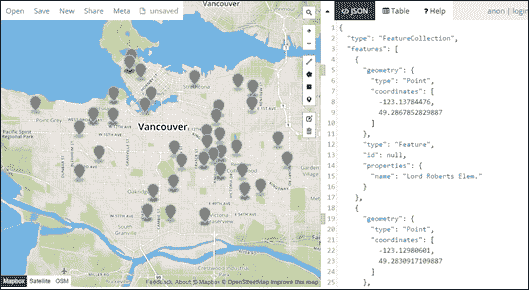
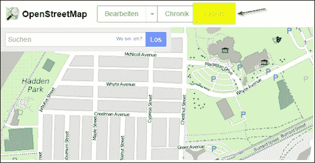
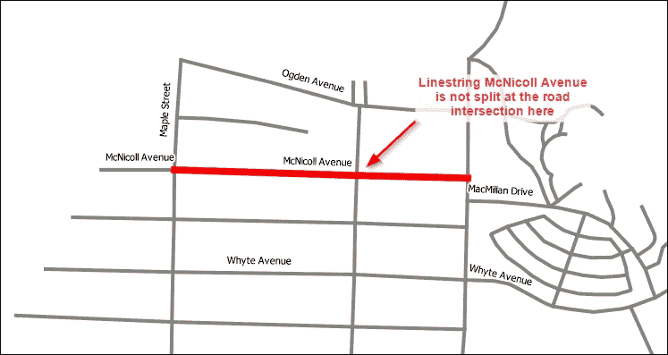
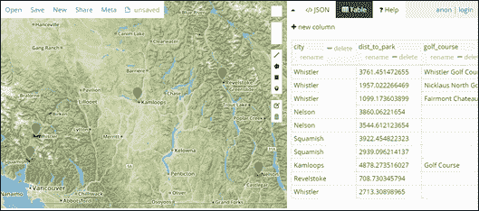

# 第四章. 使用 PostGIS

在本章中，我们将涵盖以下主题：

+   执行 PostGIS ST_Buffer 分析查询并将其导出为 GeoJSON

+   查找点是否在多边形内部

+   使用 ST_Node 在交点处分割 LineStrings

+   检查 LineStrings 的有效性

+   执行空间连接并将点属性分配给多边形

+   使用 ST_Distance() 进行复杂的空间分析查询

# 简介

空间数据库不过是一个可以存储几何数据并在其最简单形式下执行空间查询的标准数据库。我们将探讨如何从我们的 Python 代码中运行空间分析查询、处理连接等，以及更多内容。你回答诸如“我想定位所有距离高尔夫球场 2 公里以内且距离公园不到 5 公里的酒店”这样的空间问题的能力，正是 PostGIS 发挥作用的地方。这种将请求链入模型的过程正是空间分析力量的体现。

我们将使用最受欢迎和功能强大的开源空间数据库 **PostgreSQL**，以及 **PostGIS** 扩展，包括超过 150 个函数。基本上，我们将获得一个功能齐全的 GIS，具有复杂的空间分析功能，适用于矢量和栅格数据，以及多种移动空间数据的方法。

如果你需要更多关于 PostGIS 的信息以及一本好书，请查看由 *Paolo Corti* 编著的 *PostGIS Cookbook*（可在 [`www.packtpub.com/big-data-and-business-intelligence/postgis-cookbook`](https://www.packtpub.com/big-data-and-business-intelligence/postgis-cookbook) 购买）。这本书探讨了 PostGIS 的更广泛用途，并包括一个关于使用 Python 进行 PostGIS 编程的完整章节。

# 执行 PostGIS ST_Buffer 分析查询并将其导出为 GeoJSON

让我们从执行我们的第一个空间分析查询开始，该查询针对我们已运行的 PostgreSQL 和 PostGIS 数据库。目标是生成所有学校的 100 米缓冲区，并将新的缓冲多边形导出为 GeoJSON，包括学校的名称。最终结果将显示在这张地图上，可在 GitHub 上找到（[`github.com/mdiener21/python-geospatial-analysis-cookbook/blob/master/ch04/geodata/out_buff_100m.geojson`](https://github.com/mdiener21/python-geospatial-analysis-cookbook/blob/master/ch04/geodata/out_buff_100m.geojson)）。

### 小贴士

使用 GitHub 快速可视化 GeoJSON 数据是一种快速简单的方法，无需编写任何代码即可创建网络地图。请注意，如果你使用的是公共免费的 GitHub 账户，那么数据将免费供其他人下载。私有 GitHub 账户意味着如果数据隐私或敏感性是一个问题，那么 GeoJSON 数据也将保持私有。



## 准备工作

要开始，我们将使用 PostGIS 数据库中的数据。我们将从访问我们上传到 PostGIS 的 `schools` 表开始，这是在 第三章，*将空间数据从一个格式转换为另一个格式* 中的 ogr2ogr 脚本中完成的批量导入文件夹。

连接到 PostgreSQL 和 PostGIS 数据库是通过 **Psycopg** 实现的，这是一个 Python DB API ([`initd.org/psycopg/`](http://initd.org/psycopg/))。我们已经在 第一章，*设置你的地理空间 Python 环境* 中安装了它，包括 PostgreSQL、Django 和 PostGIS。

对于所有后续的食谱，请进入你的虚拟环境 `pygeoan_cb`，这样你就可以使用此命令访问你的库：

```py
workon pygeoan_cb

```

## 如何做到这一点...

1.  长路并不那么长，所以请跟随：

    ```py
    #!/usr/bin/env python
    # -*- coding: utf-8 -*-

    import psycopg2
    import json
    from geojson import loads, Feature, FeatureCollection

    # NOTE change the password and username
    # Database Connection Info
    db_host = "localhost"
    db_user = "pluto"
    db_passwd = "stars"
    db_database = "py_geoan_cb"
    db_port = "5432"

    # connect to DB
    conn = psycopg2.connect(host=db_host, user=db_user,
            port=db_port, password=db_passwd, database=db_database)

    # create a cursor
    cur = conn.cursor()

    # the PostGIS buffer query
    buffer_query = """SELECT ST_AsGeoJSON(ST_Transform(
            ST_Buffer(wkb_geometry, 100,'quad_segs=8'),4326)) 
            AS geom, name
            FROM geodata.schools"""

    # execute the query
    cur.execute(buffer_query)

    # return all the rows, we expect more than one
    dbRows = cur.fetchall()

    # an empty list to hold each feature of our feature collection
    new_geom_collection = []

    # loop through each row in result query set and add to my feature collection
    # assign name field to the GeoJSON properties
    for each_poly in dbRows:
        geom = each_poly[0]
        name = each_poly[1]
        geoj_geom = loads(geom)
        myfeat = Feature(geometry=geoj_geom, properties={'name': name})
        new_geom_collection.append(myfeat)

    # use the geojson module to create the final Feature Collection of features created from for loop above
    my_geojson = FeatureCollection(new_geom_collection)

    # define the output folder and GeoJSon file name
    output_geojson_buf = "../geodata/out_buff_100m.geojson"

    # save geojson to a file in our geodata folder
    def write_geojson():
        fo = open(output_geojson_buf, "w")
        fo.write(json.dumps(my_geojson))
        fo.close()

    # run the write function to actually create the GeoJSON file
    write_geojson()

    # close cursor
    cur.close()

    # close connection
    conn.close()
    ```

## 它是如何工作的...

数据库连接正在使用 `pyscopg2` 模块，因此我们在开始时与 `geojson` 和标准的 `json` 模块一起导入库，以处理我们的 GeoJSON 导出。

我们创建连接后立即使用我们的 SQL 缓冲查询字符串。该查询使用了三个 PostGIS 函数。从内到外逐步工作，你会看到 `ST_Buffer` 函数接收学校点的几何形状，然后是 100 米的缓冲距离以及我们想要生成的圆段数量。然后 `ST_Transform` 函数将新创建的缓冲几何形状转换成 WGS84 坐标系统（EPSG: 4326），这样我们就可以在 GitHub 上显示它，GitHub 只显示 WGS84 和投影的 GeoJSON。最后，我们将使用 `ST_asGeoJSON` 函数将我们的几何形状导出为 GeoJSON 几何形状。

### 注意

PostGIS 不导出完整的 GeoJSON 语法，只以 GeoJSON 几何形状的形式导出几何形状。这就是为什么我们需要使用 Python `geojson` 模块来完成我们的 GeoJSON 的原因。

所有这些都意味着我们不仅对查询进行操作，而且我们还一次性指定了输出格式和坐标系。

接下来，我们将执行查询并使用 `cur.fetchall()` 获取所有返回的对象，这样我们就可以稍后遍历每个返回的缓冲多边形。我们的 `new_geom_collection` 列表将存储每个新的几何形状和特征名称。接下来，在 `for` 循环函数中，我们将使用 `geojson` 模块函数 `loads(geom)` 将我们的几何形状输入到一个 GeoJSON 几何对象中。这随后由 `Feature()` 函数创建我们的 GeoJSON 特征。然后它被用作 `FeatureCollection` 函数的输入，最终创建完成的 GeoJSON。

最后，我们需要将这个新的 GeoJSON 文件写入磁盘并保存。因此，我们将使用新的文件对象，在那里我们使用标准的 Python `json.dumps` 模块导出我们的 `FeatureCollection`。

我们将进行一些清理工作，以关闭游标对象和连接。Bingo！我们现在完成了，可以可视化我们的最终结果。

# 查找点是否在多边形内

多边形内点分析查询是一个非常常见的空间操作。此查询可以识别位于区域内的对象，例如多边形。在这个例子中，感兴趣的区域是围绕自行车道的 100 米缓冲多边形，我们希望定位所有位于这个多边形内的学校。

## 准备工作

在上一节中，我们使用了`schools`表来创建缓冲区。这次，我们将使用这个表作为我们的输入点表。我们在第三章中导入的`bikeways`表，即*将空间数据从一种格式转换为另一种格式*，将用作我们的输入线以生成一个新的 100 米缓冲多边形。但是，请确保您在本地 PostgreSQL 数据库中有这两个数据集。

## 如何做...

1.  现在，让我们深入研究一些代码，以找到位于自行车道 100 米范围内的学校，以便找到多边形内的点：

    ```py
    #!/usr/bin/env python
    # -*- coding: utf-8 -*-

    import json
    import psycopg2
    from geojson import loads, Feature, FeatureCollection

    # Database Connection Info
    db_host = "localhost"
    db_user = "pluto"
    db_passwd = "stars"
    db_database = "py_geoan_cb"
    db_port = "5432"

    # connect to DB
    conn = psycopg2.connect(host=db_host, user=db_user, port=db_port, password=db_passwd, database=db_database)

    # create a cursor
    cur = conn.cursor()

    # uncomment if needed
    # cur.execute("Drop table if exists geodata.bikepath_100m_buff;")

    # query to create a new polygon 100m around the bikepath
    new_bike_buff_100m = """ CREATE TABLE geodata.bikepath_100m_buff 
           AS SELECT name, 
           ST_Buffer(wkb_geometry, 100) AS geom
           FROM geodata.bikeways; """

    # run the query
    cur.execute(new_bike_buff_100m)

    # commit query to database
    conn.commit()

    # query to select schools inside the polygon and output geojson
    is_inside_query = """ SELECT s.name AS name, 
        ST_AsGeoJSON(ST_Transform(s.wkb_geometry,4326)) AS geom
        FROM geodata.schools AS s,
        geodata.bikepath_100m_buff AS bp
            WHERE ST_WITHIN(s.wkb_geometry, bp.geom); """

    # execute the query
    cur.execute(is_inside_query)

    # return all the rows, we expect more than one
    db_rows = cur.fetchall()

    # an empty list to hold each feature of our feature collection
    new_geom_collection = []

    def export2geojson(query_result):
        """
        loop through each row in result query set and add to my feature collection
        assign name field to the GeoJSON properties
        :param query_result: pg query set of geometries
        :return: new geojson file
        """

        for row in db_rows:
            name = row[0]
            geom = row[1]
            geoj_geom = loads(geom)
            myfeat = Feature(geometry=geoj_geom, 
                        properties={'name': name})
            new_geom_collection.append(myfeat)

        # use the geojson module to create the final Feature
        # Collection of features created from for loop above
        my_geojson = FeatureCollection(new_geom_collection)
        # define the output folder and GeoJSon file name
        output_geojson_buf = "../geodata/out_schools_in_100m.geojson"

        # save geojson to a file in our geodata folder
        def write_geojson():
            fo = open(output_geojson_buf, "w")
            fo.write(json.dumps(my_geojson))
            fo.close()

        # run the write function to actually create the GeoJSON file
        write_geojson()

    export2geojson(db_rows)
    ```

您现在可以在 Mapbox 创建的一个很棒的网站上查看您新创建的 GeoJSON 文件，网址是[`www.geojson.io`](http://www.geojson.io)。只需将您的 GeoJSON 文件从 Windows 的 Windows Explorer 或 Ubuntu 的 Nautilus 拖放到[`www.geojson.io`](http://www.geojson.io)网页上，Bob's your uncle，您应该能看到大约 50 所学校，这些学校位于温哥华的自行车道 100 米范围内。



## 它是如何工作的...

我们将重用代码来建立数据库连接，所以这一点现在应该对您来说很熟悉。`new_bike_buff_100m`查询字符串包含我们生成围绕所有自行车道的 100 米缓冲多边形的查询。我们需要执行此查询并将其提交到数据库，以便我们可以访问这个新的多边形集作为我们实际查询的输入，该查询将找到位于这个新缓冲多边形内的学校（点）。

`is_inside_query`字符串实际上为我们做了艰苦的工作，通过从`name`字段选择值和从`geom`字段选择几何形状。几何形状被封装在另外两个 PostGIS 函数中，以便我们可以将数据作为 GeoJSON 在 WGS 84 坐标系中导出。这将是我们生成最终新的 GeoJSON 文件所需的输入几何形状。

`WHERE`子句使用`ST_Within`函数来查看一个点是否在多边形内，如果点在缓冲多边形内，则返回`True`。

现在，我们已经创建了一个新的函数，它只是封装了之前在*执行 PostGIS ST_Buffer 分析查询并将其导出为 GeoJSON*的配方中使用的导出 GeoJSON 代码。这个新的`export2geojson`函数只需一个 PostGIS 查询的输入，并输出一个 GeoJSON 文件。要设置新输出文件的名字和位置，只需在函数内替换路径和名称。

最后，我们只需要调用新的函数，使用包含我们学校列表的`db_rows`变量来导出 GeoJSON 文件，这些学校位于 100 米缓冲多边形内。

## 还有更多...

这个示例，找到所有位于自行车道 100 米范围内的学校，可以使用另一个名为`ST_Dwithin`的 PostGIS 函数来完成。

选择所有位于自行车道 100 米范围内的学校的 SQL 语句看起来像这样：

```py
SELECT *  FROM geodata.bikeways as b, geodata.schools as s where ST_DWithin(b.wkb_geometry, s.wkb_geometry, 100)

```

# 使用 ST_Node 在交叉口分割 LineStrings

处理道路数据通常是一件棘手的事情，因为数据的有效性和数据结构起着非常重要的作用。如果你想对你的道路数据做些有用的事情，比如构建一个路由网络，你首先需要准备数据。第一个任务通常是分割你的线条，这意味着在线条交叉的交叉口处分割所有线条，创建一个基础网络道路数据集。

### 注意

注意，这个菜谱将分割所有交叉口上的所有线条，无论是否例如，有一个道路-桥梁立交桥，不应该创建交叉口。

## 准备工作

在我们详细介绍如何做之前，我们将使用 OpenStreetMap（**OSM**）道路数据的一个小部分作为我们的示例。OSM 数据位于你的`/ch04/geodata/`文件夹中，名为`vancouver-osm-data.osm`。这些数据是从[www.openstreetmap.org](http://www.openstreetmap.org)主页上使用位于页面顶部的**导出**按钮简单下载的：



OSM 数据不仅包含道路，还包含我选择的范围内所有其他点和多边形。感兴趣的区域再次是温哥华的 Burrard Street 桥。

我们需要提取所有道路并将它们导入我们的 PostGIS 表中。这次，让我们尝试直接从控制台使用`ogr2ogr`命令行上传 OSM 街道到我们的 PostGIS 数据库：

```py
ogr2ogr -lco SCHEMA=geodata -nlt LINESTRING -f "PostgreSQL" PG:"host=localhost port=5432 user=pluto dbname=py_geoan_cb password=stars" ../geodata/vancouver-osm-data.osm lines -t_srs EPSG:3857

```

这假设你的 OSM 数据位于`/ch04/geodata`文件夹中，并且命令是在你位于`/ch04/code`文件夹时运行的。

现在这个非常长的东西意味着我们将连接到我们的 PostGIS 数据库作为输出，并将`vancouver-osm-data.osm`文件作为输入。创建一个名为`lines`的新表，并将输入的 OSM 投影转换为 EPSG:3857。所有从 OSM 导出的数据都在 EPSG:4326 中。当然，你可以保持在这个系统中，只需简单地删除命令行选项中的`-t_srs EPSG:3857`部分。

现在我们已经准备好在交叉口进行分割操作了。如果你愿意，可以打开数据在**QGIS**（**量子 GIS**）中。在 QGIS 中，你会看到道路数据并没有在所有交叉口处分割，就像这个截图所示：



这里，你可以看到**McNicoll Avenue**是一条单独的 LineString，横跨**Cypress Street**。完成我们的操作后，我们会看到**McNicoll Avenue**将在这个交叉口处被分割。

## 如何操作...

1.  由于所有的工作都在一个 SQL 查询中完成，运行 Python 代码相当直接。所以请继续：

    ```py
    #!/usr/bin/env python
    # -*- coding: utf-8 -*-

    import psycopg2
    import json
    from geojson import loads, Feature, FeatureCollection

    # Database Connection Info
    db_host = "localhost"
    db_user = "pluto"
    db_passwd = "stars"
    db_database = "py_geoan_cb"
    db_port = "5432"

    # connect to DB
    conn = psycopg2.connect(host=db_host, user=db_user, 
        port=db_port, password=db_passwd, database=db_database)

    # create a cursor
    cur = conn.cursor()

    # drop table if exists
    # cur.execute("DROP TABLE IF EXISTS geodata.split_roads;")

    # split lines at intersections query
    split_lines_query = """
     CREATE TABLE geodata.split_roads
        (ST_Node(ST_Collect(wkb_geometry)))).geom AS geom
        FROM geodata.lines;"""

    cur.execute(split_lines_query)
    conn.commit()

    cur.execute("ALTER TABLE geodata.split_roads ADD COLUMN id serial;")
    cur.execute("ALTER TABLE geodata.split_roads ADD CONSTRAINT split_roads_pkey PRIMARY KEY (id);")

    # close cursor
    cur.close()

    # close connection
    conn.close()
    ```

    

好吧，这相当简单，我们现在可以看到 **McNicoll Avenue** 在与 **Cypress Street** 的交点处被分割。

## 它是如何工作的...

从代码中我们可以看到，数据库连接保持不变，唯一的新事物就是创建交点的查询本身。在这里，使用了三个独立的 PostGIS 函数来获取我们的结果：

+   第一个函数，在查询中从内到外工作时，从 `ST_Collect(wkb_geometry)` 开始。这仅仅是将我们的原始几何形状列作为输入。这里只是简单地将几何形状组合在一起。

+   接下来是使用 `ST_Node(geometry)` 实际分割线段，输入新的几何形状集合并进行节点操作，这将在交点处分割我们的 LineStrings。

+   最后，我们将使用 `ST_Dump()` 作为返回集合的函数。这意味着它基本上将所有的 LineString 几何形状集合爆炸成单个 LineStrings。查询末尾的 `.geom` 指定我们只想导出几何形状，而不是分割几何形状返回的数组数字。

现在，我们将执行并提交查询到数据库。提交是一个重要的部分，因为否则查询将会运行，但它实际上不会创建我们想要生成的新的表。最后但同样重要的是，我们可以关闭游标和连接。就是这样；我们现在有了分割的 LineStrings。

### 注意

注意，新的分割 LineStrings 不包含街道名称和其他属性。要导出名称，我们需要在数据上执行连接操作。这样的查询，包括在新建的 LineStrings 上的属性，可能看起来像这样：

```py
CREATE TABLE geodata.split_roads_attributes AS SELECT
 r.geom,
 li.name,
 li.highway
FROM
 geodata.lines li,
 geodata.split_roads r
WHERE
 ST_CoveredBy(r.geom, li.wkb_geometry)

```

# 检查 LineStrings 的有效性

处理道路数据有许多需要注意的区域，其中之一就是无效的几何形状。我们的源数据是 OSM，因此是由一群未经 GIS 专业人员培训的用户收集的，这导致了错误。为了执行空间查询，数据必须是有效的，否则我们将得到有错误或根本没有结果的结果。

PostGIS 包含了 `ST_isValid()` 函数，该函数根据几何形状是否有效返回 True/False。还有一个 `ST_isValidReason()` 函数，它会输出几何形状错误的文本描述。最后，`ST_isValidDetail()` 函数将返回几何形状是否有效，以及几何形状错误的理由和位置。这三个函数都完成类似的任务，选择哪一个取决于你想要完成什么。

## 如何操作...

1.  现在，为了确定 `geodata.lines` 是否有效，我们将运行另一个查询，如果存在无效的几何形状，它将列出所有这些几何形状：

    ```py
    #!/usr/bin/env python
    # -*- coding: utf-8 -*-

    import psycopg2

    # Database Connection Info
    db_host = "localhost"
    db_user = "pluto"
    db_passwd = "stars"
    db_database = "py_geoan_cb"
    db_port = "5432"

    # connect to DB
    conn = psycopg2.connect(host=db_host, user=db_user, 
        port=db_port, password=db_passwd, database=db_database)

    # create a cursor
    cur = conn.cursor()

    # the PostGIS buffer query
    valid_query = """SELECT
                       ogc_fid, 
                       ST_IsValidDetail(wkb_geometry)
                    FROM 
                       geodata.lines
                    WHERE NOT
                       ST_IsValid(wkb_geometry);
                    """

    # execute the query
    cur.execute(valid_query)

    # return all the rows, we expect more than one
    validity_results = cur.fetchall()

    print validity_results

    # close cursor
    cur.close()

    # close connection
    conn.close();
    ```

此查询应返回一个空 Python 列表，这意味着我们没有无效的几何形状。如果您的列表中有对象，那么您就会知道您需要做一些手动工作来纠正这些几何形状。您最好的选择是启动 QGIS 并使用数字化工具开始清理。

# 执行空间连接并将点属性分配给多边形

现在，我们将回到一些更多的高尔夫动作，我们想要执行一个空间属性连接。我们面临的情况是有一些多边形，在这种情况下，这些是以高尔夫球道的形式出现的，没有任何洞号。我们的洞号存储在一个点数据集中，该数据集位于每个洞的球道内。我们希望根据多边形内的位置为每个球道分配适当的洞号。

位于加利福尼亚州莫尼卡市的佩布尔海滩高尔夫球场的 OSM 数据是我们的源数据。这个高尔夫球场是 PGA 巡回赛上的顶级高尔夫球场之一，在 OSM 中得到了很好的映射。

### 小贴士

如果您对从 OSM 获取高尔夫球场数据感兴趣，建议您使用优秀的 Overpass API，网址为[`overpass-turbo.eu/`](http://overpass-turbo.eu/)。此网站允许您将 OSM 数据导出为 GeoJSON 或 KML 等格式。

要下载所有特定于高尔夫的 OSM 数据，您需要纠正标签。为此，只需将以下 Overpass API 查询复制并粘贴到左侧的查询窗口中，然后点击`下载`：

```py
/*

This query looks for nodes, ways, and relations 
using the given key/value combination.
Choose your region and hit the Run button above!
*/
[out:json][timeout:25];
// gather results
(
  // query part for: "leisure=golf_course"
node"leisure"="golf_course";
way"leisure"="golf_course";
relation"leisure"="golf_course";

node"golf"="pin";
way"golf"="green";
way"golf"="fairway";
way"golf"="tee";
way"golf"="fairway";
way"golf"="bunker";
way"golf"="rough";
way"golf"="water_hazard";
way"golf"="lateral_water_hazard";
way"golf"="out_of_bounds";
way"golf"="clubhouse";
way"golf"="ground_under_repair";

);
// print results
out body;
>;
out skel qt;
```

## 准备工作

将我们的数据导入 PostGIS 将是执行空间查询的第一步。这次，我们将使用`shp2pgsql`工具将我们的数据导入，以改变一下方式，因为将数据导入 PostGIS 的方法有很多。`shp2pgsql`工具无疑是导入 Shapefiles 到 PostGIS 最经过测试和最常用的方法。让我们开始，再次执行此导入操作，直接从命令行运行此工具。

对于 Windows 用户，这应该可以工作，但请检查路径是否正确，或者`shp2pgsql.exe`是否已添加到您的系统路径变量中。这样做可以节省输入完整路径来执行操作。

### 注意

我假设您在`/ch04/code`文件夹中运行以下命令：

```py
shp2pgsql -s 4326 ..\geodata\shp\pebble-beach-ply-greens.shp geodata.pebble_beach_greens | psql -h localhost -d py_geoan_cb -p 5432 -U pluto

```

在 Linux 机器上，您的命令基本上与 Windows 相同，没有长路径，前提是您在第一章 *设置您的地理空间 Python 环境* 中安装 PostGIS 时已设置好系统链接。

接下来，我们需要导入带有属性的点，让我们按照以下步骤进行：

```py
shp2pgsql -s 4326 ..\geodata\shp\pebble-beach-pts-hole-num-green.shp geodata.pebble_bea-ch_hole_num | psql -h localhost -d py_geoan_cb -p 5432 -U postgres

```

那就是了！我们现在在我们的 PostGIS 模式`geodata`设置中有了点和多边形，这为我们的空间连接做好了准备。

## 如何操作...

1.  核心工作再次在我们的 PostGIS 查询字符串内部完成，将属性分配给多边形，所以请跟随：

    ```py
    #!/usr/bin/env python
    # -*- coding: utf-8 -*-

    import psycopg2

    # Database Connection Info
    db_host = "localhost"
    db_user = "pluto"
    db_passwd = "stars"
    db_database = "py_geoan_cb"
    db_port = "5432"

    # connect to DB
    conn = psycopg2.connect(host=db_host, user=db_user, port=db_port, password=db_passwd, database=db_database)

    # create a cursor
    cur = conn.cursor()

    # assign polygon attributes from points
    spatial_join = """  UPDATE geodata.pebble_beach_greens AS g 
                            SET 
                               name = h.name
                            FROM 
                               geodata.pebble_beach_hole_num AS h
                            WHERE 
                               ST_Contains(g.geom, h.geom);
                         """
    cur.execute(spatial_join)
    conn.commit()

    # close cursor
    cur.close()

    # close connection
    conn.close()
    ```

## 它是如何工作的...

查询非常直接；我们将使用`UPDATE`标准 SQL 命令来更新我们表`geodata.pebble_beach_greens`中名称字段中的值，这些值位于`pebble_beach_hole_num`表中。

我们接着设置`geodata.pebble_beach_hole_num`表中的名称值，其中字段名称也存在并包含我们需要的属性值。

我们的`WHERE`子句使用 PostGIS 查询`ST_Contains`，如果点位于我们的绿色区域内部，则返回`True`，如果是这样，它将更新我们的值。

这很简单，展示了空间关系强大的功能。

# 使用 ST_Distance()执行复杂的空间分析查询

现在，让我们检查一个更复杂的 PostGIS 查询，以激发我们的空间分析热情。我们想要定位所有位于国家公园或保护区内部或 5 公里范围内的高尔夫球场。此外，高尔夫球场必须在 2 公里范围内有城市。城市数据来自 OSM 中的标签，其中*标签 place = city*。

此查询的国家公园和保护区属于加拿大政府。我们的高尔夫球场和城市数据集来源于位于不列颠哥伦比亚省和艾伯塔省的 OSM。

## 准备工作

我们需要加拿大所有国家公园和保护区的数据，所以请确保它们位于`/ch04/geodata/`文件夹中。

原始数据位于[`ftp2.cits.rncan.gc.ca/pub/geott/frameworkdata/protected_areas/1M_PROTECTED_AREAS.shp.zip`](http://ftp2.cits.rncan.gc.ca/pub/geott/frameworkdata/protected_areas/1M_PROTECTED_AREAS.shp.zip)，如果您还没有从 GitHub 下载`/geodata`文件夹。

需要的其他数据集包括可以从 OSM 获取的城市和高尔夫球场。这两个文件是位于/ch04/geodata/文件夹中的 GeoJSON 文件，分别命名为`osm-golf-courses-bc-alberta.geojson`和`osm-place-city-bc-alberta.geojson`。

我们现在将导入下载的数据到我们的数据库中：

### 注意

确保你在运行以下命令时当前位于`/ch04/code`文件夹中；否则，根据需要调整路径。

1.  从不列颠哥伦比亚省和艾伯塔省的 OSM 高尔夫球场开始，运行这个命令行调用 ogr2ogr。Windows 用户需要注意，他们可以将反斜杠切换为正斜杠，或者包含完整的路径到 GeoJSON：

    ```py
    ogr2ogr -f PostgreSQL PG:"host=localhost user=postgres port=5432 dbname=py_geoan_cb password=air" ../geodata/geojson/osm-golf-courses-bc-alberta.geojson -nln geodata.golf_courses_bc_alberta

    ```

1.  现在，我们将再次运行相同的命令来导入城市：

    ```py
    ogr2ogr -f PostgreSQL PG:"host=localhost user=postgres port=5432 dbname=py_geoan_cb password=air" ../geodata/geojson/osm-place-city-bc-alberta.geojson -nln geodata.cities_bc_alberta

    ```

1.  最后但同样重要的是，我们需要使用`shp2pgsql`命令行导入加拿大的保护区和国家公园。在此，请注意，我们需要使用`-W latin1`选项来指定所需的编码。您获得的数据是整个加拿大，而不仅仅是 BC 和艾伯塔省：

    ```py
    shp2pgsql -s 4326 -W latin1 ../geodata/shp/protarea.shp geodata.parks_pa_canada | psql -h localhost -d py_geoan_cb -p 5432 -U pluto

    ```

现在我们数据库中有所有三个表，我们可以执行我们的分析脚本。

## 如何做到这一点...

1.  让我们看看代码的样子：

    ```py
    #!/usr/bin/env python
    # -*- coding: utf-8 -*-

    import psycopg2
    import json
    import pprint
    from geojson import loads, Feature, FeatureCollection

    # Database Connection Info
    db_host = "localhost"
    db_user = "pluto"
    db_passwd = "stars"
    db_database = "py_geoan_cb"
    db_port = "5432"

    # connect to DB
    conn = psycopg2.connect(host=db_host, user=db_user, port=db_port, password=db_passwd, database=db_database)

    # create a cursor
    cur = conn.cursor()

    complex_query = """
        SELECT
          ST_AsGeoJSON(st_centroid(g.wkb_geometry)) as geom, c.name AS city, g.name AS golfclub, p.name_en AS park,
        ST_Distance(geography(c.wkb_geometry), geography(g.wkb_geometry)) AS distance,
        ST_Distance(geography(p.geom), geography(g.wkb_geometry)) AS distance
          FROM 
          geodata.parks_pa_canada AS p,
          geodata.cities_bc_alberta AS c
          JOIN 
          geodata.golf_courses_bc_alberta AS g
          ON
            ST_DWithin(geography(c.wkb_geometry), geography(g.wkb_geometry),4000)
         WHERE
            ST_DWithin(geography(p.geom), geography(g.wkb_geometry),5000)
                    """
    # WHERE c.population is not null and e.name is not null
    # execute the query
    cur.execute(complex_query)

    # return all the rows, we expect more than one
    validity_results = cur.fetchall()

    # an empty list to hold each feature of our feature collection
    new_geom_collection = []

    # loop through each row in result query set and add to my feature collection
    # assign name field to the GeoJSON properties
    for each_result in validity_results:
        geom = each_result[0]
        city_name = each_result[1]
        course_name = each_result[2]
        park_name = each_result[3]
        dist_city_to_golf = each_result[4]
        dist_park_to_golf = each_result[5]
        geoj_geom = loads(geom)
        myfeat = Feature(geometry=geoj_geom, properties={'city': city_name, 'golf_course': course_name,
                              'park_name': park_name, 'dist_to city': dist_city_to_golf,
                              'dist_to_park': dist_park_to_golf})
        new_geom_collection.append(myfeat)  # use the geojson module to create the final Feature Collection of features created from for loop above

    my_geojson = FeatureCollection(new_geom_collection)

    pprint.pprint(my_geojson)

    # define the output folder and GeoJSon file name
    output_geojson_buf = "../geodata/golfcourses_analysis.geojson"

    # save geojson to a file in our geodata folder
    def write_geojson():
        fo = open(output_geojson_buf, "w")
        fo.write(json.dumps(my_geojson))
        fo.close()

    # run the write function to actually create the GeoJSON file
    write_geojson()

    # close cursor
    cur.close()

    # close connection
    conn.close()
    ```

## 它是如何工作的...

让我们一步一步地通过 SQL 查询：

+   我们将从定义查询需要返回的列以及从哪些表中获取开始。在这里，我们将定义我们想要高尔夫球场的几何形状作为一个点、城市名称、高尔夫球场名称、公园名称、城市与高尔夫球场之间的距离，以及最终，公园与高尔夫球场之间的距离。我们返回的几何形状是高尔夫球场作为一个点，因此使用`ST_Centroid`，它返回高尔夫球场的中心点，然后将其作为 GeoJSON 几何形状输出。

+   `FROM`子句设置了我们的公园和城市表，并使用`SQL AS`为它们分配一个别名。然后我们根据距离使用`ST_DWithin()`来`JOIN`高尔夫球场，以便我们可以定位城市与高尔夫球场之间小于 4 公里的距离。

+   `WHERE`子句中的`ST_DWithin()`强制执行最后一个要求，即公园与高尔夫球场之间的距离不能超过 5 公里。

SQL 完成了所有繁重的工作，以返回正确的空间分析结果。下一步是使用 Python 将我们的结果输出为有效的 GeoJSON，以便我们可以查看我们新发现的高尔夫球场。每个属性属性随后通过其在查询中的数组位置被识别，并为 GeoJSON 输出分配一个名称。最后，我们将输出一个`.geojson`文件，您可以直接在 GitHub 上可视化它，链接为[`github.com/mdiener21/python-geospatial-analysis-cookbook/blob/master/ch04/geodata/golfcourses_analysis.geojson`](https://github.com/mdiener21/python-geospatial-analysis-cookbook/blob/master/ch04/geodata/golfcourses_analysis.geojson)。


