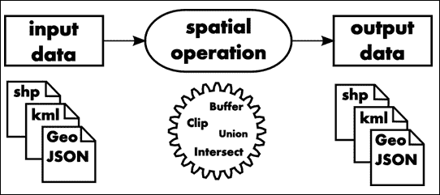
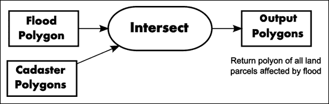
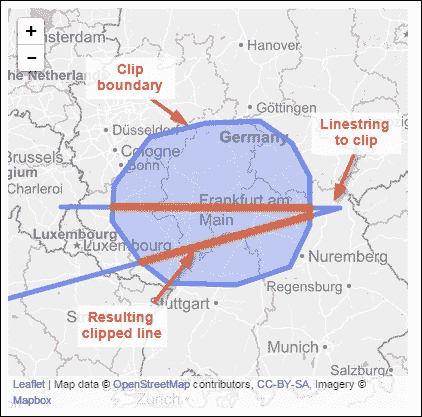
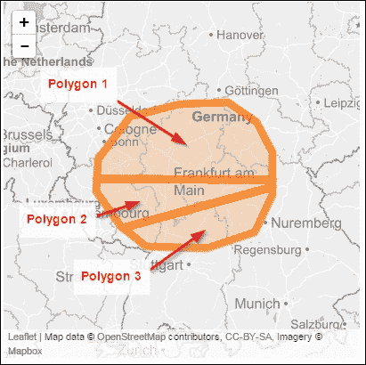
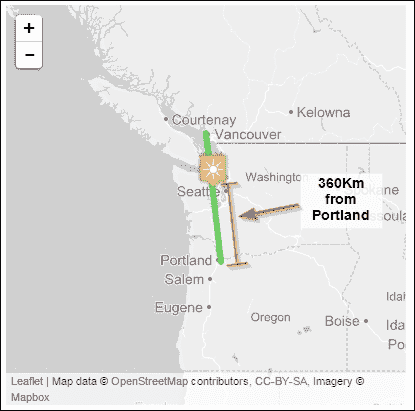
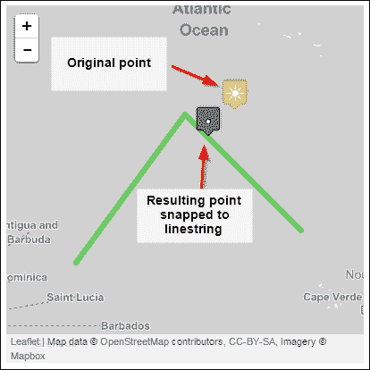
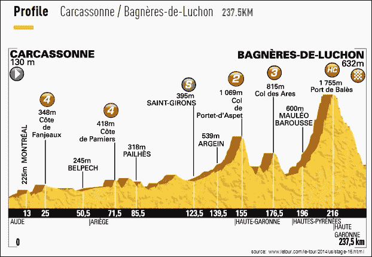
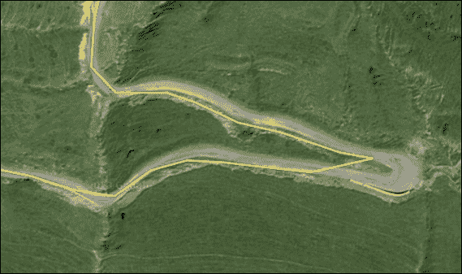

# 第五章. 向量分析

在本章中，我们将涵盖以下主题：

+   将线字符串裁剪到感兴趣的区域

+   用线分割多边形

+   使用线性参照找到线上的点位置

+   将点捕捉到最近的线上

+   计算三维地面距离和总海拔升高

# 介绍

向量数据分析被应用于许多应用领域，从测量点 A 到点 B 的距离一直到复杂的路由算法。最早的 GIS 系统是基于向量数据和向量分析构建的，后来扩展到栅格域。在本章中，我们将从简单的向量操作开始，然后逐步深入到一个更复杂的模型，将各种向量方法串联起来，以提供回答我们空间问题的新的数据。

这种数据分析过程被分解为几个步骤，从*输入*数据集开始，对数据进行空间操作，如缓冲区分析，最后，我们将有一些*输出*，以新的数据集的形式。以下图表显示了分析流程在 simplest 模型形式中的流程：



将简单问题转换为空间操作方法和模型需要经验，并且不是一项简单的任务。例如，你可能会遇到一个简单的任务，比如，“识别并定位受洪水影响的住宅地块数量。”这会转化为以下内容：

+   首先，一个以洪水多边形形式存在的输入数据集，它定义了受影响洪水区域

+   其次，输入数据集表示地籍多边形

+   我们的空间操作是一个交集函数

+   所有这些都会导致一个新的多边形数据集

这将导致一个可能看起来像这样的空间模型：



为了解决更复杂的问题，空间建模简单地将更多的输入和更多的操作链在一起，这些操作输出新的数据，并输入到其他新的操作中。这最终导致一组或几组数据。

# 将线字符串裁剪到感兴趣的区域

一个涉及空间数据的工程项目通常在指定的边界区域内进行地理限制，即所谓的*项目区域*。输入数据可能来自多个来源，通常超出项目区域。移除这些多余数据有时对于加快空间处理速度至关重要，同时，它也减少了数据量。数据量的减少也可能导致二级加速，例如，减少数据传输或复制的耗时。

在这个菜谱中，我们将使用表示圆形 Shapefile 的边界多边形，然后移除所有超出这个圆的额外 LineStrings。

这个裁剪过程将移除所有位于裁剪区域之外的所有线条——即，我们的感兴趣的项目区域。

### 注意

一个名为`clip`的标准函数执行空间交集操作。这与正常的交集函数略有不同。裁剪将不会或不应保留附加到裁剪区域上的属性。裁剪涉及两个输入数据集；第一个定义了我们想要裁剪数据到的边界，第二个定义了将被裁剪的数据。这两个集合都包含属性，而裁剪边界的这些属性通常不包括在裁剪操作中。

新的裁剪数据将只包含原始输入数据集的属性，不包括裁剪多边形的所有属性。

`intersection`函数将找到重叠的几何形状，并仅输出圆内的线条。为了更好地演示这个概念，以下图形表示了我们将要实现的内容。

为了演示简单的裁剪操作，我们将使用一条 LineString 和一个定义裁剪边界的多边形，并执行快速交集操作。结果将类似于以下截图所示，您可以在浏览器中将其视为实时网络地图。请参考位于`/code/html/ch05-01-clipping.html`的 HTML 文件以查看结果。



当运行简单的`intersection`函数时，线条将被切割成两个新的 LineStrings，如前一个截图所示。

我们的第二个结果将使用两个代表输入的 Shapefiles。我们的真实数据`OpenStreetMapconverted`被转换为 Shapefile 格式，用于我们的输入和输出。圆定义了我们感兴趣的多边形区域，而道路 LineStrings 是我们想要裁剪的部分。我们的结果将以新的 Shapefile 的形式呈现，只显示圆内的道路。

## 准备工作

这个食谱分为两部分。第一部分是使用两个包含单个 LineString 和多边形的 GeoJSON 文件进行的简单裁剪演示。第二部分使用来自 OSM 的数据，可以在您的`/ch05/geodata`文件夹中找到，其中包含代表我们感兴趣区域的圆形多边形`clip_area_3857.shp`。`roads_london_3857.shp`文件代表我们将要裁剪到圆形多边形的线条输入 Shapefile。

为了可视化第一部分，我们在一个非常基础的 HTML 页面中使用了 leaflet JavaScript 库。然后，我们可以使用 QGIS 打开我们的第二个结果 Shapefile，以查看裁剪后的道路集合。

## 如何操作...

我们面前有两套代码示例。第一个是一个简单的自制的 GeoJSON 输入集，它被裁剪并输出为 GeoJSON 表示。然后，使用 Leaflet JS 的帮助，通过网页进行可视化。

第二个代码示例接受两个 Shapefiles，并返回一个裁剪后的 Shapefile，您可以使用 QGIS 查看。这两个示例都使用了相同的方法，并演示了裁剪函数的工作原理。

1.  现在，让我们看看第一个代码示例：

    ```py
    #!/usr/bin/env python
    # -*- coding: utf-8 -*-

    import os
    import json
    from shapely.geometry import asShape

    # define output GeoJSON file
    res_line_intersect = os.path.realpath("../geodata/ch05-01-geojson.js")

    # input GeoJSON features
    simple_line = {"type":"FeatureCollection","features":[{"type":"Feature","properties":{"name":"line to clip"},"geometry":{"type":"LineString","coordinates":[[5.767822265625,50.14874640066278],[11.901806640625,50.13466432216696],[4.493408203125,48.821332549646634]]}}]}
    clip_boundary = {"type":"FeatureCollection","features":[{"type":"Feature","properties":{"name":"Clipping boundary circle"},"geometry":{"type":"Polygon","coordinates":[[[6.943359374999999,50.45750402042058],[7.734374999999999,51.12421275782688],[8.96484375,51.316880504045876],[10.1513671875,51.34433866059924],[10.8544921875,51.04139389812637],[11.25,50.56928286558243],[11.25,49.89463439573421],[10.810546875,49.296471602658094],[9.6240234375,49.03786794532644],[8.1298828125,49.06666839558117],[7.5146484375,49.38237278700955],[6.8994140625,49.95121990866206],[6.943359374999999,50.45750402042058]]]}}]}

    # create shapely geometry from FeatureCollection
    # access only the geomety part of GeoJSON
    shape_line = asShape(simple_line['features'][0]['geometry'])
    shape_circle = asShape(clip_boundary['features'][0]['geometry'])

    # run the intersection
    shape_intersect = shape_line.intersection(shape_circle)

    # define output GeoJSON dictionary
    out_geojson = dict(type='FeatureCollection', features=[])

    # generate GeoJSON features
    for (index_num, line) in enumerate(shape_intersect):
        feature = dict(type='Feature', properties=dict(id=index_num))
        feature['geometry'] = line.__geo_interface__
        out_geojson['features'].append(feature)

    # write out GeoJSON to JavaScript file
    # this file is read in our HTML and
    # displayed as GeoJSON on the leaflet map
    # called /html/ch05-01-clipping.html
    with open(res_line_intersect, 'w') as js_file:
        js_file.write('var big_circle = {0}'.format(json.dumps(clip_boundary)))
        js_file.write("\n")
        js_file.write('var big_linestring = {0}'.format(json.dumps(simple_line)))
        js_file.write("\n")
        js_file.write('var simple_intersect = {0}'.format(json.dumps(out_geojson)))
    ```

    这就结束了我们使用简单自制的 GeoJSON LineString 进行裁剪的第一次代码演示，该 LineString 裁剪到一个简单的多边形上。这个快速食谱可以在`/code/ch05-01-1_clipping_simple.py`文件中找到。运行此文件后，您可以在本地网页浏览器中打开`/code/html/ch05-01-clipping.html`文件以查看结果。

    它通过定义一个输出 JavaScript 文件来实现，该文件用于可视化我们的裁剪结果。接下来是我们的输入裁剪区域和要裁剪的 LineString 作为 GeoJSON。我们将使用`ashape()`函数将我们的 GeoJSON 转换为 shapely 几何对象，以便我们可以运行交点操作。然后，将结果交点几何对象从 shapely 几何对象转换为 GeoJSON 文件，并将其写入我们的输出 JavaScript 文件，该文件用于在`.html`文件内部使用 Leaflet 进行可视化。

1.  要开始位于`/code/ch05-01-2_clipping.py`文件中的第二个代码示例，我们将输入两个 Shapefiles，创建一组新的道路，这些道路裁剪到我们的圆形多边形上，并将它们作为 Shapefiles 导出：

    ```py
    #!/usr/bin/env python
    # -*- coding: utf-8 -*-

    import shapefile
    import geojson
    import os
    # used to import dictionary data to shapely
    from shapely.geometry import asShape
    from shapely.geometry import mapping

    # open roads Shapefile that we want to clip with pyshp
    roads_london = shapefile.Reader(r"../geodata/roads_london_3857.shp")

    # open circle polygon with pyshp
    clip_area = shapefile.Reader(r"../geodata/clip_area_3857.shp")

    # access the geometry of the clip area circle
    clip_feature = clip_area.shape()

    # convert pyshp object to shapely
    clip_shply = asShape(clip_feature)

    # create a list of all roads features and attributes
    roads_features = roads_london.shapeRecords()

    # variables to hold new geometry
    roads_clip_list = []
    roads_shply = []

    # run through each geometry, convert to shapely geom and intersect
    for feature in roads_features:
        roads_london_shply = asShape(feature.shape.__geo_interface__)
        roads_shply.append(roads_london_shply)
        roads_intersect = roads_london_shply.intersection(clip_shply)

        # only export linestrings, shapely also created points
        if roads_intersect.geom_type == "LineString":
            roads_clip_list.append(roads_intersect)

    # open writer to write our new shapefile too
    pyshp_writer = shapefile.Writer()

    # create new field
    pyshp_writer.field("name")

    # convert our shapely geometry back to pyshp, record for record
    for feature in roads_clip_list:
        geojson = mapping(feature)

        # create empty pyshp shape
        record = shapefile._Shape()

        # shapeType 3 is linestring
        record.shapeType = 3
        record.points = geojson["coordinates"]
        record.parts = [0]

        pyshp_writer._shapes.append(record)
        # add a list of attributes to go along with the shape
        pyshp_writer.record(["empty record"])

    # save to disk
    pyshp_writer.save(r"../geodata/roads_clipped2.shp")
    ```

## 它是如何工作的...

对于这个食谱，我们将使用 Shapely 进行空间操作，并使用 pyshp 来读取和写入我们的 Shapefiles。

我们将开始导入用于演示项目区域的道路 LineStrings 和圆形多边形。我们将使用`pyshp`模块来处理 Shapefile 的输入/输出。`Pyshp`允许我们访问 Shapefile 的边界、要素几何、要素属性等。

我们的首要任务是将`pyshp`几何对象转换为 Shapely 可以理解的形式。我们将使用`shape()`函数获取`pyshp`几何对象，然后使用 Shapely 的`asShape()`函数。接下来，我们希望获取所有道路记录，以便我们可以使用`shapeRecords()`函数返回这些记录。

现在，我们将为实际裁剪做好准备，通过设置两个列表变量来存储我们的新数据。`for`循环遍历每个记录，即道路数据集中的每一行，使用`geo_interface`将其转换为 shapely 几何对象，并在 pyshp 函数中构建。然后，跟随实际的`intersection` shapely 函数，该函数只返回与我们的圆相交的几何对象。最后，我们将检查交点几何对象是否为 LineString。如果是，我们将将其追加到我们的输出列表中。

### 注意

在交点操作过程中，Shapely 将在一个几何集合中返回点和 LineStrings。这样做的原因是，如果两个 LineStrings 在末端接触，例如，或者相互重叠，它将生成一个点交点位置以及任何重叠的段。

最后，我们可以将我们的新数据集写入一个新的 Shapefile。使用 pyshp 的`writer()`函数，我们创建一个新的对象，并给它一个名为`name`的单个字段。遍历每个要素，我们可以使用 shapely 映射函数和一个空的 pyhsp 记录来创建一个 GeoJSON 对象，我们将在稍后将其添加到其中。我们希望添加来自 GeoJSON 的点坐标并将它们一起附加。

退出循环后，我们将我们的新 Shapefile `roads_clipped.shp`保存到磁盘。

# 使用线条分割多边形

通常，在 GIS 中，我们处理的数据以某种形式影响其他数据，这是由于它们固有的空间关系。这意味着我们需要处理一个数据集来编辑、更新甚至删除另一个数据集。一个典型的例子是行政边界，这是一个你无法在物理表面上看到的但会影响它所穿越的特征信息的多边形，例如湖泊。如果我们有一个湖泊多边形和一个行政边界，我们可能想知道每个行政边界属于多少平方米的湖泊。

另一个例子可能是一个包含一种树木种类且横跨河流的森林多边形。我们可能想知道河流两侧的面积。在第一种情况下，我们需要将我们的行政边界转换为 LineStrings，然后执行切割操作。

为了看到这看起来像什么，看看这个预告，看看结果将如何，因为我们都喜欢一个好的视觉效果。



## 准备工作

对于这个菜谱，我们还将再次使用我们之前菜谱中的 GeoJSON LineString 和 polygon。这些自制的几何形状将把我们的多边形切割成三个新的多边形。确保使用`workon pygeoan_cb`命令启动你的虚拟环境。

## 如何操作...

1.  这个代码示例位于`/code/ch05-02_split_poly_with_line.py`，如下所示：

    ```py
    #!/usr/bin/env python
    # -*- coding: utf-8 -*-
    from shapely.geometry import asShape
    from shapely.ops import polygonize
    import json
    import os

    # define output GeoJSON file
    output_result = os.path.realpath("../geodata/ch05-02-geojson.js")

    # input GeoJSON features
    line_geojs = {"type":"FeatureCollection","features":[{"type":"Feature","properties":{"name":"line to clip"},"geometry":{"type":"LineString","coordinates":[[5.767822265625,50.14874640066278],[11.901806640625,50.13466432216696],[4.493408203125,48.821332549646634]]}}]}
    poly_geojs = {"type":"FeatureCollection","features":[{"type":"Feature","properties":{"name":"Clipping boundary circle"},"geometry":{"type":"Polygon","coordinates":[[[6.943359374999999,50.45750402042058],[7.734374999999999,51.12421275782688],[8.96484375,51.316880504045876],[10.1513671875,51.34433866059924],[10.8544921875,51.04139389812637],[11.25,50.56928286558243],[11.25,49.89463439573421],[10.810546875,49.296471602658094],[9.6240234375,49.03786794532644],[8.1298828125,49.06666839558117],[7.5146484375,49.38237278700955],[6.8994140625,49.95121990866206],[6.943359374999999,50.45750402042058]]]}}]}

    # create shapely geometry from FeatureCollection
    # access only the geomety part of GeoJSON
    cutting_line = asShape(line_geojs['features'][0]['geometry'])
    poly_to_split = asShape(poly_geojs['features'][0]['geometry'])

    # convert circle polygon to linestring of circle boundary
    bndry_as_line = poly_to_split.boundary

    # combine new boundary lines with the input set of lines
    result_union_lines = bndry_as_line.union(cutting_line)

    # re-create polygons from unioned lines
    new_polygons = polygonize(result_union_lines)

    # stores the final split up polygons
    new_cut_ply = []

    # identify which new polygon we want to keep
    for poly in new_polygons:
        # check if new poly is inside original otherwise ignore it
        if poly.centroid.within(poly_to_split):
            print ("creating polgon")
            # add only polygons that overlap original for export
            new_cut_ply.append(poly)
        else:
            print ("This polygon is outside of the input features")

    # define output GeoJSON dictionary
    out_geojson = dict(type='FeatureCollection', features=[])

    # generate GeoJSON features
    for (index_num, geom) in enumerate(new_cut_ply):
        feature = dict(type='Feature', properties=dict(id=index_num))
        feature['geometry'] = geom.__geo_interface__
        out_geojson['features'].append(feature)

    # write out GeoJSON to JavaScript file
    # this file is read in our HTML and
    # displayed as GeoJSON on the leaflet map
    # called /html/ch05-02.html
    with open(output_result, 'w') as js_file:
        js_file.write('var cut_poly_result = {0}'.format(json.dumps(out_geojson)))
    ```

## 它是如何工作的...

现在多边形的实际分割操作发生在我们的`/ch05/code/ch05-02_split_poly_with_line.py`脚本中。

基于 LineString 分割多边形的基本方法遵循这个简单的算法。首先，我们将我们的输入多边形转换为新的 LineString 数据集的边界。接下来，我们将我们想要用来切割新生成的多边形边界 LineStrings 的 LineString 组合起来。最后，我们使用`polygonize`方法根据新的 LineStrings 联合集重建多边形。

这种多边形重建的结果是在原始多边形外部创建的额外多边形。为了识别这些多边形，我们将使用一个简单的技巧。我们可以在每个新创建的多边形内部生成一个`centroid`点，然后检查这个点是否在原始多边形内部使用`within`谓词。如果点不在原始多边形内部，谓词返回`False`，我们不需要将这个多边形包含在我们的输出中。

# 使用线性参照找到线上的点位置

线性引用的使用非常广泛，从存储公交路线到石油和天然气管道。我们根据从线起始点的距离值定位任何位置的能力是通过插值方法实现的。我们想要在线的任何位置插值一个点位置。为了确定位置，我们将使用简单的数学来根据起始坐标的距离计算线上的位置。

对于我们的计算，我们将测量线的长度，并找到一个位于线起始点指定长度的坐标。然而，关于线起始点在哪里的问题很快就会出现。线的起始点是构成 LineString 的顶点数组中的第一个坐标，因为 LineString 不过是一系列点连在一起。

这将很好地引出我们的下一个菜谱，它稍微复杂一些。

## 如何做到这一点...

1.  这是我们的最短代码片段；来看看：

    ```py
    #!/usr/bin/env python
    # -*- coding: utf-8 -*-
    from shapely.geometry import asShape
    import json
    import os
    from pyproj import Proj, transform

    # define the pyproj CRS
    # our output CRS
    wgs84 = Proj("+init=EPSG:4326")
    # output CRS
    pseudo_mercator = Proj("+init=EPSG:3857")

    def transform_point(in_point, in_crs, out_crs):
        """
        export a Shapely geom to GeoJSON and
        transform to a new coordinate system with pyproj
        :param in_point: shapely geometry as point
        :param in_crs: pyproj crs definition
        :param out_crs:  pyproj output crs definition
        :return: GeoJSON transformed to out_crs
        """
        geojs_geom = in_point.__geo_interface__

        x1 = geojs_geom['coordinates'][0]
        y1 = geojs_geom['coordinates'][1]

        # transform the coordinate
        x, y = transform(in_crs, out_crs, x1, y1)

        # create output new point
        new_point = dict(type='Feature', properties=dict(id=1))
        new_point['geometry'] = geojs_geom
        new_coord = (x, y)
        # add newly transformed coordinate
        new_point['geometry']['coordinates'] = new_coord

        return new_point

    def transform_linestring(orig_geojs, in_crs, out_crs):
        """
        transform a GeoJSON linestring to
          a new coordinate system
        :param orig_geojs: input GeoJSON
        :param in_crs: original input crs
        :param out_crs: destination crs
        :return: a new GeoJSON
        """
        line_wgs84 = orig_geojs
        wgs84_coords = []
        # transfrom each coordinate
        for x, y in orig_geojs['geometry']['coordinates']:
            x1, y1 = transform(in_crs, out_crs, x, y)
            line_wgs84['geometry']['coordinates'] = x1, y1
            wgs84_coords.append([x1, y1])

        # create new GeoJSON
        new_wgs_geojs = dict(type='Feature', properties={})
        new_wgs_geojs['geometry'] = dict(type='LineString')
        new_wgs_geojs['geometry']['coordinates'] = wgs84_coords

        return new_wgs_geojs

    # define output GeoJSON file
    output_result = os.path.realpath("../geodata/ch05-03-geojson.js")

    line_geojs = {"type": "Feature", "properties": {}, "geometry": {"type": "LineString", "coordinates": [[-13643703.800790818,5694252.85913249],[-13717083.34794459,6325316.964654908]]}}

    # create shapely geometry from FeatureCollection
    shply_line = asShape(line_geojs['geometry'])

    # get the coordinates of each vertex in our line
    line_original = list(shply_line.coords)
    print line_original

    # showing how to reverse a linestring
    line_reversed = list(shply_line.coords)[::-1]
    print line_reversed

    # example of the same reversing function on a string for example
    hello = 'hello world'
    reverse_hello = hello[::-1]
    print reverse_hello

    # locating the point on a line based on distance from line start
    # input in meters = to 360 Km from line start
    point_on_line = shply_line.interpolate(360000)

    # transform input linestring and new point
    # to wgs84 for visualization on web map
    wgs_line = transform_linestring(line_geojs, pseudo_mercator, wgs84)
    wgs_point = transform_point(point_on_line, pseudo_mercator, wgs84)

    # write to disk the results
    with open(output_result, 'w') as js_file:
        js_file.write('var point_on_line = {0}'.format(json.dumps(wgs_point)))
        js_file.write('\n')
        js_file.write('var in_linestring = {0}'.format(json.dumps(wgs_line)))
    ```

    执行`/code/ch05-03_point_on_line.py`文件后，当你用你的网络浏览器打开`/code/html/ch05-03.html`文件时，你应该会看到以下截图：

    

如果你想要反转 LineString 的起始和结束点，你可以使用`list(shply_line.coords)[::-1]`代码来反转坐标顺序，如前述代码所示。

## 它是如何工作的...

这一切归结为执行一行代码来定位一个在特定距离上的线上的点。Shapely 插值函数为我们做了这件事。你所需要的只是 Shapely LineString 几何形状和一个距离值。距离值是 LineString 的 0,0 起始坐标的距离。

如果 LineString 的方向不是你想要测量的正确形式，请小心。这意味着你需要切换 LineString 的方向。看看`line_reversed`变量，它持有原始 LineString，顺序被反转。为了进行`reverse`操作，我们将使用简单的 Python 字符串操作`[::-1]`来反转我们的 LineString 列表。

你可以通过以下屏幕截图中的打印语句看到这一功能的作用：

```py
[(-13643703.800790818, 5694252.85913249), (-13717083.34794459, 6325316.964654908)]
[(-13717083.34794459, 6325316.964654908), (-13643703.800790818, 5694252.85913249)]

```

## 参见

如果你想要更多关于线性引用的信息，ESRI 在[`resources.arcgis.com/en/help/main/10.1/0039/003900000001000000.htm`](http://resources.arcgis.com/en/help/main/10.1/0039/003900000001000000.htm)和[`en.wikipedia.org/wiki/Linear_referencin`](http://en.wikipedia.org/wiki/Linear_referencin)提供了很好的用例和示例。

# 将点捕捉到最近的线上

建立在上一菜谱中获得的新知识的基础上，我们现在将解决另一个常见空间问题。这个超级常见空间任务是为所有想要将 GPS 坐标捕捉到现有道路上的 GPS 爱好者准备的。想象一下，你有一些 GPS 轨迹，你想要将这些坐标捕捉到你的基础道路数据集中。为了完成这个任务，我们需要将一个点（GPS 坐标）捕捉到一条线（道路）上。

`geos`库是`Shapely`构建的基础，可以轻松处理这个问题。我们将结合使用`shapely.interpolate`和`shapely.project`函数，通过线性引用将我们的点捕捉到线上的真实最近点。

如以下图所示，我们的输入点位于太阳图标上。绿色线是我们想要将点捕捉到最近位置的地方。带有点的灰色图标是我们的结果，它代表从原始 x 位置到线上的最近点。



## 如何做...

1.  Shapely 非常适合将点捕捉到最近的线上，让我们开始吧：

    ```py
    #!/usr/bin/env python
    # -*- coding: utf-8 -*-

    from shapely.geometry import asShape
    import json
    import os
    from pyproj import Proj, transform

    # define the pyproj CRS
    # our output CRS
    wgs84 = Proj("+init=EPSG:4326")
    # output CRS
    pseudo_mercator = Proj("+init=EPSG:3857")

    def transform_point(in_point, in_crs, out_crs):
        """
        export a Shapely geom to GeoJSON Feature and
        transform to a new coordinate system with pyproj
        :param in_point: shapely geometry as point
        :param in_crs: pyproj crs definition
        :param out_crs: pyproj output crs definition
        :return: GeoJSON transformed to out_crs
        """
        geojs_geom = in_point.__geo_interface__

        x1 = geojs_geom['coordinates'][0]
        y1 = geojs_geom['coordinates'][1]

        # transform the coordinate
        x, y = transform(in_crs, out_crs, x1, y1)

        # create output new point
        out_pt = dict(type='Feature', properties=dict(id=1))
        out_pt['geometry'] = geojs_geom
        new_coord = (x, y)
        # add newly transformed coordinate
        out_pt['geometry']['coordinates'] = new_coord

        return out_pt

    def transform_geom(orig_geojs, in_crs, out_crs):
        """
        transform a GeoJSON linestring or Point to
          a new coordinate system
        :param orig_geojs: input GeoJSON
        :param in_crs: original input crs
        :param out_crs: destination crs
        :return: a new GeoJSON
        """

        wgs84_coords = []
        # transfrom each coordinate
        if orig_geojs['geometry']['type'] == "LineString":
            for x, y in orig_geojs['geometry']['coordinates']:
                x1, y1 = transform(in_crs, out_crs, x, y)
                orig_geojs['geometry']['coordinates'] = x1, y1
                wgs84_coords.append([x1, y1])
            # create new GeoJSON
            new_wgs_geojs = dict(type='Feature', properties={})
            new_wgs_geojs['geometry'] = dict(type='LineString')
            new_wgs_geojs['geometry']['coordinates'] = wgs84_coords

            return new_wgs_geojs

        elif orig_geojs['geometry']['type'] == "Point":

            x = orig_geojs['geometry']['coordinates'][0]
            y = orig_geojs['geometry']['coordinates'][1]
            x1, y1 = transform(in_crs, out_crs, x, y)
            orig_geojs['geometry']['coordinates'] = x1, y1
            coord = x1, y1
            wgs84_coords.append(coord)

            new_wgs_geojs = dict(type='Feature', properties={})
            new_wgs_geojs['geometry'] = dict(type='Point')
            new_wgs_geojs['geometry']['coordinates'] = wgs84_coords

            return new_wgs_geojs
        else:
            print("sorry this geometry type is not supported")

    # define output GeoJSON file
    output_result = os.path.realpath("../geodata/ch05-04-geojson.js")

    line = {"type":"Feature","properties":{},"geometry":{"type":"LineString","coordinates":[[-49.21875,19.145168196205297],[-38.49609375,32.24997445586331],[-27.0703125,22.105998799750576]]}}
    point = {"type":"Feature","properties":{},"geometry":{"type":"Point","coordinates":[-33.57421875,32.54681317351514]}}

    new_line = transform_geom(line, wgs84, pseudo_mercator)
    new_point = transform_geom(point, wgs84, pseudo_mercator)

    shply_line = asShape(new_line['geometry'])
    shply_point = asShape(new_point['geometry'])

    # perform interpolation and project point to line
    pt_interpolate = shply_line.interpolate(shply_line.project(shply_point))

    # print coordinates and distance to console
    print ("origin point coordinate")
    print (point)

    print ("interpolted point location")
    print (pt_interpolate)

    print "distance from origin to interploate point"
    print (shply_point.distance(pt_interpolate))

    # convert new point to wgs84 GeoJSON
    snapped_pt = transform_point(pt_interpolate, pseudo_mercator, wgs84)

    # our original line and point are transformed
    # so here they are again in original coords
    # to plot on our map
    line_orig = {"type":"Feature","properties":{},"geometry":{"type":"LineString","coordinates":[[-49.21875,19.145168196205297],[-38.49609375,32.24997445586331],[-27.0703125,22.105998799750576]]}}
    point_orig = {"type":"Feature","properties":{},"geometry":{"type":"Point","coordinates":[-33.57421875,32.54681317351514]}}

    # write to disk the results
    with open(output_result, 'w') as js_file:
        js_file.write('var input_pt = {0}'.format(json.dumps(snapped_pt)))
        js_file.write('\n')
        js_file.write('var orig_pt = {0}'.format(json.dumps(point_orig)))
        js_file.write('\n')
        js_file.write('var line = {0}'.format(json.dumps(line_orig)))
    ```

## 它是如何工作的...

我们将使用一种经过验证的方法，称为**线性引用**来完成这项工作。让我们从完成这项工作所需的导入开始，包括`shapely.geometry asShape`、`json`和`pyproj`。Pyproj 用于快速将我们的坐标从 EPSG: 4326 和 EPSG 3857 转换过来和转换回去。Shapely 在平面坐标上工作，不能直接使用`lat`/`lon`值。

从上一个菜谱扩展我们的函数，我们有了`transform_point()`函数和`transform_geom()`函数。`transform_point()`函数将 Shapely 几何体转换为 GeoJSON 并转换点坐标，而`transform_geom()`函数接收 GeoJSON 并转换为新的坐标系。这两个函数都使用 pyproj 来执行转换。

接下来，我们将定义我们的输出 GeoJSON 文件和输入线要素和点要素。然后，我们将执行我们的两个新转换函数，紧接着是将它们转换为 Shapely 几何对象。这个新的 Shapely 几何对象随后通过插值函数运行。

单独使用插值并不能回答我们的问题。我们需要将其与 Shapely 的`project`函数结合使用，该函数接收原始点并将其投影到线上。

然后，我们将结果打印到屏幕上，并创建一个新的 JavaScript 文件`/geodata/ch05-04-geojson.js`，用于在`/code/html/ch05-04.html`中查看。请打开浏览器中的 HTML 文件以查看结果。

查看你的控制台，以查看以下打印到控制台语句，显示点坐标和从原始点的距离：

```py
>>> python python-geospatial-analysis-cookbook/ch05/code/ch05-04_snap_point2line.py

```

# 计算三维地面距离和总海拔升高

我们已经完成了在直线上找到点并返回直线上的点的工作，现在，是时候计算我们实际上沿着真实 3D 道路跑或骑行的真实地面 3D 距离了。还可以计算高程剖面，我们将在第七章 *栅格分析* 中看到这一点。

计算地面距离听起来很简单，但 3D 计算比 2D 计算更复杂。我们的 3D LineString 为组成 LineString 的每个顶点都有一个 z 坐标。因此，我们需要计算每对坐标之间的 3D 距离，即从输入 LineString 的顶点到顶点的距离。

计算两个 3D 笛卡尔坐标之间距离的数学方法相对简单，使用了毕达哥拉斯公式的 3D 形式：

*3d_distance = 平方根 √ ( (x2 – x1) ² + (y2 – y1) ² + (z2 -z1)²)*

这里是 Python 代码示例：

```py
import math
3d_dist = math.sqrt((x2 – x1)**2 + (y2 – y1)**2 + (z2 – z1)**2 )

```

## 准备中

首先，我们将获取一些 3D 数据来进行分析，还有什么比分析 2014 年环法自行车赛第 16 赛段（卡卡斯/巴涅尔-德-卢什翁）的山地赛段更好的呢？这是一个真正的挑战。以下是从 [www.letour.com](http://www.letour.com) 获取的一些统计数据，包括 237.5 公里的长度，迈克尔·罗杰斯的获胜时间为 6:07:10，平均速度为 38.811 公里/小时，最高点为 1753 米。您将在您的文件夹中找到这些数据，位于 `/ch05/geodata/velowire_stage_16_27563_utf8.geojson`。

原始的 KML 文件由 Thomas Vergouwen 慷慨提供([www.velowire.com](http://www.velowire.com))，并且在他的许可下我们可以免费使用；谢谢，Thomas。原始数据位于 `/ch05/geodata/velowire_stage_16-Carcassonne-Bagneres-de-Luchon.kml`。将数据转换为 *GeoJSON* 并转换为 EPSG:27563 是通过使用 QGIS 的 `另存为` 功能完成的。

现在，根据《洛杉矶时报》网页([`www.latimes.com/la-sp-g-tour-de-france-stage-elevation-profile-20140722-htmlstory.html`](http://www.latimes.com/la-sp-g-tour-de-france-stage-elevation-profile-20140722-htmlstory.html))，他们引用了 3895 米的高程上升。与 Strava 团队([`blog.strava.com/tour-de-france-2014/`](http://blog.strava.com/tour-de-france-2014/))相比，他们声称上升了 4715 米。现在，谁是对的，这个 3D 中的 237.5 公里地面距离是多少？让我们找出答案！

这是官方的第 16 赛段的剖面图，供您欣赏：



为了让您了解准确和简化数据看起来像什么，请看看这个紫色（准确）标记的 velowire 网站（[www.velowire.com](http://www.velowire.com)）的 KML 和用黄色线条突出显示的 bikemap 网站的进度（简化）。如果你把差异加起来，长度和海拔对于 237.5 公里长的比赛来说都显著不同。在规划和对阵过程中，每米都很重要。在下面的屏幕截图中，你可以看到紫色标记的 velowire 网站的 KML 和用黄色线条突出显示的 bikemap 网站的进度：



数据来源：[`www.mapcycle.com.au/LeTour2014/#`](http://www.mapcycle.com.au/LeTour2014/#)

## 如何操作...

我们将从遍历每个顶点并计算 LineString 中从一个顶点到另一个顶点的 3D 距离开始。每个顶点不过是一个具有*x*、*y*和*z*（3D 笛卡尔）值的点。

1.  这里是计算每个顶点的代码：

    ```py
    #!/usr/bin/env python
    # -*- coding: utf-8 -*-
    import math
    import os
    from shapely.geometry import shape, Point
    import json

    def pairs(lst):
        """
        yield iterator of two coordinates of linestring
        :param lst: list object
        :return: yield iterator of two coordinates
        """
        for i in range(1, len(lst)):
            yield lst[i - 1], lst[i]

    def calc_3d_distance_2pts(x1, y1, z1, x2, y2, z2):
        """
        :input two point coordinates (x1,y1,z1),(x2,y2,2)
        :param x1: x coordinate first segment
        :param y1: y coordiante first segment
        :param z1: z height value first coordinate
        :param x2: x coordinate second segment
        :param y2: y coordinate second segment
        :param z2: z height value second coordinate
        :return: 3D distance between two input 3D coordinates
        """
        d = math.sqrt((x2 - x1) ** 2 + (y2 - y1) ** 2 + (z2 - z1) ** 2)
        return d

    def readin_json(jsonfile):
        """
        input: geojson or json file
        """
        with open(jsonfile) as json_data:
            d = json.load(json_data)
            return d

    geoj_27563_file = os.path.realpath("../geodata/velowire_stage_16_27563_utf8.geojson")
    print (geoj_27563_file)
    # create python dict type from geojson file object
    json_load = readin_json(geoj_27563_file)

    # set start lengths
    length_3d = 0.0
    length_2d = 0.0

    # go through each geometry in our linestring
    for f in json_load['features']:
        # create shapely shape from geojson
        s = shape(f['geometry'])

        # calculate 2D total length
        length_2d = s.length

        # set start elevation
        elevation_gain = 0

        # go through each coordinate pair
        for vert_start, vert_end in pairs(s.coords):
            line_start = Point(vert_start)
            line_end = Point(vert_end)

            # create input coordinates
            x1 = line_start.coords[0][0]
            y1 = line_start.coords[0][1]
            z1 = line_start.coords[0][2]
            x2 = line_end.coords[0][0]
            y2 = line_end.coords[0][1]
            z2 = line_end.coords[0][2]

            # calculate 3d distance
            distance = calc_3d_distance_2pts(x1, y1, z1, x2, y2, z2)

            # sum distances from vertex to vertex
            length_3d += distance

            # calculate total elevation gain
            if z1 > z2:
                elevation_gain = ((z1 - z2) + elevation_gain )
                z2 = z1
            else:
                elevation_gain = elevation_gain  # no height change
                z2 = z1

    print ("total elevation gain is: {gain} meters".format(gain=str(elevation_gain)))

    # print coord_pair
    distance_3d = str(length_3d / 1000)
    distance_2d = str(length_2d / 1000)
    dist_diff = str(length_3d - length_2d)

    print ("3D line distance is: {dist3d} meters".format(dist3d=distance_3d))
    print ("2D line distance is: {dist2d} meters".format(dist2d=distance_2d))
    print ("3D-2D length difference: {diff} meters".format(diff=dist_diff))
    ```

## 它是如何工作的...

我们需要将存储在 EPSG: 4326 中的原始 KML 文件转换为平面坐标系，以方便我们的计算（参考即将到来的表格）。因此，我们将首先将 KML 转换为 EPSG: 27563 NTF Paris / Lambert Sud France。有关此信息的更多信息，请参阅[`epsg.io/27563`](http://epsg.io/27563)。

首先，我们将定义三个用于计算的函数，从`pairs()`函数开始，它接受一个列表，然后使用 Python yield 生成器函数来产生两组值。第一组值是起始 x、y 和 z 坐标，第二组包括我们想要测量的坐标对的结束 x、y 和 z 坐标。

`calc_3d_distancte_2pts()`函数接受两个坐标对，包括重要的 z 值，并使用勾股定理计算 3D 空间中两点之间的距离。

我们的`readin_json()`函数输入一个文件路径，在这种情况下，我们可以将其指向存储在`/ch05/geodata`文件夹中的 GeoJSON 文件。这将返回一个 Python 字典对象，我们可以在接下来的几个步骤中使用它。

现在，让我们定义变量来保存我们的 GeoJSON 文件，加载此文件，并将起始 3D/2D 长度初始化为零。

接下来，我们将遍历 GeoJSON LineString 特征并将它们转换为 Shapely 对象，以便我们可以使用 Shapely 来告诉我们`length_2d`变量所使用的固有 2D 长度并读取坐标。这之后是我们的`for`循环，所有的动作都发生在这里。

通过遍历由我们的`pairs()`函数创建的新列表，我们可以遍历 LineString 的每个顶点。我们定义`line_start`和`line_end`变量来识别我们需要通过单个 LineString 特征访问的每个新线段的开头。然后，我们将通过解析我们的列表对象来定义我们的输入参数，使用标准的 Python 位置切片进行 3D 距离计算。最后，我们将调用`calc_3d_distance_2pts()`函数来给出我们的 3D 距离。

我们需要迭代地将从一个段落到下一个段落的距离相加。我们可以通过使用`+=`运算符将距离添加到我们的`length_3d`中来实现这一点。现在，`length_3d`变量在循环中的每个段落都会更新，从而给出我们想要的 3D 长度。

循环的剩余部分计算我们的海拔升高。我们的`z1`和`z2`海拔值需要不断比较，只有当下一个值大于上一个值时，才将总海拔升高累加。如果不是，将它们设置为相等，并继续到下一个*z*值。然后，如果没有任何变化，`elevation_gain`变量会不断更新为自己；否则，两个海拔之间的差值会被累加。

最后，我们将结果打印到屏幕上；它们应该看起来像这样：

```py
total elevation gain is: 4322.0 meters
3D line distance is: 244.119162551
2D line distance is: 243.55802081
3D-2D length difference: 561.141741137 meters

```

通过将我们的数据转换并转换为 GeoJSON，根据我们的脚本，2D 长度为从 velowire KML 的 243.558 km，与官方比赛页面上的 237.5 km 相比，差异为 6.058 km。原始 EPSG:4326 的 KML 长度为 302.805 km，差异超过 65 km，因此需要进行转换。为了更好地比较，请查看以下表格：

| 来源 + EPSG | 2D 长度 | 3D 长度 | 差异 |
| --- | --- | --- | --- |
| Velowire EPSG:4326 | 302.805 km | 这不是计算得出的 |   |
| **Velowire EPSG:27563** | **243.558 km** | **244.12** | **561.14 m** |
| Mapcycle EPSG:4326 | 293.473 km | 此数据不可用 |   |
| Mapcylce EPSG:27563 | 236.216 km | 此数据不可用 |   |
| Letour 官方 | 237.500 km（近似） | 237.500 km（近似） |   |

海拔升高在不同来源之间也非常不同。

| 来源 | 海拔升高 |
| --- | --- |
| Strava ([`blog.strava.com/`](http://blog.strava.com/)) | 4715 m |
| Los Angeles Times | 3895 m |
| TrainingPeaks ([www.trainingpeaks.com](http://www.trainingpeaks.com)) | 3243 m |
| Velowire KML 数据分析 | 4322 m |

## 还有更多...

所有这些计算的准确性都基于原始的 KML 数据源。每个数据源都是由不同的人以及可能不同的方法推导出来的。你对你的数据源了解得越多，你对它的准确性了解得就越多。在这种情况下，我假设 Velowire 数据源是使用 Google Earth 手动数字化的。因此，准确性只能与底层 Google Earth 影像和坐标系统（EPSG:3857）的准确性相当。
