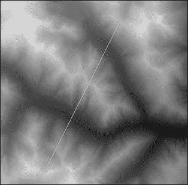
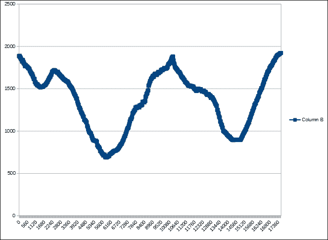
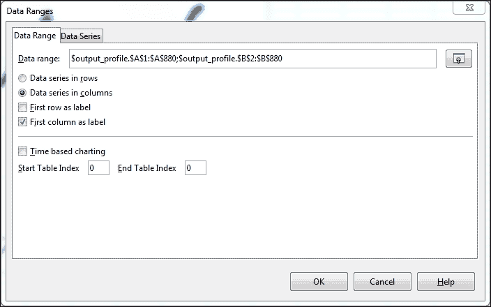
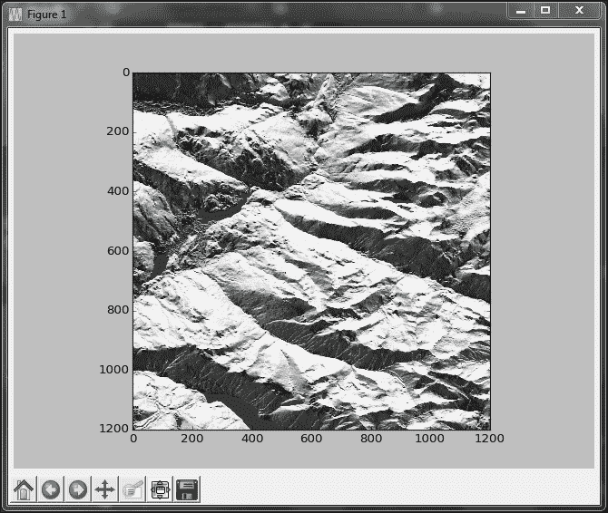
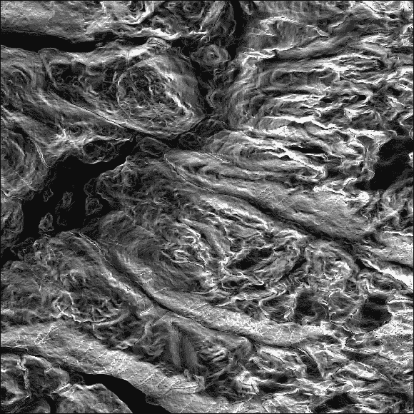
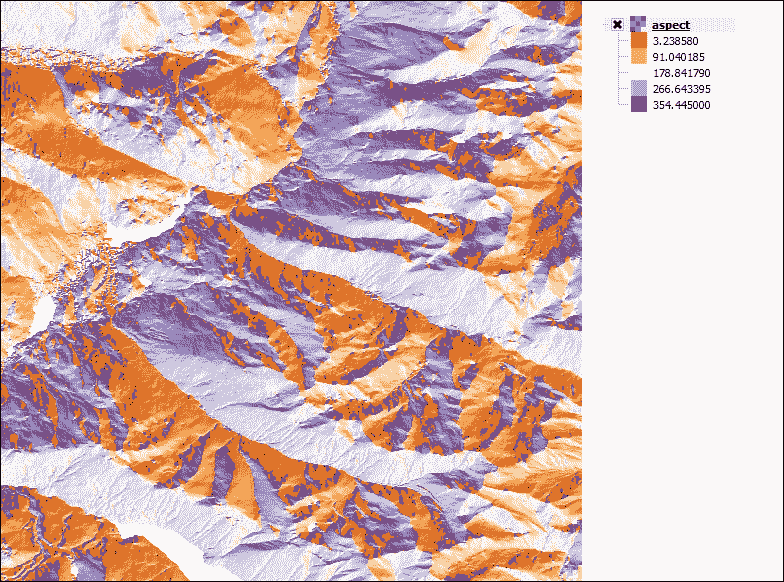
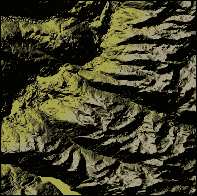

# 第七章. 栅格分析

在本章中，我们将涵盖以下主题：

+   将 USGS ACSII CDED 格式的 DEM 加载到 PostGIS 中

+   创建高程剖面

+   使用 ogr 从您的 DEM 创建阴影栅格

+   从您的 DEM 生成坡度和方位图像

+   合并栅格以生成彩色地形图

# 简介

栅格分析的工作方式与矢量分析类似，但空间关系由栅格单元格的位置决定。我们的大部分栅格数据都是通过多种遥感技术收集的。在本章中，目标非常简单且专注于处理和围绕**数字高程模型**（**DEM**）。我们使用的 DEM 来自加拿大不列颠哥伦比亚省惠斯勒，这里是 2010 年冬季奥运会的举办地。我们的 DEM 是以 USGS ASCII CDED（`.dem`）格式存在的。DEM 是我们用于派生几个新的栅格数据集的源数据。与其他章节一样，我们将利用 Python 作为粘合剂来运行脚本，以实现栅格数据的处理流程。我们的数据可视化将通过 matplotlib 和 QGIS 桌面 GIS 来完成。

# 将 USGS ACSII CDED 格式的 DEM 加载到 PostGIS 中

导入和处理 PostGIS 中的 DEM 是本菜谱的主要内容。我们的旅程从一个充满点且以 USGS ASCII CDED 格式存储的文本文件开始（要了解更多关于此格式的详细信息，请自由查看[`www.gdal.org/frmt_usgsdem.html`](http://www.gdal.org/frmt_usgsdem.html)的文档页面）。ASCII 格式是众所周知且被许多桌面 GIS 应用程序作为直接数据源所接受的。您可以自由地使用 QGIS 打开您的 ASCII 文件来查看文件，并查看它为您创建的栅格表示。我们当前的任务是将此 DEM 文件导入 PostGIS 数据库，在 PostGIS 中创建一个新的 PostGIS 栅格数据集。我们通过使用与 PostGIS 安装一起安装的命令行工具`raster2pgsql`来完成此任务。如果您正在运行 PostgreSQL 9，则`raster2pgsql`工具位于 Windows 上的`C:\Program Files\PostgreSQL\9.3\bin\`。

## 准备工作

您的数据位于`ch07/geodata/dem_3857.dem`文件夹中。您可以自由地从 GeoGratis Canada 获取原始 DEM，这是不列颠哥伦比亚省惠斯勒山周围地区，请访问[`ftp2.cits.rncan.gc.ca/pub/geobase/official/cded/50k_dem/092/092j02.zip`](http://ftp2.cits.rncan.gc.ca/pub/geobase/official/cded/50k_dem/092/092j02.zip)。

如果您还没有在第一章中创建您的`Postgresql`数据库，*设置您的地理空间 Python 环境*，请现在创建，然后继续启动虚拟环境以运行此脚本。

此外，请确保`raster2pgsql`命令在您的命令提示符中可用。如果不是，请在 Windows 上设置您的环境变量或在 Linux 机器上设置符号链接。

## 如何操作...

让我们继续到 `/ch07/code/ch07-01_dem2postgis.py` 文件中可以找到的有趣部分：

1.  在 `/ch07/code/ch07-01_dem2postgis.py` 文件中找到的代码如下：

    ```py
    #!/usr/bin/env python
    # -*- coding: utf-8 -*-
    import subprocess
    import psycopg2

    db_host = "localhost"
    db_user = "pluto"
    db_passwd = "secret"
    db_database = "py_geoan_cb"
    db_port = "5432"

    # connect to DB
    conn = psycopg2.connect(host=db_host, user=db_user,
                            port=db_port, password=db_passwd,
                            database=db_database)

    # create a cursor
    cur = conn.cursor()

    # input USGS ASCII DEM (and CDED)
    input_dem = "../geodata/dem_3857.dem"

    # create an sql file for loading into the PostGIS database raster
    # command line with options
    # -c create new table
    # -I option will create a spatial GiST index on the raster column
    # -C will apply raster constraints
    # -M vacuum analyse the raster table

    command = 'raster2pgsql -c -C -I -M ' + input_dem + ' geodata.dem_3857'

    # write the output to a file

    temp_sql_file = "temp_sql.sql"

    # open, create new file to write sql statements into
    with open(temp_sql_file, 'wb') as f:
        try:
            result = subprocess.call(command, stdout=f, shell=True)
            if result != 0:
                raise Exception('error code %d' % result)

        except Exception as e:
            print e

    # open the file full of insert statements created by raster2pgsql
    with open(temp_sql_file, 'r') as r:
        # run through and execute each line inside the temp sql file
        for sql_insert in r:
            cur.execute(sql_insert)

    print "please open QGIS >= 2.8.x and view your loaded DEM data"
    ```

## 它是如何工作的...

Python，再次成为我们的粘合剂，利用命令行工具的力量来完成脏活。这次，我们使用 Python 的 subprocess 模块来调用 `raster2pgsql` 命令行工具。然后 `psycopg2` 模块执行我们的 `insert` 语句。

从顶部开始，向下工作，我们看到 `psycopg2` 的数据库连接设置。我们的 DEM 输入路径设置为 `input_dem` 变量。然后，我们将命令行参数打包成一个名为 `command` 的单个字符串。然后通过 subprocess 运行它。单个命令行参数在代码注释中描述，更多信息选项可以直接在 [`postgis.refractions.net/docs/using_raster.xml.html#RT_Raster_Loader`](http://postgis.refractions.net/docs/using_raster.xml.html#RT_Raster_Loader) 找到。

现在命令已经准备好了，我们需要创建一个临时文件来存储 `raster2pgsql` 命令生成的 SQL `insert` 和 `create` 语句。使用 `with open()` 语法，我们创建我们的临时文件，然后使用 subprocess 调用命令。我们使用 `stdout` 来指定输出文件的路径。`shell=True` 参数附带一个 *重要* 警告。

### 注意

以下是从 Python 文档中摘取的 `mention` 警告：

```py
Warning Executing shell commands that incorporate unsanitized input from an untrusted source makes a program vulnerable to shell injection, a serious security flaw which can result in arbitrary command execution. For this reason, the use of shell=True is strongly discouraged in cases where the command string is constructed from external input:

```

如果一切顺利，不应该出现任何异常，但如果出现了，我们会使用标准的 Python `try` 语句来捕获它们。

最后一步是打开新创建的包含插入语句的 SQL 文件，并使用 `psycopg2` 执行文件中的每一行。这将填充我们新创建的名为输入 DEM 文件名称的表。

打开 **QGIS** | **2.8.x** 并查看你刚刚加载到 PostGIS 中的栅格。

### 小贴士

要在 QGIS 中打开栅格，我发现你需要打开 QGIS 附加的数据库管理器应用程序，连接到你的 Postgresql-PostGIS 数据库和模式。然后，你将看到新的栅格，你需要右键单击它将其添加到画布上。这将最终将栅格添加到你的 QGIS 项目中。

# 创建高程剖面

创建高程剖面在尝试可视化 3D 地形横截面或简单地查看自行车之旅的高程增益时非常有帮助。在这个例子中，我们将定义自己的 LineString 几何形状，并从位于我们沿线每 20 米处的 DEM 中提取高程值。分析将生成一个新的 CSV 文件，我们可以在 Libre Office Calc 或 Microsoft Excel 中打开它，将新数据可视化为折线图。

在 QGIS 内部看到的高程模型上方的线（二维视图）看起来像这样：



## 准备工作

此配方需要 GDAL 和 Shapely。请确保您已安装它们，并且正在您之前设置的 python 虚拟环境中运行它们。为了可视化您的最终 CSV 文件，您还必须安装 Libre Office Calc 或其他图表软件。执行此操作的代码位于`/ch07/code/ch07-02_elev_profile.py`。

## 如何做到这一点...

直接从您的命令行运行脚本将生成您的 CSV 文件，因此请阅读代码注释以了解生成我们新文件的所有细节，如下所示：

```py
#!/usr/bin/env python
# -*- coding: utf-8 -*-
import sys, gdal, os
from gdalconst import GA_ReadOnly
from os.path import realpath
from shapely.geometry import LineString

def get_elevation(x_coord, y_coord, raster, bands, gt):
    """
    get the elevation value of each pixel under
    location x, y
    :param x_coord: x coordinate
    :param y_coord: y coordinate
    :param raster: gdal raster open object
    :param bands: number of bands in image
    :param gt: raster limits
    :return: elevation value of raster at point x,y
    """
    elevation = []
    xOrigin = gt[0]
    yOrigin = gt[3]
    pixelWidth = gt[1]
    pixelHeight = gt[5]
    px = int((x_coord - xOrigin) / pixelWidth)
    py = int((y_coord - yOrigin) / pixelHeight)
    for j in range(bands):
        band = raster.GetRasterBand(j + 1)
        data = band.ReadAsArray(px, py, 1, 1)
        elevation.append(data[0][0])
    return elevation

def write_to_csv(csv_out,result_profile_x_z):
    # check if output file exists on disk if yes delete it
    if os.path.isfile(csv_out):
        os.remove(csv_out)

    # create new CSV file containing X (distance) and Z value pairs
    with open(csv_out, 'a') as outfile:
        # write first row column names into CSV
        outfile.write("distance,elevation" + "\n")
        # loop through each pair and write to CSV
        for x, z in result_profile_x_z:
            outfile.write(str(round(x, 2)) + ',' + str(round(z, 2)) + '\n')

if __name__ == '__main__':
    # set directory
    in_dem = realpath("../geodata/dem_3857.dem")

    # open the image
    ds = gdal.Open(in_dem, GA_ReadOnly)

    if ds is None:
        print 'Could not open image'
        sys.exit(1)

    # get raster bands
    bands = ds.RasterCount

    # get georeference info
    transform = ds.GetGeoTransform()

    # line defining the the profile
    line = LineString([(-13659328.8483806, 6450545.73152317), (-13651422.7820022, 6466228.25663444)])
    # length in meters of profile line
    length_m = line.length

    # lists of coords and elevations
    x = []
    y = []
    z = []
    # distance of the topographic profile
    distance = []
    for currentdistance in range(0, int(length_m), 20):
        # creation of the point on the line
        point = line.interpolate(currentdistance)
        xp, yp = point.x, point.y
        x.append(xp)
        y.append(yp)
        # extraction of the elevation value from the MNT
        z.append(get_elevation(xp, yp, ds, bands, transform)[0])
        distance.append(currentdistance)  

    print (x)
    print (y)
    print (z)
    print (distance)

    # combine distance and elevation vales as pairs
    profile_x_z = zip(distance,z)

    csv_file = os.path.realpath('../geodata/output_profile.csv')
    # output final csv data
    write_to_csv(csv_file, profile_x_z)
```

## 它是如何工作的...

有两个函数用于创建我们的高程剖面。第一个`get_elevation()`函数返回每个波段中每个像素的单个高程值。这意味着我们的输入栅格可以包含多个数据波段。我们的第二个函数将我们的结果写入 CSV 文件。

`get_elevation()`函数创建一个高程值列表；为了实现这一点，我们需要从我们的输入高程栅格中提取一些细节。*x*和*y*起始坐标与栅格像素宽度和高度结合使用，以帮助我们找到我们的栅格中的像素。然后，这些信息与我们的输入*x*和*y*坐标一起处理，这些坐标是我们想要提取高程值的位置。

接下来，我们遍历我们的栅格中所有可用的波段，并找到位于输入*x*和*y*坐标处的每个波段的高程值。GDAL 的`ReadAsArray`函数找到这个位置，然后我们只需要获取第二个嵌套列表数组中的第一个对象。然后将此值附加到新的高程值列表中。

为了处理我们的数据，我们使用 Python 函数`os.path.realpath()`定义我们的栅格输入路径，该函数返回我们的输入的完整路径。GDAL 用于打开我们的 DEM 栅格并从我们的栅格返回波段数、*x*起始点、*y*起始点、像素宽度和像素高度信息。这些信息位于传递给我们的`get_elevation()`函数的 transform 变量中。

进一步工作，我们定义我们的输入 LineString。这个 LineString 定义了横截面剖面将要被提取的位置。为了处理我们的数据，我们希望在输入 LineString 上每 20 米提取一次高程值。这是在`for`循环中完成的，因为我们根据 LineString 的长度和我们的 20 米输入来指定范围。使用 Shapely 的`Interpolate`线性引用函数，我们然后每 20 米创建一个点对象。这些值随后存储在单独的*x*、*y*和*z*列表中，然后进行更新。*z*列表包含我们新的高程点列表。通过指定由我们的`get_elevation()`函数返回的列表中的第一个对象，可以收集个别的高程值。

要将这些数据汇总到一个 CSV 文件中，我们使用 Python 的`zip`函数将距离值与高程值合并。这创建了数据的最后两列，显示了从我们的 LineString 起点在*x*轴上的距离和*y*轴上的高程值。

在 Libre Office Calc 或 Microsoft Excel 中可视化结果非常简单。请打开位于您的`/ch07/geodata/output_profile.csv`文件夹中的输出 CSV 文件，并创建一个简单的折线图：



您生成的图表应类似于前一张截图所示。

要使用 Libre Office Calc 绘制图表，请参阅以下绘图选项：



# 使用 ogr 从您的 DEM 创建阴影栅格

我们的 DEM 可以作为许多类型派生栅格数据集的基础。其中之一是所谓的**阴影**栅格数据集。阴影栅格表示 3D 高程数据的 2D 视图，通过赋予灰度栅格阴影并使您能够看到地形的高低，从而产生 3D 效果。阴影是一个纯可视化辅助工具，用于创建外观良好的地图并在 2D 地图上显示地形。

创建阴影的纯 Python 解决方案由 Roger Veciana i Rovira 编写，您可以在[`geoexamples.blogspot.co.at/2014/03/shaded-relief-images-using-gdal-python.html`](http://geoexamples.blogspot.co.at/2014/03/shaded-relief-images-using-gdal-python.html)找到它。在《使用 Python 进行地理空间分析》的第七章“Python 和高程数据”中，Joel Lawhead 也提供了一个很好的解决方案。如果您想了解 ESRI 对阴影的详细描述，请查看这个页面：[`webhelp.esri.com/arcgisdesktop/9.3/index.cfm?TopicName=How%20Hillshade%20works`](http://webhelp.esri.com/arcgisdesktop/9.3/index.cfm?TopicName=How%20Hillshade%20works)。`gdaldem`阴影命令行工具将被用来生成磁盘上的图像。



## 准备工作

本例的先决条件需要`gdal`（`osgeo`）、`numpy`和`matplotlib`Python 库。此外，您需要下载本书的数据文件夹，并确保`/ch07/geodata`文件夹可用于读写访问。我们将直接访问磁盘上的 USGS ASCII CDED DEM `.dem`文件以渲染阴影，因此请确保您有这个文件夹。代码执行将像往常一样在您的`/ch07/code/`文件夹中进行，该文件夹运行`ch07-03_shaded_relief.py`Python 文件。因此，对于急于编码的开发者，请在命令行中按照以下方式尝试：

```py
>> python ch07-03_shaded_relief.py

```

## 如何操作...

我们的 Python 脚本将执行几个数学运算，并调用 gdaldem 命令行工具，按照以下步骤生成输出：

1.  代码中包含一些不是总是容易跟上的数学；灰度值的计算取决于高程及其周围的像素，所以请继续阅读：

    ```py
    #!/usr/bin/env python
    # -*- coding: utf-8 -*-
    from osgeo import gdal
    from numpy import gradient
    from numpy import pi
    from numpy import arctan
    from numpy import arctan2
    from numpy import sin
    from numpy import cos
    from numpy import sqrt
    import matplotlib.pyplot as plt
    import subprocess

    def hillshade(array, azimuth, angle_altitude):
        """
        :param array: input USGS ASCII DEM / CDED .dem
        :param azimuth: sun position
        :param angle_altitude: sun angle
        :return: numpy array
        """

        x, y = gradient(array)
        slope = pi/2\. - arctan(sqrt(x*x + y*y))
        aspect = arctan2(-x, y)
        azimuthrad = azimuth * pi / 180.
        altituderad = angle_altitude * pi / 180.

        shaded = sin(altituderad) * sin(slope)\
         + cos(altituderad) * cos(slope)\
         * cos(azimuthrad - aspect)
        return 255*(shaded + 1)/2

    ds = gdal.Open('../geodata/092j02_0200_demw.dem')
    arr = ds.ReadAsArray()

    hs_array = hillshade(arr, 90, 45)
    plt.imshow(hs_array,cmap='Greys')
    plt.savefig('../geodata/hillshade_whistler.png')
    plt.show()

    # gdal command line tool called gdaldem
    # link  http://www.gdal.org/gdaldem.html
    # usage:
    # gdaldem hillshade input_dem output_hillshade
    # [-z ZFactor (default=1)] [-s scale* (default=1)]"
    # [-az Azimuth (default=315)] [-alt Altitude (default=45)]
    # [-alg ZevenbergenThorne] [-combined]
    # [-compute_edges] [-b Band (default=1)] [-of format] [-co "NAME=VALUE"]* [-q]

    create_hillshade = '''gdaldem hillshade -az 315 -alt 45 ../geodata/092j02_0200_demw.dem ../geodata/hillshade_3857.tif'''

    subprocess.call(create_hillshade)
    ```

## 它是如何工作的...

阴影功能计算每个单元格的坡度和方向值，作为计算阴影灰度值的输入。`azimuth`变量定义了光线以度数击中我们的 DEM 的方向。反转和调整`azimuth`可以产生一些效果，例如山谷看起来像山，山看起来像山谷。我们的`shaded`变量持有阴影值作为数组，我们可以使用 matplotlib 进行绘图。

使用`gdaldem`命令行工具肯定比纯 Python 解决方案更健壮且更快。使用`gdaldem`，我们在磁盘上创建一个新的阴影 TIF 文件，可以用本地图像查看器打开，也可以拖放到 QGIS 中。QGIS 会自动拉伸灰度值，以便您可以看到您阴影的漂亮表示。

# 从您的 DEM 生成坡度和方向图像

坡度图非常有用，例如，可以帮助生物学家识别栖息地区域。某些物种只生活在非常陡峭的地区——例如高山山羊。坡度栅格可以快速识别潜在的栖息地区域。为了可视化这一点，我们使用 QGIS 显示我们的坡度图，它将类似于以下图像。白色区域表示较陡的区域，颜色越深，地形越平坦：



我们的方向图显示了表面朝向的方向——例如北、东、南和西——这以度数表示。在屏幕截图中，橙色区域代表温暖的朝南区域。朝北的侧面较冷，并且用我们颜色光谱的不同色调表示。为了达到这些颜色，我们将 QGIS 单波段伪彩色分类为五个连续类别，如下面的屏幕截图所示：



## 准备工作

确保您的`/ch07/geodata`文件夹已下载，并且加拿大不列颠哥伦比亚省惠斯勒的 DEM 文件`092j02_0200_demw.dem`可用。

## 如何操作...

1.  我们使用`gdaldem`命令行工具创建我们的坡度栅格。您可以调整此配方以批量生成多个 DEM 栅格的坡度图像。

    ```py
    #!/usr/bin/env python
    # -*- coding: utf-8 -*-
    import subprocess

    # SLOPE
    # - To generate a slope map from any GDAL-supported elevation raster :
    # gdaldem slope input_dem output_slope_map"
    # [-p use percent slope (default=degrees)] [-s scale* (default=1)]
    # [-alg ZevenbergenThorne]
    # [-compute_edges] [-b Band (default=1)] [-of format] [-co "NAME=VALUE"]* [-q]

    create_slope = '''gdaldem slope ../geodata/092j02_0200_demw.dem ../geodata/slope_w-degrees.tif '''

    subprocess.call(create_slope)

    # ASPECT
    # - To generate an aspect map from any GDAL-supported elevation raster
    # Outputs a 32-bit float raster with pixel values from 0-360 indicating azimuth :
    # gdaldem aspect input_dem output_aspect_map"
    # [-trigonometric] [-zero_for_flat]
    # [-alg ZevenbergenThorne]
    # [-compute_edges] [-b Band (default=1)] [-of format] [-co "NAME=VALUE"]* [-q]

    create_aspect = '''gdaldem aspect ../geodata/092j02_0200_demw.dem ../geodata/aspect_w.tif '''

    subprocess.call(create_aspect)
    ```

## 它是如何工作的...

`gdaldem`命令行工具再次成为我们的工作马，我们只需要传递我们的 DEM 并指定一个输出文件。在代码内部，您会看到传递的参数包括`-co compress=lzw`，这可以显著减小图像的大小。我们的`-p`选项表示我们希望结果以百分比坡度表示，然后是输入 DEM 和我们的输出文件。

对于我们的`gdaldem`方向栅格，这次同样适用相同的压缩，并且不需要其他参数来生成方向栅格。要可视化方向栅格，请在 QGIS 中打开它，并分配一个颜色，如介绍中所述。

# 合并栅格以生成彩色高程图

使用`gdaldem color-relief`命令行生成彩色高程栅格是一行代码。如果你想要更直观的效果，我们将执行一个组合，包括坡度、阴影和一些颜色高程。我们的最终结果是单个新的栅格，表示层合并，以给出一个美观的高程视觉效果。结果看起来将类似于以下图像：



## 准备工作

对于这个练习，你需要安装包含`gdaldem`命令行工具的 GDAL 库。

## 如何操作...

1.  让我们从使用`gdalinfo\ch07\code>gdalinfo ../geodata/092j02_0200_demw.dem`命令行工具从我们的 DEM 中提取一些关键信息开始，如下所示：

    ```py
    Driver: USGSDEM/USGS Optional ASCII DEM (and CDED)
    Files: ../geodata/092j02_0200_demw.dem
           ../geodata/092j02_0200_demw.dem.aux.xml
    Size is 1201, 1201
    Coordinate System is:
    GEOGCS["NAD83",
        DATUM["North_American_Datum_1983",
            SPHEROID["GRS 1980",6378137,298.257222101,
                AUTHORITY["EPSG","7019"]],
            TOWGS84[0,0,0,0,0,0,0],
            AUTHORITY["EPSG","6269"]],
        PRIMEM["Greenwich",0,
            AUTHORITY["EPSG","8901"]],
        UNIT["degree",0.0174532925199433,
            AUTHORITY["EPSG","9108"]],
        AUTHORITY["EPSG","4269"]]
    Origin = (-123.000104166666630,50.250104166666667)
    Pixel Size = (0.000208333333333,-0.000208333333333)
    Metadata:
      AREA_OR_POINT=Point
    Corner Coordinates:
    Upper Left  (-123.0001042,  50.2501042) (123d 0' 0.37"W, 50d15' 0.38"N)
    Lower Left  (-123.0001042,  49.9998958) (123d 0' 0.37"W, 49d59'59.63"N)
    Upper Right (-122.7498958,  50.2501042) (122d44'59.62"W, 50d15' 0.38"N)
    Lower Right (-122.7498958,  49.9998958) (122d44'59.62"W, 49d59'59.63"N)
    Center      (-122.8750000,  50.1250000) (122d52'30.00"W, 50d 7'30.00"N)
    Band 1 Block=1201x1201 Type=Int16, ColorInterp=Undefined
      Min=348.000 Max=2885.000
      Minimum=348.000, Maximum=2885.000, Mean=1481.196, StdDev=564.262
      NoData Value=-32767
      Unit Type: m
      Metadata:
        STATISTICS_MAXIMUM=2885
        STATISTICS_MEAN=1481.1960280116
        STATISTICS_MINIMUM=348
        STATISTICS_STDDEV=564.26229690401
    ```

1.  这些关键信息随后被用来创建我们的颜色`ramp.txt`文件。首先创建一个名为`ramp.txt`的新文本文件，并输入以下颜色代码：

    ```py
    -32767 255 255 255
    0 46 154 88
    360 251 255 128
    750 96 108 31
    1100 148 130 55
    2900 255 255 255
    ```

1.  `-32767`值定义了我们的`NODATA`值，在白色（`255 255 255`）RGB 颜色中。现在，将`ramp.txt`文件保存在以下代码相同的文件夹中，该代码将生成新的栅格彩色高程：

    ```py
    #!/usr/bin/env python
    # -*- coding: utf-8 -*-
    import subprocess

    dem_file = '../geodata/092j02_0200_demw.dem'
    hillshade_relief = '../geodata/hillshade.tif'
    relief = '../geodata/relief.tif'
    final_color_relief = '../geodata/final_color_relief.tif'

    create_hillshade = 'gdaldem hillshade -co compress=lzw -compute_edges ' + dem_file +  ' ' + hillshade_relief
    subprocess.call(create_hillshade, shell=True)
    print create_hillshade

    cr = 'gdaldem color-relief -co compress=lzw ' + dem_file + ' ramp.txt ' + relief
    subprocess.call(cr)
    print cr

    merge = 'python hsv_merge.py ' + relief + ' ' + hillshade_relief + ' ' + final_color_relief
    subprocess.call(merge)
    print merge

    create_slope = '''gdaldem slope -co compress=lzw ../geodata/092j02_0200_demw.dem ../geodata/slope_w-degrees.tif '''

    subprocess.call(create_slope)
    ```

## 工作原理...

我们需要链式连接一些命令和变量以获得期望的结果，使其看起来更好。开始我们的旅程，我们将从 DEM 中提取一些关键信息，以便我们能够创建一个颜色渐变，定义哪些颜色被分配给高程值。这个新的`ramp.txt`文件存储我们的颜色渐变值，然后由`gdaldem color-relief`命令使用。

代码首先定义了在整个脚本中需要的输入和输出变量。在前面的代码中，我们定义了输入`DEM`和三个输出`.tif`文件。

第一次调用将执行`gdaldem hillshade`命令以生成我们的阴影图。紧接着是`gdaldem color-relief`命令，创建基于我们定义的`ramp.txt`文件的好看的彩色栅格。`ramp.txt`文件包含 NODATA 值并将其设置为白色 RGB 颜色。五个类别基于 DEM 数据本身。

最终合并使用 Frank Warmerdam 的`hsv_merge.py`脚本完成，该脚本将我们的高程输出与生成的阴影栅格合并，留下我们的最终栅格。我们的结果是颜色高程图和阴影的漂亮组合。
