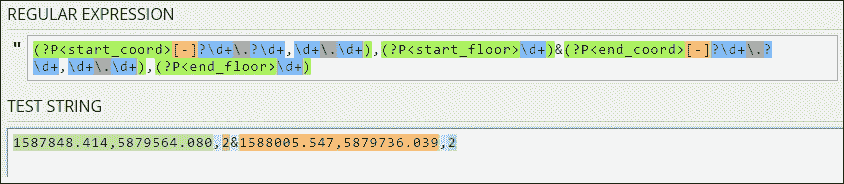
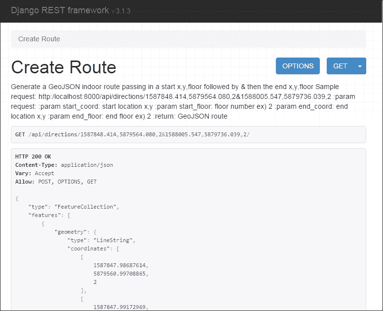
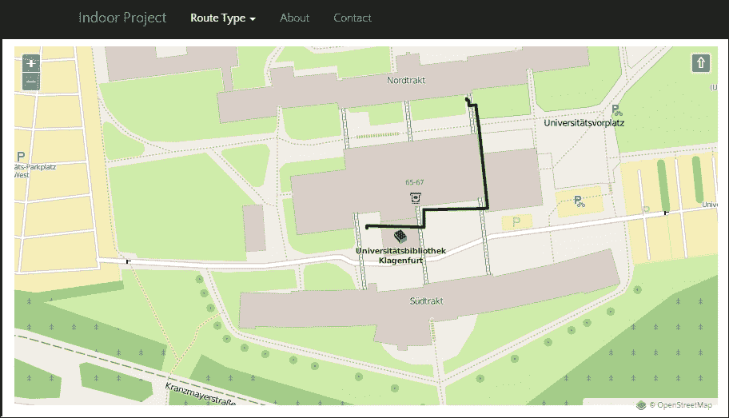
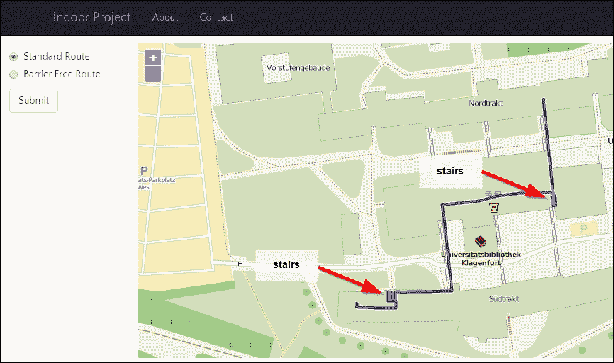
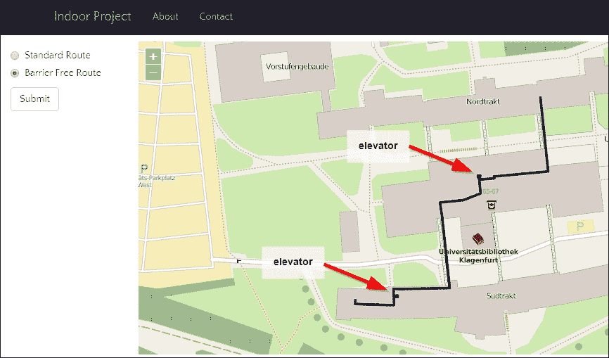
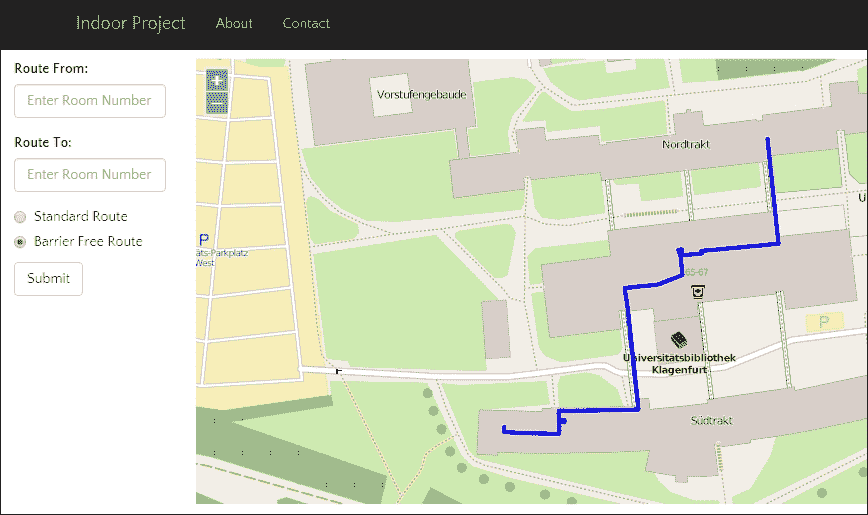
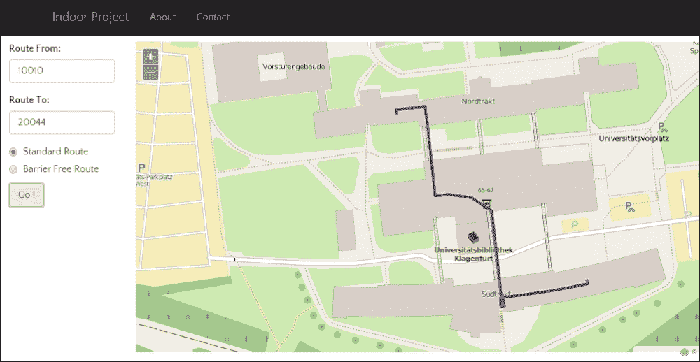

# 第十一章。使用 GeoDjango 进行网络分析

在本章中，我们将涵盖以下主题：

+   设置 GeoDjango 网络应用程序

+   创建室内网络路由服务

+   可视化室内路由服务

+   创建室内路线类型服务

+   从房间到房间的室内路线创建

# 简介

我们的最后一章完全关于将我们的分析扩展到使用 **Django** 网络框架的 Web 应用程序。一个标准的 Django 贡献包被称为 **GeoDjango**，位于 `django/contrib/gis` 包中。这是一个功能丰富的 GIS 工具集，用于地理空间 Web 应用程序开发。这里使用的空间库取决于您选择的空间数据库后端。对于 PostgreSQL，库需求包括 GEOS、PROJ.4 和 PostGIS。

Django 以其良好的文档而闻名，`gis contrib` 包的安装也不例外，它有一套您需要遵循的说明，网址为 [`docs.djangoproject.com/en/dev/ref/contrib/gis/`](https://docs.djangoproject.com/en/dev/ref/contrib/gis/)。

由于 GeoDjango 是标准 Django 安装的一部分，您将看到第一步是安装 Django 框架。有关安装 GeoDjango、PostgreSQL 和 PostGIS 的任何参考，请参阅 第一章，*设置您的地理空间 Python 环境*。

# 设置 GeoDjango 网络应用程序

我们需要完成一些基本的 Django 基础工作，这将是一个对设置所需基本以启动 Django 网络应用程序的非常高级的概述。有关更多信息，请查看官方 Django 教程，网址为 [`docs.djangoproject.com/en/dev/intro/tutorial01/`](https://docs.djangoproject.com/en/dev/intro/tutorial01/)。

### 注意

如果您不熟悉 Django 或 GeoDjango，我强烈建议您阅读并完成在线教程，从 Django 开始，网址为 [`docs.djangoproject.com/en/dev/`](https://docs.djangoproject.com/en/dev/)，然后是 GeoDjango 教程，网址为 [`docs.djangoproject.com/en/dev/ref/contrib/gis/tutorial/`](https://docs.djangoproject.com/en/dev/ref/contrib/gis/tutorial/)。对于本章，假设您熟悉 Django，已完成整个在线 Django 教程，因此熟悉 Django 概念。

## 准备工作

我们将使用 *Django REST 框架* ([`www.django-rest-framework.org/`](http://www.django-rest-framework.org/)) 构建一个路由网络服务。我们需要实现的是一个基本的网络服务，您可以使用 `pip` 来安装：

```py
>pip install djangorestframework==3.1.3

```

这将安装版本 3.1.3，即最新版本。如果您想安装最新版本，只需输入以下命令，但请注意，它可能不适用于此示例：

```py
>pip install djangorestframework

```

## 如何操作...

现在让我们使用 `django-admin` 工具创建一个 Django 项目，如下所示：

1.  在命令行中，进入 `/ch11/code` 目录并执行此命令：

    ```py
    > django-admin startproject web_analysis

    ```

1.  现在，您将有一个 `/ch11/code/web_analysis/web_analysis` 目录，并在其中，您将找到所有标准的基本 Django 组件。

1.  要创建我们的网络服务，我们将把所有服务放置在一个名为 `api` 的 Django 应用程序中。此应用程序将存储所有服务。创建此 `api` 应用程序就像输入以下代码一样简单：

    ```py
    > cd web_analysis

    ```

    切换到新创建的 `web_analysis` 目录：

    ```py
    > django-admin startapp api

    ```

    现在创建一个名为 "api" 的新应用程序。

1.  这将在 `/ch11/code/web_analysis/api` 下创建一个新的文件夹，并在其中您将找到默认安装的 Django 应用程序文件。接下来，我们需要告诉 Django 关于 Django REST 框架、GeoDjango gis 应用程序以及我们的新 `api` 应用程序；我们在 `/ch11/code/web_analysis/web_analysis/settings.py` 文件中这样做。让我们将 `'django.contrib.gis'`、`'rest_framework'` 和 `'api'` 行添加到我们的 `INSTALLED_APPS` 变量中，如下所示：

    ```py
    INSTALLED_APPS = (
     'django.contrib.admin',
     'django.contrib.auth',
     'django.contrib.contenttypes',
     'django.contrib.sessions',
     'django.contrib.messages',
     'django.contrib.staticfiles',

     #### GeoDjango Contrib APP
     # 'django.contrib.gis',

     #### third party apps
     'rest_framework',

     ##### our local apps
     'api', 

    )

    ```

1.  要启用 GeoDjango 空间模型和空间功能，`'django.contrib.gis'` 将允许我们访问丰富的地理空间框架。目前我们将其注释掉，因为我们不会在稍后使用它，但您可以随时取消注释，因为这不会造成任何伤害。此空间框架需要一个空间数据库，我们将使用带有 PostGIS 的 PostgreSQL 作为我们的后端。现在让我们在 `settings.py` 中更改数据库连接，如下所示：

    ```py
    DATABASES = {
        'default': {
            # PostgreSQL with PostGIS
            'ENGINE': 'django.contrib.gis.db.backends.postgis',
            'NAME': 'py_geoan_cb', # DB name
            'USER': 'saturn', # DB user name
            'PASSWORD': 'secret', # DB user password
            'HOST': 'localhost',
            'PORT': '5432',
        }
    }
    ```

    ### 注意

    此处数据库引用的是我们在第三章中创建的相同的 *PostgreSQL + PostGIS* 数据库，即 *将空间数据从一种格式转换为另一种格式*。如果您要跳过到这一部分，请访问第三章中的 *使用 ogr2ogr 将 Shapefile 转换为 PostGIS 表* 菜单，我们在那里创建了 `py_geoan_cb` 数据库。

1.  我们最终的 `settings.py` 配置设置为将错误和异常记录到日志文件中，如果发生错误，将捕获错误。首先，我们将创建一个名为 `/web_analysis/logs` 的新文件夹，并添加两个新文件，分别命名为 `debug.log` 和 `verbose.log`。我们将把发生的任何错误写入这两个文件，并记录请求或简单地打印错误到这些文件。因此，请将以下代码复制到 `/web_analysis/web_analysis/settings.py` 文件的底部，如下所示：

    ```py
    LOGGING_CONFIG = None

    LOGGING = {
        'version': 1,
        'disable_existing_loggers': False,
        'formatters': {
            'verbose': {
                'format' : "[%(asctime)s] %(levelname)s [%(name)s:%(lineno)s] %(message)s",
                'datefmt' : "%d/%b/%Y %H:%M:%S"
            },
            'simple': {
                'format': '%(levelname)s %(message)s'
            },
        },
        'handlers': {
            'file_verbose': {
                'level': 'DEBUG',
                'class': 'logging.FileHandler',
                'filename': 'logs/verbose.log',
                'formatter': 'verbose'
            },
            'file_debug': {
                'level': 'DEBUG',
                'class': 'logging.FileHandler',
                'filename': 'logs/debug.log',
                'formatter': 'verbose'
            },
        },
        'loggers': {
            'django': {
                'handlers':['file_verbose'],
                'propagate': True,
                'level':'DEBUG',
            },
            'api': {
                'handlers': ['file_debug'],
                'propagate': True,
                'level': 'DEBUG',
            },

        }
    }

    import logging.config
    logging.config.dictConfig(LOGGING)
    ```

1.  接下来，让我们创建一个新的数据库用户和一个单独的 PostgreSQL 模式来存储所有我们的 Django 相关表；否则，所有新的 Django 表将自动创建在 PostgreSQL 默认模式 public 中。我们的新用户名为 `saturn`，可以使用 `secret` 密码登录。要创建新用户，您可以使用作为 `postgres` 用户运行的命令行工具：

    ```py
    >createuser saturn

    ```

    您还可以使用免费的 PGAdmin 工具。在 Ubuntu 上，别忘了切换到 `postgres` 用户，这将允许您在数据库上创建新用户。

1.  现在，让我们创建一个新的模式名为`django`，它将存储我们所有的 Django 应用程序表。使用 PGAdmin 或 SQL 命令来完成此操作，如下所示：

    ```py
    CREATE SCHEMA django AUTHORIZATION saturn;

    ```

1.  使用这个新模式，我们只需要将 PostgreSQL `search_path`变量顺序设置为将`django`模式作为第一优先级。为了完成这个任务，我们需要使用以下 SQL `ALTER ROLE`命令：

    ```py
    ALTER ROLE saturn SET search_path = django, geodata, public, topology;
    ```

1.  这设置了`search_path`的顺序，将`django`作为第一个模式，`geodata`作为第二个，以此类推。这个顺序适用于`saturn`用户的所有数据库连接。当我们创建新的 Django 表时，它们现在将自动创建在`django`模式内。

1.  现在让我们继续初始化我们的 Django 项目并创建所有表，如下所示：

    ```py
    > python manage.py migrate

    ```

1.  内置的 Django `manage.py`命令调用`migrate`函数并一次性执行同步。接下来，让我们为我们的应用程序创建一个超级用户，该用户可以登录并完全控制整个网络应用程序。然后，按照命令行说明输入用户名、电子邮件和密码，如下所示：

    ```py
    > python manage.py createsuperuser

    ```

1.  现在这些步骤都已完成，我们准备好真正做一些事情并构建我们的在线路由应用程序。为了测试一切是否正常工作，运行此命令：

    ```py
    > python manage.py runserver 8000

    ```

1.  打开您的本地网络浏览器并查看 Django 默认欢迎页面。

# 创建室内网络路由服务

让我们把我们在第八章，*网络路由分析*中投入的所有努力都放到万维网上。我们的路由服务将简单地接受一个起点位置、一个 *x*、*y* 坐标对、楼层级别和目的地位置。然后室内路由服务将计算最短路径，并以 GeoJSON 文件的形式返回完整的路线。

## 准备工作。

为了规划前面的任务，让我们从高层次列出我们需要完成的内容，以便我们清楚我们的方向：

1.  创建一个 URL 模式来调用路由服务。

1.  创建一个视图来处理传入的 URL 请求并返回适当的 GeoJSON 路由网络响应：

    1.  接受传入的请求参数。

        开始 *x* 坐标。

        开始 *y* 坐标。

        开始楼层编号。

        结束 *x* 坐标。

        结束 *y* 坐标。

        结束楼层编号。

    1.  返回 GeoJSON LineString。

        路径几何形状。

        路径长度。

        路径步行时间。

    我们还需要让名为`saturn`的新数据库用户能够访问在第八章，*网络路由分析*中创建的 PostgreSQL geodata 模式中的表。目前，只有名为`postgres`的用户是所有者和全能者。这需要改变，这样我们就可以继续前进，而无需重新创建我们在第八章，*网络路由分析*中创建的表。所以，让我们继续，简单地让`saturn`用户成为这些表的每个所有者，如下所示：

    ```py
    ALTER TABLE geodata.ch08_e01_networklines OWNER TO saturn;
    ALTER TABLE geodata.ch08_e01_networklines_vertices_pgr OWNER TO saturn;
    ALTER TABLE geodata.ch08_e02_networklines OWNER TO saturn;
    ALTER TABLE geodata.ch08_e02_networklines_vertices_pgr  OWNER TO saturn;
    ALTER TABLE geodata.networklines_3857 OWNER TO saturn;
    ALTER TABLE geodata.networklines_3857_vertices_pgr OWNER TO saturn;

    ```

    ### 小贴士

    如果您想允许`saturn`用户和任何其他用户访问这些表，您可以创建一个 PostgreSQL 组角色，并将用户分配到该角色，如下所示：

    ```py
    CREATE ROLE gis_edit   VALID UNTIL 'infinity';
    GRANT ALL ON SCHEMA geodata TO GROUP gis_edit;
    GRANT gis_edit TO saturn;
    GRANT ALL ON TABLE geodata.ch08_e01_networklines TO GROUP gis_edit;
    GRANT ALL ON TABLE geodata.ch08_e01_networklines_vertices_pgr TO GROUP gis_edit;
    GRANT ALL ON TABLE geodata.ch08_e02_networklines TO GROUP gis_edit;
    GRANT ALL ON TABLE geodata.ch08_e02_networklines_vertices_pgr TO GROUP gis_edit;
    GRANT ALL ON TABLE geodata.networklines_3857 TO GROUP gis_edit;
    GRANT ALL ON TABLE geodata.networklines_3857_vertices_pgr TO GROUP gis_edit;

    ```

## 如何操作...

我们现在的代码在一个文件夹中，这种结构对所有 Django Web 项目都是通用的，因此遵循这些步骤应该是直截了当的：

1.  让我们先连接我们的新 URL。请打开位于`ch11/code/web_analysis/`文件夹中的`urls.py`文件。在文件中，您需要输入我们新网页的主要 URL 配置。当创建项目时，此文件会自动创建。如您所见，Django 填充了一些辅助文本，显示了基本配置选项。我们需要添加我们稍后将要使用的`admin`应用，以及我们新 API 的 URL。API 应用将拥有它自己的 URL 配置文件，正如您在`api.urls`引用中看到的，我们将创建它。`/web_analysis/urls.py`文件应如下所示：

    ```py
    """web_analysis URL Configuration

    The `urlpatterns` list routes URLs to views. For more information please see:
        https://docs.djangoproject.com/en/1.8/topics/http/urls/
    Examples:
    Function views
        1\. Add an import:  from my_app import views
        2\. Add a URL to urlpatterns:  url(r'^$', views.home, name='home')
    Class-based views
        1\. Add an import:  from other_app.views import Home
        2\. Add a URL to urlpatterns:  url(r'^$', Home.as_view(), name='home')
    Including another URLconf
        1\. Add an import:  from blog import urls as blog_urls
        2\. Add a URL to urlpatterns:  url(r'^blog/', include(blog_urls))
    """
    from django.conf.urls import include, url
    from django.contrib import admin

    urlpatterns = [
        url(r'^admin/', include(admin.site.urls)),
        url(r'^api/', include('api.urls')),
    ]
    ```

1.  接下来，让我们创建`/web_analysis/api/urls.py` API URL。此文件不是自动生成的，所以我们现在将创建此文件。`/api/urls.py`文件的内容将如下所示：

    ```py
    from django.conf.urls import patterns, url
    from rest_framework.urlpatterns import format_suffix_patterns

    urlpatterns = patterns('api.views',
        #  ex valid call from to /api/directions/1587848.414,5879564.080,2&1588005.547,5879736.039,2
        url(r'^directions/(?P<start_coord>[-]?\d+\.?\d+,\d+\.\d+),(?P<start_floor>\d+)&(?P<end_coord>[-]?\d+\.?\d+,\d+\.\d+),(?P<end_floor>\d+)/$', 'create_route', name='directions'),

    )

    urlpatterns = format_suffix_patterns(urlpatterns)
    ```

1.  正则表达式看起来很复杂，就像大多数正则表达式一样。如果您需要一些帮助来理解它，请尝试参考[`regex101.com/#python`](https://regex101.com/#python)。请将此正则表达式粘贴到正则表达式字段中：

    ```py
    (?P<start_coord>[-]?\d+\.?\d+,\d+\.\d+),(?P<start_floor>\d+)&(?P<end_coord>[-]?\d+\.?\d+,\d+\.\d+),(?P<end_floor>\d+)
    ```

1.  要测试您的 URL 字符串，只需将此文本粘贴到**测试字符串**字段中：

    ```py
    1587848.414,5879564.080,2&1588005.547,5879736.039,2
    ```

1.  如果它以一些奇特的颜色亮起，那么您就可以开始了：

    Django 在 URL 配置中使用正则表达式非常方便，但并不总是容易阅读和明确。我们的 URL 以文本方式解释，如下所示：

    ```py
    /api/directions/start_x,start_y,start_floor&end_x,end_y,end_floor

    ```

    这是一个来自您开发机器的真实示例。当调用 URL 时，它看起来是这样的：

    ```py
    http://localhost:8000/api/directions/1587848.414,5879564.080,2&1588005.547,5879736.039,2

    ```

    起始和结束位置信息由一个`&`符号分隔，而每个起始参数和结束参数的内容由逗号分隔。

    从现在开始，在复杂性方面，我们需要输入我们 API 的逻辑部分。Django 在视图中处理这一点。我们的`/web_analysis/api/views.py`代码包含了处理请求和响应的代码。

1.  主要的`def create_route`函数应该看起来很熟悉，因为它直接来自第八章，*网络路由分析*，并进行了一些修改。创建了一个新的`helper`函数，称为`find_closest_network_node`。这个新函数比我们之前用来找到用户输入的任何给定*x*，*y*坐标的节点所用的 SQL 更健壮、更快：

    ```py
    #!/usr/bin/env python
    # -*- coding: utf-8 -*-

    import traceback
    from django.http import HttpResponseNotFound
    from rest_framework.decorators import api_view
    from rest_framework.response import Response
    from geojson import loads, Feature, FeatureCollection
    import logging
    logger = logging.getLogger(__name__)
    from django.db import connection

    def find_closest_network_node(x_coord, y_coord, floor):
        """
        Enter a given coordinate x,y and floor number and
        find the nearest network node
        to start or end the route on
        :param x_coord: float  in epsg 3857
        :param y_coord: float  in epsg 3857
        :param floor: integer value equivalent to floor such as
    	2  = 2nd floor
        :return: node id as an integer
        """
        # connect to our Database
        logger.debug("now running function find_closest_network_node")
        cur = connection.cursor()

        # find nearest node on network within 200 m
        # and snap to nearest node
        query = """ SELECT
            verts.id as id
            FROM geodata.networklines_3857_vertices_pgr AS verts
            INNER JOIN
              (select ST_PointFromText('POINT(%s %s %s)', 3857)as geom) AS pt
            ON ST_DWithin(verts.the_geom, pt.geom, 200.0)
            ORDER BY ST_3DDistance(verts.the_geom, pt.geom)
            LIMIT 1;"""

        # pass 3 variables to our %s %s %s place holder in query
        cur.execute(query, (x_coord, y_coord, floor,))

        # get the result
        query_result = cur.fetchone()

        # check if result is not empty
        if query_result is not None:
            # get first result in tuple response there is only one
            point_on_networkline = int(query_result[0])
            return point_on_networkline
        else:
            logger.debug("query is none check tolerance value of 200")
            return False

    # use the rest_framework decorator to create our api
    #  view for get, post requests
    @api_view(['GET', 'POST'])
    def create_route(request, start_coord, start_floor, end_coord, end_floor):
        """
        Generate a GeoJSON indoor route passing in a start x,y,floor
        followed by &  then the end x,y,floor
        Sample request: http:/localhost:8000/api/directions/1587848.414,5879564.080,2&1588005.547,5879736.039,2
        :param request:
        :param start_coord: start location x,y
        :param start_floor: floor number  ex)  2
        :param end_coord: end location x,y
        :param end_floor: end floor ex)  2
        :return: GeoJSON route
        """

        if request.method == 'GET' or request.method == 'POST':

            cur = connection.cursor()

            # parse the incoming coordinates and floor using
            # split by comma
            x_start_coord = float(start_coord.split(',')[0])
            y_start_coord = float(start_coord.split(',')[1])
            start_floor_num = int(start_floor)

            x_end_coord = float(end_coord.split(',')[0])
            y_end_coord = float(end_coord.split(',')[1])
            end_floor_num = int(end_floor)

            # use our helper function to get vertices
            # node id for start and end nodes
            start_node_id = find_closest_network_node(x_start_coord,
                               y_start_coord,
                               start_floor_num)

            end_node_id = find_closest_network_node(x_end_coord,
                               y_end_coord,
                               end_floor_num)

            routing_query = '''
                SELECT seq, id1 AS node, id2 AS edge,
                  total_cost AS cost, layer,
                  type_id, ST_AsGeoJSON(wkb_geometry) AS geoj
                  FROM pgr_dijkstra(
                    'SELECT ogc_fid as id, source, target,
                         st_length(wkb_geometry) AS cost,
                         layer, type_id
                     FROM geodata.networklines_3857',
                    %s, %s, FALSE, FALSE
                  ) AS dij_route
                  JOIN  geodata.networklines_3857 AS input_network
                  ON dij_route.id2 = input_network.ogc_fid ;
              '''

            # run our shortest path query
            if start_node_id or end_node_id:
                cur.execute(routing_query, (start_node_id, end_node_id))
            else:
                logger.error("start or end node is None "
                             + str(start_node_id))
                return HttpResponseNotFound('<h1>Sorry NO start or end  node'
                                ' found within 200m</h1>')

            # get entire query results to work with
            route_segments = cur.fetchall()

            # empty list to hold each segment for our GeoJSON output
            route_result = []

            # loop over each segment in the result route segments
            # create the list of our new GeoJSON
            for segment in route_segments:
                seg_cost = segment[3]      # cost value
                layer_level = segment[4]   # floor number
                seg_type = segment[5]
                geojs = segment[6]         # geojson coordinates
                geojs_geom = loads(geojs)  # load string to geom
                geojs_feat = Feature(geometry=geojs_geom,
                                     properties={'floor': layer_level,
                                                  'length': seg_cost,
                                                  'type_id': seg_type})
                route_result.append(geojs_feat)

            # using the geojson module to create our GeoJSON Feature Collection
            geojs_fc = FeatureCollection(route_result)

            try:
                return Response(geojs_fc)
            except:
                logger.error("error exporting to json model: "+ str(geojs_fc))
                logger.error(traceback.format_exc())
                return Response({'error': 'either no JSON or no key params in your JSON'})
        else:
            retun HttpResponseNotFound('<h1>Sorry not a GET or POST request</h1>')
    ```

    结果 API 调用有一个很好的 Web 界面，这是由**Django REST 框架**自动生成的，如下面的截图所示。您需要调用的 URL 也显示出来，并应返回 GeoJSON 结果。

    

    以下 URL 将返回 GeoJSON 到您的浏览器；在 Chrome 中，它通常只会显示为简单的文本。IE 用户可以通过在 Notepad++或本地文本编辑器中打开它来将其作为文件下载，以查看 GeoJSON 的内容：

    ```py
    http://localhost:8000/api/directions/1587848.414,5879564.080,2&1588005.547,5879736.039,2/?format=json

    ```

## 它是如何工作的...

我们的观点使用 Django REST 框架处理请求和响应。有两个函数执行所有艰苦的工作，而从未使用 Django **对象关系映射器**（**ORM**）。这样做的原因有两个：首先，为了向您展示直接数据库使用的基本知识，而不需要太多的抽象和内部工作原理；其次，因为我们正在使用 PostGIS 的函数，这些函数不能直接通过 GeoDjango 的 ORM 直接使用，例如`ST_3DDistance`或`ST_PointFromText`。我们可以使用一些花哨的 Django 辅助函数，如`.extra()`，但这可能会让除了经验丰富的 Django 用户之外的所有人感到困惑。

让我们讨论第一个`find_closest_network_node`函数，它接受三个参数：`x_coord`、`y_coord`和`floor`。`x`和`y`坐标应该是双精度浮点值，而楼层是一个整数。我们的正则表达式 URL 将任何请求限制为数字，因此我们不需要在我们的代码中进行任何额外的格式检查。

查找最近节点并返回其 ID 的 SQL 查询将搜索半径限制在 200 米，这相当于一个巨大的房间或礼堂。然后，我们根据点之间的 3D 距离进行排序，并使用`LIMIT`将结果限制为一条，因为我们不是路由到多个位置。

这将数据传递给我们的第二个函数`create_route`，我们向其传递起始坐标、起始楼层整数、结束坐标和结束楼层编号。我们的 URL 在`/web_analysis/api/urls.py`中使用了名为`groups`的正则表达式，这与我们的函数请求参数中使用的名称相对应。这样做可以使事情更加明确，以便你知道查询中哪些值属于哪里。

我们首先解析传入的参数，以获取精确的浮点数和整数值，以便为我们的路由查询提供数据。路由查询本身与第八章*网络路由分析*保持不变，因此请参阅本章以获取更多详细信息。Django REST 框架的响应将 GeoJSON 发送回客户端，并且有将其作为纯文本返回的能力。

# 可视化室内路由服务

在创建了我们的精彩 API 之后，现在是时候在地图上可视化作为 GeoJSON 返回的室内路线了。我们将现在深入研究 Django 模板组件，以创建用于显示简单滑块网络地图的 HTML、JS 和 CSS，该地图使用 Openlayers 3.4.0 和 Bootstrap CSS。

我们的新网络地图将在地图上以美观的样式显示 GeoJSON，并附带一个菜单栏，我们将在其中包含后续功能。



## 准备工作

我们需要构建一些新的文件夹和文件来存储我们 Django 网络应用的新静态和模板内容。让我们从创建 `/web_analysis/templates` 文件夹开始，然后是 `/web_analysis/static` 文件夹。

在我们的 `/static/` 文件夹中，我们将放置 JavaScript 和 CSS 文件的非动态内容。`/templates/` 文件夹将存储用于创建我们网页的 HTML 模板文件。

接下来，让我们告诉 Django `/web_analysis/settings.py` 关于我们新模板文件夹的位置；将 `os.path.join(BASE_DIR, 'templates')` 值添加到此处显示的 `'DIRS'` 键中，以便 `TEMPLATES` 变量看起来像这样：

```py
TEMPLATES = [
    {
        'BACKEND': 'django.template.backends.django.DjangoTemplates',
        'DIRS': [os.path.join(BASE_DIR,  'templates'),],
        'APP_DIRS': True,
        'OPTIONS': {
            'context_processors': [
                'django.template.context_processors.debug',
                'django.template.context_processors.request',
                'django.contrib.auth.context_processors.auth',
                'django.contrib.messages.context_processors.messages',
            ],
        },
    },
]
```

为了管理我们的地图，让我们创建一个名为 `maps` 的新 Django 应用，在那里我们可以存储所有我们的地图信息如下：

```py
> python manage.py startapp maps

```

接下来，在 `/web_analysis/web_analysis/settings.py INSTALLED APPS` 变量中注册您的新应用，通过在 `api` 条目 `'maps'` 下方添加以下内容，在 `'api'` 条目下。

`/maps/urls.py` 文件不是自动创建的，所以现在让我们创建它并填充以下内容：

```py
from django.conf.urls import patterns, url
from rest_framework.urlpatterns import format_suffix_patterns

urlpatterns = patterns('maps.views',
    #  ex valid call from to /api/directions/1587848.414,5879564.080,2&1588005.547,5879736.039,2
    url(r'^(?P<map_name>\w+)/$', 'route_map', name='route-map'),

)

urlpatterns = format_suffix_patterns(urlpatterns)
```

我们需要在主 `/web_analysis/web_analysis/urls.py` 中分配 `maps/urls.py`，这样我们就可以自由地为所有我们的映射需求创建任何 URL。

将以下行添加到 `/web_analysis/web_analysis/urls.py` 文件中，如下所示：

```py
    url(r'^maps/', include('maps.urls')),
```

这意味着我们 `/maps/urls.py` 中的所有 URL 都将以 `http://localhost:8000/maps/` 开头。

我们现在准备好在 `settings.py` 中设置静态文件和静态内容，如下所示：

```py
STATIC_URL = '/static/'
STATIC_FOLDER = 'static'

STATICFILES_DIRS = [
   os.path.join(BASE_DIR, STATIC_FOLDER),
]

# finds all static folders in all apps
STATICFILES_FINDERS = (
    'django.contrib.staticfiles.finders.FileSystemFinder',
    'django.contrib.staticfiles.finders.AppDirectoriesFinder',
)
```

现在，您应该在 `/static/` 文件夹中有以下文件夹和文件：

```py
static
+---css
|       bootstrap-responsive.min.css
|       bootstrap.min.css
|       custom-layout.css
|       font-awesome.min.css
|       ol.css
|
+---img
\---js
        bootstrap.min.js
        jquery-1.11.2.min.js
        jquery.min.js
        ol340.js
```

这应该足以设置您的 Django 项目，以便它能够提供静态地图。

## 如何做到这一点...

实际上提供地图服务需要我们创建一个 HTML 页面。我们使用内置的 Django 模板引擎构建两个 HTML 页面。第一个页面模板是 `base.html`，它将包含我们网络地图页面的基本内容，使其成为我们前端设计的重要组成部分。这个页面包含一系列块标签，每个标签对应一个单独的内容占位符。这使我们能够根据基础模板快速创建新的地图页面，从而设置我们的基本模板架构。

1.  这里是 `/templates/base.html` 文件：

    ```py
    
    <!DOCTYPE html>
    <html lang="en">
    <head>
        

        <meta charset="utf-8">
        <meta http-equiv="X-UA-Compatible" content="IE=edge">
        <meta name="viewport" content="width=device-width, initial-scale=1">
        <meta name="description" content="Sample Map">
        <meta name="author" content="Michael Diener">
        <meta charset="UTF-8">

        <title>Default Title</title>

        <script src="img/"></script>
        <link rel="stylesheet" href="">
        <script src="img/"></script>
        <link rel="stylesheet" href="" type="text/css">
        <link rel="stylesheet" href="" type="text/css">
        <script src="img/"></script>

        
    </head>
    <body>
    

        
            <nav class="navbar navbar-inverse navbar-fixed-top">
              <div class="container">
                <div class="navbar-header">
                  <button type="button" class="navbar-toggle collapsed" data-toggle="collapse" data-target="#navbar" aria-expanded="false" aria-controls="navbar">
                    <span class="sr-only">Toggle navigation</span>
                    <span class="icon-bar"></span>
                    <span class="icon-bar"></span>
                    <span class="icon-bar"></span>
                  </button>
                  <a class="navbar-brand" href="#">Indoor Project</a>
                </div>
                <div id="navbar" class="collapse navbar-collapse">
                  <ul class="nav navbar-nav">
                    <li><a href="#about">About</a></li>
                    <li><a href="#contact">Contact</a></li>
                  </ul>
                </div><!--/.nav-collapse -->
              </div>
            </nav>
        

    
    </body>
    </html>
    ```

1.  现在，让我们继续实际地图的设置。一个名为 `/templates/route-map.html` 的新模板包含所有实际的 Django 模板块，这些块填充了以下 HTML 内容：

    ```py
    
    

    Simple route map

    

    {{ block.super }}

    <div class="container-fluid">

        <div class="row">
          <div class="col-md-2">
            <div id="directions" class="directions">
                <form>
                    <div class="radio">
                      <label>
                        <input type="radio" name="typeRoute" id="routeTypeStandard" value="0" checked>
                        Standard Route
                      </label>
                    </div>
                    <div class="radio">
                      <label>
                        <input type="radio" name="typeRoute" id="routeTypeBarrierFree" value="1">
                        Barrier Free Route
                      </label>
                    </div>
                  <button type="submit" class="btn btn-default">Submit</button>
                    <br>
                </form>

            </div>
          </div>
          <div class="col-md-10">
            <div id="map" class="map"></div>
          </div>

        </div>
    </div>

        <script>

               var routeUrl = '/api/directions/1587848.414,5879564.080,2&1588005.547,5879736.039,2&' + sel_Val2  + '/?format=json';

              map.getLayers().push(new ol.layer.Vector({
                        source: new ol.source.GeoJSON({url: routeUrl, crossDomain: true,}),
                        style:  new ol.style.Style({
                            stroke: new ol.style.Stroke({
                              color: 'blue',
                              width: 4
                            })
                          }),
                        title: "Route",
                        name: "Route"
                    }));

            });
            var vectorLayer = new ol.layer.Vector({
                            source: new ol.source.GeoJSON({url: geojs_url}),
                            style:  new ol.style.Style({
                                stroke: new ol.style.Stroke({
                                  color: 'red',
                                  width: 4
                                })
                              }),
                            title: "Route",
                            name: "Route"
                        });

            var map = new ol.Map({
              layers: [
                new ol.layer.Tile({
                  source: new ol.source.OSM()
                }),
                vectorLayer
              ],
              target: 'map',
              controls: ol.control.defaults({
                attributionOptions: /** @type {olx.control.AttributionOptions} */ ({
                  collapsible: false
                })
              }),
              view: new ol.View({
                center: [1587927.09817072,5879650.90059265],
                zoom: 18
              })
            });

            </script>

    
    ```

1.  为了使我们的应用实际上显示这些模板，我们需要创建一个视图。视图处理请求并返回 `route-map.html`。现在，我们的简单视图已经完成：

    ```py
    from django.shortcuts import render

    def route_map(request):
        return render(request, 'route-map.html')
    ```

## 它是如何工作的...

从 `base.html` 模板开始，我们为地图制作设置了基本构建块。静态文件和资源被设置来处理我们的 JavaScript 和 CSS 代码的服务。`base.html` 文件设计为允许我们添加多个 HTML 页面之间共享的元素，例如 Microsoft PowerPoint 中的主页面。块越多，即占位符越多，您的基准就越好。

我们的`route-map.html`包含实际代码，通过调用它并使用预定义的、硬编码的`from`，`to URL`来引用我们的`api`：

```py
var geojs_url = "http://localhost:8000/api/directions/1587898.414,5879564.080,1&1588005.547,5879736.039,2/?format=json"
```

`/maps/views.py` 代码是任何地图逻辑、变量或参数传递到模板的地方。在我们的代码中，我们只是接收一个请求并返回一个 HTML 页面。现在你有一个基本的室内路由服务和可视化客户端，可以向你的朋友展示。

# 创建室内路线类型服务

基于指定的类型值构建路线，例如**无障碍路线**或**标准步行路线**值，对用户来说非常好。如何构建不同的路线类型取决于与我们室内图中的方式连接的可用数据。此示例将允许用户选择无障碍路线，我们的服务将生成一条路径，避开如楼梯等障碍物：


## 准备工作

我们需要访问更多关于我们网络的数据，以便允许路由类型。路线类型基于网络线路类型，该类型存储在每个 LineString 上的属性。为了分类我们的路线类型，我们有以下查找表模式：

| 值 | 路线类型 |
| --- | --- |
| `0` | 室内路线 |
| `1` | 室外路线 |
| `2` | 电梯 |
| `3` | 楼梯 |

因此，我们想要避免任何楼梯段，这在技术上意味着避免`type_id = 3`。

### 备注

可选地，你可以创建一个查找表来存储所有可能的类型及其等效权重。这些值可以包含在总成本值的计算中，以影响路线结果。

现在，我们可以根据某些偏好来控制路线的生成。现在可以为偏好设置标准路线搜索，例如，根据你的需要选择走楼梯还是电梯：

```py
ALTER TABLE geodata.ch08_e01_networklines ADD COLUMN total_cost double precision;
ALTER TABLE geodata.ch08_e02_networklines ADD COLUMN total_cost double precision;

update geodata.networklines_3857 set total_cost = st_length(wkb_geometry)*88
where type_id = 2;

update geodata.networklines_3857 set total_cost = st_length(wkb_geometry)*1.8
where type_id = 3;

```

如果你更新`geodata.networklines_3857`，请确保用户`saturn`是所有者或有访问权限；否则，你的 API 调用将失败。

## 如何操作...

从任何点到最短路径由一个基本属性`cost`控制。对于标准路线，成本等于段落的距离。我们寻找最短路径，这意味着找到到达目的地的最短路径。

为了控制路径，我们设置成本值。创建无障碍路线涉及将所有段类型设置为异常高的`stairs`值，从而使路径，即距离，变得非常大，因此被排除在最短路径路由查找过程中。我们的另一种选择是在查询中添加一个`WHERE`子句，并且只接受`type_id`不等于`3`的值，这意味着它不是楼梯类型。我们将在即将到来的代码中使用此选项。

因此，我们的数据需要保持清洁，以便我们可以为我们的网络线路中的特定段类型分配特定的成本。

现在，我们需要添加一个新参数来捕获路线类型：

1.  我们将更新 `/api/views.py` 函数，`create route()`，并添加一个名为 `route_type` 的新参数。接下来是实际需要接受这个新参数的查询。我们设置了一个名为 `barrierfree_q` 的新变量来保存我们将添加到原始查询中的 `WHERE` 子句：

    ```py
    def create_route(request, start_coord, start_floor, end_coord, end_floor, route_type):
            base_route_q = """SELECT ogc_fid as id, source, target,
                             total_cost AS cost,
                             layer, type_id
                             FROM geodata.networklines_3857"""

            # set default query
            barrierfree_q = "WHERE 1=1"
            if route_type == "1":
                # exclude all networklines of type stairs
                barrierfree_q = "WHERE type_id not in (3,4)"

            routing_query = '''
                SELECT seq, id1 AS node, id2 AS edge,
                  ST_Length(wkb_geometry) AS cost, layer,
                  type_id, ST_AsGeoJSON(wkb_geometry) AS geoj
                  FROM pgr_dijkstra('
                    {normal} {type}', %s, %s, FALSE, FALSE
                  ) AS dij_route
                  JOIN  geodata.networklines_3857 AS input_network
                  ON dij_route.id2 = input_network.ogc_fid ;
              '''.format(normal=base_route_q, type=barrierfree_q)
    ```

1.  我们将更新我们的 `/api/urls.py` 以输入新的 URL 参数 `route_type`。新添加的命名组正则表达式自然被称为 `route_type`，并且只接受从 0 到 9 的数字。因此，这当然也限制了你有 10 种路由类型。所以，如果你想添加更多类型，你需要更新你的 `regex` 如下：

    ```py
    from django.conf.urls import patterns, url
    from rest_framework.urlpatterns import format_suffix_patterns

    urlpatterns = patterns('api.views',
        #  ex valid call from to /api/directions/1587848.414,5879564.080,2&1588005.547,5879736.039,2
        url(r'^directions/(?P<start_coord>[-]?\d+\.?\d+,\d+\.\d+),(?P<start_floor>\d+)&(?P<end_coord>[-]?\d+\.?\d+,\d+\.\d+),(?P<end_floor>\d+)&(?P<route_type>[0-9])/$', 'create_route', name='directions'),

    )

    urlpatterns = format_suffix_patterns(urlpatterns)
    ```

1.  `/maps/views.py` 函数也需要进行改进，以便我们可以传递参数。现在，它将接受在 `/api/urls.py` 中定义的 `route_type`：

    ```py
    from django.shortcuts import render

    def route_map(request, route_type = "0"):

        return render(request, 'route-map.html', {'route_type': route_type})
    ```

1.  是时候更新 `route-map.html` 以包括单选按钮，允许用户选择 **标准路线** 或 **无障碍路线**。地图将在你点击路由类型单选按钮后立即更新路线：

    ```py
    
    

    Simple route map

    

    {{ block.super }}

    <div class="container-fluid">

        <div class="row">
          <div class="col-md-2">
            <div id="directions" class="directions">
                <form>
                    <div class="radio">
                      <label>
                        <input type="radio" name="typeRoute" id="routeTypeStandard" value="0" checked>
                        Standard Route
                      </label>
                    </div>
                    <div class="radio">
                      <label>
                        <input type="radio" name="typeRoute" id="routeTypeBarrierFree" value="1">
                        Barrier Free Route
                      </label>
                    </div>
                  <button type="submit" class="btn btn-default">Submit</button>
                    <br>
                </form>

            </div>
          </div>
          <div class="col-md-10">
            <div id="map" class="map"></div>
          </div>

        </div>
    </div>

        <script>
            var url_base = "/api/directions/";
            var start_coord = "1587848.414,5879564.080,2";
            var end_coord =  "1588005.547,5879736.039,2";
            var r_type = {{ route_type }};
            var geojs_url = url_base + start_coord + "&" + end_coord + "&" + sel_Val + '/?format=json';
            var sel_Val = $( "input:radio[name=typeRoute]:checked" ).val();

            $( ".radio" ).change(function() {
               map.getLayers().pop();
               var sel_Val2 = $( "input:radio[name=typeRoute]:checked" ).val();
               var routeUrl = '/api/directions/1587848.414,5879564.080,2&1588005.547,5879736.039,2&' + sel_Val2  + '/?format=json';

              map.getLayers().push(new ol.layer.Vector({
                        source: new ol.source.GeoJSON({url: routeUrl, crossDomain: true,}),
                        style:  new ol.style.Style({
                            stroke: new ol.style.Stroke({
                              color: 'blue',
                              width: 4
                            })
                          }),
                        title: "Route",
                        name: "Route"
                    }));

            });
            var vectorLayer = new ol.layer.Vector({
                            source: new ol.source.GeoJSON({url: geojs_url}),
                            style:  new ol.style.Style({
                                stroke: new ol.style.Stroke({
                                  color: 'red',
                                  width: 4
                                })
                              }),
                            title: "Route",
                            name: "Route"
                        });

            var map = new ol.Map({
              layers: [
                new ol.layer.Tile({
                  source: new ol.source.OSM()
                }),
                vectorLayer
              ],
              target: 'map',
              controls: ol.control.defaults({
                attributionOptions: /** @type {olx.control.AttributionOptions} */ ({
                  collapsible: false
                })
              }),
              view: new ol.View({
                center: [1587927.09817072,5879650.90059265],
                zoom: 18
              })
            });

            </script>

    
    ```

    对于 `type = 0` 或使用楼梯的路线，我们的结果应该看起来像这样：

    

    无障碍路线将使用 `type = 1`，这意味着强制使用电梯并避免所有楼梯。你的结果应该看起来像这样：

    

## 工作原理...

在这里需要理解的主要部分是，我们需要在我们的 API 调用中添加一个选项路由类型。这个 API 调用必须接受一个特定的路由类型，我们将其定义为从 0 到 9 的数字。然后，这个路由类型数字被作为参数传递到我们的 URL 中，`api/views.py` 执行调用。然后 API 根据路由类型生成一个新的路线。

我们的所有更改都是在 `/api/view.py` 代码中进行的，现在包括一个 SQL `WHERE` 子句，并排除 `type_id = 3` 的 `networklines`——即楼梯。这个查询更改使我们的应用保持快速，实际上并没有增加任何 Django 中间件代码在我们的视图中。

前端需要用户选择一个路由类型，默认路由类型设置为标准值，例如 `0`，就像楼梯的情况一样。这个默认类型被使用，因为在大多数室内环境中，楼梯通常更短。当然，你可以在任何时候将其默认值更改为任何值或标准。使用单选按钮来限制选择为标准路线或无障碍路线。选择路由类型后，地图会自动删除旧路线并创建新路线。

# 从房间到房间创建室内路线

在多层室内路由网络应用中，从房间 A 到房间 B 的路由类型将汇集我们到目前为止的所有工作。我们将导入一些房间数据并利用我们的网络，然后允许用户选择一个房间，从一个房间到下一个房间进行路由，并选择一种路由类型。



## 准备工作

我们需要导入一楼和二楼的一组房间多边形，如下所示：

1.  按如下方式导入一楼房间多边形的 Shapefile：

    ```py
    ogr2ogr -a_srs EPSG:3857 -lco "SCHEMA=geodata" -lco "COLUMN_TYPES=name=varchar,room_num=integer,floor=integer" -nlt POLYGON -nln ch11_e01_roomdata -f PostgreSQL "PG:host=localhost port=5432 user=saturn dbname=py_geoan_cb password=secret" e01_room_data.shp

    ```

1.  按如下方式导入二楼房间多边形的 Shapefile：

    ```py
    ogr2ogr -a_srs EPSG:3857 -lco "SCHEMA=geodata" -lco "COLUMN_TYPES=name=varchar,room_num=integer,floor=integer" -nlt POLYGON -nln ch11_e02_roomdata -f PostgreSQL "PG:host=localhost port=5432 user=saturn dbname=py_geoan_cb password=secret" e02_room_data.shp

    ```

1.  创建一个新的 PostgreSQL 视图以合并所有新的房间数据到一个表中，这样我们就可以一次性查询所有房间：

    ```py
    CREATE OR REPLACE VIEW  geodata.search_rooms_v AS
    SELECT floor, wkb_geometry, room_num FROM geodata.ch11_e01_roomdata 
    UNION
    SELECT floor, wkb_geometry, room_num FROM geodata.ch11_e02_roomdata ;
    ALTER TABLE geodata.search_rooms_v OWNER TO saturn;

    ```

## 如何操作...

为了允许用户从 A 到 B 进行路由，我们需要启用从字段到字段的路线，如下所示：

1.  创建一个新的 URL 以接受起始和结束房间号的新参数。例如，第一个 URL 将看起来像 `http://localhost:8000/api/directions/10010&20043&0`，这意味着从房间号 `10010` 到房间号 `20042` 使用标准路由类型等于零的路由。

    ### 注意

    第二个 URL 是一个额外的函数，您可以通过传入房间号来调用它，以仅返回房间中心坐标，例如：`http://localhost:8000/directions/10010`。

    视图中的此函数 *不存在*，留作您的作业。

    ```py
        url(r'^directions/(?P<start_room_num>\d{5})&(?P<end_room_num>\d{5})&(?P<route_type>[0-9])/$', 'route_room_to_room', name='route-room-to-room'),
        url(r'^directions/(?P<room_num>\d{5})/$', 'get_room_centroid_node', name='room-center'),
    ```

1.  创建一个新的 `/api/views.py` 函数来查找房间中心坐标，并返回到 `networklines` 上最近的节点：

    ```py
    def get_room_centroid_node(room_number):
        '''
        Find the room center point coordinates
        and find the closest route node point
        :param room_number: integer value of room number
        :return: Closest route node to submitted room number
        '''

        room_center_q = """SELECT  floor,
                ST_asGeoJSON(st_centroid(wkb_geometry))
                AS geom FROM geodata.search_rooms_v
                WHERE room_num = %s;"""

        cur = connection.cursor()
        cur.execute(room_center_q, (room_number,))

        res = cur.fetchall()

        res2 = res[0]

        room_floor = res2[0]
        room_geom_x = json.loads(res2[1])
        room_geom_y = json.loads(res2[1])

        x_coord = float(room_geom_x['coordinates'][0])
        y_coord = float(room_geom_y['coordinates'][1])

        room_node = find_closest_network_node(x_coord, y_coord, room_floor)
        try:
            return room_node
        except:
            logger.error("error get room center " + str(room_node))
            logger.error(traceback.format_exc())
            return {'error': 'error get room center'}
    ```

1.  在 `/api/views.py` 内部构建该函数以接受起始节点 ID、结束节点 ID 和路由类型，然后返回最终路由的 GeoJSON，如下所示：

    ```py
    def run_route(start_node_id, end_node_id, route_type):
        '''

        :param start_node_id:
        :param end_node_id:
        :param route_type:
        :return:
        '''

        cur = connection.cursor()
        base_route_q = """SELECT ogc_fid AS id, source, target,
                         total_cost AS cost,
                         layer, type_id
                         FROM geodata.networklines_3857"""

        # set default query
        barrierfree_q = "WHERE 1=1"
        if route_type == "1":
            # exclude all networklines of type stairs
            barrierfree_q = "WHERE type_id not in (3,4)"

        routing_query = '''
            SELECT seq, id1 AS node, id2 AS edge,
              ST_Length(wkb_geometry) AS cost, layer,
              type_id, ST_AsGeoJSON(wkb_geometry) AS geoj
              FROM pgr_dijkstra('
                {normal} {type}', %s, %s, FALSE, FALSE
              ) AS dij_route
              JOIN  geodata.networklines_3857 AS input_network
              ON dij_route.id2 = input_network.ogc_fid ;
          '''.format(normal=base_route_q, type=barrierfree_q)

        # run our shortest path query
        if start_node_id or end_node_id:
            cur.execute(routing_query, (start_node_id, end_node_id))
        else:
            logger.error("start or end node is None "
                         + str(start_node_id))
            return HttpResponseNotFound('<h1>Sorry NO start or end node'
                                        ' found within 200m</h1>')

        # get entire query results to work with
        route_segments = cur.fetchall()

        # empty list to hold each segment for our GeoJSON output
        route_result = []

        # loop over each segment in the result route segments
        # create the list of our new GeoJSON
        for segment in route_segments:
            seg_cost = segment[3]  # cost value
            layer_level = segment[4]  # floor number
            seg_type = segment[5]
            geojs = segment[6]  # geojson coordinates
            geojs_geom = loads(geojs)  # load string to geom
            geojs_feat = Feature(geometry=geojs_geom,
                                 properties={'floor': layer_level,
                                             'length': seg_cost,
                                             'type_id': seg_type})
            route_result.append(geojs_feat)

        # using the geojson module to create our GeoJSON Feature Collection
        geojs_fc = FeatureCollection(route_result)

        return geojs_fc
    ```

1.  最后，我们可以创建一个函数，我们的 API 将调用它来生成响应：

    ```py
    @api_view(['GET', 'POST'])
    def route_room_to_room(request, start_room_num, end_room_num, route_type):
        '''
        Generate a GeoJSON route from room number
        to room number
        :param request: GET or POST request
        :param start_room_num: an integer room number
        :param end_room_num: an integer room number
        :param route_type: an integer room type
        :return: a GeoJSON linestring of the route
        '''

        if request.method == 'GET' or request.method == 'POST':

            start_room = int(start_room_num)
            end_room = int(end_room_num)

            start_node_id = get_room_centroid_node(start_room)
            end_node_id = get_room_centroid_node(end_room)

            res = run_route(start_node_id, end_node_id, route_type)

            try:
                return Response(res)
            except:
                logger.error("error exporting to json model: " + str(res))
                logger.error(traceback.format_exc())
                return Response({'error': 'either no JSON or no key params in your JSON'})
        else:
            return HttpResponseNotFound('<h1>Sorry not a GET or POST request</h1>')
    ```

1.  在 `/api/urls.py` 中添加一个 URL 以访问所有可用的房间列表：

    ```py
        url(r'^rooms/$', 'room_list', name='room-list'),
    ```

1.  创建一个 API 服务以返回所有房间号的 JSON 数组。此数组用于自动完成字段、`route-from` 和 `route-to`。我们使用 Twitter 的 `Typeahead.js` JavaScript 库来处理我们的自动完成下拉类型提示。作为用户，您只需输入 1，例如，所有以 1 开头的房间将显示为 `10010`（请在此处查看[`twitter.github.io/typeahead.js/examples/`](http://twitter.github.io/typeahead.js/examples/)）：

    ```py
    @api_view(['GET', 'POST'])
    def room_list(request):
        '''
        http://localhost:8000/api/rooms
        :param request: no parameters GET or POST
        :return: JSON Array of room numbers
        '''
        cur = connection.cursor()
        if request.method == 'GET' or request.method == 'POST':

            room_query = """SELECT room_num FROM geodata.search_rooms_v"""

            cur.execute(room_query)
            room_nums = cur.fetchall()

            room_num_list = []
            for x in room_nums:
                v = x[0]
                room_num_list.append(v)

            try:
                return Response(room_num_list)
            except:
                logger.error("error exporting to json model: " + str(room_num_list))
                logger.error(traceback.format_exc())
                return Response({'error': 'either no JSON or no key params in your JSON'})
    ```

1.  我们最终的 `base.html` 模板已经完成，包含从房间到房间最终路由所需的所有调料，如下所示：

    ```py
    
    <!DOCTYPE html>
    <html lang="en">
    <head>
        

        <meta charset="utf-8">
        <meta http-equiv="X-UA-Compatible" content="IE=edge">
        <meta name="viewport" content="width=device-width, initial-scale=1">
        <meta name="description" content="Sample Map">
        <meta name="author" content="Michael Diener">
        <meta charset="UTF-8">

        <title>Default Title</title>

        <script src="img/"></script>
        <link rel="stylesheet" href="">
        <script src="img/"></script>
        <link rel="stylesheet" href="" type="text/css">
        <link rel="stylesheet" href="" type="text/css">
        <script src="img/"></script>

        
    </head>
    <body>
    

        
            <nav class="navbar navbar-inverse navbar-fixed-top">
              <div class="container">
                <div class="navbar-header">
                  <button type="button" class="navbar-toggle collapsed" data-toggle="collapse" data-target="#navbar" aria-expanded="false" aria-controls="navbar">
                    <span class="sr-only">Toggle navigation</span>
                    <span class="icon-bar"></span>
                    <span class="icon-bar"></span>
                    <span class="icon-bar"></span>
                  </button>
                  <a class="navbar-brand" href="http://www.indrz.com" target="_blank">Indoor Project</a>
                </div>
                <div id="navbar" class="collapse navbar-collapse">
                  <ul class="nav navbar-nav">
                    <li><a href="#about" target="_blank">About</a></li>
                    <li><a href="https://github.com/mdiener21/" target="_blank">Contact</a></li>
                  </ul>
                </div><!--/.nav-collapse -->
              </div>
            </nav>
        

    
    </body>
    </html>
    ```

1.  现在，我们将创建最终的 `route-map.html` 模板及其相关的 JavaScript，如下所示：

    ```py
    
    

    Simple route map

    
    {{ block.super }}
        <script src="img/"></script>
        <script src="img/"></script>
    

    

    {{ block.super }}

    <div class="container-fluid">

        <div class="row">
          <div class="col-md-2">
            <div id="directions" class="directions">
                <form id="submitForm">
                  <div id="rooms-prefetch" class="form-group">
                    <label for="route-to">Route From:</label>
                    <input type="text" class="typeahead form-control" id="route-to" placeholder="Enter Room Number">
                  </div>
                  <div id="rooms-prefetch" class="form-group">
                    <label for="route-from">Route To:</label>
                    <input type="text" class="typeahead form-control" id="route-from" placeholder="Enter Room Number">
                  </div>

                    <div class="radio">
                      <label>
                        <input type="radio" name="typeRoute" id="routeTypeStandard" value="0" checked>
                        Standard Route
                      </label>
                    </div>
                    <div class="radio">
                      <label>
                        <input type="radio" name="typeRoute" id="routeTypeBarrierFree" value="1">
                        Barrier Free Route
                      </label>
                    </div>
                  <button id="enterRoute" type="submit" class="btn btn-default">Go !</button>
                    <br>
                </form>

            </div>
          </div>
          <div class="col-md-10">
            <div id="map" class="map"></div>
          </div>

        </div>
    </div>

    <script>   </script>

    <script>
        var roomNums = new Bloodhound({
          datumTokenizer: Bloodhound.tokenizers.whitespace,
          queryTokenizer: Bloodhound.tokenizers.whitespace,
          prefetch: 'http://localhost:8000/api/rooms/?format=json'
        });

        // passing in `null` for the `options` arguments will result in the default
        // options being used
        $('#rooms-prefetch .typeahead').typeahead(null, {
          name: 'countries',
            limit: 100,
          source: roomNums
        });

        $( "#submitForm" ).submit(function( event ) {
        {#  alert( "Handler for .submit() called."  );#}
            var startNum = $('#route-from').val();
            var endNum = $('#route-to').val();
            var rType = $( "input:radio[name=typeRoute]:checked" ).val();
             addRoute(startNum, endNum, rType);
          event.preventDefault();
        });

    </script>

    
    ```

1.  我们的 `maps/templates/routing.js` 包含调用路由 API 所需的函数，如下所示：

    ```py
            var url_base = "/api/directions/";
            var start_coord = "1587848.414,5879564.080,2";
            var end_coord =  "1588005.547,5879736.039,2";
            var sel_Val = $( "input:radio[name=typeRoute]:checked" ).val();
            var geojs_url = url_base + start_coord + "&" + end_coord + "&" + sel_Val + '/?format=json';

    // uncomment this code if you want to reactivate
    // the quick static demo switcher
            //$( ".radio" ).change(function() {
            //   map.getLayers().pop();
            //   var sel_Val2 = $( "input:radio[name=typeRoute]:checked" ).val();
            //   var routeUrl = '/api/directions/1587848.414,5879564.080,2&1588005.547,5879736.039,2&' + sel_Val2  + '/?format=json';
            //
            //  map.getLayers().push(new ol.layer.Vector({
            //            source: new ol.source.GeoJSON({url: routeUrl}),
            //            style:  new ol.style.Style({
            //                stroke: new ol.style.Stroke({
            //                  color: 'blue',
            //                  width: 4
            //                })
            //              }),
            //            title: "Route",
            //            name: "Route"
            //        }));
            //
            //});

            var vectorLayer = new ol.layer.Vector({
                            source: new ol.source.GeoJSON({url: geojs_url}),
                            style:  new ol.style.Style({
                                stroke: new ol.style.Stroke({
                                  color: 'red',
                                  width: 4
                                })
                              }),
                            title: "Route",
                            name: "Route"
                        });

            var map = new ol.Map({
              layers: [
                new ol.layer.Tile({
                  source: new ol.source.OSM()
                })
                  ,
                vectorLayer
              ],
              target: 'map',
              controls: ol.control.defaults({
                attributionOptions: /** @type {olx.control.AttributionOptions} */ ({
                  collapsible: false
                })
              }),
              view: new ol.View({
                center: [1587927.09817072,5879650.90059265],
                zoom: 18
              })
            });

    function addRoute(fromNumber, toNumber, routeType) {
        map.getLayers().pop();
        console.log("addRoute big"+ String(fromNumber));
        var baseUrl = 'http://localhost:8000/api/directions/';
        var geoJsonUrl = baseUrl + fromNumber + '&' + toNumber + '&' + routeType +'/?format=json';
        console.log("final url " + geoJsonUrl);
        map.getLayers().push(new ol.layer.Vector({
                    source: new ol.source.GeoJSON({url: geoJsonUrl}),
                    style:  new ol.style.Style({
                        stroke: new ol.style.Stroke({
                          color: 'purple',
                          width: 4
                        })
                      }),
                    title: "Route",
                    name: "Route"
                }));
        }
    ```

1.  现在，输入 `1` 并查看自动完成功能；然后，选择 **路由到** 并输入 `2` 以查看二楼选项。最后，点击 **GO!** 并见证魔法发生：

## 它是如何工作的...

每一步的内部工作原理都得到了展示，因此我们将逐一过一遍。我们首先从导入新的房间数据集开始，作为我们新的室内路由工具的基本起始点和结束点。我们使用一些新的 URL 布局我们的 API 的顶层结构，定义了我们如何调用新的路由服务，并定义了这些变量。我们的正则表达式处理了在 URL 中传入的正确数据类型，没有任何异常。

这些 URL 模式随后被 `api/views.py` 使用，以接受传入的房间号和路由类型，生成我们的新路由。这一生成过程被拆分成几个函数以提高可用性。`get_room_centroid_node()` 函数是必要的，这样我们就可以找到房间的中心点，然后在网络上找到下一个最近的节点。我们也可以简单地使用多边形几何来找到最近的节点，但如果房间很大且入口彼此靠近，这可能会导致歧义。`centroid` 方法更加可靠，并且不会增加太多开销。

`run_route()` 函数实际上运行了我们之前创建的 `find_closest_network_node()` 函数，使得它们能够很好地协同工作。`run_route` 函数随后根据传入的起始节点 ID、结束节点 ID 和路由类型生成我们的 GeoJSON 结果。

`route_room_to_room()` 函数很小，因为其他函数已经完成了大部分工作。它只是输入由我们的 API 调用调用的 URL 参数，如 `http://localhost:8000/api/directions/10010&20043&0` 中所见。第 6 步之后的最终步骤是用户界面。我们需要向用户提供一个可供路由的房间列表。`/api/rooms` URL 正好提供了这个功能，返回一个包含房间号的 JSON 数组。输入字段是带有 Twitter `Typeahead.js` 和 `Bloodhound.js` 的 Bootstrap 输入，用于预取远程数据。作为用户，你只需输入一个数字，然后就会出现一个列表。关于 JavaScript 方面的更详细说明超出了本书的范围，但幸运的是，这些内容被保持在最低限度。

总而言之，你现在拥有了一个功能齐全的室内地图网络应用程序，它包含一组基本的室内 3D 路由功能，你可以随时扩展。

# 附录 A. 其他地理空间 Python 库

我们已经介绍了很多库和示例，但我们并没有涵盖所有内容。这个附录旨在快速浏览其他在 Python 地理空间工作环境中扮演特殊角色的库。这个列表绝对不完整，我在写作时还没有有幸与所有这些库合作。

列表是一个进一步阅读和实验的资源，希望它能为你解决特定问题提供正确的方向。每个库的描述都以官方库名称开头，后面跟着简短描述和网页链接：

| 库名称 | 描述 | 网站 |
| --- | --- | --- |
| Rtree | 这是一个`libspatialindex`的 Python 包装器，提供了高级空间索引功能 | [`toblerity.org/rtree`](http://toblerity.org/rtree) |
| rasterio | 这是一个 Mapbox 创建工具，旨在以更简单的方式处理栅格数据 | [`github.com/mapbox/rasterio`](https://github.com/mapbox/rasterio) |
| Fiona | 这专注于以标准的 Python I/O 风格读取和写入数据 | [`toblerity.org/fiona`](http://toblerity.org/fiona) |
| geopy | 这有助于 Python 中的地理编码 | [`www.geopy.org`](http://www.geopy.org) |
| PyQGIS | 这是 QGIS（以前称为 Quantum GIS）的 Python 接口，有助于扩展 QGIS 等 | [`pythongisbook.com`](http://pythongisbook.com) |
| GeoPandas | 这是一个 pandas 库的扩展，用于处理地理空间数据库 | [`geopandas.org/`](http://geopandas.org/) |
| MapFish | 这是 Python 的地理空间 Web 框架 | [`mapfish.org`](http://mapfish.org) |
| PyWPS | 这个客户端与各种开放地理空间标准服务进行交互 | [`pywps.wald.intevation.org`](http://pywps.wald.intevation.org) |
| pycsw | 这提供了一个元数据目录接口 | [`pycsw.org`](http://pycsw.org) |
| GeoNode | 这为 Web 提供 Python 地理空间内容管理，基于 Django Web 框架和 GeoServer 构建 | [`geonode.org`](http://geonode.org) |
| mapnik | 这是一个用于创建网络瓦片缓存的地图可视化库 | [`mapnik.org`](http://mapnik.org) |
| cartopy | 这是在 Python-shapely 中简化地图制作的工具 | [`scitools.org.uk/cartopy`](http://scitools.org.uk/cartopy) |
| Kartograph | 这创建 SVG 地图或网络地图 | [`kartograph.org`](http://kartograph.org) |
| basemap | 这是 matplotlib 与 descartes 结合的扩展 | [`matplotlib.org/basemap`](http://matplotlib.org/basemap) |
| SciPy | 这是一个用于科学数据分析的 Python 库集合，可以捆绑安装或作为单独的安装提供 | [`www.scipy.org`](http://www.scipy.org) |
| GeoAlchemy | 这是一个空间扩展到 SQLAlchemy，与空间数据库 PostGIS 一起工作 | [`geoalchemy.org`](http://geoalchemy.org) |
| pyspatialite | 这有助于您处理地理空间数据的 spatialite 数据库 | [`pypi.python.org/pypi/pyspatialite`](https://pypi.python.org/pypi/pyspatialite) |
| gpxpy | 这有助于在 Python 友好的格式中处理标准 GPX 格式的 GPS 数据 | [`www.trackprofiler.com/gpxpy/index.html`](http://www.trackprofiler.com/gpxpy/index.html) |
| ShaPy | 这是一个没有依赖项的 Shapely 的纯 Python 版本 | [`github.com/karimbahgat/Shapy`](https://github.com/karimbahgat/Shapy) |
| pyshp | 这使用纯 Python 读取和写入 Shapefiles | [`github.com/GeospatialPython/pyshp`](https://github.com/GeospatialPython/pyshp) |
| TileCache | 这是一个 WMS-C（目录）**瓦片映射服务器**（TMS）的实现 | [`tilecache.org`](http://tilecache.org) |
| TileStache | 这是一个基于 Python 的服务器应用程序，可以根据渲染的地理数据提供地图瓦片 | [`www.tilestache.org`](http://www.tilestache.org) |
| FeatureServer | 这是一个 RESTful 功能服务，通过 HTTP 帮助轻松获取、编辑、删除和更新网络上的功能 | [`featureserver.org`](http://featureserver.org) |
| GeoScript | 这是一个 Python 的实现，为其他脚本语言和 Python 提供空间分析功能；Python 就是其中之一；它与 Shapely 类似 | [`www.geoscript.org`](http://www.geoscript.org) |
| karta | 这是一个地理分析的瑞士军刀 | [`ironicmtn.com/karta`](http://ironicmtn.com/karta) |

# 附录 B. 地图图标库

寻找完美的地图图标集是困难的。以下列表提供了一些较好的地图符号，供您的网络地图应用程序使用：

| Library name | 描述 | 网站 |
| --- | --- | --- |
| map-icons | 这是一个与 Google Maps API 和 Google Places API 一起使用的图标字体，使用 SVG 标记和图标标签 | [`map-icons.com/`](http://map-icons.com/) |
| Maki | 这为网络制图创建 Mapbox 像素完美的图标 | [`www.mapbox.com/maki`](https://www.mapbox.com/maki) |
| map icons | 这专注于以标准的 Python IO 风格读取和写入数据 | [`mapicons.mapsmarker.com/`](https://mapicons.mapsmarker.com/) |
| Integration and Application Network | 这创建了 2782 个自定义矢量符号 | [`ian.umces.edu/symbols/`](http://ian.umces.edu/symbols/) |
| OSM icons | 这是一个用于 OSM 地图的免费 SVG 图标集 | [`osm-icons.org/wiki/Icons`](http://osm-icons.org/wiki/Icons) |
| OSGeo 地图符号集 | 这是一个地图图标链接的集合 | [`wiki.osgeo.org/wiki/OSGeo_map_symbol_set`](http://wiki.osgeo.org/wiki/OSGeo_map_symbol_set) |
| SJJB collection | 这是一个 PD/CC0 SVG 地图图标和生成 PNG 图标的工具集 | [`github.com/twain47/Open-SVG-Map-Icons`](https://github.com/twain47/Open-SVG-Map-Icons) 和 [`www.sjjb.co.uk/mapicons/contactsheet`](http://www.sjjb.co.uk/mapicons/contactsheet) |
| OSM map-icons | 这创建了一个 OpenStreetMap 图标集 | [`github.com/openstreetmap/map-icons/tree/master/svg`](https://github.com/openstreetmap/map-icons/tree/master/svg) |
| opensreetmap-carto | 安迪·艾伦创建了这些 PNG 格式的地图图标集 | [`github.com/gravitystorm/openstreetmap-carto/tree/master/symbols`](https://github.com/gravitystorm/openstreetmap-carto/tree/master/symbols) |
